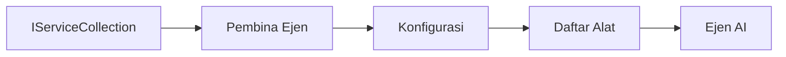

# 🎨 Corak Reka Bentuk Agentic dengan Azure OpenAI (API Respons) (.NET)

## 📋 Objektif Pembelajaran

Contoh ini menunjukkan corak reka bentuk gred perusahaan untuk membina agen pintar menggunakan Microsoft Agent Framework dalam .NET dengan integrasi Azure OpenAI (API Respons). Anda akan mempelajari corak profesional dan pendekatan seni bina yang menjadikan agen bersedia untuk pengeluaran, boleh diselenggara, dan boleh diskalakan.

### Corak Reka Bentuk Enterprise

- 🏭 **Corak Kilang**: Penciptaan agen yang diseragamkan dengan suntikan kebergantungan
- 🔧 **Corak Pembina**: Konfigurasi dan penyediaan agen yang lancar
- 🧵 **Corak Selamat Benang**: Pengurusan perbualan serentak
- 📋 **Corak Repositori**: Pengurusan alat dan keupayaan yang teratur

## 🎯 Manfaat Seni Bina Khusus .NET

### Ciri-ciri Enterprise

- **Tepatan Jenis Kuat**: Pengesahan masa kompilasi dan sokongan IntelliSense
- **Suntikan Kebergantungan**: Integrasi bekas DI terbina dalam
- **Pengurusan Konfigurasi**: Pola IConfiguration dan Options
- **Async/Await**: Sokongan pengaturcaraan tak segerak kelas pertama

### Corak Bersedia untuk Pengeluaran

- **Integrasi Log**: ILogger dan sokongan pencatatan berstruktur
- **Pemeriksaan Kesihatan**: Pemantauan dan diagnosis terbina dalam
- **Pengesahan Konfigurasi**: Tepatan jenis kuat dengan anotasi data
- **Pengendalian Ralat**: Pengurusan pengecualian berstruktur

## 🔧 Seni Bina Teknikal

### Komponen Teras .NET

- **Microsoft.Extensions.AI**: Abstraksi perkhidmatan AI yang bersatu
- **Microsoft.Agents.AI**: Rangka kerja pengurusan agen perusahaan
- **Azure OpenAI (API Respons)**: Corak klien API berprestasi tinggi
- **Sistem Konfigurasi**: appsettings.json dan integrasi persekitaran

### Pelaksanaan Corak Reka Bentuk



## 🏗️ Corak Enterprise Ditunjukkan

### 1. **Corak Penciptaan**

- **Kilang Agen**: Penciptaan agen berpusat dengan konfigurasi konsisten
- **Corak Pembina**: API lancar untuk konfigurasi agen kompleks
- **Corak Tunggal**: Pengurusan sumber dan konfigurasi dikongsi
- **Suntikan Kebergantungan**: Pengikatan longgar dan kebolehujian

### 2. **Corak Perilaku**

- **Corak Strategi**: Strategi pelaksanaan alat boleh ditukar ganti
- **Corak Arahan**: Operasi agen yang disarungkan dengan undo/redo
- **Corak Pemerhati**: Pengurusan kitaran hayat agen berpandukan acara
- **Kaedah Templat**: Aliran kerja pelaksanaan agen yang distandardkan

### 3. **Corak Struktur**

- **Corak Penyesuai**: Lapisan integrasi Azure OpenAI (API Respons)
- **Corak Pereka Hias**: Peningkatan keupayaan agen
- **Corak Fasad**: Antara muka interaksi agen yang dipermudahkan
- **Corak Proksi**: Pemuatan malas dan penimbunan untuk prestasi

## 📚 Prinsip Reka Bentuk .NET

### Prinsip SOLID

- **Tanggungjawab Tunggal**: Setiap komponen mempunyai satu tujuan yang jelas
- **Terbuka/Tertutup**: Boleh dikembangkan tanpa pengubahsuaian
- **Penggantian Liskov**: Pelaksanaan alat berasaskan antara muka
- **Pengasingan Antara Muka**: Antara muka yang tertumpu dan padu
- **Pembalikan Kebergantungan**: Bergantung pada abstraksi, bukan konkrit

### Seni Bina Bersih

- **Lapisan Domain**: Abstraksi teras agen dan alat
- **Lapisan Aplikasi**: Pengurusan agen dan aliran kerja
- **Lapisan Infrastruktur**: Integrasi Azure OpenAI (API Respons) dan perkhidmatan luaran
- **Lapisan Penyampaian**: Interaksi pengguna dan format respons

## 🔒 Pertimbangan Enterprise

### Keselamatan

- **Pengurusan Kredensial**: Pengendalian kunci API yang selamat dengan IConfiguration
- **Pengesahan Input**: Tepatan jenis kuat dan pengesahan anotasi data
- **Sanitasi Output**: Pemprosesan dan penapisan respons yang selamat
- **Pencatatan Audit**: Penjejakan operasi menyeluruh

### Prestasi

- **Corak Async**: Operasi I/O tanpa penyekat
- **Pengumpulan Sambungan**: Pengurusan klien HTTP yang cekap
- **Penimbunan**: Penimbunan respons untuk prestasi lebih baik
- **Pengurusan Sumber**: Corak pelupusan dan pembersihan yang betul

### Skalabiliti

- **Keselamatan Benang**: Sokongan pelaksanaan agen serentak
- **Pengumpulan Sumber**: Penggunaan sumber yang cekap
- **Pengurusan Beban**: Had kadar dan pengendalian tekanan balik
- **Pemantauan**: Metrik prestasi dan pemeriksaan kesihatan

## 🚀 Pengeluaran Pengeluaran

- **Pengurusan Konfigurasi**: Tetapan khusus persekitaran
- **Strategi Log**: Pencatatan berstruktur dengan ID korelasi
- **Pengendalian Ralat**: Pengendalian pengecualian global dengan pemulihan yang betul
- **Pemantauan**: Wawasan aplikasi dan kaunter prestasi
- **Ujian**: Ujian unit, ujian integrasi, dan corak ujian beban

Sedia untuk membina agen pintar gred perusahaan dengan .NET? Mari kita bina sesuatu yang kukuh! 🏢✨

## 🚀 Bermula

### Prasyarat

- [SDK .NET 10](https://dotnet.microsoft.com/download/dotnet/10.0) atau lebih tinggi
- [Langganan Azure](https://azure.microsoft.com/free/) dengan sumber Azure OpenAI dan penyebaran model
- [Azure CLI](https://learn.microsoft.com/cli/azure/install-azure-cli) — daftar masuk dengan `az login`

### Pemboleh Ubah Persekitaran Diperlukan

```bash
# zsh/bash
export AZURE_OPENAI_ENDPOINT=https://<your-resource>.openai.azure.com
export AZURE_OPENAI_DEPLOYMENT=gpt-4.1-mini
# Kemudian log masuk supaya AzureCliCredential dapat mendapatkan token
az login
```

```powershell
# PowerShell
$env:AZURE_OPENAI_ENDPOINT = "https://<your-resource>.openai.azure.com"
$env:AZURE_OPENAI_DEPLOYMENT = "gpt-4.1-mini"
# Kemudian daftar masuk supaya AzureCliCredential boleh mendapatkan token
az login
```

### Kod Contoh

Untuk menjalankan contoh kod,

```bash
# zsh/bash
chmod +x ./03-dotnet-agent-framework.cs
./03-dotnet-agent-framework.cs
```

Atau menggunakan CLI dotnet:

```bash
dotnet run ./03-dotnet-agent-framework.cs
```

Lihat [`03-dotnet-agent-framework.cs`](../../../../03-agentic-design-patterns/code_samples/03-dotnet-agent-framework.cs) untuk kod lengkap.

```csharp
#!/usr/bin/dotnet run

#:package Microsoft.Extensions.AI@10.*
#:package Microsoft.Agents.AI.OpenAI@1.*-*
#:package Azure.AI.OpenAI@2.1.0
#:package Azure.Identity@1.13.1

using System.ComponentModel;

using Microsoft.Agents.AI;
using Microsoft.Extensions.AI;

using Azure.AI.OpenAI;
using Azure.Identity;

// Tool Function: Random Destination Generator
// This static method will be available to the agent as a callable tool
// The [Description] attribute helps the AI understand when to use this function
// This demonstrates how to create custom tools for AI agents
[Description("Provides a random vacation destination.")]
static string GetRandomDestination()
{
    // List of popular vacation destinations around the world
    // The agent will randomly select from these options
    var destinations = new List<string>
    {
        "Paris, France",
        "Tokyo, Japan",
        "New York City, USA",
        "Sydney, Australia",
        "Rome, Italy",
        "Barcelona, Spain",
        "Cape Town, South Africa",
        "Rio de Janeiro, Brazil",
        "Bangkok, Thailand",
        "Vancouver, Canada"
    };

    // Generate random index and return selected destination
    // Uses System.Random for simple random selection
    var random = new Random();
    int index = random.Next(destinations.Count);
    return destinations[index];
}

// Azure OpenAI with the Responses API (stable v1 endpoint). Sign in with `az login`.
var azureEndpoint = Environment.GetEnvironmentVariable("AZURE_OPENAI_ENDPOINT")
    ?? throw new InvalidOperationException("AZURE_OPENAI_ENDPOINT is not set.");
var deployment = Environment.GetEnvironmentVariable("AZURE_OPENAI_DEPLOYMENT") ?? "gpt-4.1-mini";

var azureClient = new AzureOpenAIClient(new Uri(azureEndpoint), new AzureCliCredential());

// Define Agent Identity and Comprehensive Instructions
// Agent name for identification and logging purposes
var AGENT_NAME = "TravelAgent";

// Detailed instructions that define the agent's personality, capabilities, and behavior
// This system prompt shapes how the agent responds and interacts with users
var AGENT_INSTRUCTIONS = """
You are a helpful AI Agent that can help plan vacations for customers.

Important: When users specify a destination, always plan for that location. Only suggest random destinations when the user hasn't specified a preference.

When the conversation begins, introduce yourself with this message:
"Hello! I'm your TravelAgent assistant. I can help plan vacations and suggest interesting destinations for you. Here are some things you can ask me:
1. Plan a day trip to a specific location
2. Suggest a random vacation destination
3. Find destinations with specific features (beaches, mountains, historical sites, etc.)
4. Plan an alternative trip if you don't like my first suggestion

What kind of trip would you like me to help you plan today?"

Always prioritize user preferences. If they mention a specific destination like "Bali" or "Paris," focus your planning on that location rather than suggesting alternatives.
""";

// Create AI Agent with Advanced Travel Planning Capabilities
// Get the Responses client for the deployment and create the AI agent
// Configure agent with name, detailed instructions, and available tools
// This demonstrates the .NET agent creation pattern with full configuration
AIAgent agent = azureClient
    .GetChatClient(deployment)
    .AsAIAgent(
        name: AGENT_NAME,
        instructions: AGENT_INSTRUCTIONS,
        tools: [AIFunctionFactory.Create(GetRandomDestination)]
    );

// Create New Conversation Session for Context Management
// Initialize a new conversation session to maintain context across multiple interactions
// Sessions enable the agent to remember previous exchanges and maintain conversational state
// This is essential for multi-turn conversations and contextual understanding
var session = await agent.CreateSessionAsync();

// Execute Agent: First Travel Planning Request
// Run the agent with an initial request that will likely trigger the random destination tool
// The agent will analyze the request, use the GetRandomDestination tool, and create an itinerary
// Using the session parameter maintains conversation context for subsequent interactions
await foreach (var update in agent.RunStreamingAsync("Plan me a day trip", session))
{
    await Task.Delay(10);
    Console.Write(update);
}

Console.WriteLine();

// Execute Agent: Follow-up Request with Context Awareness
// Demonstrate contextual conversation by referencing the previous response
// The agent remembers the previous destination suggestion and will provide an alternative
// This showcases the power of conversation sessions and contextual understanding in .NET agents
await foreach (var update in agent.RunStreamingAsync("I don't like that destination. Plan me another vacation.", session))
{
    await Task.Delay(10);
    Console.Write(update);
}
```

---

<!-- CO-OP TRANSLATOR DISCLAIMER START -->
**Penafian**:
Dokumen ini telah diterjemahkan menggunakan perkhidmatan terjemahan AI [Co-op Translator](https://github.com/Azure/co-op-translator). Walaupun kami berusaha untuk ketepatan, sila ambil maklum bahawa terjemahan automatik mungkin mengandungi kesilapan atau ketidaktepatan. Dokumen asal dalam bahasa asalnya harus dianggap sebagai sumber yang sahih. Untuk maklumat penting, terjemahan oleh manusia profesional adalah disyorkan. Kami tidak bertanggungjawab terhadap sebarang salah faham atau salah tafsir yang timbul daripada penggunaan terjemahan ini.
<!-- CO-OP TRANSLATOR DISCLAIMER END -->