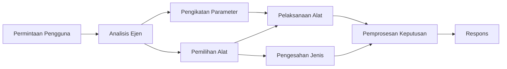

# 🛠️ Penggunaan Alat Lanjutan dengan Azure OpenAI (Responses API) (.NET)

## 📋 Objektif Pembelajaran

Nota ini menunjukkan corak integrasi alat tahap perniagaan menggunakan Microsoft Agent Framework dalam .NET dengan Azure OpenAI (Responses API). Anda akan belajar membina agen canggih dengan pelbagai alat khusus, memanfaatkan penguatkuasaan jenis kuat C# dan ciri perusahaan .NET.

### Kebolehan Alat Lanjutan yang Akan Anda Kuasai

- 🔧 **Seni Bina Berbilang Alat**: Membina agen dengan pelbagai keupayaan khusus
- 🎯 **Pelaksanaan Alat Selamat Jenis**: Memanfaatkan pengesahan masa kompilasi C#
- 📊 **Corak Alat Perusahaan**: Reka bentuk alat sedia produksi dan pengendalian ralat
- 🔗 **Komposisi Alat**: Menggabungkan alat untuk aliran kerja perniagaan kompleks

## 🎯 Manfaat Seni Bina Alat .NET

### Ciri-Ciri Alat Perusahaan

- **Pengesahan Masa Kompilasi**: Penguatkuasaan jenis kuat memastikan ketepatan parameter alat
- **Penyuntikan Kebergantungan**: Integrasi bekas IoC untuk pengurusan alat
- **Corak Async/Await**: Pelaksanaan alat tanpa blok dengan pengurusan sumber yang betul
- **Peregistrasian Berstruktur**: Integrasi peregistrasian terbenam untuk pemantauan pelaksanaan alat

### Corak Sedia Produksi

- **Pengendalian Pengecualian**: Pengurusan ralat menyeluruh dengan pengecualian berjenis
- **Pengurusan Sumber**: Corak pelupusan dan pengurusan memori yang betul
- **Pemantauan Prestasi**: Metrik terbenam dan penunjuk prestasi
- **Pengurusan Konfigurasi**: Konfigurasi selamat jenis dengan pengesahan

## 🔧 Seni Bina Teknikal

### Komponen Teras Alat .NET

- **Microsoft.Extensions.AI**: Lapisan abstraksi alat yang bersatu
- **Microsoft.Agents.AI**: Orkestrasi alat tahap perusahaan
- **Azure OpenAI (Responses API)**: Klien API berprestasi tinggi dengan pengumpulan sambungan

### Saluran Pelaksanaan Alat



## 🛠️ Kategori & Corak Alat

### 1. **Alat Pemprosesan Data**

- **Pengesahan Input**: Penguatkuasaan jenis kuat dengan anotasi data
- **Operasi Transformasi**: Penukaran dan pemformatan data selamat jenis
- **Logik Perniagaan**: Alat pengiraan dan analisis domain khusus
- **Pemformatan Output**: Penjanaan tindak balas berstruktur

### 2. **Alat Integrasi** 

- **Penyambung API**: Integrasi perkhidmatan RESTful dengan HttpClient
- **Alat Pangkalan Data**: Integrasi Entity Framework untuk capaian data
- **Operasi Fail**: Operasi sistem fail selamat dengan pengesahan
- **Perkhidmatan Luaran**: Corak integrasi perkhidmatan pihak ketiga

### 3. **Alat Utiliti**

- **Pemprosesan Teks**: Utiliti manipulasi rentetan dan pemformatan
- **Operasi Tarikh/Masa**: Pengiraan tarikh/masa sedar budaya
- **Alat Matematik**: Pengiraan ketepatan dan operasi statistik
- **Alat Pengesahan**: Pengesahan peraturan perniagaan dan verifikasi data

Sedia untuk membina agen tahap perusahaan dengan kebolehan alat kuat dan selamat jenis dalam .NET? Mari kita bina penyelesaian tahap profesional! 🏢⚡

## 🚀 Memulakan

### Prasyarat

- [SDK .NET 10](https://dotnet.microsoft.com/download/dotnet/10.0) atau yang lebih tinggi
- [Langganan Azure](https://azure.microsoft.com/free/) dengan sumber Azure OpenAI dan penempatan model
- [Azure CLI](https://learn.microsoft.com/cli/azure/install-azure-cli) — masuk dengan `az login`

### Pembolehubah Persekitaran Diperlukan

```bash
# zsh/bash
export AZURE_OPENAI_ENDPOINT=https://<your-resource>.openai.azure.com
export AZURE_OPENAI_DEPLOYMENT=gpt-4.1-mini
# Kemudian log masuk supaya AzureCliCredential boleh dapatkan token
az login
```

```powershell
# PowerShell
$env:AZURE_OPENAI_ENDPOINT = "https://<your-resource>.openai.azure.com"
$env:AZURE_OPENAI_DEPLOYMENT = "gpt-4.1-mini"
# Kemudian log masuk supaya AzureCliCredential boleh mendapatkan token
az login
```

### Kod Contoh

Untuk menjalankan contoh kod,

```bash
# zsh/bash
chmod +x ./04-dotnet-agent-framework.cs
./04-dotnet-agent-framework.cs
```

Atau menggunakan CLI dotnet:

```bash
dotnet run ./04-dotnet-agent-framework.cs
```

Lihat [`04-dotnet-agent-framework.cs`](../../../../04-tool-use/code_samples/04-dotnet-agent-framework.cs) untuk kod lengkap.

```csharp
#!/usr/bin/dotnet run

#:package Microsoft.Extensions.AI@10.*
#:package Microsoft.Agents.AI.OpenAI@1.*-*
#:package Azure.AI.OpenAI@2.1.0
#:package Azure.Identity@1.13.1

using System.ComponentModel;

using Microsoft.Agents.AI;
using Microsoft.Extensions.AI;

using Azure.AI.OpenAI;
using Azure.Identity;

// Tool Function: Random Destination Generator
// This static method will be available to the agent as a callable tool
// The [Description] attribute helps the AI understand when to use this function
// This demonstrates how to create custom tools for AI agents
[Description("Provides a random vacation destination.")]
static string GetRandomDestination()
{
    // List of popular vacation destinations around the world
    // The agent will randomly select from these options
    var destinations = new List<string>
    {
        "Paris, France",
        "Tokyo, Japan",
        "New York City, USA",
        "Sydney, Australia",
        "Rome, Italy",
        "Barcelona, Spain",
        "Cape Town, South Africa",
        "Rio de Janeiro, Brazil",
        "Bangkok, Thailand",
        "Vancouver, Canada"
    };

    // Generate random index and return selected destination
    // Uses System.Random for simple random selection
    var random = new Random();
    int index = random.Next(destinations.Count);
    return destinations[index];
}

// Azure OpenAI with the Responses API (stable v1 endpoint). Sign in with `az login`.
var azureEndpoint = Environment.GetEnvironmentVariable("AZURE_OPENAI_ENDPOINT")
    ?? throw new InvalidOperationException("AZURE_OPENAI_ENDPOINT is not set.");
var deployment = Environment.GetEnvironmentVariable("AZURE_OPENAI_DEPLOYMENT") ?? "gpt-4.1-mini";

var azureClient = new AzureOpenAIClient(new Uri(azureEndpoint), new AzureCliCredential());

// Define Agent Identity and Comprehensive Instructions
// Agent name for identification and logging purposes
var AGENT_NAME = "TravelAgent";

// Detailed instructions that define the agent's personality, capabilities, and behavior
// This system prompt shapes how the agent responds and interacts with users
var AGENT_INSTRUCTIONS = """
You are a helpful AI Agent that can help plan vacations for customers.

Important: When users specify a destination, always plan for that location. Only suggest random destinations when the user hasn't specified a preference.

When the conversation begins, introduce yourself with this message:
"Hello! I'm your TravelAgent assistant. I can help plan vacations and suggest interesting destinations for you. Here are some things you can ask me:
1. Plan a day trip to a specific location
2. Suggest a random vacation destination
3. Find destinations with specific features (beaches, mountains, historical sites, etc.)
4. Plan an alternative trip if you don't like my first suggestion

What kind of trip would you like me to help you plan today?"

Always prioritize user preferences. If they mention a specific destination like "Bali" or "Paris," focus your planning on that location rather than suggesting alternatives.
""";

// Create AI Agent with Advanced Travel Planning Capabilities
// Get the Responses client for the deployment and create the AI agent
// Configure agent with name, detailed instructions, and available tools
// This demonstrates the .NET agent creation pattern with full configuration
AIAgent agent = azureClient
    .GetChatClient(deployment)
    .AsAIAgent(
        name: AGENT_NAME,
        instructions: AGENT_INSTRUCTIONS,
        tools: [AIFunctionFactory.Create(GetRandomDestination)]
    );

// Create New Conversation Session for Context Management
// Initialize a new conversation session to maintain context across multiple interactions
// Sessions enable the agent to remember previous exchanges and maintain conversational state
// This is essential for multi-turn conversations and contextual understanding
await using var session = await agent.CreateSessionAsync();

// Execute Agent: First Travel Planning Request
// Run the agent with an initial request that will likely trigger the random destination tool
// The agent will analyze the request, use the GetRandomDestination tool, and create an itinerary
// Using the session parameter maintains conversation context for subsequent interactions
await foreach (var update in agent.RunStreamingAsync("Plan me a day trip", session))
{
    await Task.Delay(10);
    Console.Write(update);
}

Console.WriteLine();

// Execute Agent: Follow-up Request with Context Awareness
// Demonstrate contextual conversation by referencing the previous response
// The agent remembers the previous destination suggestion and will provide an alternative
// This showcases the power of conversation sessions and contextual understanding in .NET agents
await foreach (var update in agent.RunStreamingAsync("I don't like that destination. Plan me another vacation.", session))
{
    await Task.Delay(10);
    Console.Write(update);
}
```

---

<!-- CO-OP TRANSLATOR DISCLAIMER START -->
**Penafian**:
Dokumen ini telah diterjemahkan menggunakan perkhidmatan terjemahan AI [Co-op Translator](https://github.com/Azure/co-op-translator). Walaupun kami berusaha untuk ketepatan, sila ambil maklum bahawa terjemahan automatik mungkin mengandungi kesilapan atau ketidaktepatan. Dokumen asal dalam bahasa asalnya harus dianggap sebagai sumber yang sahih. Untuk maklumat penting, terjemahan oleh manusia profesional adalah disyorkan. Kami tidak bertanggungjawab terhadap sebarang salah faham atau salah tafsir yang timbul daripada penggunaan terjemahan ini.
<!-- CO-OP TRANSLATOR DISCLAIMER END -->