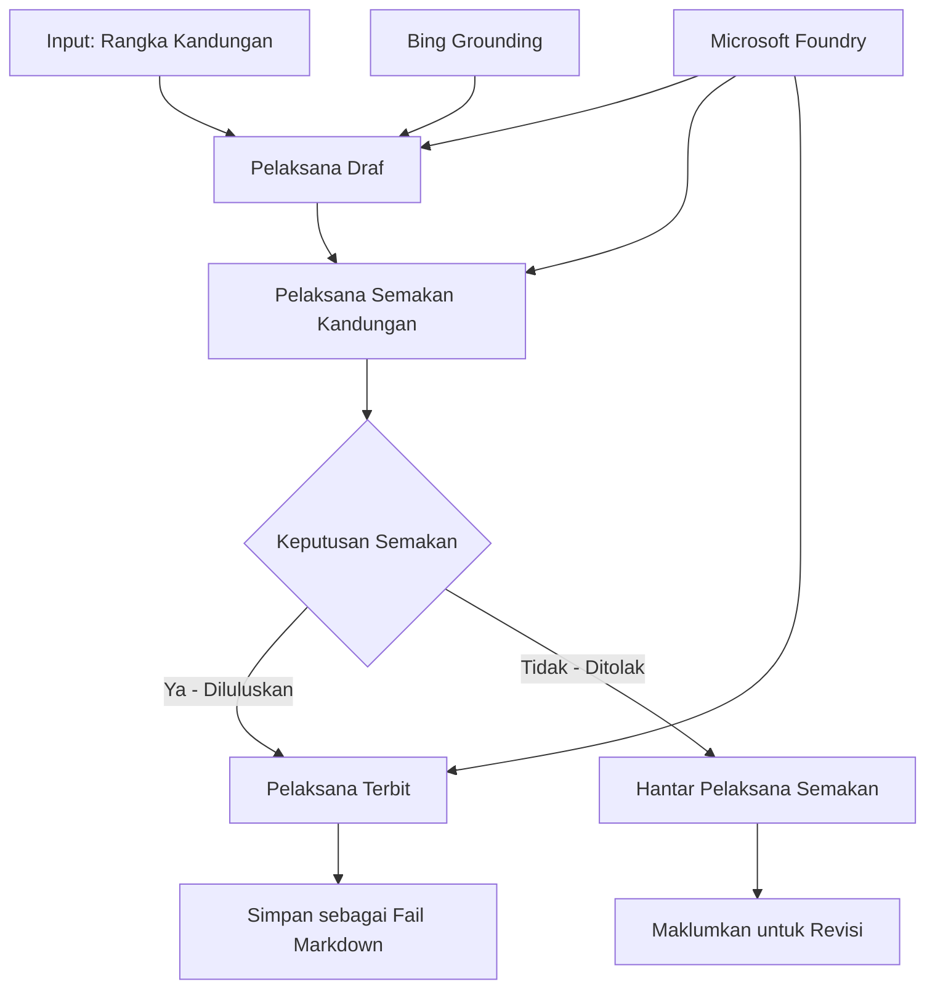

# 🔀 Aliran Kerja Ejen Bersyarat dengan Microsoft Foundry (.NET)

## 📋 Tutorial Aliran Kerja Berasaskan Keputusan Pintar

Nota ini menunjukkan **corak aliran kerja bersyarat** menggunakan Microsoft Foundry dan Microsoft Agent Framework untuk .NET. Anda akan belajar cara membina aliran kerja kompleks yang dipacu oleh keputusan yang mengarahkan pemprosesan secara pintar berdasarkan analisis AI, peraturan perniagaan, dan syarat dinamik untuk automasi bertaraf perusahaan.

## 🎯 Objektif Pembelajaran

### 🧠 **Seni Bina Keputusan Pintar**
- **Pelaksanaan Logik Bersyarat**: Membina pokok keputusan kompleks dengan pelbagai cabang
- **Penghalaan Berkuasa AI**: Gunakan model Microsoft Foundry untuk membuat keputusan penghalaan pintar
- **Penyesuaian Aliran Kerja Dinamik**: Ubah tingkah laku aliran kerja berdasarkan analisis dan syarat masa nyata
- **Integrasi Peraturan Perusahaan**: Masukkan logik perniagaan dan keperluan pematuhan ke dalam aliran kerja

### 🔀 **Corak Bersyarat Lanjutan**
- **Pengambilan Keputusan Berbilang Kriteria**: Menilai pelbagai faktor untuk keputusan penghalaan
- **Pemprosesan Berdasarkan Konteks**: Membuat keputusan berdasarkan konteks dan sejarah aliran kerja terkumpul
- **Pengubahsuaian Aliran Kerja Adaptif**: Menyesuaikan laluan pemprosesan secara dinamik berdasarkan syarat masa nyata
- **Integrasi Enjin Peraturan**: Melaksanakan enjin peraturan perniagaan yang canggih dalam aliran kerja

### 🏢 **Aplikasi Bersyarat Perusahaan**
- **Pengelasan & Penghalaan Dokumen**: Secara automatik mengelas dan menghala dokumen ke aliran kerja sesuai
- **Triase Perkhidmatan Pelanggan**: Penghalaan pintar pertanyaan pelanggan ke pasukan pengendalian khusus
- **Pemprosesan Pematuhan & Risiko**: Memohon proses pengesahan dan semakan yang berbeza berdasarkan penilaian risiko
- **Aliran Kerja Jaminan Kualiti**: Menghala kandungan melalui proses semakan yang sesuai berdasarkan metrik kualiti

## ⚙️ Prasyarat & Persediaan

### 📦 **Pakej NuGet Diperlukan**

Pakej lanjutan untuk pemprosesan aliran kerja bersyarat:

```xml
<!-- Core AI Framework -->
<PackageReference Include="Microsoft.Extensions.AI" Version="9.9.0" />

<!-- Azure AI Agents with Persistent State -->
<PackageReference Include="Azure.AI.Agents.Persistent" Version="1.2.0-beta.5" />

<!-- Azure Identity and Utilities -->
<PackageReference Include="Azure.Identity" Version="1.15.0" />
<PackageReference Include="System.Linq.Async" Version="6.0.3" />
<PackageReference Include="DotNetEnv" Version="3.1.1" />

<!-- Local Workflow Framework References -->
<!-- Microsoft.Agents.Workflows.dll - Advanced workflow orchestration -->
<!-- Microsoft.Agents.AI.AzureAI.dll - Microsoft Foundry integration -->
<!-- Microsoft.Agents.AI.dll - Core agent abstractions -->
```

### 🔑 **Konfigurasi Microsoft Foundry**

**Sumber Azure Diperlukan:**
- Ruang kerja Microsoft Foundry dengan model pemprosesan bersyarat
- Langganan Azure dengan kuota pengiraan dan kebenaran yang sesuai
- Model AI yang dikerahkan untuk membuat keputusan dan analisis kandungan
- (Pilihan) Sambungan API Bing Search untuk kebolehan pembumian

**Konfigurasi Persekitaran (fail .env):**
```env
# Microsoft Foundry Configuration
AZURE_AI_PROJECT_ENDPOINT=https://your-project.cognitiveservices.azure.com/
BING_CONNECTION_ID=your-bing-connection-id
```

**Persediaan Pengesahan:**
```csharp
// Azure CLI or Managed Identity authentication
using Azure.Identity;
var credential = new AzureCliCredential();

// Load environment configuration
DotNetEnv.Env.Load("../../../.env");
```

### 🏗️ **Seni Bina Aliran Kerja Bersyarat**



**Komponen Utama:**
- **Pelaksana Draf**: Ejen AI yang mencipta draf kandungan awal daripada rangka
- **Pelaksana Semakan Kandungan**: Ejen AI yang menilai kualiti dan pematuhan draf
- **Penghalaan Bersyarat**: Logik keputusan yang menghala berdasarkan keputusan semakan
- **Laluan Terbit/Semak**: Laluan pemprosesan berasingan untuk kandungan yang diluluskan vs ditolak
- **Pengurusan Keadaan**: Menyelenggara konteks kandungan dan semakan sepanjang aliran kerja

## 🎨 **Corak Reka Bentuk Aliran Kerja Bersyarat**

### 📋 **Penghasilan Kandungan dengan Pintu Kualiti**
```
Outline → Draft Creation → Quality Review → {Approve: Publish | Reject: Revise}
```

### 🎯 **Pemprosesan Dokumen Berasaskan Risiko**
```
Document → Risk Assessment → {Low: Standard | High: Enhanced Review}
```

### 🔍 **Penghalaan Perkhidmatan Pelanggan Pintar**
```
Customer Query → Analysis → {Simple: FAQ Bot | Complex: Human Agent}
```

### 💼 **Aliran Kerja Berdasarkan Pematuhan**
```
Content → Compliance Check → {Pass: Publish | Fail: Legal Review}
```

## 🏢 **Manfaat Bersyarat Perusahaan**

### 🎯 **Automasi Pintar**
- **Pengambilan Keputusan Pintar**: Keputusan penghalaan dipacu AI berdasarkan analisis kandungan dan konteks
- **Pemprosesan Adaptif**: Aliran kerja yang menyesuaikan secara automatik berdasarkan syarat berubah
- **Penguatkuasaan Peraturan Perniagaan**: Permohonan automatik logik perniagaan dan polisi kompleks
- **Penghalaan Berdasarkan Konteks**: Keputusan berpandukan sejarah aliran kerja lengkap dan konteks terkumpul

### 📈 **Kecemerlangan Operasi**
- **Pengagihan Sumber Optimum**: Menghala kerja kepada pakar dan proses yang paling sesuai
- **Pengurangan Campur Tangan Manual**: Keputusan automatik meminimumkan keperluan penghalaan manusia
- **Masa Penyelesaian Lebih Cepat**: Penghalaan terus kepada kepakaran dan kemampuan pemprosesan yang sesuai
- **Permohonan Konsisten**: Permohonan seragam peraturan perniagaan dan kriteria keputusan

### 🛡️ **Pengurusan Risiko & Pematuhan**
- **Penilaian Risiko Automatik**: Penilaian kandungan dan tahap risiko situasi berpandukan AI
- **Penguatkuasaan Pematuhan**: Penghalaan automatik melalui proses peraturan yang diperlukan
- **Permohonan Protokol Keselamatan**: Langkah keselamatan ditingkatkan diterapkan berdasarkan penilaian risiko
- **Penyelenggaraan Jejak Audit**: Dokumentasi lengkap keputusan penghalaan dan rasional

### 📊 **Analitik & Penambahbaikan Berterusan**
- **Analitik Keputusan**: Jejak keberkesanan dan ketepatan keputusan penghalaan
- **Pengecaman Corak**: Kenal pasti trend dan corak dalam keputusan penghalaan dari semasa ke semasa
- **Pengoptimuman Prestasi**: Penambahbaikan berterusan kriteria keputusan dan kecekapan penghalaan
- **Kecerdasan Perniagaan**: Pandangan mengenai ciri kandungan dan keperluan pemprosesan

### 🔧 **Kecemerlangan Teknikal**
- **Pengurusan Keadaan Kekal**: Menyelenggara keadaan kompleks merentasi pelaksanaan aliran kerja
- **Seni Bina Skala Besar**: Menangani keperluan pemprosesan bersyarat bervolume tinggi
- **Keupayaan Integrasi**: Integrasi lancar dengan sistem dan proses perniagaan sedia ada
- **Pemantauan & Kebolehlihatan**: Penjejakan komprehensif prestasi aliran kerja dan keputusan

Mari bina aliran kerja perusahaan yang dipacu keputusan pintar dengan .NET! 🚀

## 💻 Menjalankan Kod

Pelaksanaan lengkap tersedia dalam `04.dotnet-agent-framework-workflow-aifoundry-condition.cs`. Ini menunjukkan **aliran kerja penghasilan kandungan dengan pintu kualiti**:

### 🏗️ **Seni Bina Aliran Kerja**

```
Content Outline → Draft Creation → Quality Review → Conditional Routing:
                                                      ├─ Approved (>200 words) → Publish
                                                      └─ Rejected (<200 words) → Review Notification
```

**Ejen dalam Aliran Kerja:**
1. **Ejen Evangelist**: Mencipta draf tutorial dari rangka dengan pembumian Bing
2. **Ejen Penilai Kandungan**: Menilai kualiti draf (jumlah perkataan, kelengkapan)
3. **Ejen Penerbit**: Menyimpan kandungan diluluskan sebagai fail Markdown bertarikh

**Pelaksana Khusus:**
1. **DraftExecutor**: Mengatur penciptaan draf
2. **ContentReviewExecutor**: Melaksanakan penilaian kualiti
3. **PublishExecutor**: Mengendalikan penerbitan kandungan diluluskan
4. **SendReviewExecutor**: Mengurus notifikasi kandungan yang ditolak

### 🚀 Menjalankan Contoh

**Prasyarat:**
- Ruang kerja Microsoft Foundry dikonfigurasi
- Pengesahan Azure CLI (`az login`)
- (Pilihan) Sambungan Bing Search untuk pembumian

```bash
# Jadikan skrip boleh dilaksanakan (Unix/Linux/macOS)
chmod +x 04.dotnet-agent-framework-workflow-aifoundry-condition.cs

# Jalankan aliran kerja bersyarat
./04.dotnet-agent-framework-workflow-aifoundry-condition.cs
```

Atau pada Windows:
```powershell
dotnet run 04.dotnet-agent-framework-workflow-aifoundry-condition.cs
```

### 📝 Output Dijangka

Aliran kerja akan:
1. **Cipta Ejen**: Mulakan tiga ejen Microsoft Foundry khusus
2. **Hasilkan Draf**: Ejen evangelist mencipta draf tutorial dari rangka
3. **Semak Kandungan**: Penilai kandungan menilai kualiti draf
4. **Penghalaan Bersyarat**:
   - **Jika diluluskan (>200 perkataan)**: Pelaksana penerbit menyimpan sebagai fail Markdown
   - **Jika ditolak (<200 perkataan)**: Hantar notifikasi semakan
5. **Papar Keputusan**: Tunjukkan hasil akhir aliran kerja

### 🔧 Pilihan Penyesuaian

**Ubah Kriteria Semakan:**
```csharp
const string ContentReviewerInstructions = @"
You are a content reviewer...
1. Check if content is more than 500 words (instead of 200)
2. Verify technical accuracy
3. Ensure proper formatting
...";
```

**Tambah Laluan Bersyarat Lebih Banyak:**
```csharp
var workflow = new WorkflowBuilder(draftExecutor)
    .AddEdge(draftExecutor, contentReviewerExecutor)
    .AddEdge(contentReviewerExecutor, publishExecutor, condition: GetCondition("Excellent"))
    .AddEdge(contentReviewerExecutor, editExecutor, condition: GetCondition("Good"))
    .AddEdge(contentReviewerExecutor, sendReviewerExecutor, condition: GetCondition("Poor"))
    .Build();
```

**Tukar Keperluan Kandungan:**
```csharp
string OUTLINE_Content = @"
# Your Custom Topic
## Section 1
https://your-reference-url
## Section 2
...
";
```

### 🎯 Aplikasi Dunia Sebenar

Corak aliran kerja bersyarat ini sesuai untuk:
- **Sistem Pengurusan Kandungan**: Aliran kerja editorial automatik dengan pintu kualiti
- **Pemprosesan Dokumen**: Menghala dokumen berdasarkan pengelasan dan pematuhan
- **Sokongan Pelanggan**: Penghalaan tiket pintar berdasarkan kerumitan dan keutamaan
- **Semakan Undang-undang**: Menghala kontrak berdasarkan penilaian risiko dan nilai
- **Proses HR**: Menghala permohonan melalui aliran kerja saringan yang sesuai

### 🔍 Memahami Logik Bersyarat

**Fungsi Keadaan:**
```csharp
public Func<object?, bool> GetCondition(string expectedResult) =>
    reviewResult => reviewResult is ReviewResult review && review.Result == expectedResult;
```

Fungsi ini mencipta predikat yang:
1. Memeriksa jika hasil adalah jenis `ReviewResult`
2. Membandingkan sifat `Result` dengan nilai dijangka
3. Mengembalikan benar/palsu untuk menentukan penghalaan

**Hujung Aliran Kerja dengan Syarat:**
```csharp
.AddEdge(contentReviewerExecutor, publishExecutor, condition: GetCondition("Yes"))
.AddEdge(contentReviewerExecutor, sendReviewerExecutor, condition: GetCondition("No"))
```

### 📊 Ciri Lanjutan

**Pengesahan Skema JSON:**
Aliran kerja menggunakan skema JSON untuk memastikan respons berstruktur:

```csharp
// Define response structure
public class ReviewResult
{
    [JsonPropertyName("review_result")]
    public string Result { get; set; } = string.Empty;
    
    [JsonPropertyName("reason")]
    public string Reason { get; set; } = string.Empty;
    
    [JsonPropertyName("draft_content")]
    public string DraftContent { get; set; } = string.Empty;
}

// Apply to agent
ResponseFormat = ChatResponseFormat.ForJsonSchema(
    AIJsonUtilities.CreateJsonSchema(typeof(ReviewResult)), 
    "ReviewResult", 
    "Review Result From DraftContent"
)
```

**Integrasi Pembumian Bing:**
Ejen Evangelist menggunakan pembumian Bing untuk mengakses maklumat masa nyata:

```csharp
var bingGroundingConfig = new BingGroundingSearchConfiguration(bing_conn_id);
BingGroundingToolDefinition bingGroundingTool = new(
    new BingGroundingSearchToolParameters([bingGroundingConfig])
);
```

Ini membolehkan ejen mengikuti URL dalam rangka dan mengekstrak maklumat terkini.

### 🛡️ Pengendalian Ralat

Aliran kerja termasuk pengendalian ralat kukuh untuk kandungan yang ditolak:
- Kegagalan semakan mencetus laluan alternatif
- Notifikasi menyediakan alasan penolakan yang jelas
- Kandungan disimpan untuk semakan semula

### 🔄 Memperluaskan Aliran Kerja

**Tambah Gelung Semakan Semula:**
Cipta gelung maklum balas yang menyusun semula kandungan secara automatik:

```csharp
.AddEdge(contentReviewerExecutor, publishExecutor, condition: GetCondition("Yes"))
.AddEdge(contentReviewerExecutor, draftExecutor, condition: GetCondition("No")) // Loop back
```

**Laksanakan Semakan Berperingkat:**
Tambah beberapa tahap semakan dengan kriteria berbeza:

```csharp
.AddEdge(draftExecutor, technicalReviewer)
.AddEdge(technicalReviewer, editorialReviewer, condition: GetCondition("TechPass"))
.AddEdge(editorialReviewer, publishExecutor, condition: GetCondition("EditPass"))
```

Corak aliran kerja bersyarat ini menyediakan asas untuk membina sistem automasi perusahaan pintar yang kompleks! 🚀

---

<!-- CO-OP TRANSLATOR DISCLAIMER START -->
**Penafian**:
Dokumen ini telah diterjemahkan menggunakan perkhidmatan terjemahan AI [Co-op Translator](https://github.com/Azure/co-op-translator). Walaupun kami berusaha untuk ketepatan, sila ambil maklum bahawa terjemahan automatik mungkin mengandungi kesilapan atau ketidaktepatan. Dokumen asal dalam bahasa asalnya harus dianggap sebagai sumber yang sahih. Untuk maklumat penting, terjemahan oleh manusia profesional adalah disyorkan. Kami tidak bertanggungjawab terhadap sebarang salah faham atau salah tafsir yang timbul daripada penggunaan terjemahan ini.
<!-- CO-OP TRANSLATOR DISCLAIMER END -->