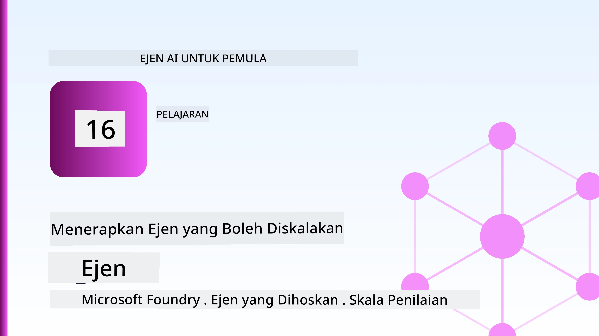
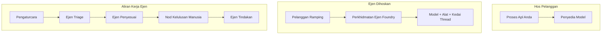
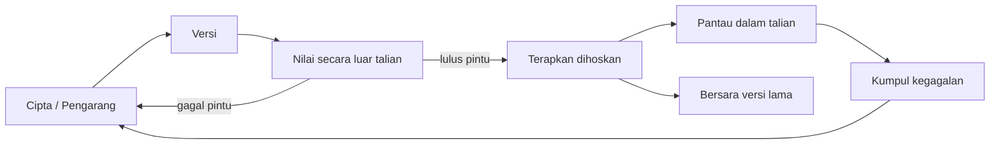
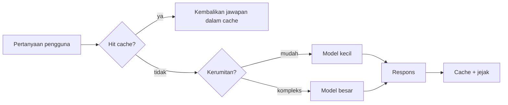
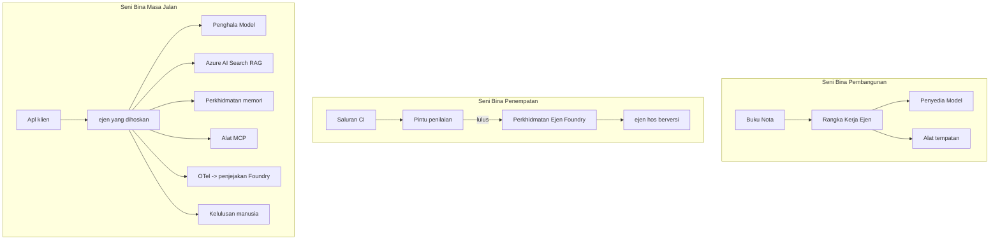

# Menjalankan Ejen Skala Besar dengan Microsoft Foundry



Sehingga titik ini dalam kursus, anda telah membina ejen yang berjalan di komputer riba anda, di dalam buku nota, dikawal oleh `az login` dan beberapa pembolehubah persekitaran. Itu adalah cara yang tepat untuk belajar. Ia bukan cara yang betul untuk menjalankan ejen yang bergantung pada ribuan pelanggan pada pukul 3 pagi.

Pelajaran ini mengenai jurang antara "ia berfungsi pada mesin saya" dan "ia berfungsi, dengan boleh dipercayai dan berpatutan, dalam pengeluaran." Kita menutup jurang itu menggunakan **Microsoft Foundry** dan **Perkhidmatan Ejen Microsoft Foundry**, dan kita melakukannya dengan membina ejen sokongan pelanggan sebenar yang mempunyai alat, pengambilan, memori, penilaian, dan pemantauan.

## Pengenalan

Pelajaran ini akan merangkumi:

- Perbezaan antara **ejen prototaip** dan **ejen yang dipasang**, dan kenapa peralihan itu kebanyakannya tentang segala sesuatu *di sekeliling* model.
- **Corak pemasangan** untuk ejen: dihoskan oleh klien, dihoskan perkhidmatan (Ejen Di hoskan), dan diorkestrasi aliran kerja.
- **Kitaran hayat ejen** di Microsoft Foundry — cipta, versi, pasang, nilaikan, perhatikan, bersara.
- **Strategi skala**: pengarahan model, caching, kebersamaan, dan reka bentuk tanpa keadaan.
- **Kebolehlihatan** dengan OpenTelemetry dan penjejakan Foundry.
- **Pengoptimuman kos** melalui pemilihan model, pengarahan, dan pintu penilaian.
- **Pertimbangan perusahaan**: tadbir urus, kelulusan manusia, dan menjalankan pelayan MCP dengan selamat dalam pengeluaran.

## Matlamat Pembelajaran

Selepas menyiapkan pelajaran ini, anda akan tahu cara untuk:

- Memilih corak pemasangan yang sesuai untuk beban kerja ejen tertentu.
- Memasang ejen ke Perkhidmatan Ejen Microsoft Foundry supaya ia mempunyai versi, ditadbir, dan boleh diperhatikan.
- Melengkapi ejen untuk penjejakan dan menyambungkan saluran penilaian yang berjalan sebelum setiap pelepasan.
- Menggunakan pengarahan model dan caching untuk mengawal latensi dan kos pada skala besar.
- Menambah pintu kelulusan manusia untuk tindakan berisiko tinggi dan mengintegrasikan pelayan MCP dengan cara yang selamat untuk pengeluaran.

## Prasyarat

Pelajaran ini mengandaikan anda telah menyiapkan pelajaran sebelumnya dan selesa dengan:

- Membina ejen dengan [Microsoft Agent Framework](../14-microsoft-agent-framework/README.md) (Pelajaran 14).
- [Penggunaan Alat](../04-tool-use/README.md) (Pelajaran 4) dan [Agentic RAG](../05-agentic-rag/README.md) (Pelajaran 5).
- [Memori Ejen](../13-agent-memory/README.md) (Pelajaran 13) dan [Protokol Agentic / MCP](../11-agentic-protocols/README.md) (Pelajaran 11).
- [Kebolehlihatan dan Penilaian](../10-ai-agents-production/README.md) (Pelajaran 10) — pelajaran ini dibina terus di atasnya.

Anda juga memerlukan:

- **Langganan Azure** dan **projek Microsoft Foundry** dengan sekurang-kurangnya satu model sembang yang dipasang.
- **Azure CLI** telah diauthentikasi (`az login`).
- Python 3.12+ dan pakej dalam repositori [`requirements.txt`](../../../requirements.txt).

## Dari Prototaip ke Pengeluaran: Apa Yang Sebenarnya Berubah

Ejen prototaip dan ejen pengeluaran berkongsi gelung teras yang sama — berfikir, panggil alat, bertindak balas. Apa yang berubah adalah segala sesuatu di sekitar gelung itu. Model mungkin 20% daripada ejen pengeluaran; 80% lagi adalah rangka operasi.

| Kebimbangan | Prototaip | Pengeluaran |
| --- | --- | --- |
| **Penghosan** | Berjalan dalam buku nota anda | Berjalan sebagai perkhidmatan dihoskan, versi dan diedarkan |
| **Identiti** | Token `az login` anda | Identiti terurus dengan RBAC berjaiz |
| **Keadaan** | Dalam memori, hilang apabila dimulakan semula | Di luarkan (penyimpan benang, perkhidmatan memori) |
| **Kegagalan** | Anda melihat jejak balik | Cuba semula, gantian, surat mati, amaran |
| **Kos** | "Ia beberapa sen" | Dikesan setiap permintaan, diarahkan, disimpan dalam cache, diagihkan belanjawan |
| **Kualiti** | Anda memeriksa output | Dinilai secara automatik sebelum setiap pelepasan |
| **Kepercayaan** | Anda meluluskan setiap tindakan | Polisi + manusia dalam kitaran untuk tindakan berisiko |

Ingat jadual ini. Setiap bahagian di bawah memetakan kepada salah satu baris ini.

## Corak Pemasangan Ejen

Terdapat tiga corak yang akan anda gunakan, sering dalam gabungan.

### 1. Ejen Di hoskan Pelanggan

Objek ejen hidup di dalam proses aplikasi *anda*. Kod anda memanggil pembekal model secara langsung; gelung berfikir berjalan dalam perkhidmatan anda. Ini adalah apa yang setiap pelajaran sebelumnya telah lakukan.

- **Gunakan apabila** anda memerlukan kawalan penuh ke atas gelung, perisian perantaraan tersuai, atau anda menyematkan ejen di dalam backend yang sedia ada.
- **Tukar-tambah**: anda memiliki skala, keadaan, dan ketahanan sendiri.

### 2. Ejen Di hoskan (Perkhidmatan Ejen Foundry)

Ejen *didafarkan sebagai sumber* dalam Microsoft Foundry. Foundry menghoskan gelung berfikir, menyimpan benang, menguatkuasakan keselamatan kandungan dan RBAC, dan menjadikan ejen kelihatan dalam portal Foundry. Aplikasi anda menjadi klien nipis yang mencipta benang dan membaca respons.

- **Gunakan apabila** anda mahukan ketahanan, kebolehlihatan terbina dalam, tadbir urus, dan permukaan operasi yang lebih kecil.
- **Tukar-tambah**: kawalan peringkat rendah yang kurang sebagai pertukaran untuk runtime yang diurus.

### 3. Aliran Kerja Ejen

Pelbagai ejen (dan alat) disusun dalam graf dengan aliran kawalan yang jelas — langkah berurutan, cabang, nod kelulusan manusia, dan titik semakan tahan lama yang boleh berhenti dan sambung semula. Ini adalah keupayaan Microsoft Agent Framework **Workflows** yang digunakan pada skala pemasangan.

- **Gunakan apabila** satu tugas merangkumi beberapa ejen khusus atau memerlukan langkah kelulusan di tengah.
- **Tukar-tambah**: lebih banyak bahagian bergerak; memerlukan kebolehlihatan peringkat orkestrasi.



## Kitaran Hayat Ejen di Microsoft Foundry

Menjalankan ejen bukanlah `push` sekali sahaja. Ia adalah gelung, dan ia kelihatan sangat seperti kitaran pelepasan perisian kerana itulah sebenarnya.



Idea utama, dibawa dari [Pelajaran 10](../10-ai-agents-production/README.md): **penilaian luar talian adalah pintu, bukan sesuatu yang dianggap ringan.** Versi ejen baru tidak dihantar kecuali ia melepasi ambang penilaian anda. Kebolehlihatan dalam talian kemudian memberi makan kegagalan dunia sebenar ke dalam set ujian luar talian anda. Itulah keseluruhan gelung.

## Strategi Skala

Skala ejen berbeza dengan skala API web tanpa keadaan, kerana setiap permintaan boleh mencetuskan panggilan model dan alat yang mahal. Empat teknik membawa sebahagian besar beban.

**Pengendalian permintaan tanpa keadaan.** Jangan simpan keadaan setiap pengguna dalam memori proses anda. Simpan benang perbualan dalam stor benang Foundry atau perkhidmatan memori supaya mana-mana contoh boleh menangani permintaan. Ini membolehkan anda skala secara mendatar — tambah contoh, tiada sesi melekit.

**Pengarahan model.** Tidak setiap permintaan memerlukan model paling berupaya (dan paling mahal) anda. Pandu permintaan mudah — klasifikasi niat, jawapan fakta ringkas — ke model kecil yang pantas dan simpan model besar untuk pemikiran sebenar. **Pengarah Model** Foundry boleh lakukan ini untuk anda, atau anda boleh melaksanakan pengelasan ringan sendiri. Anda akan bina versi DIY dalam makmal.

**Caching respons.** Banyak pertanyaan sokongan hampir sama ("bagaimana saya menetapkan semula kata laluan saya?"). Cache jawapan kepada soalan biasa dan sajikan tanpa perlu ke model sama sekali. Walaupun kadar cache sederhana secara signifikan mengurangkan kos dan latensi.

**Kebersamaan dan tekanan balik.** Pembekal model mempunyai had kadar. Hadkan kebersamaan anda, gunakan cubaan semula dengan peningkatan eksponen, dan gagal dengan baik (respons "kami sedang mengurus" dalam antrian mengatasi 500).



## Kebolehlihatan dalam Pengeluaran

Anda tidak boleh mengendalikan apa yang anda tidak boleh lihat. Seperti yang dibincangkan dalam Pelajaran 10, Microsoft Agent Framework mengeluarkan jejak **OpenTelemetry** secara asli — setiap panggilan model, panggilan alat, dan langkah orkestrasi menjadi satu span. Dalam pengeluaran, anda eksport span ini ke Microsoft Foundry (atau backend yang serasi OTel) supaya anda boleh:

- Jejak satu aduan pelanggan dari hujung ke hujung di setiap panggilan model dan alat.
- Pantau latensi p50/p95 dan kos setiap permintaan dari masa ke masa.
- Amaran mengenai lonjakan kadar ralat dan anomali kos sebelum pengguna anda (atau pasukan kewangan anda) perasan.

```python
from agent_framework.observability import get_tracer

tracer = get_tracer()

with tracer.start_as_current_span("support_request") as span:
    span.set_attribute("customer.tier", "enterprise")
    span.set_attribute("routed.model", "gpt-5-nano")
    # pelaksanaan ejen dijejak secara automatik di dalam rentang ini
```

Atribut seperti `customer.tier` dan `routed.model` adalah apa yang menukar dinding jejak menjadi soalan boleh dijawab ("adakah pelanggan perusahaan terlalu kerap diarahkan ke model kecil?").

## Pengoptimuman Kos

Kos dalam ejen pengeluaran didominasi oleh token. Tiga tuas, mengikut kesan:

1. **Saizkan model dengan tepat.** Model kecil yang melepasi pintu penilaian anda hampir selalu lebih murah daripada model besar yang juga lulus. Gunakan penilaian untuk *membuktikan* model kecil cukup baik dan bukan secara lalai menggunakan model terbesar kerana berhati-hati.
2. **Pandu mengikut kerumitan.** Seperti di atas — hanya bayar harga model besar untuk permintaan yang memerlukan pemikiran model besar.
3. **Cache secara agresif.** Panggilan model termurah adalah yang anda tidak pernah buat.

Pintu penilaian dan kawalan kos adalah disiplin yang sama dilihat dari dua sudut: penilaian memberitahu anda *peringkat kualiti*, pengarahan dan caching memastikan anda sedekat mungkin dengan *kos* tahap itu.

## Pertimbangan Pemasangan Perusahaan

**Tadbir Urus.** Ejen Di hoskan mewarisi RBAC Foundry, keselamatan kandungan, dan log audit. Beri setiap ejen identiti terurus dengan keistimewaan terendah yang diperlukan — akses baca sahaja ke pangkalan pengetahuan, akses terhad ke API tiket, tiada lebih.

**Manusia dalam kitaran.** Sesetengah tindakan terlalu besar kesannya untuk diotomatik sepenuhnya — mengeluarkan bayaran balik, memadam akaun, mengeskalasi ke pasukan undang-undang. Microsoft Agent Framework menyokong alat **perlu kelulusan**: ejen mencadangkan tindakan, pelaksanaan berhenti, manusia meluluskan atau menolak, dan aliran kerja diteruskan. Anda telah lihat primitif ini dalam [Pelajaran 6](../06-building-trustworthy-agents/README.md); di sini anda pasangkannya.

**MCP dalam pengeluaran.** [MCP](../11-agentic-protocols/README.md) membolehkan ejen anda menggunakan alat luaran melalui antara muka standard. Dalam pengeluaran, anggap setiap pelayan MCP sebagai sempadan tidak dipercayai: pin versi pelayan, jalankan dengan identiti terhad, sahkan outputnya, dan jangan dedahkan rahsia kepadanya. Pelayan MCP adalah kebergantungan, dan kebergantungan perlu ditampal, diaudit, dan dikawal kadar.



Ketiga-tiga rajah itu — pembangunan, pemasangan, runtime — adalah ejen yang sama pada tiga peringkat hayatnya. Makmal yang berikut membawa anda membinanya.

## Makmal Praktikal: Ejen Sokongan Pelanggan Sedia untuk Pengeluaran

Buka [`code_samples/16-python-agent-framework.ipynb`](./code_samples/16-python-agent-framework.ipynb) dan kerjakan dari awal hingga akhir. Anda akan menggabungkan **ejen sokongan pelanggan Contoso** dengan setiap kebimbangan pengeluaran yang disambungkan:

1. **Panggilan alat** — semak status pesanan dan buka tiket sokongan.
2. **RAG** — jawab soalan polisi dari pangkalan pengetahuan (Azure AI Search, dengan fallback dalam memori supaya buku nota berjalan tanpa sumber Search).
3. **Memori** — ingat pelanggan merentasi giliran perbualan.
4. **Pengarahan model** — pengklasifikasi kerumitan mengarahkan setiap permintaan kepada model kecil atau besar.
5. **Caching respons** — soalan berulang dilayani dari cache.
6. **Kelulusan manusia** — bayaran balik di atas ambang berhenti untuk tandatangan manusia.
7. **Saluran penilaian** — set ujian kecil luar talian menilai ejen dan bertindak sebagai pintu pelepasan.
8. **Kebolehlihatan** — penjejakan OpenTelemetry di sekitar setiap permintaan.

### Panduan

Buku nota disusun supaya setiap kebimbangan pengeluaran adalah seksyen boleh jalankan yang berdiri sendiri. Intinya adalah pengendali permintaan pengarahan-dan-caching:

```python
async def handle_support_request(query: str, customer_id: str) -> str:
    # 1. Hidangkan dari cache apabila boleh.
    cached = response_cache.get(normalize(query))
    if cached:
        return cached

    # 2. Rute mengikut kerumitan untuk mengawal kos.
    model = "gpt-5-nano" if is_simple(query) else "gpt-5-mini"

    # 3. Jalankan agen di dalam ruang jejak untuk keterlihatan.
    with tracer.start_as_current_span("support_request") as span:
        span.set_attribute("routed.model", model)
        span.set_attribute("customer.id", customer_id)
        response = await support_agent.run(query, model=model)

    # 4. Cache dan pulangkan.
    response_cache.set(normalize(query), response.text)
    return response.text
```

Pintu penilaian yang menjaga pelepasan kelihatan seperti ini:

```python
async def evaluation_gate(agent, test_cases, threshold: float = 0.8) -> bool:
    passed = 0
    for case in test_cases:
        result = await agent.run(case["input"])
        if score_response(result.text, case["expected"]) >= 0.8:
            passed += 1
    pass_rate = passed / len(test_cases)
    print(f"Evaluation pass rate: {pass_rate:.0%} (gate: {threshold:.0%})")
    return pass_rate >= threshold  # hanya lancarkan jika pintu lulus
```

Baca setiap baris — buku nota mengekalkan primitif dengan saiz sengaja kecil supaya tiada apa tersembunyi di sebalik panggilan rangka kerja.

## Mengesah Ejen Terpasang dengan Ujian Asap

Pintu penilaian di atas dijalankan *luar talian* terhadap objek ejen anda. Setelah ejen dipasang sebagai Ejen Di hoskan, anda memerlukan satu lagi pemeriksaan yang lebih murah: **adakah titik akhir yang dipasang benar-benar menjawab?**

Memasang "berjaya" hanya membuktikan pesawat kawalan menerima definisi — ia tidak membuktikan ejen bertindak balas. Kebergantungan hilang, pengarahan model yang rosak, atau sambungan tamat boleh meninggalkan pemasangan hijau yang tidak mengembalikan apa-apa. **Ujian asap** menangkapnya dalam beberapa saat, setiap kali pasang, tanpa kos penilaian penuh.

Repositori ini menghantar saluran ujian asap siap guna yang dibina pada GitHub Action [AI Smoke Test](https://github.com/marketplace/actions/ai-smoke-test):

- **Katalog** — [`tests/lesson-16-smoke-tests.json`](../../../tests/lesson-16-smoke-tests.json) mengandungi arahan dan pernyataan untuk ejen sokongan Contoso (jawapan polisi berpandukan, pencarian pesanan, kekal pada topik, dan kesinambungan benang berbilang giliran). Katalog untuk ejen pelajaran lain hidup bersebelahan dengannya — lihat [`tests/README.md`](../tests/README.md).
- **Aliran Kerja** — [`.github/workflows/smoke-test.yml`](../../../.github/workflows/smoke-test.yml) log masuk dengan Azure OIDC dan POST setiap arahan ke titik akhir Respons ejen, gagal tugasan pada sebarang kesalahan pernyataan.

```yaml
- name: Smoke-test hosted agent
  uses: JFolberth/ai-smoketest@v1
  with:
    project_endpoint: ${{ inputs.project_endpoint }}
    agent_name: ContosoSupportAgent
    tests_file: tests/lesson-16-smoke-tests.json
```


Jalankan dari tab **Actions** setelah ejen anda dikerahkan, dengan membekalkan titik akhir projek Foundry dan nama ejen anda. Identiti federasi memerlukan peranan **Azure AI User** pada skop projek Foundry. Fikirkan lapisan seperti piramid: ujian asap (boleh dicapai dan memberi respons?) dijalankan pada setiap deployment, penilaian luar talian (cukup baik untuk dihantar?) dijalankan sebelum promosi, dan penilaian dalam talian (bagaimana prestasinya di dunia nyata?) dijalankan secara berterusan.

## Pemeriksaan Pengetahuan

Uji pemahaman anda sebelum beralih ke tugasan.

**1. Anggaran berapa banyak sebahagian daripada ejen pengeluaran adalah "model," dan apa yang selebihnya?**

<details>
<summary>Jawapan</summary>

Model adalah minoriti dalam sistem — sering dikatakan sekitar 20%. Selebihnya adalah kerangka operasi: hosting dan pengurusan versi, identiti dan RBAC, status yang diasingkan, pengurusan kegagalan, penjejakan kos, penilaian, dan kawalan manusia-dalam-lubang. Beralih ke pengeluaran kebanyakannya tentang membina segala-galanya *di sekitar* gelung penaakulan.
</details>

**2. Bila anda memilih Ejen Di-Host berbanding ejen dihoskan klien?**

<details>
<summary>Jawapan</summary>

Apabila anda mahukan runtime yang diurus dengan ketahanan terbina dalam (utas yang berterusan dan boleh disambung semula), pemerhatian, keselamatan kandungan, dan RBAC, dan anda bersedia menukar kawalan pada peringkat rendah gelung penaakulan untuk ruang operasi yang lebih kecil. Klien dihoskan lebih baik apabila anda memerlukan kawalan penuh ke atas gelung atau menyematkan ejen dalam backend sedia ada.
</details>

**3. Mengapa ejen yang boleh diskala harus tanpa status dalam memori prosesnya sendiri?**

<details>
<summary>Jawapan</summary>

Supaya mana-mana instans boleh mengendalikan mana-mana permintaan, yang membolehkan skala mendatar tanpa sesi melekit. Status perbualan setiap pengguna diasingkan ke stor utas atau perkhidmatan memori. Jika status disimpan dalam memori proses, anda akan kehilangannya semasa mulakan semula dan tidak dapat mengedarkan beban dengan bebas.
</details>

**4. Masalah apa yang diselesaikan oleh penghalaan model, dan bagaimana ia berkaitan dengan penilaian?**

<details>
<summary>Jawapan</summary>

Penghalaan menghantar permintaan mudah ke model kecil, murah, dan pantas dan memesan model besar untuk penaakulan sebenar, mengawal latensi dan kos. Ia berkaitan dengan penilaian kerana penilaian *membuktikan* model kecil cukup baik untuk kelas permintaan — penghalaan tanpa penilaian adalah meneka.
</details>

**5. Apakah "pintu keluar penilaian" dan di mana ia terletak dalam kitaran hayat?**

<details>
<summary>Jawapan</summary>

Pintu keluar penilaian menjalankan set ujian luar talian terhadap versi ejen baru dan menghalang penyebaran melainkan kadar lulus melepasi ambang. Ia terletak antara "versi" dan "sebar" dalam kitaran hayat, menjadikan kualiti sebagai prasyarat untuk pelepasan dan bukannya sesuatu yang diperiksa selepas penghantaran.
</details>

**6. Mengapa pelayan MCP mesti dianggap sebagai sempadan tidak dipercayai dalam pengeluaran?**

<details>
<summary>Jawapan</summary>

Kerana ia adalah pergantungan luaran yang dipanggil oleh ejen anda. Anda harus menetapkan versinya, jalankan dengan identiti yang berskop, sahkan hasilnya, hadkan kadar, dan jangan dedahkan rahsia kepadanya — disiplin yang sama diterapkan pada mana-mana pergantungan pihak ketiga. Hasilnya mengalir ke dalam penaakulan ejen anda, jadi kepercayaan tanpa pengesahan adalah risiko keselamatan.
</details>

**7. Perubahan tunggal mana biasanya paling memberi kesan kepada kos ejen pengeluaran, dan mengapa?**

<details>
<summary>Jawapan</summary>

Menyesuaikan saiz model — menggunakan model terkecil yang masih lulus pintu keluar penilaian anda. Kos didominasi oleh token, dan model yang lebih kecil yang memenuhi tahap kualiti hampir selalu lebih murah daripada yang lebih besar. Caching dan penghalaan kemudian mengurangkan kos lebih lanjut, tetapi memilih model asas yang tepat memberi kesan utama peringkat pertama.
</details>

**8. Peranan apakah atribut rentang seperti `customer.tier` dan `routed.model` dalam pemerhatian?**

<details>
<summary>Jawapan</summary>

Mereka mengubah jejak mentah menjadi soalan perniagaan yang boleh dijawab. Tanpa atribut anda hanya ada dinding rentang; dengan mereka anda boleh bertanya "adakah pelanggan perusahaan terlalu kerap diarahkan ke model kecil?" atau "model mana yang mengendalikan permintaan paling perlahan kami?" Atribut adalah cara anda memotong telemetri mengikut dimensi yang penting bagi operasi anda.
</details>

## Tugasan

Ambil ejen sokongan pelanggan dari makmal dan kukuhkan untuk senario tertentu: **ejen sokongan bil langganan untuk syarikat SaaS.**

Penyerahan anda harus:

1. **Gantikan alatan** dengan yang berkaitan dengan bil: `get_subscription_status`, `get_invoice`, dan `issue_credit` (kredit melebihi $50 memerlukan kelulusan manusia).
2. **Tambah tiga dokumen RAG** yang merangkumi polisi pemulangan syarikat, kitar bil, dan polisi pembatalan.
3. **Perluaskan set penilaian** kepada sekurang-kurangnya lapan kes, termasuk sekurang-kurangnya dua yang *harus* mencetuskan laluan kelulusan manusia, dan sahkan pintu keluar penilaian anda lulus atau gagal dengan betul.
4. **Tambah satu laporan kos**: selepas menjalankan sepuluh pertanyaan campuran melalui ejen, cetak berapa banyak yang pergi ke model kecil, berapa banyak ke model besar, dan berapa banyak yang disajikan dari cache.

Tulis perenggan pendek (dalam sel markdown) menerangkan peraturan penghalaan model yang anda pilih dan bagaimana anda akan mengesahkannya dengan trafik sebenar. Tiada jawapan tunggal yang betul — anda dinilai berdasarkan sama ada kebimbangan penghasilan disatukan secara koheren.

## Ringkasan

Dalam pelajaran ini anda memindahkan ejen dari prototaip ke pengeluaran dengan Microsoft Foundry:

- Lonjakan ke pengeluaran kebanyakkannya mengenai **kerangka operasi** di sekitar model — hosting, identiti, status, pengurusan kegagalan, kos, kualiti, dan kepercayaan.
- Anda mempelajari tiga **corak penyebaran** — klien dihoskan, Ejen Di-Host, dan Aliran Kerja Ejen — dan bila setiap satu sesuai.
- Anda mengikut **kitaran hayat ejen**, di mana penilaian luar talian **berfungsi sebagai pintu keluar pelepasan** dan pemerhatian dalam talian memberi maklum balas kegagalan ke set ujian.
- Anda menggunakan **strategi penyesuaian skala** — reka bentuk tanpa status, penghalaan model, caching, dan keserentakan terbatas — dan mengaitkannya dengan **pengoptimuman kos**.
- Anda menghubungkan **kawalan perusahaan**: RBAC, kelulusan manusia-dalam-lubang, dan integrasi MCP selamat dalam pengeluaran.
- Anda membina **ejen sokongan pelanggan bersedia pengeluaran** yang menggabungkan setiap kebimbangan ini dalam kod yang boleh dijalankan.

Pelajaran seterusnya mengambil perjalanan yang bertentangan: bukannya menyesuaikan ejen ke awan, anda akan membawanya *turun* ke mesin pembangun tunggal dan menjalankannya sepenuhnya secara tempatan.

## Sumber Tambahan

- <a href="https://learn.microsoft.com/azure/ai-foundry/what-is-azure-ai-foundry" target="_blank">Dokumentasi Microsoft Foundry</a>
- <a href="https://learn.microsoft.com/azure/ai-foundry/agents/overview" target="_blank">Tinjauan Perkhidmatan Ejen Microsoft Foundry</a>
- <a href="https://aka.ms/ai-agents-beginners/agent-framework" target="_blank">Rangka Kerja Ejen Microsoft</a>
- <a href="https://learn.microsoft.com/azure/ai-foundry/concepts/model-router" target="_blank">Penghala Model dalam Microsoft Foundry</a>
- <a href="https://learn.microsoft.com/azure/search/search-what-is-azure-search" target="_blank">Carian AI Azure</a>
- <a href="https://opentelemetry.io/" target="_blank">OpenTelemetry</a>
- <a href="https://github.com/marketplace/actions/ai-smoke-test" target="_blank">Tindakan AI Smoke Test GitHub</a>
- <a href="https://modelcontextprotocol.io/" target="_blank">Protokol Konteks Model (MCP)</a>

## Pelajaran Sebelumnya

[Membina Ejen Penggunaan Komputer (CUA)](../15-browser-use/README.md)

## Pelajaran Seterusnya

[Mewujudkan Ejen AI Tempatan](../17-creating-local-ai-agents/README.md)

---

<!-- CO-OP TRANSLATOR DISCLAIMER START -->
**Penafian**:
Dokumen ini telah diterjemahkan menggunakan perkhidmatan terjemahan AI [Co-op Translator](https://github.com/Azure/co-op-translator). Walaupun kami berusaha untuk ketepatan, sila ambil maklum bahawa terjemahan automatik mungkin mengandungi kesilapan atau ketidaktepatan. Dokumen asal dalam bahasa asalnya harus dianggap sebagai sumber yang sahih. Untuk maklumat penting, terjemahan oleh manusia profesional adalah disyorkan. Kami tidak bertanggungjawab terhadap sebarang salah faham atau salah tafsir yang timbul daripada penggunaan terjemahan ini.
<!-- CO-OP TRANSLATOR DISCLAIMER END -->