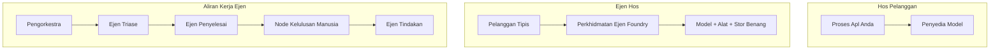
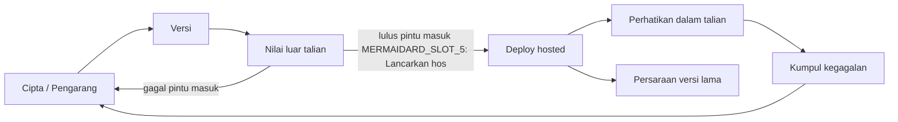
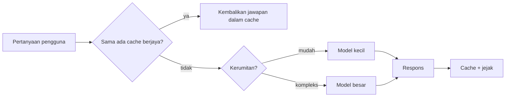
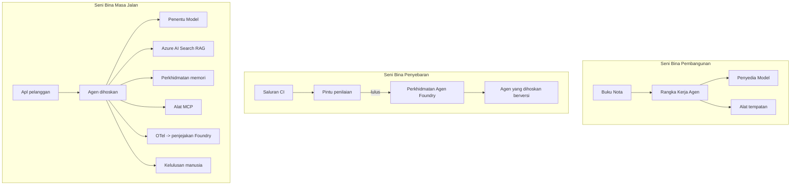

# Menyebarkan Ejen Skala dengan Microsoft Foundry


Sehingga titik ini dalam kursus anda telah membina ejen yang beroperasi di laptop anda, di dalam notebook, dikendalikan oleh `az login` dan beberapa pembolehubah persekitaran. Itu adalah cara yang tepat untuk belajar. Ia bukan cara yang betul untuk menjalankan ejen yang bergantung pada ribuan pelanggan pada pukul 3 pagi.

Pelajaran ini mengenai jurang antara "ia berfungsi di mesin saya" dan "ia berfungsi, dengan boleh dipercayai dan mampu milik, dalam pengeluaran." Kita menutup jurang itu menggunakan **Microsoft Foundry** dan **Microsoft Foundry Agent Service**, dan kita melakukannya dengan membina ejen sokongan pelanggan sebenar yang mempunyai alat, pengambilan, memori, penilaian, dan pemantauan.

## Pengenalan

Pelajaran ini akan merangkumi:

- Perbezaan antara **ejen prototaip** dan **ejen yang disebarkan**, dan mengapa peralihan itu kebanyakannya mengenai segala sesuatu *sekitar* model.
- **Corak penyebaran** untuk ejen: dihoskan klien, dihoskan perkhidmatan (Ejen Di hoskan), dan diorkestrasi aliran kerja.
- **Kitar hayat ejen** di Microsoft Foundry — cipta, versi, sebarkan, nilai, amati, bersara.
- **Strategi skala**: penatalan model, caching, serentak, dan reka bentuk tanpa status.
- **Pemerhatian** dengan OpenTelemetry dan penjejakan Foundry.
- **Pengoptimuman kos** melalui pemilihan model, penatalan, dan pintu masuk penilaian.
- **Pertimbangan perusahaan**: tadbir urus, kelulusan manusia, dan menjalankan pelayan MCP dengan selamat dalam pengeluaran.

## Matlamat Pembelajaran

Selepas menyiapkan pelajaran ini, anda akan mengetahui cara untuk:

- Memilih corak penyebaran yang betul untuk beban kerja ejen tertentu.
- Menyebarkan ejen ke Microsoft Foundry Agent Service supaya ia versi, ditadbir, dan boleh diperhatikan.
- Menganjurkan ejen untuk penjejakan dan menyambungkan saluran penilaian yang dijalankan sebelum setiap pelepasan.
- Mengaplikasi penatalan model dan caching untuk mengekalkan latensi dan kos terkawal pada skala.
- Menambah pintu masuk kelulusan manusia untuk tindakan berisiko tinggi dan mengintegrasikan pelayan MCP dengan cara selamat dalam produksi.

## Prasyarat

Pelajaran ini mengandaikan anda telah menyiapkan pelajaran sebelum ini dan selesa dengan:

- Membina ejen dengan [Microsoft Agent Framework](../14-microsoft-agent-framework/README.md) (Pelajaran 14).
- [Penggunaan Alat](../04-tool-use/README.md) (Pelajaran 4) dan [Agentic RAG](../05-agentic-rag/README.md) (Pelajaran 5).
- [Memori Ejen](../13-agent-memory/README.md) (Pelajaran 13) dan [Protokol Agentik / MCP](../11-agentic-protocols/README.md) (Pelajaran 11).
- [Pemerhatian dan Penilaian](../10-ai-agents-production/README.md) (Pelajaran 10) — pelajaran ini dibina secara langsung dari situ.

Anda juga memerlukan:

- **Langganan Azure** dan **projek Microsoft Foundry** dengan sekurang-kurangnya satu model sembang disebarkan.
- **Azure CLI** yang disahkan (`az login`).
- Python 3.12+ dan pakej dalam repositori [`requirements.txt`](../../../requirements.txt).

## Dari Prototip ke Pengeluaran: Apa yang Sebenarnya Berubah

Ejen prototaip dan ejen produksi berkongsi gelung teras yang sama — alasan, panggil alat, bertindak balas. Apa yang berubah ialah segala sesuatu yang dibungkus di sekitar gelung itu. Model mungkin 20% dari ejen produksi; 80% lagi adalah kerangka operasi.

| Kebimbangan | Prototip | Pengeluaran |
| --- | --- | --- |
| **Penghosan** | Berjalan dalam notebook anda | Berjalan sebagai perkhidmatan dihoskan, versi dan dilancarkan |
| **Identiti** | Token `az login` anda | Identiti terurus dengan RBAC berskop |
| **Keadaan** | Dalam ingatan, hilang pada mulakan semula | Dihuraikan (penyimpanan benang, perkhidmatan memori) |
| **Kegagalan** | Anda melihat traceback | Cuba semula, fallback, dead-letter, amaran |
| **Kos** | "Beberapa sen sahaja" | Dikesan setiap permintaan, ditala, dicache, dibudgetkan |
| **Kualiti** | Anda periksa output | Dinilai secara automatik sebelum setiap pelepasan |
| **Kepercayaan** | Anda luluskan setiap tindakan | Polisi + manusia terlibat untuk tindakan berisiko |

Ingat jadual ini. Setiap bahagian di bawah memadankan salah satu baris ini.

## Corak Penyebaran Ejen

Terdapat tiga corak yang akan anda gunakan, sering dalam gabungan.

### 1. Ejen Di hoskan Klien

Objek ejen wujud di dalam proses aplikasi *anda*. Kod anda memanggil penyedia model secara langsung; gelung alasan berjalan dalam perkhidmatan anda. Ini adalah apa yang telah dilakukan dalam setiap pelajaran sebelum ini.

- **Gunakan apabila** anda memerlukan kawalan penuh ke atas gelung, middleware tersuai, atau anda menyisipkan ejen dalam backend sedia ada.
- **Pertukaran**: anda memiliki skalabiliti, keadaan, dan kebolehtahanan sendiri.

### 2. Ejen Di hoskan (Perkhidmatan Ejen Foundry)

Ejen *didaftarkan sebagai sumber* dalam Microsoft Foundry. Foundry menghoskan gelung penalaran, menyimpan benang, menguatkuasakan keselamatan kandungan dan RBAC, serta menjadikan ejen kelihatan dalam portal Foundry. Aplikasi anda menjadi klien nipis yang membuat benang dan membaca respons.

- **Gunakan apabila** anda mahukan ketahanan, pemerhatian terbina dalam, tadbir urus, dan kawasan operasi yang kurang.
- **Pertukaran**: kawalan peringkat rendah yang kurang sebagai pertukaran untuk runtime yang diurus.

### 3. Aliran Kerja Ejen

Beberapa ejen (dan alat) digabungkan ke dalam graf dengan aliran kawalan eksplisit — langkah berurutan, cabang, nod kelulusan manusia, dan titik semak tahan lama yang boleh memberhentikan dan menyambung semula. Ini adalah keupayaan **Aliran Kerja** Microsoft Agent Framework yang diaplikasikan pada skala penyebaran.

- **Gunakan apabila** satu tugasan meliputi beberapa ejen khusus atau memerlukan langkah kelulusan di tengah.
- **Pertukaran**: lebih banyak bahagian bergerak; memerlukan pemerhatian pada tahap orkestrasi.



## Kitar Hayat Ejen di Microsoft Foundry

Menyebarkan ejen bukanlah sekali `push`. Ia adalah gelung, dan ia kelihatan sangat seperti kitaran pelepasan perisian kerana itulah sebenarnya ia.



Idea utama, dibawa dari [Pelajaran 10](../10-ai-agents-production/README.md): **penilaian luar talian adalah pintu masuk, bukan selepas fikiran.** Versi ejen baru tidak dihantar melainkan ia melepasi ambang penilaian anda. Pemerhatian dalam talian kemudiannya memasukkan kegagalan dunia sebenar kembali ke dalam set ujian luar talian anda. Itu adalah keseluruhan gelung.

## Strategi Skala

Skala ejen berbeza daripada skala API web tanpa status, kerana setiap permintaan boleh mencetuskan panggilan model dan alat yang mahal berbilang kali. Empat teknik membawa sebahagian besar beban.

**Pengendalian permintaan tanpa status.** Jangan simpan sebarang keadaan per pengguna dalam memori proses anda. Kekalkan benang perbualan dalam penyimpanan benang Foundry atau perkhidmatan memori supaya mana-mana instans boleh mengendalikan mana-mana permintaan. Inilah yang membolehkan anda skala secara mendatar — tambah instans, tiada sesi melekit.

**Penatalan model.** Tidak semua permintaan memerlukan model paling berkuasa (dan paling mahal) anda. Tatal permintaan mudah — klasifikasi niat, jawapan fakta pendek — ke model kecil dan pantas, dan simpan model besar untuk penalaran sebenar. **Model Router** Foundry boleh melakukan ini untuk anda, atau anda boleh melaksanakan pengelasan ringan sendiri. Anda akan membina versi DIY dalam makmal.

**Caching respons.** Banyak pertanyaan sokongan adalah hampir serupa ("bagaimana saya menetapkan semula kata laluan saya?"). Cache jawapan kepada soalan biasa dan berikan tanpa menyentuh model sama sekali. Walaupun kadar cache yang sederhana secara bermakna mengurangkan kos dan latensi.

**Serentak dan tekanan belakang.** Penyedia model mempunyai had kadar. Hadkan serentak anda, guna cubaan semula dengan tolak tambah eksponen, dan gagal dengan anggun (respon "kami sedang mengendalikannya" yang beratur lebih baik daripada 500).



## Pemerhatian dalam Pengeluaran

Anda tidak boleh mengendalikan apa yang anda tidak boleh lihat. Seperti yang dibincangkan dalam Pelajaran 10, Microsoft Agent Framework menghasilkan jejak **OpenTelemetry** secara asli — setiap panggilan model, panggilan alat, dan langkah orkestrasi menjadi rentang. Dalam pengeluaran anda mengeksport rentang itu ke Microsoft Foundry (atau backend yang serasi OTel lain) supaya anda boleh:

- Jejak aduan pelanggan satu ke satu merentasi setiap panggilan model dan alat.
- Memantau latensi p50/p95 dan kos setiap permintaan sepanjang masa.
- Memberi amaran tentang lonjakan kadar ralat dan anomali kos sebelum pengguna anda (atau pasukan kewangan anda) menyedarinya.

```python
from agent_framework.observability import get_tracer

tracer = get_tracer()

with tracer.start_as_current_span("support_request") as span:
    span.set_attribute("customer.tier", "enterprise")
    span.set_attribute("routed.model", "gpt-4.1-mini")
    # pelaksanaan ejen dijejak secara automatik di dalam julat ini
```

Atribut seperti `customer.tier` dan `routed.model` adalah apa yang mengubah dinding jejak kepada soalan yang boleh dijawab ("adakah pelanggan perusahaan terlalu sering ditatal ke model kecil?").

## Pengoptimuman Kos

Kos dalam ejen produksi didominasi oleh token. Tiga tuas, mengikut peruntukan impak:

1. **Saiz model yang betul.** Model kecil yang melepasi pintu masuk penilaian anda hampir sentiasa lebih murah daripada yang besar yang juga melepasi. Gunakan penilaian untuk *membuktikan* model kecil cukup baik daripada default ke model terbesar sebagai langkah berjaga-jaga.
2. **Tatal mengikut kerumitan.** Seperti di atas — bayar harga model besar hanya untuk permintaan yang memerlukan penalaran model besar.
3. **Cache secara agresif.** Panggilan model paling murah adalah yang tidak pernah anda buat.

Pintu masuk penilaian dan kawalan kos adalah disiplin yang sama dilihat dari dua sudut: penilaian memberitahu anda *tahap kualiti*, penatalan dan caching mengekalkan anda sedekat mungkin dengan *kos* tahap itu.

## Pertimbangan Penyebaran Perusahaan

**Tadbir urus.** Ejen Dihoskan mewarisi RBAC Foundry, keselamatan kandungan, dan log audit. Beri setiap ejen identiti terurus dengan keizinan paling rendah yang diperlukan — akses baca sahaja ke pangkalan pengetahuan, akses berskop ke API tiket, tidak lebih.

**Manusia dalam gelung.** Beberapa tindakan terlalu penting untuk diautomasi sepenuhnya — mengeluarkan bayaran balik, memadam akaun, meningkatkan kepada pasukan undang-undang. Microsoft Agent Framework menyokong alat **kelulusan diperlukan**: ejen mencadangkan tindakan, pelaksanaan berhibernasi, manusia meluluskan atau menolak, dan aliran kerja disambung semula. Anda melihat primitif ini dalam [Pelajaran 6](../06-building-trustworthy-agents/README.md); di sini anda menyebarkannya.

**MCP dalam pengeluaran.** [MCP](../11-agentic-protocols/README.md) membolehkan ejen anda menggunakan alat luaran melalui antara muka standard. Dalam pengeluaran, anggap setiap pelayan MCP sebagai sempadan tidak dipercayai: pin versi pelayan, jalankan dengan identiti berskop, sahkan outputnya, dan jangan dedahkan rahsia kepadanya. Pelayan MCP adalah pergantungan, dan pergantungan dipatch, diaudit, dan dihadkan kadar.



Ketiga-tiga rajah itu — pembangunan, penyebaran, runtime — adalah ejen yang sama pada tiga peringkat hayatnya. Makmal berikut membawa anda membinanya.

## Makmal Praktikal: Ejen Sokongan Pelanggan Sedia Pengeluaran

Buka [`code_samples/16-python-agent-framework.ipynb`](./code_samples/16-python-agent-framework.ipynb) dan kerjakan sehingga habis. Anda akan menyusun **Ejen sokongan pelanggan Contoso** dengan setiap kebimbangan pengeluaran dipasang:

1. **Panggilan alat** — semak status pesanan dan buka tiket sokongan.
2. **RAG** — jawab soalan dasar dari pangkalan pengetahuan (Azure AI Search, dengan fallback dalam memori supaya notebook berjalan tanpa sumber Carian).
3. **Memori** — ingat pelanggan merentasi giliran perbualan.
4. **Penatalan model** — pengelas kerumitan menatal setiap permintaan ke model kecil atau besar.
5. **Caching respons** — soalan berulang disajikan dari cache.
6. **Kelulusan manusia** — bayaran balik melebihi ambang berhenti untuk tandatangan manusia.
7. **Saluran penilaian** — set ujian luar talian kecil menilai ejen dan bertindak sebagai pintu masuk pelepasan.
8. **Pemerhatian** — penjejakan OpenTelemetry di sekitar setiap permintaan.

### Panduan

Notebook diatur supaya setiap kebimbangan pengeluaran adalah bahagian boleh jalan yang berdikari. Intinya adalah pengendali permintaan penatalan-dan-caching:

```python
async def handle_support_request(query: str, customer_id: str) -> str:
    # 1. Hidangkan dari cache apabila kami boleh.
    cached = response_cache.get(normalize(query))
    if cached:
        return cached

    # 2. Laluan mengikut kerumitan untuk mengawal kos.
    model = "gpt-4.1-mini" if is_simple(query) else "gpt-4.1"

    # 3. Jalankan agen di dalam jejak span untuk kebolehamatan.
    with tracer.start_as_current_span("support_request") as span:
        span.set_attribute("routed.model", model)
        span.set_attribute("customer.id", customer_id)
        response = await support_agent.run(query, model=model)

    # 4. Simpan cache dan kembalikan.
    response_cache.set(normalize(query), response.text)
    return response.text
```

Pintu masuk penilaian yang menjaga pelepasan kelihatan begini:

```python
async def evaluation_gate(agent, test_cases, threshold: float = 0.8) -> bool:
    passed = 0
    for case in test_cases:
        result = await agent.run(case["input"])
        if score_response(result.text, case["expected"]) >= 0.8:
            passed += 1
    pass_rate = passed / len(test_cases)
    print(f"Evaluation pass rate: {pass_rate:.0%} (gate: {threshold:.0%})")
    return pass_rate >= threshold  # hanya deploy jika pintu lulus
```

Baca setiap baris — notebook mengekalkan primitif supaya sengaja kecil agar tiada yang tersembunyi di belakang panggilan kerangka.

## Mengesahkan Ejen Yang Disebarkan Dengan Ujian Asap

Pintu masuk penilaian di atas dijalankan *luar talian* terhadap objek ejen anda. Setelah ejen disebarkan sebagai Ejen Di hoskan, anda memerlukan satu lagi pemeriksaan yang lebih murah: **adakah titik akhir yang disebarkan benar-benar memberi jawapan?**

Menyebarkan "dengan berjaya" hanya membuktikan kapal kawalan menerima definisi — ia tidak membuktikan ejen memberi jawapan. Pergantungan hilang, penatalan model yang salah, atau sambungan tamat boleh menyebabkan penyebaran hijau yang tidak mengembalikan apa-apa. **Ujian asap** menangkap itu dalam beberapa saat, pada setiap penyebaran, tanpa kos penilaian penuh.

Repositori ini menghantar saluran ujian asap sedia guna dibina di atas GitHub Action [AI Smoke Test](https://github.com/marketplace/actions/ai-smoke-test):

- **Katalog** — [`tests/lesson-16-smoke-tests.json`](../../../tests/lesson-16-smoke-tests.json) mengandungi prompts dan penegasan untuk ejen sokongan Contoso (jawapan dasar berpaut, lookup pesanan, kekal dalam topik, dan kesinambungan benang berulang). Katalog untuk ejen pelajaran lain berdampingan — lihat [`tests/README.md`](../tests/README.md).
- **Aliran kerja** — [`.github/workflows/smoke-test.yml`](../../../.github/workflows/smoke-test.yml) log masuk dengan Azure OIDC dan POST setiap prompt ke titik akhir Respons ejen, gagal kerja jika terdapat apa-apa penegasan terlepas.

```yaml
- name: Smoke-test hosted agent
  uses: JFolberth/ai-smoketest@v1
  with:
    project_endpoint: ${{ inputs.project_endpoint }}
    agent_name: ContosoSupportAgent
    tests_file: tests/lesson-16-smoke-tests.json
```


Jalankan ia dari tab **Actions** setelah ejen anda diterapkan, dengan memberikan titik akhir projek Foundry dan nama ejen anda. Identiti persekutuan memerlukan peranan **Azure AI User** pada skop projek Foundry. Fikirkan lapisan-lapisan ini seperti sebuah piramid: ujian asap (boleh dicapai dan bertindak balas?) dijalankan pada setiap penerapan, penilaian luar talian (cukup baik untuk dihantar?) dijalankan sebelum promosi, dan penilaian dalam talian (bagaimana prestasinya di dunia nyata?) dijalankan secara berterusan.

## Pemeriksaan Pengetahuan

Uji pemahaman anda sebelum beralih ke tugasan.

**1. Anggaran berapa banyak ejen produksi yang merupakan "model," dan apa selebihnya?**

<details>
<summary>Jawapan</summary>

Model adalah minoriti dalam sistem — sering disebut sekitar 20%. Selebihnya adalah kerangka operasi: pengendalian dan penyimpanan versi, identiti dan RBAC, keadaan yang diperluaskan di luar, pengendalian kegagalan, penjejakan kos, penilaian, dan kawalan manusia-dalam-gelung. Berpindah ke produksi adalah terutamanya tentang membina segala-galanya *sekitar* gelung rasional.
</details>

**2. Bila anda akan memilih Hosted Agent berbanding ejen yang dihoskan oleh klien?**

<details>
<summary>Jawapan</summary>

Apabila anda mahukan runtime yang diurus dengan daya tahan terbina dalam (benang yang berterusan dan boleh disambung semula), keterlihatan, keselamatan kandungan, dan RBAC, dan anda bersedia memberi sedikit kawalan rendah ke atas gelung rasional untuk mengurangkan permukaan operasi. Klien dihoskan lebih baik apabila anda memerlukan kawalan penuh ke atas gelung atau memasukkan ejen ke dalam backend sedia ada.
</details>

**3. Kenapa ejen yang boleh skala perlu tanpa keadaan dalam memori prosesnya sendiri?**

<details>
<summary>Jawapan</summary>

Supaya mana-mana instans boleh mengendalikan mana-mana permintaan, yang membolehkan penskalaan mendatar tanpa sesi melekit. Keadaan perbualan pengguna dieksternalisasikan ke dalam stor benang atau perkhidmatan memori. Jika keadaan tersimpan dalam memori proses, ia akan hilang apabila dimulakan semula dan anda tidak boleh mengedar beban dengan bebas.
</details>

**4. Masalah apa yang diselesaikan oleh penghalaan model, dan bagaimana ia berkaitan dengan penilaian?**

<details>
<summary>Jawapan</summary>

Penghalaan menghantar permintaan mudah ke model kecil, murah, dan cepat dan mengekalkan model besar untuk rasional sebenar, mengawal kedua-dua kelewatan dan kos. Ia berkaitan dengan penilaian kerana penilaian adalah apa yang *membuktikan* model kecil itu cukup baik untuk kelas permintaan — penghalaan tanpa penilaian hanyalah tekaan.
</details>

**5. Apakah "pintu gerbang penilaian" dan di mana ia berada dalam kitaran hayat?**

<details>
<summary>Jawapan</summary>

Pintu gerbang penilaian menjalankan set ujian luar talian ke atas versi ejen baru dan menghalang penerapan melainkan kadar lulus melepasi ambang. Ia berada di antara "versi" dan "terapan" dalam kitaran hayat, menjadikan kualiti sebagai prasyarat untuk pelepasan dan bukannya sesuatu yang diperiksa selepas penghantaran.
</details>

**6. Kenapa pelayan MCP mesti dianggap sebagai sempadan yang tidak dipercayai dalam produksi?**

<details>
<summary>Jawapan</summary>

Kerana ia adalah kebergantungan luar yang dipanggil oleh ejen anda. Anda harus menetapkan versinya, menjalankannya dengan identiti yang terhad, mengesahkan outputnya, mengehadkan kadar, dan tidak pernah mendedahkan rahsia kepadanya — disiplin yang sama yang digunakan ke atas kebergantungan pihak ketiga lain. Outputnya mengalir ke dalam rasional ejen anda, jadi kepercayaan tanpa pengesahan adalah risiko keselamatan.
</details>

**7. Perubahan tunggal mana biasanya memberi impak terbesar pada kos ejen produksi, dan kenapa?**

<details>
<summary>Jawapan</summary>

Memilih saiz model yang betul — menggunakan model terkecil yang masih melepasi pintu gerbang penilaian anda. Kos didominasi oleh token, dan model yang lebih kecil yang memenuhi piawaian kualiti hampir selalu lebih murah daripada model yang lebih besar. Caching dan penghalaan kemudian mengurangkan kos lagi, tetapi memilih model asas yang betul mempunyai kesan tertib pertama terbesar.
</details>

**8. Apakah peranan atribut span seperti `customer.tier` dan `routed.model` dalam keterlihatan?**

<details>
<summary>Jawapan</summary>

Mereka mengubah jejak mentah menjadi soalan bisnes yang boleh dijawab. Tanpa atribut, anda hanya mendapat dinding span; dengan atribut, anda boleh bertanya "adakah pelanggan perusahaan terlalu kerap dihantar ke model kecil?" atau "model mana yang mengendalikan permintaan kami yang paling lambat?" Atribut adalah cara anda menghiris telemetri mengikut dimensi yang penting untuk operasi anda.
</details>

## Tugasan

Ambil ejen sokongan pelanggan dari makmal dan kuatkan ia untuk senario tertentu: **ejen sokongan bil langganan untuk sebuah syarikat SaaS.**

Penyerahan anda harus:

1. **Gantikan alat** dengan yang berkaitan dengan bil: `get_subscription_status`, `get_invoice`, dan `issue_credit` (kredit melebihi $50 memerlukan kelulusan manusia).
2. **Tambah tiga dokumen RAG** yang merangkumi polisi bayaran balik, kitaran bil, dan polisi pembatalan syarikat.
3. **Kembangkan set penilaian** kepada sekurang-kurangnya lapan kes, termasuk sekurang-kurangnya dua yang *sepatutnya* mencetuskan laluan kelulusan manusia, dan sahkan pintu gerbang penilaian anda lulus atau gagal dengan betul.
4. **Tambah satu laporan kos**: selepas menjalankan sepuluh pertanyaan campuran melalui ejen, cetak berapa banyak yang pergi ke model kecil, berapa banyak ke model besar, dan berapa banyak yang dilayan dari cache.

Tulis perenggan ringkas (dalam sel markdown) yang menerangkan peraturan penghalaan model yang anda pilih dan bagaimana anda akan mengesahkannya dengan trafik sebenar. Tiada jawapan tunggal yang betul — anda dinilai berdasarkan sama ada kebimbangan produksi disambungkan dengan koheren.

## Ringkasan

Dalam pelajaran ini anda memindahkan ejen dari prototaip ke produksi dengan Microsoft Foundry:

- Lonjakan ke produksi adalah terutamanya tentang **kerangka operasi** sekitar model — pengendalian, identiti, keadaan, pengendalian kegagalan, kos, kualiti, dan kepercayaan.
- Anda belajar tiga **corak penerapan** — klien dihoskan, Hosted Agents, dan Agent Workflows — dan bila sesuai digunakan.
- Anda berjalan melalui **kitaran hayat ejen**, di mana penilaian luar talian **bertindak sebagai pintu gerbang pelepasan** dan keterlihatan dalam talian memberi maklum balas kegagalan ke dalam set ujian.
- Anda menggunakan **strategi penskalaan** — reka bentuk tanpa keadaan, penghalaan model, caching, dan kesetiaan berkanun — dan mengaitkannya dengan **pengoptimuman kos**.
- Anda memasang **kawalan perusahaan**: RBAC, kelulusan manusia-dalam-gelung, dan integrasi MCP yang selamat untuk produksi.
- Anda membina **ejen sokongan pelanggan yang sedia untuk produksi** yang mengikat semua kebimbangan ini bersama dalam kod yang boleh dijalankan.

Pelajaran seterusnya membawa perjalanan yang berlawanan: bukannya menaikkan ejen ke awan, anda akan menurunkannya *ke* mesin pembangun tunggal dan menjalankannya sepenuhnya secara tempatan.

## Sumber Tambahan

- <a href="https://learn.microsoft.com/azure/ai-foundry/what-is-azure-ai-foundry" target="_blank">Dokumentasi Microsoft Foundry</a>
- <a href="https://learn.microsoft.com/azure/ai-foundry/agents/overview" target="_blank">Gambaran Keseluruhan Perkhidmatan Ejen Microsoft Foundry</a>
- <a href="https://aka.ms/ai-agents-beginners/agent-framework" target="_blank">Rangka Kerja Ejen Microsoft</a>
- <a href="https://learn.microsoft.com/azure/ai-foundry/concepts/model-router" target="_blank">Penghala Model dalam Microsoft Foundry</a>
- <a href="https://learn.microsoft.com/azure/search/search-what-is-azure-search" target="_blank">Azure AI Search</a>
- <a href="https://opentelemetry.io/" target="_blank">OpenTelemetry</a>
- <a href="https://github.com/marketplace/actions/ai-smoke-test" target="_blank">Tindakan GitHub Ujian Asap AI</a>
- <a href="https://modelcontextprotocol.io/" target="_blank">Protokol Konteks Model (MCP)</a>

## Pelajaran Sebelumnya

[Membina Ejen Penggunaan Komputer (CUA)](../15-browser-use/README.md)

## Pelajaran Seterusnya

[Mewujudkan Ejen AI Tempatan](../17-creating-local-ai-agents/README.md)

---

<!-- CO-OP TRANSLATOR DISCLAIMER START -->
**Penafian**:
Dokumen ini telah diterjemahkan menggunakan perkhidmatan terjemahan AI [Co-op Translator](https://github.com/Azure/co-op-translator). Walaupun kami berusaha untuk ketepatan, sila ambil maklum bahawa terjemahan automatik mungkin mengandungi kesilapan atau ketidaktepatan. Dokumen asal dalam bahasa asalnya harus dianggap sebagai sumber yang sahih. Untuk maklumat penting, terjemahan oleh manusia profesional adalah disyorkan. Kami tidak bertanggungjawab terhadap sebarang salah faham atau salah tafsir yang timbul daripada penggunaan terjemahan ini.
<!-- CO-OP TRANSLATOR DISCLAIMER END -->