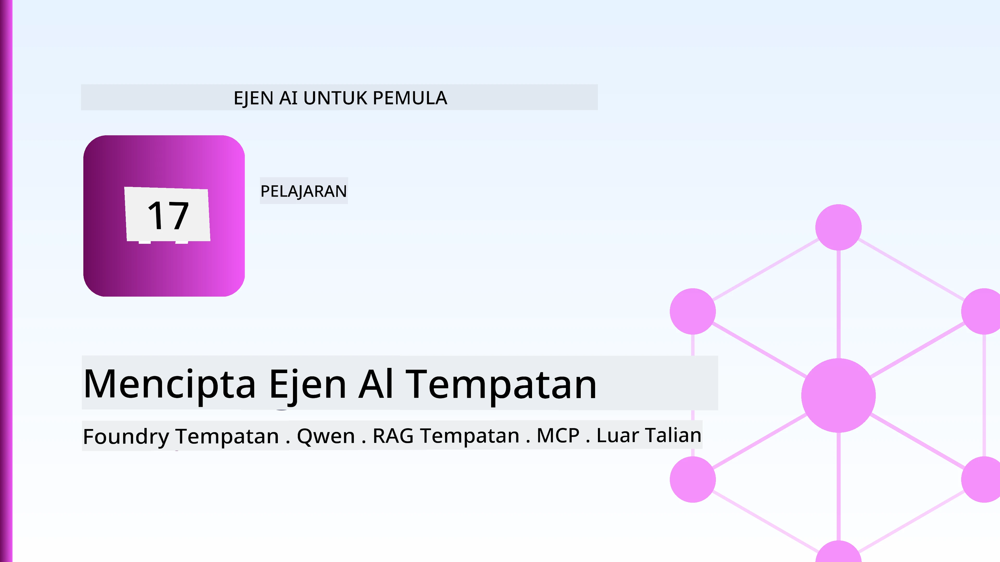
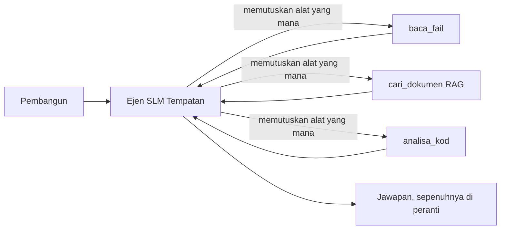
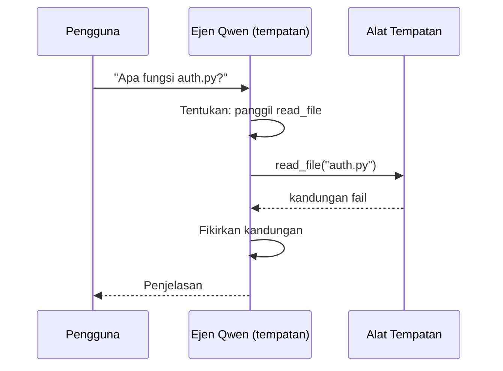
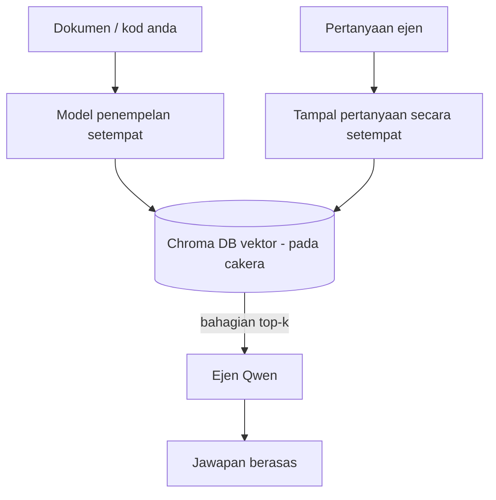
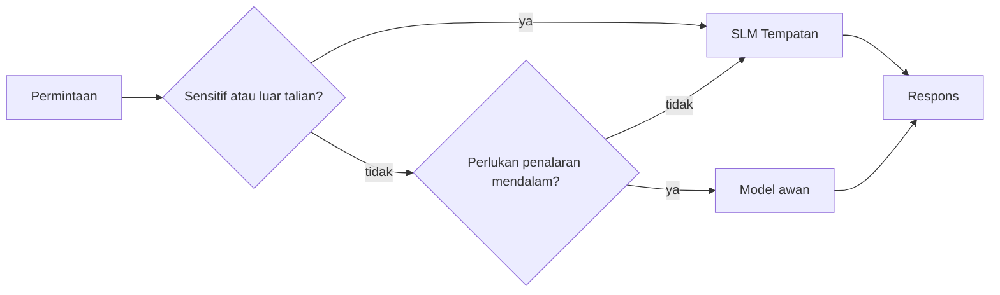

# Membina Ejen AI Tempatan Menggunakan Microsoft Foundry Local dan Qwen



Pelajaran sebelum ini menskala ejen *ke atas* ke awan. Pelajaran ini membawa mereka *ke bawah* ke satu mesin sahaja. Pada akhirnya, anda akan mempunyai pembantu kejuruteraan yang berfungsi yang membuat alasan, memanggil alat, membaca fail anda, dan mencari dokumentasi anda — **tanpa satu panggilan inferens awan pun.**

Kenapa anda mahu begitu? Tiga sebab yang selalu muncul dalam kerja kejuruteraan sebenar:

- **Privasi.** Kod dan dokumen tidak pernah meninggalkan mesin. Tiada arahan, tiada petikan, tiada data pelanggan melintasi batas rangkaian.
- **Kos.** Inferens tempatan tiada bil per-token. Anda boleh ulang kaji sepanjang hari dengan harga elektrik sahaja.
- **Luar Talian.** Di dalam pesawat, di kemudahan yang selamat, atau semasa gangguan, ejen masih berfungsi.

Tangkapannya ialah anda menukar model awan canggih untuk **Model Bahasa Kecil (SLM)** yang berjalan pada CPU, GPU, atau NPU anda. Pelajaran ini mengenai membina ejen yang *baik* dalam kekangan itu daripada berpura-pura kekangan itu tidak ada.

## Pengenalan

Pelajaran ini akan merangkumi:

- **Model Bahasa Kecil (SLM)** — apa mereka, di mana mereka cemerlang, dan di mana mereka tidak.
- **Microsoft Foundry Local** — masa jalan yang memuat turun dan menyajikan model di peranti melalui **API yang serasi OpenAI**.
- **Model panggilan fungsi Qwen** — SLM yang secara konsisten menghasilkan panggilan alat, yang membolehkan *ejen* tempatan (bukan sahaja sembang tempatan).
- **Alat tempatan, RAG tempatan, dan MCP tempatan** — memberikan keupayaan kepada ejen tanpa perlu guna awan.
- **Corak hibrid** — bila hendak simpan tempatan dan bila hendak rujuk ke awan.

## Matlamat Pembelajaran

Selepas menamatkan pelajaran ini, anda akan tahu bagaimana untuk:

- Terangkan pertukaran kompromi SLM dan pilih kes penggunaan ejen tempatan yang sesuai.
- Menghidangkan model Qwen secara tempatan dengan Foundry Local dan sambungkan kepadanya melalui titik akhir yang serasi OpenAI.
- Membina ejen pemanggilan alat yang berjalan sepenuhnya pada stesen kerja anda.
- Tambah RAG tempatan ke atas dokumen anda menggunakan pangkalan data vektor tempatan (Chroma).
- Sambungkan ejen ke pelayan MCP tempatan dan buat alasan mengenai reka bentuk hibrid tempatan/awan.

## Prasyarat

Pelajaran ini menganggap anda telah menamatkan pelajaran sebelumnya dan selesa dengan:

- [Penggunaan Alat](../04-tool-use/README.md) (Pelajaran 4) dan [Agentic RAG](../05-agentic-rag/README.md) (Pelajaran 5).
- [Protokol Agentic / MCP](../11-agentic-protocols/README.md) (Pelajaran 11).
- [Rangka Kerja Ejen Microsoft](../14-microsoft-agent-framework/README.md) (Pelajaran 14).

Anda juga perlu:

- Stesen kerja pembangun. **8 GB RAM adalah minimum yang realistik**; 16 GB+ selesa. GPU atau NPU membantu tetapi tidak diwajibkan.
- **Microsoft Foundry Local** dipasang (lihat bahagian penyediaan di bawah).
- Python 3.12+ dan pakej dalam repositori [`requirements.txt`](../../../requirements.txt), serta `foundry-local-sdk`, `openai`, dan `chromadb` untuk pelajaran ini.

## Model Bahasa Kecil: Alat Yang Tepat Untuk Kerja Tempatan

Model awan canggih mempunyai ratusan bilion parameter dan pusat data di belakangnya. SLM mempunyai beberapa bilion parameter dan perlu muat dalam RAM komputer riba anda. Perbezaan itu mewujudkan jangkaan yang jelas.

**SLM bagus pada:**

- Tugas tersusun dan terhad — klasifikasi, ekstraksi, ringkasan dokumen yang diketahui.
- **Panggilan alat** — menentukan fungsi yang dipanggil dan dengan argumen apa.
- Iterasi cepat, murah, peribadi ke atas data anda sendiri.

**SLM lemah pada:**

- Penalaran terbuka, berbilang lompatan merentasi konteks besar.
- Pengetahuan umum luas (mereka melihat lebih sedikit, dan mudah lupa).

Strategi menang untuk ejen tempatan adalah: **biar SLM mengatur, dan biar alat buat kerja berat.** Model tidak perlu *tahu* kod asas anda — ia perlu tahu bila hendak panggil `read_file` dan `search_docs`. Ini terus memanfaatkan kekuatan SLM.



## Microsoft Foundry Local

**Microsoft Foundry Local** adalah masa jalan ringan yang memuat turun, mengurus, dan menyajikan model sepenuhnya pada mesin anda. Ciri paling penting untuk kami ialah ia mengekspose **titik akhir HTTP yang serasi OpenAI** — bermakna OpenAI SDK dan klien OpenAI Rangka Kerja Ejen Microsoft berfungsi dengan hanya menukar `base_url`. Segala yang anda pelajari mengenai membina ejen terus berpindah; hanya titik akhir yang bertukar daripada awan ke `localhost`.

Foundry Local juga secara automatik memilih binaan model terbaik untuk perkakasan anda — binaan CPU, binaan CUDA/GPU, atau binaan NPU — supaya anda tidak perlu mengoptimumkan mesin demi mesin.

### Penyediaan

Pasang Foundry Local (lihat [dokumentasi](https://learn.microsoft.com/azure/ai-foundry/foundry-local/) untuk OS anda), kemudian sahkan ia berfungsi:

```bash
# Pasang (contoh; ikut dokumen untuk platform anda)
winget install Microsoft.FoundryLocal      # Windows
# brew install microsoft/foundrylocal/foundrylocal   # macOS

# Muat turun dan jalankan model Qwen, kemudian mulakan perkhidmatan tempatan
foundry model run qwen2.5-7b-instruct
foundry service status
```

Setelah servis berjalan anda mempunyai titik akhir tempatan yang serasi OpenAI (biasanya `http://localhost:PORT/v1`). Nota menggunakan `foundry-local-sdk` untuk mengesan titik akhir secara automatik, jadi anda tidak perlu kod keras port.

## Panggilan Fungsi Qwen: Kenapa Ia Penting

Ejen adalah ejen hanya jika ia boleh memanggil alat. Ramai SLM boleh berbual tetapi menghasilkan panggilan alat yang tidak boleh dipercayai dan tidak berformat. Model **Qwen** dilatih untuk panggilan fungsi dan mengeluarkan struktur panggilan alat yang kemas dan konsisten — itulah yang menjadikan model sembang tempatan menjadi ejen *tempatan*.

Alirannya adalah gelung panggilan alat standard yang anda sudah tahu, cuma berjalan di peranti:



## RAG Tempatan

Pencarian dokumentasi adalah tempat ejen tempatan memberi nilai. Daripada berharap SLM menghafal dokumen rangka kerja anda, anda menyemat dokumen itu ke dalam **pangkalan data vektor tempatan** dan biar ejen mengambil potongan relevan bila perlu.

Kami menggunakan **Chroma**, stor vektor terserap yang berjalan dalam proses tanpa pelayan untuk diurus. Aliran ini sepenuhnya tempatan: model sematan tempatan → vektor tempatan → pengambilan tempatan → SLM tempatan.



Ini adalah corak Agentic RAG yang sama dari Pelajaran 5 — satu-satunya perbezaan ialah setiap komponen berjalan pada mesin anda.

## Pelayan MCP Tempatan

[MCP](../11-agentic-protocols/README.md) adalah pengangkut, bukan servis awan. Pelayan MCP boleh berjalan sebagai proses tempatan pada `stdio`, mendedahkan alat kepada ejen anda melalui protokol standard. Ini membolehkan anda menggunakan semula ekosistem pelayan MCP yang semakin berkembang — akses sistem fail, operasi git, kueri pangkalan data — sepenuhnya luar talian.

Postur keselamatan berbeza dari awan, tetapi tidak tiada: pelayan MCP tempatan masih berjalan dengan kebenaran pengguna anda, jadi hadkan skopnya pada apa yang boleh disentuh (direktori projek, bukan keseluruhan folder rumah anda) dan anggap hasilnya sebagai input untuk disahkan.

## Corak Hibrid Awan-dan-Tempatan

Utamakan tempatan tidak bermakna hanya tempatan. Sistem matang menghala bergantung pada sensitiviti dan kesukaran:

| Situasi | Tempat ia berjalan |
| --- | --- |
| Kod / data sensitif, atau luar talian | **SLM Tempatan** |
| Tugas mudah, terhad | **SLM Tempatan** (murah, cepat) |
| Penalaran multi-lompat sukar pada data tidak sensitif | **Model Awan** |
| Segalanya, semasa gangguan | **SLM Tempatan** (degradasi lancar) |

Ini mencerminkan idea **halaan model** dari Pelajaran 16 — kecuali salah satu "model" kini adalah mesin anda sendiri. Reka bentuk yang teguh kembali kepada tempatan apabila awan tidak tersedia, jadi ejen merosot kualitinya daripada gagal sama sekali.



## Makmal Amali: Pembantu Kejuruteraan Tempatan

Buka [`code_samples/17-local-agent-foundry-local.ipynb`](./code_samples/17-local-agent-foundry-local.ipynb) dan cuba. Anda akan membina **pembantu kejuruteraan tempatan** yang berjalan sepenuhnya pada stesen kerja anda dan boleh:

1. **Memanggil alat** — melalui panggilan fungsi Qwen melalui Foundry Local.
2. **Melakukan operasi fail tempatan** — menyenaraikan dan membaca fail dalam direktori projek.
3. **Menganalisa kod** — melaporkan metrik asas pada fail sumber.
4. **Mencari dokumentasi** — RAG tempatan ke atas folder dokumen dengan Chroma.
5. **Gunakan MCP** — sambung ke pelayan MCP tempatan (dengan langkau sopan jika tiada konfigurasi).

Tiada inferens awan digunakan pada bila-bila masa.

### Langkah-Demi-Langkah

Pembantu menyambung ke Foundry Local melalui titik akhir yang serasi OpenAI, jadi kod ejen hampir sama dengan pelajaran awan — hanya klien berubah:

```python
from foundry_local import FoundryLocalManager
from openai import OpenAI

# Foundry Local menemui/muat turun model dan memberikan kami titik akhir tempatan.
manager = FoundryLocalManager(\"qwen2.5-7b-instruct\")
client = OpenAI(base_url=manager.endpoint, api_key=manager.api_key)  # api_key adalah tempat letak tempatan
```

Alat adalah fungsi Python biasa yang beroperasi dalam skop direktori projek:

```python
def read_file(path: str) -> str:
    \"\"\"Read a file, but only inside the sandboxed project directory.\"\"\"
    full = (PROJECT_ROOT / path).resolve()
    if PROJECT_ROOT not in full.parents and full != PROJECT_ROOT:
        return \"Access denied: path is outside the project directory.\"
    return full.read_text(encoding=\"utf-8\")
```

Perhatikan pemeriksaan sandbox — walaupun tempatan, alat yang membaca laluan sesuka hati adalah liabiliti. Nota memegang setiap alat dalam skop akar projek sahaja.

## Semak Pengetahuan

Uji pemahaman anda sebelum beralih ke tugasan.

**1. Berikan dua sebab konkrit untuk menjalankan ejen secara tempatan dan bukan di awan.**

<details>
<summary>Jawapan</summary>

Mana-mana dua daripada: **privasi** (kod dan data tidak pernah keluar mesin), **kos** (tiada bil inferens per-token), dan **keupayaan luar talian** (berfungsi tanpa rangkaian — di pesawat, di kemudahan selamat, atau semasa gangguan). Sekatan peraturan/pematuhan yang menghalang penghantaran data keluar peranti adalah pendorong biasa untuk sebab privasi.
</details>

**2. Apakah pembahagian kerja yang disarankan antara SLM dan alatnya dalam ejen tempatan, dan kenapa?**

<details>
<summary>Jawapan</summary>

Biarkan SLM **mengatur** (menentukan alat mana dipanggil dan dengan argumen apa) dan biarkan **alat buat kerja berat** (membaca fail, mengambil dokumen, mengira keputusan). SLM kuat pada keputusan terhad seperti pemilihan alat tetapi lemah pada pengetahuan luas dan penalaran berbilang lompatan, jadi bergantung pada alat memanfaatkan kekuatan mereka.
</details>

**3. Apa yang menjadikan kod ejen awan boleh digunakan semula dengan Foundry Local?**

<details>
<summary>Jawapan</summary>

Foundry Local mendedahkan **titik akhir HTTP yang serasi OpenAI**. OpenAI SDK dan klien OpenAI Rangka Kerja Ejen berfungsi dengannya dengan hanya menukar `base_url` (dan menggunakan kunci API pengganti tempatan). Segalanya tentang kod ejen kekal sama.
</details>

**4. Kenapa kita gunakan model panggilan fungsi Qwen secara khusus dan bukan SLM lain?**

<details>
<summary>Jawapan</summary>

Kerana ejen mesti menghasilkan panggilan alat yang boleh dipercayai dan berformat baik. Ramai SLM boleh berbual tetapi menghasilkan struktur panggilan alat yang tidak lengkap atau tidak konsisten. Model Qwen dilatih untuk panggilan fungsi dan menghasilkan panggilan alat yang konsisten, itulah yang menjadikan model sembang tempatan menjadi ejen tempatan yang berfungsi.
</details>

**5. Dalam salur RAG tempatan, komponen mana yang berjalan pada mesin?**

<details>
<summary>Jawapan</summary>

Kesemuanya: model sematan, pangkalan data vektor (Chroma, di cakera), langkah pengambilan, dan SLM. Dokumen disemat tempatan, disimpan tempatan, diambil tempatan, dan dianalisis oleh model tempatan — tiada komponen menyentuh awan.
</details>

**6. Pelayan MCP tempatan berjalan pada mesin anda. Adakah ia secara automatik selamat? Langkah berjaga-jaga apa yang perlu anda ambil?**

<details>
<summary>Jawapan</summary>

Tidak. Pelayan MCP tempatan berjalan dengan kebenaran pengguna anda, jadi ia boleh mencapai apa sahaja yang anda boleh capai. Hadkan skopnya kepada apa yang diperlukan (contohnya, direktori projek sahaja dan bukan keseluruhan folder rumah anda) dan anggap outputnya sebagai input yang perlu disahkan sebelum bertindak.
</details>

**7. Terangkan peraturan halaan hibrid yang munasabah yang merangkumi model tempatan.**

<details>
<summary>Jawapan</summary>

Halakan permintaan sensitif atau luar talian ke SLM tempatan; halakan tugas mudah yang terhad ke SLM tempatan untuk kepantasan dan kos; halakan penalaran multi-lompat sukar pada data tidak sensitif ke model awan; dan kembali kepada SLM tempatan jika awan tidak tersedia supaya ejen merosot secara lancar dan tidak gagal sepenuhnya. Ini adalah halaan model (Pelajaran 16) dengan mesin tempatan sebagai salah satu model.
</details>

**8. Apakah angka minimum RAM realistik untuk menjalankan ejen tempatan dalam pelajaran ini, dan apa kelebihan lebih RAM?**

<details>
<summary>Jawapan</summary>

Sekitar **8 GB** adalah minimum realistik; 16 GB+ selesa. Lebih banyak RAM membolehkan anda menjalankan model yang lebih besar dan berupaya serta menyimpan lebih banyak konteks dalam memori. GPU atau NPU mempercepat inferens tetapi tidak wajib — Foundry Local memilih binaan CPU apabila tiada pemecut tersedia.
</details>

## Tugasan

Kembangkan pembantu kejuruteraan tempatan menjadi **penilai dokumentasi tempatan** untuk projek kecil pilihan anda (gunakan salah satu folder pelajaran repo ini jika anda mahu).

Penyerahan anda harus:

1. **Indeks folder dokumen/kod sebenar** ke Chroma (sekurang-kurangnya lima fail).
2. **Tambah alat `find_todos`** yang mengimbas projek untuk komen `TODO`/`FIXME` dan memulangkannya beserta nama fail dan nombor baris — dengan pemeriksaan sandbox sama seperti `read_file`.

3. **Tanya ejen tiga soalan** yang memaksanya untuk menggabungkan alat: satu soalan RAG tulen, satu yang memerlukan membaca fail tertentu, dan satu yang memerlukan mencari TODO.
4. **Ukur masa**: masa setiap tiga respons dan catatkan dalam sel markdown. Komen sama ada kelewatan itu boleh diterima untuk aliran kerja yang anda niatkan.

Kemudian tulis satu perenggan pendek mengenai **apa yang anda akan alihkan ke awan dan apa yang anda akan simpan secara tempatan** untuk penilai ini, dan mengapa. Anda dinilai berdasarkan sama ada komponen tempatan disambungkan dengan betul dan sama ada alasan hibrid anda kukuh — bukan pada kualiti model.

## Rumusan

Dalam pelajaran ini anda membina ejen yang berjalan sepenuhnya di mesin anda sendiri:

- **SLM** menukar keluasan dengan privasi, kos, dan operasi luar talian — dan menonjol apabila mereka **mengorkestrakan alat** daripada membawa semua pengetahuan sendiri.
- **Foundry Local** menyajikan model pada peranti di belakang **endpoint yang serasi OpenAI**, jadi kod ejen awan anda dipindahkan dengan satu perubahan baris.
- **Model pemanggilan fungsi Qwen** membuat pemanggilan alat tempatan yang boleh dipercayai — dan oleh itu *ejen* tempatan — menjadi mungkin.
- **RAG tempatan** (Chroma) dan **MCP tempatan** memberikan keupayaan ejen tanpa meninggalkan mesin.
- **Corak hibrid** membenarkan anda lalui mengikut kepekaan dan kesukaran, dengan tempatan sebagai fallback yang elegan.

Ini melengkapkan lengkung penyebaran: Pelajaran 16 mengembangkan ejen ke Microsoft Foundry, dan pelajaran ini mengecilkannya ke atas satu stesen kerja. Pelajaran berikutnya beralih kepada memastikan ejen yang disebarkan selamat.

## Sumber Tambahan

- <a href="https://learn.microsoft.com/azure/ai-foundry/foundry-local/" target="_blank">Dokumentasi Microsoft Foundry Local</a>
- <a href="https://learn.microsoft.com/azure/ai-foundry/what-is-azure-ai-foundry" target="_blank">Dokumentasi Microsoft Foundry</a>
- <a href="https://aka.ms/ai-agents-beginners/agent-framework" target="_blank">Microsoft Agent Framework</a>
- <a href="https://qwen.readthedocs.io/en/latest/framework/function_call.html" target="_blank">Dokumentasi pemanggilan fungsi Qwen</a>
- <a href="https://modelcontextprotocol.io/" target="_blank">Model Context Protocol (MCP)</a>
- <a href="https://docs.trychroma.com/" target="_blank">Pangkalan data vektor Chroma</a>

## Pelajaran Sebelumnya

[Menyebarkan Ejen Skala Besar](../16-deploying-scalable-agents/README.md)

## Pelajaran Seterusnya

[Mengamankan Ejen AI](../18-securing-ai-agents/README.md)

---

<!-- CO-OP TRANSLATOR DISCLAIMER START -->
**Penafian**:
Dokumen ini telah diterjemahkan menggunakan perkhidmatan terjemahan AI [Co-op Translator](https://github.com/Azure/co-op-translator). Walaupun kami berusaha untuk ketepatan, sila ambil maklum bahawa terjemahan automatik mungkin mengandungi kesilapan atau ketidaktepatan. Dokumen asal dalam bahasa asalnya harus dianggap sebagai sumber yang sahih. Untuk maklumat penting, terjemahan oleh manusia profesional adalah disyorkan. Kami tidak bertanggungjawab terhadap sebarang salah faham atau salah tafsir yang timbul daripada penggunaan terjemahan ini.
<!-- CO-OP TRANSLATOR DISCLAIMER END -->