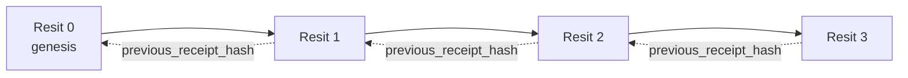

[Tonton video pelajaran: Memastikan Ejen AI dengan Resit Kriptografi](https://youtu.be/PLACEHOLDER_VIDEO_ID)

> _(Video pelajaran dan gambar kecil akan ditambah oleh pasukan kandungan Microsoft selepas gabungan, mengikut pola pelajaran 14 / 15.)_

# Memastikan Ejen AI dengan Resit Kriptografi

## Pengenalan

Pelajaran ini akan merangkumi:

- Mengapa jejak audit untuk ejen AI penting untuk pematuhan, penyahpepijatan, dan kepercayaan.
- Apa itu resit kriptografi dan bagaimana ia berbeza daripada baris log tanpa tandatangan.
- Cara menghasilkan resit bertandatangan untuk panggilan alat ejen dalam Python biasa.
- Cara mengesahkan resit secara luar talian dan mengesan pengubahan.
- Cara mengikat resit supaya mengalih keluar atau menyusun semula satu akan memutuskan rantai.
- Apa yang dibuktikan oleh resit dan apa yang secara eksplisit tidak dibuktikannya.

## Matlamat Pembelajaran

Setelah selesai pelajaran ini, anda akan tahu cara untuk:

- Mengenal pasti mod kegagalan yang memotivasikan asal usul kriptografi untuk tindakan ejen.
- Menghasilkan resit yang ditandatangani Ed25519 ke atas muatan JSON kanonik.
- Mengesahkan resit secara berdikari dengan hanya menggunakan kunci awam penandatangan.
- Mengesan pengubahan dengan menjalankan semula pengesahan ke atas resit yang diubah suai.
- Membina rangkaian resit berantai hash dan menerangkan mengapa rantai itu penting.
- Mengenali sempadan antara apa yang dibuktikan resit (atribusi, integriti, susunan) dan apa yang tidak (ketepatan tindakan, kesahihan dasar).

## Masalah: Jejak Audit Ejen Anda

Bayangkan anda telah mengendalikan ejen AI untuk Contoso Travel. Ejen tersebut membaca permintaan pelanggan, memanggil API penerbangan untuk mencari pilihan, dan menempah tempat duduk bagi pihak pelanggan. Suku tahun lepas, ejen memproses 50,000 tempahan.

Hari ini seorang juruaudit datang. Mereka mengajukan soalan mudah: "Tunjukkan kepada saya apa yang ejen anda lakukan."

Anda menyerahkan fail log anda. Juruaudit melihatnya dan mengajukan soalan yang lebih sukar: "Bagaimana saya tahu log ini tidak diedit?"

Ini adalah masalah jejak audit. Kebanyakan pengendalian ejen hari ini bergantung pada:

- **Log aplikasi**: ditulis oleh ejen itu sendiri, boleh diedit oleh sesiapa yang mempunyai akses sistem fail.
- **Perkhidmatan log awan**: bukti pengubahan di peringkat platform tetapi hanya jika juruaudit mempercayai pengendali platform.
- **Log transaksi pangkalan data**: sesuai untuk perubahan pangkalan data tetapi bukan untuk panggilan alat sewenang-wenangnya.

Tiada satu pun ini boleh menjawab soalan juruaudit tanpa memerlukan juruaudit mempercayai seseorang (anda, penyedia awan anda, vendor pangkalan data anda). Untuk kegunaan dalaman, kepercayaan itu biasanya boleh diterima. Untuk beban kerja yang dikawal selia (kewangan, penjagaan kesihatan, apa sahaja yang tertakluk kepada Akta AI EU), ia tidak boleh diterima.

Resit kriptografi menyelesaikan ini dengan menjadikan setiap tindakan ejen boleh disahkan secara berdikari. Juruaudit tidak perlu mempercayai anda. Mereka hanya memerlukan kunci awam anda dan resit itu sendiri.

## Apakah Resit Kriptografi?

Resit adalah objek JSON yang merekodkan apa yang dilakukan oleh ejen, ditandatangani dengan tandatangan digital.


Resit minimum kelihatan seperti ini:

```json
{
  "type": "agent.tool_call.v1",
  "agent_id": "contoso-travel-bot",
  "tool_name": "lookup_flights",
  "tool_args_hash": "sha256:a3f9c1...",
  "result_hash": "sha256:7b2e1d...",
  "policy_id": "contoso-travel-policy-v3",
  "timestamp": "2026-04-25T14:30:00Z",
  "sequence": 47,
  "previous_receipt_hash": "sha256:9d4e6a...",
  "signature": {
    "alg": "EdDSA",
    "sig": "c5af83...",
    "public_key": "8f3b2c..."
  }
}
```

Tiga sifat melaksanakan kerja ini:

1. **Tandatangan**. Resit ditandatangani oleh pintu masuk ejen menggunakan kunci peribadi Ed25519. Sesiapa dengan kunci awam yang sepadan boleh mengesahkan tandatangan itu secara luar talian. Pengubahan pada mana-mana medan meninvalidkan tandatangan.

2. **Pengekodan kanonik**. Sebelum menandatangani, resit diserikan menggunakan Skema Kanonifikasi JSON (JCS, RFC 8785). Ini memastikan bahawa dua pelaksanaan yang menghasilkan resit logik yang sama menghasilkan output identik dalam bait. Tanpa kanonifikasi, peleraian JSON yang berbeza menghasilkan tandatangan yang berbeza untuk kandungan yang sama.

3. **Pengikatan hash**. Medan `previous_receipt_hash` menghubungkan setiap resit dengan resit sebelumnya. Mengalih keluar atau menyusun semula resit memutuskan setiap resit selepasnya. Pengubahan menjadi kelihatan di peringkat rantai walaupun tandatangan individu dikelakkan.

Bersama-sama sifat ini menyediakan tiga jaminan:

- **Atribusi**: kunci ini menandatangani kandungan ini.
- **Integriti**: kandungan tidak berubah sejak penandatanganan.
- **Susunan**: resit ini datang selepas resit itu dalam rantai.

## Menghasilkan Resit dalam Python

Anda tidak memerlukan perpustakaan khusus untuk menghasilkan resit. Primitif kriptografi tersedia secara meluas dan logiknya hanya beberapa puluh baris Python.

Latihan praktikal dalam `code_samples/18-signed-receipts.ipynb` memandu melalui keseluruhan aliran. Versi ringkas:

```python
import json
import hashlib
import base64
from nacl import signing
from jcs import canonicalize  # JSON kanonik RFC 8785

def b64url_nopad(data: bytes) -> str:
    return base64.urlsafe_b64encode(data).decode("ascii").rstrip("=")

def sha256_canonical(obj) -> str:
    """SHA-256 of a Python object's JCS-canonical JSON form."""
    return f"sha256:{hashlib.sha256(canonicalize(obj)).hexdigest()}"

# Hasilkan atau muat naik kunci tandatangan (dalam pengeluaran, simpan dalam peti besi kunci)
signing_key = signing.SigningKey.generate()
verify_key = signing_key.verify_key

# Bina muatan resit (belum ada tandatangan)
tool_args = {"origin": "SYD", "destination": "LAX"}
tool_result = [{"flight": "QF11", "price": 1850, "stops": 0}]

payload = {
    "type": "agent.tool_call.v1",
    "agent_id": "contoso-travel-bot",
    "tool_name": "lookup_flights",
    "tool_args_hash": sha256_canonical(tool_args),
    "result_hash": sha256_canonical(tool_result),
    "policy_id": "contoso-travel-policy-v3",
    "timestamp": "2026-04-25T14:30:00Z",
    "sequence": 0,
    "previous_receipt_hash": None,
}

# Kanonikan, campur, tandatangan.
canonical_bytes = canonicalize(payload)
message_hash = hashlib.sha256(canonical_bytes).digest()
signature_bytes = signing_key.sign(message_hash).signature

# Lampirkan objek tandatangan berstruktur.
receipt = {
    **payload,
    "signature": {
        "alg": "EdDSA",
        "sig": b64url_nopad(signature_bytes),
        "public_key": b64url_nopad(bytes(verify_key)),
    },
}
```

Itu keseluruhan saluran penandatanganan. Latihan dalam buku nota berjalan melalui setiap langkah.

## Mengesahkan Resit dan Mengesan Pengubahan

Pengesahan adalah operasi songsang:

```python
import base64
import hashlib
from nacl import signing
from nacl.exceptions import BadSignatureError
from jcs import canonicalize

def b64url_decode(s: str) -> bytes:
    padding = "=" * ((4 - len(s) % 4) % 4)
    return base64.urlsafe_b64decode(s + padding)

def verify_receipt(receipt: dict) -> bool:
    # Tandatangan adalah objek berstruktur: {"alg", "sig", "public_key"}.
    sig_obj = receipt.get("signature")
    if not sig_obj or sig_obj.get("alg") != "EdDSA":
        return False

    # Bina semula muatan yang sebenarnya ditandatangani (semua kecuali tandatangan).
    payload = {k: v for k, v in receipt.items() if k != "signature"}

    canonical_bytes = canonicalize(payload)
    message_hash = hashlib.sha256(canonical_bytes).digest()

    try:
        verify_key = signing.VerifyKey(b64url_decode(sig_obj["public_key"]))
        verify_key.verify(message_hash, b64url_decode(sig_obj["sig"]))
        return True
    except BadSignatureError:
        return False
```

Fungsi ini mengambil resit dan mengembalikan `True` jika tandatangan sah, `False` jika tidak. Tiada panggilan rangkaian, tiada pergantungan perkhidmatan, tiada kepercayaan diperlukan pada pihak ketiga.

Untuk melihat pengesanan pengubahan berfungsi, buku nota menunjukkan:

1. Menghasilkan resit sah dan mengesahkan ia sah.
2. Mengubah satu bait dalam medan `tool_args_hash`.
3. Menjalankan semula pengesahan dan melihat ia gagal.

Ini adalah demonstrasi praktikal bahawa resit adalah bukti pengubahan: sebarang pengubahan, walau kecil, memutuskan tandatangan.

## Mengikat Resit untuk Ejen Berbilang Langkah

Satu resit bertandatangan melindungi satu tindakan. Rantaian resit melindungi satu urutan.



Setiap resit merekod hash resit sebelumnya. Untuk membuang resit 2 secara senyap, penyerang perlu:

- Mengubah medan `previous_receipt_hash` resit 3 (memutuskan tandatangan resit 3), ATAU
- Memalsukan tandatangan baru pada resit 3 yang diubah (memerlukan kunci peribadi ejen).

Jika kunci peribadi berada dalam peti besi kunci perkakasan dan anda menerbitkan kunci awam dengan setiap resit, tiada serangan boleh dilakukan tanpa dikesan.

Buku nota memandu melalui:

1. Membina rantai tiga resit.
2. Mengesahkan bahawa `previous_receipt_hash` setiap resit sepadan dengan hash sebenar resit sebelumnya.
3. Mengubah satu resit di tengah dan melihat rantai putus di titik itu.

Begitulah anda menghasilkan jejak audit yang boleh disahkan oleh juruaudit luar tanpa mempercayai anda.

## Apa yang Dibuktikan Oleh Resit (dan Apa yang Tidak)

Ini adalah bahagian paling penting dalam pelajaran ini. Resit berkuasa tetapi kuasanya terhad.

**Resit membuktikan tiga perkara:**

1. **Atribusi**: kunci tertentu menandatangani muatan tertentu.
2. **Integriti**: muatan tidak berubah sejak penandatanganan.
3. **Susunan**: resit ini datang selepas resit itu dalam rantai hash.

**Resit TIDAK membuktikan:**

1. **Ketepatan**: bahawa tindakan ejen adalah tindakan yang betul. Resit boleh ditandatangani untuk jawapan yang salah sama bersihnya seperti untuk jawapan yang betul.
2. **Pematuhan dasar**: bahawa dasar yang dirujuk dalam `policy_id` benar-benar dinilai, atau bahawa ia akan membenarkan tindakan ini jika diperiksa. Resit merekod apa yang didakwa, bukan apa yang dikuatkuasakan.
3. **Identiti selain kunci**: resit mengatakan "kunci ini menandatangani kandungan ini." Ia tidak mengatakan "manusia ini membenarkan ini." Menghubungkan kunci kepada individu atau organisasi memerlukan infrastruktur identiti berasingan (direktori, daftar kunci awam, dll).
4. **Kebenaran input**: jika ejen menerima arahan yang dimanipulasi dan bertindak ke atasnya, resit merekod tindakan itu secara setia. Resit adalah selepas pengesahan input, bukan pengganti untuknya.

Sempadan ini penting untuk dua sebab:

- Ia memberitahu anda apa kegunaan resit: menjadikan tingkah laku ejen boleh diaudit dan bukti pengubahan, walaupun merentasi sempadan organisasi.
- Ia memberitahu anda lapisan tambahan apa yang masih anda perlukan: pengesahan input (Pelajaran 6), penguatkuasaan dasar (dibincangkan secara ringkas di bawah), dan infrastruktur identiti (di luar skop pelajaran ini).

Kesilapan biasa ialah menganggap bahawa "kami ada resit" bermakna "kami diatur." Ia tidak begitu. Resit adalah asas. Tadbir urus ialah sistem yang anda bina di atasnya.

## Membuktikan Manusia Meluluskan Tindakan Tepat

Perkara 3 di atas berhak mendapat seksyen sendiri: resit tindakan mengatakan "kunci ini menandatangani kandungan ini," tidak pernah "manusia ini membenarkan ini." Untuk tindakan berisiko tinggi (bayaran balik, penghapusan, pemindahan wayar), rangka kerja tadbir urus semakin memerlukan penyataan hilang itu, dan ia boleh dihasilkan dengan primitif yang sama yang sudah anda bina dalam pelajaran ini.

Buku nota lanjutan `code_samples/human-authorization-receipts.ipynb` menambah jenis resit kedua, `human.approval.v1`, dalam bentuk sampul yang sama seperti resit pelajaran (muatan berjenis ditandatangani oleh Ed25519 ke atas SHA-256 kanoniknya, dengan objek `signature` di luar bait yang ditandatangani). Pelulus bernama menandatangani **tindakan penuh kanonik dan ringkasannya** sebelum pelaksanaan; resit tindakan ejen membawa **ringkasan tindakan yang sama** dan `parent_approval_ref`, `receipt_hash` kelulusan, konvensi yang sama seperti `previous_receipt_hash` dalam rantai yang anda bina sebelum ini. Satu `verify_chain` memeriksa kedua-dua artifak di bawah **daftar kunci tersemat berasingan** (kunci pelulus vs kunci ejen), jadi laluan kod dikongsi tetapi pihak berkuasa tidak pernah berkongsi.

Sifat yang ini bawa, dinyatakan dengan teliti: *manusia meluluskan tindakan tepat ini, dan ejen melaksanakan tindakan yang diluluskan itu dengan tepat.* Kerangka penolakan dalam buku nota menjadikan sifat ini nyata dan bukan sekadar dakwaan:

- set klasik: pengubahan, aduan pihak ketiga, pengulangan, kunci palsu di kedua-dua belah, input salah bentuk;
- **kuasa lapuk**: tandatangan yang masih sah, tetapi tetap ditolak kerana versi dasar berubah, kunci pelulus diputar keluar dari daftar tersuai, atau kelulusan tamat tempoh sebelum pelaksanaan;
- **penggantian ringkasan**: resit tindakan yang ditandatangani dengan sah menuding pada kelulusan *sah* yang mengikat tindakan kanonik *berbeza*.

Setiap kegagalan ditolak dengan sebab yang berbeza, jadi juruaudit membaca penolakan boleh membezakan sama ada kuasa telah lapuk atau tindakan yang dilaksanakan berubah. Peraturan yang diajar oleh buku nota: kelulusan bertandatangan bukan kuasa sendiri. Kuasa wujud hanya jika kedua-dua resit masih mengikat tindakan kanonik yang sama pada masa pelaksanaan. Laluan kopengesahan dalam Draf Internet yang sama dengan pelajaran ini (`draft-farley-acta-signed-receipts`) adalah bentuk trajektori piawaian corak ini.

## Rujukan Pengeluaran

Kod Python dalam pelajaran ini sengaja minimal supaya anda boleh membaca setiap baris dan faham apa yang sedang berlaku. Dalam pengeluaran, anda ada dua pilihan:

1. **Bina terus di atas primitif kriptografi.** 50 baris yang anda lihat di atas sudah mencukupi untuk banyak kes penggunaan. PyNaCl (Ed25519) dan pakej `jcs` (JSON kanonik) adalah perpustakaan yang diselenggara dengan baik dan diaudit.

2. **Gunakan perpustakaan resit pengeluaran.** Beberapa projek sumber terbuka melaksanakan corak yang sama dengan ciri tambahan (putaran kunci, pengesahan berkumpulan, pengedaran Kumpulan Kunci JWK, integrasi dengan enjin dasar):
   - Format resit yang digunakan dalam pelajaran ini mengikuti Draf Internet IETF ([`draft-farley-acta-signed-receipts`](https://datatracker.ietf.org/doc/draft-farley-acta-signed-receipts/), semakan 02) yang kini dalam proses piawaian, dengan suite pematuhan bersama ([agent-governance-testvectors](https://github.com/ScopeBlind/agent-governance-testvectors)) yang pelaksanaan bebas saling mengesahkan untuk output kanonik identik bait.
   - Kit Alat Tadbir Urus Ejen Microsoft menggabungkan resit dengan keputusan dasar berasaskan Cedar; lihat Tutorial 33 dalam repositori itu untuk contoh menyeluruh.
   - Pakej `protect-mcp` (npm) dan `@veritasacta/verify` (npm) menyediakan pelaksanaan tandatangan resit dan pengesahan luar talian berasaskan Node, bertujuan untuk membungkus mana-mana pelayan MCP dengan jejak audit bukti pengubahan, termasuk aliran tahan-kopengesahan di mana tindakan dihentikan mengeluarkan resit kelulusan terikat kepada ringkasan tindakan (disokong WebAuthn dalam aliran desktop), corak resit kelulusan yang sama seperti buku nota pengesahan manusia di atas.
   - SDK Python **[nobulex](https://github.com/arian-gogani/nobulex)** (`pip install nobulex`) menyediakan corak tandatangan Ed25519 + JCS yang sama dalam Python dengan integrasi LangChain dan CrewAI, termasuk vektor ujian silang yang diterbitkan dan pemetaan kepatuhan yang disumbangkan melalui [OWASP PR #2210](https://github.com/OWASP/CheatSheetSeries/pull/2210).

Keputusan antara membina sendiri atau menggunakan perpustakaan mencerminkan keputusan antara menulis perpustakaan JWT anda sendiri dan menggunakan yang telah diuji: kedua-duanya munasabah; perpustakaan menjimatkan masa dan mengurangkan permukaan audit; pendekatan dari awal memaksa anda faham setiap primitif. Pelajaran ini mengajar laluan dari awal supaya anda mempunyai asas untuk mana-mana pilihan.

## Pemeriksaan Pengetahuan

Uji pemahaman anda sebelum bergerak ke latihan praktikal.

**1. Resit ditandatangani dengan kunci peribadi Ed25519 ejen. Juruaudit hanya mempunyai kunci awam. Bolehkah juruaudit mengesahkan resit secara luar talian?**

<details>
<summary>Jawapan</summary>

Ya. Pengesahan Ed25519 hanya memerlukan kunci awam dan bait yang ditandatangani. Tiada panggilan rangkaian, tiada pergantungan perkhidmatan. Ini adalah sifat yang menjadikan resit berguna dalam tetapan audit berasingan tanpa sambungan rangkaian, pelbagai organisasi, atau rendah kepercayaan.
</details>

**2. Penyerang mengubah medan `policy_id` resit untuk mendakwa ia dikawal oleh dasar yang lebih membenarkan. Tandatangan dibuat ke atas muatan asal. Apa yang berlaku semasa pengesahan?**

<details>
<summary>Jawapan</summary>


Pengesahan gagal. Tandatangan dikira ke atas bait kanonik bagi muatan asal; mengubah sebarang medan menukar bait kanonik, yang menukar hash SHA-256, lalu menyebabkan tandatangan tidak sah. Penyerang perlu kunci peribadi untuk menghasilkan tandatangan sah baharu, yang mereka tidak miliki.
</details>

**3. Mengapakah resit termasuk `tool_args_hash` dan `result_hash` dan bukannya argumen mentah dan hasil?**

<details>
<summary>Jawapan</summary>

Dua sebab. Pertama, resit mungkin perlu diarkib atau dihantar dalam persekitaran di mana kebocoran kandungan mentah (PII, data perniagaan) menjadi masalah. Penggunaan hash memastikan resit kecil dan kandungan sulit; juruaudit mengesahkan hash sepadan dengan salinan kandungan sebenar yang disimpan berasingan. Kedua, hash mempunyai saiz tetap; resit dengan hash terhad saiznya tidak kira betapa besarnya input dan output.
</details>

**4. Medan `previous_receipt_hash` menghubungkan setiap resit kepada pendahulunya. Jika penyerang membuang satu resit dari tengah rantaian secara senyap, apa yang menjadi tidak sah?**

<details>
<summary>Jawapan</summary>

Setiap resit selepas yang dihapuskan. Medan `previous_receipt_hash` mereka tidak lagi sepadan dengan rantaian sebenar (kerana resit yang dirujuk tidak lagi wujud, atau rantaian kini merujuk kepada pendahulu yang berbeza). Untuk menyembunyikan penghapusan, penyerang perlu menandatangani semula setiap resit kemudian, yang memerlukan kunci peribadi.
</details>

**5. Resit mengesahkan dengan bersih. Adakah itu membuktikan tindakan agen betul, tepat, atau mematuhi polisi?**

<details>
<summary>Jawapan</summary>

Tidak. Resit sah membuktikan tiga perkara: atribusi (kunci ini menandatangani kandungan ini), integriti (kandungan tidak berubah), dan urutan (resit ini datang selepas resit itu). Ia TIDAK membuktikan tindakan itu betul, polisi dalam `policy_id` benar-benar dinilai, atau agen mengikuti setiap peraturan. Resit menjadikan kelakuan agen boleh diaudit, bukan semestinya betul. Ini adalah sempadan paling penting dalam pelajaran.
</details>

## Latihan Amali

Buka `code_samples/18-signed-receipts.ipynb` dan lengkapkan keempat-empat bahagian:

1. **Bahagian 1**: Tandatangani resit pertama anda dan sahkan ia.
2. **Bahagian 2**: Cubalah mengubah suai resit dan perhatikan pengesahan gagal.
3. **Bahagian 3**: Bina rantaian tiga resit dan sahkan integriti rantai.
4. **Bahagian 4**: Gunakan corak ini ke agen binaan dengan Microsoft Agent Framework: balut panggilan alat dalam penandatanganan resit, kemudian sahkan resit secara bebas.

**Cabaran lanjutan 1:** luaskan skema resit dengan medan tambahan pilihan anda sendiri (contoh, ID permintaan untuk penjejakan), kemas kini logik penandatanganan kanonik untuk memasukkannya, dan pastikan resit masih melalui pengesahan pusing-balik. Kemudian ubah medan selepas tandatangan dan pastikan pengesahan gagal. Ini memaksa anda memahami bagaimana setiap bait pengekodan kanonik menyumbang kepada tandatangan.

**Cabaran lanjutan 2:** SHA-256 hash dua resit anda bersama (sambungkan bait kanonik mereka dalam susunan deterministik) dan tanamkan hasil digest sebagai medan baru pada resit ketiga sebelum menandatangan. Sahkan ketiga-tiga resit masih pusing-balik. Anda baru sahaja membina bukti inklusi satu langkah: sesiapa yang memegang resit ketiga boleh membuktikan dua yang pertama wujud ketika ia ditandatangani, tanpa perlu dedah kandungan mereka. Ini corak yang digunakan resit pendedahan terpilih secara besar-besaran (komitmen Merkle, RFC 6962).

## Kesimpulan

Resit kriptografi memberi agen AI jejak audit yang:

- **Boleh disahkan sendiri**: mana-mana pihak dengan kunci awam boleh sahkan, tiada pergantungan servis.
- **Bukti pengubahsuaian**: sebarang pengubahsuaian membatalkan tandatangan.
- **Mudah alih**: resit adalah fail JSON kecil; boleh diarkib, dihantar, dan disahkan di mana-mana.
- **Sejajar piawaian**: dibina atas Ed25519 (RFC 8032), JCS (RFC 8785), dan SHA-256, semua primitif yang digunakan meluas.

Ia bukan pengganti pengesahan input, penguatkuasaan polisi, atau infrastruktur identiti. Ia asas bagi lapisan-lapisan tersebut. Apabila melaksanakan agen dalam beban kerja terkawal, aliran kerja berbilang organisasi, atau mana-mana situasi di mana juruaudit masa depan tidak boleh dipercayai, resit memastikan jejak audit jujur.

Intipati paling penting: resit membuktikan siapa kata apa, bila. Ia tidak membuktikan apa yang dikatakan itu betul atau tepat. Pegang perbezaan itu erat-erat. Ia bezakan sistem asal usul jujur dan yang mengelirukan.

## Senarai Semak Pengeluaran

Apabila anda sudah bersedia untuk lulus dari pelajaran ini ke pengeluaran agen tandatangan resit dalam persekitaran sebenar:

- [ ] **Alihkan kunci tandatangan dari komputer pembangun.** Gunakan Azure Key Vault, AWS KMS, atau modul keselamatan perkakasan. Kunci peribadi yang menandatangani resit anda tidak boleh disimpan dalam kawalan sumber atau fail teks biasa di mesin aplikasi.
- [ ] **Terbitkan kunci awam pengesahan.** Juruaudit memerlukannya untuk pengesahan luar talian. Corak standard ialah JWK Set pada URL yang diketahui (RFC 7517), contoh `https://your-org.example.com/.well-known/agent-keys.json`.
- [ ] **Anchor rantaian secara luaran.** Tulis secara berkala hash kepala rantaian terkini ke log ketelusan (Sigstore Rekor, RFC 3161 timestamp authority, atau sistem dalaman kedua) supaya pihak luar boleh mengesahkan "rantai ini wujud pada masa ini."
- [ ] **Simpan resit secara tidak boleh diubah.** Penyimpanan blob append-only (Azure Storage dengan polisi tidak boleh ubah, AWS S3 Object Lock) menghalang dalaman mengubah sejarah di lapisan penyimpanan.
- [ ] **Tentukan tempoh penyimpanan.** Banyak peraturan pematuhan memerlukan penyimpanan bertahun-tahun. Rancang pertumbuhan resit (setiap resit ~500 bait; agen membuat 10K panggilan sehari menghasilkan ~1.8 GB setahun).
- [ ] **Dokumen apa yang tidak diliputi resit.** Resit membuktikan atribusi, integriti dan urutan. Buku panduan anda perlu senaraikan kawalan tambahan (validasi input, penguatkuasaan polisi, sekatan kadar, infrastruktur identiti) yang disertakan dengan resit dalam postur tadbir urus.

### Ada Soalan Lagi tentang Memastikan Keselamatan Agen AI?

Sertai [Microsoft Foundry Discord](https://aka.ms/ai-agents/discord) untuk berjumpa pelajar lain, hadir jam pejabat, dan dapatkan jawapan untuk soal agen AI anda.

## Selepas Pelajaran Ini

Pelajaran ini merangkumi tandatangan resit tunggal dan urutan rantaian hash. Primitif sama membina beberapa corak maju yang mungkin anda temui seiring kematangan postur tadbir urus:

- **Pendedahan terpilih.** Apabila medan resit diikat secara bebas (pokok Merkle gaya RFC 6962), anda boleh dedahkan medan tertentu kepada juruaudit tertentu dan buktikan yang lain tidak berubah tanpa dedah mereka. Berguna apabila resit sama perlu memenuhi audit menyeluruh (mahu lengkap) dan peraturan minimisasi data seperti GDPR (mahu juruaudit lihat serendah mungkin).
- **Pembatalan resit.** Jika kunci tandatangan dikompromi, anda perlu cara menandakan semua resit yang ditandatangani dengan kunci itu sebagai tidak dipercayai dari masa tertentu dan seterusnya. Corak standard: kunci tandatangan bertahan pendek plus senarai pembatalan diterbitkan, atau log ketelusan dengan entri pembatalan.
- **Resit tandatangan berkembar / berpecah.** Sesetengah pelaksanaan pecah muatan yang ditandatangani kepada separuh pra-pelaksanaan (`authorization_*`) dan pasca-pelaksanaan (`result_*`) dengan tandatangan bebas, berguna bila keputusan kebenaran dan hasil yang diperhatikan dihasilkan pelaku berbeza atau masa berbeza. Ini menambah di atas format resit dalam pelajaran ini.
- **Komposisi muatan.** Resit menutup bait apa pun yang anda masukkan dalam `result_hash`. Muatan dunia sebenar selalunya lebih kaya daripada hasil panggilan alat tunggal: pemikiran pra-keputusan (ramalan model, pilihan dipertimbangkan, bukti dan kelengkapannya, postur risiko, rantaian akauntabiliti, keputusan pintu) boleh dimuat dalam muatan, ditutup oleh satu resit. Ini memastikan format resit minimal sambil membenarkan skema muatan berkembang domain demi domain.
- **Penyesuaian silang pelaksanaan.** Pelbagai pelaksanaan bebas format resit sama (Python, TypeScript, Rust, Go) buat verifikasi silang menggunakan vektor ujian bersama. Jika anda bina pelaksanaan sendiri, pengesahan dengan vektor diterbitkan mengesahkan keserasian talian.
- **Migrasi kuantum pasca.** Ed25519 digunakan luas hari ini tapi tidak tahan kuantum. Format resit algoritma-ceria: medan `signature.alg` boleh bawa `ML-DSA-65` (standard tandatangan kuantum pasca NIST) apabila anda perlu beralih. Rancang tempoh peralihan di mana resit ditandatangani berganda.

## Sumber Tambahan

- <a href="https://datatracker.ietf.org/doc/draft-farley-acta-signed-receipts/" target="_blank">Draf IETF Internet: Resit Keputusan Bertandatangan untuk Kawalan Akses Mesin-ke-Mesin</a>
- <a href="https://learn.microsoft.com/azure/ai-studio/responsible-use-of-ai-overview" target="_blank">Gambaran Keseluruhan AI Bertanggungjawab (Azure AI)</a>
- <a href="https://datatracker.ietf.org/doc/html/rfc8032" target="_blank">RFC 8032: Algoritma Tandatangan Digital Kurva Edwards (EdDSA)</a>
- <a href="https://datatracker.ietf.org/doc/html/rfc8785" target="_blank">RFC 8785: Skema Kanonik JSON (JCS)</a>
- <a href="https://datatracker.ietf.org/doc/html/rfc6962" target="_blank">RFC 6962: Ketelusan Sijil</a> (Pembinaan pokok Merkle digunakan oleh resit pendedahan terpilih)
- <a href="https://github.com/microsoft/agent-governance-toolkit/blob/main/docs/tutorials/33-offline-verifiable-receipts.md" target="_blank">Toolkit Tadbir Urus Agen Microsoft, Tutorial 33: Resit Keputusan Verifikasi Luar Talian</a>
- <a href="https://github.com/ScopeBlind/agent-governance-testvectors" target="_blank">Vektor ujian penyesuaian pelaksanaan silang</a> untuk format resit digunakan dalam pelajaran ini (Apache-2.0)
- <a href="https://pynacl.readthedocs.io/" target="_blank">Dokumentasi PyNaCl</a> (Ed25519 dalam Python)

## Pelajaran Sebelumnya

[Mencipta Agen AI Tempatan](../17-creating-local-ai-agents/README.md)

---

<!-- CO-OP TRANSLATOR DISCLAIMER START -->
**Penafian**:
Dokumen ini telah diterjemahkan menggunakan perkhidmatan terjemahan AI [Co-op Translator](https://github.com/Azure/co-op-translator). Walaupun kami berusaha untuk ketepatan, sila ambil maklum bahawa terjemahan automatik mungkin mengandungi kesilapan atau ketidaktepatan. Dokumen asal dalam bahasa asalnya harus dianggap sebagai sumber yang sahih. Untuk maklumat penting, terjemahan oleh manusia profesional adalah disyorkan. Kami tidak bertanggungjawab terhadap sebarang salah faham atau salah tafsir yang timbul daripada penggunaan terjemahan ini.
<!-- CO-OP TRANSLATOR DISCLAIMER END -->