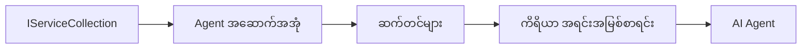

# 🎨 Azure OpenAI (Responses API) (.NET) နှင့်အတူ Agentic Design Patterns

## 📋 သင်ယူရန်ရည်ရွယ်ချက်များ

ဤနမူနာသည် .NET တွင် Microsoft Agent Framework ကိုအသုံးပြုပြီး Azure OpenAI (Responses API) နဲ့ ပေါင်းစပ်ပြီး ဉာဏ်ရည်ရှိသော agent များ ဖန်တီးရာတွင် စက်မှုလုပ်ငန်းအဆင့်ဒီဇိုင်းပုံစံများကို ပြသသည်။ သင်သည် agents များကို ထုတ်လုပ်မှုဆိုင်ရာ အသင့်ပြင်ဆင်ထားသော၊ ထိန်းသိမ်းရလွယ်ကူသောနှင့် ပမာဏတိုးမြှင့်နိုင်သော ပုံစံများနှင့် နည်းဗျူဟာဆိုင်ရာနည်းလမ်းများကို သင်ယူရပါမည်။

### စက်မှုလုပ်ငန်းဒီဇိုင်းပုံစံများ

- 🏭 **Factory Pattern**: အားထားနိုင်ပြီး dependency injection နဲ့ agent ဖန်တီးခြင်း
- 🔧 **Builder Pattern**: agent ကို အဆင်ပြေစွာ ဆက်တင်ဖွင့်ခြင်းနှင့် ပြင်ဆင်ခြင်း
- 🧵 **Thread-Safe Patterns**: တပြိုင်နက်စကားပြောဆက်ဆံမှု စီမံခန့်ခွဲခြင်း
- 📋 **Repository Pattern**: ကိရိယာနှင့် ပိတ်သတ်နိုင်စွမ်း စီမံခန့်ခွဲခြင်း

## 🎯 .NET သီးသန့် နည်းဗျူဟာတိုးတက်မှုများ

### စက်မှုလုပ်ငန်းအင်္ဂါရပ်များ

- **ကြံ့ခိုင်သော typing**: Compile-time စစ်ဆေးမှုနှင့် IntelliSense မှားခွင့်
- **Dependency Injection**: ထည့်သွင်းထားသော DI container ပေါင်းစပ်ခြင်း
- **Configuration Management**: IConfiguration နှင့် Options ပုံစံများ
- **Async/Await**: Asynchronous programming အားကောင်းမှု

### ထုတ်လုပ်မှုအဆင်သင့် ပုံစံများ

- **Logging Integration**: ILogger နှင့် သုံးစွဲသူစနစ် logging ထောက်ပံ့မှု
- **Health Checks**: ထည့်သွင်းထားသော မောနီတာနှင့် تشخيص
- **Configuration Validation**: data annotation ဖြင့် ကြံ့ခိုင် typing
- **Error Handling**: စနစ်တကျ exception စီမံခန့်ခွဲမှု

## 🔧 နည်းပညာဆိုင်ရာ နည်းဗျူဟာ

### အခြေခံ .NET ကွန်ပွန်နန့်များ

- **Microsoft.Extensions.AI**: AI ဝန်ဆောင်မှုများ ပေါင်းစပ်စနစ်
- **Microsoft.Agents.AI**: စက်မှုလုပ်ငန်း agent စီမံ framework
- **Azure OpenAI (Responses API)**: အမြန်နှိုးဆွဲ API client ပုံစံများ
- **Configuration System**: appsettings.json နှင့် ပတ်ဝန်းကျင်ပေါင်းစပ်မှု

### ဒီဇိုင်းပုံစံအကောင်အထည်ဖော်ခြင်း



## 🏗️ ပြသထားသည့် စက်မှုလုပ်ငန်း ပုံစံများ

### 1. **ဖန်တီးမှု ပုံစံများ**

- **Agent Factory**: ချိန်ညှိမှုတူညီမှုဖြင့် agent ဖန်တီးမှုစင်တာပိုင်
- **Builder Pattern**: agent ချိန်ညှိမှု ကြီးကြပ်ရန် Fluent API
- **Singleton Pattern**: ဝေမျှအသုံးပြုမှုအရင်းအမြစ်နှင့် ချိန်ညှိမှုစီမံမှု
- **Dependency Injection**: ချိတ်ဆက်မှု ဖြုတ်ထားခြင်းနှင့် စမ်းသပ်နိုင်မှု

### 2. **အပြုအမူ ပုံစံများ**

- **Strategy Pattern**: အခြား tool စနစ်များ အစားထိုးကျွမ်းကျင်မှု
- **Command Pattern**: undo/redo နဲ့အတူ agent လုပ်ဆောင်ချက်များ ထုပ်ပိုးခြင်း
- **Observer Pattern**: အဖြစ်အပျက် အခြေပြု agent အသက်ရှင်မှု စီမံခန့်ခွဲမှု
- **Template Method**: စံချိန် agent လုပ်ဆောင်မှု လမ်းစဉ်များ

### 3. **ဖွဲ့စည်းပုံ ပုံစံများ**

- **Adapter Pattern**: Azure OpenAI (Responses API) ပေါင်းစပ်မှု အလွှာ
- **Decorator Pattern**: agent ပါဝင်စွမ်းရည် တိုးတက်မှု
- **Facade Pattern**: agent များနှင့် ဆက်သွယ်မှု ရိုးရှင်းသော မျက်နှာပြင်များ
- **Proxy Pattern**: အကောင်းဆုံးဖြစ်နိုင်ရန် lazy loading နှင့် caching

## 📚 .NET ဒီဇိုင်းမူကြမ်းများ

### SOLID မူကြမ်းများ

- **Single Responsibility**: မည်သည့်ကွန်ပွန်နန့်မှ တစ်ခုတည်းသော ရည်ရွယ်ချက်ရှိခြင်း
- **Open/Closed**: ပြင်ဆင်မှုမမဲ့ ဆက်လက်ဖြန့်ချိနိုင်ခြင်း
- **Liskov Substitution**: အင်တာဖေ့စ်အခြေပြု tool အကောင်အထည်ဖော်မှုများ
- **Interface Segregation**: ဦးတည်ချက်ပြည့်စုံသော၊ ဆိုင်ရာ အင်တာဖေ့စ်များ
- **Dependency Inversion**: တိကျခြင်းမရှိတဲ့ အရာများပေါ် အားထားခြင်း

### ရှင်းလင်း Architecture

- **Domain Layer**: အဓိက agent နှင့် tool အကြောင်းအရာများ
- **Application Layer**: agent စီမံခန့်ခွဲမှုနှင့် လုပ်ငန်းစဉ်များ
- **Infrastructure Layer**: Azure OpenAI (Responses API) ပေါင်းစည်းမှုနှင့် ပြင်ပ ဝန်ဆောင်မှုများ
- **Presentation Layer**: အသုံးပြုသူနှင့် ဆက်သွယ်မှု၊ တုံ့ပြန်မှု ပုံဖော်ခြင်း

## 🔒 စက်မှုလုပ်ငန်း စဉ်းစားချက်များ

### လုံခြုံရေး

- **လက်မှတ်စီမံခန့်ခွဲမှု**: IConfiguration ဖြင့် API key လုံခြုံစွာ ကိုင်တွယ်ခြင်း
- **ထည့်သွင်းမှု စစ်ဆေးမှု**: ကြံ့ခိုင်သော typing နှင့် data annotation စစ်ဆေးခြင်း
- **ထွက်ရှိမှု သန့်ရှင်းမှု**: လုံခြုံသော တုံ့ပြန်မှု ဆက်ဆံမှု နှင့် စစ်ထုတ်မှု
- **စာရင်းသွင်း မှတ်တမ်း**: လုပ်ငန်းဆောင်ရွက်ချက်များ ကြာရှည် စောင့်ကြည့်ခြင်း

### ဆောင်ရွက်မှု

- **Async Patterns**: ပြတ်တောက်မရှိသော I/O လုပ်ငန်းစဉ်များ
- **Connection Pooling**: ထိရောက်သော HTTP client စီမံခန့်ခွဲမှု
- **Caching**: တုံ့ပြန်မှု caching ဖြင့် ဆောင်ရွက်မှု တိုးတက်မှု
- **Resource Management**: သင့်တော်သည့် ဖျက်ပစ်မှု နှင့် သန့်ရှင်းမှု ပုံစံများ

### ပမာဏတိုးတက်မှု

- **Thread Safety**: တပြိုင်နက် agent ဆောင်ရွက်မှု ထောက်ပံ့မှု
- **Resource Pooling**: ထိရောက်သော ရင်းမြစ်အသုံးပြုမှု
- **Load Management**: အမြန်နှုန်းကန့်သတ်ခြင်းနှင့် နောက်တုံ့ပြန်မှု ကိုင်တွယ်ခြင်း
- **Monitoring**: ဆောင်ရွက်မှု ကိန်းဂဏန်းများနှင့် ကျန်းမာရေးစစ်ဆေးခြင်း

## 🚀 ထုတ်လုပ်မှု အဆင့်သို့ ပြောင်းရွှေ့ခြင်း

- **Configuration Management**: ပတ်ဝန်းကျင် အထူးချုပ်ချက်များ
- **Logging Strategy**: အဆက်အသွယ် ID များနှင့် အစီအစဉ် logging
- **Error Handling**: ပြည့်စုံသော exception ကိုင်တွယ်မှုနှင့် သင့်တော်သော ပြန်လည်ထူထောင်မှု
- **Monitoring**: Application insights နှင့် ဆောင်ရွက်မှု အတိုးအကျယ် မီတာများ
- **Testing**: ယူနစ်စမ်းသပ်မှုများ၊ ပေါင်းစပ်စမ်းသပ်မှုများနှင့် အလေးချိန် စမ်းသပ်မှု ပုံစံများ

.NET နှင့်အတူ စက်မှုလုပ်ငန်းအဆင့် ဉာဏ်စွမ်း agents များ ဖန်တီးဖို့ အသင့်ဖြစ်ပါပြီလား? ဘာသာရပ်ကြီးတစ်ခု အားကောင်းစွာ ဆောက်ကြပါစို့! 🏢✨

## 🚀 စတင်ခြင်း

### လိုအပ်ချက်များ

- [.NET 10 SDK](https://dotnet.microsoft.com/download/dotnet/10.0) သို့မဟုတ် ထက်မြင့်သော ဗားရှင်း
- Azure OpenAI resource နှင့် မော်ဒယ် တပ်ဆင်ထားသော [Azure subscription](https://azure.microsoft.com/free/)
- [Azure CLI](https://learn.microsoft.com/cli/azure/install-azure-cli) — `az login` ဖြင့် ဝင်ရောက်မှု

### လိုအပ်သော ပတ်ဝန်းကျင် မူလတန်းများ

```bash
# zsh/bash
export AZURE_OPENAI_ENDPOINT=https://<your-resource>.openai.azure.com
export AZURE_OPENAI_DEPLOYMENT=gpt-4.1-mini
# ဒါနဲ့ AzureCliCredential က token ကို ရနိုင်အောင် အကောင့်ဝင်ပါ။
az login
```

```powershell
# PowerShell
$env:AZURE_OPENAI_ENDPOINT = "https://<your-resource>.openai.azure.com"
$env:AZURE_OPENAI_DEPLOYMENT = "gpt-4.1-mini"
# ထို့နောက် AzureCliCredential သည် token ကို ရယူနိုင်ရန် သင့်အကောင့်သို့ လက်မှတ်ထိုးဝင်ပါ။
az login
```

### နမူနာ ကုဒ်

ကုဒ်နမူနာကို chạy တဲ့အခါ，

```bash
# zsh/bash
chmod +x ./03-dotnet-agent-framework.cs
./03-dotnet-agent-framework.cs
```

ဒါမှမဟုတ် dotnet CLI ဖြင့်။

```bash
dotnet run ./03-dotnet-agent-framework.cs
```

ပြည့်စုံသော ကုဒ်ကို [`03-dotnet-agent-framework.cs`](../../../../03-agentic-design-patterns/code_samples/03-dotnet-agent-framework.cs) တွင် ကြည့်ရှုနိုင်ပါသည်။

```csharp
#!/usr/bin/dotnet run

#:package Microsoft.Extensions.AI@10.*
#:package Microsoft.Agents.AI.OpenAI@1.*-*
#:package Azure.AI.OpenAI@2.1.0
#:package Azure.Identity@1.13.1

using System.ComponentModel;

using Microsoft.Agents.AI;
using Microsoft.Extensions.AI;

using Azure.AI.OpenAI;
using Azure.Identity;

// Tool Function: Random Destination Generator
// This static method will be available to the agent as a callable tool
// The [Description] attribute helps the AI understand when to use this function
// This demonstrates how to create custom tools for AI agents
[Description("Provides a random vacation destination.")]
static string GetRandomDestination()
{
    // List of popular vacation destinations around the world
    // The agent will randomly select from these options
    var destinations = new List<string>
    {
        "Paris, France",
        "Tokyo, Japan",
        "New York City, USA",
        "Sydney, Australia",
        "Rome, Italy",
        "Barcelona, Spain",
        "Cape Town, South Africa",
        "Rio de Janeiro, Brazil",
        "Bangkok, Thailand",
        "Vancouver, Canada"
    };

    // Generate random index and return selected destination
    // Uses System.Random for simple random selection
    var random = new Random();
    int index = random.Next(destinations.Count);
    return destinations[index];
}

// Azure OpenAI with the Responses API (stable v1 endpoint). Sign in with `az login`.
var azureEndpoint = Environment.GetEnvironmentVariable("AZURE_OPENAI_ENDPOINT")
    ?? throw new InvalidOperationException("AZURE_OPENAI_ENDPOINT is not set.");
var deployment = Environment.GetEnvironmentVariable("AZURE_OPENAI_DEPLOYMENT") ?? "gpt-4.1-mini";

var azureClient = new AzureOpenAIClient(new Uri(azureEndpoint), new AzureCliCredential());

// Define Agent Identity and Comprehensive Instructions
// Agent name for identification and logging purposes
var AGENT_NAME = "TravelAgent";

// Detailed instructions that define the agent's personality, capabilities, and behavior
// This system prompt shapes how the agent responds and interacts with users
var AGENT_INSTRUCTIONS = """
You are a helpful AI Agent that can help plan vacations for customers.

Important: When users specify a destination, always plan for that location. Only suggest random destinations when the user hasn't specified a preference.

When the conversation begins, introduce yourself with this message:
"Hello! I'm your TravelAgent assistant. I can help plan vacations and suggest interesting destinations for you. Here are some things you can ask me:
1. Plan a day trip to a specific location
2. Suggest a random vacation destination
3. Find destinations with specific features (beaches, mountains, historical sites, etc.)
4. Plan an alternative trip if you don't like my first suggestion

What kind of trip would you like me to help you plan today?"

Always prioritize user preferences. If they mention a specific destination like "Bali" or "Paris," focus your planning on that location rather than suggesting alternatives.
""";

// Create AI Agent with Advanced Travel Planning Capabilities
// Get the Responses client for the deployment and create the AI agent
// Configure agent with name, detailed instructions, and available tools
// This demonstrates the .NET agent creation pattern with full configuration
AIAgent agent = azureClient
    .GetChatClient(deployment)
    .AsAIAgent(
        name: AGENT_NAME,
        instructions: AGENT_INSTRUCTIONS,
        tools: [AIFunctionFactory.Create(GetRandomDestination)]
    );

// Create New Conversation Session for Context Management
// Initialize a new conversation session to maintain context across multiple interactions
// Sessions enable the agent to remember previous exchanges and maintain conversational state
// This is essential for multi-turn conversations and contextual understanding
var session = await agent.CreateSessionAsync();

// Execute Agent: First Travel Planning Request
// Run the agent with an initial request that will likely trigger the random destination tool
// The agent will analyze the request, use the GetRandomDestination tool, and create an itinerary
// Using the session parameter maintains conversation context for subsequent interactions
await foreach (var update in agent.RunStreamingAsync("Plan me a day trip", session))
{
    await Task.Delay(10);
    Console.Write(update);
}

Console.WriteLine();

// Execute Agent: Follow-up Request with Context Awareness
// Demonstrate contextual conversation by referencing the previous response
// The agent remembers the previous destination suggestion and will provide an alternative
// This showcases the power of conversation sessions and contextual understanding in .NET agents
await foreach (var update in agent.RunStreamingAsync("I don't like that destination. Plan me another vacation.", session))
{
    await Task.Delay(10);
    Console.Write(update);
}
```

---

<!-- CO-OP TRANSLATOR DISCLAIMER START -->
**ပြောကြားချက်**
ဤစာတမ်းကို AI ဘာသာပြန်ဝန်ဆောင်မှု [Co-op Translator](https://github.com/Azure/co-op-translator) အသုံးပြု၍ ဘာသာပြန်ထားပါသည်။ ကျွန်ုပ်တို့သည် တိကျမှန်ကန်မှုအတွက် ကြိုးပမ်းနေသော်လည်း၊ စက်ကိရိယာဘာသာပြန်ခြင်းများတွင် အမှားများ သို့မဟုတ် မှားယွင်းချက်များ ပါဝင်နိုင်ကြောင်း သတိပြုပါရန် လိုအပ်ပါသည်။ မူလစာတမ်းကို မူရင်းဘာသာဖြင့်သာ ယုံကြည်စိတ်ချရသော အချက်အလက်အဖြစ် သတ်မှတ်သင့်သည်။ အရေးကြီးသည့် သတင်းအချက်အလက်များအတွက် ပရော်ဖက်ရှင်နယ် လူသားဘာသာပြန်သူဝန်ဆောင်မှုကို အကြံပြုပါသည်။ ဤဘာသာပြန်ချက်ကို အသုံးပြုခြင်းမှ ဖြစ်ပေါ်လာသော နားလည်မှုကွာခြားမှုများ သို့မဟုတ် မမှန်ကန်သော အသုံးပြုမှုများအတွက် ကျွန်ုပ်တို့ တာဝန်မခံပါ။
<!-- CO-OP TRANSLATOR DISCLAIMER END -->