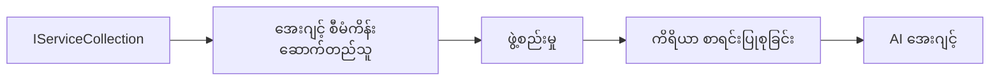

# 🎨 Azure OpenAI (Responses API) (.NET) နှင့် Agentic Design Patterns

## 📋 သင်ယူရမည့် အချက်များ

ဒီဥပမာသည် Microsoft Agent Framework ကိုအသုံးပြု၍ .NET တွင် Azure OpenAI (Responses API) ပေါင်းစပ်ခြင်းဖြင့် ဉာဏ်ရည်ရှိသော agents တည်ဆောက်ခြင်းအတွက် စက်မှုလုပ်ငန်းအဆင့်ဒီဇိုင်းပုံစံများကို ပြသပါသည်။ သင်သည် agents များကို ထုတ်လုပ်ရန် အသင့်ရှိသော၊ ပြုပြင်ထိန်းသိမ်းနိုင်သော၊ နှင့် ကျယ်ပြန့်စွာ အသုံးပြုနိုင်သော ပုံစံများနှင့် ဆောက်လုပ်ပုံနည်းများကို လေ့လာသွားမည်ဖြစ်သည်။

### စက်မှုလုပ်ငန်း ဒီဇိုင်းပုံစံများ

- 🏭 **Factory Pattern**: သက်ဆိုင်ရာ ပါဝင်မှုများဖြင့် agent ဖန်တီးမှု စံနမူနာ
- 🔧 **Builder Pattern**: Fluent agent ဖွဲ့စည်းခြင်းနှင့် ဆက်တင်လုပ်ခြင်း
- 🧵 **Thread-Safe Patterns**: တပြိုင်နက် စကားပြောခြင်း စီမံခန့်ခွဲမှု
- 📋 **Repository Pattern**: ကိရိယာများနှင့် စွမ်းဆောင်ရည် စနစ်တကျ စီမံခြင်း

## 🎯 .NET အထူး ဗဟုသုတ အကျိုးကျေးဇူးများ

### စက်မှုလုပ်ငန်း လက္ခဏာများ

- **Strong Typing**: Compile-time မှာ အတည်ပြုခြင်းနှင့် IntelliSense ကူညီမှု
- **Dependency Injection**: အတွင်းbuilt-in DI container ပေါင်းစပ်မှု
- **Configuration Management**: IConfiguration နှင့် Options ပုံစံများ
- **Async/Await**: အဆင့်မြင့် asynchronous programming ထောက်ခံမှု

### ထုတ်လုပ်မှု အသင့်ရှိသော ပုံစံများ

- **Logging Integration**: ILogger နှင့် ဖွဲ့စည်းတည်ဆောက်ထားသော logging ကူညီမှု
- **Health Checks**: အသင့်သုံးလျှောက်လမ်းညွှန်ခြင်းနှင့် နေရာတိုင်း စစ်ဆေးခြင်း
- **Configuration Validation**: Data annotations နဲ့အတူ ပြင်းထန်သော typing
- **Error Handling**: ဖွဲ့စည်း တည်ဆောက်ထားသော exception စီမံခန့်ခွဲမှု

## 🔧 နည်းပညာဆိုင်ရာ ဆောက်လုပ်ပုံ

### အခြေခံ .NET အစိတ်အပိုင်းများ

- **Microsoft.Extensions.AI**: AI ဝန်ဆောင်မှုများ ညှိနှိုင်းမှုအက်ဘစ်စ်တရေးရှင်းများ
- **Microsoft.Agents.AI**: စက်မှုလုပ်ငန်း agent အစုအဖွဲ့ ဖွဲ့စည်းမှု ဖရိမ်းဝတ်ခ်
- **Azure OpenAI (Responses API)**: မြင့်မားသော ပြုလုပ်မှု API client ပုံစံများ
- **Configuration System**: appsettings.json နှင့် ပတ်ဝန်းကျင် ပေါင်းစပ်မှု

### ဒီဇိုင်းပုံစံ အသုံးပြုမှု



## 🏗️ ဖော်ပြထားသော စက်မှုလုပ်ငန်း ပုံစံများ

### 1. **ဖန်တီးမှုပုံစံများ**

- **Agent Factory**: တစ်နေရာစီ agent ဖန်တီးခြင်းနှင့် တူညီသော ဖွဲ့စည်းမှု
- **Builder Pattern**: ရှုပ်ထွေးသော agent ဖွန်ကာမှန်းစိတ်ကြိုက် ဖွဲ့စည်းမှုအတွက် Fluent API
- **Singleton Pattern**: ဝေမျှအသုံးပြုနိုင်သော ရင်းမြစ်များနှင့် ဖွဲ့စည်းမှု စီမံခန့်ခွဲမှု
- **Dependency Injection**: အလွတ်တန်းချိတ်ဆက်မှုနှင့် စမ်းသပ်ရခက်မှုကို လျော့ချခြင်း

### 2. **အသွင်ပြောင်းပြုလုပ်မှု ပုံစံများ**

- **Strategy Pattern**: လွယ်ကူတူ ရွေးချယ်နိုင်သော ကိရိယာ ဖေါ်ဆောင်ရေးနည်းလမ်းများ
- **Command Pattern**: Undo/Redo ပါဝင်သော agent လုပ်ဆောင်ချက်များ ချုပ်ဆိုမှု
- **Observer Pattern**: ဖြစ်ရပ်ပြုလုပ်မှု အခြေခံ agent အသက်တာ စီမံမှု
- **Template Method**: စံနမူနာ agent လုပ်ဆောင်မှု လမ်းစဉ်များ

### 3. **ဖွဲ့စည်းပုံ ပုံစံများ**

- **Adapter Pattern**: Azure OpenAI (Responses API) ပေါင်းစည်းမှု အလွှာ
- **Decorator Pattern**: Agent စွမ်းဆောင်ရည် တိုးတက်စေရန်
- **Facade Pattern**: Agent အပြန်အလှန် တွှင်ရက် အင်တာဖေ့စ်များ ပွယ်ယူမှု
- **Proxy Pattern**: Lazy loading နှင့် caching လုပ်ခြင်းဖြင့် ထိရောက်မှု

## 📚 .NET ဒီဇိုင်း အကြောင်းအရာများ

### SOLID Principle များ

- **Single Responsibility**: အစိတ်အပိုင်းတိုင်း အကြောင်းတရားတစ်ခုတည်းကို တာဝန်ယူမှု
- **Open/Closed**: ပြင်ဆင်ခြင်းမလိုဘဲ တိုးချဲ့နိုင်မှု
- **Liskov Substitution**: Interface အခြေခံ ကိရိယာ အကောင်အထည်ဖော်မှုများ
- **Interface Segregation**: အာရုံစိုက်ထားသော၊ ညီညွတ်သော အင်တာဖေ့စ်များ
- **Dependency Inversion**: တိကျသော အရာများအစား abstraction များအပေါ် မူတည်ခြင်း

### သန့်ရှင်းသော ဆောက်လုပ်ပုံ

- **Domain Layer**: အဓိက agent နှင့် ကိရိယာ abstraction များ
- **Application Layer**: Agent စုပေါင်းပြီး လုပ်ငန်းစဉ်နှင့် အလုပ်လုပ်ပုံများ
- **Infrastructure Layer**: Azure OpenAI (Responses API) ပေါင်းစည်းမှုနှင့် အပြင် အကူအညီဝန်ဆောင်မှုများ
- **Presentation Layer**: အသုံးပြုသူ လုပ်ဆောင်မှုနှင့် ပြန်ကြားချက် ဖော်ပြခြင်း

## 🔒 စက်မှုလုပ်ငန်း စဉ်းစားချက်များ

### လုံခြုံရေး

- **Credential Management**: IConfiguration ဖြင့် API key များ လုံခြုံစွာ ကိုင်တွယ်ခြင်း
- **Input Validation**: ပြင်းထန်သော typing နှင့် အချက်အလက် အတည်ပြုခြင်း
- **Output Sanitization**: လုံခြုံသော ပြန်လည်ဖြေကြားမှု ပုံစံချခြင်းနှင့် စစ်ထုတ်ခြင်း
- **Audit Logging**: လုပ်ငန်းစဉ်များကို လုံးလုံး မလွတ် စီမံဖတ်ရှုခြင်း

### လုပ်ဆောင်နိုင်မှုပြည့်စုံမှု

- **Async Patterns**: ပိတ်ဆို့ခြင်း မရှိသော I/O လုပ်ငန်းများ
- **Connection Pooling**: ထိရောက်သော HTTP client စီမံခြင်း
- **Caching**: မြှင့်တင်ထားသော ပြန်လည်ဖြေကြားမှု အတွက် cache ထားခြင်း
- **Resource Management**: သင့်တင့်သော ဖယ်ရှားခြင်းနှင့် သန့်ရှင်းရေး ပုံစံများ

### ကျယ်ပြန့်မှု

- **Thread Safety**: တပြိုင်နက် agent လုပ်ငန်း ထောက်ပံ့မှု
- **Resource Pooling**: ထိရောက်သော အရင်းအမြစ် အသုံးပြုမှု
- **Load Management**: အရင်းအမြစ် ထိန်းချုပ်မှုနှင့် နောက်ကျောပိတ်ဆို့မှု ကိုင်တွယ်မှု
- **Monitoring**: လုပ်ဆောင်နိုင်မှု မီထရစ်များနှင့် ကျန်းမာရေး စစ်ဆေးမှုများ

## 🚀 ထုတ်လုပ်မှု နှင့် အလှည့်အပြောင်း

- **Configuration Management**: ပတ်ဝန်းကျင် အချက်အလက် အတိအကျ သတ်မှတ်ချက်များ
- **Logging Strategy**: ဆက်နွယ်မှု IDs ဖြင့် ဖွဲ့စည်းထားသော logging များ
- **Error Handling**: ဒေါသမပျက် လုံး၀ မှားယွင်းချက် ကြီးမားမှု စီမံခန့်ခွဲမှု
- **Monitoring**: Application insights နှင့် လုပ်ဆောင်နိုင်မှု တိုင်းတာခြင်း
- **Testing**: Unit test, integration test နှင့် load testing ပုံစံများ

.NET နဲ့ စက်မှုလုပ်ငန်းအဆင့် ဉာဏ်ရည်ထိရောက်သော agents တွေ တည်ဆောက်ဖို့ ပြင်ဆင်လား? ခိုင်ခံ့ပြီး သေချာကျင့်သုံးနိုင်တဲ့အရာတွေ ဆက်ဖော်ဆောင်ကြမယ်! 🏢✨

## 🚀 စတင်ချိန်

### လိုအပ်ချက်များ

- [.NET 10 SDK](https://dotnet.microsoft.com/download/dotnet/10.0) သို့မဟုတ် ထက်မြင့်သော
- Azure OpenAI ရင်းမြစ်နှင့် မော်ဒယ် တပ်ဆင်ထားသော [Azure subscription](https://azure.microsoft.com/free/)
- [Azure CLI](https://learn.microsoft.com/cli/azure/install-azure-cli) — `az login` ဖြင့် ဝင်ရောက်ရန်

### အရေးကြီး ပတ်ဝန်းကျင် အပြောင်းအလဲများ

```bash
# zsh/bash
export AZURE_OPENAI_ENDPOINT=https://<your-resource>.openai.azure.com
export AZURE_OPENAI_DEPLOYMENT=gpt-5-mini
# AzureCliCredential သည် token ရယူနိုင်ရန် အကောင့်ဝင်ပါ
az login
```

```powershell
# PowerShell
$env:AZURE_OPENAI_ENDPOINT = "https://<your-resource>.openai.azure.com"
$env:AZURE_OPENAI_DEPLOYMENT = "gpt-5-mini"
# AzureCliCredential သို့ token ရနိုင်ရန် အကောင့်ဝင်ပါ။
az login
```

### နမူနာကုဒ်

ကုဒ် ဥပမာကို ပြေးရန်,

```bash
# zsh/bash
chmod +x ./03-dotnet-agent-framework.cs
./03-dotnet-agent-framework.cs
```

ဒါမှမဟုတ် dotnet CLI ကို အသုံးပြု၍

```bash
dotnet run ./03-dotnet-agent-framework.cs
```

မူလကုဒ်အစိတ်အပိုင်းများ အပြည့်အစုံအတွက် [`03-dotnet-agent-framework.cs`](../../../../03-agentic-design-patterns/code_samples/03-dotnet-agent-framework.cs) ကိုကြည့်ပါ။

```csharp
#!/usr/bin/dotnet run

#:package Microsoft.Extensions.AI@10.*
#:package Microsoft.Agents.AI.OpenAI@1.*-*
#:package Azure.AI.OpenAI@2.1.0
#:package Azure.Identity@1.13.1

using System.ComponentModel;

using Microsoft.Agents.AI;
using Microsoft.Extensions.AI;

using Azure.AI.OpenAI;
using Azure.Identity;

// Tool Function: Random Destination Generator
// This static method will be available to the agent as a callable tool
// The [Description] attribute helps the AI understand when to use this function
// This demonstrates how to create custom tools for AI agents
[Description("Provides a random vacation destination.")]
static string GetRandomDestination()
{
    // List of popular vacation destinations around the world
    // The agent will randomly select from these options
    var destinations = new List<string>
    {
        "Paris, France",
        "Tokyo, Japan",
        "New York City, USA",
        "Sydney, Australia",
        "Rome, Italy",
        "Barcelona, Spain",
        "Cape Town, South Africa",
        "Rio de Janeiro, Brazil",
        "Bangkok, Thailand",
        "Vancouver, Canada"
    };

    // Generate random index and return selected destination
    // Uses System.Random for simple random selection
    var random = new Random();
    int index = random.Next(destinations.Count);
    return destinations[index];
}

// Azure OpenAI with the Responses API (stable v1 endpoint). Sign in with `az login`.
var azureEndpoint = Environment.GetEnvironmentVariable("AZURE_OPENAI_ENDPOINT")
    ?? throw new InvalidOperationException("AZURE_OPENAI_ENDPOINT is not set.");
var deployment = Environment.GetEnvironmentVariable("AZURE_OPENAI_DEPLOYMENT") ?? "gpt-5-mini";

var azureClient = new AzureOpenAIClient(new Uri(azureEndpoint), new AzureCliCredential());

// Define Agent Identity and Comprehensive Instructions
// Agent name for identification and logging purposes
var AGENT_NAME = "TravelAgent";

// Detailed instructions that define the agent's personality, capabilities, and behavior
// This system prompt shapes how the agent responds and interacts with users
var AGENT_INSTRUCTIONS = """
You are a helpful AI Agent that can help plan vacations for customers.

Important: When users specify a destination, always plan for that location. Only suggest random destinations when the user hasn't specified a preference.

When the conversation begins, introduce yourself with this message:
"Hello! I'm your TravelAgent assistant. I can help plan vacations and suggest interesting destinations for you. Here are some things you can ask me:
1. Plan a day trip to a specific location
2. Suggest a random vacation destination
3. Find destinations with specific features (beaches, mountains, historical sites, etc.)
4. Plan an alternative trip if you don't like my first suggestion

What kind of trip would you like me to help you plan today?"

Always prioritize user preferences. If they mention a specific destination like "Bali" or "Paris," focus your planning on that location rather than suggesting alternatives.
""";

// Create AI Agent with Advanced Travel Planning Capabilities
// Get the Responses client for the deployment and create the AI agent
// Configure agent with name, detailed instructions, and available tools
// This demonstrates the .NET agent creation pattern with full configuration
AIAgent agent = azureClient
    .GetChatClient(deployment)
    .AsAIAgent(
        name: AGENT_NAME,
        instructions: AGENT_INSTRUCTIONS,
        tools: [AIFunctionFactory.Create(GetRandomDestination)]
    );

// Create New Conversation Session for Context Management
// Initialize a new conversation session to maintain context across multiple interactions
// Sessions enable the agent to remember previous exchanges and maintain conversational state
// This is essential for multi-turn conversations and contextual understanding
var session = await agent.CreateSessionAsync();

// Execute Agent: First Travel Planning Request
// Run the agent with an initial request that will likely trigger the random destination tool
// The agent will analyze the request, use the GetRandomDestination tool, and create an itinerary
// Using the session parameter maintains conversation context for subsequent interactions
await foreach (var update in agent.RunStreamingAsync("Plan me a day trip", session))
{
    await Task.Delay(10);
    Console.Write(update);
}

Console.WriteLine();

// Execute Agent: Follow-up Request with Context Awareness
// Demonstrate contextual conversation by referencing the previous response
// The agent remembers the previous destination suggestion and will provide an alternative
// This showcases the power of conversation sessions and contextual understanding in .NET agents
await foreach (var update in agent.RunStreamingAsync("I don't like that destination. Plan me another vacation.", session))
{
    await Task.Delay(10);
    Console.Write(update);
}
```

---

<!-- CO-OP TRANSLATOR DISCLAIMER START -->
**ပြောကြားချက်**
ဤစာတမ်းကို AI ဘာသာပြန်ဝန်ဆောင်မှု [Co-op Translator](https://github.com/Azure/co-op-translator) အသုံးပြု၍ ဘာသာပြန်ထားပါသည်။ ကျွန်ုပ်တို့သည် တိကျမှန်ကန်မှုအတွက် ကြိုးပမ်းနေသော်လည်း၊ စက်ကိရိယာဘာသာပြန်ခြင်းများတွင် အမှားများ သို့မဟုတ် မှားယွင်းချက်များ ပါဝင်နိုင်ကြောင်း သတိပြုပါရန် လိုအပ်ပါသည်။ မူလစာတမ်းကို မူရင်းဘာသာဖြင့်သာ ယုံကြည်စိတ်ချရသော အချက်အလက်အဖြစ် သတ်မှတ်သင့်သည်။ အရေးကြီးသည့် သတင်းအချက်အလက်များအတွက် ပရော်ဖက်ရှင်နယ် လူသားဘာသာပြန်သူဝန်ဆောင်မှုကို အကြံပြုပါသည်။ ဤဘာသာပြန်ချက်ကို အသုံးပြုခြင်းမှ ဖြစ်ပေါ်လာသော နားလည်မှုကွာခြားမှုများ သို့မဟုတ် မမှန်ကန်သော အသုံးပြုမှုများအတွက် ကျွန်ုပ်တို့ တာဝန်မခံပါ။
<!-- CO-OP TRANSLATOR DISCLAIMER END -->