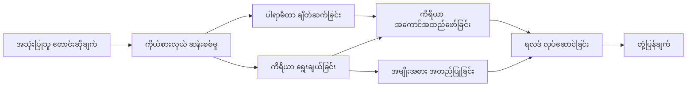

# 🛠️ Azure OpenAI (Responses API) နှင့် အဆင့်မြင့်ကိရိယာအသုံးပြုခြင်း (.NET)

## 📋 သင်ယူမည့် အချက်များ

ဤ notebook သည် .NET တွင် Microsoft Agent Framework အသုံးပြု၍ Azure OpenAI (Responses API) ဖြင့် စီးပွားရေးအဆင့်ကိရိယာ ပေါင်းစည်းမှုနမူနာများကို ပြသသည်။ C# ၏ များပြားသော typing နှင့် .NET ၏ စီးပွားရေးအတတ်ပညာများကို အသုံးချကာ ကိရိယာ အထူးပြုချက်များစွာပါဝင်သည့် agents များ ဖန်တီးရန် သင်လေ့လာမည်ဖြစ်သည်။

### သင်အောင်မြင်စွာ ကျင့်သုံးနိုင်မည့် အဆင့်မြင့်ကိရိယာ စွမ်းရည်များ

- 🔧 **ကိရိယာများစွာပါသော ဖွဲ့စည်းတည်ဆောက်မှု**: အထူးပြုစွမ်းရည်များပါရှိသည့် agents များ တည်ဆောက်ခြင်း
- 🎯 **Type-Safe ကိရိယာ အကောင်အထည်ဖော်ခြင်း**: C# ၏ compile-time စစ်ဆေးမှုကို အသုံးချခြင်း
- 📊 **စီးပွားရေးအဆင့် ကိရိယာ ပုံစံများ**: ထုတ်လုပ်မှုအဆင့် အသင့် ကိရိယာဒီဇိုင်းနှင့် အမှားကိုင်တွယ်မှု
- 🔗 **ကိရိယာ ပေါင်းစပ်ခြင်း**: စီးပွားရေးလုပ်ငန်းလည်ပတ်မှုများရှုပ်ထွေးသောအကြောင်းအရာများအတွက် ကိရိယာများ ပေါင်းစပ်ခြင်း

## 🎯 .NET ကိရိယာ ဖွဲ့စည်းတည်ဆောက်မှု အကျိုးကျေးဇူးများ

### စီးပွားရေးအဆင့် ကိရိယာ လက္ခဏာများ

- **Compile-Time စစ်ဆေးမှု**: ကိရိယာ ပေါင်းစည်းမှုမှန်ကန်မှုအတွက် သေချာသည့် typing
- **Dependency Injection**: ကိရိယာစီမံခန့်ခွဲမှုအတွက် IoC container ပေါင်းစည်းခြင်း
- **Async/Await ပုံစံများ**: မတားဆီးသော ကိရိယာ အကောင်အထည်ဖော်မှုနှင့် သင့်တော်သော 리소스စီမံခန့်ခွဲမှု
- **စနစ်တကျ မှတ်တမ်းတင်ခြင်း**: ကိရိယာ အကောင်အထည်ဖော်မှု စောင့်ကြည့်မှုအတွက် အတွင်းစိတ်မှတ်တမ်းပေါင်းစည်းခြင်း

### ထုတ်လုပ်ရေးအဆင့် အသင့် ပုံစံများ

- **Exception Handling**: အမျိုးအစားသတ်မှတ်ထားသော အမှား စီမံခန့်ခွဲမှု ပြည့်စုံမှု
- **리소스စီမံခန့်ခွဲမှု**: သင့်တော်သော သယ်ယူပစ်ခတ်ပုံစံများနှင့် မှတ်ဉာဏ် စီမံခန့်ခွဲမှု
- **စွမ်းဆောင်ရည် စောင့်ကြည့်မှု**: အတွင်းစိတ် စံနှုန်းများနှင့် စွမ်းဆောင်ရည်ကောင်တာများ
- **ဖွဲ့စည်းမှု စီမံခန့်ခွဲမှု**: စစ်ဆေးမှုနှင့်တကြ type-safe ဖွဲ့စည်းမှု

## 🔧 နည်းပညာဖွဲ့စည်းမှု

### အဓိက .NET ကိရိယာ အစိတ်အပိုင်းများ

- **Microsoft.Extensions.AI**: တစ်စုတည်း ကိရိယာ abstraction အလွှာ
- **Microsoft.Agents.AI**: စီးပွားရေးအဆင့် ကိရိယာ စီမံခန့်ခွဲမှု
- **Azure OpenAI (Responses API)**: ချိတ်ဆက်မှုစနစ်ပါဝင်သော မြန်နှုန်းမြင့် API client

### ကိရိယာ အကောင်အထည်ဖော်ခြင်း လမ်းကြောင်း



## 🛠️ ကိရိယာ အမျိုးအစားများနှင့် ပုံစံများ

### 1. **ဒေတာ ပြုပြင်ခြင်း ကိရိယာများ**

- **အင်ပွတ် စစ်ဆေးခြင်း**: ဒေတာ annotation များဖြင့် အားကောင်းစွာ typing ပြုလုပ်မှု
- **ပြောင်းလဲခြင်း လုပ်ငန်းများ**: type-safe ဒေတာ ပြောင်းလဲခြင်းနှင့် ပုံစံချခြင်း
- **စီးပွားရေးအကြံပြုချက်**: ဒေသ-specific တွက်ချက်မှုနှင့် ခွဲခြားစစ်ဆေးမှု ကိရိယာများ
- **အထွက် ပုံစံချခြင်း**: ဖွဲ့စည်းထားသော တုံ့ပြန်မှု ထုတ်လုပ်ခြင်း

### 2. **ပေါင်းစည်းမှု ကိရိယာများ** 

- **API ချိတ်ဆက်သူများ**: HttpClient နှင့် RESTful ဝန်ဆောင်မှု ပေါင်းစည်းခြင်း
- **ဒေတာဘေ့စ် ကိရိယာများ**: ဒေတာရယူမှုအတွက် Entity Framework ပေါင်းစည်းခြင်း
- **ဖိုင် လုပ်ဆောင်မှုများ**: စစ်ဆေးမှုဖြင့် ဘေးအန္တရာယ်ကင်းသော ဖိုင်စနစ် လုပ်ဆောင်မှုများ
- **ပြင်ပဝန်ဆောင်မှုများ**: တတိယပါတီ ဝန်ဆောင်မှု ပေါင်းစည်းမှု ပုံစံများ

### 3. **အသုံးဝင် ကိရိယာများ**

- **စာသား ပြုပြင်ခြင်း**: စာကြောင်း ညှိနှိုင်းခြင်းနှင့် ပုံဖော်မှု အသုံးဝင်စွမ်းဆောင်မှုများ
- **ရက်စွဲ/အချိန် လုပ်ငန်းများ**: ယဉ်ကျေးမှုအသိအမှတ်ပြု ရက်စွဲ/အချိန် တွက်ချက်မှုများ
- **သင်္ချာ ကိရိယာများ**: တိကျမှု ဂဏန်း တွက်ချက်မှုနှင့် စာရင်းဇယားလုပ်ငန်းများ
- **စစ်ဆေးရေး ကိရိယာများ**: စီးပွားရေးစည်းမျဉ်းစစ်ဆေးမှုနှင့် ဒေတာအတည်ပြုခြင်း

.NET တွင် အားကောင်းမြောက်သော၊ type-safe ကိရိယာ စွမ်းရည်များပါရှိသည့် စီးပွားရေးအဆင့် agents များ တည်ဆောက်ရန် အသင့် ဖြစ်ပါသလား? လုပ်ငန်းအဆင့်မြင့်ဖြေရှင်းချက်များ တည်ဆောက်ကြစို့! 🏢⚡

## 🚀 စတင်ရန်

### လိုအပ်ချက်များ

- [.NET 10 SDK](https://dotnet.microsoft.com/download/dotnet/10.0) သို့မဟုတ် ထို့အထက်
- Azure OpenAI အရင်းအမြစ်နှင့် မော်ဒယ် အခြားယူထားမှုပါဝင်သည့် [Azure subscription](https://azure.microsoft.com/free/)
- [Azure CLI](https://learn.microsoft.com/cli/azure/install-azure-cli) — `az login` ဖြင့် ဝင်ရောက်ရန်

### လိုအပ်သော ပတ်ဝန်းကျင် အပြောင်းအလဲများ

```bash
# zsh/bash
export AZURE_OPENAI_ENDPOINT=https://<your-resource>.openai.azure.com
export AZURE_OPENAI_DEPLOYMENT=gpt-5-mini
# ပြီးနောက် AzureCliCredential က token ရရန် အကောင့်ဝင်ပါ။
az login
```

```powershell
# PowerShell
$env:AZURE_OPENAI_ENDPOINT = "https://<your-resource>.openai.azure.com"
$env:AZURE_OPENAI_DEPLOYMENT = "gpt-5-mini"
# AzureCliCredential သည် token ကို ရရှိနိုင်ရန် အဲ့ဒီထဲသို့ လက်မှတ်ထိုးဝင်ပါ။
az login
```

### နမူနာကုဒ်

ဤကုဒ်နမူနာကို လည်ပတ်ရန်,

```bash
# zsh/bash
chmod +x ./04-dotnet-agent-framework.cs
./04-dotnet-agent-framework.cs
```

ဒါမှမဟုတ် dotnet CLI ဖြင့်:

```bash
dotnet run ./04-dotnet-agent-framework.cs
```

ပြည့်စုံသောကုဒ်အတွက် [`04-dotnet-agent-framework.cs`](../../../../04-tool-use/code_samples/04-dotnet-agent-framework.cs) ကို ကြည့်ပါ။

```csharp
#!/usr/bin/dotnet run

#:package Microsoft.Extensions.AI@10.*
#:package Microsoft.Agents.AI.OpenAI@1.*-*
#:package Azure.AI.OpenAI@2.1.0
#:package Azure.Identity@1.13.1

using System.ComponentModel;

using Microsoft.Agents.AI;
using Microsoft.Extensions.AI;

using Azure.AI.OpenAI;
using Azure.Identity;

// Tool Function: Random Destination Generator
// This static method will be available to the agent as a callable tool
// The [Description] attribute helps the AI understand when to use this function
// This demonstrates how to create custom tools for AI agents
[Description("Provides a random vacation destination.")]
static string GetRandomDestination()
{
    // List of popular vacation destinations around the world
    // The agent will randomly select from these options
    var destinations = new List<string>
    {
        "Paris, France",
        "Tokyo, Japan",
        "New York City, USA",
        "Sydney, Australia",
        "Rome, Italy",
        "Barcelona, Spain",
        "Cape Town, South Africa",
        "Rio de Janeiro, Brazil",
        "Bangkok, Thailand",
        "Vancouver, Canada"
    };

    // Generate random index and return selected destination
    // Uses System.Random for simple random selection
    var random = new Random();
    int index = random.Next(destinations.Count);
    return destinations[index];
}

// Azure OpenAI with the Responses API (stable v1 endpoint). Sign in with `az login`.
var azureEndpoint = Environment.GetEnvironmentVariable("AZURE_OPENAI_ENDPOINT")
    ?? throw new InvalidOperationException("AZURE_OPENAI_ENDPOINT is not set.");
var deployment = Environment.GetEnvironmentVariable("AZURE_OPENAI_DEPLOYMENT") ?? "gpt-5-mini";

var azureClient = new AzureOpenAIClient(new Uri(azureEndpoint), new AzureCliCredential());

// Define Agent Identity and Comprehensive Instructions
// Agent name for identification and logging purposes
var AGENT_NAME = "TravelAgent";

// Detailed instructions that define the agent's personality, capabilities, and behavior
// This system prompt shapes how the agent responds and interacts with users
var AGENT_INSTRUCTIONS = """
You are a helpful AI Agent that can help plan vacations for customers.

Important: When users specify a destination, always plan for that location. Only suggest random destinations when the user hasn't specified a preference.

When the conversation begins, introduce yourself with this message:
"Hello! I'm your TravelAgent assistant. I can help plan vacations and suggest interesting destinations for you. Here are some things you can ask me:
1. Plan a day trip to a specific location
2. Suggest a random vacation destination
3. Find destinations with specific features (beaches, mountains, historical sites, etc.)
4. Plan an alternative trip if you don't like my first suggestion

What kind of trip would you like me to help you plan today?"

Always prioritize user preferences. If they mention a specific destination like "Bali" or "Paris," focus your planning on that location rather than suggesting alternatives.
""";

// Create AI Agent with Advanced Travel Planning Capabilities
// Get the Responses client for the deployment and create the AI agent
// Configure agent with name, detailed instructions, and available tools
// This demonstrates the .NET agent creation pattern with full configuration
AIAgent agent = azureClient
    .GetChatClient(deployment)
    .AsAIAgent(
        name: AGENT_NAME,
        instructions: AGENT_INSTRUCTIONS,
        tools: [AIFunctionFactory.Create(GetRandomDestination)]
    );

// Create New Conversation Session for Context Management
// Initialize a new conversation session to maintain context across multiple interactions
// Sessions enable the agent to remember previous exchanges and maintain conversational state
// This is essential for multi-turn conversations and contextual understanding
await using var session = await agent.CreateSessionAsync();

// Execute Agent: First Travel Planning Request
// Run the agent with an initial request that will likely trigger the random destination tool
// The agent will analyze the request, use the GetRandomDestination tool, and create an itinerary
// Using the session parameter maintains conversation context for subsequent interactions
await foreach (var update in agent.RunStreamingAsync("Plan me a day trip", session))
{
    await Task.Delay(10);
    Console.Write(update);
}

Console.WriteLine();

// Execute Agent: Follow-up Request with Context Awareness
// Demonstrate contextual conversation by referencing the previous response
// The agent remembers the previous destination suggestion and will provide an alternative
// This showcases the power of conversation sessions and contextual understanding in .NET agents
await foreach (var update in agent.RunStreamingAsync("I don't like that destination. Plan me another vacation.", session))
{
    await Task.Delay(10);
    Console.Write(update);
}
```

---

<!-- CO-OP TRANSLATOR DISCLAIMER START -->
**ပြောကြားချက်**
ဤစာတမ်းကို AI ဘာသာပြန်ဝန်ဆောင်မှု [Co-op Translator](https://github.com/Azure/co-op-translator) အသုံးပြု၍ ဘာသာပြန်ထားပါသည်။ ကျွန်ုပ်တို့သည် တိကျမှန်ကန်မှုအတွက် ကြိုးပမ်းနေသော်လည်း၊ စက်ကိရိယာဘာသာပြန်ခြင်းများတွင် အမှားများ သို့မဟုတ် မှားယွင်းချက်များ ပါဝင်နိုင်ကြောင်း သတိပြုပါရန် လိုအပ်ပါသည်။ မူလစာတမ်းကို မူရင်းဘာသာဖြင့်သာ ယုံကြည်စိတ်ချရသော အချက်အလက်အဖြစ် သတ်မှတ်သင့်သည်။ အရေးကြီးသည့် သတင်းအချက်အလက်များအတွက် ပရော်ဖက်ရှင်နယ် လူသားဘာသာပြန်သူဝန်ဆောင်မှုကို အကြံပြုပါသည်။ ဤဘာသာပြန်ချက်ကို အသုံးပြုခြင်းမှ ဖြစ်ပေါ်လာသော နားလည်မှုကွာခြားမှုများ သို့မဟုတ် မမှန်ကန်သော အသုံးပြုမှုများအတွက် ကျွန်ုပ်တို့ တာဝန်မခံပါ။
<!-- CO-OP TRANSLATOR DISCLAIMER END -->