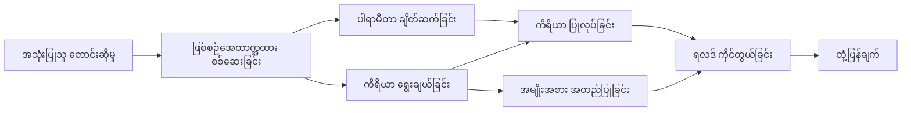

# 🛠️ Azure OpenAI (Responses API) ဖြင့် အဆင့်မြင့်ကိရိယာအသုံးပြုမှု (.NET)

## 📋 သင်ယူရမည့် ရည်မှန်းချက်များ

ဤ notebook သည် .NET တွင် Microsoft Agent Framework ကို အသုံးပြု၍ Azure OpenAI (Responses API) နှင့် Enterprise-grade ကိရိယာ ပေါင်းစပ်သည့် ပုံစံများကို ပြသသည်။ သင့်သည် C# ၏ များပြားသည့် အမျိုးအစားစစ်ဆေးမှုနှင့် .NET ၏ Enterprise အင်္ဂါရပ်များကို အသုံးပြုကာ အထူးပြုကိရိယာများစွာဖြင့် ရှုပ်ထွေးသော agent များ ဖန်တီးခြင်းကို သင်ယူပါမည်။

### သင်Masterလုပ်မည့် အဆင့်မြင့် ကိရိယာ အင်အားများ

- 🔧 **စုံလင်သော ကိရိယာစနစ်**: အထူးပြု အင်္ဂါရပ်များစွာပါရှိသည့် Agent များ ဆောက်လုပ်ခြင်း
- 🎯 **Type-Safe ကိရိယာ အကောင်အထည်ဖော်မှု**: C# ၏ compile-time စစ်ဆေးမှုကို အသုံးချခြင်း
- 📊 **Enterprise ကိရိယာ ပုံစံများ**: ထုတ်လုပ်မှုစနစ်များအတွက် ကိရိယာ ဒီဇိုင်းနှင့် အမှားစစ်ဆေးမှု
- 🔗 **ကိရိယာပေါင်းစပ်မှု**: ရိုက်ကားတည်ဆောက်မှုအတွက် ကိရိယာများ ပေါင်းစပ်ခြင်း

## 🎯 .NET ကိရိယာစနစ်၏ အကျိုးကျေးဇူးများ

### Enterprise ကိရိယာ အင်္ဂါရပ်များ

- **Compile-Time စစ်ဆေးမှု**: အမြဲတမ်း တိကျသော parameters စစ်ဆေးခြင်း
- **Dependency Injection**: Tool များ စီမံခန့်ခွဲမှုအတွက် IoC container ထည့်သွင်းခြင်း
- **Async/Await ပုံစံများ**: အနားယူမှုမရှိဘဲ Tool အတည်ပြုခြင်းနှင့် အရင်းအမြစ်များ စီမံခန့်ခွဲမှု
- **Structured Logging**: Tool အလုပ်ဆောင်မှု လိုဂ်များ ထည့်သွင်းခြင်း

### ထုတ်လုပ်မှုအဆင်သင့် ပုံစံများ

- **Exception Handling**: ဖမ်းဆီးနိုင်ပြီး အမျိုးအစားသတ်မှတ်ထားသော error များ စီမံခန့်ခွဲမှု
- **Resource Management**: သင့်တော်သော ဖျက်ပစ်မှုနှင့် ပေါ့ဖော်မှုစနစ်များ
- **Performance Monitoring**: မီတာထွက်နှင့် တိုးတက်မှု စနစ်များ ထည့်သွင်းခြင်း
- **Configuration Management**: အမျိုးအစားစစ်ဆေးမှုပါဝင်သော အပြင်အဆင် စီမံကိန်းများ

## 🔧 နည်းပညာဆိုင်ရာ ပုံစံ

### Core .NET ကိရိယာ အစိတ်အပိုင်းများ

- **Microsoft.Extensions.AI**: ကိရိယာ အထွေထွေ abstraction အဆင့်
- **Microsoft.Agents.AI**: Enterprise-grade ကိရိယာ စီမံခန့်ခွဲမှု
- **Azure OpenAI (Responses API)**: အမြန်ဆုံး API client နှင့် အချိတ်အဆက် pooling

### ကိရိယာ အကောင်အထည် ဖော်ခြင်း လုပ်ငန်းစဉ်



## 🛠️ ကိရိယာ အမျိုးအစားများနှင့် ပုံစံများ

### 1. **ဒေတာ ပြုပြင်ထိန်းသိမ်းမှု ကိရိယာများ**

- **ရိုက်ထည့်မှု စစ်ဆေးခြင်း**: ဒေတာ အမှန်တကယ်မှန်ကန်မှု အမျိုးအစားစစ်ဆေးခြင်း
- **ပြောင်းလဲမှု လုပ်ငန်းများ**: အမျိုးအစားကို သေချာစွာ ပြောင်းသည့် ဒေတာ ပုံစံပြင်ဆင်မှု
- **စီးပွားရေး အချက်အလက်**: ဒေသဆိုင်ရာ တွက်ချက်မှုနှင့် စိစစ်ရန် ကိရိယာများ
- **ထွက်ရှိမှု ဖော်ပြမှု**: စနစ်တကျ ပြန်စာထုတ်လုပ်မှု

### 2. **ပေါင်းစည်းခြင်း ကိရိယာများ**

- **API ဆက်သွယ်မှုများ**: HttpClient အသုံးပြု RESTful ဝန်ဆောင်မှု ပေါင်းစည်းမှု
- **ဒေတာဘေ့စ် ကိရိယာများ**: ဒေတာ ဝင်ရောက်မှုအတွက် Entity Framework ပေါင်းစည်းမှု
- **ဖိုင် လုပ်ငန်းများ**: စစ်ဆေးချက်နှင့်အတူ လုံခြုံသော ဖိုင်စနစ် လုပ်ငန်းများ
- **ပြင်ပ ဝန်ဆောင်မှုများ**: တတိယပါတီ ဝန်ဆောင်မှု ပေါင်းစည်းမှု ပုံစံများ

### 3. **အသုံးဝင် ကိရိယာများ**

- **စာသား ပြုပြင်ခြင်း**: စာကြောင်းစီမံခြင်းနှင့် ဖော်ပြမှု ကိရိယာများ
- **ရက်စွဲ/အချိန် လုပ်ငန်းများ**: ယဉ်ကျေးမှုသိထားမှုပါသော ရက်စွဲ/အချိန် တွက်ချက်မှုများ
- **သင်္ချာ ကိရိယာများ**: တိကျသော တွက်ချက်မှုများနှင့် စာရင်းအင်း လုပ်ငန်းများ
- **စစ်ဆေးမှု ကိရိယာများ**: စီးပွားရေးစည်းကမ်း စစ်ဆေးမှုနှင့် ဒေတာအတည်ပြုခြင်း

.NET တွင် အင်အားကိုးကူပြီး အမျိုးအစားစစ်ဆေးမှုတို့ ပါသော Enterprise-grade agent များဖန်တီးရန် အသင့်ဖြစ်ပါပြီလား? အသက်ဝင်သော ပရော်ဖက်ရှင်နယ်နည်းလမ်းများ ဆောက်လုပ်ကြစို့! 🏢⚡

## 🚀 စတင်ရန်

### မတိုင်မီလိုအပ်ချက်များ

- [.NET 10 SDK](https://dotnet.microsoft.com/download/dotnet/10.0) သို့မဟုတ် အထက်ပိုင်း
- [Azure subscription](https://azure.microsoft.com/free/), Azure OpenAI resource နှင့် မော်ဒယ် တပ်ဆင်မှု ပါရှိရမည်
- [Azure CLI](https://learn.microsoft.com/cli/azure/install-azure-cli) — `az login` ဖြင့် လက်မှတ်ထိုးဝင်ရောက်ပါ

### လိုအပ်သော ပတ်ဝန်းကျင် များ

```bash
# zsh/bash
export AZURE_OPENAI_ENDPOINT=https://<your-resource>.openai.azure.com
export AZURE_OPENAI_DEPLOYMENT=gpt-4.1-mini
# ထို့နောက် AzureCliCredential သည် token ကို ရယူနိုင်အောင် အကောင့်ဝင်ပါ
az login
```

```powershell
# PowerShell
$env:AZURE_OPENAI_ENDPOINT = "https://<your-resource>.openai.azure.com"
$env:AZURE_OPENAI_DEPLOYMENT = "gpt-4.1-mini"
# ထို့နောက် AzureCliCredential သည် တိုကင်ကို ရယူနိုင်ရန်အတွက် လော့ဂ်အင် ဝင်ပါ။
az login
```

### နမူနာ ကုဒ်

ကုဒ်နမူနာကို ဆောင်ရွက်ရန်,

```bash
# zsh/bash
chmod +x ./04-dotnet-agent-framework.cs
./04-dotnet-agent-framework.cs
```

ဒါမှမဟုတ် dotnet CLI ဖြင့်

```bash
dotnet run ./04-dotnet-agent-framework.cs
```

ပြည့်စုံသော ကုဒ်အတွက် [`04-dotnet-agent-framework.cs`](../../../../04-tool-use/code_samples/04-dotnet-agent-framework.cs) ကို ကြည့်ပါ။

```csharp
#!/usr/bin/dotnet run

#:package Microsoft.Extensions.AI@10.*
#:package Microsoft.Agents.AI.OpenAI@1.*-*
#:package Azure.AI.OpenAI@2.1.0
#:package Azure.Identity@1.13.1

using System.ComponentModel;

using Microsoft.Agents.AI;
using Microsoft.Extensions.AI;

using Azure.AI.OpenAI;
using Azure.Identity;

// Tool Function: Random Destination Generator
// This static method will be available to the agent as a callable tool
// The [Description] attribute helps the AI understand when to use this function
// This demonstrates how to create custom tools for AI agents
[Description("Provides a random vacation destination.")]
static string GetRandomDestination()
{
    // List of popular vacation destinations around the world
    // The agent will randomly select from these options
    var destinations = new List<string>
    {
        "Paris, France",
        "Tokyo, Japan",
        "New York City, USA",
        "Sydney, Australia",
        "Rome, Italy",
        "Barcelona, Spain",
        "Cape Town, South Africa",
        "Rio de Janeiro, Brazil",
        "Bangkok, Thailand",
        "Vancouver, Canada"
    };

    // Generate random index and return selected destination
    // Uses System.Random for simple random selection
    var random = new Random();
    int index = random.Next(destinations.Count);
    return destinations[index];
}

// Azure OpenAI with the Responses API (stable v1 endpoint). Sign in with `az login`.
var azureEndpoint = Environment.GetEnvironmentVariable("AZURE_OPENAI_ENDPOINT")
    ?? throw new InvalidOperationException("AZURE_OPENAI_ENDPOINT is not set.");
var deployment = Environment.GetEnvironmentVariable("AZURE_OPENAI_DEPLOYMENT") ?? "gpt-4.1-mini";

var azureClient = new AzureOpenAIClient(new Uri(azureEndpoint), new AzureCliCredential());

// Define Agent Identity and Comprehensive Instructions
// Agent name for identification and logging purposes
var AGENT_NAME = "TravelAgent";

// Detailed instructions that define the agent's personality, capabilities, and behavior
// This system prompt shapes how the agent responds and interacts with users
var AGENT_INSTRUCTIONS = """
You are a helpful AI Agent that can help plan vacations for customers.

Important: When users specify a destination, always plan for that location. Only suggest random destinations when the user hasn't specified a preference.

When the conversation begins, introduce yourself with this message:
"Hello! I'm your TravelAgent assistant. I can help plan vacations and suggest interesting destinations for you. Here are some things you can ask me:
1. Plan a day trip to a specific location
2. Suggest a random vacation destination
3. Find destinations with specific features (beaches, mountains, historical sites, etc.)
4. Plan an alternative trip if you don't like my first suggestion

What kind of trip would you like me to help you plan today?"

Always prioritize user preferences. If they mention a specific destination like "Bali" or "Paris," focus your planning on that location rather than suggesting alternatives.
""";

// Create AI Agent with Advanced Travel Planning Capabilities
// Get the Responses client for the deployment and create the AI agent
// Configure agent with name, detailed instructions, and available tools
// This demonstrates the .NET agent creation pattern with full configuration
AIAgent agent = azureClient
    .GetChatClient(deployment)
    .AsAIAgent(
        name: AGENT_NAME,
        instructions: AGENT_INSTRUCTIONS,
        tools: [AIFunctionFactory.Create(GetRandomDestination)]
    );

// Create New Conversation Session for Context Management
// Initialize a new conversation session to maintain context across multiple interactions
// Sessions enable the agent to remember previous exchanges and maintain conversational state
// This is essential for multi-turn conversations and contextual understanding
await using var session = await agent.CreateSessionAsync();

// Execute Agent: First Travel Planning Request
// Run the agent with an initial request that will likely trigger the random destination tool
// The agent will analyze the request, use the GetRandomDestination tool, and create an itinerary
// Using the session parameter maintains conversation context for subsequent interactions
await foreach (var update in agent.RunStreamingAsync("Plan me a day trip", session))
{
    await Task.Delay(10);
    Console.Write(update);
}

Console.WriteLine();

// Execute Agent: Follow-up Request with Context Awareness
// Demonstrate contextual conversation by referencing the previous response
// The agent remembers the previous destination suggestion and will provide an alternative
// This showcases the power of conversation sessions and contextual understanding in .NET agents
await foreach (var update in agent.RunStreamingAsync("I don't like that destination. Plan me another vacation.", session))
{
    await Task.Delay(10);
    Console.Write(update);
}
```

---

<!-- CO-OP TRANSLATOR DISCLAIMER START -->
**ပြောကြားချက်**
ဤစာတမ်းကို AI ဘာသာပြန်ဝန်ဆောင်မှု [Co-op Translator](https://github.com/Azure/co-op-translator) အသုံးပြု၍ ဘာသာပြန်ထားပါသည်။ ကျွန်ုပ်တို့သည် တိကျမှန်ကန်မှုအတွက် ကြိုးပမ်းနေသော်လည်း၊ စက်ကိရိယာဘာသာပြန်ခြင်းများတွင် အမှားများ သို့မဟုတ် မှားယွင်းချက်များ ပါဝင်နိုင်ကြောင်း သတိပြုပါရန် လိုအပ်ပါသည်။ မူလစာတမ်းကို မူရင်းဘာသာဖြင့်သာ ယုံကြည်စိတ်ချရသော အချက်အလက်အဖြစ် သတ်မှတ်သင့်သည်။ အရေးကြီးသည့် သတင်းအချက်အလက်များအတွက် ပရော်ဖက်ရှင်နယ် လူသားဘာသာပြန်သူဝန်ဆောင်မှုကို အကြံပြုပါသည်။ ဤဘာသာပြန်ချက်ကို အသုံးပြုခြင်းမှ ဖြစ်ပေါ်လာသော နားလည်မှုကွာခြားမှုများ သို့မဟုတ် မမှန်ကန်သော အသုံးပြုမှုများအတွက် ကျွန်ုပ်တို့ တာဝန်မခံပါ။
<!-- CO-OP TRANSLATOR DISCLAIMER END -->