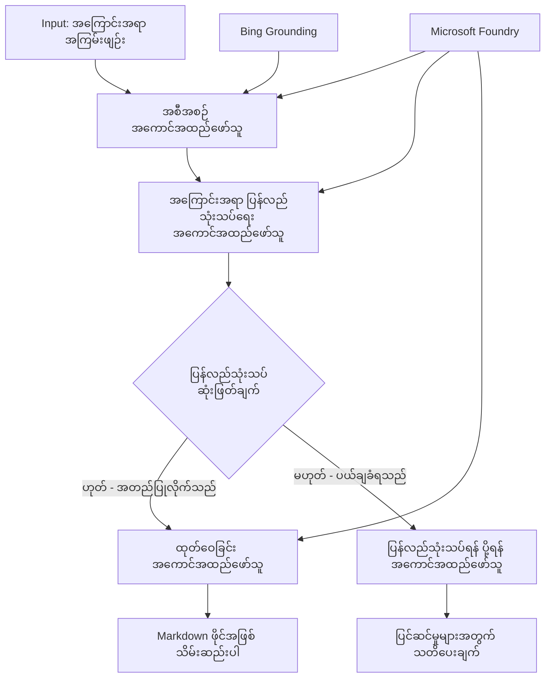

# 🔀 Microsoft Foundry (.NET) ဖြင့် အခြေအနေပေါ်မူတည်သည့် ကိုယ်စားလှယ် Workflow များ

## 📋 ဉာဏ်ရည်မြှင့်ဆုံး ဆုံးဖြတ်ချက် အခြေခံ Workflow သင်ခန်းစာ

ဒီ notebook က Microsoft Foundry နဲ့ Microsoft Agent Framework for .NET ကို အသုံးပြုပြီး **အခြေအနေပေါ်မူတည်သော Workflow patterns** တွေကို ပြသပေးပါတယ်။ AI ချက်ခြင်း၊ စီးပွားရေး စည်းကမ်းများနဲ့ စွမ်းအင်ပိုင်း အသွားအလာများအပေါ် မူတည်ပြီး ဆန်းလွယ်တဲ့ ဆုံးဖြတ်ချက်ခေါ်တိုက် workflow များကို ဖန်တီးနည်းကို သင်ယူမှာ ဖြစ်ပါတယ်။

## 🎯 သင်ယူရမည့် ရည်မှန်းချက်များ

### 🧠 **ဥာဏ်ရည်ဖြင့် ချမှတ်သည့် ဆုံးဖြတ်ချက် တည်ဆောက်မှု**
- **အခြေအနေ Logic အကောင်အထည်ဖော်ခြင်း**: ဘဏ္ဍာရေးကွဲပြားမှု အတူရှိသော ကြားခံအဆင့် Decision Trees တွေတည်ဆောက်ခြင်း
- **AI အားဖြင့် ဦးတည်ခြင်း**: Microsoft Foundry နမူနာများကို သုံးပြီး ဉာဏ်ရည်မြင့် မောင်းနှင်မှု ဆုံးဖြတ်ချက်များ ပြုလုပ်ခြင်း
- **Dynamic Workflow ကို သက်ဆိုင်သည့် အခြေအနေများအပေါ် ပြောင်းလဲညှိနှိုင်းခြင်း**: runtime နေရာယူမှုနဲ့ အခြေအနေများအပေါ် ဦးတည်မှု ပြောင်းလဲခြင်း
- **စီးပွားရေး စည်းကမ်းများ ပေါင်းစည်းခြင်း**: စီးပွားရေး ချမှတ်ချက်နဲ့ သဟဇာတ ကျင့်သုံးခြင်းကို Workflow များထဲ ထည့်သွင်းခြင်း

### 🔀 **အဆင့်မြင့် အခြေအနေ ပုံစံများ**
- **တန်းတူအချက်အလက်များဖြင့် ဆုံးဖြတ်ခြင်း**: အချက်အလက်စုံလင်မှုများကို အခြေခံ၍ ဦးတည်မှု ဆုံးဖြတ်ခြင်း
- **Context-Aware သုံးသပ်ခြင်း**: workflow history နဲ့ စုပေါင်းထားသော အချက်အလက်များအပေါ် မူတည်၍ ဆုံးဖြတ်ချက် ပြုလုပ်ခြင်း
- **သက်ဆိုင်ရာအခြေအနေများအပေါ် အလိုအလျောက် ပြောင်းလဲမှု**: အချိန်နှင့်တပြေးညီ ပရိုဆက်ဖြစ်ပုံ ရေး သိသိသာသာပြောင်းလဲမှု
- **စည်းမျဉ်းအင်ဂျင် ပေါင်းစပ်ခြင်း**: workflow များထဲ sophisticated စီးပွားရေး စည်းမျဉ်းအင်ဂျင်များ ထည့်သွင်းမှု

### 🏢 **စီးပွားရေး လုပ်ငန်းတွင် အခြေအနေပေါ် မူတည်သည့် လျှောက်လွှာများ**
- **စာရွက်ခွဲခြားမှုနှင့် ဦးတည်ပို့ဆောင်မှု**: အလိုအလျောက် စာချုပ်များကို သတ်မှတ်ထားသော workflow များသို့ ဦးတည်ပို့ဆောင်ခြင်း
- **ဖောက်သည်စီမံခန့်ခွဲမှု ချီတက်ခြင်း**: ဖောက်သည်မေးမြန်းချက်များကို ဉာဏ်ရည်ဖြင့် အထူးအဖွဲ့များသို့ ဦးတည်ပို့ဆောင်ခြင်း
- **စည်းစနစ်နှင့် စိတ်ချမ်းသာမှု ကိုင်တွယ်မှု**: စိတ်ချမ်းသာမှုကို အခြေခံပြီး အတည်ပြုခြင်းနဲ့ ပြန်လည်သုံးသပ်ခြင်းလုပ်ငန်းစဉ်များကို အသုံးပြုခြင်း
- **အရည်အသွေး အာမခံ Workflow များ**: အရည်အသွေး လက္ခဏာများအပေါ် ပါဝင်သုံးသပ်မှု ကြိုတင် အာမခံမဲ့အတိုင်း အကြောင်းအရာများပို့ရန် Workflow များ

## ⚙️ မတိုင်မီ ပြင်ဆင်ရမည့် အချက်များနှင့် သတ်မှတ်ချက်များ

### 📦 **လိုအပ်သော NuGet ပက်ကေ့ချ်များ**

Conditional workflow ဖြစ်စဉ် စီမံခန့်ခွဲမှုအတွက် ကြိုတင်ထည့်သွင်းထားသော ပက်ကေ့ချ်များ:

```xml
<!-- Core AI Framework -->
<PackageReference Include="Microsoft.Extensions.AI" Version="9.9.0" />

<!-- Azure AI Agents with Persistent State -->
<PackageReference Include="Azure.AI.Agents.Persistent" Version="1.2.0-beta.5" />

<!-- Azure Identity and Utilities -->
<PackageReference Include="Azure.Identity" Version="1.15.0" />
<PackageReference Include="System.Linq.Async" Version="6.0.3" />
<PackageReference Include="DotNetEnv" Version="3.1.1" />

<!-- Local Workflow Framework References -->
<!-- Microsoft.Agents.Workflows.dll - Advanced workflow orchestration -->
<!-- Microsoft.Agents.AI.AzureAI.dll - Microsoft Foundry integration -->
<!-- Microsoft.Agents.AI.dll - Core agent abstractions -->
```

### 🔑 **Microsoft Foundry တပ်ဆင်မှု**

**လိုအပ်သော Azure စနစ်များ။**
- Conditional processing နမူနာများပါသော Microsoft Foundry workspace
- သင့်တော်သော အလုပ်ပမာဏများနှင့် ခွင့်ပြုချက်များပါရှိသည့် Azure subscription
- ဆုံးဖြတ်ချက်ချမှုနှင့် အကြောင်းအရာ ချက်ခြင်းများအတွက် တပ်ဆင်ထားသော AI နမူနာများ
- (Optional) Grounding နည်းလမ်းအတွက် Bing Search API ချိတ်ဆက်မှု

**ပတ်ဝန်းကျင် သတ်မှတ်ချက် (.env ဖိုင်):**
```env
# Microsoft Foundry Configuration
AZURE_AI_PROJECT_ENDPOINT=https://your-project.cognitiveservices.azure.com/
BING_CONNECTION_ID=your-bing-connection-id
```

**အတည်ပြုခြင်း စနစ်:**
```csharp
// Azure CLI or Managed Identity authentication
using Azure.Identity;
var credential = new AzureCliCredential();

// Load environment configuration
DotNetEnv.Env.Load("../../../.env");
```

### 🏗️ **Conditional Workflow တည်ဆောက်ပုံ**



**အဓိကအစိတ်အပိုင်းများ:**
- **Draft Executor**: Outline များမှ မူလ အကြောင်းအရာ မိတ်ဆက်ခြင်း AI ကိုယ်စားလှယ်
- **Content Review Executor**: Draft အရည်အသွေးနဲ့ စည်းကမ်းလိုက်နာမှုကို သုံးသပ်သူ AI ကိုယ်စားလှယ်
- **Conditional Routing**: သုံးသပ်ချက်ရလဒ်အပေါ် မူတည်ပြီး ဦးတည်ပို့ဆောင်မှု ဆုံးဖြတ်ချက်များ
- **Publish/Review Paths**: အတည်ပြု/ ငြင်းပယ်ခြားနားသည့် အပိုက်အခြင်းများကို ခွဲခြားထိန်းသိမ်းခြင်း
- **State Management**: Workflow တဆင့်တည်း အကြောင်းအရာနဲ့ သုံးသပ်ချက် Context ကို တပြိုင်နက် စောင့်ရှောက်ခြင်း

## 🎨 **Conditional Workflow ဒီဇိုင်း ပုံစံများ**

### 📋 **အရည်အသွေး သတ်မှတ်ချက်များနှင့်အတူ အကြောင်းအရာ ထုတ်လုပ်မှု**
```
Outline → Draft Creation → Quality Review → {Approve: Publish | Reject: Revise}
```

### 🎯 **အန္တရာယ်အခြေခံ စာရွက်ပရိုဆက်စ်များ**
```
Document → Risk Assessment → {Low: Standard | High: Enhanced Review}
```

### 🔍 **ဥာဏ်ရည်ဖြင့် ဖောက်သည် ဝန်ဆောင်မှု ဦးတည်မှု**
```
Customer Query → Analysis → {Simple: FAQ Bot | Complex: Human Agent}
```

### 💼 **စည်းကမ်းလိုက်နာမှု ဦးတည် ကာလ Workflow များ**
```
Content → Compliance Check → {Pass: Publish | Fail: Legal Review}
```

## 🏢 **စီးပွားရေးတွင် Conditional Workflow ၏ အကျိုးကျေးဇူးများ**

### 🎯 **ဥာဏ်ရည်မြင့် အလိုအလျောက်လုပ်ငန်းစဉ်များ**
- **Smart စေသော ဆုံးဖြတ်ချက်ချက်ခြင်း**: အကြောင်းအရာနဲ့ အကြောင်းအရင်းကို အခြေခံပြီး AI powered ဦးတည်မှုပြုလုပ်ခြင်း
- **သက်ဆိုင်ရာအလုပ်များ ပြောင်းလဲခြင်း**: အခြေအနေ တပြောင်းပြန် ပြောင်းနိုင်သော Workflow များ
- **စီးပွားရေး စည်းကမ်းကျင့်သုံးခြင်း**: စည်းမျဉ်းနဲ့ မူဝါဒများကို အလိုအလျောက် သက်ဆိုင်အောင် ထားရှိခြင်း
- **Context-Aware ဦးတည်မှု**: Workflow အကြောင်းအရာနှင့် နှစ်စဉ်သုံးသပ်မှုကို အပြည့်အဝ အသုံးချ သတ်မှတ်ချက်များပြုလုပ်ခြင်း

### 📈 **လုပ်ငန်း ခေတ်မီ အောင်မြင်မှု**
- **အရင်းအမြစ် မူဝါဒအား ထိရောက်စွာ ချမှတ်ခြင်း**: လူကြီးမင်းအထူးအဆင့် ပညာရှင်နှင့် ကျွမ်းကျင်သူများသို့ အလုပ်များ ပို့ပေးခြင်း
- **လက်တွေ့ လက်ခံမှု လျော့ပါးခြင်း**: လက်မှတ်ဖြတ်ခြင်းလိုအပ်ချက် မဟုတ်အောင် အလိုအလျောက် ဆုံးဖြတ်ချက်များတည်ဆောက်ခြင်း
- **အချိန်ကျော်လွန်ခြင်း လျော့ပါးမှု**: သက်ဆိုင်သော ပညာရှင်များပို့ဆောင်မှု လျင်မြန်စွာ ပြုလုပ်ခြင်း
- **မတည့်မွန်သော စည်းမျဉ်း ထိန်းသိမ်းမှု**: စည်းမျဉ်းနဲ့ ဆုံးဖြတ်ချက် ချမှတ်ချက်များ ကျင့်သုံးမှု တည်မြဲမှုရှိစွာ ပြုလုပ်ခြင်း

### 🛡️ **အန္တရာယ်စီမံခန့်ခွဲမှုနှင့် စည်းကမ်းလိုက်နာမှု**
- **အလိုအလျောက် အန္တရာယ် သတ်မှတ်ခြင်း**: AI မောင်းနှင်မှုဖြင့် အကြောင်းအရာနှင့် အခြေအနေ အန္တရာယ်အဆင့် တွက်ချက်ခြင်း
- **စည်းကမ်း လိုက်နာမှု အတည်ပြုမှု**: မလိုအပ်သော စည်းမျဉ်း ချဉ်းကပ်မှု ဖြတ်သန်းခြင်း
- **လုံခြုံရေး စနစ် လက်ခံရေးရေ**: အန္တရာယ်အခြေအနေပေါ်မူတည် လုံခြုံရေး နည်းလမ်းတွင် တိုးတက်ကောင်းမွန်စွာ အသုံးပြုခြင်း
- **သက်ဆိုင်ရာ သောင်းသတ်မှုများ သိမ်းဆည်းမှု**: ဦးတည် ပို့ဆောင်မှု ဆုံးဖြတ်ချက်များနှင့် အကြောင်းပြချက်များကို စာရင်းသွင်း သိမ်းဆည်းခြင်း

### 📊 **ရှုထောင့် ထုတ်လုပ်မှုများနှင့် ဆက်လက်တိုးတက်မှု**
- **ဆုံးဖြတ်ချက် သုံးသပ်မှု**: ဦးတည်မှု ဆုံးဖြတ်ချက်များ ထိရောက်မှုနှင့်တိကျမှု ကြည့်ရှုခြင်း
- **ပုံစံ မှတ်မိမှု**: ဦးတည်မှု ဆုံးဖြတ်ချက်များတွင် အချိန်နှင့်အမျှ အပြောင်းအလဲများ ဆန်းစစ်ခြင်း
- **စွမ်းဆောင်ရည် တိုးတက်မှု**: ဆုံးဖြတ်ချက် ချမှတ်ချက်များနှင့် ဦးတည်မှု ထိရောက်မှု မြှင့်တင်ခြင်း
- **စီးပွားရေး ဉာဏ်ရည်**: အကြောင်းအရာ လက္ခဏာများနဲ့ ပရိုဆက်စဉ် လိုအပ်ချက်များ အပေါ် Insight ရယူခြင်း

### 🔧 **နည်းပညာ ဆိုင်ရာ တတ်မြောက်မှုများ**
- **အမြဲတမ်း သက်ဆိုင်မှု ထိန်းချုပ်မှု**: Workflow ဆောင်ရွက်မှုတခုလျှင် စာရင်း အခက်အခဲရှိသည့် State ကို ထိန်းသိမ်းခြင်း
- **ပမာဏကြီး Platform**: အမြင့်မားဆုံး conditional processing လိုအပ်ချက်များကို ကိုင်တွယ်နိုင်မှု
- **စနစ်များ ပေါင်းစည်းမှု**: ရှိပြီးသား စီးပွားရေး စနစ်များနှင့် workflow ပေါင်းစည်းခြင်း
- **ကြည့်ရှုမှုနှင့် စောင့်ကြည့်မှု**: Workflow လုပ်ဆောင်မှု နဲ့ ဆုံးဖြတ်မှုများကို လုံးဝ လေ့လာ စောင့်ကြည့်နိုင်မှု

.NET နဲ့ ဉာဏ်ရည်မြင့်ဆုံး ဆုံးဖြတ်ချက်ချမှု အခြေခံenterprise workflow များ ဖန်တီးကြပါစို့! 🚀

## 💻 ကုဒ်ကို ပြေးစေခြင်း

ပြည့်စုံတဲ့ အကောင်အထည်ဖော်မှုကို `04.dotnet-agent-framework-workflow-aifoundry-condition.cs` တွင် ရရှိနိုင်ပါတယ်။ ဒါက **အရည်အသွေး သတ်မှတ်ချက်တွေနဲ့ အကြောင်းအရာ ထုတ်လုပ်မှု Workflow** ကို ပြသပါတယ်။

### 🏗️ **Workflow တည်ဆောက်ပုံ**

```
Content Outline → Draft Creation → Quality Review → Conditional Routing:
                                                      ├─ Approved (>200 words) → Publish
                                                      └─ Rejected (<200 words) → Review Notification
```

**Workflow ထဲရှိ ကိုယ်စားလှယ်များ:**
1. **Evangelist Agent**: Bing grounding ဖြင့် Outline မှ သင်ခန်းစာ မိတ္တူရေးဆွဲခြင်း
2. **Content Reviewer Agent**: Draft အရည်အသွေး (စာလုံးရေ၊ ပြည့်စုံမှု) ကို သုံးသပ်ခြင်း
3. **Publisher Agent**: အတည်ပြုထားသော အကြောင်းအရာများကို ထုတ်ပြန် Markdown ဖိုင်များအဖြစ် သိမ်းဆည်းခြင်း

**စိတ်ကြိုက် Executor များ:**
1. **DraftExecutor**: မိတ္တူဖန်တီးခြင်း ထိန်းသိမ်းတာဝန်ယူသူ
2. **ContentReviewExecutor**: အရည်အသွေး သုံးသပ်ခြင်း ပြုလုပ်သူ
3. **PublishExecutor**: အတည်ပြုထားသော အကြောင်းအရာ ထုတ်ပြန်သူ
4. **SendReviewExecutor**: ငြင်းပယ်ထားသော အကြောင်းအရာများ သတိပေးချက် ပို့သည့်လုပ်ငန်းစဉ်

### 🚀 စမ်းသပ်ပြေးဆွဲခြင်း

**လိုအပ်ချက်များ:**
- Microsoft Foundry workspace ကို သတ်မှတ်ပြီးဖြစ်ရန်
- Azure CLI မှာ အတည်ပြုပြီးဖြစ်ရန် (`az login`)
- (Optional) Bing Search ချိတ်ဆက်မှု Grounding အတွက်

```bash
# စကရစ်ပတ်ကို အကောင့်သုံးနိုင်အောင် ပြုလုပ်ပါ (Unix/Linux/macOS)
chmod +x 04.dotnet-agent-framework-workflow-aifoundry-condition.cs

# သတ်မှတ်ထားသော workflow ကို အလုပ်လုပ် ဖို့ ပြုလုပ်ပါ
./04.dotnet-agent-framework-workflow-aifoundry-condition.cs
```

Windows တွင် အိပ်ရောက်ရေး:
```powershell
dotnet run 04.dotnet-agent-framework-workflow-aifoundry-condition.cs
```

### 📝 မျှော်လင့်ရသော ထွက်ရှိမှု

Workflow က
1. **ကိုယ်စားလှယ်များ ဖန်တီးခြင်း**: Microsoft Foundry 3 ဦးအထူးပြုပြင်ထားတဲ့ ကိုယ်စားလှယ်များ ကို စတင်တည်ဆောက်မည်။
2. **မိတ္တူ ပြုလုပ်ခြင်း**: Evangelist အေးဂျင် က Outline မှ သင်ခန်းစာ မိတ္တူရေးဆွဲမည်။
3. **အကြောင်းအရာ သုံးသပ်ခြင်း**: Content Reviewer က မိတ္တူ အရည်အသွေးကို သုံးသပ်မည်။
4. **အခြေအနေ သတ်မှတ်ကိန်း ပြုပြင်မှု**
   - **အတည်ပြု > 200 စာလုံး**: Publish Executor က Markdown ဖိုင်အဖြစ် သိမ်းဆည်းမည်။
   - **ငြင်းပယ် < 200 စာလုံး**: သတိပေးချက် ပေးပို့မည်။
5. **ရလဒ် ပြသခြင်း**: နောက်ဆုံး workflow ရလဒ် ပြသမည်။

### 🔧 စိတ်ကြိုက်ပြောင်းလဲနိုင်မှု ရွေးချယ်စရာများ

**သုံးသပ်ချက် အချက်အလက်များ ပြုပြင်ခြင်း:**
```csharp
const string ContentReviewerInstructions = @"
You are a content reviewer...
1. Check if content is more than 500 words (instead of 200)
2. Verify technical accuracy
3. Ensure proper formatting
...";
```

**အခြား Conditional လမ်းကြောင်းများ ထည့်သွင်းခြင်း:**
```csharp
var workflow = new WorkflowBuilder(draftExecutor)
    .AddEdge(draftExecutor, contentReviewerExecutor)
    .AddEdge(contentReviewerExecutor, publishExecutor, condition: GetCondition("Excellent"))
    .AddEdge(contentReviewerExecutor, editExecutor, condition: GetCondition("Good"))
    .AddEdge(contentReviewerExecutor, sendReviewerExecutor, condition: GetCondition("Poor"))
    .Build();
```

**အကြောင်းအရာ မူဝါဒများ ပြင်ဆင်ခြင်း:**
```csharp
string OUTLINE_Content = @"
# Your Custom Topic
## Section 1
https://your-reference-url
## Section 2
...
";
```

### 🎯 လက်တွေ့ အသုံးချမှုများ

ဒီ Conditional workflow ပုံစံက အထူးသင့်လျှောက်သည့်:
- **အကြောင်းအရာ စီမံခန့်ခွဲရေး စနစ်များ**: အရည်အသွေး ထိန်းသိမ်းမှုပါရှိသော အလိုအလျောက် ပြုလုပ်သော စာရင်းစနစ်များ
- **စာရွက် စီမံခန့်ခွဲမှု**: အမျိုးအစားခွဲခြားခြင်းနဲ့ စည်းကမ်းလိုက်နာမှုအတွက် စာရွက်များ ဦးတည်ပို့ဆောင်ခြင်း
- **ဖောက်သည် အကျိုးပြုပြဌာန်းမှု**: ခက်ခဲမှုနဲ့ အရေးပေါ်လိုအပ်ချက်အပေါ် အခြေခံပြီး ဥာဏ်ရည် ဖြင့် တက်တက်ကြွကြွ ဖောက်သည် မေးလ်များ စီမံခန့်ခွဲခြင်း
- **တရားဥပဒေ သုံးသပ်ခြင်း**: အန္တရာယ်နှင့် တန်ဖိုး ချက်ခြင်း အပေါ် အခြေခံပြီး စာချုပ်များ ဦးတည်ပို့ဆောင်ခြင်း
- **လူ့စွမ်းအား အရင်းအမြစ်လုပ်ငန်းစဉ်များ**: လိုအပ်သည့် စစ်ဆေးခြင်း Workflow များဖြင့် လျှောက်လွှာများ ဦးတည်ပို့ဆောင်ခြင်း

### 🔍 Conditional Logic ကို နားလည်ခြင်း

**Condition Function:**
```csharp
public Func<object?, bool> GetCondition(string expectedResult) =>
    reviewResult => reviewResult is ReviewResult review && review.Result == expectedResult;
```

ဒီ function သည် predicate တစ်ခု ဖန်တီးပြီး:
1. အဖြေသည် `ReviewResult` အမျိုးအစားဖြစ်မ ဖြစ်စစ်ဆေးသည်
2. `Result` ပုဂ္ဂိုလ်ဧ။်ကို မျှော်မှန်းထားသော တန်ဖိုးနှင့် နှိုင်းယှဉ်သည်
3. ဦးတည် လမ်းကြောင်း ချမှတ်ရန် true/false ပြန်ပေးသည်

**Workflow အရပ်များ အခြေအနေနှင့်အတူ:**
```csharp
.AddEdge(contentReviewerExecutor, publishExecutor, condition: GetCondition("Yes"))
.AddEdge(contentReviewerExecutor, sendReviewerExecutor, condition: GetCondition("No"))
```

### 📊 အဆင့်မြင့် အင်္ဂါရပ်များ

**JSON Schema အတည်ပြုမှု:**
Workflow က json schema များကို အသုံးပြုပြီး တိကျစွာ ဖြေဆိုချက်တွေကို သေချာစွာ စစ်ဆေးသည်။

```csharp
// Define response structure
public class ReviewResult
{
    [JsonPropertyName("review_result")]
    public string Result { get; set; } = string.Empty;
    
    [JsonPropertyName("reason")]
    public string Reason { get; set; } = string.Empty;
    
    [JsonPropertyName("draft_content")]
    public string DraftContent { get; set; } = string.Empty;
}

// Apply to agent
ResponseFormat = ChatResponseFormat.ForJsonSchema(
    AIJsonUtilities.CreateJsonSchema(typeof(ReviewResult)), 
    "ReviewResult", 
    "Review Result From DraftContent"
)
```

**Bing Grounding ပေါင်းစပ်မှု:**
Evangelist agent က Bing grounding ကို အသုံးပြုပြီး အချိန်နှင့်ကိုက်ညီတဲ့ အချက်အလက်များ ရယူသည်။

```csharp
var bingGroundingConfig = new BingGroundingSearchConfiguration(bing_conn_id);
BingGroundingToolDefinition bingGroundingTool = new(
    new BingGroundingSearchToolParameters([bingGroundingConfig])
);
```

ဒီနည်းပေါ်မှာ agent က Outline ထဲ URLs တွေကို လိုက်တွေ့ပြီး လက်ရှိအချက်အလက် သယ်ယူနိုင်သည်။

### 🛡️ အမှားများ ကိုင်တွယ်ခြင်း

Workflow အတွင်း ငြင်းပယ်ထားသော အကြောင်းအရာများအတွက် ပြင်းထန်သော အမှား ကိုင်တွယ်မှု ထည့်သွင်းထားသည်။
- သုံးသပ်မှု မအောင်မြင်ခြင်းများ ငြင်းပယ်လမ်းကြောင်းကို ပြုလုပ်သည်
- သတိပေးချက်များ တိကျရှင်းလင်းသော ငြင်းပယ်အကြောင်းပြချက်များ ဖြင့်ပေးသည်
- ပြင်ဆင်မှုများအတွက် အကြောင်းအရာ ကို ထိန်းသိမ်းထားသည်

### 🔄 Workflow ဖွင့်ချဲ့ခြင်း

**Revision Loop ထည့်သွင်းခြင်း:**
အလိုအလျောက် ပြန်ရေးဆွဲပေးသော ထပ်မံတင်သွင်းမှု လှုပ်ရှားမှုတစ်ခု ဖန်တီးပါ။

```csharp
.AddEdge(contentReviewerExecutor, publishExecutor, condition: GetCondition("Yes"))
.AddEdge(contentReviewerExecutor, draftExecutor, condition: GetCondition("No")) // Loop back
```

**အဆင့်အတန်းပေါင်း သုံးသပ်မှု ဆောင်ရွက်ခြင်း:**
သုံးသပ်ခြင်း အဆင့်အတန်း များစွာကို ကွဲပြားခြားနားသော အချက်အလက်များဖြင့် ပေါင်းထည့်ပါ။

```csharp
.AddEdge(draftExecutor, technicalReviewer)
.AddEdge(technicalReviewer, editorialReviewer, condition: GetCondition("TechPass"))
.AddEdge(editorialReviewer, publishExecutor, condition: GetCondition("EditPass"))
```

ဒီ Conditional workflow ပုံစံက သာယာသပ်ရပ်ပြီး ဉာဏ်ရည်ဖြင့် စီမံသည့် စက်မှုလုပ်ငန်း အလိုအလျောက်စနစ်များ တည်ဆောက်ရာတွင် အခြေခံဖြစ်စေပါသည်! 🚀

---

<!-- CO-OP TRANSLATOR DISCLAIMER START -->
**ပြောကြားချက်**
ဤစာတမ်းကို AI ဘာသာပြန်ဝန်ဆောင်မှု [Co-op Translator](https://github.com/Azure/co-op-translator) အသုံးပြု၍ ဘာသာပြန်ထားပါသည်။ ကျွန်ုပ်တို့သည် တိကျမှန်ကန်မှုအတွက် ကြိုးပမ်းနေသော်လည်း၊ စက်ကိရိယာဘာသာပြန်ခြင်းများတွင် အမှားများ သို့မဟုတ် မှားယွင်းချက်များ ပါဝင်နိုင်ကြောင်း သတိပြုပါရန် လိုအပ်ပါသည်။ မူလစာတမ်းကို မူရင်းဘာသာဖြင့်သာ ယုံကြည်စိတ်ချရသော အချက်အလက်အဖြစ် သတ်မှတ်သင့်သည်။ အရေးကြီးသည့် သတင်းအချက်အလက်များအတွက် ပရော်ဖက်ရှင်နယ် လူသားဘာသာပြန်သူဝန်ဆောင်မှုကို အကြံပြုပါသည်။ ဤဘာသာပြန်ချက်ကို အသုံးပြုခြင်းမှ ဖြစ်ပေါ်လာသော နားလည်မှုကွာခြားမှုများ သို့မဟုတ် မမှန်ကန်သော အသုံးပြုမှုများအတွက် ကျွန်ုပ်တို့ တာဝန်မခံပါ။
<!-- CO-OP TRANSLATOR DISCLAIMER END -->