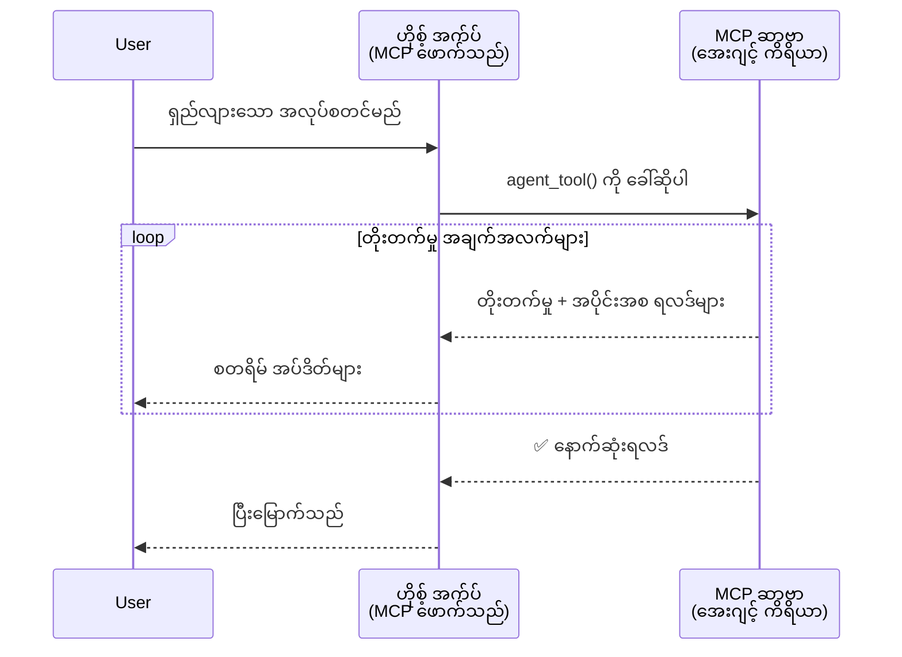
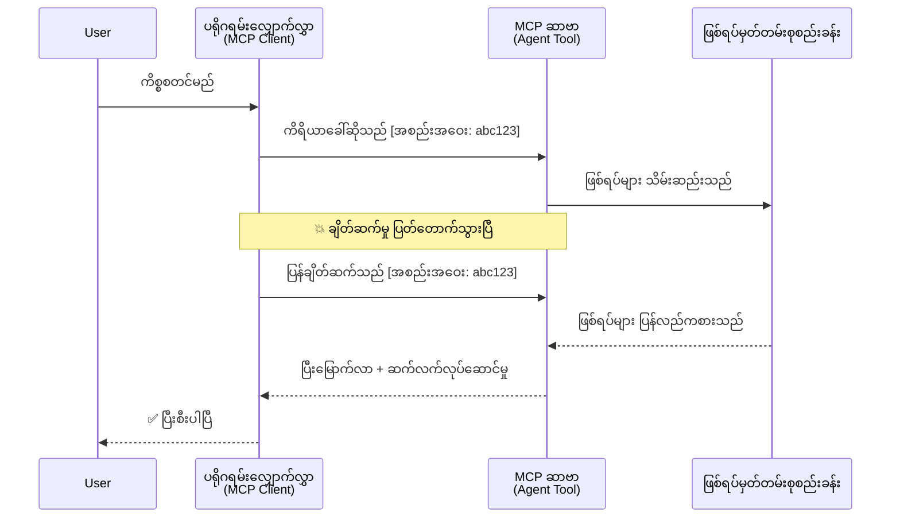
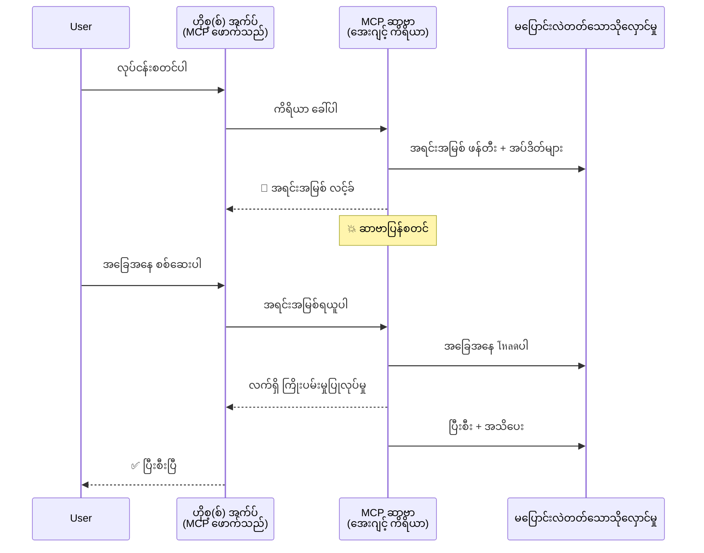
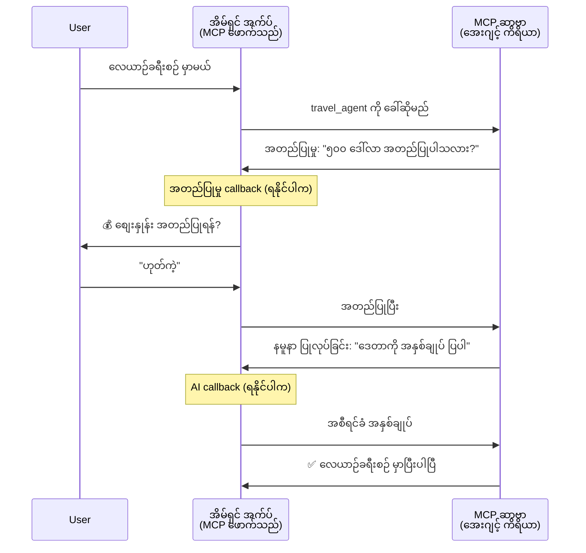
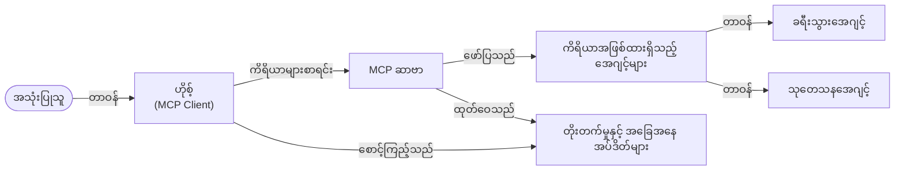

# MCP နဲ့ Agent-to-Agent ဆက်သွယ်မှု စနစ်တွေ တည်ဆောက်ခြင်း

> TL;DR - MCP ပေါ်မှာ Agent2Agent ဆက်သွယ်မှု တည်ဆောက်နိုင်မလား? ရှိပါတယ်!

MCP က "LLM များအတွက် context ပေးခြင်း" ဆိုတဲ့ မူလရည်ရွယ်ချက်ကို ကျော်လွန်ပြီး အလွန်တိုးတက်စွာ ဖွံ့ဖြိုးလာပြီ ဖြစ်ပါတယ်။ [resumable streams](https://modelcontextprotocol.io/docs/concepts/transports#resumability-and-redelivery), [elicitation](https://modelcontextprotocol.io/specification/2025-06-18/client/elicitation), [sampling](https://modelcontextprotocol.io/specification/2025-06-18/client/sampling) နှင့် ([progress](https://modelcontextprotocol.io/specification/2025-06-18/basic/utilities/progress) နှင့် [resources](https://modelcontextprotocol.io/specification/2025-06-18/schema#resourceupdatednotification)) အသိပေးချက်များအပါအဝင် နောက်ဆုံးတိုးမြှင့်ချက်များဖြင့် MCP က agent-to-agent ဆက်သွယ်မှု စနစ်ရှုပ်ထွေးများ တည်ဆောက်ရန် ခိုင်မာသော အခြေခံအဆောက်အအုံကို ဖော်ဆောင်ပေးပါတယ်။

## Agent/Tool ပေါ်တွင် ရှာရသော မွားယွင်းချက်

အများကြီး developer တွေက agentic လုပ်ဆောင်ချက်များရှိသော (ကြာရှည်လည်ပတ်သည်၊ အလယ်တွင် ထပ်မံ input လိုအပ်နိုင်သည် စသဖြင့်) ကိရိယာများကို လေ့လာရာදී MCP သည် ရိုးရှင်းသော request-response ပုံစံကြောင့် မသင့်တော်ဟု မှားယွင်းစိတ်ကူးရှိသည့် အခါများ ရှိပါတယ်။

ဒီစိတ်ကူးဟာ ယနေ့ခေတ်မဖြစ်တော့ပါ။ MCP ထုတ်ပြန်ချက်မှာ ကြာရှည် agentic အပြုအမူများ တည်ဆောက်မှုတွင် ချက်ပြောရာမရှိသော စွမ်းရည်များဖြင့် လွန်ခဲ့သောလပိုင်းများအတွင်း တိုးတက်မိုးမှုပြုလုပ်ထားပါသည်။

- **Streaming နှင့် အကြမ်းဖျင်းရလဒ်များ**: လုပ်ဆောင်နေစဉ် အချိန်နှင့်တပြေးညီ တိုးတက်မှု အနေအထားများ အပ်ဒိတ်လုပ်ခြင်း
- **Resumability**: client က ချိတ်ဆက်မှု ဖြတ်သန်းသွားရင် နောက်မှ ပြန်ဆက်ပြီး ဆက်လက် လုပ်ဆောင်နိုင်ခြင်း
- **Durability**: ရလဒ်များကို server ပြန်ဖွင့်ချိန်တွင်မကျရှုံးရန် (ဥပမာ resource link များမှတဆင့်)
- **Multi-turn**: elicitation နဲ့ sampling အသုံးပြုပြီး အလယ်တွင် အချက်အလက် အပြန်အလှန် ပေးပို့နိုင်ခြင်း

ဒီစွမ်းရည်များကို ပေါင်းစပ်ပြီး ရှုပ်ထွေးသော agentic နှင့် multi-agent ပလက်ဖောင်းများကို MCP protocol ပေါ်တွင် တည်ဆောက်နိုင်ပါတယ်။

ရည်ညွှန်းရန်အတွက် agent ကို MCP server ပေါ်ရှိ "tool" တစ်ခုအနေနဲ့ သတ်မှတ်ပါမယ်။ ဒါက MCP client ကို အသုံးပြုသည့် host application တစ်ခုရှိပြီး MCP server နှင့် session တည်ဆောက်ကာ agent ကို ခေါ်နိုင်သည်ဆိုတာကို ဖော်ပြတာပါ။

## MCP Tool ကို "Agentic" ဖြစ်စေသော အချက်များ

အကောင်အထည်ဖော်ခြင်းကို စတင်မတက်မီ ကြာရှည် agent တွေကို ထောက်ပံ့ရန် အဆောက်အအုံ စွမ်းရည်တွေ ဘာတွေလိုအပ်သလဲဆိုတာ သတ်မှတ်ကြပါစို့။

> ကျွန်ုပ်တို့ အနေဖြင့် agent ကို ကြာရှည်အတောအတွင်း ကိုယ်ပိုင်ပြုလုပ်နိုင်သော၊ ထိပ်တန်းအဆင့်ကိစ္စများကို ဆောင်ရွက်နိုင်ပြီး အများပြည်သူနှင့် မိမိလုပ်ဆောင်မှုအရ သက်ဆိုင်ရာ ပြန်လည်သုံးသပ်မှုများ လုပ်နိုင်သူ အဖွဲ့အစည်းတစ်ခုအဖြစ် သတ်မှတ်ပါမည်။

### ၁။ Streaming နှင့် အနည်းငယ်ရလဒ်များ

ရိုးရာ request-response ပုံစံတွေဟာ ကြာရှည်လုပ်ဆောင်မှုများအတွက် အသုံးမပြုနိုင်ပါ။ agent တွေက လိုအပ်တာက

- အချိန်နှင့်တပြေးညီ တိုးတက်မှု အခြေအနေများ ရရှိစေရန်
- အကြမ်းဖျင်းရလဒ်များ ပေးနိုင်ရန်

**MCP ထောက်ပံ့မှု**: Resource update notification များရော streaming အနည်းငယ်ရလဒ်များပေးနိုင်ပေမယ့် JSON-RPC 1:1 request/response ပုံစံနှင့် ညှိယူမှု လိုအပ်သည်။

| လက္ခဏာ                  | အသုံးပြုမှု                                                                                                                                    | MCP ထောက်ပံ့မှု                                                                           |
| ------------------------ | --------------------------------------------------------------------------------------------------------------------------------------------- | ------------------------------------------------------------------------------------------ |
| အချိန်နှင့်တပြေးညီ တိုးတက်မှု အပ်ဒိတ်များ | အသုံးပြုသူ ကုဒ်အခြေစိုက်တည်နေရာ ပြောင်းလဲခြင်းလုပ်ငန်းတောင်းဆိုသည်။ agent က တိုးတက်မှုများ စတင်တွဲဖက်ပြသသည် - "10% - မှီခိုအရာများ စစ်ဆေးနေသည်... 25% - TypeScript ဖိုင်များ ပြောင်းလဲနေသည်... 50% - import များ အပ်ဒိတ်နေသည်..." | ✅ Progress notification များ                                                                    |
| အနည်းငယ်ရလဒ်များ          | "စာအုပ် ရေးဆွဲပါ" လုပ်ငန်းမှာ အပိုင်းပိုင်း ရလဒ်များကို စတင်ပြသသည်။ ဥပမာ - ၁) ဇာတ်ညွှန်းအစီအစဉ်၊ ၂) အခန်းစာရင်း၊ ၃) အခန်းတိုင်း ပြီးစီးသည့်အတိုင်း။ Host က လုပ်ငန်းတခုလုံးကို စစ်ဆေး၊ ပယ်ဖျက်၊ သို့မဟုတ်ပြန်လည်ညွှန်ကြားနိုင်သည်။ | ✅ Notifications များကို "ချဲ့ထွင်" ပြုလုပ်ကာ အနည်းငယ်ရလဒ်များလည်း ပါဝင်စေနိုင်သည် - PR 383၊ 776 တွင် အဆိုပြုချက်များက ငှားသည် |

<div align="center" style="font-style: italic; font-size: 0.95em; margin-bottom: 0.5em;">
<strong>ပုံ ၁:</strong> ဒီပုံဆွဲက MCP agent က ကြာရှည်လုပ်ဆောင်မှုတွင်း host application ထံသို့ အချိန်နှင့်တပြေးညီ တိုးတက်မှု အပ်ဒိတ်များနှင့် အနည်းငယ်ရလဒ်များ သယ်ဆောင်ပို့နေခြင်းကို ဖော်ပြသည်၊ အသုံးပြုသူသည် လုပ်ဆောင်နေမှုကို တိုက်ရိုက် ကြည့်ရှုနိုင်သည်။
</div>



### ၂။ Resumability

Agent များသည် ကွန်ယက် ချိတ်ဆက်မှု ဖြတ်သန်းမှုများကို ဂရုတစိုက် စီမံနိုင်ရမည်။

- (Client) ချိတ်ဆက်မှု ဖြတ်သန်းပြီးနောက် ပြန်ဆက်ခြင်း
- မိမိထားခဲ့သောနေရာမှ ဆက်လက်လုပ်ဆောင်ခြင်း (message redelivery)

**MCP ထောက်ပံ့မှု**: MCP StreamableHTTP ကယခု session resumption နှင့် message redelivery ကို session ID များနှင့် နောက်ဆုံး event ID များဖြင့် ထောက်ပံ့ထားသည်။ အရေးကြီးချက်မှာ server က client ပြန်ဆက်နေရင် event replay လုပ်ပေးနိုင်သော EventStore ကို အကောင်အထည်ဖော်ထားရသည်။
လူထု အဆိုပြုချက် (PR #975) မှာ transport-agnostic resumable streams ကို လေ့လာခွင့်ပြုထားသည်။

| လက္ခဏာ          | အသုံးပြုမှု                                                                                                                                          | MCP ထောက်ပံ့မှု                                                             |
| ---------------- | ----------------------------------------------------------------------------------------------------------------------------------------------------- | --------------------------------------------------------------------------- |
| Resumability      | Client က ကြာရှည်လုပ်ငန်း လည်ပတ်ခွင့် ပြတ်တောက်သွားပါက ပြန်ဆက်သည့်အခါ session သည် ပျောက်ဆုံးသွားသော event များကို ပြန်လည်ထုတ်လွှင့်ပြီး တဆက်တည်း ဆက်လက်လုပ်ကိုင်သည်။                        | ✅ StreamableHTTP transport နှင့် session ID များ၊ event replay၊ EventStore    |

<div align="center" style="font-style: italic; font-size: 0.95em; margin-bottom: 0.5em;">
<strong>ပုံ ၂:</strong> ဒီပုံဆွဲက MCP StreamableHTTP transport နှင့် EventStore က client ချိတ်ဆက်မှု ဖြတ်သွားလည်း နောက်မှ ပြန်ဆက်ပြီး မပျောက်ဆုံးသော event များကို ပြန်လည်ထုတ်လွှင့်၍ လုပ်ငန်း ဆက်လက် ဆောင်ရွက်နိုင်ခြင်းကို ဖော်ပြထားသည်။
</div>



### ၃။ Durability

ကြာရွည်လုပ်ဆောင်သော agent တွေအတွက် အမြဲတမ်း သိုလှောင် နေသော အခြေအနေများ လိုအပ်သည်။

- ရလဒ်များ server restart ပျက်ခြင်းကို ရှောင်လွှဲနိုင်ရန်
- ထောက်လှမ်းမှု အလြယ်တကူ ရရှိစေရန်
- တစ်ခါတစ်လေ အချိန်ပေါင်းများစွာ ကြာရွည်သောလုပ်ငန်းများ အတွက် တိုးတက်မှုပို့ချက်များ သိရှိနိုင်ရန်

**MCP ထောက်ပံ့မှု**: MCP မွ tool call များအတွက် Resource link return type ကို ထောက်ပံ့ခဲ့သည်။ ယနေ့တွင် နမူနာတစ်ရပ်အနေနဲ့ resource တစ်ခု ဖန်တီးပြီး တစ်ချက်တည်း resource link ကို ပြန်ပေးပြီး သီးခြားလုပ်ငန်းကို နောက်ခံတွင် ဆက်လက်ပြုလုပ်သော tool တစ်ခုကို ဒီဇိုင်းဆွဲနိုင်သည်။ Client က resource အခြေအနေကို အချိန်နှင့်တပြေးညီ စစ်ဆေးရန် ရွေးချယ်နိုင်ပြီး သို့မဟုတ် resource update notifications အတွက် subscribe လုပ်နိုင်သည်။

တစ်ခြားကန့်သတ်ချက်တစ်ခုမှာ resource များကို poll မယ်ဆိုရင် သို့မဟုတ် update များအတွက် subscribe မယ်ဆိုရင် များစွာသော resource များကို သုံးစွဲရသဖြင့် မောင်းအားပိုများနိုင်သည်။ Community အသွင်ပြောင်းမှု အဆိုပြုချက်များ (#992 စတာတွေနဲ့) မှာ server က client/host application ကို update များအတွက် ဖုန်းခေါ် notification ညွှန်ပြဖို့ webhooks သို့မဟုတ် triggers ထည့်သွင်းဖို့လည်း စဉ်းစားနေကြသည်။

| လက္ခဏာ    | အသုံးပြုမှု                                                                                                                              | MCP ထောက်ပံ့မှု                                                        |
| ---------- | ----------------------------------------------------------------------------------------------------------------------------------------- | --------------------------------------------------------------------- |
| Durability | Server ပြတ်တောက်သွားသော အခါ Data migration လုပ်ငန်းတွင် ရလဒ်များနှင့် တိုးတက်မှုများ ထိန်းသိမ်းကာ Restart ပြန်လည်ထူထောင်နိုင်ခြင်း။ Client က အခြေအနေကို စစ်ဆေးပြီး အလုပ်ကို ဆက်လက် တာဝန်ယူနိုင်ခြင်း။ | ✅ Resource links နှင့် တာရှည်သိုလှောင်မှု နှင့် status notification များ     |

ယနေ့ တွင် resource တစ်ခု ဖန်တီးပြီး resource link တစ်ခု ပြန်ပေးသော tool ကိုဒီဇိုင်းဆွဲသည့် ပုံစံကလည်း လူကြိုက်များသည်။ အဲဒီ tool က နောက်ခံတွင် အလုပ်လုပ်ရင်း resource ကို update လုပ်၊ progress update အနေနဲ့ resource notification များ လုပ်ပေးနိုင်ပြီး partial result များပါ ထည့်သွင်းနိုင်သည်။

<div align="center" style="font-style: italic; font-size: 0.95em; margin-bottom: 0.5em;">
<strong>ပုံ ၃:</strong> ဒီပုံဆွဲက MCP agent တွေဟာ ထိန်းသိမ်းထားသော resource နှင့် status notification များကို အသုံးပြုပြီး ကြာရှည်လုပ်ငန်းများ server restart တွင်မတမ်း ရှိနေစေပြီး client များကို တိုးတက်မှု တစ်ဆင့်ခြုံစရာ ရလဒ် ဆွဲယူနိုင်စေကြောင်း ဖော်ပြသည်။
</div>



### ၄။ Multi-Turn အပြန်အလှန်အက်ဆေးများ

Agent တွေသည် လုပ်ဆောင်နေစဉ် အလယ်တွင် ထပ်မံ input လိုအပ်တတ်သည် -

- လူ့အသိပညာရှင်းလင်းမှု သို့မဟုတ် အတည်ပြုချက်
- AI ကူညီမှု မျှတမှု့့ညှိယူမှုများအတွက်
- ဒိုင်နမစ်ပါရာမီတာ ပြင်ဆင်ချက်များ

**MCP Support**: sampling (AI input အတွက်) နှင့် elicitation (လူ့ input အတွက်) ဖြင့် ပြည့်စုံစွာ ထောက်ပံ့ထားသည်။

| လက္ခဏာ                 | အသုံးပြုမှု                                                                                                                          | MCP ထောက်ပံ့မှု                                        |
| ----------------------- | --------------------------------------------------------------------------------------------------------------------------------- | ------------------------------------------------------ |
| Multi-Turn Interaction  | ခရီးသွားစာရင်းသွင်းမှု agent ရှိသူက အသုံးပြုသူထံမှ စျေးနှုန်း အတည်ပြုချက် တောင်းသည်၊ ထို့နောက် AI ကိုခရီးသွား အချက်အလက်ကို တိုတို ထပ်မံ ရှင်းလင်းပေးရန် တောင်းဆိုပြီး စာရင်းသွင်းမှု ကိစ္စကို ပြီးမြောက်စေသည်။ | ✅ လူ့ input အတွက် elicitation၊ AI input အတွက် sampling          |

<div align="center" style="font-style: italic; font-size: 0.95em; margin-bottom: 0.5em;">
<strong>ပုံ ၄:</strong> ဒီပုံဆွဲသည် MCP agent များသည် လုပ်ဆောင်မှု အလယ်တွင် လူ့ input ကို interactive mode ဖြင့် တောင်းယူခြင်း သို့မဟုတ် AI ကူညီမှု ရယူခြင်းများ ပြုလုပ်နိုင်ကြောင်း၊ သက်ဆိုင်ရာ အတည်ပြုချက်နှင့် ဒိုင်နမစ် ဆုံးဖြတ်ချက်များ ပါဝင်သည့် multi-turn workflow များကို ပံ့ပိုးနိုင်ကြောင်း ဖော်ပြသည်။
</div>



## MCP ပေါ်တွင် ကြာရှည် agent များ အကောင်အထည်ဖော်ခြင်း - ကုဒ် အနှစ်ချုပ်

ဒီဆောင်းပါး ထဲမှာ MCP Python SDK ကို အသုံးပြုပြီး StreamableHTTP transport ဖြင့် session resumption နှင့် message redelivery ပါတဲ့ ကြာရှည် agent များ အကောင်အထည်ဖော်ထားသည့် [code repository](https://github.com/victordibia/ai-tutorials/tree/main/MCP%20Agents) ကို ပံ့ပိုးပေးထားပါတယ်။ အကောင်အထည်ဖော်မှုက MCP စွမ်းရည်များကို ပေါင်းစပ်ပြီး ကျွမ်းကျင်သော agent ဆန်သော လုပ်ဆောင်ချက်များ ဖော်ထုတ်နိုင်မှုကို ပြသပါသည်။

အထူးသဖြင့် agent tool ၂ ခုပေါ်ကို server အနေနဲ့ အကောင်အထည်ဖော်ထားသည်။ 

- **ခရီးသွားအေဂျင့်** - elicitation ဖြင့် စျေးနှုန်း အတည်ပြုချက်ပါဝင်သည့် ခရီးသွားစာရင်းရေးကိရိယာကို တိုက်ရိုက်ပြသခြင်း
- **သုတေသနအေဂျင့်** - sampling ဖြင့် AI ကူညီရေးကို ထည့်သွင်းသည့် သုတေသန လုပ်ငန်းများ

နှစ်ခု၏ agent များစီ တိုးတက်မှုအပ်ဒိတ်များ၊ အပြန်အလှန်အတည်ပြုချက်များ၊ ပြီးတော့ session ပြန်ဆက်နိုင်မှု စွမ်းရည်များကို ပြသပေးသည်။

### အဓိက အကောင်အထည်ဖော်မှု အယူအဆများ

အောက်ပါ အပိုင်းများမှာ အကျဉ်းချုပ်အနေဖြင့် server ဘက် agent အကောင်အထည်ဖော်မှု နှင့် client ဘက် host လက်ခံသည့်ဖက် တို့အတွက် စွမ်းရည်အလိုက် ဖော်ပြထားသည်။

#### Streaming နှင့် တိုးတက်မှု အသိပေးချက်များ - လုပ်ငန်း အခြေအနေ အချိန်နှင့်တပြေးညီ ပြသခြင်း

Streaming က agent များကို ကြာရှည်လုပ်ငန်း အတွင်း တိုးတက်မှုအခြေအနေများနှင့် အကြမ်းဖျင်းရလဒ်များကို အသုံးပြုသူထံ ပေးအပ်နိုင်စေသည်။

**Server အကောင်အထည်ဖော်မှု (agent က တိုးတက်မှု အသိပေးချက် ပို့ခြင်း):**

```python
# server/server.py မှ - ခရီးသွားအေးဂျင့် အဆင့်တိုးတက်မှု အပ်ဒိတ်များ ပေးပို့ခြင်း
for i, step in enumerate(steps):
    await ctx.session.send_progress_notification(
        progress_token=ctx.request_id,
        progress=i * 25,
        total=100,
        message=step,
        related_request_id=str(ctx.request_id)
    )
    await anyio.sleep(2)  # အလုပ်ကို ဂျူဆေးကူးလှည့်ရန်

# အခြားနိုင်ငံ - နောက်ဆုံးအသေးစိတ် အဆင့်ဆင့် အပ်ဒိတ်များအတွက် မှတ်တမ်းတိုက်ရန်
await ctx.session.send_log_message(
    level="info",
    data=f"Processing step {current_step}/{steps} ({progress_percent}%)",
    logger="long_running_agent",
    related_request_id=ctx.request_id,
)
```

**Client အကောင်အထည်ဖော်မှု (host က တိုးတက်မှု အသိပေးချက် လက်ခံခြင်း):**

```python
# client/client.py မှ - ဂရုစိုက်မှုပေးနေသော စောင့်ကြည့်နေသော အစီအစဉ်များကို လက်ခံခြင်း
async def message_handler(message) -> None:
    if isinstance(message, types.ServerNotification):
        if isinstance(message.root, types.LoggingMessageNotification):
            console.print(f"📡 [dim]{message.root.params.data}[/dim]")
        elif isinstance(message.root, types.ProgressNotification):
            progress = message.root.params
            console.print(f"🔄 [yellow]{progress.message} ({progress.progress}/{progress.total})[/yellow]")

# အစီအစဉ်ဖန်တီးရာ၌ သတင်းစကားလက်ခံသူကို စာရင်းသွင်းပါ။
async with ClientSession(
    read_stream, write_stream,
    message_handler=message_handler
) as session:
```

#### Elicitation - အသုံးပြုသူ input တောင်းဆိုခြင်း

Elicitation က agent များအား လုပ်ဆောင်နေစဉ် အသုံးပြုသူ input များ တောင်းယူရန် ခွင့်ပြုသည်။ အတည်ပြုချက်၊ ရှင်းလင်းချက် သို့မဟုတ် ဆုံးဖြတ်ချက် များအတွက် အရေးကြီးသည်။

**Server အကောင်အထည်ဖော်မှု (agent က အတည်ပြုချက် တောင်းဆိုခြင်း):**

```python
# server/server.py မှ - ခရီးသွားအေးဂျင့်က စျေးနှုန်းအတည်ပြုဖို့ တောင်းဆိုနေသည်
elicit_result = await ctx.session.elicit(
    message=f"Please confirm the estimated price of $1200 for your trip to {destination}",
    requestedSchema=PriceConfirmationSchema.model_json_schema(),
    related_request_id=ctx.request_id,
)

if elicit_result and elicit_result.action == "accept":
    # ကြိုတင်ဘွတ်ခွဲမှုကို ဆက်လုပ်ပါ
    logger.info(f"User confirmed price: {elicit_result.content}")
elif elicit_result and elicit_result.action == "decline":
    # ကြိုတင်ဘွတ်ခွဲမှုကို ဖျက်မည်
    booking_cancelled = True
```

**Client အကောင်အထည်ဖော်မှု (host က elicitation callback ပေးခြင်း):**

```python
# client/client.py မှ - Client သက်ဆိုင်ရာ မေးမြန်းမှုများကို ကိုင်တွယ်ခြင်း
async def elicitation_callback(context, params):
    console.print(f"💬 Server is asking for confirmation:")
    console.print(f"   {params.message}")

    response = console.input("Do you accept? (y/n): ").strip().lower()

    if response in ['y', 'yes']:
        return types.ElicitResult(
            action="accept",
            content={"confirm": True, "notes": "Confirmed by user"}
        )
    else:
        return types.ElicitResult(
            action="decline",
            content={"confirm": False, "notes": "Declined by user"}
        )

# Session ဖန်တီးသောအခါ callback ကို မှတ်ပုံတင်ပါ
async with ClientSession(
    read_stream, write_stream,
    elicitation_callback=elicitation_callback
) as session:
```

#### Sampling - AI ကူညီမှု တောင်းဆိုခြင်း

Sampling က agent များအား လုပ်ဆောင်မှု အတွင်း AI လုပ်ငန်းကူညီမှုကို တောင်းနိုင်ခြင်းဖြစ်ပြီး လူ- AI ပေါင်းစပ်လုပ်ငန်းစဉ်များအတွက် အကောင်းဆုံးဖြစ်စေသည်။

**Server အကောင်အထည်ဖော်မှု (agent က AI ကူညီမှု တောင်းဆိုခြင်း):**

```python
# server/server.py မှ - သုတေသန အေးဂျင့်သည် AI အကျဉ်းချုပ်ကို တောင်းဆိုနေသည်
sampling_result = await ctx.session.create_message(
    messages=[
        SamplingMessage(
            role="user",
            content=TextContent(type="text", text=f"Please summarize the key findings for research on: {topic}")
        )
    ],
    max_tokens=100,
    related_request_id=ctx.request_id,
)

if sampling_result and sampling_result.content:
    if sampling_result.content.type == "text":
        sampling_summary = sampling_result.content.text
        logger.info(f"Received sampling summary: {sampling_summary}")
```

**Client အကောင်အထည်ဖော်မှု (host က sampling callback ပေးခြင်း):**

```python
# client/client.py မှ - Client ကို Sampling 요청များ ကို ကိုင်တွယ်သည်
async def sampling_callback(context, params):
    message_text = params.messages[0].content.text if params.messages else 'No message'
    console.print(f"🧠 Server requested sampling: {message_text}")

    # အမှန်တကယ် အသုံးပြုမှုတွင်၊ ဤသည်မှာ LLM API ကို ခေါ်နိုင်သည်
    # အသွင်ပြောင်းပြသမှုအတွက်၊ ကျွန်ုပ်တို့ mock တုံ့ပြန်ချက် ပေးသည်
    mock_response = "Based on current research, MCP has evolved significantly..."

    return types.CreateMessageResult(
        role="assistant",
        content=types.TextContent(type="text", text=mock_response),
        model="interactive-client",
        stopReason="endTurn"
    )

# session ဖန်တီးစဉ် callback ကို မှတ်ပုံတင်ပါ
async with ClientSession(
    read_stream, write_stream,
    sampling_callback=sampling_callback,
    elicitation_callback=elicitation_callback
) as session:
```

#### Resumability - ချိတ်ဆက်မှု ဖြတ်တောက်မှုများပြန်ဆက်ခြင်း

Resumability က ချိတ်ဆက်မှု ဖြတ်တောက်မှုများဖြစ်ပေါ်သော်လည်း agent အလုပ်များကို ဆက်လက်ပြုလုပ်နိုင်စေရန် အရေးကြီးသည်။ Event store နှင့် resumption token များဖြင့် အကောင်အထည်ဖော်သည်။

**Event Store အကောင်အထည်ဖော်မှု (server က session အခြေအနေ ထိန်းသိမ်း):**

```python
# server/event_store.py မှ - ရိုးရှင်းသော မှတ်ဉာဏ်အတွင်း အဖြစ်ရပ်များ သိမ်းဆည်းရာနေရာ
class SimpleEventStore(EventStore):
    def __init__(self):
        self._events: list[tuple[StreamId, EventId, JSONRPCMessage]] = []
        self._event_id_counter = 0

    async def store_event(self, stream_id: StreamId, message: JSONRPCMessage) -> EventId:
        """Store an event and return its ID."""
        self._event_id_counter += 1
        event_id = str(self._event_id_counter)
        self._events.append((stream_id, event_id, message))
        return event_id

    async def replay_events_after(self, last_event_id: EventId, send_callback: EventCallback) -> StreamId | None:
        """Replay events after the specified ID for resumption."""
        # နောက်ဆုံး သိရှိထားသော အဖြစ်ရပ်နောက်ပိုင်း အဖြစ်ရပ်များ ရှာဖွေပြီး ထပ်မံ ဖွင့်ကြည့်သည်
        for _, event_id, message in self._events[start_index:]:
            await send_callback(EventMessage(message, event_id))

# server/server.py မှ - အဖြစ်ရပ် သိမ်းဆည်းရာနေရာကို session မန်နေဂျာသို့ ပေးပို့ခြင်း
def create_server_app(event_store: Optional[EventStore] = None) -> Starlette:
    server = ResumableServer()

    # ပြန်လည်ဆက်လက်ရေးဆွဲရာအတွက် အဖြစ်ရပ် သိမ်းဆည်းရာနေရာနှင့် session မန်နေဂျာ ဖန်တီးသည်
    session_manager = StreamableHTTPSessionManager(
        app=server,
        event_store=event_store,  # အဖြစ်ရပ် သိမ်းဆည်းရာနေရာသည် session ပြန်လည်ဆက်လက်ခွင့်ျဖန့်ဆိုင်းသည်
        json_response=False,
        security_settings=security_settings,
    )

    return Starlette(routes=[Mount("/mcp", app=session_manager.handle_request)])

# အသုံးပြုနည်း: အဖြစ်ရပ် သိမ်းဆည်းရာနေရာဖြင့် စတင်ပါ
event_store = SimpleEventStore()
app = create_server_app(event_store)
```

**Client Metadata အကောင်အထည်ဖော်မှု (client က သိမ်းဆည်းထားသော state ဖြင့် ပြန်ဆက်):**

```python
# client/client.py မှ - metadata နှင့် Client ပြန်ဆက်ခြင်း
if existing_tokens and existing_tokens.get("resumption_token"):
    # ရှိပြီးသား resumption token ကိုအသုံးပြုပြီး ကျန်နေရာမှ ဆက်လုပ်ခြင်း
    metadata = ClientMessageMetadata(
        resumption_token=existing_tokens["resumption_token"],
    )
else:
    # ရရှိသော resumption token ကိုသိမ်းဆည်းရန် callback ဖန်တီးခြင်း
    def enhanced_callback(token: str):
        protocol_version = getattr(session, 'protocol_version', None)
        token_manager.save_tokens(session_id, token, protocol_version, command, args)

    metadata = ClientMessageMetadata(
        on_resumption_token_update=enhanced_callback,
    )

# resumption metadata နှင့် တောင်းဆိုမှု ပေးပို့ခြင်း
result = await session.send_request(
    types.ClientRequest(
        types.CallToolRequest(
            method="tools/call",
            params=types.CallToolRequestParams(name=command, arguments=args)
        )
    ),
    types.CallToolResult,
    metadata=metadata,
)
```

Host application သည် session ID များနှင့် resumption token များကို မိမိအောက်တွင် ထိန်းသိမ်းကာ session အသစ်များကို progress မပျောက်ဆုံးဘဲ ဆက်လက်ချိတ်ဆက်နိုင်စေသည်။

### ကုဒ်စီမံခန့်ခွဲမှု

<div align="center" style="font-style: italic; font-size: 0.95em; margin-bottom: 0.5em;">
<strong>ပုံ ၅:</strong> MCP အခြေခံ agent စနစ် အင်ဂျင်နီယာပုံစံ
</div>



**အဓိက ဖိုင်များ:**

- **`server/server.py`** - Elicitation, sampling နဲ့ တိုးတက်မှု အသိပေးချက်များ demo ပြထားသော travel နှင့် research agent များပါ resumption MCP server
- **`client/client.py`** - Resumption ၊ callback များနှင့် token စီမံချက် ပါဝင်သည့် interactive host application
- **`server/event_store.py`** - Session resumption နှင့် message redelivery များ အတွက် Event store အကောင်အထည်ဖော်ခြင်း

## MCP ပေါ် multi-agent ဆက်သွယ်မှု တည်ဆောက်ခြင်း

အထက်ပါ အကောင်အထည်ဖော်မှုကို Multi-agent စနစ်တွေအဖြစ် host application ၏ တိုင်းရင်းဒဏ်နည်းပညာ နှင့် ထောက်ပံ့မှု အနက်၏ ပိုမိုကျယ်ပြန့်အောင် တိုးချဲ့နိုင်သည်။

- **ဟာသစွမ်းရည် Task ခွဲခြမ်းစိတ်ဖြာခြင်း**: Host က အသုံးပြုသူ ရဲ့ ရှုပ်ထွေးသော တောင်းဆိုချက်များကို ခွဲခြမ်းပြီး ကျွမ်းကျင် agent များကို ခွဲထုတ်ပေးခြင်း
- **Multi-server ပေါင်းစည်းခြင်း**: Host က MCP server အမျိုးမျိုးနှင့် ချိတ်ဆက်ထားပြီး server တစ်ခုချင်းစီတွင် agent အမျိုးအစားကွဲပြားမှုများ ရှိသည်
- **Task အခြေအနေစီမံခန့်ခွဲမှု**: Host က concurrent agent task များ၏ တိုးတက်မှုနှင့် လိုက်နာရမည့် လုပ်ဆောင်ချက်များကို ထိန်းသိမ်းသည်။
- **ခံနိုင်ရည်နှင့် ထပ်မံကြိုးစားမှုများ**: Host က failure များကို စီမံကာ retry logic ဖြင့် လုပ်ဆောင်ချက်များ နောက်ပြန် ပြောင်းလမ်းညွှန်ပေးသည်။
- **ရလဒ်ပေါင်းစည်းခြင်း**: Host က agent များစွာ၏ ထွက်ရှိမှုများကို ပေါင်းပြီး အဆုံးသတ်ရလဒ် ထုတ်ပေးသည်။

Host က ရိုးရှင်းသော client မှ စတင်ကာ ပိုမိုလက်ထောက် သတိထားသော စီမံကိန်းဖြစ်လာပြီး MCP protocol ကို အခြေခံထားသည့် ပိုမိုဖြန့်ချိ agent စွမ်းရည်များကို ပံ့ပိုးပေးသည်။

## နိဂုံးချုပ်

MCP ၏ တိုးတက်လာသော စွမ်းရည်များဖြစ်သည့် resource notifications, elicitation/sampling, resumable streams နဲ့ persistent resource များက ရှုပ်ထွေးသော agent-to-agent ဆက်သွယ်မှုများကို ပံ့ပိုးပေးပြီး protocol ရိုးရှင်းမှုကို ထိန်းသိမ်းပေးသည်။

## စတင် အသုံးပြုခြင်း

ကိုယ်ပိုင် agent2agent စနစ် တည်ဆောက်ဖို့ အဆင့်ဆင့် လမ်းညွှန်ချက်များ:

### ၁။ Demonstration ကို ရပ်တည်ပြေးပါ

```bash
# ပြန်လာနိုင်ရေးအတွက် event store ဖြင့် server ကို စတင်ပါ
python -m server.server --port 8006

# နောက်ထပ် terminal မှာ interactive client ကို chạyပါ
python -m client.client --url http://127.0.0.1:8006/mcp
```

**Interactive mode မှာ အသုံးပြုနိုင်သော command များ:**

- `travel_agent` - elicitation ဖြင့် စျေးနှုန်း အတည်ပြုချက်ပါဝင်သော ခရီးသွားစာရင်းစာရင်းသွင်းခြင်း
- `research_agent` - sampling ဖြင့် AI ကူညီမှု ပါဝင်သော သုတေသန
- `list` - အသုံးပြုနိုင် tool များ ပြရန်
- `clean-tokens` - Resumption token များ သန့်ရှင်းရန်
- `help` - command အသေးစိတ် အကူအညီပြရန်
- `quit` - client ထွက်ရန်

### ၂။ Resumption စွမ်းရည် များ စမ်းသပ်ပါ

- ကြာရှည် agent တစ်ခု စတင်ပါ (ဥပမာ `travel_agent`)
- လုပ်ငန်းဆောင်ရွက်နေစဉ် client ကို ခြစ်ထုတ်ပါ (Ctrl+C)
- client ကို ပြန်လည်စတင်သည် - မိမိနေရာမှ ဆက်လက်လုပ်ငန်း ဆက်လက်လုပ်နိုင်

### ၃။ စမ်းသပ်ပြီး မျှဝေပါ

- **နမူနာများကို လေ့လာပါ**: ဒီ [mcp-agents](https://github.com/victordibia/ai-tutorials/tree/main/MCP%20Agents) ကိုကြည့်ပါ
- **အသိုင်းအဝိုင်းတွင် ပါဝင်ပါ**: MCP ဆွေးနွေးပွဲများ GitHub တွင် ပါဝင်ဆောင်ရွက်ပါ
- **စမ်းသပ်လုပ်ဆောင်မှု**: ရိုးရှင်းသော ကြာရှည် အလုပ်ကို စတင်ပြီး Streaming, Resumability နှင့် Multi-agent စည်းရုံးမှု ပေါင်းထည့်ပါ

ဒီဟာက MCP က agent intelligence ကို tool-based ရိုးရှင်းမှု ထိန်းသိမ်းထားကာ မိမိ လုပ်ဆောင်နိုင်တဲ့ နည်းလမ်းကို ပြသထားတာဖြစ်သည်။

MCP protocol specification က အရမ်းမြန်မြန်ဖွံ့ဖြိုးလာနေတဲ့အတွက် နောက်ဆုံး လူသိများထားရအောင် တရားဝင် documentation website ကို စစ်ဆေးဖတ်ရှုဖို့ အကြံပြုလိုပါတယ် - https://modelcontextprotocol.io/introduction

---

<!-- CO-OP TRANSLATOR DISCLAIMER START -->
**ပြောကြားချက်**
ဤစာတမ်းကို AI ဘာသာပြန်ဝန်ဆောင်မှု [Co-op Translator](https://github.com/Azure/co-op-translator) အသုံးပြု၍ ဘာသာပြန်ထားပါသည်။ ကျွန်ုပ်တို့သည် တိကျမှန်ကန်မှုအတွက် ကြိုးပမ်းနေသော်လည်း၊ စက်ကိရိယာဘာသာပြန်ခြင်းများတွင် အမှားများ သို့မဟုတ် မှားယွင်းချက်များ ပါဝင်နိုင်ကြောင်း သတိပြုပါရန် လိုအပ်ပါသည်။ မူလစာတမ်းကို မူရင်းဘာသာဖြင့်သာ ယုံကြည်စိတ်ချရသော အချက်အလက်အဖြစ် သတ်မှတ်သင့်သည်။ အရေးကြီးသည့် သတင်းအချက်အလက်များအတွက် ပရော်ဖက်ရှင်နယ် လူသားဘာသာပြန်သူဝန်ဆောင်မှုကို အကြံပြုပါသည်။ ဤဘာသာပြန်ချက်ကို အသုံးပြုခြင်းမှ ဖြစ်ပေါ်လာသော နားလည်မှုကွာခြားမှုများ သို့မဟုတ် မမှန်ကန်သော အသုံးပြုမှုများအတွက် ကျွန်ုပ်တို့ တာဝန်မခံပါ။
<!-- CO-OP TRANSLATOR DISCLAIMER END -->