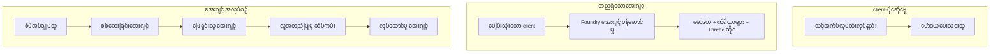
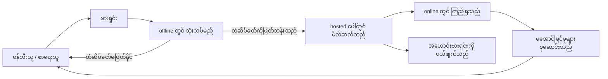
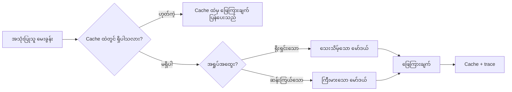
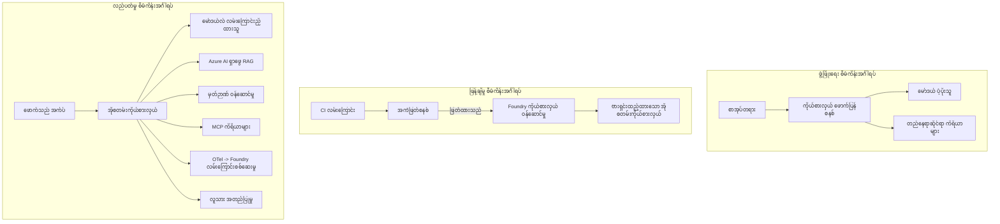

# Microsoft Foundry ဖြင့် တိုးချဲ့နိုင်သော ဧည့်သည်များ တပ်ဆင်ခြင်း


ဒီအတန်း အထိ သင်သည် သင့်လပ်တော့ပေါ်တွင်၊ သတင်းစာမှတ်တမ်းထဲတွင်၊ `az login` နှင့် ပတ်ဝန်းကျင်အပြောင်းအလဲအနည်းငယ်ဖြင့် တက်ကြွစွာ လည်ပတ်သော ဧည့်သည်များကို တည်ဆောက်ခဲ့သည်။ ၎င်းသည် သင်ယူရန် သင့်တော်သည့်နည်းလမ်းဖြစ်သည်။ မနက် ၃ နာရီတွင် သောင်းပေါင်းများစွာသော ဖောက်သည်များ ယုံငြိမ်စွာပေါ်မူတည်သည့် ဧည့်သည်တစ်ခုကို လည်ပတ်ရန် သင့်တော်သော နည်းလမ်းမဟုတ်ပါ။

ဒီသင်ခန်းစာမှာ "ကျွန်ုပ်၏ စက်မှာ အလုပ်လုပ်တယ်" နဲ့ "ထုတ်လုပ်မှုမှာ ယုံကြည်စိတ်ချစွာနဲ့ စျေးသက်သက်သာသာ အလုပ်လုပ်တယ်" ဆိုတဲ့အကြား ရှားပါးတဲ့ အချက်ကို ဆက်စပ်နေပါတယ်။ ကျွန်ုပ်တို့မှာ **Microsoft Foundry** နဲ့ **Microsoft Foundry Agent Service** ကို အသုံးပြုပြီး၊ စွန့်စားမှုကိရိယာများ၊ ပြန်ကြားမှု၊ မှတ်ဉာဏ်၊ အကဲဖြတ်မှု နှင့် ကြည့်ရှုမှု ပါဝင်တဲ့ တကယ့် ဖောက်သည်ဆက်သွယ်ရေး ဧည့်သည်တစ်ဦးကို တည်ဆောက်ခြင်းဖြင့် အဲဒီအကွာအဝေးကို ပိတ်ဆို့မှာ ဖြစ်ပါတယ်။

## နိဒါန်း

ဒီသင်ခန်းစာမှာ ပါဝင်သည့်အချက်များမှာ -

- **နမူနာဧည့်သည်** နဲ့ **တပ်ဆင်ထားသော ဧည့်သည်** တွေကြားက ကြာခြားချက်၊ နည်းပညာပုံစံအပြင် တခြားပတ်ဝန်းကျင် အသေးစိတ်များပါ။
- ဧည့်သည်များအတွက် **တပ်ဆင်ပုံစံများ**: client-hosted, service-hosted (Hosted Agents), နဲ့ workflow-orchestrated။
- Microsoft Foundry မှာ **ဧည့်သည်အသက်တာဇာတ်ကောင်** — တည်ဆောက်ခြင်း၊ ဗားရှင်းထုတ်ခြင်း၊ တပ်ဆင်ခြင်း၊ အကဲဖြတ်ခြင်း၊ စောင့်ကြည့်ခြင်း၊ သက်တမ်းကုန်ခြင်း။
- **တိုးချဲ့ခြင်းနည်းဗျူဟာများ**: ပုံစံအလိုက် ဦးတည်မှု၊ cache ထိန်းချုပ်မှု၊ တပြိုင်နက်ဆောင်ရွက်မှု၊ နောက်ခံအခြေအနေမရှိတဲ့ ဒီဇိုင်း။
- OpenTelemetry နှင့် Foundry ရေးနေရာများဖြင့် **ကြည့်ရှုနိုင်မှု**။
- ပုံစံရွေးချယ်ခြင်း၊ ဦးတည်မှု၊ အကဲဖြတ်ခြင်းအဆင့်များမှတဆင့် **ကုန်ကျစရိတ် ထိန်းချုပ်မှု**။
- **စီးပွားရေး လုပ်ငန်းစဉ်များ**: အုပ်ချုပ်မှု၊ လူ့ခွင့်ပြုချက်၊ MCP server များကို ထုတ်လုပ်မှုတွင်လုံခြုံစွာ ပြုလုပ်ခြင်း။

## သင်ယူရန် ရည်ရွယ်ချက်များ

ဒီသင်ခန်းစာပြီးဆုံးသည်နှင့် သင်သိထားရမည့်အချက်များမှာ -

- ဧည့်သည်၏ အလုပ်လုပြီးမှုအတွက် မှန်ကန်သည့် တပ်ဆင်မှုပုံစံကို ရွေးချယ်နည်း။
- ဧည့်သည်တစ်ဦးကို Microsoft Foundry Agent Service သို့ တပ်ဆင်ပြီး ဗားရှင်းထုတ်ခြင်း၊ အုပ်ချုပ်ခြင်းနဲ့ ကြည့်ရှုနိုင်ခြင်း။
- တစ်ဦးချင်း tracing အတွက် ဧည့်သည်ကို စက်ရုပ်ရှိရှိ တပ်ဆင်ခြင်းနှင့် ထုတ်လွှင့်မှုတိုင်း မတိုင်မီ ပြေးဆွဲသည့် အကဲဖြတ်မှုလမ်းကြောင်းကို ချိတ်ဆက်ခြင်း။
- ပုံစံ ဦးတည်မှု နှင့် cache ထိန်းချုပ်ခြင်းဖြင့် စွမ်းဆောင်ရည်နှင့် စရိတ် လျှော့ချထားနိုင်ခြင်း။
- အန္တရာယ်ရှိသော လုပ်ငန်းများအတွက် လူ့ခွင့်ပြုချက်ကို ထည့်သွင်းပြီး MCP server ကို ထုတ်လုပ်မှုပုံစံတစ်ရပ်အနေနဲ့ ပေါင်းစည်းခြင်း။

## လိုအပ်ချက်များ

ဒီသင်ခန်းစာသည် ယခင်သင်ခန်းစာများ ပြီးစီးပြီးနှင့် အောက်ပါအချက်များရှိကြောင်း မျှော်လင့်သည်။

- [Microsoft Agent Framework](../14-microsoft-agent-framework/README.md) ဖြင့် ဧည့်သည်များ တည်ဆောက်ခြင်း (သင်ခန်းစာ ၁၄)။
- [Tool Use](../04-tool-use/README.md) (သင်ခန်းစာ ၄) နှင့် [Agentic RAG](../05-agentic-rag/README.md) (သင်ခန်းစာ ၅)။
- [Agent Memory](../13-agent-memory/README.md) (သင်ခန်းစာ ၁၃) နှင့် [Agentic Protocols / MCP](../11-agentic-protocols/README.md) (သင်ခန်းစာ ၁၁)။
- [Observability and Evaluation](../10-ai-agents-production/README.md) (သင်ခန်းစာ ၁၀) — ဒီသင်ခန်းစာသည် တိုက်ရိုက် မူတည်သည်။

သင်လိုအပ်မည့်အချက်များမှာ -

- **Azure subscription** တစ်ခုနှင့် အနည်းဆုံးတစ်ခုတပ်ဆင်ထားသော **Microsoft Foundry project** တစ်ခု။
- **Azure CLI** မှာ အတည်ပြုထား ( `az login`)။
- Python 3.12+ နှင့် repository ထဲရှိ [`requirements.txt`](../../../requirements.txt) ထဲက package များ။

## တမူခြားနားမှု — နမူနာ မှ ထုတ်လုပ်မှု

နမူနာဧည့်သည်နဲ့ ထုတ်လုပ်မှုပေါ်တွင် အသုံးပြုသော ဧည့်သည်သည် အခြေခံ loop တူညီသည် — အကြောင်းရှာဖွေခြင်း၊ ကိရိယာခေါ်ခြင်း၊ ပြန်ဖြေခြင်း။ Loop အပြင်တွင် ပါဝင်သည့် အရာအားလုံးက ပြောင်းလဲသည်။ ပုံစံသည် ထုတ်လုပ်မှု ဧည့်သည်တစ်ဦး၏ ၂၀% ခန့်သာဖြစ်ပြီး၊ ၈၀% ကျော်သည် စစ်ဆင်ရေး skeleton ဖြစ်သည်။

| စိုးရိမ်စရာ | နမူနာ | ထုတ်လုပ်မှု |
| --- | --- | --- |
| **တည်နေရာ** | သင့် notebook ထဲတွင် လည်ပတ်သည် | သင့်တပ်ဆင်ထားသော ဝန်ဆောင်မှုအနေနဲ့ လည်ပတ်ပြီး ဗားရှင်းထုတ်နှင့် ပြန်လည်ဝင်တင်သည် |
| **သက်သေခံလက္ခဏာ** | သင့် `az login` token | Scoped RBAC နဲ့ ချိတ်ဆက်ထားသော managed identity |
| **အခြေအနေ** | စိတ်ပိုင်းဖြစ်ပြီး ပြန်စတင်သည့်အခါ ဆုံးရှုံးသည် | ပစ္စည်းပြင်ပ (thread store, memory service) |
| **တိုက်ခိုက်မှု** | traceback ကို တွေ့မိသည် | မရောက်ဖူးစွာ ထပ်မံကြိုးစားခြင်း၊ fallbacks၊ dead-letter, alerts |
| **ကုန်ကျစရိတ်** | "အနည်းငယ်သာ" | တောင်းဆိုမှု အလိုက် မှတ်တမ်းပြုခြင်း၊ ဦးတည် နယ်မြေ၊ cache ထိန်းချုပ်မှု၊ budget ထိန်းချုပ်မှု |
| **အရည်အသွေး** | output ကို မျက်စိဖြင့် တွက်ချက်သည် | ထုတ်လွှင့်ခြင်း မတိုင်မီ အလိုအလျောက် အကဲဖြတ်သည် |
| **ယုံကြည်မှု** | လုပ်ဆောင်မှု တစ်ခုချင်း အတည်ပြုသည် | ညွှန်ကြားချက် + အန္တရာယ်မြင့် လုပ်ငန်းများအတွက် လူထဲ ပါဝင်သည် |

ဒီဇယားကို မှတ်ထားပါ။ အောက်ပါပိုင်းတိုင်းသည် ဒီဇယားထဲက အတန်းတစ်ခုနှင့် ကိုက်ညီပါတယ်။

## ဧည့်သည် တပ်ဆင် ပုံစံများ

သင် အသုံးပြုမည့် ပုံစံသုံးမျိုးရှိပြီး အချို့ကို ပေါင်းစပ်အသုံးပြုလေ့ရှိသည်။

### ၁။ Client-Hosted Agents

ဧည့်သည်အရာဝတ္တုသည် *သင့်* အက်ပ်ပလီကေးရှင်းနေရာအတွင်း နေထိုင်သည်။ သင့်ကုဒ်သည် မော်ဒယ်ပေးသွင်းသူကို တိုက်ရိုက်ခေါ်သည်။ အကြောင်းရှာဖွေမှု loop သည် သင့်ဝန်ဆောင်မှုအတွင်း လည်ပတ်သည်။ ယခင်သင်ခန်းစာ တစ်ခုချင်းစီက လုပ်နေတဲ့နည်းပမာဏပါ။

- **သုံးစွဲရန်** loop ကို လုံးဝထိန်းချုပ်ရန်၊ စိတ်တိုင်းကျ အလယ်တန်း အခြား middleware အသုံးပြုရန် သို့မဟုတ် ဧည့်သည်ကို ရှိပြီးသား backend ပေါ်တွင် ထည့်သွင်းလိုသောအခါ။
- **ကုန်ကျစရိတ်**: စွမ်းဆောင်ရည် တိုးချဲ့ခြင်း၊ အခြေအနေ နှင့် ပြန်လည်ပြုပြင်ခြင်းကို ကိုယ်တိုင်တာဝန်ယူရမည်။

### ၂။ Hosted Agents (Foundry Agent Service)

ဧည့်သည်သည် Microsoft Foundry တွင် *အရင်းအမြစ်* အနေနဲ့ မှတ်ပုံတင်ထားသည်။ Foundry သည် အကြောင်းရှာဖွေရမှု loop ကို ထိန်းသိမ်းထားပြီး thread များကို သိုလှောင်သည်၊ အကြောင်းအရာလုံခြုံမှုနှင့် RBAC ကို ကာကွယ်ပေးသည်၊ ဧည့်သည်ကို Foundry portal တွင် မြင်သာအောင် ပြုလုပ်သည်။ သင့် အက်ပ်သည် သေးငယ်သော client တစ်ခုဖြစ်ပြီး thread များ ဖန်တီး၍ တုံ့ပြန်ချက်များကို ဖတ်ရှုသည်။

- **သုံးစွဲရန်** ပိုင်ရှင်အလိုက် ခေတ်မီ ကြည့်ရှုနိုင်မှု၊ အုပ်ချုပ်မှု၊ ပိုမိုပါဝင်သော စီမံခန့်ခွဲမှု။
- **ကုန်ကျစရိတ်**: စီမံခန့်ခွဲထားသော runtime အားသာချက်အတွက် နည်းနည်းနိမ့်သော ထိန်းချုပ်မှု။

### ၃။ Agent Workflows

လုပ်ဆောင်ချက်များစွာရှိသော ဧည့်သည်များ (နဲ့ ကိရိယာများ) ပါဝင်ပြီး အတည်ပြု ထိန်းချုပ်မှုလမ်းကြောင်းဖြင့် တစ်ကြောင်းဆက်လိုက် ပြုလုပ်မှု, ရွေးချယ်မှုများ၊ လူ့ခွင့်ပြုချက်နောက်ခံများ၊ ရပ်နှင့် ပြန်လုပ်နိုင်သော checkpoint များ ပါဝင်သည်။ ၎င်းမှာ Microsoft Agent Framework **Workflows** စွမ်းဆောင်ရည်ကို တပ်ဆင်မှု သိုက်ငင်၌ ဆက်သုံးခြင်းဖြစ်သည်။

- **သုံးစွဲရန်** အလုပ်တစ်ခုတွင် အထူးပြု၍ ဧည့်သည်အမျိုးမျိုး အစိတ်အပိုင်းများ ပါဝင် သို့မဟုတ် အလယ်တွင် ခွင့်ပြုချက် ကြောင်းလိုအပ်သောအခါ။
- **ကုန်ကျစရိတ်**: အပိုပိုင်းများ များပြားခြင်း၊ orchestration အဆင့်တွင် ကြည့်ရှုနိုင်မှု လိုအပ်ခြင်း။



## Microsoft Foundry မှ ဧည့်သည် အသက်တာဇာတ်ကောင်

ဧည့်သည် တပ်ဆင်ခြင်းသည် တစ်ကြိမ်တည်း `push` တစ်ခုမဟုတ်ပါ။ ၎င်းမှာ loop ဖြစ်ပြီး ဆော့ဖ်ဝဲ မိတ်ဆက်မှု ကဲ့သို့ပဲ ဖြစ်သည်။



အဓိက ဖော်ပြချက်မှာ [Lesson 10](../10-ai-agents-production/README.md) မှ ပြန်လည်ယူဆောင်လာတာဖြစ်ပြီး - **offline အကဲဖြတ်ခြင်းသည် gate ဖြစ်ပြီး နောက်ဆုံးတွင် ကြည့်သော အကြောင်းအရာ မဟုတ်ပါ။** ဧည့်သည်ဗားရှင်းအသစ်သည် သင့်အကဲဖြတ်စံချိန်များ ဖြတ်ကာ ဖြစ်မှ မထုတ်လွှင့်ပါ။ online ကြည့်ရှုခြင်းက အမှားများကို offline စမ်းသပ်ချက်များထဲ ပြန်ထည့်ပေးသည်။ ၎င်းမှာ အစွန်းရောက်တဲ့ loop ဖြစ်သည်။

## တိုးချဲ့မည့်နည်းဗျူဟာများ

ဧည့်သည်တစ်ဦးကို တိုးချဲ့ခြင်းသည် stateless web API ဆင့် မတူပါ၊ တောင်းဆိုမှုတိုင်းမှာ မော်ဒယ်ကောအနည်းငယ်နှင့် ကိရိယာခေါ်ဆိုမှုများ တစ်ပြိုင်နက် ရှိတတ်သည်။ နည်းလမ်းလေးမျိုးက များသော အလုပ်ကို ဆက်လက်ထမ်းဆောင်သည်။

**Stateless တောင်းဆိုမှုကို ကိုင်တွယ်မှု။** သင့် process မှာ အသုံးပြုသူ အခြေအနေမပါတဲ့အချိန်သိမ်းဆည်းပါ။ Foundry thread store သို့မဟုတ် memory service မှာ စကားပြော thread များ သိုလှောင်ထား၍ စက်တင်တစ်ခုမဆို တောင်းဆိုမှု တစ်ခုခုကို ကိုင်တွယ်နိုင်ပါစေ။ ၎င်းသည် တန်းတူထပ်တူဖြင့် တိုးချဲ့ရရန် အထောက်အကူဖြစ်သည် — instance များ ထပ်ထည့်နိုင်ပြီး, sticky sessions မလိုအပ်ပါ။

**မော်ဒယ် ဦးတည်မှု။** တောင်းဆိုမှုအားလုံးသည် သင့်ရဲ့ အမြင့်ဆုံး စွမ်းဆောင်ရည် (နှင့် အကြီးဆုံးကုန်ကျစရိတ်) ရှိသော မော်ဒယ်လိုအပ်တာ မဟုတ်ပါ။ ရိုးရှင်းတဲ့ တောင်းဆိုမှုများ — ရည်ရွယ်ချက် ခွဲခြားမှု၊ အတိုချုပ် ပြည့်စုံတဲ့ ဖြေဆိုချက်များ — သေးငယ်၊ မြန်သော မော်ဒယ်ကို ယူ၍ သေချာသော reasoning အတွက် မော်ဒယ်ကြီးကို ထားပါ။ Foundry ရဲ့ **Model Router** က ဒီအလုပ်ကို လုပ်နိုင်သည်၊ သို့မဟုတ် သင်ကိုယ်တိုင် classifier မျိုးသေးသားတစ်ခု ဖန်တီးနိုင်သည်။ သင် lab မှာ DIY မော်ဒယ် တည်ဆောက်မယ်။

**တုံ့ပြန်မှု cache ထိန်းချုပ်မှု။** ပံ့ပိုးမှုမေးခွန်းများ များစွာသည် အလွဲတူ ("နမူနာ - ကွန်ပျူတာ password ပြန်လည်သတ်မှတ်နည်း?") ဖြစ်သည်။ အများဆုံးမေးခွန်းများအတွက် ဖြေချက်များကို cache ထဲသို့ သိမ်းထားပြီး မော်ဒယ်ကို မထိခိုက်ဘဲ ဖြေဆိုနိုင်သည်။ စနစ်တကျ cache ထိခိုက်မှုက တန်ဖိုးရှိပြီး စရိတ် နှင့် အချိန်က္ကာလကို လျော့ချသည်။

**Concurrency နှင့် backpressure။** မော်ဒယ်ပေးသွင်းသူများတွင် rate limit များ ရှိသည်။ ကိုင်တွယ်မှုကို ကန့်သတ်ထားကာ exponential backoff နှင့် retry များ သုံးပါ၊ ရှိမရှိ gracefully failure တင်ပါ (queued "အလုပ်လုပ်နေပါပြီ" တုံ့ပြန်မှုသည် ၅၀၀ error ကို ကျော်တက်သည်)။



## ထုတ်လုပ်မှုတွင် ကြည့်ရှုနိုင်မှု

မမြင်လို့ မစီမံနိုင်ပါ။ သင်ဟာ Lesson 10 မှာ ဖော်ပြထားတဲ့ Microsoft Agent Framework က **OpenTelemetry** သားများကို နေရာတွင်းထုတ်လွှင့်တယ် — မော်ဒယ်ခေါ်မှု, ကိရိယာခေါ်ဆိုမှု, orchestration အဆင့်တိုင်းက span ဖြစ်လာတယ်။ ထုတ်လုပ်မှုမှာ ထို span များကို Microsoft Foundry (သို့မဟုတ် OTel ကိုက်ညီတဲ့ backend) ဆီ ပို့ပါတယ်၊ ၎င်းက -

- ဖောက်သည် တစ်ဦး၏ ပြဿနာ တစ်ခုကို မော်ဒယ်နဲ့ ကိရိယာခေါ်မှုတိုင်းပတ်လည် အဆုံးအထိ တိုက်ရိုက် သွားကြည့်နိုင်သည်။
- တောင်းဆိုမှုတစ်ခုချင်းစီအတွက် p50/p95 latency နှင့် ကုန်ကျစရိတ်ကို အချိန်နှင့်အမျှ သတိပြု၍ ကြည့်ရှုနိုင်သည်။
- အမှားနှုန်းတက်မြင့်ခြင်းနှင့် စရိတ် ပြောင်းလဲမှုများအပေါ် သတိပေးချက်ဖန်တီးသည် ပြသသူများ (သို့မဟုတ် ဘဏ္ဍာရေး အဖွဲ့) မသိမမှတ်မီ။

```python
from agent_framework.observability import get_tracer

tracer = get_tracer()

with tracer.start_as_current_span("support_request") as span:
    span.set_attribute("customer.tier", "enterprise")
    span.set_attribute("routed.model", "gpt-5-nano")
    # ဒီ span အတွင်းမှာ agent အကောင်အထည်ဖော်မှုကို အလိုအလျောက် လိုက်လံကြည့်ရှုပါတယ်။
```

`customer.tier` နဲ့ `routed.model` ကဲ့သို့ attribute များက တန်းတူကြည့်ရှုမှုများကို အဖြေရှာသည့် မေးခွန်းများ ("စီးပွားရေး ဖောက်သည်များဟာ သေးငယ်သော မော်ဒယ်ဆီ အရင်သွားနေမလား?") ပြောင်းပေးသည်။

## ကုန်ကျစရိတ် ထိန်းချုပ်ခြင်း

ထုတ်လုပ်မှုဧည့်သည်များတွင် ကုန်ကျစရိတ်သည် token များမှ အများအပြား ဖြစ်သည်။ ထိခိုက်မှုအတိုင်း သုံး lever ရှိသည် -

၁။ **ပုံစံကို သင့်တော်စွာရွေးချယ်ခြင်း။** သေးငယ်ပြီး သင့်အကဲဖြတ်မှာဖြတ်ကျော်တဲ့ မော်ဒယ်သည် အကြီးမားပြီး သတ်မှတ်ချက်ဖြတ်ကျော်သော မော်ဒယ်ထက် စျေးသက်သာတတ်သည်။ အကဲဖြတ်မှုကို အသုံးပြုပြီး သေးငယ်သော မော်ဒယ်က လိုအပ်ချက်များ၌လုံလောက်၏ဟု ဆုံးဖြတ်ပါ။ အကြီးမားဆုံးကို အာရုံစိုက် သူ့ရာထူးမှ မရွေးချယ်ပါနှင့်။
၂။ **ခက်ခဲမှုအလိုက် ဦးတည်မှု။** အထက်ဖေါ်ပြခဲ့သလို — ကုန်ကြမ်းမှု ကြီးမားသော မော်ဒယ်များကိုသာ လိုအပ်သော တောင်းဆိုမှုများအတွက် အသုံးပြု။
၃။ **အလွန်ကြီးမားစွာ cache ထိန်းသိမ်းမှု။** သင့်အနေနဲ့ မခေါ်ဖူးတဲ့ မော်ဒယ်ခေါ်မှုက အကြွေးအချိန် အနည်းဆုံး ပါ။

အကဲဖြတ်မှု gate များနဲ့ ကုန်ကျစရိတ် ထိန်းချုပ်မှုဟာ အလေးချိန် နှစ်ဖက်မြင်ခြင်းတခုတည်းပါ၊ အကဲဖြတ်မှုက *အရည်အသွေး အထပ်* ပြော ပြီး ဦးတည်မှု နှင့် cache က ကုန်ကျစရိတ်ကို အဲ့ဒီ အထပ်သားနီးပါးထားတယ်။

## စီးပွားရေးလုပ်ငန်း တပ်ဆင်မှုစဉ်းစားချက်များ

**အုပ်ချုပ်မှု။** Hosted Agents သည် Foundry ရဲ့ RBAC၊ အကြောင်းအရာလုံခြုံမှု နှင့် audit များကို လိုက်နာသည်။ ပိုကောင်းလို့ တစ်ဧည့်သည်လုံးကို အနည်းဆုံး အခွင့်အရေးရှိသော managed identity တစ်ခု ပေးပါ — အသိပညာအခြေခံ သဘောတူညီချက်၊ ticketing API ရန် ဆုံးဖြတ်ထားသော 접근၊ တခြားမရှိ။

**လူ့ခွင့်ပြုချက် ပါဝင်မှု။** လုပ်ဆောင်ချက် တစ်ချို့သည် တိုက်ရိုက် ဆော့ဖ်ဝဲလ်ဖြင့် သင့်တော်စွာ မလုပ်နိုင်နိုင်ပေ — ပေးချေမှုပြန်လည်ပြုပြင်ခြင်း၊အကောင့်ဖျက်ခြင်း၊ ဥပဒေရေးရာအဖွဲ့ ဆက်သွယ်ခြင်း။ Microsoft Agent Framework သည် **အတည်ပြုရန်လိုအပ်သော** ကိရိယာများအား ထောက်ပံ့သည် - ဧည့်သည်သည် လုပ်ဆောင်မှု ကို ရှာဖွေ့ပံ့ပိုးပြီး စစ်ဆေးချက်နဲ့ သက်သေပြ၍ လူတစ်ဦး က အတည်ပြုခြင်း သို့မဟုတ် ပယ်ချခြင်း ပြီးနောက် workflow ပြန်လည် ဆက်လက်။

**ထုတ်လုပ်မှုတွင် MCP။** [MCP](../11-agentic-protocols/README.md) သည် ဧည့်သည်အား ပြင်ပကိရိယာများကို စံသတ်မှတ်ထားသော မျက်နှာပြင်မှတဆင့် စားသုံးခွင့်ရှိသည်။ ထုတ်လုပ်မှုတွင် MCP server တစ်ခုစီကို ယုံကြည်မှုမရှိသော အကွာအဝေးအဖြစ်ဆက်ဆံပါ — server ဗားရှင်းအား ပုံမှန်ထားပါ၊ scoped identity ဖြင့် ပြေးဆွဲပါ၊ ထွက်ရှိမှုများကို သေချာစွာ စစ်ဆေးပါ၊ လျှို့ဝှက်ချက်မညှိနှိုင်း ယူပေးခြင်း မရှိစေရန် သတိပြုပါ။ MCP server သည် အချို့သော ဦးစားပေး များဖြစ်ပြီး, အချို့အချိန်ကာလပိုင်းတွေ့နည်း၊ audit လုပ်ကိုင်မှု သို့မဟုတ် rate limit တင်ဆောင်မှု ရှိသည်။



ဒီ ပုံကြမ်းသုံးခု — ဖွံ့ဖြိုးတိုးတက်မှု၊ တပ်ဆင်ခြင်း၊ runtime — ေတေလင္္႕ ေနာက္ဆုံး ဧည့်သည်တူညီခြင်း။ ပြသနာဖွဲ့ခြင်း lab မှာ ၎င်းကို ဖန်တီးနည်း လေ့လာပါ။

## လက်တွေ့ လေ့ကျင့်ခန်း: ထုတ်လုပ်ရန် ပြင်ဆင်ထားသော ဖောက်သည် အထောက်အပံ့ ဧည့်သည်

[`code_samples/16-python-agent-framework.ipynb`](./code_samples/16-python-agent-framework.ipynb) ကိုဖွင့်၍ အဆုံးသတ်စွာလုပ်ဆောင်ပါ။ သင်သည် **Contoso ဖောက်သည် အထောက်အပံ့ ဧည့်သည်** ကိုစုပြီး ထုတ်လုပ်မှုဆိုင်ရာ စိုးရိမ်မှုများအားလုံး ပါဝင်စေမည်ဖြစ်သည်။

၁။ **ကိရိယာခေါ်ဆိုခြင်း** — အမိန့်အခြေနေ ရှာဖွေခြင်းနှင့် အထောက်အပံ့ လျှောက်လွှာဖွင့်ခြင်း။
၂။ **RAG** — policy မေးခွန်းများကို knowledge base ကနေ ဖြေဆိုခြင်း (Azure AI Search, notebook က Search အရင်းအမြစ် မလိုရန် in-memory fallback ပါ)
၃။ **မှတ်ဉာဏ်** — စကားဖြတ်သန်းမှုအတွင်း ဖောက်သည်ကို မှတ်သားထားခြင်း။
၄။ **မော်ဒယ် ဦးတည်မှု** — ခက်ခဲမှု အဆင့်ခွဲခြားသူက တောင်းဆိုသောမော်ဒယ်အား သေးသေးလေး သို့မဟုတ် ကြီးကြီးမားမား ဦးတည်သည်။
၅။ **တုံ့ပြန်မှု Cache** — မေးခွန်းများ ပြန်မြှောက်သောအခါ cache ကနေ ဖြေဆိုသည်။
၆။ **လူ့ခွင့်ပြုချက်** — အမြင့်အန္တရာယ် လုပ်ဆောင်ချက်များအတွက် လူမှ အတည်ပြုချက် လိုအပ်သည်။
၇။ **အကဲဖြတ် လမ်းကြောင်း** — သေးငယ်သော offline စမ်းသပ် အခြေအနေနဲ့ ဧည့်သည်အသစ်ကို အကဲဖြတ်ပြီး ထုတ်လွှင့် gate အနေနဲ့  အသုံးပြုသည်။
၈။ **ကြည့်ရှုနိုင်မှု** — တောင်းဆိုမှုတိုင်းအတွက် OpenTelemetry tracing ။

### လမ်းညွှန်

နမူနာမှတ်တမ်းကို ပိုင်းခြားထားပြီး တိုက်ရိုက် ပြေးနိုင်သည့် အပိုင်းများဖြစ်စေသည်။ အဓိကမှာ routing နှင့် cache ပါဝင်သော တောင်းဆိုမှုကိုင်တွယ်သူ ဖြစ်သည်။

```python
async def handle_support_request(query: str, customer_id: str) -> str:
    # 1. အလယ်လမ်းမှ ပြန်လည်ပေးဆောင်ပါ။
    cached = response_cache.get(normalize(query))
    if cached:
        return cached

    # 2. ကုန်ကျစရိတ်ထိန်းချုပ်ရန် ရှုပ်ထွေးမှုပေါ်မူတည်၍ လမ်းညွှန်ပါ။
    model = "gpt-5-nano" if is_simple(query) else "gpt-5-mini"

    # 3. သဘောထားနားလည်မှုအတွက် အေးဂျင့်ကို trace span အတွင်း ဖြည့်ဆော့ပါ။
    with tracer.start_as_current_span("support_request") as span:
        span.set_attribute("routed.model", model)
        span.set_attribute("customer.id", customer_id)
        response = await support_agent.run(query, model=model)

    # 4. အလယ်လမ်းသိမ်းဆည်းပြီး ပြန်ပေးပါ။
    response_cache.set(normalize(query), response.text)
    return response.text
```

ထုတ်လွှင့်ခြင်းကို ကာကွယ်သော အကဲဖြတ် gate သည် ဒီလိုဖြစ်သည် -

```python
async def evaluation_gate(agent, test_cases, threshold: float = 0.8) -> bool:
    passed = 0
    for case in test_cases:
        result = await agent.run(case["input"])
        if score_response(result.text, case["expected"]) >= 0.8:
            passed += 1
    pass_rate = passed / len(test_cases)
    print(f"Evaluation pass rate: {pass_rate:.0%} (gate: {threshold:.0%})")
    return pass_rate >= threshold  # တံခါးပတ်သတ်မှုဖြတ်ဖြတ်ပြီးမှသာ ထည့်သွင်းရန်သာဖြစ်သည်
```

တစ်ကြောင်းချင်းဖတ်ပါ — notebook က စနစ်တကျ သေးငယ်သည့် primitives များ ထားပြီး framework call အတွက် ဖုံးကွယ်မှု မရှိစေပါ။

## တပ်ဆင်ထားသော ဧည့်သည်ကို Smoke Test ဖြင့် စစ်ဆေးခြင်း

အပေါ်ပါ အကဲဖြတ် gate သည် သင့် ဧည့်သည် object ကို offline ပြုလုပ်သည်။ Hosted Agent အဖြစ် တပ်ဆင်ပြီးနောက် သင် လိုအပ်သည့် အခြားကပ်ပြီး ကုန်ကျစရိတ် သိသင့်ဆုံး စစ်ဆေးမှုတစ်ခုရှိပြီး — **တပ်ဆင်မှု endpoint သည် မှန်ကန်စွာ ဖြေဆိုလား?**

"အောင်မြင်စွာ" တပ်ဆင်ခြင်းသည် တာဝန်ကို လက်ခံတယ်ဆိုတာ သက်သေပြသော်လည်း ၎င်းသည် ဧည့်သည်တုံ့ပြန်တယ်ဆိုတာ သက်သေပြ မထားပါ။ လိုအပ်သည့် dependency မရှိခြင်း၊ မော်ဒယ် routing မှားခြင်း သို့မဟုတ် ပြီးဆုံးသည့် connection တစ်ခုကြောင့် ပြန်မရရှိသော deployment သည် သန့်ရှင်းစွာ deploy လုပ်ပေမယ့် မဖြေဆိုနိုင်ပါ။ **smoke test** သည် အချိန်အနည်းငယ်အတွင်း၊ တပ်ဆင်မှုတိုင်းတွင်၊ တစ်ကြိမ့်အကဲဖြတ်ခြင်းအကုန်ကျစရိတ်မလိုဘဲ အဲဒီအချက်ကို ဖမ်းယူသည်။

ဒီ repository သည် [AI Smoke Test](https://github.com/marketplace/actions/ai-smoke-test) GitHub Action ကို အခြေခံ၍ အသုံးပြုနိုင်တဲ့ smoke-test pipeline တစ်ခုပါဝင်သည်။

- **Catalog** — [`tests/lesson-16-smoke-tests.json`](../../../tests/lesson-16-smoke-tests.json) မှာ Contoso support agent အတွက် prompt နှင့် assertions များ ပါဝင်သည် (မှန်ကန်သော policy ဖြေချက်များ, အမိန့်ရှာဖွေခြင်း, ခေါင်းစဉ်တွင် ကျန်၊ ပြန်ဆက်သွယ်မှု စကားကြိုးတည်ရှိမှု)။ အခြား သင်ခန်းစာများအတွက် အကဲဖြတ်ရန် catalog များလည်း ရှိသည် — ကြည့်ရန် [`tests/README.md`](../tests/README.md)။
- **Workflow** — [`.github/workflows/smoke-test.yml`](../../../.github/workflows/smoke-test.yml) မှ Azure OIDC ဖြင့် login လုပ်ပြီး တစ်ခုတည်းသော prompt ကို agent Responses endpoint သို့ POST လုပ်သည်၊ assertion ထားမလိုက်လျှင် job ကို ကန့်သတ်သည်။

```yaml
- name: Smoke-test hosted agent
  uses: JFolberth/ai-smoketest@v1
  with:
    project_endpoint: ${{ inputs.project_endpoint }}
    agent_name: ContosoSupportAgent
    tests_file: tests/lesson-16-smoke-tests.json
```


သင့်အေးဂျင့်တင်သွင်းပြီးပါက **Actions** ထိုက်ခိုက်မှတစ်ဆင့် ပြေးရန်၊ Foundry ပရောဂျက် endpoint နှင့် အေးဂျင့်အမည်ကို ထည့်သွင်းပေးပါ။ ဖက်ဒ်ရေးတက်အိုင်ဒင်တီတီသည် Foundry ပရောဂျက်စကုပ်တွင် **Azure AI User** အခန်းကဏ္ဍလိုအပ်သည်။ အလွှာများကို ပီရမစ်အဖြစ် သို့မဟုတ်ပုံစံအဖြစ် ထင်ဟပ်ပါ— မှောင်ကွင်းစမ်းသပ်ခြင်းများ (ရောက်ရှိလွယ်ကူပြီး တုံ့ပြန်မှုရှိသလား?) ကို တင်သွင်းတိုင်း အလုပ်လုပ်သည်၊ အော့ဖ်လိုင်းဖြတ်သန်းမှု (ပို့ဆောင်ရန် လုံလောက်သလား?) ကို ရွှေ့ပြောင်းမှုမတိုင်မီ ပြုလုပ်သည်၊ အွန်လိုင်းဖြတ်သန်းမှု (သဘာဝအခြေအနေတွင် ဘယ်လိုလုပ်ဆောင်လဲ?) ကို ဆက်လက်ပြုလုပ်သည်။

## အသိပညာစစ်ဆေးမှု

တာဝန်ယူမှုသို့ ရွေ့လျားမတိုင်မီ နားလည်မှုကို စမ်းသပ်ပါ။

**1. ထုတ်လုပ်မှုအေးဂျင့်တစ်ခုတွင် "မော်ဒယ်" ဟာ တစ်ချို့ခန့် အပိုင်းနှင့် အကျဆုံး ဘယ်လောက်ကွဲပြားဘူးလဲ၊ ကျန်တာတွေကဘာဖြစ်လဲ?**

<details>
<summary>ဖြေကြားချက်</summary>

မော်ဒယ်သည် စနစ်၏ သေးငယ်သော အပိုင်းဖြစ်သည် — မကြာခဏ ၂၀% ခန့်အနည်းငယ်ဆိုသည်။ ကျန်တာက ပြင်ဆင်မှုလက်ရှိတည်ဆောက်မှုပုံစံဖြစ်သည်။ ဥပမာ နှင့် တိမ်းခတ်မှု၊ ကိုယ်ပိုင်မှတ်တမ်း၊ အိုင်ဒီတီတီနှင့် RBAC၊ အပြင်အဆင်ကို မတည်ငြိမ်မှုကို ထိန်းချုပ်မှု၊ စရိတ်ခန့်မှန်းခြေ၊ စမ်းသပ်ခြင်း၊ လူ့ပြင်ဆင်တွဲမှု ထိန်းချုပ်မှုများဖြစ်သည်။ ထုတ်လုပ်မှုသို့ ရွှေ့လမ်းခြင်းသည် အများအားဖြင့် ယခုဖြစ်သော သဘောတုံ့ပြန်မှု လုပ်ငန်းအတွင်း အကြောင်းပြချက်မျိုးကို တည်ဆောက်ခြင်းအကြောင်း ဖြစ်သည်။
</details>

**2. မည်သည့်အခါတွင် Hosted Agent ကို client-hosted agent ထက်ရွေးချယ်သင့်သလဲ?**

<details>
<summary>ဖြေကြားချက်</summary>

သင့်အား တည်ဆောက်ထားသော runtime ကာကွယ်မှု (အမှုလုပ်ငန်းများ သာမန်ထိန်းသိမ်းပြီး ပြန်စလုပ်နိုင်ခြင်း)၊ ကြည့်ရှုနိုင်မှု၊ အကြောင်းအရာလုံခြုံရေးနှင့် RBAC တို့ ပါဝင်သော စီမံခန့်ခွဲမှု ရှိသည့် system ကိုလိုချင်ပြီး reasoning loop ကို သေးငယ်သော ကိုယ်ပိုင်ထိန်းချုပ်မှုနည်းလမ်း တစ်ခုအဖြစ် ဖြတ်သန်းလိုေသာအခါ ဖြစ်သည်။ client-hosted သည် reasoning loop ကို လုံးဝထိန်းချုပ်လိုသော်လည်း သို့မဟုတ် ပြင်ပ backend အတွင်း agent ကို ထည့်သွင်းလိုသော အခါသင့်သည်။
</details>

**3. ဘာကြောင့် scalable agent ကို သူ၏ process memory ထဲတွင် stateless ဖြစ်သင့်သလဲ?**

<details>
<summary>ဖြေကြားချက်</summary>

ထိုကြောင့် မည်သည့် အကောင့်တစ်ခုမဆို မည်သည့်တောင်းဆိုမှုကိုမဆို ကိုင်တွယ်နိုင်သည်၊ ဤဟာက sticky sessions မရှိဘဲ horizontal scaling လုပ်နိုင်စေသည်။ အသုံးပြုသူတစ်ဦးချင်းစီ၏ စကားပြောမှုအခြေအနေများကို thread store သို့မဟုတ် memory service ထဲ သွားသိမ်းသည်။ အခြေအနေကို process memory ထဲတွင်ထားပါက ထပ်မံစတင်လည်ပတ်ရာတွင် ပျောက်ဆုံးသွားနိုင်ပြီး έργload ကို လွတ်လပ်စွာ ဖြန့်ဝေ၍ မရနိုင်ပါ။
</details>

**4. မော်ဒယ်လမ်းညွှန်ခြင်းက ဘာပြဿနာကို ဖြေရှင်းပေးပြီး၊ အဲဒါဟာ စမ်းသပ်မှုပြုခြင်းနှင့် ဘယ်လိုဆက်စပ်သလဲ?**

<details>
<summary>ဖြေကြားချက်</summary>

လမ်းညွှန်ခြင်းက ရိုးရှင်းသော တောင်းဆိုမှုများကို သေးငယ်၊ စျေးသက်သာ၍ လျင်မြန်သည့် မော်ဒယ်သို့ ပို့ပေးပြီး အကြီးမားသောမော်ဒယ်ကိုမှ တကယ်နားလည်မှုအတွက်သာ ထားရှိသည်၊ ဤဟာက ကြာရှည်နှောင့်ယှက်မှုနှင့် စရိတ်ကို ထိန်းချုပ်သည်။ စမ်းသပ်မှုနှင့်ဆက်စပ်ခြင်းမှာ စမ်းသပ်မှုက သေးငယ်သောမော်ဒယ်သည် တောင်းဆိုမှုတစ္ဝက်အမြောက်အများအတွက် လုံလောက်ကြောင်း *အတည်ပြု*ခြင်းဖြစ်သည် — ဘာမှမစစ်ဆေးဘဲ လမ်းညွှန်ခြင်းသည် ခန့်မှန်းခြင်း ဖြစ်သည်။
</details>

**5. "Evaluation gate" ဆိုတာဘာလဲ၊ ဘဝ κύκλο မှာဘယ်မှာရှိလဲ?**

<details>
<summary>ဖြေကြားချက်</summary>

Evaluation gate သည် အော့ဖ်လိုင်း စမ်းသပ်မှုစနစ်အသစ် Agent ဗားရှင်းအသစ်အား စမ်းသပ်၍ စစ်ဆေးပြီး ဖြတ်လမ်းတစ်ခုမှတ်ထုတ်သည်၊ Pass အရေအတွက် တစ်ခုချိုသာမှုမရသေးလျှင် deployment ကို တားဆီးသည်။ ထိုကွက်ကွင်းသည် version နှင့် deploy ကြားတွင် တည်ရှိပြီး အရည်အသွေးကို မတင်ပို့မီလိုအပ်ချက်အဖြစ်ထားသည်၊ ပို့ဆောင်ပြီးစစ်ဆေးခြင်းမဟုတ်ပါ။
</details>

**6. အသုံးပြုမှု MCP ဆာဗာကို ထုတ်လုပ်မှုတွင် ယုံကြည်၍ မရသော အနားဖြင့် ကုသသင့်သော အကြောင်းအရင်း?**

<details>
<summary>ဖြေကြားချက်</summary>

အဲဒါက သင့်အေးဂျင့်က ခေါ်ဆိုသည့် ပြင်ပ အားကိုးမှုတစ်ရပ်ဖြစ်သည်။ ၎င်း၏ ဗားရှင်းကို သတ်မှတ်ထားရမည်၊ scoped identity ဖြင့် ကြီးကြပ်ရမည်၊ ထွက်ပေါက်ကောင်းမွန်မှုကို စစ်ဆေးရမည်၊ rate-limit ချရမည်၊ နှင့် အရေးကြီးသော အချက်အလက်များကို မဖော်ပြရနှင့် — သုံးစွဲသူတစ်ဦးချင်းထံ မပေးသင့်သော တူညီသော စည်းကမ်းတစ်ခု။ ၎င်း၏ ထွက်ပေါက်များသည် သင့်အေးဂျင့်၏ reasoning ကို သွားရောက်သဖြင့် စစ်ဆေးပုံမရှိ သည်ဖြစ်ပါက လုံခြုံရေးအန္တရာယ်ဖြစ်သည်။
</details>

**7. တစ်ခုတည်း ပြုပြင်ပြောင်းလဲခြင်းသည် ထုတ်လုပ်မှုအေးဂျင့်စရိတ်အပေါ် အကြီးဆုံးသက်ရောက်မှုရှိရာ ဘာလဲ၊ အဘယ်ကြောင့်လဲ?**

<details>
<summary>ဖြေကြားချက်</summary>

မော်ဒယ်ကို မှန်ကန် اندازه ချခြင်း — စမ်းသပ်မှု ရလဒ်ကို ဖြတ်သန်းနိုင်သည့် အနည်းဆုံးမော်ဒယ်ကို အသုံးပြုခြင်း။ စရိတ်ကို အဓိက ထိန်းချုပ်နေသည်မှာ token များဖြစ်ပြီး အရည်အသွေးကို ဖြတ်သန်းပြီး သေးငယ်သောမော်ဒယ်သည် အကြီးမားသော မော်ဒယ်ထက် အမြဲတမ်း စျေးသက်သာစေပါသည်။ caching နှင့် routing တွင် စရိတ်ကို ပိုပြီး လျော့နည်းစေသော်လည်း မှန်ကန်သော အခြေခံမော်ဒယ်ရွေးချယ်ခြင်း၏ ပထမအဆင့် သက်ရောက်မှု မူလတန်းဖြစ်သည်။
</details>

**8. span attribute များဖြစ်သည့် `customer.tier` နှင့် `routed.model` တို့သည် observability တွင် ဘာလုပ်ဆောင်သလဲ?**

<details>
<summary>ဖြေကြားချက်</summary>

၎င်းတို့သည် သန့်ရှင်းသော traces များကို ဖြေဆိုနိုင်သော စီးပွားရေး မေးခွန်းများအဖြစ် ပြောင်းလဲစေသည်။ attribute မပါလျှင် သင့်တွင် span အမြီးတံစည်းရှိမည်၊ attribute ပါလျှင် “အလုပ်ရှင်ထားသည့် ဖောက်သည်များဟာ သေးငယ်သောမော်ဒယ်သို့ မကြာခဏ လမ်းညွှန်ခံရသည်လား?” သို့မဟုတ် “ဘယ်မော်ဒယ်က ကျွန်ုပ်တို့၏ အနွယ်အဆုံး တောင်းဆိုမှုများကို ကိုင်တွယ်ထားသလဲ?” ဟူသော မေးခွန်းများမေးနိုင်သည်။ attribute များသည် သင်၏ စီမံခန့်ခွဲမှုအတွက် အရေးကြီးသော မီတာများအတွက် telemetry ကို ကွဲအုပ်စေသည်။
</details>

## တာဝန်

ကုန်ကျစရိတ်ထောက်ခံမှုအေးဂျင့်ကို ဂျာလက်ထဲက ယူပြီး သတ်မှတ်ထားသော အခြေအနေတစ်ခုအတွက် ပြုစုပါ — **SaaS ကုမ္ပဏီအတွက် subscription billing support agent တစ်ခုဖြစ်သည်။**

သင့်တင်သွင်းမှုသည်:

1. **ကိရိယာများ** ကို billing နှင့်ဆိုင်သော `get_subscription_status`, `get_invoice`, နှင့် `issue_credit` (အကြွေးငွေ $50 ထက်ပိုသည်များတွင် လူ့အတည်ပြုချက် လိုအပ်သည်) သို့ အစားထိုးပါ။
2. **RAG စာရွက်စာတမ်း သုံးစောင်** ထည့်သွင်းပါ ကုမ္ပဏီ၏ လျှော့စျေးမူဝါဒ၊ billing စက်ဝိုင်း၊ နှင့် ဖျက်သိမ်းမူဝါဒတို့ ပါဝင်သည်။
3. **စမ်းသပ်မှု အစုလိုက် အပြုံလိုက်** ကို အနည်းဆုံး ရှစ်ခုအထိ တိုးတက်စေပြီး၊ လူ့အတည်ပြုခြင်း လမ်းကြောင်းဖြစ်စေရန် အနည်းဆုံး နှစ်ခု ပါဝင်ရမည်၊ သင့် evaluation gate သည် အောင်မြင် သို့မဟုတ် မအောင်မြင်ခွင့်ကို စစ်ဆေးပေးမည်ဖြစ်ပါသည်။
4. **ကုန်ကျစရိတ်အစီရင်ခံစာတစ်ခု** ထည့်ပါ။ ၁၀ မျိုးစုံ query များကို အေးဂျင့်မှ ဖြေရှင်းပြီးနောက် သေးငယ်သောမော်ဒယ်သို့ သွားလေ့ရှိသလဲ၊ ကြီးမားသောမော်ဒယ်သို့သွားလေ့ရှိသလဲ နှင့် cache မှ ဝန်ဆောင်မှုပေးမှုဘယ်လောက်ရှိသလဲကို ထုတ်ပြပါ။

သေးငယ်သည့် မော်ဒယ် လမ်းညွန်ညွှန်းချက် ဘယ်လောက်ကို မည်သို့ ရွေးချယ်ပြီး လက်တွေ့ လမ်းကြောင်းနှင့် မည်သို့ စစ်ဆေးမည်ကို ရှင်းလင်းသော စာပိုဒ်တိုတစ်ခု (markdown cell အတွင်း) ရေးပါ။ တစ်ခုတည်းသော မှန်ကန်သော ဖြေကြားချက်မရှိပါ — သင့်အား ထုတ်လုပ်မှုစိုးရိမ်ချက်များကို သေချာစွာ ပေါင်းစပ်ထားသည့်အပေါ်မှာ အကဲဖြတ်မည်ဖြစ်သည်။

## အကျဉ်းချုပ်

ဤသင်ခန်းစာတွင် Microsoft Foundry နှင့်အတူ prototype မှ ထုတ်လုပ်မှုသို့ အေးဂျင့်ကို ရွှေ့ပြောင်းလိုက်သည်။

- ထုတ်လုပ်မှုသို့ ချဉ်းကပ်ခြင်းသည် မော်ဒယ်၏ ပတ်ဝန်းကျင် **အသုံးပြုမှုအဆောက်အအုံ**— hosting, identity, state, failure handling, cost, quality, and trust တို့ကို သာမန်ပြုလုပ်ခြင်းအကြောင်းဖြစ်သည်။
- သင်သည် သုံးခုသော **တင်သွင်းမှုပုံမှန်များ** — client-hosted, Hosted Agents, နှင့် Agent Workflows — နှင့် မည်သည့်အခါအသုံးပြုသင့်ကြောင်း သင်ယူခဲ့သည်။
- သင်သည် **အေးဂျင့်ဘဝလိုက်နာမှု** ကို ခရီးသွားခဲ့သည်၊ အဲဒီမှာ အော့ဖ်လိုင်း **စမ်းသပ်မှုသည် ဈေးထွက်ဂိတ်တစ်ခုအဖြစ် လုပ်ဆောင်ပြီး** အွန်လိုင်း ကြည့်ရှုနိုင်မှုသည် မအောင်မြင်မှုများကို စမ်းသပ်မှုသို့ပြန်လည်ပေးသည်။
- သင်သည် **ချမ်းသာရေးနည်းဗျူဟာများ** — stateless ဒီဇိုင်း၊ မော်ဒယ်လမ်းညွှန်ခြင်း၊ caching နှင့် အကန့်အသတ် concurrency — များကို အကောင်အထည်ဖော်ပြီး၊ ၎င်းကို **ကုန်ကျစရိတ် ထိန်းချုပ်မှု** နှင့်ချိတ်ဆက်ခဲ့သည်။
- သင်သည် **စီးပွားရေးထိန်းချုပ်မှုများ** တို့ကို ပေါင်းစည်းခဲ့သည်: RBAC, လူအတည်ပြုခြင်း နှင့် ထုတ်လုပ်မှုလုံခြုံသော MCP ပေါင်းစည်းမှု။
- သင်သည် မည်သည့်စိုးရိမ်ချက်တစ်ခုကိုမဆို အတိအကျအားဖြင့် ဆက်စပ်ထားသော **ထုတ်လုပ်မှုအဆင်သင့်ဖောက်သည်ထောက်ခံမှုအေးဂျင့်** ကို တည်ဆောက်ခဲ့သည်။

နောက်တစ်ခန်းစာသည် သူ့ကိုယ်တိုင် တစ်အခြားခရီးစဉ်ကိုယူသည်။ မီးတောက်အဖြစ် တိုးလိုသောအေးဂျင့်များကို မိုချ်လေထဲသို့ မတင်ပို့ဘဲ၊ တစ်ဦးတည်း ရေးဆွဲသူ မိစက်တစ်လုံးပေါ်တွင် ဆွဲထုတ်ပြီး ပြည့်တင်းစွာ လည်ပတ်မည်။

## ပိုမိုသိရှိရန်အရင်းအမြစ်များ

- <a href="https://learn.microsoft.com/azure/ai-foundry/what-is-azure-ai-foundry" target="_blank">Microsoft Foundry နည်းပညာစာမျက်နှာ</a>
- <a href="https://learn.microsoft.com/azure/ai-foundry/agents/overview" target="_blank">Microsoft Foundry Agent Service အကြောင်းအရာ</a>
- <a href="https://aka.ms/ai-agents-beginners/agent-framework" target="_blank">Microsoft Agent Framework</a>
- <a href="https://learn.microsoft.com/azure/ai-foundry/concepts/model-router" target="_blank">Microsoft Foundry ၏ Model Router</a>
- <a href="https://learn.microsoft.com/azure/search/search-what-is-azure-search" target="_blank">Azure AI Search</a>
- <a href="https://opentelemetry.io/" target="_blank">OpenTelemetry</a>
- <a href="https://github.com/marketplace/actions/ai-smoke-test" target="_blank">AI Smoke Test GitHub Action</a>
- <a href="https://modelcontextprotocol.io/" target="_blank">Model Context Protocol (MCP)</a>

## ယခင်သင်ခန်းစာ

[ကွန်ပျူတာအသုံးပြု အေးဂျင့် (CUA) များ တည်ဆောက်ခြင်း](../15-browser-use/README.md)

## နောက်တစ်ခန်းစာ

[ဒေသခွဲ AI အေးဂျင့်များ ဖန်တီးခြင်း](../17-creating-local-ai-agents/README.md)

---

<!-- CO-OP TRANSLATOR DISCLAIMER START -->
**ပြောကြားချက်**
ဤစာတမ်းကို AI ဘာသာပြန်ဝန်ဆောင်မှု [Co-op Translator](https://github.com/Azure/co-op-translator) အသုံးပြု၍ ဘာသာပြန်ထားပါသည်။ ကျွန်ုပ်တို့သည် တိကျမှန်ကန်မှုအတွက် ကြိုးပမ်းနေသော်လည်း၊ စက်ကိရိယာဘာသာပြန်ခြင်းများတွင် အမှားများ သို့မဟုတ် မှားယွင်းချက်များ ပါဝင်နိုင်ကြောင်း သတိပြုပါရန် လိုအပ်ပါသည်။ မူလစာတမ်းကို မူရင်းဘာသာဖြင့်သာ ယုံကြည်စိတ်ချရသော အချက်အလက်အဖြစ် သတ်မှတ်သင့်သည်။ အရေးကြီးသည့် သတင်းအချက်အလက်များအတွက် ပရော်ဖက်ရှင်နယ် လူသားဘာသာပြန်သူဝန်ဆောင်မှုကို အကြံပြုပါသည်။ ဤဘာသာပြန်ချက်ကို အသုံးပြုခြင်းမှ ဖြစ်ပေါ်လာသော နားလည်မှုကွာခြားမှုများ သို့မဟုတ် မမှန်ကန်သော အသုံးပြုမှုများအတွက် ကျွန်ုပ်တို့ တာဝန်မခံပါ။
<!-- CO-OP TRANSLATOR DISCLAIMER END -->