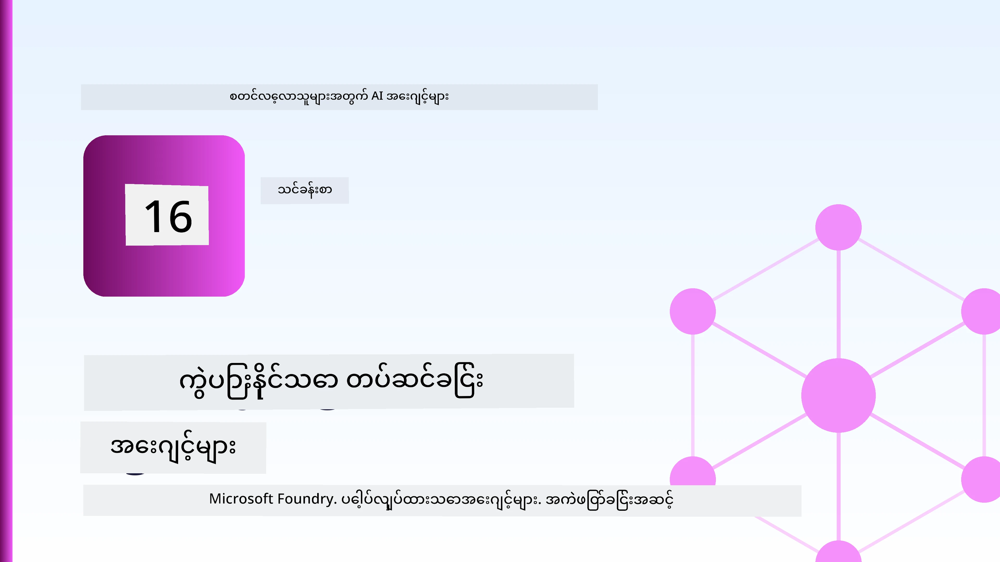
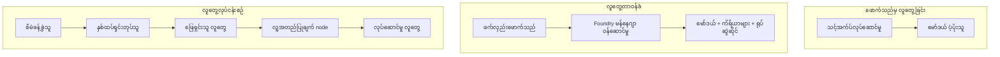
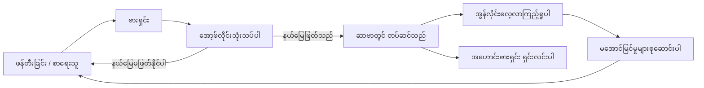
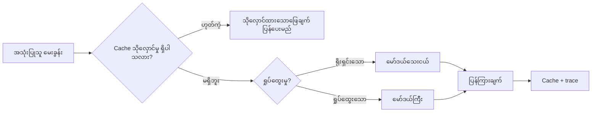
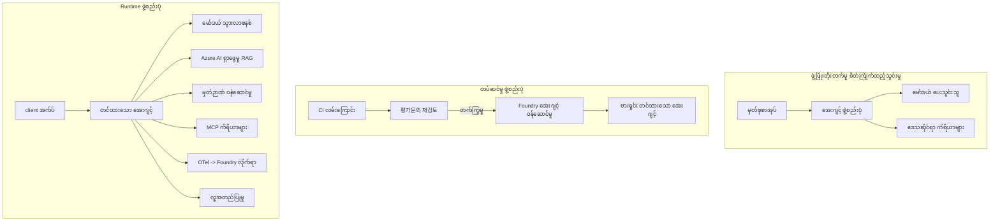

# Microsoft Foundry ဖြင့်ကျယ်ပြန့်စွာတိုးချဲ့နိုင်သော Agent များထည့်သွင်းခြင်း



ဒီသင်ခန်းစာအထိ သင်သည် သင့်လက်တော့ပုတ်မှာ run လုပ်သော၊ notebook အတွင်းသို့၊ `az login` နှင့် environment variable အနည်းငယ်ဖြင့် အားဖြင့် agent များတည်ဆောက်ပြီးသားဖြစ်သည်။ ဒါကတော့ သင်ယူရန်အတွက် တိကျသောနည်းလမ်းဖြစ်သည်။ ဒါပေမယ့် လူကြီးမင်း ရက်ပေါင်းများစွာ customer များ ယူဆောင်နေရသော agent ကို မနက် ၃ နာရီမှာ run မရောက်သင့်ပါ။

ဒီသင်ခန်းစာမှာ "ကိုယ့်စက်မှာပြေးတယ်" နဲ့ "ထုတ်လုပ်မှုမှာ ယုံကြည်စေပြီး စိတ်ချရအောင် run ပေးတယ်" ဆိုတဲ့ကွာခြားချက် အကြောင်းဖြစ်ပါတယ်။ Microsoft Foundry နဲ့ Microsoft Foundry Agent Service ကိုအသုံးပြုပြီး ဒီကွာဟချက်ကို ဖြည့်ဆည်းမှာဖြစ်ပြီး၊ လက်တွေ့ customer support အေးဂျင့်တစ်ခုကို tools, retrieval, memory, evaluation နဲ့ monitoring နည်းပညာများအပါအဝင် တည်ဆောက်ပေးမှာဖြစ်သည်။

## မိတ်ဆက်

ဒီသင်ခန်းစာတွင်ပါဝင်မည့်အကြောင်းအရာများမှာ-

- **prototype agent** နဲ့ **deployed agent** တွေကြားကကွာခြားချက်နှင့် မော်ဒယ်အဝိုင်းအပတ်က ပိုပြီး အရေးကြီးတဲ့အကြောင်း။
- Agent များ အတွက် **deployment နည်းပညာများ**: client-hosted, service-hosted (Hosted Agents), နှင့် workflow-orchestrated။
- Microsoft Foundry ပေါ်မှာ **agent lifecycle** — ပြုလုပ်ခြင်း၊ မော်ဒယ်ဗားရှင်းထုတ်ခြင်း၊ ထည့်သွင်းခြင်း၊ သုံးသပ်ခြင်း၊ ကြည့်ရှုခြင်း၊ ပယ်ဖျက်ခြင်း။
- **တိုးချဲ့ရန်နည်းဗျူဟာများ**: မော်ဒယ်လမ်းညွှန်မှု၊ caching, concurrency, နှင့် stateless ဒီဇိုင်း။
- OpenTelemetry နှင့် Foundry tracing ဖြင့် **အမြင်အားဖြင့်ကြည့်ရှုခြင်း။**
- မော်ဒယ်ရွေးချယ်ခြင်း၊ လမ်းညွှန်မှု၊ နှင့် သုံးသပ်မှု နည်းလမ်းများဖြင့် **ကုန်ကျစရိတ် ထိန်းချုပ်ခြင်း။**
- **လုပ်ငန်းအဆင့်တွင် သတ်မှတ်ချက်များ**: အုပ်ချုပ်မှု၊ လူ့အာမခံချက်၊ MCP ဆာဗာများကို ထုတ်လုပ်မှုမှာ ဘေးကင်းစွာ လည်ပတ်ခြင်း။

## သင်ယူရန်ရည်မှန်းချက်များ

ဒီသင်ခန်းစာပြီးဆုံးသောအခါ၊ သင်သည် သိရှိမည်မှာ-

- Agent workload တစ်ခုအတွက် သင့်လျော်သော deployment နည်းပညာကို ရွေးချယ်ပေးခြင်း။
- Agent ကို Microsoft Foundry Agent Service သို့ deployment ပြုလုပ်၍ ဗားရှင်းထုတ်ခြင်း၊ အုပ်ချုပ်မှုပေးခြင်းနှင့် စောင့်ကြည့်နိုင်မှုရရှိစေရန်။
- Tracing အတွက် agent သတ်မှတ်ပေးခြင်းနှင့် ရုပ်သိမ်းမယ့် pipeline တစ်ခုကို ယူဆောင်ဖို့ရှိရာ ရုပ်သိမ်းဆောင်ရွက်ခိုင်းခြင်း။
- Scale ထိန်းသိမ်းရေးအတွက် မော်ဒယ်လမ်းညွှန်မှုနှင့် caching ကိုအသုံးပြုခြင်း။
- အန္တရာယ်များသော လုပ်ဆောင်ချက်များအတွက် လူ့အာမခံချက် တစ်ခုထည့်သွင်းခြင်းနှင့် MCP ဆာဗာကို ထုတ်လုပ်မှုမှာ ဘေးကင်းစွာ ပေါင်းစည်းခြင်း။

## မျှော်မှန်းချက်များ

ဒီသင်ခန်းစာသည် ယခင်သင်ခန်းစာများပြီးစီးထားပြီး၊ အောက်ပါအရာများ၌ စိတ်ချရမှုရှိခြင်းကို သတိထားသည်။

- [Microsoft Agent Framework](../14-microsoft-agent-framework/README.md) ဖြင့် agent များ တည်ဆောက်ခြင်း (သင်ခန်းစာ 14)။
- [Tool Use](../04-tool-use/README.md) (သင်ခန်းစာ 4) နှင့် [Agentic RAG](../05-agentic-rag/README.md) (သင်ခန်းစာ 5)။
- [Agent Memory](../13-agent-memory/README.md) (သင်ခန်းစာ 13) နှင့် [Agentic Protocols / MCP](../11-agentic-protocols/README.md) (သင်ခန်းစာ 11)။
- [Observability and Evaluation](../10-ai-agents-production/README.md) (သင်ခန်းစာ 10) — ဒီသင်ခန်းစာသည် တိုက်ရိုက်ဆက်ခံလာသည်။

သင်နောက်ထပ် လိုအပ်ပါသည်-

- **Azure subscription** တစ်ခုနှင့် chat model တစ်ခုထည့်သွင်းထားသော **Microsoft Foundry project** တစ်ခု။
- **Azure CLI** မှာ authenticated ဖြစ်ပြီး (`az login`) ဖြစ်ရန်။
- Python 3.12+ နှင့် repository ထဲရှိ [`requirements.txt`](../../../requirements.txt) package များ။

## Prototype မှ Production သို့: အချိန်တွင်ရောက်ရှိသွားသော ပြောင်းလဲမှုများ

Prototype agent နဲ့ production agent က အဓိက core loop တူညီသည် — reasoning, tool ဖုန်းခေါ်, တုံ့ပြန်မှု။ ကွာခြားသည့်အရာမှာ အဲ့ဒီ loop ၏ ဝန်းရံပတ်ကိန်းများအကြောင်းဖြစ်သည်။ မော်ဒယ်ဟာ production agent ၏ ၂၀% လောက်သာဖြစ်ပြီး ကျန် ၈၀% ဟာ operation framework ဖြစ်သည်။

| စိုးရိမ်ချက် | Prototype | Production |
| --- | --- | --- |
| **Hosting** | သင့် notebook အတွင်း run လုပ်သည် | Hosted service အဖြစ် run ဖြစ်ပြီး version ထုတ်၍ တဖက်တည်း ဖြန့်ချိသည် |
| **Identity** | သင့်ရဲ့ `az login` token | Scoped RBAC ပါသော managed identity |
| **State** | In-memory ဖြစ်ပြီး restart လုပ်သွားလျှင်ဆုံးရှုံး | Externalised (thread store, memory service) ဖြစ်သည် |
| **Failure** | traceback တွေကို သင်မြင်ရ | retry, fallback, dead-letter, alert စနစ်ရှိသည် |
| **Cost** | "ပိုက်ဆံအနည်းငယ်" ဆိုသည် | တောင်းဆိုမှုတိုင်းအတွက် ကိုးကားခြင်း၊ လမ်းညွှန်ခြင်း၊ cache ထားခြင်း၊ ဘတ်ဂျက်ထားခြင်း |
| **Quality** | အရေအတွက်ကို သင်မြင်သည် | တစ်ခုချင်းစီ ထုတ်ပြန်မှုအရောက် မပြေလည်မှုမရှိစေသည် |
| **Trust** | လုပ်ဆောင်ချက်တိုင်း ကိုယ်တိုင်အသိမှတ်ပြုသည် | စည်းမျဉ်း + လူတွဲလှမ်းခြင်းဖြင့် အန္တရာယ်များအတွက် ထိန်းချုပ်သည် |

ဤဇယားကို စဉ်းစားပါ။ အောက်ပါအပိုင်းတိုင်းသည် ဒီဇယား၏တစ်ကြောင်းနှင့် ဆက်စပ်နေသည်။

## Agent Deployment အခွေထွက်များ

သင်အသုံးပြုမည့် pattern သုံးခုရှိပြီး မကြာခဏပေါင်းစပ်၍အသုံးပြုသည်။

### 1. Client-Hosted Agents

Agent object သည် *သင့်* application process အတွင်းမှာတည်ရှိသည်။ သင်ရဲ့ ကိုဒ်က မော်ဒယ်ပံ့ပိုးသူကိုတိုက်ရိုက်ခေါ်သည်။ reasoning loop သည် သင့် service မှာ run တာဖြစ်သည်။ ဒါက အသစ်ပြီတော့ပထမဦးဆုံးသင်ခန်းစာများတွင် ပြုလုပ်ခဲ့သော နည်းလမ်းဖြစ်သည်။

- **အသုံးပြုချိန်**: loop အပေါ် အပြည့်အ၀ထိန်းချုပ်မှုလိုအပ်လျှင်၊ custom middleware လိုအပ်လျှင်၊ သို့မဟုတ် agent ကို ရှိပြီးသား backend အတွင်း ထည့်သွင်းလိုလျှင်။
- **စိန်ခေါ်မှု**: scaling, state နဲ့ resilience ကို သင်ကိုယ်တိုင် ထိန်းသိမ်းရမည်။

### 2. Hosted Agents (Foundry Agent Service)

Agent ကို Microsoft Foundry အတွင်း resource အနေနှင့် မှတ်ပုံတင်သည်။ Foundry သည် reasoning loop ကို run စေပြီး၊ threads ကို သိမ်းဆည်းသည်၊ content safety နှင့် RBAC ကို ဆောင်ရွက်ပေးပြီး Foundry portal တွင် agent ကိုမြင်ရအောင်ပြုလုပ်သည်။ သင့် app က thread ဖန်တီးကာ တုံ့ပြန်ချက်များကို ဖတ်ရှုသည့် thin client တစ်ခုပြောင်းလဲသည်။

- **အသုံးပြုချိန်**: durability, ပြုလုပ်စီမံရန် built-in observability, governance, operational surface area နည်းသေ။
- **စိန်ခေါ်မှု**: managed runtime ဖြစ်သောကြောင့် နည်းနည်းခင် control လျော့နည်းသည်။

### 3. Agent Workflows

Agents များစွာ (နှင့် tools များ) ကို graph တစ်ခုအဖြစ် ဖန်တီးပြီး ဖွဲ့စည်းထားသည်။ control flow သည် ဆိုက်ဘာ၊ ခွဲခြားခြင်း၊ လူ့အတည်ပြုမှု node များနှင့် ပျက်ကွက်နိုင်သည့် checkpoints များ ပါရှိသည်။ Microsoft Agent Framework ၏ **Workflows** စွမ်းဆောင်ရည်ကို deployment scale ပေါ်တွင် အသုံးပြုထားသည်။

- **အသုံးပြုချိန်**: တစ်ခုတည်းသော အလုပ်မှာ အထူးပြုထားသော agent များစွာကို ဖြတ်သန်းကာအလယ်တွင် အတည်ပြုချက်လိုလျှင်။
- **စိန်ခေါ်မှု**: အစိတ်အပိုင်းများပိုများသွားပြီး orchestration-level observability လိုအပ်သည်။



## Microsoft Foundry ပေါ်ရှိ Agent Lifecycle

Agent တစ်ခုကို တစ်ချက်တည်း `push` မဟုတ်ပါ။ ၎င်းမှာ loop ဖြစ်ပြီး software release cycle ဖြင့် ဆင်တူသည်။



အဓိကအတွေးကတော့ [သင်ခန်းစာ 10](../10-ai-agents-production/README.md) မှ ဆက်ခံသွားသေးပြီး **offline evaluation သည် gate ဖြစ်ပြီး အချိန်နောက်ပိုင်းမှာ မဟုတ်ပါ။** agent version အသစ်သည် သင့် evaluation standard ဖြတ်ကူးမှသာ ထုတ်လွှင့်သည်။ Online observability ကို သုံး၍ လုပ်ငန်းမှားယွင်းမှုတွေကို offline test set ထဲသို့ feed လုပ်သည်။ ၎င်းနည်းလမ်းသည် တစ်လျှောက်လုံး loop ဖြစ်သည်။

## Scaling နည်းဗျူဟာများ

Agent တစ်ခုကို scale လုပ်သည်မှာ stateless web API ကို scale လုပ်သည်နှင့်မတူပါ၊ ထိုကြောင့် တစ်ခုချင်းတောင်းဆိုမှုတွင် မော်ဒယ်များနှင့် tool အခက်အခဲများစွာဖြစ်ပေါ်နိုင်သည်။ နည်းလမ်းလေးခုသည် ယင်းလုပ်အား၏ အများအပြားကို ခံယူထားသည်။

**Stateless request handling.** သင့် process memory အတွင်း user state မရှိစေရန် ထိန်းသိမ်းပါ။ Foundry thread store သို့မဟုတ် memory service တွင် စကားပြော (conversation) threads များကို သိမ်းဆည်းပါ။ ထိုကြောင့် အဖြစ်ရှင်းသော instance များ မည်သည့်တောင်းဆိုမှုကိုမဆို အမြန်ဆုံး တုံ့ပြန်နိုင်သည်။ ဒါဟာ သင်အား horizontally scale လုပ်ရန် ခွင့်ပြုသည် — instance များ တိုးမြှင့်၊ sticky sessions မလိုအပ်။

**Model routing.** တောင်းဆိုမှုတစ်ခုချင်းစီသည် အသင့်ဆုံးကြီးမားပြီး အကြီးဆုံးမော်ဒယ်မလိုအပ်ပါ။ ရိုးရှင်းသော တောင်းဆိုမှုများ — နည်းမြင့်အတိအကျ စီစစ်ခြင်း၊ ကွာရှင်းမှုတိုများကို မြန်ဆန်သော မော်ဒယ်သို့ လမ်းညွှန်ခြင်း၊ မွန်မြော်သော reasoning အတွက် စွမ်းဆောင်ရည်ကြီး မော်ဒယ်ကို သီးသန့်ထားခြင်း။ Foundry ၏ **Model Router** သို့မဟုတ် မိမိလုပ်ကိုင်နိုင်သော စနစ်တစ်ခုကို လက်တွေ့ ဆောင်ရွက်နိုင်သည်။ Lab မှာ DIY လုပ်နည်းလည်း သင်တည်ဆောက်မည်။

**Response caching.** အများအပြားသော support မေးခွန်းများသည် တူညီများ ("ကလျာ့စ်ဝတ် password ပြန်ထားဖို့ ဘယ်လိုပြုလုပ်ရမလဲ?") ဖြစ်ပါသည်။ ရိုးရှင်းသောမေးခွန်းများ၏ဖြေကြားချက်များကို cache ထားပြီး မော်ဒယ်ကို မထိခိုက်ဘဲ တုံ့ပြန်နိုင်သည်။ အနည်းငယ် cache မှားမှုလည်း ကုန်ကျစရိတ်နှင့် နောက်ကျမှုကို သက်သာစေသည်။

**Concurrency and backpressure.** မော်ဒယ်ပါပံ့ပိုးသူများတွင် rate limit ရှိသည်။ Concurrency ကို ကန့်သတ်ပြီး Exponential backoff ဖြင့် retry လုပ်ပါ၊ သေချာစွာ ပြဿနာစုံထားပါ (queued response တစ်ခုသည် 500 error ထက်ပိုကောင်း)။



## ထုတ်လုပ်မှုအတွင်း Observability

မမြင်ဘဲ အသုံးပြု၍ မရ။ သင်ခန်းစာ 10 တွင်ဖော်ပြခဲ့ထားသလို Microsoft Agent Framework သည် **OpenTelemetry** trace များကို မူလစွာထုတ်ပေးသည် — မော်ဒယ်ခေါ်ဆိုမှုတိုင်း၊ tool လုပ်ဆောင်မှုတိုင်း၊ orchestration အဆင့်တိုင်းသည် span ဖြစ်သည်။ ထုတ်လုပ်မှုတွင် ထို span များအား Microsoft Foundry (သို့မဟုတ် OTel နှင့်ကိုက်ညီသော backend မည်သည့်အရာတွင်မဆို)သို့ပို့၍ အောက်ပါအတိုင်းလုပ်ဆောင်နိုင်သည်။

- customer complaint တစ်ခုလုံးကို မော်ဒယ်တစ်ခုချင်းစီနှင့် tool တစ်ခုချင်းစီအားတိုင်းတာခြင်း။
- p50/p95 latency နှင့် တောင်းဆိုမှုချိန်အလိုက် ကုန်ကျစရိတ် ကြည့်ရှုခြင်း။
- သင်၏အသုံးပြုသူ (သို့မဟုတ် ဘဏ္transaction) ကိုမခံစားမီ error-rate ထိပ်တန်းနှင့် ကုန်ကျစရိတ်ထူးခြားမှုများအတွက် သတိပေးခြင်း။

```python
from agent_framework.observability import get_tracer

tracer = get_tracer()

with tracer.start_as_current_span("support_request") as span:
    span.set_attribute("customer.tier", "enterprise")
    span.set_attribute("routed.model", "gpt-4.1-mini")
    # ဒီ span ထဲမှာ agent အလုပ်လုပ်မှုကို ကိုယ်တိုင်လိုက်ဖက်စစ်ဆေးထားပါတယ်
```

`customer.tier` နှင့် `routed.model` ကဲ့သို့ attributes များသည် trace များကို ဖြေရှင်းနိုင်သော မေးခွန်းများသို့ ပြောင်းလဲပေးသည် ("Enterprise customers များသည် အရမ်းအသေးသော မော်ဒယ်သို့ မကြာခဏ လမ်းညွှန်ခံရသလား?")။

## ကုန်ကျစရိတ် ထိန်းချုပ်ခြင်း

ထုတ်လုပ်မှု agent များတွင် ကုန်ကျစရိတ်ကို token များ ပုံမှန်ထားသည်။ သုံးခုသော လက်နက်များ၊ သက်သာမှုအလိုက်။

1. **မော်ဒယ်ကို သင့်တော်သောအတိုင်းရွေးချယ်ပါ။** Evaluation gate ဖြတ်ပြီးသား သေးငယ်သော မော်ဒယ်သည် အကျယ်ကြီးသော မော်ဒယ်ထက် ပိုတန်ပဲဖြစ်သည်။ Evaluation ဖြင့် သေးငယ်သော မော်ဒယ်သည် လုံလောက်ကြောင်း သက်သေပြသည်၊ စောင့်ရှောက်မှုအရ အကြီးဆုံး မော်ဒယ်ကို ဒါသိပ်မလို့မကြည့်။
2. **ရှုပ်ထွေးမှုအလိုက် လမ်းညွှန်သည်။** အပေါ်တွင်ဖော်ပြထားသလို — ရှုပ်ထွေးသော နေရာများတွင်သာ အကြီးဆုံး မော်ဒယ်ကို အသုံးပြုပေးပါ။
3. **ကြီးမားစွာ cache ထားသည်။** အချိန်၊ ကုန်ကျစရိတ် အနည်းဆုံးမော်ဒယ်ခေါ်ဆိုမှု က အမြဲဆုံးအတန်ဆုံး။

Evaluation gate နှင့် ကုန်ကျစရိတ် ထိန်းချုပ်မှုသည် ကိုယ်တိုင်ကွင်းဆက်သဘောထားရပါသည်။ Evaluation သည် *အရည်အသွေးအခြေခံ* ကိုပြောပြပြီး routing နှင့် caching သည် *ကုန်ကျစရိတ်* ကို အနီးစပ်ဆုံးထားပေးသည်။

## လုပ်ငန်းအသီးသီးတွင် Deployment အသိပညာများ

**အစိုးရစနစ်** Hosted Agents သည် Foundry ၏ RBAC, content safety နှင့် audit logging ကို ရရှိသည်။ Agent တစ်ခုစီအတွက် ထိန်းသိမ်းမှုရှိသည့် identity တစ်ခုကို ပေးပါ။ ဂျာနယ်နေရာစာရင်းကို ဖတ်ရမာပဲ၊ ticketing API ကို scoped access ပေးပြီး အခြားမလိုအပ်သော privileges မပေးပါနဲ့။

**လူတွဲကြည့်ခြင်း (Human-in-the-loop).** တချို့လုပ်ဆောင်ချက်များကို တိုက်ရိုက်ပြုမလုပ်သင့်— ငွေပြန်ခေါ်ယူခြင်း၊ အကောင့်ဖျက်ခြင်း၊ ဥပဒေသမဲ့အဖွဲ့ ဆက်သွယ်ခြင်း။ Microsoft Agent Framework သည် **approval-required** tool များကို ထောက်ပံ့သည်။ Agent သည် လုပ်ဆောင်မှုကို တင်ပြပြီး၊ တည်ဆောက်မှုရပ်တန့်ကာ လူတစ်ဦးက အတည်ပြု သို့မဟုတ် ငြင်းဆန်ပြီး workflow ကို ပြန်လည်စတင်သည်။ သင်သည် [သင်ခန်းစာ 6](../06-building-trustworthy-agents/README.md) တွင်ပထမဦးဆုံး မြင်ခဲ့သည်၊ ဒီမှာယင်းကို deploy လုပ်သည်။

**ထုတ်လုပ်မှုအတွင်း MCP.** [MCP](../11-agentic-protocols/README.md) သည် သင့် agent ကို ပြင်ပ tools များကို စံပြ interface ဖြင့် သုံးစွဲခွင့်ပေးသည်။ ထုတ်လုပ်မှုတွင် MCP ဆာဗာတစ်ခုစီကို untrusted boundary အဖြစ် တွက်ချက်ပါ။ ဆာဗာဗားရှင်း တိကျစွာ သတ်မှတ်ပါ၊ scoped identity ဖြင့် run ပါ၊ ထွက်ရှိမှုများကို စစ်ဆေးပါ၊ sircret များကို မဖော်ပြပါနဲ့။ MCP ဆာဗာသည် dependency ဖြစ်ပြီး၊ dependencies များမှာ patch, audit နှင့် rate-limit လုပ်ခြင်းလိုအပ်သည်။



ဒီ (၃) ပြဇယား — development, deployment, runtime — သည် အပျက်သက်သက် agent တစ်ခု၏ ဘဝအဆင့် (၃) ဆင့်ဖြစ်သည်။ Lab သင်ခန်းစာသည် ၎င်းကို သင့်အား လမ်းညွှန်မည်။

## လက်တွေ့လေ့ကျင့်ခန်း: ထုတ်လုပ်မှုသင့် Contoso Customer Support Agent တည်ဆောက်ခြင်း

[`code_samples/16-python-agent-framework.ipynb`](./code_samples/16-python-agent-framework.ipynb) ဖွင့်ပြီး အပြီးအမြောက် လုပ်ဆောင်လိုက်ပါ။ သင်သည် **Contoso customer support agent** တစ်ခုကို တည်ဆောက်မည် ဖြစ်ပြီး ထုတ်လုပ်မှုဆိုင်ရာ စိုးရိမ်ချက်ကို ဆက်သွယ်ဦးမည်။

1. **Tool calling** — အမိန့်အခြေအနေ ရှာဖွေခြင်းနှင့် support tickets ဖွင့်ခြင်း။
2. **RAG** — အသိပညာအခြေခံမှ မူပိုင်ဘာသာနဲ့ မေးခွန်းများ ဖြေပြန်ခြင်း (Azure AI Search, notebook ကို Search resource မပါဘဲ ပြေးနိုင်ရန် in-memory fallback ပါရှိ)။
3. **Memory** — စကားပြောတွင် customer ကို မှတ်မိထားခြင်း။
4. **Model routing** — ရှုပ်ထွေးမူ classifier တစ်ခုသည် တောင်းဆိုမှုတိုင်းကို သေးငယ်သော မော်ဒယ် သို့ မကြီးသော မော်ဒယ်သို့ လမ်းညွှန်ခြင်း။
5. **Response caching** — မေးခွန်းများ ထပ်မံမေးလာလျှင် cache မှ တုံ့ပြန်ခြင်း။
6. **Human approval** — ထိခိုက်မှုမြင့်သော refund များအတွက် လူ့အာမခံချက်။
7. **Evaluation pipeline** — သေးငယ်သော offline test set သည် agent ကို စစ်ဆေးကာ ထုတ်လွှင့်မှုအတွက် gate အဖြစ် လုပ်ဆောင်သည်။
8. **Observability** — တောင်းဆိုမှုတိုင်းအတွက် OpenTelemetry tracing။

### လမ်းညွှန်

Notebook သည် ထုတ်လုပ်မှုစိုးရိမ်ချက်များအား လွတ်လပ်စွာ အသုံးပြုနိုင်သော အပိုင်းများအဖြစ် စီစဉ်ထားသည်။ ၎င်း၏ အဓိကမှာ routing-plus-caching request handler ဖြစ်သည်။

```python
async def handle_support_request(query: str, customer_id: str) -> str:
    # 1. ကျွန်ုပ်တို့ စွယ်စုံပါက ကက်ရှ်မှ တင်ဆက်ပါ။
    cached = response_cache.get(normalize(query))
    if cached:
        return cached

    # 2. ကုန်ကျစရိတ် ထိန်းချုပ်ရန် ရှုပ်ထွေးမှုအလိုက် လမ်းကြောင်း ပြုလုပ်ပါ။
    model = "gpt-4.1-mini" if is_simple(query) else "gpt-4.1"

    # 3. ကြည့်ရှုနိုင်စေမှုအတွက် ထောက်လှမ်းခြင်း စာရင်းအတွင်း အေးဂျင့်ကို လည်ပတ်ပါ။
    with tracer.start_as_current_span("support_request") as span:
        span.set_attribute("routed.model", model)
        span.set_attribute("customer.id", customer_id)
        response = await support_agent.run(query, model=model)

    # 4. ကက်ရှ် ထားပြီး ပြန်ပေးပါ။
    response_cache.set(normalize(query), response.text)
    return response.text
```

ထုတ်လွှင့်ခွင့်ကို ကာကွယ်ပေးသည့် evaluation gate သည် အောက်ပါအတိုင်း ဖြစ်ပါသည်။

```python
async def evaluation_gate(agent, test_cases, threshold: float = 0.8) -> bool:
    passed = 0
    for case in test_cases:
        result = await agent.run(case["input"])
        if score_response(result.text, case["expected"]) >= 0.8:
            passed += 1
    pass_rate = passed / len(test_cases)
    print(f"Evaluation pass rate: {pass_rate:.0%} (gate: {threshold:.0%})")
    return pass_rate >= threshold  # တံခါးပေါက်စစ်မှတ်ချက်ကျော်လွှားပါကသာ ထုတ်လွှင့်ပါ။
```

တစ်လိုင်းချင်း ဖတ်ပါ — notebook သည် framework အသုံးပြုချက်များအောက်မှာ မဖုံးကွယ်ဘဲ အသေးစိတ်ရေးသားထားသည်။

## ထည့်သွင်းပြီးသော Agent ကို Smoke Test ဖြင့် စစ်ဆေးခြင်း

အပေါ်မှာ ဖော်ပြထားသော evaluation gate သည် *offline* သို့ run ဖြစ်ပြီး သင် agent object ကို စစ်ဆေးသည်။ Hosted Agent အဖြစ် deployment ပြီးလျှင် နောက်ထပ် စစ်ဆေးမှု တစ်ခုလိုအပ်ပါသည်: **deployment endpoint သည် တကယ်ဖြေဆိုနေပါသလား?**

"အောင်မြင်စွာ" deployment ပြုလုပ်ခြင်းသည် control plane သည် definition ကို လက်ခံလျက်ရှိသည်ကိုသာ ဖော်ပြသည် — agent သည် တုံ့ပြန်မှုများ မပေးနိုင်သေးပါ။ dependency ပြတ်တောက်မှု၊ မော်ဒယ် လမ်းညွှန်မမှန်ခြင်း၊ သို့မဟုတ် expired connection တစ်ခုကြောင့် မထုတ်လွှင့်နိုင်သော ပိုင်းကို ခြုံငုံစစ်ချက် (green deployment) တွင် ပျက်စီးထားနိုင်သည်။ **Smoke test တစ်ခုက** ဒီအရာကို စက္ကန့်အနည်းငယ်တွင် ဖမ်းဆီးနိုင်ပြီး၊ တစ်ကြိမ်လုပျဆောင်သည်မှသာ မူလ evaluation နှင့်မညီသည်။

ဒီ repository သည် [AI Smoke Test](https://github.com/marketplace/actions/ai-smoke-test) GitHub Action အပေါ်တွင် အလျင်အမြန်အသုံးပြုနိုင်သော smoke-test pipeline ကို ပို့ဆောင်ထားသည်။

- **Catalog** — [`tests/lesson-16-smoke-tests.json`](../../../tests/lesson-16-smoke-tests.json) က Contoso support agent အတွက် prompts နှင့် assertion များပါဝင်သည် (ခြေရာခံထားသော ပေါ်လစီဖြေကြားချက်များ, အမိန့်စာရင်း ရှာဖွေမှု, သတ်မှတ်ထားသော အကြောင်းအရာ, နှင့် multi-turn စကားပြော continuity)။ အခြားသင်ခန်းစာများ agent များ၏ catalog များသည် ၎င်းနှင့် မျက်နှာချင်းဆိုင်ရှိသည် — ကြည့်ရန် [`tests/README.md`](../tests/README.md)။
- **Workflow** — [`.github/workflows/smoke-test.yml`](../../../.github/workflows/smoke-test.yml) သည် Azure OIDC ဖြင့် login လုပ်ကာ တစ်ခုချင်း prompt များကို agent ရဲ့ Responses endpoint သို့ POST ပေးပြီး assertion မမှန်သော မည်သည့်အခါတွင် job သည် မအောင်မြင်စေရန် ချက်ချင်းလုပ်ဆောင်သည်။

```yaml
- name: Smoke-test hosted agent
  uses: JFolberth/ai-smoketest@v1
  with:
    project_endpoint: ${{ inputs.project_endpoint }}
    agent_name: ContosoSupportAgent
    tests_file: tests/lesson-16-smoke-tests.json
```


သင့်အေဂျင့်ကို ဖြန့်ချိပြီးပါက **Actions** သို့သွားပြီး သင့် Foundry ပရောဂျက် endpoint နဲ့ အေဂျင့်နာမည် ဖြည့်စွက်ကာ သက်ဆိုင်ရာကိရိယာကို အသုံးပြုပါ။ ဤအသမ်းတင်အသုံးပြုသူက ဖက်ဒေရိတ်အိုင်ဒီတူတံဆိပ်အတွက် Foundry ပရောဂျက်အကွက်တွင် **Azure AI User** အခန်းကဏ္ဍ လိုအပ်ပါသည်။ အလွှာများကို ပီရမစ်ပုံစံဖြင့်စဉ်းစားပါ - မီးလောင်ခြင်းစမ်းသပ်မှုများ (သွားရောက်နိုင်ပြီး ပြန်လည်တုံ့ပြန်နိုင်ပါသလား?) ကို မည်သည့်ဖြန့်ချိမှုတွင်မဆို တွတ်မြောက်စွာ အသုံးပြုသည်, အော့ဖ်လိုင်းအကဲဖြတ်မှု (ပို့ဆောင်ရန်လုံလောက်သော?) ကို မြှင့်တင်မှုမပြုမီ အသုံးပြုသည်, နှင့် အွန်လိုင်းအကဲဖြတ်မှု (တောထဲတွင် ဘယ်လိုလုပ်ဆောင်နေသလဲ?) ကို ဆက်တိုက်လုပ်ဆောင်သည်။

## သိမြင်မှုစစ်ဆေးမှု

တာဝန်ကို ပြောင်းရွှေ့မည်မဟုတ်မီ သင်၏နားလည်မှုကို စမ်းသပ်ပါ။

**1. ထုတ်လုပ်မှုအေဂျင့်၏ “ပုံစံ” သည် အနည်းငယ် ဘယ်လောက်ရှိပြီး အခြားမှာဘာတွေပါလဲ?**

<details>
<summary>အဖြေ</summary>

ပုံစံသည် စနစ်၏ အသေးစားအပိုင်းဖြစ်ပြီး အမြဲတမ်း ၂၀% ခန့်ဆိုသည်။ ကျန်သည် လည်ပတ်မှုအဆောက်အအုံဖြစ်သည် - ဟိုက်တင်နှင့် ဗားရှင်းစီမံခန့်ခွဲမှု၊ အိုင်ဒီတိတီနှင့် RBAC၊ ပြင်ပအခြေနေ၊ ပြတ်တောက်မှုကိုင်တွယ်မှု၊ ကုန်ကျစရိတ် ချေမှုန်းမှု၊ အကဲဖြတ်မှုနှင့် လူနဲ့လက်တွဲ ချုပ်ကိုင်မှုများရှိသည်။ ထုတ်လုပ်မှုသို့ ရောက်ရန်မှာ အဓိကအားဖြင့် နားလည်မှုပတ်လည်တွင် အရာအားလုံးကို တည်ဆောက်ခြင်း ဖြစ်သည်။
</details>

**2. Hosted Agent ကို client-hosted agent ထက် ဘယ်အချိန်ရွေးချယ်သင့်သလဲ?**

<details>
<summary>အဖြေ</summary>

သင်လိုအပ်သော runtime သည် သက်တမ်းတည်ရှိမှုပါဝင်ပြီး (မှန်ကန်စွာ ထပ်မံစတင်နိုင်သော threads), ကြည့်ရှုနိုင်မှု, အကြောင်းအရာလုံခြုံမှုနှင့် RBAC ပါဝင်သော managed ဖြစ်ရပါမည်။ reasoning loop တွင် အနုတ်လက္ခဏာ၏ အချို့ကို လျော့နည်းမှုနှင့် operational ပိုင်းကိုလည်း ပိုနည်းစေလိုပါက Hosted Agent ကျသင့်သည်။ Client-hosted သည် reasoning loop ကို အပြည့်အဝ ထိန်းချုပ်လိုသောအခါ သို့မဟုတ် အေဂျင့်ကို ရှိပြီးသား backend အတွင်း ထည့်သွင်းလိုသောအခါပိုမိုသင့်တော်သည်။
</details>

**3. ဘာကြောင့် scalable agent သည် ကိုယ်ပိုင် process မှတ်ဉာဏ်တွင် stateless ဖြစ်ရမည်နည်း?**

<details>
<summary>အဖြေ</summary>

မည်သည့် instance ကိုမဆို မည်သည့် တောင်းဆိုမှုကိုမဆို ကိုင်တွယ်နိုင်ရန် ဖြစ်သည်။ ဒီအတိုင်း horizontal scaling ကို sticky sessions မလိုအပ်ဘဲ ပြုလုပ်နိုင်သည်။ အသုံးပြုသူတစ်ဦးချင်းစီ၏ စကားပြောအခြေအနေကို thread store သို့မဟုတ် memory service တွင် ပြင်ပထားသည်။ state ကို process မှတ်ဉာဏ်ထဲတွင် ထားခဲ့ပါက ပြန်စတင်မှုမှာ state ကိုဆုံးရှုံးပြီး စွန့်ဖျားမှု မဖြန့်ဝေနိုင်ပါ။
</details>

**4. ပုံစံလမ်းကြောင်းသတ်မှတ်ခြင်း (model routing) သည် ဘယ်လိုပြဿနာကို ဖြေရှင်းပြီး အကဲဖြတ်မှုနှင့် ဘယ်လိုဆက်စပ်သလဲ?**

<details>
<summary>အဖြေ</summary>

လမ်းကြောင်းသတ်မှတ်ခြင်းသည် ရိုးရှင်းသည့် တောင်းဆိုမှုများကို သေးငယ်ပြီး စျေးသက်သာကောင်းမွန်သော ပုံစံသို့ပို့ပေးပြီး မူရင်း reasoning အတွက် ကြီးမားသော ပုံစံကို သိမ်းဆည်းထားသည်။ ဒီအတိုင်း မြန်နှုန်းနှင့် စရိတ်နှစ်ခုလုံးကို ထိန်းချုပ်သည်။ အကဲဖြတ်မှုနှင့် ဆက်စပ်မှုမှာ အကဲဖြတ်မှုသည် သေးငယ်သော ပုံစံသည် တောင်းဆိုမှုအတန်းတစ်ခုပြည့်စုံကြောင်း သက်သေပြသည်။ လမ်းကြောင်းသတ်မှတ်ခြင်းမပါနဲ့ အကဲဖြတ်မှုမရှိပါက ခန့်မှန်းခြေဖြစ်သွားသည်။
</details>

**5. "အကဲဖြတ်တံခါး" (evaluation gate) ဆိုသည်မှာ အဘယ်နည်း၊ ဘဝအဆင့်ကွက်တွင် ဘယ်နေရာတွင် ရှိသနည်း?**

<details>
<summary>အဖြေ</summary>

အကဲဖြတ်တံခါးသည် အော့ဖ်လိုင်း စမ်းသပ်မှု စနစ်တစ်ခုကို အေဂျင့်ဗားရှင်းအသစ်ပေါ်တွင် လော့ချပြီး စစ်ဆေးမှုမီးမောင်းမှတ်ထားသော နုတ်ပယ်မှုမရှိစေရန် တားဆီးသည်။ ဘဝအဆင့်ကွက်တွင် "ဗားရှင်း" နှင့် "ဖြန့်ချိမှု" အကြားတွင် တည်ရှိပြီး အရည်အသွေးကို ထုတ်ဝေခြင်း ရှေ့မှတ်ချက်အဖြစ် သတ်မှတ်သည်၊ ပို့ဆောင်ပြီးနောက် စစ်ဆေးသည်မဟုတ်ပါ။
</details>

**6. MCP ဆာဗာအား ထုတ်လုပ်မှုတွင် အချုပ်အခြာမရှိသောနယ်နိမိတ်အဖြစ် မည်သည့်အတွက် ယူဆခြင်းလိုလဲ?**

<details>
<summary>အဖြေ</summary>

သင်၏ အေဂျင့်ကခေါ်သည့် ပြင်ပ လမ်းကြောင်း ဖြစ်သည်။ ထိုဗားရှင်းကို ठံမှတ်ပြီး၊ ကန့်သတ်ထားသည့် အိုင်ဒီတိတီဖြင့် ပြေးဆောင်ပါ၊ ထွက်ရှိချက်များကို စစ်ဆေးပါ၊ အမြန်နှုန်းကန့်သတ်ပါ၊ ထိုအားလျှင် မပျက်ဖျက်ရန် လျှို့ဝှက်ချက် မပေးပါနဲ့ — နောက်တစ်ဖက်တည်း၊ သုံးစွဲသူချင်း dependency တို့နှင့် တူညီသော သေချာမှုရှိရမည်။ ထွက်ရှိချက်များသည် သင့်ေအဂျင့်၏ reasoning တွင် ထည့်သွင်းနေသောကြောင့် စစ်ဆေးမှုမရှိသော ယုံကြည်မှုမှာ လုံခြုံရေး ဆိုးကျိုးရှိနိုင်သည်။
</details>

**7. ထုတ်လုပ်မှုအေဂျင့်ကုန်ကျစရိတ်တွင် ပုံမှန်အားဖြင့် အကျိုးသက်ရောက်မှု အကြီးမားဆုံး ဖြစ်စေသည့် တစ်ခုလေးက ဘာတွေလဲ၊ ဘာကြောင့်လဲ?**

<details>
<summary>အဖြေ</summary>

ပုံစံကို မှန်ကန်စွာ ရွှေ့ဆိုင်းခြင်း — သင့် evaluation gate ကိုဖြတ်သန်းနိုင်သည့် အကြီးမားဆုံး မဟုတ်သေးသော ပုံစံအသုံးပြုခြင်း။ ကုန်ကျစရိတ်သည် token များပါဝင်မှုက မူတည်ပြီး၊ အရည်အသွေးစံနှုန်းနှင့် သင့်ညှိနှိုင်းမှုရှိသော ပုံစံသေးငယ်သည် ကြီးမားသောပုံစံထက် မကြာခဏ ပိုသက်သာသည်။ Cache နှင့် routing သည် ကုန်ကျစရိတ်နည်းစေသည်၊ သို့သော် မှန်ကန်သော အခြေခံပုံစံ ရွေးချယ်ခြင်းမှာ ပထမအဆင့်တွင် အကျိုးသက်ရောက်မှု အကြီးဆုံး ဖြစ်သည်။
</details>

**8. `customer.tier` နှင့် `routed.model` ကဲ့သို့သော span attribute များသည် observability တွင် ဘာအခန်းကဏ္ဍ ထမ်းဆောင်သလဲ?**

<details>
<summary>အဖြေ</summary>

သူတို့သည် အဖြေရှာစရာ စီးပွားရေးမေးခွန်းများသို့ ကိုယ်စားပြု သော ကွင်းဆက် trace များကို ပြောင်းလဲသည်။ attribute မရှိပါက span များ ရှုပ်ထွေးစွာ ရှိသည်၊ attribute များပါရှိပါက "စီးပွားရေးဖောက်သည်များသည် သေးငယ်သော ပုံစံထံ မကြာခဏ လမ်းကြောင်းသွားသနည်း?" သို့မဟုတ် "မည်သည့်ပုံစံသည် ကျွန်ုပ်တို့၏ နှေးကွေးဆုံးတောင်းဆိုမှုများကို ကိုင်တွယ်နေသနည်း?" ဟူ၍ မေးနိုင်သည်။ attribute များမှာ သင့်စက်မှုလုပ်ငန်းဘက်တွင် အရေးကြီးသော စံနှုန်းများအလိုက် telemetry ကို ခွဲခြားရန် နည်းလမ်းဖြစ်သည်။
</details>

## တာဝန်

lab မှ ဝယ်ယူသူပံ့ပိုးရေး agent ကို ယူပြီး တိက်တိက်ပြစ်ပြစ်ဖြင့် အထူးခြားသော အခန်းကဏ္ဍတစ်ခုအတွက် အတားတစ်ခုလုပ်ပါ: **SaaS ကုမ္ပဏီအတွက် subscription billing ပံ့ပိုးရေး agent ဖြစ်အောင်။**

သင့်တင်သွင်းချက်တွင်:

1. **ကိရိယာများကို billing အတွက်သက်ဆိုင်သော `get_subscription_status`, `get_invoice`, နှင့် `issue_credit` (၅၀ ဒေါ်လာကျော်သော ခရက်ဒစ်များသည် လူလက်အတည်ပြုမှုလိုအပ်သည်) ဖြင့် အစားထိုးပါ။**
2. **ကုမ္ပဏီ၏ ပြန်လည်ပေးချေမှုမူဝါဒ၊ ဘီလ်ရွက်ကာလနှင့် ရပ်ဆိုင်းမှုမူဝါဒများ ပါဝင်သည့် RAG စာရွက်သုံးခု ထည့်ပါ။**
3. **အကဲဖြတ်မှု စနစ်ကို အနည်းဆုံး ငါးခုထက်ပို စမ်းသပ်မှု အကိစ္စများ ဖြည့်စွက်ပြီး၊ လူလက်အတည်ပြုကြောင်း လမ်းကြောင်းကို ဖွင့်သင့်သည့် စမ်းသပ်မှုနှစ်ခုထက်ပို ပါအောင် ပြုလုပ်၊ သင်၏ အကဲဖြတ်တံခါးကို မှန်ကန်စွာ ကျော်ဖြတ်မှု မဖြတ်တောက်မှု ထုတ်ဖော်နိုင်ပါစေ။**
4. **ကုန်ကျစရိတ်အစီရင်ခံတစ်ခု ထည့်ပါ: agent မှတဆင့် တစ်ဆယ်ခေါ်ဆိုချက် မျိုးစုံ သုံးပြီးနောက် သေးငယ်သောပုံစံသို့ မည်နှစ်ချက် သွားရောက်ပြီး၊ ကြီးမားသောပုံစံသို့ မည်နှစ်ချက် သွားရောက်ပြီး၊ cache ကနေ မည်နှစ်ချက် ဆန့်ကျင်ဆောင်ရွက်ခဲ့သည်ဆိုတာ ထုတ်ဖော်ပါ။**

စကားလုံးတို (markdown ဆဲလ်အတွင်း) ရေးပါ - သင်ရွေးချယ်သော ပုံစံလမ်းကြောင်း စည်းမျဉ်းသည် ဘာလဲ၊ အသက်ဝင်သော traffic ဖြင့် ဘယ်လို အတည်ပြုမလဲဆိုတာရှင်းလင်းရေးသားပါ။ တစ်ခုတည်းသော မှန်ကန်သော အဖြေ မရှိပါ — သင်တို့၏ ထုတ်လုပ်မှုဆိုင်ရာ စိုးရိမ်ချက်များကို ထိပ်တိုက်ချိတ်ဆက်ထားသည်ကို အကဲဖြတ်သည်။

## အနှစ်ချုပ်

ယခု သင်ခန်းစာတွင် Microsoft Foundry ဖြင့် agent ကို prototype မှ ထုတ်လုပ်မှုသို့ ရှောင်ရွားတင်ပို့ခဲ့သည်။

- ထုတ်လုပ်မှုသို့ ကူးပြောင်းခြင်းသည် ပုံစံအနားတွင်တည်ရှိသည့် **operational skeleton** အကြောင်းဖြစ်သည် — ဟိုက်တင်၊ အိုင်ဒီတိတီ၊ အခြေနေ၊ ပြတ်တောက်မှုကိုင်တွယ်မှု၊ ကုန်ကျစရိတ်၊ အရည်အသွေးနှင့် ယုံကြည်မှု။
- သင်သိရှိလာခဲ့သည့် သုံးခုသော **ဖြန့်ချိမှုပုံစံများ** — client-hosted, Hosted Agents, နှင့် Agent Workflows — နှင့် မည်သည့်အခါသင့်တော်သည်။
- **agent ဘဝအဆင့်ကွက်** တစ်ခုကို လိုက်လံသွားခဲ့သည်၊ ဤတွင် အော့ဖ်လိုင်း **အကဲဖြတ်မှုသည် ဖြန့်ချိခြင်းတံခါးအဖြစ် ဆောင်ရွက်ပြီး** အွန်လိုင်း ကြည့်ရှုမှုသည် အမှားများကို စမ်းသပ်မှုကောလိပ်သို့ ပြန်လည်ထည့်သွင်းသည်။
- **အရွယ်ချဲ့စနစ်များ** — stateless ဒီဇိုင်း၊ ပုံစံလမ်းကြောင်းသတ်မှတ်ချက်၊ caching နှင့် သတ်မှတ်ထားသော concurrency — ကို အသုံးပြုကာ **ကုန်ကျစရိတ်ပိုမို စီမံခန့်ခွဲမှု** နှင့် ချိတ်ဆက်ခဲ့သည်။
- သင်ဦးစားပေးထားသော **စီးပွားရေးထိန်းချုပ်မှုများ**: RBAC, လူလက်အတည်ပြုခြင်းနှင့် ထုတ်လုပ်မှုလုံခြုံ MCP ပေါင်းစည်းမှု။
- သင် တည်ဆောက်နိုင်တတ်သော **ထုတ်လုပ်မှုအဆင်သင့် customer support agent** တစ်ခု ဖန်တီးခဲ့ပြီး ဤစိုးရိမ်စရာတစ်ခုခြင်းစီကို တွဲစပ်ခဲ့သည်။

နောက်ထပ် သင်ခန်းစာတွင် နောက်လမ်းကြောင်းကို လိုက်နှိုက်သွားမည် — agent များကို တိုက်ပေါ်မှ cloud သို့ မဟုတ် တိုးမြှင့်ခြင်းမဟုတ်ဘဲ၊ တစ်ခုတည်းသော အဆောက်အအုံမီးဆောင့်စက်တွင် ယောက္ခမလိုက်ပြီး ဒေသတွင်း run ပြုလုပ်ပုံ ကို လေ့လာမည်။

## နောက်ဆက်တွဲရင်းမြစ်များ

- <a href="https://learn.microsoft.com/azure/ai-foundry/what-is-azure-ai-foundry" target="_blank">Microsoft Foundry စာတမ်း</a>
- <a href="https://learn.microsoft.com/azure/ai-foundry/agents/overview" target="_blank">Microsoft Foundry Agent Service အနှစ်ချုပ်</a>
- <a href="https://aka.ms/ai-agents-beginners/agent-framework" target="_blank">Microsoft Agent Framework</a>
- <a href="https://learn.microsoft.com/azure/ai-foundry/concepts/model-router" target="_blank">Microsoft Foundry တွင် Model Router</a>
- <a href="https://learn.microsoft.com/azure/search/search-what-is-azure-search" target="_blank">Azure AI Search</a>
- <a href="https://opentelemetry.io/" target="_blank">OpenTelemetry</a>
- <a href="https://github.com/marketplace/actions/ai-smoke-test" target="_blank">AI Smoke Test GitHub Action</a>
- <a href="https://modelcontextprotocol.io/" target="_blank">Model Context Protocol (MCP)</a>

## ယခင်သင်ခန်းစာ

[ကွန်ပျူတာအသုံးပြုမှု Agent များ တည်ဆောက်ခြင်း (CUA)](../15-browser-use/README.md)

## နောက်တစ်ခုသင်ခန်းစာ

[ဒေသတွင်း AI Agent များ ဖန်တီးခြင်း](../17-creating-local-ai-agents/README.md)

---

<!-- CO-OP TRANSLATOR DISCLAIMER START -->
**ပြောကြားချက်**
ဤစာတမ်းကို AI ဘာသာပြန်ဝန်ဆောင်မှု [Co-op Translator](https://github.com/Azure/co-op-translator) အသုံးပြု၍ ဘာသာပြန်ထားပါသည်။ ကျွန်ုပ်တို့သည် တိကျမှန်ကန်မှုအတွက် ကြိုးပမ်းနေသော်လည်း၊ စက်ကိရိယာဘာသာပြန်ခြင်းများတွင် အမှားများ သို့မဟုတ် မှားယွင်းချက်များ ပါဝင်နိုင်ကြောင်း သတိပြုပါရန် လိုအပ်ပါသည်။ မူလစာတမ်းကို မူရင်းဘာသာဖြင့်သာ ယုံကြည်စိတ်ချရသော အချက်အလက်အဖြစ် သတ်မှတ်သင့်သည်။ အရေးကြီးသည့် သတင်းအချက်အလက်များအတွက် ပရော်ဖက်ရှင်နယ် လူသားဘာသာပြန်သူဝန်ဆောင်မှုကို အကြံပြုပါသည်။ ဤဘာသာပြန်ချက်ကို အသုံးပြုခြင်းမှ ဖြစ်ပေါ်လာသော နားလည်မှုကွာခြားမှုများ သို့မဟုတ် မမှန်ကန်သော အသုံးပြုမှုများအတွက် ကျွန်ုပ်တို့ တာဝန်မခံပါ။
<!-- CO-OP TRANSLATOR DISCLAIMER END -->