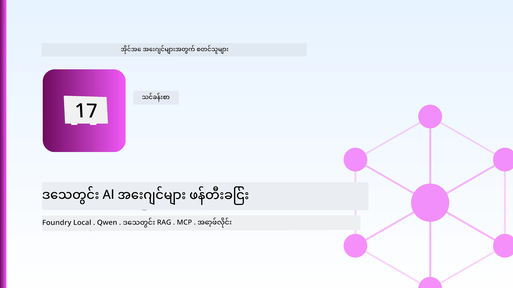
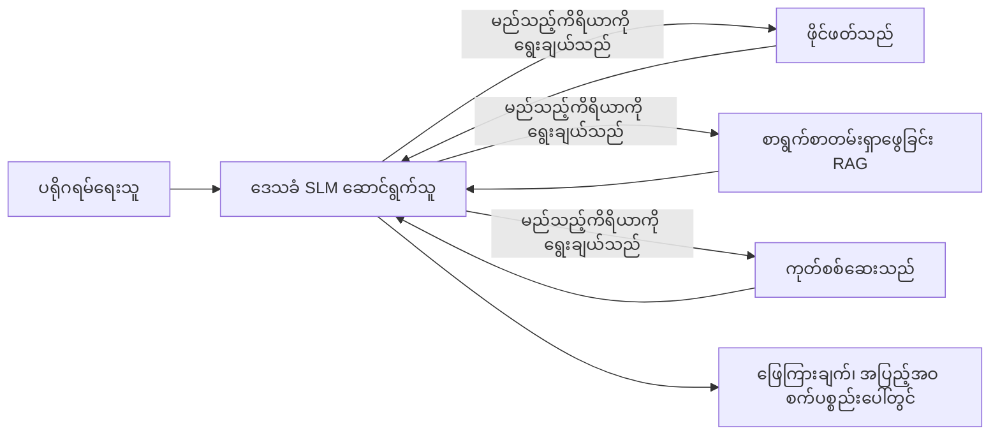
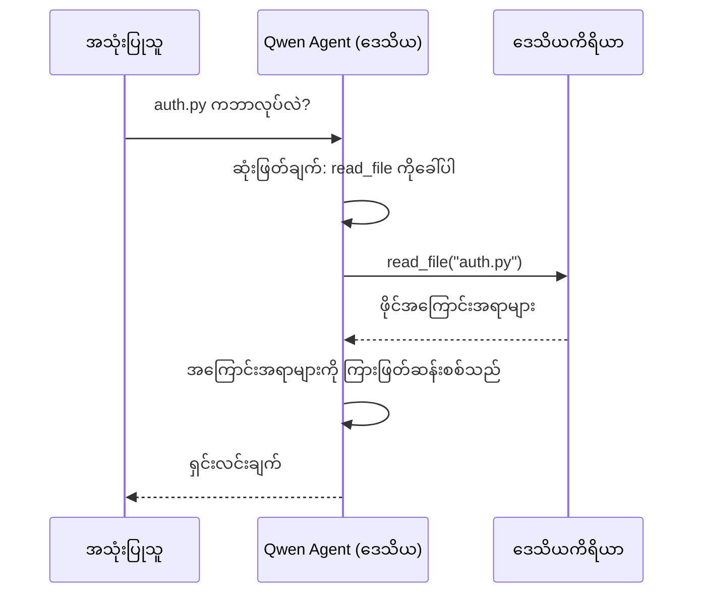
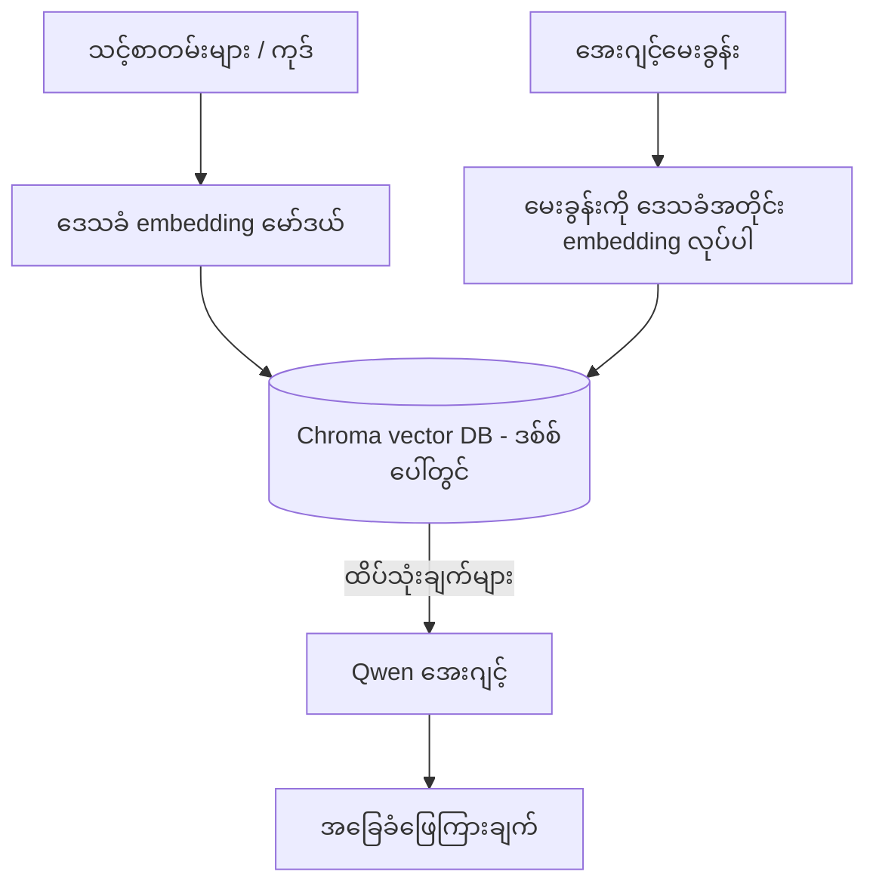
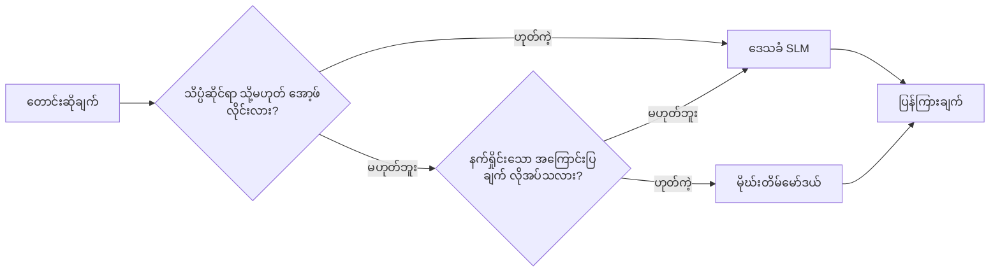

# Microsoft Foundry Local နဲ့ Qwen ကို အသုံးပြုပြီး ဒေသစံသတ် AI များဖန်တီးခြင်း



ယခင်အတန်းသည် အေးဂျင့်များကို မိုးကောင်းကင်ထဲသို့ *မြှင့်တင်* ခဲ့သည်။ ဒီအတန်းမှာတော့ တစက်ပစ္စည်းတစ်လုံးပေါ်မှာ *ကျေညာ* သွားစေမှာဖြစ်ပါတယ်။ နောက်ဆုံးမှာ အလုပ်လုပ်နိုင်တဲ့ အင်ဂျင်နီယာ အကူအညီ ဖြစ်လာမှာဖြစ်ပြီး အဓိကစွမ်းဆောင်ချက်တွေက ပြောဆိုခြင်း၊ ကိရိယာများကို ခေါ်ယူခြင်း၊ ဖိုင်များဖတ်ခြင်း၊ သင်၏စာရွက်စာတမ်းများကို ရှာဖွေရေးလုပ်ခြင်းတို့ဖြစ်ပါတယ် — **မိုးကောင်းကင်မှ လုံးဝ inference ခေါ်ဆိုမှု မရှိဘဲ။**

ဤစနစ်ကို ဘာကြောင့်လိုအပ်သလဲ? အလုပ်သမာဓိအတွက် မကြာခဏ ရောက်ရှိလာသော ထုတ်ပြန်ချက်သုံးချက်ရှိပါသည်။

- **Privacy.** ကုဒ်နဲ့စာရွက်စာတမ်းတွေက စက်ထဲမှာ မပြေးဘူး။ prompt တစ်ခုမှ မပါဝင်ဘူး၊ snippet မရှိဘူး၊ လုပ်ငန်းခွဲတိုင်းမှာ မတက်လမ်းဖြတ်တယ်။
- **Cost.** ဒေသစံသတ် inference မှတ်ပုံတင်ခြင်းမှာ per-token ငွေပေးချေမှု မရှိပါဘူး။ မည်သည့်နေ့ဂလီလ်လျှပ်စစ်စျေးနှုန်းဖြင့် လည်ပတ်နိုင်ပါသည်။
- **Offline.** လေယာဉ်စီးအပေါ်၊ လုံခြုံမှုရှိသောနေရာတစ်ခုမှာ သို့မဟုတ် မီးပျက်တချိန်မှာပါ အေးဂျင့်ဟာ အလုပ်လုပ်ဆောင်ပေးနိုင်တယ်။

ဤစနစ်၏ အားနည်းချက်မှာ မြင့်မားသော မိုးကောင်းကင်မော်ဒယ်ကို **သေးငယ်သည့်ဘာသာစကားမော်ဒယ် (SLM)** အဖြစ် သင်၏ CPU, GPU, သို့မဟုတ် NPU ပေါ်မှာ တည်ဆောက်ထားခြင်း ဖြစ်သည်။ ဒီသင်ခန်းစာသည် အဲဒီအကန့်အသတ်အတွင်း *ကောင်းမွန်* သောအေးဂျင့်များ ဖန်တီးခြင်းအကြောင်း ဖြစ်ပြီး အကန့်အသတ်မရှိဘဲ ကြောင့်မဟုတ်ဘူး။

## နိဒါန်း

ဒီသင်ခန်းစာမှာ ဖွင့်ဆိုမှာက:

- **သေးငယ်သောဘာသာစကားမော်ဒယ်များ (SLMs)** — အဲ့ဒီကဘာလဲ၊ ဘယ်ကြောင့်ထူးခြား တာများနဲ့ ဘယ်ဟာ မကောင်းတာတွေ ဖြစ်တယ်ဆိုတာ။
- **Microsoft Foundry Local** — စက်တစ်လုံးပေါ်မှာမော်ဒယ်နဲ့ဆက်သွယ်၍ အလုပ်လုပ်စေခြင်းဖြစ်ပြီး **OpenAI-compatible API** ဖြင့် တင်ဆက်ခြင်း။
- **Qwen function-calling models** — အေးဂျင့်တွေကို တည်ဆောက်ရာမှာ တူသော လုပ်ဆောင်မှု အတည်ပြု နည်းဖြစ်ပြီး ဒေသစံသတ်အေးဂျင့်များ လုပ်ဆောင်နိုင်စေခြင်း။
- **ဒေသစံသတ်ကိရိယာများ၊ ဒေသစံသတ် RAG နဲ့ ဒေသစံသတ် MCP** — မိုးကောင်းကင်မှာမဟုတ်ပဲ အေးဂျင့်ကို စွမ်းဆောင်ပေးခြင်း။
- **ဆက်စပ်ပုံစံများ** — ဒေသစံသတ် ပြုလုပ် မှာ ဘာအချိန်၊ မိုးကောင်းကင်ထဲသို့ ရောက်ဖို့ ပြုလုပ်ရာ။ 

## သင်ယူလိုသည်များ

ဒီသင်ခန်းစာပြီးဆုံးလျှင် သင်သည်:

- SLMs ၏ အကျိုးပြုမှုနှင့် သင့်တော်သော ဒေသစံသတ်အေးဂျင့်အသုံးချမှုအကြောင်း ဖေါ်ပြနိုင်ပါမည်။
- Foundry Local ဖြင့် Qwen မော်ဒယ်ကို ဒေသစံသတ် အနေဖြင့်ဆာဗ်လုပ်၍ OpenAI-compatible အင်တာဖေ့စ်မှ ချိတ်ဆက်နိုင်ပါမည်။
- စက်ပေါ်မှာတည်း ကိရိယာခေါ်ယူနိုင်သော အေးဂျင့်တစ်ခု ဖန်တီးနိုင်ပါမည်။
- သင့်စာရွက်စာတမ်းများအပေါ် ဒေသစံသတ် RAG ကို ဒေသစံသတ် vector database (Chroma) ဖြင့် ထည့်သွင်းနိုင်သည်။
- ဒေသစံသတ် MCP ဆာဗာနှင့် ချိတ်ဆက်ပြီး ဒေသစံသတ်/မိုးကောင်းကင်ပေါင်းစပ် ဒီဇိုင်းများအကြောင်း သင်ယူနိုင်ပါသည်။

## လိုအပ်သည့် အဆင့်များ

ယခင် သင်ခန်းစာများပြီးမြောက်ပြီးဖြစ်ပြီး အောက်ပါအရာများတွင် အဆင်ပြေကြောင်း မျှော်လင့်ပါသည်။

- [Tool Use](../04-tool-use/README.md) (သင်ခန်းစာ 4) နဲ့ [Agentic RAG](../05-agentic-rag/README.md) (သင်ခန်းစာ 5)။
- [Agentic Protocols / MCP](../11-agentic-protocols/README.md) (သင်ခန်းစာ 11)။
- [Microsoft Agent Framework](../14-microsoft-agent-framework/README.md) (သင်ခန်းစာ 14)။

သင်သည် အောက်ပါအရာများလည်း လိုအပ်သည်။

- တိုးတက်သူစက်ရုံးတစ်ခု။ **8 GB RAM သည် အနိမ့်ဆုံးစံချိန်ဖြစ်ပြီး** 16 GB+ သည် လုံလောက်မှုရှိသည်။ GPU သို့မဟုတ် NPU တစ်ခုရှိရင် အဆင်ပြေမယ်၊ မလိုအပ်ပါ။
- **Microsoft Foundry Local** တပ်ဆင်ထားပြီး (အောက်တွင် ရှင်းပြထားသော setup ကို ကြည့်ပါ)။
- Python 3.12+ နဲ့ repository အတွင်းရှိ [`requirements.txt`](../../../requirements.txt) အထောက်အပံ့ package များ၊ နှင့် `foundry-local-sdk`, `openai`, `chromadb` စသည်တို့။

## သေးငယ်သောဘာသာစကားမော်ဒယ်များ (SLMs): ဒေသစံအလုပ်များတွင် သင့်တော်သော ကိရိယာ

မြင့်မားသောမိုးကောင်းကင်မော်ဒယ်များမှာ သန်းပေါင်းများစွာအပိုင်းခွဲများနှင့်ဒေတာစင်တာရှိသည်။ SLM က သန်းရေဂဏန်းသေးငယ်သည့် parameter များရှိပြီး သင့်လက်ပ်တော့ RAM ထဲမှာသိမ်းဆည်းရမည်။ ဒီကွာခြားချက်က သေချာသော မျှော်လင့်ချက်တွေ ပေးပါတယ်။

**SLMs ကို ကောင်းစွာ တော်တဆင်နိုင်သောအရာများ:**

- ဖွဲ့စည်းထားသော အလုပ်ရောက်နိုင်သော လုပ်ငန်းများ — ရှာဖွေခြင်း၊ ခွဲထုတ်ခြင်း၊ လက်ရှိရှိစာရွက်စာတမ်းတစ်ခု၏ အနှစ်ချုပ်ရေးခြင်း။
- **ကိရိယာခေါ်ဆိုခြင်း** — ဘယ်functionကိုဘယ်အတိုင်းခေါ်မလဲဆိုတာဆုံးဖြတ်ခြင်း။
- မိမိ့ဒေတာပေါ်တွင် မြန်ဆန်ပြီး စျေးသက်သာပြီး ကိုယ်ပိုင်အချက်အလက်ကို မျက်မပျက်လုပ်ခြင်း။

**SLMs အားနည်းသောအရာများ:**

- ဆက်စပ်ဖွယ်ရာ များစွာနဲ့ မူကြမ်းမဲ့ ဟိုပေါ် ချပ်ချပ်ရှုးရှုး၊ ရှေ့ဆက်တွေးခေါ်ချက်များ။
- ကမ္ဘာ့အကြောင်းအရာကျယ်ပြန့်မှု (အနည်းငယ်တွေကြည့်ရတာမို၊ မေ့တတ်တာပိုများတာ)။

ဒေသစံအေးဂျင့်များအတွက် အနိုင်ရနည်းလမ်းမှာ: **SLM ကို စီမံခန့်ခွဲရန် ခွင့်ပြုပါ၊ ကိရိယာတွေကို အားနာအသက်သာမဲ့ လုပ်ဆောင်စေပါ။** မော်ဒယ်ဟာ မင်းရဲ့ကုဒ်ဘေ့စ်ကို *သိရန်* မလိုပါဘူး — `read_file` နဲ့ `search_docs` ကသတ်မှတ်သည့်အချိန်ကိုသိရန်လိုသည်။ ဒါဟာ SLM ၏အားသာချက်တွေကောင်းစွာကစားပေးတယ်။



## Microsoft Foundry Local

**Microsoft Foundry Local** က သင့်စက်မှာ မော်ဒယ်တွေကို ဒေါင်းလုတ်လုပ်ပြီး စီမံခန့်ခွဲခြင်း၊ ပြန်လည်ထုတ်ပေးခြင်းလုပ်ဆောင်သော ပေါ့ပါးသော runtime တစ်ခု ဖြစ်သည်။ အရေးကြီးဆုံး ဖုန်းကာကွယ်စောင့်ရှောက်မှုကတော့ **OpenAI-compatible HTTP endpoint** ကို ဖော်ထုတ်ပေးရေးဖြစ်ပြီး၊ OpenAI SDK နဲ့ Microsoft Agent Framework ရဲ့ OpenAI client တို့ကို `base_url` ပြောင်းခြင်းသာနဲ့ အသုံးပြုနိုင်သည်။ အမြောက်အမြားသည် မိုးကောင်းကင်မှ ဒေသစံသတ်သို့ ရွှေ့ပြောင်းသွားသည်။

Foundry Local က သင့်ဒိုင်ဝဲ (hardware) အပေါ် အလိုအလျောက် အကောင်းဆုံး built model ကိုရွေးချယ်ပေးသည် — CPU build၊ CUDA/GPU build သို့မဟုတ် NPU build — ထိုကြောင့် စက်နှင့်အတူ တိုက်ရိုက် optimize လုပ်မလိုပါ။

### တပ်ဆင်ခြင်း

သင့် OS အတွက် Foundry Local ကို တပ်ဆင်ပါ (လက်စွဲကို [documentation](https://learn.microsoft.com/azure/ai-foundry/foundry-local/) တွင် ကြည့်ပါ)၊ ပြီးရင် එයလည်ပတ်မှုကို အတည်ပြုပါ။

```bash
# ထည့်သွင်းပါ (ဥပမာ; သင့်ပလက်ဖောင်းအတွက်စာတမ်းများကိုလိုက်နာပါ)
winget install Microsoft.FoundryLocal      # Windows
# brew install microsoft/foundrylocal/foundrylocal   # macOS

# Qwen မော်ဒယ်ကိုဒေါင်းလုပ်လုပ်ကာ လည်ပတ်ပါ၊ ထို့နောက် ဒေသဆိုင်ရာဝန်ဆောင်မှုကိုစတင်ပါ
foundry model run qwen2.5-7b-instruct
foundry service status
```

ဝန်ဆောင်မှု လည်ပတ်နေပြီးသည်နှင့် ဒေသစံသတ် OpenAI-compatible endpoint ကို ရရှိနိုင်ပါပြီ (ယေဘုယျအားဖြင့် `http://localhost:PORT/v1`)။ notebook သည် `foundry-local-sdk` ကိုအသုံးပြုပြီး endpoint ကို အလိုအလျောက်ရှာဖွေသည်၊ ထိုကြောင့် port ကို အတိအကျရေးရန် မလိုအပ်ပါ။

## Qwen function calling: ဘာကြောင့် အရေးကြီးသည်

အေးဂျင့်ဟာ ကိရိယာခေါ်နိုင်မှ အေးဂျင့် ဖြစ်တယ်။ အများစု SLM များက စကားပြောနိုင်ပေမယ့် ကိရိယာခေါ်မှုပုံစံတွေ မွားယွင်းမှုရှိစေတတ်သည်။ **Qwen** မော်ဒယ်များ အတည်ပြု function calling အတွက်လေ့ကျင့်ထားပြီး ကိရိယာခေါ်ပုံစံများကို တိကျရိုးရှင်းစွာ ထုတ်လုပ်နိုင်ပြီး ဒေသစံသတ် chat မော်ဒယ်ကို သက်ဆိုင်ရာ လုပ်ငန်းစဉ်များတွင် ချိတ်ဆက်နိုင်သည်။

အသုံးပြုရန် ရိုးရှင်းသည့် tool-calling loop ဖြစ်ပြီး ဒီအတိုင်း စက်ပေါ်တွင် လည်ပတ်ပါသည်။



## ဒေသစံ RAG

စာရွက်စာတမ်း ရှာဖွေမှုသည် ဒေသစံအေးဂျင့်၏ အခြေခံလုပ်ငန်းဖြစ်သည်။ SLM က သင့် framework စာရွက်စာတမ်းများကို မှတ်မိကြောင်း မမျှော်လင့်ဘဲ၊ သင့်Docs များကို **ဒေသစံ vector database** ထဲမှာ ထည့်သွင်းပြီး အေးဂျင့်က လိုအပ်သလို ပြန်ယူနိုင်သည်။

Chroma ကို အသုံးပြုပါသည်။ ဒါဟာ embedded vector store တခုဖြစ်ပြီး server မလိုအပ်သည့် နည်းလမ်းဖြစ်သည်။ pipeline ဟာ လုံးဝ ဒေသစံဖြစ်: ဒေသစံ embedding model → ဒေသစံ vectors → ဒေသစံ retrieval → ဒေသစံ SLM။



ဒီဟာက Lesson 5 မှ Agentic RAG ပုံစံတူပါ၊ အပြောင်းအလဲကတော့ အစိတ်အပိုင်းအားလုံးကို သင့်စက်ပေါ်မှာ ဖွင့်ထားခြင်း။

## ဒေသစံ MCP ဆာဗာများ

[MCP](../11-agentic-protocols/README.md) က ကွန်ယက်ဝန်ဆောင်မှုမဟုတ်ပါ၊ တင်ပို့မှုနည်းပညာတစ်ခုဖြစ်သည်။ MCP server မှာ ဒေသစံစနစ်ဖြင့် `stdio` တခုအဖြစ် လည်ပတ်နိုင်ပြီး အေးဂျင့်အတွက် ကိရိယာများကို protocol မှတစ်ဆင့် ဖေါ်ထုတ်ပေးသည်။ ဒီလိုနဲ့ MCP server စနစ်တွေနဲ့ offline ရောရွှေ့အသုံးပြုနိုင်ကြသည်။

လုံခြုံရေးဒေသကွဲဟာ မိုးကောင်းကင်နဲ့ မတူပေမယ့် မလျော့နည်းပါဘူး။ ဒေသစံ MCP ဆာဗာက သင့်အသုံးပြုသူ ခွင့်ပြုခြင်းဖြင့် တည်ဆောက်ပြီး သုံးစွဲနိုင်သော အပိုင်းကို သတိထားဖို့လိုတယ် (ဥပမာ - ပရောဂျက်ဖိုလ်ဒါတစ်ခုသာဖြစ်ပြီး၊ အိမ်ဖိုလ်ဒါလုံးဝမဟုတ်)၊ ထွက်လာသည့် အချက်အလက်များကို ပြန်လည်စစ်ဆေးရန်အတွက် စည်းကြပ်ပါ။

## မိုးကောင်းကင်နှင့် ဒေသစံ ပေါင်းစပ်ပုံစံများ

ဒေသစံပထမ မဟုတ်ဘဲ ဒေသစံပဲ ဖြစ်စေခြင်းမဟုတ်ပါ။ ပြည့်စုံပြီးနိုးကြီးသောစနစ်များက စက်မှု လိုအပ်ချက်နှင့် ခက်ခဲမြန်ဆန်မှုတို့အပေါ် မူတည်သော အခြေအနေများအလိုက် ခွဲခြားထားသည်။

| အခြေအနေ | ဘယ်မှာ လျှောက်လွှာ လုပ်ဆောင်မလဲ |
| --- | --- |
| သတိုးယုတ်သောကုဒ်/ဒေတာ၊ သို့မဟုတ် အော့ဖ်လိုင်း | **ဒေသစံ SLM** |
| ရိုးရှင်းပြီး ကန့်သတ်ထားသောအလုပ် | **ဒေသစံ SLM** (စျေးသက်သာ၊ မြန်ဆန်) |
| ခက်ခဲသော မူကြမ်းအပေါ် မျိုးစုံ ဟိုပ် ဆက်စပ်ရန် | **မိုးကောင်းကင် မော်ဒယ်** |
| အားလုံးအတွက် (မီးပျက်ချိန်) | **ဒေသစံ SLM** (တိုးတက်မှုနည်းနည်းနဲ့ ခံနိုင်ရည်) |

ဒီဟာက Lesson 16 မှာ တင်ဆက်ထားတဲ့ **မော်ဒယ်လမ်းကြောင်းခြားနည်း** ကို အဖြစ်အပေါ်ထားတာပါ၊ ဒါပေမဲ့ "မော်ဒယ်" တစ်ခု ဟာ အခုသင့်စက်က ဖြစ်နေပါတယ်။ ခိုင်မာတဲ့ဒီဇိုင်းက မိုးကောင်းကင်မရရှိနိုင်ချိန်မှာ ဒေသစံမှာ ပြန်ရှေ့ဆက်တော့မှာဖြစ်ပြီး အေးဂျင့်ရဲ့ အရည်အသွေးဟာကျဆင်းပါလိမ့်မယ်၊ ဖြတ်သန်း၍ မပျက်စီးပါဘူး။



## လက်တွေ့သင်ကြားမှု: ဒေသစံအင်ဂျင်နီယာ အကူအညီ

[`code_samples/17-local-agent-foundry-local.ipynb`](./code_samples/17-local-agent-foundry-local.ipynb) ဖိုင်ကိုဖွင့်၍ လေ့လာပါ။ သင့်စက်ပေါ်မှာ လုံးဝရပ်တည်၍ အောက်ပါကို လုပ်ဆောင်နိုင်တဲ့ **ဒေသစံအင်ဂျင်နီယာအကူအညီ** တစ်ခုကို ဖန်တီးပါမည်။

1. **ကိရိယာများကို ခေါ်ယူခြင်း** — Foundry Local မှတဆင့် Qwen function calling ဖြင့်။
2. **ဒေသစံဖိုင်စီမံခန့်ခွဲမှုများပြုလုပ်ခြင်း** — ပရောဂျက်ဒီရက်တော့ရှိဖိုင်များစာရင်းပြုလုပ်ပြီး ဖတ်ရှုခြင်း။
3. **ကုဒ်စစ်တမ်း** — မူရင်းဖိုင်တစ်ခု အပေါ် ရိုးရှင်းသော အချက်အလက်တွေ ကြေငြာခြင်း။
4. **စာရွက်စာတမ်းရှာဖွေခြင်း** — Chroma ဖြင့် ဒေသစံ RAG ကို စာရွက်များအပေါ် လုပ်ခြင်း။
5. **MCP ကို အသုံးပြုခြင်း** — ဒေသစံ MCP ဆာဗာနှင့် ချိတ်ဆက်ခြင်း (သတ်မှတ်မထားလျှင် ချက်ချင်း ကျော်သွားသည်)။

မိုးကောင်းကင် inference ခေါ်မှု မရှိပါ။

### လမ်းညွှန်ချက်

အကူအညီသည် OpenAI-compatible endpoint မှတဆင့် Foundry Local ကို ချိတ်ဆက်သည်၊ ဒါကြောင့် အေးဂျင့်ကုဒ်က မိုးကောင်းကင်သင်ခန်းစာများနှင့် အတူတူပါ — client အပြောင်းအလဲ တစ်ခုသာရှိသည်။

```python
from foundry_local import FoundryLocalManager
from openai import OpenAI

# Foundry Local သည် မော်ဒယ်ကို ရှာဖွေပြီး ဒေါင်းလုပ်ဆွဲပေးကာ ကျွန်ုပ်တို့အား ဒေသတွင်း အဆုံးခန်းကိုပေးသည်။
manager = FoundryLocalManager(\"qwen2.5-7b-instruct\")
client = OpenAI(base_url=manager.endpoint, api_key=manager.api_key)  # api_key သည် ဒေသတွင်း အစားထိုးတန်ဖိုးဖြစ်သည်။
```

ကိရိယာများမှာ ပရောဂျက် ဒိုင်ဘာတွင် အကန့်အသတ်ထားသော ပုံမှန် Python function များဖြစ်သည်။

```python
def read_file(path: str) -> str:
    \"\"\"Read a file, but only inside the sandboxed project directory.\"\"\"
    full = (PROJECT_ROOT / path).resolve()
    if PROJECT_ROOT not in full.parents and full != PROJECT_ROOT:
        return \"Access denied: path is outside the project directory.\"
    return full.read_text(encoding=\"utf-8\")
```

ဒေသစံ sandbox စစ်ဆေးမှုကို မွတ်သိထားပါ — ဒေသစံမှာပါကိရိယာတစ်ခုက အမှားလမ်းကြောင်းဖတ်ခြင်းရှိနိုင်သည်။ notebook မှာ ကိရိယာသုံးခုခြင်းကို တစ်ခုတည်းသော project root အပါအဝင် အကန့်အသတ်ထားသည်။

## ဗဟုသုတ စစ်ဆေးမှု

အပ်ဒိတ်လုပ်မည့် assignment သို့ လှမ်းမတက်မီ သင့် အသိပညာကို စစ်ဆေးပါ။

**၁။ ဒေသစံအေးဂျင့်ကို မိုးကောင်းကင်အစား အသုံးပြုရန် အကြောင်းရင်းနှစ်ချက် ပြောပြပါ။**

<details>
<summary>ဖြေကြားချက်</summary>

အနည်းဆုံး နှစ်ချက်ဖြစ်စေ: **privacy** (ကုဒ်နဲ့ဒေတာတွေက အစက်ထဲမှာပဲနေရတယ်), **စရိတ်** (per-token inference စရိတ် မရှိဘူး), နှင့် **offline ရနိုင်မှု** (ကွန်ယက်မရှိဘဲ လေယာဉ်မှာ၊ လုံခြုံသောနေရာတွင် သို့မဟုတ် မီးပျက်ချိန်)။ ဒေတာစနစ်ကို ပစ္စည်းကွပ်ကဲအမှုများကလည်း privacy အကြောင်းပြချက်ကို လှုံ့ဆော်ပါသည်။
</details>

**၂။ ဒေသစံအေးဂျင့်တွင် SLM နဲ့ ကိရိယာများကြားအလုပ်ခွဲစီမံခြင်း အကြံပြုချက်ဘယ်လိုရှိပြီး ဘာကြောင့်လဲ?**

<details>
<summary>ဖြေကြားချက်</summary>

SLM ကို **စီမံခန့်ခွဲစေရန်** ခွင့်ပြုပြီး (ဘယ်ကိရိယာခေါ်မလဲ၊ ဘယ်အတိုင်းခေါ်မလဲ ရွေးချယ်ခြင်း)၊ **ကိရိယာတွေကို အားနာကျန်ခဲ့သောလုပ်ငန်းများဆောင်ရွက်စေရန်** ခွင့်ပြုပါ (ဖိုင်ဖတ်ခြင်း၊ စာရွက်စာတမ်းများ ရှာဖွေရေး၊ ရလဒ်တွက်ချက်ခြင်း)။ SLM များဟာ ကိရိယာရွေးချယ်ရာတွင် တောင့်တင်းမှုရှိပေမယ့် ကမ္ဘာ့အကြောင်း အလျားရှည် multi-hop ရှင်းလင်းခြင်းမှာ ချို့ယွင်းမှုရှိသည်၊ အဲဒါကြောင့် ကိရိယာလိုအပ်ချက်တွေးချက်များနှင့် လက်တွေ့စွမ်းဆောင်ချက်များအပေါ် တွန်းအားပေးသည်။
</details>

**၃။ Foundry Local နဲ့ မိုးကောင်းကင်အေးဂျင့်ကုဒ်များကို ပြန်လည်အသုံးချဖို့ဘာကြောင့်ရနိုင်တာလဲ?**

<details>
<summary>ဖြေကြားချက်</summary>

Foundry Local ဟာ **OpenAI-compatible HTTP endpoint** ကို ဖော်ထုတ်ပေးတယ်။ OpenAI SDK နဲ့ Agent Framework ရဲ့ OpenAI client ဟာ `base_url` ကိုသတ်မှတ်ခြင်းမှတစ်ဆင့် (ဒေသစံ API key တစ်ခုပါးသုံးပြီး) အလုပ်လုပ်တတ်သည်။ အားလုံးကြောင်း အေးဂျင့်ကုဒ်မှာ ရှိနေသည်။
</details>

**၄။ အဘယ်ကြောင့် ကျွန်ုပ်တို့ Qwen function calling မော်ဒယ်ကိုသာသီးသန့် အသုံးပြုပြီး မည်သည့် SLM မဆို သုံးခြင်း မဟုတ်တာလဲ?**

<details>
<summary>ဖြေကြားချက်</summary>

အေးဂျင့်သည် ယုံကြည်စိတ်ချရပြီး စနစ်တကျ **ကိရိယာခေါ်ဆိုမှုများ** ကို ထုတ်ပေးနိုင်ရမည်။ SLM များစွာသည် စကားပြောနိုင်ပေမယ့် ကိရိယာကြောင်းမှားယွင်းမှုများ ရှိပါသည်။ Qwen မော်ဒယ်များ function calling အတွက် သင်ကြားပြီး ပုံမှန် tool call များထုတ်ပေးပြီး ဒေသစံ chat ကို ဒေသစံ *အေးဂျင့်* ချိန်တွယ်နိုင်သည်။
</details>

**၅။ ဒေသစံ RAG pipeline တွင် ဘယ်အစိတ်အပိုင်းတွေ စက်ပေါ်မှာ လည်ပတ်သလဲ?**

<details>
<summary>ဖြေကြားချက်</summary>

အားလုံးပါ: embedding model, vector database (Chroma, disk ပေါ်မှာ), retrieval အဆင့်နဲ့ SLM ပါ။ စာရွက်စာတမ်းတွေ ကို ဒေသစံဖတ်ရှု၊ ဒေသစံသိမ်းဆည်း၊ ဒေသစံပြန်ယူပြီး ဒေသစံမော်ဒယ်က ဆောင်ရွက်တယ် — cloud ဆိုင်ရာအစိတ်အပိုင်း မူဘူး။
</details>

**၆။ ဒေသစံ MCP ဆာဗာတစ်ခု သင့်စက်ပေါ်တွင် လည်ပတ်နေသည်ကို အလိုအလျောက် လုံခြုံကြောင်း သတ်မှတ်လို့ရသလား? သင်မည်သို့ သတိပြုမှုပေးသင့်သလဲ?**

<details>
<summary>ဖြေကြားချက်</summary>

မဟုတ်ပါ။ ဒေသစံ MCP ဆာဗာသည် သင့်အသုံးပြုသူ ခွင့်ပြုချက်ဖြင့် လည်ပတ်သဖြင့် သင့်အတူရောက် سکتےသောအရာ တစ်ခုလုံးကို ရွေးချယ်နိုင်သည်။ လိုအပ်သောပရောဂျက်တစ်ခု အတွင်းသို့ (ဥပမာ - တစ်ခုတည်းသော project ဒိုင်ဘာတစ်ခုသာ) ကန့်သတ်ပေးပြီး ထွက်ရှိလာသော အချက်အလက်များကို ဝင်ရောက် စစ်ဆေးခြင်းခံယူပါ။
</details>

**၇။ ဒေသစံမော်ဒယ်တစ်ခု ပါဝင်သည့် သင့်တော်သော ဆက်စပ်ပုံစံလမ်းကြောင်း တစ်ခု ဖော်ပြပါ။**

<details>
<summary>ဖြေကြားချက်</summary>

သတိုးယုတ် သို့မဟုတ် offline ဖြစ်သော တောင်းဆိုမှုများကို ဒေသစံ SLM သို့ အဖမ်းပေးပါ;  ရိုးရှင်းပြီး ကန့်သတ်ထားသောအလုပ်များကို ဒေသစံ SLM သို့ အမြန်နှုန်း၊ စျေးချိုသာမှုအတွက် လမ်းညွှန်ပါ; သတိုးယုတ် မဟုတ်သော ဒေတာအပေါ် ခက်ခဲသော မျိုးစုံ border multi-hop reasoning ကို မိုးကောင်းကင်မော်ဒယ်သို့ စီစဉ်ပါ; မိုးကောင်းကင် မရရှိနိုင်လျှင် ဒေသစံ SLM သို့ ပြန်သွားပြီး အေးဂျင့်သည် ကျဆင်းမှု ဆိုင်ရာနှင့် သက်သာစွာ ဆက်လက်လုပ်ဆောင်သည်။ ဒီဟာက Lesson 16 မှ မော်ဒယ်လမ်းကြောင်းကြီးခြင်းဖြစ်ပြီး ဒေသစံစက်က မော်ဒယ်တစ်ခုဖြစ်သည်။
</details>

**၈။ ဒီသင်ခန်းစာအတွက် ဒေသစံအေးဂျင့်ကို လုပ်ဆောင်ရန် ဘယ်လောက် RAM လိုအပ်ပြီး RAM များပြီးရင် ဘာကို ရနိုင်သလဲ?**

<details>
<summary>ဖြေကြားချက်</summary>

သင်္ချိုင်း **8 GB** သည် လိုအပ်ချက်အနိမ့်ဆုံးဖြစ်ပြီး၊ 16 GB+ သည် လုံလောက်စွာ အသုံးပြုနိုင်သည်။ RAM ပိုရင် ပိုကြီးနာမည်ရှိတဲ့ မော်ဒယ်တွေ လည်ပတ်နိုင်ပြီးနောက်ခံအချက်အလက်များကို ဂရုစိုက်ထားနိုင်သည်။ GPU သို့မဟုတ် NPU က inference ဖြင့် မြန်ဆန်စေသော်လည်း လိုအပ်ခြင်းမရှိပါ — Foundry Local သည် accelerator မရှိလျှင် CPU build ကို ရွေးချယ်ပေးသည်။
</details>

## အပ်ဒိတ်အလုပ်

ဒေသစံအင်ဂျင်နီယာ အကူအညီကို သင့်ရွေးချယ်သော သေးငယ်သော ပရောဂျက်တစ်ခုအတွက် **ဒေသစံစာရွက်စာတမ်း စစ်ဆေးသူ** တစ်ခုအဖြစ် တိုးချဲ့ပါ (repo ရဲ့ သင်ခန်းစာဖိုလ်ဒါ တစ်ခုသုံးနိုင်သည်)။

သင့် တင်သွင်းမှုတွင် ပါဝင်ရမည်များ:

1. တကယ့်သော docs/code ဖိုလ်ဒါ တစ်ခုကို Chroma အတွင်း အညွှန်းပြုလုပ်ပါ (ဖိုင်ငါးခု အနည်းဆုံး)။
2. `find_todos` tool တစ်ခုထည့်ပါ။ သည်က ပရောဂျက်အတွင်း `TODO`/`FIXME` မှတ်ချက်များကို ရှာဖွေပြီး ဖိုင်နာမည်၊ စာကြောင်းနံပါတ်နှင့် ပြန်လည်တင်ပြပေးမည် — `read_file` နဲ့တူညီသော sandbox စစ်ဆေးမှုပါရှိရမည်။

3. **စက်ရုပ်ကို မေးခွန်းသုံးခု မေးပါ။** ကြိုးစားပေးရန်၊ တစ်ခုချင်းစီတွင် စစ်တမ်း RAG မေးခွန်းတစ်ခုပြုလုပ်ပါ၊ ဖိုင်တစ်ခုကိုဖတ်ရန်လိုအပ်သော မေးခွန်းတစ်ခုနှင့် TODO တွေကို ရှာဖွေရန်လိုအပ်သော မေးခွန်းတစ်ခုဖြစ်သည်။
4. **တိုင်းတာပါ** - အဆိုပါမေးခွန်းသုံးခု၏ ဖြေဆိုမှုအချိန်တိုင်းတာပြီး markdown ကွက်ထဲတွင် မှတ်သားပါ။ မိမိအလုပ်စဉ်အတွက် စောင့်ဆိုင်းချိန်လက်ခံနိုင်သလား ဆိုတာကို မှတ်ချက်ရေးပါ။

ထို့နောက် ဒီပြန်လည်ဆန်းစစ်သူအတွက် **သင်မောင်းနှင်မည့်ကလောက်နှင့် ဒေသခံတွင် ထိန်းသိမ်းမည့် အရာများအကြောင်း** အတိုချုံး စာပိုဒ်တိုတစ်ပိုဒ် ရေးပါ။ ဒေသခံအပိုင်းများကို မှန်မှန်ကန်ကန်တွဲဆက်ထားမှုနှင့် မိမိ၏ ဟိုက်ဘရစ် စဉ်းစားမှုမှန်ကန်မှု အပေါ်မှ သတ်မှတ်ခံရသည်။ မော်ဒယ်အရည်အသွေးပေါ် မဟုတ်ပါ။

## အကျဉ်းချုန်း

ဒီသင်ခန်းစာအတွင်း သင်သည် မိမိစက်ပစ္စည်းပေါ်တွင် အပြည့်အစုံ လည်ပတ်နိုင်သော စက်ရုပ် တစ်ခု တည်ဆောက်ခဲ့သည်။

- **SLMs** သည် ကျယ်ပြန့်မှုအား ကိုယ်ပိုင်ရေးမှု၊ ကုန်ကျစည်၊ နှင့် အော့ဖ်လိုင်း လည်ပတ်မှု အတွက် လဲလှယ်ပေးပြီး၊ **ကိရိယာများစီမံခန့်ခွဲခြင်း** များကို ကိုယ်တိုင်သိရှိမှုကို ကျော်လွန်၍ ပြသနိုင်သည်။
- **Foundry Local** သည် **OpenAI-ကိုက်ညီသည့် endpoint** အောက်မှ ဒီဗိုက်စက်ပေါ်မော်ဒယ်များကို ဝန်ဆောင်မှုပေးပြီး၊ သင်၏ ကလောက်စက်ရုပ် ကုဒ်ကို တစ်ကြောင်းသွားပြောင်းရာ ချိန်ညှိချက်ဖြင့် လွယ်ကူစေသည်။
- **Qwen function-calling models** သည် ယုံကြည်စိတ်ချရသော ဒေသခံကိရိယာခေါ်ဆိုမှု ပြုလုပ်နိုင်စေပြီး၊ ဒါကြောင့် ဒေသခံ *agents* များ ပေါ်ထွက်လာသည်။
- **ဒေသခံ RAG** (Chroma) နှင့် **ဒေသခံ MCP** သည် စက်မှ ထွက်မသွားဘဲ စက်ရုပ် အင်အားပေးသည်။
- **ဟိုက်ဘရစ် စနစ်များ** သည် ချေးမှု့နှင့် ခက်ခဲမှု ပုံစံအလိုက် လမ်းကြောင်းချနိုင်ပြီး၊ ဒေသခံကို ဖယ်လ်ဘတ် အလွယ်ရွေးချယ်စနစ်အဖြစ် သတ်မှတ်ပါသည်။

ဤသည်သည် တပ်ဆင်ခြင်း အလွှာကို ပြီးမြောက်စေသည်။ သင်ခန်းစာ 16 တွင် စက်ရုပ်များကို Microsoft Foundry သို့ တိုးချဲ့ခဲ့ကြပြီး၊ ဤသင်ခန်းစာတွင် အသီးသီး မှာကွန်ပျူတာတစ်လုံးတွင် ချုပ်နိမ့်လိုက်သည်။ နောက်သင်ခန်းစာတွင် တပ်ဆင်ထားသော စက်ရုပ်များကို ဘေးကင်းရေး ထိန်းသိမ်းမှုကို နှိုင်းယှဉ်ပြပါမည်။

## ပိုမိုအချက်အလက်များ

- <a href="https://learn.microsoft.com/azure/ai-foundry/foundry-local/" target="_blank">Microsoft Foundry Local စာတမ်းများ</a>
- <a href="https://learn.microsoft.com/azure/ai-foundry/what-is-azure-ai-foundry" target="_blank">Microsoft Foundry စာတမ်းများ</a>
- <a href="https://aka.ms/ai-agents-beginners/agent-framework" target="_blank">Microsoft Agent Framework</a>
- <a href="https://qwen.readthedocs.io/en/latest/framework/function_call.html" target="_blank">Qwen function call စာတမ်းများ</a>
- <a href="https://modelcontextprotocol.io/" target="_blank">Model Context Protocol (MCP)</a>
- <a href="https://docs.trychroma.com/" target="_blank">Chroma vector database</a>

## ယခင်သင်ခန်းစာ

[မောင်းနှင်နိုင်သည့် စက်ရုပ်များ တပ်ဆင်ခြင်း](../16-deploying-scalable-agents/README.md)

## နောက်တစ်ခု သင်ခန်းစာ

[AI စက်ရုပ်များ လုံခြုံရေး](../18-securing-ai-agents/README.md)

---

<!-- CO-OP TRANSLATOR DISCLAIMER START -->
**ပြောကြားချက်**
ဤစာတမ်းကို AI ဘာသာပြန်ဝန်ဆောင်မှု [Co-op Translator](https://github.com/Azure/co-op-translator) အသုံးပြု၍ ဘာသာပြန်ထားပါသည်။ ကျွန်ုပ်တို့သည် တိကျမှန်ကန်မှုအတွက် ကြိုးပမ်းနေသော်လည်း၊ စက်ကိရိယာဘာသာပြန်ခြင်းများတွင် အမှားများ သို့မဟုတ် မှားယွင်းချက်များ ပါဝင်နိုင်ကြောင်း သတိပြုပါရန် လိုအပ်ပါသည်။ မူလစာတမ်းကို မူရင်းဘာသာဖြင့်သာ ယုံကြည်စိတ်ချရသော အချက်အလက်အဖြစ် သတ်မှတ်သင့်သည်။ အရေးကြီးသည့် သတင်းအချက်အလက်များအတွက် ပရော်ဖက်ရှင်နယ် လူသားဘာသာပြန်သူဝန်ဆောင်မှုကို အကြံပြုပါသည်။ ဤဘာသာပြန်ချက်ကို အသုံးပြုခြင်းမှ ဖြစ်ပေါ်လာသော နားလည်မှုကွာခြားမှုများ သို့မဟုတ် မမှန်ကန်သော အသုံးပြုမှုများအတွက် ကျွန်ုပ်တို့ တာဝန်မခံပါ။
<!-- CO-OP TRANSLATOR DISCLAIMER END -->