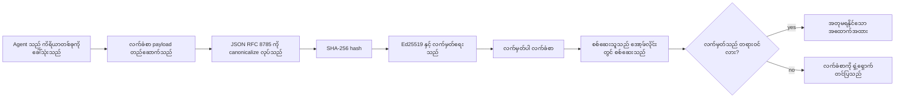
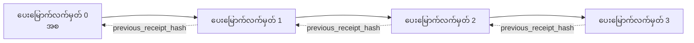

[သင်ခန်းစာ ဗီဒီယို ကြည့်ရန်: ကွယ့်ရီဖိုဂရပ်ဖစ် လက်မှတ်များဖြင့် AI လုပ်ဆောင်ချက်များကို လုံခြုံစွာ ထိန်းချုပ်ခြင်း](https://youtu.be/PLACEHOLDER_VIDEO_ID)

> _(သင်ခန်းစာ ဗီဒီယို နှင့် မြင်ကွင်းပုံကို Microsoft အကြောင်းအရာ အဖွဲ့မှ ပေါင်းစည်းပြီးနောက် ထည့်သွင်းမှာဖြစ်ပြီး၊ သင်ခန်းစာ ၁၄ / ၁၅ ဖော်မတ်နှင့် ကိုက်ညီပါသည်။)_

# ကွယ့်ရီဖိုဂရပ်ဖစ် လက်မှတ်များဖြင့် AI လုပ်ဆောင်ချက်များကို လုံခြုံစွာ ထိန်းချုပ်ခြင်း

## မိတ်ဆက်

ဒီသင်ခန်းစာမှာ ဖော်ပြသွားမှာက:

- AI လုပ်ဆောင်ချက်များအတွက် စစ်ဆေးခြင်းမှတ်တမ်းများ ရှိခြင်းသည် လိုက်နာမှု၊ ချွေတာခြင်း နှင့် ယုံကြည်မှုအတွက် ဘယ်လိုအရေးကြီးသလဲ။
- ကွယ့်ရီဖိုဂရပ်ဖစ် လက်မှတ် ဆိုတာဘာလဲ၊ အသွားရိုးအရ အမှတ်မရှိသော မှတ်တမ်းလိုင်းနှင့် ဘယ်လိုကွာခြားသနည်း။
- မတူညီသော Python ကုဒ်ဖြင့် လုပ်ဆောင်ချက်တစ်ခုအတွက် လက်မှတ်ထိုးထားသော လက်မှတ်ကို ဘယ်လိုထုတ်လုပ်မလဲ။
- လက်မှတ်ကို အော့ဖ်လိုင်းစစ်ဆေးပြီး လှည့်ပြောင်းမှု မမှန်ကန်ကြောင်း ဘယ်လိုတွေတွေ့ရမလဲ။
- လက်မှတ်များကို စအိုးလိုက် ချိတ်ဆက်ပြီး တစ်ခုကို ဖယ်ရှားခြင်း သို့မဟုတ် အစဉ်အဆက် ပြောင်းလဲခြင်းသည် အစဉ်အဆက် ပျက်စီးခြင်း ဖြစ်စေသည်။
- လက်မှတ်များ ဘာတွေကို သက်သေပြပြီး ဘာတွေကို ပြသပေးမထားသလဲ။

## သင်ယူရမည့် ရည်မှတ်များ

ဒီသင်ခန်းစာ ပြီးဆုံးလျှင် သင့်မှာ သိရှိပြီး:

- အက်ဇင့်၏ လုပ်ဆောင်ချက်များအတွက် ကွယ့်ရီဖိုဂရပ်ဖစ် မူရင်းဆိုင်ရာ ပြဿနာများကို ဘယ်လို ရှာဖွေမလဲ။
- Ed25519 လက်မှတ်ထိုးထားသော canonical JSON payload အပေါ် လက်မှတ်တစ်ခု ထုတ်လုပ်နိုင်မည်။
- လက်မှတ်ကို စာရင်းပေးပို့သူ၏ အများပြကြေညာသော key ဖြင့် တစ်ကိုယ်တော်စစ်ဆေးနိုင်မည်။
- ပြုပြင်ပြောင်းလဲမှုကို တစ်ကြိမ်ထပ်စစ်ပြီး ဖောက်ပြန်မှုကို တွေ့ရှိနိုင်မည်။
- hash-chained ေဆာင်းစစ်ချိန်းအတွဲ ဖွဲ့၍ ဘာကြောင့် အစဉ်အဆက် အရေးပေါ်ကြောင်း ရှင်းပြနိုင်မည်။
- လက်မှတ်များ သက်သေပြသည့် အကန့်အသတ် (တပ်ဆင်ခြင်း၊ မှန်ကန်မှု၊ စဉ်ဆက်) နှင့် မသက်သေပြသည့် အကြောင်း (လုပ်ဆောင်ချက် မှန်ကန်မှု၊ သေချာသော မူဝါဒ) များကို အသိအမှတ်ပြုနိုင်မည်။

## ပြဿနာ: သင့် အက်ဇင့်၏ စစ်ဆေးခြင်း မှတ်တမ်း

Contoso Travel အတွက် AI အက်ဇင့်တစ်ခု စတင်အသုံးပြုထားသည်ဟု သင် စဉ်းစားပါ။ အက်ဇင့်သည် ဖောက်သည်တောင်းဆိုချက်များကို ဖတ်ပြီး၊ ဂျာနယ် API တစ်ခု သို့ ခေါ်ဆိုကာ ရွေးချယ်မှုများကို ရှာဖွေပြီး၊ ဖောက်သည်အစား ထိုင်ခုံများ ကြိုတင်ဘွတ်ကင်းသည်။ ရှစ်လပတ်ကာလကုန်တွင် အက်ဇင့်သည် ၅၀,၀၀၀ ဘွတ်ကင်းများကို လုပ်ဆောင်ခဲ့သည်။

ယနေ့မှာ စစ်ဆေးသူတစ်ယောက် လာရောက်သည်။ သူတို့က မေးတယ် - "သင့်အက်ဇင့် ဘာလုပ်ခဲ့လဲ ပြပါ။"

သင် အောက်ဆုံးမှတ်တမ်းဖိုင်များကို ပေးလက်ခံသည်။ စစ်ဆေးသူက ကြည့်ပြီး ပိုခက်တဲ့မေးခွန်းတစ်ခု မေးတယ် - "ဒီမှတ်တမ်းတွေကို ပြင်ဆင်ထားခြင်း မဟုတ်ကြောင်း ဘယ်လိုသိရမလဲ?"

ဒါဟာ စစ်ဆေးမှတ်တမ်း ပြဿနာ ဖြစ်တယ်။ ယနေ့အတော်များများသော အက်ဇင့်များမှာ အောက်ပါအရာများကို မှီခိုသည်။

- **အက်ပလီကေးရှင်း မှတ်တမ်းများ**: အက်ဇင့်ကိုယ်ပိုင်ရေးသားပြီး၊ ဖိုင်စနစ်အလံဖွယ်ရှိသူတိုင်း ပြင်ဆင်နိုင်သည်။
- **တိကျသော Cloud မှတ်တမ်းဝန်ဆောင်မှုများ**: ပလက်ဖောင်းအဆင့်တွင် ဖောက်ပြန်မှု မှတ်သားမှုရှိသော်လည်း စစ်ဆေးသူသည် ပလက်ဖောင်း မောင်းနှင်သူကို ယုံကြည်ရပါမည်။
- **ဒေတာဘေ့စ် လုပ်ငန်းလည်ပတ်မှတ်တမ်းများ**: ဒေတာပြောင်းလဲမှုအတွက် သင့်တော်သော်လည်း စက်မှုခွဲခြားမှုမှာ မသင့်တော်ပါ။

အထက်ပါ သုံးမျိုးသည် ရှေ့မေးမြန်းသော စစ်ဆေးသူ၏ မေးခွန်းကို ဖြေရှင်းရန် မဟုတ်ဘဲ ဘယ်သူကိုမှ ယုံကြည်ရန်လိုအပ်သည် (သင်၊ သင့်မှု Cloud ပံ့ပိုးသူ၊ ဒေတာဘေ့စ်ရောင်းခိတ်။) အတွင်းပိုင်းအသုံးပြုရန်။ ယုံကြည်မှုရှိခြင်းသည် လက်ခံနိုင်သည်။ ဥပမာ - ငွေကြေး၊ ကျန်းမာရေးစောင့်ရှောက်မှု၊ EU AI တရားဥပဒေအရ တာဝန်ခံ အလုပ်လုပ်သော အခန်းကဏ္ဍများအတွက် မဖြစ်နိုင်။

ကွယ့်ရီဖိုဂရပ်ဖစ် လက်မှတ်များက အက်ဇင့် လုပ်ဆောင်ချက်တိုင်းကို တစ်ကိုယ်တော် စစ်ဆေးနိုင်စေသည်။ စစ်ဆေးသူသည် သင့်ကို ယုံကြည်ရန် မလိုတော့ပါ။ ဒါပေမယ့် သင့်၏ အများပြကျောက်လုပ်ထားသော Key နှင့် လက်မှတ်တစ်ခုသာ လိုအပ်သည်။

## ကွယ့်ရီဖိုဂရပ်ဖစ် လက်မှတ်ဆိုတာဘာလဲ?

လက်မှတ်သည် အက်ဇင့် ဘာလုပ်ခဲ့သည်ကို မှတ်တမ်းတင်ထားသော JSON အရာဝတ္ထုဖြစ်ပြီး၊ ဒစ်ဂျစ်တယ် လက်မှတ်ဖြင့် လက်မှတ်ထိုးထားသည်။



စွမ်းဆောင်နိုင်သော လက်မှတ်အစုံက ဒီပုံစံပါသည်။

```json
{
  "type": "agent.tool_call.v1",
  "agent_id": "contoso-travel-bot",
  "tool_name": "lookup_flights",
  "tool_args_hash": "sha256:a3f9c1...",
  "result_hash": "sha256:7b2e1d...",
  "policy_id": "contoso-travel-policy-v3",
  "timestamp": "2026-04-25T14:30:00Z",
  "sequence": 47,
  "previous_receipt_hash": "sha256:9d4e6a...",
  "signature": {
    "alg": "EdDSA",
    "sig": "c5af83...",
    "public_key": "8f3b2c..."
  }
}
```

အလုပ်လုပ်စေသော သုံးခုသော ကိုယ်ရည်ကိုယ်သွေးကဏ္ဍများမှာ -

1. **လက်မှတ်။** လက်မှတ်ကို အက်ဇင့်၏ ရှေ့ဆောင် တံခါးပေါက်မှ Ed25519 ကိုယ်ပိုင် Key ဖြင့် လက်မှတ်ထိုးသည်။ ဆက်စပ် အများပြသူ၏ Key ဖြင့် မည်သူမဆို အော့ဖ်လိုင်း စစ်ဆေးနိုင်သည်။ တစ်ခုခုကို ပြင်ဆင်လျှင် လက်မှတ် မမှန်တော့ပါ။

2. **canonical encoding**။ လက်မှတ်ထိုးခြင်းမပြုမီ JSON canonicalization scheme (JCS, RFC 8785) ဖြင့် စာရင်းသွင်းသည်။ အကြောင်းအရာ တူညီသည့် သုံးစွဲမူ ကြာခြားမှု မရှိစေရန်ဖြစ်သည်။ Canonicalization မရှိသည့်အခါ JSON စီစဉ်ပုံစံမ်ွ အမျိုးမျိုးဖြစ်နိုင်ပြီး၊ အတူတူအရာအပေါ် လက်မှတ်များကွဲပြားနိုင်သည်။

3. **Hash chaining**. `previous_receipt_hash` ကဏ္ဍသည် လက်မှတ်တစ်ခုစီကို ယခင်လက်မှတ်နှင့် ချိတ်ဆက်ပေးသည်။ လက်မှတ်တစ်ခု ဖြုတ်ခြင်း သို့မဟုတ် အစဉ်အတိုင်း မဟုတ်စွာ ပြောင်းလဲခြင်းမှာ နောက်ထပ်လက်မှတ်တိုင်းကို ဖျက်စီးစေသည်။ တစ်ကိုယ်တော်လက်မှတ်များကို လွှဲပြောင်းနိုင်သော်လည်း ဖောက်ပြန်မှုကို အစဉ်အဆက်အဆင့်မှာ တွေ့ရသည်။

ဒီစပ်စု သုံးခုက အာမခံချက် သုံးခု ပေးသည် -

- **တပ်ဆင်ခြင်း**: ဒီ key အသီးသန့်က ဒီအကြောင်းအရာကို လက်မှတ်ထိုးသည်။
- **တိကျမှန်ကန်မှု**: လက်မှတ်ထိုးချိန်မှ ပြောင်းလဲမှု မရှိပါ။
- **စဉ်နှုန်း**: ဒီလက်မှတ်က အဲဒီလက်မှတ်စဉ်၏ နောက်တစ်ခုဖြစ်သည်။

## Python ဖြင့် လက်မှတ်ထုတ်လုပ်ခြင်း

လက်မှတ်ထုတ်ဖို့ အထူးစာကြည့်တိုက် လိုအပ်ခြင်း မရှိပါ။ ကွယ့်ရီဖိုဂရပ်ဖစ် ပုံစံများတော့ ယေဘူယျလက်လီရလင်း ရရှိနိုင်ပြီး၊ ကုဒ်ပြီးထုတ် ရိုးရှင်းသော Python ဒစ်ဇိုင်းဖြစ်သည်။

`code_samples/18-signed-receipts.ipynb` မှ တွက်လှိမ့်လုပ်ငန်းများမှာ လုံးလုံးလေးဆင့် လုပ်ငန်းစဉ်များကို ရှင်းလင်းပေးသည်။ ရှင်းလင်းချက် အကျဉ်းချုပ်ကတော့ -

```python
import json
import hashlib
import base64
from nacl import signing
from jcs import canonicalize  # RFC 8785 ကန်နိုနီကယ် JSON

def b64url_nopad(data: bytes) -> str:
    return base64.urlsafe_b64encode(data).decode("ascii").rstrip("=")

def sha256_canonical(obj) -> str:
    """SHA-256 of a Python object's JCS-canonical JSON form."""
    return f"sha256:{hashlib.sha256(canonicalize(obj)).hexdigest()}"

# အမှတ်အသားရေးရန်သော key တစ်ခုကို ဖန်တီးရန် သို့မဟုတ် တင်သွင်းရန် (ထုတ်လုပ်ရေးတွင် key vault မှာ သိမ်းဆည်းပါ)
signing_key = signing.SigningKey.generate()
verify_key = signing_key.verify_key

# ငွေခံရငွေရလဒ် စာစုကို တည်ဆောက်ပါ (အမှတ်အသား မထည့်ထားသေး)
tool_args = {"origin": "SYD", "destination": "LAX"}
tool_result = [{"flight": "QF11", "price": 1850, "stops": 0}]

payload = {
    "type": "agent.tool_call.v1",
    "agent_id": "contoso-travel-bot",
    "tool_name": "lookup_flights",
    "tool_args_hash": sha256_canonical(tool_args),
    "result_hash": sha256_canonical(tool_result),
    "policy_id": "contoso-travel-policy-v3",
    "timestamp": "2026-04-25T14:30:00Z",
    "sequence": 0,
    "previous_receipt_hash": None,
}

# ကန်နိုနီကယ်လုပ်ပြီး၊ ဟက်ခ်ဖတ်ပြီး၊ လက်မှတ်ထိုးပါ။
canonical_bytes = canonicalize(payload)
message_hash = hashlib.sha256(canonical_bytes).digest()
signature_bytes = signing_key.sign(message_hash).signature

# ဖွဲ့စည်းထားသော လက်မှတ်အရာဝတ္ထုကို တင်ပါ။
receipt = {
    **payload,
    "signature": {
        "alg": "EdDSA",
        "sig": b64url_nopad(signature_bytes),
        "public_key": b64url_nopad(bytes(verify_key)),
    },
}
```

ဒီနည်းလမ်းနဲ့ လက်မှတ်ထိုးခြင်း လုပ်ငန်းစဉ် အကုန်အကျယ်ဖြစ်သည်။ notebook အတွင်း လေ့လာမှုပြုလုပ်ချက်များမှာ အဆင့်ဆင့် လမ်းညွှန်ပေးသည်။

## လက်မှတ် စစ်ဆေးခြင်းနှင့် ဖောက်ပြန်မှု ရှာဖွေခြင်း

စစ်ဆေးခြင်းသည် လုပ်ငန်းစဉ် တစ်ခုနောက်ပြန်ဖြစ်သည်။

```python
import base64
import hashlib
from nacl import signing
from nacl.exceptions import BadSignatureError
from jcs import canonicalize

def b64url_decode(s: str) -> bytes:
    padding = "=" * ((4 - len(s) % 4) % 4)
    return base64.urlsafe_b64decode(s + padding)

def verify_receipt(receipt: dict) -> bool:
    # လက်မှတ်သည် ဖွဲ့စည်းတည်ဆောက်ထားသော အရာဝတ္တုတစ်ခုဖြစ်သည် - {"alg", "sig", "public_key"}။
    sig_obj = receipt.get("signature")
    if not sig_obj or sig_obj.get("alg") != "EdDSA":
        return False

    # သင့်လက်မှတ်ရေးထိုးခဲ့သော payload ကို ပြန်လည်တည်ဆောက်ပါ (လက်မှတ်ကို 제외၍ အားလုံး)။
    payload = {k: v for k, v in receipt.items() if k != "signature"}

    canonical_bytes = canonicalize(payload)
    message_hash = hashlib.sha256(canonical_bytes).digest()

    try:
        verify_key = signing.VerifyKey(b64url_decode(sig_obj["public_key"]))
        verify_key.verify(message_hash, b64url_decode(sig_obj["sig"]))
        return True
    except BadSignatureError:
        return False
```

ဒီ function သည် လက်မှတ်တစ်ခုကို ယူပြီး လက်မှတ် မှန်ကန်သည့်အခါ `True` ပြန်ပေး၊ မမှန်ကန်ပါက `False` ပြန်ပေးသည်။ မည်သည့် အင်တာနက်ခေါ်ဆိုမှု၊ ဝန်ဆောင်မှုမူမရှိ၊ တတိယပုဂ္ဂိုလ် ဘယ်သူ့ကိုမျှ ယုံကြည်မှုပြုရန် မလိုအပ်ပါ။

ဖောက်ပြန်မှု ရှာဖွေခြင်း ကို တွေ့မြင်ရန်၊ notebook ၌ လုပ်ငန်းစဉ်က :

1. မှန်ကန်သော လက်မှတ်တစ်ခုထုတ်ပြီး၊ စစ်ဆေးခြင်း အတည်ပြုခြင်း။
2. `tool_args_hash` ကဏ္ဍမှ အဲကွမ်တစ်-byte ပြင်ဆင်ခြင်း။
3. ထပ်မံ စစ်ဆေး၍ ချို့ယွင်းမှုတွေ့ခြင်း။

ဒီဟာက လက်မှတ်တွေဟာ ဖောက်ပြန်မှုတွေ ကြည့်ရှု၍ ချိန်ဆသည့် အချက်အလက် ဖြစ်သည်ဟု ကိုယ်တိုင်ပြသခြင်း ဖြစ်သည်။

## Multi-step အက်ဇင့်များ အတွက် လက်မှတ်များ စနစ်ချိတ်ဆက်ခြင်း

တစ်ချက် လက်မှတ်တစ်ခု တာဝန်ထမ်းဆောင်၏ လုပ်ဆောင်ချက် တစ်ခုကို ကာကွယ်ပေးသည်။ လက်မှတ်စနစ်ချိတ်ဆက်မှုက လုပ်ဆောင်ချက် စဉ်ဆက်ကို ကာကွယ်ပေးသည်။



လက်မှတ်တစ်ခုစီတွင် ယခင် လက်မှတ်၏ hash မှတ်တမ်း ပါရှိသည်။ လက်မှတ် ၂ ကို ဖြုတ်ယူရန် တရားမဝင်သူက

- လက်မှတ် ၃ ၏ `previous_receipt_hash` ကို ပြင်ဆင်သည်။ (လက်မှတ် ၃ ၏ လက်မှတ်ချောက်ကို ချွတ်စေသည်)
- ပြင်ဆင်ထားသည့် လက်မှတ် ၃ အတွက် လက်မှတ်အသစ်ကို ဖဲ့တီးသည်။ (အက်ဇင့်၏ ကိုယ်ပိုင်လက်မှတ် လိုအပ်သည်)

ကိုယ်ပိုင်လက်မှတ်သည် hardware key vault ထဲတွင်ရှိကာ၊ လက်မှတ်တိုင်းနှင့်အတူ အများပြဇာတ်လမ်းကို ထုတ်ဝေထားပါက၊ အထက်ဖော်ပြသောတိုက်ခိုက်မှုများ သက်သာသည့်အကောင်အထည် မဖြစ်နိုင်ပါ။

notebook တွင်ဖော်ပြသည်မှာ-

1. လက်မှတ်သုံးခု စနစ်ချိတ်ဆက်ခြင်း
2. လက်မှတ်တိုင်း၏ `previous_receipt_hash` က သေချာ လက်မှတ် ယခင်အမှတ်နှင့် တူညီခြင်းကို အတည်ပြုခြင်း
3. ပြင်သိမှတ်မရှိဘဲ လက်မှတ်တစ်ခုကို ဖောက်ပြင်၍ လက်မှတ်စနစ် ချိုးဖောက်ဆုံးဖြတ်ခြင်း

ဒီအတိုင်း စစ်ဆေးသူ အပြင်ပိုင်းက ချို့ယွင်းခြင်း မရှိဘဲ စစ်ဆေးနိုင်သော စစ်ဆေးမှတ်တမ်းကို ထုတ်ဖော်နိုင်သည်။

## လက်မှတ်များ ဘာတွေ သက်သေပြနိုင် (နှင့် ဘာတွေ မသက်သေပြနိုင်)

ဒီအပိုင်းဟာ ဒီသင်ခန်းစာရဲ့ အရေးပါဆုံး အပိုင်းဖြစ်သည်။ လက်မှတ်များမှာ အင်အားရှိသော်လည်း အင်အားကန့်သတ်ချက်ရှိသည်။

**လက်မှတ်များ သက်သေပြသော အရာသုံးခု**

1. **တပ်ဆင်ခြင်း**: တိကျသော key တစ်ခုက တိကျသော payload အတွက် လက်မှတ်ထိုးသည်။
2. **တိကျမှန်ကန်မှု**: လက်မှတ်ထိုးချိန်မှ ယခုအထိ payload ပြောင်းလဲမှု မရှိပါ။
3. **စဉ်နှုန်း**: ဒီလက်မှတ်ဟာ hash စဉ်တွင် အဲဒီလက်မှတ်၏ နောက်ဆုံး ဖြစ်သည်။

**လက်မှတ်များ မသက်သေပြနိုင်သော အရာများ**

1. **မှန်ကန်မှု**: အက်ဇင့်၏ လုပ်ဆောင်ချက်မှန်ကန်မှု များဟု မသတ်မှတ်နိုင်ပါ။ လက်မှတ်ကို မှားသောဖြေရှင်းချက်နဲ့လည်း လက်မှတ်ထိုးနိုင်သည်။

2. **မူဝါဒ နိယာမများကိုလိုက်နာခြင်း**: `policy_id` မှာဖော်ပြထားတဲ့ မူဝါဒကို တကယ့်မှာ သုံးသပ်ခဲ့တာ ဖြစ်မလား၊ သို့မဟုတ် စစ်ဆေးမယ်ဆိုရင် ဒီလုပ်ဆောင်ချက်ကို ခွင့်ပြုမှာဖြစ်မလား ဆိုတာပါ။ လက်ခံရရှိမှုမှာ တောင်းဆိုထားတာကို မှတ်တမ်းတင်ထားတဲ့အတွက် အတင်းအကျပ်ဖြစ်တာ မဟုတ်ပါ။
3. **သော့ချက် ကျော်လွန်သည့် ကိုယ်ပိုင်ခွင့်ပြုခွင့်**: လက်ခံရရှိမှုက "ဒီသော့ချက်က ဒီအကြောင်းအရာကို လက်မှတ်ထိုးတယ်" လို့ ပြောပါတယ်။ "ဒီလူက အတည်ပြုတယ်" ဆိုတာမဟုတ်ပါ။ သော့ချက်တစ်ခုနဲ့ လူတစ်ယောက် သို့မဟုတ် အဖွဲ့အစည်း တစ်ခုကို ချိတ်ဆက်ဖို့ လိုအပ်တာက သီးခြား ကိုယ်ပိုင်ခွင့်ပြုမူရင်းအင်ဖရာစတရပ်ချာ (directory, public key registry စတဲ့) ဖြစ်ပါတယ်။
4. **ထည့်သွင်းတဲ့ ဒေတာအမှန်တရားရှိမှန်ကန်မှု**: အေးဂျင့်က ပြင်ဆင်ထားတဲ့ prompt ကို လက်ခံပြီး အဲ့ဒီအတိုင်း လုပ်ဆောင်ခဲ့ရင် ထိုလုပ်ဆောင်ချက်ကို လက်ခံရရှိမှုက ထိန်းသိမ်းမှတ်သားပေးပါတယ်။ လက်ခံရရှိမှုက အဝင်အချက်အလက် စစ်ဆေးခြင်း နောက်ခံမှာရှိတယ်၊ အစားထိုး မဟုတ်ပါ။

ဒီနယ်နိမိတ်အရေးကြီးကြောင်းနှစ်ချက်ရှိတယ်။

- ရည်မှန်းထားတာက လက်ခံရရှိမှုတွေ ဘာအတွက် အသုံးဝင်လဲဆိုတာ ပြောပြတာပါ။ အေးဂျင့်အပြုအမူကို စစ်ဆေးနိုင်စေရန်နှင့် ပြောင်းလဲမှု တွေကို ထောက်လှမ်းနိုင်စေရန်၊ အဖွဲ့အစည်းနယ်နိမိတ်ကို ကျော်လွန်ချင်လည်း။
- လိုအပ်တဲ့ အပိုင်းတွေကို ပြောပြတာပါ- အဝင်အချက်အလက် စစ်ဆေးခြင်း (နေရာ ၆ မှာရှင်းထားပြီး), မူဝါဒ လိုက်နာရေး (အောက်မှာကျဉ်းပြချက်), နှင့် ကိုယ်ပိုင်ခွင့်ပြုမူရင်းအင်ဖရာစတရပ်ချာ (ဒီသင်ခန်းစာအတွင်းမှာ မပါဝင်ပါ)။

error တစ်ခုလူသုံးများတာက "ကျွန်တော်တို့မှာ လက်ခံရရှိမှုရှိတယ်" ဆိုတာက "ကျွန်တော်တို့ အုပ်ချုပ်မှုရှိတယ်" ဆိုတာမဟုတ်ဘူး ဆိုတာပါ။ လက်ခံရရှိမှုက အခြေခံသင်္ချာတစ်ခုပဲဖြစ်ပါတယ်။ အုပ်ချုပ်မှုက သင့်ဆောက်လုပ်မယ့် စနစ်ဖြစ်ပါတယ်။

## လူတစ်ယောက်က တိတိကျကျ ပြည့်စုံတဲ့ လုပ်ဆောင်ချက်အား အတည်ပြုထားကြောင်း ပြသခြင်း

အထက်ပါ အချက် ၃ ကို အပိုင်းခြားရေးဖို့ တန်တဲ့ အကြောင်းအရာတစ်ခုပဲဖြစ်ပါတယ် - လုပ်ဆောင်ချက် လက်ခံရရှိမှုက "ဒီသော့ချက်က ဒီအကြောင်းအရာကို လက်မှတ်ထိုးတယ်" လို့ ပြောတယ်၊ "လူတစ်ယောက်က အတည်ပြုတယ်" မဟုတ်ပါဘူး။ အန္တရာယ်မြင့်လုပ်ဆောင်ချက်တွေ (ပြန်အမ်းငွေ, ဖျက်တောက်ခြင်း, ငွေလွှဲပြောင်းခြင်း) တွေ အတွက် အုပ်ချုပ်မှု တန်းတူသည် အဲ့ဒီမရှိသေးတဲ့ပြောချက်ကို များစွာတောင်းဆိုကြပါတယ်၊ အဲ့ဒါကို ဒီသင်ခန်းစာထဲမှာ သင်သွင်းပြီးသား အစိတ်အပိုင်းတွေနဲ့ ဖန်တီးနိုင်ပါတယ်။

နောက်တစ်ခု notebook `code_samples/human-authorization-receipts.ipynb` က ၂မုတ်ဆတ်တဲ့ လက်ခံရရှိမှု ဘောင်နည်း `human.approval.v1` ဟာ သင်ခန်းစာရဲ့ လက်ခံရရှိမှုတွေနဲ့ တူညီတဲ့ အုံဖွဲ့ ရှိပါတယ် (Ed25519 နဲ့ canonical SHA-256 ပေါ် မူတည်ပြီး စာတိုက် `signature` ကို signed bytes အပြင်မှာ ထားတာ)။ နာမည်ရှိ အတည်ပြုသူက လုပ်ဆောင်မယ့် လုပ်ငန်းကို အပြည့်အစုံ canonical အနေဖြင့် လက်မှတ်ထိုးပြီး စတင်ဆောင်ရွက်ခေါ်ဆိုသွားမယ်။ အေးဂျင့် လုပ်ဆောင်မှု လက်ခံရရှိမှုမှာ လုပ်ဆောင်မှု digest တူညီပြီး `parent_approval_ref` ဖြစ်တဲ့ပြန်လည် အတည်ပြုချက်ရဲ့ `receipt_hash` ပါဝင်ပါတယ်၊ ဒါက `previous_receipt_hash` ကို သင်က မြင်ခဲ့သလို အထပ်တူ ဖြစ်ပါတယ်။ သုံးတဲ့ စနစ် `verify_chain` က authority များကို မတူတဲ့ pin ထားတဲ့ သော့ချက် စာရင်းတွေအောက်မှာ လုံခြုံစွာ စစ်ဆေးပါတယ် (အတည်ပြုသူ နှင့် အေးဂျင့် ချိတ်ဆက်ချက်)၊ ဒါကြောင့် ကုဒ်လမ်းကြောင်းမျှတယ်၊ ဒါပေမယ့် အာဏာပိုင်တွေတော့ မမျှတပါ။

ဒီ property ကို ဂရုစိုက်ပြောပြကြောင်း: *လူတစ်ယောက်က ဒီတိကျပြီး တိကျတဲ့ လုပ်ဆောင်ချက်ကို အတည်ပြုထားပြီး၊ အေးဂျင့်က ထိုအတည်ပြုချက် အပြည့်အစုံကို လုပ်ဆောင်ထားတာ* ဖြစ်ပါတယ်။ Notebook ရဲ့ ငြင်းပယ်ချက်များက ဒီ property ကို တိုက်ရိုက် လက်တွေ့ခွင့်ပြုပါတယ်။

- ရိုးရာ ပုံစံ: တုန့်ပြန်မှု, လိုက်စားအရာ, ပြန်လည်အသုံးပြုမှု, နှစ်ဖက်စလွန်းသော့ချက်, မှားယွင်းတဲ့ input;
- **သက်တမ်းကုန်ဆုံးသွားသော အာဏာပိုင်**: ဆိုင်းချက်ဟာ အတည်ပြုကလည်း၊ မူဝါဒဗားရှင်းပြောင်းလဲမှု၊ အတည်ပြုသူ သော့ချက် registry မှ ကောက်ပြောင်းခြင်း၊ သို့မဟုတ် လုပ်ဆောင်ခြင်းမပြုမီ အတည်ပြုချက် သက်တမ်းကုန်ခြင်းကြောင့် လက်ခံ ငြင်းပယ်ခြင်း;
- **digest ပြောင်းလဲမှု**: တော်တော်တန်း အတည်ပြုချက်ကို ပေးတဲ့ လုပ်ဆောင်ချက် လက်ခံရရှိမှုဟာ *တခြား* canonical လုပ်ဆောင်ချက်နဲ့ ပတ်သက်တဲ့ သက်သေအတည်ပြုချက်ကို ပြသနေခြင်း။

အကြောင်းကြောင့် မတူညီတဲ့ အကြောင်းပြချက်နဲ့ မအောင်မြင်မှု အားလုံး နားချင်းဆိုင်ရာ အသုံးပြုသူက အာဏာလက်ရှိ ဖြစ်နေမဟုတ်ခြင်း ဒါမှမဟုတ် လုပ်ဆောင်ချက် ပြောင်းလဲခဲ့ခြင်းကို ခွဲခြားနိုင်ပါတယ်။ Notebook သင်ပေးတဲ့ rule ကတော့- လက်မှတ်ထိုးထားတဲ့ အတည်ပြုချက်ဟာ ကိုယ်ပိုင်အာဏာ မဟုတ်ပါ။ အာဏာဟာ လုပ်ဆောင်ချက်နှစ်ခုသည် အတည်ပြုသည့် canonical လုပ်ဆောင်ချက် တူညီပြီး ယခု လုပ်ဆောင်ချိန်တွင် ကြပ်မတ်ချိတ်ဆက်ထားရမယ်။ ဒီ pattern ကို ဒီသင်ခန်းစာလိုက်နာတဲ့ Internet-Draft (`draft-farley-acta-signed-receipts`) မှာ co-signature လမ်းကြောင်း က စံချိန်မတ်ပုံစံ ဖြစ်ပါတယ်။

## ထုတ်လုပ်မှုပြင်ဆင်ချက်များ

ဒီသင်ခန်းစာမှာ Python ကုဒ်ကို ရည်ရွယ်ချက် အနည်းငယ်နဲ့ရေးထားတာ သင်ဒါမျှ မြင်မြင်တင်ပြီး နားလည်နိုင်ဖို့ပါ။ ထုတ်လုပ်ရာမှာ ရွေးချယ်စရာ နှစ်ခုရှိပါတယ်-

1. **လုံခြုံရေး အသုံးအဆောင်များ ပေါ်မှာ တိုက်ရိုက် ဆောက်လုပ်ခြင်း။** အထက်မှာ မြင်ရတဲ့ ၅၀ စာသား က အများပြည်သူ အသုံးပြုမှုအတွက် လုံလောက်ပါတယ်။ PyNaCl (Ed25519) နဲ့ `jcs` package (canonical JSON) တွေက ပြန်လည် ထိန်းသိမ်းထားပြီး စစ်ဆေးထားတဲ့ library တွေဖြစ်ပါတယ်။

2. **ထုတ်လုပ်မှုပြင်ဆင်ချက် အတွက် receipt library အသုံးပြုခြင်း။** အများအပြား ဖွင့်လှစ်-ရင်းမြစ် ပရောဂျက်များက အဲ့ဒီပုံစံကို နောက်ထပ် လုပ်ဆောင်ချက်များ (သော့ချက်လှည့်ပြောင်းခြင်း, batch စစ်ဆေးခြင်း, JWK Set ဖြန့်ဝေမှု, မူဝါဒ စက်မျိုးကွန်ယက်ပေါင်းစည်းခြင်း) နဲ့ ဆောင်ရွက်ထားကြသည်။
   - ဒီသင်ခန်းစာမှာ အသုံးပြုတဲ့ receipt ပုံစံဟာ IETF Internet-Draft ([`draft-farley-acta-signed-receipts`](https://datatracker.ietf.org/doc/draft-farley-acta-signed-receipts/), revision 02) ဖြစ်ပြီး သတ်မှတ်ချက် ကိစ္စတစ်ခုပင်ဖြစ်ခြင်း, အစီအစဉ်တစ်ခုဖြစ်တဲ့ ([agent-governance-testvectors](https://github.com/ScopeBlind/agent-governance-testvectors)) ဖြင့် ပိုင်ရှင်များကတစ်ခုချင်း စစ်ဆေးပြုလုပ်နိုင်စေတဲ့ စံထားတပ်ဆင်မှု။
   - Microsoft Agent Governance Toolkit က Cedar-based မူဝါဒ ဆုံးဖြတ်ချက်များနဲ့ receipt တွေကို ဖန်တီးပေးသည်၊ သိုလှောင်ထားသော repository ထဲ Tutorial 33 မှာ ပုံမှန်ကိစ္စတစ်ခု သုံးပြထားသည်။
   - `protect-mcp` (npm) နဲ့ `@veritasacta/verify` (npm) package များက receipt လက်မှတ်နှင့် offline စစ်ဆေးခြင်း အတွက် Node အခြေပြု အသုံးပြုပုံပေးပြီး MCP ဆာဗာတစ်ခုကို tamper-evident audit trail ဖြင့် ထုပ်ပိုးခြင်း, co-sign flow ဖမ်းဆီးထားခြင်း (desktop flow မှာ WebAuthn ပံ့ပိုးမှု)၊ ဥပမာ တူညီတဲ့ approval-receipt pattern ဟာ human-authorization notebook ကနေ အတူတူ ဖြစ်ပါတယ်။
   - **[nobulex](https://github.com/arian-gogani/nobulex)** Python SDK (`pip install nobulex`) က Ed25519 + JCS လက်မှတ်ပုံစံကို Python မှ LangChain နှင့် CrewAI ပေါင်းစပ်မှုတွေနဲ့ ရရှိပါတယ်၊ စမ်းသပ်ရေး vector များနှင့် [OWASP PR #2210](https://github.com/OWASP/CheatSheetSeries/pull/2210) မှတစ်ဆင့် ပံ့ပိုးတဲ့ ကုသိုလ်အခြေအနေ သမိုင်းအစီအစဉ်များ ပါဝင်သည်။

ကိုယ့်ကိုယ်ကို ဆောက်လုပ်ခြင်း နဲ့ library အသုံးပြုခြင်း တစ်ခုကို ရွေးသင့်တဲ့ ဆုံးဖြတ်ချက်ဟာ ကိုယ့်ရဲ့ JWT library ကို ကိုယ်တိုင်ရေးမယ်၊ စမ်းသပ်ပြီးသား library အသုံးပြုမယ်ဆိုတဲ့ ဆုံးဖြတ်ချက်နှစ်ခုနဲ့ တူညီပါသည်- နှစ်ခုလုံး ဆိုရလို့အသင့်တော်သည်။ library က အချိန်ကုန်သက်သာစေပြီး စစ်ဆေးထားမှု လျော့နည်းစေသည်။ မူရင်းဘောင်ကိုရိုက်ရေးခြင်းက စာရွက်တစ်စောင်အတွင်းရှိ primitive အားလုံးကို နားလည်စေသည်။ ဒီသင်ခန်းစာက မူရင်းဘောင်နဲ့ လမ်းကြောင်း သင်ပြထားတာဖြစ်ပြီး ရွေးချယ်ရာမှာ အခြေခံဖြစ်စေပါသည်။

## နည်းပညာ အသိစစ်ခြင်း

လေ့ကျင့်ခန်းမလုပ်မီ သင့်နားလည်မှုကို စမ်းသပ်ပါ။

**1. လက်ခံရရှိမှုကို agent ရဲ့ ပုဂ္ဂိုလ်ရေး Ed25519 သော့ချက်နဲ့ လက်မှတ်ထိုးထားပါတယ်။ စစ်ဆေးသူမှာ တူညီတဲ့ ပွာလ်စတိတ် သော့ချက်ပဲရှိလို့ပါ။ စစ်ဆေးသူဟာ လက်ခံရရှိမှုကို offline သတိပြုနိုင်မလား?**

<details>
<summary>ဖြေကြားချက်</summary>

ဟုတ်ကဲ့။ Ed25519 စစ်ဆေးခြင်းမှာ ပေါ်လ်စတိတ် သော့ချက်နဲ့ လက်မှတ်ထိုးထားတဲ့ bytes တို့သာ လိုအပ်ပါတယ်။ ဘာမှ ဆက်သွယ်မှုမရှိပါ၊ ဘာမှဝန်ဆောင်မှု မလိုအပ်ပါ။ ဒီ property ဟာ လက်ခံရရှိမှုတွေကို အနာကပ်ကျော်၊ အဖွဲ့အစည်းစုံလင်မှု၊ သို့မဟုတ် အားနည်းကျွမ်းကျင်မှုမရှိပဲ စစ်ဆေးနိုင်စေပါတယ်။
</details>

**2. တရားမဝင်သူ တစ်ယောက်က လက်ခံရရှိမှုရဲ့ `policy_id` field ကို ပြင်ဆင်ပြီး ပို၍ခွင့်ပြုတဲ့ မူဝါဒနဲ့ ဖြစ်တယ်ဆို claim ပြုလုပ်လိုက်တယ်။ လက်မှတ်က ရှေ့ payload ပေါ်မှာပဲပါပဲ။ စစ်ဆေးချိန်မှာ ဘာဖြစ်မလဲ?**

<details>
<summary>ဖြေကြားချက်</summary>


စစ်ဆေးမှု မအောင်မြင်ပါ။ လက်မှတ်ကို မူရင်း ပေးပို့သည့် ဒေတာ၏ canonical bytes များပေါ်တွင်တွက်ချက်ထားပြီး ဖြစ်သောကြောင့် ဘာသာရပ်မဆို ပြောင်းလဲခြင်းသည် canonical bytes များကို ပြောင်းလဲစေပြီး SHA-256 hash ကိုလည်း ပြောင်းလဲစေပြီး၊ ထိုလက်မှတ်မတရားသဘောဖြစ်စေသည်။ တိုက်ခိုက်သူသည် လက်မှတ်အသစ်တစ်ခုထုတ်ရန် ကိုယ်ပိုင်သောသော့ကိုလိုအပ်ပြီး၊ ၎င်းသည် မရှိပါ။
</details>

**၃။ ရရှိခြင်းမှာ `tool_args_hash` နှင့် `result_hash` ကို ပါ၀င်စေခြင်းမှာ အကြောင်းရင်း မူရင်း အာဂျူမင့်များနှင့် ရလဒ်ကို မပါဝင်ခြင်း မည်သည့်ကြောင့်လဲ?**

<details>
<summary>အဖြေ</summary>

အကြောင်းရင်း နှစ်ချက် ရှိသည်။ ပထမတစ်ချက်မှာ ရရှိခြင်းကို စာစောင်ထားရန် သို့မဟုတ် ပေးပို့ရန်လိုအပ်သည့် ပတ်ဝန်းကျင်များတွင် မူရင်း အကြောင်းအရာ (PII, စီးပွားရေးဒေတာ) ထွက်ပေါ်ခြင်းမှာ ပြဿနာဖြစ်နိုင်သည်။ Hashing ၏အကျိုးရှိပုံမှာ ရရှိခြင်းကို ပိုမိုသေးငယ်စေပြီး အကြောင်းအရာကို လျှို့ဝှက်စေသည်။ စစ်ဆေးသူသည် hash သည် မူရင်း အကြောင်းအရာကို အသီးသီးသိမ်းဆည်းထားသော မိတ္တူနှင့် ကိုက်ညီကြောင်း သက်သေပြသည်။ ဒုတိယမှာ Hash များသည် အရွယ်အစား သတ်မှတ်ထားသည်။ ပါဝင်ခြင်းတွင် hash များရှိသည်မှာ input များနှင့် output များမှာ မည်မျှကြီးမားဖြစ်ကြောင်းမအကျိုးမသက်ဆိုင်ဘဲ အရွယ်အစား ပမာဏကို သတ်မှတ်ပေးသည်။
</details>

**၄။ `previous_receipt_hash` ရှိသောအကွက်သည် ထိုရရှိခြင်းတိုင်းကို အရင်ရရှိခြင်းနှင့် ချိတ်ဆက်ပေးသည်။ တိုက်ခိုက်သူတစ်ဦးသည် လမ်းကြောင်းအလယ်၌ တစ်ခုခု ရရှိခြင်းကို ဆင်ခြေထောက်ခြင်းပြုခါ စက်ရုပ်ကို ဘာများ မစာရင် ဖြစ်နိုင်သနည်း?**

<details>
<summary>အဖြေ</summary>

ဖြုတ်ပယ်လိုက်သော ရရှိခြင်းအပြီးမှ ဖြစ်လိမ့်မည့် ရရှိခြင်းတိုင်းသည် ဖြစ်သည်။ ၎င်းတို့၏ `previous_receipt_hash` အကွက်များသည် စတင်လမ်းကြောင်းနှင့် တွဲမသင့်တော့ပါ။ (မူရင်း ရရှိခြင်းမရှိတော့ဘဲ သို့မဟုတ် လမ်းကြောင်းသည် မတူညီသော အရင်တဦးကို ရည်ညွှန်းသွားသည်။) ဖြုတ်ပယ်မှုကို ဖုံးကွယ်ရန် တိုက်ခိုက်သူသည် နောက်ကျောရရှိခြင်းတိုင်းကို ပြန်လက်မှတ်ထိုးရမည်ဖြစ်ပြီး ၎င်းမှာ ကိုယ်ပိုင်သောသော့လိုအပ်သည်။
</details>

**၅။ ရရှိခြင်းကို သန့်ရှင်းစွာ စစ်ဆေးတယ်ဆိုတာ အေးဂျင့်လုပ်ဆောင်မှုမှန်ကန်မှု၊ အားသာမှု သို့မဟုတ် မူဝါဒနှင့် ကိုက်ညီမှု ဖြစ်ကြောင်း သက်သေပြပါသလား?**

<details>
<summary>အဖြေ</summary>

မဟုတ်ပါ။ တရားဝင်ရရှိခြင်းသည် ယခုသုံးကိုသာ သက်သေပြပါသည်။ ပိုင်ဆိုင်မှုပေးခြင်း (ဤသော့သည် ဤအကြောင်းအရာကို လက်မှတ်ထိုးသည်။) တစိတ်တဒေသ ဖြတ်ကျော်မှု (အကြောင်းအရာ မပြောင်းလဲထားပါ။) နှင့် အစီအစဉ်ကျမှု (ဤရရှိခြင်းသည် ထိုရရှိခြင်းအပြီး ဖြစ်သည်။) ဖြစ်သည်။ ၎င်းသည် လုပ်ဆောင်မှု မှန်ကန်သည်၊ `policy_id` တွင် ဆိုလိုသည့်မူဝါဒကို အမှန်တကယ် သတ်မှတ်ထားသည် သို့မဟုတ် အေးဂျင့်သည် အားလုံး စည်းကမ်းခွင့်ပြုချက်များကို လိုက်နာထားသည်ဟု မသက်သေပြပါ။ ရရှိခြင်းသည် အေးဂျင့်သမားသားစွဲအောင် စစ်ဆေးနိုင်စေရန်ဖြစ်ပြီး လိုက်နာမှုပန်းတိုင် မရှိပါ။ ၎င်းမှာ သင်ခန်းစာ၏ အရေးကြီးဆုံးနယ်နိမိတ်ဖြစ်သည်။
</details>

## လေ့ကျင့်ခန်း

`code_samples/18-signed-receipts.ipynb` ကို ဖွင့်၍ သုံးသိပ်ပိုင်း ရေးဆွဲပြီး ပြီးဆုံးပါ။

၁။ **ပိုင်း ၁**: သင့်၏ ပထမဆုံးရရှိခြင်းကို လက်မှတ်ထိုးပြီး စစ်ဆေးပါ။
၂။ **ပိုင်း ၂**: ရရှိခြင်းကို ချိုးဖောက်၍ သက်သေပြမှု မအောင်မြင်ခြင်းကို စောင့်ကြည့်ပါ။
၃။ **ပိုင်း ၃**: ရရှိခြင်းသုံးခု ဆက်စပ်ပြီး လမ်းကြောင်း တည်ဆောက်ပြီး အစီအစဉ်ကျမှုကို စစ်ဆေးပါ။
၄။ **ပိုင်း ၄**: Microsoft Agent Framework ဖြင့် တည်ဆောက်ထားသည့် agent ကို အသုံးပြု၍ ဒီဇိုင်းကို လက်ခလောင်တပ်ပြီး ၎င်းရရှိခြင်းကို လွတ်လပ်စွာ စစ်ဆေးပါ။

**ရှည်လျားစိတ်ကူး ချဉ်းကပ်မှု ၁:** သင့်ကိုယ်ပိုင် ရွေးချယ်ထားသော အကွက်တစ်ခုဖြင့် ရရှိခြင်း ပုံစံကို တိုးချဲ့ပါ (ဥပမာ၊ အရေးယူမှုအမှတ် တစ်ခုလည်းဖြစ်နိုင်သည်)၊ canonical လက်မှတ်ရေးခြင်း ကိရိယာကို အဲ့လို ထည့်သွင်းပြီး ၊ ရရှိခြင်းကို စစ်ဆေးရာတွင် ပြန်လည်အောင်မြင်ကြောင်း အတည်ပြုပါ။ ထို့နောက် လက်မှတ်ထိုးပြီးနောက် အကွက်ကို ပြောင်းလဲ၍ စစ်ဆေးမှု မအောင်မြင်ကြောင်း အတည်ပြုပါ။ ၎င်းသည် canonical encoding ၏ byte တစ်လုံးချင်းစီသည် လက်မှတ်ထိုးခြင်းကို မည်သည့်အခါ ကူညီပေးသည်ကို နားလည်ရန် အားထုတ်စေသည်။

**ရှည်လျားစိတ်ကူး ချဉ်းကပ်မှု ၂:** သင့်ရရှိခြင်း နှစ်ခုကို SHA-256 ဖြင့် hash နှိပ်ကပ်ပြီး (၎င်းတို့ရဲ့ canonical bytes များကို နှစ်ဖက်စီတွဲပြီး) စတုတ္ထရရှိခြင်း၏ အကွက်အသစ်တစ်ခုအဖြစ် ထည့်သွင်းပြီး လက်မှတ်ထိုးပါ။ ရရှိခြင်းသုံးခုလုံးသည် ပြန်လည် စစ်ဆေးမှုတွင် အောင်မြင်နေသောကြောင်း အတည်ပြုပါ။ သင်သည် တစ်ဆင့်တည်း အပါအ၀င် အဆိုပြုချက် တည်ဆောက်မှုကို ဖန်တီးလိုက်သည်။ တတိယရရှိခြင်းကို ခေါင်းဆောင်ထားသောသူသည် ပထမနှစ်ခု ရရှိခြင်း များသည် လက်မှတ်ထိုးထားသည့်အချိန်၌ ရှိကြောင်း သက်သေပြနိုင်ပြီး၊ ၎င်းတို့၏ အကြောင်းအရာများကို ဖော်ပြရန် မလိုအပ်ပါ။ ၎င်းသည် selective-disclosure ရရှိခြင်းများတွင် အဆင့်မြင့်စနစ်အဖြစ် အသုံးပြုသည် (Merkle commitments, RFC 6962)။

## နိဂုံးချုပ်

စာလုံးသိမ်းထားသည့်ရရှိခြင်းများသည် AI အေးဂျင့်များအတွက် audit trail တစ်ခုကို ပေးသည်၊ ၎င်းမှာ:

- **လွတ်လပ်စွာ စစ်ဆေးနိုင်ခြင်း**: ဘယ်သူမဆို အများသုံးသော့ဖြင့် စစ်ဆေးနိုင်ပြီး၊ ဝန်ဆောင်မှုမလို။
- **ချိုးဖောက်မှုသက်သေပြနိုင်ခြင်း**: ပြင်ဆင်တိုင်း လက်မှတ်မတရားဖြစ်စေသည်။
- **သယ်ယူပို့ဆောင်နိုင်ခြင်း**: ရရှိခြင်းသည် JSON ဖိုင်သေးငယ်ပြီး စာအုပ်ထဲသိုလှောင်ခြင်း၊ ပို့ဆောင်ခြင်း၊ စစ်ဆေးခြင်းများ အားလုံး လွယ်ကူစေသည်။
- **စံတော်ချိန်နှင့် ကိုက်ညီခြင်း**: Ed25519 (RFC 8032), JCS (RFC 8785), SHA-256 ကို အသုံးပြုထားပြီး၊ အသုံးပြုမှု ကောင်းမွန်သော ပရိုမစ်ပွန်း။

၎င်းတို့သည် input အတည်ပြုမှု၊ မူဝါဒအကောင်အထည်ဖော်မှု သို့မဟုတ် ကိုယ်ပိုင်အမှတ်တံဆိပ်အဆောက်အအုံ များကို အစားထိုးသည် မဟုတ်ပါ။ ၎င်းများမှာ ထိုအလွှာများအတွက် အခြေခံဖြစ်သည်။ လူကြီးမင်းတို့သည် သတ်မှတ်ထားသောလုပ်ငန်းစဉ်များတွင် AI အေးဂျင့်များအား တပ်ဆင်ပါက၊ အဖွဲ့အစည်းအများစုပါဝင်၍ သို့မဟုတ် အနာဂတ် စစ်ဆေးသူသည် သင့်ကို ယုံကြည်သည့်သူမဟုတ်ဘဲ ဖြစ်နိုင်သော နေရာများ၌၊ ရရှိခြင်းများသည် audit trail ကို တရားဝင်ကြောင်း သိသာစေသည်။

အရေးကြီးဆုံး စကားဝိုင်းမှာ - ရရှိခြင်းသည် မည်သူက ဘာပြောသည်ကို သက်သေပြသည်။ ၎င်းက ပြောကြားသည်ဟု ဆိုသည်မှာ မှန်ကန်သည် သို့မဟုတ် မှန်အောင် ဖြစ်သည်ဟု မသက်သေပြပါ။ ထိုကွာခြားချက်အား ကောင်းစွာ သိရှိထားပါ။ ၎င်းမှာ တရားဝင် မူလအရင်းအမြစ် စနစ်နှင့် မမှန်သော စနစ်ကြား ကွာခြားချက်ဖြစ်သည်။

## ထုတ်လုပ်မှုစာရင်း

သင်သည် ဒီသင်ခန်းစာမှ ပညာရယူပြီး အမှန်တကယ် စက်ရုပ်များတွင် ရရှိခြင်း-လက်မှတ်စနစ် အသုံးပြုရန် အဆင့်မြှင့်ရန် ပြင်ဆင်နေပါက -

- [ ] **လက်မှတ်ထိုးသောသော့ကို ဒီဇိုင်နာ၏ laptop မှ ရှောင်ကြဉ်ပါ။** Azure Key Vault, AWS KMS သို့မဟုတ် hardware security module ကို အသုံးပြုပါ။ ကိုယ်ပိုင်သော့သည် ရရှိခြင်းများကို လက်မှတ်ထိုးရာတွင် ကွန်ယက်ကွန်ရက်လုပ်ဆောင်မှုပေါ်တွင် မရှိသင့်ပါ။
- [ ] **စစ်ဆေးမှုအတွက် အများသုံးသော့ကို စာရင်းပေးပါ။** စစ်ဆေးသူများသည် အော့ဖ်လိုင်းတွင် စစ်ဆေးရန် လိုအပ်သည်။ စံနည်းအပေါ်တွင် JWK Set ကို သတ်မှတ်ထားသော URL (RFC 7517) မှာ ထုတ်ဝေသည်။ ဥပမာ - `https://your-org.example.com/.well-known/agent-keys.json`
- [ ] **လမ်းကြောင်းကို ပြင်ပတွင် အတည်ပြုပါ။** အချိန်ကြာမြင့်စွာ မကြာခဏ နောက်ဆုံး လမ်းကြောင်း ဦးခေါင်း hash ကို transparency log (Sigstore Rekor, RFC 3161 timestamp authority, သို့မဟုတ် နှစ်ဆယ့်နှစ်အတွင်း အတွင်းစနစ်) ပြုလုပ်၍ ပြင်ပ အဖွဲ့အစည်းတစ်ခုက “ဤလမ်းကြောင်းသည် ဤအချိန်၌ ရှိသည်”ဟု အတည်ပြုနိုင်သည်။
- [ ] **ရရှိခြင်းများကို မဖျက်မပြောင်းထားပါ။** append-only blob storage (Azure Storage နှင့် immutability policies, AWS S3 Object Lock) သည် ထည့်သွင်းမှု အဆင့်တွင် သမားတစ်ဦးက သမိုင်းဖြစ်ရပ်များကို ပြန်ရေးခြင်း မဖြစ်စေပါ။
- [ ] **သိမ်းဆည်းမှုကို ဆုံးဖြတ်ပါ။** compliance စီမံကိန်းများ အများအားဖြင့် များစွာနှစ်ပေါင်း (multi-year) သိမ်းဆည်းရန်လိုအပ်သည်။ ရရှိခြင်းများ ကြီးလေးမှုကို လေ့လာ၍ သတ်မှတ်ပါ (ရရှိမှု တစ်ခုချင်းစီမှာ ~၅၀၀ bytes; တစ်ရက် ၁၀,၀၀၀ calls လုပ်သော အေးဂျင့်က နှစ်စဉ် ~1.8 GB ထုတ်လုပ်သည်)။
- [ ] **ရရှိခြင်းများ မပါဝင်သောအရာများကို စာတမ်းရေးပါ။** ရရှိခြင်းသည် ပိုင်ဆိုင်မှုပေးခြင်း၊ အစစ်အမှန်နှင့် အစီအစဉ်ကျမှုတို့ကို သက်သေပြသည်။ သင့် runbook သည် ပြည့်စုံသော စစ်ဆေးမှု (input validation, policy enforcement, rate limiting, identity infrastructure) မျိုးစုံကို ရရှိခြင်းနှင့်အတူ သင့် အုပ်ချုပ်မှု အခန်းကဏ္ဍတွင် ဖော်ပြထားသင့်သည်။

### AI အေးဂျင့်များ လုံခြုံရေးနှင့်ပတ်သက်၍ မေးခွန်းများ ရှိပါသလား?

[Microsoft Foundry Discord](https://aka.ms/ai-agents/discord) တွင် မိတ်ဆွေများနှင့် တွေ့ဆုံ၊ နေ့စဉ်လုပ်ရက် Office hours တက်ပါ၊ AI အေးဂျင့် မေးခွန်းများကို ဖြေကြားပါ။

## ဒီသင်ခန်းစာအပြီးမှာ

ဒီသင်ခန်းစာသည် single-receipt signing နှင့် hash-chained sequences ကို ဖော်ပြပေးပြီး၊ governance အဆင့်မြင့်လာပြီးခြင်းအတိုင်း အခြားပုံစံများကို တွေ့ကြုံနိုင်ပါသည်။

- **Selective disclosure.** ရရှိခြင်း၏ အကွက်များကို သီးခြား၍ ငြင်းဆန်ထားနိုင်သောအခါ (RFC 6962-style Merkle tree) သတ်မှတ်ထားသည့်အကွက်များအား နောက်ထပ် စစ်ဆေးသူတို့အား ဖော်ပြ၍ ကျန်သော တန်ဖိုးများ မပြောင်းလဲနိုင်ကြောင်း သက်သေပြနိုင်သည်။ ဥပမာ - စစ်ဆေးမှု စံပြညှိနှိုင်းမှု (comprehensive audit) ကို ဖြည့်ဆည်းရန်နှင့် အသေးစိတ်အချက်အလက်များ လျှော့ချသည့် ဂိုဏ်းများကို တိုက်ဆိုင်ချက်များထဲတွင် သုံးစွဲသည်။
- **Receipt revocation.** လက်မှတ်ထိုးသောသော့ ဖျက်ဆီးခံရလျှင် အချိန် အစတွင် ဆက်တိုက်လက်မှတ်ထိုးထားသည့် ရရှိခြင်းများအား ယုံကြည်မှု ဖြုတ်ပစ်ရန် လမ်းကြောင်းလိုအပ်သည်။ စံနည်းများ- သက်တမ်းတိုသော သုံးသော့များနှင့် ထုတ်ပြန်ထားသည့် လက်မှတ်ပယ်ချခံရေး စာရင်းများ၊ transparency log နှင့် လက်မှတ်ပယ်ချခံချက်များ။
- **Bilateral / split-signature receipts.** တချို့ အကောင်အထည်ဖော်မှုများမှာ လက်မှတ်ထိုးချင်သော payload ကို လုပ်ရပြီး အကောင်အထည်ပြုပြီး မတိုင်မှီ (`authorization_*`) နှင့် ပြီးပြီးနောက် (`result_*`) အပိုင်းလေးခြားပါသည်၊ ကိုယ်ပိုင် လက်မှတ်ဖြင့် ဒုတိယ အချိန်၌ သောက်ရောက်မှု လုပ်ကြံသူများမှ ထုတ်လုပ်သည်။ ၎င်းသည် ဒီသင်ခန်းစာတွင် သင်ကြားသော ရရှိခြင်း ပုံစံပေါ်တွင် ပေါင်းထည့်အသုံးပြုသည်။
- **Payload composition.** ရရှိခြင်းသည် `result_hash` တွင် ထည့်သွင်းထားသော bytes များကို သံချပ်သည်။ တကယ့် payload များသည် တစ်ခုတည်းသော ကိရိယာခေါ်ဆိုမှုရလဒ်ထက် များစွာစွာ ပါဝင်နိုင်သည် - ဆုံးဖြတ်မှုမတိုင်မီ တုံ့ပြန်ချက်ရှာဖွေမှု (မော်ဒယ် ခန့်မှန်းချက်၊ ရွေးချယ်မှုများ၊ အထောက်အထား ၊ အန္တရာယ်အခြေအနေ၊ တာဝန်ခံမှု လမ်းကြောင်း၊ မြှောက်တင်မှု ရလဒ်) များကို  payload အတွင်း အသီးသီးတွင် သိမ်းထားနိုင်သည်။ ၎င်းသည် ရရှိခြင်း ပုံစံကို အနည်းငယ်ထားပြီး domain အလိုက် payload schema များတိုးတက်နေစေသည်။
- **Cross-implementation conformance.** Python, TypeScript, Rust, Go စသည်ဖြင့် ရရှိခြင်း ပုံစံကို လွတ်လပ်စွာ အကောင်အထည်ဖော်မှုများသည် မျှဝေသော စမ်းသပ် နမူနာများအား ဖြတ်စစ်သည်။ ကိုယ်ပိုင် အကောင်အထည်ဖော်မှုထားလျှင် ထုတ်ပြန်ထားသော နမူနာများနှင့် စစ်ဆေးခြင်းဖြင့် ကြိုးကြာသုံးစွဲနိုင်မှုကို အတည်ပြုပါ။
- **Post-quantum migration.** Ed25519 သည် ဒီနေ့ များစွာအသုံးပြုနေသော်လည်း quantum-resistant မဟုတ်ပါ။ ရရှိခြင်း ပုံစံသည် algorithm-agile ဖြစ်သည်။ `signature.alg` အကွက်တွင် `ML-DSA-65` (NIST post-quantum signature standard) ကို ဆောက်လုပ်မှုလိုအပ်စဉ်တွင် ထည့်သွင်းနိုင်သည်။ receipt များကို နှစ်ဖက်လက်မှတ်ရေးရာကာလတစ်ခု သတ်မှတ်ရန် စီစဉ်ပါ။

## အသေးစိတ် အရင်းအမြစ်များ

- <a href="https://datatracker.ietf.org/doc/draft-farley-acta-signed-receipts/" target="_blank">IETF Internet-Draft: Signed Decision Receipts for Machine-to-Machine Access Control</a>
- <a href="https://learn.microsoft.com/azure/ai-studio/responsible-use-of-ai-overview" target="_blank">Responsible AI overview (Azure AI)</a>
- <a href="https://datatracker.ietf.org/doc/html/rfc8032" target="_blank">RFC 8032: Edwards-Curve Digital Signature Algorithm (EdDSA)</a>
- <a href="https://datatracker.ietf.org/doc/html/rfc8785" target="_blank">RFC 8785: JSON Canonicalization Scheme (JCS)</a>
- <a href="https://datatracker.ietf.org/doc/html/rfc6962" target="_blank">RFC 6962: Certificate Transparency</a> (Merkle-tree construction used by selective-disclosure receipts)
- <a href="https://github.com/microsoft/agent-governance-toolkit/blob/main/docs/tutorials/33-offline-verifiable-receipts.md" target="_blank">Microsoft Agent Governance Toolkit, Tutorial 33: Offline-Verifiable Decision Receipts</a>
- <a href="https://github.com/ScopeBlind/agent-governance-testvectors" target="_blank">Cross-implementation conformance test vectors</a> for the receipt format used in this lesson (Apache-2.0)
- <a href="https://pynacl.readthedocs.io/" target="_blank">PyNaCl documentation</a> (Ed25519 in Python)

## ယခင်သင်ခန်းစာ

[Creating Local AI Agents](../17-creating-local-ai-agents/README.md)

---

<!-- CO-OP TRANSLATOR DISCLAIMER START -->
**ပြောကြားချက်**
ဤစာတမ်းကို AI ဘာသာပြန်ဝန်ဆောင်မှု [Co-op Translator](https://github.com/Azure/co-op-translator) အသုံးပြု၍ ဘာသာပြန်ထားပါသည်။ ကျွန်ုပ်တို့သည် တိကျမှန်ကန်မှုအတွက် ကြိုးပမ်းနေသော်လည်း၊ စက်ကိရိယာဘာသာပြန်ခြင်းများတွင် အမှားများ သို့မဟုတ် မှားယွင်းချက်များ ပါဝင်နိုင်ကြောင်း သတိပြုပါရန် လိုအပ်ပါသည်။ မူလစာတမ်းကို မူရင်းဘာသာဖြင့်သာ ယုံကြည်စိတ်ချရသော အချက်အလက်အဖြစ် သတ်မှတ်သင့်သည်။ အရေးကြီးသည့် သတင်းအချက်အလက်များအတွက် ပရော်ဖက်ရှင်နယ် လူသားဘာသာပြန်သူဝန်ဆောင်မှုကို အကြံပြုပါသည်။ ဤဘာသာပြန်ချက်ကို အသုံးပြုခြင်းမှ ဖြစ်ပေါ်လာသော နားလည်မှုကွာခြားမှုများ သို့မဟုတ် မမှန်ကန်သော အသုံးပြုမှုများအတွက် ကျွန်ုပ်တို့ တာဝန်မခံပါ။
<!-- CO-OP TRANSLATOR DISCLAIMER END -->