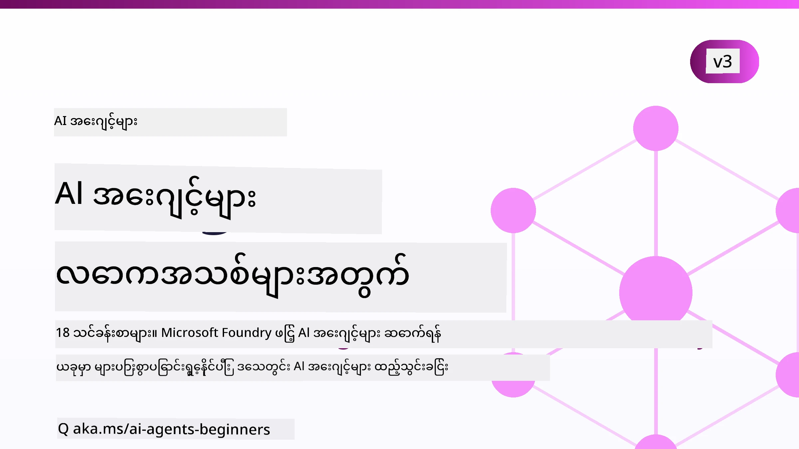

# အစစပျိုး AI ကိုယ်စားလှယ်များအတွက် - သင်တန်းတစ်ခု



## AI ကိုယ်စားလှယ်များ တည်ဆောက်ခြင်း စတင်ရန် လိုအပ်သည့် အရာအားလုံးကို သင်ကြားပေးသော သင်တန်း

[](https://github.com/microsoft/ai-agents-for-beginners/blob/master/LICENSE?WT.mc_id=academic-105485-koreyst)
[](https://GitHub.com/microsoft/ai-agents-for-beginners/graphs/contributors/?WT.mc_id=academic-105485-koreyst)
[](https://GitHub.com/microsoft/ai-agents-for-beginners/issues/?WT.mc_id=academic-105485-koreyst)
[](https://GitHub.com/microsoft/ai-agents-for-beginners/pulls/?WT.mc_id=academic-105485-koreyst)
[](http://makeapullrequest.com?WT.mc_id=academic-105485-koreyst)

### 🌐 多ဘာသာစကား ပံ့ပိုးမှု

#### GitHub လုပ်ဆောင်မှုဖြင့် ပံ့ပိုးသည် (အလိုအလျောက် & အမြဲမှန်ကန်နေသည်)

<!-- CO-OP TRANSLATOR LANGUAGES TABLE START -->
[အာရဗီဘာသာ](../ar/README.md) | [ဗင်္ဂါလီး](../bn/README.md) | [ဘူလ်ဂေးရီးယား](../bg/README.md) | [မြန်မာ (Myanmar)](./README.md) | [တရုတ် (ရိုးရှင်း)](../zh-CN/README.md) | [တရုတ် (ရိုးရာ, ဟောင်ကောင်)](../zh-HK/README.md) | [တရုတ် (ရိုးရာ, မာကော)](../zh-MO/README.md) | [တရုတ် (ရိုးရာ, ထိုင်ဝမ်)](../zh-TW/README.md) | [ခရိုအေးရှား](../hr/README.md) | [ချက်](../cs/README.md) | [ဒိန်းမတ်](../da/README.md) | [ဒတ်ခ်](../nl/README.md) | [အက်စတိုနီးယား](../et/README.md) | [ဖင်လန်](../fi/README.md) | [ပြင်သစ်](../fr/README.md) | [ဂျာမန်](../de/README.md) | [ဂရိ](../el/README.md) | [ဟီဘရူး](../he/README.md) | [ဟိန္ဒီ](../hi/README.md) | [ဟန်ဂေရီး](../hu/README.md) | [အင်ဒိုနီးရှား](../id/README.md) | [အီတလီ](../it/README.md) | [ဂျပန်](../ja/README.md) | [ကန္ဏဒါ](../kn/README.md) | [ခမာ](../km/README.md) | [ကိုရီးယား](../ko/README.md) | [လီသူအသေး](../lt/README.md) | [မလေး](../ms/README.md) | [မလေးလမ်](../ml/README.md) | [မာရတ်](../mr/README.md) | [နီပေါလီ](../ne/README.md) | [နိုင်ဂျီးရီးယား ပစ်ဂင်](../pcm/README.md) | [နော်ဝေ](../no/README.md) | [ပါရှန် (ဖာရ်စီး)](../fa/README.md) | [ပိုလန်](../pl/README.md) | [ပေါ်တူဂီ (ဘရာဇီး)](../pt-BR/README.md) | [ပေါ်တူဂီ (ပေါ်တူဂီ)](../pt-PT/README.md) | [ပန်ဂျာပီ (ဂူရွ်မူခိ)](../pa/README.md) | [ရိုမေးနီးယား](../ro/README.md) | [ရုရှား](../ru/README.md) | [ဆားဗီးယား (ဆီရီလစ်)](../sr/README.md) | [စလိုဗက်](../sk/README.md) | [စလိုဗေးနီးယား](../sl/README.md) | [စပိန်](../es/README.md) | [ဆွာဟီလီ](../sw/README.md) | [ဆွီဒင်](../sv/README.md) | [တဂလို (ဖိလစ်ပီးနို)](../tl/README.md) | [တမီးလ်](../ta/README.md) | [တဲလူဂူ](../te/README.md) | [ထိုင်](../th/README.md) | [တူရကီ](../tr/README.md) | [ယူကရိန်း](../uk/README.md) | [ဥရုဒူ](../ur/README.md) | [ဗီယက်နမ်](../vi/README.md)

> **ဒေသဆိုင်ရာတွင် ကလွန်လိုပါသလား?**
>
> ဒီ repository မှာ ဘာသာစကား ၅၀ ကျော် ပါ၀င်ပြီး အော်ဖ်လိုက်ဒေါင်းလုဒ် အရွယ်အစား မြင့်စေပါတယ်။ ဘာသာပြန်များမပါဘဲ ကလွန်ချင်ရင် sparse checkout ကို အသုံးပြုပါ။
>
> **Bash / macOS / Linux:**
> ```bash
> git clone --filter=blob:none --sparse https://github.com/microsoft/ai-agents-for-beginners.git
> cd ai-agents-for-beginners
> git sparse-checkout set --no-cone '/*' '!translations' '!translated_images'
> ```
>
> **CMD (Windows):**
> ```cmd
> git clone --filter=blob:none --sparse https://github.com/microsoft/ai-agents-for-beginners.git
> cd ai-agents-for-beginners
> git sparse-checkout set --no-cone "/*" "!translations" "!translated_images"
> ```
>
> ဒါက သင်တန်း အားလုံးပြီးမြောက်ဖို့ လိုအပ်တဲ့ အရာအားလုံးကို လျင်မြန်စွာ ဒေါင်းလုဒ် သတိပေးပါတယ်။
<!-- CO-OP TRANSLATOR LANGUAGES TABLE END -->

**ပိုမိုသော ဘာသာစကားများ ဖော်ထုတ်လိုပါက [ဒီနေရာတွင်](https://github.com/Azure/co-op-translator/blob/main/getting_started/supported-languages.md) ကြည့်နိုင်ပါသည်။**

[](https://GitHub.com/microsoft/ai-agents-for-beginners/watchers/?WT.mc_id=academic-105485-koreyst)
[](https://GitHub.com/microsoft/ai-agents-for-beginners/network/?WT.mc_id=academic-105485-koreyst)
[](https://GitHub.com/microsoft/ai-agents-for-beginners/stargazers/?WT.mc_id=academic-105485-koreyst)

[](https://discord.com/invite/ATgtXmAS5D)


## 🌱 စတင်ခြင်း

ဒီသင်တန်းမှာ AI ကိုယ်စားလှယ်များတည်ဆောက်ခြင်း အခြေခံများကို သင်ကြားပေးတဲ့သင်ခန်းစာတွေပါဝင်ပါတယ်။ သင်ခန်းစာတိုင်းမှာတိုင်း မိမိ စိတ်ဝင်စားရာနေရာတွင်စတင်ပါ။

ဒီသင်တန်းအတွက် များစွာသော ဘာသာစကား ပံ့ပိုးမှုရှိပါတယ်။ ကျွန်ုပ်တို့၏ [ရနိုင်သော ဘာသာစကားများကို ဒီမှာ](#-multi-language-support) သွားကြည့်ပါ။

ဤကာလမှာ Generative AI မော်ဒယ်များနှင့် ပထမဆုံးတည်ဆောက်နေပါက [Generative AI For Beginners](https://aka.ms/genai-beginners) သင်တန်းကို ကြည့်ကောင်းပါသည်၊ ဤသင်တန်းတွင် GenAI ဖြင့် တည်ဆောက်ခြင်းအတွက် သင်ခန်းစာ ၂၁ ခု ပါဝင်သည်။

ဒီရေပိုတွင် [ကြယ်ပွင့် (🌟) တင်ရန် မမေ့နဲ့](https://docs.github.com/en/get-started/exploring-projects-on-github/saving-repositories-with-stars?WT.mc_id=academic-105485-koreyst) နှင့် ကုဒ်ကို လည်ပတ်ရန် [fork တင်ရန်](https://github.com/microsoft/ai-agents-for-beginners/fork) မေ့လျော့မနေနဲ့။

### အခြား သင်ယူသူများနှင့် တွေ့ဆုံပါ၊ မေးခွန်းများကို ဖြေကြားပါ

AI ကိုယ်စားလှယ်များ တည်ဆောက်ရာတွင် အခက်အခဲရှိပါက သို့မဟုတ် မေးခွန်းများရှိပါက [Microsoft Foundry Discord](https://aka.ms/ai-agents/discord) တွင် ကျွန်ုပ်တို့၏ သီးငယ်သော Discord ချန်နယ်သို့ ဝင်ရောက်ပါ။

### သင်လိုအပ်သည်

သင်တန်းတိုင်းမှာ ကုဒ်ဥပမာများ ပါဝင်ပြီး၊ ၎င်းများကို code_samples ဖိုလ်ဒါတွင်ရှာနိုင်သည်။ မိမိ၏ မိတ္တူကိုဖန်တီးရန် သင် [fork တင်နိုင်သည်](https://github.com/microsoft/ai-agents-for-beginners/fork)။

ဤလေ့ကျင့်ခန်းများထဲတွင် ကုဒ်ဥပမာများသည် Microsoft Agent Framework နှင့် Microsoft Foundry Agent Service V2 ကို အသုံးပြုသည်။

- [Microsoft Foundry](https://aka.ms/ai-agents-beginners/ai-foundry) - Azure အကောင့် လိုအပ်သည်

ဒီသင်တန်းတွင် Microsoft မှ AI ကိုယ်စားလှယ် framework များနှင့် ဝန်ဆောင်မှုများကို အသုံးပြုသည်။

- [Microsoft Agent Framework (MAF)](https://aka.ms/ai-agents-beginners/agent-framework)
- [Microsoft Foundry Agent Service V2](https://aka.ms/ai-agents-beginners/ai-agent-service)

အချို့ကုဒ်ဥပမာများတွင် OpenAI ကိုသိမ်းဆည်းနိုင်သော အခြားပံ့ပိုးသူများဖြစ်သည့် [MiniMax](https://platform.minimaxi.com/) (204K token အထိ မော်ဒယ်များ) ကိုလည်း ထောက်ပံ့ပါသည်။ ဖော်ပြချက်များအတွက် [သင်တန်း စတင်ဆွဲဆောင်ခြင်း](./00-course-setup/README.md) ကို ကြည့်ပါ။

ဒီသင်တန်းကုဒ်များ လည်ပတ်ရန် ဆက်လက် သတင်းအချက်အလက်များ အတွက် [သင်တန်း စတင်ဆွဲဆောင်ခြင်း](./00-course-setup/README.md) ကို သွားကြည့်ပါ။

## 🙏 အကူအညီ လုပ်ပေးချင်ပါသလား?

အကြံပြုချက်များ သို့မဟုတ် စာလုံးပေါင်းသတ်မှားခြင်း၊ ကုဒ်အမှားတွေတွေ့ပါက [အကြောင်းပြုလုပ်ပါ](https://github.com/microsoft/ai-agents-for-beginners/issues?WT.mc_id=academic-105485-koreyst) သို့မဟုတ် [pull request တင်ပါ](https://github.com/microsoft/ai-agents-for-beginners/pulls?WT.mc_id=academic-105485-koreyst)


## 📂 သင်ခန်းစာတိုင်းတွင် ပါဝင်သည်

- README ထဲတွင် ရေးသားထားသော သင်ခန်းစာနှင့် အတိုချုပ် ဗီဒီယို
- Microsoft Agent Framework နှင့် Microsoft Foundry သုံးသော Python ကုဒ်ဥပမာများ
- သင်ယူမှု ဆက်လက်ရန် အပိုသင်ကြားမှု အရင်းအမြစ်များ ဆက်ခံလင့်ခ်များ


## 🗃️ သင်ခန်းစာများ

| **သင်ခန်းစာ**                               | **စာသားနှင့် ကုဒ်**                              | **ဗီဒီယို**                                              | **အပိုသင်ကြားမှု**                                                                    |
|----------------------------------------------|----------------------------------------------------|------------------------------------------------------------|----------------------------------------------------------------------------------------|
| AI ကိုယ်စားလှယ်နှင့် ကိုယ်စားလှယ် အသုံးချမှု မိတ်ဆက် | [လင့်ခ်](./01-intro-to-ai-agents/README.md)          | [ဗီဒီယို](https://youtu.be/3zgm60bXmQk?si=z8QygFvYQv-9WtO1)  | [လင့်ခ်](https://aka.ms/ai-agents-beginners/collection?WT.mc_id=academic-105485-koreyst) |
| AI ကိုယ်စားလှယ် ဖွဲ့စည်းမှု အခြေခံများ ရှာဖွေခြင်း | [လင့်ခ်](./02-explore-agentic-frameworks/README.md)  | [ဗီဒီယို](https://youtu.be/ODwF-EZo_O8?si=Vawth4hzVaHv-u0H)  | [လင့်ခ်](https://aka.ms/ai-agents-beginners/collection?WT.mc_id=academic-105485-koreyst) |
| AI ကိုယ်စားလှယ် ဒီဇိုင်း ပုံစံများ နားလည်ခြင်း | [လင့်ခ်](./03-agentic-design-patterns/README.md)     | [ဗီဒီယို](https://youtu.be/m9lM8qqoOEA?si=BIzHwzstTPL8o9GF)  | [လင့်ခ်](https://aka.ms/ai-agents-beginners/collection?WT.mc_id=academic-105485-koreyst) |
| ကိရိယာအသုံးပြုမှု ဒီဇိုင်း ပုံစံ | [လင့်ခ်](./04-tool-use/README.md)                    | [ဗီဒီယို](https://youtu.be/vieRiPRx-gI?si=2z6O2Xu2cu_Jz46N)  | [လင့်ခ်](https://aka.ms/ai-agents-beginners/collection?WT.mc_id=academic-105485-koreyst) |
| ကိုယ်စားလှယ် RAG | [လင့်ခ်](./05-agentic-rag/README.md)                 | [ဗီဒီယို](https://youtu.be/WcjAARvdL7I?si=gKPWsQpKiIlDH9A3)  | [လင့်ခ်](https://aka.ms/ai-agents-beginners/collection?WT.mc_id=academic-105485-koreyst) |
| ယုံကြည်စိတ်ချရသော AI ကိုယ်စားလှယ်များ တည်ဆောက်ခြင်း | [လင့်ခ်](./06-building-trustworthy-agents/README.md) | [ဗီဒီယို](https://youtu.be/iZKkMEGBCUQ?si=jZjpiMnGFOE9L8OK ) | [လင့်ခ်](https://aka.ms/ai-agents-beginners/collection?WT.mc_id=academic-105485-koreyst) |
| စီမံကိန်း ဒီဇိုင်း ပုံစံ | [လင့်ခ်](./07-planning-design/README.md)             | [ဗီဒီယို](https://youtu.be/kPfJ2BrBCMY?si=6SC_iv_E5-mzucnC)  | [လင့်ခ်](https://aka.ms/ai-agents-beginners/collection?WT.mc_id=academic-105485-koreyst) |
| မျိုးစုံ ကိုယ်စားလှယ် ဒီဇိုင်း ပုံစံ | [လင့်ခ်](./08-multi-agent/README.md)                 | [ဗီဒီယို](https://youtu.be/V6HpE9hZEx0?si=rMgDhEu7wXo2uo6g)  | [လင့်ခ်](https://aka.ms/ai-agents-beginners/collection?WT.mc_id=academic-105485-koreyst) |

| Metacognition Design Pattern                 | [Link](./09-metacognition/README.md)               | [Video](https://youtu.be/His9R6gw6Ec?si=8gck6vvdSNCt6OcF)  | [Link](https://aka.ms/ai-agents-beginners/collection?WT.mc_id=academic-105485-koreyst) |
| AI Agents in Production                      | [Link](./10-ai-agents-production/README.md)        | [Video](https://youtu.be/l4TP6IyJxmQ?si=31dnhexRo6yLRJDl)  | [Link](https://aka.ms/ai-agents-beginners/collection?WT.mc_id=academic-105485-koreyst) |
| Using Agentic Protocols (MCP, A2A and NLWeb) | [Link](./11-agentic-protocols/README.md)           | [Video](https://youtu.be/X-Dh9R3Opn8)                                 | [Link](https://aka.ms/ai-agents-beginners/collection?WT.mc_id=academic-105485-koreyst) |
| Context Engineering for AI Agents            | [Link](./12-context-engineering/README.md)         | [Video](https://youtu.be/F5zqRV7gEag)                                 | [Link](https://aka.ms/ai-agents-beginners/collection?WT.mc_id=academic-105485-koreyst) |
| Managing Agentic Memory                      | [Link](./13-agent-memory/README.md)     |      [Video](https://youtu.be/QrYbHesIxpw?si=vZkVwKrQ4ieCcIPx)                                                      |                                                                                        |
| Exploring Microsoft Agent Framework                         | [Link](./14-microsoft-agent-framework/README.md)                            |                                                            |                                                                                        |
| Building Computer Use Agents (CUA)           | [Link](./15-browser-use/README.md)     |                                                            | [Link](https://docs.browser-use.com/examples/templates/playwright-integration)         |
| Deploying Scalable Agents                    | [Link](./16-deploying-scalable-agents/README.md) |                                                    | [Link](https://learn.microsoft.com/azure/ai-foundry/agents/overview)                   |
| Creating Local AI Agents                     | [Link](./17-creating-local-ai-agents/README.md)  |                                                    | [Link](https://learn.microsoft.com/azure/ai-foundry/foundry-local/)                    |
| Securing AI Agents                           | [Link](./18-securing-ai-agents/README.md)  |                                                            | [Link](https://aka.ms/ai-agents-beginners/collection?WT.mc_id=academic-105485-koreyst) |

## 🎒 အခြားဘာသာရပ်များ

ကျွန်ုပ်တို့အဖွဲ့သည် အခြားဘာသာရပ်များကို ထုတ်လုပ်သည်။ ကြည့်ရှုပါ:

<!-- CO-OP TRANSLATOR OTHER COURSES START -->
### LangChain
[](https://aka.ms/langchain4j-for-beginners)
[](https://aka.ms/langchainjs-for-beginners?WT.mc_id=m365-94501-dwahlin)
[](https://github.com/microsoft/langchain-for-beginners?WT.mc_id=m365-94501-dwahlin)
---

### Azure / Edge / MCP / Agents
[](https://github.com/microsoft/AZD-for-beginners?WT.mc_id=academic-105485-koreyst)
[](https://github.com/microsoft/edgeai-for-beginners?WT.mc_id=academic-105485-koreyst)
[](https://github.com/microsoft/mcp-for-beginners?WT.mc_id=academic-105485-koreyst)
[](https://github.com/microsoft/ai-agents-for-beginners?WT.mc_id=academic-105485-koreyst)

---
 
### Generative AI Series
[](https://github.com/microsoft/generative-ai-for-beginners?WT.mc_id=academic-105485-koreyst)
[-9333EA?style=for-the-badge&labelColor=E5E7EB&color=9333EA)](https://github.com/microsoft/Generative-AI-for-beginners-dotnet?WT.mc_id=academic-105485-koreyst)
[-C084FC?style=for-the-badge&labelColor=E5E7EB&color=C084FC)](https://github.com/microsoft/generative-ai-for-beginners-java?WT.mc_id=academic-105485-koreyst)
[-E879F9?style=for-the-badge&labelColor=E5E7EB&color=E879F9)](https://github.com/microsoft/generative-ai-with-javascript?WT.mc_id=academic-105485-koreyst)

---
 
### အခြေခံသင်ယူမှု
[](https://aka.ms/ml-beginners?WT.mc_id=academic-105485-koreyst)
[](https://aka.ms/datascience-beginners?WT.mc_id=academic-105485-koreyst)
[](https://aka.ms/ai-beginners?WT.mc_id=academic-105485-koreyst)
[](https://github.com/microsoft/Security-101?WT.mc_id=academic-96948-sayoung)
[](https://aka.ms/webdev-beginners?WT.mc_id=academic-105485-koreyst)
[](https://aka.ms/iot-beginners?WT.mc_id=academic-105485-koreyst)
[](https://github.com/microsoft/xr-development-for-beginners?WT.mc_id=academic-105485-koreyst)

---
 
### Copilot Series
[](https://aka.ms/GitHubCopilotAI?WT.mc_id=academic-105485-koreyst)
[](https://github.com/microsoft/mastering-github-copilot-for-dotnet-csharp-developers?WT.mc_id=academic-105485-koreyst)
[](https://github.com/microsoft/CopilotAdventures?WT.mc_id=academic-105485-koreyst)
<!-- CO-OP TRANSLATOR OTHER COURSES END -->

## 🌟 အသိုင်းအဝိုင်းရဲ့ကျေးဇူးတင်မှု

Agentic RAG ကိုဖော်ပြထားတဲ့ အရေးကြီးသောကုဒ်နမူနာများအတွက် [Shivam Goyal](https://www.linkedin.com/in/shivam2003/) ကို ကျေးဇူးတင်ပါသည်။

## အပိုင်းဝင်ဆောင်ရွက်မှု

ဤပရောဂျက်သည် အပိုင်းဝင်မှုများနှင့် အကြံပြုချက်များကို ကြိုဆိုပါသည်။  အပိုင်းဝင်မှုအများစုသည် သင်သည်
Contributor License Agreement (CLA) ကို သဘောတူသည်ဟု ကြေညာရမည်ဖြစ်ပြီး၊ သင့် ပံ့ပိုးမှုကို အသုံးပြုခွင့်များကို လက်တွေ့ပေး အပ်သည်ဟု ယုံကြည်ရမည်ဖြစ်သည်။
အသေးစိတ်အတွက် <https://cla.opensource.microsoft.com> ကို ဝင်ကြည့်ပါ။

သင် pull request တင်သည့်အခါ၊ CLA bot သည် သင် CLA တင်ရန် လိုအပ်ကြောင်းကို အလိုအလျောက်ဆုံးဖြတ်ကာ PR ကို သင့်တော်စွာ အဆင့်သတ်မှတ်ပေးပါလိမ့်မယ် (ဥပမာ- အခြေအနေစစ်ဆေးမှု၊ မှတ်ချက်)။ bot မှ ပေးသောညွှန်ကြားချက်များကို လိုက်နာပါ။ ကျွန်ုပ်တို့ CLA ကို အသုံးပြုသော repository အားလုံးတွင် တစ်ကြိမ်ပဲ လိုအပ်ပါသည်။


ဤပရောဂျက်သည် [Microsoft Open Source Code of Conduct](https://opensource.microsoft.com/codeofconduct/) ကို လက်ခံအသုံးပြုထားသည်။
ပိုမိုသိရှိလိုလျှင် [Code of Conduct FAQ](https://opensource.microsoft.com/codeofconduct/faq/) သို့မဟုတ်
မေးခွန်း သို့မဟုတ် မှတ်ချက်များရှိပါက [opencode@microsoft.com](mailto:opencode@microsoft.com) သို့ဆက်သွယ်ပါ။

## ကုန်အမှတ်တံဆိပ်များ

ဤပရောဂျက်တွင် ပရောဂျက်များ၊ ထုတ်ကုန်များ သို့မဟုတ် ဝန်ဆောင်မှုများအတွက် ကုန်အမှတ်တံဆိပ်များ သို့မဟုတ် အမှတ်အသားများ ပါဝင်နိုင်သည်။ Microsoft ၏
ကုန်အမှတ်တံဆိပ်များ သို့မဟုတ် အမှတ်အသားများကို အသုံးပြုရန် ခွင့်ပြုချက်သည်
[Microsoft's Trademark & Brand Guidelines](https://www.microsoft.com/legal/intellectualproperty/trademarks/usage/general) ကို လိုက်နာရမည်။
ဤပရောဂျက်၏ ပြင်ဆင်မှု버င်းတွင် Microsoft ကုန်အမှတ်တံဆိပ်များ သို့မဟုတ် အမှတ်အသားများ အသုံးပြုခြင်းသည် မမှားယွင်းမှု ဖြစ်စေခြင်း သို့မဟုတ် Microsoft ၏ ထောက်ပံ့မှု သို့မဟုတ် အာမခံချက်ကို ထင်ဟပ်စေနိုင်ခြင်း မရှိရပါ။
တတိယပါတီကုန်အမှတ်တံဆိပ်များ သို့မဟုတ် အမှတ်အသားများ၏ အသုံးပြုမှုသည် ၎င်းတတိယပါတီများ၏ မူဝါဒများကိုလိုက်နာရမည်။

## ကူညီခြင်းရရှိရန်


AI app များ ဖန်တီးတာဖြစ်စဉ်မှာ အခက်အခဲရှိပါက သို့မဟုတ် မေးခွန်းရှိပါက အောက်ပါနေရာတွင် ပါဝင်ဆွေးနွေးနိုင်ပါသည်။

[](https://aka.ms/foundry/discord)

ထုတ်ကုန်မှ ပြန်လည်တုံ့ပြန်ချက်များ သို့မဟုတ် အမှားများရှိပါက အောက်ပါနေရာသို့ သွားရောက်နိုင်ပါသည်။

[](https://aka.ms/foundry/forum)

---

<!-- CO-OP TRANSLATOR DISCLAIMER START -->
**ပြောကြားချက်**
ဤစာတမ်းကို AI ဘာသာပြန်ဝန်ဆောင်မှု [Co-op Translator](https://github.com/Azure/co-op-translator) အသုံးပြု၍ ဘာသာပြန်ထားပါသည်။ ကျွန်ုပ်တို့သည် တိကျမှန်ကန်မှုအတွက် ကြိုးပမ်းနေသော်လည်း၊ စက်ကိရိယာဘာသာပြန်ခြင်းများတွင် အမှားများ သို့မဟုတ် မှားယွင်းချက်များ ပါဝင်နိုင်ကြောင်း သတိပြုပါရန် လိုအပ်ပါသည်။ မူလစာတမ်းကို မူရင်းဘာသာဖြင့်သာ ယုံကြည်စိတ်ချရသော အချက်အလက်အဖြစ် သတ်မှတ်သင့်သည်။ အရေးကြီးသည့် သတင်းအချက်အလက်များအတွက် ပရော်ဖက်ရှင်နယ် လူသားဘာသာပြန်သူဝန်ဆောင်မှုကို အကြံပြုပါသည်။ ဤဘာသာပြန်ချက်ကို အသုံးပြုခြင်းမှ ဖြစ်ပေါ်လာသော နားလည်မှုကွာခြားမှုများ သို့မဟုတ် မမှန်ကန်သော အသုံးပြုမှုများအတွက် ကျွန်ုပ်တို့ တာဝန်မခံပါ။
<!-- CO-OP TRANSLATOR DISCLAIMER END -->