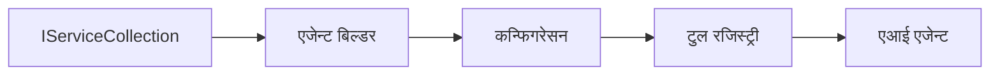

# 🎨 Azure OpenAI (Responses API) सँग Agentic Design Patterns (.NET)

## 📋 सिकाइ उद्देश्यहरू

यो उदाहरणले .NET मा Microsoft Agent Framework र Azure OpenAI (Responses API) एकीकरण प्रयोग गरेर बुद्धिमान एजेन्टहरू निर्माण गर्नका लागि उद्यम-ग्रेड डिजाइन ढाँचाहरू प्रदर्शन गर्दछ। तपाईंले व्यावसायिक ढाँचाहरू र वास्तुकला दृष्टिकोणहरू सिक्नुहुनेछ जसले एजेन्टहरू उत्पादन-तयार, मर्मतयोग्य, र स्केलेबल बनाउँछन्।

### उद्यम डिजाइन ढाँचाहरू

- 🏭 **Factory Pattern**: निर्भरता इंजेक्शन सहित मानकीकृत एजेन्ट सिर्जना
- 🔧 **Builder Pattern**: फ्लुएन्ट एजेन्ट कन्फिगरेसन र सेटअप
- 🧵 **Thread-Safe Patterns**: समानान्तर कुराकानी व्यवस्थापन
- 📋 **Repository Pattern**: टूल र क्षमता व्यवस्थापन सुगठित तरिकाले

## 🎯 .NET-विशिष्ट वास्तुकला लाभहरू

### उद्यम सुविधाहरू

- **सबल टाइपिंग**: कम्पाइल-समय प्रमाणीकरण र IntelliSense समर्थन
- **निर्भरता इंजेक्शन**: बिल्ट-इन DI कन्टेनर एकीकरण
- **कन्फिगरेसन व्यवस्थापन**: IConfiguration र Options ढाँचाहरू
- **Async/Await**: प्रथम श्रेणी असिंक्रोनस प्रोग्रामिङ समर्थन

### उत्पादन-तयार ढाँचाहरू

- **लॉगिङ एकीकरण**: ILogger र संरचित लगिङ समर्थन
- **स्वास्थ्य जाँचहरू**: बिल्ट-इन निगरानी र निदान
- **कन्फिगरेसन प्रमाणीकरण**: डाटा अनुशासनसहित सशक्त टाइपिंग
- **त्रुटि ह्यान्डलिङ**: संरचित अपवाद व्यवस्थापन

## 🔧 प्राविधिक वास्तुकला

### मुख्य .NET कम्पोनेन्टहरू

- **Microsoft.Extensions.AI**: एकीकृत AI सेवा अमूर्तता
- **Microsoft.Agents.AI**: उद्यम एजेन्ट आयोजन फ्रेमवर्क
- **Azure OpenAI (Responses API)**: उच्च-प्रदर्शन API क्लाइन्ट ढाँचाहरू
- **कन्फिगरेसन सिस्टम**: appsettings.json र वातावरण एकीकरण

### डिजाइन ढाँचा कार्यान्वयन



## 🏗️ उद्यम ढाँचाहरू प्रदर्शित गरियो

### 1. **सिर्जनात्मक ढाँचाहरू**

- **एजेन्ट फ्याक्टरी**: निरन्तर कन्फिगरेसन सहित केंद्रीकृत एजेन्ट सिर्जना
- **Builder Pattern**: जटिल एजेन्ट कन्फिगरेसनको लागि फ्लुएन्ट API
- **Singleton Pattern**: साझा स्रोतहरू र कन्फिगरेसन व्यवस्थापन
- **निर्भरता इंजेक्शन**: फुकुवा जोडना र परीक्षणयोग्यता

### 2. **व्यवहारिक ढाँचाहरू**

- **Strategy Pattern**: विकल्पीय उपकरण कार्यान्वयन रणनीतिहरू
- **Command Pattern**: उल्टाउन/फेरि गर्ने क्षमतासहित क्याप्सुलेटेड एजेन्ट अपरेसनहरू
- **Observer Pattern**: घटना-सञ्चालित एजेन्ट जीवनचक्र व्यवस्थापन
- **Template Method**: मानकीकृत एजेन्ट कार्यान्वयन कार्यप्रवाहहरू

### 3. **संरचनात्मक ढाँचाहरू**

- **Adapter Pattern**: Azure OpenAI (Responses API) एकीकरण तह
- **Decorator Pattern**: एजेन्ट क्षमता वृद्धि
- **Facade Pattern**: सरलीकृत एजेन्ट अन्तरक्रिया इन्टरफेसहरू
- **Proxy Pattern**: प्रदर्शनको लागि लेजी लोडिङ र क्यासिङ

## 📚 .NET डिजाइन सिद्धान्तहरू

### SOLID सिद्धान्तहरू

- **Single Responsibility**: प्रत्येक कम्पोनेन्टको एउटा स्पष्ट उद्देश्य हुन्छ
- **Open/Closed**: परिमार्जन बिना विस्तारयोग्य
- **Liskov Substitution**: इन्टरफेस-आधारित उपकरण कार्यान्वयनहरू
- **Interface Segregation**: लक्षित, एकल उद्देश्यका इन्टरफेसहरू
- **Dependency Inversion**: अमूर्तताहरूमा निर्भर, भौतिकताहरूमा होइन

### सफा वास्तुकला

- **Domain Layer**: मुख्य एजेन्ट र उपकरण अमूर्तताहरू
- **Application Layer**: एजेन्ट आयोजन र कार्यप्रवाहहरू
- **Infrastructure Layer**: Azure OpenAI (Responses API) एकीकरण र बाहिरी सेवाहरू
- **Presentation Layer**: प्रयोगकर्ता अन्तरक्रिया र प्रतिक्रिया स्वरूपण

## 🔒 उद्यम विचारहरू

### सुरक्षा

- **प्रमाणीकरण व्यवस्थापन**: IConfiguration द्वारा सुरक्षित API कुञ्जी ह्यान्डलिङ
- **इनपुट प्रमाणीकरण**: मजबूत टाइपिंग र डाटा अनुशासन प्रमाणीकरण
- **आउटपुट सफाइ**: सुरक्षित प्रतिक्रिया प्रशोधन र फिल्टरिङ
- **अडिट लगिङ**: व्यापक अपरेसन ट्र्याकिङ

### प्रदर्शन

- **Async ढाँचाहरू**: नन-ब्लकिङ I/O अपरेसनहरू
- **कनेक्शन पूलिङ**: प्रभावकारी HTTP क्लाइन्ट व्यवस्थापन
- **क्यासिङ**: सुधारिएको प्रदर्शनको लागि प्रतिक्रिया क्यासिङ
- **स्रोत व्यवस्थापन**: उपयुक्त नष्ट गर्ने र सफाइ ढाँचाहरू

### स्केलेबिलिटी

- **थ्रेड सुरक्षा**: समानान्तर एजेन्ट कार्यान्वयन समर्थन
- **स्रोत पूलिङ**: प्रभावकारी स्रोत उपयोग
- **लोड व्यवस्थापन**: दर सीमितरण र पछाडि दबाब ह्यान्डलिङ
- **निगरानी**: प्रदर्शन मेट्रिक्स र स्वास्थ्य जाँचहरू

## 🚀 उत्पादन तैनाती

- **कन्फिगरेसन व्यवस्थापन**: वातावरण-विशिष्ट सेटिङहरू
- **लगिङ रणनीति**: सहसम्बन्ध आईडीहरू सहित संरचित लगिङ
- **त्रुटि ह्यान्डलिङ**: उचित पुनःप्राप्तिसहित विश्वव्यापी अपवाद व्यवस्थापन
- **निगरानी**: एप्लिकेशन इनसाइट्स र प्रदर्शन काउन्टरहरू
- **परीक्षण**: युनिट परीक्षणहरू, एकिकृत परीक्षणहरू, र लोड परीक्षण ढाँचाहरू

.NET सँग उद्यम-ग्रेड बुद्धिमान एजेन्टहरू निर्माण गर्न तयार? आउनुहोस् केहि बलियो वास्तुकला बनाऔं! 🏢✨

## 🚀 सुरु गर्नुहोस्

### पूर्वशर्तहरू

- [.NET 10 SDK](https://dotnet.microsoft.com/download/dotnet/10.0) वा माथि
- Azure OpenAI स्रोत र मोडेल डिप्लोइमेन्ट सहितको [Azure सदस्यता](https://azure.microsoft.com/free/)
- [Azure CLI](https://learn.microsoft.com/cli/azure/install-azure-cli) — `az login` प्रयोग गरी साइन इन गर्नुहोस्

### आवश्यक वातावरण भेरिएबलहरू

```bash
# zsh/bash
export AZURE_OPENAI_ENDPOINT=https://<your-resource>.openai.azure.com
export AZURE_OPENAI_DEPLOYMENT=gpt-4.1-mini
# त्यसपछि साइन इन गर्नुहोस् ताकि AzureCliCredential टोकन प्राप्त गर्न सकोस्
az login
```

```powershell
# PowerShell
$env:AZURE_OPENAI_ENDPOINT = "https://<your-resource>.openai.azure.com"
$env:AZURE_OPENAI_DEPLOYMENT = "gpt-4.1-mini"
# त्यसपछि साइन इन गर्नुहोस् ताकि AzureCliCredential ले टोकन प्राप्त गर्न सक्छ
az login
```

### नमूना कोड

कोड उदाहरण चलाउन,

```bash
# जेडएसएच/बाश
chmod +x ./03-dotnet-agent-framework.cs
./03-dotnet-agent-framework.cs
```

वा dotnet CLI प्रयोग गरी:

```bash
dotnet run ./03-dotnet-agent-framework.cs
```

सम्पूर्ण कोडको लागि [`03-dotnet-agent-framework.cs`](../../../../03-agentic-design-patterns/code_samples/03-dotnet-agent-framework.cs) हेर्नुहोस्।

```csharp
#!/usr/bin/dotnet run

#:package Microsoft.Extensions.AI@10.*
#:package Microsoft.Agents.AI.OpenAI@1.*-*
#:package Azure.AI.OpenAI@2.1.0
#:package Azure.Identity@1.13.1

using System.ComponentModel;

using Microsoft.Agents.AI;
using Microsoft.Extensions.AI;

using Azure.AI.OpenAI;
using Azure.Identity;

// Tool Function: Random Destination Generator
// This static method will be available to the agent as a callable tool
// The [Description] attribute helps the AI understand when to use this function
// This demonstrates how to create custom tools for AI agents
[Description("Provides a random vacation destination.")]
static string GetRandomDestination()
{
    // List of popular vacation destinations around the world
    // The agent will randomly select from these options
    var destinations = new List<string>
    {
        "Paris, France",
        "Tokyo, Japan",
        "New York City, USA",
        "Sydney, Australia",
        "Rome, Italy",
        "Barcelona, Spain",
        "Cape Town, South Africa",
        "Rio de Janeiro, Brazil",
        "Bangkok, Thailand",
        "Vancouver, Canada"
    };

    // Generate random index and return selected destination
    // Uses System.Random for simple random selection
    var random = new Random();
    int index = random.Next(destinations.Count);
    return destinations[index];
}

// Azure OpenAI with the Responses API (stable v1 endpoint). Sign in with `az login`.
var azureEndpoint = Environment.GetEnvironmentVariable("AZURE_OPENAI_ENDPOINT")
    ?? throw new InvalidOperationException("AZURE_OPENAI_ENDPOINT is not set.");
var deployment = Environment.GetEnvironmentVariable("AZURE_OPENAI_DEPLOYMENT") ?? "gpt-4.1-mini";

var azureClient = new AzureOpenAIClient(new Uri(azureEndpoint), new AzureCliCredential());

// Define Agent Identity and Comprehensive Instructions
// Agent name for identification and logging purposes
var AGENT_NAME = "TravelAgent";

// Detailed instructions that define the agent's personality, capabilities, and behavior
// This system prompt shapes how the agent responds and interacts with users
var AGENT_INSTRUCTIONS = """
You are a helpful AI Agent that can help plan vacations for customers.

Important: When users specify a destination, always plan for that location. Only suggest random destinations when the user hasn't specified a preference.

When the conversation begins, introduce yourself with this message:
"Hello! I'm your TravelAgent assistant. I can help plan vacations and suggest interesting destinations for you. Here are some things you can ask me:
1. Plan a day trip to a specific location
2. Suggest a random vacation destination
3. Find destinations with specific features (beaches, mountains, historical sites, etc.)
4. Plan an alternative trip if you don't like my first suggestion

What kind of trip would you like me to help you plan today?"

Always prioritize user preferences. If they mention a specific destination like "Bali" or "Paris," focus your planning on that location rather than suggesting alternatives.
""";

// Create AI Agent with Advanced Travel Planning Capabilities
// Get the Responses client for the deployment and create the AI agent
// Configure agent with name, detailed instructions, and available tools
// This demonstrates the .NET agent creation pattern with full configuration
AIAgent agent = azureClient
    .GetChatClient(deployment)
    .AsAIAgent(
        name: AGENT_NAME,
        instructions: AGENT_INSTRUCTIONS,
        tools: [AIFunctionFactory.Create(GetRandomDestination)]
    );

// Create New Conversation Session for Context Management
// Initialize a new conversation session to maintain context across multiple interactions
// Sessions enable the agent to remember previous exchanges and maintain conversational state
// This is essential for multi-turn conversations and contextual understanding
var session = await agent.CreateSessionAsync();

// Execute Agent: First Travel Planning Request
// Run the agent with an initial request that will likely trigger the random destination tool
// The agent will analyze the request, use the GetRandomDestination tool, and create an itinerary
// Using the session parameter maintains conversation context for subsequent interactions
await foreach (var update in agent.RunStreamingAsync("Plan me a day trip", session))
{
    await Task.Delay(10);
    Console.Write(update);
}

Console.WriteLine();

// Execute Agent: Follow-up Request with Context Awareness
// Demonstrate contextual conversation by referencing the previous response
// The agent remembers the previous destination suggestion and will provide an alternative
// This showcases the power of conversation sessions and contextual understanding in .NET agents
await foreach (var update in agent.RunStreamingAsync("I don't like that destination. Plan me another vacation.", session))
{
    await Task.Delay(10);
    Console.Write(update);
}
```

---

<!-- CO-OP TRANSLATOR DISCLAIMER START -->
**अस्वीकरण**:
यो दस्तावेज़ AI अनुवाद सेवा [Co-op Translator](https://github.com/Azure/co-op-translator) प्रयोग गरेर अनुवाद गरिएको हो। हामी सही हुन प्रयास गर्छौं, तर कृपया जानकार हुनुस् कि स्वचालित अनुवादमा त्रुटिहरू वा अशुद्धताहरू हुन सक्छन्। मूल दस्तावेज़ यसको मूल भाषामा आधिकारिक स्रोत मानिनुपर्छ। महत्वपूर्ण जानकारीका लागि व्यावसायिक मानव अनुवाद सिफारिस गरिन्छ। यस अनुवादको प्रयोगबाट उत्पन्न कुनै पनि गलत बुझाइ वा त्रुटिको लागि हामी जिम्मेवार छैनौं।
<!-- CO-OP TRANSLATOR DISCLAIMER END -->