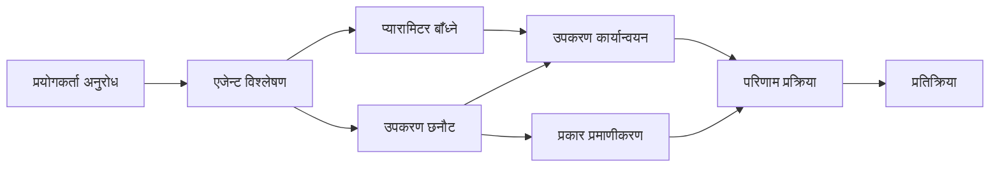

# 🛠️ Azure OpenAI (Responses API) संग उन्नत उपकरण प्रयोग (.NET)

## 📋 सिक्ने उद्देश्यहरू

यस नोटबुकले Microsoft Agent Framework लाई .NET मा Azure OpenAI (Responses API) सँग प्रयोग गरेर उद्यम स्तरीय उपकरण एकीकरण ढाँचाहरू देखाउँछ। तपाईं C# को सशक्त टाइपिङ र .NET को उद्यम सुविधाहरूलाई प्रयोग गरी धेरै विशिष्ट उपकरणहरू सहित परिष्कृत एजेन्टहरू बनाउन सिक्नुहुनेछ।

### तपाईंले सिक्ने उन्नत उपकरण क्षमताहरू

- 🔧 **बहु-उपकरण संरचना**: धेरै विशिष्ट क्षमताहरू भएका एजेन्टहरू निर्माण गर्ने
- 🎯 **प्रकार-सुरक्षित उपकरण कार्यान्वयन**: C# को कम्पाइल-समय प्रमाणीकरण प्रयोग गर्ने
- 📊 **उद्यम उपकरण ढाँचाहरू**: उत्पादन-तय उपकरण डिजाइन र त्रुटि व्यवस्थापन
- 🔗 **उपकरण संयोजन**: जटिल व्यवसायी कार्यप्रवाहहरूका लागि उपकरणहरू संयोजन गर्ने

## 🎯 .NET उपकरण संरचनाका फाइदाहरू

### उद्यम उपकरण सुविधाहरू

- **कम्पाइल-समय प्रमाणीकरण**: सशक्त टाइपिङले उपकरण प्यारामिटरहरू सहि छ कि छैन सुनिश्चित गर्छ
- **निर्भरता इंजेक्शन**: उपकरण व्यवस्थापनका लागि IoC कन्टेनर संयोजन
- **एसिंक्रोनस/अवेट ढाँचाहरू**: उचित स्रोत व्यवस्थापनसहित अवरुद्ध नगर्ने उपकरण सञ्चालन
- **संरचित लगिङ**: उपकरण सञ्चालन निगरानीका लागि बिल्ट-इन लगिङ संयोजन

### उत्पादन-तय ढाँचाहरू

- **अपवाद व्यवस्थापन**: सशक्त प्रकारका अपवादहरूसँग व्यापक त्रुटि व्यवस्थापन
- **स्रोत व्यवस्थापन**: उपयुक्त नष्ट गर्ने ढाँचाहरू र मेमोरी व्यवस्थापन
- **प्रदर्शन निगरानी**: बिल्ट-इन मेट्रिक्स र प्रदर्शन गणकहरू
- **कन्फिगरेसन व्यवस्थापन**: प्रमाणीकरणसहित प्रकार-सुरक्षित कन्फिगरेसन

## 🔧 प्राविधिक संरचना

### मुख्य .NET उपकरण कम्पोनेन्टहरू

- **Microsoft.Extensions.AI**: एकीकृत उपकरण सार लेयर
- **Microsoft.Agents.AI**: उद्यम स्तरीय उपकरण व्यवस्थापन
- **Azure OpenAI (Responses API)**: उच्च प्रदर्शन API क्लाइन्ट संग कनेक्शन पूलिङ

### उपकरण कार्यान्वयन पाइपलाइन



## 🛠️ उपकरण वर्गहरू र ढाँचाहरू

### 1. **डाटा प्रशोधन उपकरणहरू**

- **इनपुट प्रमाणीकरण**: डाटा एनोटेशनसहित सशक्त टाइपिङ
- **रूपान्तरण अपरेशनहरू**: प्रकार-सुरक्षित डाटा रूपान्तरण र फर्म्याटिङ
- **व्यापार तर्क**: डोमेन-विशिष्ट गणना र विश्लेषण उपकरणहरू
- **आउटपुट फर्म्याटिङ**: संरचित प्रतिक्रिया उत्पादन

### 2. **एकीकरण उपकरणहरू** 

- **API कनेक्टर्स**: HttpClient सँग RESTful सेवा एकीकरण
- **डाटाबेस उपकरणहरू**: डाटा पहुँचका लागि Entity Framework एकीकरण
- **फाइल अपरेसनहरू**: प्रमाणीकरणसहित सुरक्षित फाइल प्रणाली अपरेसनहरू
- **बाह्य सेवाहरू**: तेस्रो-पक्ष सेवा एकीकरण ढाँचाहरू

### 3. **युटिलिटी उपकरणहरू**

- **पाठ प्रशोधन**: स्ट्रिङ सम्हाल्ने र फर्म्याटिङ युटिलिटीहरू
- **मिति/समय अपरेसनहरू**: संस्कृति-सचेत मिति/समय गणना
- **गणितीय उपकरणहरू**: शुद्ध गणना र सांख्यिकीय अपरेसनहरू
- **प्रमाणीकरण उपकरणहरू**: व्यापार नियम प्रमाणीकरण र डाटा पुष्टि

.NET मा शक्तिशाली, प्रकार-सुरक्षित उपकरण क्षमताहरू सहित उद्यम स्तरीय एजेन्टहरू बनाउन तयार हुनुहुन्छ? आउनुहोस्, केहि व्यावसायिक-स्तर समाधानहरू संरचना गरौं! 🏢⚡

## 🚀 सुरु गर्ने तरिका

### पूर्व-आवश्यकताहरू

- [.NET 10 SDK](https://dotnet.microsoft.com/download/dotnet/10.0) वा माथि
- Azure OpenAI स्रोत र मोडेल डिप्लोयमेन्ट सहितको [Azure सदस्यता](https://azure.microsoft.com/free/)
- [Azure CLI](https://learn.microsoft.com/cli/azure/install-azure-cli) — `az login` सँग लगइन गर्नुहोस्

### आवश्यक वातावरण चरहरू

```bash
# zsh/bash
export AZURE_OPENAI_ENDPOINT=https://<your-resource>.openai.azure.com
export AZURE_OPENAI_DEPLOYMENT=gpt-4.1-mini
# त्यसपछि साइन इन गर्नुहोस् ताकि AzureCliCredential टोकन प्राप्त गर्न सक्छ।
az login
```

```powershell
# PowerShell
$env:AZURE_OPENAI_ENDPOINT = "https://<your-resource>.openai.azure.com"
$env:AZURE_OPENAI_DEPLOYMENT = "gpt-4.1-mini"
# त्यसपछि साइन इन गर्नुहोस् ताकि AzureCliCredential ले टोकन प्राप्त गर्न सकोस्
az login
```

### नमूना कोड

कोड उदाहरण चलाउन,

```bash
# zsh/bash
chmod +x ./04-dotnet-agent-framework.cs
./04-dotnet-agent-framework.cs
```

वा dotnet CLI प्रयोग गरेर:

```bash
dotnet run ./04-dotnet-agent-framework.cs
```

पूर्ण कोडका लागि [`04-dotnet-agent-framework.cs`](../../../../04-tool-use/code_samples/04-dotnet-agent-framework.cs) हेर्नुहोस्।

```csharp
#!/usr/bin/dotnet run

#:package Microsoft.Extensions.AI@10.*
#:package Microsoft.Agents.AI.OpenAI@1.*-*
#:package Azure.AI.OpenAI@2.1.0
#:package Azure.Identity@1.13.1

using System.ComponentModel;

using Microsoft.Agents.AI;
using Microsoft.Extensions.AI;

using Azure.AI.OpenAI;
using Azure.Identity;

// Tool Function: Random Destination Generator
// This static method will be available to the agent as a callable tool
// The [Description] attribute helps the AI understand when to use this function
// This demonstrates how to create custom tools for AI agents
[Description("Provides a random vacation destination.")]
static string GetRandomDestination()
{
    // List of popular vacation destinations around the world
    // The agent will randomly select from these options
    var destinations = new List<string>
    {
        "Paris, France",
        "Tokyo, Japan",
        "New York City, USA",
        "Sydney, Australia",
        "Rome, Italy",
        "Barcelona, Spain",
        "Cape Town, South Africa",
        "Rio de Janeiro, Brazil",
        "Bangkok, Thailand",
        "Vancouver, Canada"
    };

    // Generate random index and return selected destination
    // Uses System.Random for simple random selection
    var random = new Random();
    int index = random.Next(destinations.Count);
    return destinations[index];
}

// Azure OpenAI with the Responses API (stable v1 endpoint). Sign in with `az login`.
var azureEndpoint = Environment.GetEnvironmentVariable("AZURE_OPENAI_ENDPOINT")
    ?? throw new InvalidOperationException("AZURE_OPENAI_ENDPOINT is not set.");
var deployment = Environment.GetEnvironmentVariable("AZURE_OPENAI_DEPLOYMENT") ?? "gpt-4.1-mini";

var azureClient = new AzureOpenAIClient(new Uri(azureEndpoint), new AzureCliCredential());

// Define Agent Identity and Comprehensive Instructions
// Agent name for identification and logging purposes
var AGENT_NAME = "TravelAgent";

// Detailed instructions that define the agent's personality, capabilities, and behavior
// This system prompt shapes how the agent responds and interacts with users
var AGENT_INSTRUCTIONS = """
You are a helpful AI Agent that can help plan vacations for customers.

Important: When users specify a destination, always plan for that location. Only suggest random destinations when the user hasn't specified a preference.

When the conversation begins, introduce yourself with this message:
"Hello! I'm your TravelAgent assistant. I can help plan vacations and suggest interesting destinations for you. Here are some things you can ask me:
1. Plan a day trip to a specific location
2. Suggest a random vacation destination
3. Find destinations with specific features (beaches, mountains, historical sites, etc.)
4. Plan an alternative trip if you don't like my first suggestion

What kind of trip would you like me to help you plan today?"

Always prioritize user preferences. If they mention a specific destination like "Bali" or "Paris," focus your planning on that location rather than suggesting alternatives.
""";

// Create AI Agent with Advanced Travel Planning Capabilities
// Get the Responses client for the deployment and create the AI agent
// Configure agent with name, detailed instructions, and available tools
// This demonstrates the .NET agent creation pattern with full configuration
AIAgent agent = azureClient
    .GetChatClient(deployment)
    .AsAIAgent(
        name: AGENT_NAME,
        instructions: AGENT_INSTRUCTIONS,
        tools: [AIFunctionFactory.Create(GetRandomDestination)]
    );

// Create New Conversation Session for Context Management
// Initialize a new conversation session to maintain context across multiple interactions
// Sessions enable the agent to remember previous exchanges and maintain conversational state
// This is essential for multi-turn conversations and contextual understanding
await using var session = await agent.CreateSessionAsync();

// Execute Agent: First Travel Planning Request
// Run the agent with an initial request that will likely trigger the random destination tool
// The agent will analyze the request, use the GetRandomDestination tool, and create an itinerary
// Using the session parameter maintains conversation context for subsequent interactions
await foreach (var update in agent.RunStreamingAsync("Plan me a day trip", session))
{
    await Task.Delay(10);
    Console.Write(update);
}

Console.WriteLine();

// Execute Agent: Follow-up Request with Context Awareness
// Demonstrate contextual conversation by referencing the previous response
// The agent remembers the previous destination suggestion and will provide an alternative
// This showcases the power of conversation sessions and contextual understanding in .NET agents
await foreach (var update in agent.RunStreamingAsync("I don't like that destination. Plan me another vacation.", session))
{
    await Task.Delay(10);
    Console.Write(update);
}
```

---

<!-- CO-OP TRANSLATOR DISCLAIMER START -->
**अस्वीकरण**:
यो दस्तावेज़ AI अनुवाद सेवा [Co-op Translator](https://github.com/Azure/co-op-translator) प्रयोग गरेर अनुवाद गरिएको हो। हामी सही हुन प्रयास गर्छौं, तर कृपया जानकार हुनुस् कि स्वचालित अनुवादमा त्रुटिहरू वा अशुद्धताहरू हुन सक्छन्। मूल दस्तावेज़ यसको मूल भाषामा आधिकारिक स्रोत मानिनुपर्छ। महत्वपूर्ण जानकारीका लागि व्यावसायिक मानव अनुवाद सिफारिस गरिन्छ। यस अनुवादको प्रयोगबाट उत्पन्न कुनै पनि गलत बुझाइ वा त्रुटिको लागि हामी जिम्मेवार छैनौं।
<!-- CO-OP TRANSLATOR DISCLAIMER END -->