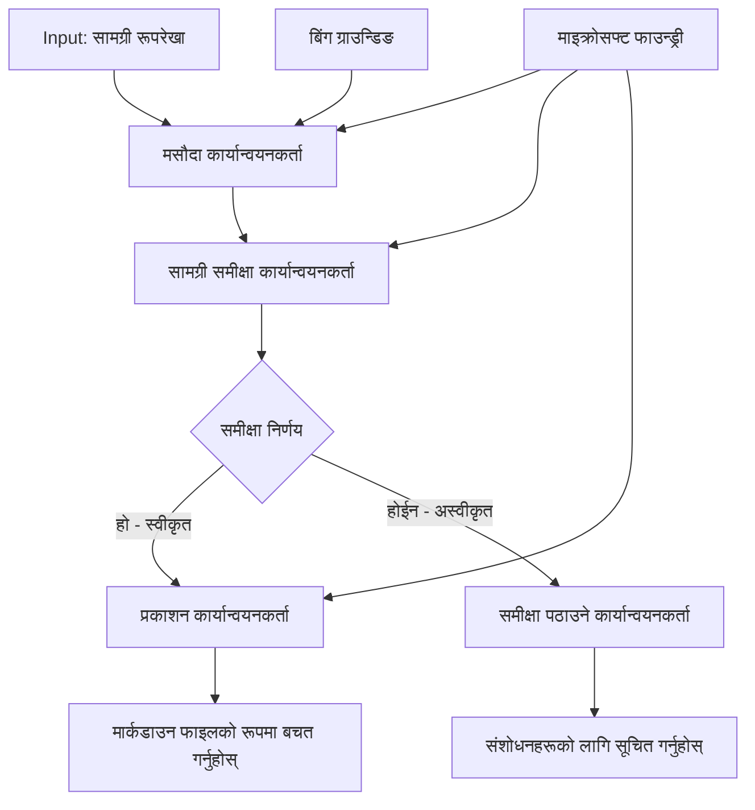

# 🔀 Microsoft Foundry (.NET) सँग सशर्त एजेन्ट वर्कफ्लोहरू

## 📋 बौद्धिक निर्णय-आधारित वर्कफ्लो ट्यूटोरियल

यो नोटबुकले Microsoft Foundry र Microsoft Agent Framework को लागि .NET प्रयोग गरी **सशर्त वर्कफ्लो ढाँचाहरू** देखाउँदछ। तपाईंले AI विश्लेषण, व्यापार नियमहरू, र गतिशील अवस्थाहरूमा आधारित बुद्धिमानीपूर्वक मार्गनिर्देशन गर्ने परिष्कृत, निर्णय-चालित वर्कफ्लोहरू कसरी निर्माण गर्ने सिक्नु हुनेछ जसले एंटरप्राइज-ग्रेड स्वचालनलाई सक्षम पार्छ।

## 🎯 सिकाइका उद्देश्यहरू

### 🧠 **बौद्धिक निर्णय वास्तुकला**
- **सशर्त तर्क कार्यान्वयन**: धेरै शाखाहरू भएका जटिल निर्णय वृक्षहरू निर्माण गर्नुहोस्
- **AI-संचालित मार्गनिर्देशन**: बुद्धिमानी मार्गनिर्देशन निर्णयका लागि Microsoft Foundry मोडेलहरू प्रयोग गर्नुहोस्
- **गतिशील वर्कफ्लो अनुकूलन**: रनटाइम विश्लेषण र अवस्थाहरूमा आधारित वर्कफ्लो व्यवहार परिमार्जन गर्नुहोस्
- **एंटरप्राइज नियम एकीकरण**: व्यापार तर्क र अनुपालन आवश्यकताहरूलाई वर्कफ्लोहरूमा समावेश गर्नुहोस्

### 🔀 **उन्नत सशर्त ढाँचाहरू**
- **बहु-मानदण्ड निर्णय निर्माण**: मार्गनिर्देशन निर्णयहरूको लागि धेरै कारकहरू मूल्याङ्कन गर्नुहोस्
- **सन्दर्भ-जागरुक प्रक्रिया**: संचित वर्कफ्लो सन्दर्भ र इतिहासमा आधारित निर्णयहरू गर्नुहोस्
- **अनुकूलनीय वर्कफ्लो परिमार्जन**: वास्तविक-समय अवस्थाहरूमा आधारित प्रोसेसिङ मार्गहरू गतिशील रूपमा समायोजन गर्नुहोस्
- **नियम इञ्जिन एकीकरण**: वर्कफ्लोहरूमा परिष्कृत व्यापार नियम इञ्जिनहरू कार्यान्वयन गर्नुहोस्

### 🏢 **एंटरप्राइज सशर्त अनुप्रयोगहरू**
- **कागजात वर्गीकरण र मार्गनिर्देशन**: कागजातहरूलाई स्वचालित रूपमा वर्गीकृत गरी उपयुक्त वर्कफ्लोहरूमा मार्गनिर्देशन गर्नुहोस्
- **ग्राहक सेवा त्रिज्या**: ग्राहक अनुरोधहरूलाई विशेषज्ञ ह्याण्डलिङ्ग टोलीहरूमा बुद्धिमानीपूर्वक मार्गनिर्देशन गर्नुहोस्
- **अनुपालन र जोखिम प्रक्रिया**: जोखिम मूल्याङ्कनमा आधारित विभिन्न मान्यता र समीक्षा प्रक्रियाहरू लागू गर्नुहोस्
- **गुणस्तर आश्वासन वर्कफ्लोहरू**: गुणस्तर मेट्रिक्समा आधारित सामग्रीलाई उपयुक्त समीक्षा प्रक्रियाबाट गुजार्नुहोस्

## ⚙️ पूर्वापेक्षाहरू र सेटअप

### 📦 **आवश्यक NuGet प्याकेजहरू**

सशर्त वर्कफ्लो प्रोसेसिङका लागि उन्नत प्याकेजहरू:

```xml
<!-- Core AI Framework -->
<PackageReference Include="Microsoft.Extensions.AI" Version="9.9.0" />

<!-- Azure AI Agents with Persistent State -->
<PackageReference Include="Azure.AI.Agents.Persistent" Version="1.2.0-beta.5" />

<!-- Azure Identity and Utilities -->
<PackageReference Include="Azure.Identity" Version="1.15.0" />
<PackageReference Include="System.Linq.Async" Version="6.0.3" />
<PackageReference Include="DotNetEnv" Version="3.1.1" />

<!-- Local Workflow Framework References -->
<!-- Microsoft.Agents.Workflows.dll - Advanced workflow orchestration -->
<!-- Microsoft.Agents.AI.AzureAI.dll - Microsoft Foundry integration -->
<!-- Microsoft.Agents.AI.dll - Core agent abstractions -->
```

### 🔑 **Microsoft Foundry कन्फिगरेसन**

**आवश्यक Azure स्रोतहरू:**
- सशर्त प्रोसेसिङ मोडेलहरूसँग Microsoft Foundry कार्यक्षेत्र
- उपयुक्त गणनात्मक कोटा र अनुमति सहित Azure सदस्यता
- निर्णय निर्माण र सामग्री विश्लेषणका लागि परिनियोजित AI मोडेलहरू
- (वैकल्पिक) Bing Search API कनेक्शन ग्राउन्डिङ क्षमताहरूका लागि

**पर्यावरण सेटअप (.env फाइल):**
```env
# Microsoft Foundry Configuration
AZURE_AI_PROJECT_ENDPOINT=https://your-project.cognitiveservices.azure.com/
BING_CONNECTION_ID=your-bing-connection-id
```

**प्रमाणीकरण सेटअप:**
```csharp
// Azure CLI or Managed Identity authentication
using Azure.Identity;
var credential = new AzureCliCredential();

// Load environment configuration
DotNetEnv.Env.Load("../../../.env");
```

### 🏗️ **सशर्त वर्कफ्लो वास्तुकला**



**मुख्य कम्पोनेंटहरू:**
- **ड्राफ्ट कार्यान्वयनकर्ता**: रूपरेखा अनुसार प्रारम्भिक सामग्री ड्राफ्ट सिर्जना गर्ने AI एजेन्ट
- **सामग्री समीक्षा कार्यान्वयनकर्ता**: ड्राफ्ट गुणस्तर र अनुपालन मूल्याङ्कन गर्ने AI एजेन्ट
- **सशर्त मार्गनिर्देशन**: समीक्षा नतिजामा आधारित निर्णय तर्क
- **प्रकाशन/समीक्षा मार्गहरू**: स्वीकृत र अस्वीकृत सामग्रीका लागि अलग प्रोसेसिङ मार्गहरू
- **स्थिति व्यवस्थापन**: वर्कफ्लोभरि सामग्री र समीक्षा सन्दर्भ कायम राख्ने

## 🎨 **सशर्त वर्कफ्लो डिजाइन ढाँचाहरू**

### 📋 **गुणस्तर गेट्ससहित सामग्री उत्पादन**
```
Outline → Draft Creation → Quality Review → {Approve: Publish | Reject: Revise}
```

### 🎯 **जोखिम-आधारित कागजात प्रक्रिया**
```
Document → Risk Assessment → {Low: Standard | High: Enhanced Review}
```

### 🔍 **बौद्धिक ग्राहक सेवा मार्गनिर्देशन**
```
Customer Query → Analysis → {Simple: FAQ Bot | Complex: Human Agent}
```

### 💼 **अनुपालन-चालित वर्कफ्लोहरू**
```
Content → Compliance Check → {Pass: Publish | Fail: Legal Review}
```

## 🏢 **एंटरप्राइज सशर्त लाभहरू**

### 🎯 **बुद्धिमानी स्वचालन**
- **स्मार्ट निर्णय निर्माण**: सामग्री विश्लेषण र सन्दर्भमा आधारित AI-संचालित मार्गनिर्देशन निर्णयहरू
- **अनुकूलनीय प्रोसेसिङ**: अवस्थाहरू परिवर्तन हुँदा स्वतः समायोजन हुने वर्कफ्लोहरू
- **व्यापार नियम कार्यान्वयन**: जटिल व्यापार तर्क र नीतिहरू स्वतः लागू गर्नुहोस्
- **सन्दर्भ-सचेत मार्गनिर्देशन**: पूर्ण वर्कफ्लो इतिहास र संचित सन्दर्भमा आधारित निर्णयहरू

### 📈 **सञ्चालन उत्कृष्टता**
- **संसाधन अनुकूलन**: कार्य उपयुक्त विशेषज्ञ र प्रक्रियाहरूमा मार्गनिर्देशन गर्नुहोस्
- **म्यानुअल हस्तक्षेप कम गर्नुहोस्**: स्वचालित निर्णयले मानवीय मार्गनिर्देशन आवश्यकतालाई न्यून पार्छ
- **छिटो समाधान समयहरू**: उपयुक्त विशेषज्ञता र प्रक्रिया क्षमताहरूमा सिधा मार्गनिर्देशन
- **समान अनुप्रयोग**: व्यापार नियम र निर्णय मापदण्डहरूको समान प्रयोग

### 🛡️ **जोखिम व्यवस्थापन र अनुपालन**
- **स्वचालित जोखिम मूल्याङ्कन**: सामग्री र परिस्थिति जोखिम स्तरहरूको AI-संचालित मूल्याङ्कन
- **अनुपालन कार्यान्वयन**: आवश्यक नियामक प्रक्रियाहरू हुँदै स्वचालित मार्गनिर्देशन
- **सुरक्षा प्रोटोकल लागू गर्नुहोस्**: जोखिम मूल्याङ्कनमा आधारित उन्नत सुरक्षा उपायहरू
- **अडिट ट्रेल व्यवस्थापन**: मार्गनिर्देशन निर्णयहरू र तर्कहरूको पूर्ण दस्तावेजीकरण

### 📊 **विश्लेषण र लगातार सुधार**
- **निर्णय विश्लेषण**: मार्गनिर्देशन निर्णयहरूको प्रभावकारिता र सटीकता ट्र्याक गर्नुहोस्
- **ढाँचा पहिचान**: समयसँगै मार्गनिर्देशन निर्णयहरूमा प्रवृत्ति र ढाँचाहरू पहिचान गर्नुहोस्
- **प्रदर्शन अनुकूलन**: निर्णय मापदण्ड र मार्गनिर्देशन दक्षताको लगातार सुधार
- **व्यापार बुद्धिमत्ता**: सामग्री विशेषताहरू र प्रक्रिया आवश्यकताहरूमा अन्तर्दृष्टि

### 🔧 **प्राविधिक उत्कृष्टता**
- **दृढ स्थिति व्यवस्थापन**: वर्कफ्लो कार्यान्वयनमा जटिल स्थिति कायम राख्नुहोस्
- **स्केलेबल वास्तुकला**: उच्च-परिमाण सशर्त प्रोसेसिङ आवश्यकताहरू सम्हाल्नुहोस्
- **एकीकरण क्षमता**: विद्यमान व्यापार प्रणालीहरू र प्रक्रियाहरूसँग सहज एकीकरण
- **मोनिटरिङ र अवलोकनशीलता**: वर्कफ्लो प्रदर्शन र निर्णयहरूको व्यापक ट्र्याकिङ

आउनुहोस्, .NET सँग बुद्धिमानी, निर्णय-चालित एंटरप्राइज वर्कफ्लोहरू बनाऔं! 🚀

## 💻 कोड चलाउने तरीका

पूर्ण कार्यान्वयन `04.dotnet-agent-framework-workflow-aifoundry-condition.cs` मा उपलब्ध छ। यसले **गुणस्तर गेटहरू सहित सामग्री उत्पादन वर्कफ्लो** देखाउँदछ:

### 🏗️ **वर्कफ्लो वास्तुकला**

```
Content Outline → Draft Creation → Quality Review → Conditional Routing:
                                                      ├─ Approved (>200 words) → Publish
                                                      └─ Rejected (<200 words) → Review Notification
```

**वर्कफ्लोमा एजेन्टहरू:**
1. **एभान्जेलिस्ट एजेन्ट**: रूपरेकाबाट ट्यूटोरियल ड्राफ्टहरू Bing ग्राउन्डिङका साथ सिर्जना गर्छ
2. **सामग्री समीक्षक एजेन्ट**: ड्राफ्ट गुणस्तर (शब्द संख्या, पूर्णता) मूल्याङ्कन गर्छ
3. **प्रकाशक एजेन्ट**: स्वीकृत सामग्रीलाई टाइमस्ट्याम्प गरिएको Markdown फाइलको रूपमा बचत गर्छ

**अनुकूलित कार्यान्वयनकर्ता:**
1. **DraftExecutor**: ड्राफ्ट सिर्जना समन्वय गर्दछ
2. **ContentReviewExecutor**: गुणस्तर मूल्याङ्कन गर्छ
3. **PublishExecutor**: स्वीकृत सामग्री प्रकाशन सम्हाल्छ
4. **SendReviewExecutor**: अस्वीकृत सामग्रीको सूचना प्रबन्ध गर्छ

### 🚀 उदाहरण चलाउने तरीका

**पूर्वापेक्षाहरू:**
- Microsoft Foundry कार्यक्षेत्र कन्फिगर गरिएको
- Azure CLI प्रमाणीकरण (`az login`)
- (वैकल्पिक) ग्राउन्डिङका लागि Bing खोज कनेक्शन

```bash
# स्क्रिप्टलाई कार्यसम्पादन योग्य बनाउनुहोस् (यूनिक्स/लिनक्स/macos)
chmod +x 04.dotnet-agent-framework-workflow-aifoundry-condition.cs

# सर्तसंगत कार्यप्रवाह चलाउनुहोस्
./04.dotnet-agent-framework-workflow-aifoundry-condition.cs
```

वा Windows मा:
```powershell
dotnet run 04.dotnet-agent-framework-workflow-aifoundry-condition.cs
```

### 📝 अपेक्षित आउटपुट

वर्कफ्लोले:
1. **एजेन्टहरू सिर्जना गर्छ**: तीन विशेषज्ञ Microsoft Foundry एजेन्टहरू सुरु गर्छ
2. **ड्राफ्ट उत्पादन**: एभान्जेलिस्ट एजेन्टले रूपरेखाबाट ट्यूटोरियल ड्राफ्ट सिर्जना गर्छ
3. **सामग्री समीक्षा**: सामग्री समीक्षक ड्राफ्ट गुणस्तर मूल्याङ्कन गर्छ
4. **सशर्त मार्गनिर्देशन**:
   - **स्वीकृत भए (>२०० शब्दहरू)**: प्रकाशन कार्यान्वयनकर्ताले Markdown फाइलको रूपमा बचत गर्छ
   - **अस्वीकृत भए (<२०० शब्दहरू)**: समीक्षा सूचना पठाउँछ
5. **परिणाम प्रदर्शन**: अन्तिम वर्कफ्लो नतिजा देखाउँछ

### 🔧 अनुकूलन विकल्पहरू

**समीक्षा मापदण्ड परिमार्जन गर्नुहोस्:**
```csharp
const string ContentReviewerInstructions = @"
You are a content reviewer...
1. Check if content is more than 500 words (instead of 200)
2. Verify technical accuracy
3. Ensure proper formatting
...";
```

**थप सशर्त मार्गहरू थप्नुहोस्:**
```csharp
var workflow = new WorkflowBuilder(draftExecutor)
    .AddEdge(draftExecutor, contentReviewerExecutor)
    .AddEdge(contentReviewerExecutor, publishExecutor, condition: GetCondition("Excellent"))
    .AddEdge(contentReviewerExecutor, editExecutor, condition: GetCondition("Good"))
    .AddEdge(contentReviewerExecutor, sendReviewerExecutor, condition: GetCondition("Poor"))
    .Build();
```

**सामग्री आवश्यकताहरू परिवर्तन गर्नुहोस्:**
```csharp
string OUTLINE_Content = @"
# Your Custom Topic
## Section 1
https://your-reference-url
## Section 2
...
";
```

### 🎯 वास्तविक-विश्व अनुप्रयोगहरू

यो सशर्त वर्कफ्लो ढाँचा निम्न अवस्थामा उपयुक्त छ:
- **सामग्री व्यवस्थापन प्रणालीहरू**: गुणस्तर गेटहरू सहित स्वचालित सम्पादकीय वर्कफ्लोहरू
- **कागजात प्रक्रिया**: वर्गीकरण र अनुपालनमा आधारित कागजात मार्गनिर्देशन
- **ग्राहक समर्थन**: जटिलता र आपतकालीनतामा आधारित बुद्धिमानी टिकट मार्गनिर्देशन
- **कानूनी समीक्षा**: जोखिम मूल्याङ्कन र मूल्यमा आधारित सम्झौताहरू मार्गनिर्देशन
- **HR प्रक्रिया**: आवेदनहरू उपयुक्त स्क्रिनिङ वर्कफ्लोहरू मार्फत मार्गनिर्देशन

### 🔍 सशर्त तर्क बुझ्न

**सशर्त फङ्सन:**
```csharp
public Func<object?, bool> GetCondition(string expectedResult) =>
    reviewResult => reviewResult is ReviewResult review && review.Result == expectedResult;
```

यस फङ्सनले एउटा प्रत्यय (predicate) सिर्जना गर्छ जसले:
1. नतिजा `ReviewResult` प्रकारको हो कि होइन जाँच्दछ
2. `Result` गुणलाई अपेक्षित मानसँग तुलना गर्दछ
3. मार्गनिर्देशन निर्धारण गर्न साँच्चो/झूठो फर्काउँछ

**सशर्त वर्कफ्लो एजहरू:**
```csharp
.AddEdge(contentReviewerExecutor, publishExecutor, condition: GetCondition("Yes"))
.AddEdge(contentReviewerExecutor, sendReviewerExecutor, condition: GetCondition("No"))
```

### 📊 उन्नत सुविधाहरू

**JSON स्कीमा मान्यता:**
वर्कफ्लोले सङ्गठित प्रतिक्रियाहरू सुनिश्चित गर्न JSON स्किमाहरू प्रयोग गर्छ:

```csharp
// Define response structure
public class ReviewResult
{
    [JsonPropertyName("review_result")]
    public string Result { get; set; } = string.Empty;
    
    [JsonPropertyName("reason")]
    public string Reason { get; set; } = string.Empty;
    
    [JsonPropertyName("draft_content")]
    public string DraftContent { get; set; } = string.Empty;
}

// Apply to agent
ResponseFormat = ChatResponseFormat.ForJsonSchema(
    AIJsonUtilities.CreateJsonSchema(typeof(ReviewResult)), 
    "ReviewResult", 
    "Review Result From DraftContent"
)
```

**Bing ग्राउन्डिङ एकीकरण:**
एभान्जेलिस्ट एजेन्टले Bing ग्राउन्डिङ प्रयोग गरी वास्तविक-समय जानकारी पहुँच गर्छ:

```csharp
var bingGroundingConfig = new BingGroundingSearchConfiguration(bing_conn_id);
BingGroundingToolDefinition bingGroundingTool = new(
    new BingGroundingSearchToolParameters([bingGroundingConfig])
);
```

यसले एजेन्टलाई रूपरेखाका URLहरू पछ्याउन र वर्तमान जानकारी निकाल्न सक्षम पार्छ।

### 🛡️ त्रुटि व्यवस्थापन

वर्कफ्लोले अस्वीकृत सामग्रीको लागि मजबुत त्रुटि व्यवस्थापन समावेश गर्दछ:
- समीक्षा असफलताले वैकल्पिक मार्ग ट्रिगर गर्दछ
- सूचनाहरू स्पष्ट अस्वीकृति कारणहरू प्रदान गर्छ
- सामग्री संशोधनका लागि सुरक्षित राखिन्छ

### 🔄 वर्कफ्लो विस्तार गर्दै

**पुनरावलोकन लूप थप्नुहोस्:**
स्वचालित रूपमा सामग्री पुनःड्राफ्ट गर्ने प्रतिक्रिया लूप सिर्जना गर्नुहोस्:

```csharp
.AddEdge(contentReviewerExecutor, publishExecutor, condition: GetCondition("Yes"))
.AddEdge(contentReviewerExecutor, draftExecutor, condition: GetCondition("No")) // Loop back
```

**बहु-स्तरीय समीक्षा कार्यान्वयन गर्नुहोस्:**
फरक मापदण्डहरूसहित धेरै समीक्षा चरणहरू थप्नुहोस्:

```csharp
.AddEdge(draftExecutor, technicalReviewer)
.AddEdge(technicalReviewer, editorialReviewer, condition: GetCondition("TechPass"))
.AddEdge(editorialReviewer, publishExecutor, condition: GetCondition("EditPass"))
```

यो सशर्त वर्कफ्लो ढाँचाले परिष्कृत, बौद्धिक एंटरप्राइज स्वचालन प्रणालीहरू निर्माण गर्न आधार प्रदान गर्दछ! 🚀

---

<!-- CO-OP TRANSLATOR DISCLAIMER START -->
**अस्वीकरण**:
यो दस्तावेज़ AI अनुवाद सेवा [Co-op Translator](https://github.com/Azure/co-op-translator) प्रयोग गरेर अनुवाद गरिएको हो। हामी सही हुन प्रयास गर्छौं, तर कृपया जानकार हुनुस् कि स्वचालित अनुवादमा त्रुटिहरू वा अशुद्धताहरू हुन सक्छन्। मूल दस्तावेज़ यसको मूल भाषामा आधिकारिक स्रोत मानिनुपर्छ। महत्वपूर्ण जानकारीका लागि व्यावसायिक मानव अनुवाद सिफारिस गरिन्छ। यस अनुवादको प्रयोगबाट उत्पन्न कुनै पनि गलत बुझाइ वा त्रुटिको लागि हामी जिम्मेवार छैनौं।
<!-- CO-OP TRANSLATOR DISCLAIMER END -->