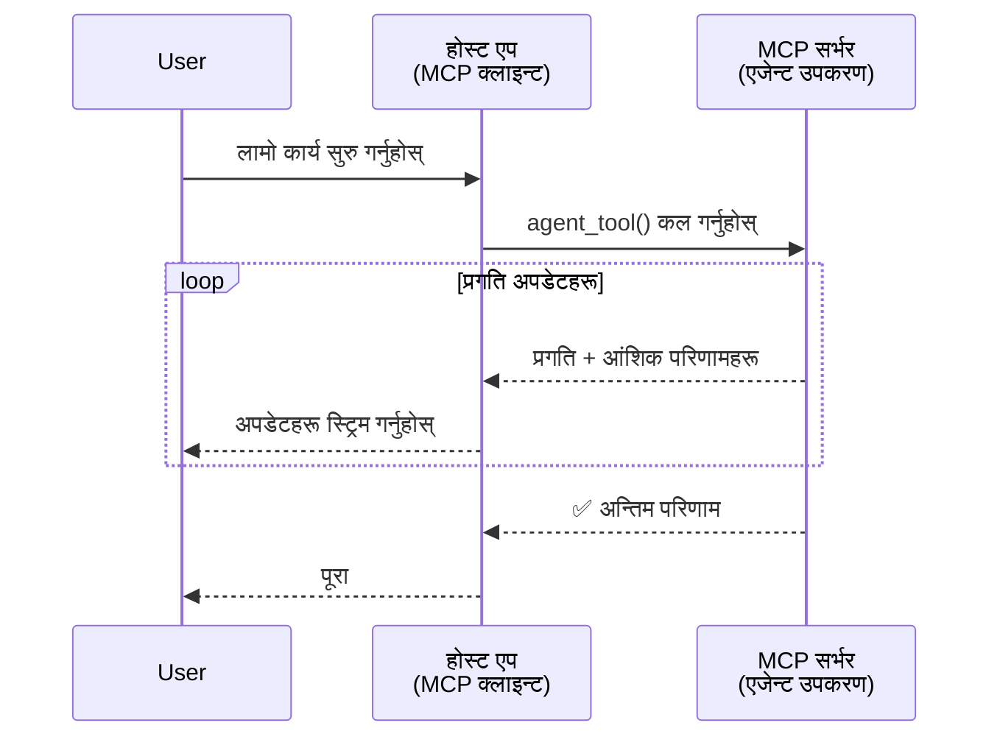
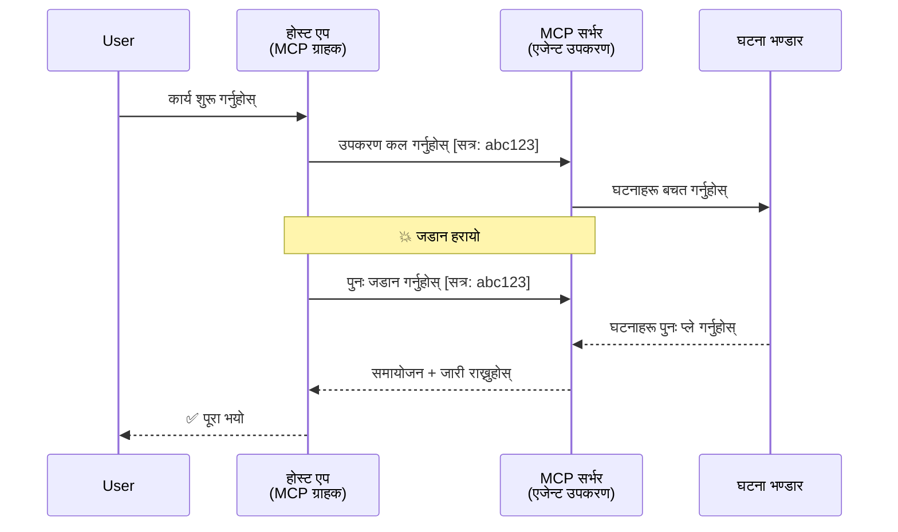
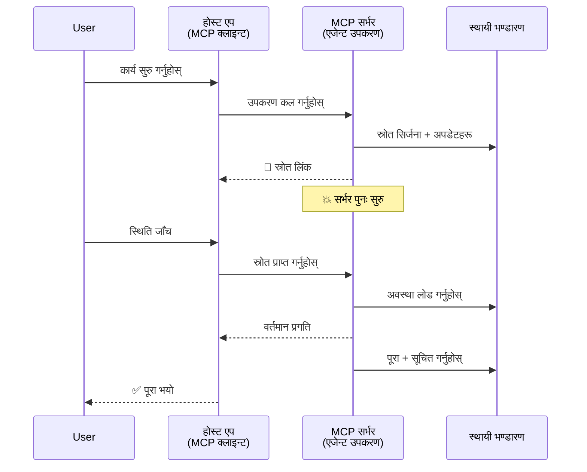
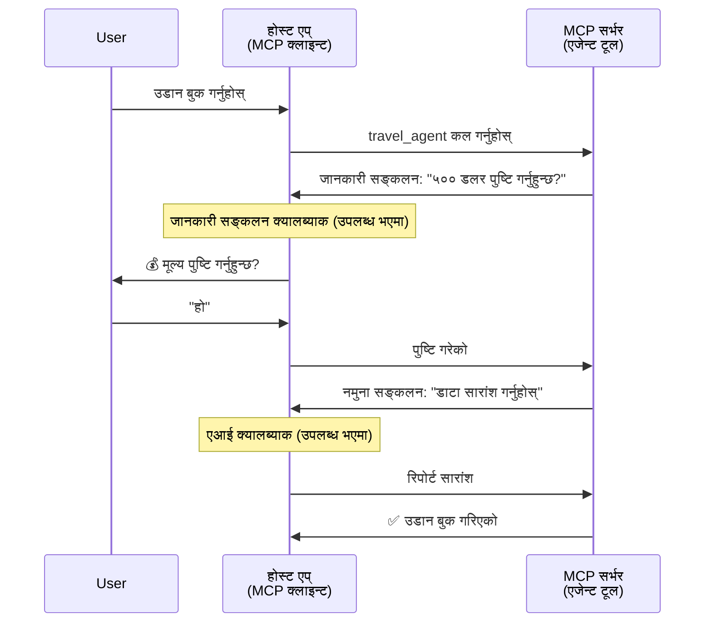
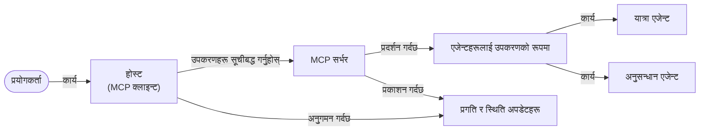

# MCP सँग एजेन्ट-टु-एजेन्ट सञ्चार प्रणाली निर्माण गर्दै

> TL;DR - के तपाईं MCP मा एजेन्ट2एजेन्ट सञ्चार बनाउन सक्नुहुन्छ? हो!

MCP यसको मूल उद्देश्य "LLM हरूलाई सन्दर्भ प्रदान गर्ने" भन्दा धेरै विकसित भएको छ। हालका सुधारहरूमा [पुनः सुरु गर्न मिल्ने स्ट्रिमहरू](https://modelcontextprotocol.io/docs/concepts/transports#resumability-and-redelivery), [प्रेरणा](https://modelcontextprotocol.io/specification/2025-06-18/client/elicitation), [नमूना संकलन](https://modelcontextprotocol.io/specification/2025-06-18/client/sampling), र सूचनाहरू ([प्रगति](https://modelcontextprotocol.io/specification/2025-06-18/basic/utilities/progress) र [स्रोत](https://modelcontextprotocol.io/specification/2025-06-18/schema#resourceupdatednotification)) समावेश छन्, जसले MCP लाई जटिल एजेन्ट-टु-एजेन्ट सञ्चार प्रणाली निर्माण गर्नका लागि एक बलियो आधार प्रदान गर्दछ।

## एजेन्ट/उपकरण सम्बन्धि गलतफहमी

जति धेरै विकासकर्ताहरूले एजेन्टिक व्यवहार भएका उपकरणहरू (लामो समयसम्म चल्ने, बीचमा थप इनपुट आवश्यक पर्न सक्ने आदि) अन्वेषण गर्छन्, एउटा सामान्य गलतफहमी यो हो कि MCP उपयुक्त छैन किनभने यसको प्रारम्भिक उपकरण उदाहरणहरू साधारण अनुरोध-प्रतिक्रिया ढाँचामा सीमित थिए।

यो धारणा पुरानो भइसक्यो। MCP विनिर्देश पछिल्ला केही महिनाहरूमा धेरै सुधार गरिएको छ जसले लामो समयसम्म चल्ने एजेन्टिक व्यवहार निर्माण गर्न आवश्यक क्षमताहरू पुरा गर्दछ:

- **स्ट्रिमिङ & आंशिक नतिजाहरू**: कार्यान्वयनको क्रममा वास्तविक-समय प्रगति अद्यावधिकहरू
- **पुनः सुरु गर्न मिल्ने क्षमता**: क्लाएन्टहरूले कटौती पछि पुनः जडान गरी जारी राख्न सक्छन्
- **दृढता**: नतिजाहरू सर्भर पुनः सुरु पछि बच्न सक्छन् (जस्तै, स्रोत लिंक मार्फत)
- **बहु-पटक अन्तरक्रिया**: प्रेरणा र नमूना संकलन मार्फत कार्यान्वयनको बीचमा अन्तरक्रियात्मक इनपुट

यी सुविधाहरू संयोजन गरेर जटिल एजेन्टिक र बहु-एजेन्ट अनुप्रयोगहरू सक्षम गर्न सकिन्छ, सबै MCP प्रोटोकलमा आधारित।

सन्दर्भको लागि, हामीले एजेन्टलाई "उपकरण" भनेर जनाउनेछौं जुन MCP सर्भरमा उपलब्ध हुन्छ। यसको मतलब हो कि त्यहाँ एक होस्ट अनुप्रयोग छ जसले MCP क्लाएन्ट कार्यान्वयन गर्दछ र MCP सर्भरसँग सत्र स्थापित गरी एजेन्टलाई कल गर्न सक्छ।

## के कुरा MCP उपकरणलाई "एजेन्टिक" बनाउँछ?

कार्यान्वयनमा प्रवेश गर्नु अघि, लामो समयसम्म चल्ने एजेन्टहरूलाई समर्थन गर्न कुन पूर्वाधार क्षमताहरू आवश्यक छन् त्यो निर्धारण गरौं।

> हामी एजेन्टलाई यस्तो संस्था भनेर परिभाषित गर्नेछौं जसले स्वतन्त्र रूपमा लामो समयसम्म सञ्चालन गर्न सक्छ, धेरै अन्तरक्रियाहरू वा वास्तविक-समय प्रतिक्रियाको आधारमा समायोजनहरू आवश्यक पर्ने जटिल कार्यहरू सम्हाल्न सक्षम हुन्छ।

### 1. स्ट्रिमिङ र आंशिक नतिजा

परम्परागत अनुरोध-प्रतिक्रिया ढाँचाहरू लामो समय चल्ने कार्यहरूका लागि उपयुक्त हुँदैनन्। एजेन्टहरूले प्रदान गर्नुपर्छ:

- वास्तविक-समय प्रगति अद्यावधिकहरू
- मध्यवर्ती नतिजाहरू

**MCP समर्थन**: स्रोत अद्यावधिक सूचनाले आंशिक नतिजाहरू स्ट्रिम गर्न सक्षम बनाउँछ, यद्यपि यसलाई JSON-RPC को 1:1 अनुरोध/प्रतिक्रिया मोडेलसँग टकराव नगर्न सावधानीपूर्वक डिजाइन गर्नुपर्छ।

| सुविधा                   | प्रयोग मामला                                                                                                                                                                      | MCP समर्थन                                                                               |
| ------------------------ | ---------------------------------------------------------------------------------------------------------------------------------------------------------------------------- | ----------------------------------------------------------------------------------------- |
| वास्तविक-समय प्रगति अद्यावधिक | प्रयोगकर्ताले कोडबेस माइग्रेशन कार्य अनुरोध गर्छ। एजेन्टले प्रगति स्ट्रिम गर्छ: "१०% - निर्भरताहरु विश्लेषण गर्दै... २५% - टाइपस्क्रिप्ट फाइलहरू रूपान्तरण गर्दै... ५०% - इम्पोर्टहरू अपडेट गर्दै..."          | ✅ प्रगति सूचनाहरू                                                                        |
| आंशिक नतिजा             | "पुस्तक सिर्जना गर्नुहोस्" कार्यले आंशिक नतिजा स्ट्रिम गर्छ: १) कथा रेखाचित्र, २) अध्याय सूची, ३) प्रत्येक अध्याय पूरा भएपछि। होस्टले कहीं पनि निरीक्षण, रद्द, वा पुनर्निर्देशन गर्न सक्छ।         | ✅ सूचनाहरू "विस्तार" गर्न मिल्छ जसमा आंशिक नतिजा समावेश हुने प्रस्तावहरू PR 383, 776 मा हेर्नुहोस् |

<div align="center" style="font-style: italic; font-size: 0.95em; margin-bottom: 0.5em;">
<strong>आकृति १:</strong> यो चित्रले देखाउँछ कसरी MCP एजेन्ट एक लामो समयसम्म चल्ने कार्यको क्रममा होस्ट अनुप्रयोगलाई वास्तविक-समय प्रगति अद्यावधिक र आंशिक नतिजा स्ट्रिम गर्दछ, जसले प्रयोगकर्तालाई कार्यान्वयन अनुगमन गर्न अनुमति दिन्छ।
</div>



### 2. पुनः सुरु गर्न मिल्ने क्षमता

एजेन्टहरूले नेटवर्क कटौतीहरूलाई सहज रूपमा व्यवस्थापन गर्नुपर्छ:

- (क्लाएन्ट) डिस्कनेक्ट पछि पुनः जडान
- जहाँ छोड्यो त्यहींबाट जारी राख्ने (सन्देश पुनः वितरण)

**MCP समर्थन**: MCP StreamableHTTP ट्रान्सपोर्ट आज सत्र पुनः सुरु र सन्देश पुनः वितरणलाई सत्र ID र अन्तिम घटना ID मार्फत समर्थन गर्छ। यहाँ महत्त्वपूर्ण कुरा हो कि सर्भरले एक EventStore कार्यान्वयन गर्नुपर्छ जसले क्लाएन्ट पुन: जडानमा घटनाहरू फेरि बजाउन सक्षम बनाउँछ।  
क्युनिटी प्रस्ताव (PR #975) ट्रान्सपोर्ट-एग्नोस्टिक पुनः सुरु गर्न मिल्ने स्ट्रिमहरूको अन्वेषण गर्दैछ।

| सुविधा      | प्रयोग मामला                                                                                                                                               | MCP समर्थन                                                                |
| ------------ | ---------------------------------------------------------------------------------------------------------------------------------------------------------- | -------------------------------------------------------------------------- |
| पुनः सुरु गर्न मिल्ने | लामो समय चल्ने कार्यको क्रममा क्लाएन्ट डिस्कनेक्ट हुन्छ। पुन: जडान हुँदा सत्र जारी रहन्छ र छुटेका घटनाहरू पुन: बजाइन्छ, जहाँ छोड्यो त्यहाँबाट सुचारु हुन्छ। | ✅ StreamableHTTP ट्रान्सपोर्ट सत्र ID, घटना पुनरावृत्ति, र EventStore सहित   |

<div align="center" style="font-style: italic; font-size: 0.95em; margin-bottom: 0.5em;">
<strong>आकृति २:</strong> यो चित्रले देखाउँछ कि कसरी MCP को StreamableHTTP ट्रान्सपोर्ट र घटनास्थलले सहज सत्र पुनः सुरु सक्षम बनाउँछ: यदि क्लाएन्ट डिस्कनेक्ट भयो भने, पुन: जडान गरेर छुटेका घटनाहरू पुन: बजाउन सक्छ र कार्यक्रम बिना प्रगति क्षति जारी राख्छ।
</div>



### 3. दृढता

लामो समयसम्म चल्ने एजेन्टहरूलाई स्थायी स्थिति आवश्यक हुन्छ:

- परिणामहरू सर्भर पुनः सुरु पछि पनि बच्छन्
- स्थिति ब्यान्ड आउटबाट प्राप्त गर्न सकिन्छ
- सत्रहरूमा प्रगति ट्र्याकिङ

**MCP समर्थन**: MCP ले अहिले उपकरण कलहरूको लागि स्रोत लिंक फिर्ता प्रकार समर्थन गर्दछ। आजको सम्भावित ढाँचा यस्तो छ कि उपकरणले स्रोत सिर्जना गर्छ र तुरुन्तै स्रोत लिंक फिर्ता दिन्छ। उपकरण पृष्ठभूमिमा कार्य गर्न र स्रोत अपडेट गर्न जारी राख्न सक्छ। क्लाएन्टले यस स्रोतको स्थिति पोल गर्न वा स्रोत अपडेट सूचनाहरूको लागि सदस्यता लिन सक्छ।

यहाँ एउटा सीमा छ कि स्रोत पोलिङ वा अपडेटका लागि सदस्यता लिँदा स्रोतहरू खपत हुन्छन् जुन मापनमा प्रभाव पार्न सक्छ। एउटा खुल्ला समुदाय प्रस्ताव (#992 सहित) वेबहुक वा ट्रिगरहरूलाई समावेश गर्ने सम्भावना अन्वेषण गर्दैछ जुन सर्भरले क्लाएन्ट/होस्ट अनुप्रयोगलाई अपडेटहरूको बारेमा सूचना दिन कल गर्न सक्छ।

| सुविधा    | प्रयोग मामला                                                                                                                                              | MCP समर्थन                                                        |
| ---------- | --------------------------------------------------------------------------------------------------------------------------------------------------------- | ------------------------------------------------------------------ |
| दृढता     | डाटा माइग्रेशन कार्यको क्रममा सर्भर क्र्यास हुन्छ। परिणाम र प्रगति पुनः सुरु पछि बच्छन्, क्लाएन्टले स्थिति जाँच गरी स्थायी स्रोतबाट जारी राख्न सक्छ। | ✅ स्रोत लिंकहरू स्थायी भण्डारण र स्थिति सूचनाहरू सहित                   |

आजको सामान्य ढाँचा यस्तो हो कि उपकरणले स्रोत सिर्जना गर्छ र तुरुन्त स्रोत लिंक फिर्ता दिन्छ। उपकरण पृष्ठभूमिमा कार्य समाधान जारी राख्छ, प्रगति अपडेटहरू या आंशिक नतिजा सहित स्रोत सूचनाहरू जारी गर्छ, र आवश्यक अनुसार स्रोतको सामग्री अपडेट गर्छ।

<div align="center" style="font-style: italic; font-size: 0.95em; margin-bottom: 0.5em;">
<strong>आकृति ३:</strong> यो चित्रले देखाउँछ कि MCP एजेन्टहरूले यसरी स्थायी स्रोत र स्थिति सूचनाहरूलाई प्रयोग गर्छन् जसले लामो समय चल्ने कार्यहरू सर्भर पुनः सुरु पछि पनि बचून्, र क्लाएन्टलाई प्रगति जाँच गर्न र परिणामहरू पुनः प्राप्त गर्न अनुमति दिन्छ।
</div>



### 4. बहु-पटक अन्तरक्रिया

एजेन्टहरूले प्रायः कार्यान्वयनको बीचमा थप इनपुट आवश्यक पर्छ:

- मानव स्पष्टिकरण वा स्वीकृति
- जटिल निर्णयका लागि AI सहयोग
- गतिशील प्यारामीटर समायोजन

**MCP समर्थन**: पूर्ण रूपमा sampling (AI इनपुटको लागि) र elicitation (मानव इनपुटको लागि) मार्फत समर्थित।

| सुविधा                 | प्रयोग मामला                                                                                                                                    | MCP समर्थन                                            |
| ----------------------- | ----------------------------------------------------------------------------------------------------------------------------------------------- | ------------------------------------------------------ |
| बहु-पटक अन्तरक्रिया    | यात्रा बुकिङ एजेन्टले प्रयोगकर्ताबाट मूल्य पुष्टिकरण माग्छ, त्यसपछि बुकिङ पूरा गर्नु अघि AI लाई यात्रा डेटा सारांश गर्न अनुरोध गर्छ।            | ✅ मानव इनपुटका लागि प्रेरणा, AI इनपुटका लागि नमूना संकलन |

<div align="center" style="font-style: italic; font-size: 0.95em; margin-bottom: 0.5em;">
<strong>आकृति ४:</strong> यो चित्रले देखाउँछ कि कसरी MCP एजेन्टहरूले अन्तरक्रियात्मक रूपमा मानव इनपुट प्रेरित गर्न वा कार्यान्वयनको मध्यमा AI सहयोग अनुरोध गर्न सक्छन्, जटिल बहु-पटक कार्यप्रवाहहरूलाई समर्थन गर्दै जस्तै पुष्टिकरण र गतिशील निर्णय।
</div>



## MCP मा लामो समयसम्म चल्ने एजेन्टहरू कार्यान्वयन - कोड अवलोकन

यस लेखको भागको रूपमा, हामीले [कोड रिपोजिटरी](https://github.com/victordibia/ai-tutorials/tree/main/MCP%20Agents) प्रदान गरेका छौं जसमा MCP Python SDK र StreamableHTTP ट्रान्सपोर्ट प्रयोग गरी सत्र पुनः सुरु र सन्देश पुन: वितरण सहित लामो समयसम्म चल्ने एजेन्टहरूको पूर्ण कार्यान्वयन रहेको छ। कार्यान्वयनले MCP क्षमताहरू कसरी संयोजन गरेर जटिल एजेन्ट-जस्ता व्यवहार सक्षम बनाउँछ देखाउँछ।

विशेष गरी, हामीले दुई प्रमुख एजेन्ट उपकरणहरू सहित सर्भर कार्यान्वयन गरेका छौं:

- **यात्रा एजेन्ट** - प्रेरणाका माध्यमबाट मूल्य पुष्टि सहित यात्रा बुकिङ सेवा सिमुलेट गर्दछ
- **अनुसन्धान एजेन्ट** - AI सहायता प्राप्त संक्षेपणसहित अनुसंधान कार्यहरू गर्दछ

दुबै एजेन्टहरूले वास्तविक-समय प्रगति अद्यावधिकहरू, अन्तरक्रियात्मक पुष्टिकरणहरू, र पूर्ण सत्र पुनः सुरु क्षमताहरू प्रदर्शन गर्छन्।

### प्रमुख कार्यान्वयन अवधारणाहरू

तलका भागहरूले प्रत्येक क्षमताका लागि सर्भरसाइड एजेन्ट कार्यान्वयन र क्लाएन्ट/होस्ट ह्यान्डलिङ देखाउँछन्:

#### स्ट्रिमिङ र प्रगति अद्यावधिकहरू - वास्तविक-समय कार्य स्थिति

स्ट्रिमिङले एजेन्टहरूलाई लामो समय चल्ने कार्यहरूको क्रममा वास्तविक-समय प्रगति अद्यावधिकहरू प्रदान गर्न सक्षम बनाउँछ, जसले प्रयोगकर्तालाई कार्य स्थिति र मध्यवर्ती नतिजाहरूको बारे जानकारी गराउँछ।

**सर्भर कार्यान्वयन (एजेन्टले प्रगति सूचनाहरू पठाउँछ):**

```python
# server/server.py बाट - यात्रा एजेन्टले प्रगति अपडेटहरू पठाउँदै
for i, step in enumerate(steps):
    await ctx.session.send_progress_notification(
        progress_token=ctx.request_id,
        progress=i * 25,
        total=100,
        message=step,
        related_request_id=str(ctx.request_id)
    )
    await anyio.sleep(2)  # कामको अनुकरण गर्नुहोस्

# विकल्प: विस्तृत चरण-द्वारा-चरण अपडेटका लागि सन्देशहरू लग गर्नुहोस्
await ctx.session.send_log_message(
    level="info",
    data=f"Processing step {current_step}/{steps} ({progress_percent}%)",
    logger="long_running_agent",
    related_request_id=ctx.request_id,
)
```

**क्लाएन्ट कार्यान्वयन (होस्टले प्रगति अद्यावधिकहरू प्राप्त गर्दछ):**

```python
# client/client.py बाट - क्लाइन्टले रियल-टाइम सूचना व्यवस्थापन गर्दैछ
async def message_handler(message) -> None:
    if isinstance(message, types.ServerNotification):
        if isinstance(message.root, types.LoggingMessageNotification):
            console.print(f"📡 [dim]{message.root.params.data}[/dim]")
        elif isinstance(message.root, types.ProgressNotification):
            progress = message.root.params
            console.print(f"🔄 [yellow]{progress.message} ({progress.progress}/{progress.total})[/yellow]")

# सेसन सिर्जना गर्दा सन्देश ह्यान्डलर दर्ता गर्नुहोस्
async with ClientSession(
    read_stream, write_stream,
    message_handler=message_handler
) as session:
```

#### प्रेरणा - प्रयोगकर्ता इनपुट अनुरोध

प्रेरणाले एजेन्टहरूलाई कार्यान्वयनको बिचमा प्रयोगकर्ता इनपुटको माग गर्न सक्षम बनाउँछ। यो पुष्टिकरण, स्पष्टिकरण वा स्वीकृतिका लागि अनिवार्य छ।

**सर्भर कार्यान्वयन (एजेन्टले पुष्टिकरण अनुरोध गर्छ):**

```python
# सर्भर/server.py बाट - यात्रा एजेण्ट मूल्य पुष्टि माग गर्दै
elicit_result = await ctx.session.elicit(
    message=f"Please confirm the estimated price of $1200 for your trip to {destination}",
    requestedSchema=PriceConfirmationSchema.model_json_schema(),
    related_request_id=ctx.request_id,
)

if elicit_result and elicit_result.action == "accept":
    # बुकिङ जारी राख्नुहोस्
    logger.info(f"User confirmed price: {elicit_result.content}")
elif elicit_result and elicit_result.action == "decline":
    # बुकिङ रद्द गर्नुहोस्
    booking_cancelled = True
```

**क्लाएन्ट कार्यान्वयन (होस्टले प्रेरणा कलब्याक प्रदान गर्छ):**

```python
# client/client.py बाट - क्लाइन्ट ह्यान्डलिंग एलिसिटेसन अनुरोधहरू
async def elicitation_callback(context, params):
    console.print(f"💬 Server is asking for confirmation:")
    console.print(f"   {params.message}")

    response = console.input("Do you accept? (y/n): ").strip().lower()

    if response in ['y', 'yes']:
        return types.ElicitResult(
            action="accept",
            content={"confirm": True, "notes": "Confirmed by user"}
        )
    else:
        return types.ElicitResult(
            action="decline",
            content={"confirm": False, "notes": "Declined by user"}
        )

# सेसन सिर्जना गर्दा कलब्याक दर्ता गर्नुहोस्
async with ClientSession(
    read_stream, write_stream,
    elicitation_callback=elicitation_callback
) as session:
```

#### नमूना संकलन - AI सहयोग अनुरोध

नमूना संकलनले एजेन्टहरूलाई जटिल निर्णयहरू वा सामग्री सिर्जनाका लागि LLM सहयोग माग्न सक्षम बनाउँछ। यसले हाइब्रिड मानव-AI कार्यप्रवाहहरूलाई सक्षम पार्दछ।

**सर्भर कार्यान्वयन (एजेन्टले AI सहयोग अनुरोध गर्छ):**

```python
# सर्भर/server.py बाट - अनुसन्धान एजेण्टले AI सारांश अनुरोध गर्दैछ
sampling_result = await ctx.session.create_message(
    messages=[
        SamplingMessage(
            role="user",
            content=TextContent(type="text", text=f"Please summarize the key findings for research on: {topic}")
        )
    ],
    max_tokens=100,
    related_request_id=ctx.request_id,
)

if sampling_result and sampling_result.content:
    if sampling_result.content.type == "text":
        sampling_summary = sampling_result.content.text
        logger.info(f"Received sampling summary: {sampling_summary}")
```

**क्लाएन्ट कार्यान्वयन (होस्टले नमूना संकलन कलब्याक प्रदान गर्छ):**

```python
# client/client.py बाट - क्लाइन्ट ह्यान्डलिङ स्याम्प्लिङ अनुरोधहरू
async def sampling_callback(context, params):
    message_text = params.messages[0].content.text if params.messages else 'No message'
    console.print(f"🧠 Server requested sampling: {message_text}")

    # वास्तविक अनुप्रयोगमा, यसले LLM API कल गर्न सक्छ
    # डेमो उद्देश्यका लागि, हामी एक नकली प्रतिक्रिया प्रदान गर्दछौं
    mock_response = "Based on current research, MCP has evolved significantly..."

    return types.CreateMessageResult(
        role="assistant",
        content=types.TextContent(type="text", text=mock_response),
        model="interactive-client",
        stopReason="endTurn"
    )

# सेसन सिर्जना गर्दा कलब्याक दर्ता गर्नुहोस्
async with ClientSession(
    read_stream, write_stream,
    sampling_callback=sampling_callback,
    elicitation_callback=elicitation_callback
) as session:
```

#### पुनः सुरु गर्ने क्षमता - डिस्कनेक्शन पछि सत्र निरन्तरता

पुनः सुरु गर्न मिल्ने क्षमताले लामो समय चल्ने एजेन्ट कार्यहरू क्लाएन्ट डिस्कनेक्ट भए पनि बचाउन र पुनः जडान हुँदा निरन्तरता दिन निश्चित गर्दछ। यो घटनास्थल र पुनः सुरु टोकनहरू मार्फत कार्यान्वयन गरिएको छ।

**घटनास्थल कार्यान्वयन (सर्भरले सत्र स्थिति राख्छ):**

```python
# server/event_store.py बाट - साधारण इन-मेमोरी इभेन्ट स्टोर
class SimpleEventStore(EventStore):
    def __init__(self):
        self._events: list[tuple[StreamId, EventId, JSONRPCMessage]] = []
        self._event_id_counter = 0

    async def store_event(self, stream_id: StreamId, message: JSONRPCMessage) -> EventId:
        """Store an event and return its ID."""
        self._event_id_counter += 1
        event_id = str(self._event_id_counter)
        self._events.append((stream_id, event_id, message))
        return event_id

    async def replay_events_after(self, last_event_id: EventId, send_callback: EventCallback) -> StreamId | None:
        """Replay events after the specified ID for resumption."""
        # अन्तिम थाहा भएको इभेन्ट पछि इभेन्टहरू खोज्नुहोस् र तिनलाई पुनः चलाउनुहोस्
        for _, event_id, message in self._events[start_index:]:
            await send_callback(EventMessage(message, event_id))

# server/server.py बाट - इभेन्ट स्टोर सेसन म्यानेजरमा पास गर्दै
def create_server_app(event_store: Optional[EventStore] = None) -> Starlette:
    server = ResumableServer()

    # पुनः सुरु गर्नको लागि इभेन्ट स्टोरसहित सेसन म्यानेजर सिर्जना गर्नुहोस्
    session_manager = StreamableHTTPSessionManager(
        app=server,
        event_store=event_store,  # इभेन्ट स्टोरले सेसन पुनः सुरु गर्न सक्षम बनाउँछ
        json_response=False,
        security_settings=security_settings,
    )

    return Starlette(routes=[Mount("/mcp", app=session_manager.handle_request)])

# प्रयोग: इभेन्ट स्टोरसँग आरम्भ गर्नुहोस्
event_store = SimpleEventStore()
app = create_server_app(event_store)
```

**पुनः सुरु टोकन सहित क्लाएन्ट मेटाडाटा (क्लाएन्टले स्टोर गरिएको स्थितिबाट पुनः जडान गर्छ):**

```python
# client/client.py बाट - मेटाडेटासहित क्लाइन्ट पुनः सुरू
if existing_tokens and existing_tokens.get("resumption_token"):
    # जहाँ छोड्यौं त्यहाँबाट जारी राख्नको लागि विद्यमान पुनः सुरू टोकन प्रयोग गर्नुहोस्
    metadata = ClientMessageMetadata(
        resumption_token=existing_tokens["resumption_token"],
    )
else:
    # प्राप्त हुँदा पुनः सुरू टोकन बचत गर्नको लागि कलब्याक बनाउनुहोस्
    def enhanced_callback(token: str):
        protocol_version = getattr(session, 'protocol_version', None)
        token_manager.save_tokens(session_id, token, protocol_version, command, args)

    metadata = ClientMessageMetadata(
        on_resumption_token_update=enhanced_callback,
    )

# पुनः सुरू मेटाडेटासहित अनुरोध पठाउनुहोस्
result = await session.send_request(
    types.ClientRequest(
        types.CallToolRequest(
            method="tools/call",
            params=types.CallToolRequestParams(name=command, arguments=args)
        )
    ),
    types.CallToolResult,
    metadata=metadata,
)
```

होस्ट अनुप्रयोगले स्थानीय रूपमा सत्र ID र पुनः सुरु टोकनहरू राख्छ, जसले यसलाई प्रगति वा स्थिति बिना गुमाउनु सत्रमा पुनः जडान गर्न सक्षम बनाउँछ।

### कोड सङ्गठन

<div align="center" style="font-style: italic; font-size: 0.95em; margin-bottom: 0.5em;">
<strong>आकृति ५:</strong> MCP आधारित एजेन्ट प्रणाली वास्तुकला
</div>



**प्रमुख फाइलहरू:**

- **`server/server.py`** - यात्रा र अनुसन्धान एजेन्टसहित पुनः सुरु गर्न मिल्ने MCP सर्भर जसले प्रेरणा, नमूना संकलन, र प्रगति अद्यावधिकहरू देखाउँछ
- **`client/client.py`** - पुनः सुरु समर्थन, कलब्याक ह्यान्डलरहरू, र टोकन व्यवस्थापन सहित अन्तरक्रियात्मक होस्ट अनुप्रयोग
- **`server/event_store.py`** - सत्र पुनः सुरु र सन्देश पुनः वितरण सक्षम पार्ने घटनास्थल कार्यान्वयन

## MCP मा बहु-एजेन्ट सञ्चारमा विस्तार

माथिको कार्यान्वयनलाई होस्ट अनुप्रयोगको बुद्धिमत्ता र क्षेत्र विस्तार गरेर बहु-एजेन्ट प्रणालीमा विस्तार गर्न सकिन्छ:

- **बुद्धिमान कार्य विघटन**: होस्टले जटिल प्रयोगकर्ता अनुरोधहरू विश्लेषण गरी विभिन्न विशिष्ट एजेन्टहरूका लागि उप-कार्यहरू तोड्छ
- **बहु-सर्भर समन्वय**: होस्टले धेरै MCP सर्भरहरूसँग जडान राख्छ, प्रत्येकले विभिन्न एजेन्ट क्षमताहरू प्रस्तुत गर्छ
- **कार्य स्थिति व्यवस्थापन**: होस्टले धेरै समानान्तर एजेन्ट कार्यहरूमा प्रगति ट्र्याक गर्छ, निर्भरताहरू र अनुक्रमण व्यवस्थापन गर्छ
- **लचीलोपना र पुन: प्रयासहरू**: होस्टले असफलता व्यवस्थापन गर्छ, पुन: प्रयास तर्क कार्यान्वयन गर्छ, र एजेन्ट अनुपलब्ध हुँदा कार्यहरू पुन: निर्देशित गर्छ
- **परिणाम संश्लेषण**: होस्टले धेरै एजेन्टबाट आउटपुटहरू संयोजन गरी सुसंगत अन्तिम नतिजा उत्पादन गर्छ

होस्ट एक साधारण क्लाएन्टबाट बुद्धिमान अनुयोजकमा विकास हुन्छ, जसले वितरित एजेन्ट क्षमताहरू समन्वय गर्दछ र एउटै MCP प्रोटोकल आधार कायम राख्छ।

## निष्कर्ष

MCP का विस्तारित क्षमताहरू - स्रोत सूचनाहरू, प्रेरणा/नमूना संकलन, पुनः सुरु गर्न मिल्ने स्ट्रिमहरू, र स्थायी स्रोतहरू - जटिल एजेन्ट-टु-एजेन्ट अन्तरक्रियाहरू सक्षम पार्छन् जबकि प्रोटोकल सरलता कायम राख्छन्।

## सुरु गर्ने तरिका

आफ्नो एजेन्ट2एजेन्ट प्रणाली बनाउन तयार हुनुहुन्छ? यी चरणहरू पालना गर्नुहोस्:

### १. डेमो चलाउनुहोस्

```bash
# पुनः सुरू गर्नको लागि इभेन्ट स्टोरसहित सर्भर सुरु गर्नुहोस्
python -m server.server --port 8006

# अर्को टर्मिनलमा, अन्तरक्रियात्मक क्लाइन्ट चलाउनुहोस्
python -m client.client --url http://127.0.0.1:8006/mcp
```

**इन्टरेक्टिभ मोडमा उपलब्ध आदेशहरू:**

- `travel_agent` - प्रेरणाका माध्यमबाट मूल्य पुष्टि सहित यात्रा बुकिङ गर्नुहोस्
- `research_agent` - AI-सहायता प्राप्त संक्षेपणसहित विषयहरू अनुसन्धान गर्नुहोस्
- `list` - उपलब्ध सबै उपकरणहरू देखाउनुहोस्
- `clean-tokens` - पुनः सुरु टोकनहरू मेटाउनुहोस्
- `help` - विस्तृत आदेश सहायता देखाउनुहोस्
- `quit` - क्लाएन्ट बन्द गर्नुहोस्

### २. पुनः सुरु क्षमताहरू जाँच गर्नुहोस्

- लामो समय चल्ने एजेन्ट सुरु गर्नुहोस् (जस्तै, `travel_agent`)
- कार्यान्वयनको क्रममा क्लाएन्टलाई कटौती गर्नुहोस् (Ctrl+C)
- क्लाएन्ट पुनः सुरु गर्नुहोस् - यो स्वचालित रूपमा जहाँ छोड्यो त्यहाँबाट जारी राख्नेछ

### ३. अन्वेषण गर्नुहोस् र विस्तार गर्नुहोस्

- **उदाहरणहरूको अन्वेषण गर्नुहोस्**: यो [mcp-agents](https://github.com/victordibia/ai-tutorials/tree/main/MCP%20Agents) जाँच गर्नुहोस्
- **समुदायमा सामेल हुनुहोस्**: GitHub मा MCP छलफलहरूमा सहभागी हुनुहोस्
- **प्रयोग गर्नुहोस्**: एउटा सिम्पल लामो समय चल्ने कार्यबाट सुरु गरी क्रमशः स्ट्रिमिङ, पुनः सुरु, र बहु-एजेन्ट समन्वय थप्नुहोस्

यसले देखाउँछ कि कसरी MCP ले साधारण उपकरण आधारित सरलता कायम राख्दै बुद्धिमान एजेन्ट व्यवहारहरू सक्षम बनाउँछ।

समग्रमा, MCP प्रोटोकल विनिर्देश तीव्र गतिमा विकास हुँदैछ; पाठकहरूलाई आधिकारिक दस्तावेज वेबसाइट भ्रमण गरेर सबैभन्दा नवीन अपडेटहरू हेर्न प्रोत्साहित गरिन्छ - https://modelcontextprotocol.io/introduction

---

<!-- CO-OP TRANSLATOR DISCLAIMER START -->
**अस्वीकरण**:
यो दस्तावेज़ AI अनुवाद सेवा [Co-op Translator](https://github.com/Azure/co-op-translator) प्रयोग गरेर अनुवाद गरिएको हो। हामी सही हुन प्रयास गर्छौं, तर कृपया जानकार हुनुस् कि स्वचालित अनुवादमा त्रुटिहरू वा अशुद्धताहरू हुन सक्छन्। मूल दस्तावेज़ यसको मूल भाषामा आधिकारिक स्रोत मानिनुपर्छ। महत्वपूर्ण जानकारीका लागि व्यावसायिक मानव अनुवाद सिफारिस गरिन्छ। यस अनुवादको प्रयोगबाट उत्पन्न कुनै पनि गलत बुझाइ वा त्रुटिको लागि हामी जिम्मेवार छैनौं।
<!-- CO-OP TRANSLATOR DISCLAIMER END -->