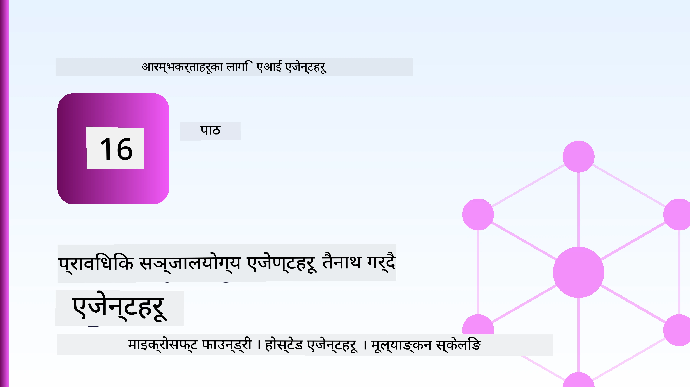
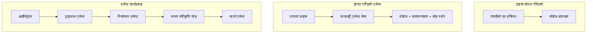
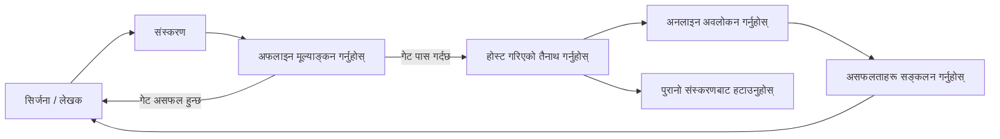
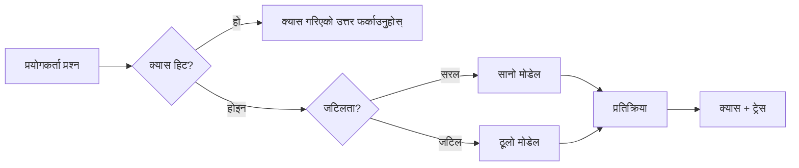
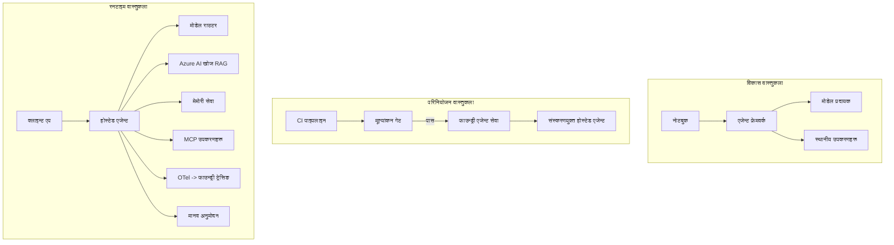

# Microsoft Foundry सँग स्केलेबल एजेन्टहरू तैनाथ गर्दै



पाठ्यक्रमको यो बिन्दुसम्म तपाईंले त्यस्ता एजेन्टहरू बनाउनुभयो जुन तपाइँको ल्यापटपमा, नोटबुक भित्र चल्छन्, `az login` र केही वातावरण चरहरूले सञ्चालित। त्यो सिक्नको लागि बिल्कुल सही तरिका हो। तर त्यो हजारौं ग्राहकहरूले 3 बजे बिहान भर पर्नु हुने एजेन्ट चलाउनको लागि सही तरिका होइन।

यो पाठ "मेरो मेसिनमा काम गर्छ" र "यो उत्पादनमा भरपर्दो र सस्तो मूल्यमा काम गर्छ" बिचको खालि ठाउँको बारेमा हो। हामी त्यो खालि ठाउँलाई **Microsoft Foundry** र **Microsoft Foundry Agent Service** को प्रयोग गरेर बन्द गर्छौं, र हामी एउटा वास्तविक ग्राहक समर्थन एजेन्ट निर्माण गरेर गर्छौं जसमा उपकरणहरू, पुनःप्राप्ति, स्मृति, मूल्याङ्कन र अनुगमन हुन्छ।

## परिचय

यो पाठले समेट्नेछ:

- **प्रोटोटाइप एजेन्ट** र **तैनाथ गरिएको एजेन्ट** बीचको भिन्नता, र किन संक्रमण मुख्य रूपमा मोडेल वरिपरि सबै कुरा हो।
- एजेन्टहरूको लागि **तैनाथीकरण ढाँचा**: क्लाइन्ट-होस्टेड, सेवा-होस्टेड (Hosted Agents), र कार्यप्रवाह-अनुकूलित।
- Microsoft Foundry मा **एजेन्ट जीवनचक्र** — सिर्जना, संस्करण, तैनाथ, मूल्याङ्कन, अवलोकन, रिटायर।
- **स्केलिङ रणनीतिहरू**: मोडेल राउटिङ, क्यासिङ, समवर्तीता, र स्टेटलेस डिजाइन।
- OpenTelemetry र Foundry ट्रेसिङसँग **अवलोकनयोग्यता**।
- मोडेल चयन, राउटिङ, र मूल्याङ्कन गेटमार्फत **लागत अनुकूलन**।
- **उद्यम विचारहरू**: शासन, मानव अनुमोदन, र उत्पादनमा MCP सर्भरहरू सुरक्षित रूपमा चलाउनु।

## सिकाइ उद्देश्यहरू

यो पाठ पूरा गरेपछि, तपाईं जान्न सक्नुहुनेछ:

- दिइएको एजेन्ट कार्यभारको लागि सही तैनाथीकरण ढाँचा चयन गर्नु।
- एजेन्टलाई Microsoft Foundry Agent Service मा तैनाथ गर्नु ताकि यो संस्करणित, शासन गरिएका, र अवलोकनयोग्य होस्।
- ट्रेसिङको लागि एजेन्ट सञ्‍चालित गर्नु र प्रत्येक रिलिजअघि चल्ने मूल्याङ्कन पाइपलाइन जोड्नु।
- स्केलमा विलम्ब र लागत नियन्त्रण गर्न मोडेल राउटिङ र क्यासिङ लागू गर्नु।
- उच्च जोखिम कार्यहरूको लागि मानव अनुमोदन ढोका थप्नु र उत्पादन-सुरक्षित तरिकाले MCP सर्भर एकिकृत गर्नु।

## पूर्वशर्तहरू

यो पाठले मान्छ कि तपाईंले पहिलेका पाठहरू पूरा गर्नुभएको छ र यी कुराहरूमा सहज हुनुहुन्छ:

- [Microsoft Agent Framework](../14-microsoft-agent-framework/README.md) सँग एजेन्टहरू निर्माण गर्दै (पाठ १४)।
- [टूल प्रयोग](../04-tool-use/README.md) (पाठ ४) र [Agentic RAG](../05-agentic-rag/README.md) (पाठ ५)।
- [एजेन्ट स्मृति](../13-agent-memory/README.md) (पाठ १३) र [Agentic Protocols / MCP](../11-agentic-protocols/README.md) (पाठ ११)।
- [अवलोकनयोग्यता र मूल्याङ्कन](../10-ai-agents-production/README.md) (पाठ १०) — यो पाठ त्यसमा सिधै निर्माण गर्दछ।

तपाईंलाई यी पनि आवश्यक हुनेछ:

- एउटा **Azure सदस्यता** र कम्तिमा एउटा तैनाथ गरिएको च्याट मोडेलसहितको **Microsoft Foundry परियोजना**।
- प्रमाणिकृत गरिएको **Azure CLI** (`az login`)।
- Python 3.12+ र भण्डारणशाला [`requirements.txt`](../../../requirements.txt) मा भएका प्याकेजहरू।

## प्रोटोटाइपदेखि उत्पादनसम्म: वास्तवमा के परिवर्तन हुन्छ

प्रोटोटाइप एजेन्ट र उत्पादन एजेन्ट एउटै मुख्य लूप साझा गर्छन्—तर्क, उपकरणहरू कल गर्ने, प्रतिक्रिया दिने। जे परिवर्तन हुन्छ त्यो लूप वरिपरि सबै कुरा हो। उत्पादन एजेन्टमा मोडेल सायद २०% मात्र हुन्छ; बाँकी ८०% सञ्चालनको ढाँचा हो।

| चिन्ता | प्रोटोटाइप | उत्पादन |
| --- | --- | --- |
| **होस्टिंग** | तपाइँको नोटबुकमा चल्छ | होस्ट गरिएको सेवा रूपमा चल्छ, संस्करणित र रोल आउट |
| **पहिचान** | तपाइँको `az login` टोकन | स्कोप गरिएको RBAC सहित प्रबन्धित पहिचान |
| **राज्य** | इन-मेमोरी, पुनःसंचालनमा हराइने | बाह्यीकृत (थ्रेड स्टोर, स्मृति सेवा) |
| **असफलता** | तपाईंले ट्रेसब्याक देख्नुहुन्छ | पुन: प्रयास, फ्यालब्याक, मृत-पत्र, चेतावनीहरू |
| **लागत** | "यो केही सेन्ट मात्र हो" | अनुरोध अनुसार ट्रयाक गरिन्छ, राउट गरिएको, क्यास गरिएको, बजेट गरिएको |
| **गुणस्तर** | तपाईंले नतिजा आँखा हाल्नुहुन्छ | प्रत्येक रिलिज अघि स्वचालित रूपमा मूल्याङ्कन गरिन्छ |
| **विश्वास** | तपाईं हरेक कार्य अनुमोदन गर्नुहुन्छ | नीतिसहित + जोखिमयुक्त कार्यहरूको लागि मानव-इन-लूप |

यो तालिका मनमा राख्नुहोस्। तलका हरेक खण्ड यी पंक्तिहरू मध्ये एउटा संग मेल खान्छ।

## एजेन्ट तैनाथीकरण ढाँचाहरू

तपाईंले प्रायः संयोजनमा प्रयोग गर्ने तीन ढाँचाहरू छन्।

### १. क्लाइन्ट-होस्टेड एजेन्टहरू

एजेन्ट वस्तु *तपाईंको* एप्लिकेशन प्रक्रियामा बस्छ। तपाईंको कोडले मोडेल प्रदायकलाई सिधै कल गर्छ; तर्क लूप तपाईंको सेवामा चल्छ। यो पहिलेका हरेक पाठले गरेको हो।

- **किन प्रयोग गर्ने** जब तपाईंलाई लूपको पूर्ण नियन्त्रण, अनुकूल मिडलवेयर चाहिन्छ, वा तपाईं एजेन्टलाई अवस्थित ब्याकएन्डभित्र समावेश गर्दै हुनुहुन्छ।
- **व्यापार-आफ-**: तपाईं आफैंले स्केलिङ, राज्य, र सहनशीलता सञ्चालन गर्नुहुन्छ।

### २. होस्टेड एजेन्टहरू (Foundry Agent Service)

एजेन्ट Microsoft Foundry मा *स्रोतको रूपमा दर्ता गरिएको* छ। Foundry तर्क लूप होस्ट गर्छ, थ्रेडहरू संग्रह गर्छ, सामग्री सुरक्षा र RBAC लागू गर्छ, र एजेन्टलाई Foundry पोर्टलमा देखाउन दिन्छ। तपाईंको एप्लिकेशन एक पतला क्लाइन्ट बन्छ जसले थ्रेडहरू सिर्जना गर्छ र प्रतिक्रियाहरू पढ्छ।

- **किन प्रयोग गर्ने** जब तपाईंले टिकाउपन, बिल्ट-इन अवलोकनयोग्यता, शासन, र कम सञ्चालन सतह चाहनुहुन्छ।
- **व्यापार-आफ-**: व्यवस्थापित रनटाइमका लागि कम-स्तरीय नियन्त्रण।

### ३. एजेन्ट कार्यप्रवाहहरू

धेरै एजेन्टहरू (र उपकरणहरू) स्पष्ट नियन्त्रण प्रवाहको साथ ग्राफमा संयोजित हुन्छन्—क्रमिक चरणहरू, शाखा, मानव अनुमोदन नोडहरू, र टिकाउ चेकपोइन्टहरू जसले स्थगन र पुनःसञ्चालन गर्न सक्छ। यो Microsoft Agent Framework को **Workflows** क्षमता हो जुन तैनाथीकरण स्तरमा लागू गरिएको छ।

- **किन प्रयोग गर्ने** जब एकल कार्यले धेरै विशेषीकृत एजेन्टहरूलाई समेट्छ वा बीचमा अनुमोदन चरण आवश्यक पर्दछ।
- **व्यापार-आफ-**: धेरै घटकहरू; अनुकूलन-स्तरको अवलोकन आवश्यक हुन्छ।



## Microsoft Foundry मा एजेन्ट जीवनचक्र

एजेन्ट तैनाथीकरण एकपटकको `push` होइन। यो एउटा लूप हो, र यो सफ्टवेयर रिलिज साइकल जस्तै देखिन्छ किनभने यो नै हो।



मुख्य विचार, [Lesson 10](../10-ai-agents-production/README.md) बाट ल्याइएको: **अफलाइन मूल्याङ्कन एउटा ढोका हो, पछि सोचेको कुरा होइन।** नयाँ एजेन्ट संस्करण तब मात्र प्रक्षेपण हुन्छ जब यो तपाईंको मूल्याङ्कन मापदण्ड पार गर्छ। अनलाइन अवलोकनले वास्तविक संसारका असफलताहरूलाई अफलाइन परीक्षण सेटमा फिर्ता प्रदान गर्छ। त्यो नै पुरा लूप हो।

## स्केलिङ रणनीतिहरू

एजेन्ट स्केलिङ एक स्टेटलेस वेब API को स्केलिङ भन्दा फरक छ, किनकि हरेक अनुरोधले धेरै महँगो मोडेल र उपकरण कॉलहरू ट्रिगर गर्न सक्छ। चार प्रविधिहरूले अधिकांश लोड बोक्छन्।

**स्टेटलेस अनुरोध ह्यान्डलिङ।** तपाईंको प्रक्रियाको मेमोरीमा कुनै प्रयोगकर्ता अनुसार राज्य नहाल्नुहोस्। संवाद थ्रेडहरू Foundry थ्रेड स्टोर वा स्मृति सेवामा सङ्ग्रह गर्नुहोस् जसले कुनै पनि उदाहरणले कुनै पनि अनुरोध ह्यान्डल गर्न सकोस्। यो नै तपाईंलाई तेर्सो रूपमा स्केल गर्न अनुमति दिन्छ — उदाहरणहरू थप्नुहोस्, कुनै स्टिकी सेसन छैन।

**मोडेल राउटिङ।** सबै अनुरोधलाई तपाईंको सबैभन्दा सक्षम (र सबैभन्दा महँगो) मोडेल चाहिँदैन। सरल अनुरोध— आशय वर्गीकरण, छोटा तथ्यात्मक उत्तरहरू—साना, छिटो मोडेलतर्फ राउट गर्नुहोस्, र ठूलो मोडेललाई वास्तविक तर्कको लागि रिजर्भ गर्नुहोस्। Foundry को **Model Router** तपाईंका लागि यो गर्न सक्छ, वा तपाईंले आफैंले हल्का वर्गीकर्ता कार्यान्वयन गर्न सक्नुहुन्छ। तपाईंले लेबमा DIY संस्करण निर्माण गर्नुहुनेछ।

**प्रतिक्रिया क्यासिङ।** धेरै समर्थन प्रश्नहरू लगभग दोहोरिएका ("मेरो पासवर्ड कसरी रिसेट गर्ने?") हुन्छन्। आम प्रश्नहरूको उत्तर क्यास गर्नुहोस् र मोडेलमा हान्न नपरी सेवा गर्नुहोस्। मध्यम क्यास हिट दरले पनि लागत र विलम्बतामा अर्थपूर्ण कटौती गर्छ।

**समवर्तीता र ब्याकप्रेसर।** मोडेल प्रदायकहरूका दर सीमा हुन्छन्। तपाईंको समवर्तीतालाई सीमित गर्नुहोस्, पुन: प्रयासहरूमा घातीय ब्याकअफ प्रयोग गर्नुहोस्, र गरिमापूर्वक असफल हुनुहोस् (कतारबद्ध "हामी काम गर्दैछौं" प्रतिक्रिया ५०० भन्दा राम्रो छ)।



## उत्पादनमा अवलोकनयोग्यता

तपाईंले देख्न नसकेको कुरा सञ्चालन गर्न सक्नुहुन्न। पाठ १० मा समेटिए अनुसार, Microsoft Agent Framework स्वदेशी रूपमा **OpenTelemetry** ट्रेसेस निकाल्छ—हरेक मोडेल कल, उपकरण उद्घाटन, र अनुकूलन चरणले स्प्यान बनाउँछ। उत्पादनमा ती स्प्यानहरू Microsoft Foundry (वा कुनै पनि OTel-अनुकूल ब्याकएंड) मा निकासी गरिन्छ ताकि तपाइँ:

- एकल ग्राहक गुनासो अन्तदेखि अन्तसम्म प्रत्येक मोडेल र उपकरण कलमा ट्रेस गर्न सक्नुहोस्।
- समयसँगै अनुरोध अनुसार p50/p95 विलम्ब र लागत हेर्नुहोस्।
- त्रुटि दरमा वृद्धि र लागत असामान्यताहरूमा सचेत हुनुहोस् तपाईंका प्रयोगकर्ताहरू (वा तपाईंको वित्त टोली) लाई थाहा हुनु अघि।

```python
from agent_framework.observability import get_tracer

tracer = get_tracer()

with tracer.start_as_current_span("support_request") as span:
    span.set_attribute("customer.tier", "enterprise")
    span.set_attribute("routed.model", "gpt-5-nano")
    # एजेन्ट कार्यान्वयन यस स्प्यान भित्र स्वचालित रूपमा ट्रेस गरिन्छ
```

`customer.tier` र `routed.model` जस्ता विशेषताहरूले ट्रेसेसको पर्खाललाई जवाफ दिन सक्ने प्रश्नहरू ("के उद्यम ग्राहकहरूलाई सानो मोडेलमा बढी समय राउट भइरहेको छ?") मा परिणत गर्छ।

## लागत अनुकूलन

उत्पादन एजेन्टहरूमा लागत टोकनहरूले प्रभुत्व जमाउँछन्। प्रभावको क्रम अनुसार तीन वटा उपायहरू छन्:

१. **मोडेललाई सही आकार दिनुहोस्।** एउटा सानो मोडेल जुन तपाईंले मूल्याङ्कन गेट पार गर्छ प्रायः ठूलो मोडेलभन्दा सस्तो हुन्छ। सावधानीका साथ ठूलो मोडेललाई डिफल्ट नबनाई मूल्याङ्कन गरेर सानो मोडेल पर्याप्त छ प्रमाणित गर्नुहोस्।
२. **जटिलताका आधारमा राउट गर्नुहोस्।** माथि भनिएझैं—ठूलो मोडेल मूल्य केवल ती अनुरोधहरूको लागि जहाँ ठूलो मोडेल तर्क आवश्यक छ तिर्नुहोस्।
३. **आक्रामक रूपमा क्यास गर्नुहोस्।** सबैभन्दा सस्तो मोडेल कल त्यो हो जुन तपाईंले कहिल्यै नगर्नुहुने हो।

मूल्याङ्कन गेट र लागत नियन्त्रण दुई दृष्टिकोणबाट हेर्दा एउटै अनुशासन हुन्: मूल्याङ्कनले तपाईंलाई *गुणस्तरको तलतर्फ* बताउँछ, राउटिङ र क्यासिङले तपाईंलाई त्यो तलतर्फको *लागत* नजिक राख्छ।

## उद्यम तैनाथीकरण विचारहरू

**शासन।** होस्टेड एजेन्टहरूले Foundry को RBAC, सामग्री सुरक्षा र अडिट लगिङ inherited गर्छन्। हरेक एजेन्टलाई कम्तीमा आवश्यक सबैभन्दा कम विशेषाधिकार भएको प्रबन्धित पहिचान दिनुहोस्—ज्ञान आधारमा मात्र पढ्ने पहुँच, टिकटिङ API मा स्कोप गरिएको पहुँच, अरु केही होइन।

**मानव-इन-लूप।** केही कार्यहरू पूर्णतः स्वचालित गर्न धेरै महत्वपूर्ण हुन्छन्—रिफंड जारी गर्नु, खाता मेटाउनु, कानुनी टोलीमा बढाउनु। Microsoft Agent Framework **अनुमोदन आवश्यक** उपकरणहरू समर्थन गर्छ: एजेन्टले कार्य प्रस्ताव गर्छ, कार्य रोकिन्छ, मानवले अनुमोदन वा अस्वीकृत गर्छ, र कार्यप्रवाह पुनः सुरु हुन्छ। तपाईं यस प्रिमिटिभलाई [Lesson 6](../06-building-trustworthy-agents/README.md) मा देख्नुभयो; यहाँ तपाइँले यो तैनाथ गर्नुहुन्छ।

**उत्पादनमा MCP।** [MCP](../11-agentic-protocols/README.md) ले तपाईंको एजेन्टलाई बाह्य उपकरणहरू मानक इन्टरफेसमार्फत उपभोग गर्न दिन्छ। उत्पादनमा, हरेक MCP सर्भरलाई अविश्वसनीय सीमा मान्नुहोस्: सर्भर संस्करण पिन गर्नुहोस्, स्कोप गरिएको पहिचानसँग चलाउनुहोस्, यसको आउटपुटहरू प्रमाणित गर्नुहोस्, र कहिल्यै गोप्य विवरणहरू यसलाई नदेखाउनुहोस्। MCP सर्भर एक निर्भरता हो, र निर्भरता पट्च, अडिट र दर-सीमित हुन्छन्।



ती तीन चित्रहरू — विकास, तैनाथीकरण, रनटाइम — एउटै एजेन्ट तीन अवस्थाहरूमा देखाउँछन्। तलको लेबले तपाइँलाई यो बनाउन मार्गदर्शन गर्नेछ।

## हातमा लगाउने लेब: उत्पादन-तयार ग्राहक समर्थन एजेन्ट

[`code_samples/16-python-agent-framework.ipynb`](./code_samples/16-python-agent-framework.ipynb) खोल्नुहोस् र सुरूदेखि अन्त्यसम्म काम गर्नुहोस्। तपाईं **Contoso ग्राहक समर्थन एजेन्ट** बनाउन लाग्नुहुन्छ जसमा प्रत्येक उत्पादन चिन्ता समावेश छ:

१. **उपकरण कल** — अर्डर स्थिति हेर्नुहोस् र समर्थन टिकेटहरू खोल्नुहोस्।
२. **RAG** — ज्ञान आधारबाट नीति प्रश्नहरूको उत्तर दिनुहोस् (Azure AI Search, इन-मेमोरी फलब्याकसहित ताकि नोटबुकले बिना Search स्रोत चलाओस्)।
३. **स्मृति** — संवादका घुम्तीहरूमा ग्राहक सम्झनुहोस्।
४. **मोडेल राउटिङ** — जटिलता वर्गीकर्ताले हरेक अनुरोधलाई सानो वा ठूलो मोडेलमा राउट गर्छ।
५. **प्रतिक्रिया क्यासिङ** — दोहोरिएका प्रश्नहरू क्यासबाट सेवा गरिन्छ।
६. **मानव अनुमोदन** — सीमा माथिका रिफंडहरू मानव अनुमोदनको लागि रोकिन्छ।
७. **मूल्याङ्कन पाइपलाइन** — सानो अफलाइन परीक्षण सेटले एजेन्ट स्कोर गर्दछ र रिलिज ढोका रूपमा काम गर्छ।
८. **अवलोकनयोग्यता** — हरेक अनुरोध वरिपरि OpenTelemetry ट्रेसिङ।

### मार्गदर्शन

नोटबुक यति व्यवस्थित छ कि हरेक उत्पादन चिन्ता एक स्वतन्त्र, चलाउन मिल्ने खण्ड हो। यसको मुटु हो राउटिङ-प्लस-क्यासिङ अनुरोध ह्यान्डलर:

```python
async def handle_support_request(query: str, customer_id: str) -> str:
    # 1. सकिन्छ भने क्यासबाट सेवा दिनुहोस्।
    cached = response_cache.get(normalize(query))
    if cached:
        return cached

    # 2. लागत नियन्त्रण गर्न जटिलताका आधारमा मार्गनिर्देशन गर्नुहोस्।
    model = "gpt-5-nano" if is_simple(query) else "gpt-5-mini"

    # 3. अवलोकन योग्यताको लागि एजेन्टलाई ट्रेस स्प्यान भित्र चलाउनुहोस्।
    with tracer.start_as_current_span("support_request") as span:
        span.set_attribute("routed.model", model)
        span.set_attribute("customer.id", customer_id)
        response = await support_agent.run(query, model=model)

    # 4. क्यास गर्नुहोस् र फर्काउनुहोस्।
    response_cache.set(normalize(query), response.text)
    return response.text
```

रिलिजको सुरक्षा गर्ने मूल्याङ्कन ढोका यस्ता देखिन्छ:

```python
async def evaluation_gate(agent, test_cases, threshold: float = 0.8) -> bool:
    passed = 0
    for case in test_cases:
        result = await agent.run(case["input"])
        if score_response(result.text, case["expected"]) >= 0.8:
            passed += 1
    pass_rate = passed / len(test_cases)
    print(f"Evaluation pass rate: {pass_rate:.0%} (gate: {threshold:.0%})")
    return pass_rate >= threshold  # केवल गेट पास भएमा मात्र तैनाथ गर्नुहोस्
```

प्रत्येक लाइन पढ्नुहोस् — नोटबुकले प्रिमिटिभहरू जानबुझेर साना राख्छ ताकि केही फ्रेमवर्क कल पछाडि लुकिएको नहोस्।

## तैनाथ गरिएको एजेन्टलाई स्मोक टेस्टबाट पुष्टि गर्दै

माथिल्लो मूल्याङ्कन ढोका तपाईंको एजेन्ट वस्तुविरुद्ध *अफलाइन* चल्छ। एक पटक एजेन्ट Hosted Agent रूपमा तैनाथ भएपछि, तपाईंलाई एक थप, अझ सस्तो जाँच चाहिन्छ: **के तैनाथ गरिएको अन्तबिन्दु साँच्चिकै जवाफ दिइरहेको छ?**

"सफलतापूर्वक" तैनाथीकरणले मात्र नियन्त्रण विमानले परिभाषा स्वीकार गरेको प्रमाणित गर्छ—यसले एजेन्ट जवाफ दिन्छ भन्ने प्रमाण होइन। हराएको निर्भरता, खराब मोडेल राउटिङ, वा सकिएको कनेक्शनले यस्तो तैनाथीकरण छोड्न सक्छ जुन केहि फर्काउँदैन। **स्मोक टेस्ट** त्यो केही सेकेन्डमै पक्रन्छ, हरेक तैनाथीमा, पूर्ण मूल्याङ्कनको लागत बिना।

यो भण्डारणशालाले प्रयोग गर्न तयार स्मोक-टेस्ट पाइपलाइन पठाउँछ जुन [AI Smoke Test](https://github.com/marketplace/actions/ai-smoke-test) GitHub Action मा आधारित छ:

- **क्याटलग** — [`tests/lesson-16-smoke-tests.json`](../../../tests/lesson-16-smoke-tests.json) मा Contoso समर्थन एजेन्टको लागि प्रम्प्ट र Assertions छन् (प्रमाणित नीति उत्तरहरू, अर्डर खोज, विषयमै रहने, र बहु-घुम्ती थ्रेड निरन्तरता)। अरू पाठहरूका एजेन्टहरूको क्याटलग पनि त्यही छ—हेर्नुहोस् [`tests/README.md`](../tests/README.md)।
- **वर्कफ्लो** — [`.github/workflows/smoke-test.yml`](../../../.github/workflows/smoke-test.yml) Azure OIDC सँग लगइन गर्छ र हरेक प्रम्प्टलाई एजेन्टको Responses अन्तबिन्दुमा POST गर्छ, कुनै पनि Assertion फरक परे काम असफल पार्दै।

```yaml
- name: Smoke-test hosted agent
  uses: JFolberth/ai-smoketest@v1
  with:
    project_endpoint: ${{ inputs.project_endpoint }}
    agent_name: ContosoSupportAgent
    tests_file: tests/lesson-16-smoke-tests.json
```


आफ्नो एजेन्ट तैनाथ भएपछि **Actions** ट्याबबाट यसलाई चलाउनुहोस्, तपाईंको Foundry प्रोजेक्ट अन्त्य बिन्दु र एजेन्ट नाम प्रदान गर्दै। फेडरेटेड पहिचानलाई Foundry प्रोजेक्ट स्कोपमा **Azure AI User** भूमिका आवश्यक छ। तहहरूलाई पिरामिडको रूपमा सोच्नुहोस्: स्मोक टेस्टहरू (पहुँच योग्य र प्रतिक्रियाशील?) प्रत्येक तैनाथमा चलाइन्छ, अफलाइन मूल्याङ्कन (पठाउन पर्याप्त छ?) पदोन्नत अघि चलाइन्छ, र अनलाइन मूल्याङ्कन (बनझ्यालमा कस्तो छ?) निरन्तर चलाइन्छ।

## ज्ञान जाँच

असाइनमेन्टमा सर्नुअघि तपाईंको बुझाइ परीक्षण गर्नुहोस्।

**१. लगभग उत्पादन एजेन्टको कति हिस्सा "मोडेल" हो, र बाँकी के हो?**

<details>
<summary>उत्तर</summary>

मोडेल प्रणालीको अल्पसंख्यक हो — प्रायः करिब २०% को रूपमा उद्धृत गरिन्छ। बाँकी अपरेशनल कंकाल हो: होस्टिंग र संस्करण नियन्त्रण, पहिचान र RBAC, बाह्य अवस्था, असफलता व्यवस्थापन, लागत ट्र्याकिंग, मूल्याङ्कन, र मानव-इन-द-लूप नियन्त्रण। उत्पादनमा जान मुख्यतः सबै कुरा *बिच* गर्ने reasoning लूप वरिपरि बनाउने बारे हो।
</details>

**२. तपाईं कहिले क्लाइन्ट-होस्टेड एजेन्टभन्दा Hosted Agent रोज्नु हुन्छ?**

<details>
<summary>उत्तर</summary>

जब तपाईंले बिल्ट-इन स्थायित्व (थ्रेड्स जुन कायम रहन्छन् र पुनः सुरु हुन सक्छन्), अवलोकनीयता, सामग्री सुरक्षा, र RBAC सहित म्यानेज गरिएको रनटाइम चाहनुहुन्छ, र reasoning लूपको केही तल-स्तर नियन्त्रण कम गर्न तयार हुनुहुन्छ ताकि अपरेशनल क्षेत्र कम होस्। क्लाइन्ट-होस्टेड तब प्राथमिक हुन्छ जब तपाईंलाई लूपमा पूर्ण नियन्त्रण चाहिन्छ वा एजेन्टलाई विद्यमान ब्याकएण्डमा एम्बेड गर्दै हुनुहुन्छ।
</details>

**३. किन एउटा स्केलेबल एजेन्ट आफ्नै प्रक्रिया मेमोरीमा स्टेटलेस हुनुपर्छ?**

<details>
<summary>उत्तर</summary>

ताकि कुनै पनि उदाहरणले कुनै पनि अनुरोध सम्हाल्न सकोस्, जुन होरिजोन्टल स्केलिङ बिना स्टिकी सेसनहरू सम्भव छ। प्रति-प्रयोगकर्ता संवाद अवस्था थ्रेड स्टोर वा मेमोरी सेवामा बाह्य गरिएको हुन्छ। यदि अवस्था प्रक्रिया मेमोरीमा हुन्थ्यो भने, पुनःसुरुमा त्यो गुम्थ्यो र लोड स्वतन्त्र रूपमा वितरण गर्न सकिदैनथ्यो।
</details>

**४. मोडेल रुटिङले कुन समस्या समाधान गर्छ, र यसका मूल्याङ्कनसँग के सम्बन्ध छ?**

<details>
<summary>उत्तर</summary>

रुटिङले साधारण अनुरोधहरूलाई सानो, सस्तो, छिटो मोडेलमा पठाउँछ र ठूला मोडेललाई वास्तविक reasoning को लागि आरक्षित गर्छ, जसले लेटेंसी र लागत दुवै नियन्त्रण गर्छ। यो मूल्याङ्कनसँग सम्बन्धित छ किनकि मूल्याङ्कनले प्रमाणित गर्छ कि सानो मोडेल एउटा अनुरोध वर्गका लागि पर्याप्त छ — मूल्याङ्कन बिना रुटिङ अन्दाज हो।
</details>

**५. "मूल्याङ्कन गेट" भनेको के हो र यो जीवनचक्रको कहाँ हुन्छ?**

<details>
<summary>उत्तर</summary>

एउटा मूल्याङ्कन गेटले नयाँ एजेन्ट संस्करणमा अफलाइन टेस्ट सेट चलाएर पास दर एक थ्रेसहोल्ड पार नगरेसम्म तैनाथि ब्लक गर्छ। यो जीवनचक्रमा "संस्करण" र "तैनाथि" को बीचमा हुन्छ, जसले गुणस्तरलाई रिहाइको पूर्वसर्त बनाउँछ, न कि पठाएपछि जाँच गर्ने कुरा।
</details>

**६. किन MCP सर्वरलाई उत्पादनमा अविश्वसनीय सिमाना मान्नु पर्दछ?**

<details>
<summary>उत्तर</summary>

किनकि यो तपाईंको एजेन्टले कल गर्ने बाह्य निर्भरता हो। तपाईंले यसको संस्करण पिन गर्नुपर्छ, स्कोप गरिएको पहिचानसँग चलाउनुपर्छ, यसको आउटपुटहरू जांच गर्नुपर्छ, दर-सीमा लगाउनुपर्छ, र यसको लागि गोप्य कुरा कहिल्यै नखोल्नुपर्छ — जुन कुनै पनि तेस्रो पक्ष निर्भरता लागि लागू हुन्छ। यसको आउटपुट तपाईंको एजेन्टको reasoning मा जान्छ, त्यसैले गैर-जाँचिएको भरोसा सुरक्षा जोखिम हो।
</details>

**७. उत्पादन एजेन्ट लागतमा सबैभन्दा ठूलो प्रभाव हुने एकल परिवर्तन के हो, र किन?**

<details>
<summary>उत्तर</summary>

मोडेलको सही आकार निर्धारण — तपाईंको मूल्याङ्कन गेट पार गर्ने सबैभन्दा सानो मोडेल प्रयोग गर्ने। लागत टोकनद्वारा प्रभुत्वशाली हुन्छ, र गुणवत्ता स्तर मिल्ने सानो मोडेल लगभग सधैं ठूलो मोडेलभन्दा सस्तो हुन्छ। क्यासिङ र रुटिङले लागत थप घटाउँछन्, तर सही आधार मोडेल छान्नुले सबैभन्दा ठूलो प्राथमिक प्रभाव पार्छ।
</details>

**८. `customer.tier` र `routed.model` जस्ता स्प्यान विशेषताहरूले अवलोकनीयतामा के भूमिका खेल्छन्?**

<details>
<summary>उत्तर</summary>

तिनीहरूले कच्चा ट्रेसेसलाई उत्तरदायी व्यापार प्रश्नहरूमा परिणत गर्छन्। विशेषता बिना स्प्यानहरूको भित्तो हुन्छ; विशेषताहरूले तपाईंलाई सोध्न दिन्छन् "के एंटरप्राइज ग्राहकहरूलाई सानो मोडेलमा धेरै पटक रुट गरिएको छ?" वा "कुन मोडेल हाम्रो सबैभन्दा ढिलो अनुरोधहरू ह्यान्डल गर्छ?" विशेषताहरूले तपाईंको अपरेसनका लागि महत्वपूर्ण आयामहरूले टेलिमेट्रीलाई टुक्रा पार्न अनुमति दिन्छ।
</details>

## असाइनमेन्ट

प्रयोगशालाबाट ग्राहक समर्थन एजेन्ट लिई र यसलाई एउटा विशेष परिदृश्यका लागि कडा बनाउनुहोस्: **एक SaaS कम्पनीको सदस्यता बिलिङ समर्थन एजेन्ट।**

तपाईंको सबमिसनले:

१. बिलिङ सम्बन्धित उपकरणहरू प्रतिस्थापन गर्नुहोस्: `get_subscription_status`, `get_invoice`, र `issue_credit` (५० डलर भन्दा माथिका क्रेडिटहरूमा मानव अनुमोदन आवश्यक छ)।
२. कम्पनीको फिर्ता नीति, बिलिङ चक्र, र रद्द गर्ने नीती समेट्ने तीन RAG कागजात थप्नुहोस्।
३. मूल्याङ्कन सेट कम्तीमा आठ केससम्म विस्तार गर्नुहोस्, जसमा कम्तीमा दुईले *मानव-अनुमोदन मार्ग* ट्रिगर गर्नुपर्छ, र तपाईंको मूल्याङ्कन गेट सही रूपमा पास वा फेल भएको पुष्टि गर्नुहोस्।
४. एउटा लागत रिपोर्ट थप्नुहोस्: एजेन्ट मार्फत दसवटा मिश्रित क्वेरी सञ्चालन गरेपछि, कति सानो मोडेलमा गए, कति ठूलो मोडेलमा गए, र कति क्यासबाट सेवा गरिएको छ प्रिन्ट गर्नुहोस्।

छोटो अनुच्छेद (मार्कडाउन सेलमा) लेख्नुहोस् जुन मोडेल-रुटिङ नियम तपाईंले रोज्नु भयो र तपाईंले वास्तविक ट्राफिकसँग त्यसलाई कसरी मान्य गर्नुहुनेछ भनी व्याख्या गर्दछ। कुनै एकल सही उत्तर छैन — तपाईं उत्पादन चासोहरू सहि रूपमा समेटिएको छ कि छैन भनेर मूल्याङ्कन गरिनु हुन्छ।

## सारांश

यस पाठमा तपाईंले एजेन्टलाई प्रोटोटाइपबाट उत्पादनमा Microsoft Foundry प्रयोग गरी सार्नुभयो:

- उत्पादनमा जानु मुख्य रूपमा मोडेल वरिपरि रहेको **अपरेशनल कंकाल** हो — होस्टिंग, पहिचान, अवस्था, असफलता व्यवस्थापन, लागत, गुणस्तर, र भरोसा।
- तपाईंले तीन **तैनाथि ढाँचाहरू** सिक्नुभयो — क्लाइन्ट-होस्टेड, Hosted Agents, र Agent Workflows — र प्रत्येक कहिले उपयुक्त हुन्छ।
- तपाईंले **एजेन्ट जीवनचक्र** पालना गर्नुभयो, जहाँ अफलाइन **मूल्याङ्कनले रिहाइ गेटको रूपमा काम गर्छ** र अनलाइन अवलोकनीयताले असफलतालाई फेरि टेस्ट सेटमा फर्काउँछ।
- तपाईंले **स्केलिङ रणनीतिहरू** प्रयोग गर्नुभयो — स्टेटलेस डिजाईन, मोडेल रुटिङ, क्यासिङ, र सीमित समवर्तीता — र तिनीहरूलाई **लागत अनुकूलन** सँग जोड्नुभयो।
- तपाईंले **एंटरप्राइज नियन्त्रणहरू** जडान गर्नुभयो: RBAC, मानव-इन-द-लूप अनुमोदन, र उत्पादन-निष्पद MCP समाकलन।
- तपाईंले एउटा **उत्पादन-तयार ग्राहक समर्थन एजेन्ट** बनाउनु भयो जुन यी सबै चासोहरूलाई runnable कोडमा समेट्छ।

अर्को पाठले विपरित यात्रा लिन्छ: एजेन्टहरूलाई क्लाउडमा स्केल अप गर्ने सट्टा, तपाईंले तिनीहरूलाई *ओर्लाएर* एउटा एकल विकासकर्ता मेसिनमा ल्याएर पूर्ण रूपमा स्थानीय रूपमा चलाउनु हुनेछ।

## अतिरिक्त स्रोतहरू

- <a href="https://learn.microsoft.com/azure/ai-foundry/what-is-azure-ai-foundry" target="_blank">Microsoft Foundry कागजात</a>
- <a href="https://learn.microsoft.com/azure/ai-foundry/agents/overview" target="_blank">Microsoft Foundry Agent सेवा अवलोकन</a>
- <a href="https://aka.ms/ai-agents-beginners/agent-framework" target="_blank">Microsoft Agent Framework</a>
- <a href="https://learn.microsoft.com/azure/ai-foundry/concepts/model-router" target="_blank">Microsoft Foundry मा मोडेल राउटर</a>
- <a href="https://learn.microsoft.com/azure/search/search-what-is-azure-search" target="_blank">Azure AI Search</a>
- <a href="https://opentelemetry.io/" target="_blank">OpenTelemetry</a>
- <a href="https://github.com/marketplace/actions/ai-smoke-test" target="_blank">AI Smoke Test GitHub Action</a>
- <a href="https://modelcontextprotocol.io/" target="_blank">Model Context Protocol (MCP)</a>

## अघिल्लो पाठ

[कम्प्युटर प्रयोग एजेन्ट निर्माण (CUA)](../15-browser-use/README.md)

## अर्को पाठ

[स्थानीय AI एजेन्टहरू सिर्जना गर्दै](../17-creating-local-ai-agents/README.md)

---

<!-- CO-OP TRANSLATOR DISCLAIMER START -->
**अस्वीकरण**:
यो दस्तावेज़ AI अनुवाद सेवा [Co-op Translator](https://github.com/Azure/co-op-translator) प्रयोग गरेर अनुवाद गरिएको हो। हामी सही हुन प्रयास गर्छौं, तर कृपया जानकार हुनुस् कि स्वचालित अनुवादमा त्रुटिहरू वा अशुद्धताहरू हुन सक्छन्। मूल दस्तावेज़ यसको मूल भाषामा आधिकारिक स्रोत मानिनुपर्छ। महत्वपूर्ण जानकारीका लागि व्यावसायिक मानव अनुवाद सिफारिस गरिन्छ। यस अनुवादको प्रयोगबाट उत्पन्न कुनै पनि गलत बुझाइ वा त्रुटिको लागि हामी जिम्मेवार छैनौं।
<!-- CO-OP TRANSLATOR DISCLAIMER END -->