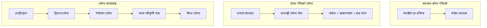
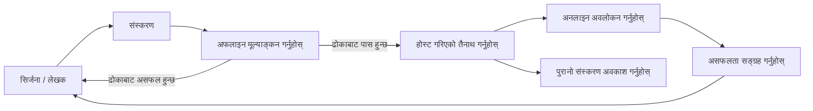
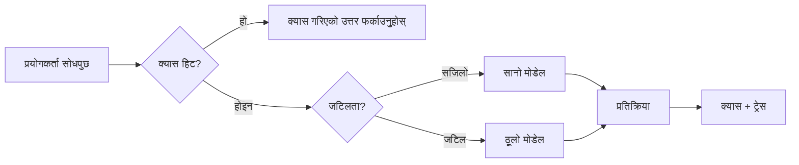
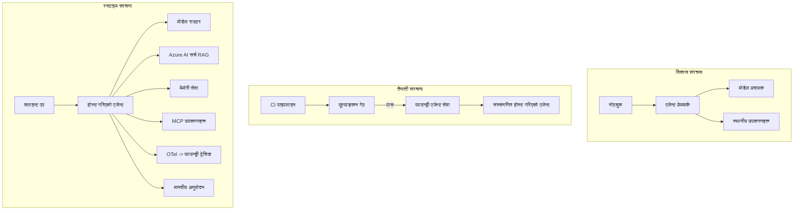

# माइक्रोसफ्ट फाउन्ड्रीसँग स्केलेबल एजेन्टहरू तैनाथ गर्दै


यस पाठ्यक्रमसम्म तपाईंले तपाईंको ल्यापटपमा, नोटबुक भित्र, `az login` र केही वातावरणीय भेरिएबलहरूद्वारा चल्ने एजेन्टहरू निर्माण गर्नुभएको छ। यो सिक्नका लागि बिल्कुल सही तरिका हो। तर हजारौं ग्राहकहरू बिहान ३ बजे भर पर्नाले एजेन्ट चलाउन यो सही तरिका होइन।

यो पाठ "यो मेरो मेसिनमा काम गर्छ" र "यो उत्पादनमा भरपर्दो र किफायती रूपमा काम गर्छ" बीचको अन्तर बारे हो। हामी उक्त अन्तरलाई **माइक्रोसफ्ट फाउन्ड्री** र **माइक्रोसफ्ट फाउन्ड्री एजेन्ट सर्भिस** प्रयोग गरी बन्द गर्छौं, र हामीले यसलाई वास्तविक ग्राहक समर्थन एजेन्ट बनाउँदा उपकरणहरू, पुनःप्राप्ति, स्मृति, मूल्यांकन, र अनुगमन समावेश गरेर गर्छौं।

## परिचय

यस पाठले समेट्ने विषयहरू:

- **प्रोटोटाइप एजेन्ट** र **तैनाथ एजेन्ट** बीचको फरक, र किन संक्रमण प्रायः मोडेलको वरिपरिको वातावरणका बारेमा हुन्छ।
- एजेन्टहरूको **तैनाथ गर्ने ढाँचा**: क्लाइन्ट-होस्ट गरिएको, सर्भिस-होस्ट गरिएको (होस्ट गरिएको एजेन्टहरू), र कार्यप्रवाह-अनुकूलित।
- माइक्रोसफ्ट फाउन्ड्रीको **एजेन्ट जीवनचक्र** — सिर्जना, संस्करण, तैनाथ, मूल्यांकन, अवलोकन, रिटायर।
- **स्केलिङ रणनीतिहरू**: मोडेल राउटिङ, क्यासिङ, कंकरेन्सी, र स्टेटलेस डिजाइन।
- OpenTelemetry र फाउन्ड्री ट्रेसिङसँग **दृश्यता**।
- मोडेल चयन, राउटिङ, र मूल्यांकन गेटमार्फत **लागत अनुकूलन**।
- **उद्योग विचारहरू**: प्रशासन, मानवीय स्वीकृति, र उत्पादनमा MCP सर्भरहरू सुरक्षित रूपमा चलाउने।

## सिकाइ लक्ष्यहरू

यस पाठ पूरा गरेपछि, तपाईंलाई थाहा हुनेछ:

- दिइएको एजेन्ट वर्कलोडका लागि उपयुक्त तैनाथ ढाँचा छनोट गर्ने।
- माइक्रोसफ्ट फाउन्ड्री एजेन्ट सर्भिसमा एजेन्ट तैनाथ गर्ने जसले यसलाई संस्करणन, प्रशासन, र दृश्यनीय बनाउँछ।
- एजेन्टलाई ट्रेसिङका लागि यन्त्रणा गर्ने र हरेक रिलिज अघि चल्ने मूल्यांकन पाइपलाइन जडान गर्ने।
- स्केलिङमा ढिला र लागत नियन्त्रणमा राख्न मोडेल राउटिङ र क्यासिङ लागू गर्ने।
- उच्च जोखिम कार्यहरूका लागि मानवीय स्वीकृति गेट थप्ने र उत्पादन-सीफ MCP सर्भर समाहित गर्ने।

## पूर्वापेक्षाहरू

यस पाठले तपाईंलाई पहिलेका पाठहरू पूरा गरेको र निम्न कुराहरू सहज रहेको अनुमान गर्छ:

- [माइक्रोसफ्ट एजेन्ट फ्रेमवर्क](../14-microsoft-agent-framework/README.md) प्रयोग गरी एजेन्ट बनाईसकेको (पाठ १४)।
- [उपकरण प्रयोग](../04-tool-use/README.md) (पाठ ४) र [एजेण्टिक RAG](../05-agentic-rag/README.md) (पाठ ५)।
- [एजेन्ट स्मृति](../13-agent-memory/README.md) (पाठ १३) र [एजेन्टिक प्रोटोकलहरू / MCP](../11-agentic-protocols/README.md) (पाठ ११)।
- [दृश्यता र मूल्यांकन](../10-ai-agents-production/README.md) (पाठ १०) — यस पाठले सोझै यसमा निर्माण गर्छ।

तपाईंले यी पनि चाहिन्छ:

- एउटा **एजुर सब्स्क्रिप्सन** र कम्तीमा एक तैनाथ गरिएको कुराकानी मोडेल भएको **माइक्रोसफ्ट फाउन्ड्री प्रोजेक्ट**।
- प्रमाणीकृत गरिएको **एजुर CLI** (`az login`)।
- Python 3.12+ र रिपोजिटरीमा रहेका प्याकेजहरू [`requirements.txt`](../../../requirements.txt)।

## प्रोटोटाइपबाट उत्पादनसम्म: के साँच्चिकै परिवर्तन हुन्छ

प्रोटोटाइप एजेन्ट र उत्पादन एजेन्टलाई एउटै मुख्य लूप हुन्छ — तर्क, उपकरण कल, प्रतिक्रिया। के परिवर्तन हुन्छ भने त्यो लूप वरिपरि सबै कुरा हो। मोडेल उत्पादन एजेन्टको लगभग २०% मात्र हो; बाँकी ८०% सञ्चालनको बनावट हो।

| चासो | प्रोटोटाइप | उत्पादन |
| --- | --- | --- |
| **होस्टिङ** | तपाईंको नोटबुकमा चल्छ | होस्ट गरिएको सर्भिसको रूपमा चल्छ, संस्करणिय र विस्तार गरिएको |
| **पहिचान** | तपाईंको `az login` टोकन | स्कोप गरिएको RBAC सहित व्यवस्थापन गरिएको पहिचान |
| **स्थिति** | इन-मेमोरी, पुनः सुरु गर्दा हराउँछ | बाह्याइज्ड (थ्रेड स्टोर, स्मृति सर्भिस) |
| **असफलता** | तपाईंलाई traceback देखिन्छ | पुन: प्रयास, फालब्याक, मृत-पत्र, सचेत |
| **लागत** | "थोरै सेण्ट" | प्रति अनुरोध ट्र्याक गरिन्छ, राउट, क्यास गरिएको, बजेट गरिएको |
| **गुणस्तर** | तपाईं नतिजा हेर्नुहुन्छ | हरेक रिलिज अघि स्वचालित रूपमा मूल्यांकन गरिएको |
| **विश्वास** | तपाईं हरेक कार्य स्वीकृत गर्नुहुन्छ | नीतिहरू + जोखिमपूर्ण कार्यहरूको लागि मानवीय-इन-द-लूप |

यो तालिका स्मरण राख्नुहोस्। तलका हरेक खण्ड यी पङ्क्ति मध्ये एकसँग मेल खान्छ।

## एजेन्ट तैनाथ गर्ने ढाँचा

तपाईंले प्रायः संयोजनमा प्रयोग गर्ने तीनवटा ढाँचा छन्।

### १. क्लाइन्ट-होस्ट गरिएको एजेन्टहरू

एजेन्ट वस्तु *तपाईंको* अनुप्रयोग प्रक्रियामा बस्छ। तपाईंको कोडले मोडेल प्रदायकलाई सिधै कल गर्छ; तर्क लूप तपाईंको सर्भिसमा चल्छ। यो हो हालसम्म हरेक पाठले गरेको कुरा।

- **जब प्रयोग गर्ने** तपाईंलाई पूर्ण नियन्त्रण चाहिन्छ लूपमा, अनुकूलित मिडलवेयर वा तपाईं मौजूदा ब्याकएन्डभित्र एजेन्ट समावेश गर्दै हुनुहुन्छ भने।
- **ट्रेड-अफ**: तपाईं आफैँले स्केलिङ, अवस्था, र पुनर्स्थापनाको जिम्मा लिनुहुन्छ।

### २. होस्ट गरिएको एजेन्टहरू (फाउन्ड्री एजेन्ट सर्भिस)

एजेन्टलाई माइक्रोसफ्ट फाउन्ड्रीमा *स्रोतको रूपमा दर्ता* गरिन्छ। फाउन्ड्रीले तर्क लूप होस्ट गर्छ, थ्रेडहरू भण्डारण गर्छ, सामग्री सुरक्षा र RBAC लागू गर्छ, र एजेन्ट फाउन्ड्री पोर्टलमा देखाउँछ। तपाईंको एप पतलो क्लाइन्ट बन्छ जसले थ्रेडहरू सिर्जना गर्छ र प्रतिक्रियाहरू पढ्छ।

- **जब प्रयोग गर्ने** तपाईँलाई दिर्घकालीनता, निर्मित दृश्यता, प्रशासन, र कम सञ्चालन सतह क्षेत्र चाहिन्छ भने।
- **ट्रेड-अफ**: कम-स्तरीय नियन्त्रण कम हुन्छ, यसको सट्टामा प्रबन्धित रनटाइम छ।

### ३. एजेन्ट कार्यप्रवाहहरू

धेरै एजेन्टहरू (र उपकरणहरू) स्पष्ट नियन्त्रण प्रवाह सहित ग्राफमा संयोजित गरिन्छ — अनुक्रमिक चरणहरू, शाखा, मानवीय स्वीकृति नोडहरू, र दिर्घकालीन चेकप्वाइन्टहरू जसले रोक्न र पुनः सुरु गर्न सक्छ। यो हो माइक्रोसफ्ट एजेन्ट फ्रेमवर्कको **वर्कफ्लोज** क्षमताको उत्पादन मापनमा प्रयोग।

- **जब प्रयोग गर्ने** जब एकल कार्य धेरै विशिष्ट एजेन्टहरू र निम्नमा स्वीकृति चरण चाहिन्छ।
- **ट्रेड-अफ**: धेरै चलिरहेका भागहरू; संयोजन स्तरको दृश्यता आवश्यक।



## माइक्रोसफ्ट फाउन्ड्रीमा एजेन्ट जीवनचक्र

एजेन्ट तैनाथ गर्नु एक पटकको `पुष` होइन। यो एक लूप हो, जुन सफ्टवेयर रिलिज चक्र जस्तो देखिन्छ किनकि त्यो नै हो।



मुख्य विचार, [पाठ १०](../10-ai-agents-production/README.md) बाट लिएर आएको: **अफलाइन मूल्यांकन एक गेट हो, पछि सोच्ने कुरा होइन।** नयाँ एजेन्ट संस्करण तपाईंको मूल्यांकन थ्रेसहोल्ड पार नगरेसम्म प्रक्षेपण हुँदैन। अनलाइन दृश्यता त्यसपछि वास्तविक असफलताहरूलाई तपाईंको अफलाइन परीक्षण सेटमा फिर्ता पठाउँछ। त्यो नै सम्पूर्ण लूप हो।

## स्केलिङ रणनीतिहरू

एजेन्टलाई स्केल गर्नु स्टेटलेस वेब API स्केल गर्नेभन्दा फरक हुन्छ, किनकि प्रत्येक अनुरोधले धेरै महँगो मोडेल र उपकरण कलहरू ट्रिगर गर्न सक्छ। चार प्रविधिले अधिकांश भार बोक्दछ।

**स्टेटलेस अनुरोध ह्यान्डलिङ।** तपाईंको प्रक्रियाको स्मृतिमा प्रयोगकर्ता अनुसारको कुनै अवस्था नराख्नुहोस्। कुराकानी थ्रेडहरू फाउन्ड्री थ्रेड स्टोर वा स्मृति सेवामा सुरक्षित गर्नुहोस् ताकि कुनै पनि उदाहरणले कुनै पनि अनुरोध ह्यान्डल गर्न सक्छ। यसले तपाईलाई क्षैतिज स्केल गर्न अनुमति दिन्छ — उदाहरणहरू थप्नुस्, कुनै स्टिकी सेसन छैन।

**मोडेल राउटिङ।** हरेक अनुरोधलाई तपाईंको सबैभन्दा सक्षम (र सबैभन्दा महँगो) मोडेल चाहिदैन। सरल अनुरोधहरू — इरादा वर्गीकरण, छोटो तथ्याङ्क जवाफ — सानो, छिटो मोडेलमा राउट गर्नुहोस्, र ठूलो मोडेललाई वास्तविक तर्कका लागि सुरक्षित गर्नुहोस्। फाउन्ड्रीको **मोडेल राउटर** यसलाई तपाईंको लागि गर्न सक्छ, वा तपाईं आफैँले हल्का वर्गीकारक लागू गर्न सक्नुहुन्छ। तपाईंले प्रयोगशालामा DIY संस्करण तयार गर्नुहुनेछ।

**प्रतिक्रिया क्यासिङ।** धेरै समर्थन प्रश्नहरू लगभग नक्कल हुन्छन् ("मेरो पासवर्ड कसरी रिसेट गर्ने?")। सामान्य प्रश्नहरूको जवाफहरू क्यास गर्नुहोस् र मोडेललाई टक्कर नदिईकन सेवा दिनुहोस्। मामुली क्यास हिट दरले पनि लागत र ढिलाइमा अर्थपूर्ण कटौती गर्छ।

**कंकरेन्सी र ब्याकप्रेसर।** मोडेल प्रदायकहरूमा दर सीमाहरू हुन्छन्। आफ्नो कंकरेन्सी सीमित गर्नुहोस्, एक्सपोनेन्सियल ब्याकअफसँग पुनः प्रयास गर्नुहोस्, र मृदु रूपमा असफल हुनुहोस् (लाइनमा राखिएको "हामीमा छौं" प्रतिक्रिया ५०० भन्दा राम्रो छ)।



## उत्पादनमा दृश्यता

तपाईं देख्न नसक्ने कुरा सञ्चालन गर्न सक्नुहुन्न। पाठ १० मा समेटिएझैं, माइक्रोसफ्ट एजेन्ट फ्रेमवर्कले **OpenTelemetry** ट्रेसहरू स्वाभाविक रूपमा उत्सर्जन गर्छ — हरेक मोडेल कल, उपकरण आह्वान, र संयोजन चरण एक स्प्यान बन्छ। उत्पादनमा ती स्प्यानहरूलाई माइक्रोसफ्ट फाउन्ड्री (वा कुनै पनि OTel-संगत ब्याकएन्ड) मा निर्यात गर्न सकिन्छ जसले तपाईंलाई अनुमति दिन्छ:

- एउटा ग्राहक उजुरीलाई अन्तदेखि अन्तसम्म हरेक मोडेल र उपकरण कलमा ट्रेस गर्न।
- समयसँगै p50/p95 ढिलाइ र लागत प्रति अनुरोध हेर्न।
- तपाईंका प्रयोगकर्ता (वा वित्त टोली) कुरा थाह पाउनु अगाडि त्रुटि-दर स्पाइकहरू र लागत असामान्यताहरूमा सचेत हुन।

```python
from agent_framework.observability import get_tracer

tracer = get_tracer()

with tracer.start_as_current_span("support_request") as span:
    span.set_attribute("customer.tier", "enterprise")
    span.set_attribute("routed.model", "gpt-4.1-mini")
    # एजेन्ट कार्यान्वयन यस स्प्यान भित्र स्वचालित रूपमा ट्रेस गरिन्छ
```

`customer.tier` र `routed.model` जस्ता गुणहरूले ट्रेसहरूको भित्तोलाई जवाफयोग्य प्रश्नहरूमा परिणत गर्छ ("के उद्यम ग्राहकहरू सानो मोडेलमा धेरै पटक राउट भइरहेका छन्?")।

## लागत अनुकूलन

उत्पादन एजेन्टमा लागत मुख्य रूपमा टोकनहरूले प्रभुत्व जमाएको छ। प्रभावको क्रममा तीन लीभरहरू:

१. **मोडेलको सही आकार।** मूल्यांकन गेट पार गर्ने सानो मोडेल प्रायः ठूला मोडेलभन्दा सस्तो हुन्छ। ठूलो मोडेल छनौट गर्ने पूर्वानुमानमा नरुहने सानो मोडेल राम्रो छ भनेर मूल्यांकनले प्रमाणित गर्न प्रयोग गर्नुहोस्।
२. **जटिलता आधारमा राउट गर्नुहोस्।** माथिका अनुसार — ठूलो मोडेल चाहिने अनुरोधमात्र ठूलो मोडेल मूल्य तिर्नुहोस्।
३. **आक्रमक क्यासिङ।** सबैभन्दा सस्तो मोडेल कल त्यो हो जुन तपाईं कहिल्यै गर्दैन।

मूल्यांकन गेटहरू र लागत नियन्त्रण दुई दृष्टिकोणबाट हेर्नाले एउटै अनुशासन हो: मूल्यांकनले *गुणस्तरको आधार* बताउँछ, राउटिङ र क्यासिङले तपाईंलाई त्यो आधारको *लागत* जति सक्दो नजिक राख्छ।

## उद्यम तैनाथ गर्ने विचारहरू

**शासन।** होस्ट गरिएको एजेन्टहरूले फाउन्ड्रीको RBAC, सामग्री सुरक्षा, र अडिट लगिङ प्राप्त गर्छन्। प्रत्येक एजेन्टलाई आवश्यक न्यूनतम अनुमतिसहित व्यवस्थापित पहिचान दिनुहोस् — ज्ञान आधार पढ्न मात्रै, टिकटिङ API स्कोप भएको पहुँच, अरू केही होइन।

**मानवीय-इन-द-लूप।** केही कार्यहरू धेरै महत्त्वका लागि स्वतः चलाउन नसकिने — फिर्ता जारी गर्ने, खाता मेट्ने, कानुनी टोलीमा बढाउने। माइक्रोसफ्ट एजेन्ट फ्रेमवर्कले **स्वीकृति आवश्यक** उपकरणहरू समर्थन गर्छ: एजेन्टले कार्य प्रस्ताव गर्छ, कार्य ठप्प हुन्छ, मान्छेले स्वीकृत वा अस्वीकृत गर्छ, र वर्कफ्लो फेरि सुरु हुन्छ। तपाईंले [पाठ ६](../06-building-trustworthy-agents/README.md) मा यो हुनसक्ने देख्नुभएको थियो; यहाँ तपाईं त्यसलाई तैनाथ गर्नुहुन्छ।

**उत्पादनमा MCP।** [MCP](../11-agentic-protocols/README.md) ले तपाईंको एजेन्टलाई बाह्य उपकरणहरू मानक अन्तरफलकबाट उपभोग गर्न अनुमति दिन्छ। उत्पादनमा, प्रत्येक MCP सर्भरलाई अविश्वसनीय सिमाना को रूपमा हेरिन्छ: सर्भर संस्करण पिन गर्नुहोस्, स्कोप गरिएको पहिचानको साथ चलाउनुहोस्, यसको आउटपुटहरू प्रमाणित गर्नुहोस्, र यसको लागि कहिल्यै गोप्यतालाई खुलासा नगर्नुहोस्। MCP सर्भर एक निर्भरता हो, र निर्भरताहरूलाई प्याच, अडिट, र दर सीमित गरिन्छ।



ती तीन चित्रहरू — विकास, तैनाथ, रनटाइम — एउटै एजेन्टको तीन जीवन चरणहरू हुन्। तलको प्रयोगशालाले तपाईंलाई यसलाई निर्माण गर्न मार्गदर्शन गर्दछ।

## हात-मा-हातले गर्ने प्रयोगशाला: उत्पादन-तयार ग्राहक समर्थन एजेन्ट

[`code_samples/16-python-agent-framework.ipynb`](./code_samples/16-python-agent-framework.ipynb) खोल्नुहोस् र अन्तदेखि अन्तसम्म काम गर्नुहोस्। तपाईं **Contoso ग्राहक समर्थन एजेन्ट** तयार गर्नुहुनेछ जसमा सबै उत्पादन चिन्ताहरू इन्टिग्रेट छन्:

१. **उपकरण कल** — अर्डर स्थिति हेर्न र समर्थन टिकट खोल्न।
२. **RAG** — ज्ञान आधारबाट नीति प्रश्नहरूको उत्तर दिन (Azure AI Search, इन-मेमोरी फलब्याकसँग ताकि नोटबुक सर्च स्रोत बिना चल्छ)।
३. **स्मृति** — कुराकानीको पालोहरूमा ग्राहकलाई सम्झनुहोस्।
४. **मोडेल राउटिङ** — एक जटिलता वर्गीकारक प्रत्येक अनुरोधलाई सानो वा ठूलो मोडेलमा राउट गर्छ।
५. **प्रतिक्रिया क्यासिङ** — दोहोरिएका प्रश्नहरू क्यासबाट सेवा दिइन्छ।
६. **मानवीय स्वीकृति** — निर्धारणभन्दा माथिका फिर्ता कार्यहरू मानवीय हस्ताक्षरका लागि रोक्छ।
७. **मूल्यांकन पाइपलाइन** — एक सानो अफलाइन टेस्ट सेटले एजेन्टलाई स्कोर गर्छ र रिलिज गेटको रूपमा काम गर्छ।
८. **दृश्यता** — हरेक अनुरोधको वरिपरि OpenTelemetry ट्रेसिङ।

### लगानी गर्ने तरिका

नोटबुक यसरी व्यवस्थित छ कि हरेक उत्पादन चिन्ता एउटा स्व-सम्पूर्ण, चलाउन मिल्ने खण्ड हो। यसमा मुख्य कुरा हो राउटिङ-प्लस-क्यासिङ अनुरोध ह्यान्डलर:

```python
async def handle_support_request(query: str, customer_id: str) -> str:
    # 1. सक्ने बेला क्यासबाट सेवा दिनुहोस्।
    cached = response_cache.get(normalize(query))
    if cached:
        return cached

    # 2. लागत नियन्त्रणका लागि जटिलता अनुसार मार्गनिर्देशन गर्नुहोस्।
    model = "gpt-4.1-mini" if is_simple(query) else "gpt-4.1"

    # 3. अवलोकनयोग्यताको लागि एजेन्टलाई ट्रेस स्पान भित्र चलाउनुहोस्।
    with tracer.start_as_current_span("support_request") as span:
        span.set_attribute("routed.model", model)
        span.set_attribute("customer.id", customer_id)
        response = await support_agent.run(query, model=model)

    # 4. क्यास गर्नुहोस् र फिर्ता गर्नुहोस्।
    response_cache.set(normalize(query), response.text)
    return response.text
```

रिलिजको रक्षा गर्ने मूल्यांकन गेट यस्तो देखिन्छ:

```python
async def evaluation_gate(agent, test_cases, threshold: float = 0.8) -> bool:
    passed = 0
    for case in test_cases:
        result = await agent.run(case["input"])
        if score_response(result.text, case["expected"]) >= 0.8:
            passed += 1
    pass_rate = passed / len(test_cases)
    print(f"Evaluation pass rate: {pass_rate:.0%} (gate: {threshold:.0%})")
    return pass_rate >= threshold  # गेट सफल भए मात्र मात्र तैनाथ गर्नुहोस्
```

हरेक लाइन पढ्नुहोस् — नोटबुकले स्पष्ट रूपमा साना प्रिमिटिवहरू राख्छ ताकि केही पनि फ्रेमवर्क कलको पछाडि लुकिएको नहोस्।

## तैनाथ गरिएको एजेन्टलाई स्मोक टेस्टले प्रमाणित गर्दै

माथिको मूल्यांकन गेट *अफलाइन* तपाईंको एजेन्ट वस्तुको विरुद्ध चल्छ। एकपटक एजेन्ट होस्ट गरिएको एजेन्टको रूपमा तैनाथ भएपछि, तपाईंलाई अर्को, अझ किफायती जाँच चाहिन्छ: **के तैनाथ गरिएको अन्त बिन्दु साँच्चिकै जवाफ दिइरहेको छ?**

"सफलतापूर्वक" तैनाथ गर्नु केवल नियन्त्रण तलले परिभाषा स्वीकारेको प्रमाण हो — यसले एजेन्ट जवाफ दिन्छ भन्ने प्रमाण होइन। हराएको निर्भरता, खराब मोडेल राउटिङ वा म्याद सकिएको जडानले सुन्तला तैनाथ गरे पनि केही फर्काउँदैन। **स्मोक टेस्ट** त्यो केही सेकेन्डमा, हरेक तैनाथमा, पूर्ण मूल्यांकनको लागत बिना पक्रिन्छ।

यो रिपोजिटरी रेडी-टु-यूज स्मोक-टेस्ट पाइपलाइन ल्याउँछ जुन [AI स्मोक टेस्ट](https://github.com/marketplace/actions/ai-smoke-test) GitHub एक्सनमा आधारित छ:

- **क्याटलग** — [`tests/lesson-16-smoke-tests.json`](../../../tests/lesson-16-smoke-tests.json) ले Contoso समर्थन एजेन्टका लागि प्रॉम्प्टहरू र प्रमाणहरू समेट्छ (आधारित नीति उत्तरहरू, अर्डर खोज, विषयमा रहने, र मल्टिटर्न थ्रेड निरन्तरता)। अन्य पाठका एजेन्टहरूका क्याटलगहरू सोही ठाउँमा हुन्छन् — हेर्नुहोस् [`tests/README.md`](../tests/README.md)।
- **वर्कफ्लो** — [`.github/workflows/smoke-test.yml`](../../../.github/workflows/smoke-test.yml) एजुर ओआईडीसीसँग लग इन गर्छ र प्रत्येक प्रॉम्प्टलाई एजेन्टको Responses अन्त बिन्दुमा POST गर्छ, कुनै पनि प्रमाणीकरण नपुगेमा जागिर फेल गर्छ।

```yaml
- name: Smoke-test hosted agent
  uses: JFolberth/ai-smoketest@v1
  with:
    project_endpoint: ${{ inputs.project_endpoint }}
    agent_name: ContosoSupportAgent
    tests_file: tests/lesson-16-smoke-tests.json
```


तपाईँको एजेन्ट डिप्लोय भएपछि **Actions** ट्याबबाट चलाउनुहोस्, जसमा तपाईँको Foundry प्रोजेक्ट अन्त बिन्दु र एजेन्ट नाम प्रदान गर्नुहोस्। संघीकृत पहिचानलाई Foundry प्रोजेक्ट दायरामा **Azure AI User** भूमिका आवश्यक छ। तहहरूलाई एउटा पिरामिडको रूपमा सोच्नुहोस्: स्मोक टेस्टहरू (पहुंचयोग्य र प्रतिक्रिया दे रहेछन्?) प्रत्येक डिप्लोयमा चल्छन्, अफलाइन मूल्याङ्कन (शिप गर्न पर्याप्त राम्रो?) प्रमोशन अघि चल्छ, र अनलाइन मूल्याङ्कन (जङ्गलमा कस्तो प्रदर्शन गर्दैछ?) निरन्तर चलिरहन्छ।

## ज्ञान जाँच

असाइनमेन्टतर्फ बढ्नु अघि आफ्नो बुझाइ परीक्षण गर्नुहोस्।

**1. करिब उत्पादन एजेन्टमा 'मोडेल' कति हिस्सा हुन्छ, र बाँकी के हो?**

<details>
<summary>उत्तर</summary>

मोडेल प्रणालीको अल्पसंख्यक हो — प्रायः करिब २०% को रूपमा उल्लेख गरिन्छ। बाँकी हो परिचालन कंकाल: होस्टिङ र संस्करण नियन्त्रण, पहिचान र RBAC, बाह्य अवस्थामा राख्नु, विफलता व्यवस्थापन, लागत ट्र्याकिङ, मूल्याङ्कन, र मानव-इन-द-लूप नियन्त्रणहरू। उत्पादनमा जानु भनेको मुख्य रूपमा तर्क चक्रको वरिपरि सबै कुराहरू निर्माण गर्नु हो।
</details>

**2. कहिले तपाईं क्लाइन्ट-होस्टेड एजेन्ट भन्दा Hosted Agent रोज्नुहुन्छ?**

<details>
<summary>उत्तर</summary>

जब तपाईँलाई बिल्ट-इन टिकाउपन (थ्रेडहरू जसले कायम रहन्छन् र पुनःस्टार्ट गर्न सक्छन्), अवलोकनीयता, सामग्री सुरक्षा, र RBAC सहित व्यवस्थापन गरिएको रनटाइम चाहिन्छ, र तपाईँ थोरै कम तह नियन्त्रणको लागि त्यति अपरेशनल सतह क्षेत्र घटाउन तयार हुनुहुन्छ। क्लाइन्ट-होस्टेड तब उपयुक्त हुन्छ जब तपाईँलाई पूर्ण नियन्त्रण चाहिन्छ वा एजेन्टलाई कुनै विद्यमान ब्याकएन्डमा समाहित गर्दै हुनुहुन्छ।
</details>

**3. स्केलेबल एजेन्टलाई आफ्नो प्रक्रिया मेमोरीमा स्टेटलेस किन हुनुपर्छ?**

<details>
<summary>उत्तर</summary>

ताकि कुनै पनि इन्स्ट्यान्सले कुनै पनि अनुरोध ह्यान्डल गर्न सकोस्, जुन स्टिकी सेसन बिना होरिजन्टल स्केलिङ सम्भव बनाउँछ। प्रयोगकर्ताको संवाद स्थिति थ्रेड स्टोर वा मेमोरी सेवामा बाह्यीकृत गरिएको हुन्छ। यदि स्थिति प्रक्रिया मेमोरीमा हुन्छ भने, पुनःस्टार्ट गर्दा त्यो स्थिति हराउँछ र लोड स्वतन्त्र रूपमा वितरण गर्न सकिंदैन।
</details>

**4. मोडेल राउटिङले कुन समस्या समाधान गर्दछ, र यसले मूल्याङ्कनसँग कसरी सम्बन्ध राख्छ?**

<details>
<summary>उत्तर</summary>

राउटिङले साधारण अनुरोधहरूलाई सानो, सस्तो, छिटो मोडेलमा पठाउँछ र ठूलो मोडेललाई साँच्चिकै तर्कका लागि सुरक्षित राख्छ, जसले लेटेन्सी र लागत नियन्त्रण गर्दछ। यो मूल्याङ्कनसँग सम्बन्धित छ किनभने मूल्याङ्कनले *साँच्चिकै* प्रमाण गर्दछ कि सानो मोडेल एउटा अनुरोध वर्गका लागि पर्याप्त छ — मूल्याङ्कन बिना राउटिङ केवल अनुमान हो।
</details>

**5. "मुल्याङ्कन गेट" के हो र यो जीवनचक्रमा कहाँ राखिन्छ?**

<details>
<summary>उत्तर</summary>

एक मुल्याङ्कन गेटले नयाँ एजेन्ट संस्करणको विरुद्ध अफलाइन टेस्ट सेट चलाउँछ र पास दर थ्रेसहोल्ड पार नगरेसम्म डिप्लोयमेन्ट रोक्छ। यो जीवनचक्रमा "संस्करण" र "डिप्लोय" बीच स्थित हुन्छ, जसले गुणस्तरलाई रिलिजको पूर्वशर्त बनाउँछ नकि शिपिङ पछि जाँच्ने विषय।
</details>

**6. उत्पादनमा MCP सर्भरलाई अविश्वसनीय सीमा किन मान्नुपर्छ?**

<details>
<summary>उत्तर</summary>

किनभने यो तपाईँको एजेन्टले कल गर्ने बाह्य निर्भरता हो। यसको संस्करण पिन गर्नुपर्छ, सीमित पहिचानसँग चलाउनुपर्छ, यसको आउटपुटहरू मान्य गर्नुपर्छ, दर सिमित गर्नुपर्छ, र यसमा कहिल्यै रहस्यहरू नदेखाउनुपर्छ — जुन तपाईंले कसै पनि तेस्रो-पक्ष निर्भरता लागि गर्ने अनुशासन हो। यसको आउटपुटहरू तपाईँको एजेन्टको तर्कमा जान्छ, त्यसैले अनमूल्याङ्कन गरिएको विश्वास सुरक्षा जोखिम हो।
</details>

**7. कुन एकल परिवर्तनले प्रायः उत्पादन एजेन्टको लागतमा सबैभन्दा ठूलो प्रभाव पार्छ, र किन?**

<details>
<summary>उत्तर</summary>

मोडेललाई सही आकार दिने — सबैभन्दा सानो मोडेल प्रयोग गर्ने जुन तपाईंको मूल्याङ्कन गेट पास गर्दछ। लागत टोकनहरूमा व्याप्त हुन्छ, र गुणस्तर मापदण्ड पूरा गर्ने सानो मोडेल प्रायः ठूलो मोडेलभन्दा सस्तो हुन्छ। क्यासिङ र राउटिङले लागत अझ कम गर्छ, तर सही आधार मोडेल छनोटले सबैभन्दा ठूलो पहिला क्रम प्रभाव पार्छ।
</details>

**8. `customer.tier` र `routed.model` जस्ता स्प्यान विशेषताहरूले अवलोकनीयतामा के भूमिका खेल्दछन्?**

<details>
<summary>उत्तर</summary>

तिनीहरूले काँचो ट्रेसहरूलाई उत्तर दिन मिल्ने व्यावसायिक प्रश्नहरूमा परिणत गर्छन्। विशेषताहरू बिना तपाईंलाई स्प्यानहरूको भित्ताको सामना हुन्छ; तिनीहरूसँग तपाईँ सोध्न सक्नुहुन्छ "के उद्यम ग्राहकहरू धेरै पटक सानो मोडेलमा राउट भइरहेका छन्?" वा "कुन मोडेलले हाम्रा सबैभन्दा ढिलाइ अनुरोधहरू ह्यान्डल गर्छ?" विशेषताहरू हुन् जसले तपाईंको अपरेसनलाई महत्त्वपूर्ण आयामहरूद्वारा टेलिमेट्रीलाई काट्न अनुमति दिन्छन्।
</details>

## असाइनमेन्ट

ल्याबबाट ग्राहक समर्थन एजेन्ट लिई एक विशेष परिदृश्यका लागि त्यसलाई कडा बनाउनुहोस्: **एक SaaS कम्पनीको सदस्यता बिलिङ समर्थन एजेन्ट।**

तपाईँको पेशकशले:

1. बिलिङ-सम्बन्धित उपकरणहरूसंग **साधनहरू प्रतिस्थापन गर्नुहोस्**: `get_subscription_status`, `get_invoice`, र `issue_credit` (५० डलर भन्दा माथिका क्रेडिटहरूले मानव स्वीकृति आवश्यक पर्छ)।
2. कम्पनीको फिर्ता नीति, बिलिङ चक्र, र रद्द गर्ने नीति समेटिएको **तीन RAG कागजातहरू थप्नुहोस्**।
3. **मूल्याङ्कन सेट कम्तिमा आठ केससम्म बढाउनुहोस्**, जसमा कम्तिमा दुईले *मानव-अनुमोदन मार्ग* ट्रिगर गर्नुपर्छ, र मूल्याङ्कन गेटले सहि कुरा पास वा फेल गर्छ भनेर पुष्टि गर्नुहोस्।
4. **एक लागत रिपोर्ट थप्नुहोस्**: एजेन्टमार्फत दस मिश्रित क्वेरी चलाएपछि, कति सानो मोडेलमा गयो, कति ठूलो मोडेलमा गयो, र कति क्यासबाट सेवा भयो प्रिन्ट गर्नुहोस्।

एउटा छोटो अनुच्छेद (markdown सेलमा) लेख्नुहोस् जसमा कुन मोडेल-राउटिङ नियम रोज्नु भयो र त्यो कसरी वास्तविक ट्राफिकसँग मान्य गर्ने बताउनुहोस्। कुनै एक सही उत्तर हुँदैन — तपाइँको मूल्याङ्कन उत्पादन सम्बन्धी कुराहरू सुसंगत रूपमा जडान गरिएकोमा हुनेछ।

## सारांश

यस पाठमा तपाइँले Microsoft Foundryसँग एजेन्टलाई प्रोटोटाइपबाट उत्पादनमा लैजानुभयो:

- उत्पादनमा जाने मुख्य कुरा मोडेल वरिपरि रहेको **अपरेशनल कंकाल** हो — होस्टिङ, पहिचान, अवस्था, विफलता व्यवस्थापन, लागत, गुणस्तर, र विश्वास।
- तपाइँले ती तीन **डिप्लोयमेन्ट ढाँचाहरू** सिक्नुभयो — क्लाइन्ट-होस्टेड, Hosted Agents, र Agent Workflows — र कुन बेला कुन उपयुक्त हुन्छ।
- तपाइँले **एजेन्ट जीवनचक्र** हेर्नुभयो, जहाँ अफलाइन **मूल्याङ्कन रिलीज गेटको रूपमा काम गर्छ** र अनलाइन अवलोकनीयताले विफलताहरूलाई टेस्ट सेटमा फिर्ता पठाउँछ।
- तपाइँले **स्केलिङ रणनीतिहरू** लागू गर्नुभयो — स्टेटलेस डिजाइन, मोडेल राउटिङ, क्यासिङ, र सीमित समानान्तरता — र तिनीहरूलाई **लागत अनुकूलन**सँग जडान गर्नुभयो।
- तपाइँले **उद्यम नियन्त्रणहरू** जडान गर्नुभयो: RBAC, मानव-इन-द-लूप अनुमोदन, र उत्पादन-सुरक्षित MCP एकीकरण।
- तपाइँले यस्तो **उत्पादन-तयार ग्राहक समर्थन एजेन्ट** बनाउनु भयो जुन यी सबै चासोहरूलाई runnable कोडमा बाँध्दछ।

अर्को पाठले विपरीत यात्रा लिन्छ: क्लाउडतर्फ एजेन्टहरू बढाउने सट्टा, तपाईं तिनीहरूलाई *ओहि*एक विकासकर्ता कम्प्युटरमा ल्याएर पूर्णतया स्थानीय रूपमा चलाउनु हुनेछ।

## अतिरिक्त स्रोतहरू

- <a href="https://learn.microsoft.com/azure/ai-foundry/what-is-azure-ai-foundry" target="_blank">Microsoft Foundry दस्तावेज</a>
- <a href="https://learn.microsoft.com/azure/ai-foundry/agents/overview" target="_blank">Microsoft Foundry Agent सेवा अवलोकन</a>
- <a href="https://aka.ms/ai-agents-beginners/agent-framework" target="_blank">Microsoft Agent Framework</a>
- <a href="https://learn.microsoft.com/azure/ai-foundry/concepts/model-router" target="_blank">Microsoft Foundry मा मोडेल राउटर</a>
- <a href="https://learn.microsoft.com/azure/search/search-what-is-azure-search" target="_blank">Azure AI Search</a>
- <a href="https://opentelemetry.io/" target="_blank">OpenTelemetry</a>
- <a href="https://github.com/marketplace/actions/ai-smoke-test" target="_blank">AI Smoke Test GitHub Action</a>
- <a href="https://modelcontextprotocol.io/" target="_blank">Model Context Protocol (MCP)</a>

## अघिल्लो पाठ

[Computer Use Agents (CUA) बनाउँदै](../15-browser-use/README.md)

## अर्को पाठ

[स्थानीय AI एजेन्टहरू सिर्जना गर्दै](../17-creating-local-ai-agents/README.md)

---

<!-- CO-OP TRANSLATOR DISCLAIMER START -->
**अस्वीकरण**:
यो दस्तावेज़ AI अनुवाद सेवा [Co-op Translator](https://github.com/Azure/co-op-translator) प्रयोग गरेर अनुवाद गरिएको हो। हामी सही हुन प्रयास गर्छौं, तर कृपया जानकार हुनुस् कि स्वचालित अनुवादमा त्रुटिहरू वा अशुद्धताहरू हुन सक्छन्। मूल दस्तावेज़ यसको मूल भाषामा आधिकारिक स्रोत मानिनुपर्छ। महत्वपूर्ण जानकारीका लागि व्यावसायिक मानव अनुवाद सिफारिस गरिन्छ। यस अनुवादको प्रयोगबाट उत्पन्न कुनै पनि गलत बुझाइ वा त्रुटिको लागि हामी जिम्मेवार छैनौं।
<!-- CO-OP TRANSLATOR DISCLAIMER END -->