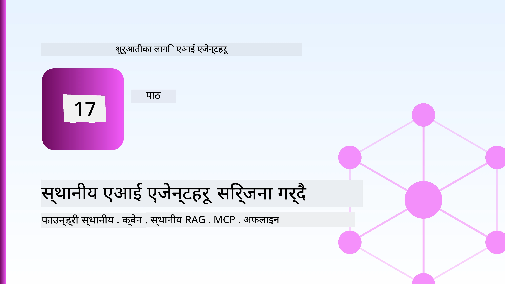
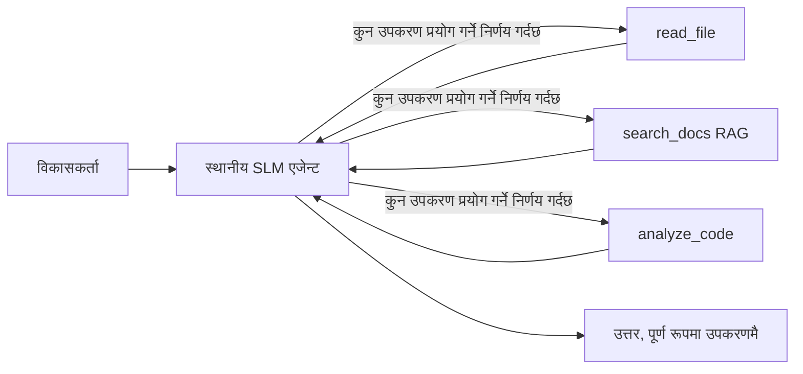
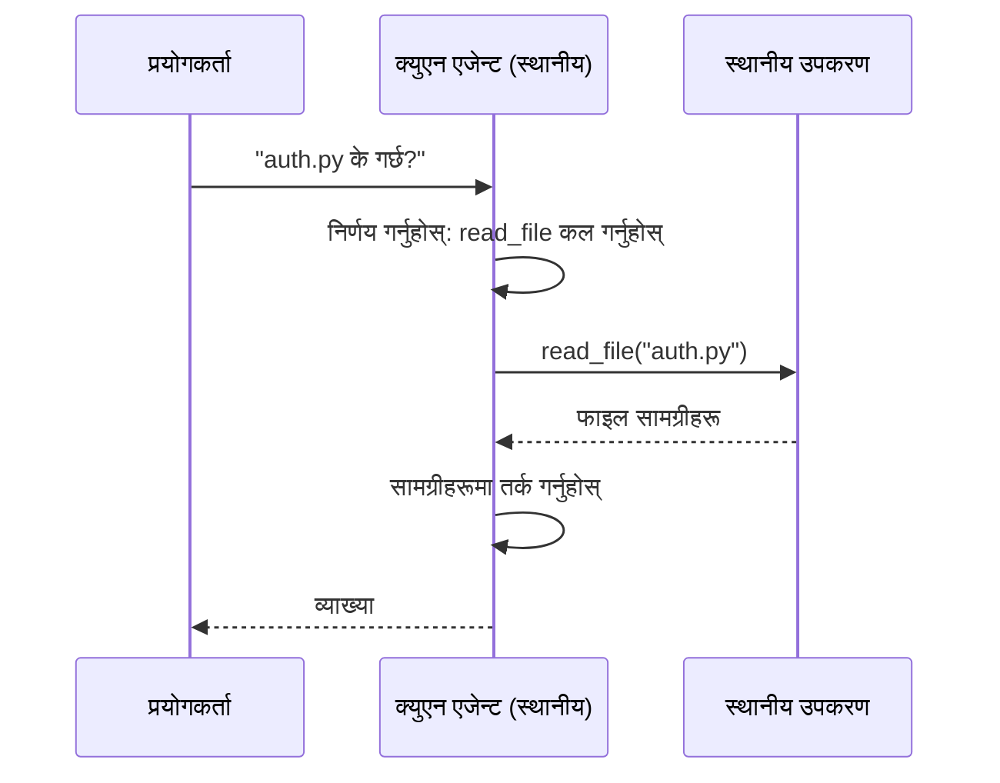
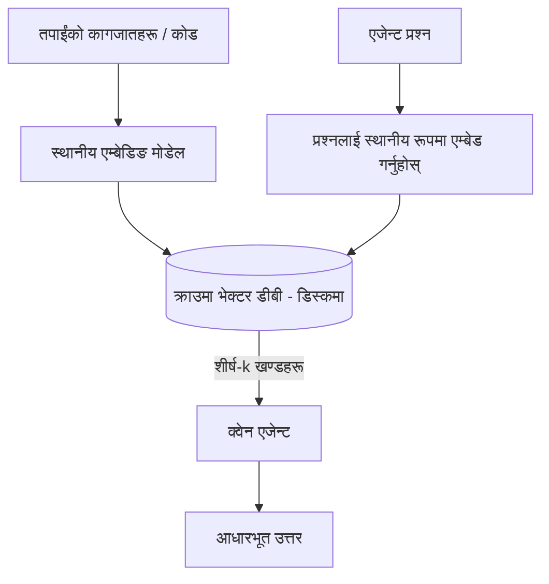
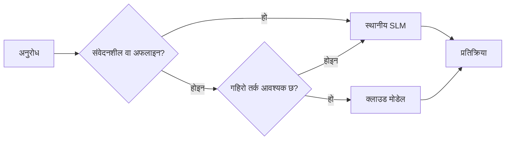

# Microsoft Foundry Local र Qwen प्रयोग गरी लोकल AI एजेन्टहरू सिर्जना गर्नुहोस्



अघिल्लो पाठले एजेन्टहरूलाई क्लाउडमा *ठूलो* बनायो । यो एकले तिनीहरूलाई एकल मेसिनमा *सानो* बनाउँछ । अन्त्यसम्म तपाईं सँग एउटा कार्यशील इन्जिनियरिङ सहायक हुनेछ जुन तर्क गर्छ, उपकरणहरू बोलाउँछ, तपाईंका फाइलहरू पढ्छ, र तपाईंको कागजातहरू खोज्छ — **एक पनि क्लाउड इन्फेरेन्स कल बिना।**

किन तपाईं यस्तो चाहनुहुन्छ? वास्तविक इन्जिनियरिङ कार्यमा नियमित रूपमा आउने तीन कारणहरू:

- **गोपनीयता।** कोड र कागजातहरू मेसिन छोड्दैनन्। कुनै संकेत, कुनै टुक्रा, कुनै ग्राहक डेटा नेटवर्क सीमाना नाघ्दैन।
- **लागत।** लोकल इन्फेरेन्समा प्रति-टोकन बिल हुँदैन। तपाईं विद्युतको मुल्यमा दिनभरि पुनरावृत्ति गर्न सक्नुहुन्छ।
- **अफलाइन।** विमानमा, सुरक्षित स्थानमा, वा आउटेजको समयमा पनि एजेन्ट काम गर्छ।

बाधा के हो भने तपाईं एक सीमित क्लाउड मोडेलको सट्टा तपाईंको CPU, GPU, वा NPU मा चल्ने **सानो भाषा मोडेल (SLM)** प्रयोग गर्दै हुनुहुन्छ। यो पाठ यस्तो एजेन्टहरू बनाउन बारे हो जुन त्यो सीमामा *राम्रो* हुन्छ, न कि त्यो सीमा छैन भनेर नाटक गर्ने।

## परिचय

यस पाठले समेट्छ:

- **सानो भाषा मोडेलहरू (SLMs)** — के हुन्, कहाँ राम्रो छन्, र कहाँ सुधार चाहिन्छ।
- **Microsoft Foundry Local** — एक रनटाइम जुन मोडेलहरू डिभाइसमा डाउनलोड गरी सेवा दिन्छ, **OpenAI-समर्थित API** बाट।
- **Qwen फङ्क्शन-कलिङ मोडेलहरू** — यस्ता SLM हरू जसले विश्वसनीय रूपमा उपकरण कलहरू उत्पादन गर्छन्, जुन लोकल *एजेन्ट* सम्भव बनाउँछ।
- **लोकल उपकरणहरू, लोकल RAG, र लोकल MCP** — क्लाउड बिना एजेन्टलाई क्षमता दिने।
- **हाइब्रिड ढाँचाहरू** — कहिले कुरा लोकल राख्ने र कहिले क्लाउड सम्पर्क गर्ने।

## सिकाइ उद्देश्यहरू

यस पाठ पूरा गरेपछि, तपाईं जान्ने हुनेछ:

- SLM को व्यापार-बन्दीहरू व्याख्या गर्ने र उपयुक्त लोकल-एजेन्ट प्रयोग केसहरू छनोट गर्ने।
- Foundry Local सँग Qwen मोडेललाई लोकल रूपमा सेवा दिने र OpenAI-समर्थित अन्त बिन्दुबाट जडान गर्ने।
- तपाईंको कार्यस्थलमा पूरै चल्ने उपकरण-कल गर्ने एजेन्ट बनाउने।
- लोकल भेक्टर डेटाबेस (Chroma) प्रयोग गरेर तपाईंका आफ्नै कागजातहरूमा लोकल RAG थप्ने।
- एजेन्टलाई लोकल MCP सर्भरमा जडान गर्ने र हाइब्रिड लोकल/क्लाउड डिजाइनहरूमा तर्क गर्ने।

## पूर्वापेक्षाहरू

यस पाठले अगाडिका पाठहरू पूरा गरेको र निम्नसँग सहज हुनु पर्नेछ:

- [उपकरण प्रयोग](../04-tool-use/README.md) (पाठ 4) र [एजेन्टिक RAG](../05-agentic-rag/README.md) (पाठ 5)।
- [एजेन्टिक प्रोटोकलहरू / MCP](../11-agentic-protocols/README.md) (पाठ 11)।
- [Microsoft एजेन्ट फ्रेमवर्क](../14-microsoft-agent-framework/README.md) (पाठ 14)।

तपाईंलाई यो पनि चाहिन्छ:

- एक विकासकर्ता कार्यस्थल। **8 GB RAM यथार्थपरक न्यूनतम हो**; 16 GB+ आरामदायी छ। GPU वा NPU सयोगी हुन्छ तर आवश्यक छैन।
- **Microsoft Foundry Local** स्थापना गरिएको (तल सेटअप खण्ड हेर्नुहोस्)।
- Python 3.12+ र भण्डारमा भएका प्याकेजहरू [`requirements.txt`](../../../requirements.txt), साथै यस पाठका लागि `foundry-local-sdk`, `openai`, र `chromadb`।

## सानो भाषा मोडेलहरू: लोकल कामका लागि सही उपकरण

एक अग्रगामी क्लाउड मोडेलमा सयौं अर्बहरू प्यारामिटर हुन्छन् र एउटा डाटासेन्टर हुन्छ। SLM मा केही अर्ब प्यारामिटर हुन्छन् र त्यो तपाईंको ल्यापटपको RAM मा फिट हुनुपर्छ। त्यो फरकले स्पष्ट अपेक्षा सेट गर्छ।

**SLM हरू राम्रो छन्:**

- संरचित, सीमित कार्यहरू — वर्गीकरण, निकासी, परिचित कागजातको सारांश।
- **उपकरण कल** — कुन फङ्क्शन कल गर्ने र के सँग गर्ने निर्णय।
- छिटो, सस्तो, निजी पुनरावृत्ति तपाईंको आफ्नै डाटामा।

**SLM हरू कमजोर छन्:**

- खुला-अन्त, ठूलो सन्दर्भमा बहु-कदम तर्क।
- व्यापक विश्व ज्ञान (उनीहरूले कम देखेका छन्, र बढी भुल्छन्)।

त्यसैले लोकल एजेन्टको विजयी रणनीति छ : **SLM लाई व्यवस्थापन गर्न दिनुहोस्, र उपकरणहरूलाई भारी काम गर्न दिनुहोस्।** मोडेलले तपाईंको कोडबेस *जान्न* आवश्यक छैन — यसले कहिले `read_file` र `search_docs` कल गर्ने वा नभएको थाहा पाउनु पर्छ। त्यो SLM को शक्तिमा सिधै खेल्छ।



## Microsoft Foundry Local

**Microsoft Foundry Local** एक हल्का रनटाइम हो जसले तपाईंको मेसिनमा पूर्णतया मोडेलहरू डाउनलोड, व्यवस्थापन र सेवा दिन्छ। यसको सबैभन्दा महत्वपूर्ण सुविधा हो कि यसले **OpenAI-समर्थित HTTP अन्त बिन्दु** खोल्छ — जसको अर्थ OpenAI SDK र Microsoft एजेन्ट फ्रेमवर्कको OpenAI क्लाइन्ट यसलाई `base_url` मात्र परिवर्तन गरी प्रयोग गर्न सक्छन्। एजेन्ट बनाउन सिकेका सबै कुरा सिधै सारिन्छन्; केवल अन्त बिन्दु क्लाउडबाट `localhost` मा जान्छ।

Foundry Local पनि तपाईंको हार्डवेयरका लागि मोडेलको सबैभन्दा राम्रो बिल्ड (CPU बिल्ड, CUDA/GPU बिल्ड, वा NPU बिल्ड) स्वचालित रूपमा चयन गर्छ — तपाईंले मेसिन अनुसार अनुकूलन गर्नुपर्दैन।

### सेटअप

Foundry Local स्थापना गर्नुहोस् (तपाईंको OS को लागि [डकुमेन्टेशन](https://learn.microsoft.com/azure/ai-foundry/foundry-local/) हेर्नुहोस्), त्यसपछि काम गर्छ कि छैन पुष्टि गर्नुहोस्:

```bash
# स्थापना गर्नुहोस् (उदाहरण; आफ्नो प्लेटफर्मका लागि कागजातहरू पालना गर्नुहोस्)
winget install Microsoft.FoundryLocal      # विन्डोज
# brew install microsoft/foundrylocal/foundrylocal   # macOS

# Qwen मोडेल डाउनलोड गरी चलाउनुहोस्, त्यसपछि स्थानीय सेवा सुरु गर्नुहोस्
foundry model run qwen2.5-7b-instruct
foundry service status
```

सेवा चलिरहेको छ भने तपाईंलाई लोकल, OpenAI-समर्थित अन्त बिन्दु छ (सामान्यतया `http://localhost:PORT/v1`)। नोटबुक `foundry-local-sdk` प्रयोग गरी अन्त बिन्दु स्वचालित रूपमा पत्ता लगाउँछ, त्यसैले पोर्ट हार्ड-कोड गर्न आवश्यक छैन।

## Qwen फङ्क्शन कलिङ: किन महत्त्वपूर्ण छ

एजेन्ट तब मात्र एजेन्ट हो जब यसले उपकरणहरू कल गर्न सक्छ। धेरै SLM हरू च्याट गर्न सक्छन् तर अविश्वसनीय, बिग्रिएका उपकरण कलहरू उत्पादन गर्छन्। **Qwen** मोडेलहरू फङ्क्शन कलिङको लागि तालिमप्राप्त छन् र राम्रो बनाइएको उपकरण कल संरचनाहरू नियमित रूपमा उत्पादन गर्छन् — जुन त्यही हो जसले लोकल च्याट मोडेललाई लोकल *एजेन्ट* बनाउँछ।

प्रवाह तपाईंले पहिले देखि जान्नु भएको सामान्य उपकरण-कल गर्ने लूप हो, मात्र डिभाइसमा चलिरहेको:



## लोकल RAG

कागजात खोजाइ त्यही हो जहाँ लोकल एजेन्टहरूले आफ्नो काम देखाउँछन्। SLM ले तपाईंको फ्रेमवर्कका कागजातहरू स्मरण गरेको आशा गर्ने सट्टा, तपाईं ती कागजातहरूलाई **लोकल भेक्टर डेटाबेस** मा एम्बेड गर्नुहुन्छ र एजेन्टलाई आवश्यक समयमा सम्बन्धित खण्डहरू फेला पार्न दिनुहुन्छ।

हामी **Chroma** प्रयोग गर्छौं, जुन एम्बेड गरिएको भेक्टर स्टोर हो र कुनै सर्भर व्यवस्थापन बिना प्रक्रियामै चल्छ। पाइपलाइन पूर्णतया लोकल छ: लोकल एम्बेडिङ मोडेल → लोकल भेक्टर → लोकल पुनरुद्घार → लोकल SLM।



यो सहि पाठ 5 को एजेन्टिक RAG ढाँचाझैं हो — मात्र फरक के हो भने सबै कम्पोनेन्टहरू तपाईंको मेसिनमा चलिरहेका छन्।

## लोकल MCP सर्भरहरू

[MCP](../11-agentic-protocols/README.md) एक ट्रान्सपोर्ट हो, क्लाउड सेवा होइन। एउटा MCP सर्भर `stdio` मा लोकल प्रक्रिया रूपमा चल्न सक्छ, एजेन्टलाई आफ्ना उपकरणहरू मानक प्रोटोकलमार्फत उपलब्ध गराउँदै। यसले विकास भइरहेका MCP सर्भरहरूको इकोसिस्टम पुन: प्रयोग गर्न अनुमति दिन्छ — फाइल सिस्टम पहुँच, git अपरेसनहरू, डेटाबेस क्वेरीहरू — पूर्ण रूपले अफलाइन।

सुरक्षा दृष्टिकोण क्लाउडबाट फरक छ, तर अनुपस्थित छैन: लोकल MCP सर्भर तपाईंको प्रयोगकर्ता अनुमतिहरूमा चल्छ, त्यसैले यसले के छुन सक्छ त्यसको दायरा निर्धारण गर्नुहोस् (जस्तै परियोजना डाइरेक्टरी, तपाईंको सम्पूर्ण होम फोल्डर होइन) र यसको आउटपुटहरूलाई इनपुटको रूपमा उपचार गरी मान्य गर्नुहोस्।

## हाइब्रिड क्लाउड र लोकल ढाँचाहरू

लोकल-प्रथम भनेको केवल लोकल मात्र होइन। परिपक्व प्रणालीहरूले संवेदनशीलता र कठिनाई अनुसार मार्ग निर्धारण गर्छन्:

| अवस्था | कहाँ चल्छ |
| --- | --- |
| संवेदनशील कोड / डेटा, वा अफलाइन | **लोकल SLM** |
| सरल, सीमित काम | **लोकल SLM** (सस्तो, छिटो) |
| गैर-संवेदनशील डाटामा कठिन बहु-कदम तर्क | **क्लाउड मोडेल** |
| सबै कुरा, आउटेजको समयमा | **लोकल SLM** (सौम्य गिरावट) |

यो पाठ 16 को **मोडेल राउटिङ** विचारसँग मेल खान्छ — तर एक "मोडेल" अब तपाईंको आफ्नै मेसिन हो। एक बलियो डिजाइनले क्लाउड उपलब्ध नभएमा लोकलमा फर्कन्छ, जसले एजेन्टको गुणस्तर घटाउँछ तर पूर्ण रुपमा विफल हुँदैन।



## हात-मा अभ्यास: लोकल इन्जिनियरिङ सहायक

खोल्नुहोस् [`code_samples/17-local-agent-foundry-local.ipynb`](./code_samples/17-local-agent-foundry-local.ipynb) र यसलाई पूरा गर्नुहोस्। तपाईं एउटा पूर्णतया तपाईंको कार्यस्थलमा चल्ने **लोकल इन्जिनियरिङ सहायक** बनाउनु हुनेछ जुन सक्छ:

1. **उपकरणहरू कल गर्ने** — Foundry Local मार्फत Qwen फङ्क्शन कलिङ प्रयोग गर्दै।
२. **लोकल फाइल अपरेसनहरू गर्ने** — परियोजना डाइरेक्टरीका फाइलहरू सूचीबद्ध र पढ्ने।
३. **कोड विश्लेषण गर्ने** — स्रोत फाइलमा आधारभूत मेट्रिक्स रिपोर्ट गर्ने।
४. **कागजात खोज्ने** — Chroma सँग कागजात फोल्डरमा लोकल RAG गर्ने।
५. **MCP प्रयोग गर्ने** — लोकल MCP सर्भरमा जडान गर्ने (यदि कुनै सेटअप छैन भने सौम्य रूपमा स्किप गर्ने)।

कुनै पनि बिन्दुमा क्लाउड इन्फेरेन्स प्रयोग हुँदैन।

### मार्गदर्शन

सहायक OpenAI-समर्थित अन्त बिन्दु मार्फत Foundry Local सँग जडान हुन्छ, त्यसैले एजेन्ट कोड लगभग क्लाउड पाठहरू जस्तै देखिन्छ — केवल क्लाइन्ट फरक छ:

```python
from foundry_local import FoundryLocalManager
from openai import OpenAI

# फाउन्ड्री लोकल मोडेल पत्ता लगाउँछ/डाउनलोड गर्दछ र हामीलाई स्थानीय अन्त बिन्दु दिन्छ।
manager = FoundryLocalManager(\"qwen2.5-7b-instruct\")
client = OpenAI(base_url=manager.endpoint, api_key=manager.api_key)  # api_key एक स्थानीय प्लेसहोल्डर हो
```

उपकरणहरू सामान्य Python फङ्क्शनहरू हुन् जुन परियोजना डाइरेक्टरीमा स्कोप छन्:

```python
def read_file(path: str) -> str:
    \"\"\"Read a file, but only inside the sandboxed project directory.\"\"\"
    full = (PROJECT_ROOT / path).resolve()
    if PROJECT_ROOT not in full.parents and full != PROJECT_ROOT:
        return \"Access denied: path is outside the project directory.\"
    return full.read_text(encoding=\"utf-8\")
```

स्यान्डबक्स जाँच ध्यान दिनुहोस् — यहाँसम्म कि लोकलमा पनि, यस्तो उपकरण जुन अनियमित पथ पढ्छ जोखिमपूर्ण हुन्छ। नोटबुकले प्रत्येक उपकरणलाई एक परियोजना रुटमा मात्र स्कोप गर्छ।

## ज्ञान जाँच

काम सुरु गर्नु अघि आफ्नो बुझाइ परीक्षण गर्नुहोस्।

**1. एजेन्टलाई लोकलमा चलाउनुको दुई स्पष्ट कारणहरू दिनुहोस् क्लाउडको सट्टा।**

<details>
<summary>उत्तर</summary>

कुनै दुई मध्ये: **गोपनीयता** (कोड र डाटा मेसिन छोड्दैन), **लागत** (प्रति-टोकन इन्फेरेन्स बिल छैन), र **अफलाइन क्षमता** (नेटवर्क बिना काम गर्छ — विमानमा, सुरक्षित ठाउँमा, वा आउटेजमा)। डाटाबाहिर पठाउन नदिने नियम/अनुशासनहरू गोपनीयताको कारणको मुख्य चालक हुन्।
</details>

**2. लोकल एजेन्टमा SLM र यसको उपकरणहरू बीच सिफारिस गरिएको काम विभाजन के हो, र किन?**

<details>
<summary>उत्तर</summary>

SLM लाई **व्यवस्थापन** (कुन उपकरण कल गर्ने र के सँग गर्ने निर्णय गर्ने) गर्न दिनुहोस् र **उपकरणहरूलाई भारी काम गर्ने** (फाइलहरू पढ्ने, कागजात खोज्ने, नतिजा गणना गर्ने) दिनुहोस्। SLM हरू उपकरण चयन जस्ता सीमित निर्णयमा बलियो तर व्यापक ज्ञान र लामो बहु-कदम तर्कमा कमzor हुन्छन्, त्यसैले उपकरणहरूमा भर पर्नु उनीहरूको शक्तिमा खेल्नु हो।
</details>

**3. Foundry Local सँग क्लाउड एजेन्ट कोड पुन: प्रयोग सम्भव बनाउन के हुन्छ?**

<details>
<summary>उत्तर</summary>

Foundry Local ले **OpenAI-समर्थित HTTP अन्त बिन्दु** खोल्छ। OpenAI SDK र एजेन्ट फ्रेमवर्कको OpenAI क्लाइंटले केवल `base_url` परिवर्तन गरी (र लोकल प्लेसहोल्डर API कुञ्जी प्रयोग गरी) यसलाई प्रयोग गर्छन्। एजेन्ट कोडको बाँकी सबैकुरा उस्तै रहन्छ।
</details>

**4. किन हामी कुनै SLM को सट्टा विशेष रूपमा Qwen फङ्क्शन-कलिङ मोडेल प्रयोग गर्छौं?**

<details>
<summary>उत्तर</summary>

किनकि एजेन्टले विश्वसनीय, राम्रो बनाइएको **उपकरण कलहरू** उत्पादन गर्नैपर्छ। धेरै SLM हरू च्याट गर्न सक्छन् तर बिग्रिएका वा असंगत उपकरण कल संरचनाहरू निकाल्छन्। Qwen मोडेलहरू फङ्क्शन कलिङको लागि तालिमप्राप्त छन् र नियमित उपकरण कल उत्पादन गर्छन्, जुन लोकल च्याट मोडेललाई कार्यशील लोकल एजेन्ट बनाउँछ।
</details>

**5. लोकल RAG पाइपलाइनमा कुन कम्पोनेन्टहरू मेसिनमा चल्छन्?**

<details>
<summary>उत्तर</summary>

सबै कम्पोनेन्टहरू: एम्बेडिङ मोडेल, भेक्टर डेटाबेस (Chroma, डिस्कमा), पुनरुद्घार चरण, र SLM। कागजातहरू लोकलमा एम्बेड गरिन्छ, लोकलमा स्टोर गरिन्छ, लोकलमा पुन:प्राप्त गरिन्छ, र लोकल मोडेलले तर्क गर्छ — कुनै पनि कम्पोनेन्ट क्लाउड छुन्दैन।
</details>

**6. लोकल MCP सर्भर तपाईंको मेसिनमा चल्छ। के यसले स्वचालित रूपमा सुरक्षित बनाउँछ? के सावधानी लिनु पर्ने हो?**

<details>
<summary>उत्तर</summary>

होइन। लोकल MCP सर्भर तपाईंको प्रयोगकर्ता अनुमतिहरूमा चल्छ, त्यसैले यो तपाईंले पहुँच गर्न सक्ने केही छुन सक्छ। यसलाई आवश्यकताको दायरामा सीमित गर्नुहोस् (जस्तै एक परियोजना डाइरेक्टरी, तपाईंको सम्पूर्ण होम फोल्डर होइन) र यसको आउटपुटहरूलाई मान्य गर्नु पर्ने इनपुटको रूपमा उपचार गर्नुहोस्।
</details>

**7. लोकल मोडेल समेट्ने उपयुक्त हाइब्रिड राउटिङ नियम वर्णन गर्नुहोस्।**

<details>
<summary>उत्तर</summary>

संवेदनशील वा अफलाइन अनुरोधहरूलाई लोकल SLM मा रुट गर्नुहोस्; सरल सीमित कार्यहरूलाई छिटो र सस्तोको लागि लोकल SLM मा रुट गर्नुहोस्; गैर-संवेदनशील डाटामा कठिन बहु-कदम तर्क क्लाउड मोडेलमा रुट गर्नुहोस्; र क्लाउड अनुपलब्ध भएमा लोकल SLM मा फर्केर एजेन्टलाई सौम्य रूपमा गुणस्तर घटाउन दिनुहोस् र पूर्ण असफल हुन नदिनुहोस्। यो पाठ 16 को मोडेल राउटिङ हो जहाँ लोकल मेसिन एउटा मोडेल हो।
</details>

**8. यस पाठमा लोकल एजेन्ट चलाउन यथार्थपरक न्यूनतम RAM कति हो, र बढी RAM ले के फाइदा दिन्छ?**

<details>
<summary>उत्तर</summary>

लगभग **8 GB** यथार्थपरक न्यूनतम हो; 16 GB+ आरामदायी छ। बढी RAM ले तपाईंलाई ठूलो र अधिक सक्षम मोडेलहरू चलाउन र सन्दर्भ बढी सम्झन मद्दत गर्छ। GPU वा NPU ले इन्फेरेन्स छिटो गर्छ तर आवश्यक छैन — Foundry Local ले कुनै एक्सेलेरेटर नहुँदा CPU बिल्ड चयन गर्छ।
</details>

## कार्य

लोकल इन्जिनियरिङ सहायकलाई तपाईंको रोजाइको सानो परियोजनाको लागि **लोकल कागजात समीक्षक** मा विस्तार गर्नुहोस् (यदि चाहनुभयो भने यस रिपोजिटोरीका पाठ फोल्डरहरू मध्ये एक प्रयोग गर्नुहोस्)।

तपाईंको सबमिशनले:

1. वास्तविक कागजात/कोड फोल्डरलाई Chroma मा इन्डेक्स गर्ने (कम्तिमा पाँच फाइलहरू)।
2. एउटा `find_todos` उपकरण थप्ने जसले परियोजनामा `TODO`/`FIXME` टिप्पणीहरू स्क्यान गर्छ र फाइल र पंक्ति नम्बर सहित फिर्ता दिन्छ — `read_file` जस्तै स्यान्डबक्स जाँच राख्दै।

3. **एजेन्टलाई तीन प्रश्नहरू सोध्नुहोस्** जसले उपकरणहरू संयोजन गर्न बाध्य पार्छ: एउटा शुद्ध RAG प्रश्न, एउटा विशेष फाइल पढ्नुपर्ने, र एउटा TODOहरू खोज्नुपर्ने।
4. **यसको मापन गर्नुहोस्**: ती तीनवटै प्रतिक्रियाहरूको समय मापन गरी markdown सेलमा नोट गर्नुहोस्। तपाईंको लक्षित वर्कफ्लोका लागि ढिलाइ स्वीकार्य छ कि छैन भनेर टिप्पणी गर्नुहोस्।

पछि छोटो अनुच्छेद लेख्नुहोस् कि **यस समीक्षकका लागि तपाईं के क्लाउडमा सार्नुहुनेछ र के स्थानीय रूपमा राख्नुहुनेछ**, र किन। तपाईंको मूल्याङ्कन स्थानीय घटकहरूले सही रूपमा जडित छन् कि छैनन् र तपाईंको हाइब्रिड तर्कसंगत छ कि छैनमा आधारित हुनेछ — मोडेल गुणस्तरमा होइन।

## सारांश

यस पाठमा तपाईंले पूर्ण रूपमा आफ्नै मेसिनमा चल्ने एउटा एजेन्ट निर्माण गर्नुभयो:

- **SLMs** ले गोपनीयता, लागत, र अफलाइन सञ्चालनका लागि फराकिलो पहुँचलाई व्यापार गर्छन् — र तब चम्किन्छन् जब तिनीहरू आफैं सबै ज्ञान बोकेको भन्दा **उपकरणहरू समन्वय** गर्छन्।
- **Foundry Local** ले मोडेलहरूलाई **OpenAI-संगत अन्तबिन्दुका पछाडि** डिभाइसमा सेवा दिन्छ, त्यसैले तपाईंको क्लाउड एजेन्ट कोड एक लाइन परिवर्तनले सार्न सकिन्छ।
- **Qwen function-calling models** ले भरपर्दो स्थानीय उपकरण कलिङ्ग सम्भव बनाउँछन् — र त्यसैले स्थानीय *एजेन्टहरू* सम्भव हुन्छन्।
- **Local RAG** (Chroma) र **local MCP** ले मेसिन छोड्नु नपर्ने क्षमता एजेन्टलाई दिन्छ।
- **Hybrid patterns** ले तपाईंलाई संवेदनशीलता र कठिनाइका आधारमा मार्गनिर्देशन गर्न दिन्छ, स्थानीयलाई सहज फलब्याकको रूपमा राख्दै।

यसले परिनियोजन चक्र पूरा गर्दछ: पाठ 16 मा एजेन्टहरू Microsoft Foundry मा स्केल गरियो, र यस पाठले तिनीहरूलाई एकल वर्कस्टेशनमा स्केल गर्‍यो। अर्को पाठले परिनियोजित एजेन्टहरूलाई सुरक्षित राख्ने कुरामा केन्द्रित गर्दछ।

## थप स्रोतहरू

- <a href="https://learn.microsoft.com/azure/ai-foundry/foundry-local/" target="_blank">Microsoft Foundry Local दस्तावेजीकरण</a>
- <a href="https://learn.microsoft.com/azure/ai-foundry/what-is-azure-ai-foundry" target="_blank">Microsoft Foundry दस्तावेजीकरण</a>
- <a href="https://aka.ms/ai-agents-beginners/agent-framework" target="_blank">Microsoft Agent Framework</a>
- <a href="https://qwen.readthedocs.io/en/latest/framework/function_call.html" target="_blank">Qwen function calling दस्तावेजीकरण</a>
- <a href="https://modelcontextprotocol.io/" target="_blank">Model Context Protocol (MCP)</a>
- <a href="https://docs.trychroma.com/" target="_blank">Chroma भेक्टर डाटाबेस</a>

## अघिल्लो पाठ

[Deploying Scalable Agents](../16-deploying-scalable-agents/README.md)

## अर्को पाठ

[Securing AI Agents](../18-securing-ai-agents/README.md)

---

<!-- CO-OP TRANSLATOR DISCLAIMER START -->
**अस्वीकरण**:
यो दस्तावेज़ AI अनुवाद सेवा [Co-op Translator](https://github.com/Azure/co-op-translator) प्रयोग गरेर अनुवाद गरिएको हो। हामी सही हुन प्रयास गर्छौं, तर कृपया जानकार हुनुस् कि स्वचालित अनुवादमा त्रुटिहरू वा अशुद्धताहरू हुन सक्छन्। मूल दस्तावेज़ यसको मूल भाषामा आधिकारिक स्रोत मानिनुपर्छ। महत्वपूर्ण जानकारीका लागि व्यावसायिक मानव अनुवाद सिफारिस गरिन्छ। यस अनुवादको प्रयोगबाट उत्पन्न कुनै पनि गलत बुझाइ वा त्रुटिको लागि हामी जिम्मेवार छैनौं।
<!-- CO-OP TRANSLATOR DISCLAIMER END -->