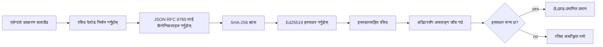
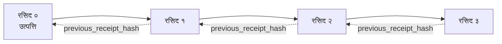

[पाठ भिडियो हेर्नुहोस्: क्रिप्टोग्राफिक रसिदहरूसँग AI एजेन्टहरू सुरक्षित गर्ने](https://youtu.be/PLACEHOLDER_VIDEO_ID)

> _(पाठ भिडियो र थम्बनेल माइक्रोसफ्ट कन्टेन्ट टोलीले मर्ज पछि थप्नेछ, पाठ १४ / १५ को ढाँचासँग मेल खान्छ।)_

# क्रिप्टोग्राफिक रसिदहरूसँग AI एजेन्टहरू सुरक्षित गर्ने

## परिचय

यो पाठले समेट्नेछ:

- AI एजेन्टहरूको लागि अडिट ट्रेल किन पालना, डिबगिङ, र विश्वासका लागि महत्वपूर्ण छ।
- क्रिप्टोग्राफिक रसिद के हो र यो अनसाइन गरिएको लग लाइनबाट कसरी फरक छ।
- एजेन्टको उपकरण कलको लागि सामान्य पाइथनमा कसरी साइन गरिएको रसिद उत्पादन गर्ने।
- कसरी रसिदलाई अफलाइन जाँच गर्ने र छेडछाड पत्ता लगाउने।
- कसरी रसिदहरूलाई श्रृंखला गर्ने जसले एउटा हटाउँदा वा पुन:क्रमबद्ध गर्दा श्रृंखलालाई तोड्छ।
- रसिदहरूले के प्रमाणित गर्छ र के प्रमाणित गर्दैन।

## सिक्ने लक्ष्यहरू

यो पाठ पूरा गरेपछि, तपाईं जान्नुहुनेछ:

- एजेन्टको क्रियाकलापहरूको क्रिप्टोग्राफिक स्त्रोतलाई प्रेरित गर्ने विफलता मोडहरूलाई चिन्हित गर्ने।
- एक Ed25519-ले साइन गरिएको रसिद क्यानोनिकल JSON पेलोडमा उत्पादन गर्ने।
- रसिदलाई स्वयम्भू रूपमा मात्र साँचिकर्ताको सार्वजनिक कुञ्जी प्रयोग गरेर जाँच गर्ने।
- संशोधित रसिदमा पुनः प्रमाणीकरण गरेर छेडछाड पत्ता लगाउने।
- रसिदहरूको ह्यास-श्रृंखलाबद्ध अनुक्रम बनाउने र श्रृंखलाले किन महत्व राख्छ बुझाउने।
- रसिदले के प्रमाणित गर्छ (आतिरिक्त, अखण्डता, आदेश) र के गर्दैन (कार्यको शुद्धता, नीतिको धारणशीलता) बीच सिमाना बुझ्ने।

## समस्या: तपाईंको एजेन्टको अडिट ट्रेल

कल्पना गर्नुहोस् तपाईंले Contoso Travel का लागि AI एजेन्ट तैनाथ गर्नुभएको छ। एजेन्ट ग्राहकका अनुरोधहरू पढ्छ, फ्लाइट API कल गरेर विकल्पहरू खोज्छ, र ग्राहकको तर्फबाट सिट बुक गर्छ। पछिल्लो तिमाहीमा, एजेन्टले ५०,००० बुकिङ प्रोसेस गर्यो।

आज एक अडिटर आउँछ। उनीले एक सरल प्रश्न सोध्छन्: "तपाईंको एजेन्टले के गर्यो देखाउनुहोस्।"

तपाईंले लग फाइलहरू बुझाउनुहुन्छ। अडिटरले हेर्छ र जटिल प्रश्न सोध्छ: "मलाई कसरी थाहा हुन्छ यी लगहरू सम्पादन गरिएको छैन?"

यो नै अडिट-ट्रेल समस्या हो। आजकाल धेरै एजेन्ट डिप्लोयमेन्टहरूले भरोसा गर्छन्:

- **एप्लिकेशन लगहरू**: एजेन्ट आफैले लेख्ने, फाइल-सिस्टम पहुँच भएकाहरुले सम्पादन गर्न सक्ने।
- **क्लाउड लगिङ सेवाहरू**: प्लेटफर्म स्तरमा छेडछाड-प्रत्यक्ष तर केवल यदि अडिटरले प्लेटफर्म सञ्चालनकर्तामा विश्वास गर्छ भने।
- **डाटाबेस ट्रान्जेक्शन लगहरू**: डाटाबेस परिवर्तनका लागि उपयुक्त तर जुनसुकै उपकरण कलका लागि होइन।

यी मध्ये कुनैले पनि अडिटरको प्रश्न जवाफ दिन सक्दैन बिना अडिटरले कसैमा विश्वास गर्नुपर्ने (तपाईं, तपाईंको क्लाउड प्रदायक, तपाईंको डाटाबेस विक्रेता)। आन्तरिक प्रयोगका लागि त्यो विश्वास स्वीकार्य हुन्छ। नियमन गरिएका कार्यभारहरूका लागि (वित्त, स्वास्थ्य सेवा, EU AI ऐन अन्तर्गत कुनै पनि), त्यो स्वीकार्य हुँदैन।

क्रिप्टोग्राफिक रसिदहरूले प्रत्येक एजेन्ट क्रियालाई स्वतन्त्र रूपमा प्रमाणित गर्नसक्ने बनाउनाले यो समस्या समाधान गर्छ। अडिटरले तपाईंलाई विश्वास गर्नु पर्दैन। उनीहरुलाई केवल तपाईंको सार्वजनिक कुञ्जी र रसिद आवश्यक छ।

## क्रिप्टोग्राफिक रसिद के हो?

रसिद भनेको एक JSON वस्तु हो जुन एजेन्टले के गर्यो भनेर रेकर्ड गर्छ, डिजिटल हस्ताक्षरले साइन गरिएको।



एक न्यूनतम रसिद यसरी देखिन्छ:

```json
{
  "type": "agent.tool_call.v1",
  "agent_id": "contoso-travel-bot",
  "tool_name": "lookup_flights",
  "tool_args_hash": "sha256:a3f9c1...",
  "result_hash": "sha256:7b2e1d...",
  "policy_id": "contoso-travel-policy-v3",
  "timestamp": "2026-04-25T14:30:00Z",
  "sequence": 47,
  "previous_receipt_hash": "sha256:9d4e6a...",
  "signature": {
    "alg": "EdDSA",
    "sig": "c5af83...",
    "public_key": "8f3b2c..."
  }
}
```

तीन गुणहरू काम गर्दैछन्:

1. **हस्ताक्षर**। रसिद एजेन्टको गेटवेले Ed25519 निजी कुञ्जी प्रयोग गरेर साइन गर्छ। सम्बन्धित सार्वजनिक कुञ्जी भएका कुनै पनि व्यत्तिले अफलाइनमा हस्ताक्षर प्रमाणित गर्न सक्छ। कुनै पनि फिल्डमा छेडछाडले हस्ताक्षर अमान्य बनाउँछ।

2. **क्यानोनिकल एनकोडिङ**। साइन गर्नुअघि रसिद JSON क्यानोनिकलाइजेशन स्कीम (JCS, RFC 8785) प्रयोग गरेर सिरीयलाइज गरिन्छ। यसले दुईवटा विभिन्न कार्यान्वयनहरूले समान तार्किक रसिदले पूर्ण रूपमा समान बाइट उत्पादन गर्छ भन्ने सुनिश्चित गर्छ। क्यानोनिकलाइजेशन बिना, फरक JSON सिरीयलाइजहरूले एउटै सामग्रीका लागि फरक हस्ताक्षर उत्पादन गर्थे।

3. **ह्यास श्रृंखला**। `previous_receipt_hash` फिल्डले प्रत्येक रसिदलाई अघिल्लो रसिदसँग जोड्छ। एउटा रसिदलाई हटाउनु वा पुनःक्रमबद्ध गर्दा पछिका सबै रसिदहरू भङ्ग हुन्छन्। छेडछाड श्रृंखला स्तरमै देखिन्छ यदि व्यक्तिगत हस्ताक्षरहरूलाई बेवास्ता गरिएको भए पनि।

यी गुणहरूले तीन सुनिश्चितता प्रदान गर्छन्:

- **आतिरिक्त**: यो कुञ्जीले यो सामग्री साइन गर्यो।
- **अखण्डता**: सामग्री साइनिंग पछि परिवर्तन भएको छैन।
- **आदेश**: यो रसिद श्रृंखलामा त्यो रसिद पछि आएको थियो।

## पाइथनमा रसिद उत्पादन गर्ने

रसिद उत्पादन गर्न विशेष पुस्तकालय आवश्यक छैन। क्रिप्टोग्राफिक प्राथमिकताहरू सजिलै उपलब्ध छन् र ल्योजिक केही दर्जन पाइथन लाइनमा छ।

`code_samples/18-signed-receipts.ipynb` मा कार्यात्मक अभ्यासहरूले सम्पूर्ण प्रक्रिया देखाउँछन्। संक्षिप्त संस्करण:

```python
import json
import hashlib
import base64
from nacl import signing
from jcs import canonicalize  # RFC 8785 कैनोनिकल JSON

def b64url_nopad(data: bytes) -> str:
    return base64.urlsafe_b64encode(data).decode("ascii").rstrip("=")

def sha256_canonical(obj) -> str:
    """SHA-256 of a Python object's JCS-canonical JSON form."""
    return f"sha256:{hashlib.sha256(canonicalize(obj)).hexdigest()}"

# एक साइनिङ की उत्पन्न गर्नुहोस् वा लोड गर्नुहोस् (उत्पादनमा, की भल्टमा भण्डारण गर्नुहोस्)
signing_key = signing.SigningKey.generate()
verify_key = signing_key.verify_key

# रसीद पेलोड बनाउनुहोस् (अहिलेसम्म कुनै हस्ताक्षर छैन)
tool_args = {"origin": "SYD", "destination": "LAX"}
tool_result = [{"flight": "QF11", "price": 1850, "stops": 0}]

payload = {
    "type": "agent.tool_call.v1",
    "agent_id": "contoso-travel-bot",
    "tool_name": "lookup_flights",
    "tool_args_hash": sha256_canonical(tool_args),
    "result_hash": sha256_canonical(tool_result),
    "policy_id": "contoso-travel-policy-v3",
    "timestamp": "2026-04-25T14:30:00Z",
    "sequence": 0,
    "previous_receipt_hash": None,
}

# कैनोनिकलाइज, ह्यास, हस्ताक्षर गर्नुहोस्।
canonical_bytes = canonicalize(payload)
message_hash = hashlib.sha256(canonical_bytes).digest()
signature_bytes = signing_key.sign(message_hash).signature

# एक संरचित हस्ताक्षर वस्तु संलग्न गर्नुहोस्।
receipt = {
    **payload,
    "signature": {
        "alg": "EdDSA",
        "sig": b64url_nopad(signature_bytes),
        "public_key": b64url_nopad(bytes(verify_key)),
    },
}
```

त्यो पूरै साइनिङ पाइपलाइन हो। नोटबुकका अभ्यासहरूले प्रत्येक चरण विस्तार गर्छ।

## रसिद पुष्टि गर्ने र छेडछाड पत्ता लगाउने

पुष्टि उल्टो प्रक्रिया हो:

```python
import base64
import hashlib
from nacl import signing
from nacl.exceptions import BadSignatureError
from jcs import canonicalize

def b64url_decode(s: str) -> bytes:
    padding = "=" * ((4 - len(s) % 4) % 4)
    return base64.urlsafe_b64decode(s + padding)

def verify_receipt(receipt: dict) -> bool:
    # हस्ताक्षर एक संरचित वस्तु हो: {"alg", "sig", "public_key"}।
    sig_obj = receipt.get("signature")
    if not sig_obj or sig_obj.get("alg") != "EdDSA":
        return False

    # त्यो पेलोड पुनर्निर्माण गर्नुहोस् जुन वास्तवमा हस्ताक्षर गरिएको थियो (हस्ताक्षर बाहेक सबै)।
    payload = {k: v for k, v in receipt.items() if k != "signature"}

    canonical_bytes = canonicalize(payload)
    message_hash = hashlib.sha256(canonical_bytes).digest()

    try:
        verify_key = signing.VerifyKey(b64url_decode(sig_obj["public_key"]))
        verify_key.verify(message_hash, b64url_decode(sig_obj["sig"]))
        return True
    except BadSignatureError:
        return False
```

यो फङ्सनले रसिद लिन्छ र हस्ताक्षर वैध भए `True` फर्काउँछ, नत्र `False`। कुनै नेटवर्क कल, कुनै सेवा निर्भरता, कुनै तेस्रो पक्षमा विश्वास आवश्यक छैन।

छेडछाड पत्ता लगाउने क्रियाप्रणाली देखाउन, नोटबुकले देखाउँछ:

1. वैध रसिद उत्पादन गरी पुष्टि हुन्छ भनी सुनिश्चित गर्ने।
2. `tool_args_hash` फिल्डको एक बाइट परिवर्तन गर्ने।
3. पुन: पुष्टि गर्दै असफल देखिने।

यो व्यवहारिक प्रदर्शन हो कि रसिदहरू छेडछाड-प्रत्यक्ष छन्: कुनै पनि सानो परिवर्तन, हस्ताक्षरलाई भत्काउँछ।

## बहु चरण एजेन्टहरूको लागि रसिद श्रृंखला बनाउने

एउटा साइन गरिएको रसिदले एउटा क्रिया सुरक्षित गर्छ। रसिदहरूको श्रृंखला एक अनुक्रम सुरक्षित गर्छ।



प्रत्येक रसिदले अघिल्लो रसिदको ह्यास रेकर्ड गर्छ। रसिद २ शान्त रुपमा हटाउन आक्रमणकारीले वा त:

- रसिद ३ को `previous_receipt_hash` फिल्ड परिवर्तन गर्ने (रसिद ३ को हस्ताक्षर तोडिन्छ), वा
- संशोधित रसिद ३ मा नयाँ हस्ताक्षर नक्कली बनाउने (एजेन्टको निजी कुञ्जी आवश्यक छ)।

यदि निजी कुञ्जी हार्डवेयर कुञ्जी भल्टमा छ र तपाईं प्रत्येक रसिदसँग सार्वजनिक कुञ्जी प्रकाशित गर्नुहुन्छ भने, दुवै आक्रमण पहिचान बिना सम्भव छैन।

नोटबुकले देखाउँछ:

1. तीन रसिदहरूको श्रृंखला बनाउने।
2. प्रत्येक रसिदको `previous_receipt_hash` वास्तविक अघिल्लो रसिदको ह्याससँग मेल खान्छ पुष्टि गर्ने।
3. मध्यको एक रसिदमा छेडछाड गरेर श्रृंखला त्यसै स्थानमा भत्काउने।

यसरी तपाईंले एउटा आडिट ट्रेल उत्पादन गर्नुहुन्छ जुन बाह्य अडिटरले तपाईंमा विश्वास नगरी पुष्टि गर्न सक्छ।

## रसिदहरूले के प्रमाणित गर्छ (र के गर्दैन)

यो पाठको सबैभन्दा महत्वपूर्ण खण्ड हो। रसिदहरू शक्तिशाली तर सीमित छन्।

**रसिदहरूले तीन कुरा प्रमाणित गर्छन्:**

१. **आतिरिक्त**: एक विशिष्ट कुञ्जीले विशिष्ट पेलोड साइन गर्यो।
२. **अखण्डता**: पेलोड साइनिंगपछि परिवर्तन भएको छैन।
३. **आदेश**: यो रसिद ह्यास श्रृंखलामा त्यो रसिद पछि आएको हो।

**रसिदहरूले प्रमाणित गर्दैनन्:**

१. **शुद्धता**: एजेन्टको कार्य सही थियो। रसिद अनुचित उत्तरका लागि विशुद्ध रूपमा साइन गर्न सकिन्छ सही उत्तरजस्तै।
२. **नीति पालन**: `policy_id` मा उल्लिखित नीतिलाई साँच्चै मूल्यांकन गरिएको थियो वा नीतिले यो कार्य अनुमति दिएको थियो कि थिएन। रसिदले के दावी गरियो देखाउँछ, के लागू गरियो होइन।
३. **कुञ्जी बाहेक पहिचान**: रसिद भन्छ "यो कुञ्जीले यो सामग्री साइन गर्यो।" भन्दैन "यस मान्छेले यसलाई अनुमोदन गर्यो।" कुञ्जीलाई व्यक्ति वा संस्थासँग जोड्न पृथक पहिचान पूर्वाधार आवश्यक छ (डिरेक्टरी, सार्वजनिक कुञ्जी रजिष्ट्रि आदि)।
४. **इनपुटहरू सत्यता**: यदि एजेन्ट जोखिमपूर्ण प्रचार प्राप्त गर्छ र त्यसमा काम गर्छ, रसिदले त्यहि कार्य निष्ठापूर्वक रेकर्ड गर्छ। रसिदहरू इनपुट मान्यता पछि आउँछन्, यसको विकल्प होइनन्।

यो सिमाना दुई कारणले महत्त्वपूर्ण छ:

- यसले तपाईंलाई बताउँछ कि रसिदहरू किन उपयोगी छन्: एजेन्टको व्यवहार अडिटेबल र छेडछाड-प्रत्यक्ष बनाउने, संगठनात्मक सिमानाहरू पार गरेर पनि।
- यसले बताउँछ तपाईंलाई अझ के डोहोर्याउन आवश्यक छ: इनपुट मान्यता (पाठ ६), नीति आवश्यकताको कार्यान्वयन (संक्षिप्त रूपमा तल), र पहिचान पूर्वाधार (यस पाठको दायरा बाहिर)।

एउटा सामान्य गलतफहमी हो "हामीसँग रसिदहरू छन्" भनेको "हामी शासित छौं" हुनु हो। हुँदैन। रसिद आधार हो। शासन तपाईंले माथि बनाउनु भएको प्रणाली हो।

## मानवले ठ्याक्कै कार्यलाई अनुमोदन गरेको प्रमाणित गर्ने

माथिको आइटम ३ एउटा छुट्टै खण्डका लागि ल्यायक छ: एक कार्य रसिद भन्छ "यो कुञ्जीले यो सामग्री साइन गर्यो," कहिल्यै भन्दैन "एक मान्छेले यसलाई अनुमोदन गर्यो।" उच्च जोखिमका कार्यहरू (फिर्ता, मेटिने, वायर ट्रान्सफरहरू) का लागि शासन संरचनाहरू बढ्दो रूपमा त्यो अभावित कथन आवश्यक छन्, जुन यस पाठमा पहिले नै निर्माण गरिएको समान तत्वहरूसँग उत्पादन गर्नसकिन्छ।

फलो-अप नोटबुक `code_samples/human-authorization-receipts.ipynb` ले दोस्रो रसिद प्रकार थप्दछ, `human.approval.v1`, पाठका रसिदहरूसँग उस्तै लिफाफा आकारमा (एक टाइप गरिएको पेलोड जुन Ed25519 ले क्यानोनिकल SHA-256 माथि साइन गरेको, `signature` वस्तु साइन गरिएका बाइट बाहिर) । एक नाम दिइएको अनुमोदकले **पूर्ण क्यानोनिकल क्रिया र यसको डाइजेस्टलाई** कार्यान्वयन अघि साइन गर्छ; एजेन्टको कार्य रसिदले **त्यहि कार्य डाइजेस्ट** र `parent_approval_ref`, अनुमोदनको `receipt_hash`, जुन माथि बनाएको श्रृंखलामा `previous_receipt_hash` जस्तै हो, बोक्छ। एक `verify_chain` ले दुवै वस्तुहरूलाई **विभिन्न पिन गरिएको कुञ्जी रजिष्ट्रिहरू** अन्तर्गत हिँडाउँछ (अनुमोदक कुञ्जीहरू विरुद्ध एजेन्ट कुञ्जीहरू), यसैले कोड पथ साझा हुन्छ तर अधिकारहरू कहिल्यै हुँदैनन्।

यसले खरीद गर्ने गुण, सावधानीपूर्वक व्याख्या गरिएको: *मान्छेले यस ठ्याक्कै कार्यलाई अनुमोदन गर्यो, र एजेन्टले उसी अनुमोदित कार्यलाई ठ्याक्कै कार्यान्वयन गर्यो।* नोटबुकका अस्वीकृत क्षेत्रहरू यस गुणलाई अडिग बनाउँछन्:

- क्लासिक सेट: छेडछाड, भ्रमित डिप्टी, पुनःप्रसारण, दुबै पक्षमा नक्कली कुञ्जीहरू, बिग्रिएको इनपुट;
- **पुरानो अधिकार**: हस्ताक्षर जुन अझै प्रमाणित हुन्छ, तर नीतिको संस्करण सरेको, अनुमोदक कुञ्जी पिन रजिष्ट्रिबाट हटाइएको, वा अनुमोदनको अवधि समाप्त भएको कारण अस्वीकृत;
- **डाइजेस्ट प्रतिस्थापन**: एक वैधसँग साइन गरिएको कार्य रसिद जुन *असली* अनुमोदनतर्फ इङ्गित गर्छ तर *भिन्न* क्यानोनिकल कार्य बाइन्ड गर्छ।

प्रत्येक विफलता फरक कारणले अस्वीकृत हुन्छ, त्यसैले अडिटरले पढ्दा थाहा हुन्छ अधिकार पुरानो भयो वा कार्य परिवर्तन। नोटबुकले सिकाउने नियम: एउटा साइन गरिएको अनुमोदन आफैलाई अधिकार होइन। अधिकार तब मात्र हुन्छ जब दुवै रसिदहरू कार्यान्वयन समयमा एउटै क्यानोनिकल कार्यमा बाँधिन्छन्। सह-हस्ताक्षर पथ उक्त इण्टरनेट-ड्राफ्टमा (`draft-farley-acta-signed-receipts`) मानक ट्र्याक ढाँचा हो।

## उत्पादन सन्दर्भहरू

यस पाठको पाइथन कोड जान्न सजिलो बनाउन जानिब जान्छ। उत्पादनमा, तपाईंका दुई विकल्पहरू छन्:

१. **सिधै क्रिप्टोग्राफिक प्राथमिकतामा निर्माण गर्ने।** माथि देखाइएका ५० लाइन धेरै प्रयोगका लागि पर्याप्त छन्। PyNaCl (Ed25519) र `jcs` प्याकेज (क्यानोनिकल JSON) राम्रोसँग मर्मत गरिएको र अडिट गरिएको पुस्तकालयहरू हुन्।

२. **एक उत्पादन रसिद पुस्तकालय प्रयोग गर्ने।** धेरै खुला स्रोत प्रोजेक्टहरूले उस्तै ढाँचामा अतिरिक्त सुविधाहरू (कुञ्जी रोटेसन, ब्याच पुष्टि, JWK सेट वितरण, नीति इन्जिनसँग एकीकरण) सहित कार्यान्वयन गर्छन्:
   - यस पाठमा प्रयोग गरिएको रसिद ढाँचा IETF इन्टरनेट-ड्राफ्ट ([`draft-farley-acta-signed-receipts`](https://datatracker.ietf.org/doc/draft-farley-acta-signed-receipts/), संशोधन ०२) मा छ जुन मानक प्रक्रियामा छ, साझा अनुरूपता प्याकेज ([agent-governance-testvectors](https://github.com/ScopeBlind/agent-governance-testvectors)) सहित जुन स्वतन्त्र कार्यान्वयनहरूले बाइट समान क्यानोनिकल आउटपुटको लागि क्रस-जाँच गर्छन्।
   - माइक्रोसफ्ट एजेन्ट गभर्नेन्स टुलकिटले रसिदहरूलाई सेडर-आधारित नीति निर्णयसँग संयोजन गर्छ; त्यो रिपोजिटरीमा ट्युटोरियल ३३ हेर्नुहोस् अन्त-बाट-अन्त उदाहरणका लागि।
   - `protect-mcp` (npm) र `@veritasacta/verify` (npm) प्याकेजहरूले नोड-आधारित रसिद हस्ताक्षर र अफलाइन प्रमाणीकरण कार्यान्वयन दिन्छन्, कुनै पनि MCP सर्भरलाई छेडछाड-प्रत्यक्ष अडिट ट्रेलसँग र्‍याप गर्नका लागि, एक होल्ड-फर-को-साइन फ्लो सहित जसमा एक रोकिएको क्रियाले कार्य डाइजेस्टसँग बाँधिएको अनुमोदन रसिद निकाल्छ (डेस्कटप फ्लोमा वेबअथन समर्थित), माथिका मानव-अधिकार नोटबुक जस्तै अनुमोदन रसिद ढाँचासँग।
   - **[nobulex](https://github.com/arian-gogani/nobulex)** पाइथन SDK (`pip install nobulex`) ले पाइथनमा त्यहि Ed25519 + JCS साइनिङ ढाँचालाई ल्याङ्केन र क्रूएआई एकीकरणसहित उपलब्ध गराउँछ, प्रकाशित क्रस-मान्यताको परीक्षण भेक्टर र एउटा अनुपालन म्यापिङ जुन [OWASP PR #2210](https://github.com/OWASP/CheatSheetSeries/pull/2210) बाट योगदान गरिएको हो।

आफ्नै बनाउन र पुस्तकालय प्रयोग गर्ने निर्णय JWT पुस्तकालय लेख्ने र परिक्षण गरिएको प्रयोग गर्ने निर्णयसँग मेल खान्छ: दुवै उचित; पुस्तकालयले समय बचत र अडिट सतह कम गर्छ; सुरु देखि कुरा गर्नाले प्रत्येक प्राथमिकता बुझ्न मद्दत गर्छ। यो पाठले सुरु देखि सिकाउँछ ताकि तपाईं दुवै विकल्पको आधार राख्न सक्नुहुन्छ।

## ज्ञान परीक्षण

अभ्यासमा जानुअघि आफ्नो बुझाइ परिक्षण गर्नुहोस्।

**१. रसिद एजेन्टको निजी Ed25519 कुञ्जीले साइन गरिएको छ। अडिटर संग केवल सार्वजनिक कुञ्जी छ। के अडिटर रसिदलाई अफलाइनमा प्रमाणित गर्न सक्छ?**

<details>
<summary>उत्तर</summary>

हो। Ed25519 प्रमाणीकरणका लागि मात्रै सार्वजनिक कुञ्जी र साइन गरिएको बाइटहरू आवश्यक हुन्छन्। कुनै नेटवर्क कल, कुनै सेवा निर्भरता छैन। यो गुणले रसिदलाई एयर-ग्याप गरिएको, बहु-संस्था, वा कम विश्वास अडिट वातावरणहरूमा उपयोगी बनाउँछ।
</details>

**२. आक्रमणकारीले रसिदको `policy_id` फिल्ड परिवर्तन गरी दाबी गर्छ कि यो बढी अनुमति दिने नीतिले शासित थियो। हस्ताक्षर मूल पेलोडमाथि गरिएको थियो। प्रमाणीकरण गर्दा के हुन्छ?**

<details>
<summary>उत्तर</summary>


प्रमाणीकरण असफल भयो। हस्ताक्षर मूल पेलोडको कानोनिकल बाइटहरूमा गणना गरिएको थियो; कुनै पनि फाँट परिवर्तन गर्दा कानोनिकल बाइटहरू बदलिन्छन्, जसले SHA-256 ह्यास परिवर्तन गर्छ, जसले हस्ताक्षर अमान्य बनाउँछ। आक्रमणकारीले नयाँ मान्य हस्ताक्षर उत्पादन गर्न निजी कुञ्जी चाहिन्छ, जुन उनीहरूसँग छैन।
</details>

**3. रसिदमा भनेको `tool_args_hash` र `result_hash` कच्चा आर्गुमेन्टहरू र परिणामभन्दा किन समावेश गरिएको छ?**

<details>
<summary>उत्तर</summary>

दुई कारण छन्। पहिलो, रसिदलाई यस्तो वातावरणमा संग्रह गर्न वा प्रसारित गर्न आवश्यक पर्न सक्छ जहाँ कच्चा सामग्री (PII, व्यापार डेटा) चुहावट हुनु समस्या हुन्छ। ह्यासिङले रसिदलाई सानो र सामग्रीलाई निजी राख्छ; अडिटरले ह्यासले वास्तविक सामग्रीको अलग भण्डारण गरिएको प्रतिलिपिसँग मेल खान्छ हेर्छ। दोस्रो, ह्यासहरूको निश्चित साइज हुन्छ; ह्यास सहितको रसिद इनपुट र आउटपुट कति ठूलो भए पनि आकार सीमित हुन्छ।
</details>

**4. `previous_receipt_hash` क्षेत्रले प्रत्येक रसिदलाई यसको अघिल्लो रसिदसँग जोड्छ। यदि आक्रमणकारीले श्रृंखलाको बीचबाट चुपचाप एक रसिद मेटाउँछ भने के के अमान्य हुन्छ?**

<details>
<summary>उत्तर</summary>

मेटाइएको रसिद पछि आएका सबै रसिदहरू अमान्य हुन्छन्। तिनीहरूको `previous_receipt_hash` क्षेत्रहरूले वास्तविक श्रृंखलासँग मेल खाँदैनन् (किनकि उनीहरूले सन्दर्भ गरेको रसिद अब छैन, वा श्रृंखला अब फरक पूर्ववर्तीतर्फ सङ्केत गर्दछ)। मेटाउने कार्य लुकाउन आक्रमणकारीले पछि आएका सबै रसिदहरू पुन: हस्ताक्षर गर्नुपर्ने हुन्छ, जसका लागि निजी कुञ्जी चाहिन्छ।
</details>

**5. रसिद सफा रूपमा प्रमाणित हुन्छ। के यसले एजेन्टको कार्य सही, ध्वनि, वा नीतिको अनुरूप भएको प्रमाणित गर्छ?**

<details>
<summary>उत्तर</summary>

होईन। मान्य रसिद तीन कुराहरू प्रमाणित गर्छ: नियुक्ति (यो कुञ्जीले यो सामग्रीमा हस्ताक्षर गर्‍यो), पूर्णता (सामग्री परिवर्तन भएको छैन), र क्रमबद्धता (यो रसिद त्यो रसिद पछि आएको हो)। यसले प्रमाणित गर्दैन कि कार्य सही थियो, `policy_id` मा नामित नीति वास्तवमै मूल्यांकन गरिएको थियो, वा एजेन्टले सबै नियम पालन गर्‍यो। रसिदले एजेन्टको व्यवहार अडिटयोग्य बनाउँछ, पक्कै पनि सही भने होइन। यो पाठको सबैभन्दा महत्वपूर्ण सिमा हो।
</details>

## अभ्यास

`code_samples/18-signed-receipts.ipynb` खोल्नुहोस् र सबै चार खण्डहरू पूरा गर्नुहोस्:

1. **खण्ड १**: तपाईंको पहिलो रसिदमा हस्ताक्षर गर्नुहोस् र प्रमाणीकरण गर्नुहोस्।
2. **खण्ड २**: रसिदमा फेरबदल गर्नुहोस् र प्रमाणीकरण असफल हुने देख्नुहोस्।
3. **खण्ड ३**: तीन रसिदको श्रृंखला बनाउनुहोस् र श्रृंखलाको पूर्णता प्रमाणीकरण गर्नुहोस्।
4. **खण्ड ४**: Microsoft Agent Frameworkसँग बनेको एजेन्टलाई प्रयोग गरी यन्त्र कललाई रसिद-हस्ताक्षरमा राखेर त्यसलाई स्वतन्त्र रूपमा प्रमाणीकरण गर्नुहोस्।

**विस्तृत चुनौती १:** रसिद स्किमामा तपाईंले रोजेको थप फिल्ड थप्नुहोस् (उदाहरणका लागि ट्रेसिङका लागि अनुरोध ID), कानोनिकल साइनिङ तर्क अपडेट गर्नुहोस्, र रसिद प्रमाणीकरण क्रममा अझै पनि साँचो हुन्छ कि छैन पुष्टि गर्नुहोस्। त्यसपछि हस्ताक्षर पछि फिल्ड परिवर्तन गर्नुहोस् र प्रमाणीकरण असफल हुन्छ भनेर पुष्टि गर्नुहोस्। यसले कानोनिकल इन्कोडिंगको प्रत्येक बाइटको भूमिका बुझ्न तपाईलाई बाध्य पार्छ।

**विस्तृत चुनौती २:** दुई रसिदहरूको SHA-256 ह्यास गरेर (तिनको कानोनिकल बाइटहरू निर्धारक क्रममा जोडेर) तेस्रो रसिदमा नयाँ फिल्डको रूपमा फर्कँने डाइजेस्ट समावेश गर्नुहोस् र यसलाई हस्ताक्षर गर्नुहोस्। तीनै रसिदहरूले अझै प्रमाणीकरण सफल हुन्छन् भनी प्रमाणीकरण गर्नुहोस्। तपाईंले एउटा चरण समावेशी प्रमाण बनाउनु भएको छ: तेस्रो रसिद राख्नेले पहिलो दुई रसिदहरू हस्ताक्षरको समयमा अवस्थित थिए भनेर प्रमाणित गर्न सक्छ, बिना तिनीहरूको सामग्री देखाए। यो नै त्यो नमूना हो जसले चयनात्मक-प्रकाशन रसिदहरूमा ठूला मात्रामा प्रयोग हुन्छ (Merkle प्रतिबद्धताहरू, RFC 6962)।

## निष्कर्ष

क्रिप्टोग्राफिक रसिदहरूले AI एजेन्टहरूलाई यस्तो अडिट ट्रेल दिन्छन् जसले:

- **स्वतन्त्र रूपमा प्रमाणित गर्न मिल्ने**: सार्वजनिक कुञ्जी राख्ने कुनै पनि पक्षले प्रमाणित गर्न सक्छ, कुनै सेवा निर्भरता छैन।
- **संशोधन स्पष्ट गर्ने**: कुनै पनि परिवर्तनले हस्ताक्षरलाई अमान्य बनाउँछ।
- **वाटाउन मिल्ने**: रसिद सानो JSON फाइल हो; यसलाई संग्रह गर्न, प्रसारित गर्न, र कहीं पनि प्रमाणित गर्न सकिन्छ।
- **मानक अनुरूप**: Ed25519 (RFC 8032), JCS (RFC 8785), र SHA-256 मा आधारित, सबै व्यापक रूपमा प्रयोग हुँदै आएका प्रिमिटिभहरू।

तिनीहरू इनपुट प्रमाणीकरण, नीति लागू गर्ने, वा परिचय पूर्वाधारको विकल्प होइनन्। तिनीहरू ती तहहरूको आधार हुन्। जब तपाईँ एजेन्टहरूलाई नियमन गरिएको कार्यभार, बहु-संस्थागत कार्यप्रवाह, वा यस्ता अवस्थाहरूमा तैनाथ गर्दै हुनुहुन्छ जहाँ भविष्यका अडिटरहरूले तपाईंलाई विश्वास गर्न सक्दैनन्, तब रसिदहरूले अडिट ट्रेललाई सच्चा बनाउँछन्।

सबैभन्दा महत्वपूर्ण कुरा: रसिदहरूले प्रमाणित गर्छन् कि कसले के भने र कहिले भने। तिनीहरूले प्रमाणित गर्दैनन् कि भनिएको कुरा सत्य वा सही थियो। त्यो भेदलाई कडाइका साथ समात्नुहोस्। यो ठीक स्रोत प्रणाली र भ्रामक प्रणाली बीचको फरक हो।

## उत्पादन जाँचसूची

तपाईँ जब यो पाठ छोडेर वास्तविक वातावरणमा रसिद-हस्ताक्षर एजेन्टहरू तैनाथ गर्न तयार हुनुहुन्छ:

- [ ] **साइनिङ कुञ्जी विकासकर्ता ल्यापटपबाट बाहिर लैजानुहोस्।** Azure Key Vault, AWS KMS, वा हार्डवेयर सुरक्षा मोड्युल प्रयोग गर्नुहोस्। तपाईँको रसिदहरूमा हस्ताक्षर गर्ने निजी कुञ्जी कहिल्यै सोर्स कन्ट्रोलमा वा एप्लिकेशन मेसिनमा पठनीय रूपमा बस्न हुँदैन।
- [ ] **प्रमाणीकरण सार्वजनिक कुञ्जी प्रकाशित गर्नुहोस्।** अडिटरहरूले अफ़लाइन प्रमाणीकरण गर्न यसलाई चाहिन्छ। सामान्य नमूना राम्रोसँग चिनिएको URL मा JWK Set हो (RFC 7517), जस्तै `https://your-org.example.com/.well-known/agent-keys.json`।
- [ ] **श्रृंखलालाई बाह्य रूपमा एंकर गर्नुहोस्।** समयमा समयमा ताजा श्रृंखला शीर्ष ह्यासलाई ट्रान्सपरेन्सी लगमा लेख्नुहोस् (Sigstore Rekor, RFC 3161 टाइमस्ट्याम्प प्राधिकरण, वा दोस्रो आन्तरिक प्रणाली) ताकि बाह्य पक्षले "यो श्रृंखला यो समयमा अवस्थित थियो" पुष्टि गर्न सकून्।
- [ ] **रसिदहरूलाई अपरिवर्तनीय रूपमा भण्डारण गर्नुहोस्।** जोड्ने मात्र बलब सम्म (Azure Storage सँग अपरिवर्तनीयता नीतिहरू, AWS S3 Object Lock)ले भण्डारण तहमा भित्री व्यक्तिले इतिहास फेरबदल गर्न रोक्छ।
- [ ] **रिटेन्सन निर्णय लिनुहोस्।** धेरै अनुपालन व्यवस्थाहरू बहुवर्षीय रिटेन्सन आवश्यक पर्छ। रसिद वृद्धिको योजना बनाउनुहोस् (प्रत्येक रसिद लगभग ५०० बाइट; प्रत्येक दिन १० हजार कल गर्ने एजेन्टले प्रतिवर्ष लगभग १.८ GB उत्पादन गर्छ)।
- [ ] **के रसिदले नसमेट्ने कुरा कागजात गर्नुहोस्।** रसिदहरूले नियुक्ति, पूर्णता, र क्रमबद्धता प्रमाणित गर्छन्। तपाईँको रनबुकले स्पस्ट रूपमा सूचीबद्ध गर्नुपर्छ कि के अतिरिक्त नियन्त्रणहरू (इनपुट प्रमाणीकरण, नीति लागू, दर सीमांकन, परिचय पूर्वाधार) तपाईँको शासन अवस्थासँग रसिदहरू सँगै छन्।

### AI एजेन्टहरू सुरक्षित गर्ने बारे थप प्रश्नहरू छन्?

[Microsoft Foundry Discord](https://aka.ms/ai-agents/discord) मा सहभागी हुनुहोस्, अन्य सिक्नेहरूसँग भेटघाट गर्नुहोस्, कार्यालय समयहरूमा भाग लिनुहोस्, र आफ्ना AI एजेन्टहरूका प्रश्नहरूको उत्तर पाउनुहोस्।

## यस पाठ भन्दा पर

यो पाठ एकल रसिद हस्ताक्षर र ह्यास-श्रृंखलाबद्ध अनुक्रम कभर गर्छ। त्यही प्रिमिटिभहरूले तपाईँको शासन अवस्था परिपक्व हुँदै गर्दा तपाईंले भेट्ने केही उन्नत ढाँचाहरूमा समावेश हुन्छन्:

- **चयनात्मक खुलासा।** जब रसिदका क्षेत्रहरू स्वतन्त्र रूपमा प्रतिबद्ध हुन्छन् (RFC 6962-शैली Merkle ट्री), तपाईँले विशेष क्षेत्रहरूलाई विशेष अडिटरहरूलाई देखाउन सक्नुहुन्छ र बाँकी परिवर्तन नभएको प्रमाणित गर्न सक्नुहुन्छ बिना तिनीहरूलाई खुलासा नगरी। प्रयोग हुने बेला जब सोही रसिदले व्याप्त अडिट (पूर्णताको माग गर्ने) र डेटा-घटाउने नियमहरू जस्तै GDPR (अडिटरले आवश्यक भन्दा कम मात्र देखोस्) दुबैलाई सन्तुष्ट पार्नु पर्छ।
- **रसिद रद्द गर्ने।** यदि साइनिङ कुञ्जी सुल्झिन्छ भने, त्यो कुञ्जीले हस्ताक्षर गरेको सबै रसिदहरूलाई एक निश्चित समयदेखि अविश्वसनीयका रूपमा चिन्ह लगाउन तरिका चाहिन्छ। सामान्य नमूना: छोटो अवधि साइनिङ कुञ्जीहरू र प्रकाशित रद्द सूची, वा रद्द प्रविष्टिहरू सहितको ट्रान्सपरेन्सी लग।
- **द्विपक्षीय / विभाजित-हस्ताक्षर रसिदहरू।** केही कार्यान्वयनहरूले हस्ताक्षर गरिएको पेलोडलाई पूर्व-कार्यान्वयन (`authorization_*`) र पश्च-कार्यान्वयन (`result_*`) आधा-आधामा विभाजन गर्छन्, स्वतन्त्र हस्ताक्षरसहित, प्रयोगि जब अनुमतिनिर्णय र अवलोकित परिणाम फरक अभिनेता वा फरक समयमा उत्पादन हुन्छ। यसले यस पाठमा सिकाएको रसिद ढाँचामा थप समावेशी हुन्छ।
- **पेलोड संरचना।** रसिदले तपाईंले `result_hash` मा राखेका बाइटहरू सिल गर्दछ। वास्तविक पेलोडहरू प्रायः एकल यन्त्र कल परिणामभन्दा धनी हुन्छन्: पूर्वनिर्णय तर्क (मोडेल भविष्यवाणी, विचार गरिएका विकल्पहरू, प्रमाण र यसको पूर्णता, जोखिम स्थिति, जवाफदेही श्रृंखला, गेट परिणाम) सबै पेलोडभित्र राख्न सकिन्छ, एकल रसिदले सील गर्छ। यसले रसिद ढाँचालाई न्यूनतम बनाएर डोमेन-द्वारा-डोमेन पेलोड स्किमाहरू विकास गर्न दिन्छ।
- **पारस्परिक-कार्यान्वयन अनुरूपता।** एउटै रसिद ढाँचाका धेरै स्वतन्त्र कार्यान्वयनहरू (Python, TypeScript, Rust, Go) साझा परीक्षण भेक्टरहरूमा पार-प्रमाणीकरण गर्छन्। यदि तपाईंले आफ्नै कार्यान्वयन बनाउनुभयो भने, प्रकाशित भेक्टरहरूसँग प्रमाणीकरण गर्दा वायर अनुकूलता सुनिश्चित हुन्छ।
- **पोस्ट-क्वान्टम माइग्रेशन।** Ed25519 आज व्यापक रूपमा प्रयोगमा छ तर क्वान्टम-प्रतिरोधी होइन। रसिद ढाँचा एल्गोरिदम-लचिलो छ: `signature.alg` क्षेत्रमा `ML-DSA-65` (NIST पोस्ट-क्वान्टम हस्ताक्षर मानक) राख्न सकिन्छ जब माइग्रेशन आवश्यक हुन्छ। द्विगुणित हस्ताक्षरको साथ माइग्रेशन अवधिको योजना बनाउनुहोस्।

## थप स्रोतहरू

- <a href="https://datatracker.ietf.org/doc/draft-farley-acta-signed-receipts/" target="_blank">IETF इन्टरनेट-ड्राफ्ट: मेसिन-टु-मेसिन पहुँच नियन्त्रणका लागि हस्ताक्षरित निर्णय रसिदहरू</a>
- <a href="https://learn.microsoft.com/azure/ai-studio/responsible-use-of-ai-overview" target="_blank">उत्तरदायी AI अवलोकन (Azure AI)</a>
- <a href="https://datatracker.ietf.org/doc/html/rfc8032" target="_blank">RFC 8032: एडवर्ड्स-कर्भ डिजिटल हस्ताक्षर एल्गोरिदम (EdDSA)</a>
- <a href="https://datatracker.ietf.org/doc/html/rfc8785" target="_blank">RFC 8785: JSON कानोनिकलाइजेशन स्किम (JCS)</a>
- <a href="https://datatracker.ietf.org/doc/html/rfc6962" target="_blank">RFC 6962: प्रमाणपत्र पारदर्शिता</a> (Merkle-ट्री संरचना चयनात्मक-प्रकाशन रसिदहरूद्वारा प्रयोग)
- <a href="https://github.com/microsoft/agent-governance-toolkit/blob/main/docs/tutorials/33-offline-verifiable-receipts.md" target="_blank">Microsoft Agent Governance Toolkit, ट्युटोरियल 33: अफलाइन-प्रमाणीकरण निर्णय रसिदहरू</a>
- <a href="https://github.com/ScopeBlind/agent-governance-testvectors" target="_blank">यो पाठमा प्रयोग गरिएको रसिद ढाँचाका लागि पारस्परिक-कार्यान्वयन अनुरूपता परीक्षण भेक्टरहरू (Apache-2.0)</a>
- <a href="https://pynacl.readthedocs.io/" target="_blank">PyNaCl कागजात (Python मा Ed25519)</a>

## अघिल्लो पाठ

[स्थानीय AI एजेन्टहरू सिर्जना गर्ने](../17-creating-local-ai-agents/README.md)

---

<!-- CO-OP TRANSLATOR DISCLAIMER START -->
**अस्वीकरण**:
यो दस्तावेज़ AI अनुवाद सेवा [Co-op Translator](https://github.com/Azure/co-op-translator) प्रयोग गरेर अनुवाद गरिएको हो। हामी सही हुन प्रयास गर्छौं, तर कृपया जानकार हुनुस् कि स्वचालित अनुवादमा त्रुटिहरू वा अशुद्धताहरू हुन सक्छन्। मूल दस्तावेज़ यसको मूल भाषामा आधिकारिक स्रोत मानिनुपर्छ। महत्वपूर्ण जानकारीका लागि व्यावसायिक मानव अनुवाद सिफारिस गरिन्छ। यस अनुवादको प्रयोगबाट उत्पन्न कुनै पनि गलत बुझाइ वा त्रुटिको लागि हामी जिम्मेवार छैनौं।
<!-- CO-OP TRANSLATOR DISCLAIMER END -->