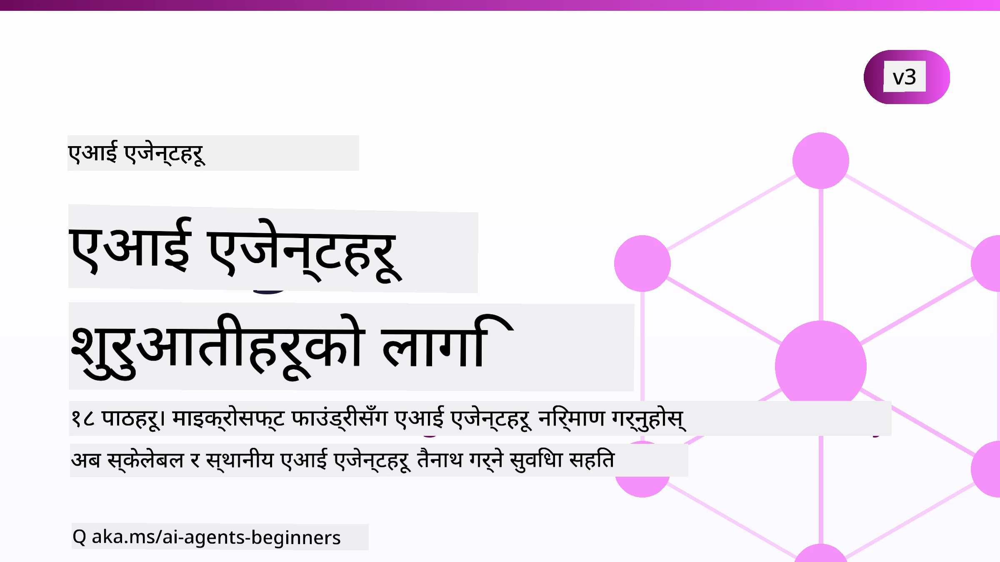

# सुरुवातीहरूका लागि एआई एजेन्टहरू - एक कोर्स



## एआई एजेन्टहरू निर्माण गर्न सुरु गर्न आवश्यक सबै कुरा सिकाउने कोर्स

[](https://github.com/microsoft/ai-agents-for-beginners/blob/master/LICENSE?WT.mc_id=academic-105485-koreyst)
[](https://GitHub.com/microsoft/ai-agents-for-beginners/graphs/contributors/?WT.mc_id=academic-105485-koreyst)
[](https://GitHub.com/microsoft/ai-agents-for-beginners/issues/?WT.mc_id=academic-105485-koreyst)
[](https://GitHub.com/microsoft/ai-agents-for-beginners/pulls/?WT.mc_id=academic-105485-koreyst)
[](http://makeapullrequest.com?WT.mc_id=academic-105485-koreyst)

### 🌐 बहुभाषिक समर्थन

#### GitHub Action मार्फत समर्थित (स्वचालित र सधैं अपडेट रहने)

<!-- CO-OP TRANSLATOR LANGUAGES TABLE START -->
[Arabic](../ar/README.md) | [Bengali](../bn/README.md) | [Bulgarian](../bg/README.md) | [Burmese (Myanmar)](../my/README.md) | [Chinese (Simplified)](../zh-CN/README.md) | [Chinese (Traditional, Hong Kong)](../zh-HK/README.md) | [Chinese (Traditional, Macau)](../zh-MO/README.md) | [Chinese (Traditional, Taiwan)](../zh-TW/README.md) | [Croatian](../hr/README.md) | [Czech](../cs/README.md) | [Danish](../da/README.md) | [Dutch](../nl/README.md) | [Estonian](../et/README.md) | [Finnish](../fi/README.md) | [French](../fr/README.md) | [German](../de/README.md) | [Greek](../el/README.md) | [Hebrew](../he/README.md) | [Hindi](../hi/README.md) | [Hungarian](../hu/README.md) | [Indonesian](../id/README.md) | [Italian](../it/README.md) | [Japanese](../ja/README.md) | [Kannada](../kn/README.md) | [Khmer](../km/README.md) | [Korean](../ko/README.md) | [Lithuanian](../lt/README.md) | [Malay](../ms/README.md) | [Malayalam](../ml/README.md) | [Marathi](../mr/README.md) | [Nepali](./README.md) | [Nigerian Pidgin](../pcm/README.md) | [Norwegian](../no/README.md) | [Persian (Farsi)](../fa/README.md) | [Polish](../pl/README.md) | [Portuguese (Brazil)](../pt-BR/README.md) | [Portuguese (Portugal)](../pt-PT/README.md) | [Punjabi (Gurmukhi)](../pa/README.md) | [Romanian](../ro/README.md) | [Russian](../ru/README.md) | [Serbian (Cyrillic)](../sr/README.md) | [Slovak](../sk/README.md) | [Slovenian](../sl/README.md) | [Spanish](../es/README.md) | [Swahili](../sw/README.md) | [Swedish](../sv/README.md) | [Tagalog (Filipino)](../tl/README.md) | [Tamil](../ta/README.md) | [Telugu](../te/README.md) | [Thai](../th/README.md) | [Turkish](../tr/README.md) | [Ukrainian](../uk/README.md) | [Urdu](../ur/README.md) | [Vietnamese](../vi/README.md)

> **स्थानीय रूपमा क्लोन गर्न प्राथमिकता दिनुहुन्छ?**
>
> यस रिपोजिटरीमा ५०+ भाषा अनुवादहरू समावेश छन् जसले डाउनलोड आकार उल्लेखनीय रूपमा बढाउँछ। अनुवादहरू बिना क्लोन गर्न, sparse checkout प्रयोग गर्नुहोस्:
>
> **Bash / macOS / Linux:**
> ```bash
> git clone --filter=blob:none --sparse https://github.com/microsoft/ai-agents-for-beginners.git
> cd ai-agents-for-beginners
> git sparse-checkout set --no-cone '/*' '!translations' '!translated_images'
> ```
>
> **CMD (Windows):**
> ```cmd
> git clone --filter=blob:none --sparse https://github.com/microsoft/ai-agents-for-beginners.git
> cd ai-agents-for-beginners
> git sparse-checkout set --no-cone "/*" "!translations" "!translated_images"
> ```
>
> यसले तपाईलाई कोर्स पूरा गर्न आवश्यक सबै कुरा धेरै छिटो डाउनलोडको साथ दिन्छ।
<!-- CO-OP TRANSLATOR LANGUAGES TABLE END -->

**यदि तपाईलाई थप अनुवाद भाषाहरू समर्थन चाहिन्छ भने, तिनीहरू [यहाँ](https://github.com/Azure/co-op-translator/blob/main/getting_started/supported-languages.md) सूचीबद्ध छन्।**

[](https://GitHub.com/microsoft/ai-agents-for-beginners/watchers/?WT.mc_id=academic-105485-koreyst)
[](https://GitHub.com/microsoft/ai-agents-for-beginners/network/?WT.mc_id=academic-105485-koreyst)
[](https://GitHub.com/microsoft/ai-agents-for-beginners/stargazers/?WT.mc_id=academic-105485-koreyst)

[](https://discord.com/invite/ATgtXmAS5D)


## 🌱 सुरुवात गर्दै

यस कोर्समा एआई एजेन्टहरू निर्माण गर्ने आधारभूत कुरा समेटिएका पाठहरू छन्। प्रत्येक पाठले आफ्नै विषय समेट्छ त्यसैले तपाईं जहाँ पनि सुरु गर्न सक्नुहुन्छ!

यस कोर्सका लागि बहुभाषिक समर्थन छ। हाम्रो [उपलब्ध भाषाहरू यहाँ](#-multi-language-support) हेर्नुहोस्। 

यदि यो तपाईंको पहिलो पटक जेनरेटिभ एआई मोडेलहरूसँग निर्माण गर्न हो भने, हाम्रो [सुरुवातीहरूका लागि जेनरेटिभ एआई](https://aka.ms/genai-beginners) कोर्स हेर्नुहोस्, जसमा जेनएआईसँग निर्माण गर्ने २१ पाठहरू समावेश छन्।

यो रिपोमा [स्टार (🌟) दिनुहोस्](https://docs.github.com/en/get-started/exploring-projects-on-github/saving-repositories-with-stars?WT.mc_id=academic-105485-koreyst) र [फर्क गर्नुहोस्](https://github.com/microsoft/ai-agents-for-beginners/fork) ताकि तपाईं कोड चलाउन सक्नुहुनेछ।

### अन्य सिक्नेहरूलाई भेट्नुहोस्, प्रश्नहरूको उत्तर पाउनुहोस्

यदि तपाईं अड्किनुभयो वा एआई एजेन्टहरू निर्माण सम्बन्धी कुनै प्रश्न छ भने, हाम्रो समर्पित डिस्कोर्ड च्यानलमा सामेल हुनुहोस्: [Microsoft Foundry Discord](https://aka.ms/ai-agents/discord)।

### तपाईंलाई के चाहिन्छ

यस कोर्सका प्रत्येक पाठमा कोड उदाहरणहरू छन्, जुन code_samples फोल्डरमा फेला पार्न सकिन्छ। तपाईं आफ्नो प्रतिलिपि बनाउन [यो रिपो फोर्क](https://github.com/microsoft/ai-agents-for-beginners/fork) गर्न सक्नुहुन्छ।  

यी अभ्यासहरूमा कोड उदाहरणहरूले Microsoft Agent Framework सँग Microsoft Foundry Agent Service V2 प्रयोग गर्छन्:

- [Microsoft Foundry](https://aka.ms/ai-agents-beginners/ai-foundry) - Azure खाता आवश्यक

यस कोर्समा Microsoft का निम्न AI Agent फ्रेमवर्क र सेवाहरू प्रयोग हुन्छन्:

- [Microsoft Agent Framework (MAF)](https://aka.ms/ai-agents-beginners/agent-framework)
- [Microsoft Foundry Agent Service V2](https://aka.ms/ai-agents-beginners/ai-agent-service)

केही कोड नमूनाहरू वैकल्पिक OpenAI-संग अनुकूल प्रदायकहरू जस्तै [MiniMax](https://platform.minimaxi.com/) पनि समर्थन गर्छन्, जसले ठूलो सन्दर्भ मोडेलहरू (सम्म २०४K टोकन) प्रदान गर्छ। कन्फिगरेसन विवरणका लागि [कोर्स सेटअप](./00-course-setup/README.md) हेर्नुहोस्।

यस कोर्सको कोड चलाउने बारे थप जानकारीका लागि, [कोर्स सेटअप](./00-course-setup/README.md) मा जानुहोस्।

## 🙏 सहयोग गर्न चाहनुहुन्छ?

के तपाईं सिफारिशहरू दिन चाहनुहुन्छ वा वर्तनी वा कोड त्रुटिहरू फेला पार्नुभएको छ? [मुद्दा खोल्नुहोस्](https://github.com/microsoft/ai-agents-for-beginners/issues?WT.mc_id=academic-105485-koreyst) वा [पुल रिक्वेस्ट सिर्जना गर्नुहोस्](https://github.com/microsoft/ai-agents-for-beginners/pulls?WT.mc_id=academic-105485-koreyst)


## 📂 प्रत्येक पाठमा समावेश छन्

- README मा लेखिएको पाठ र एक छोटो भिडियो
- Microsoft Agent Framework सँग Microsoft Foundry प्रयोग गरी Python कोड नमूनाहरू
- सिकाइ जारी राख्न अतिरिक्त स्रोतहरूको लिंकहरू


## 🗃️ पाठहरू

| **पाठ**                                   | **पाठ र कोड**                                    | **भिडियो**                                                  | **अतिरिक्त सिकाइ**                                                                     |
|----------------------------------------------|----------------------------------------------------|------------------------------------------------------------|----------------------------------------------------------------------------------------|
| एआई एजेन्टहरू र एजेन्ट प्रयोगका केसहरू परिचय       | [लिंक](./01-intro-to-ai-agents/README.md)          | [भिडियो](https://youtu.be/3zgm60bXmQk?si=z8QygFvYQv-9WtO1)  | [लिंक](https://aka.ms/ai-agents-beginners/collection?WT.mc_id=academic-105485-koreyst) |
| एआई एजेन्टिक फ्रेमवर्कहरू अन्वेषण               | [लिंक](./02-explore-agentic-frameworks/README.md)  | [भिडियो](https://youtu.be/ODwF-EZo_O8?si=Vawth4hzVaHv-u0H)  | [लिंक](https://aka.ms/ai-agents-beginners/collection?WT.mc_id=academic-105485-koreyst) |
| AI एजेन्टिक डिजाइन ढाँचाहरू बुझ्न           | [लिंक](./03-agentic-design-patterns/README.md)     | [भिडियो](https://youtu.be/m9lM8qqoOEA?si=BIzHwzstTPL8o9GF)  | [लिंक](https://aka.ms/ai-agents-beginners/collection?WT.mc_id=academic-105485-koreyst) |
| टूल प्रयोग डिजाइन ढाँचा                      | [लिंक](./04-tool-use/README.md)                    | [भिडियो](https://youtu.be/vieRiPRx-gI?si=2z6O2Xu2cu_Jz46N)  | [लिंक](https://aka.ms/ai-agents-beginners/collection?WT.mc_id=academic-105485-koreyst) |
| एजेन्टिक RAG                                  | [लिंक](./05-agentic-rag/README.md)                 | [भिडियो](https://youtu.be/WcjAARvdL7I?si=gKPWsQpKiIlDH9A3)  | [लिंक](https://aka.ms/ai-agents-beginners/collection?WT.mc_id=academic-105485-koreyst) |
| भरोसायोग्य AI एजेन्टहरू बनाउदै               | [लिंक](./06-building-trustworthy-agents/README.md) | [भिडियो](https://youtu.be/iZKkMEGBCUQ?si=jZjpiMnGFOE9L8OK ) | [लिंक](https://aka.ms/ai-agents-beginners/collection?WT.mc_id=academic-105485-koreyst) |
| योजना बनाउने डिजाइन ढाँचा                      | [लिंक](./07-planning-design/README.md)             | [भिडियो](https://youtu.be/kPfJ2BrBCMY?si=6SC_iv_E5-mzucnC)  | [लिंक](https://aka.ms/ai-agents-beginners/collection?WT.mc_id=academic-105485-koreyst) |
| बहु-एजेन्ट डिजाइन ढाँचा                        | [लिंक](./08-multi-agent/README.md)                 | [भिडियो](https://youtu.be/V6HpE9hZEx0?si=rMgDhEu7wXo2uo6g)  | [लिंक](https://aka.ms/ai-agents-beginners/collection?WT.mc_id=academic-105485-koreyst) |

| Metacognition Design Pattern                 | [Link](./09-metacognition/README.md)               | [Video](https://youtu.be/His9R6gw6Ec?si=8gck6vvdSNCt6OcF)  | [Link](https://aka.ms/ai-agents-beginners/collection?WT.mc_id=academic-105485-koreyst) |
| AI Agents in Production                      | [Link](./10-ai-agents-production/README.md)        | [Video](https://youtu.be/l4TP6IyJxmQ?si=31dnhexRo6yLRJDl)  | [Link](https://aka.ms/ai-agents-beginners/collection?WT.mc_id=academic-105485-koreyst) |
| Using Agentic Protocols (MCP, A2A and NLWeb) | [Link](./11-agentic-protocols/README.md)           | [Video](https://youtu.be/X-Dh9R3Opn8)                                 | [Link](https://aka.ms/ai-agents-beginners/collection?WT.mc_id=academic-105485-koreyst) |
| Context Engineering for AI Agents            | [Link](./12-context-engineering/README.md)         | [Video](https://youtu.be/F5zqRV7gEag)                                 | [Link](https://aka.ms/ai-agents-beginners/collection?WT.mc_id=academic-105485-koreyst) |
| Managing Agentic Memory                      | [Link](./13-agent-memory/README.md)     |      [Video](https://youtu.be/QrYbHesIxpw?si=vZkVwKrQ4ieCcIPx)                                                      |                                                                                        |
| Exploring Microsoft Agent Framework                         | [Link](./14-microsoft-agent-framework/README.md)                            |                                                            |                                                                                        |
| Building Computer Use Agents (CUA)           | [Link](./15-browser-use/README.md)     |                                                            | [Link](https://docs.browser-use.com/examples/templates/playwright-integration)         |
| Deploying Scalable Agents                    | [Link](./16-deploying-scalable-agents/README.md) |                                                    | [Link](https://learn.microsoft.com/azure/ai-foundry/agents/overview)                   |
| Creating Local AI Agents                     | [Link](./17-creating-local-ai-agents/README.md)  |                                                    | [Link](https://learn.microsoft.com/azure/ai-foundry/foundry-local/)                    |
| Securing AI Agents                           | [Link](./18-securing-ai-agents/README.md)  |                                                            | [Link](https://aka.ms/ai-agents-beginners/collection?WT.mc_id=academic-105485-koreyst) |

## 🎒 अन्य कोर्सहरू

हाम्रो टोलीले अन्य कोर्सहरू उत्पादन गर्दछ! हेर्नुहोस्:

<!-- CO-OP TRANSLATOR OTHER COURSES START -->
### LangChain
[](https://aka.ms/langchain4j-for-beginners)
[](https://aka.ms/langchainjs-for-beginners?WT.mc_id=m365-94501-dwahlin)
[](https://github.com/microsoft/langchain-for-beginners?WT.mc_id=m365-94501-dwahlin)
---

### Azure / Edge / MCP / एजेन्टहरू
[](https://github.com/microsoft/AZD-for-beginners?WT.mc_id=academic-105485-koreyst)
[](https://github.com/microsoft/edgeai-for-beginners?WT.mc_id=academic-105485-koreyst)
[](https://github.com/microsoft/mcp-for-beginners?WT.mc_id=academic-105485-koreyst)
[](https://github.com/microsoft/ai-agents-for-beginners?WT.mc_id=academic-105485-koreyst)

---
 
### जनरेटिभ AI सिरिज
[](https://github.com/microsoft/generative-ai-for-beginners?WT.mc_id=academic-105485-koreyst)
[-9333EA?style=for-the-badge&labelColor=E5E7EB&color=9333EA)](https://github.com/microsoft/Generative-AI-for-beginners-dotnet?WT.mc_id=academic-105485-koreyst)
[-C084FC?style=for-the-badge&labelColor=E5E7EB&color=C084FC)](https://github.com/microsoft/generative-ai-for-beginners-java?WT.mc_id=academic-105485-koreyst)
[-E879F9?style=for-the-badge&labelColor=E5E7EB&color=E879F9)](https://github.com/microsoft/generative-ai-with-javascript?WT.mc_id=academic-105485-koreyst)

---
 
### मुख्य अध्ययन
[](https://aka.ms/ml-beginners?WT.mc_id=academic-105485-koreyst)
[](https://aka.ms/datascience-beginners?WT.mc_id=academic-105485-koreyst)
[](https://aka.ms/ai-beginners?WT.mc_id=academic-105485-koreyst)
[](https://github.com/microsoft/Security-101?WT.mc_id=academic-96948-sayoung)
[](https://aka.ms/webdev-beginners?WT.mc_id=academic-105485-koreyst)
[](https://aka.ms/iot-beginners?WT.mc_id=academic-105485-koreyst)
[](https://github.com/microsoft/xr-development-for-beginners?WT.mc_id=academic-105485-koreyst)

---
 
### Copilot सिरिज
[](https://aka.ms/GitHubCopilotAI?WT.mc_id=academic-105485-koreyst)
[](https://github.com/microsoft/mastering-github-copilot-for-dotnet-csharp-developers?WT.mc_id=academic-105485-koreyst)
[](https://github.com/microsoft/CopilotAdventures?WT.mc_id=academic-105485-koreyst)
<!-- CO-OP TRANSLATOR OTHER COURSES END -->

## 🌟 समुदायलाई धन्यवाद

Agentic RAG देखाउने महत्वपूर्ण कोड नमूनाहरू योगदान गर्नुभएकोमा [Shivam Goyal](https://www.linkedin.com/in/shivam2003/) लाई धन्यवाद।

## योगदान

यस परियोजनाले योगदानहरू र सुझावहरूलाई स्वागत गर्दछ।  प्रायः योगदानहरूको लागि तपाईंले एक
Contributor License Agreement (CLA) मा सहमति जनाउनु आवश्यक छ जसले तपाईंलाई अधिकार छ र वास्तवमै हामीलाई
तपाईंको योगदान प्रयोग गर्ने अधिकार दिनुहुन्छ भन्ने कुरा घोषणा गर्दछ। विवरणका लागि, <https://cla.opensource.microsoft.com> मा जानुहोस्।

जब तपाईं पुल अनुरोध पठाउनुहुन्छ, एक CLA बोटले स्वचालित रूपमा निर्धारण गर्नेछ कि तपाईंलाई
CLA आवश्यक छ वा छैन र PRलाई उपयुक्त रूपमा चिन्हित गर्नेछ (जस्तै, स्थिति जाँच, टिप्पणी)।
बोटद्वारा प्रदान गरिएका निर्देशनहरू पालना गर्नुहोस्। तपाईंलाई हाम्रो CLA प्रयोग गर्ने सबै रेपोहरूमा यो एक पटक मात्र गर्नु पर्नेछ।

यस परियोजनाले [Microsoft Open Source Code of Conduct](https://opensource.microsoft.com/codeofconduct/) लाई अंगिकार गरेको छ।
थप जानकारीको लागि [Code of Conduct FAQ](https://opensource.microsoft.com/codeofconduct/faq/) हेर्नुहोस् वा
थप प्रश्न वा टिप्पणीका लागि [opencode@microsoft.com](mailto:opencode@microsoft.com) मा सम्पर्क गर्नुहोस्।

## ट्रेडमार्कहरू

यस परियोजनामा परियोजना, उत्पादन, वा सेवाहरूका लागि ट्रेडमार्क वा लोगो हुन सक्छ। Microsoft
ट्रेडमार्क वा लोगोहरूको अधिकृत प्रयोग,
[Microsoft को ट्रेडमार्क र ब्राण्ड दिशानिर्देशहरू](https://www.microsoft.com/legal/intellectualproperty/trademarks/usage/general) अनुसार हुनुपर्छ।
Microsoft ट्रेडमार्क वा लोगोहरूको यस परियोजनाको संशोधित संस्करणहरूमा प्रयोगले भ्रम सृजना गर्नु हुँदैन वा Microsoft को प्रायोजन संकेत गर्नु हुँदैन।
तेस्रो पक्ष ट्रेडमार्क वा लोगोको कुनै पनि प्रयोग ती तेस्रो पक्षहरूका नीतिहरूको अधीनमा हुन्छ।

## सहायता लिनुहोस्


यदि तपाईं अड्किनुभयो वा AI अनुप्रयोग निर्माण गर्न कुनै प्रश्न छ भने, सामेल हुनुहोस्:

[](https://aka.ms/foundry/discord)

यदि तपाईंलाई उत्पादन प्रतिक्रिया वा निर्माण गर्दा त्रुटिहरू छन् भने यहाँ जानुहोस्:

[](https://aka.ms/foundry/forum)

---

<!-- CO-OP TRANSLATOR DISCLAIMER START -->
**अस्वीकरण**:
यो दस्तावेज़ AI अनुवाद सेवा [Co-op Translator](https://github.com/Azure/co-op-translator) प्रयोग गरेर अनुवाद गरिएको हो। हामी सही हुन प्रयास गर्छौं, तर कृपया जानकार हुनुस् कि स्वचालित अनुवादमा त्रुटिहरू वा अशुद्धताहरू हुन सक्छन्। मूल दस्तावेज़ यसको मूल भाषामा आधिकारिक स्रोत मानिनुपर्छ। महत्वपूर्ण जानकारीका लागि व्यावसायिक मानव अनुवाद सिफारिस गरिन्छ। यस अनुवादको प्रयोगबाट उत्पन्न कुनै पनि गलत बुझाइ वा त्रुटिको लागि हामी जिम्मेवार छैनौं।
<!-- CO-OP TRANSLATOR DISCLAIMER END -->