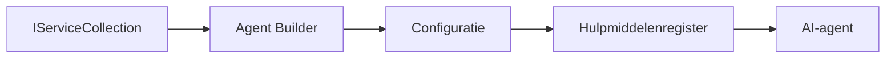

# 🎨 Agentgeoriënteerde Ontwerppatronen met Azure OpenAI (Responses API) (.NET)

## 📋 Leerdoelen

Dit voorbeeld demonstreert bedrijfsklare ontwerppatronen voor het bouwen van intelligente agents met behulp van het Microsoft Agent Framework in .NET met Azure OpenAI (Responses API) integratie. Je leert professionele patronen en architecturale benaderingen die agents productieklaar, onderhoudbaar en schaalbaar maken.

### Bedrijfsklare Ontwerppatronen

- 🏭 **Factory Pattern**: Gestandaardiseerde agentcreatie met dependency injection
- 🔧 **Builder Pattern**: Vloeiende agentconfiguratie en -opzet
- 🧵 **Thread-Safe Patronen**: Gelijktijdig gesprekbeheer
- 📋 **Repository Pattern**: Georganiseerd beheer van tools en mogelijkheden

## 🎯 .NET-specifieke Architectuurvoordelen

### Bedrijfsfeatures

- **Sterke Typing**: Compile-tijd validatie en IntelliSense-ondersteuning
- **Dependency Injection**: Ingebouwde DI-containeraanpak
- **Configuratiebeheer**: IConfiguration- en Options-patronen
- **Async/Await**: Asynchrone programmeerondersteuning als eersteklas

### Productieklare Patronen

- **Logging Integratie**: ILogger en gestructureerde loggingondersteuning
- **Health Checks**: Ingebouwde monitoring en diagnostiek
- **Configuratievalidatie**: Sterke typing met data-annotaties
- **Foutafhandeling**: Gestructureerde uitzonderingbeheer

## 🔧 Technische Architectuur

### Kern .NET-componenten

- **Microsoft.Extensions.AI**: Geünificeerde AI service-abstraheringen
- **Microsoft.Agents.AI**: Enterprise agent orchestratie framework
- **Azure OpenAI (Responses API)**: Hoge-prestatie API client patronen
- **Configuratiesysteem**: appsettings.json en omgeving integratie

### Implementatie van Ontwerppatronen



## 🏗️ Gedemonstreerde Enterprise Patronen

### 1. **Creational Patronen**

- **Agent Factory**: Gecentraliseerde agentcreatie met consistente configuratie
- **Builder Pattern**: Vloeiende API voor complexe agentconfiguratie
- **Singleton Pattern**: Gedeelde resources en configuratiebeheer
- **Dependency Injection**: Losse koppeling en testbaarheid

### 2. **Gedragsmatige Patronen**

- **Strategy Pattern**: Verwisselbare tool-executiestrategieën
- **Command Pattern**: Ingesloten agentoperaties met undo/redo
- **Observer Pattern**: Gebeurtenisgestuurd lifecyclebeheer van agents
- **Template Method**: Gestandaardiseerde agentuitvoeringsworkflows

### 3. **Structurele Patronen**

- **Adapter Pattern**: Azure OpenAI (Responses API) integratielaag
- **Decorator Pattern**: Agent-mogelijkheid verbeteringen
- **Facade Pattern**: Vereenvoudigde agent-interactie interfaces
- **Proxy Pattern**: Lazy loading en caching voor prestatieoptimalisatie

## 📚 .NET Ontwerpprincipes

### SOLID-Principes

- **Single Responsibility**: Elk component heeft één duidelijke verantwoordelijkheidsgebied
- **Open/Closed**: Uitbreidbaar zonder aanpassing
- **Liskov Substitutie**: Interface-gebaseerde toolimplementaties
- **Interface Segregatie**: Gefocuste, coherente interfaces
- **Dependency Inversion**: Afhankelijk van abstracties, niet van concreetheden

### Clean Architecture

- **Domain Laag**: Kern agent- en toolabstraheringen
- **Applicatielaag**: Agent orchestratie en workflows
- **Infrastructuur Laag**: Azure OpenAI (Responses API) integratie en externe services
- **Presentatielaag**: Gebruikersinteractie en responsopmaak

## 🔒 Enterprise Overwegingen

### Beveiliging

- **Credential Management**: Veilige API-sleutelverwerking met IConfiguration
- **Invoervalidatie**: Sterke typing en data-annotatievalidatie
- **Output Sanitization**: Veilige verwerking en filtering van antwoorden
- **Audit Logging**: Uitgebreide operatie-tracking

### Prestatie

- **Async Patronen**: Niet-blokkerende I/O-operaties
- **Connection Pooling**: Efficiënt beheer van HTTP-clients
- **Caching**: Response caching voor betere prestaties
- **Resourcebeheer**: Correct afhandelen en schoonmaaktechnieken

### Schaalbaarheid

- **Thread Veilighied**: Gelijktijdige agentuitvoering ondersteuning
- **Resource Pooling**: Efficiënt gebruik van middelen
- **Load Management**: Rate limiting en backpressure afhandeling
- **Monitoring**: Prestatiestatistieken en health checks

## 🚀 Productiedistributie

- **Configuratiebeheer**: Omgeving-specifieke instellingen
- **Logging Strategie**: Gestructureerde logging met correlatie-ID's
- **Foutafhandeling**: Globale uitzonderingafhandeling met juiste herstelmethodes
- **Monitoring**: Application insights en prestatiecounters
- **Testen**: Unit tests, integratietests en load testing patronen

Klaar om bedrijfsklare intelligente agents te bouwen met .NET? Laten we iets robuusts ontwerpen! 🏢✨

## 🚀 Aan de slag

### Vereisten

- [.NET 10 SDK](https://dotnet.microsoft.com/download/dotnet/10.0) of hoger
- Een [Azure-abonnement](https://azure.microsoft.com/free/) met een Azure OpenAI resource en een modeldeploy
- De [Azure CLI](https://learn.microsoft.com/cli/azure/install-azure-cli) — aanmelden met `az login`

### Vereiste Omgevingsvariabelen

```bash
# zsh/bash
export AZURE_OPENAI_ENDPOINT=https://<your-resource>.openai.azure.com
export AZURE_OPENAI_DEPLOYMENT=gpt-5-mini
# Meld je dan aan zodat AzureCliCredential een token kan krijgen
az login
```

```powershell
# PowerShell
$env:AZURE_OPENAI_ENDPOINT = "https://<your-resource>.openai.azure.com"
$env:AZURE_OPENAI_DEPLOYMENT = "gpt-5-mini"
# Meld u vervolgens aan zodat AzureCliCredential een token kan ophalen
az login
```

### Voorbeeldcode

Om de code te draaien,

```bash
# zsh/bash
chmod +x ./03-dotnet-agent-framework.cs
./03-dotnet-agent-framework.cs
```

Of met de dotnet CLI:

```bash
dotnet run ./03-dotnet-agent-framework.cs
```

Zie [`03-dotnet-agent-framework.cs`](../../../../03-agentic-design-patterns/code_samples/03-dotnet-agent-framework.cs) voor de volledige code.

```csharp
#!/usr/bin/dotnet run

#:package Microsoft.Extensions.AI@10.*
#:package Microsoft.Agents.AI.OpenAI@1.*-*
#:package Azure.AI.OpenAI@2.1.0
#:package Azure.Identity@1.13.1

using System.ComponentModel;

using Microsoft.Agents.AI;
using Microsoft.Extensions.AI;

using Azure.AI.OpenAI;
using Azure.Identity;

// Tool Function: Random Destination Generator
// This static method will be available to the agent as a callable tool
// The [Description] attribute helps the AI understand when to use this function
// This demonstrates how to create custom tools for AI agents
[Description("Provides a random vacation destination.")]
static string GetRandomDestination()
{
    // List of popular vacation destinations around the world
    // The agent will randomly select from these options
    var destinations = new List<string>
    {
        "Paris, France",
        "Tokyo, Japan",
        "New York City, USA",
        "Sydney, Australia",
        "Rome, Italy",
        "Barcelona, Spain",
        "Cape Town, South Africa",
        "Rio de Janeiro, Brazil",
        "Bangkok, Thailand",
        "Vancouver, Canada"
    };

    // Generate random index and return selected destination
    // Uses System.Random for simple random selection
    var random = new Random();
    int index = random.Next(destinations.Count);
    return destinations[index];
}

// Azure OpenAI with the Responses API (stable v1 endpoint). Sign in with `az login`.
var azureEndpoint = Environment.GetEnvironmentVariable("AZURE_OPENAI_ENDPOINT")
    ?? throw new InvalidOperationException("AZURE_OPENAI_ENDPOINT is not set.");
var deployment = Environment.GetEnvironmentVariable("AZURE_OPENAI_DEPLOYMENT") ?? "gpt-5-mini";

var azureClient = new AzureOpenAIClient(new Uri(azureEndpoint), new AzureCliCredential());

// Define Agent Identity and Comprehensive Instructions
// Agent name for identification and logging purposes
var AGENT_NAME = "TravelAgent";

// Detailed instructions that define the agent's personality, capabilities, and behavior
// This system prompt shapes how the agent responds and interacts with users
var AGENT_INSTRUCTIONS = """
You are a helpful AI Agent that can help plan vacations for customers.

Important: When users specify a destination, always plan for that location. Only suggest random destinations when the user hasn't specified a preference.

When the conversation begins, introduce yourself with this message:
"Hello! I'm your TravelAgent assistant. I can help plan vacations and suggest interesting destinations for you. Here are some things you can ask me:
1. Plan a day trip to a specific location
2. Suggest a random vacation destination
3. Find destinations with specific features (beaches, mountains, historical sites, etc.)
4. Plan an alternative trip if you don't like my first suggestion

What kind of trip would you like me to help you plan today?"

Always prioritize user preferences. If they mention a specific destination like "Bali" or "Paris," focus your planning on that location rather than suggesting alternatives.
""";

// Create AI Agent with Advanced Travel Planning Capabilities
// Get the Responses client for the deployment and create the AI agent
// Configure agent with name, detailed instructions, and available tools
// This demonstrates the .NET agent creation pattern with full configuration
AIAgent agent = azureClient
    .GetChatClient(deployment)
    .AsAIAgent(
        name: AGENT_NAME,
        instructions: AGENT_INSTRUCTIONS,
        tools: [AIFunctionFactory.Create(GetRandomDestination)]
    );

// Create New Conversation Session for Context Management
// Initialize a new conversation session to maintain context across multiple interactions
// Sessions enable the agent to remember previous exchanges and maintain conversational state
// This is essential for multi-turn conversations and contextual understanding
var session = await agent.CreateSessionAsync();

// Execute Agent: First Travel Planning Request
// Run the agent with an initial request that will likely trigger the random destination tool
// The agent will analyze the request, use the GetRandomDestination tool, and create an itinerary
// Using the session parameter maintains conversation context for subsequent interactions
await foreach (var update in agent.RunStreamingAsync("Plan me a day trip", session))
{
    await Task.Delay(10);
    Console.Write(update);
}

Console.WriteLine();

// Execute Agent: Follow-up Request with Context Awareness
// Demonstrate contextual conversation by referencing the previous response
// The agent remembers the previous destination suggestion and will provide an alternative
// This showcases the power of conversation sessions and contextual understanding in .NET agents
await foreach (var update in agent.RunStreamingAsync("I don't like that destination. Plan me another vacation.", session))
{
    await Task.Delay(10);
    Console.Write(update);
}
```

---

<!-- CO-OP TRANSLATOR DISCLAIMER START -->
**Disclaimer**:
Dit document is vertaald met behulp van de AI vertaaldienst [Co-op Translator](https://github.com/Azure/co-op-translator). Hoewel we streven naar nauwkeurigheid, dient u er rekening mee te houden dat geautomatiseerde vertalingen fouten of onnauwkeurigheden kunnen bevatten. Het originele document in de oorspronkelijke taal moet worden beschouwd als de gezaghebbende bron. Voor kritieke informatie wordt professionele menselijke vertaling aanbevolen. Wij zijn niet aansprakelijk voor eventuele misverstanden of verkeerde interpretaties die voortvloeien uit het gebruik van deze vertaling.
<!-- CO-OP TRANSLATOR DISCLAIMER END -->