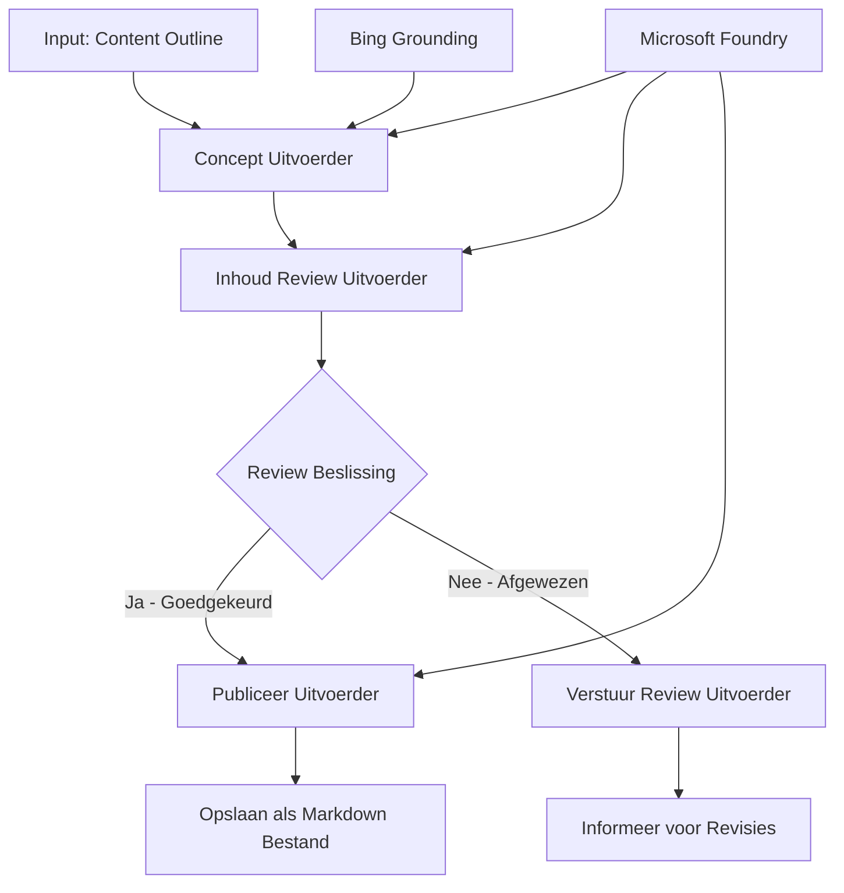

# 🔀 Voorwaardelijke Agent Workflows met Microsoft Foundry (.NET)

## 📋 Tutorial voor Intelligente Besluitgevingsworkflows

Deze notebook toont **voorwaardelijke workflowpatronen** met Microsoft Foundry en het Microsoft Agent Framework voor .NET. Je leert hoe je geavanceerde, op beslissingen gebaseerde workflows bouwt die intelligent de verwerking routeren op basis van AI-analyse, bedrijfsregels en dynamische voorwaarden voor enterprise-grade automatisering.

## 🎯 Leerdoelen

### 🧠 **Intelligente Besluitvormingsarchitectuur**
- **Implementatie van Voorwaardelijke Logica**: Bouw complexe beslisbomen met meerdere vertakkingspunten
- **AI-Aangedreven Routering**: Gebruik Microsoft Foundry-modellen voor intelligente routeringsbeslissingen
- **Dynamische Workflow Aanpassing**: Pas het workflowgedrag aan op basis van runtime-analyse en voorwaarden
- **Integratie van Bedrijfsregels**: Verwerk bedrijfslogica en compliance-eisen in workflows

### 🔀 **Geavanceerde Voorwaardelijke Patronen**
- **Multi-criteria Besluitvorming**: Evalueer meerdere factoren voor routeringsbeslissingen
- **Contextbewuste Verwerking**: Neem beslissingen op basis van verzamelde workflowcontext en geschiedenis
- **Adaptieve Workflowwijziging**: Pas verwerkingspaden dynamisch aan op basis van realtime voorwaarden
- **Integratie van Regelsystemen**: Implementeer geavanceerde bedrijfsregelsystemen binnen workflows

### 🏢 **Voorwaardelijke Enterprise Toepassingen**
- **Documentclassificatie & Routering**: Classificeer en routeer documenten automatisch naar de juiste workflows
- **Klantenservice Triage**: Intelligente routering van klantvragen naar gespecialiseerde afhandelingsgroepen
- **Compliance- & Risicobehandeling**: Pas verschillende validatie- en beoordelingsprocessen toe op basis van risicobeoordeling
- **Workflows voor Kwaliteitsborging**: Routeer content via geschikte beoordelingsprocessen op basis van kwaliteitsstatistieken

## ⚙️ Vereisten & Setup

### 📦 **Vereiste NuGet-pakketten**

Geavanceerde pakketten voor voorwaardelijke workflowverwerking:

```xml
<!-- Core AI Framework -->
<PackageReference Include="Microsoft.Extensions.AI" Version="9.9.0" />

<!-- Azure AI Agents with Persistent State -->
<PackageReference Include="Azure.AI.Agents.Persistent" Version="1.2.0-beta.5" />

<!-- Azure Identity and Utilities -->
<PackageReference Include="Azure.Identity" Version="1.15.0" />
<PackageReference Include="System.Linq.Async" Version="6.0.3" />
<PackageReference Include="DotNetEnv" Version="3.1.1" />

<!-- Local Workflow Framework References -->
<!-- Microsoft.Agents.Workflows.dll - Advanced workflow orchestration -->
<!-- Microsoft.Agents.AI.AzureAI.dll - Microsoft Foundry integration -->
<!-- Microsoft.Agents.AI.dll - Core agent abstractions -->
```

### 🔑 **Microsoft Foundry Configuratie**

**Vereiste Azure-resources:**
- Microsoft Foundry workspace met voorwaardelijke verwerkingsmodellen
- Azure-abonnement met geschikte computequota en machtigingen
- Ingezette AI-modellen voor besluitvorming en contentanalyse
- (Optioneel) Bing Search API-verbinding voor grounding-mogelijkheden

**Omgevingsconfiguratie (.env-bestand):**
```env
# Microsoft Foundry Configuration
AZURE_AI_PROJECT_ENDPOINT=https://your-project.cognitiveservices.azure.com/
BING_CONNECTION_ID=your-bing-connection-id
```

**Authenticatie Setup:**
```csharp
// Azure CLI or Managed Identity authentication
using Azure.Identity;
var credential = new AzureCliCredential();

// Load environment configuration
DotNetEnv.Env.Load("../../../.env");
```

### 🏗️ **Architectuur van Voorwaardelijke Workflows**



**Belangrijke Componenten:**
- **Draft Executor**: AI-agent die initiële contentconcepten maakt vanuit outlines
- **Content Review Executor**: AI-agent die kwaliteit en compliance van concepten beoordeelt
- **Voorwaardelijke Routering**: Besluitlogica die routering uitvoert op basis van beoordelingsresultaten
- **Publicatie-/Beoordelingspaden**: Gescheiden verwerkingspaden voor goedgekeurde versus afgewezen content
- **State Management**: Beheert content- en beoordelingscontext tijdens de hele workflow

## 🎨 **Ontwerp Patronen voor Voorwaardelijke Workflows**

### 📋 **Contentproductie met Kwaliteitspoorten**
```
Outline → Draft Creation → Quality Review → {Approve: Publish | Reject: Revise}
```

### 🎯 **Risicogebaseerde Documentverwerking**
```
Document → Risk Assessment → {Low: Standard | High: Enhanced Review}
```

### 🔍 **Intelligente Klantenservice Routering**
```
Customer Query → Analysis → {Simple: FAQ Bot | Complex: Human Agent}
```

### 💼 **Compliance-gedreven Workflows**
```
Content → Compliance Check → {Pass: Publish | Fail: Legal Review}
```

## 🏢 **Enterprise Voordelen van Voorwaardelijkheid**

### 🎯 **Intelligente Automatisering**
- **Slimme Besluitvorming**: AI-gestuurde routeringsbeslissingen op basis van contentanalyse en context
- **Adaptieve Verwerking**: Workflows die zich automatisch aanpassen aan veranderende omstandigheden
- **Handhaving van Bedrijfsregels**: Automatische toepassing van complexe bedrijfslogica en beleidsregels
- **Contextbewuste Routering**: Beslissingen op basis van volledige workflowgeschiedenis en verzamelde context

### 📈 **Operationele Uitmuntendheid**
- **Geoptimaliseerde Resourceallocatie**: Werk routeren naar meest geschikte specialisten en processen
- **Verminderde Handmatige Ingrijpen**: Geautomatiseerde besluitvorming minimaliseert menselijke routeringsbehoefte
- **Snellere Oplostijden**: Directe routering naar de juiste expertise en verwerkingsmogelijkheden
- **Consistente Toepassing**: Uniforme toepassing van bedrijfsregels en beslissingcriteria

### 🛡️ **Risicobeheer & Naleving**
- **Geautomatiseerde Risicobeoordeling**: AI-gestuurde evaluatie van content- en situatiesrisiconiveaus
- **Handhaving van Compliance**: Automatische routering via vereiste regelgevende processen
- **Toepassing van Beveiligingsprotocollen**: Verbeterde beveiligingsmaatregelen toegepast op basis van risicobeoordeling
- **Onderhoud van Audittrail**: Volledige documentatie van routeringsbeslissingen en onderbouwing

### 📊 **Analyse & Continue Verbetering**
- **Besluitvormingsanalyse**: Volg effectiviteit en nauwkeurigheid van routeringsbeslissingen
- **Patroonherkenning**: Identificeer trends en patronen in routeringsbeslissingen in de tijd
- **Prestatieoptimalisatie**: Continue verbetering van besluitvormingscriteria en routeringsefficiëntie
- **Bedrijfsintelligentie**: Inzichten in contentkenmerken en verwerkingsbehoeften

### 🔧 **Technische Uitmuntendheid**
- **Persistent State Management**: Behoud complexe status tijdens workflowuitvoering
- **Schaalbare Architectuur**: Verwerk vereisten voor grote volumes van voorwaardelijke verwerking
- **Integratiemogelijkheden**: Naadloze integratie met bestaande bedrijfsystemen en processen
- **Monitoring & Observability**: Omvattende tracking van workflowprestaties en beslissingen

Laten we intelligente, op beslissingen gebaseerde enterprise workflows bouwen met .NET! 🚀

## 💻 De Code Uitvoeren

De volledige implementatie is beschikbaar in `04.dotnet-agent-framework-workflow-aifoundry-condition.cs`. Dit toont een **contentproductieworkflow met kwaliteitspoorten**:

### 🏗️ **Workflowarchitectuur**

```
Content Outline → Draft Creation → Quality Review → Conditional Routing:
                                                      ├─ Approved (>200 words) → Publish
                                                      └─ Rejected (<200 words) → Review Notification
```

**Agenten in de Workflow:**
1. **Evangelist Agent**: Maakt tutorialconcepten vanuit outlines met Bing-gronding
2. **Content Reviewer Agent**: Beoordeelt conceptkwaliteit (aantal woorden, volledigheid)
3. **Publisher Agent**: Slaat goedgekeurde content op als timestamped Markdown-bestanden

**Aangepaste Executors:**
1. **DraftExecutor**: Orkestreert conceptcreatie
2. **ContentReviewExecutor**: Voert kwaliteitsbeoordeling uit
3. **PublishExecutor**: Behandelt goedgekeurde contentpublicatie
4. **SendReviewExecutor**: Beheert notificaties over afgewezen content

### 🚀 Voorbeeld Uitvoeren

**Vereisten:**
- Microsoft Foundry workspace geconfigureerd
- Azure CLI-authenticatie (`az login`)
- (Optioneel) Bing Search-verbinding voor grounding

```bash
# Maak het script uitvoerbaar (Unix/Linux/macOS)
chmod +x 04.dotnet-agent-framework-workflow-aifoundry-condition.cs

# Voer de conditionele workflow uit
./04.dotnet-agent-framework-workflow-aifoundry-condition.cs
```

Of op Windows:
```powershell
dotnet run 04.dotnet-agent-framework-workflow-aifoundry-condition.cs
```

### 📝 Verwachte Uitvoer

De workflow zal:
1. **Agenten Creëren**: Initialiseer drie gespecialiseerde Microsoft Foundry-agenten
2. **Concept Genereren**: Evangelist-agent maakt tutorialconcept vanuit outline
3. **Content Beoordelen**: Content Reviewer beoordeelt conceptkwaliteit
4. **Voorwaardelijke Routering**:
   - **Als goedgekeurd (>200 woorden)**: Publish executor slaat op als Markdown-bestand
   - **Als afgewezen (<200 woorden)**: Verstuur beoordelingsnotificatie
5. **Resultaten Tonen**: Toon eindresultaat van de workflow

### 🔧 Aanpassingsopties

**Wijzig beoordelingscriteria:**
```csharp
const string ContentReviewerInstructions = @"
You are a content reviewer...
1. Check if content is more than 500 words (instead of 200)
2. Verify technical accuracy
3. Ensure proper formatting
...";
```

**Voeg meer voorwaardelijke paden toe:**
```csharp
var workflow = new WorkflowBuilder(draftExecutor)
    .AddEdge(draftExecutor, contentReviewerExecutor)
    .AddEdge(contentReviewerExecutor, publishExecutor, condition: GetCondition("Excellent"))
    .AddEdge(contentReviewerExecutor, editExecutor, condition: GetCondition("Good"))
    .AddEdge(contentReviewerExecutor, sendReviewerExecutor, condition: GetCondition("Poor"))
    .Build();
```

**Wijzig contentvereisten:**
```csharp
string OUTLINE_Content = @"
# Your Custom Topic
## Section 1
https://your-reference-url
## Section 2
...
";
```

### 🎯 Toepassingen in de Praktijk

Dit voorwaardelijke workflowpatroon is ideaal voor:
- **Contentmanagementsystemen**: Geautomatiseerde redactionele workflows met kwaliteitspoorten
- **Documentverwerking**: Routeer documenten op basis van classificatie en naleving
- **Klantenservice**: Intelligente ticketroutering op basis van complexiteit en urgentie
- **Juridische Beoordeling**: Routeer contracten op basis van risicobeoordeling en waarde
- **HR-processen**: Routeer sollicitaties via geschikte screeningsworkflows

### 🔍 Begrip van Voorwaardelijke Logica

**Conditiesfunctie:**
```csharp
public Func<object?, bool> GetCondition(string expectedResult) =>
    reviewResult => reviewResult is ReviewResult review && review.Result == expectedResult;
```

Deze functie maakt een predicaat dat:
1. Controleert of het resultaat van het type `ReviewResult` is
2. Vergelijkt de `Result` eigenschap met de verwachte waarde
3. True/false retourneert om routering te bepalen

**Workflowranden met voorwaarden:**
```csharp
.AddEdge(contentReviewerExecutor, publishExecutor, condition: GetCondition("Yes"))
.AddEdge(contentReviewerExecutor, sendReviewerExecutor, condition: GetCondition("No"))
```

### 📊 Geavanceerde Features

**JSON Schema Validatie:**
De workflow gebruikt JSON-schema's om gestructureerde antwoorden te waarborgen:

```csharp
// Define response structure
public class ReviewResult
{
    [JsonPropertyName("review_result")]
    public string Result { get; set; } = string.Empty;
    
    [JsonPropertyName("reason")]
    public string Reason { get; set; } = string.Empty;
    
    [JsonPropertyName("draft_content")]
    public string DraftContent { get; set; } = string.Empty;
}

// Apply to agent
ResponseFormat = ChatResponseFormat.ForJsonSchema(
    AIJsonUtilities.CreateJsonSchema(typeof(ReviewResult)), 
    "ReviewResult", 
    "Review Result From DraftContent"
)
```

**Integratie met Bing Grounding:**
De Evangelist agent gebruikt Bing-gronding om realtime informatie te verkrijgen:

```csharp
var bingGroundingConfig = new BingGroundingSearchConfiguration(bing_conn_id);
BingGroundingToolDefinition bingGroundingTool = new(
    new BingGroundingSearchToolParameters([bingGroundingConfig])
);
```

Dit stelt de agent in staat om URLs in de outline te volgen en actuele informatie te extraheren.

### 🛡️ Foutafhandeling

De workflow bevat robuuste foutafhandeling voor afgewezen content:
- Beoordelingsfouten activeren het alternatieve pad
- Notificaties geven duidelijke redenen voor afwijzing
- Content wordt bewaard voor herziening

### 🔄 Workflow Uitbreiden

**Voeg een Herzieningslus toe:**
Creëer een feedbacklus die content automatisch herconceptualiseert:

```csharp
.AddEdge(contentReviewerExecutor, publishExecutor, condition: GetCondition("Yes"))
.AddEdge(contentReviewerExecutor, draftExecutor, condition: GetCondition("No")) // Loop back
```

**Implementeer Multi-Level Review:**
Voeg meerdere beoordelingsfasen toe met verschillende criteria:

```csharp
.AddEdge(draftExecutor, technicalReviewer)
.AddEdge(technicalReviewer, editorialReviewer, condition: GetCondition("TechPass"))
.AddEdge(editorialReviewer, publishExecutor, condition: GetCondition("EditPass"))
```

Dit voorwaardelijke workflowpatroon biedt de basis voor het bouwen van geavanceerde, intelligente enterprise-automatiseringssystemen! 🚀

---

<!-- CO-OP TRANSLATOR DISCLAIMER START -->
**Disclaimer**:
Dit document is vertaald met behulp van de AI vertaaldienst [Co-op Translator](https://github.com/Azure/co-op-translator). Hoewel we streven naar nauwkeurigheid, dient u er rekening mee te houden dat geautomatiseerde vertalingen fouten of onnauwkeurigheden kunnen bevatten. Het originele document in de oorspronkelijke taal moet worden beschouwd als de gezaghebbende bron. Voor kritieke informatie wordt professionele menselijke vertaling aanbevolen. Wij zijn niet aansprakelijk voor eventuele misverstanden of verkeerde interpretaties die voortvloeien uit het gebruik van deze vertaling.
<!-- CO-OP TRANSLATOR DISCLAIMER END -->