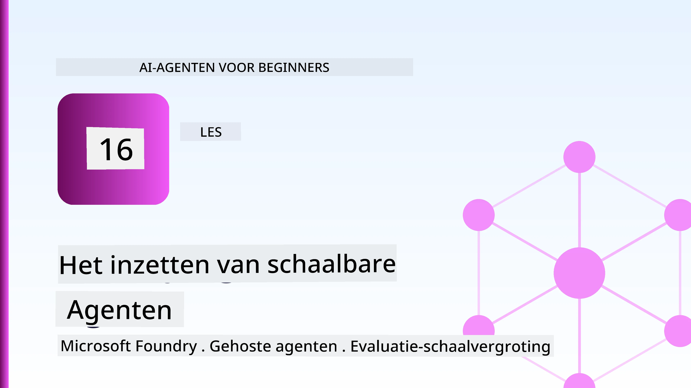
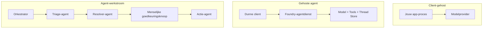
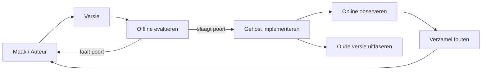
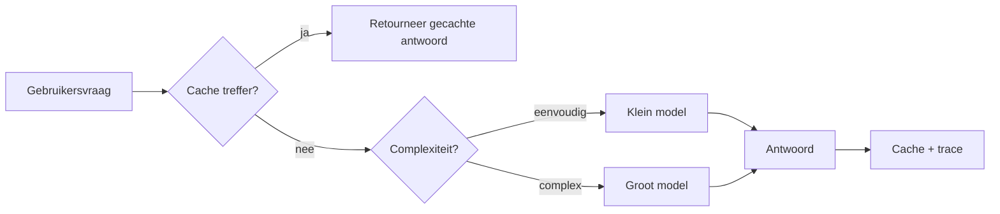
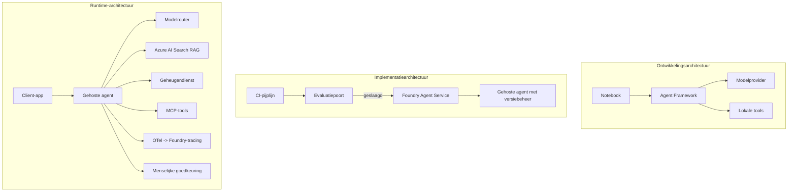

# Schaalbare Agents Implementeren met Microsoft Foundry



Tot nu toe in de cursus heb je agents gebouwd die op je laptop draaien, binnen een notebook, gestuurd door `az login` en een paar omgevingsvariabelen. Dat is precies de juiste manier om te leren. Het is niet de juiste manier om een agent te laten draaien waarop duizenden klanten om 3 uur 's nachts vertrouwen.

Deze les gaat over de kloof tussen "het werkt op mijn machine" en "het werkt betrouwbaar en betaalbaar in productie." We overbruggen die kloof met **Microsoft Foundry** en de **Microsoft Foundry Agent Service**, door een echte klantenservice-agent te bouwen die beschikt over tools, retrieval, geheugen, evaluatie en monitoring.

## Introductie

Deze les behandelt:

- Het verschil tussen een **prototype agent** en een **geïmplementeerde agent**, en waarom de overgang vooral gaat over alles *rondom* het model.
- **Implementatiepatronen** voor agents: client-gehost, service-gehost (Hosted Agents), en workflow-georkestreerd.
- De **levenscyclus van een agent** op Microsoft Foundry — creëren, versioneren, implementeren, evalueren, observeren, afvoeren.
- **Schaalstrategieën**: modelrouting, caching, gelijktijdigheid en stateless ontwerp.
- **Observeerbaarheid** met OpenTelemetry en Foundry tracing.
- **Kostenoptimalisatie** door modelselectie, routing en evaluatiepoorten.
- **Enterprise-overwegingen**: governance, menselijke goedkeuring, en het veilig draaien van MCP-servers in productie.

## Leerdoelen

Na het voltooien van deze les weet je hoe je:

- Het juiste implementatiepatroon kiest voor een bepaalde agent workload.
- Een agent implementeert op de Microsoft Foundry Agent Service zodat deze geversioneerd, beheerd en observeerbaar is.
- Een agent instrumenteert voor tracing en een evaluatiepipeline opzet die voor elke release draait.
- Modelrouting en caching toepast om latentie en kosten op schaal onder controle te houden.
- Een menselijke goedkeuringspoort toevoegt voor risicovolle acties en een MCP-server op een productieve veilige manier integreert.

## Vereisten

Voor deze les wordt ervan uitgegaan dat je de eerdere lessen hebt afgerond en vertrouwd bent met:

- Agents bouwen met het [Microsoft Agent Framework](../14-microsoft-agent-framework/README.md) (Les 14).
- [Toolgebruik](../04-tool-use/README.md) (Les 4) en [Agentic RAG](../05-agentic-rag/README.md) (Les 5).
- [Agentgeheugen](../13-agent-memory/README.md) (Les 13) en [Agentic Protocols / MCP](../11-agentic-protocols/README.md) (Les 11).
- [Observeerbaarheid en Evaluatie](../10-ai-agents-production/README.md) (Les 10) — deze les bouwt hier direct op voort.

Je hebt ook nodig:

- Een **Azure-abonnement** en een **Microsoft Foundry-project** met ten minste één geïmplementeerd chatmodel.
- De **Azure CLI** geverifieerd (`az login`).
- Python 3.12+ en de pakketten uit het repository [`requirements.txt`](../../../requirements.txt).

## Van Prototype naar Productie: Wat Verandert Eigenlijk

Een prototype-agent en een productie-agent delen dezelfde kernloop — redeneren, tools aanroepen, antwoorden. Wat verandert is alles wat die loop omsluit. Het model is misschien 20% van een productie-agent; de overige 80% is het operationele skelet.

| Zorgpunt | Prototype | Productie |
| --- | --- | --- |
| **Hosting** | Draait in je notebook | Draait als een gehoste dienst, geversioneerd en uitgerold |
| **Identiteit** | Je `az login` token | Beheerde identiteit met gerichte RBAC |
| **Status** | In geheugen, verloren bij herstart | Geëxternaliseerd (thread store, geheugenservice) |
| **Foutafhandeling** | Je ziet de tracebacks | Herhalingen, fallback, dead-letter, waarschuwingen |
| **Kosten** | "Het is een paar centen" | Bijgehouden per verzoek, gerouteerd, gecached, begroot |
| **Kwaliteit** | Je beoordeelt de output visueel | Automatisch geëvalueerd voor elke release |
| **Vertrouwen** | Je keurt elke actie goed | Beleidsregels + menselijke handeling bij risicovolle acties |

Houd deze tabel in gedachten. Elke onderstaande sectie correspondeert met één van deze rijen.

## Agent Implementatiepatronen

Er zijn drie patronen die je zult gebruiken, vaak in combinatie.

### 1. Client-gehoste Agents

Het agentobject leeft binnen *jouw* applicatieproces. Je code roept direct de modelprovider aan; de redeneringsloop draait in jouw service. Dit is wat elke vorige les heeft gedaan.

- **Gebruik dit wanneer** je volledige controle over de loop nodig hebt, aangepaste middleware, of de agent insluit binnen een bestaande backend.
- **Afweging**: je beheert zelf de schaal, status en veerkracht.

### 2. Gehoste Agents (Foundry Agent Service)

De agent is *geregistreerd als een resource* in Microsoft Foundry. Foundry host de redeneringsloop, slaat threads op, dwingt contentveiligheid en RBAC af, en maakt de agent zichtbaar in het Foundry-portaal. Je app wordt een dunne client die threads aanmaakt en reacties leest.

- **Gebruik dit wanneer** je duurzaamheid, ingebouwde observeerbaarheid, governance en een kleiner operationeel oppervlak wilt.
- **Afweging**: minder laag-niveau controle in ruil voor een beheerde runtime.

### 3. Agent Workflows

Meerdere agents (en tools) worden gecomprimeerd in een netwerk met expliciete controleflow — opeenvolgende stappen, vertakkingen, menselijke goedkeuringsknopen, en duurzame checkpoints die kunnen pauzeren en hervatten. Dit is de Microsoft Agent Framework **Workflows**-functionaliteit toegepast op productieschaal.

- **Gebruik dit wanneer** een enkele taak meerdere gespecialiseerde agents beslaat of een goedkeuringsstap in het midden vereist.
- **Afweging**: meer bewegende delen; vereist observeerbaarheid op orkestratieniveau.



## De Levenscyclus van een Agent op Microsoft Foundry

Het implementeren van een agent is geen eenmalige `push`. Het is een lus en lijkt sterk op een software-releasecyclus omdat het precies dat is.



Het kernidee, overgenomen uit [Les 10](../10-ai-agents-production/README.md): **offline evaluatie is een poort, geen bijzaak.** Een nieuwe agentversie wordt niet vrijgegeven tenzij deze je evaluatiedrempels haalt. Online observeerbaarheid voedt dan echte storingen terug in je offline testset. Dat is de hele cyclus.

## Schaalstrategieën

Het opschalen van een agent verschilt van het opschalen van een stateless web-API, omdat elk verzoek meerdere dure model- en toolaanroepen kan triggeren. Vier technieken dragen het meeste bij.

**Stateless verzoekafhandeling.** Hou geen per-gebruiker status in je procesgeheugen. Bewaar conversatiedraden in de Foundry thread store of een geheugenservice zodat elk exemplaar elk verzoek kan afhandelen. Dit maakt horizontaal schalen mogelijk — extra exemplaren toevoegen, geen sticky sessions.

**Modelrouting.** Niet elk verzoek heeft je meest capabele (en duurste) model nodig. Routeer eenvoudige verzoeken — intentieclassificatie, korte feitelijke antwoorden — naar een klein, snel model en reserveer het grote model voor echte redenering. Foundry's **Model Router** kan dit voor je regelen, of je kunt zelf een lichte classifier implementeren. Je bouwt de doe-het-zelf versie in het lab.

**Responscaching.** Veel ondersteuningsvragen zijn vrijwel identiek ("hoe reset ik mijn wachtwoord?"). Cache antwoorden op veelgestelde vragen en dien ze zonder modelaanroep. Zelfs een bescheiden cache hit-rate verlaagt kosten en latentie aanzienlijk.

**Gelijktijdigheid en backpressure.** Modelproviders hebben snelheidslimieten. Beperk je gelijktijdigheid, gebruik herhalingen met exponentiële achterstand, en faal gracieus (een wachtrij-antwoord "we zijn ermee bezig" is beter dan een 500-fout).



## Observeerbaarheid in Productie

Je kunt niet bedienen wat je niet kunt zien. Zoals besproken in Les 10, emit het Microsoft Agent Framework **OpenTelemetry** traces native — elke modelaanroep, toolaanroep en orkestratiestap wordt een span. In productie exporteer je die spans naar Microsoft Foundry (of elke OTel-compatibele backend) zodat je kunt:

- Een enkele klantklacht van begin tot eind traceren over elke model- en toolaanroep.
- P50/p95 latentie en kosten per verzoek over tijd bekijken.
- Waarschuwingen krijgen bij foutpercentage-pieken en kostenanomalieën voordat je gebruikers (of je financiële team) ze opmerken.

```python
from agent_framework.observability import get_tracer

tracer = get_tracer()

with tracer.start_as_current_span("support_request") as span:
    span.set_attribute("customer.tier", "enterprise")
    span.set_attribute("routed.model", "gpt-5-nano")
    # agentuitvoering wordt automatisch gevolgd binnen deze span
```

Attributen zoals `customer.tier` en `routed.model` veranderen een muur van traces in beantwoordbare vragen ("worden enterprise-klanten te vaak naar het kleine model gerouteerd?").

## Kostenoptimalisatie

Kosten in productieagents worden gedomineerd door tokens. Drie hefbomen, in volgorde van impact:

1. **Het model passend maken.** Een klein model dat je evaluatiepoort passeert is bijna altijd goedkoper dan een groot model dat ook passeert. Gebruik evaluatie om te *bewijzen* dat het kleine model goed genoeg is in plaats van standaard voor het grootste model te kiezen uit voorzichtigheid.
2. **Routeren op complexiteit.** Zoals hierboven — betaal grote-model prijzen alleen voor verzoeken die grote-model redenering nodig hebben.
3. **Agresief cachen.** De goedkoopste modelaanroep is degene die je nooit maakt.

Evaluatiepoorten en kostenbeheersing zijn dezelfde discipline bekeken vanuit twee invalshoeken: evaluatie geeft je de *kwaliteitsvloer*, routing en caching houden je zo dicht mogelijk bij die vloer qua *kosten*.

## Enterprise-implementatie-overwegingen

**Governance.** Hosted Agents erven Foundry's RBAC, contentveiligheid en audit logging. Geef elke agent een beheerde identiteit met de minste privileges die het nodig heeft — alleen-lezen toegang tot de kennisbasis, gerichte toegang tot de ticketing-API, niet meer.

**Menselijke handeling.** Sommige acties zijn te zwaarwegend om volledig te automatiseren — een terugbetaling uitvoeren, een account verwijderen, escaleren naar een juridisch team. Het Microsoft Agent Framework ondersteunt **goedkeuringsvereiste** tools: de agent stelt de actie voor, uitvoering pauzeert, een mens keurt goed of wijst af, en de workflow gaat door. Je zag het element in [Les 6](../06-building-trustworthy-agents/README.md); hier implementeer je het.

**MCP in productie.** [MCP](../11-agentic-protocols/README.md) laat je agent externe tools gebruiken via een standaardinterface. In productie behandel je elke MCP-server als een niet-vertrouwde grens: pin de serverversie, draai het met een gerichte identiteit, valideer de output, en geef nooit geheimen bloot. Een MCP-server is een afhankelijkheid, en afhankelijkheden worden gepatcht, geaudit en gelimiteerd.



Die drie diagrammen — ontwikkeling, implementatie, runtime — zijn dezelfde agent in drie levensfasen. Het lab erna leidt je door het bouwen ervan.

## Praktijklab: Een Productieklare Klantenservice-Agent

Open [`code_samples/16-python-agent-framework.ipynb`](./code_samples/16-python-agent-framework.ipynb) en werk het van begin tot eind door. Je zet een **Contoso klantenservice-agent** in elkaar met elke productiezorg erin verweven:

1. **Tool-aanroepen** — bestelstatus opzoeken en supporttickets openen.
2. **RAG** — beleidsvragen beantwoorden vanuit een kennisbasis (Azure AI Search, met een in-memory fallback zodat het notebook zonder een Search-resource draait).
3. **Geheugen** — de klant onthouden door conversatierondes heen.
4. **Modelrouting** — een complexiteit-classifier routeert elk verzoek naar een klein of groot model.
5. **Responscaching** — herhaalde vragen worden uit de cache bediend.
6. **Menselijke goedkeuring** — terugbetalingen boven een drempel pauzeren voor menselijke handtekening.
7. **Evaluatiepipeline** — een kleine offline testset scoort de agent en fungeert als releasepoort.
8. **Observeerbaarheid** — OpenTelemetry tracing rond elk verzoek.

### Doorloop

Het notebook is zo georganiseerd dat elke productiezorg een zelfstandige, uitvoerbare sectie is. Het hart ervan is de routing-plus-caching verzoekafhandelaar:

```python
async def handle_support_request(query: str, customer_id: str) -> str:
    # 1. Serveren vanuit de cache wanneer mogelijk.
    cached = response_cache.get(normalize(query))
    if cached:
        return cached

    # 2. Routeren op complexiteit om de kosten te beheersen.
    model = "gpt-5-nano" if is_simple(query) else "gpt-5-mini"

    # 3. Voer de agent uit binnen een trace-span voor observeerbaarheid.
    with tracer.start_as_current_span("support_request") as span:
        span.set_attribute("routed.model", model)
        span.set_attribute("customer.id", customer_id)
        response = await support_agent.run(query, model=model)

    # 4. Cache en retourneer.
    response_cache.set(normalize(query), response.text)
    return response.text
```

De evaluatiepoort die een release bewaakt ziet er zo uit:

```python
async def evaluation_gate(agent, test_cases, threshold: float = 0.8) -> bool:
    passed = 0
    for case in test_cases:
        result = await agent.run(case["input"])
        if score_response(result.text, case["expected"]) >= 0.8:
            passed += 1
    pass_rate = passed / len(test_cases)
    print(f"Evaluation pass rate: {pass_rate:.0%} (gate: {threshold:.0%})")
    return pass_rate >= threshold  # alleen implementeren als de poort slaagt
```

Lees elke regel — het notebook houdt de primitieve functies bewust klein zodat niets verstopt zit achter een framework-aanroep.

## Een Geïmplementeerde Agent Valideren met Smoke Tests

De evaluatiepoort hierboven draait *offline* tegen je agentobject. Zodra de agent als Hosted Agent is geïmplementeerd, heb je nog één extra, zelfs goedkopere controle nodig: **geeft het geïmplementeerde endpoint daadwerkelijk antwoord?**

"Succesvol" implementeren bewijst alleen dat het controlevlak de definitie accepteerde — het bewijst niet dat de agent reageert. Een ontbrekende afhankelijkheid, een slechte modelrouting, of een verlopen verbinding kunnen leiden tot een groene implementatie die niets teruggeeft. Een **smoke test** vangt dat in seconden, bij elke implementatie, zonder de kosten van een volledige evaluatie.

Deze repository bevat een kant-en-klare smoke-test pipeline gebouwd op de [AI Smoke Test](https://github.com/marketplace/actions/ai-smoke-test) GitHub Action:

- **Catalogus** — [`tests/lesson-16-smoke-tests.json`](../../../tests/lesson-16-smoke-tests.json) bevat prompts en assertions voor de Contoso support agent (gegronde beleidsantwoorden, een orderopvraag, thematisch blijven, en multi-turn thread continuïteit). Catalogi voor andere lessen met agents staan ernaast — zie [`tests/README.md`](../tests/README.md).
- **Workflow** — [`.github/workflows/smoke-test.yml`](../../../.github/workflows/smoke-test.yml) logt in met Azure OIDC en POST elke prompt naar het Responses endpoint van de agent, faalt de taak bij elke mislukte assertion.

```yaml
- name: Smoke-test hosted agent
  uses: JFolberth/ai-smoketest@v1
  with:
    project_endpoint: ${{ inputs.project_endpoint }}
    agent_name: ContosoSupportAgent
    tests_file: tests/lesson-16-smoke-tests.json
```


Voer het uit vanaf het **Actions**-tabblad zodra je agent is ingezet, waarbij je je Foundry-projectendpoint en agentnaam opgeeft. De gefedereerde identiteit heeft de rol **Azure AI User** nodig binnen de scope van het Foundry-project. Zie de lagen als een piramide: rooktests (bereikbaar en reagerend?) worden bij elke uitrol uitgevoerd, offline evaluatie (goed genoeg om uit te rollen?) loopt voorafgaand aan promotie, en online evaluatie (hoe presteert het in de praktijk?) draait continu.

## Kenniscontrole

Test je begrip voordat je naar de opdracht gaat.

**1. Ongeveer hoeveel van een productie-agent is 'het model,' en wat is de rest?**

<details>
<summary>Antwoord</summary>

Het model is een minderheid van het systeem — vaak wordt ongeveer 20% genoemd. De rest is het operationele skelet: hosting en versiebeheer, identiteit en RBAC, extern beheerde status, foutafhandeling, kostenbewaking, evaluatie en menselijke controles. Overgaan naar productie gaat vooral over het bouwen van alles *rondom* de redeneercyclus.
</details>

**2. Wanneer kies je voor een Hosted Agent boven een client-gehoste agent?**

<details>
<summary>Antwoord</summary>

Wanneer je een beheerde runtime wilt met ingebouwde duurzaamheid (threads die persistent zijn en kunnen hervatten), observeerbaarheid, inhoudsveiligheid en RBAC, en je bereid bent wat laag-niveau controle over de redeneercyclus in te leveren voor minder operationeel oppervlak. Client-gehost is de voorkeur wanneer je volledige controle over de cyclus nodig hebt of de agent insluit in een bestaande backend.
</details>

**3. Waarom moet een schaalbare agent stateless zijn in het procesgeheugen?**

<details>
<summary>Antwoord</summary>

Zodat elke instantie elke aanvraag kan afhandelen, wat horizontale schaalbaarheid zonder sticky sessions mogelijk maakt. Per-gebruiker gesprekstatus wordt uitbesteed aan een thread-opslag of geheugenservice. Als status in het procesgeheugen zou leven, zou je deze kwijtraken bij herstart en kon je de belasting niet vrij verdelen.
</details>

**4. Welk probleem lost modelroutering op, en hoe relateert dat aan evaluatie?**

<details>
<summary>Antwoord</summary>

Routering stuurt eenvoudige verzoeken naar een klein, goedkoop, snel model en reserveert het grote model voor echte redeneerkracht, waarmee zowel latentie als kosten worden beheerst. Het relateert aan evaluatie omdat evaluatie bewijst dat het kleine model goed genoeg is voor een klasse van verzoeken — routering zonder evaluatie is gokken.
</details>

**5. Wat is een "evaluatiepoort" en waar zit deze in de levenscyclus?**

<details>
<summary>Antwoord</summary>

Een evaluatiepoort voert een offline testset uit tegen een nieuwe agentversie en blokkeert uitrol tenzij het slagingspercentage een drempel overschrijdt. Het zit tussen "versie" en "uitrollen" in de levenscyclus, waardoor kwaliteit een voorwaarde voor release is in plaats van iets wat je pas na uitrol controleert.
</details>

**6. Waarom moet een MCP-server in productie worden behandeld als een niet-vertrouwde grens?**

<details>
<summary>Antwoord</summary>

Omdat het een externe afhankelijkheid is waar je agent mee communiceert. Je moet de versie vastzetten, met een beperkte identiteit draaien, de uitvoer valideren, rate-limiten en nooit geheimen aan blootstellen — dezelfde discipline als bij elke derde-partij afhankelijkheid. De outputs stromen mee in de redenatie van je agent, dus ongeverifieerd vertrouwen vormt een beveiligingsrisico.
</details>

**7. Welke enkele verandering heeft meestal de grootste impact op de kosten van een productie-agent, en waarom?**

<details>
<summary>Antwoord</summary>

Het juist dimensioneren van het model — het gebruik van het kleinste model dat nog door je evaluatiepoort komt. Kosten worden gedomineerd door tokens, en een kleiner model dat voldoet aan de kwaliteitsnorm is vrijwel altijd goedkoper dan een groter model. Caching en routering verlagen de kosten verder, maar het kiezen van het juiste basismodel heeft het grootste effect op korte termijn.
</details>

**8. Welke rol spelen span-attributen zoals `customer.tier` en `routed.model` in observeerbaarheid?**

<details>
<summary>Antwoord</summary>

Ze veranderen ruwe traces in beantwoordbare zakelijke vragen. Zonder attributen heb je een muur van spans; met attributen kun je vragen stellen als "worden enterprise-klanten te vaak naar het kleine model geleid?" of "welk model behandelt onze langzaamste verzoeken?" Attributen zijn hoe je telemetrie snijdt naar de dimensies die belangrijk zijn voor jouw operatie.
</details>

## Opdracht

Pak de klantenservice-agent uit het lab en versterk deze voor een specifiek scenario: **een abonnement facturatie-ondersteuningsagent voor een SaaS-bedrijf.**

Je inzending moet:

1. **De tools vervangen** door facturatie-relevante: `get_subscription_status`, `get_invoice` en `issue_credit` (credits boven de $50 vereisen menselijke goedkeuring).
2. **Drie RAG-documenten toevoegen** die het restitutiebeleid, de factureringscyclus en het annuleringsbeleid van het bedrijf beslaan.
3. **De evaluatieset uitbreiden** tot minstens acht gevallen, inclusief minstens twee die *moeten* leiden tot het pad van menselijke goedkeuring, en bevestigen dat je evaluatiepoort correct slaagt of faalt.
4. **Eén kostenrapport toevoegen**: na het uitvoeren van tien gemengde queries via de agent, print hoeveel er naar het kleine model gingen, hoeveel naar het grote model en hoeveel uit de cache werden bediend.

Schrijf een korte paragraaf (in een markdown cel) waarin je uitlegt welke modelrouteringsregel je gekozen hebt en hoe je die zou valideren met echt verkeer. Er is geen eenduidig correct antwoord — je wordt beoordeeld op of de productie-overwegingen samenhangend zijn verbonden.

## Samenvatting

In deze les heb je een agent van prototype naar productie gebracht met Microsoft Foundry:

- De sprong naar productie gaat vooral over het **operationeel skelet** rondom het model — hosting, identiteit, status, foutafhandeling, kosten, kwaliteit en vertrouwen.
- Je hebt de drie **uitrolpatronen** geleerd — client-gehost, Hosted Agents en Agent Workflows — en wanneer elk passend is.
- Je hebt de **agent-levenscyclus** doorlopen, waarbij offline **evaluatie fungeert als een releasepoort** en online observeerbaarheid fouten terugvoert in de testset.
- Je hebt **schaalstrategieën** toegepast — stateless ontwerp, modelroutering, caching en begrensde gelijktijdigheid — en deze gekoppeld aan **kostenoptimalisatie**.
- Je hebt **enterprise-controles** ingebouwd: RBAC, menselijke goedkeuring in de lus, en productieveilige MCP-integratie.
- Je bouwde een **productieklaar klantenservice-agent** die al deze aspecten samenbrengt in uitvoerbare code.

De volgende les maakt de omgekeerde reis: in plaats van agents op te schalen naar de cloud, breng je ze *omlaag* naar één ontwikkelaarmachine en draait ze volledig lokaal.

## Aanvullende bronnen

- <a href="https://learn.microsoft.com/azure/ai-foundry/what-is-azure-ai-foundry" target="_blank">Microsoft Foundry documentatie</a>
- <a href="https://learn.microsoft.com/azure/ai-foundry/agents/overview" target="_blank">Microsoft Foundry Agent Service overzicht</a>
- <a href="https://aka.ms/ai-agents-beginners/agent-framework" target="_blank">Microsoft Agent Framework</a>
- <a href="https://learn.microsoft.com/azure/ai-foundry/concepts/model-router" target="_blank">Model Router in Microsoft Foundry</a>
- <a href="https://learn.microsoft.com/azure/search/search-what-is-azure-search" target="_blank">Azure AI Search</a>
- <a href="https://opentelemetry.io/" target="_blank">OpenTelemetry</a>
- <a href="https://github.com/marketplace/actions/ai-smoke-test" target="_blank">AI Smoke Test GitHub Action</a>
- <a href="https://modelcontextprotocol.io/" target="_blank">Model Context Protocol (MCP)</a>

## Vorige les

[Computer Use Agents (CUA) bouwen](../15-browser-use/README.md)

## Volgende les

[Lokale AI Agents maken](../17-creating-local-ai-agents/README.md)

---

<!-- CO-OP TRANSLATOR DISCLAIMER START -->
**Disclaimer**:
Dit document is vertaald met behulp van de AI vertaaldienst [Co-op Translator](https://github.com/Azure/co-op-translator). Hoewel we streven naar nauwkeurigheid, dient u er rekening mee te houden dat geautomatiseerde vertalingen fouten of onnauwkeurigheden kunnen bevatten. Het originele document in de oorspronkelijke taal moet worden beschouwd als de gezaghebbende bron. Voor kritieke informatie wordt professionele menselijke vertaling aanbevolen. Wij zijn niet aansprakelijk voor eventuele misverstanden of verkeerde interpretaties die voortvloeien uit het gebruik van deze vertaling.
<!-- CO-OP TRANSLATOR DISCLAIMER END -->