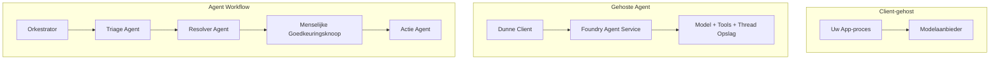
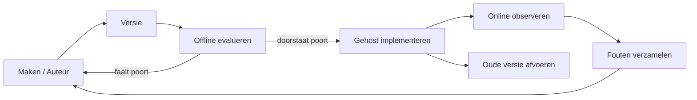
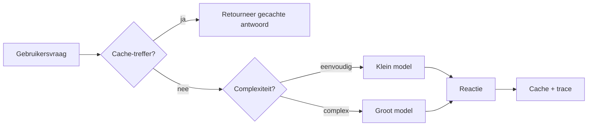
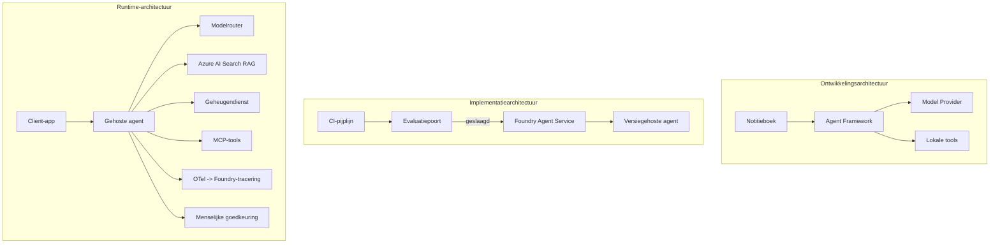

# Schaalbare Agents Implementeren met Microsoft Foundry


Tot nu toe in de cursus heb je agents gebouwd die op je laptop draaien, binnen een notebook, aangedreven door `az login` en een handvol omgevingsvariabelen. Dat is precies de juiste manier om te leren. Het is niet de juiste manier om een agent te laten draaien waarop duizenden klanten op 3 uur 's nachts vertrouwen.

Deze les gaat over de kloof tussen "het werkt op mijn machine" en "het werkt betrouwbaar en betaalbaar in productie." We overbruggen die kloof met **Microsoft Foundry** en de **Microsoft Foundry Agent Service**, en we doen dat door een echte klantenondersteuningsagent te bouwen met tools, ophalen, geheugen, evaluatie en monitoring.

## Introductie

Deze les behandelt:

- Het verschil tussen een **prototype-agent** en een **geïmplementeerde agent**, en waarom de overgang vooral gaat over alles *rondom* het model.
- **Implementatiepatronen** voor agents: client-hosted, service-hosted (Hosted Agents) en workflow-georkestreerd.
- De **agent levenscyclus** op Microsoft Foundry — maken, versiebeheer, implementeren, evalueren, observeren, afvoeren.
- **Schaalstrategieën**: modelroutering, caching, gelijktijdigheid en stateless ontwerp.
- **Observeerbaarheid** met OpenTelemetry en Foundry-tracing.
- **Kostenoptimalisatie** via modelselectie, routering en evaluatiepoorten.
- **Enterprise-overwegingen**: governance, menselijke goedkeuring en het veilig draaien van MCP-servers in productie.

## Leerdoelen

Na het voltooien van deze les weet je hoe je:

- Het juiste implementatiepatroon kiest voor een gegeven agent workload.
- Een agent implementeert naar de Microsoft Foundry Agent Service zodat deze versiebeheer, governance en observeerbaarheid heeft.
- Een agent instrumenteert voor tracing en een evaluatiepipeline aansluit die draait voor elke release.
- Modelroutering en caching toepast om latentie en kosten op schaal te beheersen.
- Een menselijke goedkeuringspoort toevoegt voor risicovolle acties en een MCP-server integreert op een productie-veilige manier.

## Vereisten

Deze les gaat ervan uit dat je de eerdere lessen hebt voltooid en vertrouwd bent met:

- Het bouwen van agents met het [Microsoft Agent Framework](../14-microsoft-agent-framework/README.md) (Les 14).
- [Gebruik van tools](../04-tool-use/README.md) (Les 4) en [Agentic RAG](../05-agentic-rag/README.md) (Les 5).
- [Agentgeheugen](../13-agent-memory/README.md) (Les 13) en [Agentic Protocols / MCP](../11-agentic-protocols/README.md) (Les 11).
- [Observeerbaarheid en Evaluatie](../10-ai-agents-production/README.md) (Les 10) — deze les bouwt er direct op voort.

Je hebt ook nodig:

- Een **Azure-abonnement** en een **Microsoft Foundry-project** met ten minste één geïmplementeerd chatmodel.
- De **Azure CLI** geauthenticeerd (`az login`).
- Python 3.12+ en de pakketten in het repositorybestand [`requirements.txt`](../../../requirements.txt).

## Van Prototype naar Productie: Wat Verandert Er Echt

Een prototype-agent en een productie-agent delen dezelfde kernlus — redeneren, tools aanroepen, reageren. Wat verandert is alles wat rond die lus zit. Het model is misschien 20% van een productie-agent; de andere 80% is het operationele skelet.

| Aandachtspunt | Prototype | Productie |
| --- | --- | --- |
| **Hosting** | Draait in je notebook | Draait als een gehoste service, versiebeheer en uitgerold |
| **Identiteit** | Je `az login` token | Beheerde identiteit met afgebakende RBAC |
| **Status** | In geheugen, verloren bij herstart | Extern opgeslagen (thread store, geheugenservice) |
| **Falen** | Je ziet de traceback | Herhalingen, fallback, dead-letter, waarschuwingen |
| **Kosten** | "Het kost een paar cent" | Vastgelegd per verzoek, gerouteerd, gecachet, gebudgetteerd |
| **Kwaliteit** | Je bekijkt handmatig de output | Automatisch geëvalueerd voor elke release |
| **Vertrouwen** | Je keurt elke actie goed | Beleid + menselijke tussenkomst bij risicovolle acties |

Houd deze tabel in gedachten. Elke onderstaande sectie correspondeert met één van deze rijen.

## Agent Implementatiepatronen

Er zijn drie patronen die je zult gebruiken, vaak in combinatie.

### 1. Client-gehoste Agents

Het agent-object leeft binnen *jouw* applicatieproces. Je code roept de modelprovider direct aan; de redeneerlus draait in jouw service. Dit is wat elke vorige les heeft gedaan.

- **Gebruik het wanneer** je volledige controle over de lus nodig hebt, aangepaste middleware wil of de agent wilt inbedden in een bestaande backend.
- **Nadeel**: je bent zelf verantwoordelijk voor opschaling, status en veerkracht.

### 2. Gehoste Agents (Foundry Agent Service)

De agent is *geregistreerd als een resource* in Microsoft Foundry. Foundry host de redeneerlus, slaat threads op, handhaaft contentveiligheid en RBAC, en maakt de agent zichtbaar in het Foundry-portaal. Je app wordt een dunne client die threads aanmaakt en reacties leest.

- **Gebruik het wanneer** je duurzaamheid, ingebouwde observeerbaarheid, governance en minder operationele complexiteit wilt.
- **Nadeel**: minder laag-niveau controle in ruil voor een beheerde runtime.

### 3. Agent Workflows

Meerdere agents (en tools) worden samengevoegd in een graaf met expliciete sturingslogica — opeenvolgende stappen, vertakkingen, menselijke goedkeuringspunten en duurzame checkpoints die kunnen pauzeren en hervatten. Dit is de Microsoft Agent Framework **Workflows** functionaliteit toegepast op implementatieschaal.

- **Gebruik het wanneer** een enkele taak meerdere gespecialiseerde agents omvat of een goedkeuringsstap halverwege vereist.
- **Nadeel**: meer bewegende onderdelen; vereist orchestratieniveau observeerbaarheid.



## De Agent Levenscyclus op Microsoft Foundry

Een agent implementeren is geen eenmalige `push`. Het is een lus, en het lijkt veel op een software release-cyclus omdat het dat ook precies is.



Het sleutelidee, overgenomen van [Les 10](../10-ai-agents-production/README.md): **offline evaluatie is een poort, geen bijzaak.** Een nieuwe agentversie wordt niet vrijgegeven tenzij deze aan je evaluatiedrempels voldoet. Online observeerbaarheid voedt vervolgens echte foutgevallen terug in je offline testset. Dat is de volledige lus.

## Schaalstrategieën

Het schalen van een agent is anders dan het schalen van een stateless web-API, omdat elk verzoek meerdere kostbare model- en toolaanroepen kan activeren. Vier technieken dragen het meeste gewicht.

**Stateless verzoekafhandeling.** Houd geen status per gebruiker in het geheugen van je proces. Bewaar conversatiedraden in de Foundry thread store of een geheugenservice zodat elke instantie elk verzoek kan afhandelen. Dit maakt horizontale schaalvergroting mogelijk — voeg instanties toe, geen stickiness.

**Modelroutering.** Niet elk verzoek heeft je krachtigste (en duurste) model nodig. Routeer eenvoudige verzoeken — intentclassificatie, korte feitelijke antwoorden — naar een klein, snel model en reserveer het grote model voor echt redeneren. Foundry's **Model Router** kan dit voor je doen, of je kunt zelf een lichte classifier implementeren. Je bouwt de doe-het-zelf versie in het lab.

**Responscaching.** Veel ondersteuningsvragen zijn bijna duplicaten ("hoe reset ik mijn wachtwoord?"). Cache antwoorden op veelgestelde vragen en serveer ze zonder het model te raadplegen. Zelfs een bescheiden cache-hitratio verlaagt kosten en latentie aanzienlijk.

**Gelijkheid en backpressure.** Modelproviders hebben snelheidslimieten. Beperk je gelijktijdigheid, gebruik herhalingen met exponentiële backoff en faal gracieus (een in de wachtrij geplaatste "we zijn ermee bezig" response is beter dan een 500).



## Observeerbaarheid in Productie

Je kunt niet opereren wat je niet kunt zien. Zoals behandeld in Les 10, genereert het Microsoft Agent Framework native **OpenTelemetry** traces — elke modelaanroep, toolaanroep en orkestratiestap wordt een span. In productie exporteer je die spans naar Microsoft Foundry (of elke OTel-compatibele backend) zodat je kunt:

- Een enkele klantklacht end-to-end traceren over elke model- en toolaanroep.
- P50/p95 latentie en kosten per verzoek in de tijd volgen.
- Waarschuwen bij foutpercentagespieken en kostenafwijkingen voordat je gebruikers (of je finance team) die opmerken.

```python
from agent_framework.observability import get_tracer

tracer = get_tracer()

with tracer.start_as_current_span("support_request") as span:
    span.set_attribute("customer.tier", "enterprise")
    span.set_attribute("routed.model", "gpt-4.1-mini")
    # agentuitvoering wordt automatisch gevolgd binnen deze span
```

Attributen zoals `customer.tier` en `routed.model` veranderen een muur van traces in beantwoorde vragen ("worden zakelijke klanten te vaak naar het kleine model gerouteerd?").

## Kostenoptimalisatie

Kosten in productieagents worden gedomineerd door tokens. Drie hefbomen, in volgorde van impact:

1. **Pas het model aan de juiste grootte aan.** Een klein model dat door je evaluatiepoort komt is bijna altijd goedkoper dan een groot model dat ook doorkomt. Gebruik evaluatie om te *bewijzen* dat het kleine model voldoende is in plaats van standaard het grootste model te gebruiken uit voorzichtigheid.
2. **Routeer op complexiteit.** Zoals hierboven — betaal alleen voor grote-model prijzen voor verzoeken die grote-model redenering nodig hebben.
3. **Cache agressief.** De goedkoopste modelaanroep is degene die je nooit doet.

Evaluatiepoorten en kostenbeheersing zijn dezelfde discipline vanuit twee perspectieven: evaluatie vertelt je het *kwaliteitsminimum*, routering en caching houden je zo dicht mogelijk bij dat minimum *kosten*.

## Enterprise-implementatie Overwegingen

**Governance.** Gehoste Agents erven Foundry's RBAC, contentveiligheid en auditlogging. Geef elke agent een beheerde identiteit met de minste noodzakelijke rechten — read-only toegang tot de kennisbank, afgebakende toegang tot de ticketings-API, niet meer.

**Mens in de lus.** Sommige acties zijn te ingrijpend om volledig te automatiseren — het uitgeven van een terugbetaling, het verwijderen van een account, escalatie naar een juridische afdeling. Het Microsoft Agent Framework ondersteunt **goedkeuring-vereiste** tools: de agent stelt de actie voor, de uitvoering pauzeert, een mens keurt goed of af, en de workflow gaat verder. Je zag dit primitief in [Les 6](../06-building-trustworthy-agents/README.md); hier implementeer je het.

**MCP in productie.** [MCP](../11-agentic-protocols/README.md) laat je agent externe tools gebruiken via een standaardinterface. In productie behandel je elke MCP-server als een niet-vertrouwde grens: pin de serverversie, draai deze met een afgebakende identiteit, valideer de outputs en deel er nooit geheimen mee. Een MCP-server is een afhankelijkheid, en afhankelijkheden worden gepatcht, gecontroleerd en gesnelheidsbegrensd.



Die drie diagrammen — ontwikkeling, implementatie, runtime — zijn dezelfde agent in drie fasen van zijn leven. Het lab hieronder leidt je door het bouwen ervan.

## Praktijklab: Een Productieklaar Klantenondersteuningsagent

Open [`code_samples/16-python-agent-framework.ipynb`](./code_samples/16-python-agent-framework.ipynb) en doorloop het van begin tot eind. Je assembleert een **Contoso klantenondersteuningsagent** met elke productieaandacht erin verwerkt:

1. **Tool-aanroepen** — bestelstatus opzoeken en ondersteuningsverzoeken openen.
2. **RAG** — beleidsvragen beantwoorden vanuit een kennisbank (Azure AI Search, met een fallback in geheugen zodat de notebook draait zonder Search resource).
3. **Geheugen** — de klant onthouden over beurten in het gesprek.
4. **Modelroutering** — een complexiteitsclassifier routeert elk verzoek naar een klein of groot model.
5. **Responscaching** — herhaalde vragen worden uit de cache bediend.
6. **Menselijke goedkeuring** — terugbetalingen boven een drempel pauzeren voor menselijke goedkeuring.
7. **Evaluatiepipeline** — een kleine offline testset scoort de agent en fungeert als een release-poort.
8. **Observeerbaarheid** — OpenTelemetry tracing rond elk verzoek.

### Doorloop

De notebook is zo georganiseerd dat elke productieaandacht een zelfstandige, uitvoerbare sectie is. Het hart ervan is de routering-plus-caching verzoekafhandelaar:

```python
async def handle_support_request(query: str, customer_id: str) -> str:
    # 1. Serveer uit de cache wanneer we kunnen.
    cached = response_cache.get(normalize(query))
    if cached:
        return cached

    # 2. Routeren op complexiteit om de kosten te beheersen.
    model = "gpt-4.1-mini" if is_simple(query) else "gpt-4.1"

    # 3. Voer de agent uit binnen een trace span voor observeerbaarheid.
    with tracer.start_as_current_span("support_request") as span:
        span.set_attribute("routed.model", model)
        span.set_attribute("customer.id", customer_id)
        response = await support_agent.run(query, model=model)

    # 4. Cache en retourneer.
    response_cache.set(normalize(query), response.text)
    return response.text
```

De evaluatiepoort die een release bewaakt ziet er zo uit:

```python
async def evaluation_gate(agent, test_cases, threshold: float = 0.8) -> bool:
    passed = 0
    for case in test_cases:
        result = await agent.run(case["input"])
        if score_response(result.text, case["expected"]) >= 0.8:
            passed += 1
    pass_rate = passed / len(test_cases)
    print(f"Evaluation pass rate: {pass_rate:.0%} (gate: {threshold:.0%})")
    return pass_rate >= threshold  # alleen implementeren als het poort voorbijgaat
```

Lees elke regel — de notebook houdt de primitieven bewust klein zodat niets verborgen is achter een framework-aanroep.

## Valideren van een Geïmplementeerde Agent met Smoke Tests

De evaluatiepoort hierboven draait *offline* tegen je agentobject. Zodra de agent is geïmplementeerd als een Hosted Agent, heb je nog een goedkopere check nodig: **antwoordt het geïmplementeerde eindpunt eigenlijk?**

"Succesvol" implementeren bewijst alleen dat de control plane de definitie accepteerde — het bewijst niet dat de agent reageert. Een ontbrekende afhankelijkheid, een foute modelroutering of een verlopen verbinding kunnen leiden tot een groene implementatie die niets retourneert. Een **smoke test** vangt dit binnen seconden op, bij elke implementatie, zonder de kosten van een volledige evaluatie.

Dit repository levert een kant-en-klare smoke-test pipeline gebaseerd op de [AI Smoke Test](https://github.com/marketplace/actions/ai-smoke-test) GitHub Action:

- **Catalogus** — [`tests/lesson-16-smoke-tests.json`](../../../tests/lesson-16-smoke-tests.json) bevat prompts en asserties voor de Contoso ondersteuningsagent (gegronde beleidsantwoorden, een bestelling opzoeken, on-topic blijven en multi-turn threadcontinuïteit). Catalogi voor andere lessen' agents staan ernaast — zie [`tests/README.md`](../tests/README.md).
- **Workflow** — [`.github/workflows/smoke-test.yml`](../../../.github/workflows/smoke-test.yml) logt in met Azure OIDC en POSTt elke prompt naar het Responses eindpunt van de agent, waarbij de taak faalt bij elke assertie-miss.

```yaml
- name: Smoke-test hosted agent
  uses: JFolberth/ai-smoketest@v1
  with:
    project_endpoint: ${{ inputs.project_endpoint }}
    agent_name: ContosoSupportAgent
    tests_file: tests/lesson-16-smoke-tests.json
```


Voer het uit vanuit het **Acties**-tabblad zodra uw agent is geïmplementeerd, waarbij u uw Foundry-projectendpoint en agentnaam opgeeft. De gefedereerde identiteit heeft de rol **Azure AI User** nodig op Foundry-projectniveau. Zie de lagen als een piramide: rooktesten (bereikbaar en reagerend?) worden bij elke implementatie uitgevoerd, offline evaluatie (goed genoeg om te verzenden?) wordt vóór promotie uitgevoerd, en online evaluatie (hoe presteert het in de praktijk?) loopt continu.

## Kenniscontrole

Test je begrip voordat je doorgaat naar de opdracht.

**1. Hoeveel van een productie-agent is ongeveer "het model" en wat is de rest?**

<details>
<summary>Antwoord</summary>

Het model is een minderheid van het systeem — vaak wordt ongeveer 20% genoemd. De rest is het operationele skelet: hosting en versiebeheer, identiteit en RBAC, geëxternaliseerde status, foutafhandeling, kostenbewaking, evaluatie en human-in-the-loop controles. Overgaan naar productie gaat vooral over het bouwen van alles *rond* de redeneerlus.
</details>

**2. Wanneer kies je voor een Hosted Agent boven een client-hosted agent?**

<details>
<summary>Antwoord</summary>

Wanneer je een beheerde runtime wilt met ingebouwde duurzaamheid (draadjes die blijven bestaan en kunnen worden hervat), observeerbaarheid, contentveiligheid en RBAC, en je bereid bent wat fijnmazige controle over de redeneerlus in te leveren voor een kleinere operationele oppervlakte. Client-hosted is aan te bevelen als je volledige controle over de lus nodig hebt of als je de agent in een bestaande backend integreert.
</details>

**3. Waarom moet een schaalbare agent stateloos zijn in het eigen processgeheugen?**

<details>
<summary>Antwoord</summary>

Zodat elke instantie elke aanvraag kan afhandelen, wat horizontale schaalbaarheid zonder sticky sessies mogelijk maakt. De per-gebruiker conversatiestatus is geëxternaliseerd naar een thread store of geheugendienst. Als de status in het processgeheugen zou staan, zou je die bij herstart verliezen en de belasting niet vrij kunnen verdelen.
</details>

**4. Welk probleem lost model routing op en hoe hangt het samen met evaluatie?**

<details>
<summary>Antwoord</summary>

Routing stuurt eenvoudige aanvragen naar een klein, goedkoop en snel model en reserveert het grote model voor echte redeneerwerkzaamheden, waardoor zowel latentie als kosten worden beheerst. Het hangt samen met evaluatie omdat evaluatie aantoont dat het kleine model goed genoeg is voor een klasse van aanvragen — routing zonder evaluatie is giswerk.
</details>

**5. Wat is een "evaluatiepoort" en waar bevindt deze zich in de levenscyclus?**

<details>
<summary>Antwoord</summary>

Een evaluatiepoort voert een offline testset uit tegen een nieuwe agentversie en blokkeert de implementatie tenzij het slaagpercentage een drempelwaarde haalt. Het zit tussen "versie" en "implementatie" in de levenscyclus, waardoor kwaliteit een voorwaarde voor release is in plaats van iets om te controleren na het uitrollen.
</details>

**6. Waarom moet een MCP-server in productie als een onbetrouwbare grens worden behandeld?**

<details>
<summary>Antwoord</summary>

Omdat het een externe afhankelijkheid is waar je agent op aanroept. Je moet de versie vastpinnen, het met een beperkte identiteit laten draaien, de uitvoer valideren, rate-limit toepassen en nooit geheimen aan blootstellen — dezelfde discipline als bij elke derde-partij afhankelijkheid. De uitvoer stroomt mee in de redeneerlogica van je agent, dus ongeteste vertrouwen is een beveiligingsrisico.
</details>

**7. Welke enkele wijziging heeft gewoonlijk de grootste impact op de productiekosten van de agent en waarom?**

<details>
<summary>Antwoord</summary>

De juiste modelgrootte kiezen — het kleinste model gebruiken dat nog steeds je evaluatiepoort passeert. Kosten worden gedomineerd door tokens, en een kleiner model dat aan de kwaliteitseisen voldoet is bijna altijd goedkoper dan een groter model. Caching en routing verlagen de kosten nog verder, maar de keuze van het juiste basismodel heeft het grootste effect op de eerste orde.
</details>

**8. Welke rol spelen span-kenmerken zoals `customer.tier` en `routed.model` in observeerbaarheid?**

<details>
<summary>Antwoord</summary>

Ze veranderen ruwe traceringen in beantwoorde zakelijke vragen. Zonder kenmerken heb je een muur van spans; met kenmerken kun je vragen stellen als "worden enterprise-klanten te vaak naar het kleine model gerouteerd?" of "welk model handelt onze traagste aanvragen af?" Kenmerken zijn hoe je telemetrie verdeelt over dimensies die cruciaal zijn voor je operatie.
</details>

## Opdracht

Neem de klantenservice-agent uit het lab en versterk deze voor een specifiek scenario: **een abonnement-facturatie-ondersteuningsagent voor een SaaS-bedrijf.**

Je inzending moet:

1. **Vervang de tools** door tools relevant voor facturatie: `get_subscription_status`, `get_invoice` en `issue_credit` (credits hoger dan $50 vereisen menselijke goedkeuring).
2. **Voeg drie RAG-documenten toe** die het restitutiebeleid, de factureringscyclus en het annuleringsbeleid van het bedrijf behandelen.
3. **Breid de evaluatieset uit** tot ten minste acht gevallen, waaronder ten minste twee die *moeten* leiden tot de menselijke-goedkeuringsroute en bevestig dat je evaluatiepoort correct slaagt of faalt.
4. **Voeg één kostrapport toe**: na het uitvoeren van tien gemengde queries via de agent, toon hoeveel er naar het kleine model gingen, hoeveel naar het grote model en hoeveel uit de cache kwamen.

Schrijf een korte paragraaf (in een markdown-cel) waarin je uitlegt welke model-routeringsregel je koos en hoe je deze zou valideren met echt verkeer. Er is geen enkel correct antwoord — je wordt beoordeeld op of de productieoverwegingen coherent samenhangen.

## Samenvatting

In deze les heb je een agent van prototype naar productie gebracht met Microsoft Foundry:

- De stap naar productie gaat vooral over het **operationele skelet** rond het model — hosting, identiteit, status, foutafhandeling, kosten, kwaliteit en vertrouwen.
- Je hebt de drie **implementatiepatronen** geleerd — client-hosted, Hosted Agents en Agent Workflows — en wanneer elk passend is.
- Je hebt de **agentlevenscyclus** doorlopen, waarbij offline **evaluatie fungeert als releasepoort** en online observeerbaarheid fouten terugvoert in de testset.
- Je hebt **schaalstrategieën** toegepast — stateloos ontwerp, modelrouting, caching en begrensde gelijktijdigheid — en ze verbonden met **kostenoptimalisatie**.
- Je hebt **enterprise-controles** ingebouwd: RBAC, menselijke-goedkeuring in de lus en productie-veilige MCP-integratie.
- Je hebt een **productieklaar klantenservice-agent** gebouwd die al deze aspecten samenbrengt in uitvoerbare code.

De volgende les maakt de tegenovergestelde reis: in plaats van agents naar de cloud te schalen, breng je ze *naar beneden* op één ontwikkelaarsmachine en laat je ze volledig lokaal draaien.

## Aanvullende bronnen

- <a href="https://learn.microsoft.com/azure/ai-foundry/what-is-azure-ai-foundry" target="_blank">Microsoft Foundry documentatie</a>
- <a href="https://learn.microsoft.com/azure/ai-foundry/agents/overview" target="_blank">Microsoft Foundry Agent Service overzicht</a>
- <a href="https://aka.ms/ai-agents-beginners/agent-framework" target="_blank">Microsoft Agent Framework</a>
- <a href="https://learn.microsoft.com/azure/ai-foundry/concepts/model-router" target="_blank">Model Router in Microsoft Foundry</a>
- <a href="https://learn.microsoft.com/azure/search/search-what-is-azure-search" target="_blank">Azure AI Search</a>
- <a href="https://opentelemetry.io/" target="_blank">OpenTelemetry</a>
- <a href="https://github.com/marketplace/actions/ai-smoke-test" target="_blank">AI Smoke Test GitHub Action</a>
- <a href="https://modelcontextprotocol.io/" target="_blank">Model Context Protocol (MCP)</a>

## Vorige les

[Building Computer Use Agents (CUA)](../15-browser-use/README.md)

## Volgende les

[Creating Local AI Agents](../17-creating-local-ai-agents/README.md)

---

<!-- CO-OP TRANSLATOR DISCLAIMER START -->
**Disclaimer**:
Dit document is vertaald met behulp van de AI vertaaldienst [Co-op Translator](https://github.com/Azure/co-op-translator). Hoewel we streven naar nauwkeurigheid, dient u er rekening mee te houden dat geautomatiseerde vertalingen fouten of onnauwkeurigheden kunnen bevatten. Het originele document in de oorspronkelijke taal moet worden beschouwd als de gezaghebbende bron. Voor kritieke informatie wordt professionele menselijke vertaling aanbevolen. Wij zijn niet aansprakelijk voor eventuele misverstanden of verkeerde interpretaties die voortvloeien uit het gebruik van deze vertaling.
<!-- CO-OP TRANSLATOR DISCLAIMER END -->