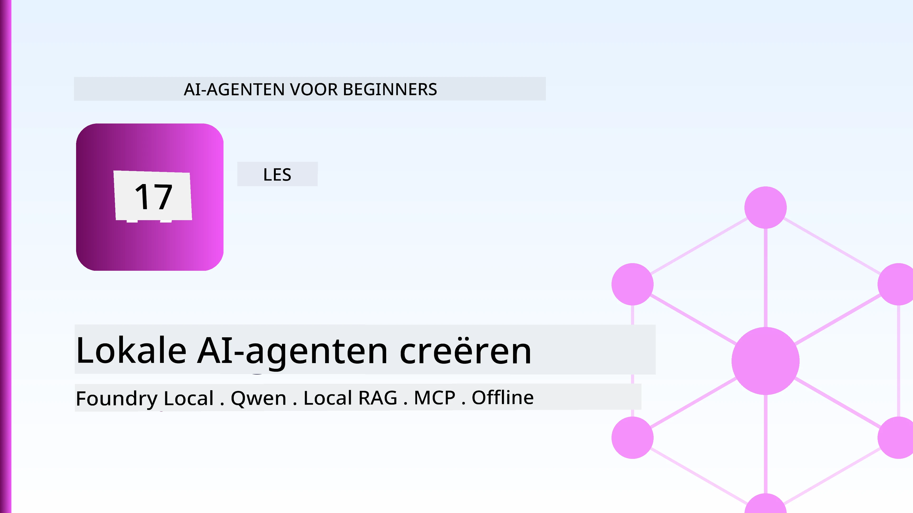
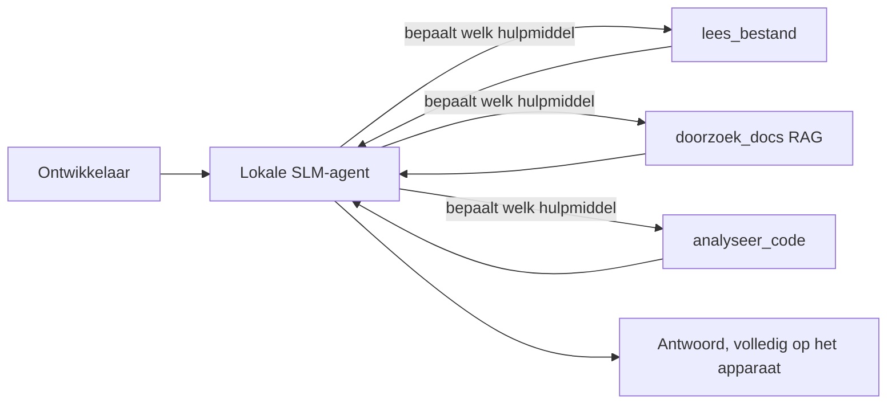
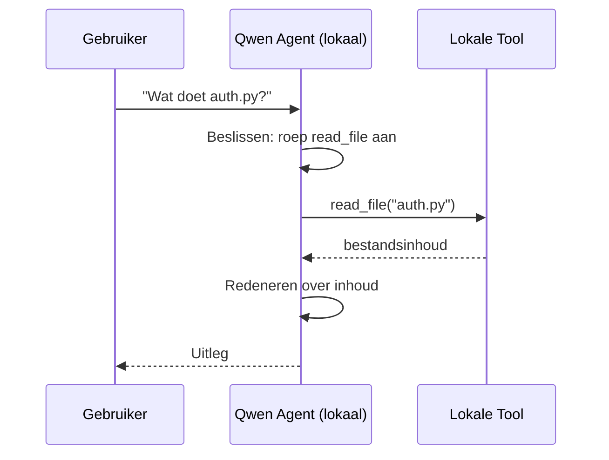
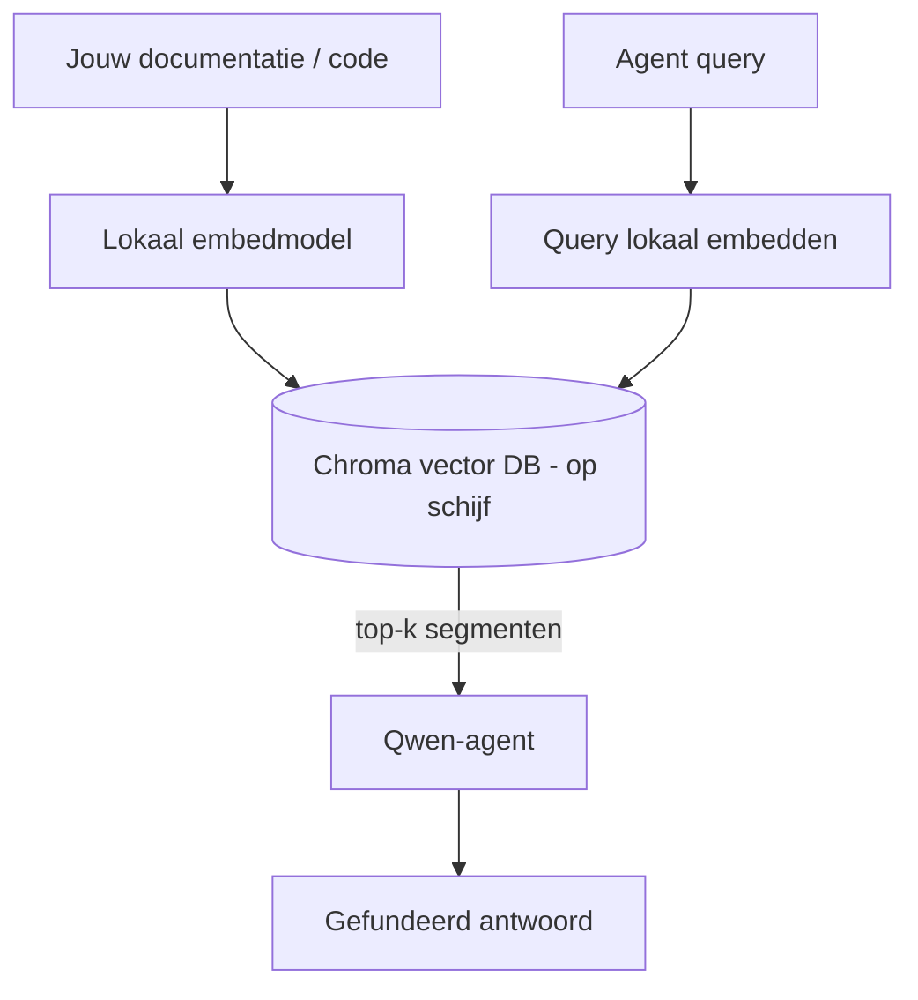
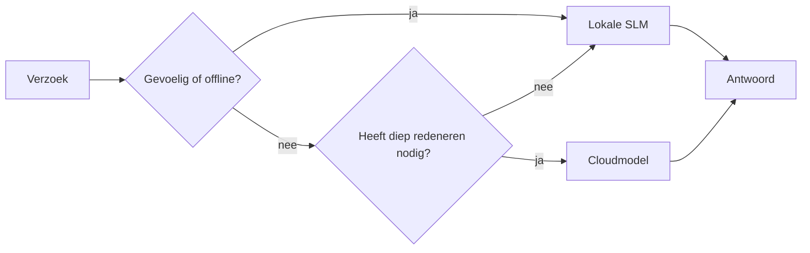

# Lokale AI-agenten maken met Microsoft Foundry Local en Qwen



De vorige les schaalde agenten *op* naar de cloud. Deze brengt ze *naar beneden* op een enkele machine. Aan het einde heb je een werkende engineering-assistent die redeneert, tools aanroept, je bestanden leest en je documentatie doorzoekt — **zonder een enkele cloud-inferentie-aanroep.**

Waarom zou je dat willen? Drie redenen die voortdurend terugkomen in echt technisch werk:

- **Privacy.** De code en documenten verlaten de machine nooit. Geen prompt, geen fragment, geen klantgegevens overschrijden de netwerkgrens.
- **Kosten.** Lokale inferentie brengt geen kosten per token in rekening. Je kunt de hele dag itereren voor de prijs van elektriciteit.
- **Offline.** In het vliegtuig, in een beveiligde faciliteit of tijdens een storing werkt de agent nog steeds.

Het nadeel is dat je een state-of-the-art cloudmodel ruilt voor een **Klein Taalmodel (SLM)** dat draait op je CPU, GPU of NPU. Deze les gaat over het bouwen van agenten die *goed* zijn binnen die beperking in plaats van te doen alsof die beperking er niet is.

## Introductie

Deze les behandelt:

- **Kleine Taalmodellen (SLM's)** — wat ze zijn, waar ze uitblinken en waar niet.
- **Microsoft Foundry Local** — een runtime die modellen downloadt en on-device serveert via een **OpenAI-compatibele API**.
- **Qwen functie-aanroepmodellen** — SLM's die betrouwbaar tool-aanroepen produceren, wat lokale *agenten* (niet alleen lokale chat) mogelijk maakt.
- **Lokale tools, lokale RAG en lokale MCP** — die de agent mogelijkheden geven zonder de cloud.
- **Hybride patronen** — wanneer je lokaal moet blijven en wanneer je naar de cloud grijpt.

## Leerdoelen

Na het voltooien van deze les weet je hoe je:

- De afwegingen van SLM's uitlegt en geschikte use-cases voor lokale agenten kiest.
- Een Qwen-model lokaal serveert met Foundry Local en ermee verbindt via de OpenAI-compatibele endpoint.
- Een tool-aanroepagent bouwt die volledig op je werkstation draait.
- Lokale RAG toevoegt over je eigen documenten met een lokale vectordatabase (Chroma).
- De agent verbindt met een lokale MCP-server en redeneert over hybride lokale/cloud ontwerpen.

## Vereisten

Deze les gaat ervan uit dat je de eerdere lessen hebt voltooid en vertrouwd bent met:

- [Toolgebruik](../04-tool-use/README.md) (Les 4) en [Agentic RAG](../05-agentic-rag/README.md) (Les 5).
- [Agentic Protocols / MCP](../11-agentic-protocols/README.md) (Les 11).
- Het [Microsoft Agent Framework](../14-microsoft-agent-framework/README.md) (Les 14).

Je hebt ook nodig:

- Een ontwikkelaarswerkstation. **8 GB RAM is een realistisch minimum**; 16 GB+ is comfortabel. Een GPU of NPU helpt, maar is niet vereist.
- **Microsoft Foundry Local** geïnstalleerd (zie de setup-sectie hieronder).
- Python 3.12+ en de pakketten in de repository [`requirements.txt`](../../../requirements.txt), plus `foundry-local-sdk`, `openai` en `chromadb` voor deze les.

## Kleine Taalmodellen: het juiste gereedschap voor lokaal werk

Een state-of-the-art cloudmodel heeft honderden miljarden parameters en een datacenter erachter. Een SLM heeft een paar miljard parameters en moet in het RAM van je laptop passen. Dat verschil stelt duidelijke verwachtingen.

**SLM's zijn goed in:**

- Gestructureerde, afgebakende taken — classificatie, extractie, samenvatting van een bekend document.
- **Tool-aanroepen** — beslissen welke functie te roepen en met welke argumenten.
- Snelle, goedkope, privé-iteratie over je eigen data.

**SLM's zijn minder sterk in:**

- Open-eindige, multi-hop redenaties over grote context.
- Brede wereldkennis (ze hebben minder gezien en vergeten meer).

De winnende strategie voor lokale agenten is daarom: **laat het SLM orkestreren en laat tools het zware werk doen.** Het model hoeft je codebase niet *te kennen* — het moet weten wanneer het `read_file` en `search_docs` moet aanroepen. Dat speelt direct in op de sterke punten van een SLM.



## Microsoft Foundry Local

**Microsoft Foundry Local** is een lichte runtime die modellen volledig op je machine downloadt, beheert en serveert. De belangrijkste functie voor ons is dat het een **OpenAI-compatibele HTTP-endpoint** blootstelt — wat betekent dat de OpenAI SDK en de Microsoft Agent Framework OpenAI-client ermee werken door alleen de `base_url` te wijzigen. Alles wat je hebt geleerd over het bouwen van agenten is direct overdraagbaar; alleen de endpoint verhuist van de cloud naar `localhost`.

Foundry Local kiest ook automatisch de beste build van een model voor je hardware — een CPU-build, een CUDA/GPU-build of een NPU-build — zodat je niet per machine handmatig hoeft te optimaliseren.

### Setup

Installeer Foundry Local (zie de [documentatie](https://learn.microsoft.com/azure/ai-foundry/foundry-local/) voor je besturingssysteem), en bevestig dat het werkt:

```bash
# Installeren (bijvoorbeeld; volg de documentatie voor je platform)
winget install Microsoft.FoundryLocal      # Windows
# brew install microsoft/foundrylocal/foundrylocal   # macOS

# Download en voer een Qwen-model uit, start vervolgens de lokale service
foundry model run qwen2.5-7b-instruct
foundry service status
```

Zodra de service draait, heb je een lokale, OpenAI-compatibele endpoint (typisch `http://localhost:PORT/v1`). De notebook gebruikt de `foundry-local-sdk` om de endpoint automatisch te ontdekken, zodat je de poort niet hard hoeft te coderen.

## Qwen Functie-aanroepen: waarom het ertoe doet

Een agent is pas een agent als hij tools kan aanroepen. Veel SLM's kunnen chatten maar produceren onbetrouwbare, verkeerd gevormde tool-aanroepen. **Qwen**-modellen zijn getraind voor functie-aanroepen en produceren consequent goed gevormde tool-aanroepstructuren — dat is precies wat een lokaal chatmodel verandert in een lokale *agent*.

De flow is de standaard tool-aanroeplus die je al kent, maar dan on-device:



## Lokale RAG

Documentatiezoeken is waar lokale agenten hun waarde bewijzen. In plaats van te hopen dat het SLM je framework-docs heeft onthouden, embed je die docs in een **lokale vectordatabase** en laat je de agent de relevante fragmenten op aanvraag ophalen.

We gebruiken **Chroma**, een embedded vectordatabase die in-process draait zonder serverbeheer. De pipeline is volledig lokaal: lokaal embedding-model → lokale vectors → lokale retrieval → lokaal SLM.



Dit is hetzelfde Agentic RAG-patroon uit Les 5 — het enige verschil is dat elk onderdeel op je machine draait.

## Lokale MCP-servers

[MCP](../11-agentic-protocols/README.md) is een transport, geen clouddienst. Een MCP-server kan als lokaal proces draaien op `stdio`, en tools aan je agent blootstellen via het standaardprotocol. Dit laat je het groeiende ecosysteem van MCP-servers hergebruiken — bestandsysteemtoegang, git-operaties, databasequeries — volledig offline.

De beveiligingshouding is anders dan in de cloud, maar niet afwezig: een lokale MCP-server draait nog steeds met de permissies van jouw gebruiker, scope dus wat hij kan aanraken (bijvoorbeeld een projectdirectory, niet je hele thuismap) en behandel zijn output als inputs om te valideren.

## Hybride cloud-en-lokale patronen

Local-first betekent niet local-only. Volwassen systemen routeren op basis van gevoeligheid en moeilijkheid:

| Situatie | Waar draait het |
| --- | --- |
| Gevoelige code/data of offline | **Lokaal SLM** |
| Eenvoudige, afgebakende taak | **Lokaal SLM** (goedkoop, snel) |
| Moeilijke multi-hop redenering over niet-gevoelige data | **Cloudmodel** |
| Alles tijdens een storing | **Lokaal SLM** (gracieuze degradatie) |

Dit weerspiegelt het **model-routerings**idee uit Les 16 — behalve dat een van de "modellen" nu je eigen machine is. Een robuust ontwerp valt terug op lokaal wanneer de cloud niet beschikbaar is, zodat de agent in kwaliteit degradeert in plaats van volledig faalt.



## Praktijklab: een lokale engineering-assistent

Open [`code_samples/17-local-agent-foundry-local.ipynb`](./code_samples/17-local-agent-foundry-local.ipynb) en werk het door. Je bouwt een **lokale engineering-assistent** die volledig op je werkstation draait en kan:

1. **Tools aanroepen** — via Qwen functie-aanroepen door Foundry Local.
2. **Lokale bestandshandelingen uitvoeren** — bestanden in een projectdirectory weergeven en lezen.
3. **Code analyseren** — basisstatistieken over een bronbestand rapporteren.
4. **Documentatie doorzoeken** — lokale RAG over een documentatiemap met Chroma.
5. **MCP gebruiken** — verbinden met een lokale MCP-server (met een nette overslag als er geen is geconfigureerd).

Er wordt op geen enkel moment cloud-inferentie gebruikt.

### Stapsgewijze uitleg

De assistent maakt verbinding met Foundry Local via de OpenAI-compatibele endpoint, dus de agentcode lijkt bijna identiek aan die uit de cloudlessen — alleen de client verandert:

```python
from foundry_local import FoundryLocalManager
from openai import OpenAI

# Foundry Local ontdekt/downloadt het model en geeft ons een lokale eindpunt.
manager = FoundryLocalManager(\"qwen2.5-7b-instruct\")
client = OpenAI(base_url=manager.endpoint, api_key=manager.api_key)  # api_key is een lokale tijdelijke aanduiding
```

De tools zijn gewone Python-functies die gescopeerd zijn naar een projectdirectory:

```python
def read_file(path: str) -> str:
    \"\"\"Read a file, but only inside the sandboxed project directory.\"\"\"
    full = (PROJECT_ROOT / path).resolve()
    if PROJECT_ROOT not in full.parents and full != PROJECT_ROOT:
        return \"Access denied: path is outside the project directory.\"
    return full.read_text(encoding=\"utf-8\")
```

Let op de sandbox-controle — zelfs lokaal is een tool die willekeurige paden leest een risico. De notebook houdt elke tool gescopeerd tot een enkele projectroot.

## Kennischeck

Test je begrip voordat je naar de opdracht gaat.

**1. Noem twee concrete redenen om een agent lokaal te laten draaien in plaats van in de cloud.**

<details>
<summary>Antwoord</summary>

Twee van de volgende: **privacy** (code en data verlaten de machine nooit), **kosten** (geen inferentiekosten per token), en **offline capaciteit** (werkt zonder netwerk — in een vliegtuig, in een beveiligde omgeving of tijdens een storing). Regulerings- en compliancebeperkingen die het versturen van data buiten het apparaat verbieden, zijn een veelvoorkomende reden voor privacy.
</details>

**2. Wat is de aanbevolen taakverdeling tussen een SLM en zijn tools in een lokale agent, en waarom?**

<details>
<summary>Antwoord</summary>

Laat het SLM **orkestreren** (beslissen welke tool aan te roepen en met welke argumenten) en laat **tools het zware werk doen** (bestanden lezen, documentatie ophalen, resultaten berekenen). SLM's zijn sterk in afgebakende beslissingen zoals toolselectie maar zwakker in brede kennis en lange multi-hop redenering, dus het gebruiken van tools speelt in op hun sterke punten.
</details>

**3. Wat maakt het mogelijk om cloud-agentcode te hergebruiken met Foundry Local?**

<details>
<summary>Antwoord</summary>

Foundry Local biedt een **OpenAI-compatibele HTTP-endpoint**. De OpenAI SDK en de OpenAI-client van het Agent Framework werken ermee door alleen de `base_url` te wijzigen (en een lokale placeholder API-sleutel te gebruiken). Alles aan de agentcode blijft hetzelfde.
</details>

**4. Waarom gebruiken we specifiek een Qwen functie-aanroepmodel in plaats van zomaar een SLM?**

<details>
<summary>Antwoord</summary>

Omdat een agent betrouwbare, goed gevormde **tool-aanroepen** moet produceren. Veel SLM's kunnen chatten maar geven verkeerd gevormde of inconsistente tool-aanroepstructuren. Qwen-modellen zijn getraind voor functie-aanroepen en produceren consistente tool-aanroepen, wat een lokaal chatmodel verandert in een werkende lokale agent.
</details>

**5. Welke componenten draaien er in de lokale RAG-pijplijn op de machine?**

<details>
<summary>Antwoord</summary>

Ze draaien er allemaal: het embedding-model, de vectordatabase (Chroma, op schijf), de retrieval-stap en het SLM. Documenten worden lokaal embedded, lokaal opgeslagen, lokaal opgehaald en lokaal beredeneerd door een lokaal model — geen enkel onderdeel raakt de cloud.
</details>

**6. Een lokale MCP-server draait op jouw machine. Maakt dat het automatisch veilig? Welke voorzorg moet je nog nemen?**

<details>
<summary>Antwoord</summary>

Nee. Een lokale MCP-server draait met de permissies van jouw gebruiker, dus hij kan alles aanraken wat jij kan. Beperk het tot wat het nodig heeft (bijvoorbeeld een enkele projectdirectory in plaats van je hele thuismap) en behandel de output als input die je valideert voordat je er iets mee doet.
</details>

**7. Beschrijf een zinvolle hybride routeringsregel die een lokaal model bevat.**

<details>
<summary>Antwoord</summary>

Routeer gevoelige of offline verzoeken naar het lokale SLM; routeer eenvoudige afgebakende taken naar het lokale SLM voor snelheid en kosten; routeer moeilijke multi-hop redeneringen over niet-gevoelige data naar een cloudmodel; en val terug op het lokale SLM als de cloud niet beschikbaar is zodat de agent gracieus degradeert in plaats van faalt. Dit is modelroutering (Les 16) met de lokale machine als een van de modellen.
</details>

**8. Wat is een realistisch minimum RAM-gegeven voor het draaien van de lokale agent in deze les, en wat koop je met meer RAM?**

<details>
<summary>Antwoord</summary>

Ongeveer **8 GB** is een realistisch minimum; 16 GB+ is comfortabel. Meer RAM laat je grotere, capabelere modellen draaien en houdt meer context in het geheugen. Een GPU of NPU versnelt inferentie maar is niet vereist — Foundry Local kiest een CPU-build als er geen versneller beschikbaar is.
</details>

## Opdracht

Breid de lokale engineering-assistent uit tot een **lokale documentatie-beoordelaar** voor een klein project naar keuze (gebruik eventueel een van de lesmappen in deze repo).

Je inzending moet:

1. **Een echte docs/code-map indexeren** in Chroma (minstens vijf bestanden).
2. **Een `find_todos`-tool toevoegen** die het project scant op `TODO`/`FIXME`-commentaar en die teruggeeft met bestandsnaam en regelnummer — met dezelfde sandbox-controle als `read_file`.

3. **Stel de agent drie vragen** die het dwingen om tools te combineren: één pure RAG-vraag, één die het lezen van een specifiek bestand vereist, en één die het vinden van TODO's vereist.
4. **Meet het**: meet de tijd van elk van de drie reacties en noteer ze in een markdown-cel. Geef commentaar op of de latentie acceptabel is voor je beoogde workflow.

Schrijf vervolgens een korte alinea over **wat je naar de cloud zou verplaatsen en wat je lokaal zou houden** voor deze reviewer, en waarom. Je wordt beoordeeld op of de lokale componenten correct zijn gekoppeld en of je hybride redenering klopt — niet op modelkwaliteit.

## Samenvatting

In deze les bouwde je een agent die volledig op je eigen machine draait:

- **SLM's** ruilen breedte in voor privacy, kosten en offline werking — en blinken uit wanneer ze **tools orkestreren** in plaats van alle kennis zelf dragen.
- **Foundry Local** serveert modellen op het apparaat achter een **OpenAI-compatibele endpoint**, zodat je cloud-agentcode met één regel aanpassing overdraagbaar is.
- **Qwen functie-aanroepende modellen** maken betrouwbare lokale tool-aanroepen — en daarmee lokale *agents* — mogelijk.
- **Lokale RAG** (Chroma) en **lokale MCP** geven de agent capaciteit zonder de machine te verlaten.
- **Hybride patronen** laten je routeren op gevoeligheid en moeilijkheid, met lokaal als een elegante fallback.

Dit voltooit de inzetcyclus: Les 16 schaalde agents op in Microsoft Foundry, en deze les schaalde ze af naar één werkstation. De volgende les richt zich op het veilig houden van ingezet agents.

## Aanvullende bronnen

- <a href="https://learn.microsoft.com/azure/ai-foundry/foundry-local/" target="_blank">Microsoft Foundry Local documentatie</a>
- <a href="https://learn.microsoft.com/azure/ai-foundry/what-is-azure-ai-foundry" target="_blank">Microsoft Foundry documentatie</a>
- <a href="https://aka.ms/ai-agents-beginners/agent-framework" target="_blank">Microsoft Agent Framework</a>
- <a href="https://qwen.readthedocs.io/en/latest/framework/function_call.html" target="_blank">Qwen functie-aanroep documentatie</a>
- <a href="https://modelcontextprotocol.io/" target="_blank">Model Context Protocol (MCP)</a>
- <a href="https://docs.trychroma.com/" target="_blank">Chroma vector database</a>

## Vorige les

[Deploying Scalable Agents](../16-deploying-scalable-agents/README.md)

## Volgende les

[Securing AI Agents](../18-securing-ai-agents/README.md)

---

<!-- CO-OP TRANSLATOR DISCLAIMER START -->
**Disclaimer**:
Dit document is vertaald met behulp van de AI vertaaldienst [Co-op Translator](https://github.com/Azure/co-op-translator). Hoewel we streven naar nauwkeurigheid, dient u er rekening mee te houden dat geautomatiseerde vertalingen fouten of onnauwkeurigheden kunnen bevatten. Het originele document in de oorspronkelijke taal moet worden beschouwd als de gezaghebbende bron. Voor kritieke informatie wordt professionele menselijke vertaling aanbevolen. Wij zijn niet aansprakelijk voor eventuele misverstanden of verkeerde interpretaties die voortvloeien uit het gebruik van deze vertaling.
<!-- CO-OP TRANSLATOR DISCLAIMER END -->