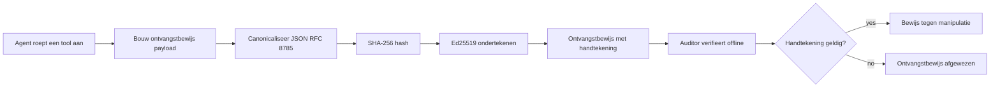
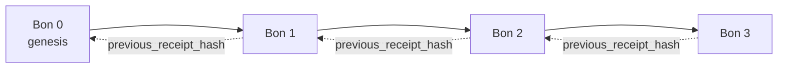

[Bekijk de lesvideo: AI-agenten beveiligen met cryptografische ontvangstbewijzen](https://youtu.be/PLACEHOLDER_VIDEO_ID)

> _(Lesvideo en thumbnail worden toegevoegd door het Microsoft-contentteam na samenvoeging, passend bij het patroon van les 14 / 15.)_

# AI-agenten beveiligen met cryptografische ontvangstbewijzen

## Inleiding

Deze les behandelt:

- Waarom audit-trails voor AI-agenten belangrijk zijn voor compliance, debugging en vertrouwen.
- Wat een cryptografisch ontvangstbewijs is en hoe het verschilt van een niet-ondertekende logregel.
- Hoe je een ondertekend ontvangstbewijs maakt voor een tool-aanroep van een agent in gewone Python.
- Hoe je een ontvangstbewijs offline verifieert en manipulatie detecteert.
- Hoe ontvangstbewijzen aan elkaar ketent zodat het verwijderen of herschikken er één breekt.
- Wat ontvangstbewijzen bewijzen en wat ze expliciet niet bewijzen.

## Leerdoelen

Na het voltooien van deze les weet je hoe je:

- De faalwijzen identificeert die cryptografische herkomst voor agentacties motiveren.
- Een Ed25519-ondertekend ontvangstbewijs maakt over een canonieke JSON-payload.
- Een ontvangstbewijs onafhankelijk verifieert met alleen de openbare sleutel van de ondertekenaar.
- Manipulatie detecteert door verificatie opnieuw uit te voeren op een aangepast ontvangstbewijs.
- Een hash-geketteerde reeks ontvangstbewijzen bouwt en uitlegt waarom de keten belangrijk is.
- De grens herkent tussen wat ontvangstbewijzen bewijzen (attribuering, integriteit, volgorde) en wat ze niet bewijzen (correctheid van de actie, juistheid van het beleid).

## Het probleem: de audit-trail van je agent

Stel je voor dat je een AI-agent hebt ingezet voor Contoso Travel. De agent leest klantverzoeken, roept een vlucht-API aan om opties op te zoeken, en boekt stoelen namens de klant. Vorig kwartaal verwerkte de agent 50.000 boekingen.

Vandaag arriveert een auditor. Ze stellen een simpele vraag: "Laat me zien wat je agent deed."

Je overhandigt je logbestanden. De auditor bekijkt ze en stelt de moeilijkere vraag: "Hoe weet ik dat deze logs niet bewerkt zijn?"

Dit is het probleem van de audit-trail. De meeste agentinzettingen vertrouwen tegenwoordig op:

- **Applicatielogs**: geschreven door de agent zelf, bewerkbaar door iedereen met toegang tot het bestandssysteem.
- **Cloud loggingdiensten**: manipulatieweerzaam op platformniveau maar alleen als de auditor de platformbeheerder vertrouwt.
- **Database-transactielogs**: goed geschikt voor databasewijzigingen maar niet voor willekeurige tool-aanroepen.

Geen van deze kan de vraag van de auditor beantwoorden zonder dat de auditor iemand moet vertrouwen (jou, je cloudprovider, je databaseleverancier). Voor intern gebruik is die vertrouwensbasis vaak acceptabel. Voor gereguleerde workloads (financiën, gezondheidszorg, alles onder de EU AI-verordening) is dat niet zo.

Cryptografische ontvangstbewijzen lossen dit op door elke agentactie onafhankelijk verifieerbaar te maken. De auditor hoeft jou niet te vertrouwen. Ze hebben alleen je openbare sleutel en het ontvangstbewijs zelf nodig.

## Wat is een cryptografisch ontvangstbewijs?

Een ontvangstbewijs is een JSON-object dat vastlegt wat een agent deed en ondertekend is met een digitale handtekening.



Een minimaal ontvangstbewijs ziet er zo uit:

```json
{
  "type": "agent.tool_call.v1",
  "agent_id": "contoso-travel-bot",
  "tool_name": "lookup_flights",
  "tool_args_hash": "sha256:a3f9c1...",
  "result_hash": "sha256:7b2e1d...",
  "policy_id": "contoso-travel-policy-v3",
  "timestamp": "2026-04-25T14:30:00Z",
  "sequence": 47,
  "previous_receipt_hash": "sha256:9d4e6a...",
  "signature": {
    "alg": "EdDSA",
    "sig": "c5af83...",
    "public_key": "8f3b2c..."
  }
}
```

Drie eigenschappen doen het werk:

1. **De handtekening**. Het ontvangstbewijs wordt ondertekend door de gateway van de agent met een Ed25519-private sleutel. Iedereen met de overeenkomende publieke sleutel kan de handtekening offline verifiëren. Manipulatie van enig veld maakt de handtekening ongeldig.

2. **Canonieke codering**. Voor het ondertekenen wordt het ontvangstbewijs geserialiseerd via het JSON Canonicalization Scheme (JCS, RFC 8785). Dit zorgt dat twee implementaties die hetzelfde logische ontvangstbewijs produceren ook byte-identieke uitvoer geven. Zonder canonicalisatie zouden verschillende JSON-serializers verschillende handtekeningen voor dezelfde inhoud produceren.

3. **Hash-ketting**. Het veld `previous_receipt_hash` koppelt elk ontvangstbewijs aan het vorige. Het verwijderen of herschikken van een ontvangstbewijs breekt elk ontvangstbewijs dat erop volgde. Manipulatie wordt zichtbaar op keteniveau, zelfs als individuele handtekeningen worden omzeild.

Samen bieden deze eigenschappen drie garanties:

- **Attribuering**: deze sleutel heeft deze inhoud ondertekend.
- **Integriteit**: de inhoud is sinds ondertekening niet veranderd.
- **Volgorde**: dit ontvangstbewijs kwam na dat ontvangstbewijs in de keten.

## Een ontvangstbewijs maken in Python

Je hebt geen speciale bibliotheek nodig om een ontvangstbewijs te maken. De cryptografische primitieve zijn breed beschikbaar en de logica is een paar tientallen regels Python.

De hands-on oefeningen in `code_samples/18-signed-receipts.ipynb` lopen de volledige flow door. De samenvatting:

```python
import json
import hashlib
import base64
from nacl import signing
from jcs import canonicalize  # RFC 8785 canonieke JSON

def b64url_nopad(data: bytes) -> str:
    return base64.urlsafe_b64encode(data).decode("ascii").rstrip("=")

def sha256_canonical(obj) -> str:
    """SHA-256 of a Python object's JCS-canonical JSON form."""
    return f"sha256:{hashlib.sha256(canonicalize(obj)).hexdigest()}"

# Genereer of laad een ondertekeningssleutel (bewaar deze in productie in een sleutelkluis)
signing_key = signing.SigningKey.generate()
verify_key = signing_key.verify_key

# Bouw de ontvangstpayload (nog geen handtekening)
tool_args = {"origin": "SYD", "destination": "LAX"}
tool_result = [{"flight": "QF11", "price": 1850, "stops": 0}]

payload = {
    "type": "agent.tool_call.v1",
    "agent_id": "contoso-travel-bot",
    "tool_name": "lookup_flights",
    "tool_args_hash": sha256_canonical(tool_args),
    "result_hash": sha256_canonical(tool_result),
    "policy_id": "contoso-travel-policy-v3",
    "timestamp": "2026-04-25T14:30:00Z",
    "sequence": 0,
    "previous_receipt_hash": None,
}

# Canoniseren, hashen, ondertekenen.
canonical_bytes = canonicalize(payload)
message_hash = hashlib.sha256(canonical_bytes).digest()
signature_bytes = signing_key.sign(message_hash).signature

# Voeg een gestructureerd handtekeningobject toe.
receipt = {
    **payload,
    "signature": {
        "alg": "EdDSA",
        "sig": b64url_nopad(signature_bytes),
        "public_key": b64url_nopad(bytes(verify_key)),
    },
}
```

Dat is de gehele ondertekeningspijplijn. De oefeningen in het notebook lopen elke stap na.

## Een ontvangstbewijs verifiëren en manipulatie detecteren

Verificatie is de inverse operatie:

```python
import base64
import hashlib
from nacl import signing
from nacl.exceptions import BadSignatureError
from jcs import canonicalize

def b64url_decode(s: str) -> bytes:
    padding = "=" * ((4 - len(s) % 4) % 4)
    return base64.urlsafe_b64decode(s + padding)

def verify_receipt(receipt: dict) -> bool:
    # De handtekening is een gestructureerd object: {"alg", "sig", "public_key"}.
    sig_obj = receipt.get("signature")
    if not sig_obj or sig_obj.get("alg") != "EdDSA":
        return False

    # Stel de payload die daadwerkelijk is ondertekend opnieuw samen (alles behalve de handtekening).
    payload = {k: v for k, v in receipt.items() if k != "signature"}

    canonical_bytes = canonicalize(payload)
    message_hash = hashlib.sha256(canonical_bytes).digest()

    try:
        verify_key = signing.VerifyKey(b64url_decode(sig_obj["public_key"]))
        verify_key.verify(message_hash, b64url_decode(sig_obj["sig"]))
        return True
    except BadSignatureError:
        return False
```

Deze functie neemt een ontvangstbewijs en geeft `True` terug als de handtekening geldig is, `False` anders. Geen netwerkoproep, geen service-afhankelijkheid, geen vertrouwen in derden nodig.

Om manipulatie detectie in actie te zien, loopt het notebook het volgende door:

1. Een geldig ontvangstbewijs maken en bevestigen dat het verifieert.
2. Één byte van het veld `tool_args_hash` wijzigen.
3. De verificatie opnieuw uitvoeren en zien dat het faalt.

Dit is de praktische demonstratie dat ontvangstbewijzen manipulatie-bestendig zijn: elke wijziging, hoe klein ook, breekt de handtekening.

## Ontvangstbewijzen aan elkaar ketenen voor multi-stap agents

Eén enkel ondertekend ontvangstbewijs beschermt één actie. Een keten van ontvangstbewijzen beschermt een reeks.



Elk ontvangstbewijs registreert de hash van het vorige ontvangstbewijs. Om ontvangstbewijs 2 stiekem te verwijderen, zou een aanvaller moeten:

- Het veld `previous_receipt_hash` van ontvangstbewijs 3 wijzigen (maakt de handtekening van ontvangstbewijs 3 ongeldig), OF
- Een nieuwe handtekening vervalsen op een aangepast ontvangstbewijs 3 (vereist de private sleutel van de agent).

Als de private sleutel in een hardware key vault zit en je publiceert de publieke sleutel met elk ontvangstbewijs, is geen van deze aanvallen uitvoerbaar zonder detectie.

Het notebook loopt het volgende door:

1. Een keten van drie ontvangstbewijzen bouwen.
2. Verifiëren dat elk ontvangstbewijs zijn `previous_receipt_hash` overeenkomt met de werkelijke hash van het voorgaande ontvangstbewijs.
3. Manipulatie aan één ontvangstbewijs in het midden en zien dat de keten op precies dat punt breekt.

Dit is hoe je een audit-trail maakt die een externe auditor kan verifiëren zonder jou te vertrouwen.

## Wat ontvangstbewijzen bewijzen (en wat niet)

Dit is het belangrijkste deel van deze les. Ontvangstbewijzen zijn krachtig, maar hun kracht is begrensd.

**Ontvangstbewijzen bewijzen drie dingen:**

1. **Attribuering**: een specifieke sleutel heeft een specifieke payload ondertekend.
2. **Integriteit**: de payload is sinds ondertekening niet veranderd.
3. **Volgorde**: dit ontvangstbewijs kwam na dat ontvangstbewijs in de hash-keten.

**Ontvangstbewijzen bewijzen NIET:**

1. **Correctheid**: dat de actie van de agent de juiste actie was. Een ontvangstbewijs kan net zo goed voor een fout antwoord worden ondertekend als voor een juist antwoord.
2. **Beleidsnaleving**: dat het beleid aangeduid in `policy_id` daadwerkelijk is geëvalueerd, of dat het deze actie zou hebben toegestaan als het gecontroleerd was. Het ontvangstbewijs registreert wat werd geclaimd, niet wat werd afgedwongen.
3. **Identiteit buiten de sleutel**: het ontvangstbewijs zegt "deze sleutel heeft deze inhoud ondertekend." Het zegt niet "deze mens heeft dit goedgekeurd." Het koppelen van een sleutel aan een persoon of organisatie vereist een aparte identiteitsinfrastructuur (een directory, een public key registry, etc.).
4. **Waarheidsgetrouwheid van invoer**: als de agent een gemanipuleerd prompt ontvangt en daarop handelt, registreert het ontvangstbewijs de actie nauwkeurig. Ontvangstbewijzen zijn downstream van invoercontrole, niet een vervanging daarvan.

Deze grens is belangrijk om twee redenen:

- Het vertelt waarvoor ontvangstbewijzen nuttig zijn: om agentgedrag auditbaar en manipulatie-bestendig te maken, zelfs over organisatorische grenzen heen.
- Het vertelt welke aanvullende lagen je nog nodig hebt: invoercontrole (Les 6), beleidsafdwinging (kort besproken hieronder) en identiteitsinfrastructuur (buiten scope van deze les).

Een veelgemaakte vergissing is te denken dat "we ontvangstbewijzen hebben" betekent "we zijn gereguleerd." Dat is niet zo. Ontvangstbewijzen zijn een fundament. Governance is het systeem dat je erop bouwt.

## Bewijzen dat een mens de exacte actie goedkeurde

Punt 3 hierboven verdient een eigen paragraaf: een actie-ontvangstbewijs zegt "deze sleutel heeft deze inhoud ondertekend," nooit "een mens heeft dit goedgekeurd." Voor risicovolle acties (terugbetalingen, verwijderingen, overboekingen) vereisen governance-kaders steeds vaker precies die ontbrekende verklaring, en die is produceerbaar met dezelfde primitieve die je al in deze les bouwde.

Het vervolg-notebook `code_samples/human-authorization-receipts.ipynb` voegt een tweede ontvangstbewijs-type toe, `human.approval.v1`, in dezelfde envelopvorm als de ontvangstbewijzen in deze les (een getypte payload ondertekend met Ed25519 over de canonieke SHA-256, met het `signature` object buiten de ondertekende bytes). Een benoemde goedkeurder ondertekent de **volledige canonieke actie en de digest** daarvan vóór uitvoering; het actie-ontvangstbewijs van de agent draagt dezelfde actiedigest en een `parent_approval_ref`, de `receipt_hash` van de goedkeuring, dezelfde conventie als `previous_receipt_hash` in de keten die je hierboven bouwde. Eén `verify_chain` loopt over beide artefacten onder **gescheiden pinned key registries** (goedkeurderssleutels versus agentsleutels), zodat het codepad gedeeld is maar de autoriteiten nooit.

De eigenschap die dit oplevert, zorgvuldig geformuleerd: *de mens keurde deze exacte actie goed, en de agent voerde precies die goedgekeurde actie uit.* De geweigerde gevallen in het notebook maken deze eigenschap echt in plaats van verondersteld:

- de klassieke reeks: manipulatie, verwarrende plaatsvervanger, herhaling, vervalste sleutels aan beide zijden, verkeerde invoer;
- **verlopen autoriteit**: een handtekening die nog steeds verifieert, maar toch geweigerd wordt omdat de beleidsversie is veranderd, de goedkeurderssleutel uit de pinned registry is verwijderd, of de goedkeuring vervallen was vóór uitvoering;
- **digest-substitutie**: een geldig ondertekend actie-ontvangstbewijs verwijzend naar een *echte* goedkeuring die bindt aan een *andere* canonieke actie.

Elke fout weigert met een eigen reden, zodat een auditor die een weigering leest kan zien of autoriteit verlopen is of de uitgevoerde actie veranderde. De regel die het notebook leert: een ondertekende goedkeuring is op zichzelf geen autoriteit. Autoriteit bestaat alleen als beide ontvangstbewijzen op het moment van uitvoering nog aan dezelfde canonieke actie binden. Het co-handtekeningenpad in dezelfde Internet-Draft die deze les volgt (`draft-farley-acta-signed-receipts`) is de standaarden-track vorm van dit patroon.

## Productiereferenties

De Python-code in deze les is bewust minimaal zodat je elke regel kunt lezen en precies begrijpt wat er gebeurt. In productie heb je twee opties:

1. **Bouw direct op de cryptografische primitieve.** De 50 regels die je hierboven zag zijn voldoende voor veel toepassingen. PyNaCl (Ed25519) en het `jcs`-pakket (canonieke JSON) zijn goed onderhouden en geauditte bibliotheken.

2. **Gebruik een productiebibliotheek voor ontvangstbewijzen.** Diverse open-source projecten implementeren hetzelfde patroon met extra functies (sleutelrotatie, batchverificatie, JWK Set distributie, integratie met beleids-engines):
   - Het ontvangstbewijsformaat in deze les volgt een IETF Internet-Draft ([`draft-farley-acta-signed-receipts`](https://datatracker.ietf.org/doc/draft-farley-acta-signed-receipts/), revisie 02) die momenteel door de standaardisatieprocedure loopt, met een gedeelde conformance suite ([agent-governance-testvectors](https://github.com/ScopeBlind/agent-governance-testvectors)) waar onafhankelijke implementaties cross-verificatie tegen uitvoeren voor byte-identieke canonieke uitvoer.
   - De Microsoft Agent Governance Toolkit combineert ontvangstbewijzen met Cedar-gebaseerde beleidsbeslissingen; zie Tutorial 33 in die repository voor een end-to-end voorbeeld.
   - De `protect-mcp` (npm) en `@veritasacta/verify` (npm) pakketten bieden een Node-implementatie van ontvangstbewijs-ondertekening en offline verificatie, bedoeld om elke MCP-server te voorzien van een manipulatie-bestendige audit-trail, inclusief een flow waarbij een gepauzeerde actie een goedkeuringsontvangstbewijs uitbrengt dat gebonden is aan de actiedigest (WebAuthn-ondersteund in de desktopflow), hetzelfde goedkeurings-bevestigingspatroon als het human-authorization-notebook hierboven.
   - De **[nobulex](https://github.com/arian-gogani/nobulex)** Python SDK (`pip install nobulex`) levert hetzelfde Ed25519 + JCS ondertekeningspatroon in Python met LangChain- en CrewAI-integraties, inclusief gepubliceerde cross-validatie testvectors en een compliance mapping bijgedragen via [OWASP PR #2210](https://github.com/OWASP/CheatSheetSeries/pull/2210).

De keuze tussen zelf bouwen en een bibliotheek gebruiken weerspiegelt de keuze tussen zelf een JWT-bibliotheek schrijven en een geteste gebruiken: beide zijn redelijk; de bibliotheek bespaart tijd en verkleint het audit-oppervlak; de zelfbouw-methode dwingt je om elke primitief te begrijpen. Deze les leert de zelfbouw-methode zodat je de basis hebt voor beide keuzes.

## Kennischeck

Test je begrip voordat je doorgaat naar de praktijkopdracht.

**1. Een ontvangstbewijs is ondertekend met de private Ed25519-sleutel van de agent. De auditor heeft alleen de publieke sleutel. Kan de auditor het ontvangstbewijs offline verifiëren?**

<details>
<summary>Antwoord</summary>

Ja. Ed25519-verificatie vereist alleen de publieke sleutel en de ondertekende bytes. Geen netwerkoproep, geen service-afhankelijkheid. Dit is de eigenschap die ontvangstbewijzen nuttig maakt in air-gapped, multi-organisatie of laag-vertrouwens auditomgevingen.
</details>

**2. Een aanvaller wijzigt het veld `policy_id` van een ontvangstbewijs om te claimen dat het werd geregeld door een minder streng beleid. De handtekening was over de originele payload. Wat gebeurt er bij verificatie?**

<details>
<summary>Antwoord</summary>


Verificatie mislukt. De handtekening werd berekend over de canonieke bytes van de originele gegevens; het aanpassen van een veld verandert de canonieke bytes, wat de SHA-256-hash verandert en daarmee de handtekening ongeldig maakt. De aanvaller zou de privésleutel nodig hebben om een nieuwe geldige handtekening te produceren, die hij niet heeft.
</details>

**3. Waarom bevat de ontvangst een `tool_args_hash` en `result_hash` in plaats van de ruwe argumenten en het resultaat?**

<details>
<summary>Antwoord</summary>

Twee redenen. Ten eerste moet de ontvangst mogelijk worden gearchiveerd of verzonden in omgevingen waar het lekken van de ruwe inhoud (PII, bedrijfsgegevens) een probleem is. Hashing houdt de ontvangst klein en de inhoud privé; de auditor verifieert dat de hash overeenkomt met een apart opgeslagen kopie van de daadwerkelijke inhoud. Ten tweede hebben hashes een vaste grootte; een ontvangst met hashes is in grootte begrensd, ongeacht hoe groot de inputs en outputs waren.
</details>

**4. Het veld `previous_receipt_hash` koppelt elke ontvangst aan zijn voorganger. Wat wordt ongeldig als een aanvaller stilletjes een ontvangst uit het midden van een keten verwijdert?**

<details>
<summary>Antwoord</summary>

Elke ontvangst die na de verwijderde kwam. Hun `previous_receipt_hash` velden corresponderen niet langer met de daadwerkelijke keten (omdat de ontvangst waarnaar verwezen werd niet meer bestaat, of de keten nu naar een andere voorganger wijst). Om de verwijdering te verbergen, zou de aanvaller elke latere ontvangst opnieuw moeten ondertekenen, wat de privésleutel vereist.
</details>

**5. Een ontvangst verifieert correct. Bewijst dat dat de actie van de agent correct, juist of in overeenstemming met het beleid was?**

<details>
<summary>Antwoord</summary>

Nee. Een geldige ontvangst bewijst drie dingen: attributie (deze sleutel heeft deze inhoud ondertekend), integriteit (de inhoud is niet veranderd) en volgorde (deze ontvangst kwam na die ontvangst). Het bewijst NIET dat de actie correct was, dat het in `policy_id` genoemde beleid daadwerkelijk is geëvalueerd, of dat de agent elke regel heeft gevolgd. Ontvangsten maken het gedrag van de agent auditbaar, niet noodzakelijkerwijs correct. Dit is de belangrijkste grens in de les.
</details>

## Oefening

Open `code_samples/18-signed-receipts.ipynb` en voltooi alle vier secties:

1. **Sectie 1**: Onderteken je eerste ontvangst en verifieer deze.
2. **Sectie 2**: Manipuleer de ontvangst en observeer dat verificatie mislukt.
3. **Sectie 3**: Bouw een keten van drie ontvangsten en verifieer de integriteit van de keten.
4. **Sectie 4**: Pas het patroon toe op een agent gebouwd met het Microsoft Agent Framework: wikkel een tool-aanroep in ontvangst-ondertekening en verifieer vervolgens de ontvangst onafhankelijk.

**Uitdagende opdracht 1:** breid het ontvangstschema uit met een extra veld naar keuze (bijvoorbeeld een verzoek-ID voor tracing), werk de canonieke ondertekeningslogica bij om dit op te nemen, en bevestig dat de ontvangst nog steeds correct door de verificatie gaat. Pas het veld vervolgens aan na ondertekening en bevestig dat verificatie faalt. Dit dwingt je te begrijpen hoe elke byte van de canonieke codering bijdraagt aan de handtekening.

**Uitdagende opdracht 2:** SHA-256-hash twee van je ontvangsten samen (concateneer hun canonieke bytes in een deterministische volgorde) en verwerk de resulterende digest als een nieuw veld in een derde ontvangst voordat je deze ondertekent. Verifieer dat alle drie de ontvangsten nog steeds correct door de verificatie gaan. Je hebt zojuist een één-stap inclusie bewijs gebouwd: iedereen die de derde ontvangst heeft, kan aantonen dat de eerste twee bestonden op het moment van ondertekening, zonder hun inhoud te hoeven onthullen. Dit is het patroon dat selective-disclosure ontvangsten op schaal gebruiken (Merkle-commits, RFC 6962).

## Conclusie

Cryptografische ontvangsten geven AI-agenten een audittrail die:

- **Onafhankelijk verifieerbaar**: elke partij met de publieke sleutel kan verifiëren, geen afhankelijkheid van een dienst.
- **Manipulatie-bestendig**: elke wijziging maakt de handtekening ongeldig.
- **Draagbaar**: een ontvangst is een klein JSON-bestand; het kan overal worden gearchiveerd, verzonden en geverifieerd.
- **Standaard-gealigneerd**: gebouwd op Ed25519 (RFC 8032), JCS (RFC 8785) en SHA-256, allemaal breed gebruikte primitieve vormen.

Ze zijn geen vervanging voor invoervalidatie, beleidsafhandeling of identiteitsinfrastructuur. Ze vormen de basis voor die lagen. Wanneer je agenten inzet in gereguleerde workloads, multi-organisatie-workflows of elke situatie waarin een toekomstige auditor je niet zomaar vertrouwt, zijn ontvangsten hoe je de audittrail eerlijk maakt.

Het belangrijkste inzicht: ontvangsten bewijzen wie wat, wanneer zei. Ze bewijzen niet dat wat werd gezegd waar of juist was. Houd dat onderscheid goed in gedachten. Het is het verschil tussen een eerlijk herkomstsysteem en een misleidend systeem.

## Productie-checklist

Wanneer je klaar bent om van deze les over te stappen op het inzetten van agenten met ondertekende ontvangsten in een echte omgeving:

- [ ] **Verplaats de ondertekeningssleutel van de ontwikkelaarslaptop.** Gebruik Azure Key Vault, AWS KMS of een hardware security module. De privésleutel die je ontvangsten ondertekent mag nooit in source control of in platte tekst op applicatiemachines opgeslagen zijn.
- [ ] **Publiceer de verificatie publieke sleutel.** Auditoren hebben deze nodig om offline te kunnen verifiëren. Het standaardpatroon is een JWK Set op een bekende URL (RFC 7517), bijvoorbeeld `https://your-org.example.com/.well-known/agent-keys.json`.
- [ ] **Veranker de keten extern.** Schrijf periodiek de nieuwste ketenhoofd-hash naar een transparantielogboek (Sigstore Rekor, RFC 3161 timestamp authority, of een tweede intern systeem) zodat een externe partij kan bevestigen "deze keten bestond op dit moment."
- [ ] **Bewaar ontvangsten onveranderlijk.** Append-only blob opslag (Azure Storage met onveranderlijkheidsbeleid, AWS S3 Object Lock) voorkomt dat een insider de geschiedenis op opslagniveau herschrijft.
- [ ] **Bepaal bewaartermijn.** Veel compliance-regimes vereisen meerjarig bewaren. Plan voor ontvangstgroei (elke ontvangst is ~500 bytes; een agent die 10.000 oproepen per dag maakt produceert ~1,8 GB per jaar).
- [ ] **Documenteer wat ontvangsten niet dekken.** Ontvangsten bewijzen attributie, integriteit en volgorde. Je runbook moet expliciet aangeven welke aanvullende controles (invoervalidatie, beleidsafhandeling, snelheidsbegrenzing, identiteitsinfrastructuur) naast ontvangsten zitten in je governance-positie.

### Meer vragen over het beveiligen van AI-agenten?

Word lid van de [Microsoft Foundry Discord](https://aka.ms/ai-agents/discord) om andere leerlingen te ontmoeten, deel te nemen aan spreekuren, en antwoorden te krijgen op je AI-agent vragen.

## Verder dan deze les

Deze les behandelt het ondertekenen van een enkele ontvangst en hash-geketende reeksen. Dezelfde primitieve technieken vormen de basis voor verschillende meer geavanceerde patronen die je kunt tegenkomen naarmate je governance-positie volwassen wordt:

- **Selective disclosure.** Wanneer velden van een ontvangst onafhankelijk gecommitteerd zijn (RFC 6962-stijl Merkle-boom), kun je specifieke velden aan specifieke auditoren onthullen en aantonen dat de rest ongewijzigd is zonder ze te exposeren. Handig wanneer dezelfde ontvangst moet voldoen aan een uitgebreide audit (die volledigheid wil) en gegevensminimalisatie-regelgeving zoals GDPR (die wil dat de auditor zo min mogelijk ziet).
- **Intrekking van ontvangsten.** Als een ondertekeningssleutel gecompromitteerd wordt, heb je een manier nodig om alle ontvangsten die met die sleutel zijn ondertekend vanaf een bepaald tijdstip als onbetrouwbaar te markeren. Standaardpatronen: kortdurende ondertekeningssleutels plus een gepubliceerde intrekkingslijst, of een transparantielogboek met intrekkingsvermeldingen.
- **Bilaterale / split-handtekening ontvangsten.** Sommige implementaties splitsen de ondertekende gegevens in pre-executie (`authorization_*`) en post-executie (`result_*`) helften met onafhankelijke handtekeningen, nuttig wanneer de autorisatiebeslissing en het geobserveerde resultaat door verschillende actoren of op verschillende tijdstippen worden geproduceerd. Dit voegt opbouwend toe aan het ontvangstformaat dat in deze les wordt behandeld.
- **Compositie van payload.** Een ontvangst verzegelt welke bytes je ook in `result_hash` plaatst. Payloads uit de praktijk zijn vaak rijker dan een enkel resultaat van een tool-aanroep: pre-beslissingsredenering (modelvoorspelling, afgewogen opties, bewijs en volledigheid daarvan, risicohouding, verantwoordingsketen, poortuitkomst) kan allemaal in de payload zitten, verzegeld door een enkele ontvangst. Dit houdt het ontvangsformaat minimaal terwijl payloadschema’s domein-per-domein kunnen evolueren.
- **Conformiteit tussen implementaties.** Meerdere onafhankelijke implementaties van hetzelfde ontvangstformaat (Python, TypeScript, Rust, Go) verifiëren elkaar tegen gedeelde testvectoren. Als je je eigen implementatie bouwt, bevestigt validatie tegen gepubliceerde vectoren draadcompatibiliteit.
- **Post-quantum migratie.** Ed25519 is vandaag breed ingezet, maar is niet kwantumbestendig. Het ontvangstformaat is algoritme-agiel: het `signature.alg` veld kan `ML-DSA-65` dragen (de NIST post-quantum handtekeningstandaard) wanneer je moet migreren. Plan een overgangsperiode waarin ontvangsten dual-ondertekend zijn.

## Aanvullende bronnen

- <a href="https://datatracker.ietf.org/doc/draft-farley-acta-signed-receipts/" target="_blank">IETF Internet-Draft: Signed Decision Receipts for Machine-to-Machine Access Control</a>
- <a href="https://learn.microsoft.com/azure/ai-studio/responsible-use-of-ai-overview" target="_blank">Responsible AI overview (Azure AI)</a>
- <a href="https://datatracker.ietf.org/doc/html/rfc8032" target="_blank">RFC 8032: Edwards-Curve Digital Signature Algorithm (EdDSA)</a>
- <a href="https://datatracker.ietf.org/doc/html/rfc8785" target="_blank">RFC 8785: JSON Canonicalization Scheme (JCS)</a>
- <a href="https://datatracker.ietf.org/doc/html/rfc6962" target="_blank">RFC 6962: Certificate Transparency</a> (Merkle-boomconstructie gebruikt door selective-disclosure ontvangsten)
- <a href="https://github.com/microsoft/agent-governance-toolkit/blob/main/docs/tutorials/33-offline-verifiable-receipts.md" target="_blank">Microsoft Agent Governance Toolkit, Tutorial 33: Offline-Verifieerbare Decision Receipts</a>
- <a href="https://github.com/ScopeBlind/agent-governance-testvectors" target="_blank">Cross-implementatie conformiteitstestvectoren</a> voor het ontvangstformaat gebruikt in deze les (Apache-2.0)
- <a href="https://pynacl.readthedocs.io/" target="_blank">PyNaCl documentatie</a> (Ed25519 in Python)

## Vorige les

[Lokale AI-agenten maken](../17-creating-local-ai-agents/README.md)

---

<!-- CO-OP TRANSLATOR DISCLAIMER START -->
**Disclaimer**:
Dit document is vertaald met behulp van de AI vertaaldienst [Co-op Translator](https://github.com/Azure/co-op-translator). Hoewel we streven naar nauwkeurigheid, dient u er rekening mee te houden dat geautomatiseerde vertalingen fouten of onnauwkeurigheden kunnen bevatten. Het originele document in de oorspronkelijke taal moet worden beschouwd als de gezaghebbende bron. Voor kritieke informatie wordt professionele menselijke vertaling aanbevolen. Wij zijn niet aansprakelijk voor eventuele misverstanden of verkeerde interpretaties die voortvloeien uit het gebruik van deze vertaling.
<!-- CO-OP TRANSLATOR DISCLAIMER END -->