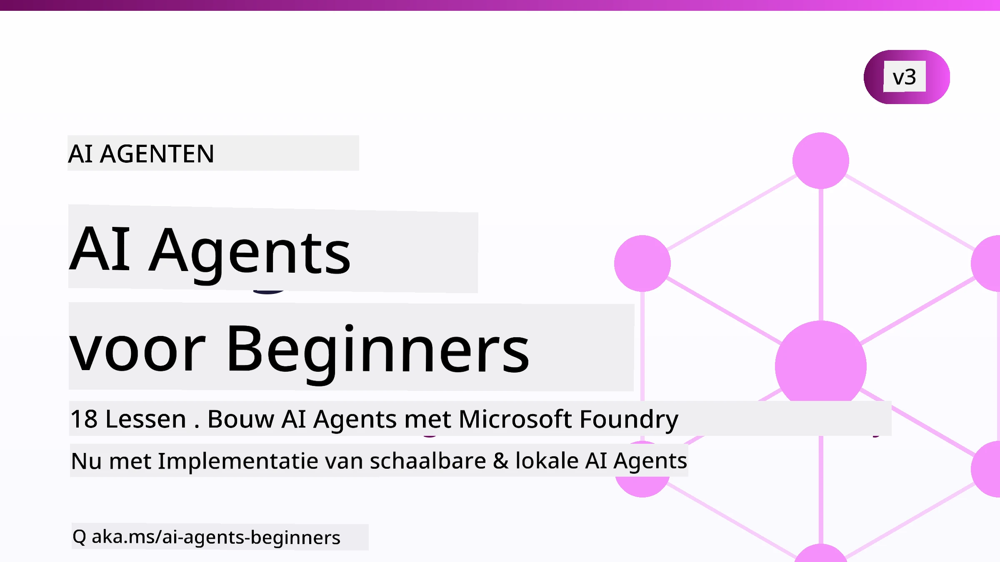

# AI Agents voor Beginners - Een Cursus



## Een cursus waarin alles wordt uitgelegd wat je moet weten om te beginnen met het bouwen van AI Agents

[](https://github.com/microsoft/ai-agents-for-beginners/blob/master/LICENSE?WT.mc_id=academic-105485-koreyst)
[](https://GitHub.com/microsoft/ai-agents-for-beginners/graphs/contributors/?WT.mc_id=academic-105485-koreyst)
[](https://GitHub.com/microsoft/ai-agents-for-beginners/issues/?WT.mc_id=academic-105485-koreyst)
[](https://GitHub.com/microsoft/ai-agents-for-beginners/pulls/?WT.mc_id=academic-105485-koreyst)
[](http://makeapullrequest.com?WT.mc_id=academic-105485-koreyst)

### 🌐 Meertalige Ondersteuning

#### Ondersteund via GitHub Action (Geautomatiseerd & Altijd Up-to-Date)

<!-- CO-OP TRANSLATOR LANGUAGES TABLE START -->
[Arabisch](../ar/README.md) | [Bengaals](../bn/README.md) | [Bulgaars](../bg/README.md) | [Birmaans (Myanmar)](../my/README.md) | [Chinees (Vereenvoudigd)](../zh-CN/README.md) | [Chinees (Traditioneel, Hong Kong)](../zh-HK/README.md) | [Chinees (Traditioneel, Macau)](../zh-MO/README.md) | [Chinees (Traditioneel, Taiwan)](../zh-TW/README.md) | [Kroatisch](../hr/README.md) | [Tsjechisch](../cs/README.md) | [Deens](../da/README.md) | [Nederlands](./README.md) | [Ests](../et/README.md) | [Fins](../fi/README.md) | [Frans](../fr/README.md) | [Duits](../de/README.md) | [Grieks](../el/README.md) | [Hebreeuws](../he/README.md) | [Hindi](../hi/README.md) | [Hongaars](../hu/README.md) | [Indonesisch](../id/README.md) | [Italiaans](../it/README.md) | [Japans](../ja/README.md) | [Kannada](../kn/README.md) | [Khmer](../km/README.md) | [Koreaans](../ko/README.md) | [Litouws](../lt/README.md) | [Maleis](../ms/README.md) | [Malayalam](../ml/README.md) | [Marathi](../mr/README.md) | [Nepalees](../ne/README.md) | [Nigeriaans Pidgin](../pcm/README.md) | [Noors](../no/README.md) | [Perzisch (Farsi)](../fa/README.md) | [Pools](../pl/README.md) | [Portugees (Brazilië)](../pt-BR/README.md) | [Portugees (Portugal)](../pt-PT/README.md) | [Punjabi (Gurmukhi)](../pa/README.md) | [Roemeens](../ro/README.md) | [Russisch](../ru/README.md) | [Servisch (Cyrillisch)](../sr/README.md) | [Slowaaks](../sk/README.md) | [Sloveens](../sl/README.md) | [Spaans](../es/README.md) | [Swahili](../sw/README.md) | [Zweeds](../sv/README.md) | [Tagalog (Filipijns)](../tl/README.md) | [Tamil](../ta/README.md) | [Telugu](../te/README.md) | [Thais](../th/README.md) | [Turks](../tr/README.md) | [Oekraïens](../uk/README.md) | [Urdu](../ur/README.md) | [Vietnamees](../vi/README.md)

> **Liever lokaal klonen?**
>
> Deze repository bevat meer dan 50 taalvertalingen, wat de downloadgrootte aanzienlijk vergroot. Om te klonen zonder vertalingen, gebruik sparse checkout:
>
> **Bash / macOS / Linux:**
> ```bash
> git clone --filter=blob:none --sparse https://github.com/microsoft/ai-agents-for-beginners.git
> cd ai-agents-for-beginners
> git sparse-checkout set --no-cone '/*' '!translations' '!translated_images'
> ```
>
> **CMD (Windows):**
> ```cmd
> git clone --filter=blob:none --sparse https://github.com/microsoft/ai-agents-for-beginners.git
> cd ai-agents-for-beginners
> git sparse-checkout set --no-cone "/*" "!translations" "!translated_images"
> ```
>
> Dit geeft je alles wat je nodig hebt om de cursus te voltooien met een veel snellere download.
<!-- CO-OP TRANSLATOR LANGUAGES TABLE END -->

**Als je wilt dat er extra vertalingen worden ondersteund, staan deze hier [vermeld](https://github.com/Azure/co-op-translator/blob/main/getting_started/supported-languages.md).**

[](https://GitHub.com/microsoft/ai-agents-for-beginners/watchers/?WT.mc_id=academic-105485-koreyst)
[](https://GitHub.com/microsoft/ai-agents-for-beginners/network/?WT.mc_id=academic-105485-koreyst)
[](https://GitHub.com/microsoft/ai-agents-for-beginners/stargazers/?WT.mc_id=academic-105485-koreyst)

[](https://discord.com/invite/ATgtXmAS5D)


## 🌱 Aan de Slag

Deze cursus bevat lessen over de basisprincipes van het bouwen van AI Agents. Elke les behandelt een eigen onderwerp, dus begin waar je maar wilt!

Er is meertalige ondersteuning voor deze cursus. Bekijk onze [beschikbare talen hier](#-multi-language-support). 

Als dit je eerste keer is dat je bouwt met Generatieve AI-modellen, bekijk dan onze cursus [Generative AI For Beginners](https://aka.ms/genai-beginners), die 21 lessen bevat over bouwen met GenAI.

Vergeet niet om deze repo te [sterren (🌟)](https://docs.github.com/en/get-started/exploring-projects-on-github/saving-repositories-with-stars?WT.mc_id=academic-105485-koreyst) en de repo te [forken](https://github.com/microsoft/ai-agents-for-beginners/fork) om de code uit te voeren.

### Ontmoet Andere Leerlingen, Krijg Antwoorden op Je Vragen

Als je vastloopt of vragen hebt over het bouwen van AI Agents, join dan ons speciale Discord-kanaal in de [Microsoft Foundry Discord](https://aka.ms/ai-agents/discord).

### Wat Je Nodig Hebt 

Elke les in deze cursus bevat codevoorbeelden, te vinden in de code_samples map. Je kunt deze repo [forken](https://github.com/microsoft/ai-agents-for-beginners/fork) om je eigen kopie te maken.  

De codevoorbeelden in deze oefeningen maken gebruik van Microsoft Agent Framework met Microsoft Foundry Agent Service V2:

- [Microsoft Foundry](https://aka.ms/ai-agents-beginners/ai-foundry) - Azure Account Vereist

Deze cursus maakt gebruik van de volgende AI Agent-frameworks en -diensten van Microsoft:

- [Microsoft Agent Framework (MAF)](https://aka.ms/ai-agents-beginners/agent-framework)
- [Microsoft Foundry Agent Service V2](https://aka.ms/ai-agents-beginners/ai-agent-service)

Sommige codevoorbeelden ondersteunen ook alternatieve OpenAI-compatibele aanbieders zoals [MiniMax](https://platform.minimaxi.com/), die grote-contextmodellen aanbiedt (tot 204K tokens). Zie de [Course Setup](./00-course-setup/README.md) voor configuratiedetails.

Voor meer informatie over het uitvoeren van de code voor deze cursus, ga naar de [Course Setup](./00-course-setup/README.md).

## 🙏 Wil je helpen?

Heb je suggesties of heb je spelling- of codefouten gevonden? [Meld een issue](https://github.com/microsoft/ai-agents-for-beginners/issues?WT.mc_id=academic-105485-koreyst) of [Maak een pull request](https://github.com/microsoft/ai-agents-for-beginners/pulls?WT.mc_id=academic-105485-koreyst)


## 📂 Elke les bevat

- Een geschreven les in de README en een korte video
- Python-codevoorbeelden die Microsoft Agent Framework met Microsoft Foundry gebruiken
- Links naar extra bronnen om je leren voort te zetten


## 🗃️ Lessen

| **Les**                                   | **Tekst & Code**                                    | **Video**                                                  | **Extra Leren**                                                                     |
|----------------------------------------------|----------------------------------------------------|------------------------------------------------------------|----------------------------------------------------------------------------------------|
| Introductie tot AI Agents en Gebruiksscenario's       | [Link](./01-intro-to-ai-agents/README.md)          | [Video](https://youtu.be/3zgm60bXmQk?si=z8QygFvYQv-9WtO1)  | [Link](https://aka.ms/ai-agents-beginners/collection?WT.mc_id=academic-105485-koreyst) |
| Verkennen van AI Agentische Frameworks              | [Link](./02-explore-agentic-frameworks/README.md)  | [Video](https://youtu.be/ODwF-EZo_O8?si=Vawth4hzVaHv-u0H)  | [Link](https://aka.ms/ai-agents-beginners/collection?WT.mc_id=academic-105485-koreyst) |
| Begrijpen van AI Agentische Ontwerppatronen        | [Link](./03-agentic-design-patterns/README.md)     | [Video](https://youtu.be/m9lM8qqoOEA?si=BIzHwzstTPL8o9GF)  | [Link](https://aka.ms/ai-agents-beginners/collection?WT.mc_id=academic-105485-koreyst) |
| Ontwerppatroon Gebruik van Tools                      | [Link](./04-tool-use/README.md)                    | [Video](https://youtu.be/vieRiPRx-gI?si=2z6O2Xu2cu_Jz46N)  | [Link](https://aka.ms/ai-agents-beginners/collection?WT.mc_id=academic-105485-koreyst) |
| Agentic RAG                                  | [Link](./05-agentic-rag/README.md)                 | [Video](https://youtu.be/WcjAARvdL7I?si=gKPWsQpKiIlDH9A3)  | [Link](https://aka.ms/ai-agents-beginners/collection?WT.mc_id=academic-105485-koreyst) |
| Vertrouwenswaardige AI Agents bouwen               | [Link](./06-building-trustworthy-agents/README.md) | [Video](https://youtu.be/iZKkMEGBCUQ?si=jZjpiMnGFOE9L8OK ) | [Link](https://aka.ms/ai-agents-beginners/collection?WT.mc_id=academic-105485-koreyst) |
| Ontwerppatroon Planning                      | [Link](./07-planning-design/README.md)             | [Video](https://youtu.be/kPfJ2BrBCMY?si=6SC_iv_E5-mzucnC)  | [Link](https://aka.ms/ai-agents-beginners/collection?WT.mc_id=academic-105485-koreyst) |
| Ontwerppatroon Multi-Agent                   | [Link](./08-multi-agent/README.md)                 | [Video](https://youtu.be/V6HpE9hZEx0?si=rMgDhEu7wXo2uo6g)  | [Link](https://aka.ms/ai-agents-beginners/collection?WT.mc_id=academic-105485-koreyst) |

| Metacognitie Ontwerp Patroon                 | [Link](./09-metacognition/README.md)               | [Video](https://youtu.be/His9R6gw6Ec?si=8gck6vvdSNCt6OcF)  | [Link](https://aka.ms/ai-agents-beginners/collection?WT.mc_id=academic-105485-koreyst) |
| AI-agenten in Productie                      | [Link](./10-ai-agents-production/README.md)        | [Video](https://youtu.be/l4TP6IyJxmQ?si=31dnhexRo6yLRJDl)  | [Link](https://aka.ms/ai-agents-beginners/collection?WT.mc_id=academic-105485-koreyst) |
| Agentische Protocollen Gebruiken (MCP, A2A en NLWeb) | [Link](./11-agentic-protocols/README.md)           | [Video](https://youtu.be/X-Dh9R3Opn8)                                 | [Link](https://aka.ms/ai-agents-beginners/collection?WT.mc_id=academic-105485-koreyst) |
| Context Engineering voor AI-agenten            | [Link](./12-context-engineering/README.md)         | [Video](https://youtu.be/F5zqRV7gEag)                                 | [Link](https://aka.ms/ai-agents-beginners/collection?WT.mc_id=academic-105485-koreyst) |
| Agentisch Geheugen Beheren                      | [Link](./13-agent-memory/README.md)     |      [Video](https://youtu.be/QrYbHesIxpw?si=vZkVwKrQ4ieCcIPx)                                                      |                                                                                        |
| Verkennen van Microsoft Agent Framework                         | [Link](./14-microsoft-agent-framework/README.md)                            |                                                            |                                                                                        |
| Computer Use Agents (CUA) Bouwen           | [Link](./15-browser-use/README.md)     |                                                            | [Link](https://docs.browser-use.com/examples/templates/playwright-integration)         |
| Schaalbare Agenten Uitrollen                    | [Link](./16-deploying-scalable-agents/README.md) |                                                    | [Link](https://learn.microsoft.com/azure/ai-foundry/agents/overview)                   |
| Lokale AI-agenten Maken                     | [Link](./17-creating-local-ai-agents/README.md)  |                                                    | [Link](https://learn.microsoft.com/azure/ai-foundry/foundry-local/)                    |
| AI-agenten Beveiligen                           | [Link](./18-securing-ai-agents/README.md)  |                                                            | [Link](https://aka.ms/ai-agents-beginners/collection?WT.mc_id=academic-105485-koreyst) |

## 🎒 Andere Cursussen

Ons team produceert andere cursussen! Bekijk:

<!-- CO-OP TRANSLATOR OTHER COURSES START -->
### LangChain
[](https://aka.ms/langchain4j-for-beginners)
[](https://aka.ms/langchainjs-for-beginners?WT.mc_id=m365-94501-dwahlin)
[](https://github.com/microsoft/langchain-for-beginners?WT.mc_id=m365-94501-dwahlin)
---

### Azure / Edge / MCP / Agents
[](https://github.com/microsoft/AZD-for-beginners?WT.mc_id=academic-105485-koreyst)
[](https://github.com/microsoft/edgeai-for-beginners?WT.mc_id=academic-105485-koreyst)
[](https://github.com/microsoft/mcp-for-beginners?WT.mc_id=academic-105485-koreyst)
[](https://github.com/microsoft/ai-agents-for-beginners?WT.mc_id=academic-105485-koreyst)

---
 
### Generatieve AI Reeks
[](https://github.com/microsoft/generative-ai-for-beginners?WT.mc_id=academic-105485-koreyst)
[-9333EA?style=for-the-badge&labelColor=E5E7EB&color=9333EA)](https://github.com/microsoft/Generative-AI-for-beginners-dotnet?WT.mc_id=academic-105485-koreyst)
[-C084FC?style=for-the-badge&labelColor=E5E7EB&color=C084FC)](https://github.com/microsoft/generative-ai-for-beginners-java?WT.mc_id=academic-105485-koreyst)
[-E879F9?style=for-the-badge&labelColor=E5E7EB&color=E879F9)](https://github.com/microsoft/generative-ai-with-javascript?WT.mc_id=academic-105485-koreyst)

---
 
### Kernleren
[](https://aka.ms/ml-beginners?WT.mc_id=academic-105485-koreyst)
[](https://aka.ms/datascience-beginners?WT.mc_id=academic-105485-koreyst)
[](https://aka.ms/ai-beginners?WT.mc_id=academic-105485-koreyst)
[](https://github.com/microsoft/Security-101?WT.mc_id=academic-96948-sayoung)
[](https://aka.ms/webdev-beginners?WT.mc_id=academic-105485-koreyst)
[](https://aka.ms/iot-beginners?WT.mc_id=academic-105485-koreyst)
[](https://github.com/microsoft/xr-development-for-beginners?WT.mc_id=academic-105485-koreyst)

---
 
### Copilot Reeks
[](https://aka.ms/GitHubCopilotAI?WT.mc_id=academic-105485-koreyst)
[](https://github.com/microsoft/mastering-github-copilot-for-dotnet-csharp-developers?WT.mc_id=academic-105485-koreyst)
[](https://github.com/microsoft/CopilotAdventures?WT.mc_id=academic-105485-koreyst)
<!-- CO-OP TRANSLATOR OTHER COURSES END -->

## 🌟 Bedankt aan de Community

Bedankt aan [Shivam Goyal](https://www.linkedin.com/in/shivam2003/) voor het bijdragen van belangrijke codevoorbeelden die Agentic RAG demonstreren. 

## Bijdragen

Dit project verwelkomt bijdragen en suggesties. De meeste bijdragen vereisen dat je akkoord gaat met een
Contributor License Agreement (CLA) waarin je verklaart dat je het recht hebt en daadwerkelijk verleent
dat wij de rechten hebben om jouw bijdrage te gebruiken. Voor details, bezoek <https://cla.opensource.microsoft.com>.

Wanneer je een pull request indient, zal een CLA-bot automatisch bepalen of je een CLA moet verstrekken
en het PR passend markeren (bijv. statuscontrole, commentaar). Volg gewoon de instructies
die door de bot worden gegeven. Je hoeft dit slechts één keer te doen voor alle repositories die onze CLA gebruiken.

Dit project heeft de [Microsoft Open Source Gedragscode](https://opensource.microsoft.com/codeofconduct/) aangenomen.
Voor meer informatie zie de [Gedragscode FAQ](https://opensource.microsoft.com/codeofconduct/faq/) of
neem contact op met [opencode@microsoft.com](mailto:opencode@microsoft.com) voor aanvullende vragen of opmerkingen.

## Handelsmerken

Dit project kan handelsmerken of logo's bevatten van projecten, producten of diensten. Geautoriseerd gebruik van Microsoft
handelsmerken of logo's is onderworpen aan en moet voldoen aan
[Microsoft's Richtlijnen voor Handelsmerk & Merkgebruik](https://www.microsoft.com/legal/intellectualproperty/trademarks/usage/general).
Gebruik van Microsoft handelsmerken of logo's in gewijzigde versies van dit project mag geen verwarring veroorzaken of Microsoft sponsoring impliceren.
Elk gebruik van handelsmerken of logo's van derden is onderhevig aan het beleid van die derden.

## Hulp Krijgen


Als je vastloopt of vragen hebt over het bouwen van AI-apps, sluit je aan bij:

[](https://aka.ms/foundry/discord)

Als je productfeedback of fouten hebt tijdens het bouwen, bezoek:

[](https://aka.ms/foundry/forum)

---

<!-- CO-OP TRANSLATOR DISCLAIMER START -->
**Disclaimer**:
Dit document is vertaald met behulp van de AI vertaaldienst [Co-op Translator](https://github.com/Azure/co-op-translator). Hoewel we streven naar nauwkeurigheid, dient u er rekening mee te houden dat geautomatiseerde vertalingen fouten of onnauwkeurigheden kunnen bevatten. Het originele document in de oorspronkelijke taal moet worden beschouwd als de gezaghebbende bron. Voor kritieke informatie wordt professionele menselijke vertaling aanbevolen. Wij zijn niet aansprakelijk voor eventuele misverstanden of verkeerde interpretaties die voortvloeien uit het gebruik van deze vertaling.
<!-- CO-OP TRANSLATOR DISCLAIMER END -->