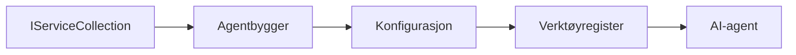

# 🎨 Agentiske designmønstre med Azure OpenAI (Responses API) (.NET)

## 📋 Læringsmål

Dette eksempelet demonstrerer bedriftsnivå designmønstre for å bygge intelligente agenter ved bruk av Microsoft Agent Framework i .NET med integrasjon av Azure OpenAI (Responses API). Du vil lære profesjonelle mønstre og arkitektoniske tilnærminger som gjør agenter produksjonsklare, vedlikeholdbare og skalerbare.

### Bedriftsdesignmønstre

- 🏭 **Factory Pattern**: Standardisert agentoppretting med avhengighetsinjeksjon
- 🔧 **Builder Pattern**: Flytende agentkonfigurasjon og oppsett
- 🧵 **Trådsikre mønstre**: Samtidig samtalestyring
- 📋 **Repository Pattern**: Organisert verktøy- og kapabilitetsstyring

## 🎯 .NET-spesifikke arkitekturfordeler

### Bedriftsfunksjoner

- **Sterk typning**: Kompileringstidvalidering og IntelliSense-støtte
- **Avhengighetsinjeksjon**: Innebygd DI-kontainerintegrasjon
- **Konfigurasjonsstyring**: IConfiguration og Options-mønstre
- **Async/Await**: Førsteklasses asynkron programmeringsstøtte

### Produksjonsklare mønstre

- **Loggintegrasjon**: ILogger og strukturert loggstøtte
- **Helsetester**: Innebygd overvåkning og diagnostikk
- **Konfigurasjonsvalidering**: Sterk typning med dataannotasjoner
- **Feilhåndtering**: Strukturert unntakshåndtering

## 🔧 Teknisk arkitektur

### Kjerne .NET-komponenter

- **Microsoft.Extensions.AI**: Enhetlige AI-tjenesteabstraksjoner
- **Microsoft.Agents.AI**: Bedriftsagentorkestreringsrammeverk
- **Azure OpenAI (Responses API)**: Høyytelses API-klientmønstre
- **Konfigurasjonssystem**: appsettings.json og miljøintegrasjon

### Implementering av designmønstre



## 🏗️ Bedriftsmønstre demonstrert

### 1. **Skapende mønstre**

- **Agent Factory**: Sentralisert agentoppretting med konsistent konfigurasjon
- **Builder Pattern**: Flytende API for kompleks agentkonfigurasjon
- **Singleton Pattern**: Delte ressurser og konfigurasjonsstyring
- **Avhengighetsinjeksjon**: Løs kobling og testbarhet

### 2. **Adferdsmønstre**

- **Strategy Pattern**: Utskiftbare verktøyutførelsesstrategier
- **Command Pattern**: Innpakket agentoperasjoner med angre/gjenta
- **Observer Pattern**: Hendelsesdrevet agentlivssyklusstyring
- **Template Method**: Standardiserte agentutførelsesflyter

### 3. **Strukturelle mønstre**

- **Adapter Pattern**: Azure OpenAI (Responses API) integrasjonslag
- **Decorator Pattern**: Forbedring av agentkapabiliteter
- **Facade Pattern**: Forenklede agentinteraksjonsgrensesnitt
- **Proxy Pattern**: Lat lasting og caching for ytelse

## 📚 .NET designprinsipper

### SOLID-prinsippene

- **Single Responsibility**: Hver komponent har ett klart formål
- **Open/Closed**: Utvidbart uten modifikasjon
- **Liskov Substitution**: Grensesnittbaserte verktøyimplementeringer
- **Interface Segregation**: Fokusert, sammensatte grensesnitt
- **Dependency Inversion**: Avheng på abstraksjoner, ikke konkrete klasser

### Ren arkitektur

- **Domene-lag**: Kjernen for agent- og verktøyabstraksjoner
- **Applikasjons-lag**: Agentorkestrering og arbeidsflyter
- **Infrastruktur-lag**: Azure OpenAI (Responses API) integrasjon og eksterne tjenester
- **Presentasjons-lag**: Brukerinteraksjon og responsformatering

## 🔒 Bedriftsbetraktninger

### Sikkerhet

- **Kredentialhåndtering**: Sikker API-nøkkelhåndtering med IConfiguration
- **Inndata-validering**: Sterk typning og validering via dataannotasjoner
- **Output-rensing**: Sikker responsbehandling og filtrering
- **Revisjonslogging**: Omfattende operasjonssporing

### Ytelse

- **Async-mønstre**: Ikke-blokkerende I/O-operasjoner
- **Connection Pooling**: Effektiv HTTP-klientadministrasjon
- **Caching**: Respons-caching for forbedret ytelse
- **Ressursstyring**: Korrekt disponering og oppryddingsmønstre

### Skalerbarhet

- **Trådsikkerhet**: Støtte for samtidig agentutførelse
- **Ressurs-pooling**: Effektiv ressursutnyttelse
- **Laststyring**: Hastighetsbegrensning og backpressure-håndtering
- **Overvåkning**: Ytelsesmetrikk og helsetester

## 🚀 Produksjonsutrulling

- **Konfigurasjonsstyring**: Miljøspesifikke innstillinger
- **Loggestrategi**: Strukturert logging med korrelasjons-IDer
- **Feilhåndtering**: Global unntakshåndtering med korrekt gjenoppretting
- **Overvåkning**: Application Insights og ytelsestellere
- **Testing**: Enhetstester, integrasjonstester og lasttestmønstre

Klar til å bygge intelligente agenter i bedriftsklassen med .NET? La oss arkitektere noe robust! 🏢✨

## 🚀 Komme i gang

### Forutsetninger

- [.NET 10 SDK](https://dotnet.microsoft.com/download/dotnet/10.0) eller høyere
- Et [Azure-abonnement](https://azure.microsoft.com/free/) med en Azure OpenAI-ressurs og en modellutrulling
- [Azure CLI](https://learn.microsoft.com/cli/azure/install-azure-cli) — logg inn med `az login`

### Nødvendige miljøvariabler

```bash
# zsh/bash
export AZURE_OPENAI_ENDPOINT=https://<your-resource>.openai.azure.com
export AZURE_OPENAI_DEPLOYMENT=gpt-5-mini
# Logg deretter inn slik at AzureCliCredential kan hente en token
az login
```

```powershell
# PowerShell
$env:AZURE_OPENAI_ENDPOINT = "https://<your-resource>.openai.azure.com"
$env:AZURE_OPENAI_DEPLOYMENT = "gpt-5-mini"
# Logg deg på slik at AzureCliCredential kan hente en token
az login
```

### Eksempelkode

For å kjøre kodeeksempelet,

```bash
# zsh/bash
chmod +x ./03-dotnet-agent-framework.cs
./03-dotnet-agent-framework.cs
```

Eller bruk dotnet CLI:

```bash
dotnet run ./03-dotnet-agent-framework.cs
```

Se [`03-dotnet-agent-framework.cs`](../../../../03-agentic-design-patterns/code_samples/03-dotnet-agent-framework.cs) for komplett kode.

```csharp
#!/usr/bin/dotnet run

#:package Microsoft.Extensions.AI@10.*
#:package Microsoft.Agents.AI.OpenAI@1.*-*
#:package Azure.AI.OpenAI@2.1.0
#:package Azure.Identity@1.13.1

using System.ComponentModel;

using Microsoft.Agents.AI;
using Microsoft.Extensions.AI;

using Azure.AI.OpenAI;
using Azure.Identity;

// Tool Function: Random Destination Generator
// This static method will be available to the agent as a callable tool
// The [Description] attribute helps the AI understand when to use this function
// This demonstrates how to create custom tools for AI agents
[Description("Provides a random vacation destination.")]
static string GetRandomDestination()
{
    // List of popular vacation destinations around the world
    // The agent will randomly select from these options
    var destinations = new List<string>
    {
        "Paris, France",
        "Tokyo, Japan",
        "New York City, USA",
        "Sydney, Australia",
        "Rome, Italy",
        "Barcelona, Spain",
        "Cape Town, South Africa",
        "Rio de Janeiro, Brazil",
        "Bangkok, Thailand",
        "Vancouver, Canada"
    };

    // Generate random index and return selected destination
    // Uses System.Random for simple random selection
    var random = new Random();
    int index = random.Next(destinations.Count);
    return destinations[index];
}

// Azure OpenAI with the Responses API (stable v1 endpoint). Sign in with `az login`.
var azureEndpoint = Environment.GetEnvironmentVariable("AZURE_OPENAI_ENDPOINT")
    ?? throw new InvalidOperationException("AZURE_OPENAI_ENDPOINT is not set.");
var deployment = Environment.GetEnvironmentVariable("AZURE_OPENAI_DEPLOYMENT") ?? "gpt-5-mini";

var azureClient = new AzureOpenAIClient(new Uri(azureEndpoint), new AzureCliCredential());

// Define Agent Identity and Comprehensive Instructions
// Agent name for identification and logging purposes
var AGENT_NAME = "TravelAgent";

// Detailed instructions that define the agent's personality, capabilities, and behavior
// This system prompt shapes how the agent responds and interacts with users
var AGENT_INSTRUCTIONS = """
You are a helpful AI Agent that can help plan vacations for customers.

Important: When users specify a destination, always plan for that location. Only suggest random destinations when the user hasn't specified a preference.

When the conversation begins, introduce yourself with this message:
"Hello! I'm your TravelAgent assistant. I can help plan vacations and suggest interesting destinations for you. Here are some things you can ask me:
1. Plan a day trip to a specific location
2. Suggest a random vacation destination
3. Find destinations with specific features (beaches, mountains, historical sites, etc.)
4. Plan an alternative trip if you don't like my first suggestion

What kind of trip would you like me to help you plan today?"

Always prioritize user preferences. If they mention a specific destination like "Bali" or "Paris," focus your planning on that location rather than suggesting alternatives.
""";

// Create AI Agent with Advanced Travel Planning Capabilities
// Get the Responses client for the deployment and create the AI agent
// Configure agent with name, detailed instructions, and available tools
// This demonstrates the .NET agent creation pattern with full configuration
AIAgent agent = azureClient
    .GetChatClient(deployment)
    .AsAIAgent(
        name: AGENT_NAME,
        instructions: AGENT_INSTRUCTIONS,
        tools: [AIFunctionFactory.Create(GetRandomDestination)]
    );

// Create New Conversation Session for Context Management
// Initialize a new conversation session to maintain context across multiple interactions
// Sessions enable the agent to remember previous exchanges and maintain conversational state
// This is essential for multi-turn conversations and contextual understanding
var session = await agent.CreateSessionAsync();

// Execute Agent: First Travel Planning Request
// Run the agent with an initial request that will likely trigger the random destination tool
// The agent will analyze the request, use the GetRandomDestination tool, and create an itinerary
// Using the session parameter maintains conversation context for subsequent interactions
await foreach (var update in agent.RunStreamingAsync("Plan me a day trip", session))
{
    await Task.Delay(10);
    Console.Write(update);
}

Console.WriteLine();

// Execute Agent: Follow-up Request with Context Awareness
// Demonstrate contextual conversation by referencing the previous response
// The agent remembers the previous destination suggestion and will provide an alternative
// This showcases the power of conversation sessions and contextual understanding in .NET agents
await foreach (var update in agent.RunStreamingAsync("I don't like that destination. Plan me another vacation.", session))
{
    await Task.Delay(10);
    Console.Write(update);
}
```

---

<!-- CO-OP TRANSLATOR DISCLAIMER START -->
**Ansvarsfraskrivelse**:
Dette dokumentet er oversatt ved hjelp av AI-oversettelsestjenesten [Co-op Translator](https://github.com/Azure/co-op-translator). Selv om vi streber etter nøyaktighet, vær oppmerksom på at automatiske oversettelser kan inneholde feil eller unøyaktigheter. Det opprinnelige dokumentet på originalspråket skal betraktes som den autoritative kilden. For kritisk informasjon anbefales profesjonell menneskelig oversettelse. Vi er ikke ansvarlige for eventuelle misforståelser eller feiltolkninger som oppstår ved bruk av denne oversettelsen.
<!-- CO-OP TRANSLATOR DISCLAIMER END -->