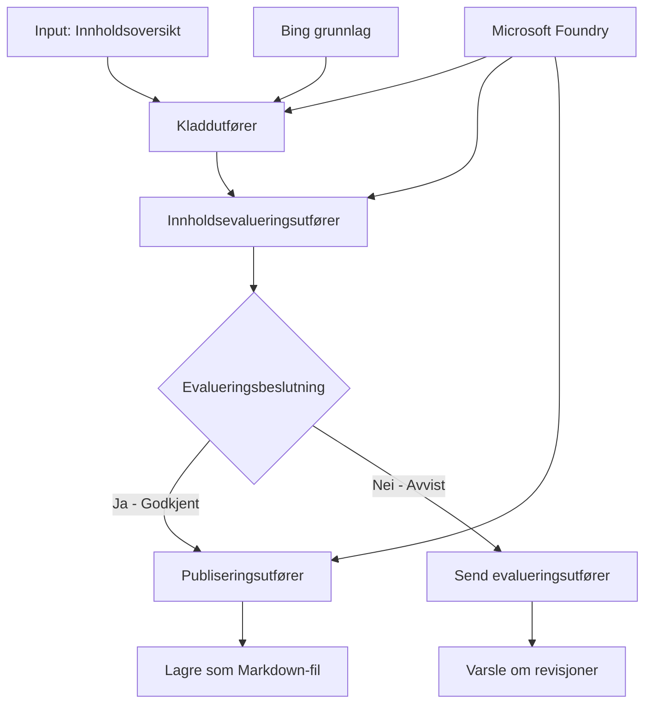

# 🔀 Betingede agentarbeidsflyter med Microsoft Foundry (.NET)

## 📋 Veiledning for intelligent beslutningsbasert arbeidsflyt

Denne notatblokken demonstrerer **betingede arbeidsflytmønstre** ved bruk av Microsoft Foundry og Microsoft Agent Framework for .NET. Du vil lære hvordan du bygger sofistikerte, beslutningsdrevne arbeidsflyter som intelligent ruter behandling basert på AI-analyse, forretningsregler og dynamiske betingelser for automatisering på bedriftsnivå.

## 🎯 Læringsmål

### 🧠 **Intelligent beslutningsarkitektur**
- **Implementering av betinget logikk**: Bygg komplekse beslutningstrær med flere forgreningspunkter
- **AI-drevet ruting**: Bruk Microsoft Foundry-modeller for å ta intelligente rutingsbeslutninger
- **Dynamisk tilpasning av arbeidsflyt**: Endre arbeidsflytens oppførsel basert på kjøretidsanalyse og betingelser
- **Integrering av bedriftsregler**: Inkluder forretningslogikk og samsvarskrav i arbeidsflyter

### 🔀 **Avanserte betingede mønstre**
- **Beslutningstaking med flere kriterier**: Evaluer flere faktorer for rutingsbeslutninger
- **Kontekstbevisst behandling**: Ta beslutninger basert på akkumulert arbeidsflytkontekst og historie
- **Tilpasning av arbeidsflyt**: Dynamisk juster behandlingsstier basert på sanntidsbetingelser
- **Integrering av regelmotor**: Implementer sofistikerte forretningsregel-motorer innenfor arbeidsflyter

### 🏢 **Betingede bedriftsapplikasjoner**
- **Dokumentklassifisering og ruting**: Automatisk klassifisering og ruting av dokumenter til passende arbeidsflyter
- **Kundeservicetriage**: Intelligent ruting av kundehenvendelser til spesialiserte håndteringsteam
- **Samsvar og risikobehandling**: Anvend ulike validerings- og gjennomgangsprosesser basert på risikovurdering
- **Kvalitetssikringsarbeidsflyter**: Rute innhold gjennom passende gjennomgangsprosesser basert på kvalitetsmål

## ⚙️ Forutsetninger og oppsett

### 📦 **Nødvendige NuGet-pakker**

Avanserte pakker for betinget arbeidsflytbehandling:

```xml
<!-- Core AI Framework -->
<PackageReference Include="Microsoft.Extensions.AI" Version="9.9.0" />

<!-- Azure AI Agents with Persistent State -->
<PackageReference Include="Azure.AI.Agents.Persistent" Version="1.2.0-beta.5" />

<!-- Azure Identity and Utilities -->
<PackageReference Include="Azure.Identity" Version="1.15.0" />
<PackageReference Include="System.Linq.Async" Version="6.0.3" />
<PackageReference Include="DotNetEnv" Version="3.1.1" />

<!-- Local Workflow Framework References -->
<!-- Microsoft.Agents.Workflows.dll - Advanced workflow orchestration -->
<!-- Microsoft.Agents.AI.AzureAI.dll - Microsoft Foundry integration -->
<!-- Microsoft.Agents.AI.dll - Core agent abstractions -->
```

### 🔑 **Microsoft Foundry-konfigurasjon**

**Nødvendige Azure-ressurser:**
- Microsoft Foundry-arbeidsområde med betingede behandlingsmodeller
- Azure-abonnement med tilstrekkelige databehandlingskvoter og tillatelser
- Distribuerte AI-modeller for beslutningstaking og innholdsanalyse
- (Valgfritt) Bing Search API-tilkobling for grunnleggende datasøk

**Miljøkonfigurasjon (.env-fil):**
```env
# Microsoft Foundry Configuration
AZURE_AI_PROJECT_ENDPOINT=https://your-project.cognitiveservices.azure.com/
BING_CONNECTION_ID=your-bing-connection-id
```

**Autentiseringsoppsett:**
```csharp
// Azure CLI or Managed Identity authentication
using Azure.Identity;
var credential = new AzureCliCredential();

// Load environment configuration
DotNetEnv.Env.Load("../../../.env");
```

### 🏗️ **Betinget arbeidsflytarkitektur**



**Viktige komponenter:**
- **Draft Executor**: AI-agent som lager innledende innholdsutkast fra disposisjoner
- **Content Review Executor**: AI-agent som vurderer utkastets kvalitet og samsvar
- **Betinget ruting**: Beslutningslogikk som ruter basert på gjennomgangsresultater
- **Publiser-/gjennomgangsstier**: Separate behandlingsstier for godkjent vs. avvist innhold
- **Tilstandshåndtering**: Opprettholder innholds- og gjennomgangskontekst gjennom arbeidsflyten

## 🎨 **Designmønstre for betinget arbeidsflyt**

### 📋 **Innholdsproduksjon med kvalitetsporter**
```
Outline → Draft Creation → Quality Review → {Approve: Publish | Reject: Revise}
```

### 🎯 **Risikovurdert dokumentbehandling**
```
Document → Risk Assessment → {Low: Standard | High: Enhanced Review}
```

### 🔍 **Intelligent kundeserviceruting**
```
Customer Query → Analysis → {Simple: FAQ Bot | Complex: Human Agent}
```

### 💼 **Samsvarsbaserte arbeidsflyter**
```
Content → Compliance Check → {Pass: Publish | Fail: Legal Review}
```

## 🏢 **Betingede fordeler for bedrifter**

### 🎯 **Intelligent automatisering**
- **Smartere beslutninger**: AI-drevne rutingsbeslutninger basert på innholdsanalyse og kontekst
- **Tilpasningsdyktig behandling**: Arbeidsflyter som automatisk justerer seg basert på endrede forhold
- **Håndhevelse av forretningsregler**: Automatisk anvendelse av komplekse forretningslogikker og retningslinjer
- **Kontekstbevisst ruting**: Beslutninger basert på full arbeidsflythistorikk og akkumulert kontekst

### 📈 **Operasjonell ekspertise**
- **Optimalisert ressursallokering**: Rute arbeid til mest passende spesialister og prosesser
- **Redusert manuell inngripen**: Automatiserte beslutninger minimerer behov for menneskelig ruting
- **Raskere løsninger**: Direkteruting til riktig ekspertise og behandlingskapasiteter
- **Konsistent anvendelse**: Ensartet anvendelse av forretningsregler og beslutningskriterier

### 🛡️ **Risikostyring og samsvar**
- **Automatisert risikovurdering**: AI-drevet evaluering av innhold og situasjonens risikonivå
- **Samsvarshåndhevelse**: Automatisk ruting gjennom nødvendige regulatoriske prosesser
- **Sikkerhetsprotokollanvendelse**: Forbedrede sikkerhetstiltak anvendt basert på risikovurdering
- **Vedlikehold av revisjonsspor**: Fullstendig dokumentasjon av rutingsbeslutninger og begrunnelser

### 📊 **Analyse og kontinuerlig forbedring**
- **Beslutningsanalyse**: Følg effekten og nøyaktigheten av rutingsbeslutninger
- **Mønster-gjenkjenning**: Identifisere trender og mønstre i rutingsbeslutninger over tid
- **Ytelsesoptimalisering**: Kontinuerlig forbedring av beslutningskriterier og rutingseffektivitet
- **Forretningsinnsikt**: Innsikt i innholdsegenskaper og behandlingsbehov

### 🔧 **Teknisk ekspertise**
- **Vedvarende tilstandshåndtering**: Opprettholde kompleks tilstand gjennom arbeidsflytutførelse
- **Skalerbar arkitektur**: Håndtere store volumer av betinget behandlingsbehov
- **Integrasjonsmuligheter**: Sømløs integrasjon med eksisterende forretningssystemer og prosesser
- **Overvåkning og observasjon**: Omfattende sporing av arbeidsflytytelse og beslutninger

La oss bygge intelligente, beslutningsdrevne bedriftsarbeidsflyter med .NET! 🚀

## 💻 Kjøre koden

Den komplette implementeringen finnes i `04.dotnet-agent-framework-workflow-aifoundry-condition.cs`. Dette demonstrerer en **arbeidsflyt for innholdsproduksjon med kvalitetsporter**:

### 🏗️ **Arbeidsflytarkitektur**

```
Content Outline → Draft Creation → Quality Review → Conditional Routing:
                                                      ├─ Approved (>200 words) → Publish
                                                      └─ Rejected (<200 words) → Review Notification
```

**Agenter i arbeidsflyten:**
1. **Evangelist Agent**: Lager veiledningsutkast fra disposisjoner med Bing-grunnlag
2. **Content Reviewer Agent**: Vurderer utkastets kvalitet (ordtelling, fullstendighet)
3. **Publisher Agent**: Lagrer godkjent innhold som tidsstemplet Markdown-fil

**Egnete executors:**
1. **DraftExecutor**: Orkestrerer utarbeidelse av utkast
2. **ContentReviewExecutor**: Utfører kvalitetsvurdering
3. **PublishExecutor**: Håndterer publisering av godkjent innhold
4. **SendReviewExecutor**: Administrerer varsler om avvist innhold

### 🚀 Kjøre eksemplet

**Forutsetninger:**
- Microsoft Foundry-arbeidsområde konfigurert
- Autentisering via Azure CLI (`az login`)
- (Valgfritt) Bing Search-tilkobling for grunnleggende datasøk

```bash
# Gjør skriptet kjørbart (Unix/Linux/macOS)
chmod +x 04.dotnet-agent-framework-workflow-aifoundry-condition.cs

# Kjør den betingede arbeidsflyten
./04.dotnet-agent-framework-workflow-aifoundry-condition.cs
```

Eller på Windows:
```powershell
dotnet run 04.dotnet-agent-framework-workflow-aifoundry-condition.cs
```

### 📝 Forventet output

Arbeidsflyten vil:
1. **Opprette agenter**: Initialisere tre spesialiserte Microsoft Foundry-agenter
2. **Generere utkast**: Evangelist-agent lager veiledningsutkast fra disposisjon
3. **Gjennomgå innhold**: Content Reviewer vurderer utkastets kvalitet
4. **Betinget ruting**:
   - **Hvis godkjent (>200 ord)**: Publish executor lagrer som Markdown-fil
   - **Hvis avvist (<200 ord)**: Send varsling om gjennomgang
5. **Vise resultater**: Vis sluttreultatet av arbeidsflyten

### 🔧 Tilpasningsmuligheter

**Endre vurderingskriterier:**
```csharp
const string ContentReviewerInstructions = @"
You are a content reviewer...
1. Check if content is more than 500 words (instead of 200)
2. Verify technical accuracy
3. Ensure proper formatting
...";
```

**Legg til flere betingede stier:**
```csharp
var workflow = new WorkflowBuilder(draftExecutor)
    .AddEdge(draftExecutor, contentReviewerExecutor)
    .AddEdge(contentReviewerExecutor, publishExecutor, condition: GetCondition("Excellent"))
    .AddEdge(contentReviewerExecutor, editExecutor, condition: GetCondition("Good"))
    .AddEdge(contentReviewerExecutor, sendReviewerExecutor, condition: GetCondition("Poor"))
    .Build();
```

**Endre innholdskrav:**
```csharp
string OUTLINE_Content = @"
# Your Custom Topic
## Section 1
https://your-reference-url
## Section 2
...
";
```

### 🎯 Anvendelser i praksis

Dette betingede arbeidsflytmønsteret er ideelt for:
- **Innholdsstyringssystemer**: Automatiserte redaksjonelle arbeidsflyter med kvalitetsporter
- **Dokumentbehandling**: Rute dokumenter basert på klassifisering og samsvar
- **Kundesupport**: Intelligent ruting av saker basert på kompleksitet og hastverk
- **Juridisk gjennomgang**: Rute kontrakter basert på risikovurdering og verdi
- **HR-prosesser**: Rute søknader gjennom passende screeningsarbeidsflyter

### 🔍 Forståelse av betinget logikk

**Betingelsesfunksjon:**
```csharp
public Func<object?, bool> GetCondition(string expectedResult) =>
    reviewResult => reviewResult is ReviewResult review && review.Result == expectedResult;
```

Denne funksjonen lager et predikat som:
1. Sjekker om resultatet er av typen `ReviewResult`
2. Sammenligner `Result`-egenskapen med forventet verdi
3. Returnerer true/false for å avgjøre routing

**Arbeidsflytkantene med betingelser:**
```csharp
.AddEdge(contentReviewerExecutor, publishExecutor, condition: GetCondition("Yes"))
.AddEdge(contentReviewerExecutor, sendReviewerExecutor, condition: GetCondition("No"))
```

### 📊 Avanserte funksjoner

**Validering av JSON-skjema:**
Arbeidsflyten bruker JSON-skjemaer for å sikre strukturerte svar:

```csharp
// Define response structure
public class ReviewResult
{
    [JsonPropertyName("review_result")]
    public string Result { get; set; } = string.Empty;
    
    [JsonPropertyName("reason")]
    public string Reason { get; set; } = string.Empty;
    
    [JsonPropertyName("draft_content")]
    public string DraftContent { get; set; } = string.Empty;
}

// Apply to agent
ResponseFormat = ChatResponseFormat.ForJsonSchema(
    AIJsonUtilities.CreateJsonSchema(typeof(ReviewResult)), 
    "ReviewResult", 
    "Review Result From DraftContent"
)
```

**Integrasjon med Bing-grunnlag:**
Evangelist-agenten bruker Bing-grunnlag for tilgang til sanntidsinformasjon:

```csharp
var bingGroundingConfig = new BingGroundingSearchConfiguration(bing_conn_id);
BingGroundingToolDefinition bingGroundingTool = new(
    new BingGroundingSearchToolParameters([bingGroundingConfig])
);
```

Dette gjør at agenten kan følge URL-er i disposisjonen og hente oppdatert informasjon.

### 🛡️ Feilhåndtering

Arbeidsflyten inkluderer robust feilhåndtering for avvist innhold:
- Gjennomgangssvikt utløser alternativ sti
- Varsler gir klare avvisningsårsaker
- Innhold beholdes for revisjon

### 🔄 Utvidelse av arbeidsflyten

**Legg til en revisjonsløkke:**
Lag en tilbakemeldingssløyfe som automatisk re-utformer innhold:

```csharp
.AddEdge(contentReviewerExecutor, publishExecutor, condition: GetCondition("Yes"))
.AddEdge(contentReviewerExecutor, draftExecutor, condition: GetCondition("No")) // Loop back
```

**Implementer flertrinns gjennomgang:**
Legg til flere gjennomgangstrinn med ulike kriterier:

```csharp
.AddEdge(draftExecutor, technicalReviewer)
.AddEdge(technicalReviewer, editorialReviewer, condition: GetCondition("TechPass"))
.AddEdge(editorialReviewer, publishExecutor, condition: GetCondition("EditPass"))
```

Dette betingede arbeidsflytmønsteret gir grunnlaget for å bygge sofistikerte, intelligente automatiseringssystemer for bedrifter! 🚀

---

<!-- CO-OP TRANSLATOR DISCLAIMER START -->
**Ansvarsfraskrivelse**:
Dette dokumentet er oversatt ved hjelp av AI-oversettelsestjenesten [Co-op Translator](https://github.com/Azure/co-op-translator). Selv om vi streber etter nøyaktighet, vær oppmerksom på at automatiske oversettelser kan inneholde feil eller unøyaktigheter. Det opprinnelige dokumentet på originalspråket skal betraktes som den autoritative kilden. For kritisk informasjon anbefales profesjonell menneskelig oversettelse. Vi er ikke ansvarlige for eventuelle misforståelser eller feiltolkninger som oppstår ved bruk av denne oversettelsen.
<!-- CO-OP TRANSLATOR DISCLAIMER END -->