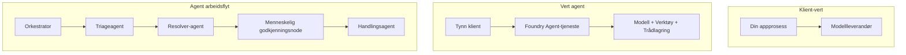
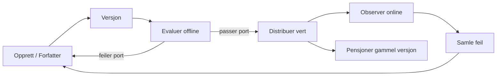
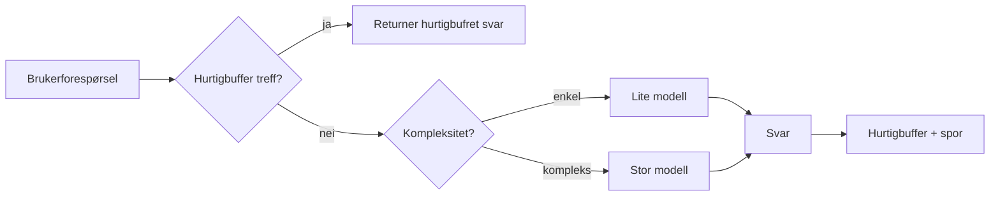
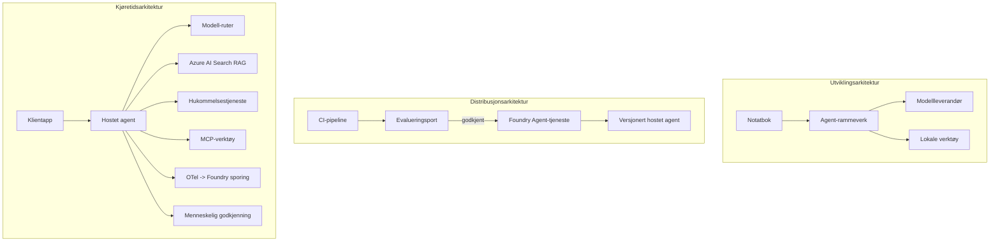

# Distribuere skalerbare agenter med Microsoft Foundry


Frem til nå i kurset har du bygget agenter som kjører på din bærbare PC, inne i en notatbok, drevet av `az login` og en håndfull miljøvariabler. Det er akkurat den riktige måten å lære på. Det er ikke den riktige måten å kjøre en agent på som tusenvis av kunder er avhengige av kl 03.00.

Denne leksjonen handler om gapet mellom "det fungerer på maskinen min" og "det fungerer, pålitelig og rimelig, i produksjon." Vi lukker det gapet ved å bruke **Microsoft Foundry** og **Microsoft Foundry Agent Service**, og vi gjør det ved å bygge en ekte kundestøtteagent som har verktøy, henting, hukommelse, evaluering og overvåking.

## Introduksjon

Denne leksjonen vil dekke:

- Forskjellen mellom en **prototypeagent** og en **distribuert agent**, og hvorfor overgangen først og fremst handler om alt *rundt* modellen.
- **Distribusjonsmønstre** for agenter: klient-hostet, tjeneste-hostet (Hosted Agents) og arbeidsflyt-orchestrert.
- **Agentlivssyklusen** på Microsoft Foundry — opprette, versjonere, distribuere, evaluere, observere, pensjonere.
- **Skaleringsstrategier**: modellruting, caching, samtidighet og stateless design.
- **Observability** med OpenTelemetry og Foundry sporing.
- **Kostnadsoptimalisering** gjennom modellvalg, ruting og evalueringsporter.
- **Bedriftsmessige hensyn**: styring, menneskelig godkjenning og sikker kjøring av MCP-servere i produksjon.

## Læringsmål

Etter å ha fullført denne leksjonen vil du vite hvordan du kan:

- Velge riktig distribusjonsmønster for en gitt agentarbeidsmengde.
- Distribuere en agent til Microsoft Foundry Agent Service slik at den versjoneres, styres og er observerbar.
- Instrumentere en agent for sporing og koble opp en evalueringspipeline som kjører før hver utgivelse.
- Anvende modellruting og caching for å holde latens og kostnad under kontroll i skala.
- Legge til en menneskelig godkjenningsport for høy-risiko handlinger og integrere en MCP-server på en produksjonssikker måte.

## Forutsetninger

Denne leksjonen forutsetter at du har fullført de tidligere leksjonene og er komfortabel med:

- Å bygge agenter med [Microsoft Agent Framework](../14-microsoft-agent-framework/README.md) (Leksjon 14).
- [Bruk av verktøy](../04-tool-use/README.md) (Leksjon 4) og [Agentic RAG](../05-agentic-rag/README.md) (Leksjon 5).
- [Agenthukommelse](../13-agent-memory/README.md) (Leksjon 13) og [Agentiske protokoller / MCP](../11-agentic-protocols/README.md) (Leksjon 11).
- [Observability og evaluering](../10-ai-agents-production/README.md) (Leksjon 10) — denne leksjonen bygger direkte på den.

Du vil også trenge:

- Et **Azure-abonnement** og et **Microsoft Foundry-prosjekt** med minst én distribuert chatmodell.
- Azure CLI autentisert (`az login`).
- Python 3.12+ og pakkene i depotets [`requirements.txt`](../../../requirements.txt).

## Fra prototype til produksjon: Hva endrer seg egentlig

En prototypeagent og en produksjonsagent deler samme kjerneløkke — resonnere, kalle verktøy, svare. Det som endrer seg er alt som er pakket rundt den løkken. Modellen utgjør kanskje 20 % av en produksjonsagent; de andre 80 % er den operative skjelettet.

| Bekymring | Prototype | Produksjon |
| --- | --- | --- |
| **Hosting** | Kjører i din notatbok | Kjører som en hostet tjeneste, versjonert og rullet ut |
| **Identitet** | Din `az login`-token | Administrert identitet med avgrenset RBAC |
| **Tilstand** | I minnet, mistes ved omstart | Eksternalisert (trådlagring, minnetjeneste) |
| **Feil** | Du ser sporet av feil | Gjentakelser, tilbakefall, døde brev, varsler |
| **Kostnad** | "Det er noen få cent" | Sporet per forespørsel, rutet, cachet, budsjettert |
| **Kvalitet** | Du vurderer utdataene | Evaluert automatisk før hver utgivelse |
| **Tillitt** | Du godkjenner hver handling | Policy + menneske-i-løkken for risikofylte handlinger |

Husk dette tabellen. Hver seksjon nedenfor tilsvarer en av disse radene.

## Agent distribusjonsmønstre

Det finnes tre mønstre du vil bruke, ofte i kombinasjon.

### 1. Klient-hostede agenter

Agentobjektet lever inne i *din* applikasjonsprosess. Koden din kaller modellleverandøren direkte; resonnementsløkken kjører i tjenesten din. Dette er hva alle tidligere leksjoner har gjort.

- **Bruk det når** du trenger full kontroll over løkken, tilpasset mellomvare, eller du integrerer agenten inne i en eksisterende backend.
- **Avveining**: du eier selv skalering, tilstand og robusthet.

### 2. Hostede agenter (Foundry Agent Service)

Agenten er *registrert som en ressurs* i Microsoft Foundry. Foundry hoster resonnementsløkken, lagrer tråder, håndhever innholdssikkerhet og RBAC, og gjør agenten synlig i Foundry-portalen. Appen din blir en tynn klient som lager tråder og leser svar.

- **Bruk det når** du ønsker holdbarhet, innebygd observability, styring og mindre operasjonell overflate.
- **Avveining**: mindre lavnivåkontroll til gjengjeld for en administrert runtime.

### 3. Agentarbeidsflyter

Flere agenter (og verktøy) settes sammen til en graf med eksplisitt kontrollflyt — sekvensielle steg, grener, menneskelig godkjenningspunkter, og holdbare sjekkpunkter som kan pause og gjenoppta. Dette er Microsoft Agent Frameworks **Workflows**-funksjon anvendt i distribusjonsskala.

- **Bruk det når** en enkelt oppgave spenner over flere spesialiserte agenter eller krever en godkjenningssteg midt i.
- **Avveining**: flere bevegelige deler; trenger observability på orkestreringsnivå.



## Agentlivssyklusen på Microsoft Foundry

Distribuere en agent er ikke en engangs `push`. Det er en løkke, og det ligner mye på en programvareutgivelsessyklus fordi det er akkurat det det er.



Den viktigste ideen, hentet fra [Leksjon 10](../10-ai-agents-production/README.md): **offline evaluering er en port, ikke en ettertanke.** En ny agentversjon blir ikke utgitt med mindre den passerer dine evalueringsgrenser. Online observability mater deretter virkelige feil tilbake til ditt offline testsett. Det er hele løkken.

## Skaleringsstrategier

Skalering av en agent er annerledes enn skalering av et stateless web-API, fordi hver forespørsel kan utløse flere dyre modell- og verktøy-kall. Fire teknikker bærer mesteparten av belastningen.

**Stateless håndtering av forespørsler.** Ikke behold noen per-bruker tilstand i prosessminnet ditt. Lagre samtaletråder i Foundry trådlager eller en minnetjeneste slik at hvilken som helst instans kan håndtere enhver forespørsel. Dette lar deg skalere horisontalt — legg til instanser, ingen sticky sessions.

**Modellruting.** Ikke alle forespørsler trenger din mest kapable (og dyreste) modell. Ruter enkle forespørsler — intensjonsklassifisering, korte faktuelle svar — til en liten, rask modell, og reserver den store modellen til ekte resonnement. Foundrys **Model Router** kan gjøre dette for deg, eller du kan implementere en lettvektsklassifiserer selv. Du vil bygge gjør-det-selv versjonen i laben.

**Svar-caching.** Mange supportsøknader er nesten duplikater ("hvordan tilbakestiller jeg passordet mitt?"). Cache svar på vanlige spørsmål og server dem uten å treffe modellen i det hele tatt. Selv en beskjeden cache-hitrate reduserer kost og latens betydelig.

**Samtidighet og backpressure.** Modellleverandører har ratelimiting. Begrens samtidigheten din, bruk gjenforsøk med eksponentiell tilbakegang, og feile grasiøst (et køsystem "vi jobber med det" er bedre enn en 500).



## Observability i produksjon

Du kan ikke drifte det du ikke kan se. Som dekket i Leksjon 10, emitterer Microsoft Agent Framework **OpenTelemetry** spor innfødt — hvert modellkall, verktøysinvokasjon og orkestreringssteg blir en span. I produksjon eksporterer du disse span-ene til Microsoft Foundry (eller hvilken som helst OTel-kompatibel backend) slik at du kan:

- Spore en enkelt kundeklage fra start til slutt på tvers av alle modell- og verktøykall.
- Overvåke p50/p95 latens og kostnad per forespørsel over tid.
- Varsle om feilrater og kostnadsavvik før brukerne dine (eller økonomiteamet ditt) oppdager det.

```python
from agent_framework.observability import get_tracer

tracer = get_tracer()

with tracer.start_as_current_span("support_request") as span:
    span.set_attribute("customer.tier", "enterprise")
    span.set_attribute("routed.model", "gpt-5-nano")
    # agentutførelse spores automatisk inne i dette spennet
```

Attributter som `customer.tier` og `routed.model` er det som forvandler en vegg av spor til besvarbare spørsmål ("blir bedriftskunder for ofte rutet til den lille modellen?").

## Kostnadsoptimalisering

Kostnaden i produksjonsagenter domineres av tokens. Tre spaker, i rekkefølge etter effekt:

1. **Riktig størrelse på modellen.** En liten modell som passerer din evalueringsport er nesten alltid billigere enn en stor som også passerer. Bruk evaluering til å *bevise* at den lille modellen er god nok i stedet for å standardisere på den største modellen av forsiktighet.
2. **Rute etter kompleksitet.** Som nevnt — betal store-modell priser bare for forespørsler som trenger stor-modell resonnement.
3. **Cache aggressivt.** Det billigste modellkallet er det du aldri gjør.

Evalueringsporter og kostnadskontroll er samme disiplin sett fra to vinkler: evaluering forteller deg *kvalitetsgulvet*, ruting og caching holder deg så nær gulvets *kostnad* som mulig.

## Bedriftsdistribusjonsbetraktninger

**Styring.** Hostede agenter arver Foundrys RBAC, innholdssikkerhet og revisjonsloggen. Gi hver agent en administrert identitet med minste nødvendige privilegier — skrivebeskyttet tilgang til kunnskapsbasen, begrenset tilgang til billett-API-et, ikke mer.

**Menneske-i-løkken.** Noen handlinger er for viktige til å automatiseres rett ut — utstede refusjon, slette konto, eskalere til en juridisk avdeling. Microsoft Agent Framework støtter **godkjenning-påkrevd** verktøy: agenten foreslår handlingen, utførelse pauser, et menneske godkjenner eller avviser, og arbeidsflyten gjenopptas. Du så primitive i [Leksjon 6](../06-building-trustworthy-agents/README.md); her distribuerer du den.

**MCP i produksjon.** [MCP](../11-agentic-protocols/README.md) lar agenten din konsumere eksterne verktøy via en standardgrensesnitt. I produksjon bør du behandle hver MCP-server som en ikke-tillitsfull grense: fest serverversjonen, kjør den med en avgrenset identitet, valider utdata, og eksponer aldri hemmeligheter for den. En MCP-server er en avhengighet, og avhengigheter patcher, reviderer og begrenser duppet.



De tre diagrammene — utvikling, distribusjon, kjøretid — er samme agent i tre faser av livet. Laben som følger går deg gjennom hvordan du bygger den.

## Praktisk lab: En produksjonsklar kundestøtteagent

Åpne [`code_samples/16-python-agent-framework.ipynb`](./code_samples/16-python-agent-framework.ipynb) og arbeid deg gjennom den fra start til slutt. Du vil sette sammen en **Contoso kundestøtteagent** med alle produksjonsbekymringer koblet inn:

1. **Verktøykall** — slå opp ordrestatus og åpne supportsaker.
2. **RAG** — svar på policyspørsmål fra en kunnskapsbase (Azure AI Search, med en minnebasert fallback så notatboken kjører uten en Search-ressurs).
3. **Hukommelse** — husk kunden gjennom samtalerunder.
4. **Modellruting** — en kompleksitetsklassifiserer ruter hver forespørsel til en liten eller stor modell.
5. **Svar-caching** — gjentatte spørsmål serveres fra cache.
6. **Menneskelig godkjenning** — refusjoner over en terskel pauser for menneskelig sign-off.
7. **Evalueringspipeline** — et lite offline testsett vurderer agenten og fungerer som en utgivelsesport.
8. **Observability** — OpenTelemetry-sporing rundt hver forespørsel.

### Gjennomgang

Notatboken er organisert slik at hver produksjonsbekymring er en selvstendig, kjørbar seksjon. Kjernen er ruting-pluss-caching forespørselshåndtereren:

```python
async def handle_support_request(query: str, customer_id: str) -> str:
    # 1. Server fra cache når vi kan.
    cached = response_cache.get(normalize(query))
    if cached:
        return cached

    # 2. Ruter etter kompleksitet for å kontrollere kostnad.
    model = "gpt-5-nano" if is_simple(query) else "gpt-5-mini"

    # 3. Kjør agenten inne i en sporingsspan for observerbarhet.
    with tracer.start_as_current_span("support_request") as span:
        span.set_attribute("routed.model", model)
        span.set_attribute("customer.id", customer_id)
        response = await support_agent.run(query, model=model)

    # 4. Cache og returner.
    response_cache.set(normalize(query), response.text)
    return response.text
```

Evalueringsporten som vokter en utgivelse ser slik ut:

```python
async def evaluation_gate(agent, test_cases, threshold: float = 0.8) -> bool:
    passed = 0
    for case in test_cases:
        result = await agent.run(case["input"])
        if score_response(result.text, case["expected"]) >= 0.8:
            passed += 1
    pass_rate = passed / len(test_cases)
    print(f"Evaluation pass rate: {pass_rate:.0%} (gate: {threshold:.0%})")
    return pass_rate >= threshold  # distribuer kun hvis porten passerer
```

Les hver linje — notatboken holder primitive bevisst små slik at ingenting er skjult bak et rammeverkskall.

## Validere en distribuert agent med røyktester

Evalueringsporten ovenfor kjøres *offline* mot agentobjektet ditt. Når agenten er distribuert som en Hosted Agent, trenger du én sjekk til, som er enda rimeligere: **svarer egentlig det distribuerte endepunktet?**

Å distribuere "vellykket" beviser bare at kontrollplanet aksepterte definisjonen — det beviser ikke at agenten svarer. En manglende avhengighet, feil modellruting, eller en utløpt tilkobling kan etterlate en grønn distribusjon som ikke returnerer noe. En **røyktest** fanger dette på sekunder, ved hver distribusjon, uten kostnaden av en full evaluering.

Dette depotet leverer en klar-til-bruk røyktestpipeline bygget på [AI Smoke Test](https://github.com/marketplace/actions/ai-smoke-test) GitHub Action:

- **Katalog** — [`tests/lesson-16-smoke-tests.json`](../../../tests/lesson-16-smoke-tests.json) inneholder prompt og påstander for Contoso supportagenten (grunnlagte policy-svar, en ordreoppslag, holde seg på tema, og flerspors-sammenheng). Kataloger for andre leksjoners agenter ligger ved siden av — se [`tests/README.md`](../tests/README.md).
- **Arbeidsflyt** — [`.github/workflows/smoke-test.yml`](../../../.github/workflows/smoke-test.yml) logger inn med Azure OIDC og POSTer hver prompt til agentens Responses-endepunkt, og feiler jobben ved ethvert påstandsbrot.

```yaml
- name: Smoke-test hosted agent
  uses: JFolberth/ai-smoketest@v1
  with:
    project_endpoint: ${{ inputs.project_endpoint }}
    agent_name: ContosoSupportAgent
    tests_file: tests/lesson-16-smoke-tests.json
```


Kjør det fra **Actions**-fanen når agenten din er implementert, og oppgi endepunktet for Foundry-prosjektet og agentnavnet ditt. Den fødererte identiteten trenger rollen **Azure AI User** i Foundry-prosjektets omfang. Tenk på lagene som en pyramide: røyktester (er den tilgjengelig og svarer?) kjører ved hver deploy, offline evaluering (god nok til å sende i produksjon?) kjører før promotering, og online evaluering (hvordan går det i felt?) kjører kontinuerlig.

## Kunnskapstest

Test forståelsen din før du går videre til oppgaven.

**1. Omtrent hvor stor del av en produksjonsagent er "modellen," og hva er resten?**

<details>
<summary>Svar</summary>

Modellen er et mindretall av systemet — ofte sitert til rundt 20 %. Resten er den operative skjelettet: hosting og versjonering, identitet og RBAC, ekstern tilstand, feilhåndtering, kostnadssporing, evaluering og menneske-i-løkken-kontroller. Å gå i produksjon handler mest om å bygge alt *rundt* resonnementsløkken.
</details>

**2. Når ville du valgt en Hosted Agent fremfor en klient-hostet agent?**

<details>
<summary>Svar</summary>

Når du ønsker en administrert kjøretid med innebygd holdbarhet (tråder som vedvarer og kan gjenopptas), observabilitet, innholdsikkerhet og RBAC, og du er villig til å ofre noe lavnivåkontroll over resonnementsløkken for mindre operasjonelt overflateareal. Klient-hostet er å foretrekke når du trenger full kontroll over løkken eller integrerer agenten i en eksisterende backend.
</details>

**3. Hvorfor må en skalerbar agent være tilstandsløs i sin egen prosessminne?**

<details>
<summary>Svar</summary>

Slik at hvilken som helst instans kan håndtere hvilken som helst forespørsel, noe som gjør horisontal skalering mulig uten sticky sessions. Brukerspesifikk samtaletilstand er eksternt lagret i en tråd-lager- eller minnetjeneste. Hvis tilstanden lå i prosessminnet, ville du mistet den ved omstart og kunne ikke distribuere belastningen fritt.
</details>

**4. Hvilket problem løser modellruting, og hvordan henger det sammen med evaluering?**

<details>
<summary>Svar</summary>

Ruting sender enkle forespørsler til en liten, billig og rask modell og reserverer den store modellen for ekte resonnement, og kontrollerer både ventetid og kostnad. Det henger sammen med evaluering fordi evaluering er det som *beviser* at den lille modellen er god nok for en klasse forespørsler — ruting uten evaluering er gjetting.
</details>

**5. Hva er en "evaluering-port" og hvor befinner den seg i livssyklusen?**

<details>
<summary>Svar</summary>

En evaluering-port kjører en offline testsamling mot en ny agentversjon og blokkerer implementeringen med mindre bestått-prosenten overstiger en terskelverdi. Den ligger mellom "versjon" og "deploy" i livssyklusen, og gjør kvalitet til en forutsetning for utgivelse i stedet for noe du sjekker etter levering.
</details>

**6. Hvorfor bør en MCP-server behandles som en uautorisert grense i produksjon?**

<details>
<summary>Svar</summary>

Fordi det er en ekstern avhengighet som agenten din kaller inn i. Du bør låse dens versjon, kjøre den med en avgrenset identitet, validere utdataene, rate-begrense den, og aldri eksponere hemmeligheter for den — samme disiplin som du anvender på alle tredjepartsavhengigheter. Dens utdata flyter inn i agentens resonnement, så uvalidert tillit er en sikkerhetsrisiko.
</details>

**7. Hvilken enkelt endring har vanligvis størst innvirkning på kostnadene for produksjonsagenten, og hvorfor?**

<details>
<summary>Svar</summary>

Å tilpasse modellen — bruke den minste modellen som fortsatt passerer evaluering-porten din. Kostnaden domineres av tokens, og en mindre modell som møter kvalitetsnivået er nesten alltid billigere enn en større. Caching og ruting reduserer deretter kostnadene ytterligere, men å velge riktig basismodell har den største førsteordenseffekten.
</details>

**8. Hvilken rolle spiller span-attributter som `customer.tier` og `routed.model` i observabilitet?**

<details>
<summary>Svar</summary>

De gjør rå spor til målbare forretningsspørsmål. Uten attributter har du en vegg av spans; med dem kan du spørre "blir bedriftskunder rutet til den lille modellen for ofte?" eller "hvilken modell håndterer våre tregeste forespørsler?" Attributter er hvordan du deler opp telemetri etter dimensjonene som betyr noe for driften din.
</details>

## Oppgave

Ta kundestøtteagenten fra laboratoriet og styrk den for et spesifikt scenario: **en abonnementsfaktureringsstøtteagent for et SaaS-selskap.**

Innsendingen din skal:

1. **Erstatt verktøyene** med faktureringsrelevante: `get_subscription_status`, `get_invoice`, og `issue_credit` (kreditter over 50 $ krever menneskelig godkjenning).
2. **Legg til tre RAG-dokumenter** som dekker selskapets refusjonspolicy, faktureringssyklus, og avbestillingspolicy.
3. **Utvid evalueringssettet** til minst åtte tilfeller, inkludert minst to som *bør* utløse menneskelig godkjenningsbane, og bekreft at evaluering-porten din korrekt godkjenner eller avviser.
4. **Legg til en kostnadsrapport:** etter å ha kjørt ti blandede forespørsler gjennom agenten, skriv ut hvor mange som gikk til den lille modellen, hvor mange til den store modellen, og hvor mange som ble servert fra cache.

Skriv et kort avsnitt (i en markdown-celle) som forklarer hvilken modellrutingregel du valgte og hvordan du ville validere den med ekte trafikk. Det finnes ikke ett riktig svar — du blir vurdert på om produksjonsbekymringene er koblet sammen koherent.

## Sammendrag

I denne leksjonen flyttet du en agent fra prototype til produksjon med Microsoft Foundry:

- Overgangen til produksjon handler mest om **det operative skjelettet** rundt modellen — hosting, identitet, tilstand, feilhåndtering, kostnad, kvalitet og tillit.
- Du lærte de tre **implementeringsmønstrene** — klient-hostet, Hosted Agents, og Agent Workflows — og når hver passer.
- Du gikk gjennom **agent-livssyklusen**, der offline **evaluering fungerer som en utgivelsesport** og online observabilitet sender feil tilbake til testsettet.
- Du anvendte **skaleringstrategier** — tilstandsløs design, modellruting, caching, og begrenset samtidighet — og koblet dem til **kostnadsoptimalisering**.
- Du koblet inn **enterprise-kontroller**: RBAC, menneske-i-løkken-godkjenning, og produksjonssikker MCP-integrasjon.
- Du bygget en **produksjonsklar kundestøtteagent** som knytter alle disse bekymringene sammen i kjørbar kode.

Neste leksjon tar motsatt vei: i stedet for å skalere agenter opp i skyen, vil du bringe dem *ned* på én utviklermaskin og kjøre dem helt lokalt.

## Ytterligere ressurser

- <a href="https://learn.microsoft.com/azure/ai-foundry/what-is-azure-ai-foundry" target="_blank">Microsoft Foundry-dokumentasjon</a>
- <a href="https://learn.microsoft.com/azure/ai-foundry/agents/overview" target="_blank">Oversikt over Microsoft Foundry Agent Service</a>
- <a href="https://aka.ms/ai-agents-beginners/agent-framework" target="_blank">Microsoft Agent Framework</a>
- <a href="https://learn.microsoft.com/azure/ai-foundry/concepts/model-router" target="_blank">Modellruter i Microsoft Foundry</a>
- <a href="https://learn.microsoft.com/azure/search/search-what-is-azure-search" target="_blank">Azure AI Search</a>
- <a href="https://opentelemetry.io/" target="_blank">OpenTelemetry</a>
- <a href="https://github.com/marketplace/actions/ai-smoke-test" target="_blank">AI Smoke Test GitHub Action</a>
- <a href="https://modelcontextprotocol.io/" target="_blank">Model Context Protocol (MCP)</a>

## Forrige leksjon

[Bygge datamaskinbrukagenter (CUA)](../15-browser-use/README.md)

## Neste leksjon

[Opprette lokale AI-agenter](../17-creating-local-ai-agents/README.md)

---

<!-- CO-OP TRANSLATOR DISCLAIMER START -->
**Ansvarsfraskrivelse**:
Dette dokumentet er oversatt ved hjelp av AI-oversettelsestjenesten [Co-op Translator](https://github.com/Azure/co-op-translator). Selv om vi streber etter nøyaktighet, vær oppmerksom på at automatiske oversettelser kan inneholde feil eller unøyaktigheter. Det opprinnelige dokumentet på originalspråket skal betraktes som den autoritative kilden. For kritisk informasjon anbefales profesjonell menneskelig oversettelse. Vi er ikke ansvarlige for eventuelle misforståelser eller feiltolkninger som oppstår ved bruk av denne oversettelsen.
<!-- CO-OP TRANSLATOR DISCLAIMER END -->