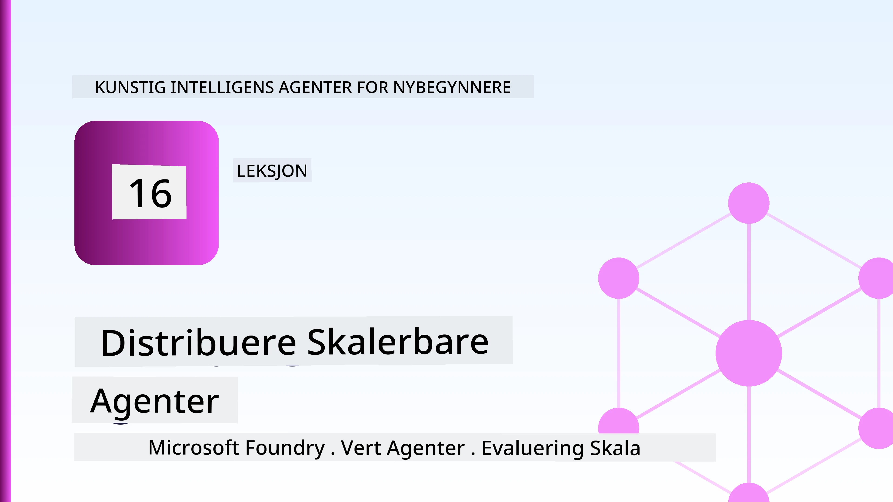
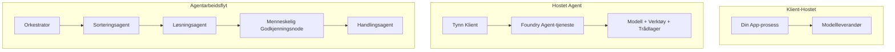
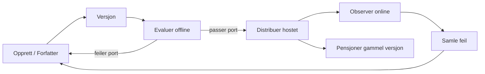
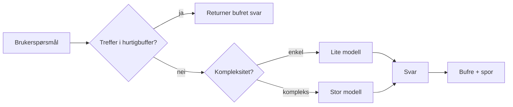
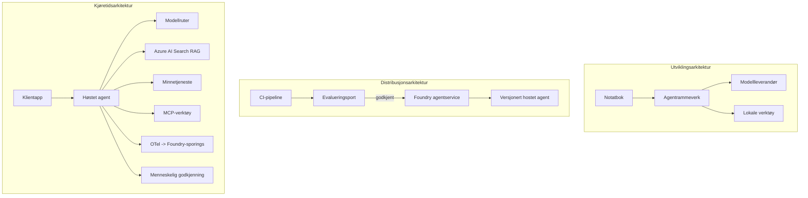

# Distribuering av skalerbare agenter med Microsoft Foundry



Frem til nå i kurset har du bygget agenter som kjører på din bærbare PC, inne i en notatbok, drevet av `az login` og en håndfull miljøvariabler. Det er akkurat den riktige måten å lære på. Det er ikke den riktige måten å kjøre en agent som tusenvis av kunder er avhengige av klokka 3 på natten.

Denne leksjonen handler om gapet mellom "det fungerer på min maskin" og "det fungerer, pålitelig og rimelig, i produksjon." Vi lukker det gapet ved å bruke **Microsoft Foundry** og **Microsoft Foundry Agent Service**, og vi gjør det ved å bygge en ekte kundeserviceagent som har verktøy, henting, minne, evaluering og overvåking.

## Introduksjon

Denne leksjonen vil dekke:

- Forskjellen mellom en **prototype-agent** og en **distribuert agent**, og hvorfor overgangen hovedsakelig handler om alt *rundt* modellen.
- **Distribusjonsmønstre** for agenter: klient-vert, tjeneste-vert (Hosted Agents) og arbeidsflyt-orientert.
- **Agentens livssyklus** på Microsoft Foundry — opprette, versjonere, distribuere, evaluere, observere, pensjonere.
- **Skaleringsstrategier**: modellaruting, caching, samtidighet og stateless-design.
- **Observerbarhet** med OpenTelemetry og Foundry-sporing.
- **Kostnadsoptimalisering** gjennom modellvalg, ruting og evalueringsporter.
- **Enterprise hensyn**: styring, menneskelig godkjenning og sikker kjøring av MCP-servere i produksjon.

## Læringsmål

Etter å ha fullført denne leksjonen, vil du vite hvordan du:

- Velger riktig distribusjonsmønster for en gitt agentbelastning.
- Distribuerer en agent til Microsoft Foundry Agent Service slik at den blir versjonert, styrt og observerbar.
- Instrumenterer en agent for sporing og kobler til en evalueringspipline som kjører før hver utgivelse.
- Anvender modellaruting og caching for å holde latenstid og kostnad under kontroll i skala.
- Legger til en menneskelig godkjenningsport for høyrisiko handlinger og integrerer en MCP-server på en produksjonssikker måte.

## Forutsetninger

Denne leksjonen forutsetter at du har fullført tidligere leksjoner og er komfortabel med:

- Å bygge agenter med [Microsoft Agent Framework](../14-microsoft-agent-framework/README.md) (Leksjon 14).
- [Verktøybruk](../04-tool-use/README.md) (Leksjon 4) og [Agentic RAG](../05-agentic-rag/README.md) (Leksjon 5).
- [Agentminne](../13-agent-memory/README.md) (Leksjon 13) og [Agentiske protokoller / MCP](../11-agentic-protocols/README.md) (Leksjon 11).
- [Observerbarhet og evaluering](../10-ai-agents-production/README.md) (Leksjon 10) — denne leksjonen bygger direkte på den.

Du vil også trenge:

- Et **Azure-abonnement** og et **Microsoft Foundry-prosjekt** med minst én distribuert chatmodell.
- **Azure CLI** autentisert (`az login`).
- Python 3.12+ og pakkene i depotets [`requirements.txt`](../../../requirements.txt).

## Fra prototype til produksjon: hva endres egentlig

En prototype-agent og en produksjonsagent deler samme kjerneloop — resoner, kall verktøy, svar. Det som endrer seg er alt som er pakket rundt den loopen. Modellen utgjør kanskje 20% av en produksjonsagent; de resterende 80% er den operative skjelettstrukturen.

| Bekymring | Prototype | Produksjon |
| --- | --- | --- |
| **Vertskap** | Kjører i din notatbok | Kjører som en hostet tjeneste, versjonert og utrullet |
| **Identitet** | Din `az login`-token | Administrert identitet med omfangsbasert RBAC |
| **Tilstand** | I minnet, mistes ved omstart | Eksternalisert (tråd-lager, minnetjeneste) |
| **Feil** | Du ser tilbakekasting | Forsøk på nytt, fallbacks, dead-letter, varsler |
| **Kostnad** | "Det koster noen få cent" | Følges per forespørsel, rutet, cachet, budsjettert |
| **Kvalitet** | Du vurderer utdata manuelt | Evaluert automatisk før hver utgivelse |
| **Tillit** | Du godkjenner hver handling | Policy + menneskelig i løkken for risikable handlinger |

Ha dette bordet i bakhodet. Hvert avsnitt nedenfor tilsvarer en av disse radene.

## Agentens distribusjonsmønstre

Det finnes tre mønstre du vil bruke, ofte i kombinasjon.

### 1. Klient-verterte agenter

Agentobjektet lever inne i *din* applikasjonsprosess. Koden din kaller modelltilbyderen direkte; resonneringsloopen kjører i tjenesten din. Dette er det som alle tidligere leksjoner har gjort.

- **Bruk når** du trenger full kontroll over loopen, egendefinert middleware, eller du bygger agenten inn i en eksisterende backend.
- **Avveining**: du håndterer skalering, tilstand og robusthet selv.

### 2. Hostede agenter (Foundry Agent Service)

Agenten er *registrert som en ressurs* i Microsoft Foundry. Foundry hoster resonneringsloopen, lagrer tråder, håndhever innholdssikkerhet og RBAC, og gjør agenten synlig i Foundry-portalen. Appen din blir en tynn klient som oppretter tråder og leser svar.

- **Bruk når** du ønsker varighet, innebygd observerbarhet, styring og mindre operasjonelt ansvarsområde.
- **Avveining**: mindre lavnivåkontroll som bytte for en administrert runtime.

### 3. Agentarbeidsflyter

Flere agenter (og verktøy) komponeres til en graf med eksplisitt kontrollflyt — sekvensielle trinn, forgreninger, noder for menneskelig godkjenning og varige sjekkpunkter som kan pause og gjenoppta. Dette er Microsoft Agent Frameworks **Workflows**-mulighet brukt i distribusjonsskala.

- **Bruk når** en enkelt oppgave spenner over flere spesialiserte agenter eller krever et godkjenningssteg midt i.
- **Avveining**: flere bevegelige deler; trenger observabilitet på orkestreringsnivå.



## Agentens livssyklus på Microsoft Foundry

Å distribuere en agent er ikke et engangskall `push`. Det er en loop, og det ligner sterkt på en programvareutgivelsessyklus fordi det nettopp det er.



Den sentrale ideen, videreført fra [Leksjon 10](../10-ai-agents-production/README.md): **offline evaluering er en port, ikke en ettertanke.** En ny agentversjon sendes ikke ut med mindre den oppfyller dine evalueringsgrenser. Online observerbarhet mater deretter reelle feil tilbake til ditt offline testsett. Det er hele loopen.

## Skaleringsstrategier

Å skalere en agent er annerledes enn å skalere et stateless web-API, fordi hver forespørsel kan utløse flere dyre modell- og verktøykall. Fire teknikker bærer mesteparten av belastningen.

**Stateless forespørselsbehandling.** Ikke behold tilstand per bruker i prosessminnet. Lagre samtaletråder i Foundrys trådlager eller en minnetjeneste slik at hvilken som helst instans kan håndtere enhver forespørsel. Dette lar deg skalere horisontalt — legg til instanser, ingen sticky sessions.

**Modellaruting.** Ikke alle forespørsler trenger din mest kapable (og dyreste) modell. Rute enkle forespørsler — intensjonsklassifisering, korte faktiske svar — til en liten, rask modell, og reserver den store modellen for ekte resonnering. Foundrys **Model Router** kan gjøre dette for deg, eller du kan implementere en lettvekts-klassifiserer selv. Du bygger DIY-versjonen i labben.

**Cache respons.** Mange kundespørsmål er nær-duplikater ("hvordan tilbakestiller jeg passordet mitt?"). Svar på vanlige spørsmål fra cache uten å treffe modellen i det hele tatt. Selv en moderat cachetreffrate kutter kostnader og latenstid merkbart.

**Samtidighet og backpressure.** Modelltilbydere har tak på forespørsler. Begrens samtidigheten, bruk nye forsøk med eksponentiell backoff, og feile grasiøst (et kuet "vi jobber med det" svar slår en 500-feil).



## Observerbarhet i produksjon

Du kan ikke drifte det du ikke kan se. Som dekket i Leksjon 10, sender Microsoft Agent Framework ut **OpenTelemetry**-sporingsdata innfødt — hvert modellkall, verktøysanrop og orkestreringstrinn blir en span. I produksjon eksporterer du disse spanene til Microsoft Foundry (eller hvilken som helst OTel-kompatibel backend) slik at du kan:

- Spore en enkelt kundeklage end-to-end gjennom alle modell- og verktøysamtaler.
- Se p50/p95-latenstid og kost per forespørsel over tid.
- Varsle om feilrater og kostnadsavvik før brukerne dine (eller økonomiteamet) merker det.

```python
from agent_framework.observability import get_tracer

tracer = get_tracer()

with tracer.start_as_current_span("support_request") as span:
    span.set_attribute("customer.tier", "enterprise")
    span.set_attribute("routed.model", "gpt-4.1-mini")
    # agentutførelse spores automatisk innenfor dette området
```

Attributter som `customer.tier` og `routed.model` gjør at en vegg av spor blir til spørsmål som kan besvares ("blir bedriftskunder rutet til den lille modellen for ofte?").

## Kostnadsoptimalisering

Kostnader i produksjonsagenter domineres av tokens. Tre spaker, i rekkefølge etter effekt:

1. **Riktig modellstørrelse.** En liten modell som passerer evalueringsporten din er nesten alltid billigere enn en stor som også passer. Bruk evaluering for å *bevise* at den lille modellen er god nok i stedet for å standardisere på den største modellen i forsiktighet.
2. **Ruting etter kompleksitet.** Som over — betal stormodell-pris bare for forespørsler som krever stormodell-resonnering.
3. **Cach aggressivt.** Det billigste modellkallet er det du aldri gjør.

Evalueringsporter og kostnadskontroll er den samme disiplinen sett fra to vinkler: evaluering forteller deg *kvalitetsgulvet*, ruting og caching holder deg så nær det gullets *kostnad* som mulig.

## Enterprise distributjonshensyn

**Styring.** Hostede agenter arver Foundrys RBAC, innholdssikkerhet og revisjonslogging. Gi hver agent en administrert identitet med minst privilegium den trenger — lesetilgang til kunnskapsbasen, avgrenset tilgang til billett-API, ikke mer.

**Menneske i løkken.** Noen handlinger er for viktige til å automatiseres rett ut — tilbakebetaling, slette konto, eskalering til juridisk team. Microsoft Agent Framework støtter **godkjenning-påkrevd** verktøy: agenten foreslår, utføring settes på pause, et menneske godkjenner eller avviser, og arbeidsflyten gjenopptas. Du så det primitive i [Leksjon 6](../06-building-trustworthy-agents/README.md); her distribuerer du det.

**MCP i produksjon.** [MCP](../11-agentic-protocols/README.md) lar agenten din bruke eksterne verktøy gjennom et standard grensesnitt. I produksjon, behandle hver MCP-server som en utdatert grense: fastlåse serverversjonen, kjøre den med en avgrenset identitet, validere utdata, og aldri eksponere hemmeligheter for den. En MCP-server er en avhengighet som må patche, revideres og rate-limites.



De tre diagrammene — utvikling, distribusjon, runtime — er samme agent i tre livsstadier. Labben som følger tar deg gjennom hvordan bygge den.

## Praktisk lab: En produksjonsklar kundeserviceagent

Åpne [`code_samples/16-python-agent-framework.ipynb`](./code_samples/16-python-agent-framework.ipynb) og gå gjennom den fra start til slutt. Du vil sette sammen en **Contoso kundeserviceagent** med alle produksjonshensyn koblet inn:

1. **Verktøykall** — slå opp ordrestatus og åpne supportsaker.
2. **RAG** — svar på policyspørsmål fra en kunnskapsbase (Azure AI Search, med en minnebackup slik at notatboken kjører uten en Search-ressurs).
3. **Minne** — husk kunden gjennom samtalens omganger.
4. **Modellaruting** — en kompleksitetsklassifiserer ruter hver forespørsel til en liten eller stor modell.
5. **Cache respons** — gjentatte spørsmål serveres fra cache.
6. **Menneskelig godkjenning** — refusjoner over en terskel settes på pause for menneskelig signering.
7. **Evalueringspipelinen** — et lite offline testssett scorer agenten og fungerer som en utgivelsesport.
8. **Observerbarhet** — OpenTelemetry-sporing rundt hver forespørsel.

### Gjennomgang

Notatboken er organisert slik at hvert produksjonshensyn er en selvstendig, kjørbar seksjon. Kjernen er den rutings- og cache-baserte forespørselsbehandleren:

```python
async def handle_support_request(query: str, customer_id: str) -> str:
    # 1. Server fra hurtigbuffer når vi kan.
    cached = response_cache.get(normalize(query))
    if cached:
        return cached

    # 2. Ruter etter kompleksitet for å kontrollere kostnad.
    model = "gpt-4.1-mini" if is_simple(query) else "gpt-4.1"

    # 3. Kjør agenten inne i et sporingsspenn for observerbarhet.
    with tracer.start_as_current_span("support_request") as span:
        span.set_attribute("routed.model", model)
        span.set_attribute("customer.id", customer_id)
        response = await support_agent.run(query, model=model)

    # 4. Bufre og returner.
    response_cache.set(normalize(query), response.text)
    return response.text
```

Evalueringsporten som vokter en utgivelse ser slik ut:

```python
async def evaluation_gate(agent, test_cases, threshold: float = 0.8) -> bool:
    passed = 0
    for case in test_cases:
        result = await agent.run(case["input"])
        if score_response(result.text, case["expected"]) >= 0.8:
            passed += 1
    pass_rate = passed / len(test_cases)
    print(f"Evaluation pass rate: {pass_rate:.0%} (gate: {threshold:.0%})")
    return pass_rate >= threshold  # distribuer bare hvis porten går gjennom
```

Les hver linje — notatboken holder primitivene bevisst små slik at ingenting er skjult bak et rammeverkskall.

## Validere en distribuert agent med røyktester

Evalueringsporten ovenfor kjører *offline* mot agentobjektet ditt. Når agenten er distribuert som en Hosted Agent, trenger du en sjekk til, enda rimeligere: **svarer den distribuerte endepunktet faktisk?**

Å distribuere "vellykket" beviser bare at kontrollplanet aksepterte definisjonen — det beviser ikke at agenten svarer. En manglende avhengighet, dårlig modellaruting eller en utløpt tilkobling kan etterlate en grønn distribusjon som ikke returnerer noe. En **røyktest** fanger dette på sekunder, ved hver distribusjon, uten kostnadene ved en full evaluering.

Dette depotet leverer en klar-til-bruk-røyktestpipeline bygget på [AI Smoke Test](https://github.com/marketplace/actions/ai-smoke-test) GitHub Action:

- **Katalog** — [`tests/lesson-16-smoke-tests.json`](../../../tests/lesson-16-smoke-tests.json) inneholder forespørsler og påstander for Contoso supportagent (grunnfestede policy-svar, ordresøk, holde seg til tema og fleromgangs trådkontinuitet). Kataloger for andre leksjoners agenter ligger ved siden av — se [`tests/README.md`](../tests/README.md).
- **Arbeidsflyt** — [`.github/workflows/smoke-test.yml`](../../../.github/workflows/smoke-test.yml) logger inn med Azure OIDC og POSTer hver prompt til agentens Responses-endepunkt, og feiler jobben ved enhver påstandsmiss.

```yaml
- name: Smoke-test hosted agent
  uses: JFolberth/ai-smoketest@v1
  with:
    project_endpoint: ${{ inputs.project_endpoint }}
    agent_name: ContosoSupportAgent
    tests_file: tests/lesson-16-smoke-tests.json
```


Kjør det fra **Actions**-fanen når agenten din er distribuert, og oppgi endepunktet for Foundry-prosjektet ditt og agentnavnet. Den fødererte identiteten trenger rollen **Azure AI User** på Foundry-prosjektets omfang. Tenk på lagene som en pyramide: røyktester (er den tilgjengelig og svarer?) kjører ved hver distribusjon, offline evaluering (god nok til å sende ut?) kjører før promotering, og online evaluering (hvordan gjør den det ute i felt?) kjører kontinuerlig.

## Kunnskapstest

Test forståelsen din før du går videre til oppgaven.

**1. Grovt sett, hvor mye av en produksjonsagent er "modellen", og hva er resten?**

<details>
<summary>Svar</summary>

Modellen er en minoritet av systemet — ofte sitert til rundt 20%. Resten er det operative skjelettet: hosting og versjonering, identitet og RBAC, ekstern tilstand, feilhåndtering, kostnadssporing, evaluering og menneskelig kontroll (human-in-the-loop). Overgangen til produksjon handler mest om å bygge alt *rundt* resonansløkken.
</details>

**2. Når vil du velge en Hosted Agent fremfor en klient-hostet agent?**

<details>
<summary>Svar</summary>

Når du ønsker en administrert runtime med innebygd utholdenhet (tråder som vedvarer og kan gjenopptas), observerbarhet, innholdsikkerhet og RBAC, og er villig til å bytte noe lavnivåkontroll over resonansløkken for mindre operativt flateareal. Klient-hostet er å foretrekke når du trenger full kontroll over løkken eller integrerer agenten i en eksisterende backend.
</details>

**3. Hvorfor må en skalerbar agent være stateless i sin egen prosessminne?**

<details>
<summary>Svar</summary>

Slik at hvilken som helst instans kan håndtere hvilken som helst forespørsel, noe som tillater horisontal skalering uten sticky sessions. Brukerspesifikk samtaletilstand er ekstern til en trådlagring eller minnetjeneste. Hvis tilstanden lå i prosessminnet, ville du mistet den ved omstart og ikke kunne distribuere belastningen fritt.
</details>

**4. Hvilket problem løser modellruting, og hvordan relaterer det seg til evaluering?**

<details>
<summary>Svar</summary>

Ruting sender enkle forespørsler til en liten, billig og rask modell og reserverer den store modellen til faktisk resonnering, noe som styrer både latens og kostnad. Det relaterer til evaluering fordi evaluering er det som *beviser* at den lille modellen er god nok for en klasse forespørsler — ruting uten evaluering er gjetting.
</details>

**5. Hva er en "evaluasjonsport" og hvor i livssyklusen sitter den?**

<details>
<summary>Svar</summary>

En evalueringsport kjører en offline testsett mot en ny agentversjon og blokkerer distribusjon med mindre gjennomføringsraten overskrider en terskel. Den sitter mellom "versjon" og "distribuer" i livssyklusen, og gjør kvalitet til en forutsetning for utgivelse i stedet for noe du sjekker etter lansering.
</details>

**6. Hvorfor bør en MCP-server behandles som en ikke-pålitelig grense i produksjon?**

<details>
<summary>Svar</summary>

Fordi det er en ekstern avhengighet agenten din kaller inn i. Du bør feste versjonen, kjøre den med en omfangsbegrenset identitet, validere resultatene, ratebegrense den, og aldri eksponere hemmeligheter for den — samme disiplin som du bruker på alle tredjepartsavhengigheter. Resultatene dens flyter inn i agentens resonnering, så uten validert tillit er det en sikkerhetsrisiko.
</details>

**7. Hvilken enkelt endring har vanligvis størst effekt på produksjonsagentkostnad, og hvorfor?**

<details>
<summary>Svar</summary>

Riktig størrelse på modellen — å bruke den minste modellen som fortsatt passerer evalueringsporten din. Kostnaden domineres av tokens, og en mindre modell som møter kvalitetskravet er nesten alltid billigere enn en større. Caching og routing reduserer kostnad enda mer, men valg av riktig grunnmodell har den største førstegangs effekten.
</details>

**8. Hvilken rolle spiller span-attributter som `customer.tier` og `routed.model` i observabilitet?**

<details>
<summary>Svar</summary>

De forvandler rå sporspor til besvarbare forretningsspørsmål. Uten attributter har du en vegg av spans; med dem kan du spørre "blir bedriftskunder rutet til den lille modellen for ofte?" eller "hvilken modell håndterer våre tregeste forespørsler?" Attributter er hvordan du skjærer telemetri etter dimensjonene som betyr noe for driften din.
</details>

## Oppgave

Ta kundestøtteagenten fra labben og gjør den robust for et spesifikt scenario: **en abonnementsfaktureringsstøtteagent for en SaaS-bedrift.**

Innleveringen din bør:

1. **Erstatte verktøyene** med faktureringsrelevante: `get_subscription_status`, `get_invoice` og `issue_credit` (kreditter over $50 krever menneskelig godkjenning).
2. **Legge til tre RAG-dokumenter** som dekker selskapets refusjonspolicy, faktureringssyklus og avbestillingspolicy.
3. **Utvide evalueringssettet** til minst åtte tilfeller, der minst to *skal* trigge menneskelig godkjenningsløype, og bekrefte at evalueringsporten fungerer korrekt.
4. **Legge til en kostnadsrapport**: etter å ha kjørt ti blandede spørringer gjennom agenten, skriv ut hvor mange som gikk til den lille modellen, hvor mange til den store modellen, og hvor mange som ble servert fra hurtigbuffer.

Skriv et kort avsnitt (i en markdown-celle) som forklarer hvilken modell-rutingregel du valgte og hvordan du ville validere den med ekte trafikk. Det finnes ikke ett riktig svar — du vurderes på om produksjonshensynene er satt sammen på en sammenhengende måte.

## Oppsummering

I denne leksjonen flyttet du en agent fra prototype til produksjon med Microsoft Foundry:

- Overgangen til produksjon handler mest om **det operative skjelettet** rundt modellen — hosting, identitet, tilstand, feilhåndtering, kostnad, kvalitet og tillit.
- Du lærte de tre **distribusjonsmønstrene** — klient-hostet, Hosted Agents og Agent Workflows — og når hver passer.
- Du gikk gjennom **agentens livssyklus**, der offline **evaluering fungerer som en utgivelsesport** og online observabilitet returnerer feil til testsettet.
- Du anvendte **skaleringstrategier** — stateless design, modellruting, caching og begrenset samtidighet — og koblet dem til **kostnadsoptimalisering**.
- Du koblet inn **bedriftskontroller**: RBAC, menneskelig godkjenning i løkken, og produksjonssikker MCP-integrasjon.
- Du bygde en **produksjonssklar kundestøtteagent** som binder sammen alle disse hensynene i kjørbar kode.

Neste leksjon tar den motsatte reisen: i stedet for å skalere agenter opp til skyen, vil du bringe dem *ned* til en enkelt utviklermaskin og kjøre dem helt lokalt.

## Ekstra ressurser

- <a href="https://learn.microsoft.com/azure/ai-foundry/what-is-azure-ai-foundry" target="_blank">Microsoft Foundry-dokumentasjon</a>
- <a href="https://learn.microsoft.com/azure/ai-foundry/agents/overview" target="_blank">Oversikt over Microsoft Foundry Agent Service</a>
- <a href="https://aka.ms/ai-agents-beginners/agent-framework" target="_blank">Microsoft Agent Framework</a>
- <a href="https://learn.microsoft.com/azure/ai-foundry/concepts/model-router" target="_blank">Model Router i Microsoft Foundry</a>
- <a href="https://learn.microsoft.com/azure/search/search-what-is-azure-search" target="_blank">Azure AI Search</a>
- <a href="https://opentelemetry.io/" target="_blank">OpenTelemetry</a>
- <a href="https://github.com/marketplace/actions/ai-smoke-test" target="_blank">AI Smoke Test GitHub Action</a>
- <a href="https://modelcontextprotocol.io/" target="_blank">Model Context Protocol (MCP)</a>

## Forrige leksjon

[Bygge Computer Use Agents (CUA)](../15-browser-use/README.md)

## Neste leksjon

[Skape lokale AI-agenter](../17-creating-local-ai-agents/README.md)

---

<!-- CO-OP TRANSLATOR DISCLAIMER START -->
**Ansvarsfraskrivelse**:
Dette dokumentet er oversatt ved hjelp av AI-oversettelsestjenesten [Co-op Translator](https://github.com/Azure/co-op-translator). Selv om vi streber etter nøyaktighet, vær oppmerksom på at automatiske oversettelser kan inneholde feil eller unøyaktigheter. Det opprinnelige dokumentet på originalspråket skal betraktes som den autoritative kilden. For kritisk informasjon anbefales profesjonell menneskelig oversettelse. Vi er ikke ansvarlige for eventuelle misforståelser eller feiltolkninger som oppstår ved bruk av denne oversettelsen.
<!-- CO-OP TRANSLATOR DISCLAIMER END -->