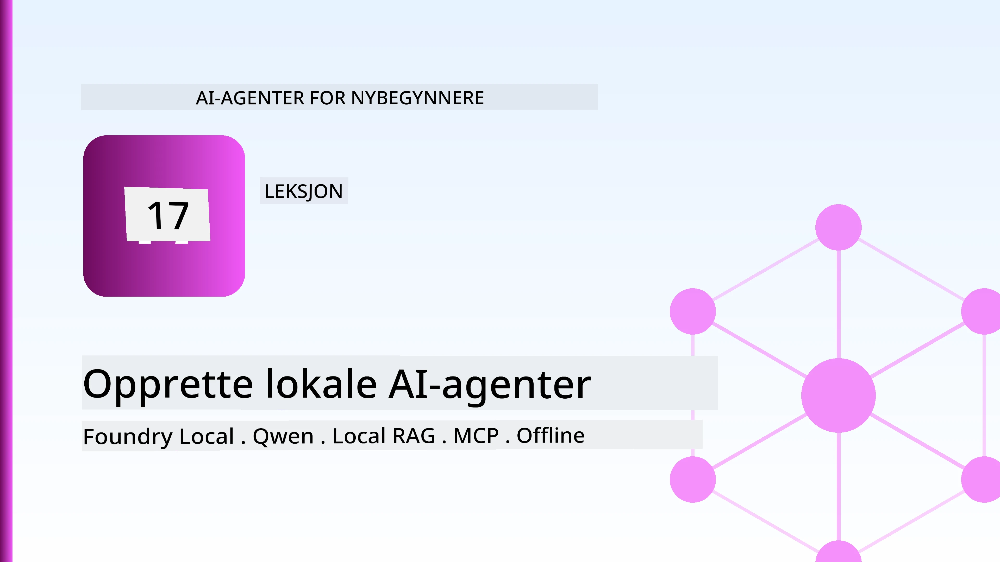
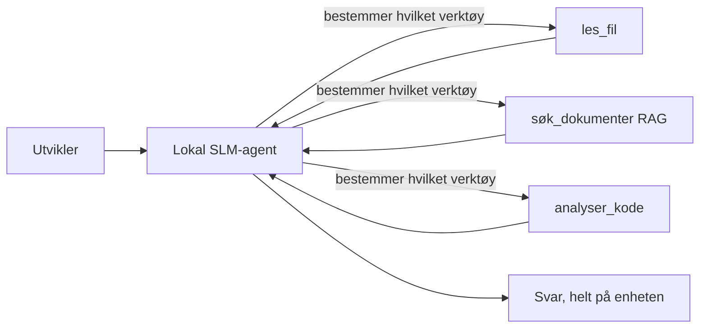
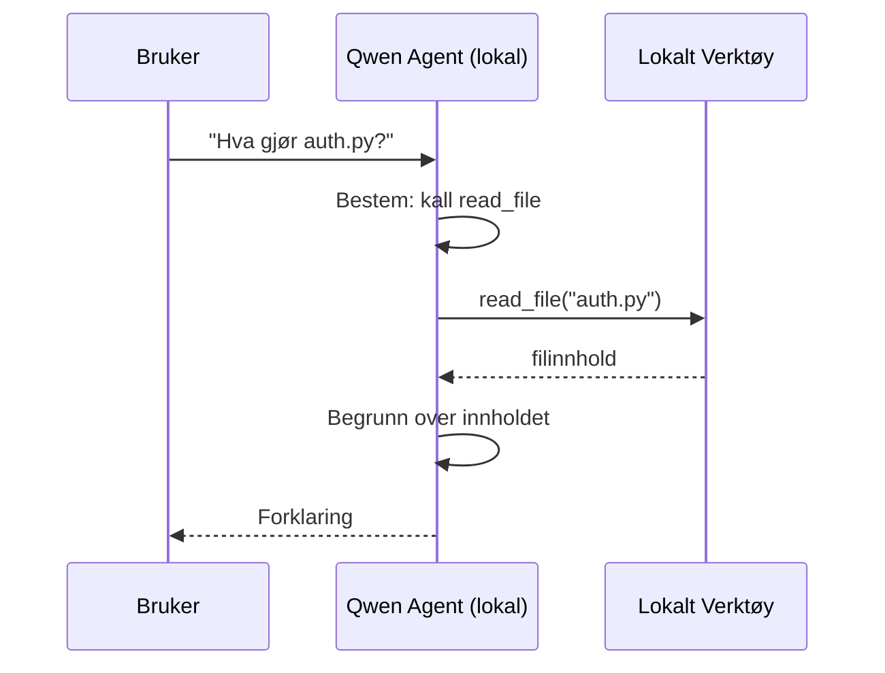
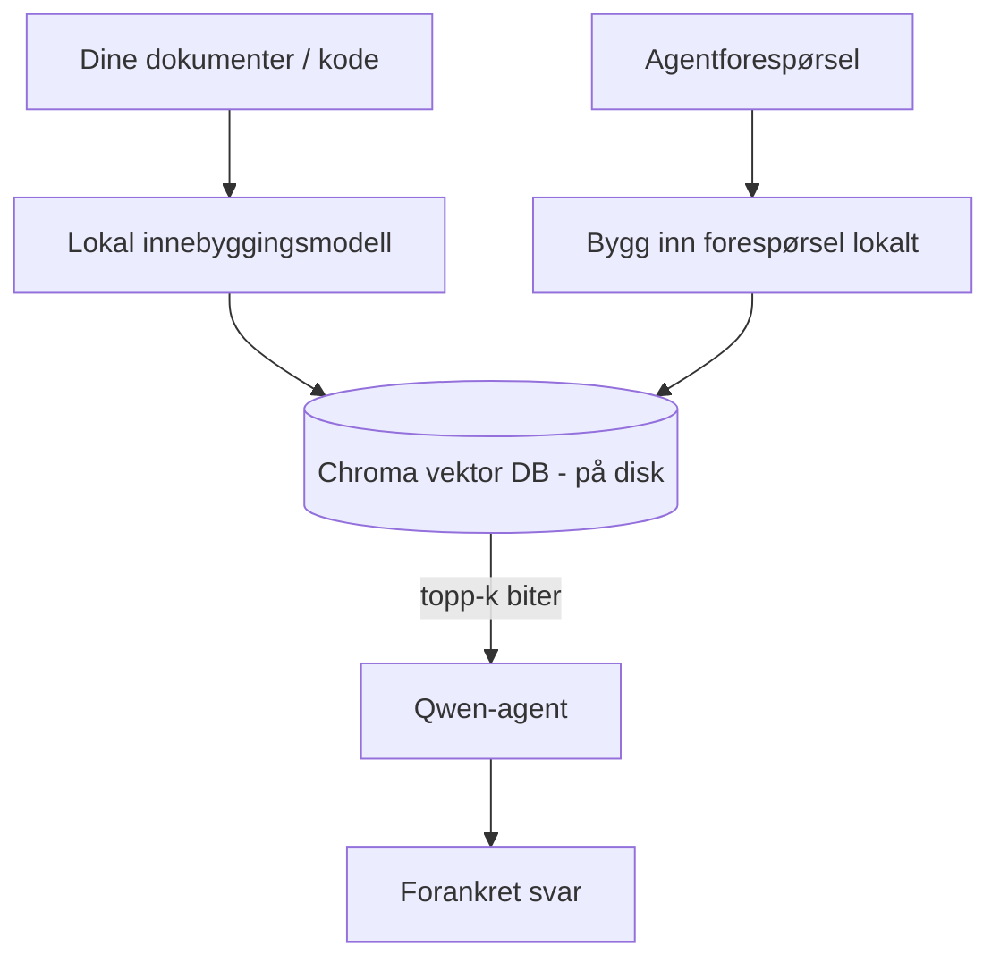
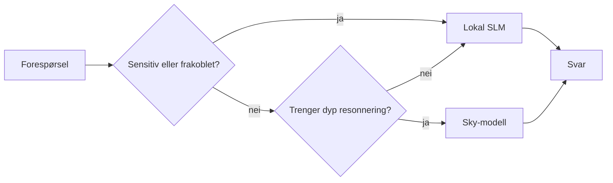

# Lage lokale AI-agenter ved bruk av Microsoft Foundry Local og Qwen



Den forrige leksjonen skalerte agenter *opp* til skyen. Denne tar dem *ned* på en enkelt maskin. På slutten vil du ha en fungerende ingeniørassistent som resonerer, kaller verktøy, leser filene dine, og søker i dokumentasjonen din — **uten en eneste skyinferenz-kall.**

Hvorfor vil du ha det? Tre grunner som stadig dukker opp i ekte ingeniørarbeid:

- **Personvern.** Kode og dokumenter forlater aldri maskinen. Ingen prompt, utdrag eller kundedata krysser nettverksgrensen.
- **Kostnad.** Lokal inferens har ingen per-token regning. Du kan iterere hele dagen for prisen av strøm.
- **Frakoblet.** På et fly, i et sikkert område eller under et strømbrudd, fungerer agenten fortsatt.

Fangsten er at du bytter ut en fremtidsrettet sky-modell med en **Small Language Model (SLM)** som kjører på CPU, GPU eller NPU. Denne leksjonen handler om å bygge agenter som er *gode* innenfor denne begrensningen, i stedet for å late som om begrensningen ikke finnes.

## Introduksjon

Denne leksjonen vil ta for seg:

- **Small Language Models (SLMs)** — hva de er, hvor de skinner, og hvor de ikke gjør det.
- **Microsoft Foundry Local** — en runtime som laster ned og server modeller på enheten gjennom en **OpenAI-kompatibel API**.
- **Qwen funksjonskallende modeller** — SLM-er som pålitelig produserer verktøykall, som gjør lokale *agenter* (ikke bare lokal chat) mulig.
- **Lokale verktøy, lokal RAG og lokal MCP** — som gir agenten kapasitet uten sky.
- **Hybridmønstre** — når man bør holde ting lokalt og når man skal nå ut til skyen.

## Læringsmål

Etter å ha fullført denne leksjonen skal du kunne:

- Forklare avveiningene ved SLM-er og velge passende brukstilfeller for lokale agenter.
- Serve en Qwen-modell lokalt med Foundry Local og koble til den gjennom den OpenAI-kompatible endepunkt.
- Bygge en verktøykallende agent som kjører helt på din arbeidsstasjon.
- Legge til lokal RAG over dine egne dokumenter ved bruk av en lokal vektordatabse (Chroma).
- Koble agenten til en lokal MCP-server og resonere omkring hybride lokalt/sky-design.

## Forutsetninger

Denne leksjonen forutsetter at du har fullført tidligere leksjoner og er komfortabel med:

- [Tool Use](../04-tool-use/README.md) (Leksjon 4) og [Agentic RAG](../05-agentic-rag/README.md) (Leksjon 5).
- [Agentic Protocols / MCP](../11-agentic-protocols/README.md) (Leksjon 11).
- [Microsoft Agent Framework](../14-microsoft-agent-framework/README.md) (Leksjon 14).

Du vil også trenge:

- En utviklingsarbeidsstasjon. **8 GB RAM er et realistisk minimum**; 16 GB+ er behagelig. En GPU eller NPU hjelper, men er ikke nødvendig.
- **Microsoft Foundry Local** installert (se oppsettseksjonen nedenfor).
- Python 3.12+ og pakkene i repoet [`requirements.txt`](../../../requirements.txt), pluss `foundry-local-sdk`, `openai`, og `chromadb` for denne leksjonen.

## Small Language Models: Det riktige verktøyet for lokalarbeid

En fremtidsrettet skyløsning har hundrevis av milliarder parametere og et datasenter bak seg. En SLM har noen få milliarder parametere og må få plass i laptopen din sin RAM. Den forskjellen setter klare forventninger.

**SLM-er er gode på:**

- Strukturerte, avgrensede oppgaver — klassifisering, uttrekk, oppsummering av et kjent dokument.
- **Verktøykalling** — beslutning om hvilken funksjon som skal kalles og med hvilke argumenter.
- Rask, billig, privat iterasjon på dine egne data.

**SLM-er er svakere på:**

- Åpen, flertrinns resonnering over stor kontekst.
- Bred verdenskunnskap (har sett mindre, og glemmer mer).

Den vinnende strategien for lokale agenter er derfor: **la SLM-en orkestrere, og la verktøyene gjøre det tunge løftet.** Modellen trenger ikke *å kjenne* kodebasen din — den må vite når den skal kalle `read_file` og `search_docs`. Det spiller direkte på SLM-ens styrker.



## Microsoft Foundry Local

**Microsoft Foundry Local** er en lettvektsruntime som laster ned, administrerer og server modeller helt på maskinen din. Dens viktigste funksjon for oss er at den eksponerer et **OpenAI-kompatibelt HTTP-endepunkt** — som betyr at OpenAI SDK og Microsoft Agent Framework sin OpenAI-klient fungerer mot det kun med en endring av `base_url`. Alt du lærte om å bygge agenter overføres direkte; bare endepunktet flyttes fra skyen til `localhost`.

Foundry Local velger også automatisk den beste modellen for maskinvaren din — en CPU-versjon, en CUDA/GPU-versjon eller en NPU-versjon — slik at du ikke trenger å optimalisere for hver maskin.

### Oppsett

Installer Foundry Local (se [dokumentasjonen](https://learn.microsoft.com/azure/ai-foundry/foundry-local/) for ditt OS), og bekreft at det virker:

```bash
# Installer (eksempel; følg dokumentasjonen for din plattform)
winget install Microsoft.FoundryLocal      # Windows
# brew install microsoft/foundrylocal/foundrylocal   # macOS

# Last ned og kjør en Qwen-modell, start deretter den lokale tjenesten
foundry model run qwen2.5-7b-instruct
foundry service status
```

Når tjenesten kjører, har du et lokalt, OpenAI-kompatibelt endepunkt (typisk `http://localhost:PORT/v1`). Notatboken bruker `foundry-local-sdk` for automatisk å finne endepunktet, så du slipper å hardkode porten.

## Qwen funksjonskalling: Hvorfor det er viktig

En agent er bare en agent hvis den kan kalle verktøy. Mange SLM-er kan chatte men produserer upålitelige, malformed verktøykall. **Qwen**-modeller er trent for funksjonskalling og leverer velformede verktøykallstrukturer konsekvent — noe som akkurat er det som gjør en lokal chatmodell til en lokal *agent*.

Flyten er den vanlige verktøykallsløyfen du allerede kjenner, bare at den kjører lokalt:



## Lokal RAG

Dokumentasjonssøk er hvor lokale agenter skiller seg ut. I stedet for å håpe at SLM-en husket rammeverkets dokumenter, innebygger du disse dokumentene i en **lokal vektordatabse** og lar agenten hente relevante utdrag ved behov.

Vi bruker **Chroma**, en innebygd vektordatabase som kjører i samme prosess uten en server som må administreres. Hele pipeline er lokal: lokal innebyggingsmodell → lokale vektorer → lokal henting → lokal SLM.



Dette er samme Agentic RAG-mønster fra Leksjon 5 — eneste endring er at alle komponentene kjører på maskinen din.

## Lokale MCP-servere

[MCP](../11-agentic-protocols/README.md) er et transportlag, ikke en skytjeneste. En MCP-server kan kjøre som en lokal prosess på `stdio`, og eksponere verktøy til agenten din over standardprotokollen. Dette lar deg gjenbruke det voksende økosystemet av MCP-servere — filsystemtilgang, git-operasjoner, databaseforespørsler — helt offline.

Sikkerhetsaspektet er annerledes enn i skyen, men ikke fraværende: en lokal MCP-server kjører fortsatt med brukerens tillatelser, så begrens hva den kan nå (en prosjektdirektory, ikke hele hjemmemappen din) og behandle dens utdata som inndata for validering.

## Hybrid sky-og-lokal mønstre

Lokal først betyr ikke bare lokal. Modne systemer ruter basert på sensitivitet og vanskelighetsgrad:

| Situasjon | Hvor den kjører |
| --- | --- |
| Sensitiv kode/data, eller offline | **Lokal SLM** |
| Enkle, avgrensede oppgaver | **Lokal SLM** (billig, rask) |
| Vanskelig flertrinns resonnering på ikke-sensitive data | **Sky-modell** |
| Alt under strømbrudd | **Lokal SLM** (gradvis degradering) |

Dette speiler ideen om **modellruting** fra Leksjon 16 — bortsett fra at en av "modellene" nå er din egen maskin. En robust design faller tilbake på lokal modell når skyen ikke er tilgjengelig, så agenten degraderer i kvalitet i stedet for å feile helt.



## Praktisk lab: En lokal ingeniørassistent

Åpne [`code_samples/17-local-agent-foundry-local.ipynb`](./code_samples/17-local-agent-foundry-local.ipynb) og jobb deg gjennom den. Du vil bygge en **lokal ingeniørassistent** som kjører helt på din arbeidsstasjon og kan:

1. **Kalle verktøy** — via Qwen funksjonskalling gjennom Foundry Local.
2. **Utføre lokale filoperasjoner** — liste opp og lese filer i et prosjektmappe.
3. **Analysere kode** — rapportere grunnleggende metrikker på en kildefil.
4. **Søke i dokumentasjon** — lokal RAG over en dokumentasjonsmappe med Chroma.
5. **Bruke MCP** — koble til en lokal MCP-server (med en behagelig hopp over hvis ingen er konfigurert).

Ingen skyinferenz brukes på noe tidspunkt.

### Gjennomgang

Assistenten kobler til Foundry Local via det OpenAI-kompatible endepunktet, så agentkoden ser nesten identisk ut med sky-leksjonene — bare klienten endres:

```python
from foundry_local import FoundryLocalManager
from openai import OpenAI

# Foundry Local oppdager/lastrer ned modellen og gir oss et lokalt endepunkt.
manager = FoundryLocalManager(\"qwen2.5-7b-instruct\")
client = OpenAI(base_url=manager.endpoint, api_key=manager.api_key)  # api_key er en lokal plassholder
```

Verktøyene er vanlige Python-funksjoner avgrenset til en prosjektmappe:

```python
def read_file(path: str) -> str:
    \"\"\"Read a file, but only inside the sandboxed project directory.\"\"\"
    full = (PROJECT_ROOT / path).resolve()
    if PROJECT_ROOT not in full.parents and full != PROJECT_ROOT:
        return \"Access denied: path is outside the project directory.\"
    return full.read_text(encoding=\"utf-8\")
```

Legg merke til sandkasse-sjekken — selv lokalt er et verktøy som leser vilkårlige stier en potensiell risiko. Notatboken holder hvert verktøy begrenset til en enkelt prosjektrot.

## Kunnskapssjekk

Test din forståelse før du går videre til oppgaven.

**1. Gi to konkrete grunner til å kjøre en agent lokalt i stedet for i skyen.**

<details>
<summary>Svar</summary>

To av: **personvern** (kode og data forlater aldri maskinen), **kostnad** (ingen per-token regning for inferens), og **frakoblet funksjonalitet** (fungerer uten nettverk — på fly, i sikre fasiliteter eller under strømbrudd). Regulatoriske/overholdelsesbegrensninger som forbyr sending av data utenfor enheten er en vanlig årsak til personverngrunnen.
</details>

**2. Hva er den anbefalte arbeidsdelingen mellom en SLM og dens verktøy i en lokal agent, og hvorfor?**

<details>
<summary>Svar</summary>

La SLM-en **orkestrere** (bestemme hvilket verktøy som skal kalles og med hvilke argumenter) og la **verktøyene gjøre det tunge løftet** (lese filer, hente dokumenter, beregne resultater). SLM-er er sterke på avgrensede beslutninger som verktøyvalg, men svakere på bred kunnskap og lang flertrinns resonnering, så å lene seg på verktøy spiller på deres styrker.
</details>

**3. Hva gjør det mulig å gjenbruke sky-agentkode med Foundry Local?**

<details>
<summary>Svar</summary>

Foundry Local eksponerer et **OpenAI-kompatibelt HTTP-endepunkt**. OpenAI SDK og Agent Framework sin OpenAI-klient fungerer mot det ved å bare endre `base_url` (og bruke en lokal plassholder API-nøkkel). Alt annet ved agentkoden forblir det samme.
</details>

**4. Hvorfor bruker vi spesielt en Qwen funksjonskall-modell fremfor en vilkårlig SLM?**

<details>
<summary>Svar</summary>

Fordi en agent må produsere pålitelige, velformede **verktøykall**. Mange SLM-er kan chatte men sender malformed eller inkonsistente verktøykallstrukturer. Qwen-modeller er trent for funksjonskalling og gir konsistente verktøykall, noe som gjør en lokal chatmodell til en fungerende lokal agent.
</details>

**5. I lokal RAG-pipeline, hvilke komponenter kjører på maskinen?**

<details>
<summary>Svar</summary>

Alle: innebyggingsmodellen, vektordatabasen (Chroma, på disk), hentetrinnet og SLM-en. Dokumenter innebygges lokalt, lagres lokalt, hentes lokalt, og resonneres over av en lokal modell — ingen komponent berører skyen.
</details>

**6. En lokal MCP-server kjører på maskinen din. Gjør det den automatisk sikker? Hvilke forholdsregler bør du fortsatt ta?**

<details>
<summary>Svar</summary>

Nei. En lokal MCP-server kjører med brukerens tillatelser, så den kan nå alt du kan. Begrens den til det den trenger (for eksempel en enkelt prosjektmappe, ikke hele hjemmemappen), og behandle dens utdata som inndata for validering før du handler på dem.
</details>

**7. Beskriv en fornuftig hybridruteringsregel som inkluderer en lokal modell.**

<details>
<summary>Svar</summary>

Ruter sensitive eller frakoblede forespørsler til den lokale SLM-en; ruter enkle avgrensede oppgaver til lokal SLM for hastighet og kostnad; ruter vanskelig flertrinns resonnering på ikke-sensitive data til en sky-modell; og faller tilbake på lokal SLM dersom skyen er utilgjengelig slik at agenten degraderer elegant i stedet for å feile. Dette er modellruting (Leksjon 16) med lokal maskin som en av modellene.
</details>

**8. Hva er et realistisk minimum RAM-krav for å kjøre den lokale agenten i denne leksjonen, og hva får du igjen for mer RAM?**

<details>
<summary>Svar</summary>

Omtrent **8 GB** er et realistisk minimum; 16 GB+ er behagelig. Mer RAM lar deg kjøre større, mer kapable modeller og beholde mer kontekst i minnet. En GPU eller NPU øker inferenshastigheten, men er ikke påkrevd — Foundry Local velger en CPU-versjon når ingen akselerator er tilgjengelig.
</details>

## Oppgave

Utvid den lokale ingeniørassistenten til en **lokal dokumentasjonsgjennomgårer** for et lite prosjekt du velger (bruk en av leksjonsmappene i dette repoet hvis du ønsker).

Innleveringen din bør:

1. **Indeksere en ekte dokumentasjon-/kode-mappe** inn i Chroma (minst fem filer).
2. **Legge til et `find_todos` verktøy** som skanner prosjektet for `TODO`/`FIXME`-kommentarer og returnerer dem med fil- og linjenummer — med samme sandkasse-sjekk som `read_file`.

3. **Still agenten tre spørsmål** som tvinger den til å kombinere verktøy: ett rent RAG-spørsmål, ett som krever å lese en spesifikk fil, og ett som krever å finne TODO-er.
4. **Mål det**: tidsmål hver av de tre svarene og noter dem i en markdown-celle. Kommenter om ventetiden er akseptabel for din tiltenkte arbeidsflyt.

Skriv deretter et kort avsnitt om **hva du ville flyttet til skyen og hva du ville beholdt lokalt** for denne vurdereren, og hvorfor. Du vurderes ut fra om de lokale komponentene er korrekt koblet sammen og om din hybride resonnement er gyldig — ikke på modellkvalitet.

## Sammendrag

I denne leksjonen bygde du en agent som kjører helt på din egen maskin:

- **SLMer** bytter bredde mot personvern, kostnad og offline drift — og skinner når de **orkestrerer verktøy** i stedet for å bære all kunnskapen selv.
- **Foundry Local** server modeller på enheten bak en **OpenAI-kompatibel endepunkt**, slik at koden til din skyagent overføres med en endring på én linje.
- **Qwen funksjonskallende modeller** gjør pålitelig lokal verktøykalling — og dermed lokale *agenter* — mulig.
- **Lokal RAG** (Chroma) og **lokal MCP** gir agenten kapasitet uten å forlate maskinen.
- **Hybride mønstre** lar deg rute etter sensitivitet og vanskelighetsgrad, med lokal som en elegant reserve.

Dette fullfører distribusjonssyklusen: Leksjon 16 skalerte agenter opp i Microsoft Foundry, og denne leksjonen skalerte dem ned til en enkelt arbeidsstasjon. Neste leksjon handler om å holde distribuerte agenter sikre.

## Ytterligere ressurser

- <a href="https://learn.microsoft.com/azure/ai-foundry/foundry-local/" target="_blank">Microsoft Foundry Local dokumentasjon</a>
- <a href="https://learn.microsoft.com/azure/ai-foundry/what-is-azure-ai-foundry" target="_blank">Microsoft Foundry dokumentasjon</a>
- <a href="https://aka.ms/ai-agents-beginners/agent-framework" target="_blank">Microsoft Agent Framework</a>
- <a href="https://qwen.readthedocs.io/en/latest/framework/function_call.html" target="_blank">Qwen funksjonskall dokumentasjon</a>
- <a href="https://modelcontextprotocol.io/" target="_blank">Model Context Protocol (MCP)</a>
- <a href="https://docs.trychroma.com/" target="_blank">Chroma vektordatabase</a>

## Forrige leksjon

[Distribuere skalerbare agenter](../16-deploying-scalable-agents/README.md)

## Neste leksjon

[Sikre AI-agenter](../18-securing-ai-agents/README.md)

---

<!-- CO-OP TRANSLATOR DISCLAIMER START -->
**Ansvarsfraskrivelse**:
Dette dokumentet er oversatt ved hjelp av AI-oversettelsestjenesten [Co-op Translator](https://github.com/Azure/co-op-translator). Selv om vi streber etter nøyaktighet, vær oppmerksom på at automatiske oversettelser kan inneholde feil eller unøyaktigheter. Det opprinnelige dokumentet på originalspråket skal betraktes som den autoritative kilden. For kritisk informasjon anbefales profesjonell menneskelig oversettelse. Vi er ikke ansvarlige for eventuelle misforståelser eller feiltolkninger som oppstår ved bruk av denne oversettelsen.
<!-- CO-OP TRANSLATOR DISCLAIMER END -->