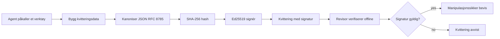
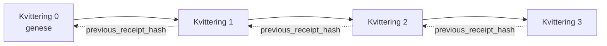

[Se leksjonsvideoen: Sikring av AI-agenter med kryptografiske kvitteringer](https://youtu.be/PLACEHOLDER_VIDEO_ID)

> _(Leksjonsvideo og miniatyrbilde skal legges til av Microsoft-innholdsteamet etter sammenslåing, i samsvar med mønsteret for leksjon 14 / 15.)_

# Sikring av AI-agenter med kryptografiske kvitteringer

## Introduksjon

Denne leksjonen vil dekke:

- Hvorfor revisjonsspor for AI-agenter er viktige for etterlevelse, feilsøking og tillit.
- Hva en kryptografisk kvittering er og hvordan den skiller seg fra en usignert logglinje.
- Hvordan produsere en signert kvittering for en agents verktøysanrop i ren Python.
- Hvordan verifisere en kvittering offline og oppdage manipulering.
- Hvordan lenke kvitteringer slik at fjerning eller omorganisering av en bryter kjeden.
- Hva kvitteringer beviser og hva de eksplisitt ikke beviser.

## Læringsmål

Etter å ha fullført denne leksjonen, vil du kunne:

- Identifisere feilmoduser som motiverer kryptografisk opphav for agenthandlinger.
- Produsere en Ed25519-signert kvittering over en kanonisk JSON-payload.
- Verifisere en kvittering uavhengig ved kun å bruke signatarens offentlige nøkkel.
- Oppdage manipulering ved å kjøre verifiseringen på nytt på en endret kvittering.
- Bygge en hash-kjedet sekvens av kvitteringer og forklare hvorfor kjeden er viktig.
- Erkende grensen mellom hva kvitteringer beviser (tilskrivelse, integritet, rekkefølge) og hva de ikke gjør (korrekthet av handlingen, gyldighet av policy).

## Problemet: Revisjonsspor for agenten din

Se for deg at du har satt i drift en AI-agent for Contoso Travel. Agenten leser kundens forespørsler, kaller en flyreise-API for å finne alternativer, og bestiller seter på kundens vegne. Forrige kvartal behandlet agenten 50 000 bestillinger.

I dag kommer en revisor. De stiller et enkelt spørsmål: "Vis meg hva agenten din gjorde."

Du overleverer loggfilene dine. Revisoren ser på dem og stiller det vanskeligere spørsmålet: "Hvordan vet jeg at disse loggene ikke er redigert?"

Dette er revisjonsspor-problemet. De fleste agentdistribusjoner i dag stoler på:

- **Applikasjonslogger**: skrevet av agenten selv, kan redigeres av alle med filsystemtilgang.
- **Skyloggtjenester**: manipulerings-evidente på plattformnivå men bare hvis revisor stoler på plattformoperatøren.
- **Database transaksjonslogger**: godt egnet for databaseendringer men ikke for vilkårlige verktøysanrop.

Ingen av disse kan svare revisorens spørsmål uten at revisor må stole på noen (deg, skyleverandøren din, databaseleverandøren din). For intern bruk er den tilliten ofte akseptabel. For regulerte arbeidsmengder (finans, helsevesen, alt underlagt EUs AI-lov) er den det ikke.

Kryptografiske kvitteringer løser dette ved å gjøre hver agenthandling uavhengig verifiserbar. Revisor trenger ikke stole på deg. De trenger bare den offentlige nøkkelen din og selve kvitteringen.

## Hva er en kryptografisk kvittering?

En kvittering er et JSON-objekt som registrerer hva en agent gjorde, signert med en digital signatur.



En minimal kvittering ser slik ut:

```json
{
  "type": "agent.tool_call.v1",
  "agent_id": "contoso-travel-bot",
  "tool_name": "lookup_flights",
  "tool_args_hash": "sha256:a3f9c1...",
  "result_hash": "sha256:7b2e1d...",
  "policy_id": "contoso-travel-policy-v3",
  "timestamp": "2026-04-25T14:30:00Z",
  "sequence": 47,
  "previous_receipt_hash": "sha256:9d4e6a...",
  "signature": {
    "alg": "EdDSA",
    "sig": "c5af83...",
    "public_key": "8f3b2c..."
  }
}
```

Tre egenskaper gjør jobben:

1. **Signaturen**. Kvitteringen signeres av agentens gateway med en Ed25519 privatnøkkel. Alle med den tilsvarende offentlige nøkkelen kan verifisere signaturen offline. Manipulering av hvilket som helst felt ugyldiggjør signaturen.

2. **Kanonisk koding**. Før signering serialiseres kvitteringen med JSON Canonicalization Scheme (JCS, RFC 8785). Dette sikrer at to implementeringer som produserer samme logiske kvittering genererer byte-identisk utdata. Uten kanonisering ville ulike JSON-serialisatorer produsere forskjellige signaturer for samme innhold.

3. **Hash-kjedning**. Feltet `previous_receipt_hash` kobler hver kvittering til den før den. Å fjerne eller omordne en kvittering bryter alle kvitteringer som kom etter. Manipulering blir synlig på kjedenivå selv om individuelle signaturer omgås.

Sammen gir disse egenskapene tre garantier:

- **Tilskrivelse**: denne nøkkelen signerte dette innholdet.
- **Integritet**: innholdet har ikke endret seg siden signeringen.
- **Rekkefølge**: denne kvitteringen kom etter den kvitteringen i kjeden.

## Produksjon av en kvittering i Python

Du trenger ikke et spesialbibliotek for å produsere en kvittering. De kryptografiske primitive er lett tilgjengelige og logikken er noen titalls linjer Python.

De praktiske øvelsene i `code_samples/18-signed-receipts.ipynb` går gjennom hele flyten. Sammendraget:

```python
import json
import hashlib
import base64
from nacl import signing
from jcs import canonicalize  # RFC 8785 kanonisk JSON

def b64url_nopad(data: bytes) -> str:
    return base64.urlsafe_b64encode(data).decode("ascii").rstrip("=")

def sha256_canonical(obj) -> str:
    """SHA-256 of a Python object's JCS-canonical JSON form."""
    return f"sha256:{hashlib.sha256(canonicalize(obj)).hexdigest()}"

# Generer eller last inn en signeringsnøkkel (i produksjon, lagre i et nøkkellager)
signing_key = signing.SigningKey.generate()
verify_key = signing_key.verify_key

# Bygg kvitteringsinnholdet (ingen signatur ennå)
tool_args = {"origin": "SYD", "destination": "LAX"}
tool_result = [{"flight": "QF11", "price": 1850, "stops": 0}]

payload = {
    "type": "agent.tool_call.v1",
    "agent_id": "contoso-travel-bot",
    "tool_name": "lookup_flights",
    "tool_args_hash": sha256_canonical(tool_args),
    "result_hash": sha256_canonical(tool_result),
    "policy_id": "contoso-travel-policy-v3",
    "timestamp": "2026-04-25T14:30:00Z",
    "sequence": 0,
    "previous_receipt_hash": None,
}

# Kanoniser, hasj, signer.
canonical_bytes = canonicalize(payload)
message_hash = hashlib.sha256(canonical_bytes).digest()
signature_bytes = signing_key.sign(message_hash).signature

# Legg ved et strukturert signaturobjekt.
receipt = {
    **payload,
    "signature": {
        "alg": "EdDSA",
        "sig": b64url_nopad(signature_bytes),
        "public_key": b64url_nopad(bytes(verify_key)),
    },
}
```

Det er hele signeringsrøret. Øvelsene i notatboken går gjennom hvert trinn.

## Verifisering av kvittering og påvisning av manipulering

Verifisering er den omvendte operasjonen:

```python
import base64
import hashlib
from nacl import signing
from nacl.exceptions import BadSignatureError
from jcs import canonicalize

def b64url_decode(s: str) -> bytes:
    padding = "=" * ((4 - len(s) % 4) % 4)
    return base64.urlsafe_b64decode(s + padding)

def verify_receipt(receipt: dict) -> bool:
    # Signaturen er et strukturert objekt: {"alg", "sig", "public_key"}.
    sig_obj = receipt.get("signature")
    if not sig_obj or sig_obj.get("alg") != "EdDSA":
        return False

    # Gjenoppbygg nyttelasten som faktisk ble signert (alt unntatt signaturen).
    payload = {k: v for k, v in receipt.items() if k != "signature"}

    canonical_bytes = canonicalize(payload)
    message_hash = hashlib.sha256(canonical_bytes).digest()

    try:
        verify_key = signing.VerifyKey(b64url_decode(sig_obj["public_key"]))
        verify_key.verify(message_hash, b64url_decode(sig_obj["sig"]))
        return True
    except BadSignatureError:
        return False
```

Denne funksjonen tar en kvittering og returnerer `True` hvis signaturen er gyldig, `False` ellers. Ingen nettverkskall, ingen tjenesteavhengighet, ingen tillit nødvendig til noen tredjepart.

For å se påvisning av manipulering i praksis går notatboken gjennom:

1. Produksjon av en gyldig kvittering og bekreftelse av at den verifiseres.
2. Endring av en byte i `tool_args_hash`-feltet.
3. Kjøring av verifisering på nytt og se den feile.

Dette er den praktiske demonstrasjonen på at kvitteringer er manipulasjonssikre: enhver endring, hvor liten som helst, bryter signaturen.

## Kjedekobling av kvitteringer for flersteg-agenter

En enkelt signert kvittering beskytter én handling. En kjede av kvitteringer beskytter en sekvens.



Hver kvittering registrerer hashen til den forrige kvitteringen. For å fjerne kvittering 2 stille, må en angriper enten:

- Endre kvittering 3s `previous_receipt_hash`-felt (bryter kvittering 3s signatur), ELLER
- Forfalske en ny signatur på en endret kvittering 3 (krever agentens private nøkkel).

Hvis den private nøkkelen er i et hardware-nøkkellager og du publiserer den offentlige nøkkelen med hver kvittering, er ingen av angrepene gjennomførbare uten å bli oppdaget.

Notatboken går gjennom:

1. Bygging av en kjede på tre kvitteringer.
2. Verifisering av at hver kvitterings `previous_receipt_hash` stemmer overens med den faktiske hashen til den forrige kvitteringen.
3. Manipulering med en kvittering midt i kjeden og se kjeden brytes nøyaktig på det punktet.

Slik produserer du et revisjonsspor en ekstern revisor kan verifisere uten å måtte stole på deg.

## Hva kvitteringer beviser (og hva de ikke gjør)

Dette er den viktigste delen av denne leksjonen. Kvitteringer er kraftige, men kreftene er begrenset.

**Kvitteringer beviser tre ting:**

1. **Tilskrivelse**: en spesifikk nøkkel signerte en spesifikk last.
2. **Integritet**: lasten har ikke endret seg siden signering.
3. **Rekkefølge**: denne kvitteringen kom etter den i hash-kjeden.

**Kvitteringer beviser IKKE:**

1. **Korrekthet**: at agentens handling var riktig handling. En kvittering kan signeres for et feil svar like godt som for et riktig svar.
2. **Policy-overholdelse**: at policyen referert til i `policy_id` faktisk ble evaluert, eller at den ville ha tillatt denne handlingen hvis den ble sjekket. Kvitteringen registrerer hva som ble påstått, ikke hva som ble håndhevet.
3. **Identitet utover nøkkelen**: kvitteringen sier "denne nøkkelen signerte dette innholdet." Den sier ikke "denne menneskelige autoriserte dette." Å koble en nøkkel til en person eller organisasjon krever separat identitetsinfrastruktur (et katalogsystem, et offentlig nøkkelregister, etc.).
4. **Sannferdighet av innspill**: hvis agenten mottar en manipulert prompt og handler på det, registrerer kvitteringen handlingen trofast. Kvitteringer er nedstrøms fra inputvalidering, ikke en erstatning for det.

Denne grensen er viktig av to grunner:

- Den forteller deg hva kvitteringer er nyttige for: å gjøre agentatferd reviderbar og manipuleringssikker, også på tvers av organisasjonsgrenser.
- Den forteller deg hvilke tilleggslag du fortsatt trenger: inputvalidering (Leksjon 6), policyhåndhevelse (dekket kort nedenfor), og identitetsinfrastruktur (utenfor omfanget av denne leksjonen).

En vanlig feil er å anta at "vi har kvitteringer" betyr "vi er styrt." Det gjør det ikke. Kvitteringer er en grunnmur. Styring er systemet du bygger oppå.

## Bevise at et menneske godkjente nøyaktig handlingen

Punkt 3 over fortjener sin egen seksjon: en handlingskvittering sier "denne nøkkelen signerte dette innholdet," aldri "et menneske godkjente dette." For høy-risikohandlinger (refusjoner, slettinger, overføringer) krever styringsrammeverk i økende grad nøyaktig denne manglende uttalelsen, og den kan produseres med de samme primitive du allerede bygget i denne leksjonen.

Den videre notatboken `code_samples/human-authorization-receipts.ipynb` legger til en annen kvitteringstype, `human.approval.v1`, i samme konvoluttform som leksjonens kvitteringer (en typet last signert med Ed25519 over sin kanoniske SHA-256, med `signature`-objektet utenfor signerte bytes). En navngitt godkjenner signerer **hele den kanoniske handlingen og dens Digest** før utførelse; agentens handlingskvittering inneholder **samme handlingsdigest** og en `parent_approval_ref`, `receipt_hash` for godkjenningen, samme konvensjon som `previous_receipt_hash` i kjeden du bygget ovenfor. En `verify_chain` går gjennom begge artefaktene under **separate festede nøkkelregistre** (godkjenningsnøkler vs agentnøkler), slik at kodeveien deles men myndighetene aldri gjør det.

Egenskapen dette gir, formulert nøye: *mennesket godkjente denne nøyaktige handlingen, og agenten utførte akkurat den godkjente handlingen.* Notatbokens avvisnings-innretninger gjør egenskapen reell i stedet for påstått:

- det klassiske settet: manipulering, forvirret stedfortreder, avspillingsangrep, forfalskede nøkler på begge sider, feilformatert input;
- **utløpt myndighet**: en signatur som fortsatt verifiseres, men likevel avvist fordi policy-versjonen flyttet, godkjenningsnøkkelen ble rotert ut av det festede registeret, eller godkjenningen utløp før utførelse;
- **digest-substitusjon**: en gyldig signert handlingskvittering som peker på en *ekte* godkjenning som binder en *annen* kanonisk handling.

Hver feil gir en egen grunn til avvisning, slik at en revisor som leser en avvisning kan se om myndigheten ble utdatert eller den utførte handlingen endret seg. Reglen notatboken lærer: en signert godkjenning er ikke myndighet i seg selv. Myndighet eksisterer bare hvis begge kvitteringene fortsatt binder til samme kanoniske handling ved utførelsestidspunktet. Medsigneringsveien i samme Internet-Draft som denne leksjonen følger (`draft-farley-acta-signed-receipts`) er standardløpsformen til dette mønsteret.

## Produksjonsreferanser

Python-koden i denne leksjonen er bevisst minimal slik at du kan lese hver linje og forstå nøyaktig hva som skjer. I produksjon har du to alternativer:

1. **Bygg direkte på de kryptografiske primitive.** De 50 linjene du så over er tilstrekkelige for mange bruksområder. PyNaCl (Ed25519) og `jcs`-pakken (kanonisk JSON) er godt vedlikeholdte og reviderte biblioteker.

2. **Bruk et produksjonsbibliotek for kvitteringer.** Flere open-source-prosjekter implementerer samme mønster med tilleggsegenskaper (nøkkelrotasjon, batch-verifisering, JWK Set-distribusjon, integrasjon med policy-motorer):
   - Kvitteringsformatet brukt i denne leksjonen følger et IETF Internet-Draft ([`draft-farley-acta-signed-receipts`](https://datatracker.ietf.org/doc/draft-farley-acta-signed-receipts/), revisjon 02) som for øyeblikket er i standardiseringsprosess, med en delt samsvarspakke ([agent-governance-testvectors](https://github.com/ScopeBlind/agent-governance-testvectors)) som uavhengige implementasjoner kryssverifiserer mot for byte-identisk kanonisk utdata.
   - Microsoft Agent Governance Toolkit komponerer kvitteringer med policybeslutninger basert på Cedar; se Tutorial 33 i det depotet for et ende-til-ende-eksempel.
   - `protect-mcp` (npm) og `@veritasacta/verify` (npm) pakkene tilbyr en Node-basert implementasjon av kvitteringssignering og offline-verifisering, ment for å pakke ethvert MCP-server med manipuleringssikkert revisjonsspor, inkludert en hold-til-medsigneringsflyt der en pauset handling sender en godkjenningskvittering bundet til handlingsdigesten (WebAuthn-støttet i desktopflyten), samme godkjenningskvitteringsmønster som den menneskelige autorisasjonsnotatboken ovenfor.
   - **[nobulex](https://github.com/arian-gogani/nobulex)** Python SDK (`pip install nobulex`) tilbyr samme Ed25519 + JCS signeringsmønster i Python med LangChain og CrewAI-integrasjoner, inkludert publiserte kryssvalideringstestvektorer og et samsvarskart bidratt via [OWASP PR #2210](https://github.com/OWASP/CheatSheetSeries/pull/2210).

Valget mellom å lage eget og bruke et bibliotek speiler valget mellom å skrive eget JWT-bibliotek og bruke et testet: begge er rimelige; biblioteket sparer tid og reduserer revisjonsoverflate; egenbygging tvinger deg til å forstå hver primitiv. Denne leksjonen lærer egenbyggingsveien slik at du har grunnlaget for begge valg.

## Kunnskapssjekk

Test forståelsen din før du går videre til øvingsoppgaven.

**1. En kvittering signeres med agentens private Ed25519-nøkkel. Revisor har bare den offentlige nøkkelen. Kan revisor verifisere kvitteringen offline?**

<details>
<summary>Svar</summary>

Ja. Ed25519-verifisering krever bare den offentlige nøkkelen og de signerte bytene. Ingen nettverkskall, ingen tjenesteavhengighet. Dette er egenskapen som gjør kvitteringer nyttige i luftgapte, flerorganisasjons- eller lavtillit-revisjonsmiljøer.
</details>

**2. En angriper endrer `policy_id`-feltet i en kvittering for å påstå at den var styrt av en mer permissiv policy. Signaturen var over den opprinnelige lasten. Hva skjer under verifisering?**

<details>
<summary>Svar</summary>


Verifiseringen feiler. Signaturen ble beregnet over de kanoniske bytene til den opprinnelige nyttelasten; endring av noe felt endrer de kanoniske bytene, som endrer SHA-256-hashen, noe som gjør signaturen ugyldig. Angriperen ville trengt den private nøkkelen for å lage en ny gyldig signatur, noe de ikke har.
</details>

**3. Hvorfor inkluderer kvitteringen en `tool_args_hash` og `result_hash` i stedet for de rå argumentene og resultatet?**

<details>
<summary>Svar</summary>

To grunner. For det første kan kvitteringen måtte arkiveres eller sendes i miljøer der lekkasje av råinnhold (PII, forretningsdata) er et problem. Hashing holder kvitteringen liten og innholdet privat; revisoren verifiserer at hashen samsvarer med en separat lagret kopi av det faktiske innholdet. For det andre har hasher en fast størrelse; en kvittering med hasher har en begrenset størrelse uansett hvor stor input og output var.
</details>

**4. Feltet `previous_receipt_hash` kobler hver kvittering til sin forgjenger. Hvis en angriper stille sletter en kvittering fra midten av en kjede, hva blir ugyldig?**

<details>
<summary>Svar</summary>

Hver kvittering som kom etter den slettede. Deres `previous_receipt_hash`-felt samsvarer ikke lenger med den faktiske kjeden (fordi kvitteringen de refererte til ikke lenger finnes, eller kjeden nå peker til en annen forgjenger). For å skjule slettingen måtte angriperen underskrive hver senere kvittering på nytt, noe som krever den private nøkkelen.
</details>

**5. En kvittering verifiseres rent. Beviser det at agentens handling var korrekt, gyldig eller i samsvar med policyen?**

<details>
<summary>Svar</summary>

Nei. En gyldig kvittering beviser tre ting: tilskrivelse (denne nøkkelen har signert dette innholdet), integritet (innholdet har ikke endret seg), og rekkefølge (denne kvitteringen kom etter den kvitteringen). Den beviser IKKE at handlingen var korrekt, at policyen navngitt i `policy_id` faktisk ble evaluert, eller at agenten fulgte alle regler. Kvitteringer gjør agentoppførsel revisjonerbar, ikke nødvendigvis korrekt. Dette er det viktigste skillet i leksjonen.
</details>

## Øvelsesoppgave

Åpne `code_samples/18-signed-receipts.ipynb` og fullfør alle fire seksjoner:

1. **Seksjon 1**: Signer din første kvittering og verifiser den.
2. **Seksjon 2**: Manipuler kvitteringen og observer at verifiseringen feiler.
3. **Seksjon 3**: Bygg en kjede av tre kvitteringer og verifiser kjedens integritet.
4. **Seksjon 4**: Anvend mønsteret på en agent bygd med Microsoft Agent Framework: pakk et verktøykall inn i kvitterings-signering, og verifiser deretter kvitteringen uavhengig.

**Utfordring 1:** utvid kvitteringsskjemaet med et ekstra felt etter eget valg (for eksempel en forespørsels-ID for sporing), oppdater den kanoniske signeringslogikken til å inkludere det, og bekreft at kvitteringen fortsatt går gjennom verifisering. Endre deretter feltet etter signering og bekreft at verifiseringen feiler. Dette tvinger deg til å forstå hvordan hver byte av den kanoniske koding bidrar til signaturen.

**Utfordring 2:** SHA-256-hash to av dine kvitteringer sammen (konkatenér de kanoniske bytene i en deterministisk rekkefølge) og legg det resulterende digestet som et nytt felt på en tredje kvittering før signering. Verifiser at alle tre kvitteringene fortsatt går gjennom. Du har nettopp laget et ett-trinns inkludering bevis: enhver som holder den tredje kvitteringen kan bevise at de to første eksisterte da den ble signert, uten å måtte avsløre innholdet deres. Dette er mønsteret som selektiv avsløringskvitteringer bruker i stor skala (Merkle-engasjementer, RFC 6962).

## Konklusjon

Kryptografiske kvitteringer gir AI-agenter en revisjonsspor som er:

- **Uavhengig verifiserbar**: enhver part med den offentlige nøkkelen kan verifisere, uten tjenesteavhengighet.
- **Manipulasjonsbeviselig**: enhver endring ugyldiggjør signaturen.
- **Portabel**: en kvittering er en liten JSON-fil; den kan arkiveres, sendes og verifiseres hvor som helst.
- **Standardtilpasset**: bygget på Ed25519 (RFC 8032), JCS (RFC 8785), og SHA-256, alle mye brukte primitive.

De er ikke en erstatning for input-validering, policyhåndhevelse eller identitetsinfrastruktur. De er et fundament for disse lagene. Når du distribuerer agenter i regulerte arbeidsmengder, flerorganisasjons arbeidsflyter, eller ethvert miljø hvor en fremtidig revisor ikke kan antas å stole på deg, er kvitteringer hvordan du gjør revisjonssporet ærlig.

Det viktigste budskapet: kvitteringer beviser hvem som sa hva, når. De beviser ikke at det som ble sagt var sant eller riktig. Hold dette skillet stramt. Det er forskjellen mellom et ærlig opprinnelsessystem og et misvisende.

## Produksjons-sjekkliste

Når du er klar for å gå fra denne leksjonen til å distribuere kvitteringssignerte agenter i et reelt miljø:

- [ ] **Flytt signeringsnøkkelen bort fra utviklerlaptopen.** Bruk Azure Key Vault, AWS KMS, eller en maskinvare-sikkerhetsmodul. Den private nøkkelen som signerer kvitteringene dine må aldri lagres i kildekode eller i klartekst på applikasjonsmaskiner.
- [ ] **Publiser den offentlige verifikasjonsnøkkelen.** Revisorer trenger den for å verifisere offline. Standardmønsteret er en JWK-sett på en godt kjent URL (RFC 7517), f.eks. `https://your-org.example.com/.well-known/agent-keys.json`.
- [ ] **Forankre kjeden eksternt.** Skriv periodisk den siste kjedehodet hash til en transparenslogg (Sigstore Rekor, RFC 3161 timestamp authority, eller et sekundært internt system) så en ekstern part kan bekrefte "denne kjeden eksisterte på dette tidspunktet."
- [ ] **Lagre kvitteringer umodifiserbart.** Append-only blob storage (Azure Storage med umodifiserbarhetspolicyer, AWS S3 Object Lock) forhindrer at en insider kan omskrive historikk på lagringsnivå.
- [ ] **Bestem deg for oppbevaringstid.** Mange compliance-regimer krever flerårig oppbevaring. Planlegg for vekst i kvitteringsmengden (hver kvittering er ~500 bytes; en agent som gjør 10K kall per dag produserer ~1.8 GB per år).
- [ ] **Dokumenter hva kvitteringer ikke dekker.** Kvitteringer beviser tilskrivelse, integritet og rekkefølge. Din driftshåndbok bør eksplisitt liste hvilke tilleggskontroller (input-validering, policyhåndhevelse, taksering, identitetsinfrastruktur) som ligger ved siden av kvitteringer i styringsrammeverket ditt.

### Har du flere spørsmål om å sikre AI-agenter?

Bli med i [Microsoft Foundry Discord](https://aka.ms/ai-agents/discord) for å møte andre elever, delta på kontortimer, og få svar på dine AI-agent spørsmål.

## Utover denne leksjonen

Denne leksjonen dekker signering av enkeltkvittering og hash-kjedede sekvenser. De samme primitive komponerer seg i flere mer avanserte mønstre du kan støte på etter hvert som ditt styringsnivå modnes:

- **Selektiv avsløring.** Når feltene i en kvittering er uavhengig bundet (RFC 6962-stil Merkle-tre), kan du avsløre spesifikke felt til spesifikke revisorer og bevise at resten er uendret uten å eksponere dem. Nyttig når samme kvittering må tilfredsstille både en omfattende revisjon (som ønsker fullstendighet) og dataminimeringsregler som GDPR (som ønsker at revisor skal se så lite som mulig).
- **Tilbakekalling av kvittering.** Hvis en signeringsnøkkel kompromitteres, trenger du en måte å merke alle kvitteringer signert med den nøkkelen som ikke tillitverdige fra et tidspunkt fremover. Standardmønstre: kortlivede signeringsnøkler pluss en publisert tilbakekallingsliste, eller en transparenslogg med tilbakekallingsoppføringer.
- **Bilaterale / splittede signaturkvitteringer.** Noen implementasjoner splitter den signerte nyttelasten i pre-eksekvering (`authorization_*`) og post-eksekvering (`result_*`) halvparter med uavhengige signaturer, nyttig når autorisasjonsbeslutningen og det observerte resultatet produseres av forskjellige aktører eller til forskjellige tider. Dette bygger additivt på kvitteringsformatet som læres i denne leksjonen.
- **Nyttelastkomposisjon.** En kvittering forsegler hvilke som helst bytes du legger i `result_hash`. Virkelige nyttelaster er ofte rikere enn et enkelt verktøykall-resultat: pre-beslutnings resonnement (modellprediksjon, vurderte alternativer, bevis og dets fullstendighet, risikoposisjon, ansvarskjede, portresultat) kan alle ligge inni nyttelasten, forseglet av en enkelt kvittering. Dette holder kvitteringsformatet minimalt samtidig som nyttelastskjemaer kan utvikle seg domenespesifikt.
- **Tverr-implementasjons konformitet.** Flere uavhengige implementasjoner av samme kvitteringsformat (Python, TypeScript, Rust, Go) verifiserer kryss mot delte testvektorer. Hvis du bygger din egen implementasjon, bekrefter validering mot publiserte vektorer wire-kompatibilitet.
- **Post-kvantemigrasjon.** Ed25519 er mye brukt i dag, men er ikke kvante-resistent. Kvitteringsformatet er algoritme-agilt: feltet `signature.alg` kan bære `ML-DSA-65` (NIST post-kvantum signaturstandard) når du trenger å migrere. Planlegg en overgangsperiode hvor kvitteringer er dobbeltsignert.

## Ytterligere ressurser

- <a href="https://datatracker.ietf.org/doc/draft-farley-acta-signed-receipts/" target="_blank">IETF Internet-Draft: Signerte beslutningskvitteringer for maskin-til-maskin tilgangskontroll</a>
- <a href="https://learn.microsoft.com/azure/ai-studio/responsible-use-of-ai-overview" target="_blank">Ansvarlig AI oversikt (Azure AI)</a>
- <a href="https://datatracker.ietf.org/doc/html/rfc8032" target="_blank">RFC 8032: Edwards-kurve digital signaturalgoritme (EdDSA)</a>
- <a href="https://datatracker.ietf.org/doc/html/rfc8785" target="_blank">RFC 8785: JSON Kanonikaliseringsskjema (JCS)</a>
- <a href="https://datatracker.ietf.org/doc/html/rfc6962" target="_blank">RFC 6962: Sertifikattransparens</a> (Merkle-trekonstruksjon brukt av selektive avsløringskvitteringer)
- <a href="https://github.com/microsoft/agent-governance-toolkit/blob/main/docs/tutorials/33-offline-verifiable-receipts.md" target="_blank">Microsoft Agent Governance Toolkit, veiledning 33: Offline-verifiserbare beslutningskvitteringer</a>
- <a href="https://github.com/ScopeBlind/agent-governance-testvectors" target="_blank">Tverrimplementasjon konformitetstest vektorer</a> for kvitteringsformatet brukt i denne leksjonen (Apache-2.0)
- <a href="https://pynacl.readthedocs.io/" target="_blank">PyNaCl dokumentasjon</a> (Ed25519 i Python)

## Forrige leksjon

[Opprette lokale AI-agenter](../17-creating-local-ai-agents/README.md)

---

<!-- CO-OP TRANSLATOR DISCLAIMER START -->
**Ansvarsfraskrivelse**:
Dette dokumentet er oversatt ved hjelp av AI-oversettelsestjenesten [Co-op Translator](https://github.com/Azure/co-op-translator). Selv om vi streber etter nøyaktighet, vær oppmerksom på at automatiske oversettelser kan inneholde feil eller unøyaktigheter. Det opprinnelige dokumentet på originalspråket skal betraktes som den autoritative kilden. For kritisk informasjon anbefales profesjonell menneskelig oversettelse. Vi er ikke ansvarlige for eventuelle misforståelser eller feiltolkninger som oppstår ved bruk av denne oversettelsen.
<!-- CO-OP TRANSLATOR DISCLAIMER END -->