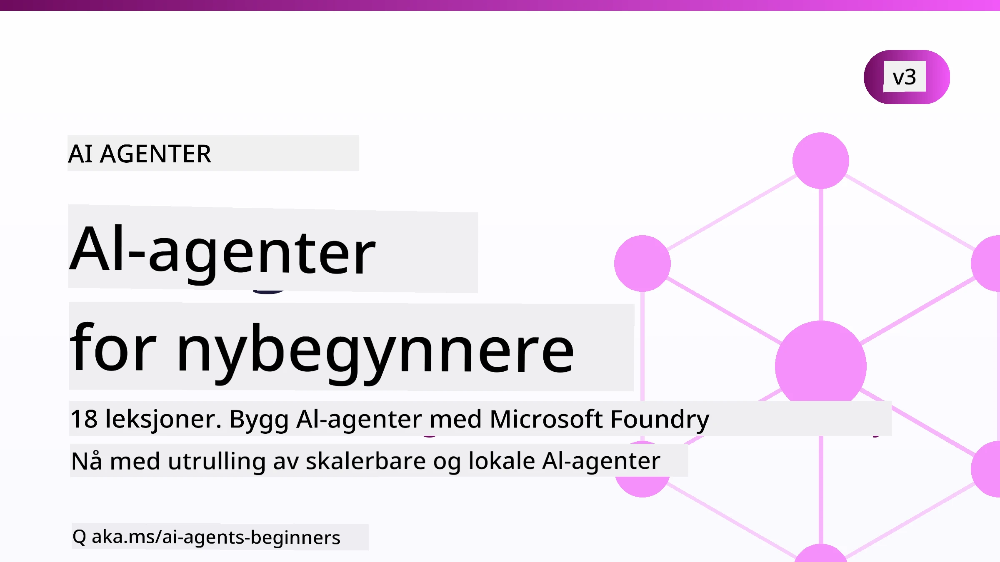

# AI-agenter for nybegynnere - Et kurs



## Et kurs som lærer deg alt du trenger å vite for å begynne å bygge AI-agenter

[](https://github.com/microsoft/ai-agents-for-beginners/blob/master/LICENSE?WT.mc_id=academic-105485-koreyst)
[](https://GitHub.com/microsoft/ai-agents-for-beginners/graphs/contributors/?WT.mc_id=academic-105485-koreyst)
[](https://GitHub.com/microsoft/ai-agents-for-beginners/issues/?WT.mc_id=academic-105485-koreyst)
[](https://GitHub.com/microsoft/ai-agents-for-beginners/pulls/?WT.mc_id=academic-105485-koreyst)
[](http://makeapullrequest.com?WT.mc_id=academic-105485-koreyst)

### 🌐 Flerspråklig støtte

#### Støttes via GitHub Action (Automatisert og alltid oppdatert)

<!-- CO-OP TRANSLATOR LANGUAGES TABLE START -->
[Arabic](../ar/README.md) | [Bengali](../bn/README.md) | [Bulgarian](../bg/README.md) | [Burmese (Myanmar)](../my/README.md) | [Chinese (Simplified)](../zh-CN/README.md) | [Chinese (Traditional, Hong Kong)](../zh-HK/README.md) | [Chinese (Traditional, Macau)](../zh-MO/README.md) | [Chinese (Traditional, Taiwan)](../zh-TW/README.md) | [Croatian](../hr/README.md) | [Czech](../cs/README.md) | [Danish](../da/README.md) | [Dutch](../nl/README.md) | [Estonian](../et/README.md) | [Finnish](../fi/README.md) | [French](../fr/README.md) | [German](../de/README.md) | [Greek](../el/README.md) | [Hebrew](../he/README.md) | [Hindi](../hi/README.md) | [Hungarian](../hu/README.md) | [Indonesian](../id/README.md) | [Italian](../it/README.md) | [Japanese](../ja/README.md) | [Kannada](../kn/README.md) | [Khmer](../km/README.md) | [Korean](../ko/README.md) | [Lithuanian](../lt/README.md) | [Malay](../ms/README.md) | [Malayalam](../ml/README.md) | [Marathi](../mr/README.md) | [Nepali](../ne/README.md) | [Nigerian Pidgin](../pcm/README.md) | [Norwegian](./README.md) | [Persian (Farsi)](../fa/README.md) | [Polish](../pl/README.md) | [Portuguese (Brazil)](../pt-BR/README.md) | [Portuguese (Portugal)](../pt-PT/README.md) | [Punjabi (Gurmukhi)](../pa/README.md) | [Romanian](../ro/README.md) | [Russian](../ru/README.md) | [Serbian (Cyrillic)](../sr/README.md) | [Slovak](../sk/README.md) | [Slovenian](../sl/README.md) | [Spanish](../es/README.md) | [Swahili](../sw/README.md) | [Swedish](../sv/README.md) | [Tagalog (Filipino)](../tl/README.md) | [Tamil](../ta/README.md) | [Telugu](../te/README.md) | [Thai](../th/README.md) | [Turkish](../tr/README.md) | [Ukrainian](../uk/README.md) | [Urdu](../ur/README.md) | [Vietnamese](../vi/README.md)

> **Foretrekker du å klone lokalt?**
>
> Dette depotet inkluderer over 50 språkoversettelser som øker nedlastingsstørrelsen betydelig. For å klone uten oversettelser, bruk sparsommelig utsjekking:
>
> **Bash / macOS / Linux:**
> ```bash
> git clone --filter=blob:none --sparse https://github.com/microsoft/ai-agents-for-beginners.git
> cd ai-agents-for-beginners
> git sparse-checkout set --no-cone '/*' '!translations' '!translated_images'
> ```
>
> **CMD (Windows):**
> ```cmd
> git clone --filter=blob:none --sparse https://github.com/microsoft/ai-agents-for-beginners.git
> cd ai-agents-for-beginners
> git sparse-checkout set --no-cone "/*" "!translations" "!translated_images"
> ```
>
> Dette gir deg alt du trenger for å fullføre kurset med en mye raskere nedlasting.
<!-- CO-OP TRANSLATOR LANGUAGES TABLE END -->

**Hvis du ønsker at flere oversettelsesspråk skal støttes, er de listet [her](https://github.com/Azure/co-op-translator/blob/main/getting_started/supported-languages.md).**

[](https://GitHub.com/microsoft/ai-agents-for-beginners/watchers/?WT.mc_id=academic-105485-koreyst)
[](https://GitHub.com/microsoft/ai-agents-for-beginners/network/?WT.mc_id=academic-105485-koreyst)
[](https://GitHub.com/microsoft/ai-agents-for-beginners/stargazers/?WT.mc_id=academic-105485-koreyst)

[](https://discord.com/invite/ATgtXmAS5D)


## 🌱 Komme i gang

Dette kurset har leksjoner som dekker grunnleggende om å bygge AI-agenter. Hver leksjon dekker sitt eget emne, så start der du vil!

Det er flerspråklig støtte for dette kurset. Gå til våre [tilgjengelige språk her](#-multi-language-support). 

Hvis dette er første gang du bygger med generative AI-modeller, sjekk ut vårt kurs [Generative AI For Beginners](https://aka.ms/genai-beginners), som inkluderer 21 leksjoner om bygging med GenAI.

Ikke glem å [starte (🌟) dette depotet](https://docs.github.com/en/get-started/exploring-projects-on-github/saving-repositories-with-stars?WT.mc_id=academic-105485-koreyst) og [fork dette depotet](https://github.com/microsoft/ai-agents-for-beginners/fork) for å kjøre koden.

### Møt andre elever, få svar på dine spørsmål

Hvis du sitter fast eller har spørsmål om å bygge AI-agenter, bli med i vår dedikerte Discord-kanal i [Microsoft Foundry Discord](https://aka.ms/ai-agents/discord).

### Hva du trenger

Hver leksjon i dette kurset inkluderer kodeeksempler, som finnes i mappen code_samples. Du kan [forke dette depotet](https://github.com/microsoft/ai-agents-for-beginners/fork) for å lage din egen kopi.  

Kodeeksemplene i disse øvelsene bruker Microsoft Agent Framework med Microsoft Foundry Agent Service V2:

- [Microsoft Foundry](https://aka.ms/ai-agents-beginners/ai-foundry) - Azure-konto kreves

Dette kurset bruker følgende AI Agent-rammeverk og tjenester fra Microsoft:

- [Microsoft Agent Framework (MAF)](https://aka.ms/ai-agents-beginners/agent-framework)
- [Microsoft Foundry Agent Service V2](https://aka.ms/ai-agents-beginners/ai-agent-service)

Noen kodeeksempler støtter også alternative OpenAI-kompatible leverandører som [MiniMax](https://platform.minimaxi.com/), som tilbyr modeller med stor kontekst (opptil 204K tokens). Se [Course Setup](./00-course-setup/README.md) for detaljer om konfigurasjon.

For mer informasjon om å kjøre koden for dette kurset, gå til [Course Setup](./00-course-setup/README.md).

## 🙏 Vil du bidra?

Har du forslag eller funnet stavefeil eller kodefeil? [Opprett en sak](https://github.com/microsoft/ai-agents-for-beginners/issues?WT.mc_id=academic-105485-koreyst) eller [Lag en pull request](https://github.com/microsoft/ai-agents-for-beginners/pulls?WT.mc_id=academic-105485-koreyst)


## 📂 Hver leksjon inkluderer

- En skriftlig leksjon i README og en kort video
- Python-kodeeksempler som bruker Microsoft Agent Framework med Microsoft Foundry
- Lenker til ekstra ressurser for å fortsette læringen din


## 🗃️ Leksjoner

| **Leksjon**                                | **Tekst & kode**                                   | **Video**                                                  | **Ekstra læring**                                                                     |
|-------------------------------------------|---------------------------------------------------|------------------------------------------------------------|----------------------------------------------------------------------------------------|
| Introduksjon til AI-agenter og agentbruk  | [Lenke](./01-intro-to-ai-agents/README.md)        | [Video](https://youtu.be/3zgm60bXmQk?si=z8QygFvYQv-9WtO1)  | [Lenke](https://aka.ms/ai-agents-beginners/collection?WT.mc_id=academic-105485-koreyst) |
| Utforske AI Agentiske rammeverk            | [Lenke](./02-explore-agentic-frameworks/README.md) | [Video](https://youtu.be/ODwF-EZo_O8?si=Vawth4hzVaHv-u0H)  | [Lenke](https://aka.ms/ai-agents-beginners/collection?WT.mc_id=academic-105485-koreyst) |
| Forstå AI Agentiske designmønstre          | [Lenke](./03-agentic-design-patterns/README.md)   | [Video](https://youtu.be/m9lM8qqoOEA?si=BIzHwzstTPL8o9GF)  | [Lenke](https://aka.ms/ai-agents-beginners/collection?WT.mc_id=academic-105485-koreyst) |
| Verktøybruk designmønster                   | [Lenke](./04-tool-use/README.md)                   | [Video](https://youtu.be/vieRiPRx-gI?si=2z6O2Xu2cu_Jz46N)  | [Lenke](https://aka.ms/ai-agents-beginners/collection?WT.mc_id=academic-105485-koreyst) |
| Agentisk RAG                               | [Lenke](./05-agentic-rag/README.md)                | [Video](https://youtu.be/WcjAARvdL7I?si=gKPWsQpKiIlDH9A3)  | [Lenke](https://aka.ms/ai-agents-beginners/collection?WT.mc_id=academic-105485-koreyst) |
| Bygge pålitelige AI-agenter                 | [Lenke](./06-building-trustworthy-agents/README.md) | [Video](https://youtu.be/iZKkMEGBCUQ?si=jZjpiMnGFOE9L8OK ) | [Lenke](https://aka.ms/ai-agents-beginners/collection?WT.mc_id=academic-105485-koreyst) |
| Planleggingsdesignmønster                   | [Lenke](./07-planning-design/README.md)            | [Video](https://youtu.be/kPfJ2BrBCMY?si=6SC_iv_E5-mzucnC)  | [Lenke](https://aka.ms/ai-agents-beginners/collection?WT.mc_id=academic-105485-koreyst) |
| Multi-agent designmønster                   | [Lenke](./08-multi-agent/README.md)                 | [Video](https://youtu.be/V6HpE9hZEx0?si=rMgDhEu7wXo2uo6g)  | [Lenke](https://aka.ms/ai-agents-beginners/collection?WT.mc_id=academic-105485-koreyst) |

| Metakognisjon Designmønster                 | [Link](./09-metacognition/README.md)               | [Video](https://youtu.be/His9R6gw6Ec?si=8gck6vvdSNCt6OcF)  | [Link](https://aka.ms/ai-agents-beginners/collection?WT.mc_id=academic-105485-koreyst) |
| AI-agenter i Produksjon                      | [Link](./10-ai-agents-production/README.md)        | [Video](https://youtu.be/l4TP6IyJxmQ?si=31dnhexRo6yLRJDl)  | [Link](https://aka.ms/ai-agents-beginners/collection?WT.mc_id=academic-105485-koreyst) |
| Bruke Agentiske Protokoller (MCP, A2A og NLWeb) | [Link](./11-agentic-protocols/README.md)           | [Video](https://youtu.be/X-Dh9R3Opn8)                                 | [Link](https://aka.ms/ai-agents-beginners/collection?WT.mc_id=academic-105485-koreyst) |
| Kontekst Engineering for AI-agenter            | [Link](./12-context-engineering/README.md)         | [Video](https://youtu.be/F5zqRV7gEag)                                 | [Link](https://aka.ms/ai-agents-beginners/collection?WT.mc_id=academic-105485-koreyst) |
| Håndtering av Agentisk Minne                      | [Link](./13-agent-memory/README.md)     |      [Video](https://youtu.be/QrYbHesIxpw?si=vZkVwKrQ4ieCcIPx)                                                      |                                                                                        |
| Utforsking av Microsoft Agent Framework                         | [Link](./14-microsoft-agent-framework/README.md)                            |                                                            |                                                                                        |
| Bygge Computer Use Agents (CUA)           | [Link](./15-browser-use/README.md)     |                                                            | [Link](https://docs.browser-use.com/examples/templates/playwright-integration)         |
| Distribuere Skalerbare Agenter                    | [Link](./16-deploying-scalable-agents/README.md) |                                                    | [Link](https://learn.microsoft.com/azure/ai-foundry/agents/overview)                   |
| Lage Lokale AI-agenter                     | [Link](./17-creating-local-ai-agents/README.md)  |                                                    | [Link](https://learn.microsoft.com/azure/ai-foundry/foundry-local/)                    |
| Sikring av AI-agenter                           | [Link](./18-securing-ai-agents/README.md)  |                                                            | [Link](https://aka.ms/ai-agents-beginners/collection?WT.mc_id=academic-105485-koreyst) |

## 🎒 Andre Kurs

Teamet vårt produserer flere kurs! Sjekk ut:

<!-- CO-OP TRANSLATOR OTHER COURSES START -->
### LangChain
[](https://aka.ms/langchain4j-for-beginners)
[](https://aka.ms/langchainjs-for-beginners?WT.mc_id=m365-94501-dwahlin)
[](https://github.com/microsoft/langchain-for-beginners?WT.mc_id=m365-94501-dwahlin)
---

### Azure / Edge / MCP / Agenter
[](https://github.com/microsoft/AZD-for-beginners?WT.mc_id=academic-105485-koreyst)
[](https://github.com/microsoft/edgeai-for-beginners?WT.mc_id=academic-105485-koreyst)
[](https://github.com/microsoft/mcp-for-beginners?WT.mc_id=academic-105485-koreyst)
[](https://github.com/microsoft/ai-agents-for-beginners?WT.mc_id=academic-105485-koreyst)

---
 
### Generativ AI-serie
[](https://github.com/microsoft/generative-ai-for-beginners?WT.mc_id=academic-105485-koreyst)
[-9333EA?style=for-the-badge&labelColor=E5E7EB&color=9333EA)](https://github.com/microsoft/Generative-AI-for-beginners-dotnet?WT.mc_id=academic-105485-koreyst)
[-C084FC?style=for-the-badge&labelColor=E5E7EB&color=C084FC)](https://github.com/microsoft/generative-ai-for-beginners-java?WT.mc_id=academic-105485-koreyst)
[-E879F9?style=for-the-badge&labelColor=E5E7EB&color=E879F9)](https://github.com/microsoft/generative-ai-with-javascript?WT.mc_id=academic-105485-koreyst)

---
 
### Kjerne Læring
[](https://aka.ms/ml-beginners?WT.mc_id=academic-105485-koreyst)
[](https://aka.ms/datascience-beginners?WT.mc_id=academic-105485-koreyst)
[](https://aka.ms/ai-beginners?WT.mc_id=academic-105485-koreyst)
[](https://github.com/microsoft/Security-101?WT.mc_id=academic-96948-sayoung)
[](https://aka.ms/webdev-beginners?WT.mc_id=academic-105485-koreyst)
[](https://aka.ms/iot-beginners?WT.mc_id=academic-105485-koreyst)
[](https://github.com/microsoft/xr-development-for-beginners?WT.mc_id=academic-105485-koreyst)

---
 
### Copilot-serie
[](https://aka.ms/GitHubCopilotAI?WT.mc_id=academic-105485-koreyst)
[](https://github.com/microsoft/mastering-github-copilot-for-dotnet-csharp-developers?WT.mc_id=academic-105485-koreyst)
[](https://github.com/microsoft/CopilotAdventures?WT.mc_id=academic-105485-koreyst)
<!-- CO-OP TRANSLATOR OTHER COURSES END -->

## 🌟 Takk til fellesskapet

Takk til [Shivam Goyal](https://www.linkedin.com/in/shivam2003/) for å bidra med viktige kodeeksempler som demonstrerer Agentisk RAG.

## Bidra

Dette prosjektet ønsker bidrag og forslag velkommen. De fleste bidrag krever at du godtar en
Bidragsyterlisensavtale (CLA) som erklærer at du har rett til, og faktisk gjør, å gi oss
rettighetene til å bruke ditt bidrag. For detaljer, besøk <https://cla.opensource.microsoft.com>.

Når du sender inn en pull request, vil en CLA-bot automatisk avgjøre om du må levere
en CLA og merke PR-en passende (f.eks., statuskontroll, kommentar). Følg bare instruksjonene
fra boten. Du trenger bare å gjøre dette én gang på tvers av alle repoer som bruker vår CLA.

Dette prosjektet har adoptert [Microsofts Åpne Kodeks for Oppførsel](https://opensource.microsoft.com/codeofconduct/).
For mer informasjon, se [FAQ for Oppførselskoden](https://opensource.microsoft.com/codeofconduct/faq/) eller
kontakt [opencode@microsoft.com](mailto:opencode@microsoft.com) med eventuelle spørsmål eller kommentarer.

## Varemerker

Dette prosjektet kan inneholde varemerker eller logoer for prosjekter, produkter eller tjenester. Autorisert bruk av Microsoft
varemerker eller logoer er underlagt og må følge
[Microsofts retningslinjer for varemerker og merkevarebruk](https://www.microsoft.com/legal/intellectualproperty/trademarks/usage/general).
Bruk av Microsoft-varemerker eller -logoer i modifiserte versjoner av dette prosjektet må ikke forårsake forvirring eller antyde Microsofts sponsing.
All bruk av tredjeparts varemerker eller logoer er underlagt tredjepartenes egne retningslinjer.

## Få hjelp


Hvis du står fast eller har spørsmål om bygging av AI-apper, bli med:

[](https://aka.ms/foundry/discord)

Hvis du har tilbakemeldinger på produktet eller feil under bygging, besøk:

[](https://aka.ms/foundry/forum)

---

<!-- CO-OP TRANSLATOR DISCLAIMER START -->
**Ansvarsfraskrivelse**:
Dette dokumentet er oversatt ved hjelp av AI-oversettelsestjenesten [Co-op Translator](https://github.com/Azure/co-op-translator). Selv om vi streber etter nøyaktighet, vær oppmerksom på at automatiske oversettelser kan inneholde feil eller unøyaktigheter. Det opprinnelige dokumentet på originalspråket skal betraktes som den autoritative kilden. For kritisk informasjon anbefales profesjonell menneskelig oversettelse. Vi er ikke ansvarlige for eventuelle misforståelser eller feiltolkninger som oppstår ved bruk av denne oversettelsen.
<!-- CO-OP TRANSLATOR DISCLAIMER END -->