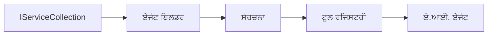

# 🎨 ਏਜੰਟਿਕ ਡਿਜ਼ਾਇਨ ਪੈਟਰੰਸਜ਼ ਵਿੰਥ ਐਜ਼ਰ ਓਪਨਏਆਈ (ਰਿਸਪਾਂਸਜ਼ ਏਪੀਆਈ) (.NET)

## 📋 ਸਿੱਖਣ ਦੇ ਲਕੜੀ

ਇਹ ਉਦਾਹਰਣ ਮਾਈਕ੍ਰੋਸਾਫਟ ਏਜੰਟ ਫਰੇਮਵਰਕ ਵਿੱਚ .NET ਨਾਲ ਐਜ਼ਰ ਓਪਨਏਆਈ (ਰਿਸਪਾਂਸਜ਼ ਏਪੀਆਈ) ਇੰਟੀਗ੍ਰੇਸ਼ਨ ਵਰਤ ਕੇ ਇੰਟੈਲੀਜੈਂਟ ਏਜੰਟ ਬਣਾਉਣ ਲਈ ਇੰਟਰਪ੍ਰਾਈਜ਼-ਗਰੇਡ ਡਿਜ਼ਾਇਨ ਪੈਟਰੰਸਜ਼ ਦਰਸਾਉਂਦੀ ਹੈ। ਤੁਸੀਂ ਪੇਸ਼ੇਵਰ ਪੈਟਰੰਸ ਅਤੇ ਆਰਕੀਟੈਕਚਰਲ ਤਰੀਕੇ ਸਿੱਖੋਗੇ ਜੋ ਏਜੰਟਾਂ ਨੂੰ ਪ੍ਰੋਡਕਸ਼ਨ-ਲਾਇਕ, ਸਾਂਭਯੋਗ ਅਤੇ ਵਿਸਤਰਿਤ ਬਣਾਉਂਦੇ ਹਨ।

### ਇੰਟਰਪ੍ਰਾਈਜ਼ ਡਿਜ਼ਾਇਨ ਪੈਟਰੰਸਜ਼

- 🏭 **ਫੈਕਟਰੀ ਪੈਟਰੰਨ**: ਡਿਪੇਂਡੈਂਸੀ ਇੰਜੈਕਸ਼ਨ ਨਾਲ ਸਟੈਂਡਰਡਾਈਜ਼ਡ ਏਜੰਟ ਬਣਾਉਣਾ
- 🔧 **ਬਿਲਡਰ ਪੈਟਰੰਨ**: ਫਲੂਐਂਟ ਏਜੰਟ ਸੰਰਚਨਾ ਅਤੇ ਸੈਟਅੱਪ
- 🧵 **ਥ੍ਰੈਡ-ਸੇਫ ਪੈਟਰੰਸਜ਼**: ਸਾਂਝੀ ਗੱਲਬਾਤ ਦਾ ਪ੍ਰਬੰਧਨ
- 📋 **ਰੈਪੋਜ਼ਿਟਰੀ ਪੈਟਰੰਨ**: ਸੱਜੋਈ ਟੂਲ ਅਤੇ ਸਮਰੱਥਾ ਪ੍ਰਬੰਧਨ

## 🎯 .NET-ਖਾਸ ਆਰਕੀਟੈਕਚਰਲ ਫਾਇਦੇ

### ਇੰਟਰਪ੍ਰਾਈਜ਼ ਵਿਸ਼ੇਸ਼ਤਾਵਾਂ

- **ਮਜ਼ਬੂਤ ਟਾਈਪਿੰਗ**: ਕੰਪਾਈਲ-ਟਾਈਮ ਵੈਰੀਫਿਕੇਸ਼ਨ ਅਤੇ ਇੰਟੈਲੀਸੈਂਸ ਸਹਿਯੋਗ
- **ਡਿਪੇਂਡੈਂਸੀ ਇੰਜੈਕਸ਼ਨ**: ਬਿਲਟ-ਈਨ DI ਕੰਟੇਨਰ ਇੰਟੀਗ੍ਰੇਸ਼ਨ
- **ਸੰਰਚਨਾ ਪ੍ਰਬੰਧਨ**: IConfiguration ਅਤੇ Options ਪੈਟਰੰਸਜ਼
- **ਅਸਿੰਕ/ਅਵੇਟ**: ਪਹਿਲ-ਸ਼੍ਰੇਣੀ ਐਸਿੰਕ੍ਰੋਨਸ ਪ੍ਰੋਗ੍ਰਾਮਿੰਗ ਸਹਿਯੋਗ

### ਪ੍ਰੋਡਕਸ਼ਨ-ਰੇਡੀ ਪੈਟਰੰਸਜ਼

- **ਲਾਗਿੰਗ ਇੰਟੀਗ੍ਰੇਸ਼ਨ**: ILogger ਅਤੇ ਸਟ੍ਰੱਕਚਰਡ ਲਾਗਿੰਗ ਸਹਿਯੋਗ
- **ਹੈਲਥ ਚੈਕਸ**: ਬਿਲਟ-ਈਨ ਮਾਨੀਟਰਿੰਗ ਅਤੇ ਨਿਰਾਕਰਣ
- **ਸੰਰਚਨਾ ਤਸਦੀਕ**: ਡੇਟਾ ਐਨੋਟੇਸ਼ਨ ਸਮੇਤ ਮਜ਼ਬੂਤ ਟਾਈਪਿੰਗ
- **ਗਲਤੀ ਸੰਭਾਲਣ**: ਸਟ੍ਰੱਕਚਰਡ ਐਕਸਪਸ਼ਨ ਪ੍ਰਬੰਧਨ

## 🔧 ਤਕਨੀਕੀ ਆਰਕੀਟੈਕਚਰ

### ਮੁੱਖ .NET ਕੰਪੋਨੈਂਟ

- **Microsoft.Extensions.AI**: ਏਕਠੇ AI ਸੇਵਾ ਅਬਸਟ੍ਰੈਕਸ਼ਨ
- **Microsoft.Agents.AI**: ਇੰਟਰਪ੍ਰਾਈਜ਼ ਏਜੰਟ ਆਰਕੀਟੈਕਚਰ ਫਰੇਮਵਰਕ
- **ਐਜ਼ਰ ਓਪਨਏਆਈ (ਰਿਸਪਾਂਸਜ਼ ਏਪੀਆਈ)**: ਉੱਚ-ਦਰਜਾ API ਕਲਾਇੰਟ ਪੈٽرੰਸਜ਼
- **ਸੰਰਚਨਾ ਪ੍ਰਣਾਲੀ**: appsettings.json ਅਤੇ ਵਾਤਾਵਰਨ ਇੰਟੀਗ੍ਰੇਸ਼ਨ

### ਡਿਜ਼ਾਇਨ ਪੈਟਰੰਨ ਲਾਗੂ ਕਰਨਾ



## 🏗️ ਇੰਟਰਪ੍ਰਾਈਜ਼ ਪੈਟਰੰਸਜ਼ ਦਰਸਾਏ ਗਏ

### 1. **ਸਿਰਜਣਹਾਰ ਪੈਟਰੰਸਜ਼**

- **ਏਜੰਟ ਫੈਕਟਰੀ**: ਕੇਂਦਰਿਤ ਏਜੰਟ ਬਣਾਉਣਾ ਸਤਤ ਸੰਰਚਨਾ ਨਾਲ
- **ਬਿਲਡਰ ਪੈਟਰੰਨ**: ਜਟਿਲ ਏਜੰਟ ਸੰਰਚਨਾ ਲਈ ਫਲੂਐਂਟ API
- **ਸਿੰਗਲਟਨ ਪੈਟਰੰਨ**: ਸਾਂਝੇ ਸਰੋਤ ਅਤੇ ਸੰਰਚਨਾ ਪ੍ਰਬੰਧਨ
- **ਡਿਪੇਂਡੈਂਸੀ ਇੰਜੈਕਸ਼ਨ**: ਢੀਲਾ ਜੋੜ ਅਤੇ ਟੈਸਟ ਕਰਨ ਯੋਗਤਾ

### 2. **ਵਰਤਾਰੂ ਪੈਟਰੰਸਜ਼**

- **ਸਟ੍ਰੈਟਜੀ ਪੈਟਰੰਨ**: ਬਦਲਣਯੋਗ ਟੂਲ ਕਾਰਜ ਵਿਧੀਆਂ
- **ਕਮਾਂਡ ਪੈਟਰੰਨ**: ਰੱਦ/ਪੁਨਰਾਵਰਤਨ ਨਾਲ ਏਜੰਟ ਕਾਰਜ ਸੰਕੁਚਿਤ
- **ਅਬਜ਼ਰਵਰ ਪੈਟਰੰਨ**: ਘਟਨਾ-ਚਲਾਉਂਦਾ ਏਜੰਟ ਜੀਵਨਚਕ੍ਰ ਪ੍ਰਬੰਧਨ
- **ਟੈਮਪਲੇਟ ਮੈਥਡ**: ਮਿਆਰੀਕ੍ਰਿਤ ਏਜੰਟ ਕਾਰਜ ਸੰਚਾਲਨ

### 3. **ਸੰਰਚਨਾਤਮਕ ਪੈਟਰੰਸਜ਼**

- **ਐਡਾਪਟਰ ਪੈਟਰੰਨ**: ਐਜ਼ਰ ਓਪਨਏਆਈ (ਰਿਸਪਾਂਸਜ਼ ਏਪੀਆਈ) ਇੰਟੀਗ੍ਰੇਸ਼ਨ ਲੇਅਰ
- **ਡੈਕੋਰੇਟਰ ਪੈਟਰੰਨ**: ਏਜੰਟ ਸਮਰੱਥਾ ਸੁਧਾਰ
- **ਫੇਸਾਡ ਪੈਟਰੰਨ**: ਸਧਾਰਨ ਕੀਤੇ ਏਜੰਟ ਇੰਟਰਐਕਸ਼ਨ ਇੰਟਰਫੇਸ
- **ਪ੍ਰਾਕਸੀ ਪੈਟਰੰਨ**: ਕਾਰਗੁਜ਼ਾਰੀ ਲਈ ਲੇਜ਼ੀ ਲੋਡਿੰਗ ਅਤੇ ਕੈਸ਼ਿੰਗ

## 📚 .NET ਡਿਜ਼ਾਇਨ ਸਿਧਾਂਤ

### SOLID ਸਿਧਾਂਤ

- **ਸਿੰਗਲ ਜ਼ਿੰਮੇਵਾਰੀ**: ਹਰ ਇਕ ਕੰਪੋਨੈਂਟ ਦਾ ਇੱਕ ਸਾਫ ਮਕਸਦ
- **ਖੁੱਲ੍ਹਾ/ਬੰਦ**: ਬਿਨਾਂ ਸੁਧਾਰ ਦੇ ਵਧਾਉਣ ਯੋਗ
- **ਲਿਸਕੋਵ ਬਦਲੀ**: ਇੰਟਰਫੇਸ-ਆਧਾਰਿਤ ਟੂਲ ਇਮਪਲੀਮੈਂਟੇਸ਼ਨ
- **ਇੰਟਰਫੇਸ ਵਿਭਾਗੀਕਰਨ**: ਕੇਂਦ੍ਰਿਤ, ਸਮਰੱਥ ਇੰਟਰਫੇਸ
- **ਡਿਪੇਂਡੈਂਸੀ ਇਨਵਰਜ਼ਨ**: ਅਬਸਟ੍ਰੈਕਸ਼ਨਾਂ 'ਤੇ ਨਿਰਭਰ, ਨਾਂ ਕਿ ਵਿਸ਼ੇਸ਼ਤਾ ਤੇ

### ਸਾਫ਼ ਆਰਕੀਟੈਕਚਰ

- **ਡੋਮੇਨ ਲੇਅਰ**: ਮੁੱਖ ਏਜੰਟ ਅਤੇ ਟੂਲ ਅਬਸਟ੍ਰੈਕਸ਼ਨ
- **ਐਪਲੀਕੇਸ਼ਨ ਲੇਅਰ**: ਏਜੰਟ ਆਰਕੀਟੈਕਚਰ ਅਤੇ ਵੱਕਫਲੋਸ
- **ਇੰਫ੍ਰਾਸਟ੍ਰਕਚਰ ਲੇਅਰ**: ਐਜ਼ਰ ਓਪਨਏਆਈ (ਰਿਸਪਾਂਸਜ਼ ਏਪੀਆਈ) ਇੰਟੀਗ੍ਰੇਸ਼ਨ ਅਤੇ ਬਾਹਰੀ ਸੇਵਾਵਾਂ
- **ਪ੍ਰੇਜ਼ੇਂਟੇਸ਼ਨ ਲੇਅਰ**: ਉਪਭੋਗੀ ਇੰਟਰਐਕਸ਼ਨ ਅਤੇ ਜਵਾਬ ਫਾਰਮੇਟਿੰਗ

## 🔒 ਇੰਟਰਪ੍ਰਾਈਜ਼ ਵਿਚਾਰ

### ਸੁਰੱਖਿਆ

- **ਕ੍ਰੇਡੈਂਸ਼ੀਅਲ ਪ੍ਰਬੰਧਨ**: IConfiguration ਨਾਲ ਸੁਰੱਖਿਅਤ API ਕੁੰਜੀ ਹੇਠਾਂਮੋਹਰੀ
- **ਇਨਪੁੱਟ ਵੈਰੀਫਿਕੇਸ਼ਨ**: ਮਜ਼ਬੂਤ ਟਾਈਪਿੰਗ ਅਤੇ ਡੇਟਾ ਐਨੋਟੇਸ਼ਨ ਤਸਦੀਕ
- **ਆਉਟਪੁੱਟ ਸੈਨੇਟਾਈਜ਼ੇਸ਼ਨ**: ਸੁਰੱਖਿਅਤ ਜਵਾਬ ਪ੍ਰੋਸੈਸਿੰਗ ਅਤੇ ਫਿਲਟਰਿੰਗ
- **ਆਡੀਟ ਲਾਗਿੰਗ**: ਵਿਸਤ੍ਰਿਤ ਕਾਰਜ ਟਰੈਕਿੰਗ

### ਕਾਰਗੁਜ਼ਾਰੀ

- **ਐਸਿੰਕ ਪੈਟਰੰਸਜ਼**: ਗੈਰ-ਬਲਾਕਿੰਗ I/O ਕਾਰਜ
- **ਕਨੈਕਸ਼ਨ ਪੂਲਿੰਗ**: ਪ੍ਰਭਾਵਸ਼ালী HTTP ਕਲਾਇੰਟ ਪ੍ਰਬੰਧਨ
- **ਕੈਸ਼ਿੰਗ**: ਬਿਹਤਰ ਕਾਰਗੁਜ਼ਾਰੀ ਲਈ ਜਵਾਬ ਕੈਸ਼ਿੰਗ
- **ਸਰੋਤ ਪ੍ਰਬੰਧਨ**: ਢੰਗ ਨਾਲ ਡਿਸਪੋਜ਼ਲ ਅਤੇ ਸਾਫ਼-ਸੁਥਰਾ ਪੈਟਰੰਸ

### ਵਿਸਤਾਰਯੋਗਤਾ

- **ਥ੍ਰੈਡ ਸੇਫਟੀ**: ਸਾਂਝੇ ਏਜੰਟ ਕਾਰਜ ਸਹਿਯੋਗ
- **ਸਰੋਤ ਪੂਲਿੰਗ**: ਪ੍ਰਭਾਵਸ਼ਾਲੀ ਸਰੋਤ ਵਰਤੋ
- **ਲੋਡ ਪ੍ਰਬੰਧਨ**: ਦਰ ਸੀਮਾ ਅਤੇ ਬੈਕਪ੍ਰੈਸ਼ਰ ਸੰਭਾਲ
- **ਮਾਨੀਟਰਿੰਗ**: ਕਾਰਗੁਜ਼ਾਰੀ ਮੈਟ੍ਰਿਕਸ ਅਤੇ ਸਿਹਤ ਚੈਕਸ

## 🚀 ਪ੍ਰੋਡਕਸ਼ਨ ਡਿਪਲੋਇਮੈਂਟ

- **ਸੰਰਚਨਾ ਪ੍ਰਬੰਧਨ**: ਵਾਤਾਵਰਣ ਖਾਸ ਸੈਟਿੰਗਜ਼
- **ਲਾਗਿੰਗ ਰਣਨੀਤੀ**: ਸਮਰਚਿਤ ਲਾਗਿੰਗ ਨਾਲ ਕੋਰਿਲੇਸ਼ਨ IDs
- **ਗਲਤੀ ਸੰਭਾਲਣ**: ਵਿਸ਼ਵ ਪੱਧਰੀ ਐਕਸਪਸ਼ਨ ਸੰਭਾਲਣ ਅਤੇ ਢੰਗ ਨਾਲ ਬਹਾਲੀ
- **ਮਾਨੀਟਰਿੰਗ**: ਐਪਲੀਕੇਸ਼ਨ ਇਨਸਾਈਟਸ ਅਤੇ ਕਾਰਗੁਜ਼ਾਰੀ ਕاؤنਟਰ
- **ਟੈਸਟਿੰਗ**: ਯੂਨਿਟ ਟੈਸਟ, ਇੰਟੀਗ੍ਰੇਸ਼ਨ ਟੈਸਟ ਅਤੇ ਲੋਡ ਟੈਸਟਿੰਗ ਪੈਟਰੰਸਜ਼

.NET ਨਾਲ ਇੰਟਰਪ੍ਰਾਈਜ਼-ਗਰੇਡ ਇੰਟੈਲੀਜੈਂਟ ਏਜੰਟ ਬਨਾਉਣ ਲਈ ਤਿਆਰ? ਚੱਲੋ ਕੁਝ ਮਜ਼ਬੂਤ ਆਰਕੀਟੈਕਟ ਕਰੀਏ! 🏢✨

## 🚀 ਸ਼ੁਰੂਆਤੀ

### ਲੋੜੀਂਦੇ

- [.NET 10 SDK](https://dotnet.microsoft.com/download/dotnet/10.0) ਜਾਂ ਇਸ ਤੋਂ ਵੱਧ
- ਇੱਕ [ਐਜ਼ਰ ਸਬਸਕ੍ਰਿਪਸ਼ਨ](https://azure.microsoft.com/free/) ਜਿਸ ਵਿੱਚ ਐਜ਼ਰ ਓਪਨਏਆਈ ਸਰੋਤ ਅਤੇ ਮਾਡਲ ਡਿਪਲੋਅਮੈਂਟ ਹੋਵੇ
- [ਐਜ਼ਰ CLI](https://learn.microsoft.com/cli/azure/install-azure-cli) — `az login` ਨਾਲ ਸਾਇਨ ਇਨ ਕਰੋ

### ਲੋੜੀਂਦੇ ਵਾਤਾਵਰਣ ਵੈਰੀਏਬਲਜ਼

```bash
# zsh/bash
export AZURE_OPENAI_ENDPOINT=https://<your-resource>.openai.azure.com
export AZURE_OPENAI_DEPLOYMENT=gpt-4.1-mini
# ਫਿਰ ਸਾਈਨ ਇਨ ਕਰੋ ਤਾਂ ਜੋ AzureCliCredential ਟੋਕਨ ਪ੍ਰਾਪਤ ਕਰ ਸਕੇ
az login
```

```powershell
# ਪਾਵਰਸ਼ੈਲ
$env:AZURE_OPENAI_ENDPOINT = "https://<your-resource>.openai.azure.com"
$env:AZURE_OPENAI_DEPLOYMENT = "gpt-4.1-mini"
# ਫਿਰ ਸਾਈਨ ਇਨ ਕਰੋ ਤਾਂ ਜੋ AzureCliCredential ਇੱਕ ਟੋਕਨ ਪ੍ਰਾਪਤ ਕਰ ਸਕੇ
az login
```

### ਨਮੂਨਾ ਕੋਡ

ਕੋਡ ਉਦਾਹਰਣ ਚਲਾਉਣ ਲਈ,

```bash
# ਜੇਐਸਐਚ/ਬੈਸ਼
chmod +x ./03-dotnet-agent-framework.cs
./03-dotnet-agent-framework.cs
```

ਜਾਂ dotnet CLI ਵਰਤ ਕੇ:

```bash
dotnet run ./03-dotnet-agent-framework.cs
```

ਪੂਰਾ ਕੋਡ ਦੇਖਣ ਲਈ [`03-dotnet-agent-framework.cs`](../../../../03-agentic-design-patterns/code_samples/03-dotnet-agent-framework.cs) ਵੇਖੋ।

```csharp
#!/usr/bin/dotnet run

#:package Microsoft.Extensions.AI@10.*
#:package Microsoft.Agents.AI.OpenAI@1.*-*
#:package Azure.AI.OpenAI@2.1.0
#:package Azure.Identity@1.13.1

using System.ComponentModel;

using Microsoft.Agents.AI;
using Microsoft.Extensions.AI;

using Azure.AI.OpenAI;
using Azure.Identity;

// Tool Function: Random Destination Generator
// This static method will be available to the agent as a callable tool
// The [Description] attribute helps the AI understand when to use this function
// This demonstrates how to create custom tools for AI agents
[Description("Provides a random vacation destination.")]
static string GetRandomDestination()
{
    // List of popular vacation destinations around the world
    // The agent will randomly select from these options
    var destinations = new List<string>
    {
        "Paris, France",
        "Tokyo, Japan",
        "New York City, USA",
        "Sydney, Australia",
        "Rome, Italy",
        "Barcelona, Spain",
        "Cape Town, South Africa",
        "Rio de Janeiro, Brazil",
        "Bangkok, Thailand",
        "Vancouver, Canada"
    };

    // Generate random index and return selected destination
    // Uses System.Random for simple random selection
    var random = new Random();
    int index = random.Next(destinations.Count);
    return destinations[index];
}

// Azure OpenAI with the Responses API (stable v1 endpoint). Sign in with `az login`.
var azureEndpoint = Environment.GetEnvironmentVariable("AZURE_OPENAI_ENDPOINT")
    ?? throw new InvalidOperationException("AZURE_OPENAI_ENDPOINT is not set.");
var deployment = Environment.GetEnvironmentVariable("AZURE_OPENAI_DEPLOYMENT") ?? "gpt-4.1-mini";

var azureClient = new AzureOpenAIClient(new Uri(azureEndpoint), new AzureCliCredential());

// Define Agent Identity and Comprehensive Instructions
// Agent name for identification and logging purposes
var AGENT_NAME = "TravelAgent";

// Detailed instructions that define the agent's personality, capabilities, and behavior
// This system prompt shapes how the agent responds and interacts with users
var AGENT_INSTRUCTIONS = """
You are a helpful AI Agent that can help plan vacations for customers.

Important: When users specify a destination, always plan for that location. Only suggest random destinations when the user hasn't specified a preference.

When the conversation begins, introduce yourself with this message:
"Hello! I'm your TravelAgent assistant. I can help plan vacations and suggest interesting destinations for you. Here are some things you can ask me:
1. Plan a day trip to a specific location
2. Suggest a random vacation destination
3. Find destinations with specific features (beaches, mountains, historical sites, etc.)
4. Plan an alternative trip if you don't like my first suggestion

What kind of trip would you like me to help you plan today?"

Always prioritize user preferences. If they mention a specific destination like "Bali" or "Paris," focus your planning on that location rather than suggesting alternatives.
""";

// Create AI Agent with Advanced Travel Planning Capabilities
// Get the Responses client for the deployment and create the AI agent
// Configure agent with name, detailed instructions, and available tools
// This demonstrates the .NET agent creation pattern with full configuration
AIAgent agent = azureClient
    .GetChatClient(deployment)
    .AsAIAgent(
        name: AGENT_NAME,
        instructions: AGENT_INSTRUCTIONS,
        tools: [AIFunctionFactory.Create(GetRandomDestination)]
    );

// Create New Conversation Session for Context Management
// Initialize a new conversation session to maintain context across multiple interactions
// Sessions enable the agent to remember previous exchanges and maintain conversational state
// This is essential for multi-turn conversations and contextual understanding
var session = await agent.CreateSessionAsync();

// Execute Agent: First Travel Planning Request
// Run the agent with an initial request that will likely trigger the random destination tool
// The agent will analyze the request, use the GetRandomDestination tool, and create an itinerary
// Using the session parameter maintains conversation context for subsequent interactions
await foreach (var update in agent.RunStreamingAsync("Plan me a day trip", session))
{
    await Task.Delay(10);
    Console.Write(update);
}

Console.WriteLine();

// Execute Agent: Follow-up Request with Context Awareness
// Demonstrate contextual conversation by referencing the previous response
// The agent remembers the previous destination suggestion and will provide an alternative
// This showcases the power of conversation sessions and contextual understanding in .NET agents
await foreach (var update in agent.RunStreamingAsync("I don't like that destination. Plan me another vacation.", session))
{
    await Task.Delay(10);
    Console.Write(update);
}
```

---

<!-- CO-OP TRANSLATOR DISCLAIMER START -->
**ਅਸਵੀਕਾਰੋਪਣ**:
ਇਸ ਦਸਤਾਵੇਜ਼ ਦਾ ਅਨੁਵਾਦ ਏਆਈ ਅਨੁਵਾਦ ਸੇਵਾ [Co-op Translator](https://github.com/Azure/co-op-translator) ਦੀ ਵਰਤੋਂ ਕਰਕੇ ਕੀਤਾ ਗਿਆ ਹੈ। ਜਦੋਂ ਕਿ ਅਸੀਂ ਸਹੀਤਾਵਾਂ ਲਈ ਯਤਨਸ਼ੀਲ ਹਾਂ, ਕਿਰਪਾ ਕਰਕੇ ਧਿਆਨ ਰੱਖੋ ਕਿ ਸਵੈਚਾਲਿਤ ਅਨੁਵਾਦਾਂ ਵਿੱਚ ਗਲਤੀਆਂ ਜਾਂ ਅਸਮੱਤਿਆਵਾਂ ਹੋ ਸਕਦੀਆਂ ਹਨ। ਮੂਲ ਦਸਤਾਵੇਜ਼ ਆਪਣੀ ਮੂਲ ਭਾਸ਼ਾ ਵਿੱਚ ਅਧਿਕਾਰਕ ਸਰੋਤ ਮੰਨਿਆ ਜਾਣਾ ਚਾਹੀਦਾ ਹੈ। ਜਰੂਰੀ ਜਾਣਕਾਰੀ ਲਈ, ਪੇਸ਼ੇਵਰ ਮਨੁੱਖੀ ਅਨੁਵਾਦ ਦੀ ਸਿਫ਼ਾਰਸ਼ ਕੀਤੀ ਜਾਂਦੀ ਹੈ। ਅਸੀਂ ਇਸ ਅਨੁਵਾਦ ਦੇ ਉਪਯੋਗ ਤੋਂ ਪੈਦਾ ਹੋਣ ਵਾਲੀਆਂ ਕਿਸੇ ਵੀ ਗਲਤਫਹਿਮੀਆਂ ਜਾਂ ਗਲਤ ਵਿਆਖਿਆਵਾਂ ਲਈ ਜਵਾਬਦੇਹ ਨਹੀਂ ਹਾਂ।
<!-- CO-OP TRANSLATOR DISCLAIMER END -->