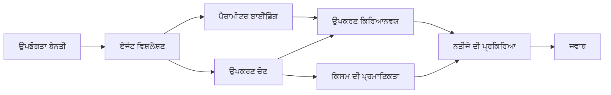

# 🛠️ ਐਜ਼ਯੂਰ ਓਪਨਏਆਈ (Responses API) (.NET) ਨਾਲ ਉੱਨਤ ਸੰਦ ਉਪਯੋਗ

## 📋 ਸਿੱਖਣ ਦੇ ਉਦੇਸ਼

ਇਸ ਨੋਟਬੁੱਕ ਵਿਚ ਜ਼ਬਰਦਸਤ ਕੰਪਨੀ-ਸਤਰ ਦੇ ਸੰਦ ਏਕਤਾ ਰੂਪਾਂ ਦਾ ਡਾਟਾ, ਮਾਇਕ੍ਰੋਸਾਫਟ ਏਜੰਟ ਫਰੇਮਵਰਕ .NET ਵਿੱਚ ਤੇ Azure OpenAI (Responses API) ਨਾਲ ਦਿਖਾਇਆ ਗਿਆ ਹੈ। ਤੁਸੀਂ C# ਦੀ ਮਜ਼ਬੂਤ ਟਾਈਪਿੰਗ ਅਤੇ .NET ਦੀਆਂ ਐਂਟਰਪ੍ਰਾਈਜ਼ ਖੂਬੀਆਂ ਦੀ ਵਰਤੋਂ ਕਰਕੇ ਕਈ ਵੱਖ-ਵੱਖ ਵਿਸ਼ੇਸ਼ਤ ਸੰਦਾਂ ਦੇ ਨਾਲ ਸੁਖ਼ੇਤਦਾਰ ਏਜੰਟ ਬਣਾਉਣਾ ਸਿੱਖੋਗੇ।

### ਉੱਨਤ ਸੰਦ ਖੂਬੀਆਂ ਜੋ ਤੁਸੀਂ ਮਾਸਟਰ ਕਰੋਗੇ

- 🔧 **ਬਹੁ-ਸੰਦ ਆਰਕੀਟੈਕਚਰ**: ਕਈ ਵਿਸ਼ੇਸ਼ਤ ਖੂਬੀਆਂ ਵਾਲੇ ਏਜੰਟ ਬਣਾਉਣਾ
- 🎯 **ਟਾਈਪ-ਸੇਫ ਸੰਦ ਚਲਾਉਣਾ**: C# ਦੀ ਕੰਪਾਈਲ-ਟਾਈਮ ਵੈਰੀਫਿਕੇਸ਼ਨ ਦੀ ਵਰਤੋਂ
- 📊 **ਐਂਟਰਪ੍ਰਾਈਜ਼ ਸੰਦ ਪੈਟਰਨ**: ਉਤਪਾਦਨ-ਤਿਆਰ ਸੰਦ ਡਿਜ਼ਾਈਨ ਅਤੇ ਗਲਤੀ ਸੰਭਾਲ
- 🔗 **ਸੰਦ ਸੰਯੋਜਨ**: ਮਸ਼ਕਲ ਕਾਰੋਬਾਰੀ ਕਾਰਜਵਾਹੀਆਂ ਲਈ ਸੰਦਾਂ ਨੂੰ ਜੋੜਨਾ

## 🎯 .NET ਸੰਦ ਆਰਕੀਟੈਕਚਰ ਦੇ ਫਾਇਦੇ

### ਐਂਟਰਪ੍ਰਾਈਜ਼ ਸੰਦ ਵਿਸ਼ੇਸ਼ਤਾਵਾਂ

- **ਕੰਪਾਈਲ-ਟਾਈਮ ਵੈਰੀਫਿਕੇਸ਼ਨ**: ਸੰਦ ਪੈਰਾਮੀਟਰਾਂ ਦੀ ਸਹੀਤਾ ਲਈ ਮਜ਼ਬੂਤ ਟਾਈਪਿੰਗ
- **ਡਿਪੈੰਡੈਂਸੀ ਇੰਜੈਕਸ਼ਨ**: ਸੰਦ ਪ੍ਰਬੰਧਨ ਲਈ IoC ਕੰਟੇਨਰ ਇੰਟੀਗ੍ਰੇਸ਼ਨ
- **Async/Await ਪੈਟਰਨ**: ਉਚਿਤ ਸਰੋਤ ਪ੍ਰਬੰਧਨ ਨਾਲ ਗੈਰ-ਰੁਕਾਵਟ ਸੰਦ ਚਲਾਉਣਾ
- **ਸਟ੍ਰਕਚਰਡ ਲੌਗਿੰਗ**: ਸੰਦ ਚਲਾਉਣ ਦੀ ਨਿਗਰਾਨੀ ਲਈ ਬਣੀ-ਬਣਾਈ ਲੌਗਿੰਗ ਇੰਟੀਗ੍ਰੇਸ਼ਨ

### ਉਤਪਾਦਨ-ਤਿਆਰ ਪੈਟਰਨ

- **ਐਕਸਪਸ਼ਨ ਹੈਂਡਲਿੰਗ**: ਟਾਈਪਡ ਐਕਸਪਸ਼ਨਾਂ ਨਾਲ ਵਿਆਪਕ ਗਲਤੀ ਪ੍ਰਬੰਧਨ
- **ਸਰੋਤ ਪ੍ਰਬੰਧਨ**: ਢੰਗ ਨਾਲ ਡਿਸਪੋਜ਼ਲ ਪੈਟਰਨ ਅਤੇ ਮੈਮੋਰੀ ਪ੍ਰਬੰਧਨ
- **ਪਰਫਾਰਮੈਂਸ ਮੋਨੀਟਰਿੰਗ**: ਬਣੀ-ਬਣਾਈ ਮੈਟਰਿਕਸ ਅਤੇ ਪਰਫਾਰਮੈਂਸ ਕਾਊਂਟਰ
- **ਕਾਨਫਿਗਰੇਸ਼ਨ ਮੈਨੇਜਮੈਂਟ**: ਸਹੀ ਵੈਰੀਫਿਕੇਸ਼ਨ ਨਾਲ ਟਾਈਪ-ਸੇਫ ਕਾਨਫਿਗਰੇਸ਼ਨ

## 🔧 ਤਕਨੀਕੀ ਆਰਕੀਟੈਕਚਰ

### ਕੋਰ .NET ਸੰਦ ਕੰਪੋਨੈਂਟਸ

- **Microsoft.Extensions.AI**: ਇਕਸਾਰ ਸੰਦ ਅਧਾਰਭੂਤ پرت
- **Microsoft.Agents.AI**: ਐਂਟਰਪ੍ਰਾਈਜ਼-ਸਤਰ ਦਾ ਸੰਦ ਸੁਤੰਤਰਤਾ
- **Azure OpenAI (Responses API)**: ਉੱਚ-ਕਾਰਗਰ API ਕਲਾਇੰਟ ਸੰਗੜਨ ਤਾਲਮੇਲ ਨਾਲ

### ਸੰਦ ਚਲਾਉਣ ਦੀ ਪਾਈਪਲਾਈਨ



## 🛠️ ਸੰਦ ਵਰਗ & ਪੈਟਰਨ

### 1. **ਡਾਟਾ ਪ੍ਰੋਸੈਸਿੰਗ ਸੰਦ**

- **ਇਨਪੁਟ ਜਾਂਚ**: ਡਾਟਾ ਐਨੋਟੇਸ਼ਨਾਂ ਨਾਲ ਮਜ਼ਬੂਤ ਟਾਈਪਿੰਗ
- **ਟ੍ਰਾਂਸਫਾਰਮ ਓਪਰੇਸ਼ਨ**: ਸਹੀ ਡਾਟਾ ਬਦਲਾਅ ਅਤੇ ਫਾਰਮੇਟਿੰਗ
- **ਕਾਰੋਬਾਰੀ ਲਾਜਿਕ**: ਖਾਸ ਖੇਤਰ ਲਈ ਗਣਿਤ ਅਤੇ ਵਿਸ਼ਲੇਸ਼ਣ ਸੰਦ
- **ਆਉਟਪੁਟ ਫਾਰਮੇਟਿੰਗ**: ਬਣੀ-ਬਣਾਈ ਜਵਾਬ ਬਣਾਉਣਾ

### 2. **ਇੰਟੀਗ੍ਰੇਸ਼ਨ ਸੰਦ**

- **API ਕੁਨੈਕਟਰ**: HttpClient ਦੇ ਨਾਲ RESTful ਸਰਵਿਸ ਏਕਤਾ
- **ਡੇਟਾਬੇਸ ਸੰਦ**: ਡਾਟਾ ਐਕਸੈਸ ਲਈ Entity Framework ਏਕਤਾ
- **ਫਾਈਲ ਓਪਰੇਸ਼ਨ**: ਸੁਰੱਖਿਅਤ ਫਾਈਲ ਸਿਸਟਮ ਓਪਰੇਸ਼ਨ ਵੈਰੀਫਿਕੇਸ਼ਨ ਨਾਲ
- **ਬਾਹਰੀ ਸਰਵਿਸਜ਼**: ਤੀਜੀ ਪੱਖ ਸਰਵਿਸ ਏਕਤਾ ਪੈਟਰਨ

### 3. **ਯੂਟਿਲਿਟੀ ਸੰਦ**

- **ਟੈਕਸਟ ਪ੍ਰੋਸੈਸਿੰਗ**: ਸਤਰ ਸੰਸ਼ੋਧਨ ਅਤੇ ਫਾਰਮੇਟਿੰਗ ਯੂਟਿਲਿਟੀ
- **ਮਿਤੀ/ਸਮਾਂ ਓਪਰੇਸ਼ਨ**: ਸੱਭਿਆਚਾਰ-ਚੇਤਨ ਮਿਤੀ/ਸਮਾਂ ਗਣਨਾ
- **ਗਣਿਤ ਸੰਦ**: ਨਜ਼ਦੀਕੀ ਗਣਨਾ ਅਤੇ ਸਾਂਖਿਆਕੀ ਓਪਰੇਸ਼ਨ
- **ਵੈਰੀਫਿਕੇਸ਼ਨ ਸੰਦ**: ਕਾਰੋਬਾਰੀ ਨਿਯਮ ਜਾਂਚ ਅਤੇ ਡਾਟਾ ਪੁਸ਼ਟੀ

ਕੀ ਤੁਸੀਂ .NET ਵਿੱਚ ਸ਼ਕਤੀਸ਼ਾਲੀ, ਟਾਈਪ-ਸੇਫ ਸੰਦ ਖੂਬੀਆਂ ਨਾਲ ਐਂਟਰਪ੍ਰਾਈਜ਼-ਸਤਰ ਦੇ ਏਜੰਟ ਬਣਾਉਣਾ ਚਾਹੁੰਦੇ ਹੋ? ਆਓ ਕੁਝ ਪ੍ਰੋਫੈਸ਼ਨਲ-ਸਤਰ ਹੱਲਾਂ ਦਾ ਆਰਕੀਟੈਕਚਰ ਬਣਾਈਏ! 🏢⚡

## 🚀 ਸ਼ੁਰੂਆਤ

### ਲੋੜੀਂਦੇ ਨਾਮ

- [.NET 10 SDK](https://dotnet.microsoft.com/download/dotnet/10.0) ਜਾਂ ਉੱਚਾ
- ਇੱਕ [Azure subscription](https://azure.microsoft.com/free/) ਜਿਸ ਵਿੱਚ ਇੱਕ Azure OpenAI ਸਰੋਤ ਅਤੇ ਮਾਡਲ ਡਿਪਲੌਇਮੈਂਟ ਹੈ
- [Azure CLI](https://learn.microsoft.com/cli/azure/install-azure-cli) — `az login` ਨਾਲ ਸੰਕੇਤ ਕਰੋ

### ਲੋੜੀਂਦੇ ਵਾਤਾਵਰਣ ਚਰ

```bash
# zsh/bash
export AZURE_OPENAI_ENDPOINT=https://<your-resource>.openai.azure.com
export AZURE_OPENAI_DEPLOYMENT=gpt-5-mini
# ਫਿਰ ਸਾਇਨ ਇਨ ਕਰੋ ਤਾਂ ਜੋ AzureCliCredential ਟੋਕਨ ਪ੍ਰਾਪਤ ਕਰ ਸਕੇ
az login
```

```powershell
# ਪਾਵਰਸ਼ੈੱਲ
$env:AZURE_OPENAI_ENDPOINT = "https://<your-resource>.openai.azure.com"
$env:AZURE_OPENAI_DEPLOYMENT = "gpt-5-mini"
# ਫਿਰ ਸਾਈਨ ਇਨ ਕਰੋ ਤਾਂ ਜੋ AzureCliCredential ਟੋਕਨ ਪ੍ਰਾਪਤ ਕਰ ਸਕੇ
az login
```

### ਉਦਾਹਰਨ ਕੋਡ

ਇਸ ਕੋਡ ਨਮੂਨੇ ਨੂੰ ਚਲਾਉਣ ਲਈ,

```bash
# ਜ਼ੈਸ਼/ਬੈਸ਼
chmod +x ./04-dotnet-agent-framework.cs
./04-dotnet-agent-framework.cs
```

ਜਾਂ dotnet CLI ਦੀ ਵਰਤੋਂ ਕਰਕੇ:

```bash
dotnet run ./04-dotnet-agent-framework.cs
```

ਪੂਰੇ ਕੋਡ ਲਈ [`04-dotnet-agent-framework.cs`](../../../../04-tool-use/code_samples/04-dotnet-agent-framework.cs) ਵੇਖੋ।

```csharp
#!/usr/bin/dotnet run

#:package Microsoft.Extensions.AI@10.*
#:package Microsoft.Agents.AI.OpenAI@1.*-*
#:package Azure.AI.OpenAI@2.1.0
#:package Azure.Identity@1.13.1

using System.ComponentModel;

using Microsoft.Agents.AI;
using Microsoft.Extensions.AI;

using Azure.AI.OpenAI;
using Azure.Identity;

// Tool Function: Random Destination Generator
// This static method will be available to the agent as a callable tool
// The [Description] attribute helps the AI understand when to use this function
// This demonstrates how to create custom tools for AI agents
[Description("Provides a random vacation destination.")]
static string GetRandomDestination()
{
    // List of popular vacation destinations around the world
    // The agent will randomly select from these options
    var destinations = new List<string>
    {
        "Paris, France",
        "Tokyo, Japan",
        "New York City, USA",
        "Sydney, Australia",
        "Rome, Italy",
        "Barcelona, Spain",
        "Cape Town, South Africa",
        "Rio de Janeiro, Brazil",
        "Bangkok, Thailand",
        "Vancouver, Canada"
    };

    // Generate random index and return selected destination
    // Uses System.Random for simple random selection
    var random = new Random();
    int index = random.Next(destinations.Count);
    return destinations[index];
}

// Azure OpenAI with the Responses API (stable v1 endpoint). Sign in with `az login`.
var azureEndpoint = Environment.GetEnvironmentVariable("AZURE_OPENAI_ENDPOINT")
    ?? throw new InvalidOperationException("AZURE_OPENAI_ENDPOINT is not set.");
var deployment = Environment.GetEnvironmentVariable("AZURE_OPENAI_DEPLOYMENT") ?? "gpt-5-mini";

var azureClient = new AzureOpenAIClient(new Uri(azureEndpoint), new AzureCliCredential());

// Define Agent Identity and Comprehensive Instructions
// Agent name for identification and logging purposes
var AGENT_NAME = "TravelAgent";

// Detailed instructions that define the agent's personality, capabilities, and behavior
// This system prompt shapes how the agent responds and interacts with users
var AGENT_INSTRUCTIONS = """
You are a helpful AI Agent that can help plan vacations for customers.

Important: When users specify a destination, always plan for that location. Only suggest random destinations when the user hasn't specified a preference.

When the conversation begins, introduce yourself with this message:
"Hello! I'm your TravelAgent assistant. I can help plan vacations and suggest interesting destinations for you. Here are some things you can ask me:
1. Plan a day trip to a specific location
2. Suggest a random vacation destination
3. Find destinations with specific features (beaches, mountains, historical sites, etc.)
4. Plan an alternative trip if you don't like my first suggestion

What kind of trip would you like me to help you plan today?"

Always prioritize user preferences. If they mention a specific destination like "Bali" or "Paris," focus your planning on that location rather than suggesting alternatives.
""";

// Create AI Agent with Advanced Travel Planning Capabilities
// Get the Responses client for the deployment and create the AI agent
// Configure agent with name, detailed instructions, and available tools
// This demonstrates the .NET agent creation pattern with full configuration
AIAgent agent = azureClient
    .GetChatClient(deployment)
    .AsAIAgent(
        name: AGENT_NAME,
        instructions: AGENT_INSTRUCTIONS,
        tools: [AIFunctionFactory.Create(GetRandomDestination)]
    );

// Create New Conversation Session for Context Management
// Initialize a new conversation session to maintain context across multiple interactions
// Sessions enable the agent to remember previous exchanges and maintain conversational state
// This is essential for multi-turn conversations and contextual understanding
await using var session = await agent.CreateSessionAsync();

// Execute Agent: First Travel Planning Request
// Run the agent with an initial request that will likely trigger the random destination tool
// The agent will analyze the request, use the GetRandomDestination tool, and create an itinerary
// Using the session parameter maintains conversation context for subsequent interactions
await foreach (var update in agent.RunStreamingAsync("Plan me a day trip", session))
{
    await Task.Delay(10);
    Console.Write(update);
}

Console.WriteLine();

// Execute Agent: Follow-up Request with Context Awareness
// Demonstrate contextual conversation by referencing the previous response
// The agent remembers the previous destination suggestion and will provide an alternative
// This showcases the power of conversation sessions and contextual understanding in .NET agents
await foreach (var update in agent.RunStreamingAsync("I don't like that destination. Plan me another vacation.", session))
{
    await Task.Delay(10);
    Console.Write(update);
}
```

---

<!-- CO-OP TRANSLATOR DISCLAIMER START -->
**ਅਸਵੀਕਾਰੋਪਣ**:
ਇਸ ਦਸਤਾਵੇਜ਼ ਦਾ ਅਨੁਵਾਦ ਏਆਈ ਅਨੁਵਾਦ ਸੇਵਾ [Co-op Translator](https://github.com/Azure/co-op-translator) ਦੀ ਵਰਤੋਂ ਕਰਕੇ ਕੀਤਾ ਗਿਆ ਹੈ। ਜਦੋਂ ਕਿ ਅਸੀਂ ਸਹੀਤਾਵਾਂ ਲਈ ਯਤਨਸ਼ੀਲ ਹਾਂ, ਕਿਰਪਾ ਕਰਕੇ ਧਿਆਨ ਰੱਖੋ ਕਿ ਸਵੈਚਾਲਿਤ ਅਨੁਵਾਦਾਂ ਵਿੱਚ ਗਲਤੀਆਂ ਜਾਂ ਅਸਮੱਤਿਆਵਾਂ ਹੋ ਸਕਦੀਆਂ ਹਨ। ਮੂਲ ਦਸਤਾਵੇਜ਼ ਆਪਣੀ ਮੂਲ ਭਾਸ਼ਾ ਵਿੱਚ ਅਧਿਕਾਰਕ ਸਰੋਤ ਮੰਨਿਆ ਜਾਣਾ ਚਾਹੀਦਾ ਹੈ। ਜਰੂਰੀ ਜਾਣਕਾਰੀ ਲਈ, ਪੇਸ਼ੇਵਰ ਮਨੁੱਖੀ ਅਨੁਵਾਦ ਦੀ ਸਿਫ਼ਾਰਸ਼ ਕੀਤੀ ਜਾਂਦੀ ਹੈ। ਅਸੀਂ ਇਸ ਅਨੁਵਾਦ ਦੇ ਉਪਯੋਗ ਤੋਂ ਪੈਦਾ ਹੋਣ ਵਾਲੀਆਂ ਕਿਸੇ ਵੀ ਗਲਤਫਹਿਮੀਆਂ ਜਾਂ ਗਲਤ ਵਿਆਖਿਆਵਾਂ ਲਈ ਜਵਾਬਦੇਹ ਨਹੀਂ ਹਾਂ।
<!-- CO-OP TRANSLATOR DISCLAIMER END -->