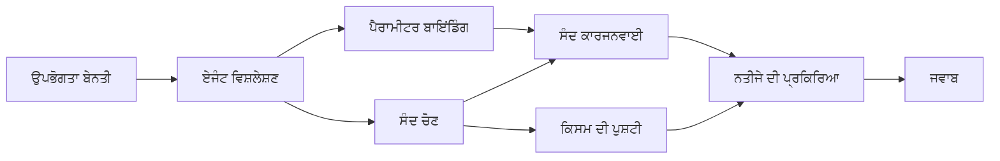

# 🛠️ ਅਜ਼ਯੂਰ ਓਪਨਏਆਈ (Responses API) ਦੇ ਨਾਲ ਐਡਵਾਂਸਡ ਟੂਲ ਉਪਯੋਗ (.NET)

## 📋 ਸਿੱਖਣ ਦੇ ਉਦੇਸ਼

ਇਹ ਨੋਟਬੁੱਕ .NET ਵਿੱਚ ਮਾਇਕ੍ਰੋਸੌਫਟ ਏਜੈਂਟ ਫਰੇਮਵਰਕ ਦੀ ਵਰਤੋਂ ਕਰਕੇ Azure OpenAI (Responses API) ਨਾਲ ਉਦਯੋਗ-ਗਰੇਡ ਟੂਲ ਇੰਟਿਗਰੇਸ਼ਨ ਪੈਟਰਨ ਦਿਖਾਉਂਦਾ ਹੈ। ਤੁਸੀਂ ਕਈ ਵਿਸ਼ੇਸ਼ ਟੂਲਾਂ ਦੇ ਨਾਲ ਪੇਚੀਦਾ ਏਜੈਂਟ ਬਣਾਉਣਾ ਸਿਖੋਗੇ, C# ਦੀ ਮਜ਼ਬੂਤ ਟਾਈਪਿੰਗ ਅਤੇ .NET ਦੀਆਂ ਉਦਯੋਗਿਕ ਵਿਸ਼ੇਸ਼ਤਾਵਾਂ ਨੂੰ ਵਰਤਦੇ ਹੋਏ।

### ਐਡਵਾਂਸਡ ਟੂਲ ਸਮਰੱਥਾਵਾਂ ਜੋ ਤੁਸੀਂ ਮਾਹਰ ਕਰੋਂਗੇ

- 🔧 **ਮਲਟੀ-ਟੂਲ ਆਰਕੀਟੈਕਚਰ**: ਕਈ ਵਿਸ਼ੇਸ਼ ਸਮਰੱਥਾਵਾਂ ਵਾਲੇ ਏਜੈਂਟ ਬਣਾਉਣਾ
- 🎯 **ਟਾਈਪ-ਸੇਫ਼ ਟੂਲ ਇਜੈਕਸ਼ਨ**: C# ਦੀ ਕੰਪਾਈਲ-ਟਾਈਮ ਵੈਰੀਫਿਕੇਸ਼ਨ ਦੀ ਵਰਤੋਂ
- 📊 **ਉਦਯੋਗਿਕ ਟੂਲ ਪੈਟਰਨ**: ਪ੍ਰੋਡਕਸ਼ਨ-ਤੈਯਾਰ ਟੂਲ ਡਿਜ਼ਾਇਨ ਅਤੇ ਏਰਰ ਹੈਂਡਲਿੰਗ
- 🔗 **ਟੂਲ ਕਨਪੋਜ਼ੀਸ਼ਨ**: ਵਿਆਪਕ ਕਾਰੋਬਾਰੀ ਵਰਕਫਲੋਜ਼ ਲਈ ਟੂਲਾਂ ਦਾ ਜੋੜ

## 🎯 .NET ਟੂਲ ਆਰਕੀਟੈਕਚਰ ਦੇ ਲਾਭ

### ਉਦਯੋਗਿਕ ਟੂਲ ਵਿਸ਼ੇਸ਼ਤਾਵਾਂ

- **ਕੰਪਾਈਲ-ਟਾਈਮ ਵੈਰੀਫਿਕੇਸ਼ਨ**: ਮਜ਼ਬੂਤ ਟਾਈਪਿੰਗ ਨਾਲ ਟੂਲ ਪੈਰਾਮੀਟਰਾਂ ਦੀ ਸਹੀਤਾ ਨੂੰ ਯਕੀਨੀ ਬਣਾਉਣਾ
- **ਡਿਪੈਂਡੈਂਸੀ ਇੰਜੈਕਸ਼ਨ**: ਟੂਲ ਪ੍ਰਬੰਧਨ ਲਈ IoC ਕੰਟੇਨਰ ਇੰਟੀਗ੍ਰੇਸ਼ਨ
- **ਐਸਿੰਕ/ਅਵੇਟ ਪੈਟਰਨ**: ਸਹੀ ਰਿਸੋਰਸ ਪ੍ਰਬੰਧਨ ਨਾਲ ਨਾਨ-ਬਲੌਕਿੰਗ ਟੂਲ ਇਜੈਕਸ਼ਨ
- **ਸੰਰਚਿਤ ਲੌਗਿੰਗ**: ਟੂਲ ਇਜੈਕਸ਼ਨ ਮਾਨੀਟਰਿੰਗ ਲਈ ਬਿਲਟ-ਇਨ ਲੌਗਿੰਗ ਇੰਟੀਗ੍ਰੇਸ਼ਨ

### ਪ੍ਰੋਡਕਸ਼ਨ-ਤੈਯਾਰ ਪੈਟਰਨ

- **ਇਕਸਪਸ਼ਨ ਹੈਂਡਲਿੰਗ**: ਟਾਈਪਡ ਇਕਸਪਸ਼ਨਾਂ ਨਾਲ ਵਿਸਥਾਰਿਕ ਗੜਬੜ ਪ੍ਰਬੰਧਨ
- **ਰਿਸੋਰਸ ਪ੍ਰਬੰਧਨ**: ਠੀਕ ਤਰੀਕੇ ਨਾਲ ਡਿਸਪੋਜ਼ਲ ਪੈਟਰਨ ਅਤੇ ਮੈਮੋਰੀ ਪ੍ਰਬੰਧਨ
- **ਪ੍ਰਦਰਸ਼ਨ ਮਾਨੀਟਰਿੰਗ**: ਬਿਲਟ-ਇਨ ਮੈਟ੍ਰਿਕਸ ਅਤੇ ਪ੍ਰਦਰਸ਼ਨ ਕਾਉਂਟਰਜ਼
- **ਕੰਫਿਗਰੇਸ਼ਨ ਪ੍ਰਬੰਧਨ**: ਵੈਰੀਫਿਕੇਸ਼ਨ ਨਾਲ ਟਾਈਪ-ਸੇਫ਼ ਕਾਂਫ਼ਿਗਰੇਸ਼ਨ

## 🔧 ਤਕਨੀਕੀ ਆਰਕੀਟੈਕਚਰ

### ਕੋਰ .NET ਟੂਲ ਕੰਪੋਨੇਟਸ

- **Microsoft.Extensions.AI**: ਇਕਠੇ ਟੂਲ ਐਬਸਟ੍ਰੈਕਸ਼ਨ ਲੇਅਰ
- **Microsoft.Agents.AI**: ਉਦਯੋਗ-ਗਰੇਡ ਟੂਲ ਸੰਚਾਲਨ
- **Azure OpenAI (Responses API)**: ਕੰਨੈਕਸ਼ਨ ਪੂਲਿੰਗ ਨਾਲ ਉੱਚ-ਪ੍ਰਦਰਸ਼ਨ API ਕਲਾਈਂਟ

### ਟੂਲ ਇਜੈਕਸ਼ਨ ਪਾਈਪਲਾਈਨ



## 🛠️ ਟੂਲ ਸ਼੍ਰੇਣੀਆਂ ਅਤੇ ਪੈਟਰਨਸ

### 1. **ਡਾਟਾ ਪ੍ਰੋਸੈਸਿੰਗ ਟੂਲ**

- **ਇਨਪੁੱਟ ਵੈਰੀਫਿਕੇਸ਼ਨ**: ਡਾਟਾ ਨੋਟੇਸ਼ਨ ਨਾਲ ਮਜ਼ਬੂਤ ਟਾਈਪਿੰਗ
- **ਟ੍ਰਾਂਸਫਾਰਮ ਓਪਰੇਸ਼ਨਸ**: ਟਾਈਪ-ਸੇਫ਼ ਡਾਟਾ ਕਨਵਰਜ਼ਨ ਅਤੇ ਫਾਰਮੇਟਿੰਗ
- **ਕਾਰੋਬਾਰੀ ਲੋਜਿਕ**: ਖੇਤਰ-ਵਿਸ਼ੇਸ਼ ਗਣਨਾ ਅਤੇ ਵਿਸ਼ਲੇਸ਼ਣ ਦੇ ਟੂਲ
- **ਆਉਟਪੁੱਟ ਫਾਰਮੇਟਿੰਗ**: ਸੰਰਚਿਤ ਪ੍ਰਤਿ ਉਤਪਾਦਨ

### 2. **ਇੰਟੀਗ੍ਰੇਸ਼ਨ ਟੂਲ**

- **API ਕਨੇਕਟਰ**: HttpClient ਨਾਲ RESTful ਸਰਵਿਸ ਇੰਟੀਗ੍ਰੇਸ਼ਨ
- **ਡੇਟਾਬੇਸ ਟੂਲ**: ਡਾਟਾ ਐਕਸੈੱਸ ਲਈ Entity Framework ਇੰਟੀਗ੍ਰੇਸ਼ਨ
- **ਫਾਇਲ ਓਪਰੇਸ਼ਨਸ**: ਵੈਰੀਫਿਕੇਸ਼ਨ ਨਾਲ ਸੁਰੱਖਿਅਤ ਫਾਇਲ ਸਿਸਟਮ ਓਪਰੇਸ਼ਨਸ
- **ਬਾਹਰੀ ਸਰਵਿਸਜ਼**: ਤੀਜੀ-ਪੱਖੀ ਸਰਵਿਸ ਇੰਟੀਗ੍ਰੇਸ਼ਨ ਪੈਟਰਨਸ

### 3. **ਯੂਟਿਲਿਟੀ ਟੂਲ**

- **ਪਾਠ ਪ੍ਰੋਸੈਸਿੰਗ**: ਸਟਰਿੰਗ ਮੈਨਿਪੁਲੇਸ਼ਨ ਅਤੇ ਫਾਰਮੇਟਿੰਗ ਯੂਟਿਲਿਟੀ
- **ਤਾਰੀਖ/ਸਮਾਂ ਓਪਰੇਸ਼ਨਸ**: ਸੱਭਿਆਚਾਰ-ਸਚੇਤ ਤਾਰੀਖ/ਸਮਾਂ ਗਣਨਾ
- **ਗਣਿਤ ਟੂਲ**: ਸੁਚਿੱਤ ਗਣਨਾ ਅਤੇ ਅੰਕੜਾਤਮਕ ਓਪਰੇਸ਼ਨਸ
- **ਵੈਰੀਫਿਕੇਸ਼ਨ ਟੂਲ**: ਕਾਰੋਬਾਰੀ ਨਿਯਮਾਂ ਦੀ ਸੰਪੂਰਣ ਜਾਂਚ ਅਤੇ ਡਾਟਾ ਪ੍ਰਮਾਣਿਕਤਾ

.NET ਵਿੱਚ ਸ਼ਕਤੀਸ਼ালী, ਟਾਈਪ-ਸੇਫ ਟੂਲ ਸਮਰੱਥਾਵਾਂ ਨਾਲ ਉਦਯੋਗ-ਗਰੇਡ ਏਜੈਂਟ ਬਣਾਉਣ ਲਈ ਤਿਆਰ ਹੋ? ਆਓ ਕੁਝ ਪੇਸ਼ੇਵਰ ਗਰੇਡ ਹੱਲਾਂ ਦੀ ਰਚਨਾ ਕਰੀਏ! 🏢⚡

## 🚀 ਸ਼ੁਰੂਆਤ

### ਲੋੜੀਂਦੇ ਸ਼ਰਤਾਂ

- [.NET 10 SDK](https://dotnet.microsoft.com/download/dotnet/10.0) ਜਾਂ ਇਸ ਤੋਂ ਉੱਚਾ
- ਇੱਕ [Azure ਸਬਸਕ੍ਰਿਪਸ਼ਨ](https://azure.microsoft.com/free/) ਜਿਸ ਵਿੱਚ Azure OpenAI ਸਰੋਤ ਅਤੇ ਮੋਡਲ ਤैनਾਤੀ ਹੈ
- [Azure CLI](https://learn.microsoft.com/cli/azure/install-azure-cli) — `az login` ਨਾਲ ਸਾਈਨ ਇਨ ਕਰੋ

### ਲੋੜੀਂਦੇ ਵਾਤਾਵਰਨ ਚਰ

```bash
# zsh/bash
export AZURE_OPENAI_ENDPOINT=https://<your-resource>.openai.azure.com
export AZURE_OPENAI_DEPLOYMENT=gpt-4.1-mini
# ਫਿਰ ਸਾਈਨ ਇਨ ਕਰੋ ਤਾਂ ਜੋ AzureCliCredential ਟੋਕਨ ਪ੍ਰਾਪਤ ਕਰ ਸਕੇ
az login
```

```powershell
# ਪਾਵਰਸ਼ੈੱਲ
$env:AZURE_OPENAI_ENDPOINT = "https://<your-resource>.openai.azure.com"
$env:AZURE_OPENAI_DEPLOYMENT = "gpt-4.1-mini"
# ਫਿਰ ਸਾਈਨ ਇਨ ਕਰੋ ਤਾਂ ਜੋ AzureCliCredential ਇੱਕ ਟੋਕਨ ਪ੍ਰਾਪਤ ਕਰ ਸਕੇ
az login
```

### ਨਮੂਨਾ ਕੋਡ

ਉਦਾਹਰਨ ਕੋਡ ਚਲਾਉਣ ਲਈ,

```bash
# ਜ਼ੈਸ਼/ਬੈਸ਼
chmod +x ./04-dotnet-agent-framework.cs
./04-dotnet-agent-framework.cs
```

ਜਾਂ dotnet CLI ਦੀ ਵਰਤੋਂ ਕਰਦੇ ਹੋਏ:

```bash
dotnet run ./04-dotnet-agent-framework.cs
```

ਪੂਰਾ ਕੋਡ ਵੇਖਣ ਲਈ [`04-dotnet-agent-framework.cs`](../../../../04-tool-use/code_samples/04-dotnet-agent-framework.cs) ਨੂੰ ਦੇਖੋ।

```csharp
#!/usr/bin/dotnet run

#:package Microsoft.Extensions.AI@10.*
#:package Microsoft.Agents.AI.OpenAI@1.*-*
#:package Azure.AI.OpenAI@2.1.0
#:package Azure.Identity@1.13.1

using System.ComponentModel;

using Microsoft.Agents.AI;
using Microsoft.Extensions.AI;

using Azure.AI.OpenAI;
using Azure.Identity;

// Tool Function: Random Destination Generator
// This static method will be available to the agent as a callable tool
// The [Description] attribute helps the AI understand when to use this function
// This demonstrates how to create custom tools for AI agents
[Description("Provides a random vacation destination.")]
static string GetRandomDestination()
{
    // List of popular vacation destinations around the world
    // The agent will randomly select from these options
    var destinations = new List<string>
    {
        "Paris, France",
        "Tokyo, Japan",
        "New York City, USA",
        "Sydney, Australia",
        "Rome, Italy",
        "Barcelona, Spain",
        "Cape Town, South Africa",
        "Rio de Janeiro, Brazil",
        "Bangkok, Thailand",
        "Vancouver, Canada"
    };

    // Generate random index and return selected destination
    // Uses System.Random for simple random selection
    var random = new Random();
    int index = random.Next(destinations.Count);
    return destinations[index];
}

// Azure OpenAI with the Responses API (stable v1 endpoint). Sign in with `az login`.
var azureEndpoint = Environment.GetEnvironmentVariable("AZURE_OPENAI_ENDPOINT")
    ?? throw new InvalidOperationException("AZURE_OPENAI_ENDPOINT is not set.");
var deployment = Environment.GetEnvironmentVariable("AZURE_OPENAI_DEPLOYMENT") ?? "gpt-4.1-mini";

var azureClient = new AzureOpenAIClient(new Uri(azureEndpoint), new AzureCliCredential());

// Define Agent Identity and Comprehensive Instructions
// Agent name for identification and logging purposes
var AGENT_NAME = "TravelAgent";

// Detailed instructions that define the agent's personality, capabilities, and behavior
// This system prompt shapes how the agent responds and interacts with users
var AGENT_INSTRUCTIONS = """
You are a helpful AI Agent that can help plan vacations for customers.

Important: When users specify a destination, always plan for that location. Only suggest random destinations when the user hasn't specified a preference.

When the conversation begins, introduce yourself with this message:
"Hello! I'm your TravelAgent assistant. I can help plan vacations and suggest interesting destinations for you. Here are some things you can ask me:
1. Plan a day trip to a specific location
2. Suggest a random vacation destination
3. Find destinations with specific features (beaches, mountains, historical sites, etc.)
4. Plan an alternative trip if you don't like my first suggestion

What kind of trip would you like me to help you plan today?"

Always prioritize user preferences. If they mention a specific destination like "Bali" or "Paris," focus your planning on that location rather than suggesting alternatives.
""";

// Create AI Agent with Advanced Travel Planning Capabilities
// Get the Responses client for the deployment and create the AI agent
// Configure agent with name, detailed instructions, and available tools
// This demonstrates the .NET agent creation pattern with full configuration
AIAgent agent = azureClient
    .GetChatClient(deployment)
    .AsAIAgent(
        name: AGENT_NAME,
        instructions: AGENT_INSTRUCTIONS,
        tools: [AIFunctionFactory.Create(GetRandomDestination)]
    );

// Create New Conversation Session for Context Management
// Initialize a new conversation session to maintain context across multiple interactions
// Sessions enable the agent to remember previous exchanges and maintain conversational state
// This is essential for multi-turn conversations and contextual understanding
await using var session = await agent.CreateSessionAsync();

// Execute Agent: First Travel Planning Request
// Run the agent with an initial request that will likely trigger the random destination tool
// The agent will analyze the request, use the GetRandomDestination tool, and create an itinerary
// Using the session parameter maintains conversation context for subsequent interactions
await foreach (var update in agent.RunStreamingAsync("Plan me a day trip", session))
{
    await Task.Delay(10);
    Console.Write(update);
}

Console.WriteLine();

// Execute Agent: Follow-up Request with Context Awareness
// Demonstrate contextual conversation by referencing the previous response
// The agent remembers the previous destination suggestion and will provide an alternative
// This showcases the power of conversation sessions and contextual understanding in .NET agents
await foreach (var update in agent.RunStreamingAsync("I don't like that destination. Plan me another vacation.", session))
{
    await Task.Delay(10);
    Console.Write(update);
}
```

---

<!-- CO-OP TRANSLATOR DISCLAIMER START -->
**ਅਸਵੀਕਾਰੋਪਣ**:
ਇਸ ਦਸਤਾਵੇਜ਼ ਦਾ ਅਨੁਵਾਦ ਏਆਈ ਅਨੁਵਾਦ ਸੇਵਾ [Co-op Translator](https://github.com/Azure/co-op-translator) ਦੀ ਵਰਤੋਂ ਕਰਕੇ ਕੀਤਾ ਗਿਆ ਹੈ। ਜਦੋਂ ਕਿ ਅਸੀਂ ਸਹੀਤਾਵਾਂ ਲਈ ਯਤਨਸ਼ੀਲ ਹਾਂ, ਕਿਰਪਾ ਕਰਕੇ ਧਿਆਨ ਰੱਖੋ ਕਿ ਸਵੈਚਾਲਿਤ ਅਨੁਵਾਦਾਂ ਵਿੱਚ ਗਲਤੀਆਂ ਜਾਂ ਅਸਮੱਤਿਆਵਾਂ ਹੋ ਸਕਦੀਆਂ ਹਨ। ਮੂਲ ਦਸਤਾਵੇਜ਼ ਆਪਣੀ ਮੂਲ ਭਾਸ਼ਾ ਵਿੱਚ ਅਧਿਕਾਰਕ ਸਰੋਤ ਮੰਨਿਆ ਜਾਣਾ ਚਾਹੀਦਾ ਹੈ। ਜਰੂਰੀ ਜਾਣਕਾਰੀ ਲਈ, ਪੇਸ਼ੇਵਰ ਮਨੁੱਖੀ ਅਨੁਵਾਦ ਦੀ ਸਿਫ਼ਾਰਸ਼ ਕੀਤੀ ਜਾਂਦੀ ਹੈ। ਅਸੀਂ ਇਸ ਅਨੁਵਾਦ ਦੇ ਉਪਯੋਗ ਤੋਂ ਪੈਦਾ ਹੋਣ ਵਾਲੀਆਂ ਕਿਸੇ ਵੀ ਗਲਤਫਹਿਮੀਆਂ ਜਾਂ ਗਲਤ ਵਿਆਖਿਆਵਾਂ ਲਈ ਜਵਾਬਦੇਹ ਨਹੀਂ ਹਾਂ।
<!-- CO-OP TRANSLATOR DISCLAIMER END -->