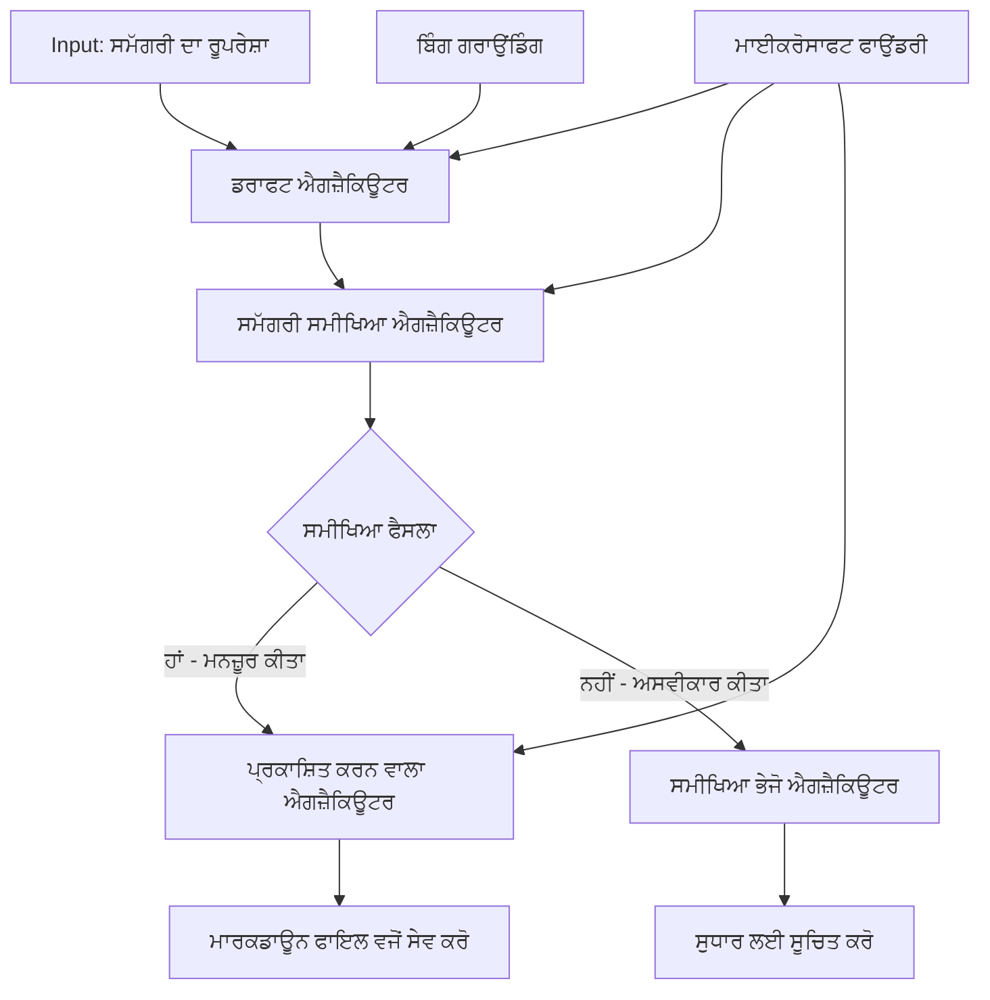

# 🔀 ਮਾਈਕ੍ਰੋਸੌਫਟ ਫਾਉਂਡਰੀ (.NET) ਨਾਲ ਸ਼ਰਤੀ ਏਜੰਟ ਵਰਕਫ਼ਲੋਜ਼

## 📋 ਬੁੱਧਿਮਾਨ ਫੈਸਲਾ-ਅਧਾਰਿਤ ਵਰਕਫਲੋ ਟਿਊਟੋਰੀਅਲ

ਇਹ ਨੋਟਬੁੱਕ ਮਾਈਕ੍ਰੋਸੌਫਟ ਫਾਉਂਡਰੀ ਅਤੇ ਮਾਈਕ੍ਰੋਸੌਫਟ ਏਜੰਟ ਫਰੇਮਵਰਕ ਤੱਥ .NET ਦੀ ਵਰਤੋਂ ਕਰਕੇ **ਸ਼ਰਤੀ ਵਰਕਫਲੋ ਪੈਟਰਨਜ਼** ਨੂੰ ਦਰਸਾਉਂਦਾ ਹੈ। ਤੁਸੀਂ ਸਿੱਖੋਗੇ ਕਿ ਕਿਵੇਂ ਸੁਧਰੇ ਹੋਏ, ਫੈਸਲਾ-ਚਲਿਤ ਵਰਕਫਲੋਜ਼ ਬਣਾਏ ਜਾਣ ਜੋ AI ਵਿਸ਼ਲੇਸ਼ਣ, ਵਿਉਪਾਰਕ ਨਿਯਮਾਂ ਅਤੇ ਡਾਇਨਾਮਿਕ ਪਰਿਸਥਿਤੀਆਂ ਦੇ ਆਧਾਰ 'ਤੇ ਪ੍ਰਕਿਰਿਆ ਨੂੰ ਬੁੱਧਿਮਾਨੀ ਨਾਲ ਰੂਟ ਕਰਦੇ ਹਨ, ਨਾਲ ਹੀ ਇੰਟਰਨਜ਼ਾਈਜ਼ੋਲੇਸ ਦੇ ਲਈ ਆਟੋਮੇਸ਼ਨ ਨੂੰ ਪ੍ਰਦਾਨ ਕਰਦੇ ਹਨ।

## 🎯 ਅਧ੍ਯਨ ਲਕੜੀਆਂ

### 🧠 **ਬੁੱਧਿਮਾਨ ਫੈਸਲਾ ਆਰਕੀਟੈਕਚਰ**
- **ਸ਼ਰਤੀ ਤਰਕ ਲਾਗੂ ਕਰਨਾ**: ਕਈ ਸ਼ਾਖਾਵਾਂ ਦੇ ਨਾਲ ਜਟਿਲ ਫੈਸਲਾ ਦਰੱਖ਼ਤ ਬਣਾਓ
- **AI-ਸਮਰਥਿਤ ਰਾਊਟਿੰਗ**: ਬੁੱਧਿਮਾਨ ਰਾਊਟਿੰਗ ਫੈਸਲੇ ਕਰਨ ਲਈ ਮਾਈਕ੍ਰੋਸੌਫਟ ਫਾਉਂਡਰੀ ਮਾਡਲ ਦੀ ਵਰਤੋਂ ਕਰੋ
- **ਡਾਇਨਾਮਿਕ ਵਰਕਫਲੋ ਅਨੁਕੂਲਤਾ**: ਰਨਟਾਈਮ ਵਿਸ਼ਲੇਸ਼ਣ ਅਤੇ ਪਰਿਸਥਿਤੀਆਂ ਦੇ ਆਧਾਰ 'ਤੇ ਵਰਕਫਲੋ ਦੇ ਬਿਹੀਵਿਅਰ ਨੂੰ ਬਦਲੋ
- **ਇੰਟਰਪ੍ਰਾਈਜ਼ ਨਿਯਮ ਸਮਾਜੋਜਨ**: ਵਰਕਫਲੋਜ਼ 'ਚ ਵਿਉਪਾਰਕ ਤਰਕ ਅਤੇ ਅਨੁਕੂਲਤਾ ਦੀਆਂ ਲੋੜਾਂ ਸ਼ਾਮਿਲ ਕਰੋ

### 🔀 **ਉੱਚ ਦਰਜੇ ਦੇ ਸ਼ਰਤੀ ਪੈਟਰਨਜ਼**
- **ਬਹੁ-ਕ੍ਰਾਈਟੇਰੀਆ ਫੈਸਲਾ ਕਰਨ ਦੀ ਪ੍ਰਕਿਰਿਆ**: ਰਾਉਟਿੰਗ ਫੈਸਲਿਆਂ ਲਈ ਕਈ ਕਾਰਕਾਂ ਦਾ ਮੁਲਾਂਕਣ
- **ਪ੍ਰਸੰਗ-ਜਾਣੂ ਪ੍ਰਕਿਰਿਆ**: ਸੰਚਿਤ ਵਰਕਫਲੋ ਸੰਦਰਭ ਅਤੇ ਇਤਿਹਾਸ ਦੇ ਆਧਾਰ 'ਤੇ ਫੈਸਲੇ ਲਓ
- **ਲਚਕੀਲਾ ਵਰਕਫਲੋ ਤਬਦੀਲੀ**: ਅਸਲੀ ਸਮੇਂ ਦੀਆਂ ਪਰਿਸਥਿਤੀਆਂ ਦੇ ਆਧਾਰ 'ਤੇ ਪ੍ਰਕਿਰਿਆ ਮਾਰਗ ਬਦਲੋ
- **ਨਿਯਮ ਇੰਜਣ ਸਮਾਜੋਜਨ**: ਵਰਕਫਲੋਜ਼ ਵਿੱਚ ਸੁਧਰੇ ਹੋਏ ਵਿਉਪਾਰਕ ਨਿਯਮ ਇੰਜਣ ਲਾਗੂ ਕਰੋ

### 🏢 **ਇੰਟਰਪ੍ਰਾਈਜ਼ ਸ਼ਰਤੀ ਐਪਲੀਕੇਸ਼ਨਜ਼**
- **ਦਸਤਾਵੇਜ਼ ਵਰਗੀਕਰਨ ਅਤੇ ਰਾਊਟਿੰਗ**: ਦਸਤਾਵੇਜ਼ਾਂ ਨੂੰ ਸਹੀ ਵਰਕਫਲੋਜ਼ ਵੱਲ ਖੁਦਕਾਰ ਰੂਪ ਵਿੱਚ ਵਰਗੀਕ੍ਰਿਤ ਅਤੇ ਰਾਊਟ ਕਰੋ
- **ਗਾਹਕ ਸੇਵਾ ਟ੍ਰੈਜ**: ਖਾਸ ਹੇਂਡਲਿੰਗ ਟੀਮਾਂ ਵੱਲ ਗਾਹਕ ਪੁੱਛਗਿੱਛ ਦਾ ਬੁੱਧਿਮਾਨ ਰਾਊਟਿੰਗ
- **ਅਨੁਕੂਲਤਾ ਅਤੇ ਜੋਖਮ ਪ੍ਰਕਿਰਿਆ**: ਜੋਖਮ ਮੁਲਾਂਕਣ ਦੇ ਆਧਾਰ 'ਤੇ ਵੱਖ-ਵੱਖ ਜाँच ਅਤੇ ਸਮੀਖਿਆ ਪ੍ਰਕਿਰਿਆਵਾਂ ਲਾਗੂ ਕਰੋ
- **ਗੁਣਵੱਤਾ ਭਰੋਸੇ ਵਾਲੇ ਵਰਕਫਲੋ**: ਗੁਣਵੱਤਾ ਮਾਪਦੰਡਾਂ ਦੇ ਆਧਾਰ 'ਤੇ ਸਮੱਗਰੀ ਨੂੰ ਸਹੀ ਸਮੀਖਿਆ ਪ੍ਰਕਿਰਿਆਵਾਂ ਰਾਹੀਂ ਰਾਊਟ ਕਰੋ

## ⚙️ ਜਰੂਰੀਆਂ ਅਤੇ ਸੈਟਅੱਪ

### 📦 **ਜ਼ਰੂਰੀ NuGet ਪੈਕੇਜ**

ਸ਼ਰਤੀ ਵਰਕਫਲੋ ਪ੍ਰਕਿਰਿਆ ਲਈ ਅਗੇਰੀ ਪੈਕੇਜ:

```xml
<!-- Core AI Framework -->
<PackageReference Include="Microsoft.Extensions.AI" Version="9.9.0" />

<!-- Azure AI Agents with Persistent State -->
<PackageReference Include="Azure.AI.Agents.Persistent" Version="1.2.0-beta.5" />

<!-- Azure Identity and Utilities -->
<PackageReference Include="Azure.Identity" Version="1.15.0" />
<PackageReference Include="System.Linq.Async" Version="6.0.3" />
<PackageReference Include="DotNetEnv" Version="3.1.1" />

<!-- Local Workflow Framework References -->
<!-- Microsoft.Agents.Workflows.dll - Advanced workflow orchestration -->
<!-- Microsoft.Agents.AI.AzureAI.dll - Microsoft Foundry integration -->
<!-- Microsoft.Agents.AI.dll - Core agent abstractions -->
```

### 🔑 **ਮਾਈਕ੍ਰੋਸੌਫਟ ਫਾਉਂਡਰੀ ਕੰਫਿਗਰੇਸ਼ਨ**

**ਜ਼ਰੂਰੀ ਏਜ਼ਰ ਸਰੋਤ:**
- ਮਾਈਕ੍ਰੋਸੌਫਟ ਫਾਉਂਡਰੀ ਵਰਕਸਪੇਸ ਜਿਸ ਵਿੱਚ ਸ਼ਰਤੀ ਪ੍ਰਕਿਰਿਆ ਮਾਡਲ ਹਨ
- ਉਚਿਤ ਕੰਪਿਊਟ ਕੋਟਾ ਅਤੇ ਅਨੁਮਤੀਆਂ ਵਾਲੀ ਏਜ਼ਰ ਸਬਸਕ੍ਰਿਪਸ਼ਨ
- ਫੈਸਲਾ ਕਰਨ ਅਤੇ ਸਮੱਗਰੀ ਵਿਸ਼ਲੇਸ਼ਣ ਲਈ ਤਿਆਰ ਕੀਤਾ ਗਿਆ AI ਮਾਡਲ
- (ਵਕਲਪਿਕ) Bing ਖੋਜ API ਕਨੈਕਸ਼ਨ ਜ਼ਮੀਨੀ ਹੁਨਰ ਲਈ

**ਵਾਤਾਵਰਣ ਸੰਰਚਨਾ (.env ਫਾਇਲ):**
```env
# Microsoft Foundry Configuration
AZURE_AI_PROJECT_ENDPOINT=https://your-project.cognitiveservices.azure.com/
BING_CONNECTION_ID=your-bing-connection-id
```

**ਪਛਾਣ ਸੈਟਅੱਪ:**
```csharp
// Azure CLI or Managed Identity authentication
using Azure.Identity;
var credential = new AzureCliCredential();

// Load environment configuration
DotNetEnv.Env.Load("../../../.env");
```

### 🏗️ **ਸ਼ਰਤੀ ਵਰਕਫਲੋ ਆਰਕੀਟੈਕਚਰ**



**ਮੁੱਖ ਘਟਕ:**
- **ਡਰਾਫਟ ਏਗਜ਼ੈਕਿਊਟਰ**: ਆਉਟਲਾਈਨ ਤੋਂ ਮੁੱਢਲੀ ਸਮੱਗਰੀ ਡਰਾਫਟ ਬਣਾਉਣ ਵਾਲਾ AI ਏਜੰਟ
- **ਸਮੱਗਰੀ ਸਮੀਖਿਆ ਏਗਜ਼ੈਕਿਊਟਰ**: ਡਰਾਫਟ ਦੀ ਗੁਣਵੱਤਾ ਅਤੇ ਅਨੁਕੂਲਤਾ ਦਾ ਮੁਲਾਂਕਣ ਕਰਨ ਵਾਲਾ AI ਏਜੰਟ
- **ਸ਼ਰਤੀ ਰਾਊਟਿੰਗ**: ਸਮੀਖਿਆ ਨਤੀਜਿਆਂ ਦੇ ਅਧਾਰ 'ਤੇ ਰਾਊਟਿੰਗ ਕਰਨ ਵਾਲਾ ਤਰਕ
- **ਪਬਲਿਸ਼/ਸਮੀਖਿਆ ਮਾਰਗ**: ਮਨਜ਼ੂਰਸ਼ੁਦਾ ਅਤੇ ਰੱਦ ਸਮੱਗਰੀ ਲਈ ਵੱਖ-ਵੱਖ ਪ੍ਰਕਿਰਿਆ ਮਾਰਗ
- **ਥਾਂ ਪ੍ਰਬੰਧਨ**: ਸਮੱਗਰੀ ਅਤੇ ਸਮੀਖਿਆ ਸੰਦਰਭ ਨੂੰ ਸਾਰਾ ਵਰਕਫਲੋ ਦੌਰਾਨ ਪ੍ਰਬੰਧਿਤ ਕਰਦਾ ਹੈ

## 🎨 **ਸ਼ਰਤੀ ਵਰਕਫਲੋ ਡਿਜ਼ਾਈਨ ਪੈਟਰਨਜ਼**

### 📋 **ਗੁਣਵੱਤਾ ਦਰਵਾਜਿਆਂ ਨਾਲ ਸਮੱਗਰੀ ਉਦਪਾਦਨ**
```
Outline → Draft Creation → Quality Review → {Approve: Publish | Reject: Revise}
```

### 🎯 **ਜੋਖਮ-ਅਧਾਰਿਤ ਦਸਤਾਵੇਜ਼ ਪ੍ਰਕਿਰਿਆ**
```
Document → Risk Assessment → {Low: Standard | High: Enhanced Review}
```

### 🔍 **ਬੁੱਧਿਮਾਨ ਗਾਹਕ ਸੇਵਾ ਰਾਊਟਿੰਗ**
```
Customer Query → Analysis → {Simple: FAQ Bot | Complex: Human Agent}
```

### 💼 **ਅਨੁਕੂਲਤਾ-ਚਲਿਤ ਵਰਕਫਲੋ**
```
Content → Compliance Check → {Pass: Publish | Fail: Legal Review}
```

## 🏢 **ਇੰਟਰਪ੍ਰਾਈਜ਼ ਸ਼ਰਤੀ ਫਾਇਦੇ**

### 🎯 **ਬੁੱਧਿਮਾਨ ਆਟੋਮੇਸ਼ਨ**
- **ਸਮਾਰਟ ਫੈਸਲਾ ਲੈਣਾ**: ਸਮੱਗਰੀ ਵਿਸ਼ਲੇਸ਼ਣ ਅਤੇ ਸੰਦਰਭ ਦੇ ਆਧਾਰ 'ਤੇ AI-ਸਮਰਥਿਤ ਰਾਊਟਿੰਗ ਫੈਸਲੇ
- **ਲਚਕੀਲਾ ਪ੍ਰਕਿਰਿਆ**: ਬਦਲਦੀਆਂ ਪਰਿਸਥਿਤੀਆਂ ਦੇ ਆਧਾਰ 'ਤੇ ਆਟੋਮੈਟਿਕ ਤੌਰ 'ਤੇ ਬਦਲਦੇ ਵਰਕਫਲੋਜ਼
- **ਵਿਉਪਾਰਕ ਨਿਯਮਾਂ ਦੀ ਪਾਲਣਾ**: ਮਸ਼ਕਲ ਵਿਉਪਾਰਕ ਤਰਕ ਅਤੇ ਨੀਤੀਆਂ ਦੀ ਖੁਦਕਾਰ ਲਾਗੂਆ
- **ਪ੍ਰਸੰਗ-ਜਾਣੂ ਰਾਊਟਿੰਗ**: ਪੂਰੇ ਵਰਕਫਲੋ ਇਤਿਹਾਸ ਅਤੇ ਸੰਜਿਤ ਸੰਦਰਭ ਦੇ ਆਧਾਰ 'ਤੇ ਫੈਸਲੇ

### 📈 **ਸੰਚਾਲਕੀ ਉਤਕ੍ਰਿਸ਼ਟਤਾ**
- **ਸੰਸਾਧਨ ਦਾ ਅਦਾਇਗੀਸ਼ੀਲ ਵਰਤੋਂ**: ਕੰਮ ਨੂੰ ਸਭ ਤੋਂ ਯੋਗ ਵਿਸ਼ੇਸ਼ਗਿਆ ਅਤੇ ਪ੍ਰਕਿਰਿਆਵਾਂ ਤੱਕ ਰਾਊਟ ਕਰੋ
- **ਮੈਨੂਅਲ ਦਖ਼ਲਅੰਦਾਜ਼ੀ ਦੀ ਘਟਾਟੀ**: ਖ਼ੁਦਕਾਰ ਫੈਸਲਾ ਲੈਣ ਨਾਲ ਮਨੁੱਖੀ ਰਾਊਟਿੰਗ ਦੀ ਲੋੜ ਘਟਦੀ ਹੈ
- **ਜ਼ਿਆਦਾ ਤੇਜ਼ ਹੱਲ ਸਮੇਂ**: ਯੋਗਤਾ ਅਤੇ ਪ੍ਰਕਿਰਿਆ ਸਮਰੱਥਾ ਨੂੰ ਸਿੱਧਾ ਰਾਊਟਿੰਗ
- **ਸਮਰੂਪ ਲਾਗੂਆ**: ਵਿਉਪਾਰਕ ਨਿਯਮਾਂ ਅਤੇ ਫੈਸਲਾ ਮਾਪਦੰਡਾਂ ਦਾ ਇਕਸਾਰ ਲਾਗੂ ਕਰਨਾ

### 🛡️ **ਜੋਖਮ ਪ੍ਰਬੰਧਨ ਅਤੇ ਅਨੁਕੂਲਤਾ**
- **ਆਟੋਮੈਟਿਕ ਜੋਖਮ ਮੁਲਾਂਕਣ**: ਸਮੱਗਰੀ ਅਤੇ ਸਥਿਤੀ ਦੇ ਜੋਖਮ ਪੱਧਰਾਂ ਦੀ AI ਸਮਰਥਿਤ ਮੁਲਾਂਕਣ
- **ਅਨੁਕੂਲਤਾ ਲਾਗੂਆ**: ਲੋੜੀਂਦੇ ਨਿਯਮਿਕ ਪ੍ਰਕਿਰਿਆਵਾਂ ਰਾਹੀਂ ਖੁਦਕਾਰ ਰਾਊਟਿੰਗ
- **ਸੁਰੱਖਿਆ ਨੀਤੀਆਂ ਦਾ ਲਾਗੂਆ**: ਜੋਖਮ ਮੁਲਾਂਕਣ ਦੇ ਆਧਾਰ 'ਤੇ ਵਧੀਆਂ ਸੁਰੱਖਿਆ ਉਪਾਅ लागू
- **ਆਡਿਟ ਟ੍ਰੇਲ ਪ੍ਰਬੰਧਨ**: ਰਾਊਟਿੰਗ ਫੈਸਲਿਆਂ ਅਤੇ ਤਰਕ ਦਾ ਪੂਰਾ ਦਸਤਾਵੇਜ਼ੀਕਰਨ

### 📊 **ਵਿਸ਼ਲੇਸ਼ਣ ਅਤੇ ਲਗਾਤਾਰ ਸੁਧਾਰ**
- **ਫੈਸਲਾ ਵਿਸ਼ਲੇਸ਼ਣ**: ਰਾਊਟਿੰਗ ਫੈਸਲਿਆਂ ਦੀ ਕਾਰਗੁਜ਼ਾਰੀ ਅਤੇ ਸਹੀਤਾ ਦਾ ਟਰੈਕਿੰਗ
- **ਪੈਟਰਨ ਪਹਚਾਣ**: ਸਮੇਂ ਨਾਲ ਰਾਊਟਿੰਗ ਫੈਸਲਿਆਂ ਵਿੱਚ ਰੁਝਾਨ ਅਤੇ ਪੈਟਰਨ ਲੱਭਣਾ
- **ਕਾਰਗੁਜ਼ਾਰੀ ਸੁਧਾਰ**: ਫੈਸਲੇ ਦੇ ਮਾਪਦੰਡਾਂ ਅਤੇ ਰਾਊਟਿੰਗ ਕੁਸ਼ਲਤਾ 'ਚ ਲਗਾਤਾਰ ਸੁਧਾਰ
- **ਵਿਉਪਾਰਕ ਬੁੱਧਿਮਾਨਤਾ**: ਸਮੱਗਰੀ ਦੀਆਂ ਖੂਬੀਆਂ ਅਤੇ ਪ੍ਰਕਿਰਿਆ ਲੋੜਾਂ ਵਿੱਚ ਜਾਣਕਾਰੀ

### 🔧 **ਤਕਨੀਕੀ ਉਤਕ੍ਰਿਸ਼ਟਤਾ**
- **ਥਾਪੀ ਸਥਿਤੀ ਪ੍ਰਬੰਧਨ**: ਵਰਕਫਲੋ ਕਾਰਜਕਾਰੀ ਦੌਰਾਨ ਜਟਿਲ ਸਥਿਤੀ ਦਾ ਰੱਖ-ਰਖਾਵ
- **ਵਿਆਪਕ ਆਰਕੀਟੈਕਚਰ**: ਵੱਡੀ ਮਾਤਰਾ ਦੀ ਸ਼ਰਤੀ ਪ੍ਰਕਿਰਿਆ ਦੀਆਂ ਲੋੜਾਂ ਨੂੰ ਸੰਭਾਲਣਾ
- **ਇਕਾਈ ਸਹਿਯੋਗ ਸਮਰਥਾ**: ਮੌਜੂਦਾ ਵਿਉਪਾਰਕ ਪ੍ਰਣਾਲੀਆਂ ਅਤੇ ਪ੍ਰਕਿਰਿਆਵਾਂ ਦੇ ਨਾਲ ਬਿਨਾਂ ਰੁਕਾਵਟ ਦੇ ਇੰਟਿਗ੍ਰੇਸ਼ਨ
- **ਨਿਗਰਾਨੀ ਅਤੇ ਦ੍ਰਸ਼ਟਿਗੋਚਰਤਾ**: ਵਰਕਫਲੋ ਪ੍ਰਦਰਸ਼ਨ ਅਤੇ ਫੈਸਲਿਆਂ ਦੀ ਵਿਸਥਾਰਿਤ ਟਰੈਕਿੰਗ

ਆਓ .NET ਨਾਲ ਬੁੱਧਿਮਾਨ, ਫੈਸਲਾ-ਚਲਿਤ ਇੰਟਰਪ੍ਰਾਈਜ਼ ਵਰਕਫਲੋਜ਼ ਬਣਾਈਏ! 🚀

## 💻 ਕੋਡ ਚਲਾਉਣਾ

ਪੂਰੀ ਲਾਗੂਆ `04.dotnet-agent-framework-workflow-aifoundry-condition.cs` ਵਿੱਚ ਉਪਲਬਧ ਹੈ। ਇਹ ਇੱਕ **ਗੁਣਵੱਤਾ ਦਰਵਾਜਿਆਂ ਦੇ ਨਾਲ ਸਮੱਗਰੀ ਉਤਪਾਦਨ ਵਰਕਫਲੋ** ਦਰਸਾਉਂਦਾ ਹੈ:

### 🏗️ **ਵਰਕਫਲੋ ਆਰਕੀਟੈਕਚਰ**

```
Content Outline → Draft Creation → Quality Review → Conditional Routing:
                                                      ├─ Approved (>200 words) → Publish
                                                      └─ Rejected (<200 words) → Review Notification
```

**ਵਰਕਫਲੋ ਦੇ ਏਜੰਟ:**
1. **ਇਵੈਂਜਲਿਸਟ ਏਜੰਟ**: Bing ਜ਼ਮੀਨੀ ਕੀਲ ਨਾਲ ਆਉਟਲਾਈਨ ਤੋਂ ਟਿਊਟੋਰੀਅਲ ਡਰਾਫਟ ਬਣਾਉਂਦਾ ਹੈ
2. **ਸਮੱਗਰੀ ਸਮੀਖਿਆ ਏਜੰਟ**: ਡਰਾਫਟ ਦੀ ਗੁਣਵੱਤਾ (ਸ਼ਬਦ ਗਿਣਤੀ, ਪੂਰਨਤਾ) ਦਾ ਮੁਲਾਂਕਣ ਕਰਦਾ ਹੈ
3. **ਪਬਲਿਸ਼ਰ ਏਜੰਟ**: ਮਨਜ਼ੂਰਸ਼ੁਦਾ ਸਮੱਗਰੀ ਨੂੰ ਟਾਈਮਸਟੈਂਪ ਕੀਤਾ ਮਾਰਕਡਾਊਨ ਫਾਇਲ ਵਜੋਂ ਸੇਵ ਕਰਦਾ ਹੈ

**ਕਸਟਮ ਏਗਜ਼ੈਕਿਊਟਰ:**
1. **ਡਰਾਫਟ ਏਗਜ਼ੈਕਿਊਟਰ**: ਡਰਾਫਟ ਬਣਾਉਣ ਦਾ ਆਯੋਜਨ ਕਰਦਾ ਹੈ
2. **ਸਮੱਗਰੀ ਸਮੀਖਿਆ ਏਗਜ਼ੈਕਿਊਟਰ**: ਗੁਣਵੱਤਾ ਮੁਲਾਂਕਣ ਕਰਦਾ ਹੈ
3. **ਪਬਲਿਸ਼ ਏਗਜ਼ੈਕਿਊਟਰ**: ਮਨਜ਼ੂਰਸ਼ੁਦਾ ਸਮੱਗਰੀ ਪ੍ਰਕਾਸ਼ਿਤ ਕਰਦਾ ਹੈ
4. **ਸੈਂਡ ਸਮੀਖਿਆ ਏਗਜ਼ੈਕਿਊਟਰ**: ਰੱਦ ਸਮੱਗਰੀ ਸੂਚਨਾ ਪ੍ਰਬੰਧਿਤ ਕਰਦਾ ਹੈ

### 🚀 ਉਦਾਹਰਨ ਚਲਾਉਣਾ

**ਜਰੂਰੀ ਚੀਜ਼ਾਂ:**
- ਮਾਈਕ੍ਰੋਸੌਫਟ ਫਾਉਂਡਰੀ ਵਰਕਸਪੇਸ ਦੀ ਸੰਰਚਨਾ
- ਏਜ਼ਰ CLI ਪ੍ਰਮਾਣਕਰਨ (`az login`)
- (ਵਿਕਲਪਿਕ) ਜ਼ਮੀਨੀ ਕੀਲ ਲਈ Bing ਖੋਜ ਕਨੈਕਸ਼ਨ

```bash
# ਸਕ੍ਰਿਪਟ ਨੂੰ ਚਾਲੂ ਕਰਨ ਵਾਲਾ ਬਣਾਓ (Unix/Linux/macOS)
chmod +x 04.dotnet-agent-framework-workflow-aifoundry-condition.cs

# ਸ਼ਰਤੀ ਵਰਕਫਲੋ ਚਲਾਓ
./04.dotnet-agent-framework-workflow-aifoundry-condition.cs
```

ਜਾਂ ਵਿੰਡੋਜ਼ 'ਤੇ:
```powershell
dotnet run 04.dotnet-agent-framework-workflow-aifoundry-condition.cs
```

### 📝 ਉਮੀਦ ਕੀਤੀ ਅਪਉਟਪੁੱਟ

ਵਰਕਫਲੋ ਇਹ ਕਰੇਗਾ:
1. **ਏਜੰਟ ਬਣਾਓ**: ਤਿੰਨ ਵਿਸ਼ੇਸ਼ ਮਾਈਕ੍ਰੋਸੌਫਟ ਫਾਉਂਡਰੀ ਏਜੰਟ ਸ਼ੁਰੂ ਕਰੇਗਾ
2. **ਡਰਾਫਟ ਤਿਆਰ ਕਰੋ**: ਇਵੈਂਜਲਿਸਟ ਏਜੰਟ ਆਉਟਲਾਈਨ ਤੋਂ ਟਿਊਟੋਰੀਅਲ ਡਰਾਫਟ ਬਣਾਉਂਦਾ ਹੈ
3. **ਸਮੱਗਰੀ ਸਮੀਖਿਆ ਕਰੋ**: ਸਮੱਗਰੀ ਸਮੀਖਿਆ ਏਜੰਟ ਡਰਾਫਟ ਦੀ ਗੁਣਵੱਤਾ ਦਾ ਮੁਲਾਂਕਣ ਕਰਦਾ ਹੈ
4. **ਸ਼ਰਤੀ ਰਾਊਟਿੰਗ**:
   - **ਜੇ ਮਨਜ਼ੂਰ (>200 ਸ਼ਬਦ)**: ਪਬਲਿਸ਼ਰ ਏਗਜ਼ੈਕਿਊਟਰ ਮਾਰਕਡਾਊਨ ਫਾਇਲ ਵਜੋਂ ਸੇਵ ਕਰਦਾ ਹੈ
   - **ਜੇ ਰੱਦ (<200 ਸ਼ਬਦ)**: ਸਮੀਖਿਆ ਸੂਚਨਾ ਭੇਜੋ
5. **ਨਤੀਜੇ ਦਰਸਾਓ**: ਅੰਤਿਮ ਵਰਕਫਲੋ ਨਤੀਜਾ ਦਿਖਾਓ

### 🔧 ਵਿਅਕਤੀਗਤ ਵਿਕਲਪ

**ਸਮੀਖਿਆ ਮਾਪਦੰਡ ਬਦਲੋ:**
```csharp
const string ContentReviewerInstructions = @"
You are a content reviewer...
1. Check if content is more than 500 words (instead of 200)
2. Verify technical accuracy
3. Ensure proper formatting
...";
```

**ਹੋਰ ਸ਼ਰਤੀ ਮਾਰਗ ਸ਼ਾਮਿਲ ਕਰੋ:**
```csharp
var workflow = new WorkflowBuilder(draftExecutor)
    .AddEdge(draftExecutor, contentReviewerExecutor)
    .AddEdge(contentReviewerExecutor, publishExecutor, condition: GetCondition("Excellent"))
    .AddEdge(contentReviewerExecutor, editExecutor, condition: GetCondition("Good"))
    .AddEdge(contentReviewerExecutor, sendReviewerExecutor, condition: GetCondition("Poor"))
    .Build();
```

**ਸਮੱਗਰੀ ਦੀਆਂ ਲੋੜਾਂ ਬਦਲੋ:**
```csharp
string OUTLINE_Content = @"
# Your Custom Topic
## Section 1
https://your-reference-url
## Section 2
...
";
```

### 🎯 ਅਸਲ-ਦੁਨੀਆ ਐਪਲੀਕੇਸ਼ਨਜ਼

ਇਹ ਸ਼ਰਤੀ ਵਰਕਫਲੋ ਪੈਟਰਨ ਇਨ੍ਹਾਂ ਲਈ ਬਹੁਤ ਵਧੀਆ ਹੈ:
- **ਸਮੱਗਰੀ ਪ੍ਰਬੰਧਨ ਪ੍ਰਣਾਲੀਆਂ**: ਗੁਣਵੱਤਾ ਦਰਵਾਜਿਆਂ ਨਾਲ ਆਟੋਮੈਟਿਕ ਸੰਪਾਦਕੀ ਵਰਕਫਲੋਜ਼
- **ਦਸਤਾਵੇਜ਼ ਪ੍ਰਕਿਰਿਆ**: ਵਰਗੀਕਰਨ ਅਤੇ ਅਨੁਕੂਲਤਾ ਦੇ ਆਧਾਰ 'ਤੇ ਦਸਤਾਵੇਜ਼ ਰਾਊਟ ਕਰੋ
- **ਗਾਹਕ ਸਹਾਇਤਾ**: ਜਟਿਲਤਾ ਅਤੇ ਅਹਿਮੀਅਤ ਦੇ ਆਧਾਰ 'ਤੇ ਬੁੱਧਿਮਾਨ ਟਿਕਟ ਰਾਊਟਿੰਗ
- **ਕਾਨੂੰਨੀ ਸਮੀਖਿਆ**: ਜੋਖਮ ਮੁਲਾਂਕਣ ਅਤੇ ਮੁੱਲ ਦੇ ਅਧਾਰ 'ਤੇ ਸਾਂਝੇ ਕਰਾਰ ਰਾਊਟ ਕਰੋ
- **HR ਪ੍ਰਕਿਰਿਆਵਾਂ**: ਅਰਜ਼ੀਆਂ ਨੂੰ ਯੋਗ ਸਕਰੀਨਿੰਗ ਵਰਕਫਲੋਜ਼ ਰਾਹੀਂ ਰਾਊਟ ਕਰੋ

### 🔍 ਸ਼ਰਤੀ ਤਰਕ ਨੂੰ ਸਮਝਣਾ

**ਸ਼ਰਤ ਫੰਕਸ਼ਨ:**
```csharp
public Func<object?, bool> GetCondition(string expectedResult) =>
    reviewResult => reviewResult is ReviewResult review && review.Result == expectedResult;
```

ਇਹ ਫੰਕਸ਼ਨ ਇੱਕ ਪ੍ਰੈਡੀਕੇਟ ਬਣਾਉਂਦਾ ਹੈ ਜੋ:
1. ਜਾਂਚ ਕਰਦਾ ਹੈ ਕਿ ਨਤੀਜਾ `ReviewResult` ਕਿਸਮ ਦਾ ਹੈ
2. `Result` ਸੰਪਤੀ ਨੂੰ ਉਮੀਦ ਵੱਲੋਂ ਤੁਲਨਾ ਕਰਦਾ ਹੈ
3. ਰਾਊਟਿੰਗ ਨੂੰ ਨਿਰਧਾਰਤ ਕਰਨ ਲਈ ਸੱਚ/ਝੂਠ ਵਾਪਸ ਕਰਦਾ ਹੈ

**ਸ਼ਰਤੀ ਨਾਲ ਵਰਕਫਲੋ ਏਜੰਟ ਟਰੈਕ:**
```csharp
.AddEdge(contentReviewerExecutor, publishExecutor, condition: GetCondition("Yes"))
.AddEdge(contentReviewerExecutor, sendReviewerExecutor, condition: GetCondition("No"))
```

### 📊 ਉੱਚ ਫੀਚਰ

**JSON ਸਕੀਮਾ ਵੈਧਤਾ:**
ਵਰਕਫਲੋ ਸੰਰਚਿਤ ਜਵਾਬ ਯਕੀਨੀ ਕਰਨ ਲਈ JSON ਸਕੀਮਾ ਵਰਤਦਾ ਹੈ:

```csharp
// Define response structure
public class ReviewResult
{
    [JsonPropertyName("review_result")]
    public string Result { get; set; } = string.Empty;
    
    [JsonPropertyName("reason")]
    public string Reason { get; set; } = string.Empty;
    
    [JsonPropertyName("draft_content")]
    public string DraftContent { get; set; } = string.Empty;
}

// Apply to agent
ResponseFormat = ChatResponseFormat.ForJsonSchema(
    AIJsonUtilities.CreateJsonSchema(typeof(ReviewResult)), 
    "ReviewResult", 
    "Review Result From DraftContent"
)
```

**Bing ਜ਼ਮੀਨੀਕੀਲ ਇੰਟਿਗ੍ਰੇਸ਼ਨ:**
ਇਵੈਂਜਲਿਸਟ ਏਜੰਟ ਤਾਜ਼ਾ ਜਾਣਕਾਰੀ ਪ੍ਰਾਪਤ ਕਰਨ ਲਈ Bing ਜ਼ਮੀਨੀ ਕੀਲ ਦੀ ਵਰਤੋਂ ਕਰਦਾ ਹੈ:

```csharp
var bingGroundingConfig = new BingGroundingSearchConfiguration(bing_conn_id);
BingGroundingToolDefinition bingGroundingTool = new(
    new BingGroundingSearchToolParameters([bingGroundingConfig])
);
```

ਇਹ ਏਜੰਟ ਨੂੰ ਆਉਟਲਾਈਨ ਵਿੱਚ URLs ਦੀ ਪਾਲਣਾ ਕਰਨ ਅਤੇ ਮੌਜੂਦਾ ਜਾਣਕਾਰੀ ਪ੍ਰਾਪਤ ਕਰਨ ਦੇ ਯੋਗ ਬਣਾਉਂਦਾ ਹੈ।

### 🛡️ ਗਲਤੀ ਸੰਭਾਲ

ਵਰਕਫਲੋ ਵਿੱਚ ਰੱਦ ਕੀਤੀ ਸਮੱਗਰੀ ਲਈ ਮਜ਼ਬੂਤ ਗਲਤੀ ਸੰਭਾਲ ਸ਼ਾਮਿਲ ਹੈ:
- ਸਮੀਖਿਆ ਅਸਫਲਤਾਵਾਂ ਵਿਕਲਪਿਕ ਮਾਰਗ ਨੂੰ ਰਾਹਤ ਦਿੰਦੀਆਂ ਹਨ
- ਸੂਚਨਾਵਾਂ ਸਪਸ਼ਟ ਰੱਦ ਕਰਨ ਦੇ ਕਾਰਨ ਦਿੰਦੀਆਂ ਹਨ
- ਸਮੱਗਰੀ ਸੰਸ਼ੋਧਨ ਲਈ ਸੰਭਾਲੀ ਜਾਂਦੀ ਹੈ

### 🔄 ਵਰਕਫਲੋ ਦਾ ਵਿਸਥਾਰ

**ਸੰਸ਼ੋਧਨ ਲੂਪ ਸ਼ਾਮਿਲ ਕਰੋ:**
ਇੱਕ ਫੀਡਬੈਕ ਲੂਪ ਬਣਾਓ ਜੋ ਸਮੱਗਰੀ ਨੂੰ ਆਟੋਮੈਟਿਕ ਤੌਰ 'ਤੇ ਮੁੜ-ਡਰਾਫਟ ਕਰਦਾ ਹੈ:

```csharp
.AddEdge(contentReviewerExecutor, publishExecutor, condition: GetCondition("Yes"))
.AddEdge(contentReviewerExecutor, draftExecutor, condition: GetCondition("No")) // Loop back
```

**ਬਹੁਰੂਪੀ ਸਮੀਖਿਆ ਲਾਗੂ ਕਰੋ:**
ਵੱਖ-ਵੱਖ ਮਾਪਦੰਡਾਂ ਨਾਲ ਕਈ ਸਮੀਖਿਆ ਪੜਾਅ ਸ਼ਾਮਿਲ ਕਰੋ:

```csharp
.AddEdge(draftExecutor, technicalReviewer)
.AddEdge(technicalReviewer, editorialReviewer, condition: GetCondition("TechPass"))
.AddEdge(editorialReviewer, publishExecutor, condition: GetCondition("EditPass"))
```

ਇਹ ਸ਼ਰਤੀ ਵਰਕਫਲੋ ਪੈਟਰਨ ਸੁਧਰੇ ਹੋਏ, ਬੁੱਧਿਮਾਨ ਇੰਟਰਪ੍ਰਾਈਜ਼ ਆਟੋਮੇਸ਼ਨ ਸਿਸਟਮਾਂ ਲਈ ਬੁਨਿਆਦ ਪ੍ਰਦਾਨ ਕਰਦਾ ਹੈ! 🚀

---

<!-- CO-OP TRANSLATOR DISCLAIMER START -->
**ਅਸਵੀਕਾਰੋਪਣ**:
ਇਸ ਦਸਤਾਵੇਜ਼ ਦਾ ਅਨੁਵਾਦ ਏਆਈ ਅਨੁਵਾਦ ਸੇਵਾ [Co-op Translator](https://github.com/Azure/co-op-translator) ਦੀ ਵਰਤੋਂ ਕਰਕੇ ਕੀਤਾ ਗਿਆ ਹੈ। ਜਦੋਂ ਕਿ ਅਸੀਂ ਸਹੀਤਾਵਾਂ ਲਈ ਯਤਨਸ਼ੀਲ ਹਾਂ, ਕਿਰਪਾ ਕਰਕੇ ਧਿਆਨ ਰੱਖੋ ਕਿ ਸਵੈਚਾਲਿਤ ਅਨੁਵਾਦਾਂ ਵਿੱਚ ਗਲਤੀਆਂ ਜਾਂ ਅਸਮੱਤਿਆਵਾਂ ਹੋ ਸਕਦੀਆਂ ਹਨ। ਮੂਲ ਦਸਤਾਵੇਜ਼ ਆਪਣੀ ਮੂਲ ਭਾਸ਼ਾ ਵਿੱਚ ਅਧਿਕਾਰਕ ਸਰੋਤ ਮੰਨਿਆ ਜਾਣਾ ਚਾਹੀਦਾ ਹੈ। ਜਰੂਰੀ ਜਾਣਕਾਰੀ ਲਈ, ਪੇਸ਼ੇਵਰ ਮਨੁੱਖੀ ਅਨੁਵਾਦ ਦੀ ਸਿਫ਼ਾਰਸ਼ ਕੀਤੀ ਜਾਂਦੀ ਹੈ। ਅਸੀਂ ਇਸ ਅਨੁਵਾਦ ਦੇ ਉਪਯੋਗ ਤੋਂ ਪੈਦਾ ਹੋਣ ਵਾਲੀਆਂ ਕਿਸੇ ਵੀ ਗਲਤਫਹਿਮੀਆਂ ਜਾਂ ਗਲਤ ਵਿਆਖਿਆਵਾਂ ਲਈ ਜਵਾਬਦੇਹ ਨਹੀਂ ਹਾਂ।
<!-- CO-OP TRANSLATOR DISCLAIMER END -->