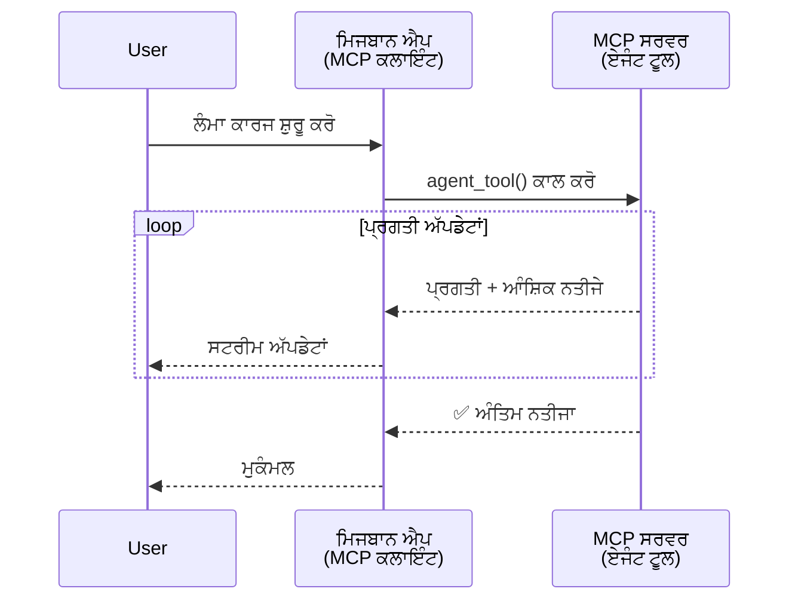
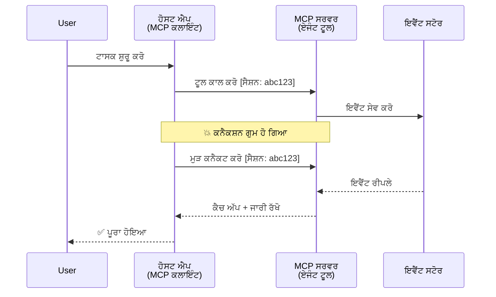
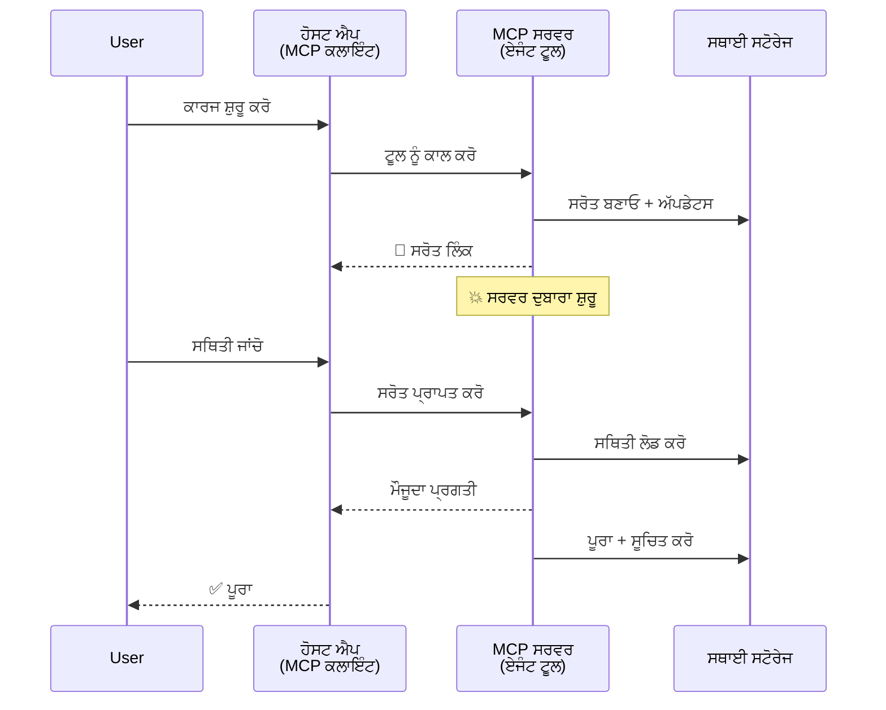
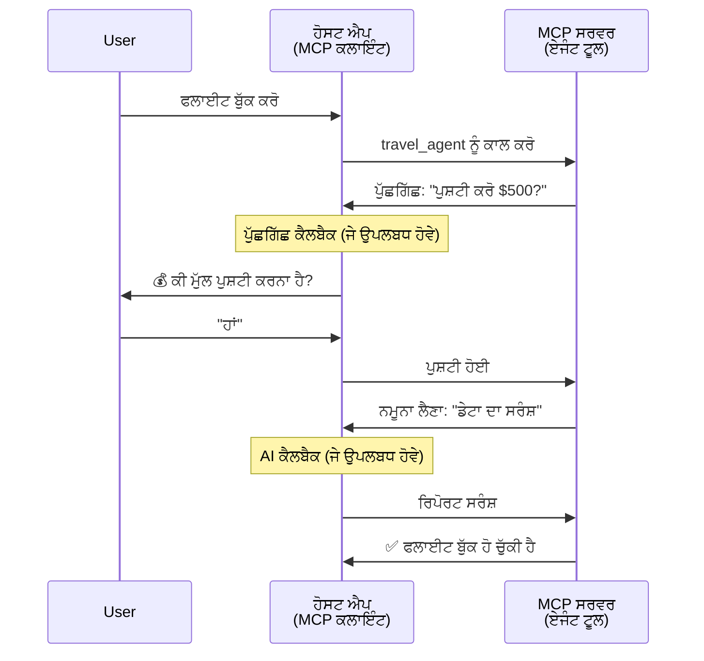
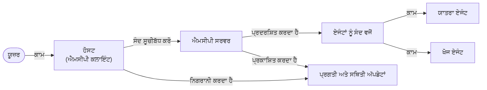

# MCP ਨਾਲ ਏਜੰਟ-ਟੂ-ਏਜੰਟ ਸੰਚਾਰ ਪ੍ਰਣਾਲੀਆਂ ਦਾ ਨਿਰਮਾਣ

> TL;DR - ਕੀ ਤੁਸੀਂ MCP ‘ਤੇ Agent2Agent ਸੰਚਾਰ ਬਣਾ ਸਕਦੇ ਹੋ? ਹਾਂ!

MCP ਆਪਣੇ ਮੂਲ ਉਦੇਸ਼ "LLMs ਨੂੰ ਸੰਦਰਭ ਪ੍ਰਦਾਨ ਕਰਨ" ਤੋਂ ਕਾਫੀ ਅੱਗੇ ਵਧ ਚੁੱਕਾ ਹੈ। ਹਾਲੀਆ ਸੁਧਾਰਾਂ ਵਿਚ [ਰਿਜੂਮੇਬਲ ਸਟਰਿਮਜ਼](https://modelcontextprotocol.io/docs/concepts/transports#resumability-and-redelivery), [ਇਲਿਸਿਟੇਸ਼ਨ](https://modelcontextprotocol.io/specification/2025-06-18/client/elicitation), [ਸੈਂਪਲਿੰਗ](https://modelcontextprotocol.io/specification/2025-06-18/client/sampling), ਅਤੇ ਸੂਚਨਾਵਾਂ ([ਤਰੱਕੀ](https://modelcontextprotocol.io/specification/2025-06-18/basic/utilities/progress) ਅਤੇ [ਸੰਸਾਧਨ](https://modelcontextprotocol.io/specification/2025-06-18/schema#resourceupdatednotification)) ਸ਼ਾਮਲ ਹਨ, MCP ਹੁਣ ਜਟਿਲ ਏਜੰਟ-ਟੂ-ਏਜੰਟ ਸੰਚਾਰ ਪ੍ਰਣਾਲੀਆਂ ਬਨਾਉਣ ਲਈ ਇੱਕ ਮਜ਼ਬੂਤ ਅਧਾਰ ਪ੍ਰਦਾਨ ਕਰਦਾ ਹੈ।

## ਏਜੰਟ/ਟੂਲ ਦੀ ਗਲਤ ਧਾਰਣਾ

ਜਿਵੇਂ ਜਿਆਦਾ ਡਿਵੈਲਪਰ ਏਜੰਟਿਕ ਵਿਹਾਰ ਵਾਲੇ ਟੂਲਜ਼ ਦੀ ਖੋਜ ਕਰਦੇ ਹਨ (ਲੰਮੇ ਸਮੇਂ ਲਈ ਚੱਲਦੇ ਹਨ, ਚਲਾਉਣ ਦੌਰਾਨ ਵਾਧੂ ਇਨਪੁਟ ਦੀ ਲੋੜ ਹੋ ਸਕਦੀ ਹੈ, ਆਦਿ), ਇੱਕ ਆਮ ਗਲਤ ਧਾਰਣਾ ਇਹ ਹੈ ਕਿ MCP ਸਧਾਰਣ ਬੇਨਤੀ-ਪ੍ਰਤੀਕਿਰਿਆ ਪੈਟਰਨ ‘ਤੇ ਧਿਆਨ ਕੇਂਦਰਿਤ ਕਰਨ ਵਾਲੇ ਆਪਣੇ ਪਹਿਲੇ ਸਧਾਰਣ ਟੂਲ ਉਦਾਹਰਣਾਂ ਕਰਕੇ ਅਣੁਕੂਲ ਨਹੀਂ ਹੈ।

ਇਹ ਧਾਰਣਾ ਪੁਰਾਣੀ ਹੋ ਚੁੱਕੀ ਹੈ। MCP ਵਿਸ਼ੇਸ਼ਣ ਪਿਛਲੇ ਕੁਝ ਮਹੀਨਿਆਂ ਵਿੱਚ ਲੰਮੇ ਸਮੇਂ ਲਈ ਚੱਲਣ ਵਾਲੇ ਏਜੰਟਿਕ ਵਿਹਾਰ ਲਈ ਜ਼ਰੂਰੀ ਸਮਰੱਥਾਵਾਂ ਨਾਲ ਵਿਚਾਰਸ਼ੀਲ ਤਰੀਕੇ ਨਾਲ ਬਿਹਤਰ ਬਣਾਈ ਗਈ ਹੈ:

- **ਸਟ੍ਰੀਮਿੰਗ ਅਤੇ ਭਾਗੀ ਨਤੀਜੇ**: ਚਲਾਉਣ ਦੌਰਾਨ ਅਸਲ ਸਮੇਂ ਦੀ ਤਰੱਕੀ ਦੀਆਂ ਜਾਣਕਾਰੀਆਂ
- **ਰਿਜੂਮੇਬਿਲਟੀ**: ਕਲਾਇੰਟ ਬਿਨਾਂ ਰੁਕਾਵਟ ਮੁੜ ਜੁੜ ਕੇ ਜਾਰੀ ਰੱਖ ਸਕਦਾ ਹੈ
- **ਸਥਿਰਤਾ**: ਨਤੀਜੇ ਸਰਵਰ ਰੀਸਟਾਰਟ ਦੇ ਬਾਅਦ ਵੀ ਜਿਊਂਦੇ ਰਹਿੰਦੇ ਹਨ (ਜਿਵੇਂ ਕਿ ਸੰਸਾਧਨ ਲਿੰਕਾਂ ਰਾਹੀਂ)
- **ਮਲਟੀ-ਟਰਨ**: ਇਲਿਸਿਟੇਸ਼ਨ ਅਤੇ ਸੈਂਪਲਿੰਗ ਰਾਹੀਂ ਚਲਾਉਣ ਦੌਰਾਨ ਇਨਪੁਟ ਲਈ ਇੰਟਰਐਕਟਿਵ ਸਮਰੱਥਾਵਾਂ

ਇਹ ਵਿਸ਼ੇਸ਼ਤਾਵਾਂ ਇਕੱਠੀਆਂ ਕਰਕੇ ਸਭ MCP ਪ੍ਰੋਟੋਕੋਲ ਉੱਤੇ ਤੈਅ ਕੀਤੀ ਜਾ ਸਕਣ ਵਾਲੀਆਂ ਜਟਿਲ ਏਜੰਟਿਕ ਅਤੇ ਮਲਟੀ-ਏਜੰਟ ਐਪਲੀਕੇਸ਼ਨਾਂ ਨੂੰ ਸਮਰੱਥ ਬਣਾਇਆ ਜਾ ਸਕਦਾ ਹੈ।

ਸੰਦਰਭ ਲਈ, ਅਸੀਂ ਇੱਕ ਏਜੰਟ ਨੂੰ "ਟੂਲ" ਕਹਾਂਗੇ ਜੋ MCP ਸਰਵਰ ਉੱਤੇ ਉਪਲਬਧ ਹੈ। ਇਸਦਾ ਅਰਥ ਏ ਹੈ ਕਿ ਇੱਕ ਹੋਸਟ ਐਪਲੀਕੇਸ਼ਨ ਮੌਜੂਦ ਹੈ ਜੋ MCP ਕਲਾਇੰਟ ਨੂੰ ਲਾਗੂ ਕਰਦੀ ਹੈ, ਜੋ MCP ਸਰਵਰ ਨਾਲ ਸੈਸ਼ਨ ਸਥਾਪਤ ਕਰਦਾ ਹੈ ਅਤੇ ਏਜੰਟ ਨੂੰ ਕਾਲ ਕਰ ਸਕਦਾ ਹੈ।

## ਕੀ MCP ਟੂਲ ਨੂੰ "ਏਜੰਟਿਕ" ਬਣਾਉਂਦਾ ਹੈ?

ਲਾਗੂ ਕਰਨ ਵਿੱਚ ਡੁੱਬ ਕੇ ਵੇਖਣ ਤੋਂ ਪਹਿਲਾਂ, ਆਓ ਇਹ ਸਥਾਪਿਤ ਕਰੀਏ ਕਿ ਲੰਮੇ-ਚੱਲਦਾ ਏਜੰਟ ਸਹਾਇਤਾ ਕਰਨ ਲਈ ਕਿਹੜੀਆਂ ਬੁਨਿਆਦੀ ਸਮਰੱਥਾਵਾਂ ਚਾਹੀਦੀਆਂ ਹਨ।

> ਅਸੀਂ ਇੱਕ ਏਜੰਟ ਨੂੰ ਉਸ ਇਕਾਈ ਵਜੋਂ ਪਰਿਭਾਸ਼ਿਤ ਕਰਾਂਗੇ ਜੋ ਖੁਦਮੁਖਤਿਆਰ ਤੌਰ 'ਤੇ ਵੇਲੇ ਦੀਆਂ ਲੰਬੀਆਂ ਮਿਆਦਾਂ ਲਈ ਕੰਮ ਕਰ ਸਕਦੀ ਹੈ, ਜੋ ਕਈ ਵਾਰ-ਵਾਰ ਦੀਆਂ ਅੰਤਰਕਿਰਿਆਵਾਂ ਜਾਂ ਅਸਲੀ ਸਮੇਂ ਫੀਡਬੈਕ ਅਨੁਸਾਰ ਢਾਲ ਕਰਨ ਵਾਲੇ ਕੰਮਾਂ ਨੂੰ ਨਿਭਾ ਸਕਦੀ ਹੈ।

### 1. ਸਟਰਿਮਿੰਗ ਅਤੇ ਭਾਗੀ ਨਤੀਜੇ

ਰਵਾਇਤੀ ਬੇਨਤੀ-ਪ੍ਰਤੀਕਿਰਿਆ ਪੈਟਰਨ ਲੰਮੇ ਸਮੇਂ ਵਾਲੇ ਕੰਮਾਂ ਲਈ ਕੰਮ ਨਹੀਂ ਕਰਦੇ। ਏਜੰਟ ਨੂੰ ਇਸ ਦੀ ਲੋੜ ਹੈ:

- ਅਸਲ ਸਮੇਂ ਦੀ ਤਰੱਕੀ ਦੀਆਂ ਜਾਣਕਾਰੀਆਂ
- ਵਿਚਕਾਰਲੇ ਨਤੀਜੇ

**MCP ਸਮਰਥਨ**: ਸੰਸਾਧਨ ਅੱਪਡੇਟ ਸੂਚਨਾਵਾਂ ਭਾਗੀ ਨਤੀਜੇ ਸਟਰਿਮ ਕਰਨ ਯੋਗ ਬਣਾਉਂਦੀਆਂ ਹਨ, ਹਾਲਾਂਕਿ ਇਸ ਲਈ ਧਿਆਨ ਨਾਲ ਡਿਜ਼ਾਈਨ ਕਰਨ ਦੀ ਲੋੜ ਹੈ ਤਾਂ ਜੋ JSON-RPC ਦੇ 1:1 ਬੇਨਤੀ/ਪ੍ਰਤੀਕਿਰਿਆ ਮਾਡਲ ਨਾਲ ਟਕਰਾਅ ਨਾ ਹੋਵੇ।

| ਵਿਸ਼ੇਸ਼ਤਾ                        | ਵਰਤੋਂ ਦਾ ਕੇਸ                                                                                                                                                        | MCP ਸਮਰਥਨ                                                                                |
| ------------------------------ | ----------------------------------------------------------------------------------------------------------------------------------------------------------------- | ------------------------------------------------------------------------------------------ |
| ਅਸਲ ਸਮੇਂ ਤਰੱਕੀ ਅੱਪਡੇਟ          | ਯੂਜ਼ਰ ਇੱਕ ਕੋਡਬੇਸ ਮਾਈਗ੍ਰੇਸ਼ਨ ਕੰਮ ਦੀ ਬੇਨਤੀ ਕਰਦਾ ਹੈ। ਏਜੰਟ ਤਰੱਕੀ ਸਟਰਿਮ ਕਰਦਾ ਹੈ: "10% - ਡਿਪੈਂਡੈਂਸੀਜ਼ ਦਾ ਵਿਸ਼ਲੇਸ਼ਣ... 25% - ਟਾਈਪਸਕ੍ਰਿਪਟ ਫਾਈਲਾਂ ਨੂੰ ਬਦਲ ਰਿਹਾ ਹੈ... 50% - ਇੰਪੋਰਟ ਅੱਪਡੇਟ ਕਰ ਰਿਹਾ ਹੈ..." | ✅ ਤਰੱਕੀ ਸੂਚਨਾਵਾਂ                                                                        |
| ਭਾਗੀ ਨਤੀਜੇ                   | "ਕਿਤਾਬ ਤਿਆਰ ਕਰੋ" ਟਾਸਕ ਭਾਗੀ ਨਤੀਜੇ ਸਟਰਿਮ ਕਰਦਾ ਹੈ, ਮਿਸਾਲ ਵਜੋਂ, 1) ਕਹਾਣੀ ਦੀ ਰੂਪਰੇਖਾ, 2) ਅਧਿਆਇਆਂ ਦੀ ਸੂਚੀ, 3) ਪ੍ਰਤੀ ਅਧਿਆਇ ਪੂਰਾ। ਹੋਸਟ ਕਦੇ ਵੀ ਨਿਗਰਾਨੀ, ਕੈਂਸਲ ਜਾਂ ਰੀਡਾਇਰੈਕਟ ਕਰ ਸਕਦਾ ਹੈ।                | ✅ ਸੂਚਨਾਵਾਂ ਨੂੰ "ਵਧਾਇਆ" ਜਾ ਸਕਦਾ ਹੈ ਤਾਂ ਕਿ ਭਾਗੀ ਨਤੀਜੇ ਸ਼ਾਮਲ ਕੀਤੇ ਜਾ ਸਕਣ, ਵੇਖੋ PR 383, 776 ਬਾਰੇ ਪ੍ਰਸਤਾਵ |

<div align="center" style="font-style: italic; font-size: 0.95em; margin-bottom: 0.5em;">
<strong>ਫਿਗਰ 1:</strong> ਇਹ ਡਾਇਗ੍ਰਾਮ ਦਿਖਾਉਂਦਾ ਹੈ ਕਿ ਜਿਵੇਂ ਇਕ MCP ਏਜੰਟ ਲੰਮੇ ਸਮੇਂ ਵਾਲੀ ਟਾਸਕ ਦੌਰਾਨ ਹੋਸਟ ਐਪਲੀਕੇਸ਼ਨ ਨੂੰ ਅਸਲ ਸਮੇਂ ਦੀ ਤਰੱਕੀ ਅਤੇ ਭਾਗੀ ਨਤੀਜੇ ਸਟਰਿਮ ਕਰਦਾ ਹੈ, ਇਸ ਨਾਲ ਯੂਜ਼ਰ ਨੂੰ ਅਸਲੀ ਸਮੇਂ ਵਿੱਚ ਕਾਰਜ ਦੀ ਨਿਗਰਾਨੀ ਕਰਨ ਦੀ ਸਹੂਲਤ ਮਿਲਦੀ ਹੈ।
</div>



### 2. ਰਿਜੂਮੇਬਿਲਟੀ

ਏਜੰਟਾਂ ਨੂੰ ਨੈੱਟਵਰਕ ਵਿੱਚ ਵਿਚਕਾਰਲੀ ਰੁਕਾਵਟਾਂ ਨੂੰ ਸੁਚੱਜੇ ਢੰਗ ਨਾਲ ਸਮਭਾਲਣਾ ਚਾਹੀਦਾ ਹੈ:

- (ਕਲਾਇੰਟ) ਕਨੈਕਸ਼ਨ ਟੁੱਟਣ ਤੋਂ ਬਾਦ ਮੁੜ ਜੁੜਨਾ
- ਜਿੱਥੇ ਛੱਡਿਆ ਸੀ ਉਥੋਂ ਜਾਰੀ ਰੱਖਣਾ (ਸੁਨੇਹਿਆਂ ਦੀ ਦੁਬਾਰਾ ਡਿਲਿਵਰੀ)

**MCP ਸਮਰਥਨ**: MCP StreamableHTTP ਟਰਾਂਸਪੋਰਟ ਅੱਜ ਸੈਸ਼ਨ ਰਿਜੂਮਸ਼ਨ ਅਤੇ ਸੁਨੇਹੇ ਦੀ ਦੋਹਰਾਈ ਲਈ ਸੈਸ਼ਨ IDਆਂ ਅਤੇ ਆਖਰੀ ਘਟਨਾ IDਆਂ ਨਾਲ ਸਹਾਇਕ ਹੈ। ਬਹੁਤ ਜ਼ਰੂਰੀ ਗੱਲ ਇਹ ਹੈ ਕਿ ਸਰਵਰ ਨੂੰ ਇੱਕ ਇਵੈਂਟਸਟੋਰ ਲਾਗੂ ਕਰਨਾ ਚਾਹੀਦਾ ਹੈ ਜੋ ਕਲਾਇੰਟ ਦੀ ਮੁੜ ਜੁੜਾਈ 'ਤੇ ਘਟਨਾ ਰੀਪਲੇ ਨੂੰ ਸਹਾਇਤਾ ਕਰਦਾ ਹੋਵੇ।  
ਇੱਕ ਕਮੇਊਨਿਟੀ ਸੁਝਾਅ (PR #975) ਵੀ ਹੈ ਜੋ ਟਰਾਂਸਪੋਰਟ-ਅਗਨੋਸਟਿਕ ਰਿਜੂਮੇਬਲ ਸਟਰਿਮਜ਼ ਦੀ ਜਾਂਚ ਕਰਦਾ ਹੈ।

| ਵਿਸ਼ੇਸ਼ਤਾ    | ਵਰਤੋਂ ਦਾ ਕੇਸ                                                                                                                                               | MCP ਸਮਰਥਨ                                                                |
| ------------ | ---------------------------------------------------------------------------------------------------------------------------------------------------------- | -------------------------------------------------------------------------- |
| ਰਿਜੂਮੇਬਿਲਟੀ | ਲੰਮੇ ਸਮੇਂ ਚੱਲ ਰਹੇ ਕਾਰਜ ਦੌਰਾਨ ਕਲਾਇੰਟ ਕਨੈਕਸ਼ਨ ਟੁੱਟ ਜਾਂਦਾ ਹੈ। ਮੁੜ ਜੁੜਨ 'ਤੇ, ਸੈਸ਼ਨ ਰੀਪਲੇ ਕੀਤੀਆਂ ਘਟਨਾਵਾਂ ਨਾਲ ਜਾਰੀ ਰਹਿੰਦੀ ਹੈ, ਬਿਨਾਂ ਰੁਕੇ ਕੰਮ ਜਾਰੀ ਰਹਿੰਦਾ ਹੈ।               | ✅ StreamableHTTP ਟਰਾਂਸਪੋਰਟ ਸੈਸ਼ਨ IDਆਂ, ਘਟਨਾ ਰੀਪਲੇ ਅਤੇ EventStore ਨਾਲ          |

<div align="center" style="font-style: italic; font-size: 0.95em; margin-bottom: 0.5em;">
<strong>ਫਿਗਰ 2:</strong> ਇਹ ਡਾਇਗ੍ਰਾਮ ਦਿਖਾਉਂਦਾ ਹੈ ਕਿ ਕਿਵੇਂ MCP ਦਾ StreamableHTTP ਟਰਾਂਸਪੋਰਟ ਅਤੇ ਇਵੈਂਟ ਸਟੋਰ ਸੈਸ਼ਨ ਰੀਜੂਮਸ਼ਨ ਨੂੰ ਸੁਚੱਜੇ ਢੰਗ ਨਾਲ ਸੰਭालਦੇ ਹਨ: ਜੇ ਕਲਾਇੰਟ ਦਾ ਕਨੈਕਸ਼ਨ ਟੁੱਟਦਾ ਹੈ, ਤਾਂ ਉਹ ਮੁੜ ਜੁੜ ਸਕਦਾ ਹੈ ਅਤੇ ਛੁੱਟੀਆਂ ਘਟਨਾਵਾਂ ਨੂੰ ਰੀਪਲੇ ਕਰ ਸਕਦਾ ਹੈ, ਇਸ ਤਰ੍ਹਾਂ ਕੰਮ ਟੁੱਟੇ ਬਿਨਾਂ ਜਾਰੀ ਰਹਿੰਦਾ ਹੈ।
</div>



### 3. ਸਥਿਰਤਾ

ਲੰਮੇ ਸਮੇਂ ਚੱਲਣ ਵਾਲੇ ਏਜੰਟਾਂ ਨੂੰ ਸਥਾਈ ਸਥਿਤੀ ਦੀ ਲੋੜ ਹੁੰਦੀ ਹੈ:

- ਨਤੀਜੇ ਸਰਵਰ ਰੀਸਟਾਰਟਾਂ ਤੋਂ ਬਾਅਦ ਵੀ ਬਚੇ ਰਹਿੰਦے ਹਨ
- ਸਥਿਤੀ ਆਉਟ-ਆਫ-ਬੈਂਡ ਪ੍ਰਾਪਤ ਕੀਤੀ ਜਾ ਸਕਦੀ ਹੈ
- ਸੈਸ਼ਨਾਂ ਵਿਚਕਾਰ ਤਰੱਕੀ ਦੀ ਟ੍ਰੈਕਿੰਗ

**MCP ਸਮਰਥਨ**: MCP ਹੁਣ ਟੂਲ ਕਾਲਾਂ ਲਈ ਰਿਸੋਰਸ ਲਿੰਕ ਰਿਟਰਨ ਟਾਈਪ ਦਾ ਸਮਰਥਨ ਕਰਦਾ ਹੈ। ਹਾਲ ਵਿੱਚ ਇੱਕ ਸੰਭਵ ਪੈਟਰਨ ਇਹ ਹੈ ਕਿ ਟੂਲ ਇੱਕ ਰੁਸੋਰਸ ਤਿਆਰ ਕਰੇ ਅਤੇ ਤੁਰੰਤ ਇੱਕ ਰਿਸੋਰਸ ਲਿੰਕ ਵਾਪਸ ਭੇਜੇ। ਟੂਲ ਬੈਕਗ੍ਰਾਊਂਡ ਵਿੱਚ ਕੰਮ ਨੂੰ ਜਾਰੀ ਰੱਖ ਸਕਦਾ ਹੈ ਅਤੇ ਰਿਸੋਰਸ ਨੂੰ ਅੱਪਡੇਟ ਕਰ ਸਕਦਾ ਹੈ। ਇਸਦੇ ਬਦਲੇ ਵਿੱਚ, ਕਲਾਇੰਟ ਇਸ ਰਿਸੋਰਸ ਦੀ ਸਥਿਤੀ ਨੂੰ ਪੋੱਲ ਕਰ ਸਕਦਾ ਹੈ ਭਾਗੀ ਜਾਂ ਪੂਰੇ ਨਤੀਜੇ ਹਾਸਲ ਕਰਨ ਲਈ (ਜਿਵੇਂ ਕਿ ਸਰਵਰ ਰਿਸੋਰਸ ਅੱਪਡੇਟ ਦਿੰਦਾ ਹੈ) ਜਾਂ ਅੱਪਡੇਟ ਸੂਚਨਾਵਾਂ ਲਈ ਇਸਦੇ ਸਬਸਕ੍ਰਾਈਬਰ ਹੋ ਸਕਦਾ ਹੈ।

ਇੱਥੇ ਇੱਕ ਸੀਮਾ ਇਹ ਹੈ ਕਿ ਰਿਸੋਰਸ ਪੋੱਲਿੰਗ ਜਾਂ ਅੱਪਡੇਟ ਲਈ ਸਬਸਕ੍ਰਿਪਸ਼ਨ ਵਿਸ਼ਾਲ ਮਾਤਰਾ ਵਿੱਚ ਰਿਸੋਰਸ ਖਰਚ ਕਰ ਸਕਦਾ ਹੈ। ਇਸ ਬਾਰੇ ਇੱਕ ਖੁੱਲ੍ਹਾ ਕਮੇਊਨਿਟੀ ਸੁਝਾਅ (#992 ਸਮੇਤ) ਹੈ ਜੋ ਵੈਬਹੁਕਸ ਜਾਂ ਟ੍ਰਿਗਰਾਂ ਦੇ ਸ਼ਾਮਲ ਹੋਣ ਦੀ ਸੰਭਾਵਨਾ ਦੀ ਜਾਂਚ ਕਰਦਾ ਹੈ, ਜਿਹੜੇ ਸਰਵਰ ਵੱਲੋਂ ਕਲਾਇੰਟ/ਹੋਸਟ ਐਪ ਨੂੰ ਅੱਪਡੇਟ ਜਾਣੂ ਕਰਵਾਉਣ ਲਈ ਕਾਲ ਕੀਤੇ ਜਾਣ।

| ਵਿਸ਼ੇਸ਼ਤਾ     | ਵਰਤੋਂ ਦਾ ਕੇਸ                                                                                                                                            | MCP ਸਮਰਥਨ                                                        |
| ---------- | --------------------------------------------------------------------------------------------------------------------------------------------------------- | ------------------------------------------------------------------ |
| ਸਥਿਰਤਾ     | ਡੇਟਾ ਮਾਈਗ੍ਰੇਸ਼ਨ ਟਾਸਕ ਦੌਰਾਨ ਸਰਵਰ ਕਰੈਸ਼। ਨਤੀਜੇ ਅਤੇ ਤਰੱਕੀ ਰੀਸਟਾਰਟ ਤੋਂ ਬਾਅਦ ਵੀ ਬਚੇ ਰਹਿੰਦੇ ਹਨ, ਕਲਾਇੰਟ ਸਥਿਤੀ ਜਾਂਚ ਸਕਦਾ ਹੈ ਅਤੇ ਸਥਾਈ ਰਿਸੋਰਸ ਤੋਂ ਜਾਰੀ ਰੱਖ ਸਕਦਾ ਹੈ।                      | ✅ ਰਿਸੋਰਸ ਲਿੰਕ ਸਥਾਈ ਸੰਗ੍ਰਹਿ ਅਤੇ ਸਥਿਤੀ ਸੂਚਨਾਵਾਂ ਨਾਲ                     |

ਅੱਜ, ਇੱਕ ਆਮ ਪੈਟਰਨ ਇਹ ਹੈ ਕਿ ਟੂਲ ਇੱਕ ਰਿਸੋਰਸ ਤਿਆਰ ਕਰਦਾ ਹੈ ਅਤੇ ਤੁਰੰਤ ਇੱਕ ਰਿਸੋਰਸ ਲਿੰਕ ਵਾਪਸ ਕਰਦਾ ਹੈ। ਟੂਲ ਬੈਕਗ੍ਰਾਊਂਡ ਵਿੱਚ ਟਾਸਕ ਦਾ ਸਮਾਧਾਨ ਕਰਦਾ ਹੈ, ਰਿਸੋਰਸ ਨੋਟੀਫਿਕੇਸ਼ਨਾਂ ਜਾਰੀ ਕਰਦਾ ਹੈ ਜੋ ਤਰੱਕੀ ਅੱਪਡੇਟ ਜਾਂ ਭਾਗੀ ਨਤੀਜੇ ਸ਼ਾਮਲ ਕਰ ਸਕਦੀਆਂ ਹਨ, ਅਤੇ ਲੋੜ ਅਨੁਸਾਰ ਰਿਸੋਰਸ ਦੇ ਸਮੱਗਰੀ ਨੂੰ ਅੱਪਡੇਟ ਕਰਦਾ ਹੈ।

<div align="center" style="font-style: italic; font-size: 0.95em; margin-bottom: 0.5em;">
<strong>ਫਿਗਰ 3:</strong> ਇਹ ਡਾਇਗ੍ਰਾਮ ਦਿਖਾਉਂਦਾ ਹੈ ਕਿ ਕਿਵੇਂ MCP ਏਜੰਟ ਲੰਮੇ ਸਮੇਂ ਚੱਲਣ ਵਾਲੀਆਂ ਟਾਸਕਾਂ ਨੂੰ ਸਰਵਰ ਰੀਸਟਾਰਟਾਂ ਤੋਂ ਬਾਅਦ ਵੀ ਜਿਊਂਦੇ ਰੱਖਣ ਲਈ ਸਥਾਈ ਰਿਸੋਰਸ ਅਤੇ ਸਥਿਤੀ ਸੂਚਨਾਵਾਂ ਦੀ ਵਰਤੋਂ ਕਰਦੇ ਹਨ, ਜਿਸ ਨਾਲ ਕਲਾਇੰਟ ਤਰੱਕੀ ਦੀ ਜਾਂਚ ਅਤੇ ਨਤੀਜੇ ਪ੍ਰਾਪਤ ਕਰ ਸਕਦੇ ਹਨ ਭਾਵੇਂ ਤੋਂੜਫੜ ਹੋਵੇ।
</div>



### 4. ਮਲਟੀ-ਟਰਨ ਇੰਟਰਐਕਸ਼ਨ

ਏਜੰਟਾਂ ਨੂੰ ਅਕਸਰ ਚਲਾਉਣ ਦੌਰਾਨ ਵਾਧੂ ਇਨਪੁਟ ਦੀ ਲੋੜ ਹੁੰਦੀ ਹੈ:

- ਮਨੁੱਖੀ ਸਪਸ਼ਟੀਕਰਨ ਜਾਂ ਮਨਜ਼ੂਰੀ
- ਜਟਿਲ ਫੈਸਲਿਆਂ ਲਈ AI ਸਹਾਇਤਾ
- ਗਤੀਸ਼ੀਲ ਪੈਰਾਮੀਟਰ ਸਮਜ਼ੋਟਾ

**MCP ਸਮਰਥਨ**: ਸੈਂਪਲਿੰਗ (AI ਇਨਪੁਟ ਲਈ) ਅਤੇ ਇਲਿਸਿਟੇਸ਼ਨ (ਮਨੁੱਖੀ ਇਨਪੁਟ ਲਈ) ਰਾਹੀਂ ਪੂਰੀ ਤਰ੍ਹਾਂ ਸਮਰਥਿਤ।

| ਵਿਸ਼ੇਸ਼ਤਾ                | ਵਰਤੋਂ ਦਾ ਕੇਸ                                                                                                                                                  | MCP ਸਮਰਥਨ                                            |
| ---------------------- | ------------------------------------------------------------------------------------------------------------------------------------------------------------- | ---------------------------------------------------- |
| ਮਲਟੀ-ਟਰਨ ਇੰਟਰਐਕਸ਼ਨ    | ਟਰੈਵਲ ਬੁਕਿੰਗ ਏਜੰਟ ਯੂਜ਼ਰ ਤੋਂ ਕੀਮਤ ਦੀ ਪੁਸ਼ਟੀ ਮੰਗਦਾ ਹੈ, ਫਿਰ ਬੁਕਿੰਗ ਪੂਰੀ ਕਰਨ ਤੋਂ ਪਹਿਲਾਂ ਯਾਤਰਾ ਡੇਟਾ ਦਾ AI ਦੁਆਰਾ ਸਾਰ ਸੰਖੇਪ ਕਰਵਾਉਂਦਾ ਹੈ।                                         | ✅ ਮਨੁੱਖੀ ਇਨਪੁਟ ਲਈ ਇਲਿਸਿਟੇਸ਼ਨ, AI ਇਨਪੁਟ ਲਈ ਸੈਂਪਲਿੰਗ |

<div align="center" style="font-style: italic; font-size: 0.95em; margin-bottom: 0.5em;">
<strong>ਫਿਗਰ 4:</strong> ਇਹ ਡਾਇਗ੍ਰਾਮ ਦਿਖਾਉਂਦਾ ਹੈ ਕਿ ਕਿਵੇਂ MCP ਏਜੰਟ ਇਲਿਸਿਟੇਸ਼ਨ ਰਾਹੀਂ ਮਨੁੱਖੀ ਇਨਪੁਟ ਲੈ ਸਕਦੇ ਹਨ ਜਾਂ ਚਲਾਉਣ ਦੌਰਾਨ AI ਸਹਾਇਤਾ ਲਈ ਬੇਨਤੀ ਕਰ ਸਕਦੇ ਹਨ, ਅਤੇ ਸੰਕੁਚਿਤ, ਮਲਟੀ-ਟਰਨ ਵਰਕਫਲੋਜ਼ ਜਿਵੇਂ ਪੁਸ਼ਟੀਆਂ ਅਤੇ ਗਤੀਸ਼ੀਲ ਫੈਸਲਾ ਗ੍ਰਹਿਣ ਵਿੱਚ ਸਮਰਥਨ ਕਰਦੇ ਹਨ।
</div>



## MCP ‘ਤੇ ਲੰਮੇ ਸਮੇਂ ਚੱਲਣ ਵਾਲੇ ਏਜੰਟਾਂ ਨੂੰ ਲਾਗੂ ਕਰਨਾ - ਕੋਡ ਦਾ ਝਲਕ

ਇਸ ਲੇਖ ਦੇ ਹਿੱਸੇ ਵਜੋਂ, ਅਸੀਂ ਇੱਕ [ਕੋਡ ਭੰਡਾਰ](https://github.com/victordibia/ai-tutorials/tree/main/MCP%20Agents) ਪ੍ਰਦਾਨ ਕਰਦੇ ਹਾਂ ਜੋ MCP Python SDK ਨਾਲ ਸੈਸ਼ਨ ਰਿਜੂਮੇਸ਼ਨ ਅਤੇ ਸੁਨੇਹਿਆਂ ਦੀ ਦੁਬਾਰਾ ਡਿਲਿਵਰੀ ਲਈ StreamableHTTP ਟਰਾਂਸਪੋਰਟ ਦੀ ਵਰਤੋਂ ਕਰਕੇ ਲੰਮੇ ਚੱਲਣ ਵਾਲੇ ਏਜੰਟਾਂ ਦੀ ਪੂਰੀ ਲਾਗੂਆਤ ਦਰਸਾਉਂਦਾ ਹੈ। ਲਾਗੂਆਤ ਦਿਖਾਉਂਦੀ ਹੈ ਕਿ MCP ਸਮਰੱਥਾਵਾਂ ਨੂੰ ਇਕੱਠਾ ਕਰ ਕੇ ਸੁਧਰੇ ਏਜੰਟ ਵਰਗੇ ਵਿਹਾਰ ਲਾਗੂ ਕੀਤੇ ਜਾ ਸਕਦੇ ਹਨ।

ਖਾਸ ਤੌਰ ‘ਤੇ, ਅਸੀਂ ਦੋ ਪ੍ਰਮੁੱਖ ਏਜੰਟ ਟੂਲਜ਼ ਵਾਲਾ ਸਰਵਰ ਲਾਗੂ ਕਰਦੇ ਹਾਂ:

- **ਟਰੈਵਲ ਏਜੰਟ** - ਇਲਿਸਿਟੇਸ਼ਨ ਰਾਹੀਂ ਕੀਮਤ ਪੁਸ਼ਟੀ ਸਹਿਤ ਯਾਤਰਾ ਬੁਕਿੰਗ ਸੇਵਾ ਦਾ ਅਨੁਕਰਨ
- **ਰਿਸਰਚ ਏਜੰਟ** - ਸੈਂਪਲਿੰਗ ਰਾਹੀਂ AI-ਸਹਾਇਤਾ ਸਾਰ ਸੰक्षੇਪ ਦੇ ਨਾਲ ਖੋਜ ਕਾਰਜ ਕਰਦਾ ਹੈ

ਦੋਵੇਂ ਏਜੰਟ ਅਸਲ ਸਮੇਂ ਤਰੱਕੀ ਦੀਆਂ ਜਾਣਕਾਰੀਆਂ, ਇੰਟਰਐਕਟਿਵ ਪੁਸ਼ਟੀਆਂ ਅਤੇ ਪੂਰੀ ਸੈਸ਼ਨ ਰਿਜੂਮੇਸ਼ਨ ਸਮਰੱਥਾਵਾਂ ਨੂੰ ਦਰਸਾਉਂਦੇ ਹਨ।

### ਮੁੱਖ ਲਾਗੂਆਤੀ ਧਾਰਣਾ

ਹੇਠ ਲਿਖੇ ਭਾਗ ਹਰ ਸਮਰੱਥਾ ਲਈ ਸਰਵਰ-ਪਾਸੇ ਏਜੰਟ ਲਾਗੂਆਤ ਅਤੇ ਕਲਾਇੰਟ-ਪਾਸੇ ਹੋਸਟ ਪ੍ਰਬੰਧਨ ਦਰਸਾਉਂਦੇ ਹਨ:

#### ਸਟਰਿਮਿੰਗ ਅਤੇ ਤਰੱਕੀ ਅੱਪਡੇਟ - ਅਸਲ ਸਮੇਂ ਟਾਸਕ ਸਥਿਤੀ

ਸਟਰਿਮਿੰਗ ਏਜੰਟਾਂ ਨੂੰ ਲੰਮੇ ਚਲਦੇ ਕੰਮਾਂ ਦੌਰਾਨ ਅਸਲ ਸਮੇਂ ਤਰੱਕੀ ਦੀਆਂ ਜਾਣਕਾਰੀਆਂ ਦੇਣ ਦੀ ਯੋਗਤਾ ਦਿੰਦੀ ਹੈ, ਜਿਸ ਨਾਲ ਯੂਜ਼ਰ ਟਾਸਕ ਦੀ ਸਥਿਤੀ ਅਤੇ ਵਿਚਕਾਰਲੇ ਨਤੀਜੇ ਦੇ ਬਾਰੇ ਜਾਣੂ ਰਹਿੰਦਾ ਹੈ।

**ਸਰਵਰ ਲਾਗੂਆਤ (ਏਜੰਟ ਤਰੱਕੀ ਸੂਚਨਾਵਾਂ ਭੇਜਦਾ ਹੈ):**

```python
# ਸਰਵਰ/server.py ਤੋਂ - ਯਾਤਰਾ ਏਜੰਟ ਪ੍ਰਗਤੀ ਅੱਪਡੇਟ ਭੇਜ ਰਿਹਾ ਹੈ
for i, step in enumerate(steps):
    await ctx.session.send_progress_notification(
        progress_token=ctx.request_id,
        progress=i * 25,
        total=100,
        message=step,
        related_request_id=str(ctx.request_id)
    )
    await anyio.sleep(2)  # ਕੰਮ ਦਾ ਅਨੁਕਰਨ ਕਰੋ

# ਵਿਕਲਪ: ਵਿਸਥਾਰ ਵਿੱਚ ਕਦਮ-ਦਰ-ਕਦਮ ਅੱਪਡੇਟਾਂ ਲਈ ਲੌਗ ਸੁਨੇਹੇ
await ctx.session.send_log_message(
    level="info",
    data=f"Processing step {current_step}/{steps} ({progress_percent}%)",
    logger="long_running_agent",
    related_request_id=ctx.request_id,
)
```

**ਕਲਾਇੰਟ ਲਾਗੂਆਤ (ਹੋਸਟ ਤਰੱਕੀ ਅੱਪਡੇਟ ਪ੍ਰਾਪਤ ਕਰਦਾ ਹੈ):**

```python
# client/client.py ਤੋਂ - ਕਲਾਇੰਟ ਅਸਲ ਸਮੇਂ ਦੀਆਂ ਸੂਚਨਾਵਾਂ ਨੂੰ ਸੰਭਾਲਦਾ ਹੈ
async def message_handler(message) -> None:
    if isinstance(message, types.ServerNotification):
        if isinstance(message.root, types.LoggingMessageNotification):
            console.print(f"📡 [dim]{message.root.params.data}[/dim]")
        elif isinstance(message.root, types.ProgressNotification):
            progress = message.root.params
            console.print(f"🔄 [yellow]{progress.message} ({progress.progress}/{progress.total})[/yellow]")

# ਸੈਸ਼ਨ ਬਣਾਉਂਦੇ ਸਮੇਂ ਸੁਨੇਹਾ ਹੈਂਡਲਰ ਰਜਿਸਟਰ ਕਰੋ
async with ClientSession(
    read_stream, write_stream,
    message_handler=message_handler
) as session:
```

#### ਇਲਿਸਿਟੇਸ਼ਨ - ਯੂਜ਼ਰ ਇਨਪੁਟ ਦੀ ਬੇਨਤੀ

ਇਲਿਸਿਟੇਸ਼ਨ ਏਜੰਟਾਂ ਨੂੰ ਚਲਾਉਣ ਦੌਰਾਨ ਯੂਜ਼ਰ ਇਨਪੁਟ ਮੰਗਣ ਦੀ ਯੋਗਤਾ ਦਿੰਦਾ ਹੈ। ਇਹ ਪੁਸ਼ਟੀਆਂ, ਸਪਸ਼ਟੀਕਰਨ ਜਾਂ ਮਨਜ਼ੂਰੀਆਂ ਲਈ ਜ਼ਰੂਰੀ ਹੈ।

**ਸਰਵਰ ਲਾਗੂਆਤ (ਏਜੰਟ ਪੁਸ਼ਟੀ ਮੰਗਦਾ ਹੈ):**

```python
# ਸਰਵਰ/server.py ਤੋਂ - ਯਾਤਰਾ ਏਜੰਟ ਕੀਮਤ ਪੁਸ਼ਟੀ ਦੀ ਬੇਨਤੀ ਕਰ ਰਿਹਾ ਹੈ
elicit_result = await ctx.session.elicit(
    message=f"Please confirm the estimated price of $1200 for your trip to {destination}",
    requestedSchema=PriceConfirmationSchema.model_json_schema(),
    related_request_id=ctx.request_id,
)

if elicit_result and elicit_result.action == "accept":
    # ਬੁਕਿੰਗ ਨਾਲ ਜਾਰੀ ਰੱਖੋ
    logger.info(f"User confirmed price: {elicit_result.content}")
elif elicit_result and elicit_result.action == "decline":
    # ਬੁਕਿੰਗ ਰੱਦ ਕਰੋ
    booking_cancelled = True
```

**ਕਲਾਇੰਟ ਲਾਗੂਆਤ (ਹੋਸਟ ਇਲਿਸਿਟੇਸ਼ਨ ਕਾਲਬੈਕ ਪ੍ਰਦਾਨ ਕਰਦਾ ਹੈ):**

```python
# client/client.py ਤੋਂ - ਕਲਾਇੰਟ ਇਲਿਸਿਟੇਸ਼ਨ ਬੇਨਤੀਆਂ ਨੂੰ ਸੰਭਾਲਦਾ ਹੈ
async def elicitation_callback(context, params):
    console.print(f"💬 Server is asking for confirmation:")
    console.print(f"   {params.message}")

    response = console.input("Do you accept? (y/n): ").strip().lower()

    if response in ['y', 'yes']:
        return types.ElicitResult(
            action="accept",
            content={"confirm": True, "notes": "Confirmed by user"}
        )
    else:
        return types.ElicitResult(
            action="decline",
            content={"confirm": False, "notes": "Declined by user"}
        )

# ਸੈਸ਼ਨ ਬਣਾਉਂਦੇ ਸਮੇਂ ਕਾਲਬੈਕ ਦਰਜ ਕਰੋ
async with ClientSession(
    read_stream, write_stream,
    elicitation_callback=elicitation_callback
) as session:
```

#### ਸੈਂਪਲਿੰਗ - AI ਸਹਾਇਤਾ ਦੀ ਬੇਨਤੀ

ਸੈਂਪਲਿੰਗ ਏਜੰਟਾਂ ਨੂੰ ਚਲਾਉਣ ਦੌਰਾਨ ਪ੍ਰਤਿਬੰਧਿਤ ਫੈਸਲਿਆਂ ਜਾਂ ਸਮੱਗਰੀ ਨਿਰਮਾਣ ਲਈ LLM ਸਹਾਇਤਾ ਮੰਗਣ ਦੀ ਯੋਗਤਾ ਦਿੰਦਾ ਹੈ। ਇਹ ਹਾਈਬ੍ਰਿਡ ਮਨੁੱਖੀ-AI ਵਰਕਫਲੋਜ਼ ਯੋਗ ਕਰਦਾ ਹੈ।

**ਸਰਵਰ ਲਾਗੂਆਤ (ਏਜੰਟ AI ਸਹਾਇਤਾ ਮੰਗਦਾ ਹੈ):**

```python
# ਸਰਵਰ/server.py ਤੋਂ - ਖੋਜ ਏਜੰਟ AI ਸਾਰਾਂਸ਼ ਦੀ ਬੇਨਤੀ ਕਰ ਰਿਹਾ ਹੈ
sampling_result = await ctx.session.create_message(
    messages=[
        SamplingMessage(
            role="user",
            content=TextContent(type="text", text=f"Please summarize the key findings for research on: {topic}")
        )
    ],
    max_tokens=100,
    related_request_id=ctx.request_id,
)

if sampling_result and sampling_result.content:
    if sampling_result.content.type == "text":
        sampling_summary = sampling_result.content.text
        logger.info(f"Received sampling summary: {sampling_summary}")
```

**ਕਲਾਇੰਟ ਲਾਗੂਆਤ (ਹੋਸਟ ਸੈਂਪਲਿੰਗ ਕਾਲਬੈਕ ਪ੍ਰਦਾਨ ਕਰਦਾ ਹੈ):**

```python
# client/client.py ਤੋਂ - ਕਲਾਇੰਟ ਸੈਂਪਲਿੰਗ ਬੇਨਤੀਆਂ ਨੂੰ ਸੰਭਾਲ ਰਿਹਾ ਹੈ
async def sampling_callback(context, params):
    message_text = params.messages[0].content.text if params.messages else 'No message'
    console.print(f"🧠 Server requested sampling: {message_text}")

    # ਇੱਕ ਅਸਲੀ ਐਪਲੀਕੇਸ਼ਨ ਵਿੱਚ, ਇਹ ਇੱਕ LLM API ਨੂੰ ਕਾਲ ਕਰ ਸਕਦਾ ਹੈ
    # ਡੈਮੋ ਲਈ, ਅਸੀਂ ਇੱਕ ਮੌਕ ਜਵਾਬ ਪ੍ਰਦਾਨ ਕਰਦੇ ਹਾਂ
    mock_response = "Based on current research, MCP has evolved significantly..."

    return types.CreateMessageResult(
        role="assistant",
        content=types.TextContent(type="text", text=mock_response),
        model="interactive-client",
        stopReason="endTurn"
    )

# ਸੈਸ਼ਨ ਬਣਾਉਂਦੇ ਸਮੇਂ ਕਾਲਬੈਕ ਨੂੰ ਰਜਿਸਟਰ ਕਰੋ
async with ClientSession(
    read_stream, write_stream,
    sampling_callback=sampling_callback,
    elicitation_callback=elicitation_callback
) as session:
```

#### ਰਿਜੂਮੇਬਿਲਟੀ - ਕਨੈਕਸ਼ਨ ਟੁੱਟਣ ਤੋਂ ਬਾਅਦ ਸੈਸ਼ਨ ਦੀ ਲਗਾਤਾਰਤਾ

ਰਿਜੂਮੇਬਿਲਟੀ ਇਹ ਸੁਨਿਸ਼ਚਿਤ ਕਰਦੀ ਹੈ ਕਿ ਲੰਮੇ ਸਮੇਂ ਚੱਲ ਰਹੇ ਏਜੰਟ ਕਾਰਜ ਕਲਾਇੰਟ ਕਨੈਕਸ਼ਨ ਟੁੱਟਣ ਤੋਂ ਬਾਅਦ ਵੀ ਜਯੂਂਦਾ ਰਹਿੰਦਾ ਹੈ ਅਤੇ ਮੁੜ ਜੁੜਨ ਤੇ ਬਿਨਾਂ ਕਿਸੇ ਰੁਕਾਵਟ ਦੇ ਜਾਰੀ ਰਹਿੰਦਾ ਹੈ। ਇਹ ਇਵੈਂਟ ਸਟੋਰ ਅਤੇ ਰਿਜੂਮਸ਼ਨ ਟੋਕਨਾਂ ਰਾਹੀਂ ਲਾਗੂ ਕੀਤਾ ਜਾਂਦਾ ਹੈ।

**ਇਵੈਂਟ ਸਟੋਰ ਲਾਗੂਆਤ (ਸਰਵਰ ਸੈਸ਼ਨ ਸਥਿਤੀ ਰੱਖਦਾ ਹੈ):**

```python
# ਸਰਵਰ/event_store.py ਤੋਂ - ਸਧਾਰਣ ਇਨ-ਮੇਮੋਰੀ ਇਵੈਂਟ ਸਟੋਰ
class SimpleEventStore(EventStore):
    def __init__(self):
        self._events: list[tuple[StreamId, EventId, JSONRPCMessage]] = []
        self._event_id_counter = 0

    async def store_event(self, stream_id: StreamId, message: JSONRPCMessage) -> EventId:
        """Store an event and return its ID."""
        self._event_id_counter += 1
        event_id = str(self._event_id_counter)
        self._events.append((stream_id, event_id, message))
        return event_id

    async def replay_events_after(self, last_event_id: EventId, send_callback: EventCallback) -> StreamId | None:
        """Replay events after the specified ID for resumption."""
        # ਆਖਰੀ ਜਾਣੇ ਪਹਿਚਾਣ ਵਾਲੇ ਇਵੈਂਟ ਤੋਂ ਬਾਅਦ ਇਵੈਂਟ ਲੱਭੋ ਅਤੇ ਉਨ੍ਹਾਂ ਨੂੰ ਦੁਹਰਾਓ
        for _, event_id, message in self._events[start_index:]:
            await send_callback(EventMessage(message, event_id))

# ਸਰਵਰ/server.py ਤੋਂ - ਸੈਸ਼ਨ ਮੈਨੇਜਰ ਲਈ ਇਵੈਂਟ ਸਟੋਰ ਪਾਸ ਕਰਨਾ
def create_server_app(event_store: Optional[EventStore] = None) -> Starlette:
    server = ResumableServer()

    # ਮੁੜ ਸ਼ੁਰੂਆਤ ਲਈ ਇਵੈਂਟ ਸਟੋਰ ਨਾਲ ਸੈਸ਼ਨ ਮੈਨੇਜਰ ਬਣਾਓ
    session_manager = StreamableHTTPSessionManager(
        app=server,
        event_store=event_store,  # ਇਵੈਂਟ ਸਟੋਰ ਸੈਸ਼ਨ ਮੁੜ ਸ਼ੁਰੂਆਤ ਨੂੰ ਯੋਗ ਬਣਾਉਂਦਾ ਹੈ
        json_response=False,
        security_settings=security_settings,
    )

    return Starlette(routes=[Mount("/mcp", app=session_manager.handle_request)])

# ਵਰਤੋਂ: ਇਵੈਂਟ ਸਟੋਰ ਨਾਲ ਸ਼ੁਰੂਆਤ ਕਰੋ
event_store = SimpleEventStore()
app = create_server_app(event_store)
```

**ਰਿਜੂਮਸ਼ਨ ਟੋਕਨ ਨਾਲ ਕਲਾਇੰਟ ਮੈਟਾਡੇਟਾ (ਕਲਾਇੰਟ ਸਟੋਰ ਕੀਤੀ ਸਥਿਤੀ ਨਾਲ ਮੁੜ ਜੁੜਦਾ ਹੈ):**

```python
# ਕਲਾਇੰਟ/ਕਲਾਇੰਟ.py ਤੋਂ - ਮੈਟਾੜਾ ਨਾਲ ਕਲਾਇੰਟ ਰੀਜ਼ਮਪਸ਼ਨ
if existing_tokens and existing_tokens.get("resumption_token"):
    # ਜਿੱਥੇ ਛੱਡਿਆ ਸੀ ਉਥੋਂ ਜਾਰੀ ਰੱਖਣ ਲਈ ਮੌਜੂਦਾ ਰੀਜ਼ਮਪਸ਼ਨ ਟੋਕਨ ਦੀ ਵਰਤੋਂ ਕਰੋ
    metadata = ClientMessageMetadata(
        resumption_token=existing_tokens["resumption_token"],
    )
else:
    # ਪ੍ਰਾਪਤ ਹੋਣ ਤੇ ਰੀਜ਼ਮਪਸ਼ਨ ਟੋਕਨ ਸੇਵ ਕਰਨ ਲਈ ਕਾਲਬੈਕ ਬਣਾਓ
    def enhanced_callback(token: str):
        protocol_version = getattr(session, 'protocol_version', None)
        token_manager.save_tokens(session_id, token, protocol_version, command, args)

    metadata = ClientMessageMetadata(
        on_resumption_token_update=enhanced_callback,
    )

# ਰੀਜ਼ਮਪਸ਼ਨ ਮੈਟਾੜਾ ਦੇ ਨਾਲ ਬੇਨਤੀ ਭੇਜੋ
result = await session.send_request(
    types.ClientRequest(
        types.CallToolRequest(
            method="tools/call",
            params=types.CallToolRequestParams(name=command, arguments=args)
        )
    ),
    types.CallToolResult,
    metadata=metadata,
)
```

ਹੋਸਟ ਐਪਲੀਕੇਸ਼ਨ ਸਥਾਨਕ ਤੌਰ 'ਤੇ ਸੈਸ਼ਨ IDਆਂ ਅਤੇ ਰਿਜੂਮਸ਼ਨ ਟੋਕਨਾਂ ਦਾ ਪ੍ਰਬੰਧਨ ਕਰਦਾ ਹੈ, ਜਿਸ ਨਾਲ ਮੌਜੂਦਾ ਸੈਸ਼ਨਾਂ ਨਾਲ ਬਿਨਾਂ ਪ੍ਰਗਟੀ ਜਾਂ ਸਥਿਤੀ ਖੋਏ ਮੁੜ ਜੁੜਾਈ ਹੋ ਸਕਦੀ ਹੈ।

### ਕੋਡ ਸੰਗਠਨ

<div align="center" style="font-style: italic; font-size: 0.95em; margin-bottom: 0.5em;">
<strong>ਫਿਗਰ 5:</strong> MCP-ਆਧਾਰਤ ਏਜੰਟ ਪ੍ਰਣਾਲੀ ਆਰਕੀਟੈਕਚਰ
</div>



**ਮੁੱਖ ਫਾਈਲਾਂ:**

- **`server/server.py`** - ਰਿਜੂਮੇਬਲ MCP ਸਰਵਰ, ਟਰੈਵਲ ਅਤੇ ਰਿਸਰਚ ਏਜੰਟਾਂ ਨਾਲ ਜੋ ਇਲਿਸਿਟੇਸ਼ਨ, ਸੈਂਪਲਿੰਗ ਅਤੇ ਤਰੱਕੀ ਅੱਪਡੇਟ ਦਿਖਾਉਂਦਾ ਹੈ
- **`client/client.py`** - ਇੰਟਰਐਕਟਿਵ ਹੋਸਟ ਐਪਲੀਕੇਸ਼ਨ ਜਿਸ ਵਿੱਚ ਰਿਜੂਮਸ਼ਨ ਸਮਰਥਨ, ਕਾਲਬੈਕ ਹੈਂਡਲਰ ਅਤੇ ਟੋਕਨ ਪ੍ਰਬੰਧਨ ਹੈ
- **`server/event_store.py`** - ਇਵੈਂਟ ਸਟੋਰ ਲਾਗੂਆਤ ਜੋ ਸੈਸ਼ਨ ਰਿਜੂਮੇਸ਼ਨ ਅਤੇ ਸੁਨੇਹਾ ਦੁਹਰਾਈ ਨੂੰ ਯੋਗ ਬਣਾਉਂਦਾ ਹੈ

## MCP ‘ਤੇ ਮਲਟੀ-ਏਜੰਟ ਸੰਚਾਰ ਲਈ ਵਧਾ ਰਹੇ

ਉਪਰੋਕਤ ਲਾਗੂਆਤ ਨੂੰ ਮਲਟੀ-ਏਜੰਟ ਪ੍ਰਣਾਲੀਆਂ ਲਈ ਵਧਾਇਆ ਜਾ ਸਕਦਾ ਹੈ ਹੋਸਟ ਐਪਲੀਕੇਸ਼ਨ ਦੀ ਬੁੱਧੀਮਾਨਤਾ ਅਤੇ ਵਿਸ਼ਾਲਤਾ ਨੂੰ ਵਿਖੇੜ ਕੇ:

- **ਬੁੱਧੀਮਾਨ ਕਾਰਜ ਵਿਭਾਜਨ**: ਹੋਸਟ ਜਟਿਲ ਯੂਜ਼ਰ ਬੇਨਤੀਆਂ ਦਾ ਵਿਸ਼ਲੇਸ਼ਣ ਕਰਦਾ ਹੈ ਅਤੇ ਵੱਖ-ਵੱਖ ਵਿਸ਼ੇਸ਼ ਏਜੰਟਾਂ ਲਈ ਉਪਕਾਰਜਾਂ ਵੰਡਦਾ ਹੈ
- **ਮਲਟੀ-ਸਰਵਰ ਸਹਯੋਗ**: ਹੋਸਟ ਕਈ MCP ਸਰਵਰਾਂ ਨਾਲ ਕਨੈਕਸ਼ਨ ਬਣਾਉਂਦਾ ਹੈ, ਜੋ ਵੱਖ-ਵੱਖ ਏਜੰਟ ਸਮਰੱਥਾਵਾਂ ਦਰਸਾਉਂਦੇ ਹਨ
- **ਕਾਰਜ ਸਥਿਤੀ ਪ੍ਰਬੰਧਨ**: ਹੋਸਟ ਇਕੱਠੇ ਕਈ ਏਜੰਟ ਕਾਰਜਾਂ ਦੀ ਤਰੱਕੀ ਟ੍ਰੈਕ ਕਰਦਾ ਹੈ, ਨਿਰਭਰਤਾਵਾਂ ਅਤੇ ਕ੍ਰਮ ਨੂੰ ਸੰਭਾਲਦਾ ਹੈ
- **ਲਚਕੀਲਾਪਨ ਅਤੇ ਮੁੜ ਕੋਸ਼ਿਸ਼ਾਂ**: ਹੋਸਟ ਫੇਲ ਹੋਣਾਂ ਦਾ ਪ੍ਰਬੰਧ ਕਰਦਾ ਹੈ, ਮੁੜ ਕੋਸ਼ਿਸ਼ ਲਾਜਿਕ ਲਾਗੂ ਕਰਦਾ ਹੈ ਅਤੇ ਐਜੰਟਾਂ ਦੇ ਅਣਉਪਲਬਧ ਹੋਣ ਤੇ ਕਾਰਜਾਂ ਨੂੰ ਰੀਰੂਟ ਕਰਦਾ ਹੈ
- **ਨਤੀਜਾ ਕਲਾਏਂਸ਼ਣ**: ਹੋਸਟ ਕਈ ਏਜੰਟਾਂ ਤੋਂ ਪ੍ਰਾਪਤ ਨਤੀਜਿਆਂ ਨੂੰ ਇੱਕਠਾ ਕਰਕੇ ਸਪਸ਼ਟ ਆਖ਼ਰੀ ਨਤੀਜੇ ਉਤਪੰਨ ਕਰਦਾ ਹੈ

ਹੋਸਟ ਇੱਕ ਸਧਾਰਣ ਕਲਾਇੰਟ ਤੋਂ ਬੁੱਧੀਮਾਨ ਆਰਕੀਸਟਰੇਟਰ ਵਿੱਚ ਬਦਲ ਜਾਂਦਾ ਹੈ, ਜੋ ਵੰਡੇ ਹੋਏ ਏਜੰਟ ਸਮਰੱਥਾਵਾਂ ਨੂੰ ਸਮਨਵਯ ਕਰਦਾ ਹੈ, ਜਦਕਿ MCP ਪ੍ਰੋਟੋਕੋਲ ਦਾ ਮੁਢਲਾ ਢਾਂਚਾ ਜਾਰੀ ਰੱਖਦਾ ਹੈ।

## ਨਤੀਜਾ

MCP ਦੀ ਬਿਹਤਰ ਸਮਰੱਥਾਵਾਂ - ਰਿਸੋਰਸ ਸੂਚਨਾਵਾਂ, ਇਲਿਸਿਟੇਸ਼ਨ/ਸੈਂਪਲਿੰਗ, ਰਿਜੂਮੇਬਲ ਸਟਰਿਮਜ਼, ਅਤੇ ਸਥਾਈ ਰਿਸੋਰਸ - ਜਟਿਲ ਏਜੰਟ-ਟੂ-ਏਜੰਟ ਅੰਤਰਕਿਰਿਆਵਾਂ ਨੂੰ ਸਮਰੱਥ ਬਣਾਉਂਦੀਆਂ ਹਨ ਜਦਕਿ ਪ੍ਰੋਟੋਕੋਲ ਦੀ ਸਾਦਗੀ ਬਰਕਰਾਰ ਰਹਿੰਦੀ ਹੈ।

## ਸ਼ੁਰੂ ਕਰਨ ਲਈ

ਆਪਣਾ Agent2Agent ਪ੍ਰਣਾਲੀ ਬਣਾਉਣ ਲਈ ਤਿਆਰ? ਹੇਠਾਂ ਦਿੱਤੇ ਕਦਮਾਂ ਦੀ ਪਾਲਣਾ ਕਰੋ:

### 1. ਡੈਮੋ ਚਲਾਓ

```bash
# ਦੁਬਾਰਾ ਸ਼ੁਰੂ ਕਰਨ ਲਈ ਇਵੈਂਟ ਸਟੋਰ ਨਾਲ ਸਰਵਰ ਸ਼ੁਰੂ ਕਰੋ
python -m server.server --port 8006

# ਦੂਜੇ ਟਰਮੀਨਲ ਵਿੱਚ ਇੰਟਰੇਕਟਿਵ ਕਲਾਇੰਟ ਚਲਾਓ
python -m client.client --url http://127.0.0.1:8006/mcp
```

**ਇੰਟਰਐਕਟਿਵ ਮੋਡ ਵਿੱਚ ਉਪਲਬਧ ਕਮਾਂਡਾਂ:**

- `travel_agent` - ਇਲਿਸਿਟੇਸ਼ਨ ਰਾਹੀਂ ਕੀਮਤ ਪੁਸ਼ਟੀ ਨਾਲ ਯਾਤਰਾ ਬੁਕਿੰਗ
- `research_agent` - AI-ਸਹਾਇਤਾ ਸਾਰੇ ਰਾਹੀਂ ਖੋਜ ਵਿਸ਼ਿਆਂ ਦੀ ਸੰਖੇਪ ਜਾਣਕਾਰੀ
- `list` - ਸਾਰੇ ਉਪਲਬਧ ਟੂਲਜ਼ ਦਿਖਾਓ
- `clean-tokens` - ਰਿਜੂਮੇਸ਼ਨ ਟੋਕਨਾਂ ਨੂੰ ਸਾਫ਼ ਕਰੋ
- `help` - ਵਿਸਥਾਰਿਤ ਕਮਾਂਡ ਮਦਦ ਦਿਖਾਓ
- `quit` - ਕਲਾਇੰਟ ਬੰਦ ਕਰੋ

### 2. ਰਿਜੂਮੇਸ਼ਨ ਸਮਰੱਥਾਵਾਂ ਦੀ ਜਾਂਚ ਕਰੋ

- ਲੰਮੇ ਚੱਲਣ ਵਾਲੇ ਏਜੰਟ ਨੂੰ ਸ਼ੁਰੂ ਕਰੋ (ਜਿਵੇਂ `travel_agent`)
- ਚਲਾਉਣ ਦੌਰਾਨ ਕਲਾਇੰਟ ਨੂੰ ਰੁਕਾਵਟ ਦਿਓ (Ctrl+C)
- ਕਲਾਇੰਟ ਨੂੰ ਮੁੜ ਚਾਲੂ ਕਰੋ - ਇਹ ਆਪਣੇ ਆਪ ਉਸ ਜਗ੍ਹਾ ਤੋਂ ਜਾਰੀ ਰੱਖੇਗਾ ਜਿਥੇ ਛੱਡਿਆ ਸੀ

### 3. ਖੋਜ ਕਰੋ ਅਤੇ ਵਧਾਓ

- **ਉਦਾਹਰਣਾਂ ਦੀ ਖੋਜ ਕਰੋ**: ਇਸ [mcp-agents](https://github.com/victordibia/ai-tutorials/tree/main/MCP%20Agents) ਨੂੰ ਦੇਖੋ
- **ਕمیونਿਟੀ ਵਿੱਚ ਸ਼ਾਮਲ ਹੋਵੋ**: GitHub ‘ਤੇ MCP ਚਰਚਾਵਾਂ ਵਿੱਚ ਭਾਗ ਲਵੋ
- **ਪ੍ਰਯੋਗ ਕਰੋ**: ਇੱਕ ਸਧਾਰਣ ਲੰਮਾ ਚੱਲਣ ਵਾਲਾ ਟਾਸਕ ਲੈ ਕੇ ਸ਼ੁਰੂ ਕਰੋ ਅਤੇ ਹੌਲੀ-ਹੌਲੀ ਸਟਰਿਮਿੰਗ, ਰਿਜੂਮੇਬਿਲਟੀ, ਅਤੇ ਮਲਟੀ-ਏਜੰਟ ਸਹਯੋਗ ਸ਼ਾਮਲ ਕਰੋ

ਇਹ ਦਰਸਾਉਂਦਾ ਹੈ ਕਿ MCP ਕਿਵੇਂ ਸਾਜ਼ਿਸ਼ਾਂ ਵਾਲੇ ਏਜੰਟ ਵਿਹਾਰਾਂ ਨੂੰ ਯੋਗ ਬਣਾਉਂਦਾ ਹੈ, ਜਦਕਿ ਟੂਲ-ਅਧਾਰਿਤ ਸਾਦਗੀਕਰਨ ਬਰਕਰਾਰ ਰੱਖਦਾ ਹੈ।

ਕੁੱਲ ਮਿਲਾ ਕੇ, MCP ਪ੍ਰੋਟੋਕੋਲ ਵਿਸ਼ੇਸ਼ਣ ਤੇਜ਼ੀ ਨਾਲ ਵਿਕਸਤ ਹੋ ਰਿਹਾ ਹੈ; ਪਾਠਕ ਨੂੰ ਸਲਾਹ ਦਿੱਤੀ ਜਾਂਦੀ ਹੈ ਕਿ ਨਵੇਂ ਅੱਪਡੇਟਾਂ ਲਈ ਅਧਿਕਾਰਿਤ ਦਸਤਾਵੇਜ਼ੀ ਵੈੱਬਸਾਈਟ - https://modelcontextprotocol.io/introduction ਨੂੰ ਵੇਖਦੇ ਰਹਿਣ। 

---

<!-- CO-OP TRANSLATOR DISCLAIMER START -->
**ਅਸਵੀਕਾਰੋਪਣ**:
ਇਸ ਦਸਤਾਵੇਜ਼ ਦਾ ਅਨੁਵਾਦ ਏਆਈ ਅਨੁਵਾਦ ਸੇਵਾ [Co-op Translator](https://github.com/Azure/co-op-translator) ਦੀ ਵਰਤੋਂ ਕਰਕੇ ਕੀਤਾ ਗਿਆ ਹੈ। ਜਦੋਂ ਕਿ ਅਸੀਂ ਸਹੀਤਾਵਾਂ ਲਈ ਯਤਨਸ਼ੀਲ ਹਾਂ, ਕਿਰਪਾ ਕਰਕੇ ਧਿਆਨ ਰੱਖੋ ਕਿ ਸਵੈਚਾਲਿਤ ਅਨੁਵਾਦਾਂ ਵਿੱਚ ਗਲਤੀਆਂ ਜਾਂ ਅਸਮੱਤਿਆਵਾਂ ਹੋ ਸਕਦੀਆਂ ਹਨ। ਮੂਲ ਦਸਤਾਵੇਜ਼ ਆਪਣੀ ਮੂਲ ਭਾਸ਼ਾ ਵਿੱਚ ਅਧਿਕਾਰਕ ਸਰੋਤ ਮੰਨਿਆ ਜਾਣਾ ਚਾਹੀਦਾ ਹੈ। ਜਰੂਰੀ ਜਾਣਕਾਰੀ ਲਈ, ਪੇਸ਼ੇਵਰ ਮਨੁੱਖੀ ਅਨੁਵਾਦ ਦੀ ਸਿਫ਼ਾਰਸ਼ ਕੀਤੀ ਜਾਂਦੀ ਹੈ। ਅਸੀਂ ਇਸ ਅਨੁਵਾਦ ਦੇ ਉਪਯੋਗ ਤੋਂ ਪੈਦਾ ਹੋਣ ਵਾਲੀਆਂ ਕਿਸੇ ਵੀ ਗਲਤਫਹਿਮੀਆਂ ਜਾਂ ਗਲਤ ਵਿਆਖਿਆਵਾਂ ਲਈ ਜਵਾਬਦੇਹ ਨਹੀਂ ਹਾਂ।
<!-- CO-OP TRANSLATOR DISCLAIMER END -->