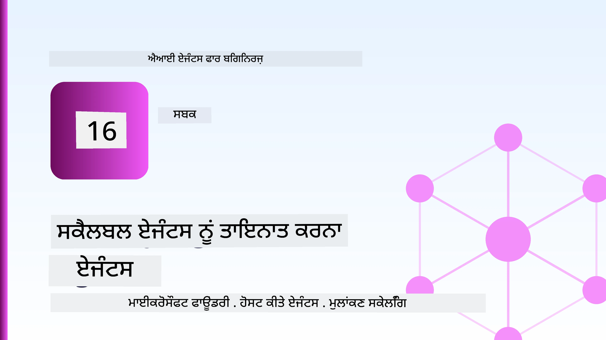
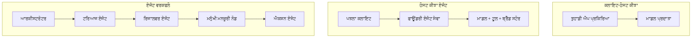
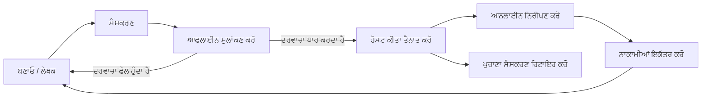
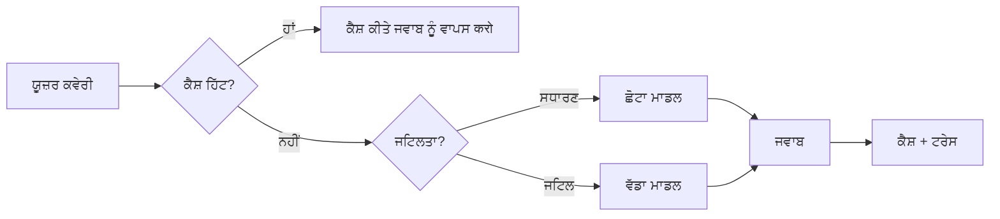
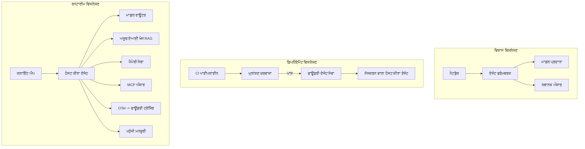

# ਮਾਈਕ੍ਰੋਸੌਫ਼ਟ ਫਾਊਂਡਰੀ ਨਾਲ ਸਕੇਲੇਬਲ ਏਜੰਟਾਂ ਨੂੰ ਡਿਪਲੌਇ ਕਰਨਾ



ਇਸ ਕੋਰਸ ਦੇ ਇਸ ਪੱਧਰ ਤੱਕ ਤੁਸੀਂ ਐਜੰਟ ਬਣਾਏ ਹਨ ਜੋ ਤੁਹਾਡੇ ਲੈਪਟੌਪ 'ਤੇ ਚੱਲਦੇ ਹਨ, ਇੱਕ ਨੋਟਬੁੱਕ ਵਿੱਚ, `az login` ਅਤੇ ਕੁਝ ਵਾਤਾਵਰਣ ਵੇਰੀਏਬਲਾਂ ਦੁਆਰਾ ਚਲਾਏ ਜਾਂਦੇ ਹਨ। ਇਹ ਸਿੱਖਣ ਦਾ ਸਹੀ ਤਰੀਕਾ ਹੈ। ਪਰ ਇਹ ਉਹ ਸਹੀ ਤਰੀਕਾ ਨਹੀਂ ਹੈ ਜਿਸ ਨਾਲ ਹਜ਼ਾਰਾਂ ਗਾਹਕਾਂ ਦੇ ਨਿਰਭਰ ਏਜੰਟ ਨੂੰ ਰਾਤ 3 ਵਜੇ ਚਲਾਇਆ ਜਾਵੇ।

ਇਹ ਪਾਠ ਉਹ ਖਾਈ ਹੈ ਜੋ "ਇਹ ਮੇਰੇ ਮਸ਼ੀਨ 'ਤੇ ਕੰਮ ਕਰਦਾ ਹੈ" ਅਤੇ "ਇਹ ਵਿਸ਼ਵਾਸਯੋਗ ਅਤੇ ਕਿਫਾਇਤੀ ਢੰਗ ਨਾਲ ਉਤਪਾਦਨ ਵਿੱਚ ਕੰਮ ਕਰਦਾ ਹੈ" ਦੇ ਵਿਚਕਾਰ ਹੈ। ਅਸੀਂ ਇਸ ਖਾਈ ਨੂੰ **ਮਾਈਕ੍ਰੋਸੌਫ਼ਟ ਫਾਊਂਡਰੀ** ਅਤੇ **ਮਾਈਕ੍ਰੋਸੌਫ਼ਟ ਫਾਊਂਡਰੀ ਏਜੰਟ ਸਰਵਿਸ** ਦੀ ਵਰਤੋਂ ਕਰਕੇ ਪੂਰਾ ਕਰਦੇ ਹਾਂ, ਅਤੇ ਅਸੀਂ ਇਹ ਇੱਕ ਵਾਸਤਵਿਕ ਗਾਹਕ ਸਹਾਇਤਾ ਏਜੰਟ ਬਣਾ ਕੇ ਕਰਦੇ ਹਾਂ ਜਿਸ ਵਿੱਚ ਟੂਲਜ਼, ਰਿਟਰੀਵਲ, ਮੈਮੋਰੀ, ਮੁੱਲਾਂਕਣ ਅਤੇ ਨਿਗਰਾਨੀ ਹੁੰਦੀ ਹੈ।

## ਜਾਣੂ

ਇਹ ਪਾਠ ਹੇਠ ਲਿਖੀਆਂ ਚੀਜ਼ਾਂ 'ਤੇ ਆਵਰਨ ਕਰੇਗਾ:

- ਇੱਕ **ਪ੍ਰੋਟੋਟਾਈਪ ਏਜੰਟ** ਅਤੇ ਇੱਕ **ਡਿਪਲੌਇਡ ਏਜੰਟ** ਵਿੱਚ ਫਰਕ ਅਤੇ ਇਹ ਕਿਵੇਂ ਜਿਆਦਾਤਰ ਮਾਡਲ ਦੇ ਆਲੇ-ਦੁਆਲੇ ਸਭ ਕੁਝ ਬਾਰੇ ਹੁੰਦਾ ਹੈ।
- ਏਜੰਟਾਂ ਲਈ **ਡਿਪਲੌਇਮੈਂਟ ਪੈਟਰਨ**: ਕਲਾਇੰਟ-ਹੋਸਟਡ, ਸਰਵਿਸ-ਹੋਸਟਡ (ਹੋਸਟਡ ਏਜੰਟ), ਅਤੇ ਵਰਕਫਲੋ-ਆਰਕੈਸਟ੍ਰੇਟਡ।
- ਮਾਈਕ੍ਰੋਸੌਫ਼ਟ ਫਾਊਂਡਰੀ 'ਤੇ **ਏਜੰਟ ਜੀਵਨ-ਚਕਰ** — ਬਣਾਉ, ਵਰਜਨ ਬਣਾ, ਡਿਪਲੌਇ, ਮੁੱਲਾਂਕਣ, ਨਿਗਰਾਨੀ, ਅਵਸਰਜਨ।
- **ਸਕੇਲਿੰਗ ਰਣਨੀਤੀਆਂ**: ਮਾਡਲ ਰਾਉਟਿੰਗ, ਕੈਸ਼ਿੰਗ, ਸਮਕਾਲੀਤਾ, ਅਤੇ ਸਟੀਟਲੈੱਸ ਡਿਜ਼ਾਈਨ।
- OpenTelemetry ਅਤੇ ਫਾਊਂਡਰੀ ਟ੍ਰੇਸਿੰਗ ਨਾਲ **ਨਿਗਰਾਨੀ**।
- ਮਾਡਲ ਚੋਣ, ਰਾਉਟਿੰਗ, ਅਤੇ ਮੁੱਲਾਂਕਣ ਗੇਟਾਂ ਰਾਹੀਂ **ਖਰਚਾ-ਸੰਭਾਲ**।
- **ਐਂਟਰਪ੍ਰਾਈਜ਼ ਵਿਚਾਰ**: ગੋવર્નેન્સ, ਮਨੁੱਖੀ ਮਨਜ਼ੂਰੀ, ਅਤੇ ਉਤਪਾਦਨ ਵਿੱਚ MCP ਸਰਵਰਾਂ ਨੂੰ ਸੁਰੱਖਿਅਤ ਤਰੀਕੇ ਨਾਲ ਚਲਾਉਣਾ।

## ਸਿੱਖਣ ਦੇ ਟੀਚੇ

ਇਸ ਪਾਠ ਨੂੰ ਮੁਕੰਮਲ ਕਰਨ ਤੋਂ ਬਾਅਦ, ਤੁਸੀਂ ਜਾਣੋਗੇ ਕਿ ਕਿਵੇਂ:

- ਕਿਸੇ ਦਿੱਤੇ ਏਜੰਟ ਕੰਮ-ਭਾਰ ਲਈ ਠੀਕ ਡਿਪਲੌਇਮੈਂਟ ਪੈਟਰਨ ਚੁਣਨਾ।
- ਏਜੰਟ ਨੂੰ ਮਾਈਕ੍ਰੋਸੌਫ਼ਟ ਫਾਊਂਡਰੀ ਏਜੰਟ ਸਰਵਿਸ ਤੇ ਡਿਪਲੌਇ ਕਰਨਾ ਤਾਂ ਜੋ ਇਹ ਵਰਜਨਡ, શાસિત, અને ਨਿਗਰਾਨੀਯੋਗ ਬਣ ਜਾਏ।
- ਟ੍ਰੇਸਿੰਗ ਲਈ ਏਜੰਟ ਦਾ ਇੰਸਟਰੂਮੈਂਟ ਕਰਨਾ ਅਤੇ ਹਰ ਰਿਲੀਜ਼ ਤੋਂ ਪਹਿਲਾਂ ਚਲਣ ਵਾਲੀ ਮੁੱਲਾਂਕਣ ਪਾਈਪਲਾਈਨ ਨੂੰ ਜੁੜਨਾ।
- ਸਕੇਲ 'ਤੇ ਲੈਟੰਸੀ ਅਤੇ ਖਰਚੇ ਨੂੰ ਕੰਟਰੋਲ ਕਰਨ ਲਈ ਮਾਡਲ ਰਾਉਟਿੰਗ ਅਤੇ ਕੈਸ਼ਿੰਗ ਲਾਗੂ ਕਰਨਾ।
- ਉੱਚ ਜੋਖਮ ਵਾਲੇ ਕਦਮਾਂ ਲਈ ਮਨੁੱਖੀ ਮਨਜ਼ੂਰੀ ਦਾ ਗੇਟ ਜੋੜਨਾ ਅਤੇ ਉਤਪਾਦਨ-ਸੁਰੱਖਿਅਤ ਤਰੀਕੇ ਨਾਲ MCP ਸਰਵਰ ਨੂੰ ਇੱਕੱਤਰ ਕਰਨਾ।

## ਪਹਿਲਾਂ ਦੀਆਂ ਲੋੜਾਂ

ਇਹ ਪਾਠ ਮੰਨਦਾ ਹੈ ਕਿ ਤੁਸੀਂ ਪਹਿਲਾਂ ਸਿਖਾਈ ਗਈਆਂ ਪਾਠਾਂ ਨੂੰ ਪੂਰਾ ਕਰ ਚੁੱਕੇ ਹੋ ਅਤੇ ਇਹਨਾਂ ਵਿੱਚ ਸਹੂਲਤ ਵਾਲੇ ਹੋ:

- [ਮਾਈਕ੍ਰੋਸੌਫ਼ਟ ਏਜੰਟ ਫਰੇਮਵਰਕ](../14-microsoft-agent-framework/README.md) (ਪਾਠ 14) ਨਾਲ ਏਜੰਟ ਬਣਾਉਣਾ।
- [ਉਪਕਰਣ ਬਰਤੋਂ](../04-tool-use/README.md) (ਪਾਠ 4) ਅਤੇ [ਏਜੰਟਿਕ RAG](../05-agentic-rag/README.md) (ਪਾਠ 5)।
- [ਏਜੰਟ ਮੈਮੋਰੀ](../13-agent-memory/README.md) (ਪਾਠ 13) ਅਤੇ [ਏਜੰਟਿਕ ਪ੍ਰੋਟੋਕੋਲ / MCP](../11-agentic-protocols/README.md) (ਪਾਠ 11)।
- [ਨਿਗਰਾਨੀ ਅਤੇ ਮੁੱਲਾਂਕਣ](../10-ai-agents-production/README.md) (ਪਾਠ 10) — ਇਹ ਪਾਠ ਇਸ ਉੱਤੇ ਸਿੱਧਾ ਟਿਕਿਆ ਹੈ।

ਤੁਹਾਨੂੰ ਇਹ ਵੀ ਲੋੜ ਹੋਏਗੀ:

- ਇੱਕ **Azure ਸਬਸਕ੍ਰਿਪਸ਼ਨ** ਅਤੇ ਘੱਟ ਤੋਂ ਘੱਟ ਇੱਕ ਡਿਪਲੌਇਡ ਚੈਟ ਮਾਡਲ ਵਾਲਾ **ਮਾਈਕ੍ਰੋਸੌਫ਼ਟ ਫਾਊਂਡਰੀ ਪ੍ਰੋਜੈਕਟ**।
- ਸਥਿਰ `az login` ਨਾਲ ਪ੍ਰਮਾਣਿਤ **Azure CLI**।
- Python 3.12+ ਅਤੇ ਰੀਪੋਜ਼ਿਟਰੀ ਵਿੱਚ ਮੌਜੂਦ ਪੈਕੇਜ [`requirements.txt`](../../../requirements.txt)।

## ਪ੍ਰੋਟੋਟਾਈਪ ਤੋਂ ਉਤਪਾਦਨ ਤੱਕ: ਕੀ ਬਦਲਦਾ ਹੈ

ਇੱਕ ਪ੍ਰੋਟੋਟਾਈਪ ਏਜੰਟ ਅਤੇ ਇੱਕ ਉਤਪਾਦਨ ਏਜੰਟ ਵਿੱਚ ਮੂਲ ਲੂਪ ਦੇ ਇਕੋ ਹੀ ਹਿੱਸੇ ਹੁੰਦੇ ਹਨ — ਤਰਕ, ਟੂਲਸ ਨੂੰ ਕਾਲ ਕਰੋ, ਜਵਾਬ ਦਿਓ। ਜੋ ਕੁਝ ਬਦਲਦਾ ਹੈ ਉਹ ਇਸ ਲੂਪ ਦੇ ਆਲੇ-ਦੁਆਲੇ ਦਾ ਸਾਰਾ ਢਾਂਚਾ ਹੁੰਦਾ ਹੈ। ਮਾਡਲ ਉਤਪਾਦਨ ਏਜੰਟ ਦਾ ਲਗਭਗ 20% ਹੁੰਦਾ ਹੈ; ਬਾਕੀ 80% ਚਾਲੂ ਢਾਂਚਾ ਹੁੰਦਾ ਹੈ।

| ਚਿੰਤਾ | ਪ੍ਰੋਟੋਟਾਈਪ | ਉਤਪਾਦਨ |
| --- | --- | --- |
| **ਹੋਸਟਿੰਗ** | ਤੁਹਾਡੇ ਨੋਟਬੁੱਕ ਵਿੱਚ ਚੱਲਦਾ ਹੈ | ਇੱਕ ਹੋਸਟਡ ਸਰਵਿਸ ਵਜੋਂ ਚੱਲਦਾ ਹੈ, ਵਰਜਨਡ ਅਤੇ ਰੋਲ ਆਊਟ ਕੀਤਾ |
| **ਪਛਾਣ** | ਤੁਹਾਡਾ `az login` ਟੋਕਨ | ਸකੋਪਡ RBAC ਵਾਲੀ ਪ੍ਰਬੰਧਿਤ ਪਛਾਣ |
| **ਅਵਸਥਾ** | ਇਨ-ਮੇਮੋਰੀ, ਰੀਸਟਾਰਟ 'ਤੇ ਖੋ ਜਾਦਾ ਹੈ | ਬਾਹਰੀਕ੍ਰਿਤ (ਥ੍ਰੈਡ ਸਟੋਰ, ਮੈਮੋਰੀ ਸਰਵਿਸ) |
| **ਵਿਫਲਤਾ** | ਤੁਸੀਂ ਟ੍ਰੇਬੈਕ ਵੇਖਦੇ ਹੋ | ਮੁੜ ਕੋਸ਼ਿਸ਼ਾਂ, ਫਾਲਬੈਕ, ਡੈਡ-ਲੇਟਰ, ਅਲਰਟ |
| **ਖਰਚ** | "ਇਹ ਕੁਝ ਸੈਂਟ ਹੈ" | ਪ੍ਰਤੀ ਬਿਨੈ ਟਰੈਕਡ, ਰਾਉਟਡ, ਕੈਸ਼ਡ, ਬਜਟ ਕੀਤਾ |
| **ਗੁਣਵੱਤਾ** | ਤੁਸੀਂ ਨਤੀਜੇ ਨੂੰ ਵੇਖਦੇ ਹੋ | ਹਰ ਰਿਲੀਜ਼ ਤੋਂ ਪਹਿਲਾਂ ਆਪਣੇ ਆਪ ਮੁੱਲਾਂਕਣ ਕੀਤਾ |
| **ਭਰੋਸਾ** | ਤੁਸੀਂ ਹਰ ਕਦਮ ਦੀ ਮਨਜ਼ੂਰੀ ਦਿੰਦੇ ਹੋ | ਜੋਖਮ ਵਾਲੇ ਕਦਮਾਂ ਲਈ ਨੀਤੀ + ਮਨੁੱਖੀ-ਇਨ-ਦ-ਲੂਪ |

ਇਹ ਸਾਰਣੀ ਮਨ ਵਿੱਚ ਰੱਖੋ। ਹੇਠਾਂ ਹਰ ਭਾਗ ਇਕ ਤੋਂ ਇਕ ਪੰkti ਨਾਲ ਮੈਚ ਕਰਦਾ ਹੈ।

## ਏਜੰਟ ਡਿਪਲੌਇਮੈਂਟ ਪੈਟਰਨ

ਤੁਹਾਨੂੰ ਤਿੰਨ ਪੈਟਰਨ ਵਰਤਣੇ ਪੈਣਗੇ, ਅਕਸਰ ਮਿਲਾ ਕੇ।

### 1. ਕਲਾਇੰਟ-ਹੋਸਟਡ ਏਜੰਟ

ਏਜੰਟ ਵਸਤੂ *ਤੁਹਾਡੇ* ਐਪਲੀਕੇਸ਼ਨ ਪ੍ਰੋਸੈਸ ਦੇ ਅੰਦਰ ਰਹਿੰਦੀ ਹੈ। ਤੁਹਾਡੀ ਕੋਡ ਸਿੱਧਾ ਮਾਡਲ ਪ੍ਰਦਾਤਾ ਨੂੰ ਕਾਲ ਕਰਦੀ ਹੈ; ਤਰਕ ਲੂਪ ਤੁਹਾਡੇ ਸਰਵਿਸ ਵਿੱਚ ਚੱਲਦਾ ਹੈ। ਇਹ ਉਹੀ ਹੈ ਜੋ ਹਰ ਪਹਿਲਾਂ ਦੇ ਪਾਠ ਵਿੱਚ ਕੀਤਾ ਗਿਆ।

- **ਜਦੋਂ ਵਰਤੋ** ਜਦੋਂ ਤੁਹਾਨੂੰ ਲੂਪ 'ਤੇ ਪੂਰਾ ਕੰਟਰੋਲ ਚਾਹੀਦਾ ਹੋਵੇ, ਕਸਟਮ ਮਿਡਲਵੇਅਰ, ਜਾਂ ਤੁਸੀਂ ਏਜੰਟ ਨੂੰ ਮੌਜੂਦਾ ਬੈਕਐਂਡ ਵਿੱਚ ਸਮੇਟ ਰਹੇ ਹੋ।
- **ਸੌਦਾ**: ਤੁਸੀਂ ਆਪਣੇ ਆਪ ਸਕੇਲਿੰਗ, ਅਵਸਥਾ ਅਤੇ ਲਚਕੀਲਾਪਣ ਦੇ ਮਾਲਕ ਹੋ।

### 2. ਹੋਸਟਡ ਏਜੰਟ (ਫਾਊਂਡਰੀ ਏਜੰਟ ਸਰਵਿਸ)

ਏਜੰਟ ਮਾਈਕ੍ਰੋਸੌਫ਼ਟ ਫਾਊਂਡਰੀ ਵਿੱਚ *ਸਰੋਤ ਵਜੋਂ ਦਰਜ* ਹੁੰਦਾ ਹੈ। ਫਾਊਂਡਰੀ ਤਰਕ ਲੂਪ ਦੀ ਮੇਜ਼ਬਾਨੀ ਕਰਦਾ ਹੈ, ਧਾਗੇ ਸਟੋਰ ਕਰਦਾ ਹੈ, ਸਮੱਗਰੀ ਦੀ ਸੁਰੱਖਿਆ ਅਤੇ RBAC ਲਾਗੂ ਕਰਦਾ ਹੈ, ਅਤੇ ਫਾਊਂਡਰੀ ਪੋਰਟਲ ਵਿੱਚ ਏਜੰਟ ਨੂੰ ਦਿਖਾਈ ਦਿੰਦਾ ਹੈ। ਤੁਹਾਡੀ ਐਪ ਇੱਕ ਪਤਲਾ ਕਲਾਇੰਟ ਬਣ ਜਾਂਦੀ ਹੈ ਜੋ ਧਾਗੇ ਬਣਾਉਂਦੀ ਅਤੇ ਜਵਾਬ ਪੜ੍ਹਦੀ ਹੈ।

- **ਜਦੋਂ ਵਰਤੋ** ਜਦੋਂ ਤੁਸੀਂ ਦਿਰਘਕਾਲੀਤਾ, ਅੰਦਰੂਨੀ ਨਿਗਰਾਨੀ, શાસਨ, ਅਤੇ ਘੱਟ ਸੰਚਾਲਕੀ ਸਥਲ ਚਾਹੁੰਦੇ ਹੋ।
- **ਸੌਦਾ**: ਪ੍ਰਬੰਧਿਤ ਦੌਰ-ਚਲਾਉਣ ਵਾਸਤੇ ਘੱਟ ਨੀਵੀਂ ਪੱਧਰੀ ਕੰਟਰੋਲ।

### 3. ਏਜੰਟ ਵਰਕਫਲੋਜ਼

ਕਈ ਏਜੰਟ (ਅਤੇ ਟੂਲ) ਇੱਕ ਗ੍ਰਾਫ ਵਿੱਚ ਜੋੜੇ ਜਾਂਦੇ ਹਨ ਜਿਸ ਵਿੱਚ ਖੁੱਲ੍ਹੇ ਕੰਟਰੋਲ ਫਲੋ ਹੁੰਦਾ ਹੈ — ਲੜੀਵਾਰ ਕਦਮ, ਸ਼ਾਖਾ ਮਾਰਨਾ, ਮਨੁੱਖੀ ਮਨਜ਼ੂਰੀ ਨੋਡ, ਅਤੇ ਦਿਰਘਕਾਲੀ ਚੈਕਪੋਇੰਟ ਜੋ ਰੋਕ ਕੇ ਮੁੜ ਸ਼ੁਰੂ ਕੀਤੇ ਜਾ ਸਕਦੇ ਹਨ। ਇਹ Microsoft Agent Framework ਦੀ **ਵਰਕਫਲੋਜ਼** ਸਮਰੱਥਾ ਹੈ ਜੋ ਡਿਪਲੌਇਮੈਂਟ ਪੱਧਰ 'ਤੇ ਲਾਗੂ ਕੀਤੀ ਜਾਂਦੀ ਹੈ।

- **ਜਦੋਂ ਵਰਤੋ** ਜਦੋਂ ਇੱਕ ਕੰਮ ਕਈ ਵਿਸ਼ੇਸ਼ ਏਜੰਟਾਂ ਦਾ ਫੈਲਾਵ ਕਰਦਾ ਹੈ ਜਾਂ ਵਿਚਕਾਰ ਮਨਜ਼ੂਰੀ ਕਦਮ ਲੋੜੀਂਦਾ ਹੈ।
- **ਸੌਦਾ**: ਜ਼ਿਆਦਾ ਹਿੱਸੇ; ਆਰਕੈਸਟ੍ਰੇਸ਼ਨ ਪੱਧਰ ਦੀ ਨਿਗਰਾਨੀ ਦੀ ਲੋੜ।



## ਮਾਈਕ੍ਰੋਸੌਫ਼ਟ ਫਾਊਂਡਰੀ 'ਤੇ ਏਜੰਟ ਦਾ ਜੀਵਨਚੱਕਰ

ਏਜੰਟ ਨੂੰ ਡਿਪਲੌਇ ਕਰਨਾ ਇੱਕ ਵਾਰ ਦੀ `push` ਨਹੀਂ ਹੈ। ਇਹ ਇੱਕ ਚੱਕਰ ਹੈ, ਅਤੇ ਇਹ ਇੱਕ ਸੌਫਟਵੇਅਰ ਰਿਲੀਜ਼ ਸਾਈਕਲ ਵਾਂਗ ਲਗਦਾ ਹੈ ਕਿਉਂਕਿ ਇਹ ਇੱਕੋ ਹੀ ਹੈ।



ਮੁੱਖ ਖ਼ਿਆਲ, ਜੋ [ਪਾਠ 10](../10-ai-agents-production/README.md) ਤੋਂ ਲਿਆ ਗਿਆ ਹੈ: **ਆਫਲਾਈਨ ਮੁੱਲਾਂਕਣ ਇੱਕ ਗੇਟ ਹੈ, ਬਾਅਦ ਦੀ ਸੋਚ ਨਹੀਂ।** ਇੱਕ ਨਵਾਂ ਏਜੰਟ ਵਰਜਨ ਰੀਲੀਜ਼ ਨਹੀਂ ਹੁੰਦਾ ਜਦ ਤੱਕ ਇਹ ਤੁਸੀਂ ਮੁੱਲਾਂਕਣ ਦੇ ਮਿਆਰ ਪੂਰੇ ਨਾ ਕਰ ਦੇਵੇ। ਆਨਲਾਈਨ ਨਿਗਰਾਨੀ ਫਿਰ ਅਸਲੀ ਦੁਨੀਆ ਦੀਆਂ ਅਸਫਲਤਾਵਾਂ ਨੂੰ ਤੁਹਾਡੇ ਆਫਲਾਈਨ ਟੈਸਟ ਸੈਟ ਵਿੱਚ ਵਾਪਸ ਭੇਜਦੀ ਹੈ। ਇਹ ਸਾਰਾ ਚੱਕਰ ਹੈ।

## ਸਕੇਲਿੰਗ ਰਣਨੀਤੀਆਂ

ਇੱਕ ਏਜੰਟ ਨੂੰ ਸਕੇਲ ਕਰਨਾ ਸਟੀਟਲੈੱਸ ਵੈੱਬ API ਤੋਂ ਵੱਖਰਾ ਹੈ, ਕਿਉਂਕਿ ਹਰ ਬਿਨੈ ਕਈ ਮਹਿੰਗੀਆਂ ਮਾਡਲ ਅਤੇ ਟੂਲ ਕਾਲਾਂ ਨੂੰ ਟ੍ਰਿਗਰ ਕਰ ਸਕਦੀ ਹੈ। ਚਾਰ ਤਕਨਾਲੋਜੀਆਂ ਵੱਧ ਭਾਰ ਦੌੜਾਉਂਦੀਆਂ ਹਨ।

**ਸਟੇਟਲੈੱਸ ਬਿਨੈ ਸੰਭਾਲ।** ਆਪਣੀ ਪ੍ਰਕਿਰਿਆ ਦੀ ਯਾਦ ਵਿੱਚ ਕਿਸੇ ਵੀ ਵਰਤੋਂਕਾਰ ਦੀ ਸਥਿਤੀ ਨਾ ਰੱਖੋ। ਗੱਲਬਾਤ ਦੇ ਧਾਗੇ ਫਾਊਂਡਰੀ ਧਾਗਾ ਸਟੋਰ ਜਾਂ ਮੈਮੋਰੀ ਸਰਵਿਸ ਵਿੱਚ ਸੁਰੱਖਿਅਤ ਕਰੋ ਤਾਂ ਜੋ ਕੋਈ ਵੀ ਉਦਾਹਰਨ ਕੋਈ ਵੀ ਬਿਨੈ ਸੰਭਾਲ ਸਕੇ। ਇਹ ਤੁਹਾਨੂੰ ਅਨਦੇਸ਼ੀ ਰੂਪ ਵਿੱਚ ਸਕੇਲ ਕਰਨ ਦੀ ਆਗਿਆ ਦਿੰਦਾ ਹੈ — ਉਦਾਹਰਨਾਂ ਵਧਾਉ, ਕੋਈ ਚਿੱਕੜਾ ਸੈਸ਼ਨ ਨਹੀਂ।

**ਮਾਡਲ ਰਾਉਟਿੰਗ।** ਹਰ ਬਿਨੈ ਨੂੰ ਤੁਹਾਡੇ ਸਭ ਤੋਂ ਯੋਗ (ਅਤੇ ਮਹਿੰਗੇ) ਮਾਡਲ ਦੀ ਲੋੜ ਨਹੀਂ। ਸਧਾਰਣ ਬਿਨੈ — ਇਰਾਦਾ ਵਰਗੀਕਰਨ, ਛੋਟੇ ਤੱਥ-ਆਧਾਰਿਤ ਜਵਾਬ — ਨੂੰ ਛੋਟੇ ਤੇ ਤੇਜ਼ ਮਾਡਲ ਵੱਲ ਮੌੜੋ, ਅਤੇ ਵੱਡੇ ਮਾਡਲ ਨੂੰ ਅਸਲੀ ਤਰਕ ਲਈ ਰਾਖਵੋ। ਫਾਊਂਡਰੀ ਦਾ **ਮਾਡਲ ਰਾਊਟਰ** ਤੁਹਾਡੇ ਵਾਸਤੇ ਇਹ ਕਰ ਸਕਦਾ ਹੈ, ਜਾਂ ਤੁਸੀਂ ਖੁਦ ਹਲਕਾ ਫਲੈੱਟਰ ਲਾਗੂ ਕਰ ਸਕਦੇ ਹੋ। ਤੁਸੀਂ ਲੈਬ ਵਿੱਚ ਖੁਦ ਬਣਾਵੋਗੇ।

**ਜਵਾਬ ਕੈਸ਼ਿੰਗ।** ਕਈ ਸਹਾਇਤਾ ਪ੍ਰਸ਼ਨ ਨੇੜੇ-ਨਕਲ ("ਮੇਰਾ ਪਾਸਵਰਡ ਕਿਵੇਂ ਰੀਸੈਟ ਕਰਨਾ ਹੈ?")। ਆਮ ਪ੍ਰਸ਼ਨਾਂ ਦੇ ਜਵਾਬ ਕੈਸ਼ ਕਰੋ ਅਤੇ ਮਾਡਲ ਨੂੰ ਛੂਹੋ ਵੀ ਨਹੀਂ। ਇਕ ਬਿਨੈ ਬੀਟ ਦਰ ਮਾਤਰਾ ਕੁਝ ਖਰਚ ਅਤੇ ਲੈਟੰਸੀ ਘਟਾਉਂਦੀ ਹੈ।

**ਸਮਕਾਲੀਤਾ ਅਤੇ ਬੈਕਪ੍ਰੈਸ਼ਰ।** ਮਾਡਲ ਪ੍ਰਦਾਤਾਵਾਂ ਦੀਆਂ ਦਰ ਸੀਮਾਵਾਂ ਹਨ। ਆਪਣੀ ਸਮਕਾਲੀਤਾ ਸੀਮਤ ਕਰੋ, ਪ੍ਰਤਿਕ੍ਰਿਆ ਵਿੱਚ ਵਾਧੂ ਦੇ ਨਾਲ ਮੁੜ ਕੋਸ਼ਿਸ਼ ਕਰੋ, ਅਤੇ ਸ਼ਾਂਤੀ ਨਾਲ ਅਸਫਲ ਹੋਵੋ (ਇੱਕ ਕਤਾਰਬੱਧ "ਅਸੀਂ ਇਸ ਤੇ ਹਾਂ" ਜਵਾਬ 500 ਤੋਂ ਵਧੀਆ ਹੈ)।



## ਉਤਪਾਦਨ ਵਿੱਚ ਨਿਗਰਾਨੀ

ਤੁਸੀਂ ਉਸ ਨੂੰ ਚਲਾ ਨਹੀਂ ਸਕਦੇ ਜੋ ਤੁਸੀਂ ਨਹੀਂ ਦੇਖ ਸਕਦੇ। ਜਿਵੇਂ ਕਿ ਪਾਠ 10 ਵਿੱਚ ਕਿਹੜਾ ਗਿਆ ਹੈ, ਮਾਈਕ੍ਰੋਸੌਫ਼ਟ ਏਜੰਟ ਫਰੇਮਵਰਕ **OpenTelemetry** ਟ੍ਰੇਸਜ਼ ਕੁਦਰਤੀ ਤੌਰ 'ਤੇ ਜਾਰੀ ਕਰਦਾ ਹੈ — ਹਰ ਮਾਡਲ ਕਾਲ, ਟੂਲ ਸੱਦਾ, ਅਤੇ ਆਰਕੈਸਟ੍ਰੇਸ਼ਨ ਕਦਮ ਇੱਕ ਸਪੈਨ ਬਣ ਜਾਂਦਾ ਹੈ। ਉਤਪਾਦਨ ਵਿੱਚ ਤੁਸੀਂ ਉਹ ਸਪੈਨ ਮਾਈਕ੍ਰੋਸੌਫ਼ਟ ਫਾਊਂਡਰੀ (ਜਾਂ ਕਿਸੇ ਵੀ OTel-ਅਨੁਕੂਲ ਬੈਕਐਂਡ) ਨੂੰ ਨਿਰਯਾਤ ਕਰਦੇ ਹੋ ਤਾਂ ਕਿ ਤੁਸੀਂ:

- ਇਕ ਗਾਹਕ ਦੀ ਸ਼ਿਕਾਇਤ ਨੂੰ ਹਰ ਮਾਡਲ ਅਤੇ ਟੂਲ ਕਾਲ ਵਿੱਚ ਸੰਪੂਰਨ ਤੌਰ 'ਤੇ ਟ੍ਰੇਸ ਕਰੋ।
- ਸਮੇਂ ਨਾਲ ਪ੍ਰਤੀ ਬਿਨੈ p50/p95 ਲੈਟੰਸੀ ਅਤੇ ਖਰਚ ਵੇਖੋ।
- ਗਲਤੀ-ਦਰ ਵਾਧਾ ਅਤੇ ਖਰਚ ਗੜਬੜੀ 'ਤੇ ਅਲਰਟ ਹੋਵੋ, ਇਸ ਤੋਂ ਪਹਿਲਾਂ ਕਿ ਤੁਹਾਡੇ ਉਪਭੋਗਤਾ (ਜਾਂ ਤੁਹਾਡੇ ਮਾਲੀ ਟੀਮ) ਦੀ ਨਜ਼ਰ ਪਵੇ।

```python
from agent_framework.observability import get_tracer

tracer = get_tracer()

with tracer.start_as_current_span("support_request") as span:
    span.set_attribute("customer.tier", "enterprise")
    span.set_attribute("routed.model", "gpt-4.1-mini")
    # ਏਜੰਟ ਕੋਡ ਦੀ ਚਲਾਉਣ ਦੀ ਨਿਗਰਾਨੀ ਆਟੋਮੈਟਿਕ ਤੌਰ 'ਤੇ ਇਸ ਸਪੈਨ ਦੇ ਅੰਦਰ ਕੀਤੀ ਜਾਂਦੀ ਹੈ
```

`customer.tier` ਅਤੇ `routed.model` ਵਰਗੇ ਗੁਣ ਇਹਨਾਂ ਟ੍ਰੇਸਾਂ ਨੂੰ ਸਵਾਲ ਵਜੋਂ ਬਦਲਦੇ ਹਨ ("ਕੀ ਐਂਟਰਪ੍ਰਾਈਜ਼ ਗਾਹਕ ਬਹੁਤ ਵਾਰ ਛੋਟੇ ਮਾਡਲ ਵੱਲ ਰਾਊਟ ਹੋ ਰਹੇ ਹਨ?").

## ਖਰਚ ਸੁਧਾਰ

ਉਤਪਾਦਨ ਏਜੰਟਾਂ ਵਿੱਚ ਖਰਚ ਟੋਕਨਜ਼ ਤੋਂ ਪ੍ਰਭਾਵਿਤ ਹੁੰਦਾ ਹੈ। ਤਿੰਨ ਹਨ ਜਿਨ੍ਹਾਂ ਦਾ ਪ੍ਰਭਾਵ ਖਾਸ ਹੈ:

1. **ਮਾਡਲ ਦਾ ਠੀਕ ਅਕਾਰ**। ਇੱਕ ਛੋਟਾ ਮਾਡਲ ਜੋ ਤੁਹਾਡੀ ਮੁੱਲਾਂਕਣ ਗੇਟ ਪਾਰ ਕਰਦਾ ਹੈ, ਆਮ ਤੌਰ 'ਤੇ ਇੱਕ ਵੱਡੇ ਮਾਡਲ ਨਾਲੋਂ ਸਸਤਾ ਹੁੰਦਾ ਹੈ ਜੋ ਗੇਟ ਪਾਰ ਕਰਦਾ ਹੈ। ਮੁੱਲਾਂਕਣ ਨਾਲ ਇਹ ਸਾਬਿਤ ਕਰੋ ਕਿ ਛੋਟਾ ਮਾਡਲ ਕਾਫ਼ੀ ਹੈ ਨਾ ਕਿ ਬੜਾ ਮਾਡਲ ਚੁਣਨਾ ਬੇਵਕੂਫ਼ੀ ਨਾਲ ਜੀਦਾ ਹੋਵੇ।
2. **ਜਟਿਲਤਾ ਅਨੁਸਾਰ ਰਾਊਟਿੰਗ**। ਉਪਰੋਕਤ ਜਿਵੇਂ — ਵੱਡੇ ਮਾਡਲ ਦੀ ਕੀਮਤ ਸਿਰਫ ਉਹਨਾਂ ਬਿਨੈ ਲਈ ਭਰੋ ਜਿਨ੍ਹਾਂ ਨੂੰ ਵੱਡਾ ਮਾਡਲ ਚਾਹੀਦਾ ਹੈ।
3. **ਜੋਰਦਾਰ ਕੈਸ਼ਿੰਗ**। ਸਭ ਤੋਂ ਸਸਤੀ ਮਾਡਲ ਕਾਲ ਉਹ ਹੈ ਜੋ ਤੁਸੀਂ ਕਦੇ ਨਹੀਂ ਕਰਦੇ।

ਮੁੱਲਾਂਕਣ ਗੇਟ ਅਤੇ ਖਰਚ ਨਿਯੰਤਰਣ ਇਕੋ ਹੀ ਅਠਤਰ ਦੀ ਦੋ ਵੱਖ-ਵੱਖਨੀਆਂ ਨਜ਼ਰਾਂ ਹਨ: ਮੁੱਲਾਂਕਣ ਤੁਹਾਨੂੰ *ਗੁਣਵੱਤਾ ਇੰਆਮ* ਦੱਸਦਾ ਹੈ, ਰਾਊਟਿੰਗ ਅਤੇ ਕੈਸ਼ਿੰਗ ਤੁਹਾਨੂੰ ਉਸ ਇੰਆਮ ਦੇ *ਖਰਚ* ਦੇ ਨੇੜੇ ਰੱਖਦੀ ਹੈ।

## ਐਂਟਰਪ੍ਰਾਈਜ਼ ਡਿਪਲੌਇਮੈਂਟ ਵਿਚਾਰ

**治理 (Governance)।** ਹੋਸਟਡ ਏਜੰਟ ਫਾਊਂਡਰੀ ਦਾ RBAC, ਸਮੱਗਰੀ ਦੀ ਸੁਰੱਖਿਆ, ਅਤੇ ਆਡੀਟ ਲਾਗਿੰਗ ਵਿਰਾਸਤ ਵਿੱਚ ਲੈਦਾ ਹੈ। ਹਰ ਏਜੰਟ ਨੂੰ ਸਭ ਤੋਂ ਘੱਟ ਅਧਿਕਾਰਾਂ ਵਾਲੀ ਪ੍ਰਬੰਧਿਤ ਪਛਾਣ ਦਿਓ — ਕੇਵਲ ਪੜ੍ਹਨ ਲਈ ਨੋਲਜ ਬੇਸ, ਟਿਕਟਿੰਗ API ਲਈ ਸੀਮਿਤ ਪਹੁੰਚ, ਹੋਰ ਕੁਝ ਨਹੀਂ।

**ਮਨੁੱਖੀ-ਇਨ-ਦ-ਲੂਪ।** ਕੁਝ ਕਦਮ ਇਨਾ ਜ਼ਿਆਦਾ ਮਹੱਤਵਪੂਰਨ ਹੁੰਦੇ ਹਨ ਕਿ ਉਹ ਸਿੱਧੇ ਤੌਰ 'ਤੇ ਆਟੋਮੈਟ ਨਹੀਂ ਕੀਤੇ ਜਾ ਸਕਦੇ — ਰਿਫੰਡ ਜਾਰੀ ਕਰਨਾ, ਖਾਤਾ ਮਿਟਾਉਣਾ, ਕਾਨੂੰਨੀ ਟੀਮ ਨੂੰ ਤਬਦੀਲੀ ਕਰਨਾ। ਮਾਈਕ੍ਰੋਸੌਫ਼ਟ ਏਜੰਟ ਫਰੇਮਵਰਕ **ਮਨਜ਼ੂਰੀ-ਲੋੜੀਂਦੇ** ਟੂਲਜ਼ ਦਾ ਸਮਰਥਨ ਕਰਦਾ ਹੈ: ਏਜੰਟ ਕਾਰਵਾਈ ਦਾ ਪ੍ਰਸਤਾਵ ਰੱਖਦਾ ਹੈ, ਐਗਜ਼ਿਕਿਊਸ਼ਨ ਰੁਕ ਜਾਂਦੀ ਹੈ, ਮਨੁੱਖ ਮਨਜ਼ੂਰ ਜਾਂ ਰਿਜੈਕਟ ਕਰਦਾ ਹੈ, ਅਤੇ ਵਰਕਫਲੋ ਮੁੜ ਚਾਲੂ ਹੁੰਦਾ ਹੈ। ਤੁਸੀਂ [ਪਾਠ 6](../06-building-trustworthy-agents/README.md) ਵਿੱਚ ਇਹ ਪ੍ਰਿਥਮਿਕਤਾ ਦੇਖੀ ਸੀ; ਇੱਥੇ ਤੁਸੀਂ ਇਹਨੂੰ ਡਿਪਲੌਇ ਕਰਦੇ ਹੋ।

**ਉਤਪਾਦਨ ਵਿੱਚ MCP।** [MCP](../11-agentic-protocols/README.md) ਤੁਹਾਡੇ ਏਜੰਟ ਨੂੰ ਏਕ ਸਧਾਰਨ ਇੰਟਰਫੇਸ ਰਾਹੀਂ ਬਾਹਰੀ ਟੂਲਾਂ ਖਪਤ ਕਰਨ ਦੀ ਆਗਿਆ ਦਿੰਦਾ ਹੈ। ਉਤਪਾਦਨ ਵਿੱਚ, ਹਰੇਕ MCP ਸਰਵਰ ਨੂੰ ਬਿਨਾਂ ਭਰੋਸੇ ਵਾਲੀ ਸੀਮਾ ਵਜੋਂ ਸਲੂਕ ਕਰੋ: ਸਰਵਰ ਵਰਜਨ ਨੂੰ ਫਿਕਸ ਕਰੋ, ਇਸਨੂੰ ਸਹੀ ਪਛਾਣ ਨਾਲ ਚਲਾਓ, ਇਸਦੇ ਨਤੀਜੇ ਸਹੀ ਕਰੋ, ਅਤੇ ਕਦੇ ਵੀ ਇਸਨੂੰ ਰਾਜ਼ ਨਾ ਦਿਓ। MCP ਸਰਵਰ ਇੱਕ ਡਿਪੈਂਡੈਂਸੀ ਹੈ, ਅਤੇ ਡਿਪੈਂਡੈਂਸੀਜ਼ ਨੂੰ ਪੈਚ, ਆਡੀਟ, ਅਤੇ ਦਰ ਸੀਮਤ ਕੀਤਾ ਜਾਂਦਾ ਹੈ।



ਇਹ ਤਿੰਨ ਚਿੱਤਰ — ਵਿਕਾਸ, ਡਿਪਲੌਇਮੈਂਟ, ਰਨਟਾਈਮ — ਉਸੇ ਏਜੰਟ ਦੇ ਜੀਵਨ ਦੇ ਤਿੰਨ ਮੰਚ ਹਨ। ਹੇਠਾਂ ਦਿੱਤੀ ਲੈਬ ਤੁਹਾਨੂੰ ਇਹ ਬਣਾਉਣ ਦੀ ਰਹਿਨੁਮਾਈ ਕਰੇਗੀ।

## ਪ੍ਰੈਕਟਿਕਲ ਲੈਬ: ਉਤਪਾਦਨ-ਤਿਆਰ ਗਾਹਕ ਸਹਾਇਤਾ ਏਜੰਟ

ਖੋਲ੍ਹੋ [`code_samples/16-python-agent-framework.ipynb`](./code_samples/16-python-agent-framework.ipynb) ਅਤੇ ਇਸਨੂੰ ਪੂਰੇ ਤੌਰ 'ਤੇ ਪੜ੍ਹੋ। ਤੁਸੀਂ ਇਕ **ਕੋਂਟੋਸੋ ਗਾਹਕ ਸਹਾਇਤਾ ਏਜੰਟ** ਇੱਕਠਾ ਕਰੋਗੇ ਜਿਸ ਵਿੱਚ ਹਰ ਉਤਪਾਦਨ ਚਿੰਤਾ ਦਾ ਸਮਾਵੇਸ਼ ਹੈ:

1. **ਟੂਲ ਕਾਲ ਕਰਨੇ** — ਆਰਡਰ ਸਥਿਤੀ ਦੇਖੋ ਅਤੇ ਸਹਾਇਤਾ ਟਿਕਟ ਖੋਲ੍ਹੋ।
2. **RAG** — ਨੋਲਜ ਬੇਸ (Azure AI Search, ਇੱਕ ਇਕ ਮੈਮੋਰੀ ਫਾਲਬੈਕ ਨਾਲ ਤਾਂ ਜੋ ਨੋਟਬੁੱਕ ਬਿਨਾਂ ਖੋਜ ਸਰੋਤ ਚਲ ਜਾਏ) ਤੋਂ ਨੀਤੀ ਸਵਾਲਾਂ ਦੇ ਜਵਾਬ।
3. **ਮੈਮੋਰੀ** — ਗੱਲਬਾਤ ਦੇ ਮੋੜਾਂ ਵਿੱਚ ਗਾਹਕ ਨੂੰ ਯਾਦ ਰੱਖੋ।
4. **ਮਾਡਲ ਰਾਉਟਿੰਗ** — ਇਕ ਜਟਿਲਤਾ ਵਰਗੀਕਰਤਾ ਹਰ ਬਿਨੈ ਨੂੰ ਛੋਟੇ ਜਾਂ ਵੱਡੇ ਮਾਡਲ ਵੱਲ ਮੋੜਦਾ ਹੈ।
5. **ਜਵਾਬ ਕੈਸ਼ਿੰਗ** — ਦੁਹਰਾਏ ਗਏ ਸਵਾਲ ਕੈਸ਼ ਤੋਂ ਸੇਵਾ ਕੀਤੇ ਜਾਂਦੇ ਹਨ।
6. **ਮਨੁੱਖੀ ਮਨਜ਼ੂਰੀ** — ਇੱਕ ਸੀਮਾ ਤੋਂ ਵੱਧ ਰਿਫੰਡ ਮਨੁੱਖੀ ਸਾਈਨ-ਆਫ ਲਈ ਰੁਕਦੇ ਹਨ।
7. **ਮੁੱਲਾਂਕਣ ਪਾਈਪਲਾਈਨ** — ਇੱਕ ਛੋਟਾ ਆਫਲਾਈਨ ਟੈਸਟ ਸੈਟ ਏਜੰਟ ਨੂੰ ਸਕੋਰ ਕਰਦਾ ਹੈ ਅਤੇ ਰਿਲੀਜ਼ ਗੇਟ ਵਜੋਂ ਕੰਮ ਕਰਦਾ ਹੈ।
8. **ਨਿਗਰਾਨੀ** — ਹਰ ਬਿਨੈ ਦੇ ਆਲੇ-ਦੁਆਲੇ OpenTelemetry ਟ੍ਰੇਸਿੰਗ।

### ਚਾਲੂ ਕਰਨਾ

ਨੋਟਬੁੱਕ ਇਸ ਪ੍ਰਕਾਰ ਸੰਗਠਿਤ ਹੈ ਕਿ ਹਰ ਉਤਪਾਦਨ ਚਿੰਤਾ ਇੱਕ ਖੁਦ-ਮੁਕੰਮਲ, ਚਲਾਉਣਯੋਗ ਹਿੱਸਾ ਹੈ। ਇਸਦਾ ਮੁੱਖ ਹੈ ਰਾਉਟਿੰਗ-ਪਲੱਸ-ਕੈਸ਼ਿੰਗ ਬਿਨੈ ਸੰਭਾਲਕ:

```python
async def handle_support_request(query: str, customer_id: str) -> str:
    # 1. ਜਦੋਂ ਸੰਭਵ ਹੋਵੇ ਤਾਂ ਕੈਸ਼ ਤੋਂ ਸੇਵਾ ਦਿਓ।
    cached = response_cache.get(normalize(query))
    if cached:
        return cached

    # 2. ਲਾਗਤ ਨੂੰ ਨਿਯੰਤਰਿਤ ਕਰਨ ਲਈ ਜਟਿਲਤਾ ਅਨੁਸਾਰ ਰੂਟ ਕਰੋ।
    model = "gpt-4.1-mini" if is_simple(query) else "gpt-4.1"

    # 3. ਨਿਰੀਖਣ ਯੋਗਤਾ ਲਈ ਏਜੰਟ ਨੂੰ ਇੱਕ ਟਰੇਸ ਸਪੈਨ ਦੇ ਅੰਦਰ ਚਲਾਓ।
    with tracer.start_as_current_span("support_request") as span:
        span.set_attribute("routed.model", model)
        span.set_attribute("customer.id", customer_id)
        response = await support_agent.run(query, model=model)

    # 4. ਕੈਸ਼ ਕਰੋ ਅਤੇ ਵਾਪਸ ਕਰੋ।
    response_cache.set(normalize(query), response.text)
    return response.text
```

ਸੁਰੱਖਿਅਤ ਰਿਲੀਜ਼ ਦੀ ਰੱਖਿਆ ਕਰਨ ਵਾਲਾ ਮੁੱਲਾਂਕਣ ਗੇਟ ਇਸ ਤਰ੍ਹਾਂ ਦਿੱਖਦਾ ਹੈ:

```python
async def evaluation_gate(agent, test_cases, threshold: float = 0.8) -> bool:
    passed = 0
    for case in test_cases:
        result = await agent.run(case["input"])
        if score_response(result.text, case["expected"]) >= 0.8:
            passed += 1
    pass_rate = passed / len(test_cases)
    print(f"Evaluation pass rate: {pass_rate:.0%} (gate: {threshold:.0%})")
    return pass_rate >= threshold  # ਸਿਰਫ ਗੇਟ ਪਾਸ ਹੋਣ ਤੇ ਹੀ ਡਿਪਲੋਇ ਕਰੋ
```

ਹਰ ਲਾਈਨ ਦੀ ਪੜ੍ਹਾਈ ਕਰੋ — ਨੋਟਬੁੱਕ ਚਾਹ-ਚਾਹ ਕੇ ਇਹਨਾਂ ਪ੍ਰਿਥਮਿਕਤਾ ਨੂੰ ਛੋਟਾ ਰੱਖਦਾ ਹੈ ਤਾਂ ਜੋ ਕਿਸੇ ਫਰੇਮਵਰਕ ਕਾਲ ਦੇ ਪਿੱਛੇ ਕੁਝ ਵੀ छੁਪਿਆ ਨਾ ਹੋਵੇ।

## ਡਿਪਲੌਇਡ ਏਜੰਟ ਨੂੰ ਸਥੂਲ ਟੈਸਟ ਨਾਲ ਪ੍ਰਮਾਣਿਤ ਕਰਨਾ

ਸ਼੍ਰੇਣੀ ਵਿੱਚ ਉਪਰੋਕਤ ਮੁੱਲਾਂਕਣ ਗੇਟ ਤੁਹਾਡੇ ਏਜੰਟ ਵਸਤੂ ਖਿਲਾਫ *ਆਫਲਾਈਨ* ਚਲਦਾ ਹੈ। ਜਦੋਂ ਏਜੰਟ ਇੱਕ ਹੋਸਟਡ ਏਜੰਟ ਵਜੋਂ ਡਿਪਲੌਇਡ ਹੁੰਦਾ ਹੈ, ਤਾਂ ਤੁਹਾਨੂੰ ਇੱਕ ਹੋਰ ਵੀ ਸਸਤਾ ਜਾਂਚ — **ਕੀ ਡਿਪਲੌਇਡ ਕੀਤਾ ਗਇਆ ਐਂਡਪੌਇੰਟ ਅਸਲ ਵਿੱਚ ਜਵਾਬ ਦੇ ਰਿਹਾ ਹੈ?**

"ਸਫਲ" ਡਿਪਲੌਇਮੈਂਟ ਸਿਰਫ ਇਹ ਸਾਬਤ ਕਰਦਾ ਹੈ ਕਿ ਨਿਯੰਤਰਣ ਪਲੇਨ ਨੇ ਪਰਿਭਾਸ਼ਾ ਨੂੰ ਸਵੀਕਾਰ ਕੀਤਾ — ਇਹ ਸਾਬਤ ਨਹੀਂ ਕਰਦਾ ਕਿ ਏਜੰਟ ਜਵਾਬ ਦਿੰਦਾ ਹੈ। ਇੱਕ ਗੁੰਮ ਅਨੁਭਾਗ, ਗਲਤ ਮਾਡਲ ਰਾਉਟਿੰਗ, ਜਾਂ ਸਮਾਪਤ ਕਨੈਕਸ਼ਨ ਹਰਾ ਡਿਪਲੌਇਮੈਂਟ ਛੱਡ ਸਕਦੇ ਹਨ ਜੋ ਕੁਝ ਵਾਪਸ ਨਹੀਂ ਕਰਦਾ। ਇੱਕ **ਸਥੂਲ ਟੈਸਟ** ਇਹ ਕੁਝ ਸਕਿੰਟਾਂ ਵਿੱਚ ਫੜ ਲੈਂਦਾ ਹੈ, ਹਰ ਡਿਪਲੌਇ ਉੱਤੇ, ਪੂਰੇ ਮੁੱਲਾਂਕਣ ਦੀ ਲਾਗਤ ਤੋਂ ਬਿਨਾਂ।

ਇਹ ਰੀਪੋਜ਼ਿਟਰੀ ਤਿਆਰ-ਤੋਂ-ਉਪਯੋਗ ਸਥੂਲ-ਟੈਸਟ ਪਾਈਪਲਾਈਨ ਭੇਜਦੀ ਹੈ ਜੋ [AI Smoke Test](https://github.com/marketplace/actions/ai-smoke-test) GitHub ਐਕਸ਼ਨ 'ਤੇ ਆਧਾਰਿਤ ਹੈ:

- **ਕੈਟਾਲੌਗ** — [`tests/lesson-16-smoke-tests.json`](../../../tests/lesson-16-smoke-tests.json) ਵਿੱਚ Contoso ਸਹਾਇਤਾ ਏਜੰਟ ਲਈ ਮੰਗਵਾਉਣ ਅਤੇ ਦਾਅਵੇ ਹਨ (ਨਾਂ ਨੀਤੀ ਉੱਤਰ, ਇੱਕ ਆਰਡਰ ਲੁਕਅਪ, ਥੀਮ 'ਤੇ ਟਿਕਿਆ ਰਹਿਣਾ, ਅਤੇ ਬਹੁ-ਚੱਕਰ ਧਾਗਾ ਅਖੰਡਤਾ)। ਹੋਰ ਪਾਠਾਂ ਦੇ ਏਜੰਟਾਂ ਦੇ ਕੈਟਾਲੌਗ ਇਥੇ ਨੇੜੇ ਹੀ ਸਥਿਤ ਹਨ — ਵੇਖੋ [`tests/README.md`](../tests/README.md)।
- **ਵਰਕਫਲੋ** — [`.github/workflows/smoke-test.yml`](../../../.github/workflows/smoke-test.yml) Azure OIDC ਨਾਲ ਲੌਗਿਨ ਕਰਦਾ ਹੈ ਅਤੇ ਹਰ ਪ੍ਰੋੰਪਟ ਨੂੰ ਏਜੰਟ ਦੇ Responses ਐਂਡਪੌਇੰਟ 'ਤੇ POST ਕਰਦਾ ਹੈ, ਕਿਸੇ ਵੀ ਦਾਅਵੇ ਦੇ ਅਣਪੂਰੇ ਹੋਣ 'ਤੇ ਕੰਮ ਫੇਲ ਕਰਦਾ ਹੈ।

```yaml
- name: Smoke-test hosted agent
  uses: JFolberth/ai-smoketest@v1
  with:
    project_endpoint: ${{ inputs.project_endpoint }}
    agent_name: ContosoSupportAgent
    tests_file: tests/lesson-16-smoke-tests.json
```


ਆਪਣੇ ਏਜੰਟ ਨੂੰ ਡਿਪਲਾਇ ਕਰਨ ਤੋਂ ਬਾਅਦ, **Actions** ਟੈਬ ਤੋਂ ਇਸਨੂੰ ਚਲਾਓ, ਆਪਣੇ Foundry ਪ੍ਰੋਜੈਕਟ ਐਂਡਪੌਇੰਟ ਅਤੇ ਏਜੰਟ ਨਾਮ ਸਪਲਾਈ ਕਰਦੇ ਹੋਏ। ਫੈਡਰੇਟਿਡ ਆਈਡੈਂਟਿਟੀ ਨੂੰ Foundry ਪ੍ਰੋਜੈਕਟ ਸਕੋਪ ਵਿੱਚ **Azure AI User** ਰੋਲ ਦੀ ਲੋੜ ਹੁੰਦੀ ਹੈ। ਲੇਅਰਾਂ ਨੂੰ ਇੱਕ ਪਿਰਾਮਿਡ ਵਾਂਗ ਸੋਚੋ: ਸ್ಮੋਕ ਟੈਸਟ (ਪਹੁੰਚਯੋਗ ਅਤੇ ਜਵਾਬ ਦੇ ਰਿਹਾ ਹੈ?) ਹਰ ਡਿਪਲੋਇ ’ਤੇ ਚਲਦੇ ਹਨ, ਆਫਲਾਈਨ ਮੁਲਾਂਕਣ (ਕਿਹੜਾ ਕਾਬਲ-ਏ-ਭੇਜ ਹੋਣ ਵਾਲਾ ਹੈ?) ਪ੍ਰੋਮੋਸ਼ਨ ਤੋਂ ਪਹਿਲਾਂ ਚਲਦਾ ਹੈ, ਅਤੇ ਆਨਲਾਈਨ ਮੁਲਾਂਕਣ (ਜੰਗਲ ਵਿੱਚ ਇਹ ਕਿਵੇਂ ਕਰ ਰਿਹਾ ਹੈ?) ਲਗਾਤਾਰ ਚਲਦਾ ਰਹਿੰਦਾ ਹੈ।

## ਗਿਆਨ ਦੀ ਜਾਂਚ

ਅਸਾਇੰਮੈਂਟ ਤੱਕ ਜ਼ਰੀਆ ਸਮਝ ਦੀ ਜਾਂਚ ਕਰੋ।

**1. ਇੱਕ ਪ੍ਰੋਡਕਸ਼ਨ ਏਜੰਟ ਵਿੱਚ "ਮਾਡਲ" ਦਾ ਕਰੀਬ ਕਿੰਨਾ ਹਿੱਸਾ ਹੁੰਦਾ ਹੈ, ਅਤੇ ਬਾਕੀ ਕੀ ਹੁੰਦਾ ਹੈ?**

<details>
<summary>ਉਤਰ</summary>

ਮਾਡਲ ਪ੍ਰਣਾਲੀ ਦਾ ਇੱਕ ਘੱਟ ਭਾਗ ਹੁੰਦਾ ਹੈ — ਆਮ ਤੌਰ 'ਤੇ ਕਰੀਬ 20% ਗਿਣਿਆ ਜਾਂਦਾ ਹੈ। ਬਾਕੀ ਕੰਮ ਆਪਰੇਸ਼ਨਲ ਢਾਂਚਾ ਹੁੰਦਾ ਹੈ: ਹੋਸਟਿੰਗ ਅਤੇ ਵਰਜ਼ਨਿੰਗ, ਆਈਡੈਂਟਿਟੀ ਅਤੇ RBAC, ਬਾਹਰੀ ਰਾਜ, ਫੇਲ੍ਹ੍ਹ ਹੁੱਲ, ਖ਼ਰਚ ਦਾ ਟ੍ਰੈਕਿੰਗ, ਮੁਲਾਂਕਣ, ਅਤੇ ਮਨੁੱਖੀ-ਇਨ-ਦ-ਲੂਪ ਨਿਯੰਤਰਣ। ਪ੍ਰੋਡਕਸ਼ਨ ਵੱਲ ਜਾਣਾ ਜ਼ਿਆਦਾਤਰ ਤਰ੍ਹਾਂ ਸੋਚ-ਵਿਚਾਰ ਵਾਲੇ ਚੱਕਰ ਦੇ ਆਲੇ-ਦੁਆਲੇ ਸਭ ਕੁਝ ਬਨਾਉਣ ਬਾਰੇ ਹੁੰਦਾ ਹੈ।
</details>

**2. ਤੁਸੀਂ ਕਦੋਂ Hosted Agent ਨੁੰ ਕਸਟਮਰ-ਹੋਸਟ ਕੀਤੇ ਏਜੰਟ ਨਾਲੋਂ ਚੁਣੋਗੇ?**

<details>
<summary>ਉਤਰ</summary>

ਜਦੋਂ ਤੁਸੀਂ ਇੱਕ ਪ੍ਰਬੰਧਤ ਰਨਟਾਈਮ ਚਾਹੁੰਦੇ ਹੋ ਜਿਸ ਵਿੱਚ ਬਿਲਟ-ਇਨ ਟਿਕਾਊਪਨ (ਥਰੇਡ ਜੋ ਜੀਵੰਤ ਰਹਿੰਦੇ ਹਨ ਅਤੇ ਮੁੜ ਸ਼ੁਰੂ ਹੋ ਸਕਦੇ ਹਨ), ਦਰਸ਼ਨੀਯਤਾ, ਸਮੱਗਰੀ ਸੁਰੱਖਿਆ, ਅਤੇ RBAC ਹੋਵੇ, ਅਤੇ ਤੁਸੀਂ reasoning ਲੂਪ ਦੇ ਕੁਝ ਨੀਵੇਂ ਕੰਟਰੋਲ ਨੂੰ ਵੱਧ ਕਾਰਜਕੁਸ਼ਲ ਖੇਤਰ ਲਈ ਬਦਲ ਸਕਦੇ ਹੋ। ਜਦੋਂ ਤੁਹਾਨੂੰ ਲੂਪ ’ਤੇ ਪੂਰਾ ਨਿਯੰਤਰਣ ਚਾਹੀਦਾ ਹੈ ਜਾਂ ਤੁਸੀਂ ਏਜੰਟ ਨੂੰ ਮੌਜੂਦਾ ਬੈਕਐਂਡ ਵਿੱਚ ਸ਼ਾਮਲ ਕਰ ਰਹੇ ਹੋ ਤਾਂ ਕਸਟਮਰ-ਹੋਸਟ ਕੀਤਾ ਹੋਇਆ ਚੰਗਾ ਰਹਿੰਦਾ ਹੈ।
</details>

**3. ਇੱਕ ਸਕੇਲ ਕਰਨ ਯੋਗ ਏਜੰਟ ਨੂੰ ਆਪਣੇ ਪ੍ਰਕਿਰਿਆ ਮੈਮਰੀ ਵਿੱਚ ਸਟੇਟਲੈਸ ਕਿਉਂ ਹੋਣਾ ਚਾਹੀਦਾ ਹੈ?**

<details>
<summary>ਉਤਰ</summary>

ਤਾਂ ਜੋ ਕੋਈ ਵੀ ਇੰਸਟੈਂਸ ਕੋਈ ਵੀ ਬੇਨਤੀ ਸੰਭਾਲ ਸਕੇ, ਜੋ ਕਿ ਹੌਰਿਜੌਂਟਲ ਸਕੇਲਿੰਗ ਨੂੰ ਸਟਿੱਕੀ ਸੈਸ਼ਨਾਂ ਦੇ ਬਿਨਾਂ ਸਮਭਵ ਬਣਾਉਂਦਾ ਹੈ। ਪ੍ਰਤੀ ਉਪਭੋਗਤਾ ਬਾਤਚੀਤ ਦੀ ਸਥਿਤੀ ਇੱਕ ਥਰੇਡ ਸਟੋਰ ਜਾਂ ਮੈਮਰੀ ਸਰਵਿਸ ਵਿੱਚ ਬਾਹਰੀ ਤੌਰ 'ਤੇ ਕੀਤੀ ਜਾਂਦੀ ਹੈ। ਜੇ ਸਥਿਤੀ ਪ੍ਰਕਿਰਿਆ ਮੈਮਰੀ ਵਿੱਚ ਹੁੰਦੀ, ਤਾਂ ਤੁਸੀਂ ਇਹ ਨੂੰ ਰੀਸਟਾਰਟ 'ਤੇ ਗੁਆ ਦੇਂਦੇ ਅਤੇ ਲੋਡ ਨੂੰ ਆਜ਼ਾਦੀ ਨਾਲ ਵੰਡ ਨਹੀਂ ਸਕਦੇ।
</details>

**4. ਮਾਡਲ ਰਾਊਟਿੰਗ ਕਿਸ ਸਮੱਸਿਆ ਦਾ ਹੱਲ ਕਰਦੀ ਹੈ, ਅਤੇ ਇਹ ਮੁਲਾਂਕਣ ਨਾਲ ਕਿਵੇਂ ਸਬੰਧਿਤ ਹੈ?**

<details>
<summary>ਉਤਰ</summary>

ਰਾਊਟਿੰਗ ਸਧਾਰਣ ਬੇਨਤੀਆਂ ਨੂੰ ਇੱਕ ਛੋਟੇ, ਸਸਤੇ, ਤੇਜ਼ ਮਾਡਲ ਨੂੰ ਭੇਜਦੀ ਹੈ ਅਤੇ ਵੱਡੇ ਮਾਡਲ ਨੂੰ ਅਸਲ reasoning ਲਈ ਰਾਖਵੀਂ ਕਰਦੀ ਹੈ, ਜਿਸ ਨਾਲ ਦੋਹਾਂ ਲੇਟੈਂਸੀ ਅਤੇ ਲਾਗਤ 'ਤੇ ਕਾਬੂ ਪਾਇਆ ਜਾਂਦਾ ਹੈ। ਇਹ ਮੁਲਾਂਕਣ ਨਾਲ ਇਸ ਲਈ ਸਬੰਧਿਤ ਹੈ ਕਿਉਂਕਿ ਮੁਲਾਂਕਣ ਇਹ ਸਾਬਤ ਕਰਦਾ ਹੈ ਕਿ ਛੋਟਾ ਮਾਡਲ ਕੁਝ ਕਿਸਮ ਦੀਆਂ ਬੇਨਤੀਆਂ ਲਈ ਕਾਫੀ ਚੰਗਾ ਹੈ — ਮੁਲਾਂਕਣ ਦੇ ਬਿਨਾ ਰਾਊਟਿੰਗ ਇੱਕ ਅਟਕਲ ਹੈ।
</details>

**5. "ਮੁਲਾਂਕਣ ਗੇਟ" ਕੀ ਹੁੰਦੀ ਹੈ ਅਤੇ ਇਹ ਲਾਈਫਸਾਈਕਲ ਵਿੱਚ ਕਿੱਥੇ ਬੈਠਦੀ ਹੈ?**

<details>
<summary>ਉਤਰ</summary>

ਇੱਕ ਮੁਲਾਂਕਣ ਗੇਟ ਨਵੇਂ ਏਜੰਟ ਵਰਜ਼ਨ ਵਿਰੁੱਧ ਆਫਲਾਈਨ ਟੈਸਟ ਸੈੱਟ ਚਲਾਉਂਦੀ ਹੈ ਅਤੇ ਡਿਪਲੋਇਮੈਂਟ ਨੂੰ ਰੋਕਦੀ ਹੈ ਜਦੋਂ ਤੱਕ ਪਾਸ ਰੇਟ ਇੱਕ ਸੀਮਾ ਪਾਰ ਨਹੀਂ ਕਰ ਲੈਂਦਾ। ਇਹ ਲਾਈਫਸਾਈਕਲ ਵਿੱਚ "ਵਰਜ਼ਨ" ਅਤੇ "ਡਿਪਲੋਇ" ਦੇ ਵਿਚਕਾਰ ਹੁੰਦੀ ਹੈ, ਜਿਸ ਨਾਲ ਗੁਣਵੱਤਾ ਨੂੰ ਰਿਲੀਜ਼ ਲਈ ਇੱਕ ਸ਼ਰਤ ਬਣਾਇਆ ਜਾਂਦਾ ਹੈ ਨਾ ਕਿ ਰਿਲੀਜ਼ ਤੋਂ ਬਾਅਦ ਜਾਂਚਣ ਦੇ ਲਈ।
</details>

**6. MCP ਸਰਵਰ ਨੂੰ ਪ੍ਰੋਡਕਸ਼ਨ ਵਿੱਚ ਇੱਕ ਅਣ-ਭਰੋਸੇਯੋਗ ਸੀਮਾ ਕਿਉਂ ਸਮਝਿਆ ਜਾਣਾ ਚਾਹੀਦਾ ਹੈ?**

<details>
<summary>ਉਤਰ</summary>

ਕਿਉਂਕਿ ਇਹ ਇੱਕ ਬਾਹਰੀ ਨਿਰਭਰਤਾ ਹੈ ਜਿਸਨੂੰ ਤੁਹਾਡਾ ਏਜੰਟ ਕਾਲ ਕਰਦਾ ਹੈ। ਤੁਸੀਂ ਇਸ ਦਾ ਵਰਜ਼ਨ ਪਿਨ ਕਰਨਾ ਚਾਹੀਦਾ ਹੈ, ਇਸਨੂੰ ਇੱਕ ਸਕੋਪਡ ਆਈਡੈਂਟਿਟੀ ਨਾਲ ਚਲਾਉਣਾ, ਇਸਦੇ ਆਉਟਪੁੱਟ ਦੀ ਜਾਂਚ ਕਰਨੀ, ਉਸਨੂੰ ਰੇਟ-ਲਿਮਿਟ ਕਰਨਾ, ਅਤੇ ਕਦੇ ਵੀ ਸੀਕਰੇਟ ਇਸਨੂੰ ਨਹੀਂ ਦੇਣੇ — ਉਹੀ ਅਨੁਸ਼ਾਸਨ ਜੋ ਤੁਸੀਂ ਕਿਸੇ ਤੀਜੇ ਪੱਖ ਦੇ ਨਿਰਭਰਤਾਵਾਂ ਲਈ ਲੱਗਾਉਂਦੇ ਹੋ। ਇਸਦੇ ਆਉਟਪੁੱਟ ਤੁਹਾਡੇ ਏਜੰਟ ਦੀ reasoning ਵਿੱਚ ਵਾਪਸ ਜਾਂਦੇ ਹਨ, ਇਸ ਲਈ ਬਿਨਾ ਜਾਂਚੇ-ਪੜਤਾਲ ਕੀਤਾ ਭਰੋਸਾ ਸੁਰੱਖਿਆ ਦਾ ਖ਼ਤਰਾ ਹੈ।
</details>

**7. ਕਿਸ ਇੱਕ ਤਬਦੀਲੀ ਦਾ ਆਮ ਤੌਰ 'ਤੇ ਪ੍ਰੋਡਕਸ਼ਨ ਏਜੰਟ ਦੀ ਲਾਗਤ 'ਤੇ ਸਭ ਤੋਂ ਵੱਡਾ ਪ੍ਰਭਾਵ ਹੁੰਦਾ ਹੈ, ਅਤੇ ਕਿਉਂ?**

<details>
<summary>ਉਤਰ</summary>

ਮਾਡਲ ਦਾ ਸਹੀ ਆਕਾਰ ਚੁਣਨਾ — ਸਭ ਤੋਂ ਛੋਟਾ ਮਾਡਲ ਜਿਸਨੇ ਤੁਹਾਡੇ ਮੁਲਾਂਕਣ ਗੇਟ ਨੂੰ ਪਾਸ ਕੀਤਾ ਹੈ। ਲਾਗਤ ਟੋਕਨਾਂ ਦੁਆਰਾ ਵੱਡੀ ਪੱਧਰ ਤੇ ਪ੍ਰਭਾਵਿਤ ਹੁੰਦੀ ਹੈ, ਅਤੇ ਇੱਕ ਛੋਟਾ ਮਾਡਲ ਜੋ ਗੁਣਵੱਤਾ ਦੀ ਸੀਮਾ ਪੂਰੀ ਕਰਦਾ ਹੈ, ਇਸਦਾ ਹਮੇਸ਼ਾ ਵੱਡੇ ਮਾਡਲ ਨਾਲੋਂ ਘੱਟ ਖ਼ਰਚ ਆਉਂਦਾ ਹੈ। ਕੈਸ਼ਿੰਗ ਅਤੇ ਰਾਊਟਿੰਗ ਫਿਰ ਲਾਗਤ ਨੂੰ ਹੋਰ ਘਟਾਉਂਦੇ ਹਨ, ਪਰ सही ਆਧਾਰ ਮਾਡਲ ਚੁਣਨਾ ਸਭ ਤੋਂ ਵੱਡਾ ਪਹਿਲਾ ਪ੍ਰਭਾਵ ਪੈਦਾ ਕਰਦਾ ਹੈ।
</details>

**8. `customer.tier` ਅਤੇ `routed.model` ਵਰਗੇ ਸਪੈਨ ਐਟ੍ਰਿਬਿਊਟਆਂ ਦਾ ਦਰਸ਼ਨੀਯਤਾ ਵਿੱਚ ਕੀ ਭੂਮਿਕਾ ਹੁੰਦੀ ਹੈ?**

<details>
<summary>ਉਤਰ</summary>

ਇਹ ਕੱਚੇ ਟ੍ਰੇਸਾਂ ਨੂੰ ਜਵਾਬਯੋਗ ਕਾਰੋਬਾਰੀ ਸਵਾਲਾਂ ਵਿੱਚ ਬਦਲਦੇ ਹਨ। ਬਿਨਾ ਐਟ੍ਰਿਬਿਊਟਾਂ ਦੇ ਤੁਹਾਡੇ ਕੋਲ ਸਿਰਫ ਸਪੈਨ ਦੀ ਇੱਕ ਭੀਤ ਹੁੰਦੀ ਹੈ; ਇਹਨਾਂ ਨਾਲ ਤੁਸੀਂ ਪੁੱਛ ਸਕਦੇ ਹੋ "ਕੀ ਵਪਾਰਕ ਗਾਹਕਾਂ ਨੂੰ ਛੋਟੇ ਮਾਡਲ ਵੱਲ ਬਹੁਤ ਵੱਧ ਰਾਊਟ ਕੀਤਾ ਜਾ ਰਿਹਾ ਹੈ?" ਜਾਂ "ਕਿਹੜਾ ਮਾਡਲ ਸਾਡੇ ਸਭ ਤੋਂ ਧੀਮੇ ਬੇਨਤੀਆਂ ਨੂੰ ਸੰਭਾਲਦਾ ਹੈ?" ਐਟ੍ਰਿਬਿਊਟ ਉਹ ਹਨ ਜਿਨ੍ਹਾਂ ਰਾਹੀਂ ਤੁਸੀਂ ਆਪਣੀ ਟੈਲੀਮੀਟਰੀ ਨੂੰ ਆਪਣੇ ਕਾਰੋਬਾਰ ਦੀਆਂ ਦਿਸ਼ਾਵਾਂ ਅਨੁਸਾਰ ਵੰਡਦੇ ਹੋ।
</details>

## ਅਸਾਇੰਮੈਂਟ

ਲੈਬ ਤੋਂ ਗਾਹਕ ਸਹਾਇਤਾ ਏਜੰਟ ਲਵੋ ਅਤੇ ਇੱਕ ਖਾਸ ਪਰਿਸਥਿਤੀ ਲਈ ਇਸਨੂੰ ਮਜ਼ਬੂਤ ਬਣਾਓ: **ਇੱਕ SaaS ਕੰਪਨੀ ਲਈ ਸਬਸਕ੍ਰਿਪਸ਼ਨ ਬਿਲਿੰਗ ਸਹਾਇਤਾ ਏਜੰਟ।**

ਤੁਹਾਡੀ ਸਬਮਿਸ਼ਨ ਵਿੱਚ ਇਹ ਸ਼ਾਮਲ ਹੋਣ चाहिए:

1. ਬਿਲਿੰਗ-ਸੰਬੰਧਿਤ ਟੂਲਾਂ ਨਾਲ **ਟੂਲਾਂ ਨੂੰ ਬਦਲੋ**: `get_subscription_status`, `get_invoice`, ਅਤੇ `issue_credit` (50 ਡਾਲਰ ਤੋਂ ਵੱਧ ਕ੍ਰੈਡਿਟ ਲਈ ਮਨੁੱਖੀ ਮਨਜ਼ੂਰੀ ਦੀ ਲੋੜ ਹੈ)।
2. ਕੰਪਨੀ ਦੀ ਰੀਫੰਡ ਨੀਤੀ, ਬਿਲਿੰਗ ਚੱਕਰ, ਅਤੇ ਰੱਦ ਨੀਤੀ ਨੂੰ ਕਵਰ ਕਰਦੇ ਹੋਏ **ਤਿੰਨ RAG ਦਸਤਾਵੇਜ਼ ਸ਼ਾਮਲ ਕਰੋ**।
3. ਮੁਲਾਂਕਣ ਸੈੱਟ ਨੂੰ ਘੱਟ ਤੋਂ ਘੱਟ ਅੱਠ ਕੇਸਾਂ ਤੱਕ **ਵਧਾਓ**, ਜਿਸ ਵਿੱਚ ਘੱਟੋ-ਘੱਟ ਦੋ ਕੇਸ ਮਨੁੱਖੀ-ਮਨਜ਼ੂਰੀ ਰਾਹ ਨੂੰ ਟ੍ਰਿਗਰ ਕਰਨ ਵਾਲੇ ਹੋਣ, ਅਤੇ ਇਹ ਯਕੀਨੀ ਬਣਾਓ ਕਿ ਤੁਹਾਡਾ ਮੁਲਾਂਕਣ ਗੇਟ ਸਹੀ ਤਰ੍ਹਾਂ ਪਾਸ ਜਾਂ ਫੇਲ ਕਰਦਾ ਹੈ।
4. **ਇੱਕ ਖ਼ਰਚ ਰਿਪੋਰਟ ਸ਼ਾਮਲ ਕਰੋ**: ਏਜੰਟ ਦੁਆਰਾ ਦਸ ਮਿਕਸ ਕੀਤੀਆਂ ਕਵੈਰੀਆਂ ਚਲਾਉਣ ਤੋਂ ਬਾਅਦ ਛੋਟੇ ਮਾਡਲ ਨੂੰ ਕਿੰਨੀ ਗਈ, ਵੱਡੇ ਮਾਡਲ ਨੂੰ ਕਿੰਨੀ ਗਈ, ਅਤੇ ਕਿੰਨੀ ਕੈਸ਼ ਤੋਂ ਮੁਹੱਈਆ ਕਰਵਾਈ ਗਈ ਦੀ ਛਪਾਈ ਕਰੋ।

ਇੱਕ ਛੋਟਾ ਪੈਰਾ (ਮਾਰਕਡਾਊਨ ਸੈੱਲ ਵਿੱਚ) ਲਿਖੋ ਜਿਸ ਵਿੱਚ ਤੁਸੀਂ ਕਿਹੜਾ ਮਾਡਲ-ਰਾਊਟਿੰਗ ਨਿਯਮ ਚੁਣਿਆ ਅਤੇ ਇਸਨੂੰ ਵਾਸਤੀ ਖੇਪ ਨਾਲ ਕਿਵੇਂ ਪ੍ਰਮਾਣਿਤ ਕਰੋਗੇ ਦੀ ਵਿਆਖਿਆ ਕਰੋ। ਕੋਈ ਇਕੱਲਾ ਸਹੀ ਜਵਾਬ ਨਹੀਂ ਹੈ — ਤੁਹਾਨੂੰ ਇਸ ਗੱਲ 'ਤੇ ਅੰਕ ਦਿੱਤੇ ਜਾਣਗੇ ਕਿ ਤੁਸੀਂ ਪ੍ਰੋਡਕਸ਼ਨ ਚਿੰਤਾਵਾਂ ਨੂੰ ਮਿਲਾ ਕੇ ਸਹੀ ਢੰਗ ਨਾਲ ਕਿਵੇਂ ਰਲਾਇਕ ਕੀਤਾ।

## ਸਾਰਾਂਸ਼

ਇਸ ਪਾਠ ਵਿੱਚ ਤੁਸੀਂ ਮਾਈਕ੍ਰੋਸੌਫਟ Foundry ਨਾਲ ਏਜੰਟ ਨੂੰ ਪ੍ਰੋਟੋਟਾਇਪ ਤੋਂ ਪ੍ਰੋਡਕਸ਼ਨ ਵੱਲ ਲਿਜਾਇਆ:

- ਪ੍ਰੋਡਕਸ਼ਨ ਵੱਲ ਕਦਮ ਜ਼ਿਆਦਾਤਰ ਮਾਡਲ ਦੇ ਆਲੇ-ਦੁਆਲੇ **ਆਪਰੇਸ਼ਨਲ ਢਾਂਚਾ** ਬਾਰੇ ਹੁੰਦਾ ਹੈ — ਹੋਸਟਿੰਗ, ਆਈਡੈਂਟਿਟੀ, ਰਾਜ, ਫੇਲ੍ਹ੍ਹਸਮਭਾਲ, ਖ਼ਰਚ, ਗੁਣਵੱਤਾ, ਅਤੇ ਭਰੋਸਾ।
- ਤੁਸੀਂ ਤਿੰਨ **ਡਿਪਲੋਇਮੈਂਟ ਪੈਟਰਨਾਂ** — ਕਸਟਮਰ-ਹੋਸਟ ਕੀਤਾ, Hosted Agents, ਅਤੇ Agent ਵਰਕਫਲੋਜ਼ — ਸਿੱਖੇ ਅਤੇ ਕਦੋਂ ਕਿਹੜਾ ਢਕਦਾ ਹੈ।
- ਤੁਸੀਂ **ਏਜੰਟ ਲਾਈਫਸਾਈਕਲ** ਚੱਲਾਇਆ, ਜਿੱਥੇ ਆਫਲਾਈਨ **ਮੁਲਾਂਕਣ ਇੱਕ ਰਿਲੀਜ਼ ਗੇਟ ਵਾਂਗ ਕੰਮ ਕਰਦਾ ਹੈ** ਅਤੇ ਆਨਲਾਈਨ ਦਰਸ਼ਨੀਯਤਾ ਫੇਲ੍ਹਾਂ ਨੂੰ ਟੈਸਟ ਸੈੱਟ ਵਿੱਚ ਵਾਪਸ ਖਪਾਉਂਦੀ ਹੈ।
- ਤੁਸੀਂ **ਵਿਆਪਨ ਰਣਨੀਤੀਆਂ** — ਸਟੇਟਲੈਸ ਡਿਜ਼ਾਈਨ, ਮਾਡਲ ਰਾਊਟਿੰਗ, ਕੈਸ਼ਿੰਗ, ਅਤੇ ਸੀਮਿਤ ਸਮਾਂਜੱਸਤਾ — ਅਤੇ ਇਹਨਾਂ ਨੂੰ **ਖ਼ਰਚ ਇੰਟੀਮਾਈਜ਼ੇਸ਼ਨ** ਨਾਲ ਜੋੜਿਆ।
- ਤੁਸੀਂ **ਐਂਟਰਪ੍ਰਾਈਜ਼ ਕੰਟਰੋਲਾਂ** ਨੂੰ ਜੋੜਿਆ: RBAC, ਮਨੁੱਖੀ-ਇਨ-ਦ-ਲੂਪ ਮਨਜ਼ੂਰੀ, ਅਤੇ ਪ੍ਰੋਡਕਸ਼ਨ-ਸੁਰੱਖਿਅਤ MCP ਇੰਟਿਗ੍ਰੇਸ਼ਨ।
- ਤੁਸੀਂ ਇੱਕ **ਪ੍ਰੋਡਕਸ਼ਨ-ਤਯਾਰ ਗਾਹਕ ਸਹਾਇਤਾ ਏਜੰਟ** ਬਣਾਇਆ ਜਿਸਨੇ ਇਹ ਸਾਰੇ ਚਿੰਤਾਵਾਂ ਨੂੰ ਚਲਾਊ ਕੋਡ ਵਿੱਚ ਜੋੜ ਦਿੱਤਾ।

ਅਗਲਾ ਪਾਠ ਇਸਦਾ ਉਲਟ ਸਫਰ ਲੈਂਦਾ ਹੈ: ਕਲਾਉਡ ਵਿੱਚ ਏਜੰਟਾਂ ਨੂੰ ਵੱਧਾਉਣ ਦੇ ਬਜਾਏ ਤੁਸੀਂ ਉਹਨਾਂ ਨੂੰ ਇੱਕ ਸਿੰਗਲ ਵਿਕਾਸਕਾਰ ਮਸ਼ੀਨ 'ਤੇ ਲਿਆਂਦੇ ਹੋ ਅਤੇ ਇਹਨਾਂ ਨੂੰ ਪੂਰੀ ਤਰ੍ਹਾਂ ਸਥਾਨਕ ਤੌਰ 'ਤੇ ਚਲਾਉਂਦੇ ਹੋ।

## ਵਾਧੂ ਸਾਧਨ

- <a href="https://learn.microsoft.com/azure/ai-foundry/what-is-azure-ai-foundry" target="_blank">ਮਾਈਕ੍ਰੋਸੌਫਟ Foundry Документация</a>
- <a href="https://learn.microsoft.com/azure/ai-foundry/agents/overview" target="_blank">ਮਾਈਕ੍ਰੋਸੌਫਟ Foundry ਏਜੰਟ ਸਰਵਿਸ ਸੰਖੇਪ</a>
- <a href="https://aka.ms/ai-agents-beginners/agent-framework" target="_blank">ਮਾਈਕ੍ਰੋਸੌਫਟ ਏਜੰਟ ਫਰੇਮਵਰਕ</a>
- <a href="https://learn.microsoft.com/azure/ai-foundry/concepts/model-router" target="_blank">Microsoft Foundry ਵਿੱਚ ਮਾਡਲ ਰਾਊਟਰ</a>
- <a href="https://learn.microsoft.com/azure/search/search-what-is-azure-search" target="_blank">Azure AI ਖੋਜ</a>
- <a href="https://opentelemetry.io/" target="_blank">OpenTelemetry</a>
- <a href="https://github.com/marketplace/actions/ai-smoke-test" target="_blank">AI Smoke Test GitHub Action</a>
- <a href="https://modelcontextprotocol.io/" target="_blank">ਮਾਡਲ ਸੰਦੇਸ਼ ਪ੍ਰੋਟੋਕੋਲ (MCP)</a>

## ਪਿਛਲਾ ਪਾਠ

[ਕੰਪਿਊਟਰ ਯੂਜ਼ ਏਜੰਟ ਬਿਲਡਿੰਗ (CUA)](../15-browser-use/README.md)

## ਅਗਲਾ ਪਾਠ

[ਲੋਕਲ AI ਏਜੰਟ ਬਣਾਉਣਾ](../17-creating-local-ai-agents/README.md)

---

<!-- CO-OP TRANSLATOR DISCLAIMER START -->
**ਅਸਵੀਕਾਰੋਪਣ**:
ਇਸ ਦਸਤਾਵੇਜ਼ ਦਾ ਅਨੁਵਾਦ ਏਆਈ ਅਨੁਵਾਦ ਸੇਵਾ [Co-op Translator](https://github.com/Azure/co-op-translator) ਦੀ ਵਰਤੋਂ ਕਰਕੇ ਕੀਤਾ ਗਿਆ ਹੈ। ਜਦੋਂ ਕਿ ਅਸੀਂ ਸਹੀਤਾਵਾਂ ਲਈ ਯਤਨਸ਼ੀਲ ਹਾਂ, ਕਿਰਪਾ ਕਰਕੇ ਧਿਆਨ ਰੱਖੋ ਕਿ ਸਵੈਚਾਲਿਤ ਅਨੁਵਾਦਾਂ ਵਿੱਚ ਗਲਤੀਆਂ ਜਾਂ ਅਸਮੱਤਿਆਵਾਂ ਹੋ ਸਕਦੀਆਂ ਹਨ। ਮੂਲ ਦਸਤਾਵੇਜ਼ ਆਪਣੀ ਮੂਲ ਭਾਸ਼ਾ ਵਿੱਚ ਅਧਿਕਾਰਕ ਸਰੋਤ ਮੰਨਿਆ ਜਾਣਾ ਚਾਹੀਦਾ ਹੈ। ਜਰੂਰੀ ਜਾਣਕਾਰੀ ਲਈ, ਪੇਸ਼ੇਵਰ ਮਨੁੱਖੀ ਅਨੁਵਾਦ ਦੀ ਸਿਫ਼ਾਰਸ਼ ਕੀਤੀ ਜਾਂਦੀ ਹੈ। ਅਸੀਂ ਇਸ ਅਨੁਵਾਦ ਦੇ ਉਪਯੋਗ ਤੋਂ ਪੈਦਾ ਹੋਣ ਵਾਲੀਆਂ ਕਿਸੇ ਵੀ ਗਲਤਫਹਿਮੀਆਂ ਜਾਂ ਗਲਤ ਵਿਆਖਿਆਵਾਂ ਲਈ ਜਵਾਬਦੇਹ ਨਹੀਂ ਹਾਂ।
<!-- CO-OP TRANSLATOR DISCLAIMER END -->