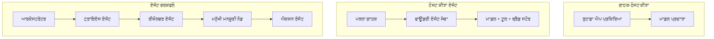
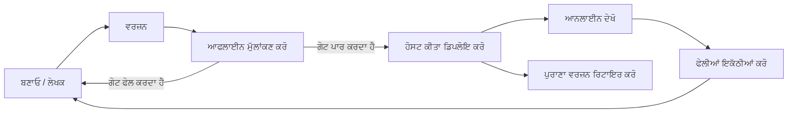
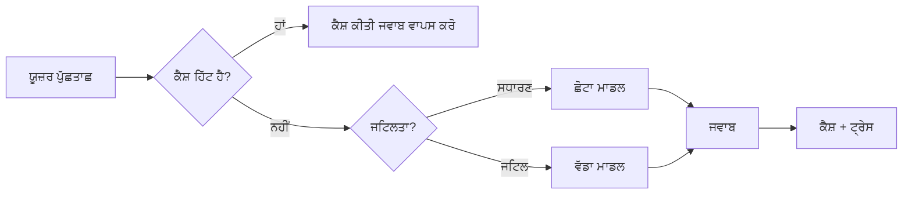
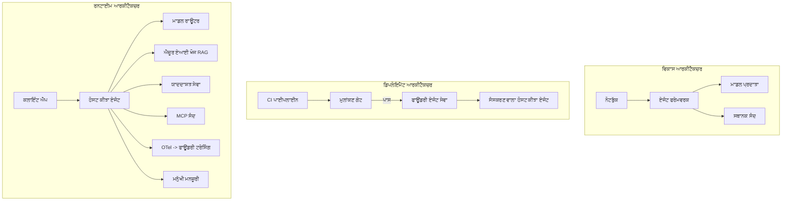

# ਮਾਇਕਰੋਸਾਫਟ ਫਾਊਂਡਰੀ ਨਾਲ ਸਕੇਲ ਕਰਨ ਯੋਗ ਏਜੰਟਾਂ ਨੂੰ ਤਾਇਨਾਤ ਕਰਨਾ


ਕੋਰਸ ਦੇ ਇਸ ਤੱਕ ਦੇ ਹਿੱਸੇ ਤੱਕ ਤੁਸੀਂ ਐਜੰਟ ਬਣਾ ਚੁੱਕੇ ਹੋ ਜੋ ਤੁਹਾਡੇ ਲੈਪਟੌਪ 'ਤੇ, ਨੋਟਬੁੱਕ ਦੇ ਅੰਦਰ ਚੱਲਦੇ ਹਨ, `az login` ਅਤੇ ਕੁਝ ਮਾਹੌਲ ਵਿਕਲਪਿਆਂ ਦੁਆਰਾ ਚਲਾਏ ਜਾਂਦੇ ਹਨ। ਇਹ ਸਿੱਖਣ ਦਾ ਬਿਲਕੁਲ ਠੀਕ ਤਰੀਕਾ ਹੈ। ਪਰ ਇਹ ਉਹ ਠੀਕ ਤਰੀਕਾ ਨਹੀਂ ਹੈ ਜਿਸ ਨਾਲ ਸਵੇਰੇ 3 ਵਜੇ ਹਜ਼ਾਰਾਂ ਗਾਹਕ ਆਪਣੇ ਭਰੋਸੇ ਵਾਲੇ ਏਜੰਟ ਨੂੰ ਚਲਾਉਂਦੇ ਹਨ।

ਇਹ ਪਾਠ "ਇਹ ਮੇਰੀ ਮਸ਼ੀਨ 'ਤੇ ਕੰਮ ਕਰਦਾ ਹੈ" ਅਤੇ "ਇਹ ਪੈਦਾਵਾਰੀ ਵਿੱਚ ਭਰੋਸੇਯੋਗ ਅਤੇ ਵਾਜਿਬ ਕੀਮਤ 'ਤੇ ਕੰਮ ਕਰਦਾ ਹੈ" ਵਿਚਕਾਰ ਫਰਕ ਬਾਰੇ ਹੈ। ਅਸੀਂ ਇਹ ਫਰਕ **ਮਾਇਕਰੋਸਾਫਟ ਫਾਊਂਡਰੀ** ਅਤੇ **ਮਾਇਕਰੋਸਾਫਟ ਫਾਊਂਡਰੀ ਏਜੰਟ ਸਰਵਿਸ** ਦੀ ਵਰਤੋਂ ਕਰਕੇ ਪੂਰਾ ਕਰਦੇ ਹਾਂ, ਅਤੇ ਅਸੀਂ ਇੱਕ ਅਸਲੀ ਗਾਹਕ ਸਹਾਇਤਾ ਏਜੰਟ ਬਣਾ ਕੇ ਕਰਦੇ ਹਾਂ ਜਿਸ ਵਿੱਚ ਸੰਦ, ਪ੍ਰਾਪਤੀ, ਯਾਦਦਾਸ਼ਤ, ਮੂਲਾਂਕਣ ਅਤੇ ਨਿਗਰਾਨੀ ਹੁੰਦੀ ਹੈ।

## ਜਾਣ-ਪਹਿਚਾਣ

ਇਸ ਪਾਠ ਵਿੱਚ ਦਿੱਤੇ ਜਾਣਗੇ:

- **ਪ੍ਰੋਟੋਟਰਾਈਪ ਏਜੰਟ** ਅਤੇ **ਤਾਇਨਾਤ ਏਜੰਟ** ਵਿਚਕਾਰ ਅੰਤਰ, ਅਤੇ ਕਿਉਂ ਇਹ ਬਦਲਾਅ ਜ਼ਿਆਦਾਤਰ ਮਾਡਲ ਦੇ *ਆਲੇ-ਦੁਆਲੇ* ਸਾਰੇ ਚੀਜ਼ਾਂ ਬਾਰੇ ਹੁੰਦਾ ਹੈ।
- ਏਜੰਟਾਂ ਲਈ **ਤਾਇਨਾਤ ਨਮੂਨੇ**: ਕਲਾਇੰਟ-ਹੋਸਟਡ, ਸਰਵਿਸ-ਹੋਸਟਡ (ਹੋਸਟਡ ਏਜੰਟ), ਅਤੇ ਵਰਕਫਲੋ-ਓਰਕੇਸਟਰੈਟਿਡ।
- ਮਾਇਕਰੋਸਾਫਟ ਫਾਊਂਡਰੀ ਤੇ ਏਜੰਟ ਦਾ **ਜੀਵਨ ਚਕਰ** — ਬਣਾਓ, ਵਰਜਨ ਕਰੋ, ਤਾਇਨਾਤ ਕਰੋ, ਮੂਲਾਂਕਣ ਕਰੋ, ਨਿਗਰਾਨੀ ਕਰੋ, ਰਿਟਾਇਰ ਕਰੋ।
- **ਸਕੇਲਿੰਗ ਰਣਨੀਤੀਆਂ**: ਮਾਡਲ ਰਾਊਟਿੰਗ, ਕੈਸ਼ਿੰਗ, ਸਮਕਾਲੀਕਾਰਤਾ, ਅਤੇ ਸਟੈਟਲੇਸ ਡਿਜ਼ਾਇਨ।
- ਓਪਨਟੈਲੀਮੈਟਰੀ ਅਤੇ ਫਾਊਂਡਰੀ ਟ੍ਰੇਸਿੰਗ ਨਾਲ **ਨਿਗਰਾਨੀ**।
- ਮਾਡਲ ਚੋਣ, ਰਾਊਟਿੰਗ ਅਤੇ ਮੂਲਾਂਕਣ ਗੇਟਾਂ ਦੁਆਰਾ **ਲਾਗਤ ਦੀ ਬਚਤ**।
- **ਐਂਟਰਪ੍ਰਾਈਜ਼ ਵਿਚਾਰ**: ਗਵਰਨੈਂਸ, ਮਨੁੱਖੀ ਮਨਜ਼ੂਰੀ, ਅਤੇ MCP ਸਰਵਰਾਂ ਨੂੰ ਪੈਦਾਵਾਰੀ ਵਿੱਚ ਸੁਰੱਖਿਅਤ ਤੌਰ 'ਤੇ ਚਲਾਉਣਾ।

## ਸਿੱਖਣ ਦੇ ਲੱਕੜੇ

ਇਸ ਪਾਠ ਨੂੰ ਪੂਰਾ ਕਰਨ ਤੋਂ ਬਾਅਦ, ਤੁਸੀਂ ਜਾਣੋਗੇ ਕਿ ਕਿਵੇਂ:

- ਕਿਸੇ ਦਿੱਤੇ ਏਜੰਟ ਵਰਕਲੋਡ ਲਈ ਠੀਕ ਤਾਇਨਾਤ ਨਮੂਨਾ ਚੁਣਨਾ।
- ਏਜੰਟ ਨੂੰ ਮਾਇਕਰੋਸਾਫਟ ਫਾਊਂਡਰੀ ਏਜੰਟ ਸਰਵਿਸ 'ਤੇ ਤਾਇਨਾਤ ਕਰਨਾ ਤਾਂ ਜੋ ਇਹ ਵਰਜਨਸ਼ੁਦ ਅਤੇ ਗਵਰਨ ਕੀਤੇ ਜਾ ਸਕੇ ਅਤੇ ਨਿਗਰਾਨੀ ਯੋਗ ਹੋਵੇ।
- ਟ੍ਰੇਸਿੰਗ ਲਈ ਏਜੰਟ ਨੂੰ ਇੰਸਟਰੂਮੈਂਟ ਕਰਨਾ ਅਤੇ ਅਜਿਹਾ ਮੂਲਾਂਕਣ ਪਾਇਪਲਾਈਨ ਸੈੱਟ ਕਰਨਾ ਜੋ ਹਰ ਰਿਲੀਜ਼ ਤੋਂ ਪਹਿਲਾਂ ਚੱਲਦਾ ਹੈ।
- ਮਾਡਲ ਰਾਊਟਿੰਗ ਅਤੇ ਕੈਸ਼ਿੰਗ ਲਾਗੂ ਕਰਨਾ ਤਾਂ ਜੋ ਸਕੇਲ 'ਤੇ ਲੈਟੈਂਸੀ ਅਤੇ ਲਾਗਤ ਨੂੰ ਨਿਯੰਤਰਿਤ ਕੀਤਾ ਜਾ ਸਕੇ।
- ਉੱਚ-ਖ਼ਤਰਾ ਵਾਲੇ ਕਦਮਾਂ ਲਈ ਮਨੁੱਖੀ ਮਨਜ਼ੂਰੀ ਗੇਟ ਜੋੜਨਾ ਅਤੇ MCP ਸਰਵਰ ਨੂੰ ਪੈਦਾਵਾਰੀ ਸੁਰੱਖਿਅਤ ਤਰੀਕੇ ਨਾਲ ਇੰਟੀਗ੍ਰੇਟ ਕਰਨਾ।

## ਪੂਰਵ-ਆਵਸ਼ਕਤਾਵਾਂ

ਇਹ ਪਾਠ ਮੰਨਦਾ ਹੈ ਕਿ ਤੁਸੀਂ ਪਹਿਲਾਂ ਦੇ ਪਾਠਾਂ ਨੂੰ ਪੂਰਾ ਕਰ ਚੁੱਕੇ ਹੋ ਅਤੇ ਸਹੂਲਤ ਨਾਲ:

- [ਮਾਇਕਰੋਸਾਫਟ ਏਜੰਟ ਫਰੇਮਵਰਕ](../14-microsoft-agent-framework/README.md) ਦੇ ਨਾਲ ਏਜੰਟ ਬਣਾਉਣਾ (ਪਾਠ 14)।
- [ਟੂਲ ਦੀ ਵਰਤੋਂ](../04-tool-use/README.md) (ਪਾਠ 4) ਅਤੇ [ਏਜੰਟਿਕ RAG](../05-agentic-rag/README.md) (ਪਾਠ 5)।
- [ਏਜੰਟ ਯਾਦਦਾਸ਼ਤ](../13-agent-memory/README.md) (ਪਾਠ 13) ਅਤੇ [ਏਜੰਟਿਕ ਪ੍ਰੋਟੋਕੋਲ / MCP](../11-agentic-protocols/README.md) (ਪਾਠ 11)।
- [ਨਿਗਰਾਨੀ ਅਤੇ ਮੂਲਾਂਕਣ](../10-ai-agents-production/README.md) (ਪਾਠ 10) — ਇਸ ਪਾਠ 'ਤੇ ਸੀਧਾ ਨਿਰਭਰ ਹੈ।

ਤੁਹਾਨੂੰ ਇਸਦੇ ਨਾਲ ਇਹ ਵੀ ਚਾਹੀਦਾ ਹੈ:

- ਇੱਕ **ਅਜ਼ੁਰ ਸਬਸਕ੍ਰਿਪਸ਼ਨ** ਅਤੇ ਇੱਕ **ਮਾਇਕਰੋਸਾਫਟ ਫਾਊਂਡਰੀ ਪ੍ਰੋਜੈਕਟ** ਜਿਸ ਵਿੱਚ ਘੱਟੋ-ਘੱਟ ਇੱਕ ਤਾਇਨਾਤ ਕੀਤਾ ਚੈਟ ਮਾਡਲ ਹੋਵੇ।
- ਸਹੀ ਤਰ੍ਹਾਂ ਲਾਗਇਨ ਕੀਤਾ **ਅਜ਼ੁਰ CLI** (`az login`)।
- ਪਾਈਥਨ 3.12+ ਅਤੇ ਰਿਪੋਜ਼ਿਟਰੀ ਵਿਚ ਮੌਜੂਦ ਪੈਕੇਜ [`requirements.txt`](../../../requirements.txt)।

## ਪ੍ਰੋਟੋਟਾਈਪ ਤੋਂ ਪੈਦਾਵਾਰੀ ਤੱਕ: ਅਸਲ ਵਿੱਚ ਕੀ ਬਦਲਦਾ ਹੈ

ਇੱਕ ਪ੍ਰੋਟੋਟਾਈਪ ਏਜੰਟ ਅਤੇ ਪ੍ਰੋਡਕਸ਼ਨ ਏਜੰਟ ਇੱਕੋ ਜਿਹਾ ਮੁੱਖ ਲੂਪ ਸਾਂਝਾ ਕਰਦੇ ਹਨ — ਸੋਚਣਾ, ਸੰਦਾਂ ਨੂੰ ਕਾਲ ਕਰਨਾ, ਜਵਾਬ ਦੇਣਾ। ਬਦਲਾਅ ਉਸ ਲੂਪ ਦੇ ਆਲੇ-ਦੁਆਲੇ ਸਾਰੀਆਂ ਚੀਜ਼ਾਂ ਵਿੱਚ ਹੁੰਦਾ ਹੈ। ਮਾਡਲ ਸ਼ਾਇਦ ਉਤਪਾਦਨ ਏਜੰਟ ਦਾ 20% ਹੁੰਦਾ ਹੈ; ਬਾਕੀ 80% ਓਪਰੇਸ਼ਨਲ ਖਾਕਾ ਹੁੰਦਾ ਹੈ।

| ਚਿੰਤਾ | ਪ੍ਰੋਟੋਟਾਈਪ | ਪ੍ਰੋਡਕਸ਼ਨ |
| --- | --- | --- |
| **ਹੋਸਟਿੰਗ** | ਤੁਹਾਡੇ ਨੋਟਬੁੱਕ ਵਿੱਚ ਚੱਲਦਾ ਹੈ | ਇੱਕ ਹੋਸਟਡ ਸਰਵਿਸ ਵਜੋਂ ਚੱਲਦਾ ਹੈ, ਵਰਜਨਸ਼ੁਦ ਅਤੇ ਰੋਲ ਆਊਟ |
| **ਪਛਾਣ** | ਤੁਹਾਡਾ `az login` ਟੋਕਨ | ਸਕੋਪਡ RBAC ਵਾਲੀ ਮੈਨੇਜਡ ਪਛਾਣ |
| **ਸਟੇਟ** | ਮੈਮੋਰੀ ਵਿੱਚ, ਰੀਸਟਾਰਟ ਤੇ ਖੋ ਜਾਂਦਾ ਹੈ | ਬਾਹਰੀਕ੍ਰਿਤ (ਥ੍ਰੈਡ ਸਟੋਰ, ਯਾਦਦਾਸ਼ਤ ਸੇਵਾ) |
| **ਫੇਲ੍ਹਯਰ** | ਤੁਸੀਂ ਟ੍ਰੇਸਬੈਕ ਵੇਖਦੇ ਹੋ | ਮੁੜ ਕੋਸ਼ਿਸ਼, ਫਾਲਬੈਕ, ਡੈੱਡ-ਲੇਟਰ, ਅਲਰਟ |
| **ਲਾਗਤ** | "ਇਹ ਕੁਝ ਸੈਂਟਾਂ ਦੀ ਗੱਲ ਹੈ" | ਹਰ ਬੇਨਤੀ 'ਤੇ ਟ੍ਰੈਕ ਕੀਤਾ, ਰਾਊਟ ਕੀਤਾ, ਕੈਸ਼ ਕੀਤਾ, ਬਜਟ ਕੀਤਾ |
| **ਗੁణਵੱਤਾ** | ਤੁਸੀਂ ਨਤੀਜਾ ਦੇਖਦੇ ਹੋ | ਹਰ ਰਿਲੀਜ਼ ਤੋਂ ਪਹਿਲਾਂ ਆਟੋਮੈਟਿਕ ਤੌਰ 'ਤੇ ਮੂਲਾਂਕਣ ਕੀਤਾ |
| **ਭਰੋਸਾ** | ਤੁਸੀਂ ਹਰ ਕਦਮ ਦੀ ਮਨਜ਼ੂਰੀ ਦਿੰਦੇ ਹੋ | ਨੀਤੀ + ਖਤਰਨਾਕ ਕਾਰਵਾਈ ਲਈ ਮਨੁੱਖੀ-ਦਖਲ |

ਇਸ ਸਾਰਣੀ ਨੂੰ ਯਾਦ ਰੱਖੋ। ਹੇਠਾਂ ਦਿੱਤੇ ਹਰ ਸੈਕਸ਼ਨ ਵਿੱਚੋਂ ਕੋਈ ਇੱਕ ਇਸ ਜਾਂਚ ਸੇਲ ਨਾਲ ਮੇਲ ਖਾਂਦਾ ਹੈ।

## ਏਜੰਟ ਤਾਇਨਾਤ ਨਮੂਨੇ

ਤਿੰਨ ਨਮੂਨੇ ਹਨ ਜੋ ਤੁਸੀਂ ਅਕਸਰ ਮਿਲਾ ਕੇ ਵਰਤੋਂਗੇ।

### 1. ਕਲਾਇੰਟ-ਹੋਸਟਡ ਏਜੰਟ

ਏਜੰਟ ਆਬਜੈਕਟ *ਤੁਹਾਡੇ* ਐਪਲੀਕੇਸ਼ਨ ਪ੍ਰੋਸੈਸ ਵਿੱਚ ਹੋਂਦਾ ਹੈ। ਤੁਹਾਡਾ ਕੋਡ ਸਿੱਧਾ ਮਾਡਲ ਪ੍ਰਦਾਤਾ ਨੂੰ ਕਾਲ ਕਰਦਾ ਹੈ; ਸੋਚਣ ਦਾ ਲੂਪ ਤੁਹਾਡੇ ਸਰਵਿਸ ਵਿੱਚ ਚੱਲਦਾ ਹੈ। ਇਸੇ ਤਰ੍ਹਾਂ ਹਰ ਪਿਛਲੇ ਪਾਠਾਂ ਨੇ ਕੀਤਾ ਹੈ।

- **ਵਰਤੋਂ ਕਰੋ ਜਦੋਂ** ਤੁਹਾਨੂੰ ਲੂਪ 'ਤੇ ਪੂਰੀ ਕੁੰਟਰੋਲ, ਕਸਟਮ ਮਿਡਲਵੇਅਰ ਚਾਹੀਦਾ ਹੋਵੇ ਜਾਂ ਤੁਸੀਂ ਏਜੰਟ ਨੂੰ ਮੌਜੂਦਾ ਬੈਕਏਂਡ ਵਿੱਚ ਜਾਂਚ ਰਹੇ ਹੋ।
- **ਟਰੇਡ-ਆਫ**: ਤੁਸੀਂ ਆਪਣੇ ਆਪ ਹੀ ਸਕੇਲਿੰਗ, ਸਟੇਟ ਅਤੇ ਮਜ਼ਬੂਤੀ ਤੁਹਾਨੂੰ ਸੁੰਭਾਲਣੀ ਪਵੇਗੀ।

### 2. ਹੋਸਟਡ ਏਜੰਟ (ਫਾਊਂਡਰੀ ਏਜੰਟ ਸਰਵਿਸ)

ਏਜੰਟ ਮਾਇਕਰੋਸਾਫਟ ਫਾਊਂਡਰੀ ਵਿੱਚ *ਇੱਕ ਸਰੋਤ ਵਜੋਂ ਦਰਜ* ਹੁੰਦਾ ਹੈ। ਫਾਊਂਡਰੀ ਸੋਚਣ ਦਾ ਲੂਪ ਚਲਾਂਦਾ ਹੈ, ਥ੍ਰੈਡ ਸੰਭਾਲਦਾ ਹੈ, ਸਮੱਗਰੀ ਸੁਰੱਖਿਆ ਅਤੇ RBAC ਲਾਗੂ ਕਰਦਾ ਹੈ, ਅਤੇ ਏਜੰਟ ਨੂੰ ਫਾਊਂਡਰੀ ਪੋਰਟਲ ਵਿੱਚ ਦਿਖਾਉਂਦਾ ਹੈ। ਤੁਹਾਡੀ ਐਪ ਇੱਕ ਪਤਲੇ ਕਲਾਇੰਟ ਵਜੋਂ ਬੰਨੀ ਰਹਿੰਦੀ ਹੈ ਜੋ ਥ੍ਰੈਡ ਬਣਾਉਂਦੀ ਹੈ ਅਤੇ ਜਵਾਬ ਪੜ੍ਹਦੀ ਹੈ।

- **ਵਰਤੋਂ ਕਰੋ ਜਦੋਂ** ਤੁਹਾਨੂੰ ਟਿਕਾਊਪਨ, ਡਿਫਾਲਟ ਨਿਗਰਾਨੀ, ਗਵਰਨੈਂਸ, ਅਤੇ ਘੱਟ ਓਪਰੇਸ਼ਨਲ ਛੇਤਰ ਚਾਹੀਦਾ ਹੋਵੇ।
- **ਟਰੇਡ-ਆਫ**: ਪ੍ਰਬੰਧਿਤ ਰਨਟਾਈਮ ਲਈ ਘੱਟ ਨੀਵੀਂ ਕੁੰਟਰੋਲ।

### 3. ਏਜੰਟ ਵਰਕਫਲੋਜ਼

ਕਈ ਏਜੰਟ (ਅਤੇ ਸੰਦ) ਇੱਕ ਗ੍ਰਾਫ ਵਿੱਚ ਜੁੜਦੇ ਹਨ ਜਿਸ ਵਿੱਚ ਸਪੱਸ਼ਟ ਨਿਯੰਤਰਣ ਪ੍ਰਵਾਹ ਹੁੰਦਾ ਹੈ — ਲੜੀਵਾਰ ਕਦਮ, ਸ਼ਾਖਾ, ਮਾਨਵੀ ਮਨਜ਼ੂਰੀ ਨੋਡ, ਅਤੇ ਟਿਕਾਊ ਚੈਕਪੌਇੰਟ ਜੋ ਰੁਕ ਅਤੇ ਮੁੜ ਚੱਲ ਸਕਦੇ ਹਨ। ਇਹ ਮਾਇਕਰੋਸਾਫਟ ਏਜੰਟ ਫਰੇਮਵਰਕ ਦੀ **ਵਰਕਫਲੋਜ਼** ਖੂਬੀ ਹੈ ਜੋ ਤਾਇਨਾਤ ਦੇ ਪੱਧਰ 'ਤੇ ਲਾਗੂ ਹੁੰਦੀ ਹੈ।

- **ਵਰਤੋਂ ਕਰੋ ਜਦੋਂ** ਇੱਕ ਕੰਮ ਕਈ ਵਿਸ਼ੇਸ਼ ਏਜੰਟਾਂ ਨੂੰ ਛੂਹਦਾ ਹੈ ਜਾਂ ਵਿਚਕਾਰ ਮਨਜ਼ੂਰੀ ਕਦਮ ਦੀ ਲੋੜ ਹੋਵੇ।
- **ਟਰੇਡ-ਆਫ**: ਜ਼ਿਆਦਾ ਹਿੱਸੇ; ਓਰਕੇਸਟਰੈਸ਼ਨ ਪੱਧਰ ਦੀ ਨਿਗਰਾਨੀ ਦੀ ਲੋੜ।



## ਮਾਇਕਰੋਸਾਫਟ ਫਾਊਂਡਰੀ ਤੇ ਏਜੰਟ ਦਾ ਜੀਵਨ ਚਕਰ

ਏਜੰਟ ਨੂੰ ਤਾਇਨਾਤ ਕਰਨਾ ਇੱਕ ਵਾਰੀ ਦਾ `ਪੁਸ਼` ਨਹੀਂ ਹੁੰਦਾ। ਇਹ ਇੱਕ ਲੂਪ ਹੁੰਦਾ ਹੈ ਅਤੇ ਇਹ ਇੱਕ ਸਾਫਟਵੇਅਰ ਰਿਲੀਜ਼ ਚਕਰ ਵਾਂਗ ਲੱਗਦਾ ਹੈ ਕਿਉਂਕਿ ਇਹੀ ਅਸਲ ਵਿੱਚ ਹੈ।



ਮੁੱਖ ਵਿਚਾਰ, [ਪਾਠ 10](../10-ai-agents-production/README.md) ਤੋਂ ਲਿਆ ਗਿਆ: **ਆਫਲਾਈਨ ਮੂਲਾਂਕਣ ਇੱਕ ਗੇਟ ਹੈ, ਬਾਅਦ ਦੀ ਸੋਚ ਨਹੀਂ।** ਨਵਾਂ ਏਜੰਟ ਵਰਜਨ ਉਸ ਦੌਰਾਨ ਨਹੀਂ ਜਾਵੇਗਾ ਜਦੋਂ ਤੱਕ ਉਸਦਾ ਮੂਲਾਂਕਣ ਤੁਹਾਡੇ ਮਾਰਕਾਂ ਨੂੰ ਪਾਸ ਨਾ ਕਰੇ। ਆਨਲਾਈਨ ਨਿਗਰਾਨੀ ਹਕੀਕਤੀ ਫੇਲ੍ਹਯਰਾਂ ਨੂੰ ਤੁਹਾਡੇ ਆਫਲਾਈਨ ਟੈਸਟ ਸੈੱਟ ਵਿੱਚ ਵਾਪਸ ਭੇਜਦੀ ਹੈ। ਇਹੀ ਪੂਰਾ ਲੂਪ ਹੈ।

## ਸਕੇਲਿੰਗ ਰਣਨੀਤੀਆਂ

ਇੱਕ ਏਜੰਟ ਦਾ ਸਕੇਲ ਵੈਬ ਏਪੀਅਈ ਨਾਲ ਵੱਖਰਾ ਹੁੰਦਾ ਹੈ, ਕਿਉਂਕਿ ਹਰ ਬੇਨਤੀ ਕਈ ਮਹਿੰਗੇ ਮਾਡਲ ਅਤੇ ਸੰਦ ਕਾਲ ਕਰ ਸਕਦੀ ਹੈ। ਚਾਰ ਤਕਨੀਕਾਂ ਸਭ ਤੋਂ ਜ਼ਿਆਦਾ ਭਾਰ ਲੈਂਦੀਆਂ ਹਨ।

**ਸਟੈਟਲੇਸ ਬੇਨਤੀ ਸੰਭਾਲਣ।** ਤੁਹਾਡੇ ਪ੍ਰੋਸੈਸ ਮੈਮੋਰੀ ਵਿੱਚ ਪ੍ਰਤੀ ਉਪਭੋਗਤਾ ਸਟੇਟ ਨਾ ਰੱਖੋ। ਗੱਲਬਾਤ ਥ੍ਰੈਡ ਨੂੰ ਫਾਊਂਡਰੀ ਥ੍ਰੈਡ ਸਟੋਰ ਜਾਂ ਯਾਦਦਾਸ਼ਤ ਤੇ ਸੇਵਾ ਵਿੱਚ ਸੁਰੱਖਿਅਤ ਕਰੋ ਤਾਂ ਜੋ ਕੋਈ ਵੀ ਇੰਸਟੈਂਸ ਕੋਈ ਵੀ ਬੇਨਤੀ ਸੰਭਾਲ ਸਕੇ। ਇਹ ਤੁਹਾਡੇ ਨੂੰ ਅੱਧੀ ਤਰ੍ਹਾਂ ਸਕੇਲ ਕਰਨ ਦੀ ਆਗਿਆ ਦਿੰਦਾ ਹੈ — ਇੰਸਟੈਂਸ ਵਧਾਓ, ਕੋਈ ਸਟਿੱਕੀ ਸੈਸ਼ਨ ਨਹੀਂ।

**ਮਾਡਲ ਰਾਊਟਿੰਗ।** ਹਰ ਬੇਨਤੀ ਨੂੰ ਤੁਹਾਡੇ ਸਭ ਤੋਂ ਸਮਰੱਥ (ਅਤੇ ਮਹਿੰਗੇ) ਮਾਡਲ ਦੀ ਲੋੜ ਨਹੀਂ। ਸਧਾਰਣ ਬੇਨਤੀਆਂ — ਇਰਾਦਾ ਵਰਗੀ ਕਲਾਸੀਫਿਕੇਸ਼ਨ, ਛੋਟੇ ਤੱਥਵਾਦੀ ਜਵਾਬ — ਇੱਕ ਛੋਟੇ, ਤੇਜ਼ ਮਾਡਲ ਨੂੰ ਭੇਜੋ, ਅਤੇ ਵੱਡੇ ਮਾਡਲ ਨੂੰ ਅਸਲੀ ਸੋਚ ਲਈ ਰੱਖੋ। ਫਾਊਂਡਰੀ ਦਾ **ਮਾਡਲ ਰਾਊਟਰ** ਇਹ ਤੁਹਾਡੇ ਲਈ ਕਰ ਸਕਦਾ ਹੈ, ਜਾਂ ਤੁਸੀਂ ਹਲਕਾ ਫਿਲਟਰ ਖੁਦ ਬਣਾਉ। ਤੁਸੀਂ ਲੈਬ ਵਿੱਚDIY ਵਰਜ਼ਨ ਬਣਾਵੋਗੇ।

**ਜਵਾਬਾਂ ਦੀ ਕੈਸ਼ਿੰਗ।** ਬਹੁਤ ਸਾਰੇ ਸਹਾਇਤਾ ਪ੍ਰਸ਼ਨ ਕਰੀਬ-ਕਰੀਬ ਦੁਹਰਾਏ ਗਏ ("ਮੇਰਾ ਪਾਸਵਰਡ ਕਿਵੇਂ ਰੀਸੈੱਟ ਕਰਦਾ ਹਾਂ?")। ਆਮ ਪ੍ਰਸ਼ਨਾਂ ਦੇ ਜਵਾਬ ਕੈਸ਼ ਕਰੋ ਅਤੇ ਇਨ੍ਹਾਂ ਨੂੰ ਮਾਡਲ ਨੂੰ ਹਿੱਟ ਕੀਤੇ ਬਿਨਾਂ ਦਿਓ। ਇੱਕ ਛੋਟੀ ਕੈਸ਼ ਹਿੱਟ ਦਰ ਵੀ ਮਹੱਤਵਪੂਰਨ ਤੌਰ 'ਤੇ ਲਾਗਤ ਅਤੇ ਲੈਟੈਂਸੀ ਘਟਾਉਂਦੀ ਹੈ।

**ਸਮਕਾਲੀਕਾਰਤਾ ਅਤੇ ਬੈਕਪ੍ਰੈਸ਼ਰ।** ਮਾਡਲ ਪ੍ਰਦਾਤਿਆਂ ਦੀਆਂ ਦਰ ਸੀਮਾਵਾਂ ਹੁੰਦੀਆਂ ਹਨ। ਆਪਣੀ ਸਮਕਾਲੀਕਾਰਤਾ 'ਤੇ ਸੀਮਾ ਲਗਾਓ, ਵਧਦੀਆਂ ਮੁੜ ਕੋਸ਼ਿਸ਼ਾਂ ਨਾਲ ਵਿਸ਼ਲੇਸ਼ਣ ਕਰੋ ਅਤੇ ਸੋਹਣੇ ਤਰੀਕੇ ਨਾਲ ਫੇਲ੍ਹ ਹੋਵੋ (ਪੰਗ੍ਹਾ ਲੜੀਵਾਰ ਜਵਾਬ 500 ਤੋਂ ਵਧੀਆ ਹੈ)।



## ਪੈਦਾਵਾਰੀ ਵਿੱਚ ਨਿਗਰਾਨੀ

ਤੁਸੀਂ ਉਹ ਨਹੀਂ ਚਲਾ ਸਕਦੇ ਜੋ ਤੁਸੀਂ ਨਹੀਂ ਵੇਖ ਸਕਦੇ। ਜਿਵੇਂ ਕਿ ਪਾਠ 10 ਵਿੱਚ ਜ਼ਿਕਰ ਕੀਤਾ ਗਿਆ, ਮਾਇਕਰੋਸਾਫਟ ਏਜੰਟ ਫਰੇਮਵਰਕ ਸਵੈਭਾਵਿਕ ਤੌਰ 'ਤੇ **ਓਪਨਟੈਲੀਮੈਟਰੀ** ਟ੍ਰੇਸਜ਼ ਜਾਰੀ ਕਰਦਾ ਹੈ — ਹਰ ਮਾਡਲ ਕਾਲ, ਟੂਲ ਕਾਲ ਅਤੇ ਓਰਕੇਸਟਰੈਸ਼ਨ ਕਦਮ ਇੱਕ ਸਪੈਨ ਬਣ ਜਾਂਦਾ ਹੈ। ਪੈਦਾਵਾਰੀ ਵਿੱਚ ਤੁਸੀਂ ਇਹ ਸਪੈਨ Microsoft Foundry (ਜਾਂ ਕੋਈ ਵੀ OTel-ਕੰਮਪੈਟਿਬਲ ਬੈਕਐਂਡ) ਨੂੰ ਐਕਸਪੋਰਟ ਕਰਦੇ ਹੋ ਤਾਂ ਜੋ ਤੁਸੀਂ:

- ਇਕ ਗਾਹਕ ਦੀ ਸ਼ਿਕਾਇਤ ਨੂੰ ਹਰ ਮਾਡਲ ਅਤੇ ਟੂਲ ਕਾਲ ਵਿੱਚ ਪੂਰਾ ਟ੍ਰੇਸ ਕਰੋ।
- ਸਮੇਂ ਨਾਲ ਪ੍ਰਤੀ ਬੇਨਤੀ p50/p95 ਲੈਟੈਂਸੀ ਅਤੇ ਲਾਗਤ ਵੇਖੋ।
- ਗਲਤੀ ਦਰ ਵਿੱਚ ਤੇਜ਼ ਵਾਧੇ ਅਤੇ ਲਾਗਤ ਦੀਆਂ ਗੜਬੜਾਂ ਬਾਰੇ ਅਲਰਟ ਕਰੋ, ਪਹਿਲਾਂ ਤਾਂ ਕਿ ਤੁਹਾਡੇ ਉਪਭੋਗਤਾ (ਜਾਂ ਤੁਹਾਡੀ ਵਿੱਤੀ ਟੀਮ) ਇਸਨੂੰ ਨਾ ਦੇਖ ਸਕਣ।

```python
from agent_framework.observability import get_tracer

tracer = get_tracer()

with tracer.start_as_current_span("support_request") as span:
    span.set_attribute("customer.tier", "enterprise")
    span.set_attribute("routed.model", "gpt-5-nano")
    # ਏਜੰਟ ਦੀ ਕਾਰਵਾਈ ਇਸ ਸਪੈਨ ਅੰਦਰ ਆਟੋਮੈਟਿਕ ਤੌਰ ਤੇ ਟਰੇਸ ਕੀਤੀ ਜਾਂਦੀ ਹੈ
```

`customer.tier` ਅਤੇ `routed.model` ਵਰਗੀਆਂ ਵਿਸ਼ੇਸ਼ਤਾਵਾਂ ਇੱਕ ਟ੍ਰੇਸ ਦੀ ਭੀੜ ਨੂੰ ਆਪਣੇ ਜਵਾਬੀ ਸਵਾਲਾਂ ਵਿੱਚ ਬਦਲ ਦੇਂਦੀਆਂ ਹਨ ("ਕੀ ਕੰਪਨੀ ਗਾਹਕ ਛੋਟੇ ਮਾਡਲ ਨੂੰ ਬਹੁਤ ਵਾਰੀ ਮਿਲ ਰਿਹਾ ਹੈ?")।

## ਲਾਗਤ ਦੀ ਬਚਤ

ਪੈਦਾਵਾਰੀ ਏਜੰਟਾਂ ਵਿੱਚ ਲਾਗਤ ਟੋਕਨਾਂ ਦੁਆਰਾ ਰੁਜੀ ਹੈ। ਤਿੰਨ ਬੁਨਿਆਦੀ ਤਰਕੇ, ਪ੍ਰਭਾਵ ਦੇ ਕ੍ਰਮ ਵਿੱਚ:

1. **ਮਾਡਲ ਦਾ ਸਹੀ ਆਕਾਰ ਚੁਣੋ।** ਇੱਕ ਛੋਟਾ ਮਾਡਲ ਜੋ ਤੁਹਾਡੇ ਮੂਲਾਂਕਣ ਦਰਵਾਜ਼ੇ ਨੂੰ ਪਾਸ ਕਰਦਾ ਹੈ, ਵੱਡੇ ਮਾਡਲ ਨਾਲੋਂ ਲਗਭਗ ਹਮੇਸ਼ਾ ਸਸਤਾ ਹੁੰਦਾ ਹੈ। ਮੂਲਾਂਕਣ ਵਰਤੋਂ ਤਾਂ ਕਿ ਸਾਬਤ ਹੋ ਜਾਏ ਕਿ ਛੋਟਾ ਮਾਡਲ ਕਾਫ਼ੀ ਹੈ, ਨਾ ਕਿ ਸਭ ਤੋਂ ਵੱਡਾ ਮਾਡਲ ਡਿਵੈਲਪਮੈਂਟ ਦੀ ਵਜ੍ਹਾ ਨਾਲ ਡਿਫਾਲਟ ਬਣ ਜਾਵੇ।
2. **ਜਟਿਲਤਾ ਦੇ ਆਧਾਰ 'ਤੇ ਰਾਊਟਿੰਗ।** ਉਪਰੋਕਤ ਤਰ੍ਹਾਂ — ਵੱਡੇ ਮਾਡਲ ਦੀ ਕੀਮਤ ਸਿਰਫ ਉਹਨਾਂ ਬੇਨਤੀਆਂ ਲਈ ਭਰੋ ਜੋ ਵੱਡੇ ਮਾਡਲ ਦੀ ਸੋਚ ਕਰਦੀਆਂ ਹਨ।
3. **ਕੈਸ਼ਿੰਗ ਜ਼ੋਰਦਾਰ ਕਰੋ।** ਸਭ ਤੋਂ ਸਸਤੀ ਮਾਡਲ ਕਾਲ ਉਹ ਹੈ ਜਿਸਨੂੰ ਤੁਸੀਂ ਕਦੇ ਨਹੀਂ ਕਰਦੇ।

ਮੂਲਾਂਕਣ ਗੇਟਾਂ ਅਤੇ ਲਾਗਤ ਨਿਯੰਤਰਣ ਇੱਕੋ ਹੀ ਅਭਿਆਸ ਹਨ ਜੋ ਦੋ ਵੱਖ-ਵੱਖ ਪਹਲੂਆਂ ਨੂੰ ਦੇਖਦੇ ਹਨ: ਮੂਲਾਂਕਣ ਤੁਹਾਨੂੰ *ਗੁਣਵੱਤਾ ਨੀਂਹ* ਦੱਸਦਾ ਹੈ, ਰਾਊਟਿੰਗ ਅਤੇ ਕੈਸ਼ਿੰਗ ਤੁਹਾਨੂੰ ਇਸ ਨੀਂਹ ਦੀ *ਲਾਗਤ* ਵੱਲ ਕਰੀਬ ਰੱਖਦੇ ਹਨ।

## ਐਂਟਰਪ੍ਰਾਈਜ਼ ਤਾਇਨਾਤ ਵਿਚਾਰ

**ਗਵਰਨੈਂਸ।** ਹੋਸਟਡ ਏਜੰਟ ਫਾਊਂਡਰੀ ਦੇ RBAC, ਸਮੱਗਰੀ ਸੁਰੱਖਿਆ ਅਤੇ ਆਡੀਟ ਲਾਗਿੰਗ ਨੂੰ ਵਿਰਾਸਤ ਵਿੱਚ ਲੈਂਦੇ ਹਨ। ਹਰ ਏਜੰਟ ਨੂੰ ਉਸਦੀ ਘੱਟੋ-ਘੱਟ ਜ਼ਰੂਰੀ ਪਰਵਾਨਗੀ ਵਾਲੀ ਮੈਨੇਜਡ ਪਛਾਣ ਦਿਓ — ਸਿਰਫ ਪੜ੍ਹਨ ਲਈ ਜਾਣਕਾਰੀ ਬੇਸ, ਟਿਕਟਿੰਗ API ਲਈ ਸੀਮਿਤ ਪਹੁੰਚ, ਹੋਰ ਕੁਝ ਨਹੀਂ।

**ਮਨੁੱਖੀ-ਦਾਖ਼ਲਾ।** ਕੁਝ ਕਾਰਵਾਈਆਂ ਇੰਨੀ ਜ਼ਿਆਦਾ ਪ੍ਰਭਾਵਸ਼ਾਲੀ ਹੁੰਦੀਆਂ ਹਨ ਕਿ ਉਹ ਮੁੰਹਪੁਰੀ ਤੌਰ 'ਤੇ ਆਟੋਮੈਟ ਕੀਤੀਆਂ ਨਹੀਂ ਜਾ ਸਕਦੀਆਂ — ਰਿਫੰਡ ਜਾਰੀ ਕਰਨਾ, ਖਾਤਾ ਮਿਟਾਉਣਾ, ਕਾਨੂੰਨੀ ਟੀਮ ਨੂੰ ਭੇਜਣਾ। ਮਾਇਕਰੋਸਾਫਟ ਏਜੰਟ ਫਰੇਮਵਰਕ **ਮਨਜ਼ੂਰੀ-ਲੋੜੀਂਦੇ** ਟੂਲਾਂ ਨੂੰ ਸਹਾਇਤਾ ਕਰਦਾ ਹੈ: ਏਜੰਟ ਕਾਰਵਾਈ ਦੀ ਪੇਸ਼ਕਸ਼ ਕਰਦਾ ਹੈ, ਕਾਰਜ ਰੁਕ ਜਾਂਦਾ ਹੈ, ਮਨੁੱਖੀ ਮਨਜ਼ੂਰ ਜਾਂ ਅਸਵੀਕਾਰ ਕਰਦਾ ਹੈ, ਅਤੇ ਵਰਕਫਲੋ ਮੁੜ ਚੱਲਦਾ ਹੈ। ਤੁਸੀਂ ਇਹ ਔਜਾਰ [ਪਾਠ 6](../06-building-trustworthy-agents/README.md) ਵਿੱਚ ਦੇਖਿਆ ਸੀ; ਹੁਣ ਤੁਸੀਂ ਇਸ ਨੂੰ ਤਾਇਨਾਤ ਕਰਦੇ ਹੋ।

**MCP ਪੈਦਾਵਾਰੀ ਵਿੱਚ।** [MCP](../11-agentic-protocols/README.md) ਤੁਹਾਡੇ ਏਜੰਟ ਨੂੰ ਬਾਹਰੀ ਟੂਲਾਂ ਨੂੰ ਇੱਕ ਸਧਾਰਣ ਇੰਟਰਫੇਸ ਰਾਹੀਂ ਵਰਤਣ ਦੀ ਆਗਿਆ ਦਿੰਦਾ ਹੈ। ਪੈਦਾਵਾਰੀ ਵਿੱਚ ਹਰ MCP ਸਰਵਰ ਨੂੰ ਅਣਭਰੋਸੇਯੋਗ ਬਾਰਡਰ ਵਜੋਂ ਮਾਨੋ: ਸਰਵਰ ਦਾ ਵਰਜਨ ਫਿਕਸ ਕਰੋ, ਇਸ ਨੂੰ ਇੱਕ ਸਕੋਪਡ ਪਛਾਣ ਨਾਲ ਚਲਾਓ, ਇਸਦੇ ਨਤੀਜੇ ਚੈੱਕ ਕਰੋ, ਅਤੇ ਕਦੇ ਵੀ ਇਹਦੇ ਨਾਲ ਸੂਤਰਾਂ ਨੂੰ ਸਾਂਝਾ ਨਾ ਕਰੋ। ਇੱਕ MCP ਸਰਵਰ ਇੱਕ ਨਿਰਭਰਤਾ ਹੈ, ਅਤੇ ਨਿਰਭਰਤਾਵਾਂ ਨੂੰ ਪੈਚ, ਆਡੀਟ ਅਤੇ ਦਰ ਸੀਮਿਤ ਕੀਤਾ ਜਾਂਦਾ ਹੈ।



ਇਹ ਤਿੰਨ ਡਾਇਗ੍ਰਾਮ — ਵਿਕਾਸ, ਤਾਇਨਾਤ, ਰਨਟਾਈਮ — ਇੱਕੋ ਹੀ ਏਜੰਟ ਦੀ ਜ਼ਿੰਦਗੀ ਦੇ ਤਿੰਨ ਪੜਾਵ ਹਨ। ਹੇਠਾਂ ਦਿੱਤੀ ਲੈਬ ਤੁਹਾਨੂੰ ਇਸ ਨੂੰ ਬਣਾਉਣ ਵਿੱਚ ਮਦਦ ਕਰੇਗੀ।

## ਹੱਥ-ਕਾਰਜੀ ਲੈਬ: ਇੱਕ ਪੈਦਾਵਾਰੀ-ਤਿਆਰ ਗਾਹਕ ਸਹਾਇਤਾ ਏਜੰਟ

ਖੋਲ੍ਹੋ [`code_samples/16-python-agent-framework.ipynb`](./code_samples/16-python-agent-framework.ipynb) ਅਤੇ ਪੂਰੀ ਤਰ੍ਹਾਂ ਇਸ ਨੂੰ ਕਰਨਾ ਸ਼ੁਰੂ ਕਰੋ। ਤੁਸੀਂ ਇੱਕ **ਕਾਂਟੋਸੋ ਗਾਹਕ ਸਹਾਇਤਾ ਏਜੰਟ** ਠਹਿਰਾਓਗੇ ਜਿਸ ਵਿਚ ਹਰ ਪੈਦਾਵਾਰੀ ਚਿੰਤਾ ਨੂੰ ਜੋੜਿਆ ਗਿਆ ਹੈ:

1. **ਟੂਲ ਕਾਲਿੰਗ** — ਆਰਡਰ ਸਥਿਤੀ ਵੇਖੋ ਅਤੇ ਸਹਾਇਤਾ ਟਿਕਟ ਖੋਲ੍ਹੋ।
2. **RAG** — ਜਾਣਕਾਰੀ ਸੰਗ੍ਰਹਿ ਤੋਂ ਨੀਤੀ ਸਵਾਲਾਂ ਦੇ ਜਵਾਬ (ਅਜ਼ੁਰ AI ਸર્ચ, ਇੱਕ ਮੈਮੋਰੀ ਬੈਕਅਪ ਨਾਲ ਤਾਂ ਜੋ ਨੋਟਬੁੱਕ ਸਰਚ ਸਰੋਤ ਬਿਨਾਂ ਚੱਲੇ)।
3. **ਯਾਦਦਾਸ਼ਤ** — ਗੱਲਬਾਤ ਦੇ ਵਾਰ-ਵਾਰ ਕਦਮਾਂ ਦੌਰਾਨ ਗਾਹਕ ਨੂੰ ਯਾਦ ਰੱਖੋ।
4. **ਮਾਡਲ ਰਾਊਟਿੰਗ** — ਇੱਕ ਜਟਿਲਤਾ ਕਲਾਸੀਫਿਕੇਟਰ ਹਰ ਬੇਨਤੀ ਨੂੰ ਛੋਟੇ ਜਾਂ ਵੱਡੇ ਮਾਡਲ ਨੂੰ ਭੇਜਦਾ ਹੈ।
5. **ਜਵਾਬ ਕੈਸ਼ਿੰਗ** — ਦੁਹਰਾਏ ਗਏ ਸਵਾਲ ਕੈਸ਼ ਤੋਂ ਪਰੋਸ਼ੇ ਜਾਂਦੇ ਹਨ।
6. **ਮਨੁੱਖੀ ਮਨਜ਼ੂਰੀ** — ਇੱਕ ਸੀਮਾ ਤੋਂ ਉੱਤੇ ਰਿਫੰਡ ਮਨੁੱਖੀ ਦਸਤਖ਼ਤ ਲਈ ਰੁਕੀ ਜਾਂਦੀ ਹੈ।
7. **ਮੂਲਾਂਕਣ ਪਾਇਪਲਾਈਨ** — ਇੱਕ ਛੋਟਾ ਆਫਲਾਈਨ ਟੈਸਟ ਸੈੱਟ ਏਜੰਟ ਨੂੰ ਸਕੋਰ ਕਰਦਾ ਹੈ ਅਤੇ ਇੱਕ ਰਿਲੀਜ਼ ਗੇਟ ਵਜੋਂ ਕੰਮ ਕਰਦਾ ਹੈ।
8. **ਨਿਗਰਾਨੀਯੋਗਤਾ** — ਹਰ ਬੇਨਤੀ ਦੇ ਆਲੇ-ਦੁਆਲੇ ਓਪਨਟੈਲੀਮੈਟਰੀ ਟ੍ਰੇਸਿੰਗ।

### ਲੜੀਵਾਰ ਵੇਰਵਾ

ਨੋਟਬੁੱਕ ਏਸ ਤਰ੍ਹਾਂ ਬਣਾਇਆ ਗਿਆ ਹੈ ਕਿ ਹਰ ਪੈਦਾਵਾਰੀ ਚਿੰਤਾ ਇੱਕ ਖੁਦ-ਮੁਕੰਮਲ, ਚਲਾਏ ਜਾਣ ਵਾਲੇ ਸੈਕਸ਼ਨ ਬਣਾਏ। ਇਸ ਦਾ ਮੂਲ ਰੂਪ ਰਾਊਟਿੰਗ-ਪਲੱਸ-ਕੈਸ਼ਿੰਗ ਬੇਨਤੀ ਹੈਂਡਲਰ ਹੈ:

```python
async def handle_support_request(query: str, customer_id: str) -> str:
    # 1. ਜਦੋਂ ਸੰਭਵ ਹੋਵੇ ਤਾਂ ਕੈਸ਼ ਤੋਂ ਸਰਵ ਕਰੋ।
    cached = response_cache.get(normalize(query))
    if cached:
        return cached

    # 2. ਖਰਚਾ ਨਿਯੰਤਰਿਤ ਕਰਨ ਲਈ ਜਟਿਲਤਾ ਅਨੁਸਾਰ ਰੂਟ ਦਿਓ।
    model = "gpt-5-nano" if is_simple(query) else "gpt-5-mini"

    # 3. ਨਿਰਾਈਕਤੀਯੋਗਤਾ ਲਈ ਏਜੰਟ ਨੂੰ ਇੱਕ ਟਰੇਸ ਸਪੈਨ ਦੇ ਅੰਦਰ ਚਲਾਓ।
    with tracer.start_as_current_span("support_request") as span:
        span.set_attribute("routed.model", model)
        span.set_attribute("customer.id", customer_id)
        response = await support_agent.run(query, model=model)

    # 4. ਕੈਸ਼ ਕਰੋ ਅਤੇ ਵਾਪਸ ਕਰੋ।
    response_cache.set(normalize(query), response.text)
    return response.text
```

ਜੋ ਰਿਲੀਜ਼ ਲਈ ਗੇਟ ਦੀ ਰਾਖੀ ਕਰਦਾ ਹੈ, ਉਹ ਅਜਿਹਾ ਦਿਖਾਈ ਦਿੰਦਾ ਹੈ:

```python
async def evaluation_gate(agent, test_cases, threshold: float = 0.8) -> bool:
    passed = 0
    for case in test_cases:
        result = await agent.run(case["input"])
        if score_response(result.text, case["expected"]) >= 0.8:
            passed += 1
    pass_rate = passed / len(test_cases)
    print(f"Evaluation pass rate: {pass_rate:.0%} (gate: {threshold:.0%})")
    return pass_rate >= threshold  # ਸਿਰਫ ਉਸ ਵੇਲੇ ਡਿਪਲੋਇ ਕਰੋ ਜਦੋਂ ਗੇਟ ਪਾਸ ਹੋ ਜਾਵੇ
```

ਹਰ ਲਾਈਨ ਪੜ੍ਹੋ — ਨੋਟਬੁੱਕ ਇਸੇ ਲਈ ਬਟਨ ਛੋਟੇ ਰੱਖੇ ਹਨ ਤਾਂ ਜੋ ਕੋਈ ਚੀਜ਼ ਫਰੇਮਵਰਕ ਕਾਲ ਦੇ ਪਿੱਛੇ ਛੁਪਾਈ ਨਾ ਜਾਵੇ।

## ਦੂਰ-ਦੂਰ ਤਯਾਰ ਹੋਏ ਏਜੰਟ ਦੀ ਸਿਗਰਮੈਂਟ ਟੈਸਟ ਨਾਲ ਜਾਂਚ

ਉਪਰੋਕਤ ਮੂਲਾਂਕਣ ਗੇਟ ਤੁਹਾਡੇ ਏਜੰਟ ਆਬਜੈਕਟ 'ਤੇ *ਆਫਲਾਈਨ* ਚੱਲਦਾ ਹੈ। ਜਦੋਂ ਏਜੰਟ ਇੱਕ ਹੋਸਟਡ ਏਜੰਟ ਵਜੋਂ ਤਾਇਨਾਤ ਕੀਤਾ ਜਾਂਦਾ ਹੈ, ਤਾਂ ਤੁਹਾਨੂੰ ਇੱਕ ਹੋਰ, ਬਹੁਤ ਸਸਤੀ ਜਾਂਚ ਚਾਹੀਦੀ ਹੈ: **ਕੀ ਤਾਇਨਾਤ ਅੰਤਬਿੰਦੂ ਸਚਮੁਚ ਜਵਾਬ ਦੇ ਰਿਹਾ ਹੈ?**

"ਸਫਲਤਾਪੂਰਵਕ" ਤਾਇਨਾਤ ਸਿਰਫ਼ ਇਹ ਸਾਬਤ ਕਰਦਾ ਹੈ ਕਿ ਕੰਟਰੋਲ ਪਲੇਨ ਨੇ ਪਰਿਭਾਸ਼ਾ ਸਵੀਕਾਰ ਕਰ ਲਈ ਹੈ — ਇਹ ਸਾਬਤ ਨਹੀਂ ਕਰਦਾ ਕਿ ਏਜੰਟ ਜਵਾਬ ਦੇ ਰਿਹਾ ਹੈ। ਕੋਈ ਗੁੰਮ ਹੋਈ ਨਿਰਭਰਤਾ, ਇੱਕ ਖਰਾਬ ਮਾਡਲ ਰਾਊਟਿੰਗ, ਜਾਂ ਇੱਕ ਸੇਸ਼ਨ ਦੀ ਮਿਆਦ ਖਤਮ ਹੋਣ ਨਾਲ ਹਰਿਆਾਲਾ ਤਾਇਨਾਤ ਜਿਸ ਨੂੰ ਕੁਝ ਨਹੀਂ ਮਿਲਦਾ। ਇੱਕ **ਸਿਗਰਮੈਂਟ ਟੈਸਟ** ਇਹ ਸੈਕੰਡਾਂ ਵਿੱਚ ਪਕੜ ਲੈਂਦਾ ਹੈ, ਹਰ ਤਾਇਨਾਤ ਉੱਤੇ, ਪੂਰੇ ਮੂਲਾਂਕਣ ਦੀ ਲਾਗਤ ਤੋਂ ਬਿਨਾਂ।

ਇਹ ਰਿਪੋਜ਼ਿਟਰੀ ਇੱਕ ਤਿਆਰ-ਮੁਹੱਈਆ ਸਿਗਰਮੈਂਟ-ਟੈਸਟ ਪਾਇਪਲਾਈਨ ਦੇ ਨਾਲ ਆਉਂਦਾ ਹੈ ਜੋ [AI Smoke Test](https://github.com/marketplace/actions/ai-smoke-test) GitHub Action 'ਤੇ ਆਧਾਰਿਤ ਹੈ:

- **ਕੈਟਲੌਗ** — [`tests/lesson-16-smoke-tests.json`](../../../tests/lesson-16-smoke-tests.json) ਵਿੱਚ ਕਾਂਟੋਸੋ ਸਹਾਇਤਾ ਏਜੰਟ ਲਈ ਪ੍ਰਾਂਪਟ ਅਤੇ ਬਿਆਨ ਹਨ (ਅਧਾਰਿਤ ਨੀਤੀ ਜਵਾਬ, ਆਰਡਰ ਲੁੱਕਅਪ, ਵਿਸ਼ਾ 'ਤੇ ਟਿਕੇ ਰਹਿਣਾ, ਅਤੇ ਬਹੁ-ਵਾਰੀ ਬਾਤਚੀਤ). ਹੋਰ ਪਾਠਾਂ ਦੇ ਏਜੰਟਾਂ ਲਈ ਕੈਟਲੌਗ ਇਸਦੇ ਨਾਲ ਮਿਲ ਕੇ ਹਨ — ਵੇਖੋ [`tests/README.md`](../tests/README.md)।
- **ਵਰਕਫਲੋ** — [`.github/workflows/smoke-test.yml`](../../../.github/workflows/smoke-test.yml) ਵਿੱਚ ਅਜ਼ੁਰ OIDC ਨਾਲ ਲਾਗਇਨ ਕਰਦਾ ਹੈ ਅਤੇ ਹਰ ਪ੍ਰਾਂਪਟ ਨੂੰ ਏਜੰਟ ਦੇ Responses ਅੰਤਬਿੰਦੂ 'ਤੇ POST ਕਰਦਾ ਹੈ, ਕਿਸੇ ਵੀ ਬਿਆਨ ਦੇ ਗਲਤ ਹੋਣ 'ਤੇ ਜੌਬ ਫੇਲ ਕਰਦਾ ਹੈ।

```yaml
- name: Smoke-test hosted agent
  uses: JFolberth/ai-smoketest@v1
  with:
    project_endpoint: ${{ inputs.project_endpoint }}
    agent_name: ContosoSupportAgent
    tests_file: tests/lesson-16-smoke-tests.json
```


ਜਦੋਂ ਤੁਹਾਡਾ ਏਜੰਟ ਤਾਇਨਾਤ ਹੋ ਜਾਵੇ, ਤਾਂ ਤੁਸੀਂ ਇਹ **ਐਕਸ਼ਨਜ਼** ਟੈਬ ਤੋਂ ਚਲਾ ਸਕਦੇ ਹੋ, ਆਪਣੇ Foundry ਪ੍ਰਾਜੈਕਟ ਐਂਡਪੌਇੰਟ ਅਤੇ ਏਜੰਟ ਨਾਮ ਸਪਲਾਈ ਕਰਦੇ ਹੋਏ। ਫੈਡਰੇਟਿਡ ਆਈਡੈਂਟੀਟੀ ਨੂੰ Foundry ਪ੍ਰਾਜੈਕਟ ਸਕੋਪ 'ਤੇ **Azure AI User** ਰੋਲ ਦੀ ਲੋੜ ਹੁੰਦੀ ਹੈ। ਲੇਅਰਜ਼ ਨੂੰ ਪਿਰਾਮਿਡ ਵਾਂਗ ਸੋਚੋ: ਸਮੋਕ ਟੈਸਟ (ਪਹੁੰਚਯੋਗ ਅਤੇ ਜਵਾਬ ਦੇਣ ਵਾਲੇ?) ਹਰ ਤਾਇਨਾਤ ਤੇ ਚਲਾਏ ਜਾਂਦੇ ਹਨ, ਆਫਲਾਈਨ ਮੁਲਾਂਕਣ (ਸ਼ਿਪ ਕਰਨ ਲਈ ਕਾਫੀ ਚੰਗਾ?) ਪ੍ਰਮੋਸ਼ਨ ਤੋਂ ਪਹਿਲਾਂ ਚਲਦਾ ਹੈ, ਅਤੇ ਆਨਲਾਈਨ ਮੁਲਾਂਕਣ (ਜੰਗਲ ਵਿੱਚ ਇਹ ਕਿਵੇਂ ਕਰ ਰਿਹਾ ਹੈ?) ਲਗਾਤਾਰ ਚਲਦਾ ਰਹਿਣਾ ਹੈ।

## ਗਿਆਨ ਜਾਂਚ

ਅਸਾਈਨਮੈਂਟ 'ਤੇ ਜਾਣ ਤੋਂ ਪਹਿਲਾਂ ਆਪਣੀ ਸਮਝ ਦੀ ਜਾਂਚ ਕਰੋ।

**1. ਲਗਭਗ ਇੱਕ ਪ੍ਰੋਡਕਸ਼ਨ ਏਜੰਟ ਵਿੱਚ "ਮਾਡਲ" ਕਿੰਨਾ ਹਿੱਸਾ ਹੁੰਦਾ ਹੈ, ਅਤੇ ਬਾਕੀ ਕੀ ਹੁੰਦਾ ਹੈ?**

<details>
<summary>ਜਵਾਬ</summary>

ਮਾਡਲ ਸਿਸਟਮ ਦਾ ਇਕ ਘੱਟ ਭਾਗ ਹੁੰਦਾ ਹੈ — ਅਕਸਰ ਲਗਭਗ 20% ਦਰਜ ਕੀਤਾ ਜਾਂਦਾ ਹੈ। ਬਾਕੀ ਆਪਰੇਸ਼ਨਲ ਢਾਂਚਾ ਹੁੰਦਾ ਹੈ: ਹੋਸਟਿੰਗ ਅਤੇ ਵਰਜ਼ਨਿੰਗ, ਆਈਡੈਂਟੀਟੀ ਅਤੇ RBAC, ਬਾਹਰੀ ਰਾਜ, ਨਾਕਾਮੀ ਸੰਭਾਲ, ਲਾਗਤ ਟ੍ਰੈਕਿੰਗ, ਮੁਲਾਂਕਣ, ਅਤੇ ਮਨੁੱਖ-ਇਨ-ਲੂਪ ਕੰਟਰੋਲ। ਪ੍ਰੋਡਕਸ਼ਨ ਵੱਲ ਜਾਣਾ ਜ਼ਿਆਦਾਤਰ ਸੋਚਣ ਵਾਲਾ ਚੱਕਰ ਦੇ ਆਲੇ-ਦੁਆਲੇ ਸਾਰਾ ਕੰਮ ਬਣਾਉਣ ਬਾਰੇ ਹੁੰਦਾ ਹੈ।
</details>

**2. ਤੁਸੀਂ ਕਦੋਂ ਇੱਕ ਹੋਸਟਡ ਏਜੰਟ ਨੂੰ ਕਲਾਇੰਟ-ਹੋਸਟਡ ਏਜੰਟ 'ਤੇ ਚੁਣੋਗੇ?**

<details>
<summary>ਜਵਾਬ</summary>

ਜਦੋਂ ਤੁਸੀਂ ਇਕ ਪ੍ਰਬੰਧਿਤ ਰਨਟਾਈਮ ਚਾਹੁੰਦੇ ਹੋ ਜਿਸ ਵਿੱਚ ਬਿਲਟ-ਇਨ ਟਿਕਾਊਪਨ ਹੋਵੇ (ਥ੍ਰੇਡ ਜਿਹੜੇ ਜਾਰੀ ਰਹਿੰਦੇ ਹਨ ਅਤੇ ਮੁੜ ਸ਼ੁਰੂ ਹੋ ਸਕਦੇ ਹਨ), ਨਿਗਰਾਨੀ (ਓਬਜ਼ਰਵੇਬਿਲਿਟੀ), ਸਮੱਗਰੀ ਸੁਰੱਖਿਆ, ਅਤੇ RBAC, ਅਤੇ ਤੁਸੀਂ reasoning loop ਦੇ ਕੁਝ ਘੱਟ ਪੱਧਰੀ ਨਿੰਤਰਣ ਲਈ ਓਪਰੇਸ਼ਨਲ ਸਰਫੇਸ ਏਰੀਆ ਘਟਾਉਣ ਨੂੰ ਤਰਜੀਹ ਦਿੰਦੇ ਹੋ। ਜਦੋਂ ਤੁਸੀਂ reasoning loop 'ਤੇ ਪੂਰਾ ਨੰਤਰਣ ਚਾਹੁੰਦੇ ਹੋ ਜਾਂ ਏਜੰਟ ਨੂੰ ਮੌਜੂਦਾ ਬੈਕਐਂਡ ਵਿੱਚ ਐਂਬੈੱਡ ਕਰ ਰਹੇ ਹੋ ਤਾਂ ਕਲਾਇੰਟ-ਹੋਸਟਡ ਵਧੀਆ ਹੁੰਦਾ ਹੈ।
</details>

**3. ਇੱਕ ਸਕੇਲਏਬਲ ਏਜੰਟ ਨੂੰ ਆਪਣੀ ਪ੍ਰਕਿਰਿਆ ਦੀ ਯਾਦ ਵਿੱਚ ਸਥਿਤ ਰਹਿਤ ਹੋਣਾ ਕਿਉਂ ਜਰੂਰੀ ਹੈ?**

<details>
<summary>ਜਵਾਬ</summary>

ਤਾਂ ਜੋ ਕੋਈ ਵੀ ਇੰਸਟੈਂਸ ਕਿਸੇ ਵੀ ਬੇਨਤੀ ਨੂੰ ਸੰਭਾਲ ਸਕੇ, ਜੋ ਕਿ ਲੇਟੀਨਸੀ ਬਿਨਾਂ ਸੰਕੇਤਕ ਸੈਸ਼ਨਾਂ ਦੇ ਹੋਰਾਈਜ਼ੋਨਟਲ ਸਕੇਲਿੰਗ ਦੀ ਆਗਿਆ ਦਿੰਦਾ ਹੈ। ਪ੍ਰਤੀ ਉਪਭੋਗਤਾ ਗੱਲਬਾਤ ਦੀ ਸਥਿਤੀ ਇੱਕ ਥ੍ਰੇਡ ਸਟੋਰ ਜਾਂ ਮੇਮੋਰੀ ਸਰਵਿਸ ਵਿੱਚ ਬਾਹਰੀ ਕਰ ਦਿੱਤੀ ਜਾਂਦੀ ਹੈ। ਜੇ ਸਥਿਤੀ ਪ੍ਰਕਿਰਿਆ ਦੀ ਯਾਦ ਵਿੱਚ ਰਹਿੰਦੀ, ਤਾਂ ਤੁਸੀਂ ਇਹ ਰੀਸਟਾਰਟ 'ਤੇ ਗਵਾ ਦੇਂਦੇ ਅਤੇ ਬੋਝ ਨੂੰ ਆਜ਼ਾਦੀ ਨਾਲ ਵੰਡ ਨਹੀਂ ਸਕਦੇ।
</details>

**4. ਮਾਡਲ ਰੂਟਿੰਗ ਕਿਹੜੀ ਸਮੱਸਿਆ ਸੱਲ ਕਰਦੀ ਹੈ, ਅਤੇ ਇਹ ਮੁਲਾਂਕਣ ਨਾਲ ਕਿਵੇਂ ਜੁੜੀ ਹੋਈ ਹੈ?**

<details>
<summary>ਜਵਾਬ</summary>

ਰੂਟਿੰਗ ਸਧਾਰਨ ਬੇਨਤੀਆਂ ਨੂੰ ਇੱਕ ਛੋਟੇ, ਸਸਤੇ ਅਤੇ ਤੇਜ਼ ਮਾਡਲ ਵੱਲ ਭੇਜਦੀ ਹੈ ਅਤੇ ਵੱਡੇ ਮਾਡਲ ਨੂੰ ਅਸਲੀ ਸੋਚ ਲਈ ਰਾਖਵਾਂ ਕਰਦੀ ਹੈ, ਜਿਸ ਨਾਲ ਲੇਟੰਸੀ ਅਤੇ ਲਾਗਤ ਦੋਹਾਂ ਉੱਤੇ ਨਿਯੰਤਰਣ ਹੁੰਦਾ ਹੈ। ਇਹ ਮੁਲਾਂਕਣ ਨਾਲ ਇਸ ਲਈ ਜੁੜੀ ਹੋਈ ਹੈ ਕਿ ਮੁਲਾਂਕਣ ਉਹ ਹੈ ਜੋ ਸਾਬਤ ਕਰਦਾ ਹੈ ਕਿ ਛੋਟਾ ਮਾਡਲ ਕਿਸੇ ਵਿਸ਼ੇਸ਼ ਬੇਨਤੀ ਕਲਾਸ ਲਈ ਕਾਫੀ ਵਧੀਆ ਹੈ — ਬਿਨਾਂ ਮੁਲਾਂਕਣ ਦੇ ਰੂਟਿੰਗ ਅਟੱਕਲ ਲਗਾਉਣਾ ਹੈ।
</details>

**5. "ਮੁਲਾਂਕਣ ਗੇਟ" ਕੀ ਹੈ ਅਤੇ ਇਹ ਜੀਵਨਚੱਕਰ ਵਿੱਚ ਕਿੱਥੇ ਹੁੰਦਾ ਹੈ?**

<details>
<summary>ਜਵਾਬ</summary>

ਇੱਕ ਮੁਲਾਂਕਣ ਗੇਟ ਨਵੀਂ ਏਜੰਟ ਵਰਜ਼ਨ ਖਿਲਾਫ ਆਫਲਾਈਨ ਟੈਸਟ ਸੈੱਟ ਚਲਾਉਂਦਾ ਹੈ ਅਤੇ ਜੇ ਪਾਸ ਰੇਟ ਸਥਿਰ ਨਹੀਂ ਹੁੰਦੀ ਤਾਂ ਤਾਇਨਾਤ ਬੰਦ ਕਰ ਦਿੰਦਾ ਹੈ। ਇਹ ਜੀਵਨਚੱਕਰ ਵਿੱਚ "ਵਰਜ਼ਨ" ਅਤੇ "ਤਾਇਨਾਤ" ਵਿਚਕਾਰ ਹੁੰਦਾ ਹੈ, ਜੋ ਗੁਣਵੱਤਾ ਨੂੰ ਰਿਲੀਜ਼ ਲਈ ਇੱਕ ਪਹਿਲੂ ਬਣਾਉਂਦਾ ਹੈ ਨਾ ਕਿ ਕੁਝ ਜੋ ਤੁਸੀਂ ਸ਼ਿਪਿੰਗ ਤੋਂ ਬਾਅਦ ਚੈੱਕ ਕਰੋ।
</details>

**6. ਪ੍ਰੋਡਕਸ਼ਨ ਵਿੱਚ MCP ਸਰਵਰ ਨੂੰ ਅਣਗੌਰ ਹੈ ਨਜ਼ਦੀਕੀ ਸੀਮਾ ਕਿਉਂ ਮੰਨਣਾ ਚਾਹੀਦਾ ਹੈ?**

<details>
<summary>ਜਵਾਬ</summary>

ਕਿਉਂਕਿ ਇਹ ਤੁਹਾਡੇ ਏਜੰਟ ਦਾ ਇੱਕ ਬਾਹਰੀ ਨਿਰਭਰਤਾ ਹੈ ਜਿਸਨੂੰ ਤੁਸੀਂ ਕਾਲ ਕਰਦੇ ਹੋ। ਤੁਹਾਨੂੰ ਇਸ ਦਾ ਵਰਜ਼ਨ ਫਿਕਸ ਕਰਨਾ ਚਾਹੀਦਾ ਹੈ, ਇਸਨੂੰ ਇੱਕ ਸਕੋਪਡ ਆਈਡੈਂਟੀਟੀ ਨਾਲ ਚਲਾਉਣਾ ਚਾਹੀਦਾ ਹੈ, ਇਸਦੇ ਨਤੀਜੇ ਵੈਰੀਫਾਈ ਕਰਨੇ ਚਾਹੀਦੇ ਹਨ, ਰੇਟ-ਲਿਮਿਟ ਕਰਨਾ ਚਾਹੀਦਾ ਹੈ, ਅਤੇ ਕਦੇ ਵੀ ਇਸ ਨੂੰ ਕੋਈ ਰਾਜ਼ਦਾਰ ਜਾਣਕਾਰੀ ਨਹੀਂ ਦੇਣੀ ਚਾਹੀਦੀ — ਜਿਵੇਂ ਤੁਸੀਂ ਕਿਸੇ ਤੀਜੀ ਪੱਖੀ ਨਿਰਭਰਤਾ ਨਾਲ ਵਰਤਦੇ ਹੋ। ਇਸਦੇ ਨਤੀਜੇ ਤੁਹਾਡੇ ਏਜੰਟ ਦੇ reasoning ਵਿੱਚ ਵਹਿੰਦੇ ਹਨ, ਇਸ ਲਈ ਬਿਨਾਂ ਸੱਚਾ ਪਰਖੇ ਭਰੋਸਾ ਸੁਰੱਖਿਆ ਸਮੱਸਿਆ ਬਣ ਜਾਂਦਾ ਹੈ।
</details>

**7. ਕਿਹਲਾ ਇੱਕਲੌਤਾ ਬਦਲਾਅ ਆਮ ਤੌਰ ਤੇ ਪ੍ਰੋਡਕਸ਼ਨ ਏਜੰਟ ਲਾਗਤ 'ਤੇ ਸਭ ਤੋਂ ਵੱਡਾ ਪ੍ਰਭਾਵ ਪਾਂਦਾ ਹੈ, ਅਤੇ ਕਿਉਂ?**

<details>
<summary>ਜਵਾਬ</summary>

ਮਾਡਲ ਦਾ ਸਹੀ ਆਕਾਰ ਕੱਢਣਾ — ਸਭ ਤੋਂ ਛੋਟਾ ਐਸਾ ਮਾਡਲ ਜੋ ਅਜੇ ਵੀ ਤੁਹਾਡੇ ਮੁਲਾਂਕਣ ਗੇਟ ਨੂੰ ਪਾਰ ਕਰਦਾ ਹੋਵੇ। ਲਾਗਤ ਟੋਕਨਾਂ ਨਾਲ ਪ੍ਰਭਾਵਿਤ ਹੁੰਦੀ ਹੈ, ਅਤੇ ਇੱਕ ਛੋਟਾ ਪਰ ਕੁਆਲਟੀ ਵੱਲੋਂ ਠੀਕ ਮਾਡਲ ਲਗਭਗ ਹਮੇਸ਼ਾ ਵੱਡੇ ਮਾਡਲ ਨਾਲੋਂ ਸਸਤਾ ਹੁੰਦਾ ਹੈ। ਕੈਸ਼ਿੰਗ ਅਤੇ ਰੂਟਿੰਗ ਫਿਰ ਲਾਗਤ ਨੂੰ ਹੋਰ ਘਟਾਉਂਦੇ ਹਨ, ਪਰ ਸਹੀ ਮੂਲ ਮਾਡਲ ਦੇ ਚੋਣ ਦਾ ਸਭ ਤੋਂ ਵੱਡਾ ਪਹਿਲਾ ਅਸਰ ਹੁੰਦਾ ਹੈ।
</details>

**8. ਜਿਵੇਂ `customer.tier` ਅਤੇ `routed.model` ਵਰਗੇ ਸਪੈਨ ਗੁਣ ਅਉਜ਼ਰਵੇਬਿਲਿਟੀ ਵਿੱਚ ਕੀ ਭੂਮਿਕਾ ਨਿਭਾਉਂਦੇ ਹਨ?**

<details>
<summary>ਜਵਾਬ</summary>

ਇਹ ਸਾਦਾ ਟ੍ਰੇਸਾਂ ਨੂੰ ਉੱਤਰਯੋਗ ਵਪਾਰਕ ਸਵਾਲਾਂ ਵਿੱਚ ਬਦਲ ਦਿੰਦੇ ਹਨ। ਗੁਣ ਬਿਨਾਂ ਤੁਹਾਡੇ ਕੋਲ ਸਿਰਫ ਸਪੈਨ ਦੀ ਇਕ ਕੰਧ ਹੁੰਦੀ ਹੈ; ਗੁਣਾਂ ਨਾਲ ਤੁਸੀਂ ਪੁੱਛ ਸਕਦੇ ਹੋ "ਕੀ ਉਦਯੋਗਿਕ ਗ੍ਰਾਹਕ ਬਹੁਤ ਵਾਰ ਛੋਟੇ ਮਾਡਲ ਵੱਲ ਰੂਟ ਕੀਤੇ ਜਾ ਰਹੇ ਹਨ?" ਜਾਂ "ਕਿਹੜਾ ਮਾਡਲ ਸਾਡੀਆਂ ਸਭ ਤੋਂ ਹੌਲੀ ਬੇਨਤੀਆਂ ਨੂੰ ਸੰਭਾਲਦਾ ਹੈ?" ਗੁਣ ਸੇ ਹਨ ਜਿਨ੍ਹਾਂ ਨਾਲ ਤੁਸੀਂ ਟੈਲੀਮੇਟਰੀ ਨੂੰ ਉਹਨਾਂ ਮਾਪਾਂ 'ਤੇ ਭਾਗ ਕਰਦੇ ਹੋ ਜੋ ਤੁਹਾਡੇ ਆਪਰੇਸ਼ਨ ਲਈ ਮਹੱਤਵਪੂਰਨ ਹਨ।
</details>

## ਅਸਾਈਨਮੈਂਟ

ਲੈਬ ਤੋਂ ਗ੍ਰਾਹਕ ਸਹਾਇਤਾ ਏਜੰਟ ਲਵੋ ਅਤੇ ਇੱਕ ਖਾਸ ਦ੍ਰਿਸ਼ਟੀਕੋਣ ਲਈ ਇਸਨੂੰ ਮਜ਼ਬੂਤ ਬਣਾਓ: **ਇੱਕ SaaS ਕੰਪਨੀ ਲਈ ਸਬਸਕ੍ਰਿਪਸ਼ਨ ਬਿਲਿੰਗ ਸਹਾਇਤਾ ਏਜੰਟ।**

ਤੁਹਾਡੀ ਸਭਮਿਸ਼ਨ ਵਿੱਚ ਸ਼ਾਮਿਲ ਹੋਣਾ ਚਾਹੀਦਾ ਹੈ:

1. ਬਿਲਿੰਗ-ਸੰਬੰਧਿਤ ਟੂਲਜ਼ ਨਾਲ **ਟੂਲਜ਼ ਬਦਲੋ**: `get_subscription_status`, `get_invoice`, ਅਤੇ `issue_credit` (50 ਡਾਲਰ ਤੋਂ ਵੱਧ ਕਰੈਡਿਟ ਲਈ ਮਨੁੱਖੀ ਮਨਜ਼ੂਰੀ ਲਾਜ਼ਮੀ ਹੈ)।
2. ਕੰਪਨੀ ਦੀ ਰਿਫੰਡ ਨੀਤੀ, ਬਿਲਿੰਗ ਚੱਕਰ ਅਤੇ ਕੈਂਸਲੇਸ਼ਨ ਨੀਤੀ ਨੂੰ ਕਵਰ ਕਰਦੇ ਤਿੰਨ RAG ਦਸਤਾਵੇਜ਼ **ਜੋੜੋ**।
3. ਮੁਲਾਂਕਣ ਸੈੱਟ ਨੂੰ ਘੱਟੋ-ਘੱਟ ਆਠ ਕੇਸਾਂ ਤਕ **ਵਧਾਓ**, ਜਿਸ ਵਿੱਚ ਘੱਟੋ-ਘੱਟ ਦੋ ਕੇਸ ਜਿਨ੍ਹਾਂ ਨੂੰ ਮਨੁੱਖੀ ਮਨਜ਼ੂਰੀ ਦਾ ਰਾਸਤਾ ਖੋਲ੍ਹਣਾ ਚਾਹੀਦਾ ਹੈ, ਅਤੇ ਯਕੀਨੀ ਬਣਾਓ ਕਿ ਤੁਹਾਡਾ ਮੁਲਾਂਕਣ ਗੇਟ ਸਹੀ ਤਰੀਕੇ ਨਾਲ ਪਾਸ ਜਾਂ ਫੇਲ ਕਰਦਾ ਹੈ।
4. ਇੱਕ ਲਾਗਤ ਰਿਪੋਰਟ **ਜੋੜੋ**: ਏਜੰਟ ਦੁਆਰਾ ਦਸ ਮਿਲੇ-ਜੁਲੇ ਕਿਵੇਰੀਆਂ ਚਲਾਉਣ ਤੋਂ ਬਾਅਦ, ਛੋਟੇ ਮਾਡਲ ਨੂੰ ਕਿੰਨੀਆਂ, ਵੱਡੇ ਮਾਡਲ ਨੂੰ ਕਿੰਨੀਆਂ ਅਤੇ ਕੈਸ਼ ਵਿੱਚੋਂ ਕਿੰਨੀਆਂ ਸਰਵ ਹੋਈਆਂ, ਪ੍ਰਿੰਟ ਕਰੋ।

ਇੱਕ ਛੋਟਾ ਪੈਰਾਗ੍ਰਾਫ ਲਿਖੋ (ਮਾਰਕਡਾਊਨ ਸੈੱਲ ਵਿੱਚ) ਜਿਸ ਵਿੱਚ ਤੁਸੀਂ ਦੱਸੋ ਕਿ ਤੁਸੀਂ ਕਿਹੜਾ ਮਾਡਲ-ਰੂਟਿੰਗ ਨਿਯਮ ਚੁਣਿਆ ਅਤੇ ਇਸਨੂੰ ਅਸਲੀ ਟ੍ਰੈਫਿਕ ਨਾਲ ਕਿਵੇਂ ਵੈਧਾਬੱਧ ਕਰੋਂਗੇ। ਇਸਦਾ ਕੋਈ ਇਕਲੌਤਾ ਸਹੀ ਜਵਾਬ ਨਹੀਂ ਹੈ — ਤੁਹਾਡੀ ਮੂਲ-ਮੁੱਲਾਂਕਣ ਇਸ ਗੱਲ ‘ਤੇ ਹੈ ਕਿ ਕੀ ਪ੍ਰੋਡਕਸ਼ਨ ਵਿਚਾਰ ਇਕਠੇ ਢੰਗ ਨਾਲ ਜੋੜੇ ਗਏ ਹਨ ਜਾਂ ਨਹੀਂ।

## ਸੰਖੇਪ

ਇਸ ਪਾਠ ਵਿੱਚ ਤੁਸੀਂ Microsoft Foundry ਨਾਲ ਇੱਕ ਏਜੰਟ ਨੂੰ ਪ੍ਰੋਟੋਟਾਈਪ ਤੋਂ ਪ੍ਰੋਡਕਸ਼ਨ ਵਿੱਚ ਲਿਜਾਇਆ:

- ਪ੍ਰੋਡਕਸ਼ਨ ਵੱਲ ਜੰਪ ਜ਼ਿਆਦਾਤਰ **ਮਾਡਲ ਆਲੇ-ਦੁਆਲੇ ਓਪਰੇਸ਼ਨਲ ਢਾਂਚੇ** ਬਾਰੇ ਹੁੰਦਾ ਹੈ — ਹੋਸਟਿੰਗ, ਆਈਡੈਂਟੀਟੀ, ਸਥਿਤੀ, ਨਾਕਾਮੀ ਸੰਭਾਲ, ਲਾਗਤ, ਗੁਣਵੱਤਾ ਅਤੇ ਭਰੋਸਾ।
- ਤੁਸੀਂ ਤਿੰਨ **ਤਾਇਨਾਤ ਪੈਟਰਨਜ਼** ਸਿੱਖੇ — ਕਲਾਇੰਟ-ਹੋਸਟਡ, ਹੋਸਟਡ ਏਜੰਟ, ਅਤੇ ਏਜੰਟ ਵਰਕਫਲੋ — ਅਤੇ ਹਰ ਇਕ ਕਦੋਂ ਵਧੀਆ ਹੈ।
- ਤੁਸੀਂ **ਏਜੰਟ ਜੀਵਨਚੱਕਰ** ਨੁੰਚੇੜਿਆ, ਜਿੱਥੇ ਆਫਲਾਈਨ **ਮੁਲਾਂਕਣ ਰਿਲੀਜ਼ ਗੇਟ ਵਾਂਗ ਕੰਮ ਕਰਦਾ ਹੈ** ਅਤੇ ਆਨਲਾਈਨ ਨਿਗਰਾਨੀ ਫੇਲਿਅਰਾਂ ਨੂੰ ਟੈਸਟ ਸੈੱਟ ਵਿੱਚ ਵਾਪਿਸ ਪਹੁੰਚਾਉਂਦੀ ਹੈ।
- ਤੁਸੀਂ **ਸਕੇਲਿੰਗ ਤਰੀਕੇ** ਲਾਗੂ ਕੀਤੇ — ਸਥਿਤ ਰਹਿਤ ਡਿਜ਼ਾਇਨ, ਮਾਡਲ ਰੂਟਿੰਗ, ਕੈਸ਼ਿੰਗ, ਅਤੇ ਸੀਮਿਤ ਸੰਗਮਸ਼ੀਲਤਾ — ਅਤੇ ਇਹਨਾਂ ਨੂੰ **ਲਾਗਤ ਅਨੁਕੂਲਨ** ਨਾਲ ਜੋੜਿਆ।
- ਤੁਸੀਂ **ਕਾਰੋਬਾਰੀ ਕੰਟਰੋਲ** ਜੋੜੇ: RBAC, ਮਨੁੱਖ-ਇਨ-ਲੂਪ ਮਨਜ਼ੂਰੀ, ਅਤੇ ਪ੍ਰੋਡਕਸ਼ਨ-ਸੁਰੱਖਿਅਤ MCP ਇੰਟੀਗ੍ਰੇਸ਼ਨ।
- ਤੁਸੀਂ ਇੱਕ **ਪ੍ਰੋਡਕਸ਼ਨ-ਤਿਆਰ ਗ੍ਰਾਹਕ ਸਹਾਇਤਾ ਏਜੰਟ** ਬਣਾਇਆ ਜੋ ਇਹਨਾਂ ਸਾਰਿਆਂ ਵਿਚਾਰਾਂ ਨੂੰ ਇਕੱਠਾ ਕਰਦਾ ਹੈ ਜੋ ਚਲਾਏ ਜਾ ਸਕਦੇ ਹਨ।

ਅਗਲਾ ਪਾਠ ਉਲਟ ਯਾਤਰਾ ਕਰਦਾ ਹੈ: ਕਲਾਊਡ ਵਿੱਚ ਏਜੰਟਾਂ ਨੂੰ ਵਧਾਉਣ ਦੀ ਥਾਂ, ਤੁਸੀਂ ਉਹਨਾਂ ਨੂੰ ਇੱਕ ਹੀ ਵਿਅਕਤੀਗਤ ਡਿਵੈਲਪਰ ਮਸ਼ੀਨ ਉੱਤੇ ਲਿਆਓਗੇ ਅਤੇ ਪੂਰੀ ਤਰਾਂ ਸਥਾਨਕ ਚਲਾਓਗੇ।

## ਵਾਧੂ ਸਾਧਨ

- <a href="https://learn.microsoft.com/azure/ai-foundry/what-is-azure-ai-foundry" target="_blank">Microsoft Foundry ਡੌਕਯੂਮੈਂਟੇਸ਼ਨ</a>
- <a href="https://learn.microsoft.com/azure/ai-foundry/agents/overview" target="_blank">Microsoft Foundry ਏਜੰਟ ਸਰਵਿਸ ਓਵਰਵਿਊ</a>
- <a href="https://aka.ms/ai-agents-beginners/agent-framework" target="_blank">Microsoft ਏਜੰਟ ਫਰੇਮਵਰਕ</a>
- <a href="https://learn.microsoft.com/azure/ai-foundry/concepts/model-router" target="_blank">Microsoft Foundry ਵਿੱਚ ਮਾਡਲ ਰੂਟਰ</a>
- <a href="https://learn.microsoft.com/azure/search/search-what-is-azure-search" target="_blank">Azure AI Search</a>
- <a href="https://opentelemetry.io/" target="_blank">OpenTelemetry</a>
- <a href="https://github.com/marketplace/actions/ai-smoke-test" target="_blank">AI ਸਮੋਕ ਟੈਸਟ GitHub ਐਕਸ਼ਨ</a>
- <a href="https://modelcontextprotocol.io/" target="_blank">ਮਾਡਲ ਕੰਟੈਕਸਟ ਪ੍ਰੋਟੋਕਾਲ (MCP)</a>

## ਪਿਛਲਾ ਪਾਠ

[ਕੰਪਿਊਟਰ ਯੂਜ਼ ਏਜੰਟਸ (CUA) ਬਣਾਉਣਾ](../15-browser-use/README.md)

## ਅਗਲਾ ਪਾਠ

[ਲੋਕਲ AI ਏਜੰਟ ਬਣਾਉਣਾ](../17-creating-local-ai-agents/README.md)

---

<!-- CO-OP TRANSLATOR DISCLAIMER START -->
**ਅਸਵੀਕਾਰੋਪਣ**:
ਇਸ ਦਸਤਾਵੇਜ਼ ਦਾ ਅਨੁਵਾਦ ਏਆਈ ਅਨੁਵਾਦ ਸੇਵਾ [Co-op Translator](https://github.com/Azure/co-op-translator) ਦੀ ਵਰਤੋਂ ਕਰਕੇ ਕੀਤਾ ਗਿਆ ਹੈ। ਜਦੋਂ ਕਿ ਅਸੀਂ ਸਹੀਤਾਵਾਂ ਲਈ ਯਤਨਸ਼ੀਲ ਹਾਂ, ਕਿਰਪਾ ਕਰਕੇ ਧਿਆਨ ਰੱਖੋ ਕਿ ਸਵੈਚਾਲਿਤ ਅਨੁਵਾਦਾਂ ਵਿੱਚ ਗਲਤੀਆਂ ਜਾਂ ਅਸਮੱਤਿਆਵਾਂ ਹੋ ਸਕਦੀਆਂ ਹਨ। ਮੂਲ ਦਸਤਾਵੇਜ਼ ਆਪਣੀ ਮੂਲ ਭਾਸ਼ਾ ਵਿੱਚ ਅਧਿਕਾਰਕ ਸਰੋਤ ਮੰਨਿਆ ਜਾਣਾ ਚਾਹੀਦਾ ਹੈ। ਜਰੂਰੀ ਜਾਣਕਾਰੀ ਲਈ, ਪੇਸ਼ੇਵਰ ਮਨੁੱਖੀ ਅਨੁਵਾਦ ਦੀ ਸਿਫ਼ਾਰਸ਼ ਕੀਤੀ ਜਾਂਦੀ ਹੈ। ਅਸੀਂ ਇਸ ਅਨੁਵਾਦ ਦੇ ਉਪਯੋਗ ਤੋਂ ਪੈਦਾ ਹੋਣ ਵਾਲੀਆਂ ਕਿਸੇ ਵੀ ਗਲਤਫਹਿਮੀਆਂ ਜਾਂ ਗਲਤ ਵਿਆਖਿਆਵਾਂ ਲਈ ਜਵਾਬਦੇਹ ਨਹੀਂ ਹਾਂ।
<!-- CO-OP TRANSLATOR DISCLAIMER END -->