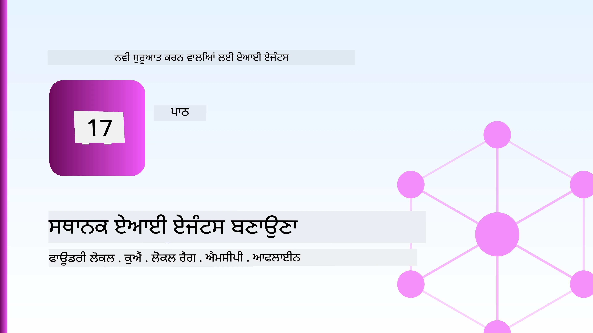
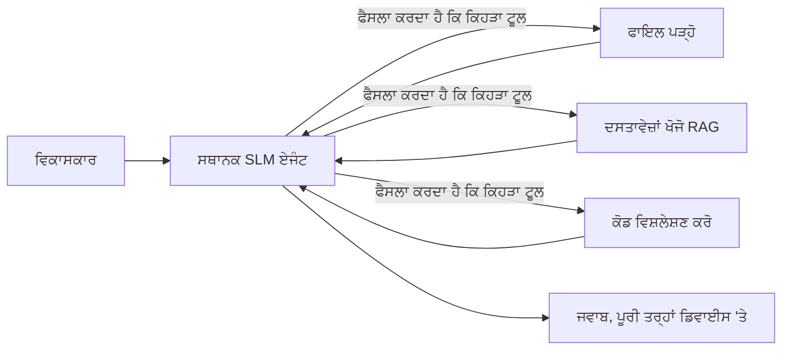
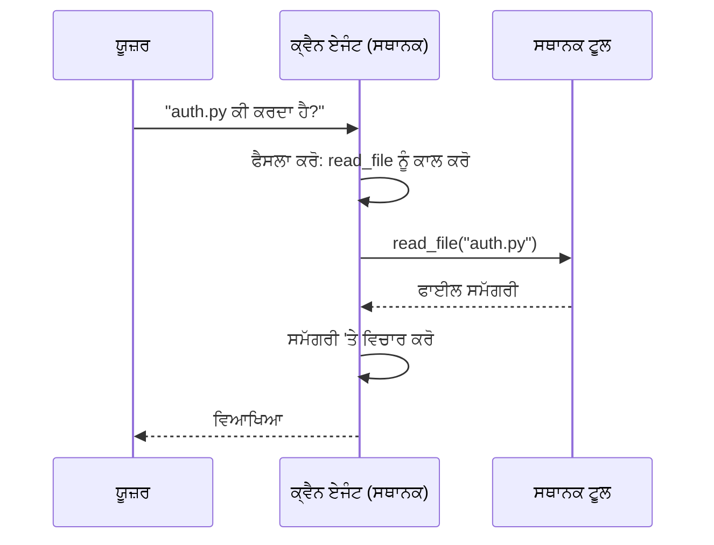
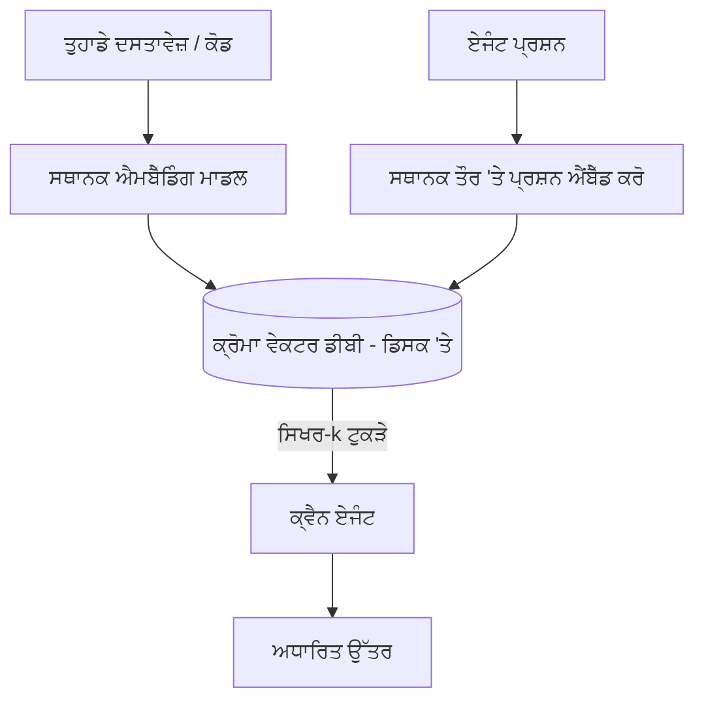
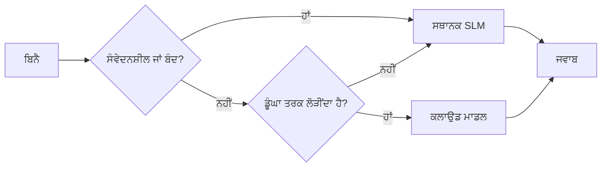

# Microsoft Foundry Local ਅਤੇ Qwen ਦੀ ਵਰਤੋਂ ਕਰਕੇ ਲੋਕਲ AI ਏਜੰਟ ਬਣਾਉਣਾ



ਪਿਛਲੇ ਪਾਠ ਵਿੱਚ ਏਜੰਟਾਂ ਨੂੰ ਕਲਾਊਡ ਵਿੱਚ ਵਧਾਇਆ ਗਿਆ ਸੀ। ਇਹ ਪਾਠ ਉਨ੍ਹਾਂ ਨੂੰ ਇੱਕ ਸਿੰਗਲ ਮਸ਼ੀਨ 'ਤੇ ਲੈ ਕੇ ਆਉਂਦਾ ਹੈ। ਅੰਤ ਤੱਕ ਤੁਹਾਡੇ ਕੋਲ ਇੱਕ ਕੰਮ ਕਰਨ ਵਾਲਾ ਇੰਜੀਨੀਅਰਿੰਗ ਸਹਾਇਕ ਹੋਵੇਗਾ ਜੋ ਸੋਚਦਾ ਹੈ, ਟੂਲ ਕਾਲ ਕਰਦਾ ਹੈ, ਤੁਹਾਡੇ ਫਾਈਲਾਂ ਨੂੰ ਪੜ੍ਹਦਾ ਹੈ, ਅਤੇ ਤੁਹਾਡੀ ਦਸਤਾਵੇਜ਼ੀਕਰਨ ਨੂੰ ਖੋਜਦਾ ਹੈ — **ਇੱਕ ਵੀ ਕਲਾਊਡ ਇੰਫਰੰਸ ਕਾਲ ਦੇ ਬਿਨਾਂ।**

ਤੁਸੀਂ ਇਹ ਕਿਉਂ ਚਾਹੋਗੇ? ਤਿੰਨ ਕਾਰਣ ਜੋ ਅਸਲੀ ਇੰਜੀਨੀਅਰਿੰਗ ਕੰਮ ਵਿੱਚ ਲਗਾਤਾਰ ਸਾਹਮਣੇ ਆਉਂਦੇ ਹਨ:

- **ਪ੍ਰਾਇਵੇਸੀ।** ਕੋਡ ਅਤੇ ਦਸਤਾਵੇਜ਼ ਮਸ਼ੀਨ ਤੋਂ ਕਦੇ ਵੀ ਬਾਹਰ ਨਹੀਂ ਜਾਂਦੇ। ਕੋਈ ਪ੍ਰੋਮਪਟ, ਕੋਈ ਸਨਿਪਟ, ਕੋਈ ਗਾਹਕ ਦਾ ਡਾਟਾ ਨੈੱਟਵਰਕ ਸੀਮਾ ਨੂੰ ਨਹੀਂ ਲੰਘਦਾ।
- **ਲਾਗਤ।** ਲੋਕਲ ਇੰਫਰੰਸ ਦਾ ਕੋਈ ਪ੍ਰਤੀ-ਟੋਕਨ ਬਿੱਲ ਨਹੀਂ ਹੈ। ਤੁਸੀਂ ਸਿਰਫ ਬਿਜਲੀ ਦੀ ਕੀਮਤ 'ਤੇ ਸਾਰੇ ਦਿਨ ਅਪਰਿਵਰਤਨ ਕਰ ਸਕਦੇ ਹੋ।
- **ਆਫਲਾਈਨ।** ਜਹਾਜ਼ ਵਿੱਚ, ਇੱਕ ਸੁਰੱਖਿਅਤ ਸਥਾਨ ਵਿੱਚ, ਜਾਂ ਬਿਜਲੀ ਕਟਾਅ ਮੌਕੇ, ਏਜੰਟ ਹਲੇ ਵੀ ਕੰਮ ਕਰਦਾ ਹੈ।

ਮਸੀਹਾ ਇਹ ਹੈ ਕਿ ਤੁਸੀਂ ਇੱਕ ਅਗਲੀ ਸਿਮਾਬੱਧ ਕਲਾਊਡ ਮਾਡਲ ਨਾਲ ਸੰਯੋਜਿਤ ਇੱਕ **ਛੋਟਾ ਭਾਸ਼ਾ ਮਾਡਲ (SLM)** ਚਲਾ ਰਹੇ ਹੋ ਜੋ ਤੁਹਾਡੇ CPU, GPU ਜਾਂ NPU 'ਤੇ ਚੱਲਦਾ ਹੈ। ਇਹ ਪਾਠ ਇਸ ਗੱਲ ਬਾਰੇ ਹੈ ਕਿ ਜਿਸ ਹੱਦ ਵਿੱਚ ਉੱਤਮ ਏਜੰਟ ਬਣਾਉਣੇ ਹਨ, ਨਾ ਕਿ ਉਸ ਹੱਦ ਨੂੰ ਅਣਦੇਖਾ ਕਰਨ ਬਾਰੇ।

## ਪਰਿਚਯ

ਇਸ ਪਾਠ ਵਿੱਚ ਤੁਸੀਂ ਸਿੱਖੋਗੇ:

- **ਛੋਟੇ ਭਾਸ਼ਾਈ ਮਾਡਲ (SLMs)** — ਇਹ ਕੀ ਹੁੰਦੇ ਹਨ, ਕਿੱਥੇ ਇਹ ਚਮਕਦੇ ਹਨ, ਅਤੇ ਕਿੱਥੇ ਨਹੀਂ।
- **Microsoft Foundry Local** — ਇੱਕ ਰਨਟਾਈਮ ਜੋ ਮਾਡਲਾਂ ਨੂੰ ਡਿਵਾਈਸ 'ਤੇ ਡਾਊਨਲੋਡ ਅਤੇ ਸੇਵ ਕਰਦਾ ਹੈ, ਇੱਕ **OpenAI-ਅਨੁਕੂਲ API** ਰਾਹੀਂ।
- **Qwen ਫੰਕਸ਼ਨ ਕਾਲਿੰਗ ਮਾਡਲਾਂ** — SLMs ਜੋ ਯਕੀਨੀ ਟੂਲ ਕਾਲਸ ਬਣਾਉਂਦੇ ਹਨ, ਜੋ ਲੋਕਲ *ਏਜੰਟ* (ਸਿਰਫ ਲੋਕਲ ਚੈਟ ਨਹੀਂ) ਨੂੰ ਸੰਭਵ ਬਣਾਉਂਦੇ ਹਨ।
- **ਲੋਕਲ ਟੂਲ, ਲੋਕਲ RAG, ਅਤੇ ਲੋਕਲ MCP** — ਕਲਾਊਡ ਦੇ ਬਿਨਾਂ ਏਜੰਟ ਨੂੰ ਸਮਰੱਥਾ ਦਿੰਦੇ ਹਨ।
- **ਹਾਈਬ੍ਰਿਡ ਪੈਟਰਨ** — ਕਦੋਂ ਚੀਜ਼ਾਂ ਲੋਕਲ ਰੱਖਣੀਆਂ ਹਨ ਤੇ ਕਦੋਂ ਕਲਾਊਡ ਲਈ ਪੁੱਜਣਾ ਹੈ।

## ਸਿੱਖਣ ਦੇ ਲਕੜ

ਇਸ ਪਾਠ ਨੂੰ ਖਤਮ ਕਰਨ 'ਤੇ ਤੁਸੀਂ ਜਾਣੋਗੇ ਕਿ:

- SLMs ਦੇ ਫਾਇਦੇ-ਨੁਕਸਾਨ ਨੂੰ ਵਿਆਖਿਆ ਕਰੋ ਅਤੇ ਢੁਕਵੇਂ ਲੋਕਲ-ਏਜੰਟ ਵਰਤੋਂ ਦੇ ਕੇਸ ਚੁਣੋ।
- Foundry Local ਨਾਲ Qwen ਮਾਡਲ ਨੂੰ ਲੋਕਲ ਤੌਰ 'ਤੇ ਸਰਵ ਕਰੋ ਅਤੇ OpenAI-ਅਨੁਕੂਲ ਐਂਡਪੋਇੰਟ ਰਾਹੀਂ ਕਨੈਕਟ ਕਰੋ।
- ਐਸਾ ਟੂਲ-ਕਾਲਿੰਗ ਏਜੰਟ ਬਣਾਓ ਜੋ ਪੂਰੀ ਤਰ੍ਹਾਂ ਤੁਹਾਡੇ ਕੰਮ ਸਥਾਨ 'ਤੇ ਚੱਲਦਾ ਹੈ।
- ਇੱਕ ਲੋਕਲ ਵੇਕਟਰ ਡਾਟਾਬੇਸ (Chroma) ਦੀ ਵਰਤੋਂ ਕਰਕੇ ਆਪਣੀਆਂ ਦਸਤਾਵੇਜ਼ਾਂ 'ਤੇ ਲੋਕਲ RAG ਸ਼ਾਮਲ ਕਰੋ।
- ਏਜੰਟ ਨੂੰ ਇੱਕ ਲੋਕਲ MCP ਸਰਵਰ ਨਾਲ ਜੋੜੋ ਅਤੇ ਹਾਈਬ੍ਰਿਡ ਲੋਕਲ/ਕਲਾਊਡ ਡਿਜ਼ਾਈਨਾਂ ਤੇ ਤਰਕ ਕਰੋ।

## ਪੂਰਕ ਸ਼ਰਤਾਂ

ਇਹ ਪਾਠ ਮੰਨਦਾ ਹੈ ਕਿ ਤੁਸੀਂ ਪਹਿਲਾਂ ਦੇ ਪਾਠ ਪੂਰੇ ਕਰ ਚੁੱਕੇ ਹੋ ਅਤੇ ਸੁਖਦਾਇਕ ਹੋ:

- [ਟੂਲ ਵਰਤੋਂ](../04-tool-use/README.md) (ਪਾਠ 4) ਅਤੇ [ਏਜੰਟਿਕ RAG](../05-agentic-rag/README.md) (ਪਾਠ 5)।
- [ਏਜੰਟਿਕ ਪ੍ਰੋਟੋਕੋਲ / MCP](../11-agentic-protocols/README.md) (ਪਾਠ 11)।
- [Microsoft ਏਜੰਟ ਫ੍ਰੇਮਵਰਕ](../14-microsoft-agent-framework/README.md) (ਪਾਠ 14)।

ਤੁਹਾਨੂੰ ਇਹ ਵੀ ਚਾਹੀਦਾ ਹੈ:

- ਇੱਕ ਡਿਵੈਲਪਰ ਵਰਕਸਟੇਸ਼ਨ। **8 GB RAM ਇੱਕ ਹਕੀਕਤੀ ਘੱਟੋ-ਘੱਟ ਹੈ**; 16 GB+ ਸੁਖਦਾਇਕ ਹੈ। GPU ਜਾਂ NPU ਮਦਦ ਕਰਦਾ ਹੈ ਪਰ ਲਾਜ਼ਮੀ ਨਹੀਂ।
- **Microsoft Foundry Local** ਇੰਸਟਾਲ ਕੀਤਾ ਹੋਇਆ (ਹੇਠਾਂ ਸੈਟਅੱਪ ਵੇਖੋ)।
- Python 3.12+ ਅਤੇ ਰਿਪੋਜ਼ਿਟਰੀ ਵਿੱਚ ਮੌਜੂਦ ਪੈਕੇਜ [`requirements.txt`](../../../requirements.txt), ਨਾਲ ਨਾਲ `foundry-local-sdk`, `openai`, ਅਤੇ `chromadb` ਇਸ ਪਾਠ ਲਈ।

## ਛੋਟੇ ਭਾਸ਼ਾ ਮਾਡਲ: ਲੋਕਲ ਕੰਮ ਲਈ ਢੁਕਵਾਂ ਸਾਧਨ

ਇੱਕ ਅਗਲੀ ਕਲਾਊਡ ਮਾਡਲ ਵਿੱਚ ਸੈਂਕੜੇ ਅਰਬਾਂ ਪੈਰਾਮੀਟਰ ਅਤੇ ਇੱਕ ਡਾਟਾ ਸੈਂਟਰ ਹੁੰਦਾ ਹੈ। ਇੱਕ SLM ਵਿੱਚ ਕੁਝ ਅਰਬ ਪੈਰਾਮੀਟਰ ਹੁੰਦੇ ਹਨ ਅਤੇ ਇਹ ਤੁਹਾਡੇ ਲੈਪਟਾਪ ਦੀ RAM ਵਿੱਚ ਫਿੱਟ ਕਰਨਾ ਪੈਂਦਾ ਹੈ। ਇਹ ਅੰਤਰ ਸਾਫ਼ ਉਮੀਦਾਂ ਸੈੱਟ ਕਰਦਾ ਹੈ।

**SLMs ਵਿੱਚ ਸ਼ਾਨਦਾਰ ਹਨ:**

- ਸੰਰਚਿਤ, ਸੀਮਤ ਕੰਮ — ਕਿਸੇ ਜਾਣਕਾਰ ਦਸਤਾਵੇਜ਼ ਦੀ ਵਰਗੀਕਰਨ, ਨਿਕਾਸ, ਸੰਖੇਪ ਕਰੋ।
- **ਟੂਲ ਕਾਲਿੰਗ** — ਇਹ ਫੈਸਲਾ ਕਰਨਾ ਕਿ ਕਿਹੜਾ ਫੰਕਸ਼ਨ ਕਾਲ ਕਰਨਾ ਹੈ ਅਤੇ ਕਿਹੜੇ ਅਰਗੁਮੈਂਟਸ ਨਾਲ।
- ਤੇਜ਼, ਸਸਤਾ, ਨਿੱਜੀ ਅਪਰਿਵਰਤਨ ਤੁਹਾਡੇ ਆਪਣੇ ਡੇਟਾ 'ਤੇ।

**SLMs ਵਿੱਚ ਕਮਜ਼ੋਰ ਹਨ:**

- ਖੁੱਲ੍ਹੇ ਸਰਹੱਦ ਵਾਲੀ, ਬਹੁ-hop ਤਰਕਸ਼ੀਲਤਾ ਵੱਡੇ ਸੰਦਰਭ ਵਿੱਚ।
- ਵਿਸ਼ਾਲ ਦੁਨੀਆਂ ਦੀ ਜਾਣਕਾਰੀ (ਉਨ੍ਹਾਂ ਨੇ ਘੱਟ ਦੇਖਿਆ ਹੈ, ਅਤੇ ਵੱਧ ਭੁੱਲਦੇ ਹਨ).

ਲੋਕਲ ਏਜੰਟਾਂ ਲਈ ਜਿੱਤਣ ਵਾਲੀ ਯੋਜਨਾ ਹੈ: **SLM ਨੂੰ ਅਯੋਜਿਤ ਕਰਨ ਦਿਓ, ਅਤੇ ਉੱਚਾ ਭਾਰ ਟੂਲ ਕਰਦੇ ਹਨ।** ਮਾਡਲ ਨੂੰ ਤੁਹਾਡਾ ਕੋਡਬੇਸ *ਜਾਣਨ* ਦੀ ਲੋੜ ਨਹੀਂ — ਇਸ ਨੂੰ ਇਹ ਜਾਣਨਾ ਚਾਹੀਦਾ ਹੈ ਕਿ ਕਦੋਂ `read_file` ਅਤੇ `search_docs` ਕਾਲ ਕਰਨੀ ਹੈ। ਇਹ ਸਿੱਧਾ SLM ਦੀਆਂ ਤਾਕਤਾਂ 'ਤੇ ਖੇਡਦਾ ਹੈ।



## Microsoft Foundry Local

**Microsoft Foundry Local** ਇੱਕ ਹਲਕਾ ਰਨਟਾਈਮ ਹੈ ਜੋ ਮਾਡਲਾਂ ਨੂੰ ਪੂਰੀ ਤਰ੍ਹਾਂ ਤੁਹਾਡੇ ਮਸ਼ੀਨ 'ਤੇ ਡਾਊਨਲੋਡ, ਪ੍ਰਬੰਧਿਤ ਅਤੇ ਸੇਵਾ ਕਰਦਾ ਹੈ। ਸਾਡੀ ਲਈ ਇਸ ਦੀ ਸਭ ਤੋਂ ਅਹੰਕਾਰਪੂਰਕ ਵਿਸ਼ੇਸ਼ਤਾ ਇਹ ਹੈ ਕਿ ਇਹ ਇੱਕ **OpenAI-ਅਨੁਕੂਲ HTTP ਐਂਡਪੋਇੰਟ** ਪ੍ਰਦਾਨ ਕਰਦਾ ਹੈ — ਜਿਸਦਾ ਅਰਥ ਹੈ ਕਿ OpenAI SDK ਅਤੇ Microsoft ਏਜੰਟ ਫ੍ਰੇਮਵਰਕ ਦਾ OpenAI ਕਲਾਇੰਟ ਸਿਰਫ `base_url` ਬਦਲ ਕੇ ਇਸਦੇ ਖਿਲਾਫ਼ ਕੰਮ ਕਰਦਾ ਹੈ। ਜੋ ਕੁਝ ਤੁਸੀਂ ਏਜੰਟਾਂ ਬਨਾਉਣ ਬਾਰੇ ਸਿੱਖਿਆ ਹੈ ਉਹ ਸਿੱਧਾ ਟ੍ਰਾਂਸਫਰ ਹੁੰਦਾ ਹੈ; ਸਿਰਫ ਐਂਡਪੋਇੰਟ ਕਲਾਊਡ ਤੋਂ `localhost` ਤੇ ਜਾਂਦਾ ਹੈ।

Foundry Local ਸਵੈਚਾਲਿਤ ਤੌਰ 'ਤੇ ਤੁਹਾਡੇ ਹਾਰਡਵੇਅਰ ਲਈ ਮਾਡਲ ਦਾ ਸਭ ਤੋਂ ਵਧੀਆ ਬਿਲਡ ਚੁਣਦਾ ਹੈ — CPU ਬਿਲਡ, CUDA/GPU ਬਿਲਡ ਜਾਂ NPU ਬਿਲਡ — ਤਾਂ ਜੋ ਤੁਸੀਂ ਹਰ ਮਸ਼ੀਨ ਮਨੁਅਲ ਅਨੁਕੂਲਨ ਨਾ ਕਰੋ।

### ਸੈਟਅੱਪ

Foundry Local ਇੰਸਟਾਲ ਕਰੋ (ਤੁਹਾਡੇ OS ਲਈ [ਦਸਤਾਵੇਜ਼](https://learn.microsoft.com/azure/ai-foundry/foundry-local/) ਵੇਖੋ), ਫਿਰ ਯਕੀਨੀ ਬਣਾਓ ਕਿ ਇਹ ਕੰਮ ਕਰ ਰਿਹਾ ਹੈ:

```bash
# ਇੰਸਟਾਲ ਕਰੋ (ਉਦਾਹਰਨ ਵਜੋਂ; ਆਪਣੇ ਪਲੇਟਫਾਰਮ ਲਈ ਡੌਕਸ ਦੀ ਪਾਲਣਾ ਕਰੋ)
winget install Microsoft.FoundryLocal      # ਵਿੰਡੋਜ਼
# brew install microsoft/foundrylocal/foundrylocal   # macOS

# ਇੱਕ ਕਵੇਨ ਮਾਡਲ ਡਾਊਨਲੋਡ ਕਰੋ ਅਤੇ ਚਲਾਓ, ਫਿਰ ਸਥਾਨਕ ਸੇਵਾ ਸ਼ੁਰੂ ਕਰੋ
foundry model run qwen2.5-7b-instruct
foundry service status
```

ਸੇਵਾ ਚੱਲ ਰਹੀ ਹੋਣ 'ਤੇ ਤੁਹਾਡੇ ਕੋਲ ਇੱਕ ਲੋਕਲ, OpenAI-ਅਨੁਕੂਲ ਐਂਡਪੋਇੰਟ ਹੁੰਦਾ ਹੈ (ਆਮ ਤੌਰ 'ਤੇ `http://localhost:PORT/v1`)। ਨੋਟਬੁੱਕ `foundry-local-sdk` ਦੀ ਵਰਤੋਂ ਕਰਦਾ ਹੈ ਜੋ ਐਂਡਪੋਇੰਟ ਨੂੰ ਆਟੋਮੈਟਿਕ ਤੌਰ 'ਤੇ ਲੱਭਦਾ ਹੈ, ਤਾਂ ਜੋ ਤੁਹਾਨੂੰ ਪੋਰਟ ਹਾਰਡ-ਕੋਡ ਕਰਨ ਦੀ ਲੋੜ ਨਾ ਪਵੇ।

## Qwen ਫੰਕਸ਼ਨ ਕਾਲਿੰਗ: ਇਹ ਕਿਉਂ ਜ਼ਰੂਰੀ ਹੈ

ਏਜੰਟ ਸਿਰਫ ਤਦ ਏਜੰਟ ਹੁੰਦਾ ਹੈ ਜਦੋਂ ਇਹ ਟੂਲ ਕਾਲ ਕਰ ਸਕਦਾ ਹੈ। ਬਹੁਤ ਸਾਰੇ SLMs ਚੈਟ ਕਰ ਸਕਦੇ ਹਨ ਪਰ ਭਰੋਸੇਯੋਗ, ਠੀਕ ਟੂਲ ਕਾਲ ਨਹੀਂ ਬਣਾ ਓਂਦੇ। **Qwen** ਮਾਡਲ ਫੰਕਸ਼ਨ ਕਾਲਿੰਗ ਲਈ ਸਿਖਾਏ ਗਏ ਹਨ ਅਤੇ ਸਥਿਰ ਢੰਗ ਨਾਲ ਵਧੀਆ ਟੂਲ-ਕਾਲ ਸੰਰਚਨਾ ਡਿਲਿਵਰ ਕਰਦੇ ਹਨ — ਜੋ ਇਸ ਗੱਲ ਨੂੰ ਸੰਭਵ ਬਣਾਉਂਦਾ ਹੈ ਕਿ ਇੱਕ ਲੋਕਲ ਚੈਟ ਮਾਡਲ ਲੋਕਲ *ਏਜੰਟ* ਬਣ ਜਾਵੇ।

ਪ੍ਰਕਿਰਿਆ ਉਹੀ ਸਧਾਰਣ ਟੂਲ ਕਾਲ ਲੂਪ ਹੈ ਜੋ ਤੁਸੀਂ ਜਾਣਦੇ ਹੋ, ਸਿਰਫ ਓਨ-ਡਿਵਾਈਸ ਚੱਲਦੀ ਹੈ:



## ਲੋਕਲ RAG

ਦਸਤਾਵੇਜ਼ ਖੋਜ ਉਹ ਥਾਂ ਹੈ ਜਿੱਥੇ ਲੋਕਲ ਏਜੰਟ ਆਪਣੀ ਮੁੱਲ ਜਾਣਦੇ ਹਨ। ਇਸ ਸੋਚ ਦੇ ਬਜਾਇ ਕਿ SLM ਤੁਹਾਡੇ ਫ੍ਰੇਮਵਰਕ ਦੀ ਦਸਤਾਵੇਜ਼ ਨੂੰ ਯਾਦ ਕਰ ਗਈ ਹੈ, ਤੁਸੀਂ ਉਹ ਦਸਤਾਵੇਜ਼ ਇੱਕ **ਲੋਕਲ ਵੇਕਟਰ ਡਾਟਾਬੇਸ** ਵਿੱਚ ਇੰਬੈੱਡ ਕਰਦੇ ਹੋ ਅਤੇ ਏਜੰਟ ਨੂੰ ਲੋੜ ਅਨੁਸਾਰ ਸਬੰਧਿਤ ਹਿੱਸੇ ਪ੍ਰਾਪਤ ਕਰਨ ਦਿੰਦੇ ਹੋ।

ਅਸੀਂ **Chroma** ਦੀ ਵਰਤੋਂ ਕਰਦੇ ਹਾਂ, ਇੱਕ ਸਥਾਨਕ ਵੇਕਟਰ ਸਟੋਰ ਜੋ ਸਰਵਰ ਦੇ ਬਿਨਾਂ, ਪ੍ਰਕਿਰਿਆ ਵਿੱਚ ਚਲਦਾ ਹੈ। ਪਾਈਪਲਾਈਨ ਪੂਰੀ ਤਰ੍ਹਾਂ ਲੋਕਲ ਹੈ: ਲੋਕਲ ਇੰਬੈੱਡਿੰਗ ਮਾਡਲ → ਲੋਕਲ ਵੇਕਟਰ → ਲੋਕਲ ਰੀਟਰੀਵਲ → ਲੋਕਲ SLM।



ਇਹ ਬਿਲਕੁਲ Lesson 5 ਦਾ Agentic RAG ਪੈਟਰਨ ਹੈ — ਸਿਰਫ ਵੱਖਰਾ ਇਹ ਹੈ ਕਿ ਹਰ ਹਿੱਸਾ ਤੁਹਾਡੇ ਮਸ਼ੀਨ 'ਤੇ ਚੱਲਦਾ ਹੈ।

## ਲੋਕਲ MCP ਸਰਵਰ

[MCP](../11-agentic-protocols/README.md) ਇੱਕ ਟਰਾਂਸਪੋਰਟ ਹੈ, ਕਲਾਊਡ ਸੇਵਾ ਨਹੀਂ। ਇੱਕ MCP ਸਰਵਰ `stdio` 'ਤੇ ਲੋਕਲ ਪ੍ਰਕਿਰਿਆ ਵਜੋਂ ਚਲ ਸਕਦਾ ਹੈ, ਏਜੰਟ ਨੂੰ ਸਧਾਰਣ ਪ੍ਰੋਟੋਕੋਲ ਰਾਹੀਂ ਟੂਲ ਪ੍ਰਦਾਨ ਕਰਦਾ ਹੈ। ਇਸ ਨਾਲ ਤੁਸੀਂ MCP ਸਰਵਰਾਂ ਦੇ ਵਿਕਸਤ ਹੋ ਰਹੇ ਪਰਿਸ਼ਰ ਦਾ ਮੁੜ ਉਪਯੋਗ ਕਰ ਸਕਦੇ ਹੋ — ਫਾਈਲ ਸਿਸਟਮ ਐਕਸੈਸ, ਗਿਟ ਕਾਰਜ, ਡਾਟਾਬੇਸ ਪੁੱਛਗਿੱਛ — ਪੂਰੀ ਤਰ੍ਹਾਂ ਆਫਲਾਈਨ।

ਸੁਰੱਖਿਆ ਦੀ ਸਥਿਤੀ ਕਲਾਊਡ ਤੋਂ ਵੱਖਰੀ ਹੈ, ਪਰ ਹਨੀ ਨਹੀਂ: ਇੱਕ ਲੋਕਲ MCP ਸਰਵਰ ਅਜੇ ਵੀ ਤੁਹਾਡੇ ਯੂਜ਼ਰ ਦੀਆਂ ਪਰਮਿਸ਼ਨਾਂ ਨਾਲ ਚਲਦਾ ਹੈ, ਇਸ ਲਈ ਜੋ ਇਹ ਛੂਹ ਸਕਦਾ ਹੈ ਉਸ ਦੀ ਸੀਮਾ ਬਣਾ ਕੇ ਰੱਖੋ (ਇੱਕ ਪ੍ਰੋਜੈਕਟ ਡਾਇਰੈਕਟਰੀ, ਤੁਸੀਂ ਪੂਰੇ ਘਰ ਵਾਲੇ ਫੋਲਡਰ ਨੂੰ ਨਹੀਂ) ਅਤੇ ਇਸਦੇ ਨਤੀਜਿਆਂ ਨੂੰ ਇਨਪੁਟ ਵਜੋਂ ਵੈਰੀਫਾਈ ਕਰਕੇ ਵਰਤੋਂ।

## ਹਾਈਬ੍ਰਿਡ ਕਲਾਊਡ ਅਤੇ ਲੋਕਲ ਪੈਟਰਨ

ਲੋਕਲ-ਪਹਿਲਾ ਦਾ ਮਤਲਬ ਲੋਕਲ-ਹੀ ਨਹੀਂ। ਪੱਕੇ ਸਿਸਟਮ ਸੰਵੇਦਨਸ਼ੀਲਤਾ ਅਤੇ ਮੁਸ਼ਕਲਾਈ ਅਨੁਸਾਰ ਰਾਹ ਦਿਖਾਉਂਦੇ ਹਨ:

| ਸਥਿਤੀ | ਕਿੱਥੇ ਚੱਲਦਾ ਹੈ |
| --- | --- |
| ਸੰਵੇਦਨਸ਼ੀਲ ਕੋਡ / ਡੇਟਾ, ਜਾਂ ਆਫਲਾਈਨ | **ਲੋਕਲ SLM** |
| ਸਧਾਰਨ, ਸੀਮਿਤ ਕੰਮ | **ਲੋਕਲ SLM** (ਸਸਤਾ, ਤੇਜ਼) |
| ਗੰਭੀਰ ਬਹੁ-ਹੋਪ ਤਰਕਸ਼ੀਲਤਾ ਗੈਰ-ਸੰਵੇਦਨਸ਼ੀਲ ਡੇਟਾ 'ਤੇ | **ਕਲਾਊਡ ਮਾਡਲ** |
| ਸਭ ਕੁਝ, ਬਿਜਲੀ ਕਟਾਅ ਦੌਰਾਨ | **ਲੋਕਲ SLM** (ਸੁਸਜਾਣ ਅਵਰੋਧ) |

ਇਹ Lesson 16 ਦੇ **ਮਾਡਲ ਰਾਊਟਿੰਗ** ਵਿਚਾਰ ਨੂੰ ਦਰਸਾਉਂਦਾ ਹੈ — ਸਿਵਾਏ ਇਸਦੇ ਕਿ ਇੱਕ "ਮਾਡਲ" ਹੁਣ ਤੁਹਾਡੀ ਆਪਣੀ ਮਸ਼ੀਨ ਹੈ। ਇੱਕ ਮਜ਼ਬੂਤ ਡਿਜ਼ਾਈਨ ਲੋਕਲ ਨੂੰ ਕਲਾਊਡ ਦੇ ਅਣਉਪਲਬਧ ਹੋਣ 'ਤੇ ਵਾਪਸ ਲੈਂਦਾ ਹੈ, ਤਾਂ ਜੋ ਏਜੰਟ ਗੁਣਵੱਤਾ ਵਿੱਚ ਗਿਰਾਵਟ ਕਰੇ ਬਜਾਏ ਪੂਰੀ ਤਰ੍ਹਾਂ ਫੇਲ ਹੋਣ ਦੇ।



## ਪ੍ਰਯੋਗਸ਼ਾਲਾ: ਇੱਕ ਲੋਕਲ ਇੰਜੀਨੀਅਰਿੰਗ ਸਹਾਇਕ

ਖੋਲ੍ਹੋ [`code_samples/17-local-agent-foundry-local.ipynb`](./code_samples/17-local-agent-foundry-local.ipynb) ਅਤੇ ਇਸ ਨੂੰ ਪੂਰਾ ਕਰੋ। ਤੁਸੀਂ ਇੱਕ **ਲੋਕਲ ਇੰਜੀਨੀਅਰਿੰਗ ਸਹਾਇਕ** ਬਣਾਵੋਗੇ ਜੋ ਪੂਰੀ ਤਰ੍ਹਾਂ ਤੁਹਾਡੇ ਕੰਮ ਸਥਾਨ 'ਤੇ ਚੱਲਦਾ ਹੈ ਅਤੇ ਇਹ ਕਰ ਸਕਦਾ ਹੈ:

1. **ਟੂਲ ਕਾਲ ਕਰੋ** — Foundry Local ਰਾਹੀਂ Qwen ਫੰਕਸ਼ਨ ਕਾਲਿੰਗ ਦੇ ਜ਼ਰੀਏ।
2. **ਲੋਕਲ ਫਾਈਲ ਕਾਰਜ ਕਰੋ** — ਇੱਕ ਪ੍ਰੋਜੈਕਟ ਡਾਇਰੈਕਟਰੀ ਵਿੱਚ ਫਾਈਲਾਂ ਦੀ ਲਿਸਟ ਅਤੇ ਪੜ੍ਹਾਈ ਕਰੋ।
3. **ਕੋਡ ਵਿਸ਼ਲੇਸ਼ਣ ਕਰੋ** — ਇੱਕ ਸੋਰਸ ਫਾਈਲ 'ਤੇ ਮੂਲ ਮੈਟ੍ਰਿਕਸ ਦੀ ਰਿਪੋਰਟ ਦਿਓ।
4. **ਦਸਤਾਵੇਜ਼ ਖੋਜ ਕਰੋ** — Chroma ਨਾਲ ਇੱਕ ਦਸਤਾਵੇਜ਼ ਫੋਲਡਰ 'ਤੇ ਲੋਕਲ RAG।
5. **MCP ਵਰਤੋਂ ਕਰੋ** — ਇੱਕ ਲੋਕਲ MCP ਸਰਵਰ ਨਾਲ ਕਨੈਕਟ ਕਰੋ (ਜਦ ਕੋਈ ਸੰਰਚਿਤ ਨਾ ਹੋਵੇ ਤਾਂ ਸੁਚੱਜਾ ਛੱਡੋ)।

ਕਿਸੇ ਵੀ ਸਮੇਂ ਕਲਾਊਡ ਇੰਫਰੰਸ ਦੀ ਵਰਤੋਂ ਨਹੀਂ ਹੁੰਦੀ।

### ਚਲਦੇ-ਫਿਰਦੇ ਜਾਣਕਾਰੀ

ਸਹਾਇਕ Foundry Local ਨੂੰ OpenAI-ਅਨੁਕੂਲ ਐਂਡਪੋਇੰਟ ਰਾਹੀਂ ਜੋੜਦਾ ਹੈ, ਇਸ ਲਈ ਏਜੰਟ ਕੋਡ ਕਲਾਊਡ ਪਾਠਾਂ ਦੇ ਬਹੁਤ ਲਗਭਗ ਇੱਕੋ ਜਿਹੇ ਦਿਖਾਈ ਦਿੰਦਾ ਹੈ — ਸਿਰਫ ਕਲਾਇੰਟ ਬਦਲਦਾ ਹੈ:

```python
from foundry_local import FoundryLocalManager
from openai import OpenAI

# ਫਾਊਂਡਰੀ ਲੋਕਲ ਮਾਡਲ ਨੂੰ ਖੋਜਦਾ/ਡਾਊਨਲੋਡ ਕਰਦਾ ਹੈ ਅਤੇ ਸਾਨੂੰ ਇੱਕ ਲੋਕਲ ਐਂਡਪੌਇੰਟ ਦਿੰਦਾ ਹੈ।
manager = FoundryLocalManager(\"qwen2.5-7b-instruct\")
client = OpenAI(base_url=manager.endpoint, api_key=manager.api_key)  # api_key ਇੱਕ ਲੋਕਲ ਪਲੇਸਹੋਲਡਰ ਹੈ।
```

ਟੂਲ ਅਮੂਮਨ Python ਫੰਕਸ਼ਨ ਹਨ ਜਿਹੜੇ ਇੱਕ ਪ੍ਰੋਜੈਕਟ ਡਾਇਰੈਕਟਰੀ ਨੂੰ ਸਾਂਭਦੇ ਹਨ:

```python
def read_file(path: str) -> str:
    \"\"\"Read a file, but only inside the sandboxed project directory.\"\"\"
    full = (PROJECT_ROOT / path).resolve()
    if PROJECT_ROOT not in full.parents and full != PROJECT_ROOT:
        return \"Access denied: path is outside the project directory.\"
    return full.read_text(encoding=\"utf-8\")
```

ਸੈਂਡਬਾਕਸ ਚੈੱਕ ਨੂੰ ਨੋਟ ਕਰੋ — ਇੱਥੇ ਤੱਕ ਕਿ ਲੋਕਲ ਤੌਰ 'ਤੇ ਵੀ, ਕੋਈ ਟੂਲ ਜੋ ਮਨਮਾਨੇ ਰਸਤੇ ਪੜ੍ਹਦਾ ਹੈ ਉਹ ਇਕ ਜ਼ਿੰਮੇਵਾਰੀ ਹੈ। ਨੋਟਬੁੱਕ ਹਰ ਟੂਲ ਨੂੰ ਇੱਕ ਹੀ ਪ੍ਰੋਜੈਕਟ ਰੂਟ ਨਾਲ ਸੀਮਤ ਰੱਖਦਾ ਹੈ।

## ਗਿਆਨ ਜਾਂਚ

ਐਸਾਈਨਮੈਂਟ 'ਤੇ ਜਾਣ ਤੋਂ ਪਹਿਲਾਂ ਆਪਣੀ ਸਮਝਦੀ ਜਾਂਚ ਕਰੋ।

**1. ਕਲਾਊਡ ਦੀ ਥਾਂ ਇਕ ਏਜੰਟ ਨੂੰ ਲੋਕਲ 'ਤੇ ਚਲਾਉਣ ਦੇ ਦੋ ਠੋਸ ਕਾਰਣ ਦੱਸੋ।**

<details>
<summary>ਜਵਾਬ</summary>

ਕੋਈ ਵੀ ਦੋ: **ਪਰਦੇਦਾਰੀ** (ਕੋਡ ਅਤੇ ਡੇਟਾ ਮਸ਼ੀਨ ਤੋਂ ਕਦੇ ਬਾਹਰ ਨਹੀਂ ਜਾਂਦੇ), **ਲਾਗਤ** (ਕੋਈ ਪ੍ਰਤੀ-ਟੋਕਨ ਇੰਫਰੰਸ ਬਿੱਲ ਨਹੀਂ), ਅਤੇ **ਆਫਲਾਈਨ ਸਮਰੱਥਾ** (ਬਿਨਾਂ ਨੈੱਟਵਰਕ ਦੇ ਕੰਮ ਕਰਦਾ ਹੈ — ਜਹਾਜ਼ ਵਿੱਚ, ਸੁਰੱਖਿਅਤ ਸਥਾਨ ਵਿੱਚ, ਜਾਂ ਬਿਜਲੀ ਕਟਾਅ ਦੌਰਾਨ)। ਨਿਯਮਿਤ/ਕੰਪਲਾਇੰਸ ਪਾਬੰਦੀਆਂ ਜੋ ਡੇਟਾ ਨੂੰ ਡਿਵਾਈਸ ਤੋਂ ਬਾਹਰ ਭੇਜਣ ਤੋਂ ਰੋਕਦੀਆਂ ਹਨ, ਪਰਦੇਦਾਰੀ ਕਾਰਨ ਹਨ।
</details>

**2. ਇੱਕ SLM ਅਤੇ ਇਸਦੇ ਟੂਲਾਂ ਵਿੱਚ ਇੱਕ ਲੋਕਲ ਏਜੰਟ ਵਿੱਚ ਕਿਹੜਾ ਵੰਡਾਈ ਹੋਣੀ ਚਾਹੀਦੀ ਹੈ ਅਤੇ ਕਿਉਂ?**

<details>
<summary>ਜਵਾਬ</summary>

SLM ਨੂੰ **ਅਯੋਜਿਤ ਕਰਨ ਦਿਓ** (ਫੈਸਲਾ ਕਰੋ ਕਿ ਕਿਹੜਾ ਟੂਲ ਕਾਲ ਕਰਨਾ ਹੈ ਅਤੇ ਕਿਸ ਤਰ੍ਹਾਂ ਦੇ ਅਰਗੁਮੈਂਟ ਨਾਲ), ਅਤੇ **ਟੂਲਾਂ ਨੂੰ ਭਾਰੀ ਕੰਮ ਕਰਨ ਦਿਓ** (ਫਾਈਲਾਂ ਪੜ੍ਹਨਾ, ਦਸਤਾਵੇਜ਼ ਲੈਣਾ, ਨਤੀਜੇ ਗਣਨਾ ਕਰਨਾ)। SLM ਸੀਮਿਤ ਫੈਸਲਿਆਂ ਜਿਵੇਂ ਕਿ ਟੂਲ ਚੁਣਾਉਣ ਵਿੱਚ ਤਾਕਤਵਰ ਹੈ ਪਰ ਵਿਸ਼ਾਲ ਗਿਆਨ ਅਤੇ ਲੰਬੀ ਬਹੁ-ਹੋਪ ਤਰਕਸ਼ੀਲਤਾ ਵਿੱਚ ਕਮਜ਼ੋਰ, ਇਸ ਲਈ ਟੂਲਾਂ ਤਕ ਨਿਭਾਉਣਾ ਉਹਨਾਂ ਦੀਆਂ ਤਾਕਤਾਂ ਨੂੰ ਲੈ ਕੇ ਆਉਂਦਾ ਹੈ।
</details>

**3. Foundry Local ਨਾਲ ਕਲਾਊਡ ਏਜੰਟ ਕੋਡ ਨੂੰ ਮੁੜ ਵਰਤਣ ਜੋਗਾ ਬਣਾਉਣ ਵਾਲਾ ਕੀ ਹੈ?**

<details>
<summary>ਜਵਾਬ</summary>

Foundry Local ਇੱਕ **OpenAI-ਅਨੁਕੂਲ HTTP ਐਂਡਪੋਇੰਟ** ਪ੍ਰਦਾਨ ਕਰਦਾ ਹੈ। OpenAI SDK ਅਤੇ ਏਜੰਟ ਫ੍ਰੇਮਵਰਕ ਦੇ OpenAI ਕਲਾਇੰਟ ਸਿਰਫ `base_url` ਬਦਲ ਕੇ ਇਸਦੇ ਨਾਲ ਕੰਮ ਕਰਦੇ ਹਨ (ਅਤੇ ਇੱਕ ਲੋਕਲ ਪਲੇਸਹੋਲਡਰ API ਕੁੰਜੀ ਦੀ ਵਰਤੋਂ ਕਰਦੇ ਹਨ)। ਏਜੰਟ ਕੋਡ ਬਾਕੀ ਸਾਰਾ ਇੱਕੋ ਜਿਹਾ ਰਹਿੰਦਾ ਹੈ।
</details>

**4. ਸਾਡੇ ਕੋਲ ਕਿਉਂ ਖਾਸ ਤੌਰ 'ਤੇ Qwen ਫੰਕਸ਼ਨ-ਕਾਲਿੰਗ ਮਾਡਲ ਹੈ, ਸਿਰਫ ਕੋਈ ਵੀ SLM ਨਹੀਂ?**

<details>
<summary>ਜਵਾਬ</summary>

ਕਿਉਂਕਿ ਇੱਕ ਏਜੰਟ ਨੂੰ ਭਰੋਸੇਯੋਗ, ਠੀਕ ਬਣੇ **ਟੂਲ ਕਾਲ** ਪੈਦਾ ਕਰਨੇ ਚਾਹੀਦੇ ਹਨ। ਕਈ SLMs ਚੈਟ ਕਰ ਸਕਦੇ ਹਨ ਪਰ ਅਸਮਰਥਿਤ ਜਾਂ ਗਲਤ ਟੂਲ-ਕਾਲ ਸੰਰਚਨਾ ਨੂੰ ਜਾਰੀ ਕਰਦੇ ਹਨ। Qwen ਮਾਡਲ ਫੰਕਸ਼ਨ ਕਾਲਿੰਗ ਲਈ ਸਿਖਾਏ ਗਏ ਹਨ ਅਤੇ ਨਿਰੰਤਰ ਟੂਲ ਕਾਲਾਂ ਪੈਦਾ ਕਰਦੇ ਹਨ, ਜੋ ਇੱਕ ਲੋਕਲ ਚੈਟ ਮਾਡਲ ਨੂੰ ਕੰਮ ਕਰਨ ਵਾਲੇ ਲੋਕਲ ਏਜੰਟ ਵਿੱਚ ਬਦਲ ਦਿੰਦੇ ਹਨ।
</details>

**5. ਲੋਕਲ RAG ਪਾਈਪਲਾਈਨ ਵਿੱਚ ਕਿਹੜੇ ਹਿੱਸੇ ਮਸ਼ੀਨ 'ਤੇ ਚੱਲਦੇ ਹਨ?**

<details>
<summary>ਜਵਾਬ</summary>

ਇਹ ਸਾਰੇ: ਇੰਬੈੱਡਿੰਗ ਮਾਡਲ, ਵੇਕਟਰ ਡਾਟਾਬੇਸ (Chroma, ਡਿਸਕ 'ਤੇ), ਰੀਟਰੀਵਲ ਕਦਮ, ਅਤੇ SLM। ਦਸਤਾਵੇਜ਼ ਲੋਕਲ ਤੌਰ 'ਤੇ ਇੰਬੈੱਡ, ਸਟੋਰ, ਰੀਟਰੀਵ, ਅਤੇ ਲੋਕਲ ਮਾਡਲ ਵੱਲੋਂ ਤਰਕਸ਼ੀਲ ਕੀਤੇ ਜਾਂਦੇ ਹਨ — ਕੋਈ ਹਿੱਸਾ ਕਲਾਊਡ ਨੂੰ ਨਹੀਂ ਛੂਹਦਾ।
</details>

**6. ਇੱਕ ਲੋਕਲ MCP ਸਰਵਰ ਤੁਹਾਡੇ ਮਸ਼ੀਨ 'ਤੇ ਚਲ ਰਿਹਾ ਹੈ। ਕੀ ਇਹ ਆਪਣੇ ਆਪ ਸੁਰੱਖਿਅਤ ਬਣਦਾ ਹੈ? ਤੁਹਾਨੂੰ ਕਿਹੜਾ ਸਾਵਧਾਨੀ ਅਜੇ ਵੀ ਲੈਣੀ ਚਾਹੀਦੀ ਹੈ?**

<details>
<summary>ਜਵਾਬ</summary>

ਨਹੀਂ। ਇੱਕ ਲੋਕਲ MCP ਸਰਵਰ ਤੁਹਾਡੇ ਯੂਜ਼ਰ ਦੀਆ ਪਰਮਿਸ਼ਨਾਂ ਨਾਲ ਚੱਲਦਾ ਹੈ, ਇਸ ਲਈ ਇਹ ਤੁਹਾਡੇ ਵਰਗੇ ਕੁਝ ਵੀ ਛੂਹ ਸਕਦਾ ਹੈ। ਇਸ ਨੂੰ ਜੋ ਕੁਝ ਇਹਨੂੰ ਲੋੜ ਹੈ ਉਸ ਤੱਕ ਸੀਮਤ ਰੱਖੋ (ਜਿਵੇਂ ਕਿ ਇੱਕ ਸਿਰਫ਼ ਪ੍ਰੋਜੈਕਟ ਡਾਇਰੈਕਟਰੀ, ਨਾ ਕਿ ਤੁਹਾਡੇ ਸਾਰੇ ਘਰ ਵਾਲੇ ਫੋਲਡਰ) ਅਤੇ ਇਸਦੇ ਨਤੀਜਿਆਂ ਨੂੰ ਇਨਪੁਟ ਵਜੋਂ ਵੈਰੀਫਾਈ ਕਰਕੇ ਵਰਤੋਂ।
</details>

**7. ਇੱਕ ਸਮਝਦਾਰ ਹਾਈਬ੍ਰਿਡ ਰਾਊਟਿੰਗ ਨਿਯਮ ਜੋ ਇੱਕ ਲੋਕਲ ਮਾਡਲ ਨੂੰ ਸ਼ਾਮਲ ਕਰਦਾ ਹੈ, ਵਰਨਣ ਕਰੋ।**

<details>
<summary>ਜਵਾਬ</summary>

ਸੰਵੇਦਨਸ਼ੀਲ ਜਾਂ ਆਫਲਾਈਨ ਬੇਨਤੀਆਂ ਲੋਕਲ SLM ਨੂੰ ਭੇਜੋ; ਸਧਾਰਨ ਸੀਮਿਤ ਕੰਮ ਤੇਜ਼ੀ ਅਤੇ ਲਾਗਤ ਲਈ ਲੋਕਲ SLM ਨੂੰ ਭੇਜੋ; ਗੰਭੀਰ ਬਹੁ-ਹੋਪ ਤਰਕਸ਼ੀਲਤਾ ਗੈਰ-ਸੰਵੇਦਨਸ਼ੀਲ ਡੇਟਾ ਤੇ ਕਲਾਊਡ ਮਾਡਲ ਨੂੰ ਭੇਜੋ; ਅਤੇ ਜਦੋਂ ਕਲਾਊਡ ਉਪਲਬਧ ਨਹੀਂ ਹੁੰਦਾ ਤਾਂ ਲੋਕਲ SLM ਵੱਲ ਵਾਪਸ ਜਾਓ, ਤਾਂ ਜੋ ਏਜੰਟ ਸੁਸਜਾਣ ਅਵਰੋਧ ਵਿੱਚ ਗੁਣਵੱਤਾ ਘਟਾਏ ਨਾ ਕਿ ਫੇਲ ਹੋਵੇ। ਇਹ ਮਾਡਲ ਰਾਊਟਿੰਗ ਹੈ (Lesson 16) ਜਿਸ ਵਿੱਚ ਇੱਕ ਮਾਡਲ ਤੁਹਾਡੀ ਲੋਕਲ ਮਸ਼ੀਨ ਹੈ।
</details>

**8. ਇਸ ਪਾਠ ਵਿੱਚ ਲੋਕਲ ਏਜੰਟ ਚਲਾਉਣ ਲਈ ਇੱਕ ਹਕੀਕਤੀ ਘੱਟੋ-ਘੱਟ RAM ਕਿੰਨੀ ਹੈ ਅਤੇ ਵੱਧ RAM ਤੁਹਾਨੂੰ ਕੀ ਦਿੰਦਾ ਹੈ?**

<details>
<summary>ਜਵਾਬ</summary>

ਲਗਭਗ **8 GB** ਹਕੀਕਤੀ ਘੱਟੋ-ਘੱਟ ਹੈ; 16 GB+ ਸੁਖਦਾਇਕ ਹੈ। ਵੱਧ RAM ਤੁਹਾਨੂੰ ਵੱਡੇ, ਸਮਰੱਥ ਮਾਡਲ ਚਲਾਉਣ ਅਤੇ ਹੋਰ ਸੰਦਰਭ ਯਾਦ ਰੱਖਣ ਲਈ ਸਹੂਲਤ ਦਿੰਦੀ ਹੈ। GPU ਜਾਂ NPU ਇੰਫਰੰਸ ਤੇਜ਼ ਕਰਦੇ ਹਨ ਪਰ ਲਾਜ਼ਮੀ ਨਹੀਂ — Foundry Local ਜਦੋਂ ਕੋਈ ਤੀਜ਼ੀਕਾਰਕ ਉਪਲਬਧ ਨਾ ਹੋਵੇ ਤਾਂ CPU ਬਿਲਡ ਚੁਣਦਾ ਹੈ।
</details>

## ਅਸਾਈਨਮੈਂਟ

ਲੋਕਲ ਇੰਜੀਨੀਅਰਿੰਗ ਸਹਾਇਕ ਨੂੰ ਵਧਾਓ ਇੱਕ **ਲੋਕਲ ਦਸਤਾਵੇਜ਼ ਸਮੀਖਿਆਕਾਰ** ਵਿੱਚ ਕਿਸੇ ਛੋਟੇ ਪ੍ਰੋਜੈਕਟ ਲਈ (ਜੇ ਤੁਸੀਂ ਚਾਹੁੰਦੇ ਹੋ ਤਾਂ ਇਸ ਰਿਪੋਜ਼ਿਟਰੀ ਦੇ ਕਿਸੇ ਪਾਠ ਫੋਲਡਰ ਦੀ ਵਰਤੋਂ ਕਰੋ)।

ਤੁਹਾਡੀ ਸਭਮਿਸ਼ਨ ਵਿੱਚ ਇਹ ਹੋਣਾ ਚਾਹੀਦਾ ਹੈ:

1. ਇੱਕ ਅਸਲੀ ਦਸਤਾਵੇਜ਼/ਕੋਡ ਫੋਲਡਰ ਨੂੰ Chroma ਵਿੱਚ ਇੰਡੈਕਸ ਕਰੋ (ਘੱਟੋ-ਘੱਟ ਪੰਜ ਫਾਈਲਾਂ)।
2. ਇੱਕ `find_todos` ਟੂਲ ਸ਼ਾਮਲ ਕਰੋ ਜੋ ਪ੍ਰੋਜੈਕਟ ਵਿੱਚ `TODO`/`FIXME` ਟਿੱਪਣੀਆਂ ਸਕੈਨ ਕਰਦਾ ਹੈ ਅਤੇ ਫਾਈਲ ਅਤੇ ਲਾਈਨ ਨੰਬਰ ਸਮੇਤ ਵਾਪਸ ਕਰਦਾ ਹੈ — `read_file` ਵਰਗਾ ਹੀ ਸੈਂਡਬਾਕਸ ਚੈੱਕ ਰੱਖਦੇ ਹੋਏ।

3. **ਏਜੰਟ ਨੂੰ ਤਿੰਨ ਸਵਾਲ ਪੁੱਛੋ** ਜੋ ਇਹਨਾਂ ਟੂਲਾਂ ਨੂੰ ਮਿਲਾ ਕੇ ਕੰਮ ਕਰਨ ਲਈ ਮਜਬੂਰ ਕਰਦੇ ਹਨ: ਇੱਕ ਖਾਲਿਸ RAG ਸਵਾਲ, ਇੱਕ ਜੋ ਕਿਸੇ ਖਾਸ ਫਾਈਲ ਨੂੰ ਪੜ੍ਹਨ ਦੀ ਲੋੜ ਹੈ, ਅਤੇ ਇੱਕ ਜੋ TODOs ਲੱਭਣ ਦੀ ਲੋੜ ਹੈ।
4. **ਇਸਦੀ ਮਾਪ ਕਰੋ**: ਤਿੰਨਾਂ ਜਵਾਬਾਂ ਦਾ ਸਮਾਂ ਲਵੋ ਅਤੇ ਮਾਰਕਡਾਊਨ ਸੈੱਲ ਵਿੱਚ ਲਿਖੋ। ਟਿੱਪਣੀ ਕਰੋ ਕਿ ਤੁਹਾਡੇ ਇਰਾਦਾ ਸੰਗਠਨ ਲਈ ਵੇਲਾ ਕਿੰਨਾ ਠੀਕ ਹੈ।

ਫਿਰ ਇੱਕ ਛੋਟਾ ਪੈਰਾਗ੍ਰਾਫ ਲਿਖੋ ਕਿ **ਤੁਸੀਂ ਇਸ ਸਮੀਖਿਅਕ ਲਈ ਕਿਹੜੀਆਂ ਚੀਜ਼ਾਂ ਕਲਾਉਡ ’ਚ ਲਿਜਾਣਗੇ ਅਤੇ ਕਿਹੜੀਆਂ ਸਥਾਨਕ ਰੱਖੋਗੇ**, ਅਤੇ ਕਿਉਂ। ਤੁਹਾਡੀ ਮੁਲਾਂਕਣ ਇਸ ਗੱਲ ‘ਤੇ ਅਧਾਰਿਤ ਹੈ ਕਿ ਸਥਾਨਕ ਹਿੱਸੇ ਸਹੀ ਤਰ੍ਹਾਂ ਜੁੜੇ ਹਨ ਜਾਂ ਨਹੀਂ ਅਤੇ ਤੁਹਾਡੀ ਹਾਈਬਰਿਡ ਦਲੀਲ ਕਿਵੇਂ ਹੈ — ਮਾਡਲ ਗੁਣਵੱਤਾ ‘ਤੇ ਨਹੀਂ।

## ਸੰਖੇਪ

ਇਸ ਪਾਠ ਵਿੱਚ ਤੁਸੀਂ ਇੱਕ ਐਜੰਟ ਬਣਾਇਆ ਜੋ ਪੂਰੀ ਤਰ੍ਹਾਂ ਤੁਹਾਡੇ ਆਪਣੇ ਮਸ਼ੀਨ ‘ਤੇ ਚੱਲਦਾ ਹੈ:

- **SLMs** ਪਰਾਈਵੇਸੀ, ਲਾਗਤ, ਅਤੇ ਆਫਲਾਈਨ ਕੰਮ ਲਈ ਵਿਸਥਾਰ ਨਾਲ ਵਪਾਰ ਕਰਦੇ ਹਨ — ਅਤੇ ਚਮਕਦੇ ਹਨ ਜਦੋਂ ਉਹ ਸਾਰੇ ਗਿਆਨ ਆਪਣੇ ਵਿੱਚ ਲੈਣ ਦੀ ਬਜਾਇ **ਟੂਲਾਂ ਦੀ ਜਕੜੀ ਕਰਦੇ ਹਨ**।
- **Foundry Local** ਮਾਡਲਾਂ ਨੂੰ ਡਿਵਾਇਸ ‘ਤੇ ਇੱਕ **OpenAI-ਸੰਗਤਿਕ ਐਂਡਪોઈਂਟ** ਪਿੱਛੇ ਪਰਦਾਨ ਕਰਦਾ ਹੈ, ਇਸ ਕਰਕੇ ਤੁਹਾਡਾ ਕਲਾਉਡ ਏਜੰਟ ਕੋਡ ਇਕ ਲਾਈਨ ਬਦਲਾਅ ਨਾਲ ਟ੍ਰਾਂਸਫਰ ਹੋ ਜਾਂਦਾ ਹੈ।
- **Qwen ਫੰਕਸ਼ਨ-ਕਾਲਿੰਗ ਮਾਡਲਾਂ** ਭਰੋਸੇਯੋਗ ਸਥਾਨਕ ਟੂਲ ਕਾਲਿੰਗ — ਅਤੇ ਇਸ ਲਈ ਸਥਾਨਕ *ਏਜੰਟਾਂ* — ਸੰਭਵ ਬਣਾਉਂਦੇ ਹਨ।
- **ਸਥਾਨਕ RAG** (Chroma) ਅਤੇ **ਸਥਾਨਕ MCP** ਮਸ਼ੀਨ ਨੂੰ ਛੱਡੇ ਬਿਨਾਂ ਏਜੰਟ ਨੂੰ ਸਮਰੱਥਾ ਦਿੰਦੇ ਹਨ।
- **ਹਾਈਬਰਿਡ ਪੈਟਰਨ** ਤੁਹਾਨੂੰ ਸੰਵੇਦਨਸ਼ੀਲਤਾ ਅਤੇ ਮੁਸ਼ਕਲਾਈ ਅਨੁਸਾਰ ਰੂਟ ਕਰਣ ਦਿੰਦੇ ਹਨ, ਸਥਾਨਕ ਦੇ ਤੌਰ ‘ਤੇ ਇੱਕ ਸ਼ਾਇਸਤ fallback ਦੇ ਨਾਲ।

ਇਹ ਤਾਇਨਾਤੀ ਦਾ ਚੱਕਰ ਮੁਕੰਮਲ ਕਰਦਾ ਹੈ: ਪਾਠ 16 ਨੇ ਏਜੰਟਾਂ ਨੂੰ ਮਾਇਕ੍ਰੋਸੌਫਟ Foundry ਵਿੱਚ ਵੱਡਾ ਕੀਤਾ, ਅਤੇ ਇਸ ਪਾਠ ਨੇ ਉਨਾਂ ਨੂੰ ਇੱਕ ਇਕੱਲੇ ਕੰਮ ਕਰਨ ਵਾਲੇ ਕੰਪਿਊਟਰ ‘ਤੇ ਘੱਟ ਕੀਤਾ। ਅਗਲਾ ਪਾਠ ਤਾਇਨਾਤ ਏਜੰਟਾਂ ਨੂੰ ਸੁਰੱਖਿਅਤ ਰੱਖਣ ਵਾਲਾ ਹੈ।

## ਵਾਧੂ ਸਰੋਤ

- <a href="https://learn.microsoft.com/azure/ai-foundry/foundry-local/" target="_blank">Microsoft Foundry Local ਡੌਕਯੂਮੈਂਟੇਸ਼ਨ</a>
- <a href="https://learn.microsoft.com/azure/ai-foundry/what-is-azure-ai-foundry" target="_blank">Microsoft Foundry ਡੌਕਯੂਮੈਂਟੇਸ਼ਨ</a>
- <a href="https://aka.ms/ai-agents-beginners/agent-framework" target="_blank">Microsoft Agent Framework</a>
- <a href="https://qwen.readthedocs.io/en/latest/framework/function_call.html" target="_blank">Qwen ਫੰਕਸ਼ਨ ਕਾਲਿੰਗ ਡੌਕਯੂਮੈਂਟੇਸ਼ਨ</a>
- <a href="https://modelcontextprotocol.io/" target="_blank">ਮਾਡਲ ਕਾਂਟੈਕਸਟ ਪ੍ਰੋਟੋਕੋਲ (MCP)</a>
- <a href="https://docs.trychroma.com/" target="_blank">Chroma ਵੈਕਟਰ ਡੇਟਾਬੇਸ</a>

## ਪਿਛਲਾ ਪਾਠ

[Scalable Agents ਦੀ ਤਾਇਨਾਤੀ](../16-deploying-scalable-agents/README.md)

## ਅਗਲਾ ਪਾਠ

[AI ਏਜੰਟਾਂ ਨੂੰ ਸੁਰੱਖਿਅਤ ਕਰਨਾ](../18-securing-ai-agents/README.md)

---

<!-- CO-OP TRANSLATOR DISCLAIMER START -->
**ਅਸਵੀਕਾਰੋਪਣ**:
ਇਸ ਦਸਤਾਵੇਜ਼ ਦਾ ਅਨੁਵਾਦ ਏਆਈ ਅਨੁਵਾਦ ਸੇਵਾ [Co-op Translator](https://github.com/Azure/co-op-translator) ਦੀ ਵਰਤੋਂ ਕਰਕੇ ਕੀਤਾ ਗਿਆ ਹੈ। ਜਦੋਂ ਕਿ ਅਸੀਂ ਸਹੀਤਾਵਾਂ ਲਈ ਯਤਨਸ਼ੀਲ ਹਾਂ, ਕਿਰਪਾ ਕਰਕੇ ਧਿਆਨ ਰੱਖੋ ਕਿ ਸਵੈਚਾਲਿਤ ਅਨੁਵਾਦਾਂ ਵਿੱਚ ਗਲਤੀਆਂ ਜਾਂ ਅਸਮੱਤਿਆਵਾਂ ਹੋ ਸਕਦੀਆਂ ਹਨ। ਮੂਲ ਦਸਤਾਵੇਜ਼ ਆਪਣੀ ਮੂਲ ਭਾਸ਼ਾ ਵਿੱਚ ਅਧਿਕਾਰਕ ਸਰੋਤ ਮੰਨਿਆ ਜਾਣਾ ਚਾਹੀਦਾ ਹੈ। ਜਰੂਰੀ ਜਾਣਕਾਰੀ ਲਈ, ਪੇਸ਼ੇਵਰ ਮਨੁੱਖੀ ਅਨੁਵਾਦ ਦੀ ਸਿਫ਼ਾਰਸ਼ ਕੀਤੀ ਜਾਂਦੀ ਹੈ। ਅਸੀਂ ਇਸ ਅਨੁਵਾਦ ਦੇ ਉਪਯੋਗ ਤੋਂ ਪੈਦਾ ਹੋਣ ਵਾਲੀਆਂ ਕਿਸੇ ਵੀ ਗਲਤਫਹਿਮੀਆਂ ਜਾਂ ਗਲਤ ਵਿਆਖਿਆਵਾਂ ਲਈ ਜਵਾਬਦੇਹ ਨਹੀਂ ਹਾਂ।
<!-- CO-OP TRANSLATOR DISCLAIMER END -->