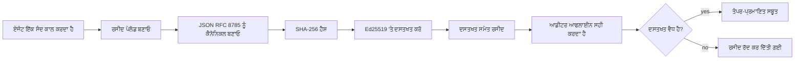
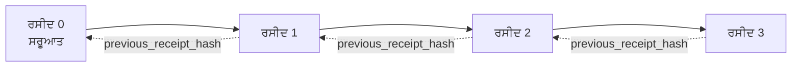

[ਸਬਕ ਵੀਡੀਓ ਦੇਖੋ: ਕ੍ਰਿਪਟੋਗਰਾਫਿਕ ਰਸੀਦਾਂ ਨਾਲ ਏਆਈ ਏਜੰਟਾਂ ਦੀ ਸੁਰੱਖਿਆ](https://youtu.be/PLACEHOLDER_VIDEO_ID)

> _(ਲੇਸਨ ਵੀਡੀਓ ਅਤੇ ਥੰਬਨੇਲ ਨੂੰ ਮਾਇਕ੍ਰੋਸੋਫਟ ਸਮੱਗਰੀ ਟੀਮ ਦੁਆਰਾ ਮਿਲਾਪ ਤੋਂ ਬਾਅਦ ਸ਼ਾਮਲ ਕੀਤਾ ਜਾਵੇਗਾ, ਜੋ ਕਿ ਲੇਸਨ 14 / 15 ਪੈਟਰਨ ਨਾਲ ਮਿਲਦਾ ਜੁਲਦਾ ਹੋਵੇਗਾ।)_

# ਕ੍ਰਿਪਟੋਗਰਾਫਿਕ ਰਸੀਦਾਂ ਨਾਲ ਏਆਈ ਏਜੰਟਾਂ ਦੀ ਸੁਰੱਖਿਆ

## ਪਰਿਚਯ

ਇਸ ਲੇਸਨ ਵਿੱਚ ਇਹ ਕਵਰ ਕੀਤਾ ਜਾਵੇਗਾ:

- ਕਿਉਂ ਏਆਈ ਏਜੰਟਾਂ ਲਈ ਆਡਿਟ ਟ੍ਰੇਲ ਕੰਪਲਾਇੰਸ, ਡੀਬੱਗਿੰਗ ਅਤੇ ਭਰੋਸੇ ਲਈ ਮਹੱਤਵਪੂਰਨ ਹੈ।
- ਕ੍ਰਿਪਟੋਗਰਾਫਿਕ ਰਸੀਦ ਕੀ ਹੁੰਦੀ ਹੈ ਅਤੇ ਇਹ ਅਣਸਾਈਨ ਕੀਤੀ ਲਾਗ ਲਾਈਨ ਤੋਂ ਕਿਵੇਂ ਵੱਖਰੀ ਹੁੰਦੀ ਹੈ।
- ਕਿਸੇ ਏਜੰਟ ਦੇ ਟੂਲ ਕਾਲ ਲਈ ਸਿੱਧਾ ਪਾਇਥਨ ਵਿੱਚ ਸਾਈਨ ਕੀਤੀ ਰਸੀਦ ਕਿਵੇਂ ਤਿਆਰ ਕਰਨੀ ਹੈ।
- ਰਸੀਦ ਨੂੰ ਅਫਲਾਈਨ ਕਿਵੇਂ ਵੇਰੀਫਾਈ ਕਰਨਾ ਹੈ ਅਤੇ ਟੈਂਪਰਿੰਗ ਦਾ ਪਤਾ ਲਗਾਉਣਾ ਹੈ।
- ਰਸੀਦਾਂ ਨੂੰ ਚੇਨ ਕਿਵੇਂ ਕਰਨਾ ਹੈ ਤਾਂ ਜੋ ਕਿਸੇ ਨੂੰ ਹਟਾਉਣਾ ਜਾਂ ਦੁਬਾਰਾ ਅਰੈਂਜ ਕਰਨਾ ਚੇਨ ਨੂੰ ਤੋੜ ਦੇਵੇ।
- ਰਸੀਦਾਂ ਕੀ ਸਾਬਤ ਕਰਦੀਆਂ ਹਨ ਅਤੇ ਉਹ ਖ਼ਾਸ ਤੌਰ 'ਤੇ ਕੀ ਸਾਬਤ ਨਹੀਂ ਕਰਦੀਆਂ।

## ਸਿੱਖਣ ਦੇ ਲਕੜਾ

ਇਸ ਲੇਸਨ ਨੂੰ ਪੂਰਾ ਕਰਨ ਤੋਂ ਬਾਅਦ ਤੁਸੀਂ ਜਾਣੋਗੇ ਕਿ:

- ਉਹ ਫੇਲਯੋਰ ਮੋਡਜ਼ ਪਛਾਣੋ ਜੋ ਏਜੰਟ ਕਿਰਿਆਵਾਂ ਲਈ ਕ੍ਰਿਪਟोगਰਾਫਿਕ ਪ੍ਰੋਵੇਨੈਂਸ ਲਈ ਪ੍ਰੇਰਕ ਹਨ।
- canonical JSON ਪੇਲੋਡ 'ਤੇ Ed25519-ਸਾਈਨਡ ਰਸੀਦ ਤਿਆਰ ਕਰੋ।
- ਸਿੱਗਨੇਚਰ ਕਰਨ ਵਾਲੇ ਪਬਲਿਕ ਕੀ ਨਾਲ ਸਿਰਫ਼ ਸਵਤੰਤਰ ਤੌਰ 'ਤੇ ਇੱਕ ਰਸੀਦ ਦੀ ਤਸਦੀਕ ਕਰੋ।
- ਸੋਧੀ ਗਈ ਰਸੀਦ 'ਤੇ ਫਿਰ ਤੋਂ ਵੈਰੀਫਿਕੇਸ਼ਨ ਚਲਾਕੇ ਟੈਂਪਰਿੰਗ ਦਾ ਪਤਾ ਲਗਾਓ।
- ਹੈਸ਼-ਚੇਨ ਵਾਲੀ ਰਸੀਦਾਂ ਦੀ ਲੜੀ ਬਣਾਓ ਅਤੇ ਸਮਝਾਓ ਕਿ ਚੇਨ ਕਿਉਂ ਮਹੱਤਵਪੂਰਨ ਹੈ।
- ਇਹ ਜਾਣੋ ਕਿ ਰਸੀਦਾਂ ਕੀ ਸਾਬਤ ਕਰਦੀਆਂ ਹਨ (ਅਟ੍ਰਿਬਿਊਸ਼ਨ, ਇੰਟੀਗ੍ਰਿਟੀ, ਆਰਡਰਿੰਗ) ਅਤੇ ਕੀ ਨਹੀਂ (ਕਿਰਿਆ ਦੀ ਸਹੀਤਾ, ਨੀਤੀ ਦੀ ਸਹੀਤਾ)।

## ਸਮੱਸਿਆ: ਤੁਹਾਡੇ ਏਜੰਟ ਦਾ ਆਡਿਟ ਟ੍ਰੇਲ

ਸੋਚੋ ਕਿ ਤੁਸੀਂ Contoso Travel ਲਈ ਇੱਕ ਏਆਈ ਏਜੰਟ ਤਿਆਰ ਕੀਤਾ ਹੈ। ਇਹ ਏਜੰਟ ਗ੍ਰਾਹਕ ਦੀਆਂ ਬੇਨਤੀਆਂ ਪੜ੍ਹਦਾ ਹੈ, ਉਡਾਣਾਂ ਦੀ API ਨੂੰ ਕਾਲ ਕਰਦਾ ਹੈ ਵਿਕਲਪ ਲੱਭਣ ਲਈ ਅਤੇ ਗ੍ਰਾਹਕ ਵੱਲੋਂ ਸੀਟਾਂ ਬੁਕ ਕਰਦਾ ਹੈ। ਪਿਛਲੇ ਚਾਰ ਮਾਹਾਂ ਵਿੱਚ, ਏਜੰਟ ਨੇ 50,000 ਬੁਕਿੰਗ ਕੀਤੀਆਂ।

ਅੱਜ ਇੱਕ ਆਡਿਟਰ ਆਉਂਦਾ ਹੈ। ਉਹ ਸਧਾਰਨ ਸਵਾਲ ਪੁੱਛਦਾ ਹੈ: "ਮੇਨੂੰ ਦਿਖਾਓ ਕਿ ਤੁਹਾਡਾ ਏਜੰਟ ਕੀ ਕੀਤਾ।"

ਤੁਸੀਂ ਆਪਣੀਆਂ ਲੌਗ ਫਾਈਲਾਂ ਦੇ ਦਿੰਦੇ ਹੋ। ਆਡਿਟਰ ਉਹਨਾਂ ਨੂੰ ਦੇਖਦਾ ਹੈ ਅਤੇ ਇਕ ਮੁਸ਼ਕਲ ਸਵਾਲ ਪੁੱਛਦਾ ਹੈ: "ਮੈਨੂੰ ਕੇਵੇਂ ਪਤਾ ਲੱਗੇਗਾ ਕਿ ਇਹ ਲੌਗਸ ਸੋਧੇ ਨਹੀਂ ਗਏ?"

ਇਹ ਆਡਿਟ ਟ੍ਰੇਲ ਸਮੱਸਿਆ ਹੈ। ਅੱਜਕਲ ਜ਼ਿਆਦਾਤਰ ਏਜੰਟ ਤਿਆਰਕਾਰ ਇਹਨਾਂ 'ਤੇ ਨਿਰਭਰ ਕਰਦੇ ਹਨ:

- **ਐਪਲੀਕੇਸ਼ਨ ਲੌਗਸ**: ਜੋ ਖੁਦ ਏਜੰਟ ਦੁਆਰਾ ਲਿਖੀਆਂ ਜਾਂਦੀਆਂ ਹਨ, ਫਾਈਲ-ਸਿਸਟਮ ਐਕਸੇਸ ਵਾਲੇ ਕਿਸੇ ਵੀ ਵਿਅਕਤੀ ਦੁਆਰਾ ਸੋਧੀਆਂ ਜਾ سکتੀਆਂ ਹਨ।
- **ਕਲਾਉਡ ਲੌਗਿੰਗ ਸਰਵਿਸਜ਼**: ਪਲੇਟਫਾਰਮ ਪੱਧਰ 'ਤੇ ਟੈਂਪਰ-ਸਬੂਤ ਪਰੰਪਰਕ ਹੁੰਦੀਆਂ ਹਨ ਪਰ ਸਿਰਫ ਜਦੋਂ ਆਡਿਟਰ ਪਲੇਟਫਾਰਮ ਆਪਰੇਟਰ 'ਤੇ ਭਰੋਸਾ ਕਰਦਾ ਹੈ।
- **ਡਾਟਾਬੇਸ ਟ੍ਰਾਂਜ਼ੈਕਸ਼ਨ ਲੌਗਸ**: ਡਾਟਾਬੇਸ ਬਦਲਾਵਾਂ ਲਈ ਠੀਕ ਹਨ ਪਰ ਕਿਸੇ ਵੀ ਟੂਲ ਕਾਲ ਲਈ ਨਹੀਂ।

ਇਹਨਾਂ ਵਿੱਚੋਂ ਕੋਈ ਵੀ ਆਡਿਟਰ ਦੇ ਸਵਾਲ ਦਾ ਜਵਾਬ ਨਹੀਂ ਦੇ ਸਕਦਾ ਬਿਨਾਂ ਕਿਸੇ ਤੇ ਭਰੋਸਾ ਕੀਤੇ (ਤੁਸੀਂ, ਤੁਹਾਡਾ ਕਲਾਉਡ ਪ੍ਰੋਵਾਈਡਰ, ਤੁਹਾਡਾ ਡਾਟਾਬੇਸ ਵਿਕਰੇਤਾ)। ਅੰਦਰੂਨੀ ਉਪਯੋਗ ਲਈ, ਇਹ ਭਰੋਸਾ ਅਕਸਰ ਮੰਨਿਆ ਜਾਂਦਾ ਹੈ। ਵਿਧੀਬੱਧ ਲੋੜਾਂ ਲਈ (ਵਿੱਤੀ, ਸਿਹਤ ਸੇਵਾਵਾਂ, ਜਾਂ ਜੋ ਕੁਝ EU AI ਐਕਟ ਦਾ ਪਾਲਣ ਕਰਦਾ ਹੈ), ਇਹ ਠੀਕ ਨਹੀਂ।

ਕ੍ਰਿਪਟੋਗਰਾਫਿਕ ਰਸੀਦਾਂ ਹਰੇਕ ਏਜੰਟ ਕਿਰਿਆ ਨੂੰ ਸਵਤੰਤਰ ਤੌਰ 'ਤੇ ਵੇਰਫ਼ਾਈ ਕਰਨ ਯੋਗ ਬਣਾਉਂਦੀਆਂ ਹਨ। ਆਡਿਟਰ ਨੂੰ ਤੁਹਾਡੇ ਉੱਤੇ ਭਰੋਸਾ ਕਰਨ ਦੀ ਲੋੜ ਨਹੀਂ। ਉਸਨੂੰ ਸਿਰਫ ਤੁਹਾਡੀ ਪਬਲਿਕ ਕੀ ਅਤੇ ਰਸੀਦ ਦੀ ਜ਼ਰੂਰਤ ਹੈ।

## ਕ੍ਰਿਪਟੋਗਰਾਫਿਕ ਰਸੀਦ ਕੀ ਹੈ?

ਰਸੀਦ ਇੱਕ JSON ਆਬਜੈਕਟ ਹੈ ਜੋ ਦਰਜ ਕਰਦਾ ਹੈ ਕਿ ਏਜੰਟ ਨੇ ਕੀ ਕੀਤਾ, ਇੱਕ ਡਿਜਿਟਲ ਸਾਈਨ ਨਾਲ ਸਾਈਨ ਕੀਤਾ ਹੋਇਆ।



ਇੱਕ ਘੱਟੋ-ਘੱਟ ਰਸੀਦ ਇਸ ਤਰ੍ਹਾਂ ਦਿੱਖਦੀ ਹੈ:

```json
{
  "type": "agent.tool_call.v1",
  "agent_id": "contoso-travel-bot",
  "tool_name": "lookup_flights",
  "tool_args_hash": "sha256:a3f9c1...",
  "result_hash": "sha256:7b2e1d...",
  "policy_id": "contoso-travel-policy-v3",
  "timestamp": "2026-04-25T14:30:00Z",
  "sequence": 47,
  "previous_receipt_hash": "sha256:9d4e6a...",
  "signature": {
    "alg": "EdDSA",
    "sig": "c5af83...",
    "public_key": "8f3b2c..."
  }
}
```

ਤਿੰਨ ਵਿਸ਼ੇਸ਼ਤਾਵਾਂ ਕੰਮ ਕਰ ਰਹੀਆਂ ਹਨ:

1. **ਸਾਈਨਚਰ**। ਰਸੀਦ ਏਜੰਟ ਦੇ ਗੇਟਵੇ ਦੁਆਰਾ Ed25519 ਪ੍ਰਾਈਵੇਟ ਕੀ ਨਾਲ ਸਾਈਨ ਕੀਤੀ ਜਾਂਦੀ ਹੈ। ਕੋਈ ਵੀ ਜਿਸ ਕੋਲ ਸਬੰਧਤ ਪਬਲਿਕ ਕੀ ਹੈ ਉਸਨੂੰ ਸਾਈਨਚਰ ਨੂੰ ਅਫਲਾਈਨ ਵੇਰਫਾਈ ਕਰਨ ਦੀ ਸਮਰੱਥਾ ਹੈ। ਕਿਸੇ ਵੀ ਖੇਤਰ ਨੂੰ ਸੋਧਣ ਨਾਲ ਸਾਈਨਚਰ ਰੱਦ ਹੋ ਜਾਂਦਾ ਹੈ।

2. **ਕੈਨੋਨਿਕਲ ਕੋਡਿੰਗ**। ਸਾਈਨ ਕਰਨ ਤੋਂ ਪਹਿਲਾਂ, ਰਸੀਦ JSON Canonicalization Scheme (JCS, RFC 8785) ਦੀ ਵਰਤੋਂ ਨਾਲ ਸੀਰੀਅਲਾਈਜ਼ ਕੀਤੀ ਜਾਂਦੀ ਹੈ। ਇਹ ਯਕੀਨੀ ਬਣਾਉਂਦਾ ਹੈ ਕਿ ਦੋ ਵੱਖ-ਵੱਖ ਇੰਪਲਿਮੈਂਟੇਸ਼ਨਾਂ ਵੱਲੋਂ ਇੱਕੋ ਜਿਹਾ ਲਾਜ਼ਮੀ ਰਸੀਦ ਬਾਈਟ-ਇੱਕੋ ਹੀ ਨਤੀਜਾ ਪੈਦਾ ਕਰ ਰਹੀਆਂ ਹਨ। ਬਿਨਾਂ ਕੈਨੋਨਿਕਲਾਈਜੇਸ਼ਨ ਦੇ, ਵੱਖ-ਵੱਖ JSON ਸੀਰੀਅਲਾਈਜ਼ਰ ਸਮੱਗਰੀ ਲਈ ਵੱਖ-ਵੱਖ ਸਾਈਨਚਰ ਬਣਾਉਂਦੇ।

3. **ਹੈਸ਼ ਚੇਨਿੰਗ**। `previous_receipt_hash` ਖੇਤਰ ਹਰ ਰਸੀਦ ਨੂੰ ਉਸ ਤੋਂ ਪਹਿਲਾਂ ਵਾਲੀ ਰਸੀਦ ਨਾਲ ਜੋੜਦਾ ਹੈ। ਕਿਸੇ ਰਸੀਦ ਨੂੰ ਹਟਾਉਣਾ ਜਾਂ ਦੁਬਾਰਾ ਅਰੈਂਜ ਕਰਨਾ ਬਾਅਦ ਵਾਲੀਆਂ ਸਾਰੀ ਰਸੀਦਾਂ ਨੂੰ ਤੋੜ ਦਿੰਦਾ ਹੈ। ਭਲੇ ਹੀ ਵੱਖ-ਵੱਖ ਸਾਈਨਚਰ ਪਾਸ ਹੋ ਜਾਣ, ਚੇਨ ਪੱਧਰ 'ਤੇ ਟੈਂਪਰਿੰਗ ਦਿਖਾਈ ਦੇ ਜਾਂਦੀ ਹੈ।

ਇਹਨਾਂ ਵਿਸ਼ੇਸ਼ਤਾਵਾਂ ਦਾ ਮਿਲਕੇ ਤਿੰਨ ਗਾਰੰਟੀਜ਼ ਦੇਣਾ:

- **ਅਟ੍ਰਿਬਿਊਸ਼ਨ**: ਇਹ ਕੀ ਇਸ ਸਮੱਗਰੀ ਨੂੰ ਸਾਈਨ ਕੀਤਾ।
- **ਇੰਟੀਗ੍ਰਿਟੀ**: ਸਮੱਗਰੀ ਸਾਈਨ ਕਰਨ ਤੋਂ ਬਾਅਦ ਬਦਲੀ ਨਹੀਂ ਗਈ।
- **ਆਰਡਰਿੰਗ**: ਇਹ ਰਸੀਦ ਉੱਥੇ ਦੀ ਰਸੀਦ ਤੋਂ ਬਾਅਦ ਚੇਨ ਵਿੱਚ ਆਈ।

## ਪਾਇਥਨ ਵਿੱਚ ਰਸੀਦ ਤਿਆਰ ਕਰਨਾ

ਰਸੀਦ ਬਣਾਉਣ ਲਈ ਕਿਸੇ ਖ਼ਾਸ ਲਾਇਬ੍ਰੇਰੀ ਦੀ ਲੋੜ ਨਹੀਂ। ਕ੍ਰਿਪਟੋਗਰਾਫਿਕ ਪ੍ਰਿਮਿਟਿਵਸ ਵਿਆਪਕਤਾਪੂਰਵਕ ਉਪਲਬਧ ਹਨ ਅਤੇ ਲੋਗਿਕ ਕੁਝ ਦਹਾਕ਼ ਪਾਇਥਨ ਲਾਈਨਾਂ ਵਿੱਚ ਹੈ।

`code_samples/18-signed-receipts.ipynb` ਵਿੱਚ ਹੱਥੋਂ-ਹੱਥ ਅਭਿਆਸ ਪੂਰੇ ਪ੍ਰਕਿਰਿਆ ਨੂੰ ਸਮਝਾਉਂਦੇ ਹਨ। ਸਾਰ:

```python
import json
import hashlib
import base64
from nacl import signing
from jcs import canonicalize  # RFC 8785 ਕੈਨੋਨਿਕਲ JSON

def b64url_nopad(data: bytes) -> str:
    return base64.urlsafe_b64encode(data).decode("ascii").rstrip("=")

def sha256_canonical(obj) -> str:
    """SHA-256 of a Python object's JCS-canonical JSON form."""
    return f"sha256:{hashlib.sha256(canonicalize(obj)).hexdigest()}"

# ਸਾਈਨ ਕਰਨ ਵਾਲੀ ਕੁੰਜੀ ਤਿਆਰ ਕਰੋ ਜਾਂ ਲੋਡ ਕਰੋ (ਉਤਪਾਦਨ ਵਿੱਚ, ਕੁੰਜੀ ਵੌਲਟ ਵਿੱਚ ਸਟੋਰ ਕਰੋ)
signing_key = signing.SigningKey.generate()
verify_key = signing_key.verify_key

# ਰਸੀਦ ਪੇਲੋਡ ਬਣਾਓ (ਅਜੇ ਤਕ ਕੋਈ ਸਾਈਨ ਨਹੀਂ)
tool_args = {"origin": "SYD", "destination": "LAX"}
tool_result = [{"flight": "QF11", "price": 1850, "stops": 0}]

payload = {
    "type": "agent.tool_call.v1",
    "agent_id": "contoso-travel-bot",
    "tool_name": "lookup_flights",
    "tool_args_hash": sha256_canonical(tool_args),
    "result_hash": sha256_canonical(tool_result),
    "policy_id": "contoso-travel-policy-v3",
    "timestamp": "2026-04-25T14:30:00Z",
    "sequence": 0,
    "previous_receipt_hash": None,
}

# ਕੈਨੋਨਿਕਲ ਬਣਾਓ, ਹੈਸ਼ ਕਰੋ, ਸਾਈਨ ਕਰੋ।
canonical_bytes = canonicalize(payload)
message_hash = hashlib.sha256(canonical_bytes).digest()
signature_bytes = signing_key.sign(message_hash).signature

# ਇੱਕ ਸਰਚਿਤ ਸਾਈਨਚਰ ਆਬਜੈਕਟ ਜੋੜੋ।
receipt = {
    **payload,
    "signature": {
        "alg": "EdDSA",
        "sig": b64url_nopad(signature_bytes),
        "public_key": b64url_nopad(bytes(verify_key)),
    },
}
```

ਇਹ ਸਰੀਰਾਵਾਦੀ ਸਾਈਨਿੰਗ ਪਾਈਪਲਾਈਨ ਹੈ। ਨੋਟਬੁੱਕ ਵਿੱਚ ਦਿੱਤੇ ਅਭਿਆਸ ਹਰ ਕਦਮ ਵਿੱਚ ਗਾਹਕ ਵਿਚਾਰ ਕਰਦੇ ਹਨ।

## ਰਸੀਦ ਦੀ ਤਸਦੀਕ ਅਤੇ ਟੈਂਪਰਿੰਗ ਦੀ ਪਹਾਣਚ

ਵੇਰਫਾਈ ਕਰਨ ਦੀ ਪ੍ਰਕਿਰਿਆ ਉਲਟੀ ਹੁੰਦੀ ਹੈ:

```python
import base64
import hashlib
from nacl import signing
from nacl.exceptions import BadSignatureError
from jcs import canonicalize

def b64url_decode(s: str) -> bytes:
    padding = "=" * ((4 - len(s) % 4) % 4)
    return base64.urlsafe_b64decode(s + padding)

def verify_receipt(receipt: dict) -> bool:
    # ਸਾਈਨੈਚਰ ਇੱਕ ਬਣਤਰਬੱਧ ਵਸਤੂ ਹੈ: {"alg", "sig", "public_key"}।
    sig_obj = receipt.get("signature")
    if not sig_obj or sig_obj.get("alg") != "EdDSA":
        return False

    # ਉਹ ਪੇਲੋਡ ਮੁੜ ਬਣਾਓ ਜੋ ਵਾਸਤਵ ਵਿੱਚ ਸਾਈਨ ਕੀਤਾ ਗਿਆ ਸੀ (ਸਾਈਨੈਚਰ ਨੂੰ ਛੱਡ ਕੇ ਸਭ ਕੁਝ)।
    payload = {k: v for k, v in receipt.items() if k != "signature"}

    canonical_bytes = canonicalize(payload)
    message_hash = hashlib.sha256(canonical_bytes).digest()

    try:
        verify_key = signing.VerifyKey(b64url_decode(sig_obj["public_key"]))
        verify_key.verify(message_hash, b64url_decode(sig_obj["sig"]))
        return True
    except BadSignatureError:
        return False
```

ਇਹ ਫੰਕਸ਼ਨ ਇੱਕ ਰਸੀਦ ਲੈਂਦਾ ਹੈ ਅਤੇ ਜੇ ਸਾਈਨਚਰ ਸਹੀ ਹੋਵੇ ਤਾਂ `True`, ਨਹੀਂ ਤਾਂ `False` ਦਿੰਦਾ ਹੈ। ਕੋਈ ਨੈੱਟਵਰਕ ਕਾਲ ਨਹੀਂ, ਕੋਈ ਸਰਵਿਸ ਡੀਪੈਂਡੈਂਸੀ ਨਹੀਂ, ਕਿਸੇ ਤੀਜੇ ਪੱਖ ਤੇ ਭਰੋਸਾ ਕਰਨ ਦੀ ਲੋੜ ਨਹੀਂ।

ਟੈਂਪਰਿੰਗ ਪਹਾਣਚ ਨੂੰ ਦੇਖਣ ਲਈ, ਨੋਟਬੁੱਕ ਹੇਠ ਲਿਖੇ ਕਦਮਾਂ 'ਤੇ ਚੱਲਦਾ ਹੈ:

1. ਇੱਕ ਸਹੀ ਰਸੀਦ ਤਿਆਰ ਕਰਨਾ ਅਤੇ ਸੱਚ ਦੀ ਪੁਸ਼ਟੀ ਕਰਨਾ।
2. `tool_args_hash` ਖੇਤਰ ਦਾ ਇੱਕ ਬਾਈਟ ਸੋਧਣਾ।
3. ਫਿਰ ਤੋਂ ਵੇਰਫਾਈ ਚਲਾਕੇ ਅਸਫਲ ਹੋਣਾ ਦੇਖਣਾ।

ਇਹ ਸਾਬਤ ਕਰਦਾ ਹੈ ਕਿ ਰਸੀਦਾਂ ਟੈਂਪਰ-ਸਬੂਤ ਹਨ: ਕੋਈ ਵੀ ਸੋਧ ਐਨੀ ਛੋਟੀ ਹੋਵੇ, ਸਾਈਨਚਰ ਤੋੜ ਦਿੰਦਾ ਹੈ।

## ਬਹੁ-ਕਦਮ ਏਜੰਟਾਂ ਲਈ ਰਸੀਦਾਂ ਦੀ ਚੇਨਿੰਗ

ਇੱਕ ਸਾਈਨ ਕੀਤੀ ਰਸੀਦ ਇੱਕ ਕਾਰਜ ਦੀ ਸੁਰੱਖਿਆ ਕਰਦੀ ਹੈ। ਇੱਕ ਚੇਨ ਕਾਰਜਾਂ ਦੀ ਲੜੀ ਦੀ ਸੁਰੱਖਿਆ ਕਰਦੀ ਹੈ।



ਹਰ ਰਸੀਦ ਪਿਛਲੀ ਰਸੀਦ ਦਾ ਹੈਸ਼ ਦਰਜ ਕਰਦੀ ਹੈ। ਜੋ ਅਟੈੱਕਰ ਸੁਚੱਜੇ ਤੌਰ 'ਤੇ ਰਸੀਦ 2 ਨੂੰ ਹਟਾਉਣ ਚਾਹੁੰਦਾ ਹੈ, ਉਸਨੂੰ ਚਾਹੀਦਾ ਹੈ ਕਿ ਉਹ:

- ਰਸੀਦ 3 ਦੇ `previous_receipt_hash` ਖੇਤਰ ਨੂੰ ਸੋਧੇ (ਰਸੀਦ 3 ਦੀ ਸਾਈਨਚਰ ਤੋੜਦਾ ਹੈ), ਜਾਂ
- ਸੋਧੀ ਗਈ ਰਸੀਦ 3 'ਤੇ ਨਵੀਂ ਸਾਈਨਚਰ ਬਣਾਏ (ਏਜੰਟ ਦੀ ਪ੍ਰਾਈਵੇਟ ਕੀ ਦੀ ਲੋੜ ਹੈ)।

ਜੇ ਪ੍ਰਾਈਵੇਟ ਕੀ ਇੱਕ ਹਾਰਡਵੇਅਰ ਕੀ ਵੋਲਟ ਵਿੱਚ ਹੈ ਅਤੇ ਤੁਸੀਂ ਹਰ ਰਸੀਦ ਦੇ ਨਾਲ ਪਬਲਿਕ ਕੀ ਪ੍ਰਕਾਸ਼ਿਤ ਕਰਦੇ ਹੋ, ਤਾਂ ਕੋਈ ਵੀ ਹਮਲਾ ਬਿਨਾਂ ਪਤਾ ਲੱਗੇ ਸੰਭਵ ਨਹੀਂ।

ਨੋਟਬੁੱਕ ਵਿੱਚ ਹੇਠਾਂ ਦਿੱਤੇ ਕੰਮ ਕੀਤੇ ਜਾਂਦੇ ਹਨ:

1. ਤਿੰਨ ਰਸੀਦਾਂ ਦੀ ਚੇਨ ਬਣਾਉਣਾ।
2. ਹਰ ਰਸੀਦ ਦੇ `previous_receipt_hash` ਨੂੰ ਇਸ ਤੋਂ ਪਹਿਲਾਂ ਵਾਲੇ ਰਸੀਦ ਦੇ ਅਸਲ ਹੈਸ਼ ਨਾਲ ਮੇਲ ਕਰਨਾ।
3. ਦਰਮਿਆਨ ਇੱਕ ਰਸੀਦ ਸੋਧੀ ਜਾਂਦੀ ਹੈ ਅਤੇ ਚੇਨ ਉਸ ਥਾਂ 'ਤੇ ਟੁੱਟਦੀ ਹੈ।

ਇਸ ਤਰ੍ਹਾਂ ਤੁਸੀਂ ਇੱਕ ਆਡਿਟ ਟ੍ਰੇਲ ਤਿਆਰ ਕਰਦੇ ਹੋ ਜੋ ਬਾਹਰੀ ਆਡਿਟਰ ਬਿਨਾਂ ਤੁਹਾਡੇ ਉੱਤੇ ਭਰੋਸਾ ਕੀਤੇ ਵੇਰੀਫਾਈ ਕਰ ਸਕਦਾ ਹੈ।

## ਰਸੀਦਾਂ ਕੀ ਸਾਬਤ ਕਰਦੀਆਂ ਹਨ (ਅਤੇ ਕੀ ਨਹੀਂ)

ਇਹ ਸਬ ਤੋਂ ਮਹੱਤਵਪੂਰਨ ਭਾਗ ਹੈ। ਰਸੀਦਾਂ ਬਲਵਾਂਤ ਹਨ ਪਰ ਉਨ੍ਹਾਂ ਦੀ ਸੀਮਾ ਹੈ।

**ਰਸੀਦਾਂ ਤਿੰਨ ਗੱਲਾਂ ਸਾਬਤ ਕਰਦੀਆਂ ਹਨ:**

1. **ਅਟ੍ਰਿਬਿਊਸ਼ਨ**: ਇੱਕ ਨਿਰਧਾਰਿਤ ਕੀ ਨੇ ਇੱਕ ਨਿਰਧਾਰਿਤ ਪੇਲੋਡ 'ਤੇ ਸਾਈਨ ਕੀਤਾ।
2. **ਇੰਟੀਗ੍ਰਿਟੀ**: ਪੇਲੋਡ ਸਾਈਨ ਕਰਨ ਤੋਂ ਬਾਅਦ ਬਦਲੀ ਨਹੀਂ ਗਈ।
3. **ਆਰਡਰਿੰਗ**: ਇਹ ਰਸੀਦ ਹੈਸ਼ ਚੇਨ ਵਿੱਚ ਉਸ ਰਸੀਦ ਤੋਂ ਬਾਅਦ ਆਈ।

**ਰਸੀਦਾਂ ਸਾਬਤ ਨਹੀਂ ਕਰਦੀਆਂ:**

1. **ਸਹੀਤਾ**: ਕਿ ਏਜੰਟ ਦੀ ਕਾਰਵਾਈ ਸਹੀ ਕਾਰਵਾਈ ਸੀ। ਇੱਕ ਰਸੀਦ ਸਹੀ ਜਵਾਬ ਲਈ ਜਿਵੇਂ ਹੀ ਗਲਤ ਜਵਾਬ ਲਈ ਵੀ ਸਾਈਨ ਕੀਤੀ ਜਾ ਸਕਦੀ ਹੈ।
2. **ਨੀਤੀ ਅਨੁਕੂਲਤਾ**: `policy_id` ਵਿੱਚ ਦਿੱਤੀ ਨੀਤੀ ਵਾਸਤੇ ਕਿਰਿਆ ਕੀਤੀ ਗਈ ਜਾਂ ਉਸਨੂੰ ਆਜ਼ਾਦ ਕੀਤਾ ਗਿਆ। ਰਸੀਦ ਜੋ ਦਿਖਾਉਂਦੀ ਹੈ, ਉਹ ਦਿਖਾਉਂਦੀ ਹੈ ਕਿ ਕੀ ਕਿਹਾ ਗਿਆ ਸੀ, ਕੀ ਲਾਗੂ ਕੀਤਾ ਗਿਆ ਨਹੀਂ।
3. **ਕੀ ਤੋਂ ਬਾਵਜੂਦ ਪਹਿਚਾਣ**: ਰਸੀਦ ਕਹਿੰਦੀ ਹੈ "ਇਹ ਕੀ ਇਸ ਸਮੱਗਰੀ ਨੂੰ ਸਾਈਨ ਕੀਤਾ।" ਇਹ ਨਹੀਂ ਕਹਿੰਦੀ "ਇਹ ਮਨੁੱਖ ਨੇ ਮਨਜ਼ੂਰ ਕੀਤਾ।" ਕੀ ਨੂੰ ਵਿਅਕਤੀ ਜਾਂ ਸੰਸਥਾ ਨਾਲ ਜੋੜਨ ਲਈ ਵੱਖਰਾ ਪਹਿਚਾਣ ਸਹੂਲਤ (ਜਿਵੇਂ ਡਾਇਰੈਕਟਰੀ, ਪਬਲਿਕ ਕੀ ਰਜਿਸਟਰੀ) ਜ਼ਰੂਰੀ ਹੈ।
4. **ਇਨਪੁੱਟ ਦੀ ਸਚਾਈ**: ਜੇ ਐਜੰਟ ਕਿਸੇ ਸੋਧੀ ਹੋਈ ਪ੍ਰੌਮਪਟ ਨੂੰ ਪ੍ਰਾਪਤ ਕਰਦਾ ਅਤੇ ਉਸ 'ਤੇ ਕਿਰਿਆ ਕਰਦਾ ਹੈ, ਤਾਂ ਰਸੀਦ ਕਾਰਵਾਈ ਨੂੰ ਸਚਾਈ ਨਾਲ ਦਰਜ ਕਰਦੀ ਹੈ। ਰਸੀਦ ਇਨਪੁੱਟ ਵੈਰੀਫਿਕੇਸ਼ਨ ਦੀ ਬਜਾਏ ਹੈ, ਨਾਂ ਕਿ ਉਸ ਦਾ ਪਰਿਵਰਤਕ।

ਇਹ ਹੱਦਾ ਦੋ ਕਾਰਨਾਂ ਲਈ ਮਹੱਤਵਪੂਰਨ ਹੈ:

- ਇਹ ਦੱਸਦਾ ਹੈ ਕਿ ਰਸੀਦਾਂ ਕਿਥੇ ਲਾਗੂ ਹੁੰਦੀਆਂ ਹਨ: ਏਜੰਟ ਦੇ ਵਿਵਹਾਰ ਨੂੰ ਆਡਿਟ ਯੋਗ ਅਤੇ ਟੈਂਪਰ-ਸਬੂਤ ਬਣਾਉਣ ਲਈ, ਇੱਥੋਂ ਤੱਕ ਕਿ ਸੰਗਠਨਿਕ ਹੱਦਾਂ ਦੇ ਅੰਦਰ ਵੀ।
- ਇਹ ਦੱਸਦਾ ਹੈ ਕਿ ਤੁਹਾਨੂੰ ਹੋਰ ਲੇਅਰਾਂ ਦੀ ਲੋੜ ਕਿਉਂ ਹੈ: ਇਨਪੁੱਟ ਵੈਰੀਫਿਕੇਸ਼ਨ (ਲੇਸਨ 6), ਨੀਤੀ ਲਾਗੂ ਕਰਨਾ (ਹੇਠਾਂ ਛੋਟੀ ਜਾਣਕਾਰੀ), ਅਤੇ ਪਹਿਚਾਣ ਸਹੂਲਤ (ਇਸ ਲੇਸਨ ਦਾ ਹਿੱਸਾ ਨਹੀਂ)।

ਇੱਕ ਆਮ ਗਲਤ ਫਹਿਮੀ ਇਹ ਹੈ ਕਿ "ਸਾਡੇ ਕੋਲ ਰਸੀਦਾਂ ਹਨ" ਦਾ ਮਤਲਬ "ਅਸੀਂ ਕਾਇਦੇਵੰਦ ਹਾਂ" ਹੈ। ਇਹ ਠੀਕ ਨਹੀਂ। ਰਸੀਦਾਂ ਬੁਨਿਆਦ ਹਨ। ਸਰਕਾਰ ਇਸ ਉੱਤੇ ਬਣਾਈ ਜਾਂਦੀ ਹੈ।

## ਮਨੁੱਖ ਨੇ ਯਕੀਨੀ ਕੀਤਾ ਕਾਰਜ ਪ੍ਰਮਾਣਿਤ ਕਰਨਾ

ਉੱਪਰ ਦੱਸਿਆ ਤੀਜਾ ਨੁਕਤਾ ਆਪਣਾ ਖ਼ਾਸ ਭਾਗ ਲਾਇਕ ਹੈ: ਇੱਕ ਕਾਰਜ ਰਸੀਦ ਕਹਿੰਦੀ ਹੈ "ਇਹ ਕੀ ਇਸ ਸਮੱਗਰੀ ਨੂੰ ਸਾਈਨ ਕੀਤਾ," ਕਦੇ ਨਹੀਂ ਕਹਿੰਦੀ "ਇਹ ਮਨੁੱਖ ਨੇ ਮਨਜ਼ੂਰ ਕੀਤਾ।" ਉੱਚ ਜੋਖਮ ਕਾਰਜਾਂ ਲਈ (ਰੇਫੰਡ, ਹਟਾਉਣ, ਵਾਇਰ ਟ੍ਰਾਂਸਫਰ), ਸਰਕਾਰੀ ਫ੍ਰੇਮਵਰਕ ਵੱਧ-ਵੱਧ ਇਹ ਗੁਜਾਰਿਸ਼ ਕਰਦੇ ਹਨ, ਜੋ ਕਿ ਇਸ ਲੇਸਨ ਵਿੱਚ ਵਰਤੇ ਗਏ ਉਨ੍ਹਾਂ ਹੀ ਪ੍ਰਿਮਿਟਿਵਸ ਨਾਲ ਤਿਆਰ ਕੀਤਾ ਜਾ ਸਕਦਾ ਹੈ।

ਅਗਲੇ ਨੋਟਬੁੱਕ `code_samples/human-authorization-receipts.ipynb` ਵਿੱਚ ਦੂਜਾ ਰਸੀਦ ਕਿਸਮ, `human.approval.v1`, ਜੋੜੀ ਜਾਂਦੀ ਹੈ, ਜੋ ਸਿੱਖੇ ਦੀਆਂ ਰਸੀਦਾਂ ਵਾਂਗੇ ਇੱਕੋ ਢੰਗ ਨਾਲ (typed payload, Ed25519 ਸਾਈਨਡ canonical SHA-256, ਬਾਹਰ signature object) ਹੁੰਦੀ ਹੈ। ਇੱਕ ਨਾਮਤ ਅਨੁਮੋਦਕ ਪੂਰੇ canonical ਕਾਰਜ ਅਤੇ ਇਸਦੇ ਡਾਈਜੈਸਟ 'ਤੇ ਸਾਈਨ ਕਰਦਾ ਹੈ; ਏਜੰਟ ਦੀ ਕਾਰਜ ਰਸੀਦ ਲਗਭਗ ਇੱਕੋ ਕਾਰਜ ਡਾਈਜੈਸਟ ਅਤੇ `parent_approval_ref` ਲਿਜ਼ ਕਰਨ ਵਾਲੀ ਹੁੰਦੀ ਹੈ, ਜਿਸ ਨਾਲ ਨਾਲ `previous_receipt_hash` ਦੀ ਤਰਤੀਬ ਉਲਟਦੇ ਚੇਨ ਵਿੱਚ ਹੁੰਦੀ ਹੈ। ਇੱਕ `verify_chain` ਦੋਹਾਂ ਦਸਤਾਵੇਜ਼ਾਂ ਨੂੰ ਵੱਖ-ਵੱਖ ਕੀ ਰਜਿਸਟਰੀਜ਼ (approver keys ਵਿਰੁੱਧ agent keys) ਤਹਿਤ ਜਾਂਚਦਾ ਹੈ, ਤਾਕਿ ਕੋਡ ਰਾਹ ਸਾਂਝਾ ਹੋਵੇ ਪਰ ਅਥਾਰਿਟੀਆਂ ਕਦੇ ਨਾ ਹੋਣ।

ਇਸ ਸਪਸ਼ਟਤਾ ਨੂੰ ਧਿਆਨ ਨਾਲ ਕਿਹਾ ਗਿਆ: *ਮਨੁੱਖ ਨੇ ਇਸ ਖਾਸ ਕਾਰਜ ਨੂੰ ਮਨਜ਼ੂਰ ਕੀਤਾ, ਅਤੇ ਏਜੰਟ ਨੇ ਠੀਕ ਇਸ ਮਨਜ਼ੂਰ ਕੀਤੀ ਕਾਰਜ ਨੂੰ ਅਮਲ ਵਿਚ ਲਿਆਂਦਾ।* ਨੋਟਬੁੱਕ ਦੇ ਨਾ ਕਰਨ ਵਾਲੇ ਚੈੱਕ ਇਹ ਗੱਲ ਸੱਚ ਬਣਾਉਂਦੇ ਹਨ:

- ਰਵਾਇਤੀ ਸਮੂਹ: ਟੈਂਪਰਿੰਗ, ਭਟਿਆ ਹੋਇਆ ਡਿਪਿਊਟੀ, ਰਿਪਲੇਅ, ਦੋਹਾਂ ਪਾਸੇ ਕੇ ਡਾਲੇ ਗਏ ਕੀਜ਼, ਖਰਾਬ ਇਨਪੁੱਟ;
- **ਬੇਕਾਰ ਅਥਾਰਿਟੀ**: ਇੱਕ ਸਾਈਨਚਰ ਜੋ ਅਜੇ ਵੀ ਤਸਦੀਕ ਕਰਦਾ ਹੈ, ਪਰ ਇਨਕਾਰ ਕੀਤਾ ਗਿਆ ਕਿਉਂਕਿ ਨੀਤੀ ਦਾ ਵਰਜ਼ਨ ਬਦਲ ਗਿਆ, ਅਨੁਮੋਦਕ ਕੁੰਜੀ ਰਜਿਸਟਰੀ ਤੋਂ ਹਟਾਈ ਗਈ, ਜਾਂ ਮਨਜ਼ੂਰੀ ਖਤਮ ਹੋ ਗਈ;
- **ਡਾਈਜੈਸਟ ਬਦਲੀ**: ਇੱਕ ਬਰਾਬਰ ਸਾਈਨ ਕੀਤੀ ਕਾਰਜ ਰਸੀਦ ਜੋ ਇੱਕ ਅਸਲ ਮਨਜ਼ੂਰੀ ਵੱਲ ਸੰਕੇਤ ਕਰਦੀ ਹੈ ਪਰ ਇੱਕ ਵੱਖਰਾ canonical ਕਾਰਜ ਬੱਧਦੀ ਹੈ।

ਹਰ ਫੇਲ੍ਹ ਵੱਖਰੇ ਕਾਰਨ ਨਾਲ ਇਨਕਾਰ ਕਰਦਾ ਹੈ, ਤਾਂ ਜੋ ਇੱਕ ਆਡਿਟਰ ਪਤਾ ਲੱਗਾ ਸਕੇ ਕਿ ਅਥਾਰਿਟੀ ਖ਼ਤਮ ਹੋ ਗਈ ਜਾਂ ਅਮਲ ਕੀਤਾ ਕਾਰਜ ਬਦਲ ਗਿਆ। ਨੋਟਬੁੱਕ ਦਾ ਨਿਯਮ ਇਹ ਸਿਖਾਉਂਦਾ ਹੈ ਕਿ ਇੱਕ ਸਾਈਨ ਕੀਤੀ ਮਨਜ਼ੂਰੀ ਖੁਦ ਵਿੱਚ ਅਥਾਰਿਟੀ ਨਹੀਂ। ਅਥਾਰਿਟੀ ਤਦ ਹੀ ਹੈ ਜਦੋਂ ਦੋਹਾਂ ਰਸੀਦਾਂ ਸਦਾਬਹਾਰ canonical ਕਾਰਜ ਨਾਲ ਜੁੜੀਆਂ ਹੋਣ। ਇਸ ਸਬਕ ਵਾਲੇ ਇੰਟਰਨੈਟ-ਡ੍ਰਾਫਟ (`draft-farley-acta-signed-receipts`) ਵਿੱਚ ਸਾਂਝਾ ਡਿਜ਼ਾਈਨ ਇਹ ਹਨ।

## ਉਤਪਾਦਨ ਲਈ ਸੰਦਰਭ

ਇਸ ਸਬਕ ਵਿੱਚ ਪਾਇਥਨ ਕੋਡ ਜ਼ਿਆਦਾ ਨਹੀਂ ਹੈ ਤਾਂ ਜੋ ਤੁਸੀਂ ਹਰ ਲਾਈਨ ਨੂੰ ਪੜ੍ਹਕੇ ਸਮਝ ਸਕੋ ਕਿ ਕੀ ਹੋ ਰਿਹਾ ਹੈ। ਉਤਪਾਦਨ ਵਿੱਚ ਤੁਹਾਡੇ ਕੋਲ ਦੋ ਚੋਣਾਂ ਹਨ:

1. **ਕ੍ਰਿਪਟੋਗਰਾਫਿਕ ਪ੍ਰਿਮਿਟਿਵਸ 'ਤੇ ਸਿੱਧੇ ਤੌਰ 'ਤੇ ਬਣਾਉਣਾ।** ਉੱਪਰ ਦੇਖੇ ਗਏ 50 ਲਾਈਨਾਂ ਕਈ ਵਪਾਰਕ ਮਾਮਲਿਆਂ ਲਈ ਕਾਫ਼ੀ ਹਨ। PyNaCl (Ed25519) ਅਤੇ `jcs` ਪੈਕੇਜ (ਕੈਨੋਨਿਕਲ JSON) ਚੰਗੀ ਤਰ੍ਹਾਂ ਮੇਂਟੇਨਡ ਅਤੇ ਆਡਿਟ ਕੀਤੀ ਲਾਇਬ੍ਰੇਰੀਆਂ ਹਨ।

2. **ਉਤਪਾਦਨ ਰਸੀਦ ਲਾਇਬ੍ਰੇਰੀ ਦੀ ਵਰਤੋਂ ਕਰੋ।** ਕਈ ਖੁੱਲੇ ਸਰੋਤ ਪ੍ਰੋਜੈਕਟ ਇਹੀ ਪੈਟਰਨ ਵੱਧ ਫੀਚਰਾਂ ਨਾਲ ਲਾਗੂ ਕਰਦੇ ਹਨ (ਕੀ ਰੋਟੇਸ਼ਨ, ਬੈਚ ਵੇਰਫਿਕੇਸ਼ਨ, JWK ਸੈੱਟ ਵੰਡ, ਨੀਤੀ ਇੰਜਣ ਸੰਤੁਲਨ):
   - ਇਸ ਸਬਕ ਵਿਚ ਵਰਤੀ ਗਈ ਰਸੀਦ ਫਾਰਮੈਟ ਇੱਕ IETF ਇੰਟਰਨੈਟ-ਡ੍ਰਾਫਟ ([`draft-farley-acta-signed-receipts`](https://datatracker.ietf.org/doc/draft-farley-acta-signed-receipts/), ਸੰਸ਼ੋਧਨ 02) ਹੈ ਜੋ ਮਿਆਰੀ ਪ੍ਰਕਿਰਿਆ ਵਿੱਚ ਹੈ, ਜਿਸ ਦੇ ਨਾਲ ਇੱਕ ਸਾਂਝਾ ਟੈਸਟ ਸੂਟ ([agent-governance-testvectors](https://github.com/ScopeBlind/agent-governance-testvectors)) ਹੈ ਜੋ ਸੁਤੰਤਰ ਇੰਪਲੀਮੇਂਟੇਸ਼ਨਾਂ ਵੱਲੋਂ ਬਾਈਟ-ਮਿਲਦੇ-ਜੁਲਦੇ ਨਤੀਜੇ ਲਈ ਵਰਤੀ ਜਾਂਦੀ ਹੈ।
   - ਮਾਇਕ੍ਰੋਸੋਫਟ ਏਜੰਟ ਗਵਰਨੈਂਸ ਟੂਲਕਿਟ ਰਸੀਦਾਂ ਨੂੰ ਸੀਡਰ-ਅਧਾਰਿਤ ਨੀਤੀ ਫੈਸਲਿਆਂ ਨਾਲ ਜੋੜਦਾ ਹੈ; ਉਸ ਰੇਪੋ ਵਿੱਚ ਟਿਊਟੋਰਿਯਲ 33 ਨੂੰ күрੋ ਇੱਕ ਸੰਪੂਰਨ ਉਦਾਹਰਨ ਲਈ ਦੇਖੋ।
   - `protect-mcp` (npm) ਅਤੇ `@veritasacta/verify` (npm) ਪੈਕੇਜਜ਼ ਨੋਡ ਅਧਾਰਤ ਵਿਧੀ ਪ੍ਰਦਾਨ ਕਰਦੇ ਹਨ ਜੋ ਰਸੀਦਾਂ ਦੀ ਸਾਈਨਿੰਗ ਅਤੇ ਅਫਲਾਈਨ ਵੈਰੀਫਿਕੇਸ਼ਨ ਲਈ, ਜੋ ਕਿਸੇ ਵੀ MCP ਸਰਵਰ ਨੂੰ ਟੈਂਪਰ-ਸਬੂਤ ਆਡਿਟ ਟ੍ਰੇਲ ਨਾਲ ਲਪੇਟਦੇ ਹਨ, ਜਿਸ ਵਿੱਚ ਰੋਕੀ ਹੋਈ ਕਾਰਵਾਈ ਲਈ ਕੋ-ਸਾਈਨ ਫਲੋ ਵੀ ਸ਼ਾਮਲ ਹੈ ਜਿਸ ਵਿੱਚ ਰੋਕੀ ਗਈ ਕਾਰਜ ਮਨਜ਼ੂਰੀ ਰਸੀਦ ਜਾਰੀ ਕਰਦੀ ਹੈ (ਡੈਸਕਟਾਪ ਫਲੋ ਵਿੱਚ WebAuthn ਦੇ ਨਾਲ), ਮਨੁੱਖ-ਅਧਿਕਾਰਿਕ ਨੋਟਬੁੱਕ ਨਾਲੋਂ ਇੱਕੋ ਪੈਟਰਨ।
   - **[nobulex](https://github.com/arian-gogani/nobulex)** ਪਾਇਥਨ SDK (`pip install nobulex`) ਵੀ Ed25519 + JCS ਸਾਈਨਿੰਗ ਪੈਟਰਨ ਪਾਇਥਨ ਵਿੱਚ ਲਾਂਗਚੇਨ ਅਤੇ CrewAI ਇੰਟਿਗ੍ਰੇਸ਼ਨਾਂ ਸਹਿਤ ਪ੍ਰਦਾਨ ਕਰਦਾ ਹੈ, ਜਿਸ ਵਿੱਚ ਪ੍ਰਕਾਸ਼ਿਤ ਪ੍ਰਤੀਕ੍ਰਿਆ ਟੈਸਟ ਵੇਕਟਾਰ ਅਤੇ [OWASP PR #2210](https://github.com/OWASP/CheatSheetSeries/pull/2210) ਰਾਹੀਂ ਸ਼ਾਮਲ ਮਿਆਰੀ ਨਕਸ਼ਾ ਹੁੰਦਾ ਹੈ।

ਆਪਣਾ ਬਣਾਉਣਾ ਜਾਂ ਲਾਇਬ੍ਰੇਰੀ ਦੀ ਵਰਤੋਂ ਕਰਨਾ ਉਸੇ ਤਰ੍ਹਾਂ ਹੈ ਜਿਵੇਂ JWT ਲਾਇਬ੍ਰੇਰੀ ਦਿਖਤੀ ਹੈ: ਦੋਹਾਂ ਸਹੀ ਹਨ; ਲਾਇਬ੍ਰੇਰੀ ਸਮਾਂ ਬਚਾਉਂਦੀ ਹੈ ਅਤੇ ਆਡਿਟ ਸਰਫੇਸ ਘਟਾਉਂਦੀ ਹੈ; ਆਪਣੇ ਆਪ ਬਣਾਉਣਾ ਤੁਹਾਨੂੰ ਹਰ ਪ੍ਰਿਮਿਟਿਵ ਨੂੰ ਸਮਝਣ ਲਈ ਮਜਬੂਰ ਕਰਦਾ ਹੈ। ਇਹ ਸਬਕ ਤੁਹਾਨੂੰ ਆਪਣੇ ਆਪ ਬਣਾਉਣ ਦੀ ਸਿੱਖ ਜਾਂ ਦਿੰਦਾ ਹੈ ਤਾਂ ਜੋ ਤੁਹਾਡੇ ਕੋਲ ਦੋਹਾਂ ਚੋਣਾਂ ਲਈ ਰੁਟ ਹੋਵੇ।

## ਗਿਆਨ ਦੀ ਜਾਂਚ

ਅਭਿਆਸ ਕਰਨ ਤੋਂ ਪਹਿਲਾਂ ਆਪਣੀ ਸਮਝ ਦਾ ਟੈਸਟ ਕਰੋ।

**1. ਇੱਕ ਰਸੀਦ ਏਜੰਟ ਦੀ ਪ੍ਰਾਈਵੇਟ Ed25519 ਕੀ ਨਾਲ ਸਾਈਨ ਕੀਤੀ ਜਾਂਦੀ ਹੈ। ਆਡਿਟਰ ਕੋਲ ਸਿਰਫ ਪਬਲਿਕ ਕੀ ਹੈ। ਕੀ ਆਡਿਟਰ ਰਸੀਦ ਨੂੰ ਅਫਲਾਈਨ ਵੇਰਫਾਈ ਕਰ ਸਕਦਾ ਹੈ?**

<details>
<summary>ਜਵਾਬ</summary>

ਹਾਂ। Ed25519 ਵੇਰਫਿਕੇਸ਼ਨ ਲਈ ਸਿਰਫ ਪਬਲਿਕ ਕੀ ਅਤੇ ਸਾਈਨ ਕੀਤੇ ਬਾਈਟ ਦੀ ਲੋੜ ਹੁੰਦੀ ਹੈ। ਕੋਈ ਨੈੱਟਵਰਕ ਕਾਲ ਨਹੀਂ, ਕੋਈ ਸਰਵਿਸ ਡੀਪੈਂਡੈਂਸੀ ਨਹੀਂ। ਇਹ ਉਹ ਗੁਣ ਹੈ ਜੋ ਰਸੀਦਾਂ ਨੂੰ ਹਵਾ ਵਿੱਚ, ਬਹੁੰ-ਸੰਗਠਨਿਕ, ਜਾਂ ਘੱਟ ਭਰੋਸੇ ਵਾਲੇ ਆਡਿਟ ਮਾਹੌਲਾਂ ਵਿੱਚ ਲਾਭਕਾਰੀ ਬਣਾਉਂਦਾ ਹੈ।
</details>

**2. ਇੱਕ ਹਮਲਾਵਰ ਰਸੀਦ ਦੇ `policy_id` ਖੇਤਰ ਨੂੰ ਸੋਧਦਾ ਹੈ ਇਸ ਦਾ ਦਾਅਵਾ ਕਰਨ ਲਈ ਕਿ ਇਹ ਇੱਕ ਹੋਰ ਲਚਕੀਲੀ ਨੀਤੀ ਹੇਠਾਂ ਸੀ। ਸਾਈਨਚਰ ਅਸਲ ਪੇਲੋਡ 'ਤੇ ਸੀ। ਵੇਰਫਿਕੇਸ਼ਨ ਦੌਰਾਨ ਕੀ ਹੁੰਦਾ ਹੈ?**

<details>
<summary>ਜਵਾਬ</summary>


ਸੱਤਿਆਪਨ ਅਸਫਲ ਰਹਿ ਗਿਆ। ਦਸਤਖਤ ਮੂਲ ਪੇਲੋਡ ਦੇ ਕੈਨਾਨਿਕਲ ਬਾਈਟਾਂ 'ਤੇ ਗਣਨ ਕੀਤਾ ਗਿਆ ਸੀ; ਕਿਸੇ ਵੀ ਖੇਤਰ ਨੂੰ ਬਦਲਣ ਨਾਲ ਕੈਨਾਨਿਕਲ ਬਾਈਟਾਂ ਬਦਲ ਜਾਂਦੀਆਂ ਹਨ, ਜਿਸ ਨਾਲ SHA-256 ਹੈਸ਼ ਬਦਲ ਜਾਂਦਾ ਹੈ, ਜੋ ਦਸਤਖਤ ਨੂੰ ਅਵੈਧ ਬਣਾਉਂਦਾ ਹੈ। ਹਮਲਾਕਾਰ ਨੂੰ ਨਵਾਂ ਸਹੀ ਦਸਤਖਤ ਤਿਆਰ ਕਰਨ ਲਈ ਪ੍ਰਾਈਵੇਟ ਕੀ ਦੀ ਲੋੜ ਹੋਵੇਗੀ, ਜੋ ਕਿ ਉਹਨਾਂ ਕੋਲ ਨਹੀਂ ਹੈ।
</details>

**3. ਰਸੀਦ ਵਿੱਚ ਕੱਚੇ ਦਲੀਲਾਂ ਅਤੇ ਨਤੀਜੇ ਦੀ ਬਜਾਏ `tool_args_hash` ਅਤੇ `result_hash` ਕਿਉਂ ਸ਼ਾਮਲ ਹਨ?**

<details>
<summary>ਜਵਾਬ</summary>

ਦੋ ਕਾਰਨ ਹਨ। ਪਹਿਲਾਂ, ਰਸੀਦ ਨੂੰ ਅਜੇਹੇ ਵਾਤਾਵਰਣਾਂ ਵਿੱਚ ਸੰਭਾਲਣ ਜਾਂ ਪ੍ਰਸਾਰਿਤ ਕਰਨ ਦੀ ਲੋੜ ਹੋ ਸਕਦੀ ਹੈ ਜਿੱਥੇ ਕੱਚਾ ਸਮੱਗਰੀ (PII, ਵਪਾਰਕ ਡੇਟਾ) ਲੀਕ ਹੋਣਾ ਸਮੱਸਿਆ ਹੈ। ਹੈਸ਼ਿੰਗ ਰਸੀਦ ਨੂੰ ਛੋਟਾ ਅਤੇ ਸਮੱਗਰੀ ਨੂੰ ਨਿੱਜੀ ਰੱਖਦਾ ਹੈ; ਆਡੀਟਰ ਇਹ ਪੁਸ਼ਟੀ ਕਰਦਾ ਹੈ ਕਿ ਹੈਸ਼ ਇੱਕ ਵੱਖ-ਵੱਖ ਸੰਭਾਲੀ ਗਈ ਅਸਲੀ ਸਮੱਗਰੀ ਦੀ ਪ੍ਰਤੀ ਨਾਲ ਮਿਲਦਾ ਹੈ। ਦੂਜਾ, ਹੈਸ਼ਾਂ ਦੀ ਮਾਪ ਨਿਸ਼ਚਿਤ ਹੁੰਦੀ ਹੈ; ਇੱਕ ਰਸੀਦ ਜਿਸ ਵਿੱਚ ਹੈਸ਼ ਹਨ, ਆਕਾਰ ਵਿੱਚ ਸੀਮਿਤ ਹੁੰਦੀ ਹੈ ਚਾਹੇ ਇਨਪੁੱਟ ਅਤੇ ਆਊਟਪੁੱਟ ਕਿੰਨੇ ਵੱਡੇ ਹੋਣ।
</details>

**4. `previous_receipt_hash` ਖੇਤਰ ਹਰ ਰਸੀਦ ਨੂੰ ਇਸਦੇ ਪੂਰਵਜ ਨਾਲ ਜੋੜਦਾ ਹੈ। ਜੇਕਰ ਹਮਲਾਕਾਰ ਕਿਸੇ ਚੈਨ ਦੀ ਵਿਚਕਾਰਲੀ ਇੱਕ ਰਸੀਦ ਨੂੰ ਚੁੱਪਕੇ ਨਾਲ ਹਟਾ ਦਿੰਦਾ ਹੈ, ਤਾਂ ਕੀ ਅਵੈਧ ਹੋ ਜਾਂਦਾ ਹੈ?**

<details>
<summary>ਜਵਾਬ</summary>

ਹਰੇਕ ਰਸੀਦ ਜੋ ਮਿਟਾਈ ਗਈ ਰਸੀਦ ਤੋਂ ਬਾਅਦ ਆਈ। ਉਹਨਾਂ ਦੇ `previous_receipt_hash` ਖੇਤਰ ਹੁਣ ਅਸਲ ਚੈਨ ਨਾਲ ਮੇਲ ਨਹੀਂ ਖਾਂਦੇ (ਕਿਉਂਕਿ ਉਹਨਾਂ ਵੱਲ ਇਸ਼ਾਰਾ ਕੀਤੀ ਗਈ ਰਸੀਦ ਹੁਣ ਮੌਜੂਦ ਨਹੀਂ ਹੈ, ਜਾਂ ਚੈਨ ਹੁਣ ਕਿਸੇ ਹੋਰ ਪੂਰਵਜ ਵੱਲ ਸੰਕੇਤ ਕਰਦਾ ਹੈ)। ਮਿਟਾਉਣ ਨੂੰ ਛੁਪਾਉਣ ਲਈ, ਹਮਲਾਕਾਰ ਨੂੰ ਹਰ ਆਗਲੇ ਰਸੀਦ ਨੂੰ ਮੁੜ ਦਸਤਖਤ ਕਰਨਾ ਪਏਗਾ, ਜੋ ਪ੍ਰਾਈਵੇਟ ਕੀ ਦੀ ਲੋੜ ਹੈ।
</details>

**5. ਇੱਕ ਰਸੀਦ ਸਾਫ਼-ਸੁਥਰੀ ਤਰ੍ਹਾਂ ਸੱਤਿਆਪਿਤ ਹੁੰਦੀ ਹੈ। ਕੀ ਇਹ ਸਾਬਤ ਕਰਦਾ ਹੈ ਕਿ ਏਜੰਟ ਦੀ ਕਾਰਵਾਈ ਸਹੀ, ਠੀਕ ਜਾਂ ਨੀਤੀ-ਅਨੁਕੂਲ ਸੀ?**

<details>
<summary>ਜਵਾਬ</summary>

ਨਹੀਂ। ਇੱਕ ਵੈਧ ਰਸੀਦ ਤਿੰਨ ਚੀਜ਼ਾਂ ਸਾਬਤ ਕਰਦੀ ਹੈ: ਅਟ੍ਰਿਬਿਊਸ਼ਨ (ਇਹ ਕੀ ਇਹ ਸਮੱਗਰੀ ਤੇ ਦਸਤਖਤ ਕਰਦਾ ਹੈ), ਅਖੰਡਤਾ (ਸਮੱਗਰੀ ਬਦਲੀ ਨਹੀਂ ਗਈ), ਅਤੇ ਕ੍ਰਮਬੱਧਤਾ (ਇਹ ਰਸੀਦ ਉਸ ਰਸੀਦ ਤੋਂ ਬਾਅਦ ਆਈ ਹੇ)। ਇਹ ਸਾਬਤ ਨਹੀਂ ਕਰਦਾ ਕਿ ਕਾਰਵਾਈ ਸਹੀ ਸੀ, `policy_id` ਵਿੱਚ ਦਿੱਤੀ ਨੀਤੀ ਅਸਲ ਵਿੱਚ ਮੁਲਾਂਕਣ ਕੀਤੀ ਗਈ ਸੀ, ਜਾਂ ਏਜੰਟ ਨੇ ਹਰ ਨਿਯਮ ਦੀ ਪਾਲਣਾ ਕੀਤੀ। ਰਸੀਦਾਂ ਏਜੰਟ ਦੇ ਵਰਤਾਵ ਨੂੰ ਆਡੀਟ ਯੋਗ ਬਣਾਉਂਦੀਆਂ ਹਨ, ਜਰੂਰੀ ਨਹੀਂ ਕਿ ਸਹੀ। ਇਹ ਪਾਠ ਵਿੱਚ ਸਭ ਤੋਂ ਮਹੱਤਵਪੂਰਨ ਸੀਮਾ ਹੈ।
</details>

## ਅਭਿਆਸ ਅਭਿਆਸ

ਫਾਈਲ `code_samples/18-signed-receipts.ipynb` ਖੋਲ੍ਹੋ ਅਤੇ ਸਾਰੇ ਚਾਰ ਹਿੱਸੇ ਪੂਰੇ ਕਰੋ:

1. **ਭਾਗ 1**: ਆਪਣੀ ਪਹਿਲੀ ਰਸੀਦ 'ਤੇ ਦਸਤਖਤ ਕਰੋ ਅਤੇ ਇਸ ਨੂੰ ਸੱਤਿਆਪਿਤ ਕਰੋ।
2. **ਭਾਗ 2**: ਰਸੀਦ ਵਿੱਚ ਛੇੜਛਾੜ ਕਰੋ ਅਤੇ ਸੱਤਿਆਪਨ ਅਸਫਲ ਹੋਣਾ ਵੇਖੋ।
3. **ਭਾਗ 3**: ਤਿੰਨ-ਰਸੀਦਾਂ ਦੀ ਚੈਨ ਬਣਾ ਕੇ ਚੈਨ ਦੀ ਅਖੰਡਤਾ ਸੱਤਿਆਪਿਤ ਕਰੋ।
4. **ਭਾਗ 4**: ਮਾਈਕ੍ਰੋਸਾਫਟ ਏਜੰਟ ਫਰੇਮਵਰਕ ਨਾਲ ਬਣਾਏ ਇੱਕ ਏਜੰਟ ਨੂੰ ਇਸ ਪੈਟਰਨ ਦਾ ਲਾਗੂ ਕਰੋ: ਟੂਲ ਕਾਲ ਨੂੰ ਰਸੀਦ-ਦਸਤਖਤੀ ਵਿੱਚ ਗੇੜੋ, ਫਿਰ ਰਸੀਦ ਨੂੰ ਸਵਤੰਤਰ ਤੌਰ 'ਤੇ ਸੱਤਿਆਪਿਤ ਕਰੋ।

**ਵਿਸ਼ਤਾਰ ਚੈਲੇਂਜ 1:** ਕਿਸੇ ਹੋਰ ਖੇਤਰ ਨਾਲ ਰਸੀਦ ਸਕੀਮਾ ਨੂੰ ਵਧਾਓ (ਜਿਵੇਂ ਟ੍ਰੇਸਿੰਗ ਲਈ ਰਿਕਵੇਸਟ ID), ਕੈਨਾਨਿਕਲ ਸਾਈਨਿੰਗ ਲਾਜਿਕ ਨੂੰ ਅਪਡੇਟ ਕਰੋ, ਅਤੇ ਪੁਸ਼ਟੀ ਕਰੋ ਕਿ ਰਸੀਦ ਫਿਰ ਵੀ ਸੱਤਿਆਪਨ ਵਿੱਚ ਵਾਪਸ ਆ ਜਾਂਦੀ ਹੈ। ਫਿਰ ਦਸਤਖਤ ਤੋਂ ਬਾਅਦ ਖੇਤਰ ਨੂੰ ਬਦਲੋ ਅਤੇ ਪੁਸ਼ਟੀ ਕਰੋ ਕਿ ਸੱਤਿਆਪਨ ਅਸਫਲ ਹੋ ਜਾਂਦਾ ਹੈ। ਇਸ ਨਾਲ ਤੁਸੀਂ ਸਮਝ ਜਾਓਗੇ ਕਿ ਕੈਨਾਨਿਕਲ ਇਨਕੋਡਿੰਗ ਦਾ ਹਰ ਬਾਈਟ ਦਸਤਖਤ ਵਿੱਚ ਕਿਵੇਂ ਯੋਗਦਾਨ ਪਾਂਦਾ ਹੈ।

**ਵਿਸ਼ਤਾਰ ਚੈਲੇਂਜ 2:** ਦੋ ਆਪਣੀਆਂ ਰਸੀਦਾਂ ਨੂੰ SHA-256 ਹੈਸ਼ ਕਰਕੇ (ਉਨ੍ਹਾਂ ਦੇ ਕੈਨਾਨਿਕਲ ਬਾਈਟਾਂ ਨੂੰ ਨਿਰਧਾਰਿਤ ਕ੍ਰਮ ਵਿੱਚ ਜੁੜ ਕੇ) ਤੀਜੀ ਰਸੀਦ ਤੇ ਨਵੇਂ ਖੇਤਰ ਵਜੋਂ ਨਤੀਜੇ ਵਾਲਾ ਡਾਈਜੈਸਟ ਸ਼ਾਮਲ ਕਰੋ ਅਤੇ ਇਸ ਨੂੰ ਦਸਤਖਤ ਕਰੋ। ਪੁਸ਼ਟੀ ਕਰੋ ਕਿ ਸਾਰੇ ਤਿੰਨ ਰਸੀਦਾਂ ਫਿਰ ਵੀ ਵਾਪਸ ਆ ਜਾਂਦੀਆਂ ਹਨ। ਤੁਸੀਂ ਇੱਕ ਕਦਮ ਦਾ ਸ਼ਾਮਿਲ ਕਰਵਾ ਸਬੂਤ ਬਣਾਇਆ ਹੈ: ਕੋਈ ਵੀ ਤੀਜੀ ਰਸੀਦ ਰੱਖਣ ਵਾਲਾ ਸਾਬਤ ਕਰ ਸਕਦਾ ਹੈ ਕਿ ਪਹਿਲੀਆਂ ਦੋ ਰਸੀਦਾਂ ਦਸਤਖਤ ਸਮੇਂ ਮੌਜੂਦ ਸਨ, ਬਿਨਾਂ ਉਨ੍ਹਾਂ ਦੀ ਸਮੱਗਰੀ ਖੁਲਾਸਾ ਕੀਤੇ। ਇਹ ਉਹ ਪੈਟਰਨ ਹੈ ਜੋ ਚੋਣੀਏ-ਪ੍ਰਕਾਸ਼ਨ ਵਾਲੀਆਂ ਰਸੀਦਾਂ ਵੱਡੇ ਪੱਧਰ 'ਤੇ ਵਰਤਦੀਆਂ ਹਨ (Merkle commitments, RFC 6962)।

## ਨਤੀਜਾ

கிரிப்டோகிராபਿਕ ரிசீடுகள் AI ஏஜென்ட்களுக்கு ஒரு ஆய்வுக் கோப்பை வழங்குகின்றன, அது:

- **ਆਜ਼ਾਦ ਤਰੀਕੇ ਨਾਲ ਸੱਤਿਆਪਿਤ ਕੀਤੀਆਂ ਜਾ ਸਕਦੀਆਂ ਹਨ**: ਕੋਈ ਭੀ ਪਾਰਟੀ ਜਨਤਕ ਕੁੰਜੀ ਨਾਲ ਸੱਤਿਆਪਿਤ ਕਰ ਸਕਦੀ ਹੈ, ਕੋਈ ਸੇਵਾ ਨਿਰਭਰਤਾ ਨਹੀਂ।
- **ਛੇੜਛਾੜ-ਸਪਸ਼ਟ**: ਕਿਸੇ ਵੀ ਤਬਦੀਲੀ ਨਾਲ ਦਸਤਖਤ ਅਵੈਧ ਹੋ ਜਾਂਦੀ ਹੈ।
- **ਪੋਰਟੇਬਲ**: ਇੱਕ ਰਸੀਦ ਇੱਕ ਛੋਟੀ JSON ਫਾਈਲ ਹੁੰਦੀ ਹੈ; ਇਸ ਨੂੰ ਸੰਭਾਲਿਆ, ਪ੍ਰਸਾਰਿਤ, ਅਤੇ ਕਿਤੇ ਵੀ ਸੱਤਿਆਪਿਤ ਕੀਤਾ ਜਾ ਸਕਦਾ ਹੈ।
- **ਮਿਆਰੀ-ਅਨੁਕੂਲ**: Ed25519 (RFC 8032), JCS (RFC 8785), ਅਤੇ SHA-256 ਤੇ ਨਿਰਭਰ, ਸਾਰੇ ਵਿਆਪਕ ਤੌਰ 'ਤੇ ਤੈਨਾਤ ਪ੍ਰਮਾਣਿਕ ਰੂਪ।

ਇਹ ਇਨਪੁੱਟ ਕਿਰਿਆਸ਼ੀਲਤਾ, ਨੀਤੀ ਲਾਗੂ ਕਰਨ, ਜਾਂ ਪਛਾਣ ਢਾਂਚੇ ਲਈ ਬਦਲ ਨਹੀ ਹਨ। ਇਹ ਉਨ੍ਹਾਂ ਪਰਤਾਂ ਲਈ ਆਧਾਰ ਹਨ। ਜਦੋਂ ਤੁਸੀਂ ਨਿਯਮਤ ਲੋਡ੍ਹਾਂ, ਬਹੁ-ਸੰਗਠਨ ਕਾਰਜ ਪ੍ਰਵਾਹਾਂ, ਜਾਂ ਕਿਸੇ ਵੀ ਸਥਿਤੀ ਵਿੱਚ ਏਜੰਟ ਤੈਨਾਤ ਕਰ ਰਹੇ ਹੋ ਜਿਥੇ ਭਵਿੱਖ ਦਾ ਆਡੀਟਰ ਤੁਹਾਡਾ ਭਰੋਸਾ ਨਹੀਂ ਕਰ ਸਕਦਾ, ਤਾਂ ਰਸੀਦਾਂ ਤੁਹਾਡੇ ਆਡੀਟ ਟਰੇਲ ਨੂੰ ਇਮਾਨਦਾਰ ਬਣਾਉਂਦੀਆ ਹਨ।

ਸਭ ਤੋਂ ਮਹੱਤਵਪੂਰਨ ਸਿੱਖਿਆ: ਰਸੀਦ ਸਾਬਤ ਕਰਦੀਆਂ ਹਨ ਕਿ ਕਿਸ ਨੇ ਕਿੱਥੇ ਕੀ ਕਿਹਾ। ਇਹ ਸਾਬਤ ਨਹੀਂ ਕਰਦੀਆਂ ਕਿ ਕਿਹਾ ਗਿਆ ਸਹੀ ਜਾਂ ਠੀਕ ਸੀ। ਇਸ ਫਰਕ ਨੂੰ ਕੜ੍ਹੀ ਤਰ੍ਹਾਂ ਸਮਝੋ। ਇਹ ਇੱਕ ਇਮਾਨਦਾਰ ਮੂਲ ਪ੍ਰਣਾਲੀ ਅਤੇ ਇੱਕ ਭ੍ਰਮਿਤ ਕਰਨ ਵਾਲੀ ਪ੍ਰਣਾਲੀ ਵਿਚਕਾਰ ਫਰਕ ਹੈ।

## ਉਤਪਾਦਨ ਚੈੱਕਲਿਸਟ

ਜਦ ਤੁਹਾਨੂੰ ਇਸ ਪਾਠ ਤੋਂ ਪਰਦੇਸੀ ਰਸੀਦ-ਦਸਤਖਤ ਵਾਲੇ ਏਜੰਟ ਵਾਸਤੇ ਤਿਆਰ ਹੋਣਾ ਹੈ:

- [ ] **ਸਾਈਨਿੰਗ ਕੁੰਜੀ ਵਿਕਾਸਕ ਦੇ ਲੈਪਟਾਪ ਤੋਂ ਹਟਾਓ।** Azure Key Vault, AWS KMS ਜਾਂ ਹਾਰਡਵੇਅਰ ਸੁਰੱਖਿਆ ਮਾਡਿਊਲ ਵਰਤੋਂ। ਤੁਹਾਡੇ ਰਸੀਦਾਂ ਨੂੰ ਦਸਤਖਤ ਕਰਨ ਲਈ ਪ੍ਰਾਈਵੇਟ ਕੁੰਜੀ ਸੋਰਸ ਕੰਟਰੋਲ ਵਿੱਚ ਜਾਂ ਐਪਲੀਕੇਸ਼ਨ ਮਸ਼ੀਨਾਂ ਤੇ ਪਲੇਨੀਟੈਕਸਟ ਵਿੱਚ ਨਹੀਂ ਰਹਿਣੀ ਚਾਹੀਦੀ।
- [ ] **ਸੱਤਿਆਪਨ ਜਨਤਕ ਕੁੰਜੀ ਪ੍ਰਕਾਸ਼ਿਤ ਕਰੋ।** ਆਡੀਟਰਾਂ ਨੂੰ ਇਹ ਆਫਲਾਈਨ ਸੱਤਿਆਪਿਤ ਕਰਨ ਲਈ ਲੋੜੀਂਦੀ ਹੈ। ਸਟੈਂਡਰਡ ਪੈਟਰਨ ਇੱਕ JWK ਸੈੱਟ ਹੈ ਇੱਕ ਜਾਣੇ-ਪਹਚਾਣੇ URL ਤੇ (RFC 7517), ਜਿਵੇਂ `https://your-org.example.com/.well-known/agent-keys.json`.
- [ ] **ਚੈਨ ਨੂੰ ਬਾਹਰੀ ਤੌਰ 'ਤੇ ਐਂਕਰ ਕਰੋ।** ਸਮੇਂ-ਸਮੇਂ ਉੱਤੇ ਤਾਜ਼ਾ ਚੈਨ ਦੇ ਸਿਰ ਵਾਲਾ ਹੈਸ਼ ਟਰੈਂਸਪੇਰੰਸੀ ਲੌਗ (Sigstore Rekor, RFC 3161 ਟਾਈਮਸਟੈਂਪ ਅਥਾਰਟੀ ਜਾਂ ਦੂਜਾ ਅੰਦਰੂਨੀ ਸਿਸਟਮ) ਵਿੱਚ ਲਿਖੋ ਤਾਂ ਜੋ ਬਾਹਰੀ ਪਾਰਟੀ ਪੁਸ਼ਟੀ ਕਰ ਸਕੇ "ਇਹ ਚੈਨ ਇਸ ਸਮੇਂ ਮੌਜੂਦ ਸੀ।"
- [ ] **ਰਸੀਦਾਂ ਨੂੰ ਅਟੁੱਟ ਤਰੀਕੇ ਨਾਲ ਸੰਗ੍ਰਹਿਤ ਕਰੋ।** ਐਪੈਂਡ-ਓਨਲੀ ਬਲਾਬ ਸਟੋਰੇਜ (Azure Storage ਨਾਲ ਅਟੁੱਟ ਨੀਤੀਆਂ, AWS S3 ਆਬਜੈਕਟ ਲੌਕ) ਅੰਦਰੂਨੀ ਵਰਕਰ ਨੂੰ ਇਤਿਹਾਸ ਦੁਬਾਰਾ ਲਿਖਣ ਤੋਂ ਰੋਕਦਾ ਹੈ।
- [ ] **ਰਖਰਖਾਵ 'ਤੇ ਫੈਸਲਾ ਕਰੋ।** ਬਹੁਤ ਸਾਰੇ ਅਨੁਕੂਲਤਾ ਕਾਨੂਨ ਬਹੁ ਸਾਲਾਂ ਤਕ ਰਖਿਆ ਦੀ ਮੰਗ ਕਰਦੇ ਹਨ। ਰਸੀਦਾਂ ਦੇ ਵਾਧੇ ਦੀ ਯੋਜਨਾ ਬਣਾਓ (ਹਰ ਰਸੀਦ ਲਗਭਗ 500 ਬਾਈਟ ਦੀ ਹੁੰਦੀ ਹੈ; ਹਰ ਦਿਨ 10 ਹਜ਼ਾਰ ਕਾਲਾਂ ਵਾਲਾ ਏਜੰਟ ਸਾਲਾਨਾ ਲਗਭਗ 1.8 GB ਡਾਟਾ ਪੈਦਾ ਕਰਦਾ ਹੈ)।
- [ ] **ਦਸਤਾਵੇਜ਼ ਕਰੋ ਕਿ ਰਸੀਦਾਂ ਕੀ ਨਹੀਂ ਕਵਰ ਕਰਦੀਆਂ।** ਰਸੀਦਾਂ ਅਟ੍ਰਿਬਿਊਸ਼ਨ, ਅਖੰਡਤਾ ਅਤੇ ਕ੍ਰਮਬੱਧਤਾ ਸਾਬਤ ਕਰਦੀਆਂ ਹਨ। ਤੁਹਾਡੀ ਰਨਬੁੱਕ ਵਿੱਚ ਸਪਸ਼ਟ ਤੌਰ ਤੇ ਲਿਖਿਆ ਹੋਣਾ ਚਾਹੀਦਾ ਹੈ ਕਿ ਹੋਰ ਕਿਹੜੇ ਨਿਯੰਤਰਣ (ਜਿਵੇਂ ਇਨਪੁਟ ਮਾਨਤਾ, ਨੀਤੀ ਲਾਗੂ ਕਰਨਾ, ਦਰ ਸੀਮਾ, ਪਛਾਣ ਢਾਂਚਾ) ਤੁਹਾਡੇ ਸ਼ਾਸਨ ਦੇ ਸੰਵਿਧਾਨ ਵਿੱਚ ਰਸੀਦਾਂ ਨਾਲ ਬੈਠਦੇ ਹਨ।

### AI ਏਜੰਟਾਂ ਦੀ ਸੁਰੱਖਿਆ ਬਾਰੇ ਹੋਰ ਸਵਾਲ ਹਨ?

[Microsoft Foundry Discord](https://aka.ms/ai-agents/discord) ਵਿੱਚ ਸ਼ਾਮਿਲ ਹੋਵੋ, ਹੋਰ ਸਿਖਣ ਵਾਲੇ ਲੋਕਾਂ ਨਾਲ ਮਿਲੋ, ਦਫ਼ਤਰ ਸਮੇਂ ਹਾਜ਼ਰੀ ਦਿਓ ਅਤੇ ਆਪਣੇ AI ਏਜੰਟ ਸਵਾਲਾਂ ਦੇ ਜਵਾਬ ਲਵੋ।

## ਇਸ ਪਾਠ ਤੋਂ ਬਾਅਦ

ਇਹ ਪਾਠ ਇਕਲਾ ਰਸੀਦ-ਦਸਤਖਤ ਅਤੇ ਹੈਸ਼-ਚੈਨਡ ਕ੍ਰਮ ਬਾਰੇ ਹੈ। ਉਹੀ ਅਧਾਰਿਕ ਸਰੰਜਮ ਕਈ ਹੋਰ ਉੱਨਤ ਪੈਟਰਨਾਂ ਵਿੱਚ ਸਮਿਲ ਹਨ ਜੋ ਤੁਸੀਂ ਆਪਣੇ ਸ਼ਾਸਕਤਾ ਸਥਿਤੀ ਦੇ ਵਿਕਾਸ ਦੇ ਨਾਲ ਮਿਲ ਸਕਦੇ ਹੋ:

- **ਚੁਣੀਂਦਾ ਖੁਲਾਸਾ।** ਜਦ ਇਕ ਰਸੀਦ ਦੇ ਖੇਤਰ ਆਪਣੇ ਆਪ ਦਾਅਵਾ ਕੀਤੇ ਜਾਂਦੇ ਹਨ (RFC 6962-ਸ਼ੈਲੀ ਮਰਕਲ ਟਰੀ), ਤੁਸੀਂ ਵਿਸ਼ੇਸ਼ ਖੇਤਰਾਂ ਨੂੰ ਵਿਸ਼ੇਸ਼ ਆਡੀਟਰਾਂ ਨੂੰ ਖੋਲ੍ਹ ਸਕਦੇ ਹੋ ਅਤੇ ਬਾਕੀ ਨੂੰ ਬਿਨਾਂ ਪ੍ਰਗਟ ਕੀਤੇ ਸਾਬਤ ਕਰ ਸਕਦੇ ਹੋ ਕਿ ਉਹ ਬਦਲੇ ਨਹੀਂ। ਇਹ ਉਪਯੋਗੀ ਹੁੰਦਾ ਹੈ ਜਦ ਇੱਕ ਰਸੀਦ ਨੂੰ ਦੋਹਾਂ ਸਮਿਲ਼ਤ ਆਡੀਟ (ਜੋ ਪੂਰਨਤਾ ਚਾਹੁੰਦੇ ਹਨ) ਅਤੇ ਡੇਟਾ ਘਟਾਈ ਨਿਯਮਾਂ ਜਿਵੇਂ GDPR (ਜੋ ਆਡੀਟਰ ਨੂੰ ਘੱਟ ਤੋਂ ਘੱਟ ਵੇਖਣੀ ਲੋੜ ਹੁੰਦੀ ਹੈ) ਨੂੰ ਪੂਰਾ ਕਰਨਾ ਹੋਵੇ।
- **ਰਸੀਦ ਰੱਦਗੀ।** ਜੇ ਦਸਤਖਤ ਕਰਨ ਵਾਲੀ ਕੁੰਜੀ ਸੰਘਟਿਤ ਹੋ ਜਾਂਦੀ ਹੈ, ਤੁਹਾਨੂੰ ਸਭ ਰਸੀਦਾਂ ਨੂੰ ਜੋ ਉਕਤ ਕੁੰਜੀ ਨਾਲ ਦਸਤਖਤ ਕੀਤੀਆਂ ਗਈਆਂ ਹਨ ਇੱਕ ਨਿਸ਼ਾਨਾ ਲੱਗਾਉਣੀ ਲੋੜੀਂਦੀ ਹੈ ਜੋ ਕਿਸੇ ਸਮੇਂ ਤੋਂ ਅਗਾਂਹੇ ਭਰੋਸਾ-ਯੋਗ ਨਾ ਰਹਿਣ। ਸਟੈਂਡਰਡ ਪੈਟਰਨ: ਛੋਟੀ ਉਮਰ ਵਾਲੀ ਦਸਤਖਤ ਕੁੰਜੀਆਂ ਅਤੇ ਪ੍ਰਕਾਸ਼ਿਤ ਰੱਦਗੀ ਸੂਚੀ, ਜਾਂ ਰੱਦਗੀ ਐਂਟ੍ਰੀਜ਼ ਵਾਲਾ ਟਰੈਂਸਪੇਰੰਸੀ ਲੌਗ।
- **ਦੋਪੱਖੀ / ਵੰਡਏ ਦਸਤਖਤ ਰਸੀਦਾਂ।** ਕੁਝ ਅਮਲਾਵਾਂ ਦਸਤਖਤ ਕੀਤੀ ਸਮੱਗਰੀ ਨੂੰ ਪ੍ਰੀ-ਏਗਜ਼ਿਕਿਊਸ਼ਨ (`authorization_*`) ਅਤੇ ਪੋਸਟ-ਏਗਜ਼ਿਕਿਊਸ਼ਨ (`result_*`) ਹਿੱਸਿਆਂ ਵਿੱਚ ਵੰਡਦੇ ਹਨ ਜਿਸ ਵਿੱਚ ਹਰ ਹਿੱਸਾ স্বাধীন ਦਸਤਖਤਾਂ ਨਾਲ ਹੁੰਦਾ ਹੈ, ਇਹ ਉਹ ਸਮੇਂ ਵਰਤਿਆ ਜਾਂਦਾ ਹੈ ਜਦ ਅਧਿਕਾਰ ਫੈਸਲੇ ਅਤੇ ਪ੍ਰਾਪਤ ਨਤੀਜੇ ਵੱਖ-ਵੱਖ ਕਿਰਦਾਰਾਂ ਜਾਂ ਵੱਖ-ਵੱਖ ਸਮੇਂ ਤੇ ਬਣਾਏ ਜਾਂਦੇ ਹਨ। ਇਹ ਇਸ ਪਾਠ ਵਿੱਚ ਸਿਖਾਏ ਗਏ ਰਸੀਦ ਫਾਰਮੈਟ 'ਤੇ ਥਾਪਿਆ ਜਾਂਦਾ ਹੈ।
- **ਪੇਲੋਡ ਸੰਰਚਨਾ।** ਇੱਕ ਰਸੀਦ ਉਸ ਸਮੱਗਰੀ ਨੂੰ ਸੀਲ ਕਰਦੀ ਹੈ ਜੋ ਤੁਸੀਂ `result_hash` ਵਿੱਚ ਰੱਖਦੇ ਹੋ। ਹਕੀਕਤੀ ਪੇਲੋਡ ਅਕਸਰ ਇੱਕ ਟੂਲ ਕਾਲ ਨਤੀਜੇ ਨਾਲੋਂ ਬਹੁਤ ਵਧੀਆ ਹੁੰਦੇ ਹਨ: ਪ੍ਰੀ-ਫੈਸਲੇ reasoning (ਮਾਡਲ ਦੀ ਭਵਿੱਖਬਾਣੀ, ਵਿਚਾਰੇ ਗਏ ਵਿਕਲਪ, ਪ੍ਰਮਾਣ ਅਤੇ ਇਸ ਦੀ ਪੂਰਨਤਾ, ਜੋਖਮ ਦੀ ਸਥਿਤੀ, ਜਵਾਬਦੇਹੀ ਦਾ ਚੈਨ, ਦਰਵਾਜੇ ਦਾ ਨਤੀਜਾ) ਸਾਰੇ ਪੇਲੋਡ ਅੰਦਰ ਰਹਿ ਸਕਦੇ ਹਨ ਜੋ ਇੱਕ ਇਕੱਲੀ ਰਸੀਦ ਦੁਆਰਾ ਸੀਲ ਹੋਏ ਹਨ। ਇਹ ਰਸੀਦ ਫਾਰਮੈਟ ਨੂੰ ਘੱਟ ਰੱਖਦਾ ਹੈ ਪਰ ਡੋਮੇਨ-ਦਰ-ਡੋਮੇਨ ਪੇਲੋਡ ਸਕੀਮਾਂ ਨੂੰ ਤੇਜ਼ੀ ਨਾਲ ਵਿਕਸਤ ਕਰਨ ਦਿੰਦਾ ਹੈ।
- **ਕ੍ਰਾਸ-ਇੰਪਲੀਮੈਂਟੇਸ਼ਨ ਸਹਿਮਤੀ।** ਵੱਖ-ਵੱਖ ਸਵਤੰਤਰ ਇੰਪਲੀਮੈਂਟੇਸ਼ਨਾਂ (Python, TypeScript, Rust, Go) ਨੂੰ ਸਾਂਝੇ ਟੈਸਟ ਵੇਕਟਰਾਂ ਦੇ ਖਿਲਾਫ ਜਾਂਚਿਆ ਜਾਂਦਾ ਹੈ। ਜੇ ਤੁਸੀਂ ਆਪਣੀ ਖੁਦ ਦੀ ਇੰਪਲੀਮੈਂਟੇਸ਼ਨ ਬਣਾਉਂਦੇ ਹੋ, ਪ੍ਰਕਾਸ਼ਿਤ ਵੇਕਟਰਾਂ ਨੂੰ ਜਾਂਚ ਕੇ ਵਾਇਰਟੂ ਸੰਗਤਿਤਾ ਪੁਸ਼ਟੀ ਕਰੋ।
- **ਪੋਸਟ-ਕੁਆਂਟਮ ਮਾਈਗਰੇਸ਼ਨ।** ਅੱਜ Ed25519 ਵਿਆਪਕ ਤੌਰ 'ਤੇ ਵਰਤਿਆ ਜਾਂਦਾ ਹੈ ਪਰ ਕੁਆਂਟਮ-ਰੋਧੀ ਨਹੀਂ ਹੈ। ਰਸੀਦ ਫਾਰਮੈਟ ਐਲਗੋਰਿੱਥਮ-ਚੁਸਤ ਹੈ: `signature.alg` ਖੇਤਰ `ML-DSA-65` (NIST ਪੋਸਟ-ਕੁਆਂਟਮ ਦਸਤਖਤ ਮਿਆਰੀ) ਨੂੰ ਧਾਰਿਆ ਕਰ ਸਕਦਾ ਹੈ ਜਦ ਮਾਈਗਰੇਸ਼ਨ ਦੀ ਲੋੜ ਹੋਵੇ। ਅਜਿਹਾ ਤਬਦੀਲੀ ਦੌਰਾਨ ਰਸੀਦਾਂ ਨੂੰ ਦੂਹਰੀ ਤਰੀਕੇ ਨਾਲ ਦਸਤਖਤ ਕਰਨ ਦੀ ਯੋਜਨਾ ਬਣਾਓ।

## ਹੋਰ ਸਰੋਤ

- <a href="https://datatracker.ietf.org/doc/draft-farley-acta-signed-receipts/" target="_blank">IETF ਇੰਟਰਨੇਟ-ਡ੍ਰਾਫਟ: ਮਸ਼ੀਨ-ਟੂ-ਮਸ਼ੀਨ ਐਕਸੈਸ ਕੰਟਰੋਲ ਲਈ ਦਸਤਖਤ ਵਾਲੀਆਂ ਫੈਸਲੇ ਰਸੀਦਾਂ</a>
- <a href="https://learn.microsoft.com/azure/ai-studio/responsible-use-of-ai-overview" target="_blank">ਜਿੰਮੇਵਾਰ AI ਦਾ ਜਾਇਜ਼ਾ (Azure AI)</a>
- <a href="https://datatracker.ietf.org/doc/html/rfc8032" target="_blank">RFC 8032: ਏਡਵਰਡਜ਼-ਕਰਵ ਡਿਜਿਟਲ ਸਿਗਨੇਚਰ ਐਲਗੋਰਿੱਥਮ (EdDSA)</a>
- <a href="https://datatracker.ietf.org/doc/html/rfc8785" target="_blank">RFC 8785: JSON ਕੈਨਾਨਿਕਲਾਈਜ਼ੇਸ਼ਨ ਸਕੀਮ (JCS)</a>
- <a href="https://datatracker.ietf.org/doc/html/rfc6962" target="_blank">RFC 6962: ਸਰਟੀਫਿਕੇਟ ਟਰੈਂਸਪੇਰੰਸੀ</a> (Merkle-ਟ੍ਰੀ ਬਣਤਰ ਜੋ ਚੋਣੀਏ ਖੁਲਾਸਾ ਰਸੀਦਾਂ ਵਲੋਂ ਵਰਤੀ ਜਾਂਦੀ ਹੈ)
- <a href="https://github.com/microsoft/agent-governance-toolkit/blob/main/docs/tutorials/33-offline-verifiable-receipts.md" target="_blank">Microsoft Agent Governance Toolkit, ਟੀਚਾ 33: ਆਫਲਾਈਨ-ਸੱਤਿਆਪਿਤ ਫੈਸਲੇ ਰਸੀਦਾਂ</a>
- <a href="https://github.com/ScopeBlind/agent-governance-testvectors" target="_blank">ਕ੍ਰਾਸ-ਇੰਪਲੀਮੈਂਟੇਸ਼ਨ ਸਹਿਮਤੀ ਟੈਸਟ ਵੇਕਟਰ</a> ਇਸ ਪਾਠ ਵਿੱਚ ਵਰਤਿਆ ਗਿਆ ਰਸੀਦ ਫਾਰਮੈਟ ਲਈ (Apache-2.0)
- <a href="https://pynacl.readthedocs.io/" target="_blank">PyNaCl ਦਸਤਾਵੇਜ਼ੀਕਰਨ</a> (Python ਵਿੱਚ Ed25519)

## ਪਹਿਲਾ ਪਾਠ

[ਸਥਾਨਕ AI ਏਜੰਟ ਬਣਾਉਣਾ](../17-creating-local-ai-agents/README.md)

---

<!-- CO-OP TRANSLATOR DISCLAIMER START -->
**ਅਸਵੀਕਾਰੋਪਣ**:
ਇਸ ਦਸਤਾਵੇਜ਼ ਦਾ ਅਨੁਵਾਦ ਏਆਈ ਅਨੁਵਾਦ ਸੇਵਾ [Co-op Translator](https://github.com/Azure/co-op-translator) ਦੀ ਵਰਤੋਂ ਕਰਕੇ ਕੀਤਾ ਗਿਆ ਹੈ। ਜਦੋਂ ਕਿ ਅਸੀਂ ਸਹੀਤਾਵਾਂ ਲਈ ਯਤਨਸ਼ੀਲ ਹਾਂ, ਕਿਰਪਾ ਕਰਕੇ ਧਿਆਨ ਰੱਖੋ ਕਿ ਸਵੈਚਾਲਿਤ ਅਨੁਵਾਦਾਂ ਵਿੱਚ ਗਲਤੀਆਂ ਜਾਂ ਅਸਮੱਤਿਆਵਾਂ ਹੋ ਸਕਦੀਆਂ ਹਨ। ਮੂਲ ਦਸਤਾਵੇਜ਼ ਆਪਣੀ ਮੂਲ ਭਾਸ਼ਾ ਵਿੱਚ ਅਧਿਕਾਰਕ ਸਰੋਤ ਮੰਨਿਆ ਜਾਣਾ ਚਾਹੀਦਾ ਹੈ। ਜਰੂਰੀ ਜਾਣਕਾਰੀ ਲਈ, ਪੇਸ਼ੇਵਰ ਮਨੁੱਖੀ ਅਨੁਵਾਦ ਦੀ ਸਿਫ਼ਾਰਸ਼ ਕੀਤੀ ਜਾਂਦੀ ਹੈ। ਅਸੀਂ ਇਸ ਅਨੁਵਾਦ ਦੇ ਉਪਯੋਗ ਤੋਂ ਪੈਦਾ ਹੋਣ ਵਾਲੀਆਂ ਕਿਸੇ ਵੀ ਗਲਤਫਹਿਮੀਆਂ ਜਾਂ ਗਲਤ ਵਿਆਖਿਆਵਾਂ ਲਈ ਜਵਾਬਦੇਹ ਨਹੀਂ ਹਾਂ।
<!-- CO-OP TRANSLATOR DISCLAIMER END -->